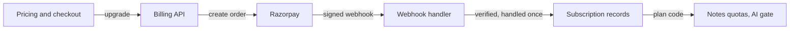

# ArthaCommerce Billing & Pro Plan

Date: 2026-10-08 · Status: plan, not built

## Goals and decisions

We add a Free and a Pro plan, sold in INR through Razorpay, so every limit and AI credit in the notes module comes from a real subscription. Today `plan_code_for()` always returns `free`, so a Pro row in admin changes nothing until this ships.

**Confirmed choices**

- Provider: Razorpay (UPI, cards, netbanking, RBI-compliant autopay mandates, GST invoices).
- Market: India only, prices in INR. The core stays provider-neutral so USD or Stripe can be added later without a rewrite.
- Products: Pro monthly, Pro yearly, and a one-time Exam pass (3 or 6 months, no auto-renewal).

**Goals**

- A student can see Free vs Pro, pay in under a minute, and have Pro limits apply immediately.
- Failed, late or duplicate payments never grant or remove access wrongly.
- Gemini cost per paying student stays well under what they pay.

**Non-goals for this release**

- Share links, offline PDF packs and the recall bridge stay parked.
- Team, school or coaching-institute plans.
- International pricing, Stripe, PayPal.
- Self-serve refunds (handled by support under the written policy).

## Free vs Pro

Free keeps the habit loop (highlights, notes, search, replace edition) fully open. Pro raises storage and file size, and adds a real AI allowance. You enter the Pro values in admin; these are the starting numbers.

| Limit (admin column) | Free | Pro |
| --- | --- | --- |
| Storage, MB (`max_storage_mb`) | 500 | 10000 |
| File size, MB (`max_file_mb`) | 50 | 200 |
| Pages per document (`max_pages`) | 1000 | 10000 |
| Documents (`max_documents`) | 100 | 1000 |
| Notes (`max_notes`) | 2000 | 20000 |
| Note characters (`max_note_chars`) | 100000 | 100000 |
| Note images (`max_note_images`) | 40 | 400 |
| Marks per document (`max_marks_per_document`) | 20000 | 20000 |
| Tags (`max_tags`) | 200 | 1000 |
| Local OCR pages per month (`ocr_pages_per_month`) | 300 | 3000 |
| AI OCR pages per month (`ai_ocr_pages_per_month`) | 10 | 150 |
| AI summaries per month (`ai_summaries_per_month`) | 3 | 30 |
| Exports per month (`exports_per_month`) | 10 | 100 |

Share links and offline documents are not enforced yet, so they stay as they are.

**Pro-only features (new gates, not just bigger numbers)**

- Resumable upload for files over 16 MiB (needs a new `resumable_upload` entitlement).
- Unlock for search on password-protected PDFs (new `unlock` entitlement, optional; decide before launch).
- Priority in the worker queue for AI jobs (optional, later).

**Where students meet the upgrade prompt**

1. Upload blocked by storage or file size: the strongest moment, shown with the exact numbers.
2. Third AI summary or tenth AI page used: shows credits left and the reset date.
3. Large file picked: resumable upload explained as Pro.
4. Settings, Usage page: a plain Free vs Pro card, never a pop-up on first load.

## Pricing and offers

Proposed launch prices are ₹199 a month, ₹1,499 a year and ₹449 for a 3-month Exam pass, all shown GST-inclusive. These are proposals to change; the AI allowance below is sized so a fully used Pro account still covers its own Gemini cost.

| Product | Billing | Price (incl. 18% GST) | Notes |
| --- | --- | --- | --- |
| Pro monthly | Auto-renews monthly (UPI/card autopay) | ₹199 | Cancel any time, access runs to period end |
| Pro yearly | Auto-renews yearly | ₹1,499 | About ₹125 a month, 37% below monthly |
| Exam pass, 3 months | One-time, no renewal | ₹449 | For students who avoid subscriptions |
| Exam pass, 6 months | One-time, no renewal | ₹799 | Optional second tier |

**Offers**

- No card-required free trial. The Free AI credits (3 summaries, 10 AI pages) are the trial, and they avoid mandate and refund complexity.
- One launch coupon code, percent-off the first period, stored in our own table and applied server-side (Razorpay offers can replace this later).
- Annual price is the default highlighted option on the pricing page.

**Cost check (assumptions, replace with measured numbers)**

At the current `GEMINI_PRICE_*` defaults (₹132 per million input tokens, ₹792 per million output tokens), the estimate is about ₹3 for a large document summary and about ₹0.5 for one AI-read page. Those token counts are assumptions; the `AiJob` ledger records real cost, so check it during the internal rollout before fixing prices.

| Case | Pro limits | Worst-case Gemini cost per month | Net price after GST |
| --- | --- | --- | --- |
| Monthly ₹199 | 30 summaries, 150 AI pages | about ₹165 | about ₹169 |
| Yearly ₹1,499 | same | about ₹165 | about ₹106 a month |

The yearly plan only works because most students use a fraction of their credits. Keep the daily budget cap (`NOTES_AI_DAILY_BUDGET_PAISE`) on, and review average usage after 30 days. Razorpay fees (about 2% plus GST) come off the net price too.

## Architecture

A new `modules/billing` app owns payments and subscriptions; the notes module only asks it "which plan is this student on?", so no payment code leaks into notes.

Razorpay's signed webhook is the only path that writes subscription records; the notes quotas read them through `plan_code_for`.

**Data model (new tables)**

| Table | Holds | Key rules |
| --- | --- | --- |
| `billing_plan` | Product catalogue: code, name, period, price in paise, Razorpay plan id, `quota_plan_code` | Links to the existing `QuotaPlan` row that holds the limits |
| `billing_subscription` | One row per student: status, plan, period start and end, cancel-at-period-end, Razorpay ids | One active row per student; status drives access |
| `billing_payment` | Every attempt: order id, payment id, amount, status, GST split | Unique payment id; amount must match the order |
| `billing_event` | Raw webhook events | Unique event id, so each is handled once |
| `billing_invoice` | Invoice number, GST breakdown, PDF location | Sequential numbering per financial year |
| `billing_coupon` | Code, percent, validity, redemptions | Applied server-side only |

**How the plan reaches the notes module**

`services.quota.plan_code_for(user_id)` (today a stub returning `free`) calls `billing.selectors.active_plan(user_id)`. That returns the paid plan's `quota_plan_code` only when the subscription is active or inside its grace period, and `free` in every other case, including errors. Quota limits, AI credits and the `ai_gate` then work unchanged.

**Razorpay integration**

- Monthly and yearly use Razorpay Subscriptions (mandate-based autopay). The Exam pass uses one-time Orders.
- We call Razorpay only from the API (server side), through one small client class behind a provider-neutral interface, so another provider can be added later.
- The API creates the order or subscription, the browser opens Razorpay Checkout, and our webhook handler is the only code that activates, renews, fails, cancels or refunds a plan.
- A scheduled job in the existing worker tick expires passes and grace periods, and reconciles with Razorpay once a day to catch missed webhooks.

## Web: pricing, checkout and account

Three new surfaces, built as routes → containers → presentational components in a new `modules/billing` folder, using only the design system, all four themes and WCAG 2.2 AA.

| Surface | Route | What it does |
| --- | --- | --- |
| Pricing page | `/pricing` (public, no login needed) | Free vs Pro table, monthly / yearly / Exam pass toggle, FAQ, a clear GST-inclusive price, link to terms and refund policy |
| Checkout | opens from the pricing page or an upgrade prompt | Creates an order on our API, opens Razorpay Checkout, then polls our API until the plan flips. The success screen waits for our confirmation, never trusts the browser callback alone |
| Billing page | `/settings/billing` | Current plan, renewal or expiry date, usage and credits left, payment method summary, invoices list, cancel or resume, change plan |
| Upgrade prompts | inside notes upload, AI summary, AI page, large file | One shared prompt component showing what is blocked, the numbers, and a single Upgrade button |

**Behaviour rules**

- Logged-out visitors can read the pricing page; pressing Upgrade sends them to sign in and returns them to checkout.
- Every price on screen comes from the API's plan catalogue, never hard-coded in the web app.
- Pending, failed and cancelled states each have their own message and a clear next step.
- The checkout script loads only on the checkout screen, with a content security policy entry for Razorpay's domains.
- Pages use keyboard-reachable controls, visible focus, and text that does not rely on colour alone (an accessible toggle for billing period).

## India compliance and operations

Confirm these with your accountant and counsel before launch; this is not legal or tax advice, and each item marked [VERIFY] needs a professional check.

- **GST:** Digital services to Indian consumers carry 18% GST. Prices shown inclusive; each payment produces a tax invoice with your GSTIN, SAC code, and the student's state. [VERIFY registration threshold and SAC code with your CA.]
- **Recurring payments:** RBI rules require a customer-approved e-mandate for card and UPI autopay, with a pre-debit notification and extra approval above the per-transaction limit. Razorpay Subscriptions handles this; we must show the next charge date and amount clearly. [VERIFY current limits in Razorpay's docs.]
- **Cancellation:** One click on the billing page. Access runs to the end of the paid period, then drops to Free. Nothing is deleted on downgrade.
- **Downgrade rule:** If a student is over Free limits after Pro ends, existing documents stay readable and exportable, but new uploads and AI are blocked until they are under the limit or renew. Never delete a student's data for non-payment.
- **Refunds:** A written policy (for example 7 days if no AI credits were used), handled by support through the Razorpay dashboard, with the plan revoked by webhook.
- **Legal pages:** Terms of service, privacy policy (adds payment data processed by Razorpay, no card numbers stored by us), refund and cancellation policy, and contact details. Razorpay requires these live on the site before activating live mode.
- **Dunning:** On a failed renewal, a short grace period (suggest 3 days) with email reminders, then downgrade.
- **Support:** A billing contact email, and an admin screen to look up a student's plan, payments and webhook events.

## Security, fail-closed rules and testing

Payment state is only ever changed by a verified server-side event, and any doubt means the student keeps the plan they already had.

- **Webhook signature:** every Razorpay webhook is verified with the webhook secret before anything is read; unsigned or invalid calls get a 400 and are logged.
- **Idempotency:** each event id is stored once (unique key); a replayed or out-of-order event cannot grant twice or revoke a newer subscription.
- **Amounts come from our catalogue:** the order amount is set on the server from the plan row; the browser sends only a plan code. The verified payment amount must equal the order amount.
- **Fail closed:** if billing is down or a subscription row is missing or inconsistent, the student gets Free limits, never unlimited. A paid plan cannot be assumed from a client claim.
- **Flag and kill switch:** a PostHog flag `billing` hides the pricing and checkout surfaces; a setting `BILLING_ENABLED` makes the API refuse new orders. Existing Pro students keep access if either is off.
- **Secrets:** `RAZORPAY_KEY_ID`, `RAZORPAY_KEY_SECRET` and `RAZORPAY_WEBHOOK_SECRET` live only in Vercel and Fly secrets; test and live keys are separate and never share a deployment. Sentry scrubbing covers payment fields.
- **No card data:** card, UPI and bank details are entered in Razorpay's checkout and never touch our servers.
- **Rate limits:** throttled order creation and verify endpoints per student.

**Tests and observability**

- Unit tests for plan resolution, grace and downgrade rules, GST and invoice maths.
- Integration tests that replay recorded Razorpay webhook payloads: success, failure, duplicate, out of order, late renewal, cancellation, refund.
- An end-to-end run using Razorpay test mode and test cards/UPI, plus the existing quota tests proving a Pro student gets Pro limits.
- Metrics and alerts: webhook failures, orders created but unpaid, plan-sync mismatches between Razorpay and our table, and daily AI spend per plan.

## Delivery phases and your to-do list

Six phases, each ending with tests passing and nothing committed until you ask. Money never moves before phase B-2 is verified in test mode.

1. **B-1 Foundation:** `modules/billing` with plan catalogue, subscription, payment, webhook-event, invoice and coupon tables; `plan_code_for()` reads the active subscription and falls back to `free`; admin screen to grant a plan by hand (lets you test Pro on yourself). *Exit:* quotas follow the plan, fail-closed tests pass.
2. **B-2 Razorpay core:** create order and subscription endpoints, verified webhooks, idempotent event handling, cancel and resume, test-mode end-to-end. *Exit:* a test payment upgrades the student; a replayed webhook changes nothing.
3. **B-3 Web:** pricing page, checkout, billing page, shared upgrade prompt, all four themes and AA checks. *Exit:* the full flow works in test mode in the browser.
4. **B-4 Compliance and email:** GST invoices, legal pages, receipt and renewal emails, dunning and grace, refund handling from admin. *Exit:* your accountant signs off on the invoice.
5. **B-5 Pro entitlements:** gate resumable upload and unlock behind Pro, wire quota errors into the upgrade prompt. *Exit:* Free sees the prompt, Pro sees the feature.
6. **B-6 Launch:** live keys, `billing` flag at 0%, then you only, then 5%, 25%, 100%, with docs and a rollback note. *Exit:* first real payment reconciled with Razorpay's report.

**For you to do (in this order)**

- [ ] Create a Razorpay account and start business KYC (it can take days; test keys work meanwhile).
- [ ] Confirm GST registration and give me the GSTIN and SAC code from your CA.
- [ ] Approve or change the prices and Pro limits in this doc.
- [ ] Create the `pro` plan row in admin once B-1 is built (exact values will be given).
- [ ] Provide or approve text for terms, privacy, refund and cancellation pages (counsel review).
- [ ] Create the PostHog flag `billing` at 0%.
- [ ] Add Razorpay test keys and webhook secret to Vercel and Fly when asked.
- [ ] Decide whether Unlock for search is Pro-only.
