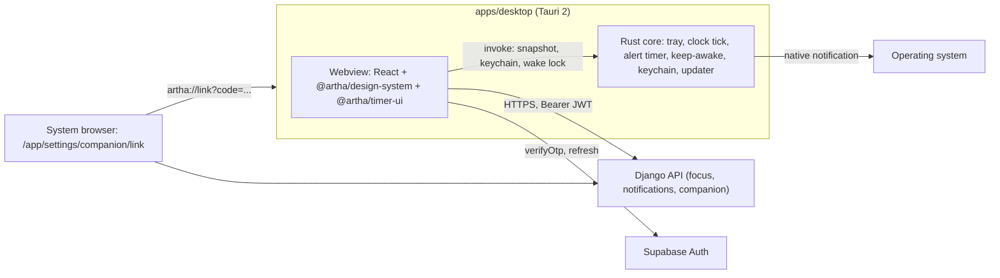

# X-01 Phase 5: desktop companion (Tauri 2), build document

Status: **DRAFT, waiting for owner approval. No code is written until this document is approved.**
Companion to `docs/X-01-ROLLOUT.md` (section 7 is the stub this replaces), PRD B "The desktop companion (tier 3)" and PRD C (FR-K8) in `docs/product/prd/X-01-notifications-floating-timer-stay-awake.md`, and `docs/product/prd/X-01.1-push-notifications.md` (gates, device list, shared `tag`). Same style as `X-01-ROLLOUT.md`: phases and waves with exact steps. Work happens on `main`; each wave is one change set that the owner commits and pushes (the suggested message is in the wave's report).

## 0. Gate G4 result (recorded 2026-10-07)

| Item | Owner answer (2026-10-07) | Exact figure to paste |
| --- | --- | --- |
| PostHog insight "G4 floating timer reach" | 25% or more | `<fill in: value and the cohort size>` |
| Date `floating_timer` reached 100% | More than four weeks ago | `<fill in: date>` |
| Feedback asking for "works when my browser is closed" or system-wide keep awake | Several clear requests | `<fill in: count and sources>` |
| Owner override needed | No, the gate is met on the numbers above | |

The exact figures were not given in the session, only the bands. Paste them into the three cells above before the document is approved, so the record is complete. Gate G4 is met; Phase 5 may start once this document is approved.

## 1. Scope

**In scope (PRD B tier 3, FR-C10 and FR-C11, FR-K8):** a Tauri 2 app in `apps/desktop` that shows the server timer in the macOS menu bar or the Windows and Linux tray, a small mini window that floats over every app, native round-end alerts, optional start at login (off by default), and a system-wide keep-awake while a timer runs. It works with every browser closed. It signs in through the system browser (PKCE), keeps the refresh token in the OS keychain, registers as a device (`kind = desktop_app`) and appears in the device list with Remove. Web surface: `/app/settings/companion`. Flag: `desktop_companion`.

**Not in scope (stay out unless approved later):** an offline write queue (the companion needs a connection; it says so), a notes or syllabus screen, mobile apps, a public download page (the PRD says "a public page can follow later"), auto capture of study time, any timer rule of its own. **The companion adds no timer logic.** It calls the same API actions with `version`, draws from `started_at`, `planned_seconds`, `paused_total_seconds` and the server clock offset, and applies the same presence rule as the pop-out.

## 2. Decisions

### 2.1 Taken by the owner in this session (2026-10-07)

| # | Question | Decision |
| --- | --- | --- |
| P5-D1 | Who shows the round-end alert when the companion runs? | **Companion wins.** While an alerts-ready companion is online (pinged in the last 50 s), the API skips Web Push to desktop browsers (Windows, macOS, Linux) for timer events, and the web windows on that student's account skip their chime and local alert. The companion shows one native alert. Phones keep receiving push |
| P5-D2 | How does the companion sign in? | **API link code with PKCE.** The system browser opens our web page; after the student signs in there (any method), the API issues a one-time code bound to the app's PKCE challenge; the app exchanges it for its own Supabase session. Section 4 |
| P5-D3 | How does the desktop app reuse the web timer views and math? | **Extract to a package** (`packages/timer-ui`, `@artha/timer-ui`) in a no-behaviour-change wave (W5.1). Web and desktop both import it |
| P5-D4 | Where are installers and the signed update manifest hosted? | **Supabase Storage public bucket** `companion-releases`. The updater endpoint is a stable site URL that rewrites to it (section 11), so a later move to R2 or GitHub does not break installed apps |
| P5-D5 | Platforms in the first public release | **macOS and Windows first, Linux last** (its own wave W5.8, with its own matrix rows) |
| P5-D6 | Windows signing | **A cloud signing service** (Azure Artifact Signing, formerly Trusted Signing, or an equivalent). Eligibility for an Indian business must be confirmed with the provider before buying (section 10) |
| P5-D7 | Keep-awake implementation | **Our own thin Rust command** wrapping a maintained cross-platform crate, chosen in spike S5.4 |
| P5-D8 | App identifier | **`com.meetpawan.arthacommerce`** (baked into keychain entries, the OS app registration and the update path; do not change after the first release) |

### 2.2 Defaults I chose (approving the document approves them; tell me which to change)

| # | Question | Default and why |
| --- | --- | --- |
| P5-D9 | Presence while only the companion is open | Same rule as the pop-out (FR-C13): a running timer with the companion online counts as present until the target; after the target one tap (mini window, tray menu item or global shortcut) within two minutes keeps overtime going. Without this, a student reading a PDF with only the menu bar would have every round end as "away" |
| P5-D10 | Offline behaviour | No write queue. Offline, the tray shows "Offline" and the controls are disabled; the clock keeps counting from the last server timestamps. The web app's IndexedDB queue is not reused |
| P5-D11 | Menu-bar and Dock | macOS runs as a menu-bar app (no Dock icon, activation policy "accessory"). Windows and Linux hide the mini window from the taskbar; the tray menu and a global shortcut are the keyboard path back to it |
| P5-D12 | Minimum version | The ping answers `min_version`. A companion below it shows one blocking screen, "Update to keep going", with the update button. It is the kill switch for a bad release |
| P5-D13 | Update cadence | Check at launch and every 6 hours, download in the background, install on the student's click ("Restart to update") or on the next quit. Windows install mode `passive` |
| P5-D14 | Theme | The four themes from `@artha/design-system`, stored locally in the app (default Reading), with System following the time-of-day rule. `[VERIFY in W5.1: where the web stores the theme; if it is on the account, the companion reads it]` |
| P5-D15 | Telemetry | PostHog events `companion_*` through `https://<site>/ingest` (the existing proxy), `display_mode = app`. Crash reports: Sentry in the webview only in the first release; native crash reporting is a backlog item |

## 3. Architecture and package layout



**Who owns what.** The webview owns every network call and the session (one TypeScript API client, the same endpoints and `version` rules as the web). Rust owns the things a hidden webview cannot do reliably: the one-second tray tick, the alert timer that fires at the round end, the wake lock, the keychain, the updater and the window and tray objects. The webview pushes a small **snapshot** to Rust after every successful read or action (`{ kind, ends_at_ms, server_offset_ms, running, version, client_id, label, alerts_on, keep_awake_on }`); Rust only counts down from it. Whether a hidden webview keeps polling on schedule (App Nap on macOS, WebView2 throttling on Windows) is spike S5.6; the fallback is described there.

### 3.1 Repository changes

```
apps/desktop/                      new, workspace package @artha/desktop (private)
  package.json  vite.config.ts  tsconfig.json  index.html
  src/
    main.tsx  routes (tiny hash router: mini, settings, signin, update)
    modules/
      session/       link flow, PKCE, keychain adapter, device registration, ping      (index.ts barrel)
      timer/         container: poll, actions, snapshot to Rust, presence             (index.ts barrel)
      mini/          mini window container (pill and card from @artha/timer-ui)
      settings/      start at login, keep awake, shortcut, theme, sign out, version
      updates/       updater container and the blocking min-version screen
    lib/             env.ts (zod), api.ts, tauri.ts (typed invoke wrappers)
  src-tauri/
    Cargo.toml  tauri.conf.json  build.rs  icons/  capabilities/
    src/
      main.rs  lib.rs
      tray.rs        tray icon, title, tooltip, menu per state (pure `tray_model` + thin glue)
      mirror.rs      timer mirror: snapshot, one-second tick, due-alert detection (pure, tested)
      alerts.rs      native notification and chime request
      awake.rs       wake-lock guard (acquire, release, 4 h cap) over the chosen crate
      keychain.rs    get, set, delete refresh token and install id (keyring crate)
      shortcut.rs    global shortcut register and conflict handling
      windows.rs     mini window create, position memory, always on top, size toggle
packages/timer-ui/                 new, @artha/timer-ui (W5.1)
  src/ lib (timer-math, popout view model, cross-window key helpers, alert copy, types)
       components (MiniTimerView, TimerRing, CycleDots)  index.ts
apps/api/modules/companion/        new (W5.2): link, token, status, releases
apps/api/modules/notifications/    extended: desktop_app registration, ping, offline, suppression rule
apps/web/src/modules/companion/    new (W5.3): settings page, link page, useCompanionActive
docs/X-01-P5-DESKTOP-COMPANION.md  this file
.github/workflows/ci.yml           + desktop job; .github/workflows/desktop-release.yml  new
```

**Rules applied.** Modular (every desktop feature is a folder with a barrel; other folders import only the barrel). Views, services, selectors on the API as everywhere. Design system only (no raw hex, semantic tokens, Lucide icons from `@artha/design-system`; tray and app icons are image files, not UI icons, and live in `src-tauri/icons`). `apps/desktop` never imports from `apps/web`; shared code goes through `@artha/timer-ui` or `@artha/design-system`. `CLAUDE.md`'s repo map and rule 3 get one line each for `packages/timer-ui` and `apps/desktop` in W5.1 and W5.4 (a feature-level shared package is an extension of "shared UI goes in the design system", flagged here for the approval).

### 3.2 What moves into `@artha/timer-ui` (W5.1)

From `apps/web/src/modules/focus`: `lib/timer-math.ts`, `lib/popout.ts` (the view model for every state), `lib/presets.ts` constants it needs, `lib/types.ts` (timer types), the claim-key helpers of `lib/cross-window.ts`, the alert copy of `lib/alerts.ts`, and `components/MiniTimerView.tsx`, `TimerRing.tsx`, `CycleDots.tsx`. `popout.ts` imports `formatClock` and `spokenDuration` from the tracker module: those two pure formatters move into the package too, and the tracker re-exports them from its barrel so nothing else changes. The web `focus` module then imports from `@artha/timer-ui`. Tests move with the files. **No behaviour change**: the existing web tests pass unchanged and `popout` snapshots do not differ.

## 4. Sign-in and token flow (P5-D2)

Goal: system browser, PKCE, any login method, a separate Supabase session per device, refresh token only in the OS keychain.

1. The app creates `install_id` (random UUID v4, kept in the keychain, never logged), a PKCE `verifier` (43 to 128 URL-safe random characters), `challenge = base64url(sha256(verifier))` and a random `state` (128 bits). They live in memory (verifier, state) for at most 10 minutes.
2. It opens, with the system opener plugin, `https://<site>/app/settings/companion/link?challenge=<c>&state=<s>&platform=<macos|windows|linux>`. The route is private (`noindex`) and goes through the normal sign-in (password, magic link, OTP or Google) and back.
3. The page shows "Connect this computer to Artha?" with the platform, a **four-digit match code** derived from `state` (the app shows the same digits), and Connect and Cancel. The explicit click and the match code stop a crafted link from linking someone else's app to a signed-in student's account.
4. Connect calls `POST /api/v1/companion/link/` (student auth, scope `companion_link`, 10 an hour): the API stores `sha256(code)`, the `challenge`, the user id and a 60 second expiry in `companion_linkcode` and returns a one-time `code`. The page then navigates to `artha://link?code=<code>&state=<state>`.
5. The OS hands the URL to the app (deep-link plugin; on Windows and Linux through the single-instance plugin's deep-link feature). The app checks `state`, then calls `POST /api/v1/companion/token/` with `{ code, verifier, install_id }` (no student auth; the code and verifier are the credential; scope `companion_token`, 20 an hour per address). The API checks expiry, the unused flag, and `base64url(sha256(verifier)) == challenge` (constant-time), marks the code used in the same transaction, looks up the user's email through the Auth Admin API, calls the Admin `generate_link` (type `magiclink`, no email is sent) with the service-role key, and returns `{ token_hash, type }` only. The service-role key never leaves the API.
6. The app calls `supabase.auth.verifyOtp({ token_hash, type })`, exactly what `/auth/confirm` does on the web. It receives its own session. `[VERIFY in S5.7: the accepted type string, "magiclink" or "email", and that no email is sent]`.
7. The refresh token goes to the keychain (`keychain.rs`, service `com.meetpawan.arthacommerce`, account `refresh_token`). The access token stays in memory only. Windows Credential Manager limits a credential to about 2.5 KB, so we store the refresh token alone, not the whole session JSON. `[VERIFY in S5.3]`
8. At launch the app reads the refresh token, calls `refreshSession`, and on failure shows the sign-in screen. supabase-js uses a custom `storage` adapter (in memory plus the keychain for the refresh token), `autoRefreshToken: true`, `persistSession` through that adapter, `detectSessionInUrl: false`.
9. The app then registers the device (section 5) and starts the 20 second ping. **Sign out** (tray menu or the web "Remove") clears the keychain entry and the in-memory session and calls `DELETE devices/{id}/`.

**What this does not do:** removing a companion signs the app out within about 20 seconds (its next ping answers `revoked`), but it does not invalidate a refresh token someone copied off the machine. The account's existing "sign out of other sessions" in Supabase covers that; the settings page links to the account page for it. Also, the freshly minted session carries an `otp` entry in `amr`, so `recent_authentication` treats it as a recent sign-in for 10 minutes. The companion has no account actions (change email, delete), so nothing in it can use that, and the student has just authenticated on the web.

New API pieces: `core/auth_admin.py` gains `generate_link(email)` and `get_user_email(user_id)` (same pattern as `delete_user`: service-role headers, timeouts, `AuthAdminError`); `companion` module with `models.LinkCode` (`id`, `user_id`, `code_hash` unique, `challenge`, `expires_at`, `used_at`; rows older than a day are deleted on every issue; RLS comes from `enable_rls_everywhere`, extend `core/tests/test_row_level_security.py`).

## 5. Device registration and the device list

**Registration (`POST notifications/devices/`).** Today the serializer requires a Web Push `subscription`. W5.2 makes the body a tagged union: `kind = web_push` (unchanged) or `kind = desktop_app` with `{ install_id, platform, app_version, display_mode: "app", alerts_ready }`. For `desktop_app` there is no endpoint: the row is keyed by `endpoint_hash = hmac_hex("desktop:" + install_id)` (reuses the existing unique column, no schema change for identity), `kind = desktop_app`, `browser = other`, `display_mode = app`, `app_version` set (the column exists, 20 characters). Idempotent on the hash; a revoked row is reused; the 10-active-device limit applies; a different student presenting the same `install_id` takes the row over (the install id is the secret, 122 random bits held only in that machine's keychain). The label is derived on the server from closed sets: "Artha app on Mac" or "Artha app on Windows" (a kind-aware branch in `derive_label`; never free text).

**Ping.** `POST notifications/devices/{id}/seen/` every 20 seconds with `{ app_version, alerts_ready, state: "active" | "quitting" }`; scope `notifications_companion` (12 a minute). It updates `last_seen_at`, a new boolean column `alerts_ready` (additive migration in `notifications`, default false) and answers `{ status: "active" | "revoked" | "disabled", min_version, latest_version }`. `revoked` means the student pressed Remove: the app wipes the keychain and returns to the sign-in screen (the "within one minute" of FR-C11 holds with a 20 second ping). `disabled` means the `desktop_companion` flag is off for this student: the app stops showing alerts and says "Paused by Artha"; because the suppression rule in section 7 also checks the flag, push resumes at once. `quitting` (sent on a clean quit) makes the suppression stop immediately instead of after 50 seconds.

**Device list.** `GET devices/` already lists every active device; W5.2 adds `kind` and `app_version` to `PUBLIC_FIELDS` and the serializer, and the settings and companion pages show "Artha app on Mac, version 0.1.0, last seen 2 minutes ago, Remove". `POST devices/{id}/test/` for a `desktop_app` device answers "Test it from the app" (no push is possible) and the app has a "Send test alert" button that shows a local native alert.

**Selectors.** `active_push_devices` keeps `kind = web_push` only. A new selector `active_companion(user_id, now)` returns the freshest `desktop_app` device that is not revoked, has `alerts_ready = true` and `last_seen_at >= now - 50 s`. Only the `companion` and `notifications` modules use it, through the `notifications` public selectors.

## 6. Tray and mini window behaviour per timer state

Both surfaces render the same view model as the pop-out (`popoutView` in `@artha/timer-ui`), so the controls per state are exactly the PRD B table ("Behaviour per timer state"), with the same `useFocusTimer`-equivalent actions carrying `version`. The pill is 320 x 156 and the card is 320 x 300, the same sizes and the same size memory (`popout_size` on the account; the companion reads and writes it through the existing focus settings endpoint).

| Timer state | macOS menu-bar title | Windows and Linux tooltip and icon state | Tray menu (first items) | Mini window (pill / card) |
| --- | --- | --- | --- | --- |
| Focus running, before the target | `24:12 Focus` | "Focus 24:12 left", running icon | Pause, +5 (n left, hidden when `can_extend` is false), Show timer | As PRD B: clock and Pause / ring, subject, Pause, +5, End |
| Focus in overtime | `+00:05 Done` | "Round done +00:05", phase-end icon | Start break (Stop and save), Pause | "+mm:ss" and Start break / Target reached, Start break, Pause. No +5, no End |
| Focus paused | `24:12 Paused` | "Paused 24:12", paused icon | Resume, End | Clock and Resume / Resume, End |
| Away (round ended unseen) | `Count it?` | "Did you study through it?", attention icon | Yes, count it, No | "Count it?" Yes, No / the full question |
| Break running | `04:30 Break` | "Break 04:30 left", break icon | Skip break | Clock and Skip break / ring, Short or Long break, Skip break |
| Phase closed, next step waits | `Round done` | "Round done", phase-end icon | Start break or Start round N | One large button |
| Nothing running, nothing due | no title, icon only | "Artha: no timer running", idle icon | Open Artha in browser, Show timer | "No timer running", Back to Artha (opens the browser) |
| Stopwatch running or paused | `01:12:03 Study` or `Paused` | "Study 01:12:03", running or paused icon | Pause or Resume | Elapsed, subject, Pause or Resume |

**Always in the tray menu, below the state items:** Show timer (focus or create the mini window), Open Artha in browser, Start at login (checkbox, off by default), Keep screen on (checkbox, mirrors the account setting), Pop-out size (Pill or Card), Check for updates, Sign out, Quit. Destructive End asks for confirmation in the mini window, never from the menu (same inline "Save and end" or "Discard" as the card; rounds under a minute show only "End"). **Start round N** reuses the subject and chapter of the last round the companion saw; with none it shows "Open Artha in browser" instead, because a round needs a subject and chapter.

**Mini window.** Always on top, visible on all workspaces (and over full-screen apps where the OS allows, spike S5.5), no taskbar button (P5-D11), position remembered per display (window-state plugin), accessible name "Artha timer", themed by the four themes, 40 px minimum targets, visible focus ring, polite announcements once per phase end, reduced motion respected. Closing it only hides it; the timer never stops. A global shortcut (default `CmdOrCtrl+Shift+Space`, changeable in settings, conflicts reported plainly) pauses or resumes; a second shortcut is not added. Keyboard path back to the window with no mouse: the shortcut focuses the window when no timer runs, and the tray menu is reachable from the keyboard on each OS (macOS menu-bar focus, Windows Win+B, Linux per desktop).

**Linux notes.** The tray needs an AppIndicator host; GNOME needs an extension. The menu-bar title is a macOS feature, so Linux shows the tooltip and icon only, and the document says so in the settings page. `[VERIFY in W5.8]`

## 7. Notifications and alert dedupe (P5-D1)

**What cannot be merged.** The shared `tag` (`timer:<client_id>`) replaces an earlier alert only inside one application: Chrome's push and the companion's native notification are two applications, so the OS will show both. The web windows' `localStorage` claim (`artha:alerted:<client_id>:<version>`) is per browser profile and cannot be read by another process. So the rule is explicit and server-visible:

1. **Companion online and alerts-ready (pinged within 50 s, flag on).**
   - **API:** the dispatcher, for `timer_end` and `break_over` (and `stopwatch_long`), skips every `web_push` device whose `platform` is `windows`, `macos` or `linux`, recording the delivery as suppressed with a new reason `companion_active` (extends `SuppressReason` and its check constraint through one migration). Android and iOS devices still get the push, and so does everything else (digests, nudges, content) because the companion shows timer alerts only.
   - **Web windows:** `useCompanionActive` (in the `companion` barrel) polls `GET companion/status/` every 30 seconds while a timer runs; when it is true, `useFocusAlerts` skips the chime and the local browser notification in every web window (tab, pop-out, mini fallback) and only draws the end state. The `localStorage` claim among web windows is unchanged.
   - **Companion:** one native notification and one chime at the round end, with the same copy as the push (`alert copy` from `@artha/timer-ui`), `tag` and the same claim key format in its own store, so a duplicate inside the companion is impossible.
2. **Companion offline, quitting, not alerts-ready, or flag off.** Everything is as P2 to P4: push and web windows alert as today. `alerts_ready` is false when the OS refuses notifications for the app; then the companion shows a calm banner "Alerts are off for this app" with the OS settings steps, and push is not suppressed.
3. **Worst case.** The companion dies in the 50 seconds before a round end: that alert is suppressed and lost on desktop browsers (the student still sees the end state on return, and phones still get push). We accept it; the ping is 20 seconds and freshness 50 seconds to keep the window short. `quitting` closes the gap for a clean exit.

**Native notification details (spike S5.9).** The notification plugin is used for the round end and for the "Count it?" away prompt (with Yes and No actions where the OS supports buttons; otherwise it opens the mini window). Whether the desktop plugin supports a replace-by-tag or id, whether macOS shows notifications from a dev build (it needs the bundled, signed app), and Focus or Do Not Disturb behaviour are checked in the spike. Quiet hours: the companion honours the student's quiet hours and master switch from `GET notifications/settings/` for the native alert, like the push does. `[VERIFY in S5.9]`

**Tests for the rule (W5.6).** API: the suppression matrix (companion fresh or stale, `alerts_ready` true or false, flag on or off, device platform, event kind) and that a `companion_active` delivery is recorded as suppressed, not failed. Web: with `companion_active` true, a phase end plays no chime and shows no local notification, with false it is unchanged. Desktop: `mirror` fires exactly one alert per `(client_id, version)` across a restart of the tick.

## 8. Keep awake (FR-K8, P5-D7)

`awake.rs` holds an OS wake lock while a focus round (and breaks only when `keep_awake_in_breaks` is on) or the stopwatch runs, and `keep_awake` is on (the existing account setting, default on). It releases on pause, end, skip, round end, quit, sign-out and by a four-hour cap per hold, and the OS releases it if the process dies. The guard is a pure state machine (`acquire`, `release`, `expired`) over a one-method trait, so the tests need no OS.

**Implementation choice.** A Tauri command in our own crate that wraps a maintained cross-platform power-assertion crate (the `keepawake` and `nosleep` crates both offer this; the community Tauri plugins `tauri-plugin-nosleep` and its fork wrap the latter). I could not confirm either plugin's Tauri 2 support, maintenance or licence from their pages, and crates.io did not resolve for `keepawake` in my check, so **spike S5.4 decides the crate** (criteria: MIT or Apache-2.0, a release in the last 12 months, macOS `IOPMAssertion`, Windows execution state, Linux logind or D-Bus inhibit, display kept on, released when the process is killed). If neither passes, the fallback is calling the OS APIs directly (`IOKit` on macOS, `SetThreadExecutionState` on Windows, `org.freedesktop.login1` Inhibit on Linux) in about 150 lines per OS, which we would then own. No JavaScript plugin is added: the web already has its own wake lock and the webview's `navigator.wakeLock` is not used in the companion.

## 9. Waves (one change set each)

| Wave | Scope | Days | Risk |
| --- | --- | --- | --- |
| W5.0 | Prerequisites and spikes S5.1 to S5.9, results in `docs/X-01-spike-results.md` ("P5") | 3 | Finds blockers before code |
| W5.1 | `packages/timer-ui` extraction, web switched over, no behaviour change | 2 | Low (existing tests are the proof) |
| W5.2 | API: `desktop_app` registration, ping, `alerts_ready`, `companion` module (link, token, status, releases), flag, suppression rule and reason | 4.5 | Medium (auth-adjacent, service key) |
| W5.3 | Web: `/app/settings/companion`, `/app/settings/companion/link`, device-list kind and version, `useCompanionActive` | 2.5 | Low |
| W5.4 | Desktop shell: scaffold, single instance, deep link, session and keychain, device registration, ping, sign-out, CI `desktop` job (unsigned builds) | 5 | High (first Rust, deep links per OS) |
| W5.5 | Timer: poll, actions, snapshot, `mirror`, tray title and menu per state, mini window (pill and card), global shortcut | 6 | High (hidden-webview throttling) |
| W5.6 | Native alerts, away prompt, keep awake, start at login, dedupe rule end to end | 4 | Medium |
| W5.7 | Signing, notarization, release workflow, updater, hosting, `min_version`, installers on the settings page | 4 | High (accounts and secrets) |
| W5.8 | Linux build, tray and AppImage specifics, matrix rows | 3 | Medium |
| W5.9 | Analytics and insight, full device matrix, sign-off, rollout ladder | 2 | Low |

About 36 working days (7 to 8 weeks for one engineer). W5.7 can start in parallel with W5.5 because it depends on accounts, not on features. The flag stays "team only" until the W5.9 matrix is signed off.

### W5.0 Prerequisites and spikes

Goal: answer the questions that can sink the build, before feature code. A throwaway Tauri project outside the repo (a temp folder, not committed). Results in a new "P5 spikes" section of `docs/X-01-spike-results.md` with OS, version, pass or fail per row.

| Spike | Question | Pass when | If it fails |
| --- | --- | --- | --- |
| S5.1 Scaffold | Does `pnpm create tauri-app` plus `pnpm tauri dev` and `pnpm tauri build` run on this Mac, and in a Windows VM or machine? | App window opens; unsigned bundle built on both | Fix toolchain before anything else |
| S5.2 Deep link | Does `artha://link?code=x&state=y` reach a running app and a cold start, on macOS (installed bundle in `/Applications`), Windows (cold start via single-instance), with a Chrome and a Safari or Edge confirm dialog? | The URL arrives in the webview in all four cases | Switch to a loopback `http://127.0.0.1:<port>` redirect with the same code flow (the web page redirects there instead) |
| S5.3 Keychain | Does the `keyring` crate store, read and delete a 1 KB value on macOS Keychain, Windows Credential Manager and a Linux Secret Service? What is the largest value that works? | Round trip passes; limit recorded (Windows is about 2.5 KB) | Keep the refresh token only; if still too big, encrypt it with a key from the keychain and store the blob in the app data folder |
| S5.4 Keep awake | Which crate passes the criteria in section 8, and does the display stay on for 10 minutes with the app in the background and the lock freed when the process is killed (`kill -9`)? | Display on, lock freed within seconds of kill | Own OS calls (section 8) |
| S5.5 Floating window | Does an always-on-top, all-workspaces window show over a full-screen app on macOS and over a full-screen video on Windows? Does it take focus from the PDF when clicked? | Visible over full-screen on both; clicking does not steal typing focus unless chosen | Document the limit ("not over full-screen apps on macOS") and offer the tray title as the answer |
| S5.6 Hidden webview | With the main window hidden for 30 minutes, does the webview's `setInterval` poll every 15 s and does a Rust tick stay within 1 s, on macOS (App Nap) and Windows (WebView2)? | Poll gaps under 25 s, tick drift under 1 s | Move the 15 s poll and token refresh into Rust (`reqwest`), keeping the same endpoints, or disable background throttling for the window if the version supports it |
| S5.7 Token handoff | Does Admin `generate_link` (magiclink) plus `verifyOtp({ token_hash, type })` from a non-browser client return a session, send no email, and work for a Google-only user? | Session returned, no email, all three login types | Re-open P5-D2 with the owner (fallback: in-app email code) |
| S5.8 Hosting and updater | Does the Tauri updater read a signed `latest.json` through the site rewrite, download an installer from the public bucket (right content types, redirects) and update a 0.0.1 build to 0.0.2 on macOS and Windows? | Update applies; signature failure is refused when the file is tampered | Host on R2 or GitHub Releases (the rewrite makes this a config change) |
| S5.9 Native alerts | Does the notification plugin show alerts from a bundled build with action buttons or a replace-by-id, and how do macOS Focus and Windows Focus assist treat them? | Alert shows; behaviour recorded | Alert opens the mini window instead of buttons |

**Owner arrangements for W5.0** (also listed in section 13): Xcode tools, Rust, a Windows test machine or VM, the PostHog flag at 0%, the Supabase bucket.

### W5.1 `packages/timer-ui` (web only, no behaviour change)

Create the package (`package.json` with `typecheck` and `test` scripts so `pnpm check` runs them, `tsconfig`, Vitest, barrel `index.ts`), move the files in section 3.2, point `apps/web` imports at `@artha/timer-ui`, re-export `formatClock` and `spokenDuration` from the tracker barrel, update `pnpm-workspace` (already `packages/*`), and add the package to the web `package.json` as `workspace:*`. Check the theme storage question (P5-D14) while here. **Tests:** every moved test passes unchanged; `pnpm --filter @artha/web exec vitest run src/modules/focus src/modules/tracker` and `pnpm check`. **Real-device check:** the pop-out and the fallback window on Chrome behave as before (spot check). **Roll back:** revert the change set; no data or flag involved.

### W5.2 API

- `notifications`: tagged-union `DeviceRegisterSerializer`; `services/devices.register_companion` (idempotent on `endpoint_hash`, limit, takeover); `POST devices/{id}/seen/` (`DeviceSeenView`, scope `notifications_companion`); `Device.alerts_ready` and `SuppressReason.COMPANION_ACTIVE` (one additive migration; also extend the constraint test); `selectors.active_companion`; kind-aware `derive_label`; `kind` and `app_version` in the device list; the dispatcher skips desktop-browser web push for timer events when `active_companion` is set (`domain/policy.py` stays pure: the dispatcher passes a `companion_active` fact in `PolicyInput`).
- `companion` (new module, layers as everywhere): `models.LinkCode`; `services.issue_link_code`, `services.exchange_code`; `selectors.status`, `selectors.latest_release`; views `LinkView`, `TokenView`, `StatusView`, `ReleasesView`; `urls.py` under `companion/`; flag `desktop_companion` in `flags.py` (strict: PostHog unreachable means off, because these endpoints mint sessions); throttles `companion_link` 10/hour, `companion_token` 20/hour, `notifications_companion` 12/min added to `DEFAULT_THROTTLE_RATES`.
- `core/auth_admin.py`: `generate_link`, `get_user_email`.
- Erasure and export: `companion_linkcode` rows are erased with the account (registry); the device row is already covered by the notifications eraser and exporter.

| Method and path | Auth | Purpose |
| --- | --- | --- |
| POST `notifications/devices/` | student | Register (`kind = desktop_app`) |
| POST `notifications/devices/{id}/seen/` | student | Ping, returns `status`, `min_version`, `latest_version` |
| GET `companion/status/` | student | `{ enabled, active, device_count }` for the web |
| GET `companion/releases/` | student | Latest version and installer links per platform (from `releases.json`, cached 5 minutes) |
| POST `companion/link/` | student | Issue a one-time code for a PKCE challenge |
| POST `companion/token/` | code and verifier | Exchange for a token hash |

**Tests (pytest):** every endpoint (serializer 400s, ownership, 404 for another student's device, idempotent registration, takeover by the same `install_id`, the 10-device limit, ping on a revoked device answers `revoked`); PKCE (wrong verifier, expired, reused, wrong challenge length, constant-time compare, a different student cannot use another's code); `generate_link` through a mocked `httpx`; the flag off answers 403 `feature_disabled`; the suppression matrix of section 7; RLS test for the new table; `makemigrations --check`. `cd apps/api && pytest && ruff check . && ruff format --check .`.

**Configure:** nothing new for students. Create PostHog flag `desktop_companion` at 0% before this merges. Supabase: add `artha://` is not a redirect URL here (the web page redirects, the browser opens the app), so `supabase/config.toml` needs no change; the link page lives on the existing site origin.

### W5.3 Web

- Routes (thin): `app.settings.companion.tsx` and `app.settings.companion.link.tsx`, both `noindex`, behind the sign-in. `settings` index gets a "Desktop app" entry.
- Module `apps/web/src/modules/companion` with a barrel: `CompanionSettingsContainer` (detects the OS with `notifications`' `platform.ts` through its barrel, shows the download button for it and a short list for the others, the status "Connected, Artha app on Mac, version 0.1.0, last seen 2 minutes ago" with Remove, an "Update available" line, "Sign out other sessions" link, the Linux and macOS notes), `CompanionLinkContainer` (match code, Connect, Cancel, success and error states), `useCompanionStatus`, `useCompanionActive`.
- Download links read `GET companion/releases/` (installer URLs point at the bucket). Unsupported OS (phone, ChromeOS): "The desktop app is for Windows, macOS and Linux computers."
- States every screen handles: loading, error with retry, flag off (403 `feature_disabled`: "Not available yet"), empty (no companion yet), connected, revoked just now.
- PostHog: `companion_page_viewed`, `companion_download_clicked` (`platform`), `companion_link_confirmed`, `companion_device_removed`.
- **UI quality:** all four themes, WCAG 2.2 AA, 320 to 1280 px, keyboard, icons only from `@artha/design-system`, no raw hex (`.claude/skills/ui-quality-checklist`).
- **Tests:** OS detection to the right button, each state, Remove calls the API and updates the list, link page: wrong or missing params show an error and never call the API, Connect calls once, redirect to `artha://` URL built with `encodeURIComponent`; `useCompanionActive` polling only while a timer runs.

**Roll back:** flag at 0% hides the page and the entry (403 gives "Not available yet").

### W5.4 Desktop shell, sign-in and registration

Goal: a signed-in, registered companion with an empty tray and a working CI job. No timer yet.

- **Scaffold** (once, from your Mac; run `--help` first, flags may have changed):

```bash
cd "$ROOT/apps"
pnpm create tauri-app --help
pnpm create tauri-app desktop --template react-ts --manager pnpm --identifier com.meetpawan.arthacommerce
cd desktop && pnpm install
```

  Then replace the scaffold's own lint, TypeScript and formatting config with the workspace ones, name the package `@artha/desktop` (`private`), add scripts `typecheck`, `test`, `lint` (root) and `tauri`, depend on `@artha/design-system` and `@artha/timer-ui` as `workspace:*`, and add Tailwind v4 through the Vite plugin like `apps/web` (tokens come from the design system; no raw hex).
- **Rust plugins** (official, Tauri 2): `single-instance` (registered first), `deep-link`, `opener` (opens the system browser), `notification`, `global-shortcut`, `autostart`, `updater`, `window-state`; crates `keyring`, `serde`, `tokio`. Capabilities are least privilege: a main-window capability lists only the commands and plugin permissions the screens use; no `fs`, no `shell`, no `http` plugin (the webview calls our API with `fetch`).
- **Security config:** the webview loads only bundled files (no remote URL), a strict CSP whose `connect-src` is our API origin, the Supabase origin and `https://<site>/ingest`, and no `unsafe-eval`.
- `src/lib/env.ts` (zod, like the web): `VITE_API_URL`, `VITE_SUPABASE_URL`, `VITE_SUPABASE_ANON_KEY`, `VITE_SITE_URL`, `VITE_POSTHOG_KEY`, `VITE_SENTRY_DSN`. Only public values; baked at build; set in CI.
- `modules/session`: PKCE helpers (pure), link URL builder, deep-link handler, `exchange`, keychain storage adapter, `registerDevice`, 20 s `ping` loop with the three statuses, sign-in and "Paused by Artha" and "Update required" screens.
- `keychain.rs`, `lib.rs` wiring, a first tray icon with Sign in, Open Artha in browser, Quit.
- **CI:** the `desktop` job (section 10) runs on every pull request that touches `apps/desktop`, `packages/timer-ui` or `packages/design-system`.
- **Tests:** PKCE challenge against the RFC 7636 test vector, state mismatch rejected, link URL parsing (missing, duplicate and oversized params), ping status handling (`revoked` wipes the session, `disabled` pauses, `min_version` blocks), keychain adapter with a fake backend, env schema. Rust: `keychain` wrapper with an in-memory backend. `cd apps/desktop/src-tauri && cargo fmt --check && cargo clippy -- -D warnings && cargo test`.

**Real-device check:** on a Mac and a Windows machine, sign in with a password account, a magic-link account and a Google account; quit and reopen (still signed in); press Remove on `/app/settings/companion` (the app signs out within about 20 seconds); sign in a second student on the same install (the device row moves).

**Roll back:** flag at 0% (link and token endpoints refuse; installed apps show "Paused by Artha").

### W5.5 Timer, tray and mini window

Goal: the timer visible and controllable with no browser running.

- `modules/timer`: `useCompanionTimer` (the same endpoints as `useFocusTimer`: `GET focus/timer/` every 15 s, heartbeat per the web cadence, actions with `version`, `client_id` from the server, 409 `stale_version` adopts the timer in the error), `useStopwatch` equivalent against `tracking`, server clock offset from `server_time`, presence (P5-D9), `snapshot` sender. The state shape comes from `@artha/timer-ui` types so a server change breaks both at compile time.
- `mirror.rs` (pure and tested): holds the snapshot, ticks every second, produces the tray title and tooltip (`tray_model(snapshot, platform)`), and the "due" event at `ends_at` for alerts. `tray.rs` applies the model per section 6; the macOS title uses the tray's title setter, Windows and Linux use the tooltip and swap the icon by state. `[VERIFY in S5.6 and W5.8: tray title and tooltip per OS]`
- `windows.rs`: mini window (320 x 156 or 320 x 300), always on top, all workspaces, no taskbar button, position memory, size toggle that tries `set_size` and falls back to layout only, theme from the local setting.
- `modules/mini`: container with the pill and card from `@artha/timer-ui`; `settings` window for the tray checkboxes; Back to Artha opens the system browser at `/app/focus`.
- Global shortcut with conflict reporting.
- Analytics: `companion_opened`, `companion_signed_in`, `companion_round_action` (`action`, `surface`: tray, mini, shortcut), `phase_end_acknowledged` with `surface: "companion"` (the baseline from W4.1 continues).
- **Tests:** the view model per state through the tray model (every row of section 6, titles and tooltips, menu items, `can_extend` false, rounds under a minute), clock math with offset and pause, presence rule across the target, `stale_version` adoption, snapshot after each action, shortcut registration failure. Rust: `mirror` tick, due-event fires once, restart safety, title formatter for hours and negative overtime.

**Real-device check:** the 12 timer scenarios of the matrix (section 15) on macOS and Windows.

**Roll back:** flag at 0%.

### W5.6 Alerts, keep awake, start at login, dedupe

- `alerts.rs` and `modules/timer` hook: native alert and chime at the round end, break end and the away prompt (copy from `@artha/timer-ui`), honouring quiet hours, the push master switch and the per-category switches read from the notifications settings endpoints; `alerts_ready` from the OS permission state, reported in the ping; a one-time permission explanation before asking.
- `awake.rs` per section 8, driven by the snapshot (`running`, `kind`, `keep_awake_on`, `in_break`), plus the status line "Screen stays on" in settings.
- Start at login with the autostart plugin, off by default, launches hidden to the tray; the setting is local to the machine.
- The server rule and the web skip of section 7 are verified end to end here (the API half shipped in W5.2, the web half in W5.3).
- **Tests:** per section 7 and section 8 (wake-lock state machine: acquire on start, release on pause, end, skip, quit, sign-out, 4 h cap, breaks off by default, idempotent release), alert once per `(client_id, version)`, quiet-hours suppression, permission denied path sets `alerts_ready = false`.

**Real-device check:** the keep-awake and alert scenarios of the matrix, with the web app open at the same time (the one-alert case).

### W5.7 Signing, notarization, release and updater

Details in sections 10 and 11. Deliverables: the `desktop-release.yml` workflow, signed and notarized macOS builds (arm64 and x64), a signed Windows installer, updater artifacts and signatures, the bucket and the site rewrite, `releases.json` and `latest.json` generation, the `min_version` setting, the update UI, and a dry run releasing 0.1.0-rc.1 then 0.1.0-rc.2 and updating between them on both OSes.

### W5.8 Linux

Build `AppImage` and `deb` in CI on Ubuntu, verify the tray through AppIndicator on GNOME (with the extension) and KDE, the notification, the keychain through Secret Service, the deep link and the keep-awake inhibit, then add the Linux download to the settings page and the Linux rows to the matrix. If the tray cannot be made reliable on GNOME, Linux ships with the mini window as the main surface and the limit stated on the settings page.

### W5.9 Analytics, matrix and rollout

The "Companion adoption" PostHog insight (distinct students with `companion_opened` in 28 days, share of desktop focus students, rounds with `surface = companion`), Sentry alert rule, the full matrix, sign-off in `docs/X-01-spike-results.md`, and a new `docs/X-01-P5-ROLLOUT.md` addendum or a section here with the ladder. Flag ladder in section 12.

## 10. CI, signing and notarization

### 10.1 CI job (every pull request)

Add to `.github/workflows/ci.yml`:

- **`desktop` job**, matrix `ubuntu-latest`, `macos-latest`, `windows-latest`, `paths` filter on `apps/desktop/**`, `packages/timer-ui/**`, `packages/design-system/**` and the workflow itself (the web `pnpm check` already runs the desktop and `timer-ui` TypeScript tests through `pnpm -r --if-present`, so the filter only saves the expensive native builds): checkout, `pnpm/action-setup`, `actions/setup-node` with `.nvmrc`, `dtolnay/rust-toolchain@stable` with `rustfmt` and `clippy`, `swatinem/rust-cache`, on Ubuntu the Tauri Linux system packages (WebKitGTK 4.1, AppIndicator, librsvg, patchelf; the exact list is on the Tauri prerequisites page, copy it when W5.4 is written), then `pnpm install --frozen-lockfile`, `cd apps/desktop/src-tauri && cargo fmt --check && cargo clippy -- -D warnings && cargo test`, then `pnpm --filter @artha/desktop tauri build --debug --no-bundle` (compiles, does not package, unsigned).
- A root script `check:desktop` (cargo fmt, clippy, test) so the same gate runs locally; `pnpm check` stays unchanged and still covers the desktop TypeScript.
- `gitleaks` already runs on every pull request; the signing secrets exist only in GitHub Actions secrets and the updater private key only on the owner's machine and in that secret store.
- Husky `pre-push` stays typecheck and unit tests; Rust checks run in CI and by `check:desktop`. Conventional Commit scope for desktop work: add `desktop` to the commitlint scopes in W5.4 (`feat(desktop): ...`), plus `ci`, `api`, `web`, `docs`.

### 10.2 Signing and notarization

| Platform | What | Secrets and settings | Notes |
| --- | --- | --- | --- |
| macOS | Developer ID Application certificate, hardened runtime, notarization with `notarytool` (Tauri does it when the variables are set), stapled ticket | `APPLE_CERTIFICATE` (base64 `.p12`), `APPLE_CERTIFICATE_PASSWORD`, `APPLE_SIGNING_IDENTITY` (`Developer ID Application: <Name> (<TEAMID>)`), `APPLE_ID`, `APPLE_PASSWORD` (app-specific password), `APPLE_TEAM_ID` | Apple Developer Program membership is paid yearly (confirm the current fee on Apple's site). Enrolment as an organisation needs a D-U-N-S number and takes days; plan it first. An individual enrolment is faster. Minimal `Entitlements.plist` (network client only) |
| Windows | Authenticode signature on the installer and the app, time-stamped | Provider-specific, for example for Azure Artifact Signing: tenant, client id, client secret, account and profile names and endpoint, called through Tauri's `bundle.windows.signCommand` | `[VERIFY with the provider]`: eligibility for an Indian company, current price, and the exact secret names. A new certificate has little SmartScreen reputation at first; early users may still see a warning that fades as downloads accumulate |
| Updater | Ed25519-style updater signature on each update artifact | `TAURI_SIGNING_PRIVATE_KEY`, `TAURI_SIGNING_PRIVATE_KEY_PASSWORD`; public key in `tauri.conf.json` | Independent of the OS signatures. Losing the private key means installed apps can never update: back it up (password manager and an offline copy) |
| Linux | AppImage and deb, updater signature only | none beyond the updater key | No store signing in the first release |

## 11. Release, hosting and auto-update

**Versioning.** One source of truth: `apps/desktop/src-tauri/tauri.conf.json` `version`; a CI step fails if `package.json` and `Cargo.toml` disagree. Tags `desktop-vX.Y.Z` start the release workflow. Pre-releases use `-rc.N` and publish to a separate manifest (`latest-rc.json`) that only the team's builds point at.

**Hosting (P5-D4).** Public Supabase Storage bucket `companion-releases`:

```
companion-releases/
  latest.json                       Tauri updater manifest (small, replaced on promotion)
  releases.json                     installer links and notes for the web page (small)
  v0.1.0/Artha_0.1.0_aarch64.dmg    and _x64.dmg, _x64-setup.exe, .AppImage later
  v0.1.0/Artha.app.tar.gz  Artha.app.tar.gz.sig   updater artifacts per platform
```

The app's updater endpoint is `https://<site>/companion/latest.json`, a rewrite added to `apps/web/vercel.json` to the bucket's public URL (the same technique as `/ingest`). Only the small JSON passes through Vercel; installers and update artifacts are served from the bucket. **Promotion = replacing `latest.json`.** `latest.json` uses the static format (`version`, `notes`, `pub_date`, and per platform `url` and `signature`; platform keys `darwin-aarch64`, `darwin-x86_64`, `windows-x86_64`, later `linux-x86_64`).

**Workflow `desktop-release.yml`** (on tag, plus manual dispatch): matrix build (macOS arm64 and x64, Windows; Linux from W5.8) with `tauri-apps/tauri-action` and the secrets above, `createUpdaterArtifacts: true`; upload to `v<version>/`; a final job in the GitHub environment `desktop-release` (required reviewer: you) generates `latest.json` and `releases.json` and uploads them. Upload uses an S3-compatible access key pair scoped to this bucket only (`COMPANION_S3_ACCESS_KEY_ID`, `COMPANION_S3_SECRET_ACCESS_KEY`, plus endpoint and region); the service-role key is never given to CI. `[VERIFY in S5.8: Supabase Storage S3 endpoint and key creation on your plan]`

**Rollback.** Re-upload the previous `latest.json` (a one-minute change in the bucket). The updater only offers a strictly newer version by default, so a bad release is superseded by a fixed higher version (`0.1.2`), and `min_version` (ping) forces everyone off a broken build. A custom version comparator that allows moving back is possible but is not used.

**Update UX.** Check at launch and every 6 hours; "Update available, restart to install" in the tray menu and settings, notes from the manifest; no update during a running round without a click.

## 12. Flag, rollout and rollback

`desktop_companion` is a PostHog flag created at 0% before the first wave merges. It gates: the web page and link route (403 `feature_disabled` from the API), the API link, token and registration endpoints (strict: PostHog unreachable means off), the suppression rule (flag off means push alerts return at once), and the app itself through the ping (`disabled`). The `focus_timer` flag stays a separate requirement.

**Ladder (after the W5.9 matrix is signed off; until then "team only"):** team, then 5% (hold 3 days), 25% (hold 3 days), 100%. Checks at each step: no new Sentry issue tagged `desktop`; the share of timer ends with zero delivered alerts (a `companion_active` suppression with no `companion_alert_shown` within 10 seconds) under 1%; update success rate; `phase_end_acknowledged` gap for `surface = companion` no worse than the tab; sign-in completion (`companion_link_confirmed` to `companion_signed_in`) above 90%.

**Rollback:** flag to 0% (about a minute, flag cache): the page disappears, new links stop, running apps show "Paused by Artha", push alerts resume. For a bad build: promote the previous `latest.json` and raise `min_version`. The migrations are additive and stay.

## 13. Things you must do or arrange

Do these in order; the exact commands and secrets are here so nothing is guessed later.

```bash
# 0. Once, on your Mac
export ROOT=~/Desktop/personal-work/ArthaCommerce
xcode-select --install
curl --proto '=https' --tlsv1.2 -sSf https://sh.rustup.rs | sh && source "$HOME/.cargo/env"
rustc --version && cargo --version

# 1. Spikes (W5.0), in a throwaway folder, not in the repo
cd /tmp && pnpm create tauri-app --help      # flags may have changed; then run it for the spike project
pnpm tauri dev
pnpm tauri build

# 2. Updater key pair (private key never in the repo)
pnpm tauri signer generate -w ~/.tauri/artha-updater.key
#    prints the public key: it goes into tauri.conf.json; the private key goes into the secret store below

# 3. GitHub Actions secrets (repository settings, or the gh CLI)
gh secret set TAURI_SIGNING_PRIVATE_KEY < ~/.tauri/artha-updater.key
gh secret set TAURI_SIGNING_PRIVATE_KEY_PASSWORD
base64 -i ~/Downloads/artha-developer-id.p12 | gh secret set APPLE_CERTIFICATE
gh secret set APPLE_CERTIFICATE_PASSWORD
gh secret set APPLE_SIGNING_IDENTITY          # Developer ID Application: <Name> (<TEAMID>)
gh secret set APPLE_ID
gh secret set APPLE_PASSWORD                  # app-specific password from appleid.apple.com
gh secret set APPLE_TEAM_ID
gh secret set COMPANION_S3_ACCESS_KEY_ID
gh secret set COMPANION_S3_SECRET_ACCESS_KEY
#    plus the Windows signing secrets of the provider you pick (names confirmed in W5.7)
```

| # | Task | Needed by | Notes |
| --- | --- | --- | --- |
| 1 | PostHog flag `desktop_companion` at 0% | Before W5.2 merges | Also create the "Companion adoption" insight in W5.9 |
| 2 | Xcode command line tools, Rust, a Windows test machine or VM, a Linux machine or VM later | W5.0 | |
| 3 | Apple Developer Program, Developer ID Application certificate exported as `.p12`, app-specific password, Team ID | W5.7 (start enrolment now) | Organisation enrolment can take days |
| 4 | Windows cloud signing account (or certificate) | W5.7 | Confirm eligibility in India, price, and the secret names first |
| 5 | Supabase bucket `companion-releases` (public) and a bucket-scoped S3 key pair | W5.7 | Check storage egress limits on your plan |
| 6 | Vercel: no new project; the rewrite for `/companion/latest.json` ships with the web change set | W5.7 | |
| 7 | GitHub environment `desktop-release` with you as required reviewer | W5.7 | |
| 8 | Confirm the identifier `com.meetpawan.arthacommerce` is final | Before W5.4 | Cannot change after the first release without losing sign-ins |
| 9 | Back up the updater private key (password manager and offline) | Before W5.7 | |

**Costs to budget (confirm current prices before buying):** Apple Developer Program (yearly), Windows signing service (monthly or per signature), Supabase Storage egress as installs and updates grow (an installer is tens of megabytes; every update downloads one), GitHub Actions minutes (macOS and Windows runners cost more per minute than Linux, especially on a private repository), and your time for support on three operating systems.

## 14. Environment variables and secrets added by P5

Merge into `docs/SETUP.md` section 10 in W5.2 and W5.7.

| Variable or secret | Where | Secret | Phase |
| --- | --- | --- | --- |
| `VITE_API_URL`, `VITE_SUPABASE_URL`, `VITE_SUPABASE_ANON_KEY`, `VITE_SITE_URL`, `VITE_POSTHOG_KEY`, `VITE_SENTRY_DSN` | desktop build (CI env) | no (public) | W5.4 |
| `COMPANION_RELEASES_URL` (public base of the bucket, for `releases.json`) | API | no | W5.2 |
| `COMPANION_MIN_VERSION`, `COMPANION_LATEST_VERSION` (fallbacks if `releases.json` is unreachable) | API | no | W5.2 |
| `VITE_COMPANION_UPDATE_URL` (the site rewrite, only if it differs from `VITE_SITE_URL`) | desktop build | no | W5.7 |
| `SUPABASE_SERVICE_ROLE_KEY` | API (already set) | yes | used by `generate_link` from W5.2 |
| `TAURI_SIGNING_PRIVATE_KEY`, `TAURI_SIGNING_PRIVATE_KEY_PASSWORD` | GitHub secrets | yes | W5.7 |
| `APPLE_CERTIFICATE`, `APPLE_CERTIFICATE_PASSWORD`, `APPLE_SIGNING_IDENTITY`, `APPLE_ID`, `APPLE_PASSWORD`, `APPLE_TEAM_ID` | GitHub secrets | yes | W5.7 |
| Windows signing secrets (provider-specific) | GitHub secrets | yes | W5.7 |
| `COMPANION_S3_ACCESS_KEY_ID`, `COMPANION_S3_SECRET_ACCESS_KEY`, endpoint and region | GitHub secrets | yes | W5.7 |

No Gemini or other service key ever goes into the desktop app; only public `VITE_*` values are baked in (CLAUDE.md rule 6).

## 15. Tests and the real-device matrix

### 15.1 Automated (per wave, as above)

TypeScript (Vitest): PKCE and link parsing, session handling, tray model per state, clock math, presence, alert and dedupe rules, updater gating and `min_version`, env schema, the `@artha/timer-ui` package. Rust (`cargo test`): `mirror`, `tray_model`, wake-lock state machine, keychain wrapper with a fake backend, title formatting. API (pytest): every endpoint, PKCE, suppression matrix, RLS. Web: companion pages. Quality gates per wave: `pnpm --filter @artha/web exec vitest run <module paths> && pnpm check`, `cd apps/api && pytest && ruff check . && ruff format --check .` when the API changes, `pnpm check:desktop` and the desktop package build. UI changes also follow `ui-quality-checklist`: four themes, AA contrast (`pnpm check:contrast` covers tokens), 320 to 1280 px for the web pages, keyboard and screen reader for the mini window. A WebDriver smoke test (`tauri-driver`) may be added on Windows and Linux later; it is not available for macOS's webview, so macOS stays manual.

### 15.2 Real-device matrix (signed off in `docs/X-01-spike-results.md`, "P5")

Devices: macOS 14 or 15 on Apple silicon (and an Intel Mac if one is available), Windows 11 and Windows 10 22H2, Ubuntu 24.04 with GNOME and the AppIndicator extension, KDE Plasma (W5.8). Test with the web app open and closed.

| # | Scenario | Pass when |
| --- | --- | --- |
| 1 | Install from the downloaded installer on a clean machine | Opens, no OS block beyond the first-run prompt, app is notarized (macOS) and signed (Windows) |
| 2 | Sign in with password, magic-link and Google accounts | Signed in each time through the system browser; the match code agrees |
| 3 | Quit and reopen; reboot with start at login on and off | Stays signed in; starts hidden only when enabled |
| 4 | Start a 25 minute round on the web, watch the tray | Title or tooltip ticks every second, within 1 s of the server |
| 5 | Close every browser, then pause and resume from the tray | The web app (reopened) shows the same state within a second |
| 6 | Mini window: pill, card, size toggle, drag to a second monitor, restart | Remembers size and position; stays on top over a PDF and a full-screen app (note limits) |
| 7 | Round end with browsers closed | One native alert, one chime, the mini window shows the end state |
| 8 | Round end with the web app open and push enabled on that computer | Exactly one alert (the companion's), no web chime, no browser push; phone still gets push |
| 9 | Kill the companion with `kill -9` 10 seconds before a round end | Alert still arrives through push (after the 50 s freshness window it is expected that one inside the window is lost: record the outcome) |
| 10 | Overtime, Start break, Skip break, Count it? Yes and No | Same outcome as the web in every state of section 6 |
| 11 | Presence: read a PDF for the whole round with only the tray | Round counted, not "away"; no tap after the target ends the round at the target |
| 12 | Keep awake: display sleep set to 1 minute, other app in front | Display stays on during the round, sleeps normally after pause, end and quit |
| 13 | Remove the device on the web | Companion signs out within 1 minute; keychain entry gone |
| 14 | Offline: turn the network off for 2 minutes | "Offline" state, controls disabled, clock continues, recovers without restart |
| 15 | Update 0.1.0-rc.1 to rc.2, and a tampered update file | Updates; tampered file refused; `min_version` blocks an old build |
| 16 | Keyboard only and a screen reader (VoiceOver, Narrator) on the mini window | All controls reachable, focus ring visible, "Artha timer" announced, end state announced once |
| 17 | Four themes and reduced motion in the mini window | Readable, AA contrast, no tick animation with reduced motion |
| 18 | Notifications blocked in the OS | Banner explains; `alerts_ready` false; push is not suppressed |

## 16. Risks

| Risk | Effect | Mitigation |
| --- | --- | --- |
| Hidden webview is throttled (App Nap, WebView2) | Late polls, stale tray | Rust owns the tick and alert timer; spike S5.6; fallback polling in Rust |
| Deep link fails on one OS or inside a corporate or locked-down setup | Student cannot sign in | Spike S5.2; loopback redirect fallback; the link page shows a manual "copy code" path in case the redirect is blocked (the code is useless without the verifier, which stays in the app) |
| Token handoff uses the service-role key | A bug here could mint a session for the wrong user | Code bound to the user at issue time and to the PKCE challenge; one-time; 60 s; throttled; strict flag; tests for cross-user use; key stays on the API; spike S5.7 |
| Suppressed push, companion dies | One missed alert on desktop | 20 s ping, 50 s freshness, `quitting` signal, `alerts_ready`; accepted and documented |
| Web and companion both alert | Annoying duplicate | Server suppression plus web skip; matrix row 8 |
| Apple or Windows signing delays | Release blocked | Start enrolment now; unsigned builds for the team only |
| Lost updater private key | No more updates | Backups; documented key rotation means a new installer for everyone |
| Supabase Storage egress or availability | Slow or failed downloads and updates | The stable site rewrite lets us move hosting without a new build; monitor usage |
| Linux tray fragmentation | No tray on some desktops | Linux last; mini window as the fallback surface |
| Support load across three OSes | Slow fixes | Narrow scope, `min_version`, in-app version and "copy diagnostics", flag ladder |
| Companion sessions count as recent sign-ins for 10 minutes (`amr`) | Misuse only if account actions existed in the app | The app exposes none; noted for any future feature |
| Unknown crate or plugin quality (keep awake, notifications replace) | Rework | Spikes S5.4 and S5.9 before any wave depends on them |

## 17. Approval checklist

Approve the document by answering these (reply "approved" to take every recommended default):

1. Section 0: paste the exact G4 figures and the date the flag reached 100%.
2. Sections 2.1 and 2.2: confirm or change P5-D9 to P5-D15 (presence, offline, menu-bar app, minimum version, update cadence, theme, telemetry).
3. Section 3.1: the new feature-level shared package `packages/timer-ui` and the one-line `CLAUDE.md` additions.
4. Section 5: reuse of `endpoint_hash` for the install id and the new `alerts_ready` column and `companion_active` suppression reason (two additive migrations in `notifications`, one new `companion` module and table).
5. Section 9: the wave order and about 36 working days; W5.7 may run in parallel with W5.5.
6. Section 13: the accounts you will open (Apple, Windows signing, bucket) and who owns each.

After approval the first change set is W5.0 (spikes, no repository code except the results file), then W5.1, in that order.

## 18. Sources

Opened on 2026-10-07. Re-check versions when each wave starts.

- [Tauri 2 overview](https://v2.tauri.app/start/) and [Updater plugin](https://v2.tauri.app/plugin/updater/): signing key, `TAURI_SIGNING_PRIVATE_KEY`, `createUpdaterArtifacts`, static manifest fields, Windows `installMode`, `updater:default` capability.
- [Deep linking plugin](https://v2.tauri.app/plugin/deep-linking/): desktop schemes in `tauri.conf.json`, Linux and Windows deliver the URL as a command-line argument (use the single-instance plugin), macOS needs the installed bundle.
- [tauri-plugin-nosleep README](https://unpkg.com/tauri-plugin-nosleep-api@0.1.1/README.md) and [its fork](https://github.com/Aeronautical-Studios/tauri-plugin-nosleep-fork): community plugin, `block` and `unblock`; Tauri 2 support not stated on those pages.
- The ArthaCommerce repository: `CLAUDE.md`, `docs/X-01-ROLLOUT.md` (sections 0, 6 to 9), `docs/X-01-spike-results.md`, the X-01 and X-01.1 PRDs, `apps/api/modules/notifications` (models, services, selectors, dispatch, serializers, urls), `apps/api/core/authentication.py` and `auth_admin.py`, `apps/web/src/modules/focus` (cross-window claim, popout view model), `supabase/config.toml`, `apps/web/vercel.json`, `.github/workflows/ci.yml`.
- Items marked `[VERIFY]` are not confirmed from documentation or code and are covered by a spike or a named wave step.
