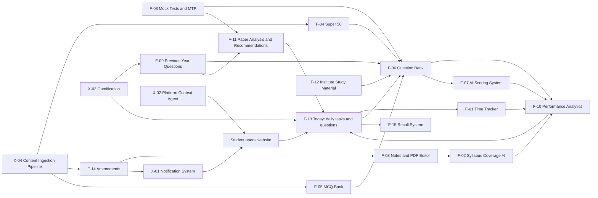

# ArthaCommerce Feature Map

Source: the 6 handwritten pages shared on 4 Oct 2026 (the 12 attachments contain each page twice).
Purpose: one place that captures **exactly what was written**, organises it as flowcharts, and expands every main pointer with sensible sub-pointers so we can write a **PRD + ERD per main pointer** next.

**Tags used everywhere**

- `[NOTE]` written in your pages (spelling corrected, meaning unchanged)
- `[ADD]` added by us to make the pointer complete. Accept, edit or drop any of these.
- `[?]` something in the handwriting we interpreted. Items already confirmed by you are marked in section 9.

**Contents**

1. Terms and hierarchy
2. Master flowchart
3. Your notes, page by page (transcription as flowcharts)
4. Main pointers with sub-pointers (F-01 to F-15)
5. Cross-cutting systems (X-01 to X-05)
6. Extra features we recommend
7. Risks to decide on early
8. Suggested build order and PRD/ERD order
9. Things to confirm

---

## 1. Terms and hierarchy

```
Course (CA | CS | CMA)
  └─▶ Level (Foundation | Intermediate/Executive | Final/Professional)
        └─▶ Group (Group I | Group II | Module I | Module II ...)
              └─▶ Subject / Paper
                    └─▶ Chapter
                          └─▶ Topic
                                └─▶ Learning atoms: Section | Formula | Illustration | Question | Pointer
```

- **Term / Attempt**: an exam sitting (for example May or November). Your notes say "term wise".
- **Institute**: ICAI / ICSI / ICMAI. **Course bought**: a paid coaching course the student has purchased (confirmed).
- **MAT** (confirmed): Institute study material (modules with illustrations and questions with solutions).
- **MTP**: Mock Test Paper published by the Institute. **PYQ**: Previous Year Questions.
- **Coverage**: how much of the syllabus a student has actually finished, expressed in percentages at chapter, subject and group level.

---

## 2. Master flowchart



Reading it: **content** (MCQ bank, Super 50, study material, mocks, PYQs) feeds the **question bank**; every attempt feeds **analytics and coverage**; analytics and paper analysis decide what shows up in **Today**; **notifications** and the **context agent** wrap the whole product.

---

## 3. Your notes, page by page

### Page 1: "Need website. Contains:"

```
NEED WEBSITE  ──▶  contains
 (1)  Time tracker
        └─▶ (right side) Under Time Tracker: subject-wise tracking system
 (2)  Syllabus coverage ──▶ in percentages            [circled]
 (3)  Notes
 (4)  Super 50 questions
 (5)  MCQ bank
 (6)  Eligible to upload mock test questions and answers
 (7)  Performance: per week / day / month on coverage
 (8)  Number of questions solved in each subject
 (9)  Paper analysis ──▶ priority in exams
 (10) Contains Institute MAT ──▶ all illustrations and questions with their solutions
 (11) Previous year questions ──▶ gamified version (like LinkedIn games)
 (12) If I open the website ──▶ shown every day tasks or questions in each paper that I have
        to do anyhow
        (like objectives, or any formulas, or any sections or rules, or any practical
         question I have to solve)
 (13) Amendments                                        [circled]
 (14) Forgotten pointers / recalling system

 (side, large) NOTIFICATION SYSTEM ──▶ for all things
```

### Page 2: Coverage mind map

```
(15) GROUP COVERAGE
  └─▶ Subject coverage
        └─▶ Chapter ──▶ COVERAGE  [circled]
                          │
                          ├─▶ "Find revision"  (arrow out of Coverage)
                          ├─▶ Formula  ──▶ Practice
                          ├─▶ Sections ──▶ Theoretical
                          ├─▶ Revision times
                          ├─▶ Mock test papers  [boxed]
                          │      ├─▶ Institute      ──▶ Module question practice
                          │      └─▶ Course bought  ──▶ MAT question practice
                          ├─▶ Past test papers
                          ├─▶ Notes
                          └─▶ Exam summary notes
```

### Page 3: Notes, Super 50, Context agent, MCQ bank

```
NOTES ──▶ PDF editor access ──▶ rich features and storage for highlighting or marking anything
  └─▶ Subject-wise notes
        ├─▶ Chapter-wise
        ├─▶ Topic-wise
        └─▶ Aggregated

SUPER 50 QUESTIONS ──▶ upload / read / practice
  └─▶ scraping the famous teachers' websites for real-time updating of free resources

PLATFORM CONTEXT AGENT ──▶ helpful for finding the pages

MCQ BANK ──▶ from Institute ──▶ access directly through the website
  ├─▶ Subject-wise
  └─▶ Group-wise
```

### Page 4: Scoring system and time tracker analytics

```
SCORING SYSTEM ──▶ create a model
  └─▶ provide question paper (image) + answer paper (image)
        └─▶ model gives: scoring numbers, mistakes, helpful answers, etc.

TIME TRACKER ANALYTICS
  ├─▶ day / week / month
  ├─▶ group / subject / chapter
  └─▶ and so on
```

### Page 5: Question bank system and exam paper analysis

```
QUESTION BANK SYSTEM
  ├─▶ Platform owned / user uploaded / user created
  ├─▶ Group-wise / subject-wise / chapter-wise
  ├─▶ Feature rich, labelling
  ├─▶ MCQs      ──▶ user can select / mark answer
  └─▶ Long-form ──▶ user can write / upload image
                      └─▶ AI model will evaluate and provide solution   [circled]
  (side) ──▶ all illustrations / examples and questions with their solutions

EXAM PAPERS ANALYSIS
  └─▶ for previous 5 to 10 exams
        └─▶ question pattern
              └─▶ RECOMMENDATION ENGINE ──▶ marks and chapters in that particular subject
```

### Page 6: PYQ, MTP, Amendments, Recall

```
PREVIOUS YEAR QUESTIONS (10 to 15 years)
  ├─▶ Term-wise
  ├─▶ Questions with suggested answer / solution
  └─▶ Practice mode

MTP  ──  Institute mock test papers ──▶ same features as above
  └─▶ Supplementary papers (latest syllabus-wise)

AMENDMENTS (from Institute website scraper)
  ├─▶ Term-wise
  └─▶ Paper-wise PDFs
        └─▶ scrape PDF and list down all changes in exam
              └─▶ breakdown and view

FORGOTTEN POINTERS / RECALLING SYSTEM
  ├─▶ User can build on their own
  └─▶ Platform can provide bullet / important / mandatory pointers / formulas / sections
```

---

## 4. Main pointers with sub-pointers

Each pointer lists: what you wrote, what we add, the data it will need (input for the ERD), and the questions that decide the PRD.

### F-01 Time Tracker  (your items 1 and "under Time Tracker")

> **Split decision (4 Oct 2026):** F-01 is delivered as two documents, in this order.
> **F-01.1 Pomodoro Focus Timer** (first PRD + ERD): `prd/F-01.1-pomodoro-focus-timer.md`, `erd/F-01.1-pomodoro-focus-timer.md`.
> **F-01.2 Time Tracker + Analytics** (second PRD + ERD): stopwatch, manual entry, goals, reports by day/week/month and by subject/chapter. It reuses the `study_session` table created in F-01.1. Written: `prd/F-01.2-time-tracker-and-analytics.md`, `erd/F-01.2-time-tracker-and-analytics.md`.

```
Time Tracker
 ├─▶ [NOTE] Subject-wise tracking system
 ├─▶ [NOTE] Analytics: day / week / month, by group / subject / chapter, and so on
 ├─▶ [ADD] Capture
 │     ├─▶ Start / pause / stop timer, one tap from anywhere (floating timer)
 │     ├─▶ Manual entry and edit (forgot to start, merge or split sessions)
 │     ├─▶ Pick subject, chapter and activity type: reading, MCQ practice, mock, revision, notes
 │     ├─▶ Auto-capture while on Notes, Question Bank, Mock (with user consent)
 │     ├─▶ Idle detection and auto-pause, pomodoro and break reminders
 │     └─▶ Works offline, syncs later
 ├─▶ [ADD] Goals: daily and weekly target hours, compared with the plan
 ├─▶ [ADD] Views: calendar heatmap, subject split, trend line, best hours of day
 └─▶ [ADD] Weekly summary and export (CSV)
```

- **Data needed**: `time_session` (user, subject/chapter, activity type, start, end, source: timer/manual/auto), `time_goal`.
- **Decides the PRD**: auto-tracking vs manual only? Do sessions need to be attached to a chapter, or is subject enough?

### F-02 Syllabus Coverage in percentages  (your item 2 and the mind map)

```
Coverage (per student)
 ├─▶ [NOTE] Group coverage ─▶ Subject coverage ─▶ Chapter coverage, shown in %
 ├─▶ [NOTE] A chapter's coverage is built from these signals
 │     Formula practice, Sections (theory), Revision times, Mock test papers,
 │     Past test papers, Notes, Exam summary notes, "Find revision"
 ├─▶ [NOTE] Mock/practice source tags: Institute (module question practice), Course bought (MAT question practice)
 ├─▶ [ADD] Chapter checklist: topics, sections, formulas, illustrations, MCQs, mocks, each tickable or auto-ticked
 ├─▶ [ADD] Coverage formula, configurable weights (example: read 40 / practise 30 / revise 20 / mock 10)
 ├─▶ [ADD] Status per chapter: not started, reading, practised, revised once, revised twice and more, exam ready
 ├─▶ [ADD] Revision counter and "due for revision" date (feeds F-15 and F-13)
 ├─▶ [ADD] Roll-up to subject, group, level, with marks-weighted view (a 15-mark chapter counts more)
 ├─▶ [ADD] Self-confidence rating per chapter (red / amber / green) next to the measured %
 ├─▶ [ADD] Skip or exclude a chapter (not in my scheme or attempt)
 └─▶ [ADD] Syllabus versions, so a scheme change does not break old progress
```

- **Data needed**: syllabus taxonomy (course, level, group, subject, chapter, topic, weightage, scheme version), `chapter_progress`, `coverage_event`.
- **Decides the PRD**: which signals count and how much? Is coverage self-reported, computed, or both?

### F-03 Notes  (your item 3 and page 3)

```
Notes
 ├─▶ [NOTE] PDF editor with rich features and storage, for highlighting or marking anything
 ├─▶ [NOTE] Subject-wise notes ─▶ chapter-wise, topic-wise, aggregated
 ├─▶ [ADD] PDF library
 │     ├─▶ Upload PDF (storage quota per user), open in viewer
 │     ├─▶ Annotations: highlight, underline, pen, text box, sticky note, bookmark, colours and tags
 │     ├─▶ Non-destructive: annotations saved as a layer, original PDF untouched
 │     ├─▶ Export flattened PDF with annotations
 │     └─▶ OCR for scanned PDFs so they become searchable
 ├─▶ [ADD] Rich text notes (typed), formulas, tables, images
 ├─▶ [ADD] Link every note or highlight to a chapter and topic, so it appears in coverage and aggregated views
 ├─▶ [ADD] Aggregated view: "everything I noted for Subject X", filter by tag, colour, date
 ├─▶ [ADD] Search across all notes and PDFs
 ├─▶ [ADD] One tap: highlight ─▶ recall pointer (F-15) or flashcard
 ├─▶ [ADD] AI helpers: summarise a chapter's notes into "Exam summary notes"
 └─▶ [ADD] Version history, trash and restore
```

- **Data needed**: `document` (file in storage), `annotation` (page, rect, type, colour, text), `note`, links to chapter/topic, `tag`.
- **Decides the PRD**: build the PDF editor or integrate an existing viewer library? Max file size and quota? Are notes shareable?

### F-04 Super 50 Questions  (your item 4 and page 3)

```
Super 50
 ├─▶ [NOTE] Upload / Read / Practice
 ├─▶ [NOTE] Scrape famous teachers' websites for real-time updating of free resources
 ├─▶ [ADD] Meaning (confirmed): a curated list of the ~50 most important questions per subject
 ├─▶ [ADD] Sources: platform-curated, teacher or coaching lists, user upload
 ├─▶ [ADD] Each entry keeps source name, link, date and attempt it targets
 ├─▶ [ADD] Read mode (list with solutions) and Practice mode (pushed into the Question Bank, F-06)
 ├─▶ [ADD] "New" badge and notification when a list is updated (X-01)
 ├─▶ [ADD] Mapping of every question to subject, chapter, topic (AI-assisted, human reviewed)
 ├─▶ [ADD] De-duplication across sources, report broken or wrong items, rating
 └─▶ [ADD] Admin review queue before anything goes live
```

- **Important**: scraping other teachers' content has copyright and terms-of-service risk. See section 7 for safer options (link-out with metadata, partnerships, user uploads).

### F-05 MCQ Bank  (your item 5 and page 3)

```
MCQ Bank
 ├─▶ [NOTE] From the Institute, accessible directly through the website
 ├─▶ [NOTE] Subject-wise, group-wise
 ├─▶ [ADD] Also chapter-wise and topic-wise, difficulty, source (Institute / platform / user), year
 ├─▶ [ADD] Practice modes: untimed, timed, chapter quiz, revision (only wrong or unattempted), custom test builder
 ├─▶ [ADD] Instant explanation after answering, with the section or standard referenced
 ├─▶ [ADD] Bookmark, flag "doubt", report an error
 ├─▶ [ADD] Configurable negative marking and scoring rules per course and paper
 └─▶ [ADD] Every attempt feeds coverage (F-02), analytics (F-10) and the mistake log
```

### F-06 Question Bank System  (page 5, plus items 6 and 10 side note)

```
Question Bank (the engine behind F-04, F-05, F-08, F-09, F-12)
 ├─▶ [NOTE] Ownership: platform owned / user uploaded / user created
 ├─▶ [NOTE] Organised group-wise, subject-wise, chapter-wise
 ├─▶ [NOTE] Feature rich with labelling
 ├─▶ [NOTE] MCQs: user can select / mark the answer
 ├─▶ [NOTE] Long-form: user can write or upload an image ─▶ AI model evaluates and gives the solution (F-07)
 ├─▶ [NOTE] Includes all illustrations, examples and questions with their solutions (Institute study material, F-12)
 ├─▶ [NOTE, item 6] Users are eligible to upload mock test questions and answers
 ├─▶ [ADD] Question types: single MCQ, multiple correct, true/false, numeric, case study, long-form, practical (journal, working notes)
 ├─▶ [ADD] Labels: source, year, term, marks, difficulty, bloom level, type (theory / practical / formula / section), tags
 ├─▶ [ADD] Visibility: private, shared with link, public after review; reputation for contributors
 ├─▶ [ADD] Quality: moderation queue, duplicate detection, report, edit history, verified-by badge
 ├─▶ [ADD] Rich content: LaTeX or formula editor, tables, images, diagrams
 ├─▶ [ADD] Bulk import (CSV / DOCX / PDF with AI extraction) and bulk export
 └─▶ [ADD] Collections: custom sets, saved filters, shareable practice links
```

- **Data needed**: `question`, `question_option`, `answer_key`, `rubric`, `question_label`, `question_source`, `question_collection`, `attempt`, `attempt_answer`, `attachment`.
- **Decides the PRD**: who can publish publicly? How do we handle copyrighted material uploaded by users?

### F-07 Scoring System / AI Answer Evaluation  (page 4 and page 5 circled part)

```
Scoring System
 ├─▶ [NOTE] Create a model that takes question paper (image) + answer paper (image)
 ├─▶ [NOTE] Returns scoring numbers, mistakes, helpful answers, etc.
 ├─▶ [NOTE] Long-form answers typed or uploaded as an image are evaluated by AI
 ├─▶ [ADD] Pipeline: upload ─▶ image clean-up and OCR ─▶ match answer to question ─▶ score against rubric / marking scheme ─▶ feedback
 ├─▶ [ADD] Output: marks per question and per step, mistakes, missing keywords or sections, presentation tips, model answer
 ├─▶ [ADD] Handwriting support, multi-page answer sheets, page ordering
 ├─▶ [ADD] Rubrics: reference solution + marking scheme per question (from Institute where available)
 ├─▶ [ADD] Confidence and disclaimer, "request re-evaluation" and "flag wrong evaluation" loop
 ├─▶ [ADD] Cost control: usage limits per plan, caching, queue, retries
 ├─▶ [ADD] Privacy: handwritten sheets are personal data, delete on request
 └─▶ [ADD] Feeds analytics: marks lost by reason (concept, calculation, presentation, time)
```

- **Data needed**: `evaluation`, `evaluation_item`, `rubric`, `uploaded_sheet`, `model_run` (model, prompt version, tokens, cost).
- **Decides the PRD**: how accurate must it be before we show marks? Do we show "estimated marks" language?

### F-08 Mock Tests and MTP  (items 6, mind map "Mock test papers", page 6 MTP)

```
Mock Tests
 ├─▶ [NOTE] Mock test papers from Institute (MTP) and from "Course bought"
 ├─▶ [NOTE] MTP has the same features as Previous Year Questions (term-wise, solutions, practice mode)
 ├─▶ [NOTE] Supplementary papers, latest-syllabus-wise
 ├─▶ [NOTE] Users can upload mock test questions and answers
 ├─▶ [ADD] Exam simulation: full paper timer, section timing, question palette, mark for review, auto-submit
 ├─▶ [ADD] Review mode: per question time, correct answer, solution, your answer, mistake reason
 ├─▶ [ADD] Mixed mode: MCQ section auto-scored, long-form section via F-07
 ├─▶ [ADD] Source tag (Institute / Course bought / user / platform) feeds coverage "mock" signal
 ├─▶ [ADD] Test builder: auto-generate a custom mock by chapters, marks and difficulty
 └─▶ [ADD] Compare attempts over time, percentile against other students (optional, anonymous)
```

### F-09 Previous Year Questions (PYQ), 10 to 15 years  (item 11 and page 6)

```
PYQ
 ├─▶ [NOTE] 10 to 15 years of papers
 ├─▶ [NOTE] Term-wise
 ├─▶ [NOTE] Questions with suggested answer / solution
 ├─▶ [NOTE] Practice mode
 ├─▶ [NOTE] Gamified version (like LinkedIn games)
 ├─▶ [ADD] Browse by chapter ("all PYQs of this chapter"), by marks, by frequency
 ├─▶ [ADD] "Asked N times" badge and last asked term (from F-11)
 ├─▶ [ADD] Gamification (X-03): daily 5-question challenge, streak, shareable result card
 ├─▶ [ADD] Mark attempted, correct, revise later; spaced re-ask of wrong ones
 └─▶ [ADD] Syllabus mapping when a question is out of the current scheme (flag "old scheme")
```

### F-10 Performance Analytics  (items 7 and 8)

```
Performance
 ├─▶ [NOTE] Performance per week / day / month on coverage
 ├─▶ [NOTE] Number of questions solved in each subject
 ├─▶ [ADD] Accuracy by subject, chapter, topic, question type, difficulty, source
 ├─▶ [ADD] Speed: average time per question vs target
 ├─▶ [ADD] Coverage vs time spent vs score ("high time, low score" chapters)
 ├─▶ [ADD] Weak topics list with a "fix this" button that builds a practice set
 ├─▶ [ADD] Trends: daily, weekly, monthly, since start; goal vs actual
 ├─▶ [ADD] Readiness score per subject and overall, with explanation of what moves it
 ├─▶ [ADD] Mistake log: reason tags (concept, silly, calculation, time, not read, forgot)
 └─▶ [ADD] Exportable progress report (PDF) to share with mentor or parents
```

### F-11 Paper Analysis and Recommendation Engine  (item 9 and page 5)

```
Paper Analysis
 ├─▶ [NOTE] Priority in exams
 ├─▶ [NOTE] For previous 5 to 10 exams, question pattern
 ├─▶ [NOTE] Recommendation engine: marks and chapters in that particular subject
 ├─▶ [ADD] Per subject: marks per chapter per term, frequency, average weight, trend up or down
 ├─▶ [ADD] Pattern: question types, theory vs practical split, MCQ vs descriptive, choice patterns
 ├─▶ [ADD] Priority score per chapter = historical marks + trend + the student's weakness + days left
 ├─▶ [ADD] "If you only have N days" mode: chapters that give the most marks per hour
 ├─▶ [ADD] Explainable output: "Chapter X carried 18 marks in 4 of the last 6 terms"
 ├─▶ [ADD] Admin tool to tag past questions to chapters (AI-assisted, human reviewed)
 └─▶ [ADD] Feeds F-13 Today and the planner
```

### F-12 Institute Study Material (MAT)  (item 10)

```
Study Material
 ├─▶ [NOTE] Contains Institute MAT with all illustrations and questions with their solutions
 ├─▶ [ADD] Chapter-wise list of illustrations, examples and exercises, each with its solution
 ├─▶ [ADD] Each item becomes a Question Bank entry (F-06) tagged "Institute MAT"
 ├─▶ [ADD] "Course bought" materials supported the same way, tagged by provider
 ├─▶ [ADD] Open the exact illustration from a chapter page, mark done, add a note
 ├─▶ [ADD] Progress feeds coverage ("illustrations done 12 of 40")
 └─▶ [ADD] Licensing check: link-out vs hosted content (see section 7)
```

### F-13 Today (daily tasks and questions)  (item 12)

```
Today
 ├─▶ [NOTE] When I open the website, show every-day tasks or questions in each paper that I have to do anyhow
 ├─▶ [NOTE] Examples: objectives (MCQs), formulas, sections or rules, practical questions to solve
 ├─▶ [ADD] One screen: "Do these today" with an estimated time and a progress ring
 ├─▶ [ADD] Per paper tiles: 5 MCQs, 3 formulas to recall, 1 section, 1 practical question
 ├─▶ [ADD] Sources it pulls from: planner, due revisions (F-02), recall pointers due (F-15), weak topics (F-10), priority chapters (F-11), amendments to read (F-14)
 ├─▶ [ADD] Student can swap, snooze, or add their own task
 ├─▶ [ADD] Streak, daily completion celebration, "tomorrow preview"
 └─▶ [ADD] Same list in reminders (X-01) and on a lightweight mobile view
```

### F-14 Amendments  (item 13 and page 6)

```
Amendments
 ├─▶ [NOTE] From the Institute website scraper
 ├─▶ [NOTE] Term-wise
 ├─▶ [NOTE] Paper-wise PDFs
 ├─▶ [NOTE] Scrape the PDF, list down all changes in the exam, breakdown and view
 ├─▶ [ADD] Applicability: which attempt, which paper, which chapter does it change
 ├─▶ [ADD] Change cards: "Section 17(1) changed, from X to Y, applies from term Z" with link to the source PDF page
 ├─▶ [ADD] Human review step before publishing extracted changes
 ├─▶ [ADD] Impact on the student: chapters affected, already-covered chapters flagged "needs re-read"
 ├─▶ [ADD] Notification when a new amendment lands for my papers (X-01)
 ├─▶ [ADD] Linked from notes and question bank ("this question is affected by an amendment")
 └─▶ [ADD] Archive by term, with "not applicable to my attempt" filter
```

### F-15 Forgotten Pointers / Recall System  (item 14 and page 6)

```
Recall System
 ├─▶ [NOTE] User can build on their own
 ├─▶ [NOTE] Platform can provide bullet / important / mandatory pointers, formulas, sections
 ├─▶ [ADD] Card types: pointer, formula, section, definition, mnemonic, case law
 ├─▶ [ADD] Created from anywhere: highlight a PDF, select text in a solution, add manually, AI-suggested from a chapter
 ├─▶ [ADD] Spaced repetition schedule (due today queue), rate "forgot / hard / good / easy"
 ├─▶ [ADD] Platform decks: "mandatory pointers" per chapter, curated and versioned
 ├─▶ [ADD] "Forgotten" list: the ones you missed most, resurfaced in Today (F-13)
 ├─▶ [ADD] Quick revision mode before exams (only high-priority pointers)
 └─▶ [ADD] Share a deck by link
```

---

## 5. Cross-cutting systems

### X-01 Notification System  (page 1, "for all things")

```
Notifications
 ├─▶ [NOTE] One notification system for all things
 ├─▶ [ADD] Event sources: Today reminder, due revision, recall due, streak at risk, new amendment, new Super 50 / MTP / PYQ, evaluation ready, goal missed, exam date countdown
 ├─▶ [ADD] Channels: in-app inbox, web push, email, WhatsApp (needs Business API, paid) as later option
 ├─▶ [ADD] Preferences: per category and channel, quiet hours, daily digest
 ├─▶ [ADD] Smart rules: do not repeat, batch, respect time zone, stop when done
 └─▶ [ADD] Template system and delivery log
```

### X-02 Platform Context Agent  (page 3)

```
Context Agent
 ├─▶ [NOTE] Helpful for finding the pages
 ├─▶ [ADD] Command bar (Cmd/Ctrl+K) and chat: "show me CA Inter Taxation chapter 3 PYQs"
 ├─▶ [ADD] Knows the student's course, level, plan, progress and the site map; answers with deep links
 ├─▶ [ADD] Can act: start timer, open a mock, add a recall card, set a reminder
 ├─▶ [ADD] Only reads the student's own data; every answer shows its sources
 └─▶ [ADD] Works because every screen has a URL (already a project rule)
```

### X-03 Gamification  (item 11)

```
Gamification (like LinkedIn games)
 ├─▶ [NOTE] Gamified version for previous year questions
 ├─▶ [ADD] Daily Challenge: same 5 questions for everyone in a course, timed, once per day
 ├─▶ [ADD] Streaks, badges, XP, levels, with kindness: a "streak freeze"
 ├─▶ [ADD] Shareable result card (WhatsApp link preview with score, built on our OG setup)
 ├─▶ [ADD] Mini games: match the formula, spot the section, true or false
 └─▶ [ADD] Optional friends leaderboard (opt-in only)
```

### X-04 Content Ingestion Pipeline  (scrapers in pages 3 and 6)

> Detailed in `prd/X-04-ingestion-scraping-service.md` and `erd/X-04-ingestion-scraping-service.md`: a configurable source registry, polite fetchers, PDF and AI extraction, syllabus mapping, review queue and publisher plug-ins.

```
Ingestion
 ├─▶ [NOTE] Scrapers for Institute website (amendments, MTP, MCQs) and for teachers' free resources (Super 50)
 ├─▶ [ADD] Scheduled fetch ─▶ store raw file and hash ─▶ parse (PDF extraction with AI) ─▶ review queue ─▶ publish
 ├─▶ [ADD] Keep source URL, fetched date, version, and checksum for every item
 ├─▶ [ADD] Respect robots.txt and rate limits, prefer official feeds and notices
 ├─▶ [ADD] Change detection: only new or updated files create work and notifications
 ├─▶ [ADD] Admin console: sources, last run, failures, review queue
 └─▶ [ADD] Runs outside the web request (Supabase Cron or Vercel Cron plus a worker)
```

### X-05 Syllabus Taxonomy (the backbone)  `[ADD]`

> Detailed together with F-02 in `prd/F-02-syllabus-structure-and-coverage.md` and its ERD (first document in the order).

Not on your pages, but every pointer above hangs off it: course, level, group, subject, chapter, topic, weightage, scheme version, term calendar. It has to exist first. It is also what makes URLs like `/courses/ca/intermediate/taxation` possible.

---

## 6. Extra features we recommend

| Area | Idea | Why |
| --- | --- | --- |
| Onboarding | Pick course, level, attempt, exam date, daily hours, and optionally the coaching you follow. First plan in under a minute | Fast time to value, gives every other feature context |
| Study planner | Date-driven plan that re-plans when days are missed | Original product idea; ties Today, coverage and tracker together |
| Mistake notebook | Every wrong answer saved with reason tags and a retry date | The fastest way to improve marks |
| Exam countdown and calendar | Exam dates, form deadlines, admit card, results, from Institute notices | Students miss these; feeds X-01 |
| Law and case-law finder | Search sections, rules, standards, case laws with short summaries | Law and tax papers depend on recall of provisions |
| Formula sheets and standards cheat-sheets | Auto-built from recall cards and notes | Last-week revision |
| Custom test generator | Pick chapters, marks, time, difficulty and generate | Targeted practice |
| Adaptive practice | Difficulty adjusts to accuracy | Keeps students in the learning zone |
| Offline and PWA | Install on phone, read notes and practise offline | Students study on the move, patchy data |
| Language | English first, Hindi explanation option later | Wider reach |
| Peer features (opt-in) | Study rooms with a shared timer, accountability partner | Motivation without noise |
| Mentor / teacher mode | A mentor sees consenting students' progress, assigns tasks | Growth channel via teachers |
| Subscriptions and payments | Free tier plus paid features via Razorpay; coupons, referral | Business model |
| Admin CMS | Manage taxonomy, content, moderation, sources, feature flags | Needed to run content-heavy product |
| Feedback and support | In-app feedback, report a wrong question, changelog | Quality loop |
| Privacy tools | Data export and delete, consent log (India DPDP Act 2023) | Legal need, builds trust |
| Accessibility | Keyboard, screen reader, dark mode, large text | Already a design rule |
| Observability for product | Funnel and activation events in PostHog, AI cost dashboard | Make decisions with data |

---

## 7. Risks to decide on early

1. **Scraping other teachers' sites (Super 50)**: copyright and terms of service. Safer options, in order: (a) link out with title, source and date and let students open the original, (b) written permission or partnership with teachers, (c) user-uploaded content with a take-down process, (d) only free public resources whose terms allow reuse.
2. **Institute content (MCQs, MTPs, amendments, study material)**: Institute notices are public, but check each Institute's terms before re-hosting. Prefer linking to the official PDF plus our own extracted summary and always show the source.
3. **AI marks are estimates**: label them clearly, allow dispute, keep rubric and model version per result, improve with human-reviewed samples.
4. **User uploads**: moderation, copyright take-down flow, storage quota and cost, virus scan on upload.
5. **Personal data**: handwritten answer sheets and study habits are personal data. Collect consent, allow export and delete.
6. **Cost**: Gemini calls and storage can grow quickly. Quotas per plan, caching, background queue.
7. **Syllabus changes**: schemes change. Keep taxonomy versioned from day one.

---

## 8. Suggested build order and PRD/ERD order

**Phase 1: Foundation of data and daily habit**
X-05 Taxonomy, onboarding, F-01 Time Tracker, F-02 Coverage, F-13 Today (basic)

**Phase 2: Practice engine**
F-06 Question Bank, F-05 MCQ Bank, F-09 PYQ (basic), F-10 Analytics (basic), X-01 Notifications (in-app and email)

**Phase 3: Study content**
F-03 Notes and PDF editor, F-12 Study Material, F-08 Mock Tests and MTP, F-15 Recall

**Phase 4: Intelligence and ingestion**
F-07 AI Scoring, F-14 Amendments, X-04 Ingestion, F-11 Paper Analysis and Recommendations, F-04 Super 50

**Phase 5: Delight and growth**
X-03 Gamification, X-02 Context Agent, payments, mentor mode, WhatsApp channel

**PRD + ERD order (one main pointer at a time), as decided by you (updated 4 Oct 2026)**

| # | Document | PRD | ERD | Status |
| --- | --- | --- | --- | --- |
| 1 | **X-05 Syllabus Structure + F-02 Syllabus Coverage** | `prd/F-02-syllabus-structure-and-coverage.md` | `erd/F-02-syllabus-structure-and-coverage.md` | written and implemented (API + web) |
| 2 | **F-01.1 Pomodoro Focus Timer** | `prd/F-01.1-pomodoro-focus-timer.md` | `erd/F-01.1-pomodoro-focus-timer.md` | written (Q1 decided) |
| 3 | **X-04 Ingestion Service (configurable scraping)** | `prd/X-04-ingestion-scraping-service.md` | `erd/X-04-ingestion-scraping-service.md` | written |
| 4 | **F-01.2 Time Tracker + Analytics** | `prd/F-01.2-time-tracker-and-analytics.md` | `erd/F-01.2-time-tracker-and-analytics.md` | written (draft, Q1 auto-capture open) |
| 5 | Then the rest in the build order above (Notes, Question Bank, Mock tests, Amendments, Today, ...) | | | |

Why this order: the syllabus tables are referenced by every other ERD (Pomodoro tags rounds with subject and chapter; Ingestion maps scraped content to chapters). Ingestion publishes into modules (Amendments, Mock tests) that arrive later, so its first phase ships only the generic engine and the Notices type.

Templates: `docs/templates/PRD_TEMPLATE.md` and `docs/templates/ERD_TEMPLATE.md`. Finished documents go to `docs/product/prd/F-xx-name.md` and `docs/product/erd/F-xx-name.md`.

---

## 9. Confirmations

Confirmed by you:

1. **MAT** = Institute study material. Yes.
2. **Course bought** = a paid coaching course the student has purchased. Yes.
3. **Super 50** = the 50 most important questions per subject. Yes.
4. **First PRD and ERD**: Pomodoro Focus Timer first, then Time Tracker with Analytics.

Still open (we proceed with the stated defaults until you say otherwise):

5. **Circled number before "Group coverage"** (page 2): treated as part of Syllabus Coverage (F-02).
6. **Small scribbles** beside MCQ Bank (page 3): illegible, ignored.
7. **Which course first**: default is all of CA, CS and CMA in the taxonomy seed, with the first marketing push on one course.
8. **Content sources**: default is link-out and user uploads first, partnerships later (see risk 1 in section 7).
9. **Pomodoro open question Q1: decided.** A round that ends while the student is away counts only if the page was seen alive within the 2 minutes before it ended; otherwise the student confirms with one tap or discards.
10. **New decision needed for Ingestion (PRD X-04 Q1)**: legal posture per source. Default is link-out only for teachers, facts plus our own summary for institute notices, and hosting only with written permission. Please get this reviewed by a lawyer before launch.
11. **Which sources first** for Ingestion: the public notice and amendment pages of ICAI, ICSI and ICMAI. Please send the exact URLs you care about.
