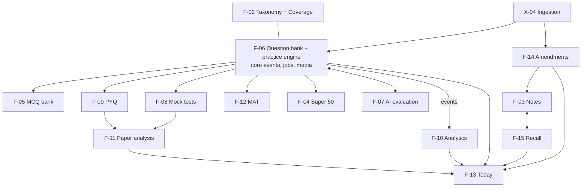

# ArthaCommerce product docs: index

Start here. Every main pointer has one PRD (what and why) and one ERD (data, interfaces, scale). Both follow `docs/templates/`. Status of everything below: **Draft for founder review** (2026-10-05).

```
docs/product/
  README.md                  this index
  FEATURE_MAP.md             the source: your handwritten pages, expanded
  prd/F-xx-<name>.md         product requirements
  erd/F-xx-<name>.md         data model, interfaces, query patterns, storage, security
  validation/                audits of what is built vs what is documented
```

## 1. All documents

| ID | Pointer | PRD | ERD | API / web module | State |
| --- | --- | --- | --- | --- | --- |
| X-05 + F-02 | Syllabus structure + coverage | [PRD](prd/F-02-syllabus-structure-and-coverage.md) | [ERD](erd/F-02-syllabus-structure-and-coverage.md) | `syllabus`, `coverage` | Built |
| F-01.1 | Pomodoro focus timer | [PRD](prd/F-01.1-pomodoro-focus-timer.md) | [ERD](erd/F-01.1-pomodoro-focus-timer.md) | `focus` | Built |
| F-01.2 | Time tracker + analytics | [PRD](prd/F-01.2-time-tracker-and-analytics.md) | [ERD](erd/F-01.2-time-tracker-and-analytics.md) | `tracking` / `tracker` | Built |
| X-04 | Ingestion (configurable scraping) | [PRD](prd/X-04-ingestion-scraping-service.md) | [ERD](erd/X-04-ingestion-scraping-service.md) | `ingestion` | Written |
| F-06 | Question bank + practice engine (foundation) | [PRD](prd/F-06-question-bank-system.md) | [ERD](erd/F-06-question-bank-system.md) | `questionbank`, `practice`, `media`, `core/events`, `core/jobs` | Written |
| F-05 | MCQ bank | [PRD](prd/F-05-mcq-bank.md) | [ERD](erd/F-05-mcq-bank.md) | `mcqbank` | Written |
| F-09 | Previous year questions | [PRD](prd/F-09-previous-year-questions.md) | [ERD](erd/F-09-previous-year-questions.md) | `pyq` | Written |
| F-08 | Mock tests and MTP | [PRD](prd/F-08-mock-tests-and-mtp.md) | [ERD](erd/F-08-mock-tests-and-mtp.md) | `mocktest` | Written |
| F-12 | Institute study material (MAT) | [PRD](prd/F-12-institute-study-material.md) | [ERD](erd/F-12-institute-study-material.md) | `material` | Written |
| F-04 | Super 50 questions | [PRD](prd/F-04-super-50-questions.md) | [ERD](erd/F-04-super-50-questions.md) | `super50` | Written |
| F-07 | AI answer evaluation | [PRD](prd/F-07-ai-answer-evaluation.md) | [ERD](erd/F-07-ai-answer-evaluation.md) | `evaluation` | Written |
| F-10 | Performance analytics | [PRD](prd/F-10-performance-analytics.md) | [ERD](erd/F-10-performance-analytics.md) | `analytics` | Written |
| F-11 | Paper analysis + recommendations | [PRD](prd/F-11-paper-analysis-and-recommendations.md) | [ERD](erd/F-11-paper-analysis-and-recommendations.md) | `paperanalysis` | Written |
| F-13 | Today (daily tasks) + planner | [PRD](prd/F-13-today-daily-tasks.md) | [ERD](erd/F-13-today-daily-tasks.md) | `today` | Written |
| F-14 | Amendments | [PRD](prd/F-14-amendments.md) | [ERD](erd/F-14-amendments.md) | `amendments` | Written |
| F-15 | Recall system (spaced repetition) | [PRD](prd/F-15-recall-system.md) | [ERD](erd/F-15-recall-system.md) | `recall` | Written |
| F-03 | Notes + PDF editor | [PRD](prd/F-03-notes-and-pdf-editor.md) | [ERD](erd/F-03-notes-and-pdf-editor.md) | `notes` | Written |
| F-16 | Personalization, onboarding, profile, workspace home | [PRD](prd/F-16-personalization-onboarding-profile.md) | [ERD](erd/F-16-personalization-onboarding-profile.md) | `profiles` (extended), `coverage` (additive), web `personalization` | Written, build next |
| X-01 | Notifications, floating timer, keep awake (combined, approved 2026-10-06) | [PRD](prd/X-01-notifications-floating-timer-stay-awake.md) | [ERD](erd/X-01-notifications-floating-timer-stay-awake.md) | `notifications`, `focus` | Written; push part superseded for build by X-01.1 |
| X-01.1 | Push notifications: build-ready, phase and wave plan | [PRD](prd/X-01.1-push-notifications.md) | [ERD](erd/X-01.1-push-notifications.md) | `notifications` (new), web `notifications` | Draft for founder review. Runbook: [`docs/X-01-ROLLOUT.md`](../X-01-ROLLOUT.md) |
| X-02, X-03 | Context agent, gamification | not written | not written | later | Later |

Validation: [F-02 / F-01 implementation audit](validation/F-02-F-01-implementation-audit-2026-10-05.md) (0 blockers, 7 major, 17 minor, 3 nits; 464 backend tests pass).

## 2. How the pieces fit



The rule that keeps it modular: **one owner per concept**. Questions and attempts live only in F-06; files only in `media`; events only in `core/events`; background work only in `core/jobs`; taxonomy only in F-02. Other modules call services and selectors, register into registries (`register_picker`, `register_evaluator`, `register_subscriber`, `register_task_provider`, publishers in X-04), and never import foreign models.

## 3. Recommended implementation order

| Wave | Build | Why now |
| --- | --- | --- |
| 0 | Fix audit Majors AUD-001/002/003/004/005/006, then the shared platform: `core/events` outbox, `core/jobs` queue + worker, `media`, central account-deletion registry, cached flag lookups | Everything after depends on these; the audit found concurrency and layering gaps that would multiply |
| 0b | **F-16 S1 to S5 (then S6 to S14)**: enforce targets and the 50% confidence gate (bug fixes), duration inputs, toast system, profile bootstrap and account erasure registry, then avatar, onboarding, gate, last visit, workspace home | Everything after personalises from it (course, attempt, daily time, targets); fixes the "2 of 1 tests" and "25% with 0 chapters" defects; closes AUD-004 for every later module |
| 1 | F-06 R1, then F-05 R1, then F-09 R1 (structure and link-out first) | The practice loop (answer, score, mistake, event) is the product's core; unlocks five pointers |
| 2 | F-10 R1, F-13 R1, F-15 R1, and write X-01 PRD/ERD (in-app inbox first) | Daily habit: Today pulls from coverage, MCQ sets and recall; analytics makes progress visible |
| 3 | F-03 R1, F-08 R1, X-04 engine, then F-14 and F-12 | Study content and ingestion; amendments and MAT ride on the X-04 publisher |
| 4 | F-11, F-07, F-04 | Intelligence and curation. F-07 ships behind its accuracy gate; F-04 behind the legal decision |
| 5 | X-01 channels (push, email, WhatsApp), X-03 gamification, X-02 context agent, payments | Growth and delight |

Each PRD section 13 slices its pointer into PR-sized issues (R1 / R2 / R3). Use `.claude/skills/new-feature-module` per slice.

## 4. Decisions that block or shape work (founder)

1. **Legal posture for content** (F-04 Q1, F-09 Q2, F-12 Q1, F-08 Q2, F-14 Q1, F-06 Q1): ICAI reserves all rights; ICSI and ICMAI terms were not readable. All docs default to link-out plus our own summaries, with hosting off per source until written permission. Needs a lawyer.
2. **Exam rules are data, not code**: sources disagree on negative marking and paper patterns (F-06 Q3, F-08 Q5, F-11). Rules are seeded as unverified and need an editor to check them against official notices before launch.
3. **AI marks** (F-07 Q1/Q2): ship numeric marks only after the golden-set gate passes; start with bands.
4. **Plans and quotas** (F-03 Q2, F-06 Q12, F-07 Q3, F-15 Q10): what is free and what is paid.
5. **Do notes, amendments and material change the coverage percent?** (F-03 Q4, F-14 Q7, F-12 Q4, F-04 Q5). One rule for all.
6. **Minors and DPDP** (F-07 Q7, F-10 Q3): sharing and uploads for under-18 users.

Every document ends with its own numbered open questions, each with a recommended default.

## 5. Cross-document reconciliation log

Authors worked in parallel, so a few interfaces are described from both sides slightly differently. The owner's document wins. Fix these when each pointer is sliced:

| Topic | Drift | Resolution |
| --- | --- | --- |
| Today provider registry | F-11 sketched `ProviderSpec.fetch`; F-13 defines `register_task_provider(provide(TaskRequest) -> ProviderResult)` | Use F-13. Name already aligned in F-11; payload shape to align |
| Recall card creation | F-03 calls `create_card_from_source`; F-15 exposes `create_card_from_selection` (and proposes one `create_card(source=SourceRef)`) | Adopt F-15 Q-F15-14: single `create_card(source=SourceRef)` |
| Ownership of past-paper structure | F-09 (`pyq_paper`), F-08 (`mocktest_paper`) and F-11 (`paperanalysis_paper`) each hold a paper table | Confirm F-09 Q1: F-09 owns paper structure for past papers; F-08 owns simulation; F-11 keeps only a derived read model |
| F-06 extensions | F-05, F-07, F-08, F-09, F-10, F-11, F-12, F-03 each propose small additive F-06 extensions (E1..En lists) | Review once as a single "F-06 R2 extensions" batch before slicing |
| F-02 extensions | Selectors and events requested by F-03, F-08, F-10, F-11, F-12, F-13, F-14 | Add one `syllabus.selectors` / `coverage.selectors` read interface (also fixes audit AUD-005) |
| X-04 rights ledger | F-04 proposes `ingestion_sourcerights` and `capabilities`; F-12 and F-14 reuse it | Add to X-04 ERD when X-04 is sliced |
| Account erasure and export registry | F-06, F-10, F-12 call it `[PROPOSED: profiles]`; audit AUD-004 | F-16 owns it: `profiles.registry.register_eraser` / `register_exporter`, `DELETE /me/`, `GET /me/export/` (F-16 ERD section 3). Modules register once when F-16 S5 ships |
| Per-chapter targets and daily time | F-02 stores targets on `syllabus_chapter` and `daily_hours` on the enrolment | F-16 moves targets to the student (`coverage_settings.target_*`) and adds `daily_minutes`; F-02 ERD columns stay, unused for coverage |
| X-01 `notifications.services.notify` | Referenced as `[PROPOSED]` by all docs (34 mentions) | Defined in X-01.1 PRD section 9.3: `notifications.services.notify(user_id, event_key, *, context, dedupe_ref)`. Event keys must exist in `domain/catalogue.py`. Other docs keep the name |
