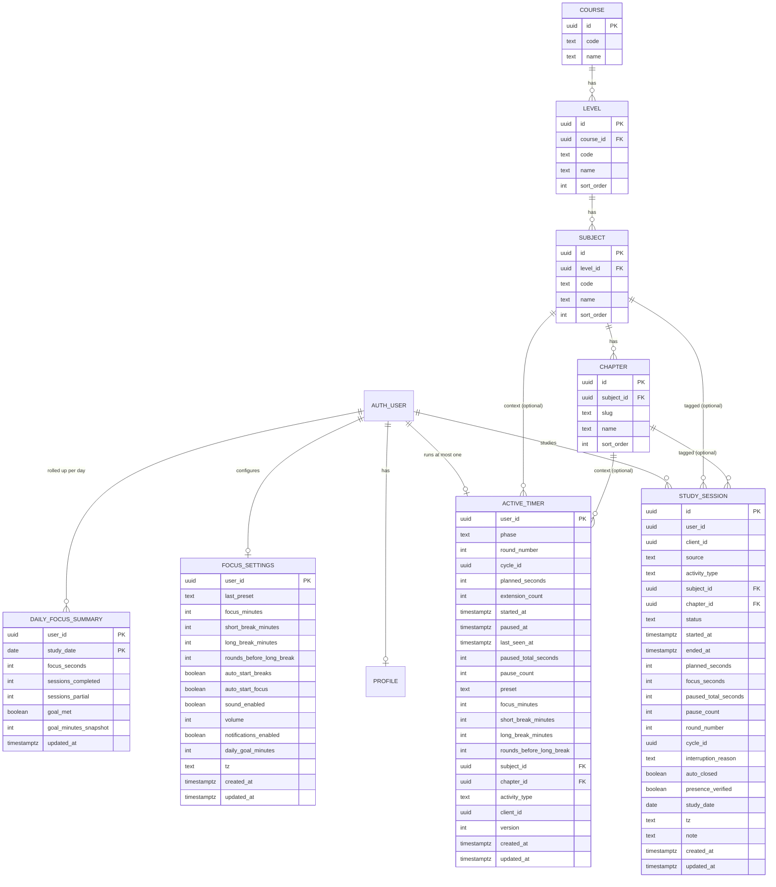

# ERD: F-01.1 Pomodoro Focus Timer

| Field | Value |
| --- | --- |
| Linked PRD | `docs/product/prd/F-01.1-pomodoro-focus-timer.md` |
| Order | Second PRD/ERD. Depends on `docs/product/erd/F-02-syllabus-structure-and-coverage.md` |
| Django apps | `apps/api/modules/syllabus` (from F-02, prerequisite), `apps/api/modules/tracking` (shared study data), `apps/api/modules/focus` (timer state and settings) |
| Web module | `apps/web/src/modules/focus` |
| Last updated | 4 Oct 2026 |

## 0. Design decisions

1. **Timer maths uses timestamps, never ticks.** The database stores `started_at`, `paused_at` and `paused_total_seconds`. Remaining time is `planned_seconds - (now - started_at - paused_total)`, computed by the server and re-computed by the client from the same fields plus a server clock offset.
2. **One live timer per student = one row.** `active_timer` has `user_id` as its primary key, so "at most one active timer" is enforced by the database, not by code.
3. **Finished focus rounds go to `study_session`, owned by the `tracking` module.** The same table later receives Stopwatch and Manual entries from F-01.2, so Analytics reads one table. Breaks are never saved (PRD Q3).
4. **The server is the clock.** Every write uses `now()` in the database (or the service's server time). Client time is used only for display.
5. **Safe retries.** `client_id` (UUID made on the device) is unique per student on `study_session`, and `version` on `active_timer` is an optimistic lock.
6. **Rollups are derived, never the source of truth.** `daily_focus_summary` can always be rebuilt from `study_session`.
7. **Django is the only gateway.** No table here is reachable through the Supabase Data API. RLS is enabled with no policies (deny all).

## 1. Diagram



`user_id` columns reference `auth.users.id` by value (no cross-schema foreign key), the same convention as `profiles`.

## 2. Tables

### 2.1 Subjects and chapters (owned by F-02, not defined here)

This feature only references `syllabus_subject` and `syllabus_chapter` from the F-02 ERD (section 2.2 there). It reads them through `syllabus.selectors` and never writes to them. The simplified `COURSE`, `LEVEL` entities in the diagram above are shown only for orientation; the real structure (scheme versions, groups, topics) is in the F-02 ERD.

### 2.2 `tracking_studysession` (module `tracking`, shared with F-01.2)

One row per finished block of study time.

| Column | Type | Null | Default | Notes |
| --- | --- | --- | --- | --- |
| id | uuid | no | gen | PK |
| user_id | uuid | no | | Owner. Scoped on every query |
| client_id | uuid | yes | | Device generated, makes retries idempotent. Null for server-created rows such as auto-closed rounds and manual entries |
| source | text | no | `pomodoro` | `pomodoro`, `stopwatch`, `manual`, `auto` |
| activity_type | text | no | `other` | `reading`, `practice`, `revision`, `notes`, `mock_test`, `other` |
| subject_id | uuid | yes | | FK to `syllabus_subject`, on delete set null |
| chapter_id | uuid | yes | | FK to `syllabus_chapter`, on delete set null |
| status | text | no | | `completed` (full round), `partial` (ended early and saved) |
| started_at | timestamptz | no | | Start of the focus phase |
| ended_at | timestamptz | no | | End of the focus phase |
| planned_seconds | int | yes | | Planned length including extensions. Null for manual |
| focus_seconds | int | no | | Counted study time, pauses excluded |
| paused_total_seconds | int | no | 0 | |
| pause_count | smallint | no | 0 | |
| round_number | smallint | yes | | Position in the cycle (1..N) |
| cycle_id | uuid | yes | | Groups the rounds of one cycle |
| interruption_reason | text | yes | | `distracted`, `phone_call`, `tired`, `urgent_work`, `other`. Only for `partial` |
| auto_closed | boolean | no | false | Closed by the server because the round ended while the student was away, but a heartbeat was seen within 2 minutes of the end (PRD Q1) |
| presence_verified | boolean | no | true | False only when the student claimed an away round with "Yes, count it" (no heartbeat proved presence). Analytics can include or exclude these |
| study_date | date | no | | Local calendar day of `started_at` in `tz` |
| tz | text | no | | IANA name at the time, for example `Asia/Kolkata` |
| note | text | yes | | Max 500 characters. Never sent to analytics |
| created_at | timestamptz | no | now() | |
| updated_at | timestamptz | no | now() | |

Constraints:

- `focus_seconds >= 60` (rounds under one minute are discarded, never stored)
- `focus_seconds <= 43200` (12 h sanity cap per row)
- `ended_at >= started_at`
- `status in ('completed','partial')`, `source in (...)`, `activity_type in (...)` as check constraints
- `interruption_reason` null unless `status = 'partial'`
- Unique `(user_id, client_id)` where `client_id is not null`

Indexes:

- `(user_id, study_date desc)` for Today and daily totals
- `(user_id, started_at desc)` for history with cursor pagination
- `(user_id, subject_id, started_at desc)` for per-subject history and for F-01.2 reports
- `(user_id, chapter_id)` for chapter totals (Syllabus Coverage later)

Overlapping rows are not blocked in the database (manual entries in F-01.2 may legitimately overlap); the service validates overlap for `pomodoro` rows only.

### 2.3 `focus_activetimer` (module `focus`)

The live state of the single running timer. A row exists only while a timer is in a focus or break phase.

| Column | Type | Null | Default | Notes |
| --- | --- | --- | --- | --- |
| user_id | uuid | no | | **PK**. One live timer per student |
| phase | text | no | | `focus`, `short_break`, `long_break` |
| round_number | smallint | no | 1 | |
| cycle_id | uuid | no | | |
| planned_seconds | int | no | | Phase length including extensions |
| extension_count | smallint | no | 0 | Max 3 |
| started_at | timestamptz | no | | Phase start, server time |
| paused_at | timestamptz | yes | | Set while paused, null while running |
| last_seen_at | timestamptz | no | now() | Latest heartbeat from any device (PRD FR-26). Updated by `GET timer/` with `alive=1` and by `timer/heartbeat/`; this write does not bump `version` |
| away_pending | boolean | no | false | True after the phase ended with no heartbeat in the last 2 minutes before the end. Waits for the student to claim or discard |
| paused_total_seconds | int | no | 0 | Sum of finished pauses in this phase |
| pause_count | smallint | no | 0 | |
| preset | text | no | | `classic`, `deep`, `light`, `custom`. Snapshot |
| focus_minutes | smallint | no | | Snapshot, so changing settings never alters a running cycle |
| short_break_minutes | smallint | no | | Snapshot |
| long_break_minutes | smallint | no | | Snapshot |
| rounds_before_long_break | smallint | no | | Snapshot |
| auto_start_breaks | boolean | no | | Snapshot |
| auto_start_focus | boolean | no | | Snapshot |
| subject_id | uuid | yes | | FK to `syllabus_subject`, on delete set null |
| chapter_id | uuid | yes | | FK to `syllabus_chapter`, on delete set null |
| activity_type | text | no | `other` | |
| client_id | uuid | no | | Used when the focus phase becomes a `study_session` row |
| version | int | no | 1 | Optimistic lock, incremented on every change |
| created_at | timestamptz | no | now() | |
| updated_at | timestamptz | no | now() | |

Constraints:

- `phase in ('focus','short_break','long_break')`
- `planned_seconds between 60 and 14400`
- `extension_count between 0 and 3`
- `paused_total_seconds >= 0`

Derived values (computed in the service, not stored):

```
elapsed   = (paused_at or now) - started_at - paused_total_seconds
remaining = planned_seconds - elapsed
due       = remaining <= 0 and paused_at is null
end_at    = started_at + planned_seconds + paused_total_seconds (when running)
verified  = last_seen_at >= end_at - 120 seconds
```

Away rule (PRD Q1): when a request finds a `due` focus phase, the service closes it only if `verified`. If verified, it records a completed session with `auto_closed = true`. If not verified, it sets `away_pending = true` and records nothing; `timer/claim/` then either records a completed session with `presence_verified = false` or discards it. Heartbeat rows are one small `UPDATE` per 20 s per open page, so `last_seen_at` is excluded from the optimistic `version`.

Every mutating service call does `UPDATE ... WHERE user_id = :u AND version = :v` and checks the affected row count. Zero rows means a stale version and the API answers 409 with the latest row.

### 2.4 `focus_focussettings` (module `focus`)

One row per student, created on first read with defaults.

| Column | Type | Null | Default | Notes |
| --- | --- | --- | --- | --- |
| user_id | uuid | no | | **PK** |
| last_preset | text | no | `classic` | |
| focus_minutes | smallint | no | 25 | Check 5..120 |
| short_break_minutes | smallint | no | 5 | Check 1..30 |
| long_break_minutes | smallint | no | 15 | Check 5..60 |
| rounds_before_long_break | smallint | no | 4 | Check 2..8 |
| auto_start_breaks | boolean | no | true | |
| auto_start_focus | boolean | no | false | |
| sound_enabled | boolean | no | true | |
| volume | smallint | no | 60 | Check 0..100 |
| notifications_enabled | boolean | no | false | Becomes true only after the browser permission is granted |
| daily_goal_minutes | smallint | no | 120 | Check 15..720 |
| tz | text | no | `Asia/Kolkata` | IANA name, updated from the browser when it changes |
| created_at | timestamptz | no | now() | |
| updated_at | timestamptz | no | now() | |

The preset definitions (Classic, Deep, Light) are constants in code (section 4), not rows. The custom values are the `*_minutes` columns.

### 2.5 `tracking_dailyfocussummary` (module `tracking`)

Rollup so that Today, the goal ring and the streak do not scan sessions.

| Column | Type | Null | Default | Notes |
| --- | --- | --- | --- | --- |
| user_id | uuid | no | | PK part 1 |
| study_date | date | no | | PK part 2 |
| focus_seconds | int | no | 0 | Sum of `focus_seconds` for the day |
| sessions_completed | smallint | no | 0 | `status = completed` |
| sessions_partial | smallint | no | 0 | `status = partial` |
| goal_minutes_snapshot | smallint | no | | Goal in force when the day was last updated |
| goal_met | boolean | no | false | `focus_seconds >= goal_minutes_snapshot * 60` |
| updated_at | timestamptz | no | now() | |

Primary key `(user_id, study_date)`. Index `(user_id, study_date desc) where goal_met` for streak walks.

Written only inside the same transaction as the `study_session` insert, edit or delete (a service recomputes the day with a single `SUM ... GROUP BY`, so it is correct even after edits and deletes). A management command `rebuild_daily_focus_summary` can rebuild any range from `study_session`.

## 3. Relationships to existing modules

| From | To | Rule |
| --- | --- | --- |
| all user_id columns | `auth.users.id` (Supabase) | By value, no database foreign key across schemas. Row is owned by the JWT `sub`. |
| `focus_focussettings.user_id` | `profiles` | One-to-one by value. Deleting the account removes the row (section 7). |
| `tracking_studysession.subject_id` / `chapter_id` | `syllabus_*` | Real foreign keys, `on delete set null`. Reads through `syllabus.selectors`. |
| `focus_activetimer.subject_id` / `chapter_id` | `syllabus_*` | Same. |
| `focus` module | `tracking` module | `focus.services` calls `tracking.services.record_study_session(...)` when a focus phase ends. `focus` never imports `tracking` models. |
| `tracking` module | `syllabus` module | Validation that `chapter.subject_id == subject_id` is done through `syllabus.selectors`. |

Dependency direction (no cycles): `focus -> tracking -> coverage -> syllabus`, and `syllabus` depends on nothing.

Django layout:

```
apps/api/modules/
  syllabus/   (see F-02 ERD)
  coverage/   (see F-02 ERD) receives study time from tracking
  tracking/   models.py services.py selectors.py serializers.py views.py urls.py tests/
  focus/      models.py services.py (state machine) selectors.py serializers.py views.py urls.py tests/
```

## 4. Enumerations and reference data

| Name | Values | Stored as | Owner |
| --- | --- | --- | --- |
| Phase | focus, short_break, long_break | text with check | code constant |
| Session status | completed, partial | text with check | code constant |
| Source | pomodoro, stopwatch, manual, auto | text with check | code constant (stopwatch and manual are used from F-01.2) |
| Activity type | reading, practice, revision, notes, mock_test, other | text with check | code constant |
| Interruption reason | distracted, phone_call, tired, urgent_work, other | text with check | code constant |
| Presets | classic 25/5/15/4, deep 50/10/20/3, light 15/3/10/4, custom | constant dictionary in `focus/presets.py`, mirrored in `modules/focus/lib/presets.ts` and covered by a test that compares both | code |
| Courses, levels, subjects, chapters | defined in the F-02 ERD | rows | F-02 |

Text with check constraints is used instead of Postgres enum types so that adding a value is a simple constraint change, not an enum migration.


## 5. Query patterns

| # | Query | Served by |
| --- | --- | --- |
| Q-1 | Get the active timer for a student (every page load, mini timer poll every 20 s) | PK lookup on `focus_activetimer(user_id)` |
| Q-2 | Start: insert active timer, fail if one exists | Primary key conflict on `user_id`, or `INSERT ... ON CONFLICT DO NOTHING` then read |
| Q-3 | Pause, resume, extend, change context | `UPDATE ... WHERE user_id = :u AND version = :v` |
| Q-4 | Complete a focus phase: in one transaction insert `study_session` (idempotent on `client_id`), update the daily summary, replace the active timer with the next phase | Unique `(user_id, client_id)`, PK on summary |
| Q-5 | Today summary: row for `(user_id, study_date)` | PK on `tracking_dailyfocussummary` |
| Q-6 | Streak: walk back from today over days with `goal_met` | partial index `(user_id, study_date desc) where goal_met`, stop at the first gap |
| Q-7 | History for a date range with cursor pagination | `(user_id, started_at desc)` |
| Q-8 | History filtered by subject | `(user_id, subject_id, started_at desc)` |
| Q-9 | Edit tags or delete a session, then recompute that day | PK on `id`, then `SUM ... WHERE user_id AND study_date` using `(user_id, study_date desc)` |
| Q-10 | Resolve due timers: on any request by that student, if the focus phase is `due`, the service applies the away rule (close if heartbeat verified, otherwise set `away_pending`) | Q-1 plus the Q-4 transaction |
| Q-11 | Heartbeat: `UPDATE focus_activetimer SET last_seen_at = now() WHERE user_id = :u` | PK |

Q-10 is lazy, per student, on read. For students who never return, the row stays until their next visit. A sweep job is deliberately not part of v1; if the table grows, a `pg_cron` job closing timers older than 24 h is a later, simple addition.

Concurrency note: Q-4 can race with Q-3 when two devices act at the same moment. The `version` check makes one of them lose with a 409, and the winner's result is the one shown to both on the next poll.

## 6. Storage

No files. No Supabase Storage bucket for this feature. Sound assets (chime files) are static files in `apps/web/public/sounds/`, shipped with the app.

## 7. Security

- **Access path:** browser, then Django, then Postgres. Supabase Data API stays disabled.
- **RLS:** enabled on every table listed here, with no policies (deny by default). Django connects with a role that bypasses RLS, as for `profiles`. The post-migrate step that enables RLS on all public tables covers the new tables automatically; a test asserts `relrowsecurity` is true for each.
- **Scoping:** every selector and service takes `user_id` from the verified JWT and filters on it. No endpoint accepts a `user_id` in the body or URL. Detail routes (`sessions/{id}/`) filter `id` and `user_id` together, so another student's id returns 404, never 403.
- **Validation:** `subject_id` and `chapter_id` must exist and be active, and the chapter must belong to the subject. Durations are validated against the ranges in section 2 at the serializer and again by check constraints.
- **PII:** `note` is free text and `study_date`/`tz` reveal habits. Treat the whole feature as personal data. Notes are never logged, never sent to PostHog or Sentry (scrub in the Sentry `before_send` hook).
- **Abuse:** DRF throttle on mutating endpoints (for example 60 per minute per student); `client_id` and `version` make repeat calls harmless.
- **Retention and deletion:** data is kept until the student deletes it. Account deletion removes `focus_focussettings`, `focus_activetimer`, `tracking_studysession` and `tracking_dailyfocussummary` rows for that `user_id` in one service call (`tracking.services.delete_all_for_user`, invoked by the account-deletion flow). Export (FR-24) is a selector that dumps the same rows as JSON.
- **Auditing:** `created_at` and `updated_at` only. No history table in v1.

## 8. Migration and rollout

Migration order (one migration file per app, in this order):

1. (Prerequisite, from F-02) `syllabus` migrations and seed are applied first.
2. `coverage` migrations from F-02 are applied (study time is forwarded there).
3. `tracking.0001_initial`: `studysession`, `dailyfocussummary`, check constraints and indexes.
4. `focus.0001_initial`: `focussettings`, `activetimer`.
5. Post-migrate hook: enable RLS on the new tables (already part of the existing hook).

Notes:

- All migrations only create new tables, so there is nothing to backfill and no downtime risk.
- Run migrations with `DIRECT_DATABASE_URL` (port 5432), not the pooler.
- Indexes are created inside the initial migration on empty tables; later index additions on a large `study_session` must use `CREATE INDEX CONCURRENTLY` (`AddIndexConcurrently` with `atomic = False`).
- The `focus_timer` feature flag gates the endpoints (404 when off), so the tables can ship before the UI.
- Rollback: the new tables are independent; dropping `focus` then `tracking` reverses the change if nothing else depends on them yet.

### Forward compatibility with F-01.2 (Time Tracker and Analytics)

| F-01.2 need | How this design supports it |
| --- | --- |
| Stopwatch and manual entries | `source` already has `stopwatch` and `manual`; `planned_seconds`, `round_number`, `cycle_id` are nullable |
| Reports per subject, chapter, day, week, month | Indexes on `(user_id, study_date)` and `(user_id, subject_id, started_at)`; weekly and monthly views are computed with `date_trunc` over `study_date`, or by adding materialised rollups only if needed |
| Planned versus actual | Later nullable `plan_task_id` column on `study_session` (added by the Planner module) |
| Tags beyond subject and chapter | Later `tag` and `study_session_tag` tables, no change to existing columns |

## 9. Web module plan (`apps/web/src/modules/focus`)

```
focus/
  index.ts                  public barrel (FocusPage, MiniTimer, useActiveTimer)
  lib/
    presets.ts              preset constants (mirrors api, tested against it)
    timer-math.ts           pure: remaining(), phase transitions, clock offset. Fully unit tested
    format.ts               mm:ss, "1 h 15 min", en-IN formatting
    offline-queue.ts        pure queue of pending actions with client ids
  hooks/
    useFocusTimer.ts        state machine driver: timestamps from server, 250 ms render tick, never the source of truth
    useActiveTimerQuery.ts  TanStack Query: GET timer/, 20 s poll and refetch on focus
    useFocusSettings.ts
    useTodaySummary.ts
    useFocusAlerts.ts       chime, notification, tab title, vibration
  components/               presentational only
    TimerRing.tsx  PresetPicker.tsx  ContextPicker.tsx  CycleDots.tsx
    TodayCard.tsx  SessionList.tsx  EndEarlyDialog.tsx  ConflictDialog.tsx
    MiniTimerView.tsx  FocusSettingsForm.tsx
  containers/
    FocusPageContainer.tsx  MiniTimerContainer.tsx  HistoryContainer.tsx  SettingsContainer.tsx
```

Routes (thin): `app.focus.index`, `app.focus.history`, `app.settings.focus`, plus the mini timer mounted once in the signed-in layout.

The first unit tests to write, before any UI: `timer-math` (pause maths, extension, refresh at 10:03 gives 14:57, clock offset), preset parity between web and api, and the offline queue's idempotency.
