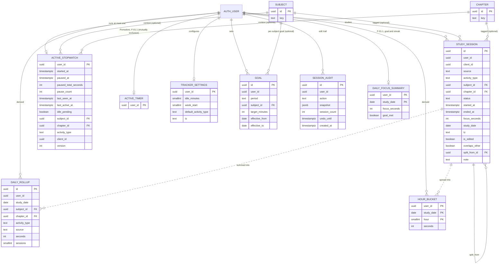

# ERD: F-01.2 Time Tracker and Analytics

| Field | Value |
| --- | --- |
| Linked PRD | `docs/product/prd/F-01.2-time-tracker-and-analytics.md` |
| Order | Fourth PRD/ERD. Extends `docs/product/erd/F-01.1-pomodoro-focus-timer.md` and reads `docs/product/erd/F-02-syllabus-structure-and-coverage.md` |
| Django apps | `apps/api/modules/tracking` (shared study data, extended here), `apps/api/modules/syllabus` and `coverage` (F-02, read and event API), `apps/api/modules/focus` (F-01.1, mutual exclusion check only) |
| Web module | `apps/web/src/modules/tracker` |
| Last updated | 4 Oct 2026 |

## 0. Design decisions

1. **One table for all study time.** `tracking_studysession` (created in F-01.1) already has `source` = `pomodoro`, `stopwatch`, `manual`, `auto`. F-01.2 adds a few columns and rules; no new "time entry" table. Reports read one table.
2. **Server is the clock** for live capture (stopwatch), exactly as in F-01.1: timestamps, never ticks. Manual entries use the times the student gives, validated against server time.
3. **Reports read rollups, not raw sessions.** Two derived tables (`tracking_dailyrollup`, `tracking_hourbucket`) are maintained inside the same transaction as every session write. Both can be rebuilt from `tracking_studysession` by a management command, so they are never the source of truth.
4. **One live timer of any kind per student.** The stopwatch lives in its own row (`tracking_activestopwatch`, PK `user_id`) and the service checks `focus_activetimer` inside the same transaction. Decision on the alternative (one shared live-timer table): kept separate so F-01.1 ships untouched; the check is enforced by the service plus a test. If drift appears, a later migration can merge both into `tracking_livetimer`.
5. **Goals are effective-dated rows**, so changing a goal never rewrites history.
6. **Stable keys for reporting across schemes.** A session points to a `syllabus_subject` row of one scheme. Reports group by the subject's stable `key` (with course and level), so a scheme change does not split a subject's history.
7. **Undo is a short-lived audit row**, not a soft delete of sessions. Sessions stay clean; the audit row holds enough to restore for 10 seconds (and ids and counts for 30 days for support).
8. **Django is the only gateway.** No table here is reachable through the Supabase Data API. RLS is enabled with no policies (deny all).

## 1. Diagram



`user_id` columns reference `auth.users.id` by value, the same convention as `profiles` and F-01.1. `SUBJECT`, `CHAPTER` are shown only for orientation; their definitions are in the F-02 ERD.

## 2. Tables

### 2.1 `tracking_studysession` (changes only; the base table is defined in F-01.1 ERD section 2.2)

New and changed columns (migration `tracking.0002_time_tracker`):

| Column | Type | Null | Default | Notes |
| --- | --- | --- | --- | --- |
| is_edited | boolean | no | false | True after any time edit. Tag-only edits do not set it |
| edit_count | smallint | no | 0 | For the correction-rate metric |
| original_started_at | timestamptz | yes | | First values before the first time edit, for support |
| original_ended_at | timestamptz | yes | | |
| overlaps_other | boolean | no | false | Manual entry the student chose to keep although it overlaps another session |
| split_from_id | uuid | yes | | FK to `tracking_studysession`, on delete set null. Set on the parts of a split |
| merged_count | smallint | no | 1 | Number of sessions merged into this one (1 = never merged) |
| idle_trimmed | boolean | no | false | Stopwatch session whose end was clamped by the idle rule or by the 12 h cap |

Changed rules (replace the F-01.1 constraints; applied in the same migration):

- `source in ('pomodoro','stopwatch','manual','auto')` unchanged. For `stopwatch`, `manual` and `auto` rows, `status` is always `completed` (the `partial` status stays Pomodoro only). Check: `status = 'completed' or source = 'pomodoro'`.
- `focus_seconds` may be at most the wall-clock span: `focus_seconds <= extract(epoch from ended_at - started_at)` (equal when there were no pauses).
- Manual entries (service rules, because `now()` cannot appear in a table check): `ended_at` is not in the future (5 minute clock-skew allowance), `started_at` is not older than 365 days, and the span is at most 24 hours.
- `interruption_reason` stays null unless `status = 'partial'` (unchanged).
- `round_number`, `cycle_id`, `planned_seconds` stay null for stopwatch and manual rows (check: `source = 'pomodoro' or (round_number is null and cycle_id is null)`).

New indexes (created `CONCURRENTLY` only if the table is already large; empty at this release so a normal migration is fine):

- `(user_id, source, started_at desc)` for the log filtered by source
- `(user_id, study_date, started_at)` for day detail and overlap checks (overlap query is a range scan within the day plus the day before for midnight crossings)

Overlap rule (service, not a database constraint): live-captured rows (`pomodoro`, `stopwatch`) must not overlap any other row; `manual` rows may overlap when the student chose `keep` (`overlaps_other = true`).

### 2.2 `tracking_activestopwatch`

The live state of the single running stopwatch. A row exists only while a stopwatch is running or paused.

| Column | Type | Null | Default | Notes |
| --- | --- | --- | --- | --- |
| user_id | uuid | no | | **PK**. One live stopwatch per student |
| started_at | timestamptz | no | | Server time of Start |
| paused_at | timestamptz | yes | | Set while paused |
| paused_total_seconds | int | no | 0 | Finished pauses |
| pause_count | smallint | no | 0 | |
| last_seen_at | timestamptz | no | now() | Latest heartbeat from any open page. Not part of `version` (as in F-01.1) |
| last_active_at | timestamptz | no | now() | Latest user interaction reported by the client (tap, key, scroll) or any action call. Drives the idle rule |
| idle_pending | boolean | no | false | The idle prompt is showing; if unanswered for 2 minutes the service pauses at `last_active_at` |
| subject_id | uuid | yes | | FK to `syllabus_subject`, on delete set null |
| chapter_id | uuid | yes | | FK to `syllabus_chapter`, on delete set null |
| activity_type | text | no | `other` | Same values as sessions |
| client_id | uuid | no | | Becomes the session's `client_id` on Stop, so a retried Stop never duplicates |
| version | int | no | 1 | Optimistic lock, incremented on every change except heartbeat |
| created_at | timestamptz | no | now() | |
| updated_at | timestamptz | no | now() | |

Derived (service, not stored):

```
elapsed   = (paused_at or now) - started_at - paused_total_seconds
cap       = 12 hours of elapsed
idle_due  = idle_minutes > 0 and now - last_active_at >= idle_minutes
auto_pause_at = last_active_at   (when idle_pending and now - idle_prompted_at >= 2 min)
```

Mutual exclusion (service, one transaction): on `start`, `SELECT 1 FROM focus_activetimer WHERE user_id = :u FOR UPDATE` and the insert into this table; if either exists, return 409 with the live timer. The Pomodoro `timer/start/` performs the mirror check against this table. Both checks live in `tracking.services.assert_no_live_timer(user_id)`, called by both modules (the `focus -> tracking` dependency direction is kept).

### 2.3 `tracking_trackersettings`

One row per student, created on first read.

| Column | Type | Null | Default | Notes |
| --- | --- | --- | --- | --- |
| user_id | uuid | no | | **PK** |
| idle_minutes | smallint | no | 10 | 0 = idle prompt off, otherwise 5..60 |
| week_start | smallint | no | 1 | 1 = Monday, 0 = Sunday |
| default_activity_type | text | no | `reading` | |
| tz | text | no | `Asia/Kolkata` | IANA name. Reports use this; each session also keeps its own `tz`. Shared with `focus_focussettings.tz` through `tracking.services.get_timezone(user_id)` so it is stored once per student (the focus column remains the source until F-01.2 ships, then reads go through the service) |
| created_at | timestamptz | no | now() | |
| updated_at | timestamptz | no | now() | |

### 2.4 `tracking_goal`

Effective-dated goals. Overall daily goal is the same value Pomodoro uses (`focus_focussettings.daily_goal_minutes`): the service writes both in one transaction, and `tracking_dailyfocussummary.goal_minutes_snapshot` keeps reading the focus column, so F-01.1 needs no change.

| Column | Type | Null | Default | Notes |
| --- | --- | --- | --- | --- |
| id | uuid | no | gen | PK |
| user_id | uuid | no | | |
| period | text | no | | `daily`, `weekly` |
| subject_id | uuid | yes | | Null = overall goal. Otherwise FK to `syllabus_subject`, on delete cascade |
| subject_key | text | yes | | Copy of the subject's stable key (so a goal can carry over to a new scheme's subject) |
| target_minutes | int | no | | Check: daily 15..1440, weekly 30..10080 |
| effective_from | date | no | | Student's local date from which it applies |
| effective_to | date | yes | | Null = open. Set when a newer row replaces it |
| created_at | timestamptz | no | now() | |

Constraints and indexes:

- Exclusion: no two rows for the same `(user_id, period, coalesce(subject_key,''))` may have overlapping `[effective_from, effective_to]` (partial unique index on `(user_id, period, coalesce(subject_key,'')) where effective_to is null`, plus the service closing the previous row first).
- Index `(user_id, period, effective_from desc)`.

Goal in force on a day or week: the row with `effective_from <= date and (effective_to is null or effective_to >= date)`. For a week, the goal in force on the week's first day applies.

### 2.5 `tracking_dailyrollup` (derived)

The workhorse of reports. One row per student, day, tag combination.

| Column | Type | Null | Default | Notes |
| --- | --- | --- | --- | --- |
| id | bigint | no | identity | PK (surrogate, because nullable tag columns cannot be in a primary key) |
| user_id | uuid | no | | |
| study_date | date | no | | Local day (session `tz`) |
| subject_id | uuid | yes | | FK, on delete set null |
| chapter_id | uuid | yes | | FK, on delete set null |
| activity_type | text | no | | |
| source | text | no | | |
| verified | boolean | no | true | `presence_verified` of the sessions summed (separates unverified Pomodoro claims for the "verified only" filter) |
| seconds | int | no | 0 | Sum of `focus_seconds` of the sessions on this day |
| sessions | smallint | no | 0 | Count of sessions on this day |
| updated_at | timestamptz | no | now() | |

Unique index (the real key): `(user_id, study_date, coalesce(subject_id,'00000000-0000-0000-0000-000000000000'), coalesce(chapter_id,'00000000-0000-0000-0000-000000000000'), activity_type, source, verified)`.

Other indexes: `(user_id, study_date)` for range scans; `(user_id, subject_id, study_date)` for per-subject series; `(user_id, chapter_id, study_date) where chapter_id is not null` for chapter drill-downs.

A session that crosses midnight contributes to the rollup of its start day for `sessions`, and its seconds are split across the two days by the service (see 2.6 for the same split rule). Maintenance: after every insert, edit, delete, merge, split or undo, the service recomputes the affected `(user_id, study_date)` slices with one `DELETE` plus one `INSERT ... SELECT ... GROUP BY` inside the transaction (exact, no incremental drift).

### 2.6 `tracking_hourbucket` (derived)

Seconds per local hour, for "best hours of the day".

| Column | Type | Null | Default | Notes |
| --- | --- | --- | --- | --- |
| user_id | uuid | no | | PK part 1 |
| study_date | date | no | | PK part 2: local date of the hour |
| hour | smallint | no | | PK part 3: 0..23 local hour. Check 0..23 |
| seconds | int | no | 0 | Study seconds that fell in this hour (pauses are subtracted proportionally by the service: pause intervals are not stored per hour, so for sessions with pauses the paused time is spread over the span; accuracy within the hour is approximate and documented in the UI as "approximate") |
| updated_at | timestamptz | no | now() | |

Weekday pattern is derived from `study_date` (no extra table). Sessions are split across hour boundaries (and midnight) by the pure function `split_by_local_hour(started_at, ended_at, tz, paused_total_seconds)` (unit tested including DST-free India time and a foreign tz). Rebuild in the same way as the daily rollup.

### 2.7 `tracking_sessionaudit`

Short trail for undo and support. No note text, no tags beyond ids.

| Column | Type | Null | Default | Notes |
| --- | --- | --- | --- | --- |
| id | uuid | no | gen | PK. The `undo_token` returned by the API is this id |
| user_id | uuid | no | | |
| action | text | no | | `delete`, `merge`, `split`, `edit_times`, `manual_trim` |
| snapshot | jsonb | no | | The affected rows before the change (full columns except `note`) so Undo can restore them with the same ids |
| session_count | smallint | no | 1 | |
| undo_until | timestamptz | no | | `created_at + 10 seconds` |
| created_at | timestamptz | no | now() | |

Index `(user_id, created_at desc)`; a scheduled cleanup removes rows older than 30 days (`pg_cron` or a Vercel Cron call to a protected endpoint; until then a lazy delete runs on each write for that student). `note` is excluded from the snapshot; if a deleted session is undone, the note is restored from a copy held in the browser's undo state for those 10 seconds (the client resends it with the undo call). Undo after `undo_until` returns 410.

### 2.8 Unchanged tables used by this feature

| Table | Owner | Use here |
| --- | --- | --- |
| `focus_activetimer` | F-01.1 | Mutual exclusion check |
| `focus_focussettings` | F-01.1 | Daily goal and time zone (single source for the overall daily goal) |
| `tracking_dailyfocussummary` | F-01.1 | Goal met and streak. Its `focus_seconds` already sums all sources, so manual and stopwatch time count toward the goal (PRD Q3). Written by the same session service |
| `syllabus_*`, `coverage_*` | F-02 | Taxonomy lookups and `record_event('study_time')` |

## 3. Relationships to existing modules

| From | To | Rule |
| --- | --- | --- |
| all `user_id` columns | `auth.users.id` | By value, no cross-schema foreign key. Owned by the JWT `sub` |
| `tracking_studysession`, `tracking_activestopwatch`, `tracking_dailyrollup` subject and chapter columns | `syllabus_subject`, `syllabus_chapter` | Real foreign keys, `on delete set null`. Reads through `syllabus.selectors` |
| `tracking_goal.subject_id` | `syllabus_subject` | FK cascade; `subject_key` copy used to carry goals across schemes |
| `tracking.services.record_session(...)` | `coverage.services.record_event(type='study_time', value=seconds, source='tracking', source_ref=session id)` | Called after every saved session that has a chapter (FR-16). Idempotent through `client_id` or session id |
| `focus.services` | `tracking.services.assert_no_live_timer` and `record_session` | Pomodoro uses the same session writer so rollups stay consistent |
| Reports `time-vs-coverage` | `coverage.selectors` | Reads chapter coverage percent; no writes |
| F-10 Performance Analytics (later) | `tracking_dailyrollup`, `tracking_hourbucket` | Read-only through `tracking.selectors` |

Dependency direction (no cycles): `focus -> tracking -> coverage -> syllabus`.

Django layout (new and changed files in `apps/api/modules/tracking`):

```
tracking/
  models.py            StudySession (changed), ActiveStopwatch, TrackerSettings, Goal, DailyRollup, HourBucket, SessionAudit
  domain/
    durations.py       pure: elapsed, caps, idle clamp, overlap detection, split_by_local_hour, merge and split maths
    reports.py         pure: period bucketing (day, week, month with week_start), compare ranges, pace
  services.py          record_session, edit, delete, undo, merge, split, stopwatch actions, goals, rebuild rollups
  selectors.py         sessions list, reports (summary, series, breakdown, heatmap, hours, time_vs_coverage, weekly_summary), CSV rows
  serializers.py views.py urls.py
  management/commands/rebuild_tracking_rollups.py
  tests/
```

## 4. Enumerations and reference data

| Name | Values | Stored as | Owner |
| --- | --- | --- | --- |
| Source | pomodoro, stopwatch, manual, auto | text with check (from F-01.1) | code |
| Session status | completed, partial | text with check | code |
| Activity type | reading, practice, revision, notes, mock_test, other | text with check (from F-01.1) | code |
| Goal period | daily, weekly | text with check | code |
| Audit action | delete, merge, split, edit_times, manual_trim | text with check | code |
| Overlap choice (API only) | trim, keep, reject | serializer choice | code |
| Week start | 0 (Sunday), 1 (Monday) | smallint with check | code |
| Heatmap intensity buckets | 0, under 30 min, 30 to 90, 90 to 180, 180 to 300, over 300 | constants in `reports.py` and `heatmap.ts`, with a parity test | code |

No seed data. Limits (12 h cap, 60 day confirmation, 365 day reject, 10 s undo, 2 min idle answer, 30 min merge gap) are constants in `tracking/domain/durations.py` and mirrored in `modules/tracker/lib/limits.ts` with a parity test.

## 5. Query patterns

All "range" reads use the student's `tz` and `week_start`. "Group by key" means joining the subject to its stable `key`, so schemes do not split history.

| # | Query | Served by |
| --- | --- | --- |
| Q-1 | Live state: stopwatch row and Pomodoro row for the student (`GET stopwatch/` returns `live`) | PK lookups on both tables |
| Q-2 | Start stopwatch: lock check on `focus_activetimer`, insert row, fail on conflict | PK conflict, `FOR UPDATE` |
| Q-3 | Pause, resume, change context, idle answer: `UPDATE ... WHERE user_id = :u AND version = :v` | PK |
| Q-4 | Stop: in one transaction insert `studysession` (idempotent on `client_id`), refresh `dailyrollup`, `hourbucket` and `dailyfocussummary` for affected days, delete the stopwatch row, forward `study_time` to coverage | unique `(user_id, client_id)`, rollup unique index |
| Q-5 | Manual entry with overlap check: sessions where `started_at < :end and ended_at > :start` within `(user_id, study_date in (d-1, d, d+1))` | `(user_id, study_date, started_at)` |
| Q-6 | Edit, delete, merge, split, undo: write audit row, change sessions, recompute the affected days | PK on `id`, rollup recompute by `(user_id, study_date)` |
| Q-7 | Today and day detail: sessions of one local day in time order | `(user_id, study_date, started_at)` |
| Q-8 | Sessions log with filters and cursor pagination | `(user_id, started_at desc)`, `(user_id, source, started_at desc)`, `(user_id, subject_id, started_at desc)` |
| Q-9 | Summary tiles for a range: `SUM(seconds)`, `COUNT(DISTINCT study_date)`, max day, plus session count and longest session | `(user_id, study_date)` on `dailyrollup`; longest session is one `ORDER BY focus_seconds DESC LIMIT 1` on `studysession` within the range |
| Q-10 | Series by day, week, month: `date_trunc` (week with `week_start` offset) over `dailyrollup`, grouped by `total`, `subject_key`, `activity_type` or `source` | `(user_id, study_date)` |
| Q-11 | Breakdown by level, group, subject, chapter: join rollup to `syllabus_subject`, `syllabus_group`, `syllabus_chapter`, group by stable keys, `parent_id` narrows the level | `(user_id, subject_id, study_date)`, `(user_id, chapter_id, study_date)` |
| Q-12 | Heatmap: per-day seconds for up to 366 days | `(user_id, study_date)` on `dailyrollup` (`GROUP BY study_date`) |
| Q-13 | Best hours and weekday pattern: `SUM(seconds)` by `hour` over 90 days, and by `extract(dow from study_date)` | PK range on `hourbucket`; `dailyrollup` for weekday |
| Q-14 | Time versus coverage per chapter of a subject: seconds per chapter from rollup joined to `coverage_chapterprogress.coverage_pct` | rollup chapter index, `(enrollment_id, chapter_id)` |
| Q-15 | Goals in force and progress for today and this week | `(user_id, period, effective_from desc)`; today and week seconds from `dailyrollup` |
| Q-16 | Pace: expected seconds by weekday from the weekly goal versus seconds so far (pure function on Q-15 and Q-10 outputs) | none (computed) |
| Q-17 | CSV export: stream sessions for a range with a server-side cursor | `(user_id, started_at desc)` |
| Q-18 | Rebuild rollups from sessions for a range (admin command, tests) | `(user_id, study_date)` on sessions |
| Q-19 | Weekly summary: series for the previous week, top subject, best day, goal result | Q-10, Q-11, Q-15 reused |

Report responses are cacheable per student for 60 seconds with an `ETag` built from `max(updated_at)` of the student's rollup rows in the range.

## 6. Storage

No files stored. CSV exports are streamed responses (not saved). No Supabase Storage bucket.

## 7. Security

- **Access path:** browser, then Django, then Postgres. Supabase Data API stays disabled.
- **RLS:** enabled on every new table (`tracking_activestopwatch`, `tracking_trackersettings`, `tracking_goal`, `tracking_dailyrollup`, `tracking_hourbucket`, `tracking_sessionaudit`) with no policies; the existing post-migrate hook enables it and a test asserts `relrowsecurity` is true for each.
- **Scoping:** every selector and service takes `user_id` from the verified JWT. No endpoint accepts `user_id`. Detail routes filter id and `user_id` together (another student's id returns 404). `undo_token` is checked against the caller's `user_id`.
- **Validation:** subject and chapter must exist and be active and the chapter must belong to the subject; time limits as in PRD section 5.4; goals within the ranges in 2.4; export ranges capped (10,000 rows per request, then paginated by `cursor`).
- **PII:** `note`, `study_date`, `tz` and the hour pattern reveal habits: treat the whole feature as personal data. Notes are never logged, never sent to PostHog or Sentry (scrubbed in `before_send`) and never copied into the audit snapshot or the CSV unless the student ticks "include notes" on export.
- **Abuse:** DRF throttles: mutating endpoints 60 per minute per student; exports 6 per hour; reports 120 per minute.
- **Retention and deletion:** data is kept until the student deletes it. `tracking.services.delete_all_for_user` (already invoked by account deletion, extended here) also removes `activestopwatch`, `trackersettings`, `goal`, `dailyrollup`, `hourbucket` and `sessionaudit` rows. Export (PRD FR-34) adds goals and settings to the existing JSON dump.
- **Auditing:** `created_at` and `updated_at` plus the 30 day `sessionaudit` trail described above.

## 8. Migration and rollout

Migration order:

1. (Prerequisite) `syllabus` and `coverage` migrations from F-02.
2. (Prerequisite) `tracking.0001_initial` and `focus.0001_initial` from F-01.1.
3. `tracking.0002_time_tracker`: new columns and constraints on `studysession`, then `activestopwatch`, `trackersettings`, `goal`, `dailyrollup`, `hourbucket`, `sessionaudit` and their indexes.
4. `tracking.0003_backfill_rollups` (data migration, idempotent): builds `dailyrollup` and `hourbucket` from existing Pomodoro `studysession` rows through the same pure functions. At beta scale this is small; for a larger table run `rebuild_tracking_rollups` in batches by month instead of inside the migration.
5. Post-migrate hook: enable RLS on the new tables.

Notes:

- All changes are additive: new nullable or defaulted columns and new tables. The rewritten check constraints are added `NOT VALID` then `VALIDATE CONSTRAINT` in a second step so no long table lock is taken.
- Run migrations with `DIRECT_DATABASE_URL` (port 5432).
- Any later index on a large `tracking_studysession` or `tracking_dailyrollup` uses `AddIndexConcurrently` (`atomic = False`).
- The `time_tracker` flag gates the new endpoints (404 when off), so tables ship before the UI. Pomodoro keeps working with the flag off.
- Expected volume per student: 5 to 20 sessions a day, so about 2,000 to 7,000 session rows a year; daily rollup about 3 to 10 rows per active day; hour buckets at most 24 rows a day. One Postgres handles this without partitioning; revisit past tens of millions of session rows.
- Rollback: drop the six new tables and the added columns (all additive); F-01.1 is unaffected.

### Forward compatibility

| Later need | How this design supports it |
| --- | --- |
| Auto-capture (Notes, Question Bank, Mock) | `source = 'auto'` exists; those modules call `tracking.services.record_session` with a `source_ref`, add a nullable `source_ref text` column then (documented here, not created now) |
| Planned versus actual, Today tiles | Nullable `plan_task_id` on `studysession` and a `plan_task_id` column in `dailyrollup`, added by the Planner module |
| Tags beyond subject, chapter, activity | `tag` and `studysession_tag` tables; rollup gains an optional tag dimension only if reports need it |
| Mentor sharing | Read-only share rows referencing the student and a scope; reports are already pure selectors that take a `user_id` |
| F-10 readiness and marks versus time | Read `tracking_dailyrollup` and `coverage_chapterprogress`; no new capture needed |
| X-01 notifications (weekly summary, behind pace) | `reports/weekly-summary` selector and the pace function are reused by a notification job |

## 9. Web module plan (`apps/web/src/modules/tracker`)

```
tracker/
  index.ts                  public barrel (TrackerPage, ReportsPage, useLiveTimer)
  lib/
    limits.ts               constants mirrored from the api (parity test)
    duration.ts             pure: elapsed(), cap, format "1 h 15 min", clock offset
    range.ts                pure: range presets, grouping (day, week, month with week start), compare range
    pace.ts                 pure: expected-by-now for weekly goals
    heatmap.ts              pure: intensity buckets, calendar grid
    offline-queue.ts        shared with focus (moved to a common lib if both need it)
  hooks/
    useStopwatch.ts         timestamps from server, 250 ms render tick, never the source of truth
    useLiveTimer.ts         which timer is live (pomodoro, stopwatch, none), drives the mini timer
    useSessions.ts  useManualEntry.ts  useSessionActions.ts (edit, delete, undo, merge, split)
    useGoals.ts  useTrackerSettings.ts
    useReport.ts            one hook per report endpoint, URL-driven params
  components/               presentational only
    StopwatchCard.tsx  ContextPicker.tsx (shared with focus)  ManualEntryForm.tsx
    SessionRow.tsx  SessionTimeline.tsx  GoalRings.tsx  PaceNote.tsx
    ReportToolbar.tsx  SummaryTiles.tsx  TrendChart.tsx  SubjectSplit.tsx
    ActivitySplit.tsx  CalendarHeatmap.tsx  HoursChart.tsx  TimeVsCoverage.tsx
    WeeklySummaryCard.tsx  IdlePrompt.tsx
  containers/
    TrackerPageContainer.tsx  ReportsPageContainer.tsx  DayDetailContainer.tsx
    SessionsLogContainer.tsx  GoalsContainer.tsx  SettingsContainer.tsx
```

Routes (thin): `app.tracker.index`, `app.tracker.reports`, `app.tracker.day.$date`, `app.tracker.log`, `app.tracker.goals`, `app.settings.tracker`. The mini timer (from F-01.1) is extended to read `useLiveTimer` so it shows the Pomodoro or the stopwatch.

The first unit tests to write, before any UI: `duration` (pause maths, 12 h cap, idle clamp), `range` (week start Monday and Sunday, month ends, compare range), `pace`, `split_by_local_hour` (midnight and hour boundaries) and its TypeScript twin, and the report totals-equal-sum-of-sessions property test on the api after random edits, merges, splits and deletes.
