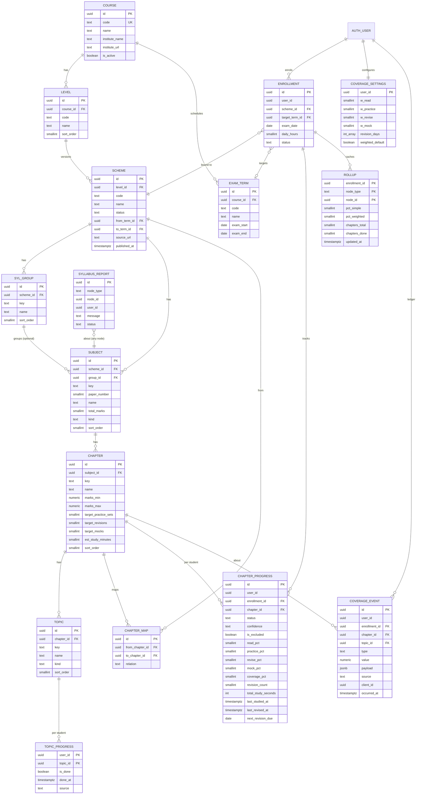

# ERD: F-02 Syllabus Structure and Coverage (with X-05 Taxonomy)

| Field | Value |
| --- | --- |
| Linked PRD | `docs/product/prd/F-02-syllabus-structure-and-coverage.md` |
| Django apps | `apps/api/modules/syllabus` (public taxonomy), `apps/api/modules/coverage` (private student progress) |
| Web modules | `apps/web/src/modules/syllabus` (public pages, tree components), `apps/web/src/modules/coverage` (onboarding, map, chapter) |
| Last updated | 4 Oct 2026 |

The existing web `modules/catalog` (static courses and features used by the landing page) keeps its role for marketing copy. Subject and chapter data come from the `syllabus` API; `catalog` only keeps landing content and links to it.

## 0. Design decisions

1. **Two worlds, two modules.** `syllabus` is shared, public-read, admin-write reference data. `coverage` is private per-student data. `coverage -> syllabus` is the only dependency direction.
2. **Scheme versioning is a first-class table.** All nodes below a level (group, subject, chapter, topic) belong to a `scheme`. A scheme change creates a new set of rows; progress stays attached to the old rows and a mapping table carries it over. Nothing is ever mutated in a way that breaks history.
3. **Stable keys.** Every node has a `key` slug unique within its parent, and the same chapter keeps its key across schemes. URLs and mapping use keys; foreign keys use ids.
4. **Event ledger plus derived progress.** `coverage_event` is append-only and is the source of truth. `coverage_chapter_progress` and `coverage_topic_progress` are derived and can be rebuilt from the ledger (a management command does this).
5. **Pure formula in one place.** The coverage maths is a pure function (`coverage/domain/formula.py`, mirrored by tests and by a TypeScript copy only for optimistic UI). Weights come from the student's settings.
6. **Read path is cheap.** Roll-ups (subject, group, level) are cached in `coverage_rollup`, recomputed in the same transaction as the chapter change (at most 3 ancestor rows).
7. **Django is the only gateway** to every table. Public reads are cached at the CDN. RLS is enabled with no policies on all tables.

## 1. Diagram



`user_id` columns reference `auth.users.id` by value, as in `profiles`. `CHAPTER_MAP` links chapters of two different schemes of the same level.

## 2. Tables: module `syllabus` (public reference data)

Common columns on every table here: `id uuid PK default gen`, `created_at timestamptz default now()`, `updated_at timestamptz default now()`. Soft state uses `is_active` instead of deletes once a row is referenced.

### 2.1 `syllabus_course`

| Column | Type | Null | Default | Notes |
| --- | --- | --- | --- | --- |
| code | text | no | | `ca`, `cs`, `cma`. Unique, used in URLs |
| name | text | no | | Chartered Accountancy, Company Secretary, Cost and Management Accountancy |
| institute_name | text | no | | ICAI, ICSI, ICMAI |
| institute_url | text | yes | | Official site |
| description | text | yes | | Short SEO description |
| is_active | boolean | no | true | |

### 2.2 `syllabus_level`

| Column | Type | Null | Default | Notes |
| --- | --- | --- | --- | --- |
| course_id | uuid | no | | FK `syllabus_course`, restrict |
| code | text | no | | `foundation`, `intermediate`, `final`, `executive`, `professional` |
| name | text | no | | |
| sort_order | smallint | no | 0 | |
| is_active | boolean | no | true | |

Unique `(course_id, code)`.

### 2.3 `syllabus_examterm`

| Column | Type | Null | Default | Notes |
| --- | --- | --- | --- | --- |
| course_id | uuid | no | | FK |
| code | text | no | | `2027-05`. Unique per course |
| name | text | no | | "May 2027" |
| exam_start | date | yes | | |
| exam_end | date | yes | | |
| is_open | boolean | no | true | Shown in onboarding |

### 2.4 `syllabus_scheme`

| Column | Type | Null | Default | Notes |
| --- | --- | --- | --- | --- |
| level_id | uuid | no | | FK `syllabus_level` |
| code | text | no | | `2023` or `2025`. Unique per level |
| name | text | no | | "2023 Scheme" |
| status | text | no | `draft` | `draft`, `published`, `retired` |
| from_term_id | uuid | yes | | FK `syllabus_examterm`: first term it applies to |
| to_term_id | uuid | yes | | Last term it applies to (null = open) |
| source_url | text | yes | | Official document the structure was built from |
| published_at | timestamptz | yes | | |
| notes | text | yes | | Editor notes |

Rule: at most one `published` scheme per level covers a given term (checked in the publish service). Students only ever see `published` schemes; `retired` stay readable for existing enrolments.

### 2.5 `syllabus_group`

| Column | Type | Null | Default | Notes |
| --- | --- | --- | --- | --- |
| scheme_id | uuid | no | | FK, cascade only within an unpublished scheme (service rule) |
| key | text | no | | `group-1` |
| name | text | no | | |
| sort_order | smallint | no | 0 | |

Unique `(scheme_id, key)`. Levels without groups (for example Foundation) simply have no group rows and subjects with `group_id = null`.

### 2.6 `syllabus_subject` (a "paper")

| Column | Type | Null | Default | Notes |
| --- | --- | --- | --- | --- |
| scheme_id | uuid | no | | FK |
| group_id | uuid | yes | | FK `syllabus_group` |
| key | text | no | | `taxation`. Stable across schemes |
| paper_number | smallint | yes | | Paper 1, 2, ... |
| name | text | no | | |
| total_marks | smallint | yes | | |
| exam_duration_minutes | smallint | yes | | |
| kind | text | no | `theory` | `theory`, `practical`, `mixed`, `elective` |
| is_optional | boolean | no | false | Elective or optional papers |
| sort_order | smallint | no | 0 | |
| is_active | boolean | no | true | |

Unique `(scheme_id, key)`. Index `(scheme_id, group_id, sort_order)`.

### 2.7 `syllabus_chapter`

| Column | Type | Null | Default | Notes |
| --- | --- | --- | --- | --- |
| subject_id | uuid | no | | FK |
| key | text | no | | `gst-itc` |
| name | text | no | | |
| marks_min | numeric(5,1) | yes | | Indicative weightage low |
| marks_max | numeric(5,1) | yes | | Indicative weightage high |
| weight_source | text | no | `unknown` | `official`, `analysis`, `unknown` |
| target_practice_sets | smallint | no | 1 | Denominator for the practice component |
| target_revisions | smallint | no | 2 | Denominator for the revise component |
| target_mocks | smallint | no | 1 | Denominator for the mock component |
| est_study_minutes | smallint | yes | | For the planner later |
| sort_order | smallint | no | 0 | |
| is_active | boolean | no | true | |

Unique `(subject_id, key)`. Checks: `marks_max >= marks_min`, targets between 0 and 20. The marks weight used in weighted roll-ups is `coalesce((marks_min + marks_max)/2, marks_max, marks_min, 1)`.

### 2.8 `syllabus_topic`

| Column | Type | Null | Default | Notes |
| --- | --- | --- | --- | --- |
| chapter_id | uuid | no | | FK |
| key | text | no | | |
| name | text | no | | |
| kind | text | no | `concept` | `concept`, `section`, `rule`, `standard`, `formula`, `case_law`, `illustration` |
| sort_order | smallint | no | 0 | |
| is_active | boolean | no | true | |

Unique `(chapter_id, key)`. Topics are optional; a chapter without topics uses an implicit single topic in the coverage maths (the chapter itself is tickable).

### 2.9 `syllabus_chaptermap`

Carries progress between schemes.

| Column | Type | Null | Default | Notes |
| --- | --- | --- | --- | --- |
| from_chapter_id | uuid | no | | FK, chapter in the old scheme |
| to_chapter_id | uuid | no | | FK, chapter in the new scheme |
| relation | text | no | `same` | `same`, `split`, `merged`, `partial` |
| carry_ratio | numeric(3,2) | no | 1.00 | Fraction of progress carried (for `split` and `partial`) |

Unique `(from_chapter_id, to_chapter_id)`. A chapter in the new scheme with no incoming row is "new"; one in the old scheme with no outgoing row is "removed". Default creation rule: same `key` in the same subject key gives `same`. Editors adjust the rest.

### 2.10 `syllabus_report`

| Column | Type | Null | Default | Notes |
| --- | --- | --- | --- | --- |
| node_type | text | no | | `course`, `level`, `scheme`, `subject`, `chapter`, `topic` |
| node_id | uuid | no | | |
| user_id | uuid | yes | | Null for anonymous reports |
| message | text | no | | Max 1000 characters |
| status | text | no | `open` | `open`, `accepted`, `rejected`, `fixed` |

Index `(status, created_at)`.

## 3. Tables: module `coverage` (private per student)

### 3.1 `coverage_enrollment`

| Column | Type | Null | Default | Notes |
| --- | --- | --- | --- | --- |
| id | uuid | no | gen | PK |
| user_id | uuid | no | | Owner |
| scheme_id | uuid | no | | FK `syllabus_scheme` (implies level and course) |
| target_term_id | uuid | yes | | FK `syllabus_examterm` |
| exam_date | date | yes | | Student's own date, overrides the term |
| daily_hours | numeric(3,1) | yes | | |
| status | text | no | `active` | `active`, `archived` |
| carried_from_id | uuid | yes | | Previous enrolment when the scheme was switched |
| created_at, updated_at | timestamptz | no | now() | |

Partial unique index `(user_id, level)` where `status = 'active'` (level is reached through the scheme, stored denormalised as `level_id` for the index). One active enrolment per student and level; a student can be enrolled in more than one level or course at the same time if needed later.

### 3.2 `coverage_settings`

| Column | Type | Null | Default | Notes |
| --- | --- | --- | --- | --- |
| user_id | uuid | no | | PK |
| w_read | smallint | no | 40 | Check 0..100 |
| w_practice | smallint | no | 30 | |
| w_revise | smallint | no | 20 | |
| w_mock | smallint | no | 10 | |
| revision_days | smallint[] | no | `{3,7,21,45}` | Gaps between revisions. Max 8 entries, each 1..365 |
| weighted_default | boolean | no | false | Marks-weighted roll-ups by default |
| created_at, updated_at | timestamptz | no | now() | |

Check: `w_read + w_practice + w_revise + w_mock = 100`.

### 3.3 `coverage_topicprogress`

| Column | Type | Null | Default | Notes |
| --- | --- | --- | --- | --- |
| user_id | uuid | no | | PK part 1 |
| topic_id | uuid | no | | PK part 2, FK `syllabus_topic` |
| enrollment_id | uuid | no | | FK |
| is_done | boolean | no | false | |
| done_at | timestamptz | yes | | |
| source | text | no | `manual` | `manual`, `catchup`, `carryover`, `auto` |
| updated_at | timestamptz | no | now() | Used for last-write-wins between devices |

Index `(enrollment_id, is_done)`.

### 3.4 `coverage_chapterprogress` (derived)

| Column | Type | Null | Default | Notes |
| --- | --- | --- | --- | --- |
| id | uuid | no | gen | PK |
| user_id | uuid | no | | |
| enrollment_id | uuid | no | | FK |
| chapter_id | uuid | no | | FK `syllabus_chapter` |
| status | text | no | `not_started` | `not_started`, `reading`, `practised`, `revised_once`, `revised_twice_plus`, `exam_ready` |
| confidence | text | yes | | `red`, `amber`, `green`. Chosen by the student, never derived |
| is_excluded | boolean | no | false | |
| read_pct | smallint | no | 0 | 0..100 |
| practice_pct | smallint | no | 0 | |
| revise_pct | smallint | no | 0 | |
| mock_pct | smallint | no | 0 | |
| coverage_pct | smallint | no | 0 | Weighted by the student's settings |
| practice_count | smallint | no | 0 | |
| mock_count | smallint | no | 0 | |
| revision_count | smallint | no | 0 | |
| total_study_seconds | int | no | 0 | Forwarded by tracking, display only |
| first_started_at | timestamptz | yes | | |
| last_studied_at | timestamptz | yes | | |
| last_revised_at | timestamptz | yes | | |
| next_revision_due | date | yes | | From `revision_days` |
| updated_at | timestamptz | no | now() | |

Unique `(user_id, chapter_id)`. Indexes: `(enrollment_id, chapter_id)`, `(enrollment_id, next_revision_due) where next_revision_due is not null and not is_excluded` (the due list), `(user_id, last_studied_at desc)`.

Rows are created lazily on first event, or in bulk when the enrolment is created (one row per chapter, so reads are simple joins; about 150 rows per level).

### 3.5 `coverage_event` (append-only ledger)

| Column | Type | Null | Default | Notes |
| --- | --- | --- | --- | --- |
| id | uuid | no | gen | PK |
| user_id | uuid | no | | |
| enrollment_id | uuid | no | | FK |
| chapter_id | uuid | no | | FK |
| topic_id | uuid | yes | | FK, for topic events |
| type | text | no | | see below |
| value | numeric | yes | | seconds for `study_time`, score percent for `mock_done` |
| payload | jsonb | no | `{}` | Small free data (never personal text) |
| source | text | no | `manual` | `manual`, `catchup`, `tracking`, `question_bank`, `mock`, `notes`, `carryover`, `system` |
| source_ref | text | yes | | Id in the source module (for example session id) |
| client_id | uuid | yes | | Idempotency key per user |
| occurred_at | timestamptz | no | now() | When it happened (client time accepted within a window, otherwise server time) |
| created_at | timestamptz | no | now() | |

Event types: `topic_done`, `topic_undone`, `practice_done`, `mock_done`, `revision_done`, `study_time`, `confidence_set`, `excluded`, `included`, `note_added`.

Indexes: unique `(user_id, client_id) where client_id is not null`; `(enrollment_id, chapter_id, occurred_at)`; `(user_id, occurred_at desc)`.

Events are never updated or deleted, except by the account-deletion service.

### 3.6 `coverage_rollup` (derived cache)

| Column | Type | Null | Default | Notes |
| --- | --- | --- | --- | --- |
| enrollment_id | uuid | no | | PK part 1 |
| node_type | text | no | | PK part 2: `subject`, `group`, `level` |
| node_id | uuid | no | | PK part 3 |
| pct_simple | smallint | no | 0 | Average of included chapters |
| pct_weighted | smallint | no | 0 | Marks-weighted average |
| chapters_total | smallint | no | 0 | Excludes excluded chapters |
| chapters_done | smallint | no | 0 | Chapters at 100 or exam ready |
| updated_at | timestamptz | no | now() | |

The overview endpoint reads these rows directly (3 + groups + subjects rows). A rebuild service recomputes them from `coverage_chapterprogress`.

## 4. Coverage maths (reference for tests)

For a chapter with `T` topics (implicit 1 if none), `d` done:

```
read     = round(100 * d / T)
practice = round(100 * min(1, practice_count / target_practice_sets))   (0 if target = 0 -> component hidden, weight redistributed)
revise   = round(100 * min(1, revision_count / target_revisions))
mock     = round(100 * min(1, mock_count / target_mocks))
coverage = round((read*w_read + practice*w_practice + revise*w_revise + mock*w_mock) / 100)
```

If a target is 0 the component is not applicable and its weight is redistributed proportionally across the others.

Status rules (first match from the top):

1. `exam_ready`: coverage >= 85 and revision_count >= 2
2. `revised_twice_plus`: revision_count >= 2
3. `revised_once`: revision_count = 1
4. `practised`: read = 100 and practice_count >= 1
5. `reading`: any topic done or any event
6. `not_started`

Roll-up (subject, group, level): over chapters where `is_excluded = false`:

```
pct_simple   = round(avg(coverage_pct))
pct_weighted = round(sum(coverage_pct * marks_weight) / sum(marks_weight))
```

Next revision due: after each `revision_done`, `next_revision_due = date(occurred_at) + revision_days[min(revision_count, len) - 1]` days (the array position moves with the count, the last gap repeats).

Worked example (default weights): read 100, practice 50, revise 50, mock 0 gives `(100*40 + 50*30 + 50*20 + 0) / 100 = 65`.

## 5. Relationships to existing and upcoming modules

| From | To | Rule |
| --- | --- | --- |
| `profiles` | `coverage_*` | By `user_id` value. Account deletion calls `coverage.services.delete_all_for_user` |
| `tracking_studysession.subject_id`, `chapter_id` | `syllabus_subject`, `syllabus_chapter` | FK, `on delete set null`. `tracking` forwards time through `coverage.services.record_event(type='study_time', ...)` |
| `focus_*` | `syllabus_*` | Read only through `syllabus.selectors` |
| Notes, Question Bank, Mocks (later) | `syllabus_chapter`, `syllabus_topic` | FK on their rows; they report progress through `coverage.services.record_event` only |
| Ingestion (X-04) | `syllabus_scheme` and below | Writes only as a **draft** scheme or a reviewed change through `syllabus.services`, never directly to published rows |
| Amendments (F-14) | `syllabus_chapter` | FK; coverage flags chapters "needs re-read" via an event `system` type later |

Dependency direction: `focus -> tracking -> coverage -> syllabus`, and `ingestion -> syllabus`. No cycles.

## 6. Enumerations and reference data

| Name | Values | Stored as | Owner |
| --- | --- | --- | --- |
| Course codes | ca, cs, cma | rows | seed |
| Scheme status | draft, published, retired | text + check | code |
| Subject kind | theory, practical, mixed, elective | text + check | code |
| Topic kind | concept, section, rule, standard, formula, case_law, illustration | text + check | code |
| Chapter status | see section 4 | text + check | code, derived |
| Confidence | red, amber, green | text + check | code |
| Event type | see 3.5 | text + check | code |
| Event source | manual, catchup, tracking, question_bank, mock, notes, carryover, system | text + check | code |
| Chapter map relation | same, split, merged, partial | text + check | code |

**Seed data:** JSON files per course in `apps/api/modules/syllabus/seed/<course>/<level>/<scheme>.json` describing groups, subjects, chapters, topics, marks and sources. They are produced from the official syllabus documents, reviewed by a person, and loaded by `python manage.py load_syllabus_seed` (idempotent by `key`). Each file carries `source_url` and a reviewer note. The ingestion service (X-04) later helps create these files as drafts, with the same review step.

## 7. Query patterns

| # | Query | Served by |
| --- | --- | --- |
| Q-1 | Public: level page with groups, subjects (one scheme) | `(scheme_id, group_id, sort_order)` on subject; CDN cache |
| Q-2 | Public: subject page with chapters and topics | `(subject_id, sort_order)` on chapter, `(chapter_id, sort_order)` on topic |
| Q-3 | Public: resolve URL `/courses/ca/intermediate/taxation/gst-itc` by keys | unique keys on each table, one join chain (published scheme of the level) |
| Q-4 | Sitemap: all published subject and chapter keys | scan with `scheme.status = 'published'`, cached |
| Q-5 | Overview: rollup rows for an enrolment | PK on `coverage_rollup` |
| Q-6 | Subject coverage: chapter rows with percent and status | `(enrollment_id, chapter_id)` join chapter on `subject_id` |
| Q-7 | Chapter detail: topics with done flags | join topic and topic progress on `(user_id, topic_id)` |
| Q-8 | Tick or untick: upsert topic progress, insert event, recompute chapter and its 3 ancestors in one transaction | PK on topic progress, unique `client_id` |
| Q-9 | Due list ordered by overdue days and marks weight | partial index on `next_revision_due` |
| Q-10 | Quick catch-up: bulk upsert of topic progress for chosen chapters, one event per chapter | single transaction, `INSERT ... ON CONFLICT` |
| Q-11 | Scheme switch: for each old chapter with a mapping, copy progress scaled by `carry_ratio`, write `carryover` events | `coverage_enrollment` + `syllabus_chaptermap` |
| Q-12 | Rebuild derived data from the ledger (admin, tests) | `(enrollment_id, chapter_id, occurred_at)` |

## 8. Storage

No files. The OG images for public syllabus pages are generated at build or on demand (the existing `scripts/generate-og.mjs` extended per course and level) and stored under `apps/web/public/og/`. Dynamic per-chapter OG images can use a server route that renders text onto a template; no Supabase Storage is required.

## 9. Security

- **Public data:** `syllabus_*` read endpoints are unauthenticated and cacheable. They never expose draft or retired schemes (retired only to their enrolled students) and never expose `syllabus_report`.
- **Admin writes:** require the `admin` or `editor` role (a column on `profiles`, checked in a DRF permission class and in Django admin). All publish and retire actions are logged in the Django admin history.
- **Student data:** every `coverage_*` query filters by the JWT `sub`. Detail routes filter id and user together, so another student's id returns 404.
- **RLS:** enabled with no policies on all tables listed here; the post-migrate hook covers them, and a test asserts it.
- **Validation:** weights total 100; chapters must belong to the enrolment's scheme (service check); event `value` ranges by type; payload limited to 2 KB and scrubbed of text.
- **Rate limits:** DRF throttles on `POST coverage/events/`, `catchup` and `syllabus/reports/` (anonymous reports are throttled per IP).
- **PII:** none in `syllabus`. In `coverage`, progress and confidence are personal data: included in export, removed on delete. Nothing from `coverage` is sent to analytics except counts and keys.
- **Retention:** kept until the student deletes it; old schemes are never deleted.

## 10. Migration and rollout

Order (one migration set per app):

1. `syllabus.0001_initial`: course, level, examterm, scheme, group, subject, chapter, topic, chaptermap, report with all constraints and indexes.
2. `syllabus.0002_seed_reference`: data migration for the three courses, their levels and the open exam terms (small, idempotent). Detailed schemes are loaded with the management command, not inside migrations, so content can be updated without a migration.
3. `coverage.0001_initial`: enrolment, settings, topic progress, chapter progress, event, rollup.
4. Post-migrate hook: RLS enabled on all new tables.

Notes:

- Only new tables are created: no backfill and no downtime risk.
- Use `DIRECT_DATABASE_URL` for migrations.
- Later indexes on `coverage_event` (the largest table) use `AddIndexConcurrently`.
- Expected volume: about 150 chapters and 500 topics per level; per active student about 150 chapter rows, 500 topic rows and a few thousand events a year. Comfortable for one Postgres without partitioning. If events grow past tens of millions, partition `coverage_event` by month on `occurred_at`.
- The feature flag `syllabus_coverage` hides only the private screens; the public API and pages ship earlier (Phase B).
- Rollback is a drop of `coverage` then `syllabus` tables before any other feature depends on them.

## 11. Module layout

### API

```
apps/api/modules/
  syllabus/
    models.py selectors.py services.py (publish, retire, map schemes) serializers.py views.py urls.py admin.py
    seed/ca/intermediate/2023.json ...
    management/commands/load_syllabus_seed.py
    tests/
  coverage/
    models.py
    domain/formula.py        pure maths: components, status, rollup, next due (unit tested)
    services.py             record_event, tick_topic, catchup, switch_scheme, rebuild
    selectors.py            overview, subject view, chapter view, due list
    serializers.py views.py urls.py
    tests/
```

### Web

```
apps/web/src/modules/
  syllabus/                 public pages and tree
    lib/ (urls, seo helpers)  hooks/ (useLevel, useSubject)  components/ (SubjectCard, ChapterRow, WeightageBadge, Breadcrumbs)
    containers/ (LevelPageContainer, SubjectPageContainer, ChapterPageContainer)
  coverage/
    lib/formula.ts          mirror of the formula for optimistic UI, tested against shared fixtures
    hooks/ (useOverview, useChapterCoverage, useTickTopic, useLogEvent, useDueList, useCoverageSettings)
    components/ (CoverageRing, SubjectCoverageRow, TopicChecklist, StatusBadge, ConfidencePicker, CatchupSelector, DueList)
    containers/ (OnboardingContainer, SyllabusMapContainer, ChapterCoverageContainer, SettingsContainer)
```

The shared test fixtures (a JSON file of inputs and expected percents) are used by both the Python and the TypeScript formula tests so the two copies cannot drift apart.

Routes stay thin: `courses.$course.$level.$subject.index`, `courses.$course.$level.$subject.$chapter`, `app.onboarding`, `app.syllabus.index`, `app.syllabus.$subject.index`, `app.syllabus.$subject.$chapter`, `app.revision`, `app.settings.coverage`.
