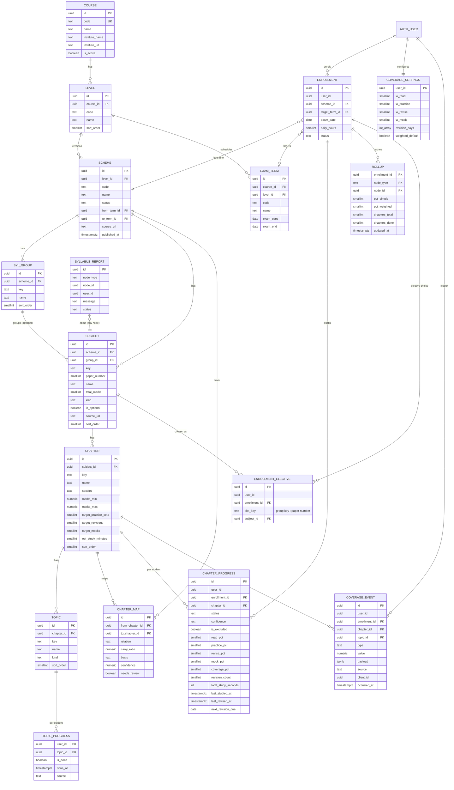

# ERD: F-02 Syllabus Structure and Coverage (with X-05 Taxonomy)

| Field | Value |
| --- | --- |
| Linked PRD | `docs/product/prd/F-02-syllabus-structure-and-coverage.md` |
| Django apps | `apps/api/modules/syllabus` (public taxonomy), `apps/api/modules/coverage` (private student progress) |
| Web modules | `apps/web/src/modules/syllabus` (public pages, tree components), `apps/web/src/modules/coverage` (onboarding, map, chapter) |
| Last updated | 4 Oct 2026 |

The existing web `modules/catalog` (static courses and features used by the landing page) keeps its role for marketing copy. Subject and chapter data come from the `syllabus` API; `catalog` only keeps landing content and links to it.

## 0. Design decisions

1. **Two worlds, two modules.** `syllabus` is shared, public-read, admin-write reference data. `coverage` is private per-student data. `coverage -> syllabus` is the only dependency direction.
2. **Scheme versioning is a first-class table.** All nodes below a level (group, subject, chapter, topic) belong to a `scheme`. A scheme change creates a new set of rows; progress stays attached to the old rows and a mapping table carries it over. Nothing is ever mutated in a way that breaks history.
3. **Stable keys.** Every node has a `key` slug unique within its parent, and the same chapter keeps its key across schemes. URLs and mapping use keys; foreign keys use ids.
4. **Event ledger plus derived progress.** `coverage_event` is append-only and is the source of truth. `coverage_chapter_progress` and `coverage_topic_progress` are derived and can be rebuilt from the ledger (a management command does this).
5. **Pure formula in one place.** The coverage maths is a pure function (`coverage/domain/formula.py`, mirrored by tests and by a TypeScript copy only for optimistic UI). Weights come from the student's settings.
6. **Read path is cheap.** Roll-ups (subject, group, level) are cached in `coverage_rollup`, recomputed in the same transaction as the chapter change (at most 3 ancestor rows).
7. **Django is the only gateway** to every table. Public reads are cached at the CDN. RLS is enabled with no policies on all tables.

## 1. Diagram



`user_id` columns reference `auth.users.id` by value, as in `profiles`. `CHAPTER_MAP` links chapters of two different schemes of the same level.

## 2. Tables: module `syllabus` (public reference data)

Common columns on every table here: `id uuid PK default gen`, `created_at timestamptz default now()`, `updated_at timestamptz default now()`. Soft state uses `is_active` instead of deletes once a row is referenced.

### 2.1 `syllabus_course`

| Column | Type | Null | Default | Notes |
| --- | --- | --- | --- | --- |
| code | text | no | | `ca`, `cs`, `cma`. Unique, used in URLs |
| name | text | no | | Chartered Accountancy, Company Secretary, Cost and Management Accountancy |
| institute_name | text | no | | ICAI, ICSI, ICMAI |
| institute_url | text | yes | | Official site |
| description | text | yes | | Short SEO description |
| is_active | boolean | no | true | |

### 2.2 `syllabus_level`

| Column | Type | Null | Default | Notes |
| --- | --- | --- | --- | --- |
| course_id | uuid | no | | FK `syllabus_course`, restrict |
| code | text | no | | `foundation`, `intermediate`, `final`, `spom` (CA Self-Paced Online Modules), `executive`, `professional` |
| name | text | no | | |
| sort_order | smallint | no | 0 | |
| is_active | boolean | no | true | |

Unique `(course_id, code)`.

### 2.3 `syllabus_examterm`

| Column | Type | Null | Default | Notes |
| --- | --- | --- | --- | --- |
| course_id | uuid | no | | FK, always the course of `level_id` (set on save, not editable) |
| level_id | uuid | no | | FK `syllabus_level`. Attempts and dates differ per level (CMA Foundation, Intermediate and Final each have their own) |
| code | text | no | | `2027-05`. Unique per level |
| name | text | no | | "May 2027" |
| exam_start | date | yes | | |
| exam_end | date | yes | | |
| is_open | boolean | no | true | Shown in onboarding |

### 2.4 `syllabus_scheme`

| Column | Type | Null | Default | Notes |
| --- | --- | --- | --- | --- |
| level_id | uuid | no | | FK `syllabus_level` |
| code | text | no | | `2023` or `2025`. Unique per level |
| name | text | no | | "2023 Scheme" |
| status | text | no | `draft` | `draft`, `published`, `retired` |
| from_term_id | uuid | yes | | FK `syllabus_examterm`: first term it applies to |
| to_term_id | uuid | yes | | Last term it applies to (null = open) |
| source_url | text | yes | | Official document the structure was built from |
| published_at | timestamptz | yes | | |
| notes | text | yes | | Editor notes |

Rule: at most one `published` scheme per level covers a given term (checked in the publish service). Students only ever see `published` schemes; `retired` stay readable for existing enrolments.

### 2.5 `syllabus_group`

| Column | Type | Null | Default | Notes |
| --- | --- | --- | --- | --- |
| scheme_id | uuid | no | | FK, cascade only within an unpublished scheme (service rule) |
| key | text | no | | `group-1` |
| name | text | no | | |
| sort_order | smallint | no | 0 | |

Unique `(scheme_id, key)`. Levels without groups (for example Foundation) simply have no group rows and subjects with `group_id = null`.

### 2.6 `syllabus_subject` (a "paper")

| Column | Type | Null | Default | Notes |
| --- | --- | --- | --- | --- |
| scheme_id | uuid | no | | FK |
| group_id | uuid | yes | | FK `syllabus_group` |
| key | text | no | | `taxation`. Stable across schemes |
| paper_number | smallint | yes | | Paper 1, 2, ... |
| name | text | no | | |
| total_marks | smallint | yes | | |
| exam_duration_minutes | smallint | yes | | |
| kind | text | no | `theory` | `theory`, `practical`, `mixed`, `elective` |
| is_optional | boolean | no | false | Elective or optional papers |
| source_url | text | yes | | The institute document (PDF) the paper was built from. When a paper has several PDFs (for example Section A and B), the institute's syllabus page |
| sort_order | smallint | no | 0 | |
| is_active | boolean | no | true | |

Unique `(scheme_id, key)`. Index `(scheme_id, group_id, sort_order)`.

### 2.7 `syllabus_chapter`

| Column | Type | Null | Default | Notes |
| --- | --- | --- | --- | --- |
| subject_id | uuid | no | | FK |
| key | text | no | | `gst-itc` |
| name | text | no | | |
| section | text | no | `''` | Section or Part of the paper with its weightage, for example `Section A: Direct Taxation (50%)`. A flat label (no extra table); the app groups chapters by it |
| marks_min | numeric(5,1) | yes | | Indicative weightage low |
| marks_max | numeric(5,1) | yes | | Indicative weightage high |
| weight_source | text | no | `unknown` | `official` (the institute's own weight), `analysis` (indicative, for example a section weight shared evenly by a group of modules), `unknown` |
| target_practice_sets | smallint | no | 1 | Denominator for the practice component |
| target_revisions | smallint | no | 2 | Denominator for the revise component |
| target_mocks | smallint | no | 1 | Denominator for the mock component |
| est_study_minutes | smallint | yes | | For the planner later |
| sort_order | smallint | no | 0 | |
| is_active | boolean | no | true | |

Unique `(subject_id, key)`. Checks: `marks_max >= marks_min`, targets between 0 and 20. The marks weight used in weighted roll-ups is `coalesce((marks_min + marks_max)/2, marks_max, marks_min, 1)`.

### 2.8 `syllabus_topic`

| Column | Type | Null | Default | Notes |
| --- | --- | --- | --- | --- |
| chapter_id | uuid | no | | FK |
| key | text | no | | |
| name | text | no | | |
| kind | text | no | `concept` | `concept`, `section`, `rule`, `standard`, `formula`, `case_law`, `illustration` |
| sort_order | smallint | no | 0 | |
| is_active | boolean | no | true | |

Unique `(chapter_id, key)`. Topics are optional; a chapter without topics uses an implicit single topic in the coverage maths (the chapter itself is tickable).

### 2.9 `syllabus_chaptermap`

Carries progress between schemes.

| Column | Type | Null | Default | Notes |
| --- | --- | --- | --- | --- |
| from_chapter_id | uuid | no | | FK, chapter in the old scheme |
| to_chapter_id | uuid | no | | FK, chapter in the new scheme |
| relation | text | no | `same` | `same`, `split`, `merged`, `partial` |
| carry_ratio | numeric(3,2) | no | 1.00 | Fraction of progress carried. A merge of k old chapters into one new chapter proposes `1/k` each; a split proposes `1.00` to every part. Topics carry fully (by key, then by normalised name) except on `partial` rows, which scale them by this ratio |
| basis | text | no | `manual` | How the row was proposed: `key`, `name`, `fuzzy`, `renamed`, `moved`, `split`, `merge`, `manual` |
| confidence | numeric(3,2) | yes | | 0 to 1 for proposed rows; null for rows an editor created |
| needs_review | boolean | no | false | True for anything an editor should confirm; cleared when the editor changes the row or runs "Mark as reviewed" |

Unique `(from_chapter_id, to_chapter_id)`. Check constraints keep `basis` to the list above and `confidence` between 0 and 1; index `(needs_review, confidence)` serves the review queue. A chapter in the new scheme with no incoming row is "new"; one in the old scheme with no outgoing row is "removed".

Default creation rule (`syllabus.matching`, pure functions, `services.build_default_chapter_map`), per paper, each step working on what the earlier steps left over:

1. Same `key`: `same`, `basis = key`. Flagged when the two names have nothing in common (a re-used key).
2. Same normalised name (accents, "&", leading numbering such as "Chapter 3:" removed): `same`, `basis = name`, trusted. Close names (similarity 0.60 or more): `basis = fuzzy`, flagged below 0.85. Ties are broken by position in the paper.
3. Merges (two to four old names contained in one new chapter) and splits (the reverse): `basis = merge` or `split`, always flagged.
4. The one chapter left on each side of a paper whose names still resemble each other (0.50 or more): `basis = renamed`, flagged.

Papers are paired by key, then by name (0.75 or more). Chapters left over across unpaired papers are linked only when the names are near identical (0.90 or more): `basis = moved`, flagged. The service never overwrites a row an editor already created, and publishing a scheme warns while any map into it still needs review.

### 2.10 `syllabus_report`

| Column | Type | Null | Default | Notes |
| --- | --- | --- | --- | --- |
| node_type | text | no | | `course`, `level`, `scheme`, `subject`, `chapter`, `topic` |
| node_id | uuid | no | | |
| user_id | uuid | yes | | Null for anonymous reports |
| message | text | no | | Max 1000 characters |
| status | text | no | `open` | `open`, `accepted`, `rejected`, `fixed` |

Index `(status, created_at)`.

## 3. Tables: module `coverage` (private per student)

### 3.1 `coverage_enrollment`

| Column | Type | Null | Default | Notes |
| --- | --- | --- | --- | --- |
| id | uuid | no | gen | PK |
| user_id | uuid | no | | Owner |
| scheme_id | uuid | no | | FK `syllabus_scheme` (implies level and course) |
| target_term_id | uuid | yes | | FK `syllabus_examterm` |
| exam_date | date | yes | | Student's own date, overrides the term |
| daily_hours | numeric(3,1) | yes | | |
| status | text | no | `active` | `active`, `archived` |
| level_id | uuid | no | | FK `syllabus_level`, denormalised from the scheme for the partial unique index |
| carried_from_id | uuid | yes | | Previous enrolment when the scheme was switched |
| created_at, updated_at | timestamptz | no | now() | |

Partial unique index `(user_id, level)` where `status = 'active'` (level is reached through the scheme, stored denormalised as `level_id` for the index). One active enrolment per student and level; a student can be enrolled in more than one level or course at the same time if needed later.

### 3.2 `coverage_settings`

| Column | Type | Null | Default | Notes |
| --- | --- | --- | --- | --- |
| user_id | uuid | no | | PK |
| w_read | smallint | no | 40 | Check 0..100 |
| w_practice | smallint | no | 30 | |
| w_revise | smallint | no | 20 | |
| w_mock | smallint | no | 10 | |
| revision_days | smallint[] | no | `{3,7,21,45}` | Gaps between revisions. Max 8 entries, each 1..365 |
| weighted_default | boolean | no | false | Marks-weighted roll-ups by default |
| created_at, updated_at | timestamptz | no | now() | |

Check: `w_read + w_practice + w_revise + w_mock = 100`.

### 3.3 `coverage_topicprogress`

| Column | Type | Null | Default | Notes |
| --- | --- | --- | --- | --- |
| user_id | uuid | no | | PK part 1 |
| topic_id | uuid | no | | PK part 2, FK `syllabus_topic` |
| enrollment_id | uuid | no | | FK |
| is_done | boolean | no | false | |
| done_at | timestamptz | yes | | |
| source | text | no | `manual` | `manual`, `catchup`, `carryover`, `auto` |
| updated_at | timestamptz | no | now() | Used for last-write-wins between devices |

Index `(enrollment_id, is_done)`.

### 3.4 `coverage_chapterprogress` (derived)

| Column | Type | Null | Default | Notes |
| --- | --- | --- | --- | --- |
| id | uuid | no | gen | PK |
| user_id | uuid | no | | |
| enrollment_id | uuid | no | | FK |
| chapter_id | uuid | no | | FK `syllabus_chapter` |
| status | text | no | `not_started` | `not_started`, `reading`, `practised`, `revised_once`, `revised_twice_plus`, `exam_ready` |
| confidence | text | yes | | `red`, `amber`, `green`. Chosen by the student, never derived |
| is_excluded | boolean | no | false | |
| read_pct | smallint | no | 0 | 0..100 |
| practice_pct | smallint | no | 0 | |
| revise_pct | smallint | no | 0 | |
| mock_pct | smallint | no | 0 | |
| coverage_pct | smallint | no | 0 | Weighted by the student's settings |
| practice_count | smallint | no | 0 | |
| mock_count | smallint | no | 0 | |
| revision_count | smallint | no | 0 | |
| total_study_seconds | int | no | 0 | Forwarded by tracking, display only |
| first_started_at | timestamptz | yes | | |
| last_studied_at | timestamptz | yes | | |
| last_revised_at | timestamptz | yes | | |
| next_revision_due | date | yes | | From `revision_days` |
| updated_at | timestamptz | no | now() | |

Unique `(user_id, chapter_id)`. Indexes: `(enrollment_id, chapter_id)`, `(enrollment_id, next_revision_due) where next_revision_due is not null and not is_excluded` (the due list), `(user_id, last_studied_at desc)`.

Rows are created lazily on first event, or in bulk when the enrolment is created (one row per chapter, so reads are simple joins; about 150 rows per level).

### 3.5 `coverage_event` (append-only ledger)

| Column | Type | Null | Default | Notes |
| --- | --- | --- | --- | --- |
| id | uuid | no | gen | PK |
| user_id | uuid | no | | |
| enrollment_id | uuid | no | | FK |
| chapter_id | uuid | no | | FK |
| topic_id | uuid | yes | | FK, for topic events |
| type | text | no | | see below |
| value | numeric | yes | | seconds for `study_time`, score percent for `mock_done` |
| payload | jsonb | no | `{}` | Small free data (never personal text) |
| source | text | no | `manual` | `manual`, `catchup`, `tracking`, `question_bank`, `mock`, `notes`, `carryover`, `system` |
| source_ref | text | yes | | Id in the source module (for example session id) |
| client_id | uuid | yes | | Idempotency key per user |
| occurred_at | timestamptz | no | now() | When it happened (client time accepted within a window, otherwise server time) |
| created_at | timestamptz | no | now() | |

Event types: `topic_done`, `topic_undone`, `practice_done`, `mock_done`, `revision_done`, `study_time`, `confidence_set`, `excluded`, `included`, `note_added`.

Indexes: unique `(user_id, client_id) where client_id is not null`; `(enrollment_id, chapter_id, occurred_at)`; `(user_id, occurred_at desc)`.

Events are never updated or deleted, except by the account-deletion service.

### 3.6 `coverage_rollup` (derived cache)

| Column | Type | Null | Default | Notes |
| --- | --- | --- | --- | --- |
| enrollment_id | uuid | no | | PK part 1 |
| node_type | text | no | | PK part 2: `subject`, `group`, `level` |
| node_id | uuid | no | | PK part 3 |
| pct_simple | smallint | no | 0 | Average of included chapters |
| pct_weighted | smallint | no | 0 | Marks-weighted average |
| chapters_total | smallint | no | 0 | Excludes excluded chapters |
| chapters_done | smallint | no | 0 | Chapters at 100 or exam ready |
| updated_at | timestamptz | no | now() | |

The overview endpoint reads these rows directly (3 + groups + subjects rows). A rebuild service recomputes them from `coverage_chapterprogress`.

## 4. Coverage maths (reference for tests)

For a chapter with `T` topics (implicit 1 if none), `d` done:

```
read     = round(100 * d / T)
practice = round(100 * min(1, practice_count / target_practice_sets))   (0 if target = 0 -> component hidden, weight redistributed)
revise   = round(100 * min(1, revision_count / target_revisions))
mock     = round(100 * min(1, mock_count / target_mocks))
coverage = round((read*w_read + practice*w_practice + revise*w_revise + mock*w_mock) / 100)
```

If a target is 0 the component is not applicable and its weight is redistributed proportionally across the others.

Status rules (first match from the top):

1. `exam_ready`: coverage >= 85 and revision_count >= 2
2. `revised_twice_plus`: revision_count >= 2
3. `revised_once`: revision_count = 1
4. `practised`: read = 100 and practice_count >= 1
5. `reading`: any topic done or any event
6. `not_started`

Roll-up (subject, group, level): over chapters where `is_excluded = false`:

```
pct_simple   = round(avg(coverage_pct))
pct_weighted = round(sum(coverage_pct * marks_weight) / sum(marks_weight))
```

Next revision due: after each `revision_done`, `next_revision_due = date(occurred_at) + revision_days[min(revision_count, len) - 1]` days (the array position moves with the count, the last gap repeats).

Worked example (default weights): read 100, practice 50, revise 50, mock 0 gives `(100*40 + 50*30 + 50*20 + 0) / 100 = 65`.

## 5. Relationships to existing and upcoming modules

| From | To | Rule |
| --- | --- | --- |
| `profiles` | `coverage_*` | By `user_id` value. Account deletion calls `coverage.services.delete_all_for_user` |
| `tracking_studysession.subject_id`, `chapter_id` | `syllabus_subject`, `syllabus_chapter` | FK, `on delete set null`. `tracking` forwards time through `coverage.services.record_event(type='study_time', ...)` |
| `focus_*` | `syllabus_*` | Read only through `syllabus.selectors` |
| Notes, Question Bank, Mocks (later) | `syllabus_chapter`, `syllabus_topic` | FK on their rows; they report progress through `coverage.services.record_event` only |
| Ingestion (X-04) | `syllabus_scheme` and below | Writes only as a **draft** scheme or a reviewed change through `syllabus.services`, never directly to published rows |
| Amendments (F-14) | `syllabus_chapter` | FK; coverage flags chapters "needs re-read" via an event `system` type later |

Dependency direction: `focus -> tracking -> coverage -> syllabus`, and `ingestion -> syllabus`. No cycles.

## 6. Enumerations and reference data

| Name | Values | Stored as | Owner |
| --- | --- | --- | --- |
| Course codes | ca, cs, cma | rows | seed |
| Level codes | foundation, intermediate, final, spom (CA only), executive, professional (CS only) | rows | seed (`0002`, `0005`) |
| Scheme status | draft, published, retired | text + check | code |
| Subject kind | theory, practical, mixed, elective | text + check | code |
| Topic kind | concept, section, rule, standard, formula, case_law, illustration | text + check | code |
| Chapter status | see section 4 | text + check | code, derived |
| Confidence | red, amber, green | text + check | code |
| Event type | see 3.5 | text + check | code |
| Event source | manual, catchup, tracking, question_bank, mock, notes, carryover, system | text + check | code |
| Chapter map relation | same, split, merged, partial | text + check | code |

**Seed data:** JSON files, one per level, in `apps/api/modules/syllabus/seed/<course>/<level>/<scheme>.json` describing groups, subjects, chapters, topics, marks and sources, loaded by `python manage.py load_syllabus_seed` (idempotent by `key`, drafts only until published). Content status:

| Course | Level (scheme) | Source document | Papers | Chapters and topics |
| --- | --- | --- | --- | --- |
| CMA | Foundation, Intermediate, Final (`2022`) | CMA Syllabus 2022 (ICMAI) PDF | 22 incl. 3 electives | Loaded: modules are chapters, numbered sub-items are topics, section and module weights in `section` and `marks_*` |
| CS | Foundation = CSEET, Executive, Professional (`2022`) | ICSI Syllabus 2022 PDF | 4 + 7 + 16 incl. 11 electives | Loaded: lessons are chapters, bullets are topics, Parts in `section` |
| CA | Foundation, Intermediate, Final, SPOM (`nset`) | ICAI NSET syllabus pages (4 pages) | 4 + 6 + 6 + 16 | Papers, groups, sections, 304 chapters and 1,478 topics extracted from the 36 ICAI paper PDFs (`docs/syllabus-sources/ca/`, links in `docs/syllabus-sources/ca-pdf-links.json`); no per-chapter marks published |

Chapter marks follow the source: official module weights, and where the source gives one weight for several modules the remainder of the section is shared evenly and marked `analysis`. Editors verify every file against the official document before publishing; the ingestion service (X-04) later helps create such files as drafts with the same review step.

## 7. Query patterns

| # | Query | Served by |
| --- | --- | --- |
| Q-1 | Public: level page with groups, subjects (one scheme) | `(scheme_id, group_id, sort_order)` on subject; CDN cache |
| Q-2 | Public: subject page with chapters and topics | `(subject_id, sort_order)` on chapter, `(chapter_id, sort_order)` on topic |
| Q-3 | Public: resolve URL `/courses/ca/intermediate/taxation/gst-itc` by keys | unique keys on each table, one join chain (published scheme of the level) |
| Q-4 | Sitemap: all published subject and chapter keys | scan with `scheme.status = 'published'`, cached |
| Q-5 | Overview: rollup rows for an enrolment | PK on `coverage_rollup` |
| Q-6 | Subject coverage: chapter rows with percent and status | `(enrollment_id, chapter_id)` join chapter on `subject_id` |
| Q-7 | Chapter detail: topics with done flags | join topic and topic progress on `(user_id, topic_id)` |
| Q-8 | Tick or untick: upsert topic progress, insert event, recompute chapter and its 3 ancestors in one transaction | PK on topic progress, unique `client_id` |
| Q-9 | Due list ordered by overdue days and marks weight | partial index on `next_revision_due` |
| Q-10 | Quick catch-up: bulk upsert of topic progress for chosen chapters, one event per chapter | single transaction, `INSERT ... ON CONFLICT` |
| Q-11 | Scheme switch: for each old chapter with a mapping, copy progress scaled by `carry_ratio`, write `carryover` events; return `switch_summary` with the carried, new and removed chapters as lists | `coverage_enrollment` + `syllabus_chaptermap` |
| Q-12 | Rebuild derived data from the ledger (admin, tests) | `(enrollment_id, chapter_id, occurred_at)` |

## 8. Storage

No files. The OG images for public syllabus pages are generated at build or on demand (the existing `scripts/generate-og.mjs` extended per course and level) and stored under `apps/web/public/og/`. Dynamic per-chapter OG images can use a server route that renders text onto a template; no Supabase Storage is required.

## 9. Security

- **Public data:** `syllabus_*` read endpoints are unauthenticated and cacheable. They never expose draft or retired schemes (retired only to their enrolled students) and never expose `syllabus_report`.
- **Admin writes:** require the `admin` or `editor` role (a column on `profiles`, checked in a DRF permission class and in Django admin). All publish and retire actions are logged in the Django admin history.
- **Student data:** every `coverage_*` query filters by the JWT `sub`. Detail routes filter id and user together, so another student's id returns 404.
- **RLS:** enabled with no policies on all tables listed here; the post-migrate hook covers them, and `core/tests/test_row_level_security.py` asserts it for every syllabus and coverage table (derived from the models, so a new table is covered automatically; it runs on Postgres and skips on SQLite, and CI has a Postgres service).
- **Validation:** weights total 100; chapters must belong to the enrolment's scheme (service check); event `value` ranges by type; payload limited to 2 KB and scrubbed of text.
- **Rate limits:** DRF throttles on `POST coverage/events/`, `catchup` and `syllabus/reports/` (anonymous reports are throttled per IP).
- **PII:** none in `syllabus`. In `coverage`, progress and confidence are personal data: included in export, removed on delete. Nothing from `coverage` is sent to analytics except counts and keys.
- **Retention:** kept until the student deletes it; old schemes are never deleted.

## 10. Migration and rollout

Order (one migration set per app):

0. Later migrations: `syllabus.0009_chaptermap_review_fields` adds `basis`, `confidence`, `needs_review`, their two check constraints and the review index; existing rows default to `basis = manual`, `needs_review = false`.
1. `syllabus.0001_initial`: course, level, examterm, scheme, group, subject, chapter, topic, chaptermap, report with all constraints and indexes.
2. `syllabus.0002_seed_reference`: data migration for the three courses, their levels and the open exam terms (small, idempotent). Detailed schemes are loaded with the management command, not inside migrations, so content can be updated without a migration.
2a. `syllabus.0006` to `0008`: exam terms per level. `level_id` is added, every course-wide term is copied to each level of its course, scheme windows and enrolments are re-pointed, CA and CMA attempts are set per level, then `level_id` becomes required with `unique (level_id, code)`. A scheme's from and to term must belong to the scheme's level; an enrolment's target term must belong to its level (`GET /syllabus/terms/?course=&level=`).
2b. `syllabus.0004_chapter_section_subject_source_url`: adds `chapter.section` and `subject.source_url`. `syllabus.0005_seed_ca_spom_level`: adds the CA `spom` level (idempotent).
3. `coverage.0001_initial`: enrolment, settings, topic progress, chapter progress, event, rollup.
4. Post-migrate hook: RLS enabled on all new tables.

Notes:

- Only new tables are created: no backfill and no downtime risk.
- Use `DIRECT_DATABASE_URL` for migrations.
- Later indexes on `coverage_event` (the largest table) use `AddIndexConcurrently`.
- Expected volume: about 150 chapters and 500 topics per level; per active student about 150 chapter rows, 500 topic rows and a few thousand events a year. Comfortable for one Postgres without partitioning. If events grow past tens of millions, partition `coverage_event` by month on `occurred_at`.
- The feature flag `syllabus_coverage` hides only the private screens; the public API and pages ship earlier (Phase B). It is evaluated twice with the same PostHog flag and the same user id: on the web (`useFeatureFlag`) and on the API (`core/feature_flags.py`, PostHog Python SDK, per user, cached for 60 seconds, fail-open: no key, no answer or an error means on, only an explicit false turns it off). When off, every coverage endpoint except export and delete answers `403` with code `feature_disabled`. Needs `POSTHOG_API_KEY` (the project key) on the API.
- Rollback is a drop of `coverage` then `syllabus` tables before any other feature depends on them.

## 11. Module layout

### API

```
apps/api/modules/
  syllabus/
    models.py selectors.py services.py (publish, retire, map schemes) serializers.py views.py urls.py admin.py
    matching.py             pure chapter, paper and moved-chapter matching for the default map (unit tested)
    static/syllabus/admin/  reorder.js and reorder.css: drag and drop ordering in the admin lists
    seed/ca/intermediate/2023.json ...
    management/commands/load_syllabus_seed.py
    tests/
  coverage/
    models.py
    domain/formula.py        pure maths: components, status, rollup, next due (unit tested)
    services.py             record_event, tick_topic, catchup, switch_scheme, rebuild
    selectors.py            overview, subject view, chapter view, due list
    serializers.py views.py urls.py
    tests/
  core/feature_flags.py     server-side PostHog flag evaluation, cached and fail-open
```

### Web

```
apps/web/src/modules/
  syllabus/                 public pages and tree
    lib/ (urls, seo helpers)  hooks/ (useLevel, useSubject)  components/ (SubjectCard, ChapterRow, WeightageBadge, Breadcrumbs)
    containers/ (LevelPageContainer, SubjectPageContainer, ChapterPageContainer)
  coverage/
    lib/formula.ts          mirror of the formula for optimistic UI, tested against shared fixtures
    hooks/ (useOverview, useChapterCoverage, useTickTopic, useLogEvent, useDueList, useCoverageSettings)
    components/ (CoverageRing, SubjectCoverageRow, TopicChecklist, StatusBadge, ConfidencePicker, CatchupSelector, DueList)
    lib/offlineQueue.ts, queuedWrites.ts   IndexedDB queue for idempotent writes; hooks/useOfflineSync.ts replays it
    containers/ (OnboardingContainer, SyllabusMapContainer, ChapterCoverageContainer, SettingsContainer)
```

The shared test fixtures (a JSON file of inputs and expected percents) are used by both the Python and the TypeScript formula tests so the two copies cannot drift apart.

Routes stay thin: `courses.$course.$level.$subject.index`, `courses.$course.$level.$subject.$chapter`, `app.onboarding`, `app.syllabus.index`, `app.syllabus.$subject.index`, `app.syllabus.$subject.$chapter`, `app.revision`, `app.settings.coverage`.

## Implementation notes (as built)

Deviations and additions made while implementing, so the document matches the code:

- `coverage_settings.revision_days` is a JSON array column (not a Postgres `int[]`), so the same model runs on SQLite in tests. Validation (1 to 8 whole numbers, 1 to 365) lives in `domain/formula.py` and the serializer.
- `topic_progress`, `rollup` use Django composite primary keys (`user_id`, `topic_id` or scope columns), matching the ERD keys.
- `chapter_progress.implicit_topic_done` was added: a chapter with no topics uses one implicit topic, ticked through `PUT /coverage/chapters/{id}/read/`.
- Extra endpoints beyond section 9 of the PRD: `PUT /coverage/chapters/{id}/read/`, `PUT /coverage/subjects/{id}/exclusion/`, `GET /syllabus/sitemap/`, `GET /syllabus/terms/`, `POST /admin/syllabus/schemes/{id}/publish|retire/`.
- Elective papers (CMA Final Paper 20A/20B/20C, CS Professional Papers 4 and 7): a student sits one option per paper. A *slot* is the set of subjects with `kind = elective` or `is_optional` that share a group and paper number and number at least two (derived, nothing stored on the syllabus; `slot_key` is `"<group key>:<paper number>"`, for example `electives:20`, `group-1:4`). The choice is stored in `coverage_enrollment_elective` (unique per enrolment and slot, migration `coverage.0002`). Coverage follows the choice through the existing exclusion ledger: the chosen option is included, every other option is excluded with `EXCLUDED`/`INCLUDED` events (source `system`), so percentages and `rebuild_enrollment` need no special case. A slot with no choice excludes all its options until the student picks one. Elective papers cannot be excluded or included by hand (400); the choice is the only control. `switch_scheme` carries each choice to the new scheme by subject key. Endpoints: `elective_slots` on `GET /syllabus/courses/{c}/levels/{l}/`, `electives` (slot choices) on `POST /coverage/enrollments/`, `PUT /coverage/enrollments/{id}/electives/` with `{"choices": {"<slot key>": "<subject id>" | null}}`, and `electives`, `subjects[].elective_slot` and `enrollment.electives_pending` on the overview and enrolment payloads. CA has no elective papers in the NSET scheme, so its levels have no slots.
- Write endpoints return the changed chapter plus its subject and level roll-ups, so one response refreshes the whole screen.
- Admin editing is done in the Django admin (`/<DJANGO_ADMIN_PATH>/`): reference data, schemes with inline papers, papers with inline chapters, chapters with inline topics, bulk add of chapters and topics from pasted lists, JSON import and export of a whole scheme, publish and retire actions behind a separate permission (groups "Syllabus editors" and "Syllabus publishers"), chapter maps, the reports inbox, and read-only support views of enrolments and the ledger. Nodes of a published or retired scheme cannot be deleted, only switched off.
- `profile.role` (student, editor, admin) was added to gate editor endpoints.
- Offline queueing: every write carries a client id, so retries are idempotent. Tick topic, tick chapter and log event are stored in IndexedDB (database `artha-coverage`, store `writes`, keyed by client id, scoped to the user) when the network fails or an older write is still waiting, and replayed oldest first with the same client ids on load, when the browser comes back online and every 30 seconds while something waits. A 5xx, 408, 425, 429 or network error is retried; any other 4xx drops the entry. Falls back to memory where IndexedDB is unavailable. Catch-up, settings, confidence and exclusion are not queued: they need the server's answer to show the next screen.
- Admin ordering: papers, chapters and topics are reordered by drag and drop (or Alt+Arrow) in their admin lists; the order is saved through `<model>/reorder/` and renumbers the siblings of the same parent, and each move is written to the change history.
- Public pages: course, level, paper and chapter pages read courses from the API and merge them over the static catalog. Preview images are generated at `/og/courses/{course}` and `/og/courses/{course}/{level}/{paper}/{chapter}` (satori and resvg, Inter font bundled) and cached for a day; any failure redirects to `/og/default.png`.
- Seed files are the real syllabus structures built from the official documents (see the seed table in section 6) and still load as drafts until an editor verifies and publishes them. The earlier `indicative.json` files and the memory-based `2023-sample.json` were replaced.
- `chapter.section` and `subject.source_url` were added (PRD sources: Section/Part with weightage appears in CMA, CS and CA papers; the source link supports the "Based on ... issued by ..." line and the later ingestion service). `spom` was added as a CA level for ICAI's Self-Paced Online Modules.
- PRD FR-5 lists the relations same, split, merged, removed and new. The table stores `same`, `split`, `merged`, `partial`; "new" (no incoming row) and "removed" (no outgoing row) are derived, never stored.
- Seed tests (`tests/test_seed_content.py`) pin papers per level, key and length limits, section weights and the load, export and import round trip.
