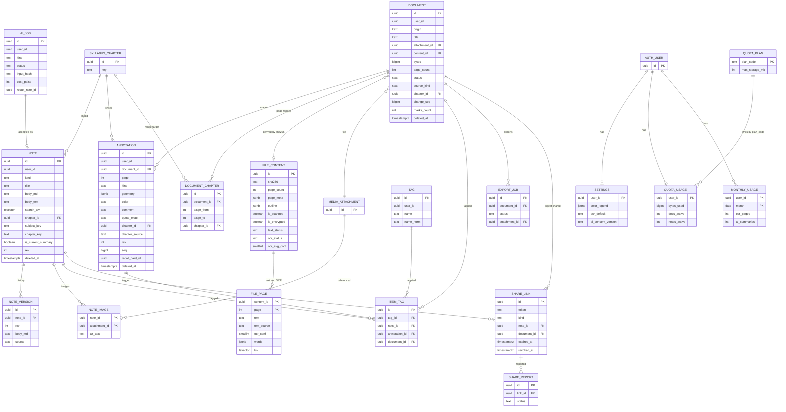
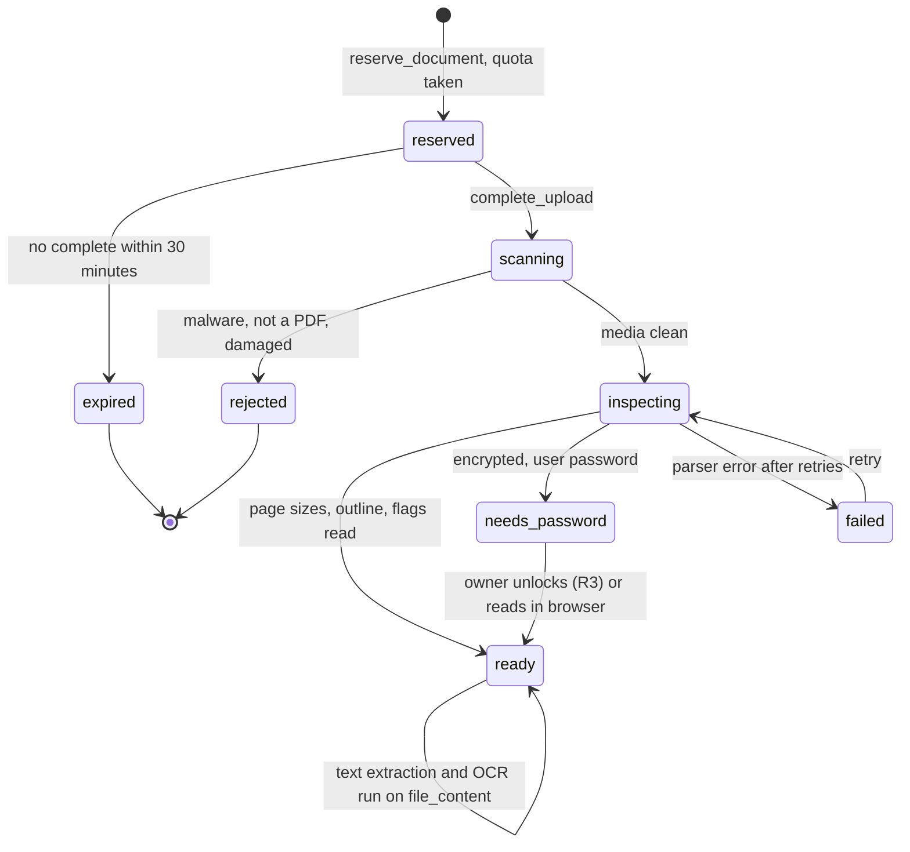
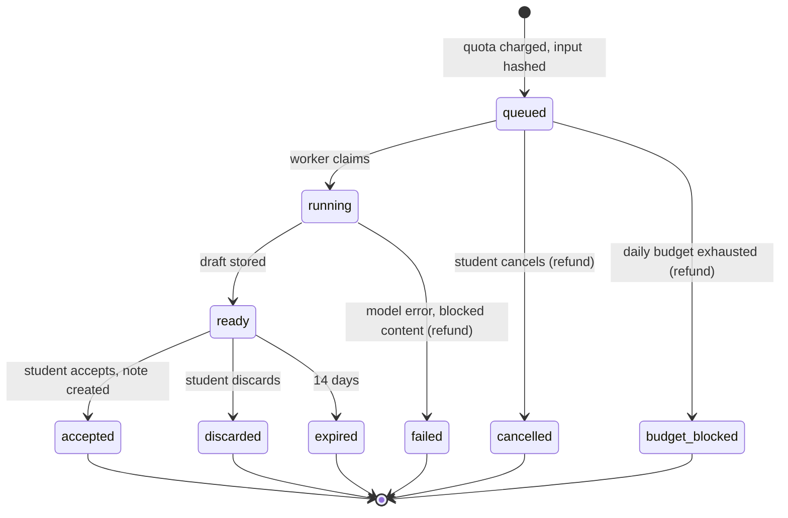

# ERD: F-03 Notes and PDF Editor

| Field | Value |
| --- | --- |
| Linked PRD | `docs/product/prd/F-03-notes-and-pdf-editor.md` |
| Django app | `apps/api/modules/notes` (tables `notes_*`). Uses shared `apps/api/modules/media`, `apps/api/core/events.py` and `core/jobs.py` from `docs/product/erd/F-06-question-bank-system.md` |
| Web module | `apps/web/src/modules/notes` |
| Reads | `docs/product/erd/F-02-syllabus-structure-and-coverage.md` (taxonomy, `note_added` event type, `notes` source), F-06 ERD sections 0, 2.26, 3, 6.5 and 6.6, `docs/product/validation/F-02-F-01-implementation-audit-2026-10-05.md` |
| Last updated | 2026-10-05 |

**Reading guide for other authors.** Section 3 is the contract: public services, selectors, events and what you must not do. If your pointer needs a note, a highlight or a document, call these; do not add tables for them. Section 0 records the decisions and why. Table names follow `<app>_<model>`.

## 0. Design decisions

1. **Build versus integrate for the PDF viewer and annotator: integrate pdf.js as the engine, build the annotation layer and the library.**

   | Option | Licence and cost | Annotation model | Fit |
   | --- | --- | --- | --- |
   | **pdf.js (`pdfjs-dist`) behind a `PdfEngine` adapter, own layer (chosen)** | Apache-2.0 `[VERIFY in repo]`, free | Ours: sidecar rows, normalised coordinates, no PDF rewrite | Renders in a worker, text layer, outline, range requests, password handling, used in Firefox. We write the six tools, the sync and the data model |
   | pdf.js built-in editor layer | Free | Serialises into a new PDF with `saveDocument()`; no per-annotation events; cannot inject annotations without embedding them | Not usable as a source of truth, wrong for offline merge and for taxonomy links |
   | EmbedPDF (PDFium WebAssembly fork, plugins) | Apache-2.0, free | Highlight, ink, free text, sticky note, redaction; PDF-object oriented | Strong candidate, young project, WASM weight unknown. Kept as the swap target and a two-day spike before the reader slice |
   | Nutrient (PSPDFKit) Web SDK | Commercial, per-domain, usage based, free tier | Full, proprietary | Best features, but a cost that grows with free students and vendor lock-in. Out |
   | react-pdf-highlighter-extended | MIT | Text and area highlights with viewport-independent positions | Confirms our coordinate approach; too few tools, we would fork it anyway |

   Why: the product value of F-03 is the data layer (taxonomy link, tags, recall cards, offline conflicts, aggregated views). A viewer library's annotation model would become a second source of truth that we then translate. Six tools (highlight, underline, pen, text box, sticky note, bookmark) plus area highlight are small. **Revisit triggers:** a requirement for true PDF annotations that other viewers edit, form filling or redaction; pen latency above 50 ms on target devices after tuning; two pdf.js regressions in a quarter that block mobile. The adapter `lib/pdf-engine` is the only place that imports `pdfjs-dist` (ESLint boundary), so a swap touches one folder.

2. **Non-destructive annotations in a sidecar.** `notes_annotation` rows hold normalised geometry per page, never bytes of the PDF. The original object in `notes-private` is written once and never modified (a test hashes it after any sequence of edits). Export builds a new file in a job.
3. **Normalised coordinates.** Frame: the page as displayed with its intrinsic `/Rotate` applied and no extra user rotation, origin top-left, x and y in [0, 1] relative to the page's width and height in points (stored in `page_meta`), five decimals. User rotation, zoom and device are a transform on the client. A Python and a TypeScript implementation of validation and transforms share golden fixtures (`geometry_cases.json`), the same pattern as F-02's `formula_cases.json`.
4. **Text anchoring for re-attachment.** Text marks keep `quote_exact`, `quote_prefix`, `quote_suffix` (32 characters each side) and `text_start`/`text_end` offsets in the client's page text. Offsets are hints only (pdf.js and the server's PDFium extractor order and space text differently); matching uses the quote on normalised text (Hypothesis-style fuzzy anchoring). This enables Replace edition and OCR re-runs without losing marks.
5. **One table for typed notes, one for marks, real foreign keys everywhere.** Typed notes (`notes_note`) and PDF marks (`notes_annotation`) differ in size and lifecycle (notes have versions, marks have revisions), so they are two tables. Shared child tables (`notes_itemtag`) use three nullable foreign keys with `num_nonnulls = 1` instead of a polymorphic by-value reference, so the database enforces integrity. The aggregated view is a keyset `UNION ALL` over indexed per-user rows; no derived read model that could drift.
6. **Rich text is F-06's decision: sanitised Markdown plus KaTeX** (`body_md` canonical, `body_text` derived, no HTML stored), through a `note` profile of the shared pipeline `[PROPOSED EXTENSION to F-06]` (3.3). Marks carry plain text only.
7. **Derived file content is stored once per distinct file.** `notes_filecontent` is keyed by the SHA-256 the worker computes from the stored bytes (never trusted from a client) and holds page sizes, outline, flags, extraction and OCR status; `notes_filepage` holds page text, OCR word boxes and the search vector. A second student uploading the same Institute PDF gets text, OCR and search immediately and costs no OCR. The stored file bytes are **not** deduplicated across students (an upload-by-hash shortcut would need a proof-of-possession protocol; deferred, Q-F03-7).
8. **OCR: Tesseract in the worker by default; Gemini only on demand for paid plans.** Tesseract costs compute only (about 0.007 rupee per page at the 6.1 assumptions); Gemini costs about 0.5 rupee per page (258 input tokens at the listed price plus about 600 output tokens), roughly 70 times more, and returns no word boxes. We keep word boxes in the database and render an invisible text layer on scanned pages, instead of producing a second OCR'd PDF (OCRmyPDF's output would double storage and may alter geometry). AI OCR returns text for search and AI use only.
9. **Sync model: per-document change sequence, per-row revision, field-level compare-and-set.** The `notes_document.change_seq` counter is incremented under a row lock on every accepted write, giving a gap-free delta feed (`since_seq`) that includes tombstones. Edits send `base_rev` and, per changed field, the `base` value the client saw. The server accepts a field when the stored value equals the base or already equals the new value, merges text with a 3-way merge, and otherwise answers 409 with both sides (3.6). No history table is needed for marks and no CRDT. **Revisit trigger for a CRDT (Yjs):** real-time co-editing or shared edit rights.
10. **Quotas are database facts.** `notes_quotausage` and `notes_monthlyusage` are updated with conditional statements (`UPDATE ... WHERE used + :n <= :limit RETURNING`), so two concurrent uploads cannot both pass (audit AUD-001 and AUD-002 pattern: lock or constrain, never check-then-write). Throttles are only a politeness layer because throttle state is per instance on serverless (AUD-008).
11. **Lessons from the F-02 and F-01 audit applied here:** every write service locks the row it serialises on (`select_for_update` on document, note or usage row); no delete-then-insert rollups (there are no rollup tables); a page-range overlap is prevented by a database exclusion constraint, not by code; selectors and services of other modules are called only through their public interface (`syllabus.selectors`, `media.services`, `recall.services`), never their models, and no ORM appears in views (AUD-005); error and flag base classes come from `core` (AUD-009: the consolidation PR must land first or be part of slice 0, notes does not add a fourth copy); `delete_all_for_user` and `export_for_user` exist from the first slice and are registered with the central erasure hook (AUD-004); analytics event names and properties are the ones in the PRD, emitted from the server where the server is the source of truth (AUD-011).
12. **Stable keys survive scheme switches.** Notes, marks and documents store `level_id`, `subject_key`, `chapter_key` (and `topic_key`) next to the foreign keys, as F-06 does for question mappings. Views group by keys; the FK can point to a chapter of a retired scheme.
13. **Events for fan-out, calls for what the student asked.** Counts changes and readiness go out through `core.events`. The one-tap recall card is a synchronous service call to F-15 because the student is waiting for the result.
14. **Django is the only gateway.** RLS enabled with no policies on every table; user id comes from the JWT; detail routes return 404 for what the viewer may not see.

## 1. Diagrams

### 1.1 Entities



### 1.2 Document lifecycle



`deleted_at` (trash) is orthogonal: any state except `reserved` can be trashed; purge removes the object and releases quota.

### 1.3 Summary job lifecycle (`notes_aijob`)



## 2. Tables

All tables have `created_at` and `updated_at` (timestamptz, `now()`) unless stated, uuid primary keys (client generated where an offline write creates the row), RLS enabled with no policies. `user_id` is the Supabase uuid, by value, scoped on every query. Soft delete is `deleted_at` plus `purge_after` (30 days). Enums are text plus a check constraint. Taxonomy link columns appear on documents, notes, marks and page ranges and are always written together by one service function (`link_columns(chapter_id, topic_id)`): `level_id uuid`, `subject_id uuid`, `chapter_id uuid`, `topic_id uuid` (foreign keys to `syllabus_*`, `on delete restrict`), plus stable copies `subject_key text`, `chapter_key text`, `topic_key text`. A check requires `chapter_id is not null` to imply `level_id`, `subject_key` and `chapter_key` not null.

### 2.1 `notes_document`

| Column | Type | Null | Default | Notes |
| --- | --- | --- | --- | --- |
| id | uuid | no | gen | PK |
| user_id | uuid | no | | Owner. Unique `(id, user_id)` so child rows can carry a composite foreign key |
| client_id | uuid | yes | | Idempotency of `reserve_document`; unique `(user_id, client_id)` where not null |
| origin | text | no | `upload` | `upload`, `platform` (hosted by us for all, see `open_platform_document`) |
| title | text | no | | 1 to 200 characters; defaults to the file name without extension |
| original_filename | text | no | | Display only, 255 characters, never used in a storage path |
| attachment_id | uuid | no | | FK `media_attachment` (kind `note_pdf`). For `platform` origin the platform-owned attachment |
| content_id | uuid | yes | | FK `notes_filecontent`, set after inspection |
| cover_attachment_id | uuid | yes | | FK `media_attachment` (kind `note_image`), first-page thumbnail 240 px webp |
| bytes | bigint | no | | Logical size reserved for quota; 0 for `platform` |
| page_count | int | yes | | From inspection; for locked files the count the browser reported (display only) |
| status | text | no | `reserved` | `reserved`, `scanning`, `inspecting`, `ready`, `needs_password`, `rejected`, `expired`, `failed` |
| status_reason | text | yes | | `type_mismatch`, `malware`, `pdf_corrupt`, `too_many_pages`, `too_large`, `decode_failed`, `policy` |
| source_kind | text | no | `other` | `institute_material`, `coaching`, `own_notes`, `handwritten`, `other` (student declared; drives share rules) |
| edition_label | text | yes | | For example `May 2027`, 40 characters |
| ocr_mode | text | no | `none` | `none`, `tesseract`, `ai` (what the student requested for this document) |
| ocr_lang | text | no | `eng` | `eng`, `eng+hin` |
| last_page | int | no | 1 | Resume position |
| last_zoom | text | no | `fit` | `fit` or a percent `120` |
| page_tone | text | yes | | `original`, `paper`, `night`; null means the setting |
| last_opened_at | timestamptz | yes | | |
| change_seq | bigint | no | 0 | Incremented under the row lock on every accepted mark write; the delta cursor |
| marks_count | int | no | 0 | Live (not deleted) marks, maintained in the same transaction; check 0 to 20,000 |
| reservation_expires_at | timestamptz | yes | | Set while `reserved`; the tick job expires it and releases quota |
| rev | int | no | 1 | Optimistic version for metadata edits |
| deleted_at, purge_after | timestamptz | yes | | Trash |
| (link columns) | | yes | | Default chapter for marks without a range (section 2 header) |

Indexes: `(user_id, deleted_at, last_opened_at desc)` for the library and Continue reading; `(user_id, level_id, subject_key, chapter_key)` where `deleted_at is null` for subject filters; `(content_id)`; `(status, updated_at)` where `status in ('reserved','scanning','inspecting')` for the tick and garbage collection; `(purge_after)` where `deleted_at is not null`. Check: `bytes >= 0`, `marks_count between 0 and 20000`, `origin = 'platform'` implies `bytes = 0`.

### 2.2 `notes_filecontent` (derived, shared by identical bytes)

| Column | Type | Null | Default | Notes |
| --- | --- | --- | --- | --- |
| id | uuid | no | gen | PK |
| sha256 | text | no | | Computed by the worker from the stored object; unique |
| bytes | bigint | no | | |
| page_count | int | yes | | Null while locked |
| page_meta | jsonb | yes | | Array of `{w, h}` per page in points, intrinsic rotation applied; `page_meta_schema` smallint = 1. A 1,000 page file is about 25 KB |
| outline | jsonb | yes | | Tree of `{title, page, children}` capped at 2,000 nodes; `outline_schema` = 1 |
| is_encrypted | boolean | no | false | |
| can_copy, can_modify | boolean | yes | | From permission flags; null when unknown |
| has_javascript | boolean | no | false | Informational; scripting is never enabled in the reader |
| is_scanned | boolean | yes | | True when at least 70% of sampled pages have under 20 extractable characters and an image covering the page |
| text_pct | smallint | yes | | Share of pages with native text |
| text_status | text | no | `pending` | `pending`, `running`, `done`, `failed`, `locked`, `skipped` (restricted) |
| text_pages_done | int | no | 0 | Monotonic (`greatest`) |
| ocr_status | text | no | `none` | `none`, `pending`, `running`, `partial`, `done`, `failed` |
| ocr_engine | text | yes | | `tesseract-5.x` and the language, for re-run decisions |
| ocr_pages_done, ocr_pages_total | int | no | 0 | Progress |
| ocr_avg_conf | smallint | yes | | 0 to 100 |
| engine_version | smallint | no | 1 | Bumped when extraction improves; the tick re-queues only content that students still reference |
| orphaned_at | timestamptz | yes | | Set when the last referencing document is purged; derived rows purged 30 days later |

Unique `(sha256)`. Index `(text_status)` and `(ocr_status)` partial on active states for the worker, `(orphaned_at)` where not null.

### 2.3 `notes_filepage` (page text, OCR words, search)

| Column | Type | Null | Default | Notes |
| --- | --- | --- | --- | --- |
| content_id | uuid | no | | PK part 1, FK `notes_filecontent` on delete cascade |
| page | int | no | | PK part 2, 1-based |
| text | text | no | `''` | Normalised text, at most 60,000 characters |
| text_source | text | no | `native` | `native`, `ocr`, `ai` |
| ocr_conf | smallint | yes | | Page mean confidence 0 to 100 |
| words | jsonb | yes | | OCR only: `[[x, y, w, h, "word"], ...]` in the normalised frame, four decimals; `words_schema` smallint = 1; about 6 KB per dense page |
| lang | text | no | `en` | `en`, `hi`, `mixed` (script detection) |
| tsv | tsvector | no | | `english` configuration for Latin text, `simple` when Devanagari exceeds 30% of letters |

Indexes: GIN `(content_id, tsv)` using `btree_gin`, which serves "pages of these documents matching this query" in one index; PK `(content_id, page)`. Rows are written by the worker in chunks of 10 pages with `INSERT ... ON CONFLICT (content_id, page) DO UPDATE ... WHERE excluded.text_source rank >= current` (rank `native` < `ocr` < `ai`, never downgrade, an OCR rerun with the same engine version is a no-op).

### 2.4 `notes_note`

| Column | Type | Null | Default | Notes |
| --- | --- | --- | --- | --- |
| id | uuid | no | gen | PK; unique `(id, user_id)` |
| user_id | uuid | no | | |
| client_id | uuid | yes | | Unique `(user_id, client_id)` where not null |
| kind | text | no | `note` | `note`, `exam_summary` |
| origin | text | no | `typed` | `typed`, `clip`, `ai_summary`, `import` |
| title | text | no | `''` | 0 to 200 characters |
| body_md | text | no | `''` | Markdown with the `note` profile, up to the plan limit (100,000 characters) |
| body_text | text | no | `''` | Derived plain text |
| body_chars | int | no | 0 | |
| lang | text | no | `en` | |
| search_tsv | tsvector | no | | Title weight A plus body weight B, same language rule as 2.3 |
| (link columns) | | yes | | Null means Unfiled |
| is_current_summary | boolean | no | false | Only meaningful for `exam_summary` |
| pinned | boolean | no | false | |
| clip_source | jsonb | yes | | `{module, ref, label}` for clips; `clip_schema` = 1; never contains student answer text beyond what the clip body holds |
| ai_job_id | uuid | yes | | By value to `notes_aijob` |
| source_refs | jsonb | yes | | For AI notes: `[{type, id, page}]` of the inputs; `refs_schema` = 1 |
| recall_card_id | uuid | yes | | By value to F-15 (cache of the link) |
| rev | int | no | 1 | Increments on every accepted save |
| deleted_at, purge_after | timestamptz | yes | | Trash |

Constraints: unique `(user_id, level_id, subject_key, chapter_key)` where `kind = 'exam_summary' and is_current_summary and deleted_at is null` (exactly one current summary per chapter, enforced by the database); check `kind = 'note'` implies `is_current_summary = false`; `body_chars <= 100000`. Indexes: `(user_id, updated_at desc, id)` where `deleted_at is null` (hub, changes feed); `(user_id, level_id, subject_key, chapter_key, updated_at desc, id)` where `deleted_at is null` (chapter and subject views); `(user_id, deleted_at)` where `deleted_at is not null` (trash); `(user_id)` where chapter_id is null and deleted_at is null (unfiled count). No GIN: private search filters by `user_id` first (a student has at most a few thousand notes) and evaluates the stored vector on that slice; add `GIN (search_tsv)` only if the p95 target fails (PRD 11).

### 2.5 `notes_noteversion`, `notes_noteimage`

`noteversion`: `id`, `note_id` FK on delete cascade, `user_id`, `rev` int, `title`, `body_md`, `source` (`autosave`, `manual`, `restore`, `merge`, `ai`), `created_at`. Unique `(note_id, rev)`; index `(note_id, created_at desc)`; index `(created_at)` for thinning. The save service writes a row in the same transaction as the note update. Autosaves by the same student within 60 seconds of the previous autosave update that row in place (its `rev` becomes the newer one), so a burst of typing is one row. Retention is in 6.4.
`noteimage`: PK `(note_id, attachment_id)`, `alt_text` (required, copied from the Markdown so audits and the missing-alt warning are one query), `attachment_id` FK `media_attachment` (kind `note_image`). Computed on save from `attachment:<uuid>` references; drives quota and purge.

### 2.6 `notes_annotation`

| Column | Type | Null | Default | Notes |
| --- | --- | --- | --- | --- |
| id | uuid | no | | PK, generated by the client so offline creation is idempotent |
| user_id | uuid | no | | |
| document_id | uuid | no | | Composite FK `(document_id, user_id)` to `notes_document (id, user_id)`: a mark can only belong to its owner's document; on delete cascade |
| page | int | no | | 1-based; check `page between 1 and 5000` (and at most `page_count` in the service when known) |
| kind | text | no | | `highlight`, `underline`, `ink`, `textbox`, `sticky`, `bookmark`, `area` |
| geometry | jsonb | no | | Geometry v1 (3.5); at most 64 KB (check on `length(geometry::text)`) |
| geometry_schema | smallint | no | 1 | |
| color | text | yes | | Palette key `y`, `g`, `b`, `p`, `o` for markup; `i1` to `i5` for ink; the meaning comes from `notes_settings.color_legend`, never stored here |
| comment | text | no | `''` | Plain text, 0 to 2,000 characters (sticky and text box content, comment on a highlight, bookmark title) |
| quote_exact | text | yes | | Selected text, at most 1,000 characters (markup only) |
| quote_prefix, quote_suffix | text | yes | | 32 characters each, from the page text |
| text_start, text_end | int | yes | | Offsets in the client's page text; hints (decision 4) |
| anchor_engine | text | yes | | `pdfjs`, `ocr` |
| (link columns) | | yes | | Effective chapter |
| chapter_source | text | no | `none` | `explicit`, `range`, `document`, `none` |
| search_tsv | tsvector | no | | From quote and comment |
| recall_card_id | uuid | yes | | By value to F-15 |
| rev | int | no | 1 | |
| seq | bigint | no | | `notes_document.change_seq` at the last accepted change; the delta feed key |
| device_id | text | yes | | Random per browser install (not a fingerprint), 36 characters, for "edited on Pixel" in the conflict sheet |
| deleted_at, purge_after | timestamptz | yes | | Tombstone and trash in one: the delta feed returns tombstones; purge after 30 days |

Indexes: `(document_id, seq)` (delta); `(document_id, page)` where `deleted_at is null` (render a page and export); `(user_id, level_id, subject_key, chapter_key, updated_at desc, id)` where `deleted_at is null and kind in ('highlight','underline','area','sticky','textbox')` (aggregated view lists marks that carry text or meaning; pen drawings are counted but listed under Documents); `(user_id, deleted_at)` where `deleted_at is not null`. Checks: kinds as above, `kind in ('highlight','underline')` allows empty quote (scanned page without OCR is impossible for these kinds in the UI, but an OCR re-run may clear a quote, so the database stays permissive); `rev >= 1`.

### 2.7 `notes_documentchapter` (page range to chapter)

`id`, `user_id`, `document_id` (composite FK as 2.6), `page_from`, `page_to` (check `1 <= page_from <= page_to`), link columns (chapter required), `source` (`user`, `outline`, `ai`). **Exclusion constraint** `EXCLUDE USING gist (document_id WITH =, int4range(page_from, page_to, '[]') WITH &&)` (extension `btree_gist`): ranges of one document cannot overlap, enforced by the database. `set_page_ranges` replaces the set in one transaction under the document lock and then runs a single `UPDATE notes_annotation SET <link columns>, chapter_source='range' WHERE document_id = :d AND chapter_source IN ('range','document','none') AND page BETWEEN ... ` per range (bounded by 20,000 marks), then one `UPDATE` back to `document` or `none` for marks outside any range. Explicit links are never overwritten.

### 2.8 `notes_tag`, `notes_itemtag`

`tag`: `id`, `user_id`, `name` (1 to 30 characters), `name_norm` (lowercase, NFKC, collapsed spaces), `color_key` null. Unique `(user_id, name_norm)`, unique `(id, user_id)`. At most 200 per student (service, counted in `quotausage.tags_count`).
`itemtag`: `id`, `user_id`, `tag_id`, and exactly one of `note_id`, `annotation_id`, `document_id` (check `num_nonnulls(note_id, annotation_id, document_id) = 1`). Composite foreign keys `(tag_id, user_id)` to `tag`, `(note_id, user_id)`, `(annotation_id, user_id)`, `(document_id, user_id)` to the item tables (all on delete cascade), so a tag can never cross students. Partial unique indexes `(tag_id, note_id)`, `(tag_id, annotation_id)`, `(tag_id, document_id)` where the column is not null; indexes `(note_id)`, `(annotation_id)`, `(document_id)`. This is a personal, free-form vocabulary, unlike the curated and moderated `questionbank_tag`; mixing them would pollute the moderated vocabulary (Q-F03-8). Annotation tags need `notes_annotation` to have a unique `(id, user_id)` too.

### 2.9 `notes_aijob`

| Column | Type | Null | Default | Notes |
| --- | --- | --- | --- | --- |
| id | uuid | no | gen | PK |
| user_id | uuid | no | | |
| client_id | uuid | no | | Unique `(user_id, client_id)` |
| kind | text | no | | `exam_summary`, `ocr_page_ai` |
| scope | jsonb | no | | `{chapter_id, include: [...]}` or `{document_id, pages: [...]}`; `scope_schema` = 1 |
| input_hash | text | no | | SHA-256 of the canonical inputs (item ids and their `rev` or text hashes, prompt version, model); cache key |
| status | text | no | `queued` | See 1.3 |
| model, prompt_version | text | yes | | For example `notes.summary.v1` |
| input_tokens, output_tokens | int | no | 0 | |
| cost_paise | int | no | 0 | Computed from the price table in settings at run time; the shared daily budget also receives it |
| item_count | int | no | 0 | Inputs used |
| result_md | text | yes | | Draft (at most 30,000 characters); cleared on accept, discard and expiry |
| result_note_id | uuid | yes | | Set on accept |
| charged | boolean | no | true | False after a refund |
| error_code | text | yes | | `budget`, `model_error`, `blocked`, `too_little` |
| started_at, finished_at, expires_at | timestamptz | yes | | |

Index `(user_id, kind, input_hash, created_at desc)` where `status in ('ready','accepted')` (cache lookup, last 24 hours), `(status, created_at)` where `status in ('queued','running')`. The ledger of record for spend is this table until a shared AI ledger exists (Q in 3.8); it feeds the global budget through `integrations.gemini.record_spend`.

### 2.10 `notes_exportjob`, `notes_sharelink`, `notes_sharereport`

`exportjob`: `id`, `user_id`, `document_id` (composite FK), `client_id` (unique per user), `options` jsonb (`{pages: "1-40", include: ["highlight","ink","textbox","sticky"], colors: [...], tags: [...], appendix: false}`, `options_schema` = 1), `status` (`queued`, `running`, `done`, `failed`, `expired`), `progress` smallint, `page_count`, `attachment_id` (kind `note_export`, retention 7 days), `error_code` (`export_too_large`, `restricted`, `locked`), `expires_at`.
`sharelink` (R3): `id`, `user_id`, `token` (22-character URL-safe, 128-bit random, unique, a capability URL as in `questionbank_sharelink`), `kind` (`note`, `digest`), `note_id`, `document_id` with a check that exactly the column matching `kind` is set, `settings` jsonb (`include_comments`, `tags`, `colors`, `quote_limit` 300; `settings_schema` = 1), `title_override`, `show_display_name` boolean (default false), `expires_at`, `revoked_at`, `disabled_at` (admin), `view_count`, `last_viewed_at`. Index `(user_id, revoked_at)`. Public rendering reads live data at request time, so revoking, trashing the note or deleting the account ends access at once. Digests are refused when the document's `source_kind` is `institute_material` or `coaching` (service rule, Q-F03-3, test).
`sharereport`: `id`, `link_id`, `reason` (`copyright`, `abuse`, `other`), `detail` (500 characters), `reporter_ip_hash` (HMAC, rotates monthly), `status` (`open`, `actioned`, `dismissed`). Index `(status, created_at)`.

### 2.11 `notes_settings`, `notes_quotausage`, `notes_monthlyusage`, `notes_quotaplan`

`settings`: `user_id` PK, `color_legend` jsonb (default `{"y":"Important","g":"Formula","b":"Section or rule","p":"Doubt","o":"Example"}`, `legend_schema` = 1; names 1 to 24 characters, unique within the legend), `default_color` (`y`), `page_tone` (`original`), `finger_draws` boolean false, `ocr_default` (`ask`, `always`, `never`; default `ask`), `ocr_lang` (`eng`), `ai_consent_version` text null, `ai_consent_at`, `ai_consent_withdrawn_at`.
`quotausage`: `user_id` PK, `bytes_used` bigint, `docs_active`, `notes_active`, `tags_count`, `share_links_active` int, `reconciled_at`; all checks `>= 0`. Reservation pattern: `INSERT ... ON CONFLICT DO NOTHING` the row, then `UPDATE notes_quotausage SET bytes_used = bytes_used + :b, docs_active = docs_active + 1 WHERE user_id = :u AND bytes_used + :b <= :limit_bytes AND docs_active + 1 <= :limit_docs RETURNING *`; zero rows means `quota_exceeded`. A nightly job recomputes from the tables and logs drift (should be zero). Release on trash purge, upload expiry and rejection.
`monthlyusage`: PK `(user_id, month)` where `month` is the first day of the month in `Asia/Kolkata`; `ocr_pages`, `ai_ocr_pages`, `ai_summaries`, `exports`, `uploads` int. Charged with the same conditional upsert (`INSERT ... ON CONFLICT (user_id, month) DO UPDATE SET ocr_pages = monthlyusage.ocr_pages + :n WHERE monthlyusage.ocr_pages + :n <= :limit RETURNING`). Refunds subtract with `greatest(0, ...)`.
`quotaplan`: `plan_code` PK and one integer column per limit in PRD 8.5: `max_storage_mb`, `max_file_mb`, `max_pages`, `max_documents`, `max_notes`, `max_note_chars`, `max_note_images`, `max_marks_per_document`, `max_tags`, `ocr_pages_per_month`, `ai_ocr_pages_per_month`, `ai_summaries_per_month`, `exports_per_month`, `max_share_links`, `max_offline_documents`. The plan code comes from `quota_plan_for(user_id)` (billing stub returning `free`).

## 3. Relationships to other modules and the contract

### 3.1 Foreign keys and by-value references

| From | To | Rule |
| --- | --- | --- |
| all `user_id` | `auth.users.id` | By value, no cross-schema FK; scoped on every query; no endpoint accepts a user id |
| link columns on document, note, annotation, documentchapter | `syllabus_level`, `_subject`, `_chapter`, `_topic` | Real FKs, `restrict`. Resolved only through `syllabus.selectors` (3.2), never by importing syllabus models. Stable key copies written with them |
| `notes_document.attachment_id`, `cover_attachment_id`, `notes_noteimage.attachment_id`, `notes_exportjob.attachment_id` | `media_attachment` | Real FKs. Created and deleted only through `media.services` |
| `notes_document.content_id` | `notes_filecontent` | Real FK, set by the inspect job |
| `notes_annotation`, `notes_documentchapter`, `notes_exportjob`, `notes_itemtag` to their parents | composite `(id, user_id)` keys | Owner equality enforced by the database |
| `notes_note.recall_card_id`, `notes_annotation.recall_card_id` | F-15 card | By value; a cache of the link, cleared by the `recall_card_deleted` subscriber `[PROPOSED: F-15]` |
| `notes_note.ai_job_id` | `notes_aijob` | By value |
| Coverage (F-02) | notes | Subscribes to `notes_chapter_counts_changed`; calls `coverage.services.record_event(user_id, chapter_id, 'note_added', value, source='notes', client_id, source_ref, strict=False)` |

Dependency direction (no cycles): `notes -> syllabus`, `notes -> media`, `notes -> core.events, core.jobs`, `notes -> recall` (service call), `notes -> integrations.gemini`. `coverage -> notes` only through an event subscription (coverage imports the event schema, not notes code). F-15 never imports notes; it stores the source reference `{module:'notes', ref_type, ref_id}` it was given.

### 3.2 Public service and selector interfaces (the contract)

Signatures are Python 3.12. Everything not listed is private.

```python
# ---- notes/selectors.py (read only) ---------------------------------------------------------------------
def counts_for_chapters(user_id: UUID, chapter_ids: Sequence[UUID]) -> dict[UUID, ChapterCounts]
    # ChapterCounts(notes, highlights, marks, documents, has_summary, last_noted_at); resolved by (level, subject_key, chapter_key)
def search(user_id: UUID, q: str, *, scope: Literal["all","notes","highlights","pdf"] = "all", subject_key: str | None = None,
           chapter_key: str | None = None, limit: int = 20, cursor: str | None = None) -> Page[SearchHit]   # X-02 context agent, web search
def recent(user_id: UUID, *, limit: int = 10) -> list[RecentItem]                                           # hub, F-13
def aggregate(user_id: UUID, flt: AggregateFilter, *, cursor: str | None = None, limit: int = 30) -> Page[AggregateItem]
def get_document(user_id: UUID, document_id: UUID) -> DocumentView           # signed URL included only when ready
def delta_annotations(user_id: UUID, document_id: UUID, *, since_seq: int, limit: int = 500) -> AnnotationDelta
def chapter_overview(user_id: UUID, level_id: UUID, subject_key: str, chapter_key: str) -> ChapterOverview
def usage(user_id: UUID) -> UsageView                                          # plan limits, used, resets_on

# ---- notes/services/ (writes; actor = user_id from the JWT) -----------------------------------------------
# notes.py
def create_note(user_id, *, client_id, title, body_md, chapter_id=None, topic_id=None, tags=(), origin="typed") -> NoteView
def update_note(user_id, note_id, *, base_rev: int, patch: NotePatch, base_body_md: str | None = None) -> NoteView
    # locks the note row; raises NoteConflict(theirs, merged | None); writes a version row in the same transaction
def create_clip(user_id, *, client_id, text_md, source: ClipSource, chapter_id=None, topic_id=None, tags=()) -> NoteRef
    # idempotent on client_id; the single entry point for F-06, F-09, F-12, F-14 "Save to notes"
def trash_note / restore_note / restore_version(user_id, note_id, rev)
# documents.py
def reserve_document(user_id, *, client_id, filename, bytes, mime, page_count_hint=None) -> Reservation
    # atomic quota reservation, media.create_upload for kind note_pdf, row status 'reserved'
def complete_upload(user_id, document_id) -> DocumentView                      # media.complete_upload, scan then inspect jobs
def open_platform_document(user_id, *, attachment_id, title, chapter_id=None, client_id) -> DocumentRef   # origin 'platform', bytes 0
def set_page_ranges(user_id, document_id, ranges: Sequence[RangeIn]) -> None
def request_ocr(user_id, document_id, *, mode: Literal["tesseract","ai"], pages: str | None = None) -> OcrRequest
def request_export(user_id, document_id, options: ExportOptions, *, client_id) -> ExportJob
def trash_document / restore_document / purge_document
# annotations.py
def apply_annotation_ops(user_id, document_id, ops: Sequence[AnnotationOp]) -> list[OpResult]
    # one document row lock, change_seq increments, per-op ok | conflict | rejected; AnnotationOp(id, op, base_rev, base, fields)
def create_recall_card(user_id, *, item_type: Literal["annotation","note"], item_id: UUID, kind: str | None = None,
                       front_md: str | None = None, client_id: UUID) -> CardResult
# ai.py
def request_summary(user_id, *, client_id, chapter_id, include: Sequence[str]) -> AiJobView
def accept_summary(user_id, job_id, *, edited_body_md: str | None = None) -> NoteView        # idempotent; sets is_current_summary
# sharing.py
def create_share(...) -> ShareLink;  def revoke_share(user_id, share_id) -> None;  def save_copy(user_id, token) -> NoteView
# account
def delete_all_for_user(user_id: UUID) -> DeleteReport;  def export_for_user(user_id: UUID) -> dict
```

Needed from other modules (propose-and-use, minimal, additive):

```python
# [PROPOSED EXTENSION to F-02] syllabus/selectors.py
def chapter_refs(chapter_ids: Sequence[UUID]) -> dict[UUID, ChapterRef]    # ChapterRef(id, key, name, subject_id, subject_key, level_id, scheme_id, scheme_status)
def topic_refs(topic_ids: Sequence[UUID]) -> dict[UUID, TopicRef]
def resolve_keys(level_id: UUID, subject_key: str, chapter_key: str) -> ChapterRef | None     # chapter in the level's current published scheme
def chapters_for_scheme(scheme_id: UUID, subject_key: str | None = None) -> list[ChapterRef]
# [PROPOSED EXTENSION to F-02] coverage: chapter progress gains display fields notes_count smallint, has_summary boolean (from the latest note_added event); percent unchanged.
# [PROPOSED: F-15] recall/services.py
def create_card_from_source(user_id, *, kind: str, front_md: str, back_md: str, chapter_id=None, topic_id=None,
                            source: SourceRef, client_id: UUID) -> CardRef      # idempotent on (user_id, source.ref_id, kind); CardRef(id, existing: bool)
# [PROPOSED: F-15] recall/selectors.py
def cards_for_source(user_id, ref_ids: Sequence[UUID]) -> dict[UUID, CardRef]
# [PROPOSED: X-01] notifications.services.notify(user_id, template, params, *, key)
# [PROPOSED: billing stub] quota_plan_for(user_id) -> str
```

### 3.3 Registries and proposed extensions to F-06 (kept small)

1. **`media.register_kind(KindSpec)`** `[PROPOSED EXTENSION to F-06]`, open/closed like the other registries. `KindSpec(name, bucket, mimes, max_bytes(user_id), reserve(user_id, bytes), release(user_id, bytes), on_clean(attachment_id), retention_days, scan="clamav")`. Notes registers `note_pdf` (`notes-private`, `application/pdf`, up to the plan's `max_file_mb`), `note_image` (png, jpeg, webp, re-encoded, 5 MB), `note_export` (7 days). `reserve` is the atomic quota statement of 2.11, so media stays generic and the quota rule lives in notes. The F-06 `media_attachment.kind` check constraint is extended by a migration (`NOT VALID` then `VALIDATE`), or replaced by registry validation.
2. **`core/richtext.py`** `[PROPOSED EXTENSION to F-06]`: the Markdown lint, plain-text extraction and sanitiser from `questionbank/domain/content.py` move to `core` with a `profile` argument (`question`, `note`). `questionbank.domain.content` becomes a thin wrapper, behaviour unchanged (its corpus stays green). The `note` profile adds headings 2 to 4, task lists, rules; tables to 100 rows; body 100,000; 40 images. The web `RichText` and `RichTextEditor` take the same `profile`.
3. **Jobs** use `core.jobs.enqueue(type, payload, dedupe_key)`: `notes.inspect`, `notes.extract_text` (chunk), `notes.ocr` (chunk of 10 pages, `dedupe_key = 'notes.ocr:' || content_id`), `notes.ocr_ai`, `notes.export_pdf`, `notes.export_all`, `notes.summarize`, `notes.reanchor`, `notes.purge`, `notes.thin_versions`, `notes.reconcile_usage`, `notes.expire_reservations`. Heavy ones (`inspect`, `extract_text`, `ocr*`, `export_*`) run in the always-on worker (6.5); light ones from `POST notes/internal/tick/`.
4. **Today provider** `[PROPOSED: F-13]`: `register_today_provider('notes', fn)` returning "Make the exam summary for chapter X" (chapter at 100% read, no summary) and "Review your 8 highlights in chapter Y" (revision due, F-02). Not built until F-13.
5. **Erasure hook**: `notes.services.delete_all_for_user` is registered with the central hook (audit AUD-004). Until that exists the settings screen calls it.

### 3.4 Domain events

Envelope and delivery are F-06 ERD 3.4 (outbox, at-least-once, idempotent consumers, schemas under `apps/api/core/event_schemas/<name>.v1.json`). Payloads carry ids and counts, never text.

| Event | Emitted when | Payload (key fields) | Consumers |
| --- | --- | --- | --- |
| `notes_chapter_counts_changed` | An item is created, trashed, restored or re-linked so a chapter's counts change (not on edits) | `level_id`, `subject_key`, `chapter_id`, `chapter_key`, `counts{notes, highlights, marks, documents}`, `has_summary`, `reason` | coverage (deferred), F-13, F-10 |
| `notes_document_ready` | Inspection done, or OCR finished | `document_id`, `pages`, `scanned`, `encrypted`, `stage` (`readable`, `searchable`) | X-01 |
| `notes_summary_ready` | A draft is stored | `job_id`, `chapter_id`, `items` | X-01 |
| `notes_export_ready` | Export done | `export_id`, `document_id`, `expires_at` | X-01 |

Coverage subscriber rule: `record_event(type='note_added', value = notes + highlights, source='notes', client_id = uuid5(NAMESPACE, event.id), source_ref = chapter_key, strict=False)`; the payload `{notes, highlights, has_summary}` is small and contains no text. The chapter row shows the latest value; the percent is unchanged (Q-F03-4). Events are emitted at most once per change because counts change only on create, trash, restore and re-link; each emission uses a fresh key, consumers are idempotent on `event.id`.

### 3.5 Geometry v1 (`notes_annotation.geometry`)

Frame and precision are in decision 3. All numbers are floats in [0, 1] (widths and heights too), at most five decimals. Validation is `notes/domain/geometry.py` with a TypeScript twin and shared golden fixtures.

| Kind | Shape | Limits |
| --- | --- | --- |
| `highlight`, `underline` | `{"quads": [[x, y, w, h], ...]}` one rectangle per text line, merged when adjacent | 1 to 200 rectangles, each at least 0.002 wide and 0.004 high |
| `area` | `{"rect": [x, y, w, h]}` | inside the page |
| `ink` | `{"strokes": [{"pts": [[x, y], ...], "w": 0.0035}], "bbox": [x, y, w, h]}` simplified (Ramer-Douglas-Peucker, tolerance 0.0005), one annotation per drawing burst (strokes within 2 s) | at most 50 strokes, 20,000 points, 64 KB; `w` 0.001 to 0.02 |
| `textbox` | `{"rect": [x, y, w, h], "fs": 0.018}` (`fs` is the font size as a fraction of page height; text in `comment`) | `fs` 0.008 to 0.06 |
| `sticky` | `{"pt": [x, y]}` | |
| `bookmark` | `{"y": y}` (title in `comment`) | |

Worked example: a selection on a page 595 by 842 points, from x = 119 pt, y = 168.4 pt, 238 pt wide and 13.4 pt tall, is `[0.2, 0.2, 0.4, 0.01591]`. Rotating the view 90 degrees changes only the client transform. OCR `words` use the same frame.

### 3.6 Sync and conflict rules (what the tests assert)

Applies to marks (`PUT annotations/{id}/`, batch) and, with a text-only subset, to notes (`PATCH notes/{id}/`).

| Case | Rule |
| --- | --- |
| Same `base_rev` as stored | Accept; `rev + 1`; `seq = change_seq` after increment |
| Duplicate create (same id) | Idempotent: return the stored row with `200` |
| Different fields changed on the two sides | Each field accepted when stored value equals the sent `base` value or equals the new value; result is the union; no conflict |
| Same scalar field (`color`, `chapter_id`, `page`) changed on both | Last write wins by server arrival; the response flags `overwritten: true` and the client toasts quietly |
| Geometry changed on both | Last write wins (a move is not mergeable) |
| `comment` or note body changed on both | 3-way merge of `base`, `mine`, `theirs` (`diff-match-patch`, Apache-2.0 `[VERIFY]`); clean merge accepted and stored as source `merge`; overlap returns 409 `annotation_conflict` or `note_conflict` with `{mine, theirs, device_label, theirs_updated_at}`; the client parks the entry and shows the sheet |
| Resolution | Client resends with `resolution: mine \| theirs \| both` and `base_rev` = the theirs rev; `both` stores `theirs` then a separator line then `mine` |
| Edit versus delete | Edit wins: the tombstone is cleared, `rev + 1`, response `restored: true`; nothing is lost |
| Delete versus delete | Idempotent |
| Note stale `base_rev` with no `base_body_md` | Server uses the `notes_noteversion` row at `base_rev` when present; else answers 409 `note_conflict` with `theirs` and the client retries once with `base_body_md` |
| Order | A client queue replays in enqueue order per account; a parked conflict never blocks others; time is never used for ordering |
| Retry safety | Every write is idempotent on id plus `base_rev`; replaying an accepted write returns the current row unchanged |

### 3.7 AI contracts

`notes.summary.v1`: input is a JSON list of `{ref, kind, page?, text}` built only from the student's selected notes (`body_text`, truncated to 3,000 characters each) and highlight quotes and comments of the chapter, at most 400 items and 30,000 input tokens, ordered by document page; the chapter and topic names from the syllabus are context. The model is instructed to output only JSON `{sections:[{heading, bullets:[{text, refs:[ref]}]}]}` using only the provided material and no external facts; the service validates the schema, drops bullets whose `refs` do not exist, renders Markdown with a source link per bullet, and stores it as the draft. Hard rules: no PDF text beyond the student's own quotes is sent; temperature low; refusal or schema failure leads to `failed` with refund. Typical cost 8,000 input and 1,500 output tokens, about 0.025 dollars (6.1).

### 3.8 Provides and consumes

| Provides | Consumers |
| --- | --- |
| `notes.services.create_clip`, `open_platform_document` | F-06, F-09, F-12, F-14, X-04 publishers |
| `notes.selectors.counts_for_chapters`, `search`, `recent`, `aggregate` | F-02 chapter page, F-13, F-10, X-02 |
| Events in 3.4 | coverage, X-01, F-13 |
| `delete_all_for_user`, `export_for_user` | central erasure and export |

| Consumes | Provider |
| --- | --- |
| `syllabus.selectors.*` `[PROPOSED EXTENSION to F-02]`, coverage `note_added` handling `[PROPOSED EXTENSION to F-02]` | F-02 |
| `media.services`, `media.register_kind`, `core.events`, `core.jobs`, `core/richtext` `[PROPOSED EXTENSION to F-06]` | F-06 |
| `recall.services.create_card_from_source`, `recall.selectors.cards_for_source` `[PROPOSED: F-15]` | F-15 |
| `notifications.services.notify` `[PROPOSED: X-01]`; `amendments.selectors.for_chapters` `[PROPOSED: F-14]` | X-01, F-14 |
| `integrations.gemini` generate and budget; a shared AI cost ledger would replace `notes_aijob` cost columns `[open, with F-07]` | platform |

### 3.9 What consumers must not do

1. Create their own note, highlight, document or tag tables: call `create_clip`, or reference `notes` ids by value.
2. Write to `notes_*` tables or import `notes` models; call services.
3. Read note text for other students, or send note text to analytics or logs.
4. Poll tables for changes; subscribe to events.
5. Open a platform document without `open_platform_document` (quota and ownership rules live there).

## 4. Enumerations and reference data

| Name | Values | Stored as | Owner |
| --- | --- | --- | --- |
| Document status | reserved, scanning, inspecting, ready, needs_password, rejected, expired, failed | text + check | code |
| Document status reason | type_mismatch, malware, pdf_corrupt, too_many_pages, too_large, decode_failed, policy | text + check | code |
| Document origin | upload, platform | text + check | code |
| Source kind | institute_material, coaching, own_notes, handwritten, other | text + check | code |
| OCR mode and status | none, tesseract, ai; none, pending, running, partial, done, failed | text + check | code |
| Text status | pending, running, done, failed, locked, skipped | text + check | code |
| Note kind and origin | note, exam_summary; typed, clip, ai_summary, import | text + check | code |
| Annotation kind | highlight, underline, ink, textbox, sticky, bookmark, area | text + check | code |
| Chapter source | explicit, range, document, none | text + check | code |
| Colour keys | markup y, g, b, p, o; ink i1 to i5 (meaning from the student's legend; design tokens `--highlight-*`, `--ink-*`) | text + check | code, tokens in the design system |
| Version source | autosave, manual, restore, merge, ai | text + check | code |
| AI job kind and status | exam_summary, ocr_page_ai; see 1.3 | text + check | code |
| Export status | queued, running, done, failed, expired | text + check | code |
| Share kind | note, digest | text + check | code |
| Page tone | original, paper, night | text + check | code |
| OCR default and language | ask, always, never; eng, eng+hin | text + check | code |
| Quota plan | free (seeded); paid codes defined with billing | rows | admin |

**Seed data** (migration `notes.0005_seed`): `notes_quotaplan` row `free` with the PRD 8.5 values (`max_storage_mb` 500, `max_file_mb` 50, `max_pages` 1000, `max_documents` 100, `max_notes` 2000, `max_note_chars` 100000, `max_note_images` 40, `max_marks_per_document` 20000, `max_tags` 200, `ocr_pages_per_month` 300, `ai_ocr_pages_per_month` 0, `ai_summaries_per_month` 5, `exports_per_month` 10, `max_share_links` 20, `max_offline_documents` 3). Paid rows are a data change after Q-F03-2. The default colour legend lives in code and is copied into `notes_settings` lazily.

## 5. Query patterns

The reads and writes this design must make fast.

| # | Query | Served by |
| --- | --- | --- |
| Q-1 | Hub: five most recent items, unfiled count, continue-reading documents | `(user_id, updated_at desc, id)` partial on notes; `(user_id, deleted_at, last_opened_at desc)` on documents; unfiled partial index |
| Q-2 | Aggregated list for a subject or chapter with tag, colour, date, kind filters, keyset on `(updated_at desc, kind_rank, id)`: `SELECT ... FROM notes_note WHERE user_id=:u AND level_id=:l AND subject_key=:s [AND chapter_key=:c] AND deleted_at IS NULL UNION ALL SELECT ... FROM notes_annotation WHERE (same, kind in text kinds) UNION ALL SELECT ... FROM notes_document (default link) ORDER BY updated_at DESC, kind_rank, id LIMIT 31` | Each leg uses its `(user_id, level_id, subject_key, chapter_key, updated_at desc, id)` partial index; tag legs join `notes_itemtag (tag_id, ...)`; colour and date filter on the leg. A student's rows are in the low thousands, so the merge is cheap |
| Q-3 | Counts per chapter for a subject (and `counts_for_chapters`) | `GROUP BY chapter_key` over the same per-user indexes; ETag on `max(updated_at)`, 60 s client cache; no derived table that could drift |
| Q-4 | Chapter overview: counts, current summary, documents with default link or ranges | Q-3 plus the unique current-summary index and `notes_documentchapter (document_id)` |
| Q-5 | Notes search: `WHERE user_id=:u AND deleted_at IS NULL AND search_tsv @@ websearch_to_tsquery(:cfg, :q)` ranked by `ts_rank_cd`, plus the same on mark `search_tsv` | per-user slice scan of at most a few thousand rows; stored vectors; `ts_headline` only for the top 20 rows |
| Q-6 | PDF search: `SELECT d.id, p.page, ts_rank_cd(p.tsv, q) FROM notes_document d JOIN notes_filepage p ON p.content_id = d.content_id, websearch_to_tsquery(:cfg, :q) q WHERE d.user_id=:u AND d.deleted_at IS NULL AND p.tsv @@ q ORDER BY 3 DESC LIMIT 100` then `ts_headline` for the top 20 | nested loop over the student's at most 100 documents into the `btree_gin (content_id, tsv)` index; in-document search is one `content_id` |
| Q-7 | Open a document: row, `filecontent` page sizes and outline, signed URL | PK lookups; one query joins document and filecontent |
| Q-8 | Annotation delta: `WHERE document_id=:d AND seq > :since ORDER BY seq LIMIT 500` including tombstones | `(document_id, seq)` |
| Q-9 | Mark write: `SELECT ... FROM notes_document WHERE id=:d AND user_id=:u FOR UPDATE`; `UPDATE ... SET change_seq = change_seq + 1 RETURNING`; upsert the mark with field-level compare; adjust `marks_count` | PK on both; one document lock per request or batch (up to 100 ops, one lock) |
| Q-10 | Render one page: marks of page p (`WHERE document_id=:d AND page=:p AND deleted_at IS NULL`); the client normally has all marks from the delta | `(document_id, page)` partial |
| Q-11 | Note save: lock note row, compare `rev`, update, insert or coalesce the version row | PK; `(note_id, created_at desc)` |
| Q-12 | Quota reserve and release | conditional `UPDATE ... WHERE used + n <= limit RETURNING` on the PK of `quotausage` and `monthlyusage` |
| Q-13 | Trash lists and purge: rows with `deleted_at` and `purge_after <= now()` | partial indexes in 2.1, 2.4, 2.6 |
| Q-14 | Re-link inherited marks after a range change | document lock then one `UPDATE` per range using `(document_id, page)` |
| Q-15 | Library list with filters and cursor | `(user_id, deleted_at, last_opened_at desc)`; tag filter through `itemtag (document_id)` |
| Q-16 | OCR chunk: claim from `core_job`, render 10 pages (pypdfium2), Tesseract, upsert pages, bump `ocr_pages_done` monotonic | `(content_id, page)` PK upsert |
| Q-17 | Export: marks of a document ordered by page, one pass | `(document_id, page)` |
| Q-18 | Versions list and thinning | `(note_id, created_at desc)`, `(created_at)` |
| Q-19 | Public share render (live): token to link to note or document digest | unique `token`, then PK and the document's mark index |
| Q-20 | Coverage subscriber counts at delivery time | Q-3 for one chapter |
| Q-21 | Reconcile usage: recompute bytes and counts per user in batches | group by `user_id` over the live rows; compare and log drift |

## 6. Storage, scale and retention

### 6.1 Volume and cost assumptions

| Quantity | Year 1 | Year 3 | Basis |
| --- | --- | --- | --- |
| Monthly active students | 5,000 | 50,000 | Same as F-06 |
| Students using notes / using PDFs | 3,000 / 1,500 | 30,000 / 15,000 | 60% and 30% of MAU, hypotheses |
| Documents | 9,000 | 90,000 | 6 per PDF student |
| Stored file bytes | 225 GB | 2.25 TB | 25 MB average |
| Pages, all documents / `filepage` rows after dedupe | 2.25 M / 0.9 M | 22.5 M / 9 M | 250 pages average, derived content shared (factor 2.5 assumed for common Institute and coaching files) |
| `filepage` size including index | about 5 GB | about 54 GB | about 6 KB per page: 3 KB text, GIN, OCR words for about 15% of files |
| Marks | 0.9 M | 9 M | 600 per PDF student |
| Mark storage | under 1 GB | about 5 GB | 0.5 KB per row plus ink in TOAST |
| Notes / versions | 120 k / 0.7 M | 1.2 M / 7 M | 40 notes per notes student, 6 versions after coalescing and thinning |
| Version storage | about 1.8 GB | about 18 GB | 2.5 KB average |
| Pages to OCR per year | about 135 k | about 1.35 M | distinct files only, 15% scanned, 250 pages |

Cost model (assumptions to re-check with real prices): exchange rate 88 rupees per dollar; storage 0.021 dollars per GB-month (about 1.85 rupees); egress 0.09 dollars per GB (about 7.9 rupees) `[VERIFY Supabase plan prices]`. Per student per month: storage at the 500 MB cap about 0.9 rupee; reading 20 opens at about 8 MB fetched through range requests about 1.3 rupees of egress (reduced by the browser cache and the Cache Storage copy of recently opened files). **OCR:** worker at an assumed 3,000 rupees per vCPU-month and 6 seconds per page is 0.007 rupee per page; a 300 page scan is about 2 rupees and 30 minutes of one vCPU. **AI OCR:** 258 input tokens at 1.50 dollars per million plus about 600 output tokens at 9.00 dollars per million (Gemini 3.5 Flash list price quoted by a third-party aggregator on 5 Oct 2026 `[VERIFY]`) is about 0.0058 dollars, about 0.5 rupee per page, roughly 70 times Tesseract. **Summary:** typical 8,000 in and 1,500 out is about 0.0255 dollars (2.2 rupees); the cap of 30,000 in and 2,000 out is about 0.063 dollars (5.5 rupees). Five free summaries per month bound the worst case at about 28 rupees per student per month.

Capacity triggers: move PDF text search to a dedicated engine if `filepage` passes 100 GB or search p95 passes 500 ms; add a worker per 2 CPU-hours of queue per hour; consider content-addressed dedupe of file bytes (Q-F03-7) when stored bytes pass 3 TB.

### 6.2 Reader and file delivery

- The reader fetches the object with HTTP range requests from a signed URL (TTL 4 hours); when a request returns 403 the loader fetches a fresh URL and retries the range. Range support on Supabase Storage signed URLs is verified in the reader spike `[VERIFY]`; the fallback is a whole-file download with a progress bar, which would lower the file limit.
- `Cache-Control: private, max-age=3600` on the object; the client keeps the last three opened PDFs in Cache Storage keyed by attachment id and ETag (also the offline pack in R3).
- Large-document thresholds: over 25 MB or 400 pages. Page canvas cap 16.7 million pixels (`[VERIFY]` iOS Safari limit), 5 live canvases.

### 6.3 Search

Two search paths. **Private content** (notes, mark text): per-student slice scan with stored `tsvector` (language rule as 2.3). **PDF text:** one GIN index over `(content_id, tsv)` with `btree_gin`, the only large shared index. Reference-style queries ("17(5)", "Ind AS 115") are matched by a query preprocessor that quotes tokens containing digits and parentheses (phrase match) because the English parser splits them; `search_keys` arrays like F-06's are not needed here. Typo tolerance (`pg_trgm`) is out of scope for R1 to R3; semantic search with pgvector follows the F-06 R3 decision. Locked, restricted and not-yet-OCR'd documents are listed as "not searchable yet" with the reason. Results never include text of documents the student does not own: the join starts from her documents.

### 6.4 Retention

| Data | Retention |
| --- | --- |
| Trashed notes, marks, documents | 30 days, then purged; documents release quota at trash time only if the student chooses "Delete now"; otherwise at purge (quota counts trash so that trash cannot hide storage) |
| Note versions | All revisions for 24 hours; then at most one per day for 90 days; manual versions kept to a cap of 20 per note; autosave rows older than 90 days deleted in batches (`notes.thin_versions`) |
| Derived file content | Kept while referenced; 30 days after the last reference is gone |
| Export files and `notes_exportjob` rows | 7 days |
| AI draft text | 14 days or until accepted or discarded; cost rows keep 90 days, then scope text removed |
| Reservations | 30 minutes; `reserved` rows older than 24 hours deleted |
| Share links | Until expiry plus 30 days, then deleted; reports 12 months |
| Domain events | 30 days after delivery (F-06) |
| Everything else | Until the student deletes it |

### 6.5 Async work and the worker

Nothing long runs in a request. Light jobs (`expire_reservations`, `purge`, `thin_versions`, `reconcile_usage`) run from `POST notes/internal/tick/` (Vercel Cron every 5 minutes, each bounded to 20 seconds, re-entrant). Heavy jobs run in the always-on worker container planned for F-06 and X-04 (`run_worker`, same image); this feature needs these additions to the image: `pypdfium2` (rendering, text, page sizes), `pikepdf` (qpdf; structure, permissions, overlay streams), `pypdf`, `reportlab` (appendix pages), Pillow, Tesseract 5 with `eng` and `hin` language data, ClamAV (already planned), Noto Sans and Noto Sans Devanagari fonts `[VERIFY each licence at adoption; PyMuPDF is excluded because of its AGPL licence]`. Limits: 2 GB memory per job, 30 seconds per page, reject pages over 14,400 points or renders over 40 million pixels (decompression bombs), no network except Supabase and Gemini, the PDF is never rendered by a library that executes scripts. Fairness: one OCR document per student runs at a time; first chunk (first 10 pages) of every document is claimed before later chunks (`run_after` ordering; a small `priority` column on `core_job` `[PROPOSED EXTENSION to F-06]` makes this explicit). If the worker is down: uploads stay `inspecting` and reading continues because the document is readable once `media` marks it clean and the first inspection has run; a stuck inspection older than 10 minutes shows "Preparing is taking longer than usual" and still offers Open (the browser reads the file itself, with unknown page sizes it reads from the PDF).

**Inspect job** steps: validate magic bytes and header; open with pikepdf (encrypted without a password becomes `needs_password`); read page count, page boxes, rotation, outline, permissions, JavaScript presence; compute SHA-256 from the stored object; find or create `filecontent`; render the first page thumbnail; sample 20 pages for native text and set `is_scanned`; enqueue `notes.extract_text` when `text_status = 'pending'`; emit `notes_document_ready (stage=readable)`.
**Extract job**: pypdfium2 text per page in chunks of 20 pages into `notes_filepage`; sets `text_status = 'done'`; emits `stage=searchable` unless OCR is needed.
**OCR job**: chunks of 10 pages; render at 300 dpi (200 for pages over A3), Tesseract TSV, normalise word boxes into the frame, upsert pages; `ocr_status` moves `pending, running, partial, done`; the student's monthly OCR counter is charged once per `(content, page range)` when a student requests it and refunded if the content was already `done`.
**Export job**: per page, read marks, build an overlay with pikepdf (highlight rectangles with an `ExtGState` using `/BM /Multiply`, with a 0.35 alpha fallback; underline and strokes as paths; text boxes and sticky icons with embedded Noto fonts), merge onto the original page honouring `/Rotate`, write to a temp file, upload as `note_export`. At most 1,000 pages and 3 minutes; otherwise `export_too_large` with a page-range suggestion. The original stays untouched.

### 6.6 Storage buckets (Supabase Storage)

| Bucket | Visibility | Path convention | Contents | Access | Retention |
| --- | --- | --- | --- | --- | --- |
| `notes-private` | private | `{user_id}/{document_id}/{attachment_id}.pdf`; covers `{user_id}/{document_id}/cover-{attachment_id}.webp`; note images `{user_id}/notes/{note_id}/{attachment_id}.webp`; exports `{user_id}/exports/{export_id}.pdf`; uploads first land under `quarantine/` | Documents, covers, note images, exports | Signed URL: 4 hours for the reader, 1 hour for images and covers, 24 hours for exports; issued by the API after an owner check | As 6.4; orphaned quarantine objects removed after 24 hours |

Platform documents live in the bucket of the publishing module (for example X-04's); `media.signed_url` is called by `notes.selectors.get_document` after the student's access check. Allow-lists: `note_pdf` is `application/pdf` only (magic bytes `%PDF-`, no polyglots: a file with data before the header beyond 1 KB is rejected), up to the plan's `max_file_mb`; `note_image` is png, jpeg, webp up to 5 MB after re-encode, no SVG. Upload and scan pipeline is F-06 6.6 with `on_clean` enqueuing `notes.inspect`. Uploads over 6 MB use a single signed PUT in R2; resumable multipart uploads through presigned S3-compatible part URLs generated by the API are R3 `[VERIFY Supabase S3 compatibility]`.

## 7. Security

- **Access path:** browser, Django, Postgres. Supabase Data API closed. Storage reached only by signed URLs minted by the API.
- **RLS:** enabled with no policies on every `notes_*` table (including `notes_filepage`); `core/tests/test_row_level_security.py` is extended and derives tables from models so new tables are covered automatically.
- **Scoping:** every selector and service takes `user_id` from the verified JWT; detail routes filter by id and owner and return 404 otherwise; composite foreign keys keep children on their owner's parent; platform documents are readable by all students but marks are not.
- **Untrusted files:** PDFs are parsed only in the worker with the limits of 6.5; JavaScript and launch actions are never executed (`enableScripting` off in pdf.js, flags stored for information); embedded files are ignored; links in PDFs open with `rel="noopener noreferrer"` after a confirm; the file is served with `Content-Type: application/pdf` and `Content-Disposition: attachment` for direct downloads.
- **Untrusted text:** Markdown sanitised by the shared pipeline at save and render (F-06 8.2); mark comments are plain text rendered as text nodes; the server never renders HTML from user text except through `nh3` for email or export.
- **Encrypted PDFs:** the password is typed into pdf.js in the browser and is never sent in R2. R3 "Unlock for search" sends it once over TLS, wraps it with an application key (Fernet, expiry 1 hour) inside the job payload, the worker decrypts it into memory, writes an unprotected copy as a new attachment (original kept), and clears the payload field; passwords are never logged and are scrubbed in Sentry `before_send`.
- **Abuse:** DB quotas (2.11); throttles as in the PRD; per-file limits before bytes move; duplicate-heavy abuse is bounded by quota; share links 128-bit, throttled resolution (60 per minute per IP), report endpoint; admins can disable a link without reading content.
- **PII classification:** notes, comments, quotes, filenames, handwriting scans, reading progress and device labels are personal data. File names and titles never enter storage paths, logs, PostHog or Sentry. The IP hash in `sharereport` is an HMAC that rotates monthly.
- **AI:** consent recorded with a version and a timestamp; withdrawal blocks new jobs and deletes stored drafts; Gemini key only on the API and worker; inputs are data inside a fixed prompt, the model has no tools, output is schema-validated and rendered as Markdown through the sanitiser.
- **Retention and deletion (DPDP):** `delete_all_for_user` removes notes, versions, marks, documents, tags, jobs, shares and settings in batches, queues `media` deletion of objects (purged within 24 hours), decrements nothing (the usage row is deleted), and returns a `DeleteReport`; derived content is orphaned and purged by the nightly job; backups roll off within 35 days as F-06. `export_for_user` returns the JSON of notes, marks, tags and document metadata plus a job that bundles the files into a zip (7-day link).
- **Audit:** quota-plan changes and admin link disabling are written to the shared audit log of F-06 (`questionbank_auditlog` generalisation is proposed with F-07); notes content edits are not audited beyond versions.
- **Secrets:** Gemini and Supabase service keys only on the API and worker; the tick endpoint uses a secret header compared in constant time.

## 8. Migration and rollout

Order (all additive, run with `DIRECT_DATABASE_URL`):

0. F-02 additive PRs: `syllabus.selectors` functions; `coverage` display fields `notes_count`, `has_summary` and the `notes` subscriber. `core` consolidation of error and flag base classes (AUD-009) if not yet done.
1. F-06 additive: `media` kind registry and the check-constraint change (`NOT VALID` then `VALIDATE`); `core.richtext`; optional `core_job.priority`.
2. Extensions (idempotent): `CREATE EXTENSION IF NOT EXISTS btree_gin, btree_gist` (and `pg_trgm` from F-06). `[VERIFY these are enabled on the Supabase project]`.
3. `notes.0001_notes_core`: quotaplan, quotausage, monthlyusage, settings, tag, note, noteversion, noteimage.
4. `notes.0002_documents`: filecontent, filepage, document, documentchapter (with the exclusion constraint), exportjob.
5. `notes.0003_annotations_and_tags`: annotation, itemtag (all three foreign keys).
6. `notes.0004_ai_and_share`: aijob, sharelink, sharereport.
7. `notes.0005_seed`: quota plan `free`.
8. Post-migrate hook enables RLS on all new tables.
9. `ensure_notes_buckets` creates `notes-private` (documented in `docs/SETUP.md`).

Notes:

- Tables ship dark: flags `notes`, `notes_pdf`, `notes_ai`, `notes_share` default off; no existing screen changes except the chapter-page slot behind `notes`.
- No backfill. Late indexes use `AddIndexConcurrently` (`atomic = False`); constraints added after data exists use `NOT VALID` then `VALIDATE`.
- Rollback: drop the new tables in reverse order and delete the `notes-private` objects; nothing outside `notes` is touched except the additive pieces in steps 0 and 1, which are harmless when unused.
- Prerequisites before `notes` GA: Sentry and PostHog scrubbing (AUD-020), flag-failure negative caching (AUD-003), shared throttle cache for the write scopes (AUD-008).
- Capacity checks before `notes_pdf` GA: reader on the device matrix (3 GB Android, 8 GB Android, iPhone SE, iPad), 1,000 page and 50 MB files, mark write load test (200 concurrent students, 20 writes each), search p95 on a synthetic 10 million `filepage` rows, and a Postgres concurrency test for the document lock, the exclusion constraint and the atomic quota statements.

## 9. Module layout

### API

```
apps/api/modules/notes/
  models.py            Document, FileContent, FilePage, Note, NoteVersion, NoteImage, Annotation, DocumentChapter, Tag, ItemTag,
                       AiJob, ExportJob, ShareLink, ShareReport, Settings, QuotaUsage, MonthlyUsage, QuotaPlan
  domain/              geometry.py (validate, normalise, simplify; golden fixtures), anchoring.py (normalise_for_match, quote selectors, fuzzy locate),
                       merge.py (field compare-and-set, 3-way text merge), quota.py (limits, reservation arithmetic), chapter_suggest.py (pure text match),
                       ocr_quality.py (page confidence, scanned detection), prompts/ (notes.summary.v1), search_query.py (reference-aware preprocessing)
  selectors.py         public contract (3.2)
  services/            notes.py documents.py annotations.py tags.py ai.py sharing.py exports.py account.py   (barrel __init__ exposes the contract)
  jobs.py              handlers for the job types of 3.3 (thin: call services and the worker modules)
  worker/              inspect.py extract.py ocr.py export.py (pypdfium2, pikepdf, pypdf, reportlab, Tesseract)
  subscribers.py       recall_card_deleted (F-15), amendment_published (F-14, P2)
  events.py            emit helpers and schema names;  event_schemas in core/event_schemas/notes_*.v1.json
  permissions.py       IsOwner, FlagEnabled('notes' | 'notes_pdf' | 'notes_ai' | 'notes_share') from core
  serializers.py views.py urls.py   (documents/, annotations/, notes/, aggregate/, search/, tags/, ai/, shares/, public/, settings/, usage/, internal/)
  management/commands/ ensure_notes_buckets, rebuild_note_search, reconcile_notes_usage, reextract_content
  tests/               one file per endpoint group, domain tests with golden fixtures, concurrency (Postgres), RLS, share-rule tests, account deletion
```

### Web

```
apps/web/src/modules/notes/
  index.ts             barrel: NotesHubContainer, SubjectNotesContainer, ChapterNotesContainer, NoteEditorContainer, LibraryContainer, PdfReaderContainer,
                       SearchContainer, TrashContainer, SummaryContainer, NotesSettingsContainer, SaveToNotes, ChapterNotesSlot, useChapterNotesOverview
  lib/                 geometry.ts (twin of geometry.py), coords.ts (normalised <-> viewport transforms), anchors.ts (quote and offsets from pdf.js text),
                       colors.ts (legend, tokens), filter-schema.ts (zod, URL <-> state), offline-store.ts (idb: notes cache, drafts, annotation cache per document,
                       parked conflicts), queue.ts (uses the shared persisted queue: writeOrQueue, flushQueue; adds scope and the conflict park),
                       pdf-engine/ (index.ts adapter interface, pdfjs.ts, range-loader.ts with URL refresh, text-layer.ts, ocr-text-layer.ts),
                       limits.ts (mirrors quotas), quota.ts, search-query.ts (parity with the server preprocessor)
  hooks/               useNote, useNotes, useAggregate, useDocument, useAnnotations (local first, delta sync), useReaderState, useUpload, useSearch,
                       useOcrProgress, useUsage, useSyncState, useSelectionToolbar, useStylus
  components/          NoteCard, AggregatedList, FilterBar, ChapterPicker, TagEditor, EditorToolbar, VersionPanel, ConflictSheet, DocumentCard, UploadSheet,
                       QuotaSheet, PdfPage, AnnotationLayer, OcrTextLayer, ToolPill, SelectionToolbar, PageScrubber, AnnotationList, OutlinePanel, SearchPanel,
                       PasswordDialog, ScannedBanner, SummaryDraft, ConsentSheet, ShareDialog
  containers/          one per screen in the PRD table
```

Routes (thin, each sets `head` through `buildHead` with `noindex` for `/app`): `app.notes.index`, `app.notes.$subject`, `app.notes.$subject.$chapter`, `app.notes.n.$noteId`, `app.notes.new`, `app.notes.library`, `app.notes.pdf.$docId`, `app.notes.search`, `app.notes.trash`, `app.notes.summary.$jobId`, `app.settings.notes`, public `n.$token`. The reader chunk (`pdfjs-dist` and the worker) is loaded by `lazy()` from `app.notes.pdf.$docId` only. ESLint boundary: `pdfjs-dist` may be imported only inside `notes/lib/pdf-engine`; other modules import `notes` only through its barrel (the boundary pattern must also block two-segment deep imports, AUD-023).

First tests to write, before UI: geometry validation and transforms with golden fixtures shared by Python and TypeScript; anchoring and re-anchoring on shifted text; field compare-and-set and 3-way merge including property tests ("replaying any ordered subset of two devices' edits never loses text and always converges after resolution"); quota statements under concurrent reservations on Postgres; exclusion constraint on overlapping ranges; delta feed with tombstones and `seq` monotonicity; edit-beats-delete; version coalescing; chapter inheritance on range changes; aggregated union pagination and filters; scheme switch grouping by keys; share rules (no PDF, no restricted source kinds, revoke is immediate); summary schema validation, source filtering and refund on failure; `delete_all_for_user` and `export_for_user` completeness; RLS flags; the original file hash unchanged after random edits and an export.
