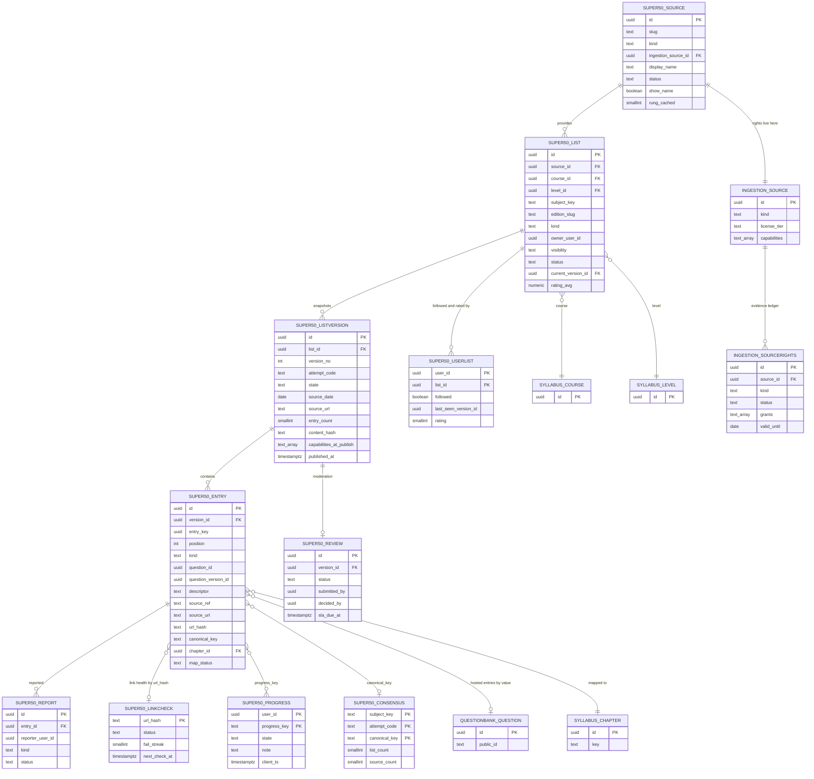
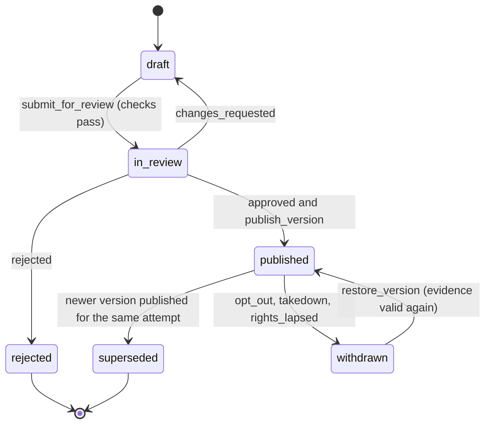
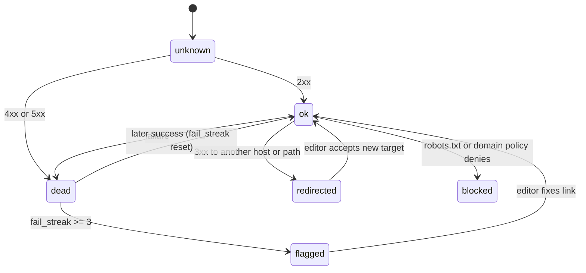

# ERD: F-04 Super 50 Questions (curated lists over F-06 and X-04)

| Field | Value |
| --- | --- |
| Linked PRD | `docs/product/prd/F-04-super-50-questions.md` |
| Order | Content layer. Reads `docs/product/erd/F-02-syllabus-structure-and-coverage.md` (taxonomy), consumes the contract of `docs/product/erd/F-06-question-bank-system.md` (sections 0 and 3), extends `docs/product/erd/X-04-ingestion-scraping-service.md` with a rights ledger (section 3.3) that `docs/product/erd/F-12-institute-study-material.md` shares |
| Django app | `apps/api/modules/super50` (tables `super50_*`). Extension tables `ingestion_sourcerights` and one column on `ingestion_source` are owned by `apps/api/modules/ingestion` |
| Web module | `apps/web/src/modules/super50` |
| Last updated | 2026-10-05 |

**Reading guide.** Sections 0 and 3 are the contract. F-04 owns lists, versions, entries, follows, progress, reports, link health and the consensus cache. It does **not** own questions, attempts, files, fetching or notifications; where it needs them it calls the owning module's service or selector (F-06 ERD 3.7, "what consumers must not do"). Tables follow the `<app>_<model>` convention.

## 0. Design decisions

1. **A list is an identity, a version is a snapshot.** `super50_list` is stable (URL, source, subject, ratings, followers). `super50_listversion` is an immutable snapshot targeted at one attempt (`YYYY-MM`). Entries belong to a version. Editing a published list creates a draft version. This gives "versioned list snapshots per attempt" and a true "what changed" without diff heuristics on mutable rows (same reasoning as F-06 question versions, ERD 0.2).
2. **An entry has two identities.** `entry_key` (uuid) is stable across versions of one list: it makes carry-over, "New" and diffs exact. `canonical_key` (text) identifies the underlying question across lists and sources: it makes de-duplication, consensus and "done in another list" exact. Progress is keyed by `canonical_key` when present, otherwise by `entry_key`.
3. **Two entry kinds.** `question` points at an F-06 question with a **pinned version** (F-06 collections cannot pin; PRD 4.2 of F-06 sends curated lists that must pin to F-04's own table). `reference` carries only facts: an editor-written descriptor (max 140 characters), source reference, date, link and mapping. References are the rung-1 legal posture made structural: there is no column that could hold a copied question.
4. **Rights are not in this module.** "May we host this?" is answered by `ingestion.selectors.source_capabilities(source_id)`, backed by a dated evidence ledger in X-04 (`ingestion_sourcerights`, section 3.3). F-04 stores the capabilities that held at publish time (`capabilities_at_publish`) for audit and re-checks daily. The same ledger serves F-12.
5. **Exactly one published version per list and attempt, enforced by the database.** A partial unique index plus a row lock on the list inside `publish_version`. No check-then-insert (audit AUD-001, AUD-006).
6. **Progress is student data, not list data.** `super50_progress` is keyed `(user_id, progress_key)` and never rewritten by publishing. Hosted entries additionally derive "done" from `practice.selectors.question_states`; F-04 stores no copy of attempts.
7. **Link health is shared by URL.** `super50_linkcheck` is keyed by the hash of the normalised URL, so a link used by twelve entries is checked once, through the X-04 fetcher (robots, rate limits, circuit breaker).
8. **Derived data is rebuildable.** `super50_consensus`, the counters on `super50_list` and the cached capabilities on `super50_source` can be dropped and rebuilt from entries and the ledger; none is authoritative for authorisation.
9. **Django is the only gateway.** RLS enabled with no policies on every table. User scoping on every query; detail routes return 404 for what the viewer may not see.
10. **Extension, not editing.** F-04 registers an origin (`super50`), subscribers and an erasure hook in `AppConfig.ready()`; it adds no behaviour to `practice`, `questionbank` or `ingestion` by editing them. Two small additive extensions are proposed and marked `[PROPOSED EXTENSION]`.

## 1. Diagrams

### 1.1 Entities



Also owned but not drawn: `super50_auditlog`. `INGESTION_SOURCE.capabilities` and `INGESTION_SOURCERIGHTS` are the extension in section 3.3.

### 1.2 List version lifecycle



### 1.3 Link health



## 2. Tables

Common columns unless stated: `id uuid PK default gen_random_uuid()`, `created_at timestamptz not null default now()`, `updated_at timestamptz not null default now()`. `*_user_id`, `created_by`, `decided_by` and similar reference `auth.users.id` by value (no cross-schema FK) and are scoped on every query. Enumerations are `text` with a check constraint (values in section 4). Marks are `numeric`. JSONB only for schema-less payloads with a schema version.

### 2.1 `super50_source`

The curation face of a source: who a list comes from and how it is shown. Rights are in X-04 (3.3).

| Column | Type | Null | Default | Notes |
| --- | --- | --- | --- | --- |
| slug | text | no | | Unique, kebab-case (`artha-editorial`, `icai-bos`) |
| kind | text | no | | `platform`, `teacher`, `coaching`, `institute`, `student_pool`, `open_licence` |
| ingestion_source_id | uuid | no | | X-04 `ingestion_source.id` by value now, FK when X-04 migrations exist. Unique. Every source, even a manual one (`crawl_method='manual'`), has exactly one so that rights live in one place |
| display_name | text | no | | "Artha Editorial", "ICAI (Board of Studies)", "Mr. Rao" |
| attribution_text | text | no | `''` | Shown with the list: "List by Mr. Rao, dated 2 Mar 2027" |
| show_name | boolean | no | true | When false the UI says "A teacher" (opt-in discretion, set at opt-out talks) |
| website_url | text | yes | | https only |
| allowed_link_hosts | text[] | no | `{}` | Extra hosts editors approved for entry links (the source's own domain and sub-domains are implicit) |
| status | text | no | `active` | `active`, `paused`, `blocked`, `archived` |
| blocked_at, blocked_reason | timestamptz, text | yes | | `opt_out`, `takedown`, `tos`, `other`; set by `block_source` |
| optout_requested_at | timestamptz | yes | | Start of the 24-hour clock |
| contact_name, contact_email | text | yes | | Admin only (PII). Purged 12 months after the relationship ends |
| manager_user_id | uuid | yes | | R3 source manager; null until then |
| rung_cached | smallint | no | 1 | 0 to 4, derived from the ledger by `refresh_capabilities`. **Display only, never used to authorise** |
| capabilities_cached | text[] | no | `{link_out,metadata}` | Same: display and sorting only |
| capabilities_checked_at | timestamptz | yes | | |
| notes | text | no | `''` | |

Constraints and indexes: unique `slug`; unique `ingestion_source_id`; check `status = 'blocked'` implies `blocked_at is not null`; check `kind = 'platform'` implies `rung_cached = 0` after refresh (service rule, asserted by test); index `(status, kind)`.

### 2.2 `super50_list`

| Column | Type | Null | Default | Notes |
| --- | --- | --- | --- | --- |
| source_id | uuid | no | | FK `super50_source`, restrict |
| course_id | uuid | no | | FK `syllabus_course` |
| level_id | uuid | no | | FK `syllabus_level` |
| subject_key | text | no | | Stable subject key from the taxonomy (scheme independent) |
| subject_id | uuid | yes | | FK `syllabus_subject` of the scheme in force at the last publish (convenience join; re-pointed by the remap service) |
| edition_slug | text | no | `super-50` | Lets one source publish more than one list per subject (`super-50`, `case-laws`) |
| kind | text | no | | `platform`, `partner`, `teacher_link`, `student` |
| title | text | no | | Max 120 characters |
| public_slug | text | yes | | Unique, only for public platform and partner lists: `taxation-ca-inter-super-50` |
| owner_user_id | uuid | yes | | Student lists only |
| visibility | text | no | `public` | `private`, `link`, `public` |
| status | text | no | `active` | `active`, `archived`, `withdrawn` |
| current_version_id | uuid | yes | | FK `super50_listversion`: the published version for the latest attempt |
| latest_attempt_code | text | yes | | `YYYY-MM` of `current_version` |
| entry_count | smallint | no | 0 | Of the current version |
| hosted_count | smallint | no | 0 | Hosted entries in the current version |
| follower_count | int | no | 0 | Derived, rebuilt nightly |
| rating_avg | numeric(3,2) | yes | | Null below 5 ratings |
| rating_count | int | no | 0 | |
| seo_indexable | boolean | no | false | Public subject and platform list pages only |
| collection_id | uuid | yes | | Optional mirror: F-06 `questionbank_collection.id` by value (R2, section 3.4) |
| import_job_id | uuid | yes | | F-06 import job by value (student uploads) |
| created_by | uuid | yes | | |
| deleted_at | timestamptz | yes | | Soft delete for student lists |

Constraints: unique `public_slug` where not null; unique `(source_id, course_id, level_id, subject_key, edition_slug, coalesce(owner_user_id, '00000000-0000-0000-0000-000000000000'))`; check `kind = 'student'` iff `owner_user_id is not null`; check `visibility = 'public'` implies `owner_user_id is null`; check `visibility = 'public'` implies `status = 'active'`.

Indexes: `(course_id, level_id, subject_key, status) where visibility = 'public'` (hub and public page); `(owner_user_id, status, updated_at desc) where owner_user_id is not null` (my lists); `(source_id, status)`.

### 2.3 `super50_listversion` (immutable once it leaves draft)

| Column | Type | Null | Default | Notes |
| --- | --- | --- | --- | --- |
| list_id | uuid | no | | FK, restrict |
| version_no | int | no | | 1-based per list |
| attempt_code | text | no | | `YYYY-MM`, the F-02 exam term code the version targets. Check is the format only (`~ '^[0-9]{4}-[0-9]{2}$'`), not a list of months, because exam months change |
| exam_term_id | uuid | yes | | FK `syllabus_examterm` when the term exists |
| state | text | no | `draft` | `draft`, `in_review`, `published`, `superseded`, `rejected`, `withdrawn` |
| withdraw_reason | text | yes | | `opt_out`, `takedown`, `rights_lapsed`, `editorial`, `replaced` |
| title_override | text | yes | | |
| change_summary | text | no | `''` | Max 1,000 characters, shown in "What changed" and the notification |
| source_label | text | no | `''` | "Mr. Rao's PDF, March 2027" |
| source_date | date | yes | | When the **source** dated the list; required for non-platform sources |
| source_url | text | yes | | https; the page or file of the whole list |
| entry_count, hosted_count | smallint | no | 0 | Set at submit |
| content_hash | text | yes | | SHA-256 of the ordered `(entry_key, question_version_id, descriptor)` tuples; equal hashes mean "no change" and block an empty version |
| previous_version_id | uuid | yes | | Version this one was copied from (diff base) |
| rung_at_publish | smallint | yes | | Lowest rung used by any entry at publish |
| capabilities_at_publish | text[] | yes | | Union of capabilities that cover the entries at publish, for audit |
| checks | jsonb | no | `{}` | Automatic results, schema version in `checks_schema` smallint: `{"v":1,"size":"ok","mapped":50,"duplicates":0,"rights":"ok","links":{"ok":48,"dead":2}}` |
| authored_by | uuid | yes | | |
| published_at, published_by | timestamptz, uuid | yes | | |
| superseded_at | timestamptz | yes | | |
| client_id | uuid | yes | | Draft creation idempotency |

Constraints and indexes:
- unique `(list_id, version_no)`;
- **partial unique `(list_id, attempt_code) where state = 'published'`** (one published version per list and attempt);
- partial unique `(list_id) where state in ('draft','in_review')` (one open draft per list);
- check `state in ('published','superseded','withdrawn') implies published_at is not null`;
- check `state = 'withdrawn' implies withdraw_reason is not null`;
- check `entry_count between 0 and 100`;
- index `(list_id, version_no desc)`; `(state, published_at desc)` where `state = 'published'`; `(attempt_code, state)`.

Rows are never updated after `in_review` except `state`, `withdraw_reason`, `superseded_at`, `published_*` (service rule; a trigger-free test asserts content columns do not change).

### 2.4 `super50_entry`

| Column | Type | Null | Default | Notes |
| --- | --- | --- | --- | --- |
| version_id | uuid | no | | FK `super50_listversion`, restrict. Entries are deleted only while the version is a draft |
| entry_key | uuid | no | gen | Stable across versions of the same list: new draft versions copy rows with the same key |
| position | int | no | | Gap of 1024; unique per version; rebalanced by the service |
| kind | text | no | | `question`, `reference` |
| question_id | uuid | yes | | F-06 `questionbank_question.id` by value. Required for `question` |
| question_version_id | uuid | yes | | Pinned F-06 version. Required for `question`. "Newer version available" is a selector comparison with `live_version_id` |
| descriptor | text | yes | | Editor-written or student-written, max 140 characters, plain text, no Markdown. Required for `reference`; for `question` optional (editor label) |
| basis_note | text | no | `''` | Why it is in the list (editorial rubric), max 300 characters, editors only |
| source_name | text | yes | | Overrides the list source for mixed lists ("ICAI") |
| source_ref | text | no | `''` | "RTP Nov 2024, Q4(b)" |
| source_term_code | text | yes | | Term the underlying question came from, `YYYY-MM` |
| source_url | text | yes | | https; a reference needs `source_url` or `source_ref` |
| url_hash | text | yes | | SHA-256 of the normalised URL; join key to `super50_linkcheck` |
| source_date | date | yes | | Overrides the version date |
| attempt_code | text | yes | | Overrides the version attempt for mixed lists |
| marks | numeric(5,1) | yes | | Stated by the source or from the F-06 live version |
| canonical_key | text | yes | | Identity of the underlying question across lists (grammar in 4.2). Unique per version |
| subject_key, chapter_key | text | no | | Stable taxonomy keys |
| chapter_id | uuid | no | | FK `syllabus_chapter`, restrict (scheme in force at publish) |
| topic_id | uuid | yes | | FK `syllabus_topic` |
| map_status | text | no | `confirmed` | `suggested`, `confirmed`, `rejected`. Submit requires all `confirmed` |
| map_origin | text | no | `editor` | `editor`, `ai`, `inherited` (from the F-06 primary mapping), `student`, `ingestion`, `remap` |
| map_confidence | numeric(3,2) | yes | | For `ai`, `ingestion`, `remap` |
| map_decided_by, map_decided_at | uuid, timestamptz | yes | | |
| added_in_version_no | int | no | | First version number in which this `entry_key` appeared (set when the entry is created, carried on copy). "New" in version N means `added_in_version_no = N` |
| status | text | no | `active` | `active`, `unavailable` (question taken down, link blocked) |
| unavailable_reason | text | yes | | `question_taken_down`, `source_blocked`, `rights_lapsed` |
| needs_attention | boolean | no | false | Set by the report threshold, link-health flag or amendment flag |
| attention_reason | text | yes | | `reports`, `link_dead`, `amendment`, `newer_question_version`, `editor` |

Constraints: unique `(version_id, entry_key)`; unique `(version_id, position)` deferrable (reorders); partial unique `(version_id, canonical_key) where canonical_key is not null`; check `kind = 'question'` implies `question_id is not null and question_version_id is not null`; check `kind = 'reference'` implies `descriptor is not null and question_id is null and (source_url is not null or source_ref <> '')`; check `char_length(descriptor) <= 140`; check `source_url like 'https://%'`; check `map_status = 'confirmed'` or the version is a draft (service rule, asserted at submit and publish).

Indexes: `(version_id, position)`; `(version_id, chapter_id, position)` (chapter filter); `(question_id) where question_id is not null` (`lists_containing`, takedown reaction); `(canonical_key) where canonical_key is not null` (consensus, dedupe); `(url_hash) where url_hash is not null` (link health); `(needs_attention) where needs_attention`; `(chapter_id)` (amendment reaction).

A reference entry has no column for question text, solution or options by construction. This is the structural form of the rung-1 rule.

### 2.5 `super50_review`

| Column | Type | Null | Default | Notes |
| --- | --- | --- | --- | --- |
| version_id | uuid | no | | FK, unique |
| kind | text | no | | `new_list`, `new_version`, `rights_change`, `report_followup` |
| status | text | no | `pending` | `pending`, `claimed`, `approved`, `changes_requested`, `rejected`, `withdrawn`, `superseded` |
| submitted_by | uuid | no | | |
| claimed_by, claimed_until | uuid, timestamptz | yes | | Claim expires after 30 minutes |
| decided_by, decided_at | uuid, timestamptz | yes | | |
| second_review_required | boolean | no | false | True for the first list of a subject, any hosted entry above rung 1, and `rights_change` |
| first_decided_by, first_decided_at | uuid, timestamptz | yes | | The first approver when a second one is required |
| decision_code | text | yes | | `ok`, `mapping_wrong`, `rights`, `duplicate`, `low_quality`, `links`, `stale`, `other` |
| decision_note | text | yes | | Shown to the author |
| checks | jsonb | no | `{}` | Copy of the automatic results at submit (schema version 1) |
| flags | text[] | no | `{}` | `mapping_low`, `rights_unclear`, `links_dead`, `duplicate`, `new_source`, `size_warning` |
| priority | smallint | no | 0 | Raised by SLA age and `rights_change` |
| submitted_at | timestamptz | no | now() | |
| sla_due_at | timestamptz | no | | `submitted_at + 24 hours` target; the 48-hour limit is computed |

Constraints: check `decided_by is null or decided_by <> submitted_by`; check `first_decided_by is null or first_decided_by <> submitted_by`; check `second_review_required` approvals need `first_decided_by <> decided_by` (service rule plus test). Indexes: `(status, priority desc, submitted_at) where status in ('pending','claimed')`; `(decided_by, decided_at desc)`.

### 2.6 `super50_userlist` (follow, last seen, rating)

| Column | Type | Null | Default | Notes |
| --- | --- | --- | --- | --- |
| user_id, list_id | uuid | no | | PK `(user_id, list_id)`; list FK cascade |
| followed | boolean | no | false | |
| notify | boolean | no | true | Per-list override of the category preference |
| followed_at | timestamptz | yes | | |
| follow_prompt_dismissed | boolean | no | false | |
| last_seen_version_id | uuid | yes | | Clears the "New" badge |
| last_seen_at | timestamptz | yes | | |
| last_opened_at | timestamptz | yes | | |
| open_count | smallint | no | 0 | Capped at 100; drives the follow prompt |
| rating | smallint | yes | | Check 1..5 |
| rating_tags | text[] | no | `{}` | `useful`, `too_hard`, `outdated`, `great_solutions` |
| rated_at | timestamptz | yes | | One change per 7 days (service rule) |
| rating_discarded | boolean | no | false | Set by an editor (audited); excluded from the average |

Indexes: PK; `(list_id) where followed` (audience); `(user_id, followed, updated_at desc) where followed` (hub); `(list_id) where rating is not null and not rating_discarded` (average).

### 2.7 `super50_progress`

| Column | Type | Null | Default | Notes |
| --- | --- | --- | --- | --- |
| user_id | uuid | no | | |
| progress_key | text | no | | `c:<canonical_key>` when the entry has one, else `e:<entry_key>` |
| state | text | no | | `todo`, `done`, `revise`, `skipped` |
| note | text | no | `''` | Max 500 characters, private, references only (hosted notes are F-06's) |
| done_at | timestamptz | yes | | First time it became `done` |
| list_id | uuid | yes | | List where it was last marked (for "done in another list") |
| client_ts | timestamptz | no | | Last-writer-wins guard from the device clock, clamped to server time plus 5 minutes |
| updated_at | timestamptz | no | now() | |

PK `(user_id, progress_key)`. Index `(user_id, state, updated_at desc)`. The write is one statement: `INSERT ... ON CONFLICT (user_id, progress_key) DO UPDATE SET ... WHERE super50_progress.client_ts <= EXCLUDED.client_ts` so replays and two devices converge without a read-then-write. When an editor later assigns a `canonical_key` to an entry that had none, `assign_canonical_key` moves `e:` rows to `c:` rows inside one transaction (done beats revise beats skipped beats todo when both exist).

### 2.8 `super50_report`

| Column | Type | Null | Default | Notes |
| --- | --- | --- | --- | --- |
| entry_id, version_id | uuid | no | | FKs; the version the reporter saw |
| reporter_user_id | uuid | no | | |
| kind | text | no | | `link_dead`, `wrong_mapping`, `wrong_details`, `not_important`, `copyright`, `other` |
| message | text | no | `''` | Max 500 characters |
| status | text | no | `open` | `open`, `accepted`, `rejected`, `fixed`, `duplicate` |
| resolved_by, resolved_at | uuid, timestamptz | yes | | |
| resolution_note | text | no | `''` | Sent to the reporter |
| fixed_version_id | uuid | yes | | |

Unique `(entry_id, reporter_user_id, kind)` where `status = 'open'`; indexes `(status, created_at)`, `(entry_id, status)`. A `copyright` report also opens an X-04 takedown draft through `ingestion.services.open_takedown_draft(...)`. Hosted-question errors (`wrong_answer`, `typo`) are not stored here: the service calls `questionbank.services.report_error`. Reports hide the reporter's identity in admin lists (short id).

### 2.9 `super50_linkcheck`

| Column | Type | Null | Default | Notes |
| --- | --- | --- | --- | --- |
| url_hash | text | no | | PK, SHA-256 of the normalised URL (scheme and host lower-cased, tracking parameters removed, fragment kept for PDF page anchors) |
| url | text | no | | |
| host | text | no | | |
| status | text | no | `unknown` | `unknown`, `ok`, `redirected`, `dead`, `blocked`, `flagged` |
| http_status | smallint | yes | | |
| final_url | text | yes | | After redirects (https only) |
| fail_streak | smallint | no | 0 | |
| last_checked_at, last_ok_at | timestamptz | yes | | |
| next_check_at | timestamptz | no | now() | Weekly; sooner after a failure (1 day, then 3 days) |

Indexes: `(next_check_at)`; `(status) where status in ('dead','flagged','blocked')`. Rows with no entry referencing them for 90 days are deleted by the tick. The check uses `ingestion.services.fetch_head(url, purpose='linkcheck')`, which applies robots, the host rate limit and the circuit breaker.

### 2.10 `super50_consensus` (derived)

`subject_key`, `course_id`, `level_id`, `attempt_code`, `canonical_key` (PK of the five), `list_count` smallint, `source_count` smallint (distinct sources, so one teacher posting three lists counts once), `sample_entry_id` uuid, `calculated_at`. Rebuilt for a `(subject_key, attempt_code)` on every publish and withdraw, and all rows every 15 minutes by the tick if the watermark moved. Counts consider only published, non-withdrawn, **public** versions (private student lists never contribute, so no private content leaks into a public signal). Index `(subject_key, attempt_code, list_count desc)`.

### 2.11 `super50_auditlog`

`id bigint identity`, `actor_id uuid`, `entity_type text`, `entity_id uuid`, `action text`, `before jsonb`, `after jsonb`, `created_at`. Append-only. Index `(entity_type, entity_id, created_at desc)`. Covers source block and unblock, publish, withdraw, restore, mapping decisions, rating discards, rights-driven changes.

## 3. Relationships to other modules

### 3.1 Foreign keys and by-value references

| From | To | Rule |
| --- | --- | --- |
| all `*_user_id`, `created_by`, `decided_by` | `auth.users.id` | By value; scoped on every query |
| `super50_list.course_id`, `level_id`, `subject_id`; `super50_listversion.exam_term_id`; `super50_entry.chapter_id`, `topic_id` | `syllabus_*` | Real FKs, restrict. **Reads and key resolution through `syllabus.selectors`** (3.2); no foreign model queries |
| `super50_entry.question_id`, `question_version_id` | `questionbank_question`, `questionbank_questionversion` | By value (versions are never hard-deleted by F-06). Created only through F-06 services |
| `super50_source.ingestion_source_id` | `ingestion_source` | By value now, FK later; unique |
| `super50_list.collection_id` | `questionbank_collection` | By value, optional mirror |
| `super50_list.import_job_id` | `questionbank_importjob` | By value |
| `super50_report` (copyright) | `ingestion_takedown` | Through `ingestion.services.open_takedown_draft` |

Dependency direction (no cycles): `super50 -> questionbank, practice (services and selectors), ingestion (selectors, fetch service), syllabus (selectors), core.events`. Nobody imports `super50` models; consumers use its selectors and events.

### 3.2 Syllabus selectors needed `[PROPOSED: F-02]`

The audit (AUD-005) found foreign-model queries in coverage and tracking. F-04 must not repeat that, so it needs these functions in `syllabus.selectors` (small, read-only):

| Function | Purpose |
| --- | --- |
| `resolve_keys(course, level, subject_key, chapter_key=None, topic_key=None, scheme=None) -> ChapterRef or SubjectRef` | Turn stable keys into ids of the published scheme |
| `chapters_of_subject(subject_id) -> list[ChapterRef]` | Mapping pickers and chapter filters |
| `published_scheme(level_id) -> SchemeRef` | "Old syllabus" decisions |
| `exam_term_by_code(code) -> TermRef or None` | Attempt codes |
| `chapter_map(from_scheme, to_scheme)` | Remap of entries when a scheme changes (reuses `syllabus_chaptermap`) |
| `enrolment_context(user_id)` via `coverage.selectors` | Target term and enrolled subjects of the student |

### 3.3 Rights ledger and capability flags `[PROPOSED EXTENSION to X-04]`

X-04 already has `ingestion_source.license_tier` (`link_only`, `facts_and_summary`, `host`) and the rule that `host` needs a `license_note`. That is one coarse switch with free text. The legal posture ladder needs (a) finer capabilities, (b) dated, scoped, revocable evidence, (c) one function every publisher calls. The extension is additive and small; F-12 uses it too.

**Capability vocabulary** (text, check constraint on `ingestion_source.capabilities` and `ingestion_sourcerights.grants`):

| Capability | Meaning |
| --- | --- |
| `link_out` | Show the source's own URL (including a deep link to a page of its PDF) |
| `metadata` | Store and show facts: title, reference, date, page number, marks, chapter, our own descriptor |
| `ai_map` | Send metadata (never full text) to the AI client for mapping suggestions |
| `ai_summarise` | Let the AI client read source text to write our own summary |
| `discover` | Let X-04 crawl the source on a schedule to find new items |
| `host_questions` | Store and serve question text and options (F-06 questions) |
| `host_solutions` | Store and serve solution text and marking steps |
| `host_media` | Store and serve images and diagrams from the source |
| `host_files` | Store and serve the source's own PDFs (never used by F-04 or F-12; reserved) |
| `practice` | Allow hosted items in practice sessions |
| `public_seo` | Show hosted text on public indexable pages |
| `private_host` | Store content for the uploading student only (rung 3) |
| `derive_index` | Read the official file in a worker to compute labels, page numbers and one-way fingerprints, discarding the text (used by F-12 matching and extraction). In no baseline: ICAI treats unauthorised downloading and extraction as an offence, so it needs a `written_permission` or `counsel_opinion` row |

**Rung baselines** (what a source gets with no evidence beyond the posture itself):

| Rung | Name | Baseline capabilities | How a source gets there |
| --- | --- | --- | --- |
| 0 | platform original | all except `host_files`, `private_host` | `ingestion_source.kind = 'manual'` and `super50_source.kind = 'platform'`, set by migration, cannot be set by an editor |
| 1 | link-out | `link_out`, `metadata`, `ai_map` | default for every source; needs a `tos_review` and a `robots_review` ledger entry with status `active` for `discover` and link checks |
| 2 | partnership | rung 1 plus the `grants` of active `written_permission` or `partnership_agreement` rows | evidence row with counterparty, signed date, scope |
| 3 | student upload | rung 1 plus `private_host` | source kind `student_pool`, with an `upload_terms` row naming the terms version |
| 4 | reusable licence | rung 1 plus `grants` of an active `licence` row | evidence row with `licence_spdx`, `commercial_use_ok = true` |

`effective_capabilities(source, at) = source.capabilities ∩ (baseline(kind) ∪ ⋃ grants of active evidence valid at `at` and in scope) − denied`, where `denied` removes `ai_map`, `ai_summarise`, `discover` when an active `tdm_check` or `optout_notice` row says reserved. `source.capabilities` is the **ceiling** an admin sets ("what we intend to allow"); evidence is the **floor** that must exist. Both must agree.

**New column** `ingestion_source.capabilities text[] not null default '{link_out,metadata}'`. Check: every value is in the vocabulary; `host_*`, `practice`, `public_seo` present implies `license_tier = 'host'` (existing tier retained as the coarse label and for backwards compatibility); `license_tier = 'host'` still requires `license_note`.

**New table `ingestion_sourcerights`** (the ledger; admin only, never student-readable):

| Column | Type | Null | Default | Notes |
| --- | --- | --- | --- | --- |
| source_id | uuid | no | | FK `ingestion_source`, restrict |
| kind | text | no | | `tos_review`, `robots_review`, `tdm_check`, `written_permission`, `partnership_agreement`, `licence`, `counsel_opinion`, `upload_terms`, `optout_notice` |
| status | text | no | `draft` | `draft`, `active`, `expired`, `revoked`, `superseded` |
| grants | text[] | no | `{}` | Capabilities this evidence supports. `tos_review`, `robots_review` and `counsel_opinion` grant only rung-1 capabilities; `tdm_check` and `optout_notice` grant none and may **deny** (see `denies`) |
| denies | text[] | no | `{}` | Capabilities removed (`ai_map`, `ai_summarise`, `discover`, or `*` for an opt-out) |
| scope | jsonb | no | `{}` | Optional limits: `{"v":1,"courses":["ca"],"levels":["final"],"subject_keys":["fr"]}`; empty means the whole source |
| counterparty | text | yes | | Person or organisation that granted it |
| reference | text | yes | | Where the evidence is: "Email from Mr. Rao, 12 Mar 2027" |
| evidence_attachment_id | uuid | yes | | `media_attachment.id` by value, private bucket `rights-evidence` |
| licence_spdx | text | yes | | `CC-BY-4.0`, `CC-BY-SA-4.0`, `CC0-1.0`, ... Required for `licence` |
| licence_url | text | yes | | |
| commercial_use_ok | boolean | yes | | Required `true` for `licence` (a non-commercial licence cannot back hosting because the platform has paid plans) |
| attribution_required | boolean | no | true | |
| attribution_text | text | yes | | Shown wherever hosted content appears |
| share_alike | boolean | no | false | Shown to editors; derivative lists must carry the same terms |
| signed_on | date | yes | | Required for permission, agreement, licence |
| valid_from | date | no | current_date | |
| valid_until | date | yes | | Null means open-ended (allowed for licences, flagged for permissions) |
| review_due_on | date | yes | | Reminder date; defaults to 11 months after `valid_from` for permissions |
| reviewed_by, reviewed_at | uuid, timestamptz | yes | | Admin who verified the evidence |
| revoked_at, revoked_by, revoke_reason | timestamptz, uuid, text | yes | | |
| notes | text | no | `''` | |

Constraints: check `kind in ('written_permission','partnership_agreement','licence')` implies `counterparty is not null and signed_on is not null and (evidence_attachment_id is not null or reference is not null)`; check `kind = 'licence'` implies `licence_spdx is not null and commercial_use_ok is true`; check `valid_until is null or valid_until >= valid_from`; check `grants <@ vocabulary`; check `status = 'active'` requires `reviewed_by is not null` (a second admin, not the creator; service rule plus constraint on `reviewed_by <> created_by`). Indexes `(source_id, status)`, `(valid_until) where status = 'active'`, `(review_due_on) where status = 'active'`.

**New functions** in `ingestion.selectors` and `ingestion.services` (the only way anyone asks):

```python
# ingestion/selectors.py
def source_capabilities(source_id: UUID, *, at: date | None = None, scope: Scope | None = None) -> frozenset[str]
def source_rung(source_id: UUID, *, at: date | None = None) -> int          # derived, 0..4
def rights_evidence(source_id: UUID) -> list[RightsEvidence]               # admin screens
# ingestion/services.py
def require_capability(source_id: UUID, capability: str, *, scope: Scope | None = None) -> None   # raises RightsBlocked(capability, missing_evidence)
def record_rights(admin_id: UUID, source_id: UUID, payload: RightsIn) -> RightsEvidence
def revoke_rights(admin_id: UUID, rights_id: UUID, reason: str) -> None     # triggers the audit job for dependants
def block_source(admin_id: UUID, source_id: UUID, reason: str) -> TakedownRecord   # existing takedown path, now emits source_blocked
def open_takedown_draft(source_id=None, item_ref=None, complainant=None) -> TakedownDraft
```

`require_capability` is called by every publisher and service that exposes third-party content (F-04 `publish_version`, F-12 `publish_edition`, F-06 `upsert_from_source` when `ownership='platform'` and `rights_status in ('licensed','institute_material')`). A nightly job `ingestion.audit_rights` expires evidence past `valid_until`, emits `source_rights_changed {source_id, lost: [...], gained: [...]}` and the dependants (F-04, F-12) react. Dependants subscribe; X-04 does not call them.

**Bucket** `rights-evidence` (private): path `{source_id}/{rights_id}/{sha256}.{ext}`, admin-only signed URL with a 15-minute TTL, retention for the life of the relationship plus 7 years (limitation period for contract disputes `[VERIFY with counsel]`).

**Seed register** (migration `ingestion.000x_seed_sources` creates the `ingestion_source` rows as `draft` or `active`; `super50.0003_seed_sources` creates the matching `super50_source` rows). Every row is a starting point, not a conclusion.

| Source slug | Owner | Kind | Starting rung and capabilities | Evidence to collect before moving up | Status |
| --- | --- | --- | --- | --- | --- |
| `artha-editorial` | Artha | platform | 0, all except `host_files` | Editor attestation per question (`rights_status = original`) | active |
| `icai-bos` | ICAI | institute | 1: `link_out`, `metadata`, `ai_map` | `tos_review`, `robots_review` now; `written_permission` from the Publication Department to reach `host_questions`, `host_solutions`, `practice` for RTP, MTP, MAT (ICAI notice: reproduction needs written permission) `[VERIFY]` | draft until the review rows exist |
| `icsi-academic` | ICSI | institute | 1 | same; terms not verified (page not readable during research) `[VERIFY]` | draft |
| `icmai-students` | ICMAI | institute | 1 | same; `[VERIFY]` | draft |
| `student-uploads` | students | student_pool | 3: rung 1 plus `private_host` | `upload_terms` row naming the contributor terms version; takedown process live | active when `super50_upload` goes live |
| `open-licence-pool` | various | open_licence | 1; each item or batch adds a `licence` row (scope by subject) | `licence_spdx`, `commercial_use_ok = true`, attribution text. Candidate classes: CC BY or CC0 educational resources, government publications under an open licence such as GODL-India `[VERIFY]` | draft |
| `teacher-pilot-1` (placeholder) | a teacher | teacher | 1 | `tos_review`, `robots_review`; `written_permission` for rung 2 | draft, created by the editor who approaches the teacher |

### 3.4 F-06 interplay

**Origin registration** (in `Super50Config.ready()`):

```python
practice.registry.register_origin("super50", OriginSpec(
    validate_spec=validate_super50_spec,             # {"list_version_id": ..., "scope": "todo", "chapter_ids": [...], "count": 20}
    allowed_modes=["untimed", "timed", "chapter_quiz", "revision"],
    default_feedback_policy="instant",
    unique_per_user=False,
    title_for=lambda ref, spec: f"Super 50: {list_title(ref)}",
))
```

Sessions are created with `practice.services.create_session_from_items(user_id, mode, origin_module="super50", origin_ref=str(list_version_id), items=[ItemSpec(question_id, version_id=entry.question_version_id, section_label=chapter_name)], ...)`. The pinned version is the list's pin, so the session matches what the student read. The F-02 coverage subscriber of `practice_session_completed` already records practice for the chapters; **F-04 emits nothing to coverage** (PRD Q-F04-5).

**Read mode** calls `questionbank.selectors.get_review_view(question_id, version_id)` only after `require_capability(source, 'host_solutions')`. Nothing else in F-04 touches keys.

**Subscribers** (registered through `core.events.register_subscriber`, deferred, idempotent on `event.id`):

| Event | Reaction |
| --- | --- |
| `question_taken_down`, `question_unpublished` (F-06) | Set `status = 'unavailable'` on entries with that `question_id` in published versions; recompute counters; no new version |
| `question_version_live` (F-06) | Mark `needs_attention` with reason `newer_question_version` for entries pinned to an older version (editor decides whether a new list version re-pins) |
| `source_rights_changed` (X-04 extension) | Run the rights audit for that source: withdraw versions whose hosted entries lost cover, set `rung_cached`, alert admins |
| `amendment_published` (F-14, `[PROPOSED]`) | Flag entries mapped to affected chapters (`attention_reason = 'amendment'`) |
| `account_erasure_requested` (profiles, `[PROPOSED]`) | `delete_all_for_user` |

**Optional mirror** `[R2]`: after `publish_version` for a public platform or partner list the service calls `questionbank.services.set_collection_items(actor=None, collection_id, question_ids)` for hosted entries only, so the F-06 browser's `scope=collection` and the shared `collection` picker work for "all current Super 50 questions". The mirror follows live versions (F-06 collections cannot pin); the authoritative pinned list stays in `super50_entry`.

**`[PROPOSED EXTENSION to F-06]`** `questionbank.services.withdraw_by_source(actor_id, origin_module, external_refs | question_ids, reason)` (unpublish a batch of platform questions because their source's rights lapsed; defined and justified in the F-12 ERD 3.4, used by both).

### 3.5 Provides and consumes

**Provides**

| Interface | Signature (Python 3.12) | Used by |
| --- | --- | --- |
| `super50.selectors.lists_for_subject` | `(user_id: UUID, subject_key: str, attempt_code: str \| None) -> list[ListCard]` | hub, chapter panel, F-13 |
| `super50.selectors.lists_containing` | `(question_ids: Sequence[UUID]) -> dict[UUID, list[ListRef]]` | F-05, F-09, F-06 browser badge |
| `super50.selectors.consensus` | `(subject_key: str, attempt_code: str, *, min_lists: int = 2) -> list[ConsensusRow]` | F-11 |
| `super50.selectors.progress_summary` | `(user_id: UUID, subject_key: str) -> ProgressSummary` | F-10, F-13 |
| `super50.services.delete_all_for_user`, `export_for_user` | `(user_id: UUID) -> DeleteReport \| dict` | account deletion hook |
| Events | `super50_list_published`, `super50_list_withdrawn`, `super50_entry_flagged` (JSON schemas in `core/event_schemas/`) | X-01, F-13, caches |
| Registry | Today provider `register_today_provider("super50", ...)` `[PROPOSED: F-13]` | F-13 |

**Consumes**

| Interface | From |
| --- | --- |
| `upsert_from_source` (via editor tooling, not students), `get_playable`, `get_review_view`, `taxonomy_of`, `can_view`, `report_error`, events `question_taken_down`, `question_version_live` | F-06 `questionbank` |
| `create_session_from_items`, `question_states`, `register_origin` | F-06 `practice` |
| `source_capabilities`, `require_capability`, `record_rights`, `block_source`, `open_takedown_draft`, `fetch_head`, `suggest_mapping(metadata, scope) -> list[MappingSuggestion]` `[PROPOSED: X-04, thin wrapper over the shared AI client and its cost ledger]` | X-04 |
| `resolve_keys`, `chapters_of_subject`, `published_scheme`, `exam_term_by_code`, `chapter_map` | F-02 `syllabus.selectors` `[PROPOSED]` |
| `notifications.services.notify` | X-01 `[PROPOSED]` |
| `core.refs.canonical_key(...)` shared pure helper | `apps/api/core/refs.py` `[PROPOSED]`, also used by F-09 so both resolve the same identity |

## 4. Enumerations and reference data

| Name | Values | Stored as | Owner |
| --- | --- | --- | --- |
| Source kind | platform, teacher, coaching, institute, student_pool, open_licence | text + check | code |
| Source status | active, paused, blocked, archived | text + check | code |
| List kind | platform, partner, teacher_link, student | text + check | code |
| List visibility and status | private, link, public; active, archived, withdrawn | text + check | code |
| Version state | draft, in_review, published, superseded, rejected, withdrawn | text + check | code |
| Withdraw reason | opt_out, takedown, rights_lapsed, editorial, replaced | text + check | code |
| Entry kind and status | question, reference; active, unavailable | text + check | code |
| Mapping status and origin | suggested, confirmed, rejected; editor, ai, inherited, student, ingestion, remap | text + check | code |
| Review kind, status, decision code, flags | see 2.5 | text + check | code |
| Progress state | todo, done, revise, skipped | text + check | code |
| Report kind and status | see 2.8 | text + check | code |
| Link status | unknown, ok, redirected, dead, blocked, flagged | text + check | code |
| Capability vocabulary | see 3.3 | text[] + check | code (changed by migration only) |
| Rights evidence kind and status | see 3.3 | text + check | code |
| Rating tags | useful, too_hard, outdated, great_solutions | text[] + check | code |

### 4.2 Canonical key grammar (`core/refs.py`, pure, shared with F-09)

`canonical_key = <publisher>:<series>:<term>:<level>:<subject>:<question>` for Institute questions, all lower case, ASCII, no spaces. Examples: `icai:rtp:2024-11:ca-inter:fr:q4b`, `icai:mtp:2025-05:ca-final:afm:q2`, `icai:pyq:2023-11:ca-inter:tax:q6a`, `icsi:rtp:2025-06:cs-exec:cl:q3`. Normalisation: `4(b)` becomes `4b`, `Q.4 (b)(ii)` becomes `q4bii`, `Question No. 4` becomes `q4`; `series` is one of `rtp`, `mtp`, `pyq`, `mat`, `mcq`, `other`. Questions with no Institute reference use `fp:<first 16 hex of F-06 fp_exact>` for hosted entries and `url:<first 16 hex of url_hash>` for link-only references. Two entries that normalise to the same key are the same question. A test corpus of real-world reference spellings guards the normaliser; wrong merges are prevented by requiring all six parts for the Institute form and otherwise falling back to `fp:` or `url:`.

### 4.3 Seed data

`super50.0003_seed`: the sources of 3.3 (as `super50_source` rows linked to the seeded `ingestion_source` rows) and nothing else. No lists are seeded; editors create them. Quota numbers live in `questionbank_quotaplan` (F-06), extended with three columns for F-04 `[PROPOSED]`: `max_super50_lists`, `max_super50_entries_per_list`, `max_super50_uploads_per_day` (defaults 10, 100, 5).

## 5. Query patterns

| # | Query | Served by |
| --- | --- | --- |
| Q-1 | Hub: published public lists for `(course, level, subject_key)` plus the student's follows, ordered by my attempt, followed, rating, freshness | `super50_list (course_id, level_id, subject_key, status) where visibility='public'`, join `super50_listversion` by `current_version_id`, overlay from `super50_userlist` PK lookups |
| Q-2 | List detail: version header, first page of entries by `(version_id, position)` with chapter names | `(version_id, position)`; chapter names from one `syllabus.selectors` call for the chapters present |
| Q-3 | Entries with personal overlay: progress for the page's keys and F-06 states for hosted ones | `super50_progress` PK `IN (...)` (up to 100 keys), `practice.selectors.question_states(user_id, question_ids)` one `IN` query |
| Q-4 | Header counts "31 of 50 done": count of the version's progress keys in state `done` plus hosted attempted questions not already counted | one query over `(version_id)` entries joined to progress by key; capped at 100 rows; cached 60 s per user and version, ETag from `max(updated_at)` |
| Q-5 | Progress write | single `INSERT ... ON CONFLICT` on PK, guarded by `client_ts` |
| Q-6 | Practice builder: hosted question ids of a version filtered by `todo`, `wrong`, chapters, count | entries by `(version_id, chapter_id, position)`; states from Q-3; deterministic order by `md5(concat(entry_key::text, :seed))` |
| Q-7 | "New" badge: followed lists where `current_version_id <> last_seen_version_id` | `super50_userlist (user_id, followed)`; compare in SQL with the list row |
| Q-8 | Diff v(n-1) to v(n): full outer join of the two versions' entries on `entry_key` | `(version_id, entry_key)` unique index; at most 200 rows |
| Q-9 | Audience of a published version: user ids following the list, plus students enrolled in the subject and attempt (R2, opt-in only), batched by 500 | `(list_id) where followed`; enrolment through `coverage.selectors` paged; deduped by event key |
| Q-10 | Consensus rebuild for one subject and attempt | `(canonical_key) where not null` joined to published public versions; group by key; upsert into `super50_consensus` |
| Q-11 | Link-check batch | `super50_linkcheck (next_check_at)` limit 50 per tick, 1 request per host per second |
| Q-12 | Rights audit: published versions with hosted entries per source | `(state, published_at)` published partial index, entries `(version_id)`; call `source_capabilities` once per source |
| Q-13 | `lists_containing(question_ids)` | `(question_id) where question_id is not null` joined to published versions |
| Q-14 | Review queue | `(status, priority desc, submitted_at)` partial; claim by `UPDATE ... WHERE status='pending' RETURNING` |
| Q-15 | Reports ranked by distinct reporters for open entries | `(entry_id, status)` grouped |
| Q-16 | My lists | `(owner_user_id, status, updated_at desc)` |
| Q-17 | Export or delete for a user | `user_id` leading PKs and partial indexes; deletes are bounded per table and batched |

## 6. Storage, scale and retention

### 6.1 Volume assumptions

| Quantity | Year 1 | Year 3 | Basis |
| --- | --- | --- | --- |
| Lists (public) | 60 | 400 | about 20 subjects at launch, 3 lists per subject; growth through partners |
| Student lists | 2,000 | 40,000 | 4% of 50,000 MAU creating about one list |
| Published versions | 300 | 2,000 | about 2 attempts and 2 updates per list per year |
| Entries (all versions) | 15,000 | 100,000 | 50 per version, plus student lists |
| Progress rows | 300,000 | 15,000,000 | 5,000 MAU x 60 in year 1; 50,000 MAU x 300 in year 3 (bounded: a student follows about 6 lists of 50) |
| Link checks | 5,000 | 40,000 | distinct URLs |
| Rating rows | 5,000 | 120,000 | within `super50_userlist` |

No table needs partitioning. `super50_progress` at 15 million narrow rows with a two-column PK is comfortable; revisit past 100 million.

### 6.2 Caching and hot paths

- Public GETs (`public/subjects/.../lists/`, `public/lists/{slug}/`) send `Cache-Control: public, s-maxage=300, stale-while-revalidate=3600` and an ETag from `max(updated_at)`. `super50_list_withdrawn` purges the URL where possible, otherwise the 5-minute TTL applies, which meets the 5-minute opt-out visibility target in FR-F04-13.
- Personal data (progress, follows, rating) is always a separate `private, no-store` request so the shared part stays cacheable.
- Entry pages never contain answer keys; the solution is a separate request gated by capability and by the F-06 feedback rules.
- Hot rows are per student; no per-entry counters exist, so popular lists have no write contention. Ratings and followers are batch-recomputed nightly.

### 6.3 Async work (Vercel limits)

Nothing long runs in a request. The 1-minute tick (`POST internal/tick/`, shared secret header, bounded to 20 seconds) does: link-check batches, audience batches for notifications, consensus rebuild, expiry of review claims, rights audit (once per day), counter recompute (nightly). AI mapping jobs (up to 200 entries) are `core_job` rows claimed by the worker. If the worker is down, jobs wait; reads and writes are unaffected.

### 6.4 Storage

F-04 stores no files. Student uploads are F-06 `media_attachment` rows in `qb-files` (F-06 6.6). Rights evidence uses the `rights-evidence` bucket defined in 3.3.

### 6.5 Retention

| Data | Retention |
| --- | --- |
| Published and superseded versions | Kept (they are the audit trail of what students saw); withdrawn versions kept for 24 months then entries of rung-2 and rung-4 content are purged on request |
| Link-check rows without entries | 90 days |
| Reports | 24 months, ids only after account deletion |
| Review rows | Kept |
| Audit log | 3 years |
| Student lists, progress, ratings | Until deleted or the account is deleted (30 days grace) |

## 7. Security

- **Access path:** browser, Django, Postgres. The Supabase Data API stays disabled. RLS enabled with no policies on every `super50_*` table (post-migrate hook plus the RLS test extended).
- **Scoping:** every selector and service takes `user_id` from the JWT. Student list detail routes filter by owner and return 404 otherwise. Public routes return only rows with `visibility='public'`, `status='active'`, and a published version.
- **Rights enforcement in code and data:** `publish_version`, `restore_version`, the practice bridge and the solution endpoint call `require_capability`. `capabilities_at_publish` is stored. The daily audit withdraws what lost cover. There is no admin override flag that skips the check; moving up a rung means adding evidence.
- **Link safety:** `https` only; hosts must be the source's allowed domains or editor-approved; a deny-list in X-04 settings blocks messaging apps and file lockers; no IP literals or private ranges; the link checker runs in X-04's fetcher with SSRF guards and a size cap (HEAD, or GET with a 64 KB limit); links open with `rel="noopener noreferrer nofollow"`.
- **Content safety:** descriptors are plain text (no HTML, no Markdown, max 140), escaped at render; notes max 500, plain text; AI never sees personal notes.
- **Abuse:** throttles per PRD 9; ratings need engagement; reports one per kind per entry per student; student uploads follow the F-06 contributor rules and quota.
- **PII classification:** follows, progress, notes, ratings, private lists: personal (study habits). Source contact details: business PII, admin only. List and entry content: not personal data.
- **DPDP:** `export_for_user` returns JSON of follows, progress, ratings, notes, lists; `delete_all_for_user` deletes them in one transaction per table batch, recomputes affected counters and asks F-06 to delete the user's imports. Registered with the central erasure hook `[PROPOSED: profiles]`; without it the account-deletion service must call it explicitly (audit AUD-004).
- **Audit:** `super50_auditlog` plus the review and report tables.
- **Secrets:** Gemini keys only on the API and worker; the tick uses a secret header compared in constant time.

## 8. Migration and rollout

Order (all additive, `DIRECT_DATABASE_URL`):

1. `ingestion.000x_capabilities_and_rights` (X-04 extension): column `capabilities`, table `ingestion_sourcerights`, bucket `rights-evidence` created by `ensure_ingest_buckets`, seed of the register in 3.3 as drafts.
2. `super50.0001_initial`: `super50_source`, `super50_list`, `super50_listversion`, `super50_entry`, `super50_review`, `super50_auditlog`, all constraints and partial unique indexes (created with `AddIndexConcurrently` where tables are non-empty; empty at first).
3. `super50.0002_student_data`: `super50_userlist`, `super50_progress`, `super50_report`, `super50_linkcheck`, `super50_consensus`.
4. `super50.0003_seed_sources`: sources linked to the ingestion rows.
5. Post-migrate hook enables RLS on the new tables.

Notes:
- Tables ship dark: `super50_lists` and `super50_upload` default off; no existing screen changes.
- No backfill. Lists start empty; editors create the first lists in the admin.
- Constraint additions after data exists use `NOT VALID` then `VALIDATE`.
- Rollback: drop `super50_*` in reverse order; the X-04 extension columns stay (harmless, additive).
- Concurrency tests on Postgres (not SQLite): two simultaneous `publish_version` calls for the same `(list, attempt)`; 50 concurrent progress writes with interleaved `client_ts`; reorder under `deferrable` unique positions; rights audit racing a publish.
- Capacity check before general availability: 500 concurrent list opens with overlay, p95 under the NFR; 15-million-row synthetic `super50_progress` for Q-3 and Q-4.

## 9. Module layout

### API

```
apps/api/modules/super50/
  models.py            Source, List, ListVersion, Entry, Review, UserList, Progress, Report, LinkCheck, Consensus, AuditLog
  domain/              canonical.py (thin wrapper over core.refs), entry_keys.py (copy-forward rules), diff.py, sizes.py, urlpolicy.py (https, hosts, deny-list, hash),
                       badges.py (New rules), progress_keys.py, checks.py (pure check functions returning results)
  selectors.py         public contract (3.5) and internal list/overlay selectors
  services.py          create_list, create_draft, add_entry, set_mapping, submit_for_review, decide_review, publish_version, withdraw_version, restore_version,
                       block_source, follow, mark_seen, rate, report, set_progress, start_practice, delete_all_for_user, export_for_user
  rights.py            thin adapter over ingestion.selectors (capability gates used by services)
  practice_bridge.py   origin registration, item building from entries, validation of specs
  subscribers.py       question_taken_down, question_version_live, source_rights_changed, amendment_published, account_erasure_requested
  jobs.py              link checks, audience batches, consensus rebuild, rights audit, counter recompute, AI mapping job (calls ingestion.suggest_mapping)
  events.py            emit helpers and schema names
  permissions.py       IsEditor, IsAdmin, IsUploader, can_view_list
  serializers.py views.py urls.py (public/, lists/, entries/, progress/, mine/, admin/, internal/)
  management/commands/ rebuild_consensus, refresh_source_capabilities, audit_super50_rights
  tests/               endpoint tests, domain tests, Postgres concurrency tests, RLS test, no-copied-text test (reference entries have no content columns)
```

### Web

```
apps/web/src/modules/super50/
  index.ts             barrel: Super50HubContainer, ListContainer, ChangesContainer, MyListsContainer, Super50Panel, useSuper50Lists
  lib/                 filter-schema.ts (zod, URL <-> state), progress-queue.ts (reuses the shared IndexedDB queue from coverage), badges.ts (twin of domain/badges.py with parity test), canonical.ts (twin of the normaliser for editor-side hints)
  hooks/               useLists, useList, useEntries, useProgress (queue aware), useFollow, useRating, usePracticeLauncher, useChanges
  components/          ListCard, EntryRow, EntryDetail, SourceBadge, NewBadge, PracticeBar, ChangesView, ReportEntryDialog, MappingTable, ReviewChecks, PostureNote
  containers/          Super50HubContainer, ListContainer, ChangesContainer, MyListsContainer, ListEditorContainer, ImportContainer, ReviewQueueContainer, SourcesContainer, ReportsContainer
```

Routes (thin): `app.super50.index`, `app.super50.$listId`, `app.super50.$listId.changes`, `app.super50.mine.index`, `app.super50.mine.new`, `app.super50.mine.$listId.edit`, `app.settings.super50`, `app.admin.super50.*`, plus public `courses.$course.$level.$subject.super-50`, `super-50.$slug`, `s50.$token`, `legal.teachers`. Each route sets `noindex` or `buildHead` as in the PRD screens table.

First tests to write, before UI: canonical-key normaliser corpus, entry-key copy-forward and diff, one-published-per-attempt constraint on Postgres, capability gate matrix (rung by capability by action), progress last-writer-wins and carry-over across versions and lists, "New" badge rules, URL policy (hostile corpus: IP literals, userinfo, unicode lookalikes, messaging-app links), the structural test that reference entries cannot hold content, and event names asserted against the PRD table.
