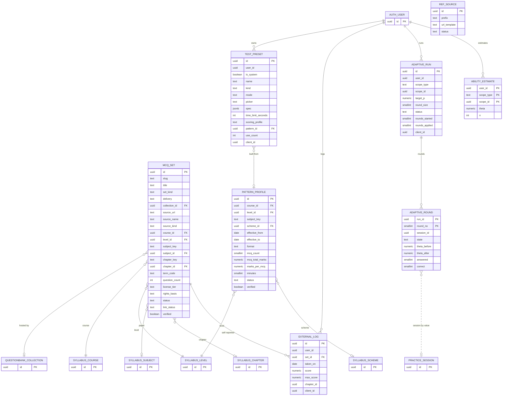
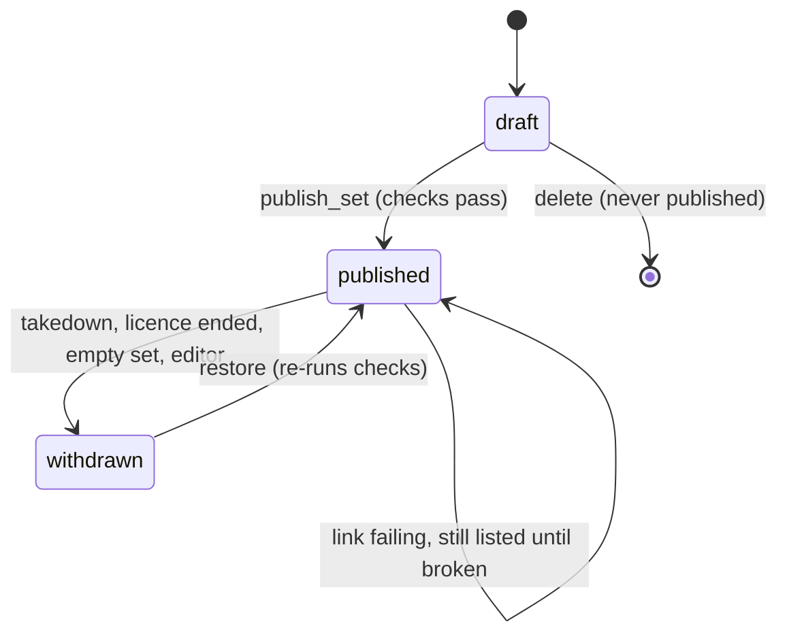
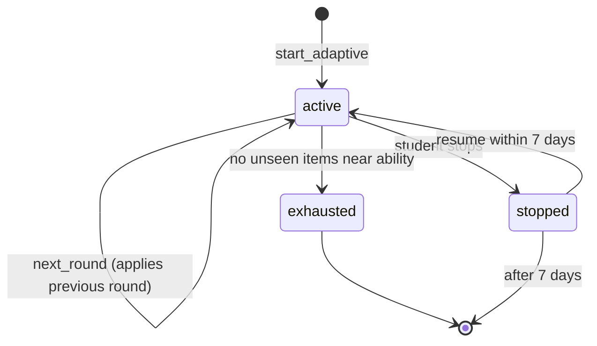

# ERD: F-05 MCQ Bank (sets, patterns, presets and adaptive state over F-06)

| Field | Value |
| --- | --- |
| Linked PRD | `docs/product/prd/F-05-mcq-bank.md` |
| Order | After F-06 (engine) and F-02 (taxonomy); sibling of `docs/product/erd/F-09-previous-year-questions.md`. Reads `docs/product/erd/F-06-question-bank-system.md` sections 0, 3 and 4 as a contract and re-models nothing from it |
| Django app | `apps/api/modules/mcqbank` (seven small tables, three pickers, one origin) |
| Web module | `apps/web/src/modules/mcqbank` |
| Last updated | 2026-10-05 |

**Reading guide.** F-05 is a *thin* module. Questions, options, keys, attempts, answers, scoring rules, bookmarks, doubts, mistake reasons, collections and events already exist in F-06 and are used through its services, selectors and registries. This ERD adds only what is new: a catalogue of MCQ sets with a delivery mode, verified paper patterns, saved presets, self-reported results for link-out sets, a reference-link table, and adaptive-practice state. Four small additive extensions to F-06 are proposed in section 3.4.

## 0. Design decisions

1. **No question or attempt tables.** An F-05 session is a `practice_session` with `origin_module = 'mcq_bank'`; its questions are F-06 versions pinned at creation. "MCQ" is a filter (`kind_groups = ['choice']`), not a table. This keeps one mistake log, one set of rollups and one coverage path.
2. **A set is a catalogue row, not a container.** `mcqbank_set` points at an F-06 `questionbank_collection` when hosted (membership, order and versions stay in F-06) or at an external URL when link-out. One catalogue, two delivery modes, enforced by check constraints so a link-out set can never carry hosted content by accident.
3. **Delivery follows rights, not convenience.** `hosted` requires a `rights_basis` of `original`, `licensed` or `institute_material`, a recorded reference, and (for Institute sources) the X-04 licence tier `host`. Everything else is `link_out`. The publish service re-checks every member question's `rights_status` (the F-06 rule that public items be `original`, `licensed` or `institute_material`).
4. **Facts about papers are data with a verified flag.** `mcqbank_patternprofile` stores question count, marks and minutes per paper, effective-dated. Nothing is seeded with a number; editors fill and verify from the Institute's published exam pattern. Negative marking is *not* stored here: it stays in `practice_scoringrule` and is resolved by F-06 (single source of truth).
5. **Presets store specs, not selections.** A preset is a validated `QuestionFilter` v1 plus count, mode, time and profile, so it keeps working as the bank grows. It never stores question ids.
6. **Adaptive practice is a chain of ordinary sessions.** Each round is a 5-question F-06 session whose picker (`mcq_adaptive`) reads the student's ability estimate. The estimate is updated lazily, under a row lock on the run, when the next round is requested; the update is idempotent per round. No new session type, no per-answer hot row, no change to the F-06 lifecycle.
7. **Progress tiles read F-06 state, never answers.** Per-chapter numbers come from `practice.selectors.progress_by_chapter` (extension E-F06-1, a `chapter_id` copy on `practice_questionstate`), not from scanning `practice_attemptanswer` and not from joining `questionbank_question` in this module (audit AUD-005: no foreign-model queries).
8. **Stable keys in URLs and in rows.** Sets store `subject_key` and `chapter_key` next to the FK ids, so a scheme change never breaks a catalogue entry or a bookmarked URL (F-02 `syllabus_chaptermap` re-points the ids).
9. **Django is the only writer; RLS deny-by-default** on every table, same stance as F-06.

## 1. Diagrams

### 1.1 Entities



### 1.2 Set lifecycle and adaptive run lifecycle





## 2. Tables

Common columns unless stated: `id uuid PK default gen_random_uuid()`, `created_at timestamptz not null default now()`, `updated_at timestamptz not null default now()`. `user_id` references `auth.users.id` by value (no cross-schema FK) and is scoped on every query. Enumerations are `text` with a check constraint (section 4). Marks are `numeric`, never float. JSONB only for the preset spec, with a schema version.

### 2.1 `mcqbank_set`

| Column | Type | Null | Default | Notes |
| --- | --- | --- | --- | --- |
| slug | text | no | | Unique, lower-case ASCII, 3 to 80 characters, used in `/app/mcq/sets/$slug` |
| title | text | no | | 3 to 120 characters |
| description | text | no | `''` | Plain text, up to 500 characters |
| set_kind | text | no | | `institute_mcq`, `rtp`, `mtp`, `coaching`, `platform` |
| delivery | text | no | `link_out` | `hosted` or `link_out` |
| collection_id | uuid | yes | | FK `questionbank_collection`, restrict. Required when hosted, null when link-out |
| source_name | text | no | `''` | "ICAI", "ICMAI", teacher or platform name |
| source_kind | text | no | `platform` | Same values as F-06 `source_kind` (used in filters and labels) |
| source_url | text | yes | | https only; required when link-out; host must be on the allow-list (section 7) |
| source_ref | text | no | `''` | "RTP May 2025, Paper 3" |
| course_id, level_id | uuid | no | | FK `syllabus_course`, `syllabus_level` |
| subject_key | text | no | | Stable key; `subject_id` is the FK in the scheme current at save time |
| subject_id | uuid | yes | | FK `syllabus_subject` |
| chapter_key | text | yes | | Null = whole paper |
| chapter_id | uuid | yes | | FK `syllabus_chapter`; check `chapter_id is null or subject_id is not null` |
| term_code | text | yes | | `YYYY-MM`, same format as `syllabus_examterm.code` and F-06 `source_term_code` |
| question_count | int | yes | | Hosted: cached from the collection (refreshed by subscribers). Link-out: the count the source states, or null |
| est_minutes | smallint | yes | | Hosted: sum of `suggested_seconds` rounded up |
| license_tier | text | no | `link_only` | Mirror of the X-04 source tier at publish: `link_only`, `facts_and_summary`, `host` |
| rights_basis | text | yes | | `original`, `licensed`, `institute_material`; required when hosted |
| rights_note | text | no | `''` | Licence or permission reference (admin written) |
| ingestion_item_id | uuid | yes | | X-04 `ingestion_item.id` by value, for provenance and takedown linkage |
| status | text | no | `draft` | `draft`, `published`, `withdrawn` |
| withdrawn_reason | text | yes | | `takedown`, `licence_ended`, `empty`, `editor`, `broken_link` |
| link_status | text | no | `unchecked` | `unchecked`, `ok`, `failing`, `broken` (link-out only) |
| link_checked_at | timestamptz | yes | | |
| link_fail_count | smallint | no | 0 | `broken` at 2 consecutive failures |
| verified | boolean | no | false | An editor confirmed title, source and count against the source |
| verified_by, verified_at | uuid, timestamptz | yes | | |
| featured | boolean | no | false | Pinned on the subject page |
| sort_order | smallint | no | 0 | |
| published_at | timestamptz | yes | | |
| created_by | uuid | yes | | Editor |

Constraints: unique `slug`; check `delivery = 'hosted'` implies `collection_id is not null and rights_basis is not null`; check `delivery = 'link_out'` implies `collection_id is null and source_url is not null`; check `source_url like 'https://%'`; check `delivery = 'hosted' and rights_basis in ('licensed','institute_material')` implies `license_tier = 'host'`; check `status = 'published'` implies `published_at is not null`; partial unique `(collection_id)` where `collection_id is not null and status <> 'withdrawn'` (one live catalogue entry per collection).

Indexes: `(subject_id, status, sort_order)` where `status = 'published'` (subject catalogue, Q-4); `(course_id, level_id, subject_key, term_code desc)` where `status = 'published'` (public and filtered lists); `(link_status, link_checked_at)` where `delivery = 'link_out' and status = 'published'` (link-check batch, Q-11); `(chapter_id)` where `chapter_id is not null and status = 'published'` (chapter page).

### 2.2 `mcqbank_patternprofile`

The MCQ structure of one paper. Facts only; never inferred.

| Column | Type | Null | Default | Notes |
| --- | --- | --- | --- | --- |
| course_id, level_id | uuid | no | | FK |
| subject_key | text | no | | Stable key (paper) |
| scheme_id | uuid | yes | | FK `syllabus_scheme`; null = applies to every scheme of the level |
| effective_from | date | no | | |
| effective_to | date | yes | | |
| format | text | no | | `all_mcq` (whole paper objective) or `mcq_section` (objective part of a mixed paper) |
| mcq_count | smallint | no | | 1 to 200 |
| mcq_total_marks | numeric(6,1) | no | | Marks carried by the objective part |
| marks_per_mcq | numeric(4,2) | yes | | Null when marks differ across questions |
| minutes | smallint | yes | | Suggested time for the objective part; null = derive from `suggested_seconds` |
| case_scenario_count | smallint | yes | | MCQs that sit under case scenarios |
| status | text | no | `draft` | `draft`, `active`, `retired` |
| verified | boolean | no | false | The test uses the `official` profile only when this and the F-06 rule are verified |
| source_note | text | no | `''` | What the Institute document says |
| source_url | text | yes | | https |
| verified_by, verified_at | uuid, timestamptz | yes | | |

Constraints: unique `(course_id, level_id, subject_key, effective_from)`; check `mcq_count between 1 and 200`; check `marks_per_mcq is null or abs(mcq_total_marks - mcq_count * marks_per_mcq) < 0.05`; check `status = 'active'` implies `verified`. Index `(course_id, level_id, subject_key, effective_from desc)` where `status = 'active'` (resolution, Q-7). Resolution (`domain/pattern.py`, pure): the active, verified row whose date range contains the session date, with a scheme-specific row preferred over a null-scheme row.

### 2.3 `mcqbank_testpreset`

| Column | Type | Null | Default | Notes |
| --- | --- | --- | --- | --- |
| user_id | uuid | yes | | Null for system presets |
| is_system | boolean | no | false | Check: `is_system = (user_id is null)` |
| scope_key | text | yes | | System presets: the `subject_key` they appear under; null = global |
| name | text | no | | 1 to 60 characters |
| kind | text | no | | `builder`, `blueprint`, `pattern` |
| mode | text | no | | Subset of F-06 modes: `untimed`, `timed`, `chapter_quiz`, `revision`, `custom_test` (never `exam`) |
| picker | text | no | | Registered picker: `filter`, `wrong_only`, `unattempted`, `mcq_blueprint`, `mcq_set` |
| spec | jsonb | no | | `{"v":1,"filter":{...QuestionFilter v1...},"count":20,"order":"random","blueprint":{"mix":"smart","chapters":[{"chapter_key":"gst-itc","n":10}],"difficulty_mix":[3,5,2]},"hide_amended":true}`. Validated by the same schema as the F-06 picker spec |
| time_limit_seconds | int | yes | | Null for untimed; 60 to 14,400 |
| scoring_profile | text | no | `practice` | `practice` or `official` |
| pattern_id | uuid | yes | | FK `mcqbank_patternprofile` for `kind = 'pattern'` |
| use_count | int | no | 0 | |
| last_used_at | timestamptz | yes | | |
| sort_order | smallint | no | 0 | System presets only |
| client_id | uuid | yes | | Idempotent create; unique `(user_id, client_id)` |
| deleted_at | timestamptz | yes | | Soft delete for student presets |

Constraints: check `octet_length(spec::text) <= 4096`; unique `(user_id, lower(name))` where `deleted_at is null and user_id is not null`; unique `(user_id, client_id)` where `client_id is not null`; check `mode <> 'exam'`. The 20-per-student limit is a service rule (counted under the same transaction as the insert). Indexes: `(user_id, last_used_at desc nulls last)` where `deleted_at is null` (presets list, Q-8); `(scope_key, sort_order)` where `is_system` (system presets).

### 2.4 `mcqbank_externallog`

A student's self-reported result for a link-out set.

| Column | Type | Null | Default | Notes |
| --- | --- | --- | --- | --- |
| user_id | uuid | no | | |
| set_id | uuid | no | | FK `mcqbank_set`, restrict |
| client_id | uuid | no | | Unique `(user_id, client_id)` |
| taken_on | date | no | | Student-local date, not after today plus 1 day |
| score | numeric(7,2) | no | | 0 to `max_score` |
| max_score | numeric(7,2) | no | | 1 to 500 |
| score_pct | numeric(5,1) | no | | Generated: `round(100 * score / max_score, 1)` |
| chapter_id | uuid | yes | | Copy of the set's chapter at log time (by value), the coverage target |
| subject_id | uuid | yes | | Copy (by value) |
| coverage_client_id | uuid | no | | `uuid5(log id, chapter id + ':practice_done')`, the idempotency key sent to coverage |
| deleted_at | timestamptz | yes | | Student delete; compensating coverage handling is not attempted (the ledger is append-only, see 3.5) |

Constraints: check `score >= 0 and score <= max_score`; check `max_score between 1 and 500`; unique `(user_id, client_id)`; partial unique `(user_id, set_id, taken_on)` where `deleted_at is null` (a second log the same day replaces the first through an upsert in the service). Indexes: `(user_id, taken_on desc)` where `deleted_at is null` (history, Q-9); `(set_id)` (set delete guard). `external_ref` for coverage is the log id.

### 2.5 `mcqbank_refsource`

Prefix to link template for reference chips.

| Column | Type | Null | Default | Notes |
| --- | --- | --- | --- | --- |
| prefix | text | no | | Unique, matches the F-06 `search_keys` prefix: `cgst`, `igst`, `indas`, `sa`, `as`, `companiesact` |
| label | text | no | | "CGST Act, 2017" |
| url_kind | text | no | `bare_act` | `bare_act`, `standard`, `reference` |
| url_template | text | yes | | https only and must contain `{ref}`; null means chips show text only |
| status | text | no | `draft` | `draft`, `active`, `retired` |
| verified_at | timestamptz | yes | | Last time an editor opened a sample link |
| notes | text | no | `''` | |

Constraints: unique `prefix`; check `url_template is null or (url_template like 'https://%' and url_template like '%{ref}%')`. No row is seeded with a URL; the seed creates `draft` rows with a null template (section 4).

### 2.6 `mcqbank_adaptiverun` and `mcqbank_adaptiveround` (R3)

`adaptiverun`:

| Column | Type | Null | Default | Notes |
| --- | --- | --- | --- | --- |
| user_id | uuid | no | | |
| client_id | uuid | no | | Unique `(user_id, client_id)` |
| scope_type | text | no | | `chapter` or `subject` |
| scope_id | uuid | no | | `syllabus_chapter.id` or `syllabus_subject.id` by value |
| subject_key | text | no | | Stable key |
| chapter_key | text | yes | | |
| target_p | numeric(3,2) | no | 0.70 | Check between 0.50 and 0.90 |
| round_size | smallint | no | 5 | Check 3 to 10 |
| status | text | no | `active` | `active`, `stopped`, `exhausted` |
| rounds_started | smallint | no | 0 | |
| rounds_applied | smallint | no | 0 | |
| last_active_at | timestamptz | no | now() | Stopped runs older than 7 days are not resumable |
| rev | int | no | 0 | Optimistic counter in addition to the row lock |

`adaptiveround`: PK `(run_id, round_no)`; `session_id` uuid (F-06 session by value, unique), `state` (`open`, `applied`), `theta_before`, `theta_after` numeric(6,3), `answered`, `correct` smallint, `applied_at` timestamptz. A round is applied at most once because its state moves `open -> applied` inside the transaction that also updates `mcqbank_abilityestimate`, under `SELECT ... FOR UPDATE` on the run row.

Constraints: partial unique `(user_id, scope_type, scope_id)` where `status = 'active'` (one active run per scope); service limit 3 open runs. Indexes: `(user_id, status, last_active_at desc)`.

### 2.7 `mcqbank_abilityestimate` (R3)

PK `(user_id, scope_type, scope_id)`; `theta numeric(6,3) not null default 0`, `n int not null default 0` (answers counted), `updated_at`. Both the chapter and the subject estimate are updated with the same per-answer deltas (the subject estimate uses K scaled by 0.5 so it moves slower). Rebuildable from nothing (it is the state); never recomputed from answers after the 24-month partition retention, so it is retained until account deletion.

## 3. Relationships to other modules and the contract

### 3.1 Foreign keys and by-value references

| From | To | Rule |
| --- | --- | --- |
| `user_id` columns | `auth.users.id` | By value; scoped on every query |
| `mcqbank_set.course_id, level_id, subject_id, chapter_id`, `mcqbank_patternprofile.course_id, level_id, scheme_id` | `syllabus_*` | Real FKs, restrict. Reads through `syllabus.selectors` (`get_subject_by_keys`, `get_chapter_by_keys`, `list_chapters`, `list_topics`); writes never |
| `mcqbank_set.collection_id` | `questionbank_collection` | Real FK, restrict. Membership is read with `questionbank.selectors` (extension E-F06-3), written only by F-06 services (`create_collection`, `set_collection_items`) |
| `mcqbank_set.ingestion_item_id` | X-04 `ingestion_item` | By value now, FK when X-04 migrations exist |
| `mcqbank_adaptiveround.session_id`, `mcqbank_externallog.chapter_id` | `practice_session`, `syllabus_chapter` | By value (the session table is F-06's; chapter copies survive scheme changes) |
| Coverage (F-02) | `practice` | Receives `practice_done` and `revision_done` through the F-06 subscriber for F-05 sessions (no F-05 code). For external logs F-05 calls `coverage.services.record_event(user_id, chapter_id, 'practice_done', value=score_pct, source='manual', client_id=coverage_client_id, source_ref=str(log_id), strict=False)` |
| Tracker (F-01.2) | `practice` | Unchanged (F-06 subscriber, opt-in auto time). External logs never create tracked time |

### 3.2 Public service, selector and registry interfaces

```python
# ---- mcqbank/selectors.py (read only) -------------------------------------------------------
def home(user_id: UUID) -> HomeView                 # suggestion, resume (<=5), due count, subject cards with SegmentedBar counts
def chapter_tiles(user_id: UUID, subject_key: str, *, course: str, level: str) -> list[ChapterTile]
    # ChapterTile(chapter_key, name, section, available, unseen, wrong_last, bookmarked, due, accuracy_recent|None, last_practised_at|None)
def chapter_detail(user_id: UUID, subject_key: str, chapter_key: str, *, course: str, level: str) -> ChapterDetail  # topics with counts, difficulty split, sets
def suggest_quick_set(user_id: UUID, *, course_id: UUID, count: int = 10, exclude_chapter_ids: Sequence[UUID] = ()) -> QuickSetSuggestion | None
    # QuickSetSuggestion(chapter_id, subject_key, chapter_key, reasons: list[ReasonCode], picker="mcq_blueprint", spec: dict)   # reasons: wrong_last, due, unseen, low_coverage, first_time
def list_sets(viewer_id: UUID | None, *, subject_key=None, chapter_key=None, kind=None, term_code=None, delivery=None, cursor=None, limit=20) -> Page[SetCard]
def get_set(viewer_id: UUID | None, slug: str) -> SetDetail
def resolve_pattern(course: str, level: str, subject_key: str, on: date) -> PatternProfile | None
def preview_blueprint(user_id: UUID, spec: dict) -> BlueprintPreview       # quotas, available per chapter, warnings; no write
def list_presets(user_id: UUID) -> list[Preset]
def external_log(user_id: UUID, *, cursor=None, limit=20) -> Page[ExternalLogRow]
def reference_sources() -> list[RefSource]

# ---- mcqbank/services.py (writes; actor checked) --------------------------------------------
def publish_set(editor_id: UUID, set_id: UUID) -> McqSet           # checks: delivery rules, rights of every member, count > 0 when hosted, https host allow-list
def withdraw_set(actor_id: UUID, set_id: UUID, reason: str) -> None    # emits mcq_set_withdrawn
def switch_to_hosted(admin_id: UUID, set_id: UUID, *, rights_basis: str, rights_note: str, collection_id: UUID) -> McqSet   # admin only
def record_click(user_id: UUID, set_id: UUID) -> None              # counter only in PostHog; no row
def log_external_result(user_id: UUID, set_id: UUID, *, score: Decimal, max_score: Decimal, taken_on: date, client_id: UUID) -> ExternalLog
def delete_external_log(user_id: UUID, log_id: UUID) -> None
def save_preset(user_id: UUID, *, name: str, kind: str, mode: str, picker: str, spec: dict, time_limit_seconds: int | None, scoring_profile: str, client_id: UUID) -> Preset
def use_preset(user_id: UUID, preset_id: UUID) -> SessionSpec       # touches use_count, returns args for practice.services.create_session
def delete_preset(user_id: UUID, preset_id: UUID) -> None
def verify_pattern(editor_id: UUID, pattern_id: UUID) -> PatternProfile
def start_adaptive(user_id: UUID, *, scope_type: str, scope_id: UUID, client_id: UUID) -> AdaptiveRun       # R3
def next_round(user_id: UUID, run_id: UUID, *, round_no: int) -> SessionCreated                              # R3; applies the previous round first, under a row lock
def stop_adaptive(user_id: UUID, run_id: UUID) -> None
def delete_all_for_user(user_id: UUID) -> DeleteReport; def export_for_user(user_id: UUID) -> dict

# ---- registered with F-06 in McqbankConfig.ready() -------------------------------------------
practice.registry.register_origin("mcq_bank", OriginSpec(validate_spec=..., allowed_modes={"untimed","timed","chapter_quiz","revision","custom_test"},
                                  default_feedback_policy=None,   # F-06 defaults by mode (ERD F-06 3.5)
                                  unique_per_user=False, on_completed=None, title_for=...))
practice.registry.register_picker("mcq_set", pick_mcq_set, description="Questions of a published hosted set")
practice.registry.register_picker("mcq_blueprint", pick_mcq_blueprint, description="Per-chapter quotas, difficulty mix, smart mix")
practice.registry.register_picker("mcq_adaptive", pick_mcq_adaptive, description="Items near the student's ability (R3)")
core.events.register_subscriber("collection_updated", "mcqbank.set_counts", refresh_set_counts, mode="deferred")
core.events.register_subscriber("question_taken_down", "mcqbank.set_takedown", on_takedown, mode="deferred")
core.events.register_subscriber("question_unpublished", "mcqbank.set_takedown", on_takedown, mode="deferred")
core.events.register_subscriber("practice_session_completed", "mcqbank.preset_stats", on_session_completed, mode="deferred")
# F-13 (proposed): today.registry.register_task_provider("mcq", ProviderSpec(... fetch=mcq_today_tasks ...))
```

**Picker specs** (all validated by pydantic models in `mcqbank/domain/specs.py`; unknown keys are rejected):

| Picker | Spec v1 | Behaviour |
| --- | --- | --- |
| `mcq_set` | `{"v":1,"set_id":uuid,"count":int|null,"order":"set"|"random"}` | The set must be `published` and hosted; delegates to F-06 `collection` ordering; `count` samples with the session seed |
| `mcq_blueprint` | `{"v":1,"chapters":[{"chapter_id":uuid,"n":int}]|null,"subject_key":str|null,"count":int,"mix":"smart"|"random","difficulty_mix":[int,int,int]|null,"filter":QuestionFilter,"hide_amended":bool}` | Either explicit quotas or `subject_key`+`count` with weights; always adds `kind_groups=["choice"]`; `mix=smart` fills unseen, last-wrong, due, then others |
| `mcq_adaptive` | `{"v":1,"run_id":uuid,"round_no":int}` | Reads `mcqbank_abilityestimate`; the run row must belong to the caller and be `active` |

### 3.3 Domain events

Envelope and delivery as F-06 ERD 3.4 (outbox, at-least-once, idempotent subscribers).

| Event | Emitted when | Payload (key fields) | Consumers |
| --- | --- | --- | --- |
| `mcq_set_published` | `publish_set` commits | `set_id`, `slug`, `delivery`, `subject_key`, `chapter_ids[]`, `term_code`, `question_count` | X-01 (deferred), search cache, analytics |
| `mcq_set_withdrawn` | `withdraw_set` commits | `set_id`, `reason`, `open_sessions` | X-01, cache |
| `mcq_external_logged` | `log_external_result` commits (first insert of a day) | `set_id`, `chapter_id`, `score_pct` | F-10 (self-reported flag), analytics |
| `mcq_adaptive_round_applied` (R3) | round applied | `run_id`, `scope_type`, `theta_before`, `theta_after` | X-03 (optional), analytics |

Consumed events: `practice_session_completed` (only `origin_module = mcq_bank`; updates `use_count` for presets referenced by `origin_ref = preset:<id>`), `question_taken_down`, `question_unpublished`, `collection_updated`, `question_version_live` (invalidate tile and facet caches). All subscribers are idempotent on `event.id`.

### 3.4 `[PROPOSED EXTENSION to F-06]` (small, additive; owners decide naming)

| ID | Extension | Why | Size |
| --- | --- | --- | --- |
| E-F06-1 | `practice_questionstate.chapter_id uuid null` (set on every upsert from the answer's frozen `chapter_id`), index `(user_id, chapter_id)`, and selectors `practice.selectors.progress_by_chapter(user_id, chapter_ids) -> dict[UUID, ChapterProgress(attempted, correct_last, wrong_last, bookmarked, due, avg_time_ms, last_attempt_at)]` and `practice.selectors.state_stamp(user_id) -> str` (ETag source) | Per-chapter tiles without joining `questionbank_question` from another module and without scanning answers. Also used by F-09 and F-10 | 1 column, 1 index, 2 selectors |
| E-F06-2 | `questionbank.selectors.stats_for(question_ids) -> dict[UUID, QuestionStat(attempts, p_value, avg_time_ms)]` over `questionbank_questionstats` (only rows with `attempts >= 30` carry `p_value`) | Adaptive priors and the "62% correct" chip. A no-op if `QuestionCard` already carries these fields | 1 selector |
| E-F06-3 | `questionbank.selectors.get_collection(collection_id) -> CollectionView(kind, visibility, meta, question_ids ordered)` | A catalogue entry reads membership and `meta` (`{"surface":"mcq_bank","set_kind":"rtp",...}`) without importing models. F-04 needs the same read | 1 selector |
| E-F06-4 | `questionbank_question.kind_group text` (`choice`, `numeric`, `written`; for a `case_study` parent: `choice` only when all live children are choice kinds, set by the service on publish and on child changes) and `QuestionFilter.kind_groups: list[str]` with a facet dimension `kind_group` | "MCQ only" must be a cheap indexed predicate, and a case study with a long-form child must not enter the MCQ bank. Also lets F-06 pages filter `?kind_group=choice` | 1 column, 1 filter key, 1 facet dim |

None of these changes an F-06 table's meaning or a public signature. If F-06 rejects an item, the fallback is stated: E-F06-1 falls back to a bounded query over `practice_questionstate` joined by `question_id IN (...)` for at most 2,000 ids per chapter (slower, still correct); E-F06-4 falls back to the `mcq` system tag plus an editor rule; E-F06-3 falls back to calling the existing `questionbank.selectors.list_published(flt={"scope":"collection","collection_id":...})`.

### 3.5 Behavioural reference (what the tests assert)

All functions below are pure and live in `mcqbank/domain/`, with TypeScript twins only where the web needs them (marked) and a shared JSON fixture to prove parity.

**Difficulty label** (`difficulty.py`, TS twin): editorial `difficulty` 1 or 2 is Easy, 3 is Medium, 4 or 5 is Hard, null is "Unrated" (counted separately; treated as Medium in mixes). Empirical `p_value` is shown separately only when `attempts >= 30`.

**Source facet** (`sources.py`, TS twin): `institute_mat, institute_pyq, institute_mtp, institute_rtp, institute_mcq` is Institute; `coaching, teacher_list` is Coaching or teacher; `platform` is Platform; `user` (ownership `user_created` or `user_uploaded`) is Community. Filters offer Institute, Platform, Community; Coaching or teacher appears under Community in R1 unless a rights status says otherwise `[Q-F05-5]`.

**Quota allocation** (`blueprint.py`): input `count`, chapter weights `w_i`, availability `a_i`. Weight is `coalesce((marks_min+marks_max)/2, marks_max, marks_min, 1)`. Quota `q_i` by largest remainder on `count * w_i / sum(w)`; then cap at `a_i` and redistribute the shortfall to chapters with spare capacity by weight; ties by syllabus order. Properties asserted: `sum(q) = min(count, sum(a))`; `0 <= q_i <= a_i`; deterministic for the same input; monotone (raising `count` never lowers a quota).

**Difficulty mix** (default `[3, 5, 2]` of 10 for easy, medium, hard): scaled to the quota with largest remainder; a shortage in one band is filled from Medium, then Easy, then Hard; unrated items count as Medium.

**Smart mix** (`mix=smart`): per chapter in this order and without repeats, `unseen`, then `wrong_last`, then `due`, then others; within each band by the session seed. Example: 4 unseen, 3 wrong_last, 20 others, count 10: 4 + 3 + 3.

**Suggestion ranking** (`suggest.py`): for each enrolled chapter with `available >= 5`, `score = 0.40*min(1, wrong_last/5) + 0.25*min(1, due/5) + 0.20*min(1, unseen/10) + 0.15*(1 - coverage_pct/100) - 0.30*[practised in the last 24 h]`; highest score wins, ties by syllabus order; reasons are the terms contributing at least 0.10. A student with no state gets the first chapter with the lowest coverage and the reason `first_time`. Coverage percent comes from `coverage.selectors.coverage_pct_by_chapter`.

**Negative-marking insight** (`negative_insight.py`, TS twin `lib/negative-insight.ts`). Input: review answers with `result`, `confidence` (1 sure, 2 unsure, 3 guess, null), `marks_max`, `negative_max`, `marks_awarded`, `negative_applied`. Output:
- `penalties = sum(negative_applied)`; `penalised_count`.
- For a confidence band `b` in {sure, unsure, guess}: `n_b`, `right_b`, `accuracy_b = right_b / n_b`, `net_b = sum(marks_awarded)` over the band (penalties included).
- `break_even = negative / (marks + negative)` for single-correct questions with a positive negative (for 0.25 on 1 mark: 0.20); undefined when there is no negative.
- A band is "paying off" when `accuracy_b > break_even`. The screen states the result in both directions ("Your guesses were right 36%, above the 20% break-even: guessing paid off, net +2.25") and never recommends skipping by hindsight alone.
- `sure_but_wrong = count(confidence = sure and result = incorrect)` is shown as "check these concepts".
Test vectors: 11 guesses, 4 right at +1, 7 wrong at -0.25 gives `net_guess = 2.25`, `accuracy = 36.4%`, `break_even = 20%`.

**Adaptive model** (`adaptive.py`, R3). Student ability `theta` (logit units, start 0). Item difficulty `b = (n*b_emp + 20*b0) / (n + 20)` where `b0 = (difficulty - 3) * 0.75` (editorial prior, 0 when unrated) and `b_emp = -ln(p/(1-p))` with `p = clamp(p_value, 0.05, 0.95)` from F-06 statistics, `n = attempts` (0 when `< 30`). Predicted success `P = 1 / (1 + exp(-(theta - b)))`. After each answer in order: `theta += K(n_s) * (outcome - P)` with `outcome` 1 for correct, 0 for incorrect, 0.5 for partial, skipped ignored, and `K(n_s) = max(0.10, 0.90 / (1 + 0.05 * n_s))`, where `n_s` is the number of answers already counted for the scope. Selection of a round: candidates are unseen items in scope (seen items only when fewer than 20 unseen remain), choose the `round_size` items whose `|P - target_p|` is smallest, ties by hash of `(item id, run id, round no)`. The estimate is stored per chapter and per subject (subject K scaled by 0.5). Properties: theta never moves on skipped answers; applying the same round twice changes nothing; with only correct answers theta is non-decreasing. This follows the Elo-style adaptive practice literature (appendix reference 9).

**Link check** (`links.py`): HEAD then GET fallback, 10 s timeout, one request per host per second, user agent `ArthaCommerceLinkCheck`, follows at most 3 redirects within the same registrable domain; two consecutive failures set `link_status = 'broken'`, auto-withdraw reason `broken_link` after 7 days broken; recovery sets `ok`. No page content is stored.

**External log and coverage.** One log per user, set and day (upsert). The coverage call uses `coverage_client_id`, so a replaced log sends the same key and coverage keeps the first value (the ledger is append-only; the second value is stored in the log and shown as "self-reported", it does not rewrite the ledger). A deleted log does not retract the coverage event; the student can undo coverage in F-02, which has its own compensation.

### 3.6 Provides and consumes

**Provides**

| Interface | Consumers |
| --- | --- |
| `mcqbank.selectors.chapter_tiles`, `home`, `suggest_quick_set`, `list_sets`, `get_set`, `resolve_pattern` | Web, F-13 provider, F-10 links |
| Pickers `mcq_set`, `mcq_blueprint`, `mcq_adaptive`; origin `mcq_bank` | F-06 `create_session`, F-13, F-10 |
| Events `mcq_set_published`, `mcq_set_withdrawn`, `mcq_external_logged`, `mcq_adaptive_round_applied` | X-01, X-03, F-10, analytics |
| Web barrel `~/modules/mcqbank` | F-02 chapter page, F-13 |
| `delete_all_for_user`, `export_for_user` | Central deletion hook |

**Consumes**

| Interface | Provider |
| --- | --- |
| `questionbank.selectors.list_published`, `search_ids`, `count_matching`, `facets`, `taxonomy_of`; E-F06-2, E-F06-3, E-F06-4 | F-06 |
| `practice.services.create_session`, `practice.selectors.question_states`, E-F06-1; `register_picker`, `register_origin` | F-06 |
| `core.events` (`emit`, `register_subscriber`), `core.jobs.enqueue` | F-06 |
| `syllabus.selectors`, `coverage.selectors.get_active_enrollment`, `coverage_pct_by_chapter`, `coverage.services.record_event` | F-02 |
| X-04 source licence tier selector `[PROPOSED]` `ingestion.selectors.source_tier(item_id)` | X-04 |
| `super50.selectors.lists_containing`, `amendments.selectors.affected_question_ids` | F-04, F-14 |
| `today.registry.register_task_provider` `[PROPOSED]` | F-13 |
| `recall.services.create_card_from_source` `[PROPOSED]` | F-15 |

## 4. Enumerations and reference data

| Name | Values | Stored as | Owner |
| --- | --- | --- | --- |
| Set kind | institute_mcq, rtp, mtp, coaching, platform | text + check | code |
| Delivery | hosted, link_out | text + check | code |
| Licence tier | link_only, facts_and_summary, host | text + check (same as X-04) | code |
| Rights basis | original, licensed, institute_material | text + check (subset of F-06 rights status) | code |
| Set status and withdrawn reason | draft, published, withdrawn; takedown, licence_ended, empty, editor, broken_link | text + check | code |
| Link status | unchecked, ok, failing, broken | text + check | code |
| Pattern format and status | all_mcq, mcq_section; draft, active, retired | text + check | code |
| Preset kind | builder, blueprint, pattern | text + check | code |
| Preset mode | untimed, timed, chapter_quiz, revision, custom_test | text + check | code |
| Adaptive scope and status | chapter, subject; active, stopped, exhausted; round state open, applied | text + check | code |
| Suggestion reason | wrong_last, due, unseen, low_coverage, first_time | code constant (API enum) | code |
| Reference url kind and status | bare_act, standard, reference; draft, active, retired | text + check | code |

**Seed data** (migration `mcqbank.0004_seed`): system presets "Quick 10" (`mcq_blueprint`, smart mix, 10), "Timed 20" (`timed`, 20, suggested time), "Revise wrong" (`wrong_only`), "Bookmarked" (`filter` with `personal=bookmarked`); `mcqbank_refsource` rows in `draft` with a null template for `cgst`, `igst`, `indas`, `sa`, `as`, `companiesact` (editors add and verify the links, `[VERIFY]` each). **No pattern profile and no set is seeded**: pattern numbers come from the Institute's published exam pattern and are entered and verified by an editor; sets are created in the admin.

## 5. Query patterns

| # | Query | Served by |
| --- | --- | --- |
| Q-1 | Home: enrolment context, subjects (via `syllabus.selectors`), per-subject counts, resume list, due count | One `coverage.selectors.get_active_enrollment`; subject counts from the cached facet read (`questionbank.selectors.facets(dims=['kind_group'])`, 10-minute materialised view); `practice.selectors.list_sessions(status='open')` (F-06 Q-12); due count by `practice.selectors.progress_by_chapter` summed |
| Q-2 | Chapter tiles for one subject (at most about 25 chapters): available, unseen, wrong, bookmarked, due, accuracy | `facets` for `available` (cached), `progress_by_chapter(user_id, chapter_ids)` = `practice_questionstate (user_id, chapter_id)` grouped; `unseen = available - attempted`; `accuracy_recent` from `practice.selectors.accuracy(by='chapter', date_from=now-30d)` (rollup). Total 3 indexed reads, response cached 60 s with ETag from `state_stamp` |
| Q-3 | Chapter detail: topics with counts, difficulty split, sets | `facets` dims `difficulty`, `topic`; `mcqbank_set (chapter_id) where published`; one `syllabus.selectors.list_topics` |
| Q-4 | Set catalogue by subject, kind, term | `mcqbank_set (subject_id, status, sort_order) where published`, keyset by `(sort_order, id)` |
| Q-5 | Refresh `question_count` of hosted sets after `collection_updated` or takedown | PK lookup by `collection_id` unique partial index; count via `questionbank.selectors.get_collection` |
| Q-6 | Blueprint preview: per-chapter availability | `count_matching` per chapter (capped at 1,000), run in one request with at most 12 chapters; each under 30 ms (F-06 Q-3) |
| Q-7 | Resolve pattern for a paper and date | `(course_id, level_id, subject_key, effective_from desc) where status='active'` |
| Q-8 | Presets of a student | `(user_id, last_used_at desc) where deleted_at is null` |
| Q-9 | External log insert (upsert per day) and history | unique `(user_id, set_id, taken_on)`; `(user_id, taken_on desc)` |
| Q-10 | Adaptive `next_round`: lock the run (`SELECT ... FOR UPDATE` by PK), apply the previous round (answers via `practice.selectors.review_payload`, one partition range), update two estimate rows by PK, pick candidates (`search_ids` capped at 2,000 plus `stats_for`), create the session | PKs; F-06 Q-8 for creation. Target under 600 ms |
| Q-11 | Link-check batch (50 per tick) | `(link_status, link_checked_at) where delivery='link_out' and status='published'` |
| Q-12 | Delete or export for a user | `user_id` leading indexes on presets, logs, runs, estimates |

## 6. Storage, scale and retention

### 6.1 Volume assumptions

| Quantity | Year 1 | Year 3 | Basis |
| --- | --- | --- | --- |
| Sets | 400 | 3,000 | about 20 papers x 5 terms x 3 kinds, plus platform sets |
| Pattern profiles | 150 | 400 | papers with an objective component x schemes |
| Presets | 5,000 | 60,000 | about 20% of 5,000 / 50,000 MAU x 5 |
| External logs | 25,000 | 600,000 | 5,000 MAU x 5 per year; 50,000 x 12 |
| Adaptive runs, rounds, estimates | 5,000 / 40,000 / 60,000 | 50,000 / 500,000 / 700,000 | R3, 10% of students |

No partitioning. All tables stay under 1 million rows at year 3. Peak write rates are trivial (presets and logs are student-initiated, under 1 per second).

### 6.2 Caching and hot paths

- Tiles and home are private and `no-store` at the CDN, but cached per student in the API for 60 seconds with an ETag from `practice.selectors.state_stamp`; the shared parts (facet counts, topics, sets) are cached 10 minutes.
- `GET sets/` and the public subject summary send `Cache-Control: public, s-maxage=300, stale-while-revalidate=3600`; `mcq_set_published` and `mcq_set_withdrawn` purge where supported.
- No per-question counters exist in this module; popular sets never become hot rows.

### 6.3 Async work (Vercel limits)

Nothing long runs in a request. The F-06 tick (`POST practice/internal/tick/`) also runs `mcqbank.link_check` (50 URLs, bounded to 10 seconds) and `mcqbank.adaptive_expire` (stopped runs older than 7 days); event subscribers run through the shared dispatcher. No worker-only job exists in this module.

### 6.4 Storage

No bucket and no file. Link-out targets are URLs; OG images for the public subject page are generated by the existing `modules/seo/og-render.ts`.

## 7. Security

- **Access path and RLS:** browser to Django to Postgres; Supabase Data API stays disabled; RLS enabled with no policies on all seven tables (the post-migrate hook in `core/apps.py` plus a test per table in `core/tests/test_row_level_security.py`).
- **Scoping:** every selector and service takes `user_id` from the verified JWT; no endpoint accepts a user id; detail routes return 404 for other users' presets, logs and runs.
- **Link-out safety:** `source_url` must be `https` and its host must be on the allow-list (`MCQ_LINKOUT_HOSTS` setting, seeded with the three Institutes' hosts when sources are confirmed; admins add teacher domains). The outbound link carries no student identifier; the click endpoint stores nothing but a PostHog event with the host.
- **Spec injection:** preset and picker specs are parsed by strict pydantic models; `QuestionFilter.scope` is forced to `public` unless the value is `mine` or `collection` owned by the caller (checked with `questionbank.selectors.can_view`); size cap 4 KB; unknown keys rejected.
- **Rights enforcement:** `publish_set` re-checks every member's `rights_status`; a later `question_taken_down` withdraws or shrinks the set (FR-F05-31).
- **Abuse:** throttles (`mcq_write` 60/min); external logs capped at 200 per month and one per set per day; presets capped at 20.
- **PII classification:** presets, logs, runs and ability estimates are personal (study habits); question and set content is not. Nothing here is sent to PostHog beyond bucketed properties.
- **Retention and deletion (DPDP):** `delete_all_for_user` removes presets, logs, runs, rounds and estimates in bounded batches; `export_for_user` returns them as JSON. Registered with the central account-deletion hook (audit AUD-004). Coverage events created from logs follow F-02's own deletion path.
- **Audit:** set publish, withdraw, delivery switch and pattern verification write F-06 `questionbank_auditlog` rows (`entity_type = 'mcqbank_set'`), so there is one audit trail.

## 8. Migration and rollout

Order (all additive; run with `DIRECT_DATABASE_URL`):

0. F-06 extensions, if accepted: `practice.000x_questionstate_chapter` (nullable column, `AddIndexConcurrently`), `questionbank.000x_kind_group` (nullable column, `AddIndexConcurrently` partial index). F-06 ships dark, so there is no backfill; if it is already live, run `manage.py backfill_questionstate_chapter` and `manage.py backfill_kind_group` in batches of 5,000 before turning `mcq_bank` on.
1. `mcqbank.0001_initial`: set, patternprofile, refsource with all constraints and indexes.
2. `mcqbank.0002_presets_logs`: testpreset, externallog.
3. `mcqbank.0003_adaptive`: adaptiverun, adaptiveround, abilityestimate (flag off until R3).
4. `mcqbank.0004_seed`: system presets and draft reference sources.
5. Post-migrate hook enables RLS on all new tables.

Notes: tables ship dark behind `mcq_bank` and `mcq_adaptive`; no existing screen changes. Rollback drops the new tables in reverse order; nothing outside `mcqbank` is touched (the F-06 extension columns are nullable and harmless if left). Capacity check before general availability: tile endpoint with 25 chapters and a 5,000-state student fixture under 300 ms p95; `next_round` under 600 ms with 2,000 candidates.

## 9. Module layout

### API

```
apps/api/modules/mcqbank/
  models.py            McqSet, PatternProfile, TestPreset, ExternalLog, RefSource, AdaptiveRun, AdaptiveRound, AbilityEstimate
  domain/              difficulty.py, sources.py, blueprint.py (quota allocation, difficulty mix, smart mix), suggest.py,
                       negative_insight.py, adaptive.py, pattern.py, links.py, specs.py (pydantic picker and preset specs)
  registry.py          picker and origin registration helpers
  selectors.py         public contract (3.2)
  services.py          public contract (3.2)
  pickers.py           pick_mcq_set, pick_mcq_blueprint, pick_mcq_adaptive
  subscribers.py       refresh_set_counts, on_takedown, on_session_completed
  today_provider.py    F-13 provider (registered only when `today` is installed)
  events.py serializers.py views.py urls.py permissions.py admin.py (Django admin for sets, patterns, refsources)
  management/commands/ link_check, backfill_questionstate_chapter (delegates to practice), backfill_kind_group (delegates to questionbank)
  tests/               one file per endpoint group, domain property tests, picker tests against the F-06 fixture, RLS, flag-off parametrised test, contract test for coverage and event flow
```

### Web

```
apps/web/src/modules/mcqbank/
  index.ts             barrel: McqHomeContainer, ChapterMcqCard, startMcqPractice, useChapterTiles
  lib/                 api.ts, difficulty.ts, sources.ts, negative-insight.ts (twin of the Python rule, parity test), blueprint-preview.ts, filter-url.ts
  hooks/               useMcqHome, useChapterTiles, useChapterDetail, useSets, usePresets, useExternalLog, useAdaptiveRun
  components/          SuggestionCard, SubjectCard, ChapterTile, SetCard, StartSheet, NegativeInsight, ReferenceChip, PaceGuide, PresetList, PatternCard, BlueprintEditor, LogResultDialog, AdaptiveSummary
  containers/          McqHomeContainer, SubjectContainer, ChapterContainer, SetsContainer, SetDetailContainer, TestBuilderContainer, PatternTestsContainer, PresetsContainer, AdaptiveContainer
```

Routes (thin, each sets `head` via `buildHead()` and renders one container): `app.mcq.index`, `app.mcq.$subject.index`, `app.mcq.$subject.$chapter`, `app.mcq.sets.index`, `app.mcq.sets.$slug`, `app.mcq.test`, `app.mcq.tests`, `app.mcq.presets`, `app.mcq.adaptive.index`, `app.mcq.adaptive.$runId`, plus public `courses.$course.$level.$subject.mcqs`. Cross-module imports go through barrels only: the web module uses `~/modules/practice` (`startPractice`, `BuilderForm`), `~/modules/questionbank` (`QuestionCard`, `FilterSheet`, `useQuestionFilter`), and `~/modules/coverage` (enrolment context hook). Design-system additions: `SegmentedBar`.
