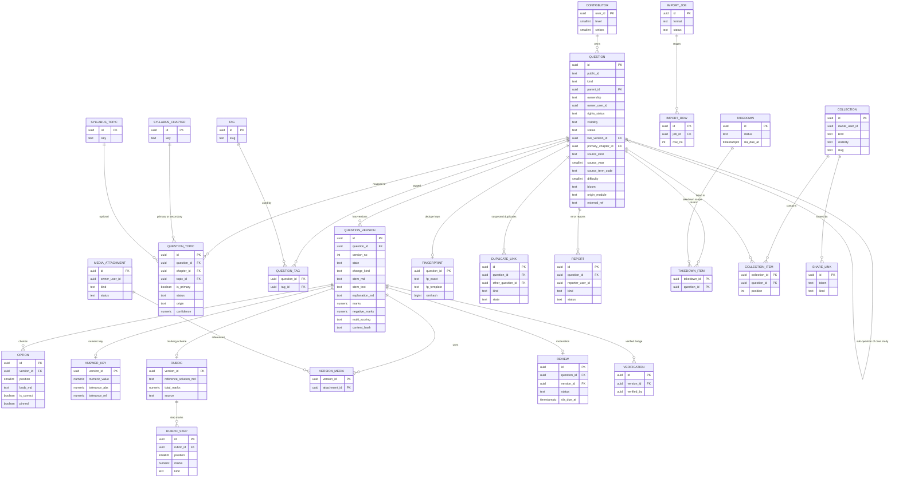
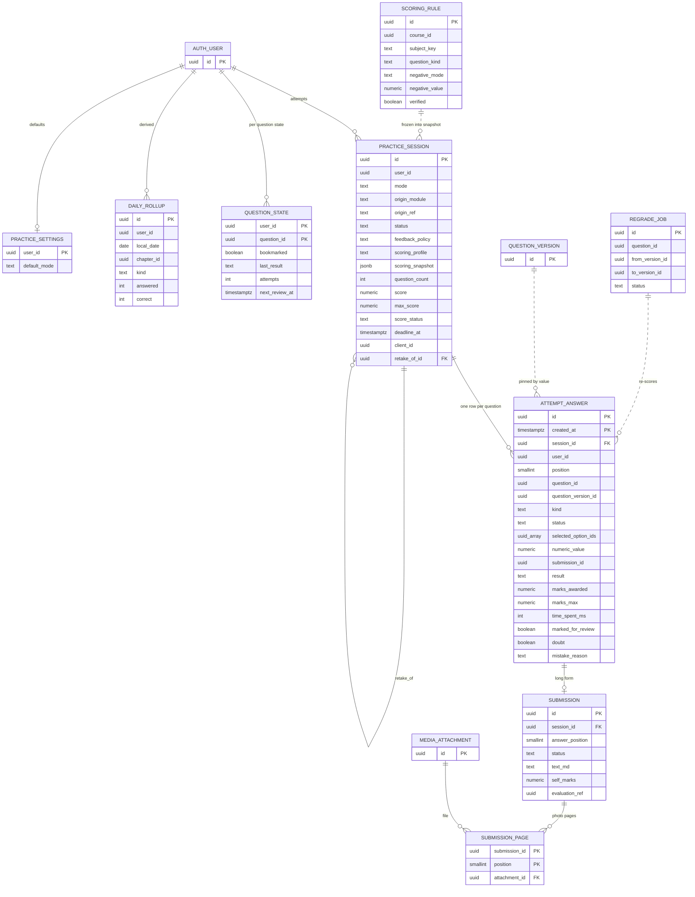
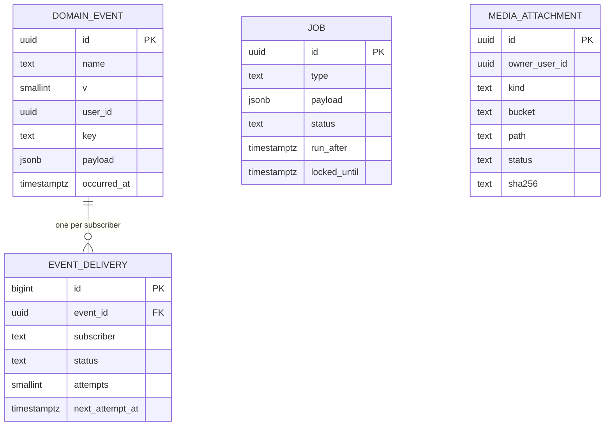
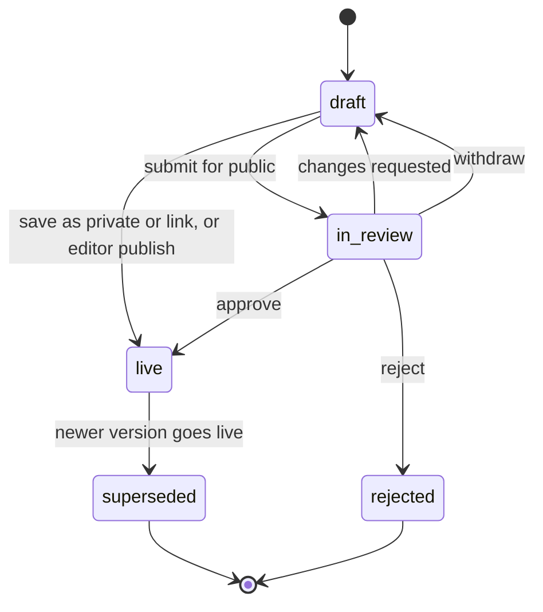
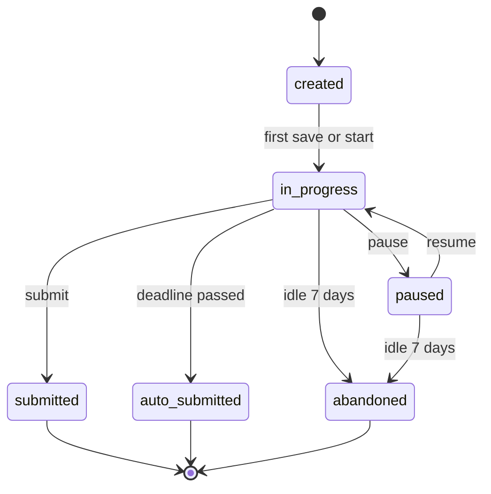
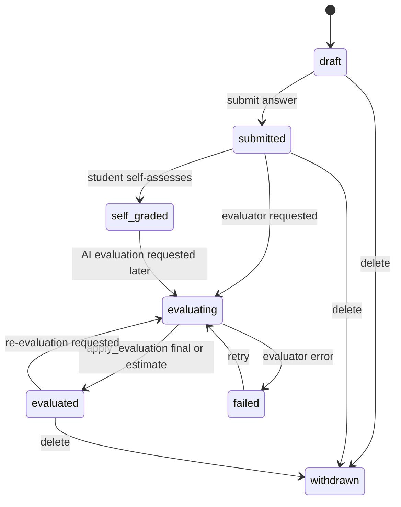

# ERD: F-06 Question Bank System (the question and attempt contract)

| Field | Value |
| --- | --- |
| Linked PRD | `docs/product/prd/F-06-question-bank-system.md` |
| Order | Foundation for F-04, F-05, F-07, F-08, F-09, F-10, F-12. Reads `docs/product/erd/F-02-syllabus-structure-and-coverage.md` (taxonomy), links to `docs/product/erd/X-04-ingestion-scraping-service.md` (provenance, publishers), is consumed by coverage (F-02) and `docs/product/erd/F-01.2-time-tracker-and-analytics.md` through events |
| Django apps | `apps/api/modules/questionbank` (content, quality, collections, exchange), `apps/api/modules/practice` (sessions, answers, scoring, state), `apps/api/modules/media` (attachments), `apps/api/core/events.py` and `core/jobs.py` (shared infrastructure, tables `core_*`) |
| Web modules | `apps/web/src/modules/questionbank`, `apps/web/src/modules/practice` |
| Last updated | 2026-10-05 |

**Reading guide for other authors.** Sections 0 and 3 are the contract: what exists, the exact service interfaces and registries, the event catalogue and what you must not do. If your pointer needs a question, an attempt, a file, a tag or a score, you use the interface here; you do not add tables for them. Table names follow the existing convention `<app>_<model>` (compare `tracking_studysession`).

## 0. Design decisions

1. **Two modules, one direction.** `questionbank` (authoring, content, quality) and `practice` (attempts) are separate Django apps, as the question bank and the question engine are separate concerns in assessment systems (Moodle splits them the same way). Dependency direction: `practice -> questionbank -> syllabus`, `questionbank -> media`, `practice -> media`, both `-> core.events`. `questionbank` never imports `practice`; `coverage`, `tracking`, F-10 and others never import either: they subscribe to events.
2. **Question identity versus question version.** `questionbank_question` is the stable identity (URL, labels, ownership, visibility, taxonomy). Everything that changes meaning or grading (stem, options, key, solution, marks, rubric) lives in an immutable `questionbank_questionversion` once it leaves draft. Sessions pin `question_version_id`, so editing or fixing a question never rewrites history. One live version, at most one draft and one in-review version per question (partial unique indexes).
3. **Labels live on the identity, not the version.** Source, year, term, difficulty, bloom, nature, tags are metadata: editable without a new version and audited in `questionbank_auditlog`. Marks and negative marks are in the version because they change scores.
4. **Taxonomy is many-to-many with exactly one primary.** `questionbank_questiontopic` links to F-02 chapters (and topics) with real foreign keys plus the stable `subject_key` and `chapter_key` copies, so a scheme change can re-point mappings through `syllabus_chaptermap` without losing meaning. The primary mapping is denormalised onto the question row for fast filters.
5. **Attempt = one `practice_session`; each question in it is one `practice_attemptanswer` row created at session start.** Unattempted questions are explicit rows (`status='unseen'`), which makes counts, "unanswered" and time bookkeeping plain SQL. A re-take is a new session linked by `retake_of_id`.
6. **Scoring is reproducible.** The resolved scoring rule is frozen as `practice_session.scoring_snapshot` (JSON with a schema version) and per-item marks are frozen on the answer rows. Changing a rule or a key never silently changes past scores; a deliberate regrade job does it, and says so.
7. **Keys stay on the server.** Two read shapes exist: `PlayableQuestion` (no key, no explanation, no rubric) and `GradableQuestion`/review (with them). The feedback policy of the session decides which one a response may use.
8. **The answer table is partitioned from day one.** Monthly range partitions on `created_at`, where `created_at` is set to the session's creation time for all its rows, so `(session_id, position, created_at)` is a true unique key (PostgreSQL requires the partition key in unique constraints) and all access by session prunes to one partition. Raw rows are kept 24 months; rollups and `practice_questionstate` carry the aggregates beyond that (section 6).
9. **Events, not calls, for fan-out.** Domain events are written to an outbox (`core_domainevent`, `core_eventdelivery`) in the same transaction as the change and delivered at-least-once to registered subscribers. Events are per session (not per answer) to stay cheap; per-answer analytics read the rollups and `practice_questionstate` through `practice.selectors`.
10. **Extension by registries (open/closed).** Question kinds, pickers, session origins, evaluators, importers, publishers and event subscribers register themselves (same pattern as `tracking.services.register_live_timer_provider`). Consumers add behaviour without editing these modules.
11. **Rich content is Markdown + KaTeX text**, with a derived plain-text column; no stored HTML (PRD 8.2).
12. **Files are generic.** `media_attachment` serves question images, answer-sheet pages, import and export files, and later notes (F-03). Bytes go straight to Supabase Storage with signed URLs; a worker scans and re-encodes them before they can be used.
13. **Django is the only gateway.** All tables have RLS enabled with no policies (deny all). User scoping on every query; detail routes return 404 for what the viewer may not see.
14. **No numbers for institute rules are hard-coded.** Negative marking and multi-select partial credit come from effective-dated `practice_scoringrule` rows with a `verified` flag.

## 1. Diagrams

### 1.1 Content (module `questionbank`)



Also owned here but not drawn: `questionbank_savedfilter`, `questionbank_exportjob`, `questionbank_questionstats`, `questionbank_quotaplan`, `questionbank_auditlog`.

### 1.2 Attempts (module `practice`)



### 1.3 Shared infrastructure



### 1.4 Question version lifecycle



The question row has its own lifecycle (`active`, `archived`, `taken_down`, `merged`) and a separate `visibility` (`private`, `link`, `public`).

### 1.5 Session and submission lifecycles





## 2. Tables

Common columns unless stated: `id uuid PK default gen_random_uuid()`, `created_at timestamptz not null default now()`, `updated_at timestamptz not null default now()`. `user_id`-style columns reference `auth.users.id` by value (no cross-schema foreign key) and are scoped on every query. Enumerations are `text` with a check constraint (values in section 4). Marks are `numeric`, never float. JSONB is used only for payloads that are genuinely schema-less, each with a schema version column.

### 2.1 `questionbank_question` (identity)

| Column | Type | Null | Default | Notes |
| --- | --- | --- | --- | --- |
| public_id | text | no | | 10-character Crockford base32, unique, used in URLs and share cards. Never reused |
| kind | text | no | | `mcq_single`, `mcq_multi`, `true_false`, `numeric`, `case_study`, `long_form`, `practical`. Immutable after the first version goes live (a change of kind is a new question) |
| parent_id | uuid | yes | | FK self, `on delete restrict`. Set for sub-questions of a `case_study` parent; the parent must be of kind `case_study` and children must not be (service rule plus check `parent_id <> id`) |
| position | smallint | yes | | Order among siblings (1-based) |
| ownership | text | no | | `platform`, `user_uploaded`, `user_created` |
| owner_user_id | uuid | yes | | Null for `platform`. Anonymised to null with `owner_anonymised = true` after account deletion (kept public contributions) |
| owner_anonymised | boolean | no | false | Shows "Former contributor" |
| created_by | uuid | yes | | Editor or author who created it (audit; null for ingested) |
| rights_status | text | no | `unknown` | `original`, `licensed`, `institute_material`, `third_party_claimed`, `unknown` |
| rights_note | text | yes | | Licence or permission reference (editor-written) |
| visibility | text | no | `private` | `private`, `link`, `public` |
| status | text | no | `active` | `active`, `archived`, `taken_down`, `merged` |
| needs_attention | boolean | no | false | Set by the report threshold or an editor; shows "Under review" |
| merged_into_id | uuid | yes | | FK self; set when `status='merged'` |
| live_version_id | uuid | yes | | FK `questionbank_questionversion`, the version served. Null while never live |
| current_version_id | uuid | yes | | Latest version (draft, in review or live) for the owner's editor |
| course_id | uuid | yes | | FK `syllabus_course`, from the primary chapter |
| level_id | uuid | yes | | FK `syllabus_level` |
| scheme_id | uuid | yes | | FK `syllabus_scheme` of the primary chapter |
| primary_subject_id | uuid | yes | | FK `syllabus_subject` |
| primary_chapter_id | uuid | yes | | FK `syllabus_chapter` |
| primary_topic_id | uuid | yes | | FK `syllabus_topic` |
| subject_key, chapter_key | text | yes | | Stable keys copied from the taxonomy (scheme independent) |
| source_kind | text | no | `platform` | `institute_mat`, `institute_pyq`, `institute_mtp`, `institute_rtp`, `institute_mcq`, `coaching`, `teacher_list`, `platform`, `user` |
| source_name | text | no | `''` | "ICAI", "ABC Classes" |
| source_url | text | yes | | https only |
| source_ref | text | no | `''` | "RTP May 2025, Q4(b)" |
| source_year | smallint | yes | | Check 1990 to 2100 |
| source_term_code | text | yes | | `YYYY-MM`, e.g. `2024-05`; same format as `syllabus_examterm.code` |
| exam_term_id | uuid | yes | | FK `syllabus_examterm` when the term exists in the taxonomy |
| difficulty | smallint | yes | | 1 to 5, editor judgement; empirical difficulty lives in `questionbank_questionstats` |
| bloom | text | yes | | `remember`, `understand`, `apply`, `analyse`, `evaluate`, `create` |
| nature | text | yes | | `theory`, `practical`, `formula`, `section`, `case_law`, `application` (the "type" label of the feature map) |
| marks | numeric(5,1) | yes | | Copy of the live version's marks for sorting and filtering |
| tag_slugs | text[] | no | `{}` | Denormalised from `questionbank_questiontag` for GIN filtering |
| search_keys | text[] | no | `{}` | Normalised references: `cgst:17(5)`, `indas:115`, `sa:230`, `as:2` |
| stem_head | text | no | `''` | First 300 characters of the stem as plain text |
| search_text | text | no | `''` | Stem, option texts, explanation as plain text (truncated at 10,000 characters), from the live version |
| search_tsv | tsvector | no | generated | `to_tsvector('english', search_text)` stored generated column |
| seo_indexable | boolean | no | false | Public pages are indexable only when true |
| origin_module | text | no | `editor` | `editor`, `import_csv`, `import_ai`, `ingestion`, `mat`, `mock`, `user` |
| external_ref | text | yes | | Importer's stable id, e.g. `mat:ca-inter-fr:ch3:ill-12`. Idempotency key for `upsert_from_source` |
| provenance_item_id | uuid | yes | | X-04 `ingestion_item.id` by value; becomes a real FK when X-04 is built |
| provenance_version_id | uuid | yes | | X-04 `ingestion_itemversion.id` by value |
| is_verified | boolean | no | false | Denormalised: the live version has an unrevoked verification |
| client_id | uuid | yes | | Offline draft idempotency |
| published_at | timestamptz | yes | | First time it became public |
| deleted_at | timestamptz | yes | | Soft delete for owner-initiated deletion of never-public items |

Constraints: unique `public_id`; unique `(origin_module, external_ref)` where `external_ref is not null`; unique `(owner_user_id, client_id)` where `client_id is not null`; check `visibility = 'public'` implies `status = 'active'` and `live_version_id is not null` and `rights_status in ('original','licensed','institute_material')`; service rule: `link` visibility needs the same rights values (so `third_party_claimed` and `unknown` stay private); check `ownership = 'platform'` implies `owner_user_id is null`; check `source_url like 'https://%'`.

Indexes (partial `P` = `where status='active' and visibility='public' and parent_id is null and deleted_at is null`):

| Index | Serves |
| --- | --- |
| `(primary_chapter_id, published_at desc, id)` P | Chapter list, newest first (Q-1) |
| `(primary_subject_id, kind, source_year desc, id)` P | Subject filters by type and year (Q-1) |
| `(course_id, level_id, kind, id)` P | Course-level browsing |
| `(owner_user_id, status, updated_at desc)` where `owner_user_id is not null` | My questions (Q-6) |
| GIN `search_tsv` P, GIN `tag_slugs` P, GIN `search_keys` P | Full text, tags, reference keys (Q-2) |
| GIN `stem_head gin_trgm_ops` P | Typo-tolerant search on short queries (Q-2) |
| `(parent_id, position)` where `parent_id is not null` | Case study children |
| `(needs_attention)` where `needs_attention` | Admin attention list |
| `(source_kind, source_year, source_term_code)` P | PYQ/MTP term pages (F-09) |

### 2.2 `questionbank_questionversion` (immutable once it leaves draft)

| Column | Type | Null | Default | Notes |
| --- | --- | --- | --- | --- |
| question_id | uuid | no | | FK `questionbank_question`, restrict |
| version_no | int | no | | 1-based per question |
| state | text | no | `draft` | `draft`, `in_review`, `live`, `superseded`, `rejected`, `withdrawn` |
| change_kind | text | no | `create` | `create`, `edit`, `typo`, `key_fix`, `remap`, `import_update` |
| change_note | text | no | `''` | Shown in history; required for `key_fix` |
| authored_by | uuid | yes | | User or editor |
| stem_md | text | no | | Max 20,000 characters. For `case_study` this is the case text |
| stem_text | text | no | | Derived plain text (math as LaTeX source, tables flattened) |
| explanation_md | text | no | `''` | Solution (max 30,000). Required (60+ characters) for public MCQ; required for all long-form |
| explanation_source | text | no | `''` | "ICAI RTP May 2025 solution", "Section 17(5), CGST Act" |
| reference_labels | text[] | no | `{}` | Display labels of cited provisions |
| marks | numeric(5,1) | no | 1 | 0 to 100. A case study parent stores the sum of its live children (derived by the service) |
| negative_marks | numeric(4,2) | yes | | Override of the scoring rule for this question only; null means use the rule |
| multi_scoring | text | no | `all_or_nothing` | `all_or_nothing`, `partial_strict`, `partial_net` (only for `mcq_multi`) |
| suggested_seconds | smallint | yes | | Default derived from marks if null (service) |
| shuffle_options | boolean | no | true | |
| lang | text | no | `en` | Reserved for Hindi |
| content_schema | smallint | no | 1 | Version of the content rules used to lint it |
| content_hash | text | no | | SHA-256 of canonical content (stem, options in order, key, rubric, marks). Unchanged hash means no new version in imports |
| submitted_at, reviewed_by, reviewed_at | timestamptz, uuid, timestamptz | yes | | |
| live_at, superseded_at | timestamptz | yes | | |

Constraints and indexes: unique `(question_id, version_no)`; partial unique `(question_id)` where `state='live'`; partial unique `(question_id)` where `state='draft'`; partial unique `(question_id)` where `state='in_review'`; checks on `marks >= 0`, `negative_marks >= 0`, and a state-transition guard in the service (rows not in `draft` are never updated except `state`, `superseded_at`, `reviewed_*`; a trigger-free rule enforced in `questionbank.services` and by a test that tries every mutation). Index `(question_id, version_no desc)`; `(content_hash)`.

### 2.3 `questionbank_option`

| Column | Type | Null | Default | Notes |
| --- | --- | --- | --- | --- |
| version_id | uuid | no | | FK, cascade only while the version is a draft (service rule) |
| position | smallint | no | | 0-based display order before shuffling |
| body_md | text | no | | Max 2,000 characters |
| body_text | text | no | | Derived |
| is_correct | boolean | no | false | The answer key for choice kinds. Not exposed in playable payloads |
| feedback_md | text | no | `''` | Why this option is wrong or right (optional, shown after Check) |
| pinned | boolean | no | false | Keeps its position under shuffling ("None of the above") |

Unique `(version_id, position)`. Rules (service validator, one per kind): `mcq_single` 2 to 6 options and exactly one correct; `mcq_multi` 3 to 8 options and at least one correct (and fewer than all); `true_false` exactly the two options `True` and `False` with one correct; other kinds have none. Option ids are stable because live versions are immutable; sessions store the chosen ids.

### 2.4 `questionbank_answerkey` (numeric kind; 1:1 with a version)

| Column | Type | Null | Default | Notes |
| --- | --- | --- | --- | --- |
| version_id | uuid | no | | PK and FK |
| numeric_value | numeric(24,6) | no | | Correct value in the stated unit |
| tolerance_abs | numeric(24,6) | no | 0 | Accept `abs(x - key) <= tolerance_abs` |
| tolerance_rel | numeric(7,4) | no | 0 | Fraction: 0.01 means 1% of `abs(key)` |
| accepted_values | numeric(24,6)[] | no | `{}` | Alternative correct results (other valid methods) |
| unit | text | yes | | "Rs", "%", "units" for display; compared only if `unit_required` |
| unit_required | boolean | no | false | |
| key_note | text | no | `''` | Internal editor note, never shown to students |

A value is correct when it falls within `max(tolerance_abs, tolerance_rel * abs(key))` of the key or of any accepted value.

### 2.5 `questionbank_rubric` (1:1 with a version for `long_form` and `practical`; optional elsewhere)

| Column | Type | Null | Default | Notes |
| --- | --- | --- | --- | --- |
| version_id | uuid | no | | PK and FK |
| reference_solution_md | text | no | | Model answer shown after submission (Markdown + KaTeX) |
| answer_template_md | text | no | `''` | For `practical`: blank format to type into (a journal or ledger skeleton) |
| total_marks | numeric(5,1) | no | | Must equal the version's `marks` |
| suggested_words | smallint | yes | | Guidance for typed answers |
| keywords | text[] | no | `{}` | Must-have terms used by evaluators |
| common_mistakes_md | text | no | `''` | Optional |
| source | text | no | `editor` | `institute`, `editor`, `contributor`, `ai_draft` |
| reviewed_by | uuid | yes | | An `ai_draft` rubric cannot go live without a reviewer |
| reviewed_at | timestamptz | yes | | |

### 2.6 `questionbank_rubricstep`

| Column | Type | Null | Default | Notes |
| --- | --- | --- | --- | --- |
| rubric_id | uuid | no | | FK |
| position | smallint | no | | |
| title | text | no | | "Computation of ITC eligible" |
| description_md | text | no | `''` | What earns the marks |
| marks | numeric(4,1) | no | | Steps sum exactly to `rubric.total_marks` |
| kind | text | no | `concept` | `concept`, `calculation`, `working_note`, `presentation`, `conclusion`, `format` |
| keywords | text[] | no | `{}` | |
| mandatory | boolean | no | false | |
| partial_allowed | boolean | no | true | Whether a part of the marks may be awarded |

Unique `(rubric_id, position)`. F-07 reads these via `get_rubric` and writes marks per step into its own `evaluation_item` rows; `practice_submission.self_steps` holds the student's own ticks with the same step ids.

### 2.7 `questionbank_questiontopic` (syllabus mapping, many-to-many with one primary)

| Column | Type | Null | Default | Notes |
| --- | --- | --- | --- | --- |
| question_id | uuid | no | | FK |
| chapter_id | uuid | no | | FK `syllabus_chapter`, restrict |
| topic_id | uuid | yes | | FK `syllabus_topic` |
| subject_id | uuid | no | | FK `syllabus_subject` |
| scheme_id | uuid | no | | FK `syllabus_scheme` |
| subject_key, chapter_key | text | no | | Stable keys (scheme independent) |
| is_primary | boolean | no | false | Exactly one confirmed primary per question |
| status | text | no | `confirmed` | `suggested`, `confirmed`, `rejected` |
| origin | text | no | `editor` | `author`, `editor`, `ai`, `ingestion`, `inherited` (case study child from parent), `remap` |
| confidence | numeric(3,2) | yes | | For `ai`, `ingestion`, `remap` rows |
| decided_by, decided_at | uuid, timestamptz | yes | | Person who confirmed |

Unique index `(question_id, chapter_id, coalesce(topic_id, '00000000-0000-0000-0000-000000000000'))`; partial unique `(question_id)` where `is_primary and status='confirmed'`; index `(chapter_id, status) include (question_id)` for secondary lookups; `(subject_key, chapter_key)`. Only `confirmed` rows count for browsing and coverage events. Writing the primary row updates the denormalised `primary_*`, `course_id`, `level_id`, `scheme_id` on the question in the same transaction. Questions mapped to a scheme that is not the published one for the level are shown with an "Old syllabus" badge (selector rule, no column). `questionbank.services.propose_remap(from_scheme, to_scheme)` creates `suggested` rows from `syllabus_chaptermap` for an editor to confirm in bulk.

### 2.8 `questionbank_tag`, `questionbank_questiontag`

`tag`: `slug` text unique, `name`, `course_id` null FK, `kind` (`topic`, `exam`, `feature`, `system`), `status` (`active`, `pending`, `retired`; contributor-created tags start `pending` and are searchable only by their author until an editor approves), `created_by`. `questiontag`: PK `(question_id, tag_id)`; the service keeps `question.tag_slugs` in sync. System tags such as `rtp`, `mtp`, `pyq` exist for filtering but curated lists use collections, not tags.

### 2.9 `questionbank_versionmedia`

| Column | Type | Null | Notes |
| --- | --- | --- | --- |
| version_id | uuid | no | FK |
| attachment_id | uuid | no | FK `media_attachment` |
| usage | text | no | `stem`, `option`, `explanation`, `rubric` |
| alt_text | text | no | Required, copied from the Markdown for audits |

PK `(version_id, attachment_id)`; index `(attachment_id)`. Computed by the service from `attachment:<uuid>` references on save; publishing copies the object to the public bucket (section 7) and takedown removes it.

### 2.10 `questionbank_fingerprint` (duplicate detection keys, kept slim)

| Column | Type | Null | Notes |
| --- | --- | --- | --- |
| question_id | uuid | no | PK and FK |
| version_id | uuid | no | Version fingerprinted (live or in review) |
| fp_exact | text | no | SHA-256 of normalised stem plus sorted normalised options plus key (lower case, collapsed whitespace, LaTeX spacing and `$` delimiters removed, numbers kept) |
| fp_template | text | no | Same with every number replaced by `#`: same question with different figures ("variant") |
| simhash | bigint | no | 64-bit SimHash of stem word 3-grams |
| b0, b1, b2, b3 | smallint | no | The four 16-bit bands of `simhash` |
| scope_owner | uuid | yes | Owner for private/link items (compared only with the owner's own and with public items); null when public |
| kind, course_id | text, uuid | yes | Pre-filters |

Indexes: `(fp_exact)`, `(fp_template)`, `(b0)`, `(b1)`, `(b2)`, `(b3)`. Candidate search: exact match on `fp_exact`; near match where any band equals, then Hamming distance at most 3 verified in Python, then `similarity(stem_head, :stem) >= 0.8` (pg_trgm) as a re-rank. Cross-user matching never reveals private content (section 8).

### 2.11 `questionbank_duplicatelink`

`question_id`, `other_question_id` (stored ordered, check `question_id < other_question_id`), `kind` (`exact`, `near`, `variant`), `score` numeric(4,3), `state` (`suspected`, `confirmed`, `not_duplicate`, `merged`), `detected_at`, `decided_by`, `decided_at`. Unique `(question_id, other_question_id)`; index `(state, kind)`. Merging sets the loser's `status='merged'`, `merged_into_id`; attempts keep pointing at the loser's versions; selectors resolve to the canonical question; collections are rewritten by the service.

### 2.12 `questionbank_review` (moderation queue)

| Column | Type | Null | Default | Notes |
| --- | --- | --- | --- | --- |
| question_id, version_id | uuid | no | | FKs; unique `version_id` |
| kind | text | no | | `new_public`, `edit_public`, `second_review` (platform key changes), `ingested`, `report_followup` |
| status | text | no | `pending` | `pending`, `claimed`, `approved`, `changes_requested`, `rejected`, `withdrawn`, `superseded` |
| submitted_by | uuid | yes | | |
| claimed_by, claimed_until | uuid, timestamptz | yes | | Claim expires after 30 minutes |
| decided_by, decided_at | uuid, timestamptz | yes | | |
| decision_code | text | yes | | `ok`, `wrong_answer`, `duplicate`, `copyright`, `low_quality`, `wrong_mapping`, `off_topic`, `unclear`, `other` |
| decision_note | text | yes | | Shown to the author |
| field_comments | jsonb | no | `[]` | `[{"field":"explanation_md","comment":"..."}]`, schema version 1 |
| checks | jsonb | no | `{}` | Automatic results: `{"v":1,"sanitiser":[],"duplicates":[{"question_id":"...","kind":"near","score":0.91}],"mapping_confidence":0.82,"rights":"original","min_solution":true}` |
| flags | text[] | no | `{}` | `duplicate`, `mapping_low`, `rights_unclear`, `sanitiser_warning`, `new_contributor`, `key_change` |
| priority | smallint | no | 0 | Raised by reports and SLA age |
| submitted_at | timestamptz | no | now() | |
| sla_due_at | timestamptz | no | | `submitted_at + 24 hours` target; the limit of 48 hours is computed |

Indexes: `(status, priority desc, submitted_at)` where `status in ('pending','claimed')`; `(question_id)`; `(decided_by, decided_at desc)`.

### 2.13 `questionbank_report` (report an error)

| Column | Type | Null | Default | Notes |
| --- | --- | --- | --- | --- |
| question_id, version_id | uuid | no | | The version the reporter saw |
| reporter_user_id | uuid | no | | |
| kind | text | no | | `wrong_answer`, `typo`, `unclear`, `outdated_law`, `wrong_mapping`, `duplicate`, `copyright`, `offensive`, `other` |
| message | text | no | `''` | Max 1,000 characters |
| proposed_option_ids | uuid[] | no | `{}` | The option(s) the reporter believes correct |
| status | text | no | `open` | `open`, `accepted`, `rejected`, `fixed`, `duplicate` |
| resolved_by, resolved_at | uuid, timestamptz | yes | | |
| resolution_note | text | no | `''` | Sent to the reporter |
| fixed_version_id | uuid | yes | | Version that fixed it |

Unique `(question_id, reporter_user_id, kind)` where `status = 'open'`; indexes `(status, created_at)`, `(question_id, status)`. A `copyright` report also creates a `questionbank_takedown` draft. Reports never include the reporter's identity in admin lists beyond a short id unless needed for follow-up.

### 2.14 `questionbank_verification`

`question_id`, `version_id`, `verified_by` uuid, `level` (`editor`, `faculty`, `institute_source`), `source_label` text ("ICAI RTP May 2025 solution"), `source_url`, `display_name` text null (shown only with the verifier's consent; otherwise "Artha editorial"), `verified_at`, `revoked_at`, `revoke_reason`. Partial unique `(version_id)` where `revoked_at is null`. When a new version goes live the old verification stays attached to the old version and `question.is_verified` becomes false until a new verification is added.

### 2.15 `questionbank_takedown` and `questionbank_takedownitem`

`takedown`: `reference` text unique ("TD-2026-0042"), `received_at`, `channel` (`web_form`, `email`, `court_order`), `complainant_name`, `complainant_email` (PII, restricted to admins, purged 12 months after closure), `claimed_work` text, `proof_note` text, `statement_signed` boolean, `status` (`received`, `validated`, `actioned`, `counter_notice`, `restored`, `rejected`, `expired`), `sla_due_at` (`received_at + 36 hours`), `actioned_at`, `actioned_by`, `uploader_notified_at`, `counter_notice_at`, `counter_notice_text`, `court_order_due_at` (`actioned_at + 21 days`), `restored_at`, `ingestion_takedown_id` uuid null (link to X-04). `takedownitem`: PK `(takedown_id, question_id)`. Index `(status, sla_due_at)`.

### 2.16 `questionbank_contributor`, `questionbank_quotaplan`, `questionbank_auditlog`

`contributor`: `user_id` PK, `terms_version` text, `terms_accepted_at`, `level` smallint 0 to 4 (derived by `questionbank.domain.reputation.level_for(...)` from the counters), `points` int, `approved_count`, `rejected_count`, `takedown_count`, `strikes` smallint, `suspended_until`, `display_name` text null, `show_credit` boolean default false, `plan_code` text default `free` (until a billing module provides it), `last_submission_at`.
`quotaplan`: `plan_code` PK and one integer column per limit in PRD 8.5 (`max_questions`, `max_media_mb`, `max_public_submissions_per_day`, `max_collections`, `max_items_per_collection`, `max_share_links`, `max_imports_per_day`, `max_import_rows`, `max_sheet_pages_per_month`, `max_sheet_mb`), plus `level_multipliers jsonb` (`{"3":2,"4":3}`, schema version 1).
`auditlog`: `id bigint identity`, `actor_id`, `entity_type`, `entity_id`, `action`, `before jsonb`, `after jsonb`, `created_at`. Append-only; index `(entity_type, entity_id, created_at desc)`. Covers label edits, visibility changes, merges, verifications, takedowns, role-sensitive actions.

### 2.17 `questionbank_collection`, `questionbank_collectionitem`, `questionbank_savedfilter`, `questionbank_sharelink`

`collection`: `owner_user_id` null for platform lists, `kind` (`custom`, `curated`), `title`, `slug` text null (curated, unique), `description_md`, `visibility` (`private`, `link`, `public`), `status` (`active`, `archived`), `course_id`, `level_id`, `subject_key` null (hints for display), `item_count` int, `meta` jsonb + `meta_schema` smallint (namespaced by consumer, e.g. `{"super50":{"attempt":"2027-05"}}`), `published_at`, `deleted_at`. Indexes `(owner_user_id, status, updated_at desc)`, unique `(slug)` where not null, `(visibility, kind, published_at desc)` where `visibility='public'`.
`collectionitem`: PK `(collection_id, question_id)`, `position` int (gap of 1024, rebalanced by the service when gaps run out), `note` text, `added_by`, `added_at`; index `(collection_id, position)`. Items follow the question's live version; they may not pin a version (curated lists that must pin use F-04's own table).
`savedfilter`: `user_id`, `name`, `spec jsonb` (QuestionFilter v1) + `spec_schema` smallint, `is_default`, `notify_new` boolean, `last_seen_at`, `last_count`. Unique `(user_id, name)`; limit 20 per user.
`sharelink`: `token` text unique (22-character URL-safe, 128-bit random, a capability URL like a shared document link), `kind` (`collection`, `question`, `filter`), `collection_id`, `question_id`, `spec jsonb` (for `filter`), check that exactly one target is set, `created_by`, `settings jsonb` (`{"mode":"timed","count":20,"time_limit_seconds":1800}`, schema version 1), `title_override`, `expires_at`, `revoked_at`, `view_count`, `start_count`, `last_used_at`. Index `(created_by, revoked_at)`. The access rule is `questionbank.selectors.can_view(viewer, question, token)`: a link grants read and practice on exactly the items it targets; it never grants edit.

### 2.18 `questionbank_importjob`, `questionbank_importrow`, `questionbank_exportjob`, `questionbank_questionstats`

`importjob`: `user_id`, `format` (`csv`, `docx`, `pdf`, `image`, `json`, `qti`), `purpose` (`platform`, `personal`), `attachment_id` (the uploaded file), `status` (`uploaded`, `parsing`, `needs_mapping`, `review`, `committing`, `done`, `failed`, `cancelled`), `mapping_profile jsonb` (column mapping, schema version 1), `counts jsonb` (`{"rows":200,"ok":190,"warning":3,"error":7,"duplicate":4,"committed":0}`), `error_attachment_id`, `ai_cost_paise` int, `finished_at`, `expires_at` (30 days). `importrow`: `job_id`, `row_no` int, `raw jsonb`, `parsed jsonb` (QuestionPayload v1, section 3.6), `status` (`ok`, `warning`, `error`, `duplicate`, `skipped`, `committed`), `errors jsonb`, `duplicate_of` uuid, `question_id`. Unique `(job_id, row_no)`; index `(job_id, status, row_no)`.
`exportjob`: `user_id`, `format` (`json`, `csv`, later `qti`), `scope jsonb` (own questions, a collection id, a saved filter), `status` (`queued`, `running`, `done`, `failed`, `expired`), `attachment_id`, `row_count`, `expires_at` (7 days).
`questionstats`: `question_id` PK, `attempts` int, `correct` int, `partial` int, `skipped` int, `avg_time_ms` int, `p_value` numeric(4,3) (fraction correct), `open_reports` smallint, `bookmark_count` int, `calculated_at`. Rebuilt incrementally every 15 minutes by a job that reads sessions submitted since its watermark, so popular questions never become hot rows during the day. Shown to students only when `attempts >= 30`.

### 2.19 `practice_session` (the attempt)

| Column | Type | Null | Default | Notes |
| --- | --- | --- | --- | --- |
| user_id | uuid | no | | Scoped on every query |
| client_id | uuid | no | | Idempotent creation; unique `(user_id, client_id)` |
| mode | text | no | | `untimed`, `timed`, `chapter_quiz`, `revision`, `custom_test`, `exam` |
| origin_module | text | no | | Registered origin: `questionbank`, `mcq_bank`, `super50`, `pyq`, `mtp`, `mock`, `daily`, `today`, `analytics_fix`, `share_link`, ... |
| origin_ref | text | yes | | The consumer's id (mock paper id, collection id, challenge date). Unique per `(user_id, origin_module, origin_ref)` only if the origin declares `unique_per_user` (F-08 papers) |
| title | text | no | `''` | Display title |
| picker | text | no | | Name of the registered picker used |
| spec | jsonb | no | | Picker spec for repeatability: `{"v":1,"filter":{...},"count":10,"order":"random","seed":123,"collection_id":null}` |
| status | text | no | `created` | `created`, `in_progress`, `paused`, `submitted`, `auto_submitted`, `abandoned` |
| feedback_policy | text | no | | `instant`, `after_section`, `at_end`, `never_until_submit` (defaults by mode in section 3.5) |
| scoring_profile | text | no | `practice` | `practice` or `official` |
| scoring_snapshot | jsonb | no | | Frozen resolved rule: `{"v":1,"rule_id":"...","verified":true,"correct":"question_marks","negative_mode":"fraction_of_marks","negative_value":0.25,"multi_default":"all_or_nothing","skip_marks":0,"source":"ICAI exam notice ..."}` |
| shuffle_seed | int | no | | Option and order shuffling is derived from this seed, so reloads are stable |
| question_count | smallint | no | | Items at creation |
| removed_count | smallint | no | 0 | Items later removed (takedown) |
| total_marks | numeric(7,2) | no | | Sum of frozen item marks |
| time_limit_seconds | int | yes | | Null for untimed |
| started_at | timestamptz | yes | | First activity |
| deadline_at | timestamptz | yes | | `started_at + time_limit + paused_total`, recomputed on resume |
| paused_at | timestamptz | yes | | |
| paused_total_seconds | int | no | 0 | |
| active_seconds | int | no | 0 | Sum of per-answer time (capped); used by tracker auto time |
| submitted_at | timestamptz | yes | | |
| last_active_at | timestamptz | no | now() | Drives auto-close |
| score | numeric(7,2) | yes | | Null until submit |
| max_score | numeric(7,2) | yes | | `total_marks` less removed items |
| score_status | text | no | `none` | `none`, `final`, `provisional` (long-form pending) |
| answered_count, correct_count, incorrect_count, partial_count, skipped_count, pending_count | smallint | no | 0 | Counters set at submit |
| tz | text | no | `Asia/Kolkata` | IANA zone captured at creation; defines local dates |
| local_date | date | no | | Local date of creation |
| retake_of_id | uuid | yes | | FK self |
| share_link_id | uuid | yes | | By value to `questionbank_sharelink` |
| rev | int | no | 0 | Optimistic counter for lifecycle changes (pause, resume, submit) |
| deleted_at | timestamptz | yes | | User delete (history cleanup) |

Constraints: checks on enums; `mode = 'exam'` implies `feedback_policy = 'never_until_submit'`; `status in ('submitted','auto_submitted')` implies `submitted_at is not null` and `score is not null`; unique `(user_id, client_id)`.
Indexes: `(user_id, status, last_active_at desc)` (resume list, Q-12); `(user_id, submitted_at desc)` where `submitted_at is not null` (history); `(status, last_active_at)` where `status in ('created','in_progress','paused')` (auto-close job); `(origin_module, origin_ref)`; `(retake_of_id)`; `(submitted_at)` where `submitted_at is not null` (stats job watermark).

### 2.20 `practice_attemptanswer` (partitioned, one row per question in a session)

`PARTITION BY RANGE (created_at)`, monthly partitions `practice_attemptanswer_y2026m10`. `created_at` is **set to the session's `created_at`** for every row of that session (not `now()` per row).

| Column | Type | Null | Default | Notes |
| --- | --- | --- | --- | --- |
| id | uuid | no | | Deterministic `uuid5(session_id, position)`; part of the PK |
| created_at | timestamptz | no | | Partition key, equals the session's `created_at` |
| session_id | uuid | no | | FK `practice_session`, `on delete cascade` |
| user_id | uuid | no | | Denormalised for scoping, partition-wise retention and export |
| position | smallint | no | | 1-based order in the session (case study children get their own positions) |
| question_id | uuid | no | | By value (no FK on the hot table; versions are never hard-deleted, a nightly integrity check reports orphans) |
| question_version_id | uuid | no | | Pinned version |
| group_question_id | uuid | yes | | Case study parent id when this is a sub-question |
| kind | text | no | | Copy of the question kind (analytics without a join) |
| chapter_id | uuid | yes | | Primary chapter at session creation (frozen) |
| subject_id | uuid | yes | | Frozen |
| section_label | text | yes | | For F-08 papers ("Section A") |
| status | text | no | `unseen` | `unseen`, `seen`, `answered`, `skipped`, `pending_evaluation`, `graded`, `removed` |
| selected_option_ids | uuid[] | no | `{}` | Choice kinds |
| numeric_value | numeric(24,6) | yes | | Numeric kind (parsed value) |
| numeric_unit | text | yes | | |
| submission_id | uuid | yes | | FK `practice_submission` for `long_form` and `practical` |
| result | text | yes | | `correct`, `incorrect`, `partial`, `skipped`, `pending`, `ungraded`, `removed` |
| marks_max | numeric(6,2) | no | | Frozen from the version (or the F-08 override) |
| negative_max | numeric(5,2) | no | 0 | Frozen penalty for a wrong answer |
| marks_awarded | numeric(6,2) | yes | | Null until graded; may be negative |
| negative_applied | numeric(5,2) | no | 0 | Portion of `marks_awarded` that is penalty |
| grading_source | text | yes | | `auto`, `self`, `ai`, `manual`, `regrade` |
| graded_at | timestamptz | yes | | |
| time_spent_ms | int | no | 0 | Accumulated from client deltas, each clamped to 10 minutes and to wall-clock |
| first_seen_at, answered_at, checked_at | timestamptz | yes | | |
| answer_changes | smallint | no | 0 | |
| marked_for_review | boolean | no | false | |
| doubt | boolean | no | false | Session-level flag; the global bookmark is in `practice_questionstate` |
| confidence | smallint | yes | | 1 sure, 2 unsure, 3 guess |
| mistake_reason | text | yes | | `concept`, `silly`, `calculation`, `time`, `not_read`, `forgot`, `guess`, `other` |
| client_ts | timestamptz | yes | | Client time of the last accepted write (last write wins) |
| rev | int | no | 0 | |
| updated_at | timestamptz | no | now() | |

Keys and indexes (created on the parent, applied per partition): PK `(id, created_at)`; unique `(session_id, position, created_at)`; `(user_id, question_id, created_at desc)` (question history, state rebuild, "your previous attempts"); `(user_id, created_at desc)` where `result in ('incorrect','partial')` (mistake log). Deliberately no other indexes on the largest table. All reads by session include `created_at = session.created_at` (the selector loads the session first), so partition pruning limits work to one partition. Mixed-month sessions cannot exist because the partition is chosen by the session's creation time.

Answer payload by kind, and what the grader reads, is in section 3.6.

### 2.21 `practice_submission` and `practice_submissionpage` (long-form and practical)

`submission`:

| Column | Type | Null | Default | Notes |
| --- | --- | --- | --- | --- |
| user_id | uuid | no | | |
| client_id | uuid | no | | Unique `(user_id, client_id)` |
| session_id | uuid | no | | FK |
| answer_position | smallint | no | | Position of the attempt answer |
| question_id, question_version_id | uuid | no | | Pinned |
| input_mode | text | no | `typed` | `typed`, `photos`, `both` |
| text_md | text | no | `''` | Typed answer, max 20,000 characters |
| word_count | int | no | 0 | |
| page_count | smallint | no | 0 | 0 to 10 |
| status | text | no | `draft` | `draft`, `submitted`, `evaluating`, `self_graded`, `evaluated`, `failed`, `withdrawn` |
| submitted_at | timestamptz | yes | | |
| self_steps | jsonb | no | `[]` | `[{"step_id":"...","awarded":2.0}]` schema version 1 |
| marks_awarded | numeric(6,2) | yes | | Latest accepted marks |
| marks_max | numeric(6,2) | no | | |
| marks_source | text | yes | | `self`, `ai`, `manual` |
| evaluation_ref | uuid | yes | | F-07 `evaluation.id` by value |
| evaluation_state | text | yes | | `estimate`, `final`, `disputed` as reported by F-07 |
| retention_until | timestamptz | no | now() + 12 months | Pages purged after this |
| deleted_at | timestamptz | yes | | |

Unique `(session_id, answer_position)` where `deleted_at is null`. Indexes `(user_id, submitted_at desc)`, `(status)` where `status in ('submitted','evaluating')` (F-07 backlog), `(retention_until)` where `deleted_at is null` (purge job).
`submissionpage`: PK `(submission_id, position)`, `attachment_id` FK `media_attachment` unique, `rotation` smallint (0, 90, 180, 270), `added_at`. A page can be attached only when its attachment is `clean`.

### 2.22 `practice_scoringrule`

| Column | Type | Null | Default | Notes |
| --- | --- | --- | --- | --- |
| course_id | uuid | no | | FK `syllabus_course` |
| level_id | uuid | yes | | FK `syllabus_level`; null = all levels of the course |
| subject_key | text | yes | | Stable subject key; null = all papers |
| question_kind | text | yes | | Null = all kinds; usually `mcq_single` or `mcq_multi` |
| correct_mode | text | no | `question_marks` | `question_marks` (use the version's marks) or `fixed` |
| fixed_correct_marks | numeric(5,2) | yes | | For `fixed` |
| negative_mode | text | no | `none` | `none`, `fraction_of_marks`, `fixed` |
| negative_value | numeric(5,3) | no | 0 | 0.25 with `fraction_of_marks` means a quarter of the question's marks; with `fixed` an absolute deduction |
| skip_marks | numeric(4,2) | no | 0 | Normally 0 |
| multi_mode | text | no | `all_or_nothing` | Default for `mcq_multi` when the version says nothing else |
| effective_from | date | no | | |
| effective_to | date | yes | | |
| status | text | no | `draft` | `draft`, `active`, `retired` |
| verified | boolean | no | false | An `official` profile applies only `active` and `verified` rules |
| source_note | text | no | `''` | What the Institute notice says |
| source_url | text | yes | | |
| verified_by, verified_at | uuid, timestamptz | yes | | |

Resolution (`practice.domain.scoring.resolve_rule`, pure): among active rules effective on the session date, most specific wins in this order: `(level, subject_key, kind)`, `(level, subject_key)`, `(level, kind)`, `(level)`, `(course, kind)`, `(course)`; the built-in default (`none`) applies when nothing matches or the `practice` profile is chosen without negatives. Unique `(course_id, coalesce(level_id), coalesce(subject_key,''), coalesce(question_kind,''), effective_from)`. Seed rows are created `draft`, `verified=false` (section 4).

### 2.23 `practice_questionstate` (per student per question; derived plus user flags)

| Column | Type | Null | Default | Notes |
| --- | --- | --- | --- | --- |
| user_id, question_id | uuid | no | | PK `(user_id, question_id)` |
| bookmarked | boolean | no | false | |
| bookmarked_at | timestamptz | yes | | |
| doubt | boolean | no | false | Global doubt flag (set from the session flag or from lists) |
| note | text | no | `''` | Private note, max 2,000 characters |
| attempts | int | no | 0 | Graded attempts |
| correct_count | int | no | 0 | |
| last_result | text | yes | | `correct`, `incorrect`, `partial`, `skipped` |
| last_answer_session_id | uuid | yes | | |
| last_attempt_at | timestamptz | yes | | |
| last_time_ms | int | yes | | |
| avg_time_ms | int | yes | | |
| correct_streak | smallint | no | 0 | |
| last_mistake_reason | text | yes | | |
| box | smallint | no | 0 | Leitner box 0 to 5 (R3 uses it; maintained from R1 because it is cheap) |
| next_review_at | timestamptz | yes | | Set from the box after a wrong or correct answer |
| updated_at | timestamptz | no | now() | |

Indexes: PK; `(user_id, next_review_at)` where `next_review_at is not null` (due list); `(user_id, last_attempt_at desc)` where `bookmarked` is false and `last_result = 'incorrect'` (mistakes); `(user_id, bookmarked_at desc)` where `bookmarked` (bookmarks). Rebuildable from `practice_attemptanswer` for the retained 24 months only; older state is authoritative and must not be dropped (so deleting a partition never touches this table).

### 2.24 `practice_dailyrollup` (derived, for Today and F-10)

`user_id`, `local_date` date, `chapter_id` uuid null, `subject_id` uuid null, `kind` text, `answered` int, `correct` int, `incorrect` int, `partial` int, `skipped` int, `time_ms` bigint, `marks` numeric(8,2), `marks_max` numeric(8,2), `self_graded_marks` numeric(8,2) (portion of `marks` that is self-assessed, so F-10 can exclude it). Unique `(user_id, local_date, coalesce(chapter_id, zero-uuid), kind)`; index `(user_id, local_date)`, `(user_id, chapter_id, local_date)`. Updated by increments inside the grading transaction and by regrade deltas. After the 24-month retention the rollup is the only record, so it is never rebuilt over a missing partition (the rebuild command refuses months without partitions).

### 2.25 `practice_regradejob` and `practice_settings`

`regradejob`: `question_id`, `from_version_id`, `to_version_id`, `requested_by` uuid, `status` (`queued`, `running`, `done`, `failed`), `affected_answers` int, `changed_answers` int, `score_delta_total` numeric(10,2), `notify_students` boolean, `started_at`, `finished_at`, `error` text. Execution is a `core_job` that processes affected answers in batches of 500 by `(question_version_id)` using the answer index, updating answers, session totals, rollups and `questionstate`, then emitting `practice_regraded`.
`settings`: `user_id` PK, `default_mode` text, `default_count` smallint (10), `shuffle_options` boolean (true), `auto_advance` boolean (false), `show_timer` boolean (true), `keyboard_shortcuts` boolean (true), `text_size` smallint (0, 1, 2), `official_scoring_default` boolean (false), `tz` text.

### 2.26 `media_attachment` (module `media`, shared by questions, answer sheets, import and export files, later notes)

| Column | Type | Null | Default | Notes |
| --- | --- | --- | --- | --- |
| owner_user_id | uuid | yes | | Null for platform assets |
| client_id | uuid | yes | | Unique `(owner_user_id, client_id)` where not null |
| kind | text | no | | `question_media`, `answer_sheet`, `import_file`, `export_file`, `note_media` (reserved) |
| bucket | text | no | | `qb-private`, `qb-public`, `answer-sheets`, `qb-files` (section 7) |
| path | text | no | | Unique `(bucket, path)` |
| public_path | text | yes | | Copy in `qb-public` after publication |
| mime | text | no | | Allow-list per kind (section 7) |
| bytes | int | no | | After re-encode when applicable |
| sha256 | text | yes | | Content hash (dedupes public copies) |
| width, height | int | yes | | For images |
| status | text | no | `pending` | `pending`, `scanning`, `clean`, `rejected`, `deleted` |
| reject_code | text | yes | | `type_mismatch`, `too_large`, `malware`, `decode_failed`, `policy` |
| scan_engine | text | yes | | Engine name and signature date |
| scanned_at | timestamptz | yes | | |
| retention_until | timestamptz | yes | | Purge date (answer sheets 12 months, export files 7 days) |
| deleted_at | timestamptz | yes | | |

Indexes: `(owner_user_id, kind, status) include (bytes)` (quota sums), `(status, created_at)` where `status in ('pending','scanning')` (worker and garbage collection of abandoned uploads after 24 hours), `(sha256)` where `bucket='qb-public'`, `(retention_until)` where `deleted_at is null`.

### 2.27 `core_domainevent`, `core_eventdelivery`, `core_job` (module `core`)

`domainevent`: `id uuid`, `name` text, `v` smallint, `user_id` uuid null (subject of the event), `actor_id` uuid null, `key` text (idempotency, e.g. the session id), `payload` jsonb, `occurred_at`, `created_at`. Unique `(name, key)`; index `(created_at)` for pruning (30 days after all deliveries are delivered or dead).
`eventdelivery`: `id bigint identity`, `event_id` FK, `subscriber` text, `mode` (`inline`, `deferred`), `status` (`pending`, `delivered`, `failed`, `dead`), `attempts` smallint, `next_attempt_at`, `last_error` text (500 characters, no payload), `delivered_at`. Unique `(event_id, subscriber)`; index `(status, next_attempt_at)` where `status in ('pending','failed')`.
`job`: `id`, `type` text, `payload jsonb`, `status` (`queued`, `running`, `done`, `failed`, `dead`), `run_after`, `attempts`, `max_attempts` (5), `locked_by`, `locked_until`, `last_error`, `dedupe_key` text null, `finished_at`. Claimed with `FOR UPDATE SKIP LOCKED` and a 5-minute visibility timeout (same semantics as `ingestion_job` in the X-04 ERD); unique `(dedupe_key)` where `status in ('queued','running')`; index `(status, run_after)`. Job types introduced here: `media.scan`, `media.purge`, `import.parse`, `import.ai_extract`, `export.build`, `practice.regrade`, `practice.autoclose`, `questionbank.stats`, `questionbank.remap`, `core.events.dispatch`, `core.prune`.

## 3. Relationships to other modules and the contract

### 3.1 Foreign keys and by-value references

| From | To | Rule |
| --- | --- | --- |
| all `*_user_id`, `user_id`, `created_by`, `verified_by` | `auth.users.id` | By value, no cross-schema FK; scoped on every query |
| `questionbank_question` (course, level, scheme, primary_*, exam_term_id), `questionbank_questiontopic`, `practice_scoringrule` | `syllabus_*` | Real FKs, `restrict`. Reads through `syllabus.selectors`; writes never |
| `questionbank_question.provenance_item_id`, `provenance_version_id` | `ingestion_item`, `ingestion_itemversion` (X-04) | By value now, FK when X-04 migrations exist. `questionbank.services.upsert_from_source` is the only writer |
| `questionbank_versionmedia.attachment_id`, `practice_submissionpage.attachment_id`, `questionbank_importjob.attachment_id` | `media_attachment` | Real FKs |
| `practice_attemptanswer.question_id`, `question_version_id` | `questionbank_question`, `_questionversion` | By value (hot partitioned table); versions are never hard-deleted |
| `practice_session.share_link_id` | `questionbank_sharelink` | By value |
| `practice_submission.evaluation_ref` | F-07 `evaluation.id` | By value |
| `practice_dailyrollup.chapter_id`, `practice_attemptanswer.chapter_id` | `syllabus_chapter` | By value on the large tables, FK on the rollup |
| Coverage (F-02) | `practice` | Subscribes to `practice_session_completed`; calls `coverage.services.record_event(user_id, chapter_id, type, value, source='question_bank', client_id, source_ref=session_id, strict=False)` |
| Tracker (F-01.2) | `practice` | Subscribes to `practice_session_completed`; calls `tracking.services.record_session(source='auto', activity_type='practice', ...)` only when the student enabled auto capture, no live timer runs and the daily auto cap is not reached; needs the nullable `source_ref` column its ERD reserved |

Dependency direction (no cycles): `practice -> questionbank -> syllabus`; `questionbank, practice -> media`; `questionbank, practice, coverage, tracking, others -> core.events`; consumers (F-04, F-05, F-07, F-08, F-09, F-10, F-12) `-> practice, questionbank` through the interfaces below.

### 3.2 Public service and selector interfaces (the contract)

Consumers call these functions and nothing else. Signatures are Python 3.12; `UUID` is `uuid.UUID`. Everything not listed is private and may change.

```python
# ---- questionbank/selectors.py (read only) -------------------------------------------------------------
class QuestionFilter(TypedDict, total=False):   # "QuestionFilter v1": also stored in saved filters, share links, picker specs
    scope: Literal["public", "mine", "collection"]      # who can be seen; default "public"
    course: str; level: str; subject_key: str; chapter_ids: list[UUID]; topic_id: UUID
    include_secondary: bool                             # chapter filter also matches secondary mappings
    scheme: Literal["current", "any"]                   # default "current" (published scheme of the level)
    kinds: list[str]; source_kinds: list[str]; ownership: list[str]
    year_from: int; year_to: int; term_codes: list[str]
    marks_min: Decimal; marks_max: Decimal; difficulty: list[int]; bloom: list[str]; nature: list[str]
    tags: list[str]; reference_keys: list[str]; q: str
    collection_id: UUID; verified_only: bool; exclude_ids: list[UUID]
    personal: Literal["unattempted", "attempted", "wrong_last", "never_correct", "bookmarked", "doubt", "due"]  # needs viewer_id

def list_published(viewer_id: UUID | None, flt: QuestionFilter, *, order: str = "newest", cursor: str | None = None, limit: int = 20) -> Page[QuestionCard]
def search_ids(viewer_id: UUID | None, flt: QuestionFilter, *, order: Literal["random","newest","year_desc","marks_desc","difficulty"] = "random",
               seed: int | None = None, limit: int = 100) -> list[UUID]            # picker building block; parents of case studies only
def count_matching(viewer_id: UUID | None, flt: QuestionFilter, *, cap: int = 1000) -> int
def facets(viewer_id: UUID | None, flt: QuestionFilter, dims: Sequence[str]) -> dict[str, list[FacetCount]]
def get_playable(question_id: UUID, version_id: UUID | None = None) -> PlayableQuestion      # never contains keys
def get_gradables(refs: Sequence[tuple[UUID, UUID | None]]) -> dict[UUID, GradableQuestion]  # keys, marks, rubric ids; server use only
def get_rubric(version_id: UUID) -> Rubric                                                   # F-07 and review screen
def get_review_view(question_id: UUID, version_id: UUID) -> ReviewQuestion                   # key + explanation + option feedback
def can_view(viewer_id: UUID | None, question_id: UUID, *, token: str | None = None) -> bool
def taxonomy_of(question_ids: Sequence[UUID]) -> dict[UUID, list[Mapping]]                  # confirmed mappings, primary first

# ---- questionbank/services.py (writes; actor-checked) --------------------------------------------------
def upsert_from_source(*, origin_module: str, external_ref: str, payload: QuestionPayload, ownership: str, rights_status: str,
                       actor_id: UUID | None, provenance: Provenance | None = None, auto_publish: bool = False) -> UpsertResult
    # idempotent on (origin_module, external_ref) and content_hash: returns outcome in {"created","new_version","unchanged"}.
    # Used by X-04 publishers, F-12 (MAT), F-08 (imported mock papers), CSV import. Never publishes unreviewed content unless auto_publish and the actor is an editor.
def create_draft(actor_id: UUID, payload: QuestionPayload, *, client_id: UUID | None) -> Question
def save_live(actor_id: UUID, question_id: UUID, visibility: Literal["private","link"]) -> Version
def submit_for_review(actor_id: UUID, question_id: UUID) -> Review          # raises ChecksFailed(list)
def decide_review(editor_id: UUID, review_id: UUID, decision: str, *, code: str, note: str = "", field_comments: list | None = None) -> Review
def publish_version(editor_id: UUID, version_id: UUID, *, visibility: str = "public") -> Version   # emits question_version_live
def set_mapping(actor_id: UUID, question_id: UUID, mappings: list[MappingIn]) -> None
def report_error(user_id: UUID, question_id: UUID, version_id: UUID, kind: str, message: str, proposed_option_ids: list[UUID]) -> Report
def merge_duplicate(editor_id: UUID, loser_id: UUID, canonical_id: UUID) -> None
def verify(editor_id: UUID, version_id: UUID, level: str, source_label: str, source_url: str | None) -> Verification
def take_down(admin_id: UUID, takedown_id: UUID, question_ids: Sequence[UUID]) -> None
def create_collection(actor_id: UUID | None, *, kind: str, title: str, visibility: str, slug: str | None = None, meta: dict | None = None) -> Collection
def set_collection_items(actor_id: UUID | None, collection_id: UUID, question_ids: Sequence[UUID]) -> None   # F-04 curated lists use this
def create_share_link(actor_id: UUID, *, collection_id=None, question_id=None, spec=None, settings=None, expires_at=None) -> ShareLink
def delete_all_for_user(user_id: UUID) -> DeleteReport                       # DPDP; called by account deletion
def export_for_user(user_id: UUID) -> dict

# ---- practice/services.py (writes) ---------------------------------------------------------------------
def create_session(user_id: UUID, *, mode: str, origin_module: str, origin_ref: str | None = None, picker: str, spec: dict,
                   scoring_profile: str = "practice", time_limit_seconds: int | None = None, feedback_policy: str | None = None,
                   title: str = "", client_id: UUID, tz: str = "Asia/Kolkata") -> SessionCreated
    # resolves the picker, pins versions, freezes marks and the scoring rule, inserts the session and all answer rows in ONE transaction,
    # emits practice_session_started. Raises NotEnoughQuestions(available), TooManyOpenSessions, UnknownOrigin, UnknownPicker.
def create_session_from_items(user_id: UUID, *, mode: str, origin_module: str, origin_ref: str | None, items: Sequence[ItemSpec],
                              time_limit_seconds: int | None, feedback_policy: str | None = None, scoring_profile: str = "official",
                              client_id: UUID, tz: str = "Asia/Kolkata", title: str = "") -> SessionCreated
    # F-08 mock papers and F-09 term papers: explicit ordered items. ItemSpec(question_id, version_id=None, marks=None, negative_marks=None, section_label=None)
def save_answer(user_id: UUID, session_id: UUID, position: int, answer: AnswerIn, *, client_ts: datetime) -> AnswerSaved
def check_answer(user_id: UUID, session_id: UUID, position: int) -> Feedback          # policy "instant" only; locks the answer
def pause_session(...); resume_session(...); abandon_session(...)
def submit_session(user_id: UUID, session_id: UUID, *, auto: bool = False) -> SessionResult   # idempotent; emits practice_session_completed
def retake(user_id: UUID, session_id: UUID, scope: Literal["all","wrong","unattempted","flagged"], *, client_id: UUID) -> SessionCreated
def set_question_state(user_id: UUID, question_id: UUID, *, bookmarked=None, doubt=None, note=None) -> QuestionState
def set_mistake_reason(user_id: UUID, session_id: UUID, position: int, reason: str, note: str = "") -> None
def create_submission(...); set_submission_pages(...); submit_submission(...); self_grade_submission(...); withdraw_submission(...)
def apply_evaluation(*, submission_id: UUID, evaluation_ref: UUID, state: Literal["estimate","final"], total_awarded: Decimal,
                     steps: Sequence[StepResult], model_info: dict) -> None        # called by F-07; idempotent per (submission_id, evaluation_ref)
def regrade_question(editor_id: UUID, question_id: UUID, from_version_id: UUID, to_version_id: UUID, *, notify: bool) -> RegradeJob
def delete_all_for_user(user_id: UUID) -> DeleteReport; def export_for_user(user_id: UUID) -> dict

# ---- practice/selectors.py (read only; F-10, Today, gamification) -----------------------------------------
def get_session(user_id, session_id) -> SessionView;  def list_sessions(user_id, *, status=None, cursor=None, limit=20) -> Page[SessionRow]
def review_payload(user_id, session_id, *, filter=None) -> ReviewView                  # only after submit
def question_states(user_id, question_ids) -> dict[UUID, QuestionState]
def due_for_review(user_id, *, limit=20, course=None) -> list[UUID]
def mistakes(user_id, *, chapter_id=None, subject_key=None, reason=None, cursor=None) -> Page[MistakeRow]
def accuracy(user_id, *, by: Literal["chapter","subject","kind","day"], date_from, date_to, exclude_self_graded=False) -> list[AccuracyRow]   # from practice_dailyrollup
def answer_stream(user_id, *, since: datetime, until: datetime, chapter_id=None, limit=5000) -> Iterator[AnswerRow]   # raw answers inside retention only
def sessions_for_origin(origin_module: str, origin_ref: str, *, user_id: UUID | None = None) -> list[SessionRow]       # F-08 attempt lists
def weak_topics(user_id, *, scope: dict, min_answers=5, limit=10) -> list[WeakTopic]   # built on the rollup; F-10 may override with richer logic
```

### 3.3 Registries (extension points)

```python
# practice/registry.py
register_picker(name: str, fn: Callable[[PickContext], list[PickedItem]], *, description: str)
    # PickContext(user_id, spec: dict, rng: random.Random, limit: int, viewer filter helpers); returns ordered PickedItem(question_id, version_id=None, section_label=None)
    # built in: "filter", "wrong_only", "unattempted", "collection", "explicit_items".   Others: F-10 "weak_topics", Spaced re-ask "due_for_review", X-03 "daily_challenge".
register_origin(name: str, spec: OriginSpec)
    # OriginSpec(validate_spec, allowed_modes, default_feedback_policy, unique_per_user=False, on_completed=None, title_for=None)
register_evaluator(name: str, spec: EvaluatorSpec)
    # EvaluatorSpec(label, request(submission_view) -> evaluation_ref, enabled(user_id) -> bool). F-07 registers "ai". With none registered the player offers self-grading only.

# questionbank/registry.py
register_kind(spec: KindSpec)
    # KindSpec(name, validate_payload, grade(gradable, answer, rule) -> GradeResult, answer_schema, widget_key, is_auto_gradable)
register_importer(fmt: str, spec: ImporterSpec)             # ImporterSpec(parse(attachment) -> Iterator[QuestionPayload | RowError], needs_ai)
register_ingestion_publisher()                              # registers QuestionSetPublisher with ingestion.registry for content_type "question_set" (and "mock_paper" questions via F-08)

# core/events.py
register_subscriber(event_name: str, subscriber: str, fn: Callable[[Event], None], *, mode: Literal["inline","deferred"] = "deferred")
emit(name: str, payload: dict, *, user_id: UUID | None, key: str, actor_id: UUID | None = None, v: int = 1) -> None   # called inside the writer's transaction
```

Registration happens in the owning app's `AppConfig.ready()` (as the Pomodoro registers its live-timer provider). A consumer never edits `practice` or `questionbank` to add behaviour.

### 3.4 Domain events (envelope, delivery, catalogue)

Envelope: `{"id": uuid, "name": "practice_session_completed", "v": 1, "occurred_at": iso, "user_id": uuid|null, "actor_id": uuid|null, "key": "…", "payload": {…}}`. Names are `noun_verb`. Schemas are JSON Schema files in `apps/api/core/event_schemas/<name>.v1.json` (so subscribers depend on the schema, not on the emitting module). Adding a field is allowed within a version; removing or changing meaning requires `v: 2` and both versions are emitted for one release.
Delivery: written in the emitter's transaction (outbox). After commit the dispatcher delivers `inline` subscribers in-process (cheap, idempotent: coverage, tracker); `deferred` ones are delivered by the cron tick or the worker, in batches. At-least-once; subscribers must be idempotent on `event.id`/`key`; a raising subscriber never fails the original request: the delivery becomes `failed`, retried with delays 1 min, 5 min, 30 min, 2 h, 12 h, then `dead` (Sentry alert, visible in the admin). No ordering guarantee across events; events about one session are emitted with increasing `occurred_at` and consumers must tolerate replays.

| Event | Emitted when | Payload (key fields) | Consumers |
| --- | --- | --- | --- |
| `practice_session_started` | `create_session*` commits | `session_id`, `mode`, `origin_module`, `origin_ref`, `question_count`, `chapter_ids[]`, `time_limit_seconds` | analytics, X-03 |
| `practice_session_completed` | submit, auto-submit, abandon with answers | see below | coverage, tracker, F-10, X-03, X-01 (Today) |
| `practice_submission_submitted` | long-form answer submitted | `submission_id`, `session_id`, `question_id`, `question_version_id`, `page_count`, `has_text`, `marks_max`, `rubric_id` | F-07 (deferred) |
| `practice_submission_evaluated` | `apply_evaluation` accepted | `submission_id`, `session_id`, `state`, `marks_awarded`, `marks_max`, `score_status_after` | X-01, F-10 |
| `practice_regraded` | regrade job finishes a session batch | `question_id`, `from_version_id`, `to_version_id`, `sessions[{session_id, user_id, score_before, score_after}]` (batched per 100 sessions) | X-01, F-10, coverage (not needed) |
| `question_version_live` | any version becomes live | `question_id`, `version_id`, `version_no`, `visibility`, `ownership`, `change_kind`, `chapter_id`, `kind`, `collection_ids[]` | search cache invalidation, X-01, F-04 "new" badge |
| `question_unpublished` / `question_taken_down` | visibility reduced, takedown | `question_id`, `reason`, `session_count_open` | CDN purge, collections, X-01 |
| `question_flagged` | `needs_attention` set | `question_id`, `report_count`, `kind` | admin |
| `question_report_resolved` | report resolved | `report_id`, `question_id`, `reporter_user_id`, `outcome`, `fixed_version_id` | X-01 |
| `contribution_decided` | review decided | `question_id`, `author_user_id`, `decision`, `code`, `note_present` | X-01, reputation |
| `collection_updated` | curated or public collection items change | `collection_id`, `kind`, `added_count`, `removed_count` | X-01, F-04 |
| `import_job_finished` | import done or failed | `job_id`, `user_id`, `status`, `counts` | X-01 |

`practice_session_completed` payload (version 1):

```json
{
  "session_id": "uuid", "mode": "chapter_quiz", "origin_module": "mcq_bank", "origin_ref": null,
  "completion": "submitted",                      
  "started_at": "2026-10-05T09:00:00+05:30", "ended_at": "2026-10-05T09:14:20+05:30", "active_seconds": 712,
  "tz": "Asia/Kolkata", "local_date": "2026-10-05",
  "scoring_profile": "official", "rule_verified": true,
  "score": 14.5, "max_score": 20, "score_status": "final",
  "counts": {"answered": 10, "correct": 7, "incorrect": 2, "partial": 0, "skipped": 1, "pending": 0},
  "by_chapter": [
    {"chapter_id": "uuid", "chapter_key": "gst-itc", "subject_id": "uuid", "subject_key": "taxation",
     "answered": 10, "correct": 7, "incorrect": 2, "skipped": 1, "seconds": 712, "marks": 14.5, "max_marks": 20}
  ],
  "retake_of_id": null
}
```

`completion` is `submitted`, `auto_submitted` or `abandoned_partial`. How the first consumers use it:

| Subscriber | Rule |
| --- | --- |
| Coverage (F-02), inline | Per `by_chapter` row with `answered >= 5` (setting `PRACTICE_MIN_ANSWERED`, default 5): mode `revision` records `revision_done`; mode `exam` records `mock_done` with `value = round(100 * marks / max_marks)`; other modes record `practice_done` with `value` = accuracy percent. `client_id = uuid5(session_id, chapter_id + ':' + type)`, `source='question_bank'`, `source_ref=session_id`, `strict=False`. Abandoned sessions count only the answered part; regrades do not re-emit coverage events |
| Tracker (F-01.2), deferred | Opt-in only: one `source='auto'`, `activity_type='practice'` session of `active_seconds` (minimum 60) at the chapter of the largest `by_chapter` row; skipped when a live timer overlaps or the daily auto cap (4 h) is reached; never forwarded to coverage |
| Analytics (F-10), deferred | Reads the rollups and `answer_stream`; the event is a trigger for cache invalidation |
| Gamification (X-03), deferred | Counts completions for streaks and the daily challenge; scoring remains X-03's |

### 3.5 Behavioural reference (what the tests assert)

**Feedback policy defaults by mode:** `untimed`, `chapter_quiz`, `revision` give `instant`; `timed`, `custom_test` give `at_end`; `exam` gives `never_until_submit`; a creator may pick `after_section` for `custom_test`. `exam` mode: no pause, no check, no hints; the deadline is binding and enforced by the server.

**Grading by kind (`practice.domain.grading`, pure):**

| Kind | Correct when | Result and marks (with rule `negative_mode`) |
| --- | --- | --- |
| `mcq_single`, `true_false` | selected set equals the single correct option | `correct`: +marks. Wrong: `incorrect`, marks = -negative (see below). Empty: `skipped`, marks = `skip_marks` (0) |
| `mcq_multi`, `all_or_nothing` | selected set equals the correct set | `correct` +marks; otherwise `incorrect` with negative applied |
| `mcq_multi`, `partial_strict` | no wrong option selected | `partial`: marks x selected_correct / total_correct (`correct` when all); any wrong selection: `incorrect`, 0 marks and negative applied |
| `mcq_multi`, `partial_net` | n/a | marks x max(0, (selected_correct - selected_wrong) / total_correct); `partial` when 0 < marks < full; `incorrect` with negative applied when the net is 0 and something was selected |
| `numeric` | within tolerance of key or any accepted value (unit compared only if required) | like `mcq_single` |
| `case_study` | n/a (parent has no answer) | Sum of children; parent shows the total |
| `long_form`, `practical` | never auto | `result='pending'` until self-grade or `apply_evaluation`; `marks_awarded` null; session `score_status='provisional'` |

Negative: `none` gives 0; `fraction_of_marks` gives `negative_value * marks_max`; `fixed` gives `negative_value`; a question-level `negative_marks` overrides the rule. The deduction is applied only to `incorrect`, never to `partial` or `skipped`. Rounding: all marks are computed in `Decimal` with two decimals, half-up, once per answer; session score is the exact sum; percentages are rounded to one decimal only for display. The score can be negative.

**Numeric parsing (`parse_indian_number`, mirrored in TypeScript with a parity test):** removes spaces, `Rs`, `Rs.`, `INR` and `₹`; accepts Indian and international grouping (`1,25,000`, `125,000`); `(500)` and a leading `-` mean negative; trailing `%` is dropped; `lakh`/`crore` words are not accepted; more than 6 decimals rejected; returns `None` for anything else, which the API reports as `invalid_number`.

**Long-form scoring states:** self-assessed marks are saved with `marks_source='self'`; an AI result replaces them with `marks_source='ai'` and `evaluation_state` (`estimate` or `final`); a later re-evaluation replaces again (history is F-07's). `practice_dailyrollup.self_graded_marks` lets F-10 exclude self-assessed marks.

**Timing:** `deadline_at = started_at + time_limit + paused_total`. A save with `client_ts <= deadline_at + 120 s` is accepted; later ones return `dropped_late`. Reading a session past its deadline auto-submits it (lazy) and the cron tick covers sessions nobody opens. Abandon after 7 days idle (untimed), or at the deadline plus grace (timed).

**Visibility rule `can_view(viewer, question, token)`:** true if the viewer owns it; or it is `public` and `status = 'active'`; or `visibility = 'link'` and the token matches a non-revoked, non-expired share link that targets the question, its collection or a filter that includes it; or the viewer is an editor or admin; or the viewer has an open session pinned to it (so review keeps working after a visibility reduction, except `taken_down`).

### 3.6 Payload contracts

**Answer payload (`PUT sessions/{id}/answers/{position}/`)** (one of the first four, plus flags):

| Kind | Body fields | Stored in |
| --- | --- | --- |
| `mcq_single`, `true_false` | `selected_option_ids: [id]` (0 or 1) | `selected_option_ids` |
| `mcq_multi` | `selected_option_ids: [id, ...]` | `selected_option_ids` |
| `numeric` | `numeric_text: "1,25,000"` (parsed server side), optional `unit` | `numeric_value`, `numeric_unit` |
| `long_form`, `practical` | `submission_id` (created through the submissions endpoints) | `submission_id` |
| any | `time_spent_ms_delta`, `marked_for_review`, `doubt`, `confidence`, `client_ts`, `rev` | corresponding columns |

**`PlayableQuestion`** (no key): `{question_id, version_id, version_no, kind, position, group:{question_id, stem_md, media[]}|null, stem_md, marks, negative_applies:bool, suggested_seconds, options:[{id, body_md, pinned}] (order already shuffled by the session seed), numeric:{unit, unit_required}|null, labels:{source_kind, source_name, source_ref, source_year, source_term_code, difficulty, nature, verified, ownership}, media:[{attachment_id, url, alt}], needs_attention}`. `negative_applies` and `marks` are shown; the amount of penalty is shown from the frozen snapshot. Signed media URLs expire in 1 hour.

**`ReviewQuestion`** adds: `correct_option_ids`, `numeric_key{value, tolerance, unit}`, `explanation_md`, `explanation_source`, `reference_labels`, `option_feedback`, `rubric{steps[], reference_solution_md, template}`, `newer_version_available`.

**`QuestionPayload` v1** (import, export, `upsert_from_source`, the editor API): `{"schema":"artha.question.v1","kind":…,"stem_md":…,"options":[{"body_md","is_correct","feedback_md","pinned"}],"numeric_key":{…},"explanation_md":…,"explanation_source":…,"reference_labels":[…],"marks":…,"negative_marks":…,"multi_scoring":…,"rubric":{"reference_solution_md","answer_template_md","steps":[{"title","description_md","marks","kind","keywords","mandatory"}],"keywords":[…]},"children":[QuestionPayload…],"labels":{"source_kind","source_name","source_url","source_ref","source_year","source_term_code","difficulty","bloom","nature","tags":[…]},"mapping":[{"course","level","subject_key","chapter_key","topic_key","primary":bool}],"media":[{"ref","alt","url_or_attachment"}]}`. CSV columns are the flattened form of the same fields (documented in the import template file).

### 3.7 What consumers must not do

1. Create their own question, option, answer, attempt, score or file tables. Add a column to your own table that references `question_id`, or register a picker, origin or kind.
2. Write to `questionbank_*`, `practice_*` or `media_*` tables or import their models. Call the services.
3. Read keys or rubrics outside `get_gradables`, `get_rubric` and `get_review_view`.
4. Re-resolve versions inside a session: use the `version_id` that `create_session*` pinned; never "refresh" a session's questions to the latest version.
5. Poll tables for changes: subscribe to events.
6. Store answer text, notes or search text in analytics or logs.

## 4. Enumerations and reference data

| Name | Values | Stored as | Owner |
| --- | --- | --- | --- |
| Question kind | mcq_single, mcq_multi, true_false, numeric, case_study, long_form, practical (reserved for R3: match, ordering, fill_blank) | text + check, registry `register_kind` | code |
| Ownership | platform, user_uploaded, user_created | text + check | code |
| Rights status | original, licensed, institute_material, third_party_claimed, unknown | text + check | code |
| Visibility | private, link, public | text + check | code |
| Question status | active, archived, taken_down, merged | text + check | code |
| Version state | draft, in_review, live, superseded, rejected, withdrawn | text + check | code |
| Change kind | create, edit, typo, key_fix, remap, import_update | text + check | code |
| Multi scoring | all_or_nothing, partial_strict, partial_net | text + check | code |
| Source kind | institute_mat, institute_pyq, institute_mtp, institute_rtp, institute_mcq, coaching, teacher_list, platform, user | text + check | code |
| Bloom | remember, understand, apply, analyse, evaluate, create | text + check | code |
| Nature | theory, practical, formula, section, case_law, application | text + check | code |
| Origin module (question) | editor, import_csv, import_ai, ingestion, mat, mock, user | text + check | code |
| Mapping status and origin | suggested, confirmed, rejected; author, editor, ai, ingestion, inherited, remap | text + check | code |
| Review status and kind | see 2.12 | text + check | code |
| Decision code | ok, wrong_answer, duplicate, copyright, low_quality, wrong_mapping, off_topic, unclear, other | text + check | code |
| Report kind and status | see 2.13 | text + check | code |
| Duplicate kind and state | exact, near, variant; suspected, confirmed, not_duplicate, merged | text + check | code |
| Takedown status | received, validated, actioned, counter_notice, restored, rejected, expired | text + check | code |
| Collection kind | custom, curated | text + check | code |
| Session mode | untimed, timed, chapter_quiz, revision, custom_test, exam | text + check | code |
| Session status and score status | see 2.19 | text + check | code |
| Feedback policy | instant, after_section, at_end, never_until_submit | text + check | code |
| Scoring profile | practice, official | text + check | code |
| Answer status and result | see 2.20 | text + check | code |
| Mistake reason | concept, silly, calculation, time, not_read, forgot, guess, other | text + check | code |
| Submission status | draft, submitted, evaluating, self_graded, evaluated, failed, withdrawn | text + check | code |
| Negative mode | none, fraction_of_marks, fixed | text + check | code |
| Attachment kind and status | see 2.26 | text + check | code |
| Contributor level | 0 new, 1 approved once, 2 ten approvals, 3 thirty and no takedown, 4 trusted (rules in `domain/reputation.py`) | smallint | code |

**Seed data** (migration `practice.0002_seed_scoring_rules`, all `status='draft'`, `verified=false`, to be verified by an editor against the current Institute exam notice before they matter): rows for CA Foundation MCQ papers (`fraction_of_marks`, 0.25 `[VERIFY]`), CA Intermediate and Final (`none`), CMA Foundation, Intermediate, Final (`none`), CS Executive and Professional (`none`, `[VERIFY]`: sources disagree), CSEET (`none` `[VERIFY]`). Also seeded: `questionbank_quotaplan` row `free` (PRD 8.5), the system tags `rtp`, `mtp`, `pyq`, `mcq`, `illustration`, and the contributor terms version `2026-10`. The terms text lives in the web app and is versioned by `terms_version`.

## 5. Query patterns

The reads and writes this design must make fast. `P` is the public-question partial index of 2.1.

| # | Query | Served by |
| --- | --- | --- |
| Q-1 | Public or scoped list for a chapter or subject, newest or by year, with filters on kind, source, year, term, marks, difficulty; keyset pagination on `(sort_key, id)` | `(primary_chapter_id, published_at desc, id)` P and `(primary_subject_id, kind, source_year desc, id)` P; remaining filters applied on at most a few thousand rows |
| Q-2 | Search: `search_tsv @@ websearch_to_tsquery('english', :q)` ranked by `ts_rank_cd`, plus `search_keys && :keys` for provision references, plus `stem_head % :q` (trigram) when fewer than 5 full-text hits | GIN indexes in 2.1 |
| Q-3 | Count with cap: `SELECT count(*) FROM (SELECT 1 ... LIMIT 1001)` | same as Q-1 |
| Q-4 | Facets per chapter (kind, year, difficulty, source) for public content | materialised view `questionbank_facet_mv (chapter_id, dim, value, n)` refreshed every 10 minutes; narrowed filters compute counts on the capped set |
| Q-5 | Question detail with live version, options, mapping, labels, stats | PK lookups; `(question_id, version_no)`; options by `(version_id, position)` |
| Q-6 | My questions by status, newest first | `(owner_user_id, status, updated_at desc)` |
| Q-7 | Picker: ids matching a filter in random order with a seed, minus excluded ids, with personal filters joined to `practice_questionstate` (`unattempted` = no state row or `attempts = 0`; `wrong_last`; `bookmarked`; `due`) | Q-1 indexes plus PK `(user_id, question_id)` and the partial indexes of 2.23. Random order uses `md5(id::text || :seed)` ordering over the capped candidate set (at most 2,000 ids), never `ORDER BY random()` on the table |
| Q-8 | Session create: load gradables for N versions in one query, insert the session row and N answer rows in one transaction (bulk insert), emit the event | PK lookups; bulk insert into one partition |
| Q-9 | Save answer: load session by PK, then `UPDATE practice_attemptanswer ... WHERE session_id=:s AND position=:p AND created_at=:session_created_at` guarded by `client_ts >= stored client_ts`; update session `last_active_at` | unique `(session_id, position, created_at)` |
| Q-10 | Submit: read all answers of the session (one partition, one index range), grade in Python, bulk update, upsert `questionstate` for N questions, upsert `dailyrollup` rows, update the session, emit the event, all in one transaction | session index range; `ON CONFLICT` upserts |
| Q-11 | Review: session plus answers plus `ReviewQuestion` for each pinned version, filtered | same partition range; `get_review_view` batched by version ids |
| Q-12 | Resume list: open sessions for a student | `(user_id, status, last_active_at desc)` |
| Q-13 | Auto-close: sessions open and idle or past deadline | `(status, last_active_at)` partial; bounded batch per tick |
| Q-14 | Overlay for a list of 20 to 100 question ids | PK `(user_id, question_id)` in one `IN` query |
| Q-15 | Mistakes list: latest result per question that is `incorrect`, by chapter or subject, newest first | `practice_questionstate (user_id, last_attempt_at desc) where last_result='incorrect'` joined to `questionbank_question` for chapter |
| Q-16 | Due for review today | `(user_id, next_review_at)` partial |
| Q-17 | Accuracy by chapter or day for a range | `practice_dailyrollup (user_id, chapter_id, local_date)` |
| Q-18 | Duplicate candidates on submit: exact, band equality, trigram rerank | `fingerprint` indexes; trigram only on the candidate set |
| Q-19 | Moderation queue: pending oldest first within priority; claim with `UPDATE ... WHERE status='pending' RETURNING` | `(status, priority desc, submitted_at)` partial |
| Q-20 | Reports ranked by distinct reporters for open items | `(question_id, status)`; grouped count |
| Q-21 | Stats job: sessions submitted since the watermark, aggregated per question | `(submitted_at)` partial on session, answers by `(session_id, created_at)` |
| Q-22 | Purge: attachments past `retention_until`, answer partitions older than 24 months, events older than 30 days | partial indexes in 2.26, 2.27; partition catalog |
| Q-23 | Collection items in order with availability | `(collection_id, position)` joined to question by PK |
| Q-24 | Share link resolution | unique `token` |
| Q-25 | Regrade: answers pinned to a version and result not final | `(user_id, question_id, created_at desc)` cannot serve this alone, so the regrade job uses a one-off scan limited by `question_version_id` over recent partitions with a temporary index created concurrently on the largest partitions; regrades are rare and bounded (editor action, background job) |

## 6. Storage, scale and retention

### 6.1 Volume assumptions

| Quantity | Year 1 | Year 3 | Basis |
| --- | --- | --- | --- |
| Questions (identities) | 150,000 | 500,000 | CA, CS, CMA papers, PYQs, MTP/RTP, MCQ banks, MAT illustrations plus user content |
| Versions, options, mappings | 1.3x, 3.5x, 1.4x of questions | same | about 650k versions, 1.7 million options, 700k mappings at year 3 |
| Monthly active students | 5,000 | 50,000 | |
| Sessions | 600,000 | 6 million | 10 sessions per MAU per month |
| Attempt answers | 15 million | 150 million per year | about 25 per session |
| Answer row size | about 200 bytes plus two indexes (about 130 bytes) | | about 5 GB per year at year 1, about 50 GB per year at year 3 |
| `practice_questionstate` rows | 5 million | 60 million | distinct (student, question) pairs |
| Long-form submissions | 20,000 | 600,000 | about 3 pages each, about 400 KB per page |

### 6.2 Partitioning and retention of `practice_attemptanswer`

- Monthly range partitions on `created_at`, created two months ahead by `manage.py ensure_practice_partitions` (also run by the cron tick) so inserts never fail for lack of a partition; a default partition catches mistakes and alerts.
- 24 months hot. Before a partition is detached the maintenance job verifies the month is fully reflected in `practice_questionstate` and `practice_dailyrollup` (both are written in the grading transaction, so this is a consistency check), then `DETACH PARTITION ... CONCURRENTLY`, exports it to a compressed file in the private `qb-files` bucket for 12 further months (support and disputes), then drops it. Students see raw answer detail for 24 months and aggregates beyond that.
- Why not hash by user: retention by `DROP` needs time partitions. Why `created_at` equals the session time: unique and primary keys must include the partition key, and the deterministic value turns `(session_id, position, created_at)` into a real unique key and gives single-partition pruning for all session reads.
- A typical OLTP guideline is 10 to 100 partitions; 24 monthly partitions plus the future ones stay well within it.
- Each partition is vacuumed on its own; only the current month receives updates (answers change while a session is open), older partitions are effectively append-only and stay compact.
- Re-partitioning later is expensive, so this decision is made now. If volume ever exceeds the plan, switch to weekly partitions for new months without touching old ones.

### 6.3 Search

Full-text search (`english` configuration) over plain text, a `search_keys` array for provision references, and `pg_trgm` for typo tolerance on `stem_head` only (trigram on full text would multiply index size). All three indexes are partial on public active questions, so private and draft content never bloats them. Private search by the owner filters by `owner_user_id` first (at most 1,000 rows) and scans. Duplicates use fingerprints, not search. Semantic search with embeddings (pgvector, Gemini embeddings) is R3. Revisit an external search engine past 2 million questions or p95 over 500 ms. Estimated index sizes at 500k questions: tsvector GIN about 600 MB, trigram on 300 characters about 400 MB, tags and keys under 100 MB.

### 6.4 Caching and hot paths

- Public GETs (`public/questions/`, `public/questions/{id}/`, `public/facets/`, shared-link landing data) send `Cache-Control: public, s-maxage=300, stale-while-revalidate=3600` and an `ETag` built from `max(updated_at)` of the affected rows; `question_version_live`, `question_unpublished` and `question_taken_down` also trigger a purge of the affected URLs where the platform supports it, and otherwise the 5-minute TTL applies (takedown target 15 minutes is met by purge plus 5-minute TTL).
- Personal overlays (`state/`, attempted, bookmarked) are separate private `no-store` requests (Q-14), so the CDN can cache the shared part.
- Playable payloads for a session are fetched per item and prefetched three ahead; they are not cached publicly because the option order is session-seeded.
- Popular questions never become hot rows: statistics are computed by a 15-minute batch (Q-21), not by per-answer increments.
- Per-student hot rows are the session, its answers, `questionstate` and `dailyrollup`, all keyed by the student; contention is only the student's own devices.
- Large writes (create session of 100 items, submit of 100 answers) are one transaction each with bulk statements, within the 30-second function limit by a wide margin (target under 500 ms).

### 6.5 Async work (Vercel limits)

Nothing long runs in a request. Short jobs (event dispatch, auto-close, stats, partitions, prune) run from `POST practice/internal/tick/` by Vercel Cron every minute, each bounded to 20 seconds. Heavy jobs (`media.scan` with ClamAV, `import.ai_extract`, `export.build`, `practice.regrade`) are claimed by the always-on worker container that X-04 already plans (`run_ingest_worker`, extended to claim `core_job` rows, with a ClamAV daemon added to the image); if the worker is down jobs wait and the app is unaffected (uploads stay `pending`, imports stay `parsing`).

### 6.6 Storage buckets (Supabase Storage)

| Bucket | Visibility | Path convention | Contents | Access | Retention |
| --- | --- | --- | --- | --- | --- |
| `qb-private` | private | `{owner_user_id or platform}/{yyyy}/{mm}/{attachment_id}.{ext}`; uploads first land under `quarantine/` | Draft and private question media | Signed URL, TTL 1 hour, issued by the API after a `can_view` check | Until the question is deleted; orphans purged after 24 hours |
| `qb-public` | public read, CDN | `{sha256}.{ext}` (content addressed) | Media of public questions, copied at publish | Public URL, `Cache-Control: public, max-age=86400` | Deleted at unpublish or takedown (residual cache up to 1 hour) |
| `answer-sheets` | private | `{user_id}/{session_id}/{submission_id}/{position}-{attachment_id}.jpg` | Long-form photo pages | Signed URL, TTL 5 minutes, owner only (and F-07's worker through the service key) | 12 months or until the student deletes; purged within 24 hours of deletion |
| `qb-files` | private | `{owner_user_id}/{kind}/{attachment_id}` | Import files, error reports, export files, detached partition archives | Signed URL, TTL 1 hour (24 hours for exports) | Imports 30 days, exports 7 days, archives 12 months |

Allow-lists and limits: `question_media` image/png, image/jpeg, image/webp up to 5 MB after re-encode (raw upload limit 10 MB), no SVG, no GIF animation; `answer_sheet` image/jpeg, image/png, image/webp, image/heic (converted to JPEG on the device, accepted and converted on the server as fallback) up to 6 MB raw, 2,400 px long side after processing; `import_file` text/csv, DOCX, PDF, images up to 20 MB; `export_file` generated only by the server.

Upload and scan pipeline: (1) `POST media/uploads/` checks quota and type and creates the row `pending` with a signed upload URL to `quarantine/`; (2) the browser uploads directly (bytes never pass through Vercel); (3) `complete` queues `media.scan`; (4) the worker validates magic bytes against the declared type, decodes and **re-encodes images** with Pillow (drops metadata and any appended payload), strips EXIF location, scans with ClamAV (also for DOCX and PDF import files, which are only ever parsed by the worker), computes SHA-256, moves the object to its final path and marks `clean` or `rejected` with a code; (5) only `clean` attachments can be referenced by versions, submissions or served; (6) abandoned `pending` rows older than 24 hours are deleted. Target scan latency p95 under 30 seconds. Embedded user HTML, SVG and scripts are never rendered; documents are never opened in a browser by staff (download or sanitised text view only).

## 7. Security

- **Access path:** browser, Django, Postgres. The Supabase Data API stays disabled. Storage objects are only reached through signed URLs minted by the API.
- **RLS:** enabled with no policies on every new table (`questionbank_*`, `practice_*`, `media_attachment`, `core_domainevent`, `core_eventdelivery`, `core_job`), including each partition; `core/tests/test_row_level_security.py` is extended to assert `relrowsecurity` for all of them.
- **Scoping:** every selector and service takes `user_id` from the verified JWT; no endpoint accepts a user id. Detail routes filter by id and owner and return 404 for anything else (no 403 leakage). Staff endpoints check `profiles.role` in the database (same `IsSyllabusEditor` approach, extended with an admin check).
- **Answer-key protection:** `PlayableQuestion` has no key fields by construction (a unit test asserts it for every kind); responses before the feedback policy allows contain no `is_correct`, no key, no explanation, no rubric; the cached public list carries no keys; cache keys never include a session.
- **Share links:** 128-bit random tokens, throttled resolution (60 per minute per IP), revocable and expiring; a link grants read and practise only on its target, never listing other questions of the owner.
- **Content safety:** sanitisation rules of PRD 8.2 at save and render; `nh3` for any server HTML; URL allow-list `https`; images re-encoded; no user-supplied HTML, SVG or scripts; CSP on the web app forbids inline script and restricts `img-src` to our storage origins.
- **Abuse:** throttle scopes in the PRD (create 60 per hour per student, upload 100 per hour, reports 20 per hour, takedown intake 5 per hour per IP with a simple challenge), new-account limits (no public submission within 24 hours of sign-up or before email verification), contributor strikes and suspension, duplicate and spam heuristics in the review checks.
- **Moderation privacy:** reviewers see the author's contributor level and counters, not their email; takedown complainant details are visible to admins only and purged 12 months after closure.
- **PII classification:** answers and times (study habits), typed text, photographed handwriting, notes, contributor identity: personal. Question content is not personal data. `search` text is never sent to PostHog or Sentry (scrubbed in `before_send`).
- **Retention and deletion (DPDP):** as in PRD 8.6. `practice.services.delete_all_for_user` removes sessions, answers (all partitions), submissions, state, rollups, settings and queues storage deletion for answer sheets; `questionbank.services.delete_all_for_user` deletes private, link and draft questions, collections, saved filters, share links, imports and exports, and anonymises approved public contributions (sets `owner_user_id = null`, `owner_anonymised = true`) unless the student chose withdrawal. `export_for_user` for both modules feeds the "export all" JSON. Partition archives older than the deletion are scrubbed of that user's rows by a job within 35 days (the backup roll-off period); documented in the privacy notice.
- **Audit:** `questionbank_auditlog` for label and visibility edits, merges, verifications, takedowns, scoring-rule changes, quota-plan changes, strikes; `questionbank_review` and `questionbank_report` hold decisions; `practice_regradejob` holds regrades.
- **Secrets:** Gemini and Supabase service keys only on the API and worker; the tick endpoint uses a secret header compared in constant time.

## 8. Migration and rollout

Order (all additive, run with `DIRECT_DATABASE_URL`):

1. `core.000x_events_and_jobs`: `core_domainevent`, `core_eventdelivery`, `core_job` (new tables only).
2. `media.0001_initial`: `media_attachment`; `ensure_media_buckets` command creates the four buckets (documented step in `docs/SETUP.md`).
3. `questionbank.0001_initial`: question, version, option, answerkey, rubric, rubricstep, questiontopic, tag, questiontag, versionmedia, fingerprint, duplicatelink, stats, auditlog, quotaplan. Extension `pg_trgm` created in this migration.
4. `questionbank.0002_review_report_takedown`: review, report, verification, takedown, takedownitem, contributor.
5. `questionbank.0003_collections_exchange`: collection, collectionitem, savedfilter, sharelink, importjob, importrow, exportjob.
6. `practice.0001_initial`: session, scoringrule, questionstate, dailyrollup, regradejob, settings, then `practice_attemptanswer` created with raw SQL (`RunSQL`, `PARTITION BY RANGE`) with the partition for the current month and the next two; submission and submissionpage.
7. `practice.0002_seed_scoring_rules` and `questionbank.0004_seed` (quota plan, system tags).
8. Post-migrate hook enables RLS on all new tables and partitions.
9. `questionbank_facet_mv` created in `questionbank.0005_facets` (materialised view) with a unique index to allow `REFRESH ... CONCURRENTLY`.

Notes:

- Tables ship dark: `question_bank`, `question_contrib` and `practice_longform` flags default off; no existing screen changes.
- No backfill. F-12 and X-04 import into an empty bank.
- Late indexes on `questionbank_question` and the partitions use `AddIndexConcurrently` (`atomic = False`); new partitions inherit parent indexes.
- The `NOT VALID` then `VALIDATE CONSTRAINT` pattern is used for check constraints added after data exists.
- Rollback: drop the new tables in reverse order; nothing outside `questionbank`, `practice`, `media` and the `core_*` tables is touched.
- The `tracking.source_ref` column (nullable text) must exist before the tracker subscriber ships; if F-01.2 has not added it, the subscriber is simply not registered.
- Capacity check before general availability: load test 200 concurrent sessions of 20 questions (create, 20 saves, submit) with p95 under the NFR targets, and a 30-million-row synthetic `practice_attemptanswer` to verify the mistake-log and history queries.

## 9. Module layout

### API

```
apps/api/modules/questionbank/
  models.py            Question, QuestionVersion, Option, AnswerKey, Rubric, RubricStep, QuestionTopic, Tag, QuestionTag, VersionMedia,
                       Fingerprint, DuplicateLink, Review, Report, Verification, Takedown, TakedownItem, Contributor, QuotaPlan, AuditLog,
                       Collection, CollectionItem, SavedFilter, ShareLink, ImportJob, ImportRow, ExportJob, QuestionStats
  domain/              content.py (markdown lint, math lint, text extraction), fingerprint.py (normalise, simhash, bands), reputation.py,
                       kinds/ (one module per kind: validate, grade payload shape), filters.py (QuestionFilter schema), payload.py (artha.question.v1)
  registry.py          kinds, importers, publisher registration
  selectors.py         public contract (3.2) and internal list/search selectors
  services.py          public contract (3.2): drafts, versions, review, publish, mapping, reports, collections, share links
  imports.py exports.py  importer and exporter implementations (csv, json; docx/pdf/ai in R2)
  events.py            emit helpers and schema names
  permissions.py       IsEditor, IsAdmin, IsContributor, can_view
  serializers.py views.py urls.py (public/, questions/, collections/, imports/, exports/, admin/)
  management/commands/ load_scoring_seed (none here), rebuild_search_text, refresh_facets, recompute_fingerprints, propose_remap
  tests/               one file per endpoint group, domain tests, conformance corpus, RLS, answer-key leakage tests
apps/api/modules/practice/
  models.py            Session, AttemptAnswer, Submission, SubmissionPage, ScoringRule, QuestionState, DailyRollup, RegradeJob, Settings
  domain/              grading.py, scoring.py (resolve_rule, apply_negative), numeric.py (parse_indian_number), srs.py (Leitner), timing.py (deadline, clamp), pickers/ (built-ins)
  registry.py          pickers, origins, evaluators
  selectors.py         public contract (3.2)
  services.py          public contract (3.2)
  subscribers.py       registered by consumers' apps, not here (coverage/subscribers.py, tracking/subscribers.py)
  events.py serializers.py views.py urls.py
  management/commands/ ensure_practice_partitions, rebuild_practice_rollups, archive_old_partitions
  tests/
apps/api/modules/media/   models.py services.py (create_upload, complete_upload, signed_url, delete), worker.py (scan, re-encode), views.py urls.py tests/
apps/api/core/events.py   emit, register_subscriber, dispatcher; models in core/models.py; event_schemas/*.v1.json
apps/api/core/jobs.py     enqueue, claim, complete, fail
```

### Web

```
apps/web/src/modules/questionbank/
  index.ts             barrel: QuestionBrowserContainer, QuestionDetailContainer, EditorContainer, CollectionsContainer, useQuestionFilter, QuestionCard, RichText re-export
  lib/                 filter-schema.ts (zod QuestionFilter, URL <-> state), markdown-pipeline.ts (remark/rehype + sanitize schema + katex), lint.ts (mirrors server limits, parity test), payload.ts
  hooks/               useQuestions, useQuestionState, useQuestionDraft (offline), useCollections, useSavedFilters, useReport, useUpload
  components/          QuestionCard, FilterSheet, FilterChips, ContextBadges, QuestionBody, OptionList, ExplanationPanel, ReportDialog, EditorForm, KindPicker, OptionsEditor, RubricEditor, MappingPicker, DuplicateWarning, CollectionList, ShareDialog, ModerationPanel
  containers/          QuestionBrowserContainer, QuestionDetailContainer, EditorContainer, MyQuestionsContainer, ImportContainer, CollectionsContainer, ReviewQueueContainer, ReportsContainer
apps/web/src/modules/practice/
  index.ts             barrel: PracticeHubContainer, startPractice(), PlayerContainer, ReviewContainer, usePracticeLauncher
  lib/                 session-machine.ts (pure: palette state, next position, feedback policy), numeric.ts (parse_indian_number twin), timing.ts (server clock offset, countdown), offline-queue.ts (reuses the shared IndexedDB queue exported by coverage), image-compress.ts
  hooks/               useSession, useAnswer (queue aware), useCountdown, useSubmission, usePracticeState, useBuilderCount
  components/          PlayerShell, QuestionPane, Palette, TimerBar, FeedbackBanner, MistakeChips, ImageStrip, SubmissionPanel, SelfGradePanel, ReviewList, ReviewItem, ScoreSummary, BuilderForm, ResumeCard
  containers/          PracticeHubContainer, BuilderContainer, PlayerContainer, ReviewContainer, MistakesContainer, SubmissionContainer, SettingsContainer
```

Routes (thin): `app.practice.index`, `app.practice.new`, `app.practice.session.$id`, `app.practice.session.$id.review`, `app.practice.mistakes`, `app.practice.bookmarks`, `app.practice.history`, `app.practice.submission.$id`, `app.settings.practice`, `app.questions.index`, `app.questions.$id`, `app.questions.mine`, `app.questions.new`, `app.questions.$id.edit`, `app.questions.import`, `app.questions.collections`, `app.admin.questions.*`, plus public `courses.$course.$level.$subject.$chapter.questions`, `questions.$publicId`, `q.$token`, `practice.s.$token`, `legal.copyright`. Each route sets `head` through `buildHead()` and renders one container. Consumers call `startPractice({ origin, picker, spec, mode })` from the `practice` barrel (it creates the session through the API and navigates to the player), so no other module builds session UI.

First tests to write, before UI: grading per kind and mode (including negative marking and partial modes), scoring-rule resolution, `parse_indian_number` with its TypeScript twin, deadline and clamp maths, fingerprint normalisation and simhash banding, content lint with the hostile corpus, state-machine of version and session, answer-key leakage for every kind and policy, partition routing and unique key behaviour, idempotent event delivery, RLS flags, and the property test "session score equals the sum of its answers after random saves, checks, regrades and replays".
