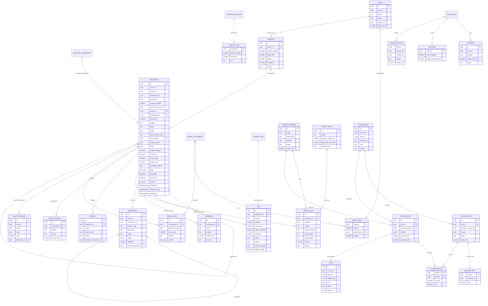
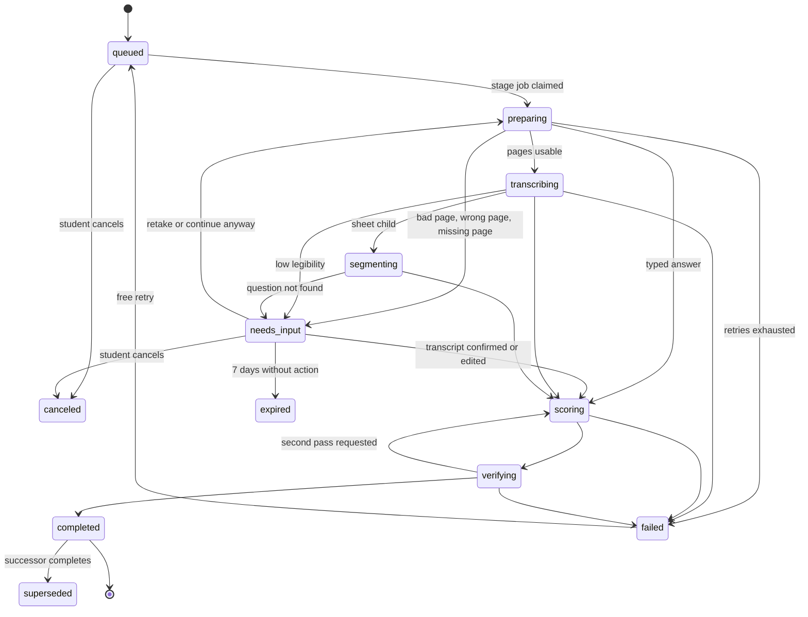
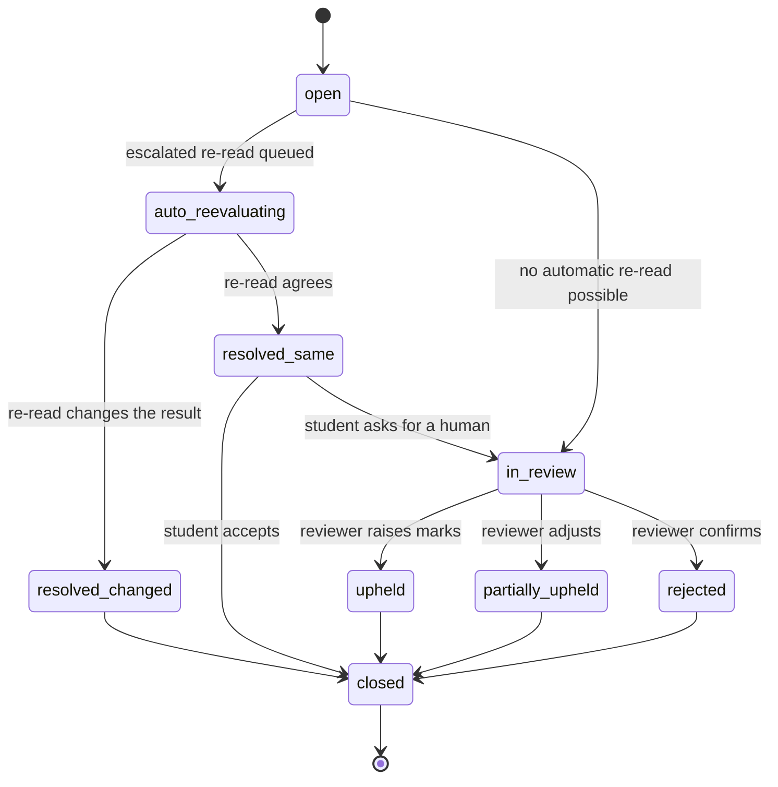
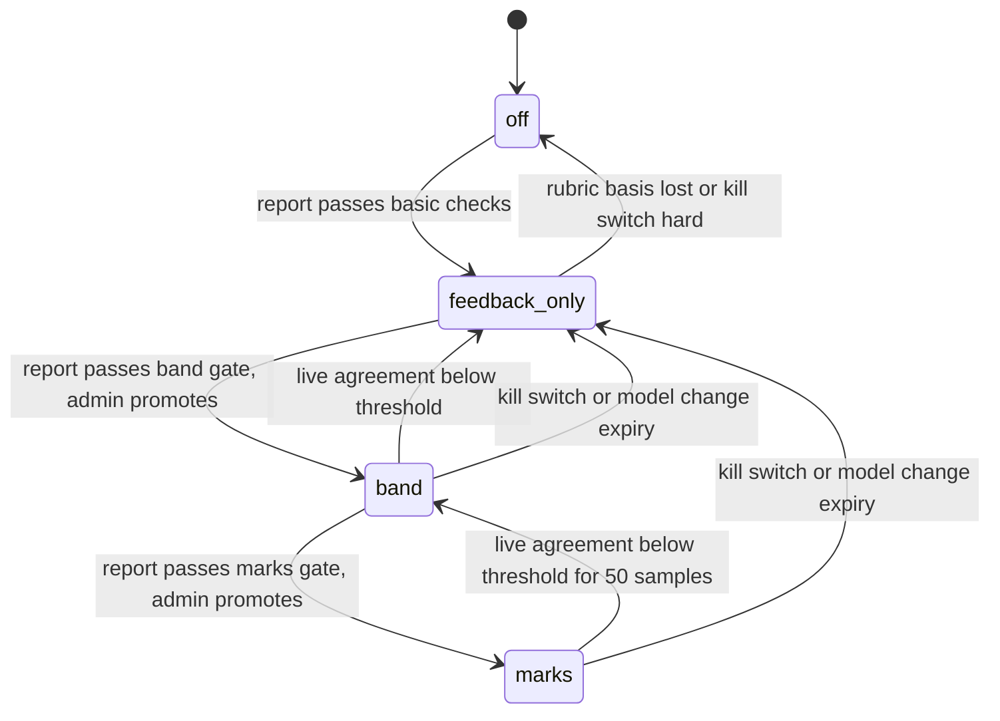

# ERD: F-07 Scoring System / AI Answer Evaluation (the evaluation engine over F-06 submissions)

| Field | Value |
| --- | --- |
| Linked PRD | `docs/product/prd/F-07-ai-answer-evaluation.md` |
| Django app | `apps/api/modules/evaluation` (tables `evaluation_*`); worker stages run in the always-on worker (X-04, F-06 `run_worker`); uses `apps/api/integrations/gemini.py` |
| Web module | `apps/web/src/modules/evaluation` |
| Order | Reads F-06 (`docs/product/erd/F-06-question-bank-system.md` sections 0, 2.5, 2.6, 2.21, 2.26, 3) and F-02 (`docs/product/erd/F-02-syllabus-structure-and-coverage.md`, cluster keys). Shares the worker and AI client with X-04 (`docs/product/erd/X-04-ingestion-scraping-service.md`). Feeds F-10 and X-01 through events |
| Last updated | 2026-10-05 |

**Reading guide for other authors.** Section 0 states what F-07 owns and what it deliberately does not. Section 3 is the contract (interfaces provided and consumed, the small proposed extensions to F-06, events). If you need an evaluation result you call `evaluation.selectors`; you never add evaluation tables or read `evaluation_*` models. Table names follow `<app>_<model>`.

## 0. Design decisions

1. **F-07 owns evaluation facts only.** Question, version, rubric and rubric steps, submission and pages, attempt answers, scores, media, events and jobs stay in F-06. F-07 stores: the run (`evaluation`), what we read (`transcript`), per-step results (`item`), feedback, page quality, sheets for whole-paper uploads, disputes and review, the golden sets and gates that decide what may be shown, the model-call ledger, quotas and consent. F-06 receives results only through `practice.services.apply_evaluation` and keeps `evaluation_ref` by value.
2. **One evaluation = one attempt to evaluate one submission.** A re-evaluation, an escalated re-read or a dispute re-read is a new row with `supersedes_id`, so history is complete and `apply_evaluation` is idempotent per `(submission_id, evaluation_ref)`. At most one evaluation per submission is in flight (partial unique index, an exclusivity rule enforced by the database, as the F-01 audit recommended).
3. **Transcript in the middle.** The image model writes a transcript; the grading model reads only the transcript, the rubric and the reference solution. The transcript is a first-class row the student can see and edit (edits are new rows with a parent). This halves cost on re-checks (text only), removes images from the grading prompt, and makes OCR errors visible.
4. **The model proposes, the server decides.** `evaluation_item.model_awarded` is the raw proposal; `awarded` is the validated, clamped value. Totals are computed by the server. The `item` row keeps both so disputes and the golden runner can see what the validator changed.
5. **Display mode is derived at read time.** The stored `display_mode` is a snapshot for events and analytics. The API recomputes it from basis, confidence, flags and the **current** cluster gate, so a demotion or kill switch takes effect on already completed evaluations immediately without rewriting history.
6. **Gates are data.** `evaluation_gate` holds the highest mode per cluster (course, level, subject, kind) and links to the gate report that earned it. Nothing in code decides "marks are accurate enough"; a report with measured metrics and snapshotted thresholds does, and an admin promotes it (audited). Model or prompt change expires the gate.
7. **Everything that costs money has a ledger row.** `evaluation_modelrun` stores model, prompt version, tokens, latency and computed cost for every call, including repairs, fallbacks, golden runs and shadow runs. Budgets are counters updated atomically (`INSERT ... ON CONFLICT DO UPDATE`), never read-modify-write. Prices are effective-dated rows.
8. **Quota is a ledger, not a counter.** Signed entries (`reserve`, `release`, `commit`, `grant`, `adjust`); usage in a period is a sum; idempotent per `(evaluation_id, entry)`. Check-and-reserve runs under a per-user advisory lock.
9. **Stages are jobs; the state machine is compare-and-set.** Each stage is a `core_job` with `dedupe_key = eval:{id}:{stage}:{attempt}`. Status changes use `UPDATE ... WHERE id = ? AND status = ? AND rev = ?` so a duplicate or late job cannot move an evaluation backwards. No stage depends on a request.
10. **Caches are per user.** Page preparation, transcripts and score results are cached by content hash within one user, never across users (no side channel for "has someone submitted this text before"). Rubric-only artefacts (AI rubric drafts) are cached globally because they hold no student data.
11. **Privacy shapes the schema.** Content columns (`transcript.pages`, `item.evidence_quote`, `dispute.message`, `modelrun.output`) are classified PII and purged on delete or retention. Cost, audit and ledger rows carry ids, counts and codes only and are anonymised (user id nulled) on account deletion, so the one-year log expectation can be met without keeping content.
12. **Extension by registry.** F-07 registers evaluator `ai` into F-06 (`register_evaluator`) and an origin `ai_scoring` for ad-hoc sessions (`register_origin`). Other origins (F-08 papers, F-09 papers, F-12 exercises) get AI evaluation with no code change in their modules.

## 1. Diagrams

### 1.1 Entities (module `evaluation`, with the F-06 and core tables it touches)



Not drawn (no relations of interest): `evaluation_quotaplan`, `evaluation_budgetcounter`, `evaluation_auditlog`.

### 1.2 Evaluation lifecycle



### 1.3 Dispute lifecycle



### 1.4 Gate lifecycle (per cluster)



## 2. Tables

Conventions (same as F-06): uuid primary keys (`gen_random_uuid()` unless stated), `created_at` and `updated_at` timestamptz default `now()`, `user_id` is the Supabase uuid by value (no cross-schema FK) and scopes every query, enums are `text` with a check constraint, marks are `numeric` (never float), JSONB only for schema-less payloads and always with a `v` (schema version) key, soft delete with `deleted_at` where the student owns data. RLS is enabled with no policies on every table (section 7).

### 2.1 `evaluation_evaluation` (one attempt to evaluate one submission)

| Column | Type | Null | Default | Notes |
| --- | --- | --- | --- | --- |
| user_id | uuid | no | | Scoped on every query |
| client_id | uuid | no | | Idempotent creation; unique `(user_id, client_id)` |
| submission_id | uuid | no | | By value to `practice_submission.id` |
| session_id | uuid | no | | By value to `practice_session.id` |
| answer_position | smallint | no | | Position of the attempt answer (F-06) |
| question_id, question_version_id | uuid | no | | Pinned by value; the rubric is the version's rubric |
| rubric_hash | text | no | | SHA-256 of the canonical rubric (steps, marks, kinds, keywords, flags), the reference solution hash and `rubricnote.rev`; part of the score cache key |
| sheet_id | uuid | yes | | FK `evaluation_sheet`, set for sheet children |
| segment_id | uuid | yes | | FK `evaluation_segment` |
| supersedes_id | uuid | yes | | FK self; unique where not null (one successor) |
| attempt_no | smallint | no | 1 | 1 + number of predecessors |
| trigger | text | no | `request` | `request`, `auto` (setting), `rescore`, `full`, `escalated`, `dispute`, `admin`, `shadow` |
| mode | text | no | `single` | `single`, `sheet_child`, `adhoc` |
| basis | text | no | | `reviewed_rubric`, `reference_only`, `ai_derived` (PRD 8.2); computed at request, frozen |
| input_mode | text | no | | `typed`, `photos`, `both` |
| page_count | smallint | no | 0 | |
| ran_out_of_time | boolean | no | false | Student ticked "I ran out of time on this one"; one source of the `time` loss reason |
| deadline_cut | boolean | no | false | From F-06 context (session ended by deadline and this answer was still being written) |
| status | text | no | `queued` | `queued`, `preparing`, `needs_input`, `transcribing`, `segmenting`, `scoring`, `verifying`, `completed`, `failed`, `canceled`, `expired`, `superseded` |
| last_stage_done | text | yes | | `prepare`, `transcribe`, `segment`, `score`, `verify`; resume point |
| needs_input_reason | text | yes | | `image_quality`, `wrong_page`, `pages_missing`, `transcript_confirmation`, `question_unmatched`, `not_an_answer` |
| needs_input_detail | jsonb | yes | | `{"v":1,"pages":[{"position":2,"reasons":["blur"]}],"expires_at":"..."}`; no content |
| continue_anyway | boolean | no | false | Student chose to proceed past warnings (caps confidence at low) |
| transcript_id | uuid | yes | | FK `evaluation_transcript` used for scoring |
| prompt_release_id | uuid | yes | | FK `evaluation_promptrelease` of the scoring stage |
| visible | boolean | no | true | False for shadow runs (never applied or shown) |
| state | text | yes | | `estimate`, `final` (as reported to F-06); `disputed` is set on the submission by the dispute service while a dispute is open |
| display_mode | text | yes | | Snapshot at completion: `marks`, `band`, `feedback_only`. The API recomputes (section 3.6) |
| marks_estimate, marks_low, marks_high | numeric(6,2) | yes | | Point estimate and range; null in `feedback_only` snapshots |
| marks_max | numeric(6,2) | no | | From the pinned version |
| confidence_band | text | yes | | `high`, `medium`, `low` |
| confidence_score | numeric(4,3) | yes | | 0 to 1 (formula in section 3.6) |
| confidence_reasons | text[] | no | `{}` | Codes shown to the student (`page_hard_to_read`, `alternative_method`, `second_pass_disagreed`, ...) |
| flags | text[] | no | `{}` | `injection_suspected`, `unsupported_evidence`, `alternative_method`, `low_legibility`, `examiner_note`, `plausibility`, `transcript_edited`, `fallback_used`, `time_cut` |
| degraded | boolean | no | false | A fallback model or a simplified path was used |
| cache_hit | boolean | no | false | Result served from the score cache without a model call |
| cache_source_id | uuid | yes | | The evaluation whose result was reused |
| lane | text | no | `standard` | `standard`, `batch`, `priority` |
| quota_units | smallint | no | 1 | Units reserved for this evaluation |
| cost_inr | numeric(10,4) | no | 0 | Sum of its model runs (updated in the run's transaction) |
| disclaimer_version | smallint | no | | |
| queued_at, started_at, finished_at | timestamptz | | now(), null, null | `finished_at` set at completed, failed, canceled, expired |
| duration_ms | int | yes | | `finished_at - queued_at` |
| error_code | text | yes | | `provider_unavailable`, `invalid_output`, `cost_cap`, `content_blocked`, `budget_stop`, `timeout`, `internal` |
| error_stage | text | yes | | |
| rating | smallint | yes | | 1 up, -1 down |
| rating_reason | text | yes | | `wrong_marks`, `unclear`, `too_slow`, `other` |
| retention_until | timestamptz | no | | Copied from the submission (default 12 months) or the student's shorter setting |
| deleted_at | timestamptz | yes | | Soft delete; content purge follows within 24 hours |
| rev | int | no | 0 | Compare-and-set counter for state changes |

Constraints: checks on every enum; `status = 'completed'` implies `marks_max is not null`, `confidence_band is not null`, `finished_at is not null`, `display_mode is not null`; `marks_low <= marks_estimate <= marks_high <= marks_max` when present; `attempt_no >= 1`; unique `(user_id, client_id)`; unique `(submission_id, attempt_no)`; **exclusivity**: unique `(submission_id)` where `status in ('queued','preparing','needs_input','transcribing','segmenting','scoring','verifying') and deleted_at is null and visible` (at most one live evaluation per submission, enforced by the database); unique `(supersedes_id)` where `supersedes_id is not null`.
Indexes: `(user_id, created_at desc)` where `deleted_at is null` (history); `(submission_id, attempt_no desc)` (latest for a submission); `(session_id)` (paper roll-up); `(sheet_id)` where `sheet_id is not null`; `(status, queued_at)` where `status in ('queued','needs_input')` (queue and expiry job); `(retention_until)` where `deleted_at is null` (purge); `(submission_id, transcript_id, rubric_hash, prompt_release_id)` where `status = 'completed'` (score cache lookup).

### 2.2 `evaluation_transcript` (what we read; PII)

| Column | Type | Null | Default | Notes |
| --- | --- | --- | --- | --- |
| user_id | uuid | no | | |
| submission_id | uuid | no | | By value |
| origin | text | no | | `typed` (copied from `practice_submission.text_md`), `ocr`, `student_edit` |
| parent_transcript_id | uuid | yes | | FK self; the OCR transcript an edit started from |
| edit_seq | smallint | no | 0 | Number of student edits in this lineage (limit 3 for re-checks) |
| source_hash | text | yes | | For `ocr`: SHA-256 over the ordered page content hashes, `prepare_version`, transcribe prompt version, model and media resolution. Page cache key |
| text_hash | text | no | | SHA-256 of normalised `text_md` (whitespace folded); score cache key part |
| lang | text | no | `en` | |
| pages | jsonb | no | | `{"v":1,"pages":[{"position":1,"attachment_id":"...","text_md":"...","legibility":0.82,"page_type":"answer","detected_page_no":1,"labels":["3(b)"],"uncertain":[{"start":120,"end":128}]}]}` |
| text_md | text | no | | Combined text with page markers (derived from `pages`), max 60,000 characters |
| legibility | numeric(4,3) | yes | | Weighted mean of page legibility; null for typed |
| uncertain_ratio | numeric(4,3) | yes | | Share of tokens inside uncertain spans |
| char_count | int | no | | |
| model_run_id | uuid | yes | | The transcribe run (null for typed and edits) |
| deleted_at | timestamptz | yes | | |

Unique `(user_id, source_hash)` where `origin = 'ocr' and deleted_at is null` (per-user page cache). Index `(submission_id, created_at desc)`. Edits never overwrite: they insert a new row with `origin = 'student_edit'`.

### 2.3 `evaluation_item` (rubric match result, one row per rubric step per evaluation)

| Column | Type | Null | Default | Notes |
| --- | --- | --- | --- | --- |
| evaluation_id | uuid | no | | FK cascade |
| step_id | uuid | no | | By value to `questionbank_rubricstep` (steps are immutable with their version) |
| position | smallint | no | | Copy of the step position; unique `(evaluation_id, position)` |
| title | text | no | | Snapshot |
| kind | text | no | | Snapshot: `concept`, `calculation`, `working_note`, `presentation`, `conclusion`, `format` |
| marks_max | numeric(4,1) | no | | Snapshot |
| model_awarded | numeric(4,1) | yes | | Raw proposal before validation |
| awarded | numeric(4,1) | no | | Validated and clamped, multiples of 0.5; `0 <= awarded <= marks_max` |
| status | text | no | | `full`, `partial`, `missing`, `wrong`, `unsupported`, `not_applicable` |
| reason | text | yes | | Loss reason when `awarded < marks_max`: `concept`, `calculation`, `presentation`, `time`, `keyword`, `missing_section`, `format`, `other` |
| evidence_quote | text | yes | | At most 300 characters, copied from the transcript (PII) |
| evidence_page | smallint | yes | | |
| evidence_span | jsonb | yes | | `{"v":1,"start":412,"end":470}` offsets in `transcript.text_md` |
| evidence_match | numeric(3,2) | yes | | Fuzzy match score of the quote against the transcript |
| keywords_hit, keywords_missed | text[] | no | `{}` | Against the step's keywords |
| follow_through | boolean | no | false | Own-figure marking applied |
| alternative_method | boolean | no | false | |
| comment_md | text | no | `''` | At most 600 characters, sanitised on write |
| validator_notes | text[] | no | `{}` | `clamped`, `evidence_missing`, `sum_adjusted`, `partial_not_allowed`, `reason_reassigned` |

Checks: `awarded between 0 and marks_max`; `status = 'full'` implies `awarded = marks_max`; `status in ('missing','wrong','unsupported')` implies `awarded = 0` (a step with `unsupported` evidence is 0). Index `(evaluation_id)` is the unique key; `(step_id)` for per-step statistics in the rubric workbench ("this step is lost by 80% of students").

### 2.4 `evaluation_feedback`

| Column | Type | Null | Default | Notes |
| --- | --- | --- | --- | --- |
| evaluation_id | uuid | no | | FK cascade |
| position | smallint | no | | Display order; unique `(evaluation_id, position)` |
| kind | text | no | | `summary`, `mistake`, `missing_keyword`, `missing_section`, `presentation_tip`, `writing_tip`, `next_step` |
| reason | text | yes | | Same reason codes as items |
| marks_lost | numeric(4,1) | yes | | For `mistake` rows |
| step_id | uuid | yes | | |
| text_md | text | no | | At most 500 characters |
| meta | jsonb | no | `{}` | `{"v":1,"next_step":{"kind":"practise","chapter_id":"...","picker":"wrong_only"}}` |

Feedback is generated from item comments and rule templates by the server; the model never writes free text that is not length-capped and sanitised.

### 2.5 `evaluation_pagecheck` (page preparation and quality; cache of the prepare stage)

| Column | Type | Null | Default | Notes |
| --- | --- | --- | --- | --- |
| user_id | uuid | no | | |
| attachment_id | uuid | no | | FK `media_attachment` (original, `clean`) |
| prepare_version | text | no | | Version of the preparation code and thresholds |
| evaluation_id | uuid | yes | | Last evaluation that used it (nullable; the row is reusable) |
| sheet_id | uuid | yes | | |
| width, height | int | no | | Derived image size (long side at most 2,000) |
| blur_score | numeric(8,2) | no | | Variance of the Laplacian on the grey image (higher is sharper) |
| brightness | smallint | no | | Mean 0 to 255 |
| contrast | numeric(4,3) | no | | |
| skew_deg | numeric(4,1) | no | | Detected skew before correction |
| rotation_applied | smallint | no | 0 | 0, 90, 180, 270 |
| cropped_edges | text[] | no | `{}` | `left`, `right`, `top`, `bottom` where text touches the border |
| ink_ratio | numeric(4,3) | no | | Dark pixel share; very low means blank |
| blank | boolean | no | false | |
| verdict | text | no | | `ok`, `warn`, `reject` |
| reasons | text[] | no | `{}` | `blur`, `dark`, `glare`, `cropped`, `small`, `blank`, `skew` |
| page_type | text | yes | | From transcription: `answer`, `question_paper`, `blank`, `other` |
| derived_path | text | yes | | `answer-sheets` bucket, `.../derived/{attachment_id}.jpg` |
| derived_bytes | int | yes | | |

Unique `(attachment_id, prepare_version)`. Thresholds are in configuration with a version, not in the table, so a threshold change bumps `prepare_version` and recomputes lazily.

### 2.6 `evaluation_sheet` (whole-paper or ad-hoc upload)

| Column | Type | Null | Default | Notes |
| --- | --- | --- | --- | --- |
| user_id | uuid | no | | |
| client_id | uuid | no | | Unique `(user_id, client_id)` |
| mode | text | no | | `paper` (belongs to a session), `adhoc` (question photo plus answer photo) |
| session_id | uuid | yes | | By value; required for `paper` |
| status | text | no | `draft` | `draft`, `uploading`, `analyzing`, `needs_input`, `ready`, `evaluating`, `done`, `failed`, `deleted` |
| page_count | smallint | no | 0 | At most 40 |
| order_confirmed, mapping_confirmed | boolean | no | false | Student confirmations |
| analysis | jsonb | no | `{}` | `{"v":1,"page_number_confidence":0.9,"unmatched_positions":[3],"notes":[]}` (no content) |
| needs_input_reason | text | yes | | `order`, `mapping`, `wrong_pages`, `quality` |
| adhoc_question_id | uuid | yes | | Private F-06 question created for `adhoc` (by value) |
| adhoc_marks | numeric(5,1) | yes | | Marks entered or read from the question photo |
| quota_units | smallint | no | 0 | Units reserved for the fan-out |
| retention_until | timestamptz | no | | |
| deleted_at | timestamptz | yes | | |

### 2.7 `evaluation_sheetpage`

| Column | Type | Null | Default | Notes |
| --- | --- | --- | --- | --- |
| sheet_id | uuid | no | | FK cascade |
| position | smallint | no | | 1-based order; unique `(sheet_id, position)` deferrable (reordering swaps) |
| attachment_id | uuid | no | | FK `media_attachment`; unique `(sheet_id, attachment_id)` |
| role | text | no | `answer` | `answer`, `question_paper` (ad hoc) |
| rotation | smallint | no | 0 | Student override |
| detected_page_no | smallint | yes | | Written or printed page number found by transcription |
| excluded | boolean | no | false | Removed as a wrong page without deleting the file |
| pagecheck_id | uuid | yes | | FK `evaluation_pagecheck` |

A page can be attached only when its attachment is `clean` (F-06 media rule).

### 2.8 `evaluation_segment` (answer found for a question)

| Column | Type | Null | Default | Notes |
| --- | --- | --- | --- | --- |
| sheet_id | uuid | no | | FK cascade |
| answer_position | smallint | yes | | F-06 attempt position; null while a label is unmatched |
| label_detected | text | no | `''` | "Q.3(b)", "Ans 4" as written |
| page_from, page_to | smallint | no | | Sheet page positions |
| spans | jsonb | no | | `{"v":1,"spans":[{"page":4,"start_line":3,"end_line":40}]}` for answers that share a page |
| confidence | numeric(4,3) | no | | |
| source | text | no | `model` | `model`, `student` |
| skipped | boolean | no | false | Student says not attempted |
| submission_id | uuid | yes | | The F-06 submission created for this segment (by value) |
| evaluation_id | uuid | yes | | |

Unique `(sheet_id, answer_position)` where `answer_position is not null and skipped = false`.

### 2.9 `evaluation_rubricnote` (F-07 grader hints attached to a rubric; not a copy of the rubric)

| Column | Type | Null | Default | Notes |
| --- | --- | --- | --- | --- |
| version_id | uuid | no | | PK; by value to `questionbank_questionversion.id` (rubric is 1:1 with the version) |
| grader_notes_md | text | no | `''` | Max 2,000 characters: how to read ambiguous steps, common student errors |
| alternatives_md | text | no | `''` | Accepted alternative methods or answers |
| follow_through | boolean | no | true | Own-figure marking for calculation steps |
| strictness | smallint | no | 1 | 0 lenient, 1 normal, 2 strict (how literally keywords must appear) |
| expected_words_min, expected_words_max | int | yes | | For the plausibility check only |
| rev | int | no | 0 | Increment on edit; part of `rubric_hash` |
| reviewed_by, reviewed_at | uuid, timestamptz | yes | | Editor review |
| updated_by | uuid | no | | |

An edit does not change F-06 rubric steps; step changes require a new F-06 version. Changing a note changes `rubric_hash`, so the score cache misses and shadow comparisons can run.

### 2.10 `evaluation_dispute`

| Column | Type | Null | Default | Notes |
| --- | --- | --- | --- | --- |
| evaluation_id | uuid | no | | FK; the evaluation being disputed |
| user_id | uuid | no | | |
| client_id | uuid | no | | Unique `(user_id, client_id)` |
| scope | text | no | | `overall`, `step`, `transcript`, `wrong_question`, `feedback` |
| step_id | uuid | yes | | For `step` |
| reason_code | text | no | | `marks_too_low`, `marks_too_high`, `transcript_wrong`, `rubric_misread`, `wrong_question_matched`, `feedback_wrong`, `other` |
| message | text | no | `''` | Max 1,000 characters (PII) |
| proposed_marks | numeric(6,2) | yes | | |
| status | text | no | `open` | `open`, `auto_reevaluating`, `resolved_same`, `resolved_changed`, `in_review`, `upheld`, `partially_upheld`, `rejected`, `closed` |
| auto_evaluation_id | uuid | yes | | The escalated re-read |
| reviewer_id | uuid | yes | | |
| resolution_evaluation_id | uuid | yes | | The new evaluation if marks changed (state `final` for a reviewer decision) |
| outcome_note | text | no | `''` | Shown to the student, max 600 characters |
| credit_refunded | smallint | no | 0 | Units returned (idempotent through the ledger) |
| golden_candidate | boolean | no | false | Eligible for the golden pool if `golden_use` consent exists |
| sla_due_at | timestamptz | yes | | 3 working days for human review (target) |
| decided_at | timestamptz | yes | | |

Unique `(evaluation_id)` where `status in ('open','auto_reevaluating','in_review')` (one open dispute per evaluation). Indexes `(status, sla_due_at)` (admin queue), `(user_id, created_at desc)`.

### 2.11 `evaluation_reviewsample` (human review of live evaluations)

| Column | Type | Null | Default | Notes |
| --- | --- | --- | --- | --- |
| evaluation_id | uuid | no | | FK |
| user_id | uuid | no | | Student |
| reason | text | no | | `random`, `low_confidence`, `disputed`, `shadow_disagreement`, `injection`, `high_marks` |
| consent_id | uuid | yes | | The `quality_review` consent row that allows it (null for `disputed`) |
| status | text | no | `queued` | `queued`, `in_review`, `decided`, `skipped` |
| reviewer_id | uuid | yes | | |
| ai_total | numeric(6,2) | no | | Snapshot |
| human_total | numeric(6,2) | yes | | |
| human_steps | jsonb | yes | | `{"v":1,"steps":[{"step_id":"...","awarded":2.0,"status":"partial"}]}` |
| delta_pct | numeric(5,2) | yes | | `(ai - human) / marks_max`, signed |
| within_tolerance | boolean | yes | | |
| notes | text | no | `''` | Max 500 characters |
| decided_at | timestamptz | yes | | |

Check: `reason <> 'disputed'` implies `consent_id is not null`. Indexes `(status, created_at)` (queue), `(decided_at)` where `status = 'decided'` (live agreement windows per cluster, joined through the evaluation's question version).

### 2.12 `evaluation_goldenset`, `evaluation_goldenitem`, `evaluation_goldenmark`, `evaluation_goldenresult`

`goldenset`: `id`, `course_id` (FK `syllabus_course`), `level_id` (FK `syllabus_level`), `subject_key` text, `kind` text (`long_form`, `practical`), `name`, `version` int, `status` (`draft`, `active`, `retired`), `created_by`, `created_at`. Unique `(course_id, level_id, subject_key, kind, version)`. The cluster key is `(course_id, level_id, subject_key, kind)`.

`goldenitem`:

| Column | Type | Null | Default | Notes |
| --- | --- | --- | --- | --- |
| set_id | uuid | no | | FK |
| question_id, question_version_id | uuid | no | | By value; the version's rubric is the marking scheme under test |
| source | text | no | | `staff_written`, `volunteer`, `synthetic` |
| writer_ref | text | no | | Pseudonymous writer id (handwriting variety, no identity) |
| consent_id | uuid | yes | | Required for `volunteer` (`golden_use`) |
| input_mode | text | no | | `typed`, `photos` |
| text_md | text | yes | | For typed items |
| attachment_ids | uuid[] | no | `{}` | Platform-owned attachments (`owner_user_id` null, bucket `answer-sheets`, path `platform/golden/...`) |
| quality_tag | text | no | `average` | `clean`, `average`, `poor` (handwriting or photo quality) |
| profile | text[] | no | `{}` | `partial`, `alt_method`, `wrong_figure`, `injection`, `no_working`, `verbose` |
| status | text | no | `draft` | `draft`, `marked`, `adjudicated`, `excluded` |
| final_total | numeric(6,2) | yes | | After adjudication |
| final_steps | jsonb | yes | | `{"v":1,"steps":[...]}` |
| pool | text | no | `eval` | `eval` (never shown to prompts) or `fewshot` (may be used as prompt examples; never counted in gates) |
| transcript_gold_md | text | yes | | Human transcription for the CER sample |

`goldenmark`: `item_id` FK, `reviewer_id`, `steps` jsonb (same shape), `total` numeric(6,2), `minutes` int, `created_at`; unique `(item_id, reviewer_id)`. Adjudication triggers when two totals differ by more than 15% of marks.
`goldenresult`: PK `(report_id, item_id)`, `ai_total`, `ai_low`, `ai_high`, `steps` jsonb, `confidence_band`, `cer` numeric(5,4) null, `runs` smallint, `cost_inr` numeric(10,4).

### 2.13 `evaluation_gatereport` and `evaluation_gate`

`gatereport`:

| Column | Type | Null | Default | Notes |
| --- | --- | --- | --- | --- |
| set_id | uuid | no | | FK `evaluation_goldenset` (carries the cluster) |
| prompt_release_ids | uuid[] | no | | The releases (one per stage) under test |
| model_info | jsonb | no | | `{"v":1,"stages":{"transcribe":"model-id","score":"model-id"}}` |
| status | text | no | `running` | `running`, `done`, `failed` |
| n_items | smallint | no | 0 | Adjudicated items scored |
| metrics | jsonb | no | `{}` | `{"v":1,"nmae":0.07,"within_tolerance":0.88,"qwk":0.82,"bias":-0.01,"catastrophic":0.02,"step_agreement":0.8,"cer":0.04,"stability_sd":0.02,"stability_identical":0.92,"calibration_high":0.93,"robustness":{"injection_failures":0,"subgroup_gap":0.03},"human_human":{"qwk":0.86,"nmae":0.05}}` |
| thresholds | jsonb | no | | Snapshot of the thresholds used (so later changes do not rewrite history) |
| passed_band, passed_marks | boolean | no | false | |
| cost_inr | numeric(10,2) | no | 0 | Charged to budget scope `golden` |
| run_by | uuid | no | | |
| started_at, finished_at | timestamptz | | now(), null | |

`gate` (one row per cluster):

| Column | Type | Null | Default | Notes |
| --- | --- | --- | --- | --- |
| course_id, level_id | uuid | no | | FK |
| subject_key | text | no | | |
| kind | text | no | | |
| mode | text | no | `off` | `off`, `feedback_only`, `band`, `marks` |
| report_id | uuid | yes | | FK gate report that earned the mode |
| promoted_by, promoted_at | uuid, timestamptz | yes | | Audited |
| expires_at | timestamptz | yes | | Set when a model or prompt changes (gate must be re-earned) |
| demoted_at, demote_reason | timestamptz, text | yes | | `live_agreement`, `model_change`, `kill_switch`, `rubric_coverage` |
| live_samples | int | no | 0 | Samples in the current window |
| live_within_tolerance | numeric(4,3) | yes | | |

Unique `(course_id, level_id, subject_key, kind)`. The effective mode used by the API is `off` when `expires_at < now()`, and is further capped by the global `EVAL_MARKS_VISIBLE` setting.

### 2.14 `evaluation_promptrelease`

| Column | Type | Null | Default | Notes |
| --- | --- | --- | --- | --- |
| stage | text | no | | `transcribe`, `segment`, `score`, `verify`, `rubric_draft` |
| prompt_key | text | no | | File key in `modules/evaluation/prompts/` |
| version | text | no | | Semver; prompts live in the repository (reviewed, diffable) |
| template_hash | text | no | | SHA-256 of prompt text plus schema; startup check refuses a mismatch |
| schema_version | smallint | no | | Output JSON schema version |
| model | text | no | | Provider model id |
| fallback_model | text | yes | | |
| params | jsonb | no | | `{"v":1,"temperature":0,"seed":17,"media_resolution":"high","thinking_budget":1024,"max_output_tokens":4096}` |
| status | text | no | `draft` | `draft`, `shadow`, `canary`, `active`, `retired` |
| canary_pct | smallint | no | 0 | 0 to 100 |
| gate_report_id | uuid | yes | | Latest passing report |
| changelog | text | no | `''` | |
| created_by | uuid | no | | |
| activated_at, retired_at | timestamptz | yes | | |

Unique `(stage, prompt_key, version)`; unique `(stage)` where `status = 'active'` (one active release per stage; per-cluster overrides are R3). Activation requires a passing gate report for every cluster currently at `band` or `marks`, otherwise those clusters are demoted by the activation transaction.

### 2.15 `evaluation_modelrun` (the model-call ledger)

| Column | Type | Null | Default | Notes |
| --- | --- | --- | --- | --- |
| user_id | uuid | yes | | Null after account deletion (anonymised) |
| evaluation_id | uuid | yes | | FK `on delete set null` |
| report_id | uuid | yes | | Gate report (golden runs) |
| purpose | text | no | | `transcribe`, `segment`, `score`, `verify`, `repair`, `rubric_draft`, `golden`, `shadow` |
| stage | text | no | | |
| attempt | smallint | no | 1 | Retry counter |
| fallback_of_id | uuid | yes | | FK self |
| model | text | no | | Requested model id |
| model_version | text | yes | | Version string reported by the provider |
| prompt_release_id | uuid | yes | | FK |
| prompt_key, prompt_version | text | no | | Denormalised for the ledger |
| schema_version | smallint | no | | |
| params | jsonb | no | | Effective parameters |
| lane | text | no | `standard` | `standard`, `batch` |
| status | text | no | | `ok`, `repaired`, `error`, `timeout`, `rate_limited`, `blocked`, `invalid_output`, `cancelled` |
| error_code, finish_reason | text | yes | | |
| http_status | smallint | yes | | |
| input_tokens, output_tokens, thought_tokens, cached_tokens | int | no | 0 | From provider usage metadata |
| image_count | smallint | no | 0 | |
| input_bytes | int | no | 0 | |
| latency_ms, queue_ms | int | yes | | |
| price_id | uuid | yes | | FK `evaluation_modelprice` |
| cost_usd | numeric(12,6) | no | 0 | `(input x in_price + (output + thought) x out_price) / 1e6` with the batch factor |
| fx_inr_per_usd | numeric(8,3) | no | | Config value at call time |
| cost_inr | numeric(10,4) | no | 0 | |
| request_hash | text | yes | | SHA-256 of prompt text version plus inputs; stage-level cache and duplicate detection |
| output | jsonb | yes | | Validated structured output (PII); null after purge |
| output_purge_at | timestamptz | yes | | `created_at + 90 days` |

Indexes: `(evaluation_id, created_at)`; BRIN `(created_at)` (cost board and reconciliation scans); `(user_id, request_hash, purpose)` where `status in ('ok','repaired')` and `request_hash is not null`; `(output_purge_at)` where `output is not null` (purge job). Not partitioned: about 1 million rows a year at Year 3; revisit past 20 million.

### 2.16 `evaluation_modelprice`

`model` text, `input_per_mtok_usd` numeric(8,4), `output_per_mtok_usd` numeric(8,4), `cached_input_per_mtok_usd` numeric(8,4) null, `batch_factor` numeric(3,2) default 0.50, `effective_from` date, `effective_to` date null, `source_url` text, `verified` boolean default false, `verified_by` uuid null. Unique `(model, effective_from)`. Cost for a run uses the row effective on the call date (so the 1 January 2027 change of a promotional price is a data change). A run with no matching price uses the newest row and sets `validator_notes` on the run via `params.price_missing = true` and alerts.

### 2.17 `evaluation_quotaplan`, `evaluation_quotaledger`, `evaluation_budgetcounter`

`quotaplan`: `plan` text PK (`free`, `plus`), `monthly_units` int, `daily_units` int, `max_inflight` smallint, `max_pages_per_answer` smallint, `max_pages_per_sheet` smallint, `max_escalations` smallint, `max_disputes_per_day` smallint, `effective_from` date, `updated_by`. Defaults in section 4.

`quotaledger`:

| Column | Type | Null | Default | Notes |
| --- | --- | --- | --- | --- |
| id | bigint | no | identity | PK |
| user_id | uuid | yes | | Null after account deletion (anonymised) |
| period | date | no | | First day of the IST calendar month |
| local_date | date | no | | IST date (daily cap) |
| entry | text | no | | `reserve` (+units), `release` (-units: cancel, fail, expire, refund), `commit` (0: reserved became consumed), `grant` (negative units), `adjust` |
| units | smallint | no | | Signed |
| evaluation_id, sheet_id, dispute_id | uuid | yes | | |
| reason | text | no | `''` | `failed`, `expired`, `canceled`, `dispute_upheld`, `dispute_partial`, `admin` |
| created_at | timestamptz | no | now() | |

Unique `(evaluation_id, entry)` where `evaluation_id is not null` (idempotent); index `(user_id, period)` and `(user_id, local_date)`. Usage = `sum(units)` for the period. Reserve runs inside `pg_advisory_xact_lock(hashtextextended('evalquota:' || user_id, 0))` so the check and the insert cannot interleave.

`budgetcounter`: PK `(day, scope)`; `scope` text (`global`, `golden`, `shadow`); `reserved_inr`, `spent_inr` numeric(12,4), `calls` int, `tokens_in`, `tokens_out` bigint, `warned_70`, `deferred_90`, `stopped_100` timestamptz null (alert once). Updated by atomic upserts: reserve the estimate before a call, then move reserved to spent with the actual cost.

### 2.18 `evaluation_consent`, `evaluation_settings`, `evaluation_auditlog`

`consent` (append-only log): `id`, `user_id`, `purpose` (`ai_processing`, `quality_review`, `golden_use`), `notice_version` smallint, `action` (`granted`, `withdrawn`), `source` (`web`, `import`), `created_at`. Effective consent is the latest row per `(user_id, purpose)`; index `(user_id, purpose, created_at desc)`. Not deleted on account deletion for 12 months after the withdrawal row in anonymised form `[VERIFY with counsel]`.
`settings`: `user_id` PK, `auto_evaluate` boolean false, `photo_retention_days` smallint null (null = follow the submission, otherwise 30 or 90), `notify_on_complete` boolean true, `self_grade_first` boolean false, `updated_at`.
`auditlog`: `id` bigint, `actor_id` uuid, `action` (`view_sheet`, `view_transcript`, `decide_review`, `resolve_dispute`, `promote_gate`, `demote_gate`, `release_prompt`, `change_price`, `change_quota`, `kill_switch`, `golden_mark`, `golden_adjudicate`), `subject_user_id` uuid null (nulled on deletion), `object_type`, `object_id`, `detail` jsonb (ids and codes only), `created_at`. Kept at least one year, then pruned; index `(created_at)`, `(subject_user_id, created_at)`.

### 2.19 `evaluation_reasonrollup` (derived, for F-10 and the student's reasons screen)

| Column | Type | Null | Default | Notes |
| --- | --- | --- | --- | --- |
| user_id | uuid | no | | |
| local_date | date | no | | IST date of `finished_at` |
| chapter_id | uuid | no | zero uuid | Primary chapter of the question (frozen in the F-06 answer row); zero uuid when unmapped |
| subject_id | uuid | yes | | |
| reason | text | no | | One of the eight reasons or `total` |
| marks_lost | numeric(8,2) | yes | | For reason rows |
| marks_awarded, marks_max | numeric(8,2) | yes | | For the `total` row only |
| evaluations | int | no | 0 | Count (on the `total` row) |

PK `(user_id, local_date, chapter_id, reason)`. Maintained by increments in the finalize transaction (and decrements when a successor supersedes), under `pg_advisory_xact_lock` on the user (the F-01.2 audit AUD-002 lesson: no delete-and-insert without a lock), counting only `visible` evaluations in `completed` state that are not superseded. Rebuildable from `evaluation_item` while the evaluation rows exist.

## 3. Relationships to other modules and the contract

### 3.1 Foreign keys and by-value references

| From | To | Rule |
| --- | --- | --- |
| all `user_id`, `reviewer_id`, `actor_id`, `created_by`, `updated_by` | `auth.users.id` | By value, no cross-schema FK; scoped on every query |
| `evaluation_evaluation.submission_id`, `session_id`, `answer_position`, `question_id`, `question_version_id` | `practice_submission`, `practice_session`, `questionbank_question`, `questionbank_questionversion` | By value (F-06 owns them; integrity check job reports orphans). Reads through `practice.selectors.get_submission_context` and `questionbank.selectors`, never foreign models |
| `evaluation_item.step_id`, `evaluation_rubricnote.version_id` | `questionbank_rubricstep`, `questionbank_questionversion` | By value; steps are immutable with their version |
| `evaluation_goldenset.course_id`, `level_id`, `evaluation_gate.course_id`, `level_id` | `syllabus_course`, `syllabus_level` | Real FKs, `restrict`; subject keys are the stable `subject_key` text, resolved through `syllabus.selectors` (never `Subject` models) |
| `evaluation_pagecheck.attachment_id`, `evaluation_sheetpage.attachment_id` | `media_attachment` | Real FKs; only `clean` attachments; derived files live under the same bucket prefix |
| `evaluation_reasonrollup.chapter_id`, `subject_id` | `syllabus_chapter`, `syllabus_subject` | By value on the rollup (frozen from the F-06 answer row, so a scheme change does not rewrite history) |
| `practice_submission.evaluation_ref` | `evaluation_evaluation.id` | By value on F-06's side |
| `core_job` | `evaluation_*` | Job payload carries ids only; `dedupe_key = eval:{id}:{stage}:{attempt}` |

Dependency direction (no cycles): `evaluation -> practice, questionbank, media, syllabus (through selectors), core`; F-06 never imports `evaluation`: it calls the registered evaluator through `practice.registry` and receives `apply_evaluation` calls. F-10, X-01, F-13 consume events and `evaluation.selectors`.

### 3.2 Public interfaces provided (the contract for other modules)

```python
# ---- evaluation/selectors.py (read only; user_id from the JWT, always scoped) -------------------------
def get(user_id: UUID, evaluation_id: UUID) -> EvaluationView                       # status, result with display mode resolved against the CURRENT gate
def get_for_submission(user_id: UUID, submission_id: UUID) -> EvaluationView | None  # latest non-superseded, visible
def list_for_session(user_id: UUID, session_id: UUID) -> list[EvaluationRow]         # paper results, provisional total
def list_for_user(user_id: UUID, *, status=None, subject_key=None, cursor=None, limit=20) -> Page[EvaluationRow]
def eligibility(user_id: UUID, submission_id: UUID) -> Eligibility                  # eligible, basis, display_ceiling, quota, consent, reason
def usage(user_id: UUID) -> UsageView                                               # used, limit, resets_at, daily
def marks_lost_by_reason(user_id: UUID, *, date_from: date, date_to: date,
                         group_by: Literal["reason", "chapter", "subject", "week"]) -> list[ReasonRow]   # from the rollup; F-10
def cluster_mode(course: str, level: str, subject_key: str, kind: str) -> Literal["off","feedback_only","band","marks"]  # effective gate

# ---- evaluation/services.py (writes; actor-checked) ----------------------------------------------------
def request_evaluation(user_id: UUID, *, submission_id: UUID, client_id: UUID, ran_out_of_time: bool = False,
                       trigger: str = "request", lane: str | None = None) -> EvaluationRef
    # checks flag, consent, minor flag, eligibility, quota and budget; reserves a unit under an advisory lock;
    # inserts the evaluation `queued` and enqueues evaluation.prepare (or .score for typed) in ONE transaction.
    # Raises ConsentRequired, QuotaExceeded(used, limit, resets_at), AlreadyEvaluating(id), NotEligible(code), Paused.
def request_sheet_evaluation(user_id: UUID, sheet_id: UUID, *, positions: Sequence[int], client_id: UUID) -> list[EvaluationRef]
def resolve_needs_input(user_id: UUID, evaluation_id: UUID, action: Literal["retake_done","continue_anyway","confirm_transcript","cancel"]) -> Evaluation
def edit_transcript(user_id: UUID, evaluation_id: UUID, pages: Sequence[PageText]) -> Transcript          # new row, limit 3
def reevaluate(user_id: UUID, evaluation_id: UUID, mode: Literal["rescore","full","escalated"], *, client_id: UUID) -> EvaluationRef | CachedResult
def cancel(user_id: UUID, evaluation_id: UUID) -> None                                                   # releases the reserved unit
def open_dispute(user_id: UUID, evaluation_id: UUID, *, scope: str, reason_code: str, message: str = "",
                 step_id: UUID | None = None, proposed_marks: Decimal | None = None, client_id: UUID) -> Dispute
def resolve_dispute(editor_id: UUID, dispute_id: UUID, outcome: str, steps: Sequence[StepResult], note: str) -> Dispute   # state final
def rate(user_id: UUID, evaluation_id: UUID, rating: int, reason: str | None) -> None
def delete_evaluation(user_id: UUID, evaluation_id: UUID) -> None; def delete_sheet(user_id: UUID, sheet_id: UUID) -> None
def delete_all_for_user(user_id: UUID) -> DeleteReport; def export_for_user(user_id: UUID) -> dict       # DPDP; registered with account deletion
def grant_consent(user_id: UUID, purpose: str, notice_version: int) -> None; def withdraw_consent(user_id: UUID, purpose: str) -> None
# sheets: create_sheet, set_sheet_pages, analyze_sheet, set_segments (student mapping), delete_sheet
# admin: promote_gate, demote_gate, release_prompt, set_price, set_quota_plan, set_kill_switch, record_golden_mark, adjudicate_golden, start_gate_run, draft_rubric
```

Pure domain functions (no I/O, 100% unit tested; used by the services and by the golden runner): `validate_score_output`, `clamp_and_sum`, `match_evidence`, `attribute_reasons`, `compute_confidence`, `compute_range`, `resolve_display_mode`, `scan_injection`, `rubric_hash`, `cache_keys`, `page_quality_verdict`, `parse_page_labels`, `reorder_pages`, `estimate_cost`.

### 3.3 Registry hooks F-07 uses

```python
# evaluation/apps.py ready()
practice.registry.register_evaluator("ai", EvaluatorSpec(
    label="AI evaluation",
    request=services.request_for_submission_view,        # (submission_view, client_id) -> evaluation_ref
    enabled=services.is_enabled_for,                     # (user_id) -> bool: flag, consent not required here (asked in the flow), kill switch off
    eligibility=selectors.eligibility_for_view,          # [PROPOSED EXTENSION E3]
    cancel=services.cancel_by_ref, status=selectors.short_status))   # [PROPOSED EXTENSION E3]
practice.registry.register_origin("ai_scoring", OriginSpec(validate_spec=..., allowed_modes={"untimed"}, default_feedback_policy="at_end", unique_per_user=False))
core.events.register_subscriber("practice_submission_submitted", "evaluation.auto", subscribers.on_submitted, mode="deferred")   # only for users with settings.auto_evaluate
core.events.register_subscriber("practice_session_completed", "evaluation.session", subscribers.on_session_completed, mode="deferred") # provisional paper totals and the time-cut flag
```

### 3.4 `[PROPOSED EXTENSION to F-06]` (minimal, additive; F-07 degrades gracefully without E4 and E5)

| # | Extension | Why | Fallback if not accepted |
| --- | --- | --- | --- |
| E1 | `practice_submissionpage`: relax the unique key from `attachment_id` to `(submission_id, attachment_id)` and add nullable `region jsonb` (`{"v":1,"spans":[{"start_line":3,"end_line":40}]}`) | A page of a whole-paper sheet can hold the end of one answer and the start of the next; two submissions must reference the same attachment | Sheet mode R2 is cut to "one question per page set" (the student separates pages), and ad hoc still works |
| E2 | `practice.selectors.get_submission_context(user_id, submission_id) -> SubmissionContext` | One read interface instead of F-07 reading submission, answer and session separately | F-07 composes `get_session` and `review_payload` (slower, more calls) |
| E3 | `practice.services.request_evaluation(user_id, submission_id, evaluator="ai", client_id)` as the single entry point the F-06 UI calls, and `EvaluatorSpec` gains `eligibility(view)`, `cancel(ref)` and `status(ref)`; domain errors `ConsentRequired`, `QuotaExceeded`, `NotEligible` map to 403 or 422 with their codes | The player must show eligibility and quota without importing F-07 | The F-07 web barrel exports the button and F-06 renders it through a slot; API calls go to `/api/v1/evaluation/` directly |
| E4 | `questionbank.services.propose_rubric(actor_id, question_id, rubric_payload) -> Version(draft)` | The rubric workbench saves a draft version through F-06's version flow (the rubric is part of a version, immutable once live) | The workbench builds a `create_draft` payload from the current live version plus the edited rubric |
| E5 | `practice.services.set_evaluation_state(submission_id, evaluation_ref, state)` where state is `disputed` or back to `estimate` | F-06 stores `evaluation_state` including `disputed`; `apply_evaluation` only accepts `estimate` and `final` | The disputed flag is shown from F-07's own API only |
| E6 | `core_job` gains `queue` text (default `default`), `priority` smallint (default 0) and `group_key` text null; claim skips a group that has N running jobs | Evaluation jobs must be claimed by the worker only, ordered by lane, and limited per user for fairness | A per-user concurrency check inside the stage handler (re-enqueue with delay), less efficient |

`SubmissionContext` (read model): `submission_id`, `session_id`, `answer_position`, `question_id`, `question_version_id`, `kind`, `marks_max`, `input_mode`, `text_md`, `page_attachment_ids` (ordered, `clean` only), `submission_status`, `session_mode`, `session_status`, `deadline_cut` (bool: the session ended by deadline and this answer was written in the final 10% of the limit), `completion`, `retention_until`, `chapter_id`, `subject_id`, `course_key`, `level_key`, `subject_key`, `deleted`.

`apply_evaluation` payload F-07 sends (shapes frozen here, version 1):

```python
StepResult = {"step_id": UUID, "awarded": Decimal, "max": Decimal, "status": "full|partial|missing|wrong|unsupported", "reason": str | None}
model_info = {"v": 1, "basis": "reviewed_rubric", "display_mode": "marks", "confidence": "medium", "range": [Decimal, Decimal],
              "models": {"transcribe": "model-id", "score": "model-id"}, "prompt_versions": {"score": "1.3.0"}, "degraded": False,
              "disclaimer_version": 3, "attempt_no": 1}
# apply_evaluation(submission_id=..., evaluation_ref=evaluation.id, state="estimate", total_awarded=point_estimate, steps=[...], model_info=model_info)
```

F-06 stores `marks_source='ai'`, `evaluation_state`, and uses `total_awarded` as `marks_awarded`; the range, band mode and feedback-only mode are F-07's to show (the player embeds `EvaluationPanel`). In `feedback_only` mode F-07 still calls `apply_evaluation` with `total_awarded = null` semantics: `[PROPOSED EXTENSION E7]` allow `total_awarded=None`, which leaves F-06 marks as `self` or pending. Until E7 exists, F-07 skips `apply_evaluation` for `feedback_only` and `band` results (F-06 keeps its own marks; the evaluation is shown from F-07's API), and calls it only for `marks` results.

### 3.5 Domain events emitted (envelope and delivery in F-06 ERD 3.4; schemas `core/event_schemas/<name>.v1.json`)

| Event | Key | Payload |
| --- | --- | --- |
| `evaluation_completed` | `evaluation_id` | `{"evaluation_id","submission_id","session_id","question_id","question_version_id","state","display_mode","basis","marks_estimate","marks_low","marks_high","marks_max","confidence_band","degraded","attempt_no","supersedes_id","retake_of_session_id","by_chapter":[{"chapter_id","subject_id","marks","max","lost_by_reason":{"concept":2.0,"calculation":1.0,"keyword":1.0,"presentation":0,"time":0,"missing_section":0,"format":0,"other":0}}]}` |
| `evaluation_failed` | `evaluation_id` | `{"evaluation_id","code","stage","refunded":true}` |
| `evaluation_needs_input` | `evaluation_id:reason` | `{"evaluation_id","reason","expires_at"}` |
| `evaluation_disputed` | `dispute_id` | `{"dispute_id","evaluation_id","scope","reason_code"}` |
| `dispute_resolved` | `dispute_id` | `{"dispute_id","evaluation_id","outcome","resolution_evaluation_id","final":true}` |
| `evaluation_gate_changed` | `cluster:version` | `{"cluster":{"course","level","subject_key","kind"},"from","to","reason","report_id"}` |

Events carry no student text. Consumers must tolerate replays (idempotent on `key`).

Events consumed: `practice_submission_submitted` (auto-evaluate users only; payload gives `rubric_id` and `page_count`), `practice_session_completed` (compute the provisional paper total from `list_for_session` and flag `deadline_cut` for answers of an auto-submitted session; no coverage writes: coverage is fed by F-06).

### 3.6 Behavioural reference (what the tests assert)

**State changes.** `transition(evaluation_id, from_status, to_status, *, rev)` is `UPDATE ... SET status = :to, rev = rev + 1 WHERE id = :id AND status = :from AND rev = :rev` and returns whether one row changed; a stage handler that loses the race stops silently. Every stage handler first reloads the evaluation, returns if `deleted_at` is set or the status is not the stage's expected one, and writes its outputs and the next status in one transaction.

**Cache keys (all per user).**
`page_key = sha256(attachment.sha256 + prepare_version)`; `transcript.source_hash = sha256(join(page_keys, ordered) + transcribe_release.template_hash + model + media_resolution)`; `score_key = sha256(transcript.text_hash + rubric_hash + score_release.template_hash + model + strictness)`. A request whose `score_key` equals a completed visible evaluation's returns that result (`cache_hit = true`, new evaluation row not created; the response carries the existing id and the message "Same estimate"). Quota is not consumed on a cache hit. Rubric hash covers steps (id, marks, kind, keywords, mandatory, partial flag), reference solution hash and `rubricnote.rev`.

**Validator (`validate_score_output`), in order.** (1) JSON schema valid (the provider enforces structure; we re-validate); (2) `step_id` set equals the rubric's step set exactly (extras dropped, missing steps added as `missing` with 0); (3) `awarded` snapped down to 0.5 and clamped to `[0, marks_max]`; `partial_allowed = false` steps take 0 or max (nearest, ties to 0); (4) evidence: for `awarded > 0` the quote must match the transcript at normalised similarity at or above 0.85 (token-based fuzzy match), else `awarded = 0`, status `unsupported`, note `evidence_missing`; (5) a `full` status with awarded below max is corrected to `partial`; (6) own-figure rule: a calculation step flagged `follow_through` keeps its marks only if the earlier step it depends on lost marks (the model names the dependency by step id, the validator checks the earlier step is below max); (7) total = sum of awards (model total ignored); (8) mandatory steps missing set flag `mandatory_missing`; (9) plausibility: total at least 90% of max with transcript under 25% of expected words (or the reference length) sets `plausibility`; (10) reasons: each lost mark has exactly one reason (reason table below); sum of lost by reason equals `marks_max - total`.

**Reason attribution.** Default by step kind when the step is below max: `concept` for `concept`, `calculation` for `calculation`, `missing_section` for `working_note` and `conclusion` when `missing`, `calculation` when present but wrong, `presentation` for `presentation`, `format` for `format`. Overrides: the model's `reason: keyword` is accepted only if `keywords_missed` is non-empty; `time` is assigned to every `missing` step after the last step with any evidence when `ran_out_of_time` or `deadline_cut` is true (never otherwise); an own-figure carry-forward loss is attributed once to the originating step. Presentation advice produces `feedback` rows of kind `presentation_tip` with no marks unless a presentation or format step exists.

**Confidence.** Components in 0 to 1: `L` legibility (minimum of the mean page legibility and `1 - 2 x uncertain_ratio`; typed = 1), `E` evidence coverage (share of awarded marks backed by a verified quote), `C` consistency (1 when one run on a rubric under 10 marks; otherwise `1 - min(1, abs(run_a - run_b) / (0.3 x marks_max))`), `B` basis factor (1.0, 0.7, 0.5). `score = B x (0.35 L + 0.35 E + 0.30 C) - penalty`, penalties: alternative method 0.05, fallback model 0.10, `continue_anyway` 0.20, `plausibility` 0.15, `injection_suspected` 0.30, `unsupported` flag 0.10; clipped to 0 to 1. Bands: `high` at or above 0.80, `medium` at or above 0.55, else `low` (thresholds recalibrated by the gate's calibration metric: among `high` at least 90% must be inside tolerance). Caps: a fallback or alternative method or a `warn` page caps the band at `medium`; `continue_anyway` caps at `low`.

**Range.** `raw_half = max(0.5, abs(run_a - run_b) / 2, 0.5 x (1 - E) x marks_max x 0.2)`, rounded outward to 0.5, `low = max(0, est - raw_half)`, `high = min(max, est + raw_half)`. Width at most 15% of marks (and at least 1 mark) qualifies for `marks`; between 15% and 30% only for `band` (the band is widened to the next half mark and may be shifted to contain the estimate); above 30% is `feedback_only`.

**Display mode resolution (pure).** `resolve_display_mode(basis, gate_mode, confidence_band, range_width_pct, flags, kill_switch)` returns the minimum of: basis ceiling (`marks`, `band`, `band`), the cluster's effective gate mode, a confidence rule (`low` gives `feedback_only` unless basis is `reviewed_rubric`, then `band`), the range rule above, flags (`injection_suspected` or unsupported marks above 20% give at most `band`), and `feedback_only` when the kill switch is on. Table-driven tests cover every combination.

**Second pass trigger.** Low confidence after the first run, rubric of 10 or more marks, `unsupported` or `plausibility` flag, or a `dispute`/`escalated` trigger. The second run uses a different step order and the same release; an escalation run uses the configured stronger model; the final estimate is the mean of the runs' totals, rounded to 0.5, and the range covers both.

**Cost control in the stage handler.** Before each call: estimate cost (`estimate_cost` from prompt size and pages), check the evaluation cap (12 rupees), the per-user daily unit cap, and the global budget (reserve in `budgetcounter`); after the call reconcile with actual usage. A refused call fails the stage with `cost_cap` or `budget_stop`.

**Retry and fallback.** Per call: 3 attempts, delays 2, 8 and 30 seconds with jitter, honouring `Retry-After`; then the stage's fallback model once; then `failed`. A repair attempt (re-ask with the validation error) is one extra call, once per stage. The breaker is in-process per worker with shared counters in `core` cache (shared cache required, AUD-008).

### 3.7 Provides and consumes (summary)

| Provides | Consumers |
| --- | --- |
| Evaluator `ai` through F-06 registry; `evaluation.selectors.*`; events in 3.5; web barrel `EvaluationPanel`, `UsageMeter`, `ReasonBreakdown`, `useEvaluation`; `delete_all_for_user`, `export_for_user` | F-06, F-08, F-09, F-12 (button and result panel), F-10 (reasons, events), X-01, F-13, `profiles` (account deletion) |

| Consumes | Provider |
| --- | --- |
| `practice.selectors.get_submission_context` (E2), `practice.services.apply_evaluation`, `create_submission`, `set_submission_pages`, `set_evaluation_state` (E5), `create_session_from_items`, `register_evaluator`, `register_origin` | F-06 `practice` |
| `questionbank.selectors.get_rubric`, `get_gradables`, `taxonomy_of`; `questionbank.services.create_draft`, `propose_rubric` (E4), `publish_version` | F-06 `questionbank` |
| `media.services.signed_url`, `read_bytes`, `delete_attachments`, `create_upload` | F-06 `media` |
| `core.jobs` (with E6), `core.events`, `core.feature_flags`, `integrations/gemini.py` (structured call with usage, separate key and budget scope) | core, X-04 |
| `syllabus.selectors.course_level_subject_keys`, chapter lookups | F-02 |
| `notifications.services.notify` `[PROPOSED: X-01]`, `billing.selectors.plan_for` `[PROPOSED: billing]`, profile minor-consent flag and reviewer expertise `[PROPOSED: profiles]` | X-01, billing, profiles |

### 3.8 What consumers must not do

1. Read or write `evaluation_*` tables or import their models; use selectors and services.
2. Show marks from an evaluation without the display mode the selector resolved (the API response already enforces it; a client must not recompute).
3. Treat `state = 'estimate'` as an official or final mark, or mix it with real marks without the `marks_source` flag.
4. Store or log transcripts, evidence quotes, dispute messages or model output outside this module.
5. Call the Gemini client with student content from any other module: all student-content AI calls go through `evaluation`.

## 4. Enumerations and reference data

| Name | Values | Stored as | Owner |
| --- | --- | --- | --- |
| Evaluation status | queued, preparing, needs_input, transcribing, segmenting, scoring, verifying, completed, failed, canceled, expired, superseded | text + check | code |
| Basis | reviewed_rubric, reference_only, ai_derived | text + check | code |
| Display mode / gate mode | off (gate only), feedback_only, band, marks | text + check | code |
| Confidence band | high, medium, low | text + check | code |
| Loss reason | concept, calculation, presentation, time, keyword, missing_section, format, other | text + check | code; F-10 reads them |
| Item status | full, partial, missing, wrong, unsupported, not_applicable | text + check | code |
| Needs-input reason | image_quality, wrong_page, pages_missing, transcript_confirmation, question_unmatched, not_an_answer | text + check | code |
| Page verdict and reasons | ok, warn, reject; blur, dark, glare, cropped, small, blank, skew | text + check | code, thresholds in config |
| Dispute scope, reason, status | section 2.10 | text + check | code |
| Consent purpose | ai_processing, quality_review, golden_use | text + check | code |
| Prompt release status | draft, shadow, canary, active, retired | text + check | admin |
| Budget scopes | global, golden, shadow | text | code |

Seed data (migration `evaluation.0003_seed`): `quotaplan` rows `free` (monthly_units 5, daily_units 15, max_inflight 3, max_pages_per_answer 10, max_pages_per_sheet 40, max_escalations 1, max_disputes_per_day 5) and `plus` (60, 25, 6, 10, 40, 3, 10); `modelprice` rows for the configured models from the public price list (`verified = false` until an admin confirms); an inactive `promptrelease` row per stage for prompt `v1.0.0`; `gate` rows for every course, level, subject and kind that has long-form questions are created lazily at mode `off`. Configuration (environment, typed in settings): `EVAL_KILL`, `EVAL_MARKS_VISIBLE`, `EVAL_DAILY_BUDGET_INR` (1500), `EVAL_GOLDEN_BUDGET_INR` (500), `EVAL_COST_CAP_INR` (12), `EVAL_FX_INR_PER_USD` (90), `EVAL_MODEL_TRANSCRIBE`, `EVAL_MODEL_SCORE`, `EVAL_MODEL_ESCALATE` and fallbacks, `GEMINI_EVAL_API_KEY`, `EVAL_PREPARE_THRESHOLDS_VERSION`.

## 5. Query patterns

| # | Query | Path | Support |
| --- | --- | --- | --- |
| 1 | Status poll for one evaluation (hot: every 2 to 8 s while running) | `get(user_id, id)` primary key plus owner check; no joins until `completed` | PK; ETag from `rev` |
| 2 | Latest evaluation of a submission (result panel in F-06 and F-08) | `evaluation_evaluation` by `submission_id` order by `attempt_no desc` limit 1 | `(submission_id, attempt_no desc)` |
| 3 | Result load: items, feedback, transcript | by `evaluation_id` | `(evaluation_id, position)` unique keys |
| 4 | Student history | `(user_id, created_at desc)` cursor | partial index |
| 5 | Paper roll-up (provisional total) | by `session_id` | `(session_id)` |
| 6 | Quota check and usage | `sum(units)` by `(user_id, period)`; daily by `(user_id, local_date)` | `(user_id, period)`, `(user_id, local_date)`; rows per user per month under 100 |
| 7 | Worker claim | `core_job` `FOR UPDATE SKIP LOCKED` by `(queue, priority desc, run_after)`, group limit | `core_job` indexes (with E6) |
| 8 | Score cache lookup | by `(submission_id, transcript_id, rubric_hash, prompt_release_id)` where completed | the partial index in 2.1 |
| 9 | Page cache lookup | `(user_id, source_hash)` on transcripts and `(attachment_id, prepare_version)` on pagecheck | unique keys |
| 10 | Reasons for F-10 and the student screen | rollup by `(user_id, local_date range)` grouped by reason or chapter | PK prefix `(user_id, local_date)` |
| 11 | Cost board | `budgetcounter` by day; per-stage and per-model spend by `modelrun` scanning one week | BRIN `(created_at)`, counters for the common case |
| 12 | Admin queues: disputes by SLA, review samples by status, needs_input expiry | partial indexes in 2.10, 2.11, 2.1 | |
| 13 | Live accuracy per cluster | `reviewsample` decided in the last N joined to evaluation and question version cluster | `(decided_at)` partial; at most a few thousand rows per window |
| 14 | Purge by retention and deletion | `(retention_until)` and `deleted_at` partial indexes; `output_purge_at` partial index | |

## 6. Storage, scale and retention

### 6.1 Volume assumptions

| Quantity | Year 1 | Year 3 | Basis |
| --- | --- | --- | --- |
| Monthly active students | 5,000 | 50,000 | F-06 |
| Long-form submissions (F-06) | 20,000 | 600,000 | F-06 ERD 6.1 |
| AI evaluations (40% of submissions request it, incl. re-checks at 1.2x) | about 10,000 | about 290,000 | Assumption; free quota 5 per month bounds the heavy tail |
| `evaluation_item` rows | 60,000 | 1.7 million a year | About 6 steps per evaluation |
| `evaluation_feedback` rows | 80,000 | 2.3 million a year | About 8 per evaluation |
| `evaluation_modelrun` rows | 45,000 | 1.3 million a year | About 4.5 calls per evaluation including repairs and second passes |
| Transcript text | 60 MB | 1.8 GB a year | About 6 KB per evaluation, TOASTed |
| Model output JSON retained 90 days | under 100 MB | about 1 GB steady state | purge job |
| Model spend | about 50,000 rupees | about 1.45 million rupees a year | 5 rupees average; daily cap 1,500 rupees (about 300 evaluations a day) covers Year 1 peaks; raise with Tier 2 |
| Images | F-06 `answer-sheets` | F-06 | Derived copies add about 40% (2,000 px, quality 80) |

### 6.2 Retention and purge

| Data | Retention | Mechanism |
| --- | --- | --- |
| Original pages and derived images | With the submission (12 months by default) or the student's shorter setting (30 or 90 days); deleted within 24 hours of a delete request | F-06 `media.purge` plus `evaluation.purge` for `derived/` prefixes |
| Transcript, items, feedback, dispute messages | With the evaluation's `retention_until`; content columns nulled and rows deleted on delete | `evaluation.purge` daily (index on `retention_until`) |
| `modelrun.output` | 90 days | `output_purge_at` job nulls the column |
| Model run, quota, budget, audit rows without content | Audit and run ids at least 12 months (processing logs expectation `[VERIFY with counsel]`), then pruned; anonymised (`user_id`, `subject_user_id` null) on account deletion | `core.prune` |
| Consent log | 12 months after the last row for a deleted user, anonymised | `core.prune` |
| Golden items | While the set is active; volunteers can withdraw (`golden_use` withdrawn deletes the item and its files; past gate reports keep aggregate metrics) | service |
| `needs_input` evaluations | Expire after 7 days (`expired`, unit released), content purged with the evaluation | tick job |
| Stuck evaluations | A watchdog marks `failed` an in-flight evaluation with no job progress for 30 minutes and requeues once | tick job |

### 6.3 Caching and hot paths

- The poll endpoint reads one row by primary key; `Cache-Control: no-store`; ETag from `rev` returns 304 while running. `poll_after_ms` grows 2000, 4000, 8000 so a long evaluation costs about 15 polls.
- Score, transcript and page caches are per user (decision 10); hit rate target at least 20% because of re-checks and retries.
- The gate table is read on every result read; it is small (clusters) and cached in process for 30 seconds, with a version key bumped by promote and demote.
- Provider rate limits are shared across workers through a token bucket in the shared cache (RPM and TPM per billing tier).

### 6.4 Async work (Vercel limits)

Nothing with a model call runs in a request. Request endpoints only validate, reserve quota, insert and enqueue (under 300 ms). All stages run in the always-on worker (the process X-04 plans; same image) claiming `core_job` rows of queue `evaluation`. Cron tick `POST evaluation/internal/tick/` (Vercel Cron every minute, bounded to 20 seconds) does only short work: expire `needs_input`, watchdog, purge batches, counter rollovers, nightly reconciliation hooks. If the worker is down evaluations stay `queued`, the app and uploads are unaffected, and the status screen says "Waiting for capacity". Job types: `evaluation.prepare`, `.transcribe`, `.segment`, `.score`, `.verify`, `.finalize`, `.rubric_draft`, `.golden_run`, `.review_sample`, `.purge`, `.reconcile`, `.rollup_rebuild`.

### 6.5 Storage

Existing F-06 bucket `answer-sheets` (private, owner-only signed URL, 5-minute TTL for students; worker uses the service key). Paths: originals `{user_id}/{session_id}/{submission_id}/{position}-{attachment_id}.jpg` (F-06); ad hoc and sheet pages `{user_id}/sheets/{sheet_id}/{position}-{attachment_id}.jpg`; derived `{user_id}/.../derived/{attachment_id}.jpg` (never served to anyone but the owner through the same signed URL path); golden platform files `platform/golden/{set_id}/{item_id}/{n}.jpg`. Limits are F-06's (6 MB raw, 2,400 px, jpeg, png, webp, heic converted); derived at most 2,000 px and about 400 KB. Quotas count against the same page and storage quotas. No new bucket.

## 7. Security

- **Access path:** browser, Django, Postgres. Supabase Data API stays disabled. Realtime (R2) uses Broadcast on a private channel `eval:{user_id}` published by the API with the service key; a single policy on `realtime.messages` allows a user to receive only their own channel (the one reviewed exception to "no policies", with its own test); payloads carry `evaluation_id` and `status` only.
- **RLS:** enabled with no policies on every `evaluation_*` table; `core/tests/test_row_level_security.py` extended to assert `relrowsecurity` for all of them.
- **Scoping:** `user_id` from the verified JWT on every selector and service; detail routes return 404 for other users' rows (no 403 leakage); staff endpoints check `profiles.role` in the database; staff views of student content require an open dispute or a `quality_review` consent and write an `auditlog` row (a test asserts that other attempts return 404 and log nothing).
- **Prompt and key safety:** keys, rubrics of other questions and other users' data never enter a prompt; `GEMINI_EVAL_API_KEY` exists only on the API and worker; a startup check refuses to run evaluation without it and refuses a key tagged free-tier in configuration. Tools are disabled on every call (no code execution, search, URL context or function calling). Responses are validated before use and rendered as sanitised Markdown only.
- **Injection:** PRD 8.5. The validator, `scan_injection` and the evidence rule are the server-side controls; the adversarial suite is a CI gate.
- **PII classification:** personal and sensitive in effect: `transcript.pages`, `transcript.text_md`, `item.evidence_quote`, `item.comment_md`, `feedback.text_md` (quotes inside), `dispute.message`, `reviewsample.human_steps` (study performance), golden volunteer items, images. Not personal: ledger, budget, price, prompt, gate and metric rows (ids and numbers only; `user_id` anonymisable).
- **Logging:** Sentry and PostHog never receive transcripts, quotes, messages or model output; the API's Sentry `before_send` strips request and response bodies for routes under `/api/v1/evaluation/` (this scrubber must exist before launch; the audit found it missing). Structured logs carry ids, stage, status and codes only.
- **Abuse:** throttles (PRD 9.2), quota ledger with per-user daily cap, dispute limits, transcript edit limit, duplicate-content cache hit that does not consume quota, flags for repeated `injection_suspected`, and a manual block list for accounts that attack the pipeline.
- **Deletion and export:** `delete_all_for_user` removes evaluations, transcripts, items, feedback, page checks, sheets, segments, disputes, review samples, settings and nulls `user_id` on ledger, run and audit rows; queues storage deletion; account deletion calls it through the `profiles` hook in the same slice that creates the tables (AUD-004). `export_for_user` returns JSON of all own content and the consent log.
- **Audit:** `evaluation_auditlog` for staff views, decisions, gate and prompt changes, price and quota changes, kill switch; `gatereport` keeps metrics and thresholds for every promotion.
- **Secrets in tick endpoints:** `X-Tick-Secret` compared in constant time.

## 8. Migration and rollout

Order (all additive, `DIRECT_DATABASE_URL`):

1. `core` extension E6 (`queue`, `priority`, `group_key` on `core_job`) with default values, then the worker learns the queue (no behaviour change for existing job types).
2. `evaluation.0001_initial`: `modelprice`, `promptrelease`, `consent`, `settings`, `quotaplan`, `quotaledger`, `budgetcounter`, `auditlog`, `rubricnote`.
3. `evaluation.0002_run`: `evaluation`, `transcript`, `item`, `feedback`, `pagecheck`, `modelrun`, `dispute`, `reviewsample`, the partial unique and exclusivity indexes (created `AddIndexConcurrently`, `atomic = False`, on the empty tables is trivial but the pattern is kept).
4. `evaluation.0003_seed`: quota plans, prices, prompt release stubs.
5. `evaluation.0004_quality`: `goldenset`, `goldenitem`, `goldenmark`, `goldenresult`, `gatereport`, `gate`.
6. `evaluation.0005_sheets`: `sheet`, `sheetpage`, `segment` (only after F-06 E1 lands) and `reasonrollup`.
7. Post-migrate hook enables RLS on all new tables (existing hook in `core/apps.py`).
8. F-06 proposals E2 to E5 and E7 ship as small additive PRs in F-06 before the corresponding F-07 slice; none changes existing behaviour.

Notes:

- Tables ship dark: `ai_evaluation` defaults off, and `gate` rows start at `off`, so even with the flag on no marks appear until a gate report is promoted.
- No backfill. Existing self-graded submissions are untouched.
- Rollback: drop the tables in reverse order; `practice_submission.evaluation_ref` values become dangling by value and are ignored (F-06 treats a missing evaluation as none). E6 columns are harmless to leave.
- Zero downtime: new tables only; E1 is a constraint swap on `practice_submissionpage` done with `CREATE UNIQUE INDEX CONCURRENTLY` then drop of the old one.
- Capacity check before general availability: replay 500 recorded evaluations through the pipeline against a stub model at 50 concurrent jobs (queue wait p95 under 20 s), verify the cost ledger against the provider's usage export within 2%, and run the full golden set for each cluster that is to show marks.
- Operational runbook items in `docs/F-07-ROLLOUT.md` when built: key and project setup with spend cap, price table verification, gate promotion checklist, kill switch drill, deletion drill.

## 9. Module layout

### API

```
apps/api/modules/evaluation/
  models.py            Evaluation, Transcript, Item, Feedback, PageCheck, Sheet, SheetPage, Segment, RubricNote, Dispute, ReviewSample,
                       GoldenSet, GoldenItem, GoldenMark, GoldenResult, GateReport, Gate, PromptRelease, ModelRun, ModelPrice,
                       QuotaPlan, QuotaLedger, BudgetCounter, Consent, Settings, AuditLog, ReasonRollup
  domain/              validator.py (validate_score_output, clamp_and_sum, match_evidence), reasons.py, confidence.py, display.py (resolve_display_mode),
                       injection.py (scan_injection), hashing.py (rubric_hash, cache_keys), pagequality.py (verdicts, thresholds), pages.py (labels, reorder),
                       cost.py (estimate_cost, price lookup), metrics.py (nmae, qwk, kappa, cer, stability) used by the gate runner
  pipeline/            stages.py (prepare, transcribe, segment, score, verify, finalize), orchestrator.py (transition, enqueue next, watchdog),
                       gemini_client.py (thin adapter over integrations/gemini.py: structured call, usage, retries, breaker, fallback), schemas/ (JSON schemas per stage)
  prompts/             transcribe.v1.md, segment.v1.md, score.v1.md, verify.v1.md, rubric_draft.v1.md (reviewed in PRs; hashes checked at startup)
  quality/             golden.py (runner), gates.py (thresholds, promote, demote), sampling.py (review sample selection)
  selectors.py         public contract (3.2)
  services.py          public contract (3.2); quota.py (reserve, release, commit under advisory lock); budget.py; consent.py; deletion.py
  subscribers.py       registered in AppConfig.ready (3.3)
  registry_hooks.py    evaluator and origin registration
  events.py serializers.py views.py urls.py (evaluations/, sheets/, adhoc/, disputes/, usage/, settings/, consent/, reasons/, admin/, internal/)
  management/commands/ run_gate (golden run from CLI), verify_prompts, rebuild_reason_rollup, reconcile_costs
  tests/               domain tests (property tests for validator, display resolver, cache keys, ledger), recorded-response pipeline tests, endpoint tests per route and
                       error code, adversarial suite, RLS, deletion, leakage tests (no student text in logs or events), throttle tests
```

### Web

```
apps/web/src/modules/evaluation/
  index.ts             barrel: EvaluationPanel, UsageMeter, ReasonBreakdown, EvaluateButton, useEvaluation, useEvaluationEligibility
  lib/                 api.ts, status-machine.ts (pure: stage text, polling schedule, resolver choice), display.ts (copy for modes and confidence, "estimated" lint),
                       range.ts (format "8 to 9 of 14"), reasons.ts, capture-quality.ts (client hints: brightness and blur estimate), sheet-order.ts (pure reorder)
  hooks/               useEvaluation (poll with adaptive delay, stop at terminal), useEvaluate, useTranscriptEdit, useSheet, useUsage, useConsent, useDispute
  components/          MarksSummary, ReasonBreakdown, StepList, StepResultCard, FeedbackList, ModelAnswerCompare, TranscriptEditor, NeedsInputResolver,
                       SheetMapper, FlagDialog, ConsentSheet, UsageMeter, DisclaimerNote, ProgressPanel, HistoryList; admin: RubricWorkbench,
                       GoldenItemReview, GateReport, PromptReleaseTable, CostBoard, DisputeQueue, ReviewSampleQueue
  containers/          EvaluateHubContainer, CaptureContainer, EvaluationContainer, SheetContainer, HistoryContainer, ReasonsContainer, SettingsContainer,
                       admin/*Container
```

Routes (thin): `app.evaluate.index`, `app.evaluate.new`, `app.evaluate.capture.$submissionId`, `app.evaluate.$id`, `app.evaluate.sheets.new`, `app.evaluate.sheets.$sheetId`, `app.evaluate.history`, `app.evaluate.reasons`, `app.settings.evaluation`, `app.admin.evaluation.*`, public `features.ai-answer-evaluation`, `legal.ai-evaluation-notice`. Each sets `head` through `buildHead()` (private routes `noindex`) and renders one container.

First tests to write, before any model call: the validator on a corpus of malformed and hostile model outputs, `resolve_display_mode` table, reason attribution fixtures (own-figure, time, keyword), quota ledger idempotency and the advisory-lock reservation under concurrent requests (Postgres test), state-machine compare-and-set under duplicate jobs, cache keys (same text different whitespace), rubric hash stability, cost estimate versus recorded usage, deletion completeness, the "no marks without a gate" API test per display mode, and the adversarial suite against recorded outputs.
