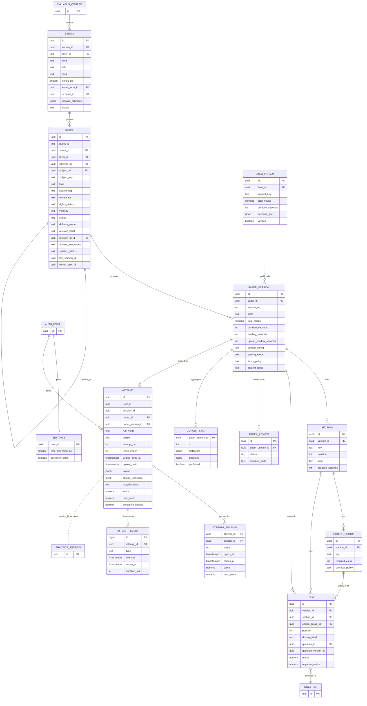
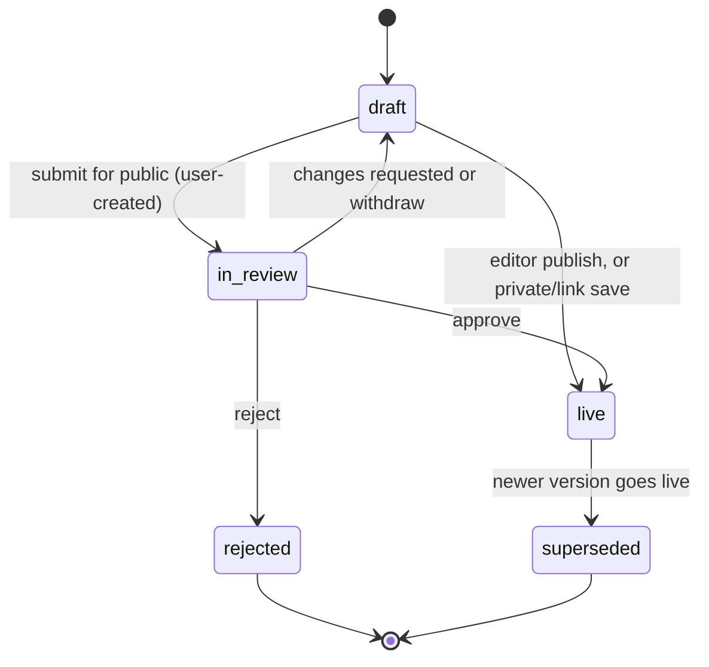
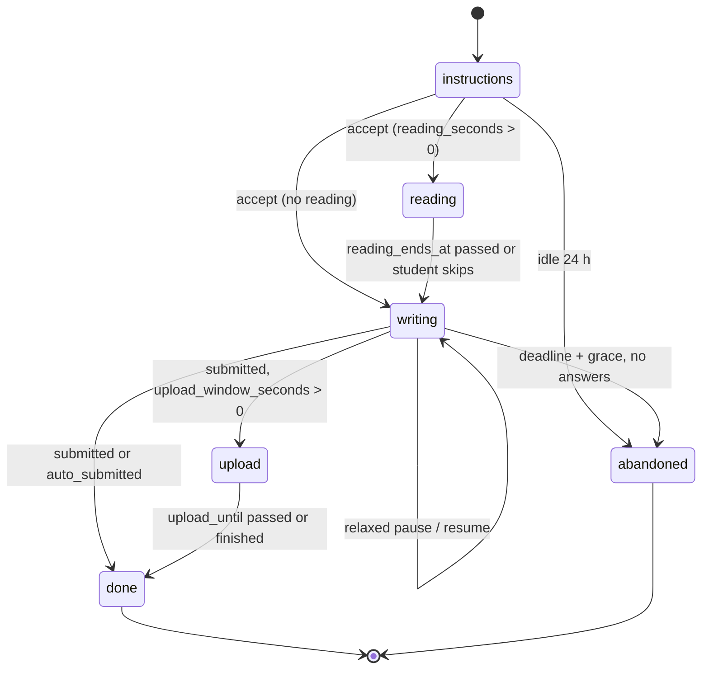
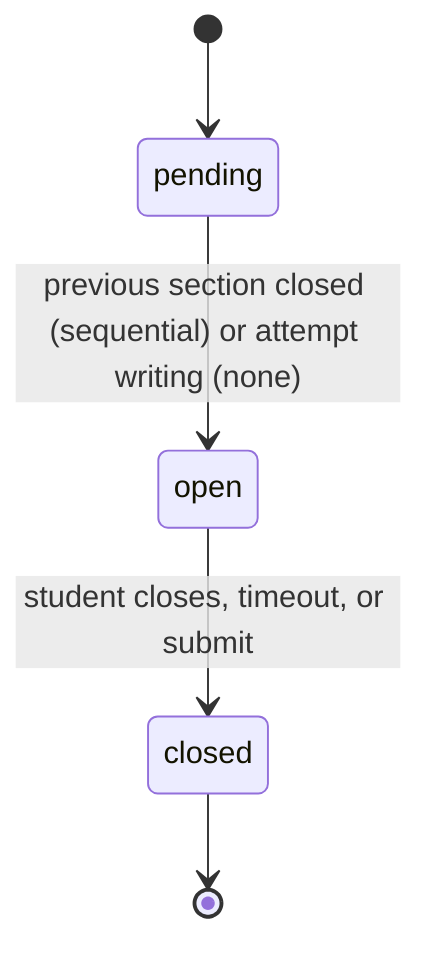

# ERD: F-08 Mock Tests and MTP (paper blueprint and exam attempt)

| Field | Value |
| --- | --- |
| Linked PRD | `docs/product/prd/F-08-mock-tests-and-mtp.md` |
| Django app | `apps/api/modules/mocktest` (tables `mocktest_*`) |
| Web module | `apps/web/src/modules/mocktest` |
| Builds on | `docs/product/erd/F-06-question-bank-system.md` (questions, `practice_session`, scoring, events, jobs, media), `docs/product/erd/F-02-syllabus-structure-and-coverage.md` (course, level, scheme, term, subject, chapter), `docs/product/erd/X-04-ingestion-scraping-service.md` (publisher registry), `docs/product/erd/F-01.2-time-tracker-and-analytics.md` (live-timer registry, auto time) |
| Last updated | 2026-10-05 |

**Reading guide.** Section 0 lists the decisions. Section 2 is the table reference. Section 3 is the contract (interfaces, extension points on F-06, events, behaviour the tests assert). Section 3.6 is the only place this document asks F-06 or F-02 to change; every item there is additive, optional and marked `[PROPOSED EXTENSION]`.

## 0. Design decisions

1. **A paper is a blueprint over F-06 questions; an attempt is an exam-mode F-06 session plus an overlay.** F-08 never stores a question, an option, a key, an answer or a score formula. It stores *structure* (sections, groups, marks, order, rules) and *exam state* (phase, section clocks, lease, events). The answer rows, marks, rollups and the `practice_session_completed` event remain F-06's (F-06 ERD section 3.7).
2. **Every mock, however it arises, is a paper version.** Institute MTPs, supplementary papers, coaching test series, user uploads, platform mocks and builder output all become `mocktest_paperversion` rows with items. The engine has one code path. The builder is a paper factory, not a second engine.
3. **Versions are immutable once live** (same rule as `questionbank_questionversion`). The item row pins `question_version_id` and freezes `marks`; attempts pin `paper_version_id` and freeze a `layout` snapshot. Editing, revising or a takedown never rewrites history.
4. **Server-authoritative time, derived not stored where possible.** The only stored time truths are `practice_session.deadline_at` (F-06) and the attempt's phase timestamps. The phase and the section statuses are computed by one pure function `clock.state_at(attempt, now)` and then materialised under `SELECT ... FOR UPDATE` on the attempt row. No background process is needed for correctness; the tick only finalises attempts nobody opens (F-06 does the same for auto-submit).
5. **Exclusivity by constraint, not by check-then-insert** (audit AUD-006). One live strict exam per student is a partial unique index. One open attempt per paper per student is a partial unique index. One writer per attempt is an epoch compare-and-swap on the attempt row. All are tested on Postgres, not SQLite.
6. **Lifecycle writes lock the attempt row; autosave does not.** Accepting instructions, starting writing, closing a section, pausing, submitting and auto-submitting take `FOR UPDATE` on `mocktest_attempt`. Answer saves read the attempt row without a lock (PK read), check phase, section and epoch, and write through F-06 `save_answer`, which is last-write-wins per question on `client_ts`.
7. **Derived data is written by upsert.** `mocktest_attemptsection` scores and `mocktest_cohortstat` are recomputed by `INSERT ... ON CONFLICT DO UPDATE`, never delete and insert (audit AUD-001, AUD-002).
8. **No new cron.** Background work is `core_job` types dispatched by the existing F-06 tick and worker. Heavy work (cohort refresh, key-release regrade fan-out) is bounded per tick.
9. **Choice rules are resolved at submit, once, and recorded.** The counted set for "answer any N of M" is computed by a pure function from the answers and written to `mocktest_attempt.choice_resolution`; the F-06 grader then excludes the others (`not_counted`). The player never lets that logic live in JSX.
10. **Integrity is information, never punishment.** Events (focus, offline, lease, fullscreen) are logged for the student's review. They never change a score, never submit an attempt, and are never read by another user. They influence exactly one thing: percentile eligibility, through the coarse `integrity_class`.
11. **Percentile is aggregate-only.** `mocktest_cohortstat` holds a histogram and quantiles per paper version, published only above the cohort floor; no row exposes another student's score.
12. **Facts are data.** Exam formats (`mocktest_examformat`), scoring rules (F-06 `practice_scoringrule`) and MTP release schedules are rows with `verified` flags. Nothing about ICAI, ICSI or ICMAI patterns is in code.
13. **Django is the only gateway;** all tables have RLS enabled with no policies; every query is scoped by `user_id` from the JWT; foreign users' attempts return 404.

## 1. Diagrams

### 1.1 Papers and attempts



### 1.2 Paper version lifecycle



The paper row has its own status (`draft`, `in_review`, `live`, `archived`, `taken_down`), independent visibility (`private`, `link`, `public`) and `answer_key_status` (`none`, `partial`, `complete`) that changes without a new paper version because the key lives in question versions.

### 1.3 Attempt phases and section clocks





## 2. Tables

Conventions as in F-01/F-02/F-06: `id uuid PK default gen_random_uuid()`, `created_at`/`updated_at timestamptz default now()`, enums as text plus check constraint, marks as `numeric`, `user_id` is the Supabase uuid by value (no cross-schema FK) and scoped on every query, soft delete with `deleted_at` where it is user data. Table names `mocktest_<model>`.

### 2.1 `mocktest_series`

| Column | Type | Null | Default | Notes |
| --- | --- | --- | --- | --- |
| course_id | uuid | no | | FK `syllabus_course`, restrict |
| level_id | uuid | no | | FK `syllabus_level`, restrict |
| kind | text | no | | `institute_mtp`, `institute_rtp`, `institute_other`, `coaching`, `platform`, `personal` |
| title | text | no | | "MTP Series 1, May 2027" |
| slug | text | no | | Unique `(level_id, slug)` |
| series_no | smallint | yes | | 1, 2 |
| exam_term_id | uuid | yes | | FK `syllabus_examterm` (the attempt the series prepares for) |
| scheme_id | uuid | yes | | FK `syllabus_scheme` |
| issuer | text | no | `''` | ICAI, ICSI, ICMAI, a coaching name, or `Artha` |
| release_schedule | jsonb | no | `[]` | `{"v":1,"items":[{"subject_key":"taxation","paper_release_at":"2027-03-16T09:30:00+05:30","key_due_at":"2027-03-18T09:30:00+05:30"}]}`; editable data, source of "key due by" |
| source_url | text | yes | | Official page, `https://` only |
| provenance_item_id | uuid | yes | | X-04 `ingestion_item.id` by value |
| owner_user_id | uuid | yes | | Set for `personal` series (a student's own grouping) |
| status | text | no | `draft` | `draft`, `live`, `archived` |

Indexes: unique `(level_id, slug)`; `(level_id, status, exam_term_id)`; `(owner_user_id)` where not null.

### 2.2 `mocktest_paper` (identity)

| Column | Type | Null | Default | Notes |
| --- | --- | --- | --- | --- |
| public_id | text | no | | 8-char base32, unique, used in URLs |
| series_id | uuid | yes | | FK `mocktest_series`, set null |
| course_id, level_id | uuid | no | | FK, restrict |
| scheme_id | uuid | no | | FK `syllabus_scheme`: the scheme the paper was written for |
| subject_id | uuid | yes | | FK `syllabus_subject` of that scheme; null for multi-subject mocks |
| subject_key | text | yes | | Stable key copied from the subject so a scheme change can re-point through `syllabus_chaptermap` |
| exam_term_id | uuid | yes | | FK `syllabus_examterm` |
| title | text | no | | |
| slug | text | no | | Unique `(level_id, slug)` where `visibility = 'public'` |
| description | text | no | `''` | Plain text, 500 characters |
| kind | text | no | | `mtp`, `rtp`, `sample`, `mock`, `generated`, `user_upload` |
| source_tag | text | no | | `institute`, `course_bought`, `user`, `platform` (student-facing and the coverage tag) |
| coaching_name | text | no | `''` | Free text for `course_bought`, never shown publicly |
| ownership | text | no | | F-06 values: `platform`, `user_uploaded`, `user_created` |
| rights_status | text | no | `original` | F-06 values |
| visibility | text | no | `private` | `private`, `link`, `public` |
| status | text | no | `draft` | `draft`, `in_review`, `live`, `archived`, `taken_down` |
| delivery_mode | text | no | `native` | `native`, `pdf_companion` |
| revision_label | text | no | `original` | `original`, `revised`, `supplementary` |
| revision_of_id | uuid | yes | | FK self; the paper this one revises |
| released_at | timestamptz | yes | | Official release time (institute) or publish time |
| answer_key_status | text | no | `none` | `none`, `partial`, `complete` (maintained by a service from item questions) |
| key_released_at | timestamptz | yes | | When `complete` was reached |
| syllabus_status | text | no | `unknown` | `current`, `old_scheme`, `amended`, `unknown` (job-maintained) |
| live_version_id | uuid | yes | | FK `mocktest_paperversion` (deferred) |
| owner_user_id | uuid | yes | | Null for platform papers |
| client_id | uuid | yes | | Unique `(owner_user_id, client_id)` where not null |
| origin_module | text | no | `editor` | `editor`, `import_csv`, `ingestion`, `builder`, `user` |
| external_ref | text | yes | | Unique `(origin_module, external_ref)` where not null |
| provenance_item_id, provenance_version_id | uuid | yes | | X-04 by value |
| entitlement_key | text | yes | | Reserved for billing (future), unused |
| needs_attention | boolean | no | false | A question was taken down or flagged |
| attempt_count | int | no | 0 | Batch-updated, not incremented per attempt |
| deleted_at | timestamptz | yes | | Owner delete |

Checks: `visibility = 'public'` implies `status = 'live'` and `live_version_id is not null` and `rights_status in ('original','licensed','institute_material')`; `ownership = 'platform'` implies `owner_user_id is null`; `source_tag = 'institute'` implies `ownership = 'platform'`; `kind = 'generated'` implies `owner_user_id is not null`; `delivery_mode = 'pdf_companion'` implies `rights_status <> 'original'` or an editor flag recorded in the audit log.
Indexes: unique `public_id`; `(level_id, scheme_id, status, released_at desc)` where `visibility = 'public' and status = 'live'` (catalogue); `(series_id, subject_key)`; `(owner_user_id, status, updated_at desc)` (my mocks); `(revision_of_id)`; `(syllabus_status)` where `visibility = 'public'`.

### 2.3 `mocktest_paperversion` (immutable once it leaves draft)

| Column | Type | Null | Default | Notes |
| --- | --- | --- | --- | --- |
| paper_id | uuid | no | | FK cascade within draft only |
| version_no | int | no | | Unique `(paper_id, version_no)` |
| state | text | no | `draft` | `draft`, `in_review`, `live`, `superseded`, `rejected`, `withdrawn` |
| blueprint_schema | smallint | no | 1 | Version of the structure rules |
| total_marks | numeric(7,2) | no | | Counted marks (groups count N items); set at publish |
| duration_seconds | int | no | | Writing time, e.g. 10800 |
| reading_seconds | int | no | 0 | e.g. 900 `[VERIFY]` |
| upload_window_seconds | int | no | 0 | e.g. 1200 for handwritten sections |
| section_timing | text | no | `none` | `none` (one clock), `sequential` (per-section clocks, in order) |
| scoring_mode | text | no | `rule` | `rule` (resolve F-06 `practice_scoringrule`) or `explicit` |
| negative_mode | text | yes | | For `explicit`: `none`, `fraction_of_marks`, `fixed` |
| negative_value | numeric(5,3) | yes | | |
| negative_source_note | text | no | `''` | Required for `explicit` |
| negative_verified | boolean | no | false | `explicit` applies only when true |
| instructions_md | text | no | `''` | Markdown, sanitised like F-06 content, max 6,000 characters |
| allowed_run_modes | text[] | no | `{exam,relaxed}` | |
| relaxed_max_pauses | smallint | no | 3 | |
| relaxed_max_pause_seconds | int | no | 1800 | |
| focus_policy | text | no | `log` | `off`, `log` (never anything else punitive) |
| shuffle_questions | boolean | no | false | Within section, seeded per attempt |
| shuffle_options | boolean | no | false | Passed to F-06 `shuffle_seed` use |
| calculator | text | no | `none` | `none`, `basic` |
| languages | text[] | no | `{en}` | |
| item_count | smallint | no | 0 | |
| content_hash | text | yes | | sha256 of ordered (question_id, marks, section key, group key); duplicate-paper detection |
| generation_spec | jsonb | yes | | Builder spec with `v`, seed and filters, for repeatability |
| created_by | uuid | yes | | |
| published_at | timestamptz | yes | | |

Constraints: `duration_seconds > 0`; `total_marks > 0` when state is not draft; `section_timing = 'sequential'` implies every section has `duration_seconds`; `scoring_mode = 'explicit'` implies `negative_mode` not null and `negative_source_note <> ''`. Partial unique indexes: at most one `live`, one `draft` and one `in_review` per paper. Index `(content_hash)` where state = `live`.

### 2.4 `mocktest_section`

| Column | Type | Null | Default | Notes |
| --- | --- | --- | --- | --- |
| version_id | uuid | no | | FK |
| key | text | no | | `A`, `B`; unique `(version_id, key)`; becomes F-06 `section_label` |
| title | text | no | | "Section A: Case-scenario MCQs" |
| position | smallint | no | | Order |
| kind | text | no | | `objective`, `descriptive`, `mixed` |
| duration_seconds | int | yes | | Only with `sequential` timing |
| instructions_md | text | no | `''` | |
| marks_total | numeric(7,2) | no | | Counted marks, set at publish |

### 2.5 `mocktest_choicegroup`

| Column | Type | Null | Default | Notes |
| --- | --- | --- | --- | --- |
| section_id | uuid | no | | FK |
| key | text | no | | `B-choice-1`; unique `(section_id, key)` |
| label | text | no | | "Answer any 4 of the following 6" |
| required_count | smallint | no | | N |
| overflow_policy | text | no | `block` | `block` (refuse the N+1th), `first_n` (first N in paper order count), `best_n` (best N count) |
| position | smallint | no | | |

Checks: `required_count >= 1`. Service rule (validator): items in a group have equal `marks` and `negative_marks`, and `count(items) > required_count`.

### 2.6 `mocktest_item`

| Column | Type | Null | Default | Notes |
| --- | --- | --- | --- | --- |
| version_id | uuid | no | | FK |
| section_id | uuid | no | | FK |
| choice_group_id | uuid | yes | | FK, set null only in drafts |
| position | smallint | no | | 1-based paper order; unique `(version_id, position)` |
| display_label | text | no | | "Q.4(b)", "5" |
| question_id | uuid | no | | FK `questionbank_question`, restrict (questions are never hard-deleted; reads only through `questionbank.selectors`) |
| question_version_id | uuid | no | | Pinned live version at publish time (by value) |
| marks | numeric(6,2) | no | | Frozen; overrides the version's marks |
| negative_marks | numeric(5,2) | yes | | Null = rule decides |
| suggested_seconds | int | yes | | Defaults to `marks x duration / total_marks` at publish |

Indexes: `(version_id, position)` unique; `(question_id)` (which papers contain a question, F-09/F-11); `(section_id, position)`. Case-study parents are single items; their children expand into extra session positions at attempt start (the layout snapshot records it).

### 2.7 `mocktest_examformat` (reference data, never hard-coded in code)

| Column | Type | Null | Default | Notes |
| --- | --- | --- | --- | --- |
| course_id, level_id | uuid | no | | FK |
| subject_key | text | yes | | Null = all papers of the level |
| name | text | no | | "CMA Intermediate paper: 30 objective + 70 descriptive" |
| effective_from / effective_to | date | no / yes | | |
| total_marks | numeric(7,2) | no | | |
| duration_seconds | int | no | | |
| reading_seconds | int | no | 0 | |
| sections_spec | jsonb | no | | `{"v":1,"sections":[{"key":"A","title":"Objective","kind":"objective","marks":30,"count":15,"marks_each":2},{"key":"B","title":"Descriptive","kind":"descriptive","marks":70,"choice":{"any":4,"of":6}}]}`; validated by a pydantic schema |
| minutes_per_mark | numeric(4,2) | yes | | Derived hint for the builder |
| scoring_rule_ref | uuid | yes | | Optional pointer to a `practice_scoringrule` id, display only (resolution stays F-06's) |
| status | text | no | `draft` | `draft`, `active`, `retired` |
| verified | boolean | no | false | Only verified formats are the default preset |
| source_note, source_url | text | no / yes | `''` | The Institute notice used |
| verified_by, verified_at | uuid, timestamptz | yes | | |

Seed (migration `0003_seed_formats`): draft, unverified rows for CA Foundation (objective and descriptive papers), CA Intermediate (70 + 30), CA Final (`[VERIFY]` sources conflict), CMA Foundation (50 x 2), CMA Intermediate and Final (30 + 70), CSEET (June 2026 pattern). CS Executive and Professional are intentionally absent (`[VERIFY]`, no reliable source found).

### 2.8 `mocktest_paperreview` (paper-level moderation; reuses F-06 reviews for the questions)

| Column | Type | Null | Default | Notes |
| --- | --- | --- | --- | --- |
| paper_version_id | uuid | no | | FK |
| status | text | no | `pending` | `pending`, `claimed`, `approved`, `changes_requested`, `rejected`, `withdrawn` |
| item_review_ids | uuid[] | no | `{}` | The F-06 `questionbank_review` ids created for items (by value) |
| auto_checks | jsonb | no | `{}` | Validator output, duplicate-paper match, key completeness |
| reviewer_id | uuid | yes | | |
| decision_code | text | yes | | F-06 decision codes (`ok`, `wrong_answer`, `duplicate`, `copyright`, `low_quality`, `other`) |
| note | text | no | `''` | |
| submitted_at, decided_at | timestamptz | no / yes | now() / | |

Rule: approve is allowed only when every F-06 review in `item_review_ids` is approved (checked through `questionbank.selectors`), so a paper never goes public ahead of its questions. Index `(status, submitted_at)` where `status in ('pending','claimed')`.

### 2.9 `mocktest_attempt`

One row per exam attempt; 1:1 with a `practice_session`.

| Column | Type | Null | Default | Notes |
| --- | --- | --- | --- | --- |
| user_id | uuid | no | | Scoped on every query |
| client_id | uuid | no | | Unique `(user_id, client_id)` (idempotent start) |
| session_id | uuid | no | | `practice_session.id` by value, unique |
| paper_id | uuid | no | | FK |
| paper_version_id | uuid | no | | FK, the pinned version |
| attempt_no | smallint | no | | nth attempt of this paper by this student (1 = first); decides percentile eligibility |
| run_mode | text | no | | `exam` (F-06 mode `exam`) or `relaxed` (F-06 mode `timed`) |
| section_scope | text | yes | | Section key for "attempt one section"; null = full paper |
| delivery_mode | text | no | `native` | Copy |
| phase | text | no | `instructions` | `instructions`, `reading`, `writing`, `upload`, `done`, `abandoned` |
| instructions_accepted_at | timestamptz | yes | | |
| reading_started_at, reading_ends_at | timestamptz | yes | | |
| writing_started_at | timestamptz | yes | | The moment the F-06 session was started |
| writing_ends_at | timestamptz | yes | | Copy of `session.deadline_at`, rewritten with it on relaxed resume, so reads need no join |
| upload_until | timestamptz | yes | | `writing_ends_at + upload_window` (null if none), pushed to the actual submit time plus the window if submitted early |
| extra_seconds | int | no | 0 | Accommodation, frozen at start |
| time_extension_pct | smallint | no | 0 | Frozen from settings |
| pause_count | smallint | no | 0 | Relaxed |
| paused_seconds | int | no | 0 | Relaxed |
| lease_epoch | int | no | 0 | Compare-and-swap counter |
| lease_tab_id | text | yes | | Client generated per tab |
| lease_label | text | no | `''` | "Chrome on Android" (no IP, no fingerprint) |
| lease_expires_at | timestamptz | yes | | Renewed by heartbeat, 90 s |
| last_position | smallint | yes | | Resume position |
| last_section_key | text | yes | | |
| last_heartbeat_at | timestamptz | yes | | |
| layout | jsonb | no | | Frozen: `{"v":1,"items":[{"pos":1,"item_id":"...","section":"A","group":null,"label":"1","child_of":null}]}` mapping session positions to paper items (case-study children included) |
| choice_resolution | jsonb | no | `{}` | At submit: `{"v":1,"groups":{"B-choice-1":{"counted":[21,22,23,25],"not_counted":[24,26],"empty_slots":[]}}}` |
| focus_lost_count | int | no | 0 | Counters from events (also derivable from the log) |
| focus_lost_seconds | int | no | 0 | |
| offline_seconds | int | no | 0 | |
| fullscreen_exit_count | smallint | no | 0 | |
| max_write_lag_ms | int | no | 0 | Largest `received_at - client_ts` among accepted writes |
| replay_flagged | boolean | no | false | A write claimed an implausibly old time |
| integrity_class | text | yes | | Set at completion: `clean`, `relaxed`, `extended`, `section_scope`, `retake`, `replay_flagged` |
| completion | text | yes | | `submitted`, `auto_submitted`, `abandoned_partial` |
| completed_at | timestamptz | yes | | |
| time_used_seconds | int | yes | | Wall-clock from writing start to submit, minus relaxed pauses, capped at the limit |
| score, max_score | numeric(7,2) | yes | | Copy from the session at completion |
| percent | numeric(5,2) | yes | | `100 * score / max_score`, one decimal for display |
| comparable_score, comparable_max | numeric(7,2) | yes | | Excludes self-graded and pending marks (percentile and compare) |
| score_status | text | yes | | Copy: `final`, `provisional` |
| percentile_eligible | boolean | no | false | Set at completion by rule 3.5.7 |
| share_anonymous | boolean | no | false | Consent snapshot at completion |
| rev | int | no | 0 | Optimistic counter for lifecycle changes |
| deleted_at | timestamptz | yes | | User history cleanup |

Constraints and indexes (these are the concurrency guarantees):

- Unique `(user_id, client_id)`; unique `(session_id)`.
- **One live strict exam per student:** unique `(user_id)` where `run_mode = 'exam' and phase in ('reading','writing','upload') and deleted_at is null`.
- **One open attempt per paper per student:** unique `(user_id, paper_id)` where `phase in ('instructions','reading','writing','upload') and section_scope is null and deleted_at is null`.
- Check `phase = 'done'` implies `completed_at is not null`; `run_mode = 'exam'` implies `section_scope is null or integrity_class = 'section_scope'`.
- `(user_id, completed_at desc)` where `completed_at is not null` (history); `(user_id, paper_id, attempt_no)` (compare); `(paper_version_id, percent)` where `percentile_eligible` (cohort job); `(phase, writing_ends_at)` where `phase in ('reading','writing','upload')` (sweeper); `(phase, created_at)` where `phase = 'instructions'` (abandon sweep).

### 2.10 `mocktest_attemptsection`

| Column | Type | Null | Default | Notes |
| --- | --- | --- | --- | --- |
| attempt_id | uuid | no | | FK cascade; PK part |
| section_id | uuid | no | | FK; PK part |
| position | smallint | no | | |
| status | text | no | `pending` | `pending`, `open`, `closed` |
| opens_at, closes_at | timestamptz | yes | | `closes_at` is the section deadline for `sequential` timing, else the attempt deadline |
| closed_at | timestamptz | yes | | |
| closed_by | text | yes | | `student`, `timeout`, `submit` |
| score, max_score | numeric(7,2) | yes | | Upserted at submit and on regrade |
| answered, correct, incorrect, skipped, not_counted | smallint | no | 0 | |
| time_spent_seconds | int | no | 0 | Sum of per-answer time deltas in the section (capped by wall-clock) |

Index: PK `(attempt_id, section_id)`; `(attempt_id, position)`.

### 2.11 `mocktest_attemptevent` (client-observed events, owner-only)

| Column | Type | Null | Default | Notes |
| --- | --- | --- | --- | --- |
| id | bigint | no | identity | PK |
| attempt_id | uuid | no | | FK cascade |
| user_id | uuid | no | | Denormalised for deletion and export |
| type | text | no | | `focus_lost`, `focus_regained`, `fullscreen_exit`, `offline`, `online`, `resumed`, `lease_taken`, `lease_lost`, `section_closed`, `phase_changed`, `extension_applied`, `write_dropped`, `reading_skipped` |
| client_ts | timestamptz | yes | | Corrected by the client offset |
| server_ts | timestamptz | no | now() | Authority |
| duration_ms | int | yes | | For paired events (away time) |
| position | smallint | yes | | Question being viewed |
| meta | jsonb | no | `{}` | Small, no text: reason codes only (max 200 bytes) |

Cap 500 rows per attempt (service rule; counters keep incrementing). Index `(attempt_id, server_ts)`. Retention 12 months (`mocktest.events_prune` job, batch delete by `server_ts`). Not partitioned: year-3 volume is about 3 million rows per month, deleted in bounded batches.

### 2.12 `mocktest_cohortstat` (aggregate, the only percentile store)

| Column | Type | Null | Default | Notes |
| --- | --- | --- | --- | --- |
| paper_version_id | uuid | no | | PK, FK |
| n | int | no | 0 | Eligible attempts counted in this snapshot |
| histogram | jsonb | no | `{}` | `{"v":1,"bin_pct":2,"counts":[...50 ints]}` over comparable percent 0 to 100 |
| quantiles | jsonb | no | `{}` | `{"v":1,"p":[5,10,...,95],"values":[...]}` |
| mean, stddev | numeric(5,2) | yes | | |
| published | boolean | no | false | `n >= floor`; the API never serves a cohort with `published = false` |
| floor | smallint | no | 30 | Copy of `MOCKTEST_MIN_COHORT` at compute time |
| computed_at | timestamptz | no | now() | |
| last_new_count | int | no | 0 | New eligible attempts since the previous publish (batching rule) |

Written only by `mocktest.cohort` through `INSERT ... ON CONFLICT (paper_version_id) DO UPDATE`; never per-attempt.

### 2.13 `mocktest_settings`

| Column | Type | Null | Default | Notes |
| --- | --- | --- | --- | --- |
| user_id | uuid | no | | PK |
| time_extension_pct | smallint | no | 0 | 0, 10, 25, 50 or 100; self-declared; never logged to analytics or shown to others |
| default_run_mode | text | no | `relaxed` | |
| focus_reminders | boolean | no | false | Opt-in gentle reminder when returning |
| keyboard_shortcuts | boolean | no | true | |
| text_size | smallint | no | 0 | 0, 1, 2 (shared semantics with practice settings) |
| percentile_optin | boolean | yes | | Null = not asked yet |
| percentile_consent_at | timestamptz | yes | | |
| percentile_consent_version | text | yes | | Terms version |
| tz | text | no | `Asia/Kolkata` | |

### 2.14 `mocktest_auditlog`

`id`, `actor_id`, `action` (`paper_publish`, `paper_revise`, `key_release`, `takedown`, `format_verify`, `rule_link_change`, `retake_grant`, `rights_change`), `target_type`, `target_id`, `meta jsonb` (ids and codes, no content), `created_at`. Index `(target_type, target_id, created_at desc)`.

## 3. Relationships to other modules and the contract

### 3.1 Foreign keys and by-value references

| From | To | Rule |
| --- | --- | --- |
| `mocktest_series`, `_paper`, `_examformat` (course, level, scheme, term, subject) | `syllabus_*` | Real FKs, restrict. Reads through `syllabus.selectors` (the audit AUD-005 fix: no foreign model queries); writes never |
| `mocktest_item.question_id` | `questionbank_question` | Real FK, restrict. Reads through `questionbank.selectors` only. `question_version_id` by value (immutable versions) |
| `mocktest_attempt.session_id` | `practice_session` | By value, unique. A nightly integrity job reports orphans in both directions. Deleted by `delete_all_for_user` in a fixed order (attempts, then `practice`) |
| `mocktest_paper.provenance_*`, `mocktest_series.provenance_item_id` | `ingestion_item`, `ingestion_itemversion` | By value now, FK when X-04 migrations exist |
| all `user_id`, `owner_user_id`, `reviewer_id`, `created_by`, `actor_id` | `auth.users.id` | By value, scoped on every query |
| `mocktest_paperreview.item_review_ids` | `questionbank_review` | By value (array), checked through `questionbank.selectors` |

Dependency direction (no cycles): `mocktest -> practice -> questionbank -> syllabus`; `mocktest -> questionbank, media, core.events, core.jobs`; `coverage`, `tracking`, F-10, X-03, F-11 consume `mocktest` through events or its selectors only. `practice` and `questionbank` never import `mocktest`; they call hooks it registered (3.3).

### 3.2 Public service and selector interfaces (the contract)

```python
# ---- mocktest/selectors.py (read only) -------------------------------------------------------------------
class PaperFilter(TypedDict, total=False):   # "PaperFilter v1"
    course: str; level: str; subject_key: str; group: str; series: str; term_code: str
    source_tags: list[str]; kinds: list[str]; scheme: Literal["current", "any"]       # default "current"
    key: Literal["complete", "any"]; state: Literal["new", "in_progress", "attempted", "not_attempted"]  # needs viewer
    scope: Literal["public", "mine"]; q: str
def list_papers(viewer_id: UUID | None, flt: PaperFilter, *, order: str = "newest", cursor: str | None = None, limit: int = 20) -> Page[PaperCard]
def get_paper(viewer_id: UUID | None, paper_id_or_public_id: str, *, version_no: int | None = None) -> PaperView   # blueprint, key status, my attempts
def can_view_paper(viewer_id: UUID | None, paper_id: UUID, *, token: str | None = None) -> bool
def papers_containing_question(question_ids: Sequence[UUID]) -> dict[UUID, list[PaperRef]]      # F-09, F-11
def chapter_marks_for_papers(paper_ids: Sequence[UUID]) -> list[ChapterMarks]                    # marks per chapter per paper, for F-11
def attempt_state(user_id: UUID, attempt_id: UUID) -> AttemptState        # phase, clock, sections, lease, flags; may materialise transitions
def list_attempts(user_id: UUID, *, status: str | None = None, paper_id: UUID | None = None, cursor=None, limit=20) -> Page[AttemptRow]
def result(user_id: UUID, attempt_id: UUID) -> AttemptResult
def review(user_id: UUID, attempt_id: UUID, *, filter: str | None = None) -> MockReview   # practice.selectors.review_payload + time, layout, choices
def compare_attempts(user_id: UUID, *, attempt_ids: Sequence[UUID] | None = None, paper_id: UUID | None = None, subject_key: str | None = None) -> Comparison
def percentile_for(user_id: UUID, attempt_id: UUID) -> PercentileView          # hidden | unavailable(reason) | band | percentile
def attempt_summaries(user_id: UUID, *, since: datetime, until: datetime) -> list[AttemptSummary]   # F-10
def release_calendar(level_id: UUID, *, days: int = 14) -> list[ReleaseRow]

# ---- mocktest/services.py (writes; actor-checked) --------------------------------------------------------
def create_paper_draft(actor_id: UUID, payload: MockPaperPayload, *, client_id: UUID | None) -> Paper
def set_blueprint(actor_id: UUID, version_id: UUID, blueprint: BlueprintIn) -> ValidationReport     # sections, groups, items
def validate_blueprint(version_id: UUID) -> ValidationReport                                         # pure core in domain/blueprint.py
def publish_version(editor_id: UUID, version_id: UUID, *, visibility: str = "public") -> PaperVersion   # emits mock_paper_published
def save_live(actor_id: UUID, paper_id: UUID, visibility: Literal["private", "link"]) -> PaperVersion
def submit_for_review(actor_id: UUID, paper_id: UUID) -> PaperReview      # raises ChecksFailed(list); creates F-06 reviews for items
def decide_review(editor_id: UUID, review_id: UUID, decision: str, *, code: str, note: str = "") -> PaperReview
def revise_paper(editor_id: UUID, paper_id: UUID, *, label: Literal["revised", "supplementary"]) -> PaperVersion
def release_key(editor_id: UUID, paper_id: UUID, *, question_version_ids: Mapping[UUID, UUID]) -> KeyRelease   # emits mock_key_released, enqueues mocktest.key_regrade
def upsert_paper_from_source(*, origin_module: str, external_ref: str, payload: MockPaperPayload, rights_status: str, actor_id: UUID | None,
                             provenance: Provenance | None = None, auto_publish: bool = False) -> UpsertResult   # X-04 publisher, CSV import; idempotent
def generate_paper(user_id: UUID, spec: BuilderSpec, *, client_id: UUID, start: bool = False, run_mode: str = "relaxed") -> GeneratedPaper
def preview_blueprint_fill(user_id: UUID, spec: BuilderSpec) -> FillPreview
def start_attempt(user_id: UUID, paper_id: UUID, *, version_id: UUID | None = None, run_mode: str, section_scope: str | None = None,
                  client_id: UUID, tz: str = "Asia/Kolkata", stop_timer: bool = False) -> AttemptStarted
    # one transaction: checks exclusivity (the unique indexes are the arbiter), creates the session via practice.services.create_session_from_items,
    # attempt, attemptsections, layout snapshot. Raises ExamInProgress(attempt_id), TimerRunning, PaperNotAvailable, TooManyOpenSessions.
def accept_instructions(user_id: UUID, attempt_id: UUID) -> AttemptState        # idempotent; starts reading or writing (and the F-06 session clock)
def start_writing(user_id: UUID, attempt_id: UUID) -> AttemptState             # skip the rest of reading
def acquire_lease(user_id: UUID, attempt_id: UUID, *, tab_id: str, label: str, takeover: bool) -> Lease   # CAS on lease_epoch
def heartbeat(user_id: UUID, attempt_id: UUID, *, epoch: int, position: int | None, section: str | None, events: Sequence[ClientEvent]) -> ClockState
def save_answers(user_id: UUID, attempt_id: UUID, *, epoch: int, items: Sequence[AnswerWrite]) -> list[AnswerResult]   # bulk, <= 100
def close_section(user_id: UUID, attempt_id: UUID, section_key: str, *, epoch: int) -> AttemptState
def pause_attempt(...); resume_attempt(...)                                     # relaxed only
def submit_attempt(user_id: UUID, attempt_id: UUID, *, epoch: int | None, auto: bool = False) -> AttemptResult   # idempotent
def attach_pages(user_id: UUID, attempt_id: UUID, *, epoch: int, position: int, attachment_ids: Sequence[UUID]) -> None   # inside the upload window
def retake(user_id: UUID, attempt_id: UUID, scope: Literal["all", "wrong", "unattempted", "flagged"], *, run_mode: str, client_id: UUID) -> AttemptStarted
def set_settings(user_id: UUID, patch: dict) -> Settings
def grant_retake(admin_id: UUID, attempt_id: UUID, *, reason: str) -> None     # support tool, audited, never edits a score
def delete_all_for_user(user_id: UUID) -> DeleteReport; def export_for_user(user_id: UUID) -> dict
```

All service functions that mutate an attempt take the attempt row with `select_for_update` first (except `save_answers`, section 0 item 6). Errors use the shared hierarchy proposed in the audit (`core.errors`), codes in PRD section 9.

### 3.3 Registrations (extension points)

Done in `MocktestConfig.ready()`:

| Registry | Registration |
| --- | --- |
| `practice.registry.register_origin("mtp", spec)` and `("mock", spec)` | `OriginSpec(validate_spec, allowed_modes=['exam','timed'], default_feedback_policy='never_until_submit', unique_per_user=False, on_completed=mocktest.subscribers.enrich, title_for=...)` plus the four hook fields of 3.6. `mtp` is used for `source_tag='institute'`, `mock` for the other tags |
| `practice.registry.register_picker("mock_blueprint", fn, description=...)` | The builder fill algorithm (3.5.6). Also usable by Today and F-10 to make exam-shaped practice sets |
| `tracking.services.register_live_timer_provider(fn)` | `fn(user_id) -> str \| None` returns "Mock exam in progress: {paper title}" while a strict exam is live (phase `reading`, `writing` or `upload`) or a relaxed attempt is in `writing` and not paused |
| `ingestion.registry.register_publisher("mock_paper", MockPaperPublisher)` | `publish(item_version) -> target_id`, `withdraw(target_id)`; calls `upsert_paper_from_source`. Registers once X-04 exists; until then absent (no import-time dependency) |
| `questionbank.registry.register_importer("csv_mock", spec)` | A thin wrapper over the F-06 CSV importer adding `section`, `label`, `marks`, `group`, `negative` columns |
| `core.events.register_subscriber("practice_session_completed", "mocktest.enrich", fn, mode="inline")` | Produces `mock_attempt_completed` for sessions whose origin is `mtp` or `mock` |
| `core.events.register_subscriber("question_taken_down", "mocktest.takedown", fn, mode="deferred")` and `question_version_live` | Sets `needs_attention`, recomputes `answer_key_status` |
| `core.jobs` types | `mocktest.phase_sweep`, `mocktest.cohort`, `mocktest.key_regrade`, `mocktest.syllabus_status`, `mocktest.events_prune`, `mocktest.integrity_check`, `mocktest.abandon_sweep` |
| F-02 `coverage` | `coverage/subscribers.py` subscribes to `mock_attempt_completed` (3.4) |
| F-07 | Registers an evaluator in `practice.registry`; no F-08 change |

### 3.4 Domain events

Same envelope and delivery as F-06 section 3.4. Names are `noun_verb`; schemas in `apps/api/core/event_schemas/<name>.v1.json`.

| Event | Emitted when | Payload (key fields) | Consumers |
| --- | --- | --- | --- |
| `mock_attempt_started` | `start_attempt` commits | `attempt_id`, `paper_id`, `paper_version_id`, `run_mode`, `source_tag`, `kind`, `duration_seconds` | analytics, X-03 |
| `mock_attempt_completed` | enrichment subscriber on `practice_session_completed` | below | coverage, F-10, X-03, X-01, F-11 |
| `mock_paper_published` | version goes live | `paper_id`, `series_id`, `level_id`, `scheme_id`, `subject_key`, `source_tag`, `kind`, `released_at` | X-01, search cache |
| `mock_paper_revised` | a revised or supplementary version goes live | `paper_id`, `previous_version_id`, `version_id`, `label` | X-01 |
| `mock_key_released` | `release_key` | `paper_id`, `answer_key_status`, `question_version_ids[]`, `affected_attempts` | X-01, F-10 |
| `mock_paper_unpublished` | unpublish or takedown | `paper_id`, `reason`, `open_attempts` | CDN purge, X-01 |

`mock_attempt_completed` payload v1:

```json
{
  "attempt_id": "uuid", "session_id": "uuid", "paper_id": "uuid", "paper_version_id": "uuid", "series_id": "uuid|null",
  "source_tag": "institute", "kind": "mtp", "run_mode": "exam", "integrity_class": "clean", "completion": "submitted",
  "scheme_id": "uuid", "subject_key": "taxation", "tz": "Asia/Kolkata", "local_date": "2026-10-05",
  "started_at": "...", "ended_at": "...", "time_used_seconds": 9650,
  "score": 62.5, "max_score": 100, "score_status": "provisional", "comparable_score": 24, "comparable_max": 30,
  "answer_key_status": "complete", "attempt_no": 1,
  "section_scores": [{"key": "A", "score": 24, "max": 30, "answered": 14, "time_seconds": 2400}],
  "by_chapter": [{"chapter_id": "uuid", "chapter_key": "gst-itc", "subject_id": "uuid", "subject_key": "taxation", "answered": 8, "marks": 14.5, "max_marks": 20, "seconds": 1100}]
}
```

How the first consumers use it:

| Subscriber | Rule |
| --- | --- |
| Coverage (F-02), inline | For each `by_chapter` row with `answered >= 5` (`PRACTICE_MIN_ANSWERED`), only when `answer_key_status != 'none'` or the answers were self-graded: record `mock_done` with `value = round(100 * marks / max_marks)`, `source='mock'`, `source_ref=paper_id`, `source_tag` (3.6, `[PROPOSED EXTENSION to F-02]`), and **`client_id = uuid5(user_id, paper_id + ':' + chapter_id + ':mock')`** so retakes of the same paper never add another mock to `mock_count`. Section-scope attempts and attempts of papers for a retired scheme without a `syllabus_chaptermap` mapping record nothing. Regrades re-emit nothing |
| Tracker (F-01.2), deferred | Via the F-06 subscriber, but `active_seconds` for these origins is `time_used_seconds` (hook `active_seconds`, 3.6). Opt-in auto capture only; skipped when a live timer overlaps; never forwarded to coverage |
| Analytics (F-10), deferred | `attempt_summaries` and the rollups |
| X-01 | `mock_key_released`, `mock_paper_published`, `mock_paper_revised` |

### 3.5 Behavioural reference (what the tests assert)

**3.5.1 Clock and phases (`mocktest.domain.clock`, pure).** `state_at(attempt, session, sections, now) -> State` returns the phase, the active section, remaining milliseconds for the paper and the section, and which transitions are due. Rules:

```
reading:   now < reading_ends_at                  (reading_ends_at = accepted_at + reading_seconds)
writing:   session started; now <= writing_ends_at
           writing_ends_at = writing_started_at + (duration_seconds + extra_seconds) + paused_seconds     (relaxed pauses extend it)
closed for writes:  now > writing_ends_at + GRACE (120 s, F-06)  -> auto-submit due
upload:    submitted_at (or writing_ends_at) <= now <= upload_until
section i (sequential): opens_at = previous closed_at (or writing_started_at); closes_at = opens_at + section.duration (+ extra share)
           unused section time does not carry over
```

`extra_seconds = ceil(duration_seconds * time_extension_pct / 100)`, shared proportionally across sections in sequential timing. Reading time is never extended. The function is the only code that decides a phase; services call it, compare with the stored phase and write the difference under the attempt lock.

**3.5.2 Client countdown.** The server returns `server_time`, `remaining_ms`, `section_remaining_ms` with every state, clock, heartbeat and bulk-save response. The client keeps `anchor = performance.now()` at response receipt and `remaining_at_anchor`; display = `remaining_at_anchor - (performance.now() - anchor)`. RTT correction: `remaining_at_anchor -= rtt/2` using the request's own round trip. A heartbeat updates the anchor; differences under 1 s are slewed over 5 s, larger ones snap with a polite message. `Date.now()` is used only to compute `offset = server_time - (client_time_at_receipt)` for stamping writes: `client_ts = Date.now() + offset`. Changing the device clock mid-exam changes neither the countdown nor (after the next response) the stamped time. Background tabs throttle timers, so display is recomputed from `performance.now()` on each `visibilitychange`, not by counting ticks.

**3.5.3 Lease (single writer).** `acquire_lease(takeover=False)` succeeds when `lease_tab_id is null` or equals the caller or `lease_expires_at < now`; otherwise 409 `lease_held` with `lease_label`. `takeover=True` always succeeds. Both execute `UPDATE mocktest_attempt SET lease_epoch = lease_epoch + 1, lease_tab_id = :t, lease_label = :l, lease_expires_at = now() + 90 s WHERE id = :id AND user_id = :u RETURNING lease_epoch` (one statement, atomic). Every write carries the epoch; `epoch != lease_epoch` returns 409 `lease_lost` with the holder label and **no answer is written**. Heartbeat (30 s) with the current epoch extends `lease_expires_at`; with a stale epoch it returns `lease_lost` so the old tab turns read-only within one beat (the client also uses a `BroadcastChannel` for same-browser tabs, instantly). Epoch zero is never valid for writes. A takeover emits `lease_taken` and `lease_lost` events.

**3.5.4 Autosave and replay.** `save_answers` per item: (1) phase must be `writing` (or `reading` rejected `reading_phase`, `upload` rejected `attempt_closed` unless `attach_pages`); (2) the item's section must be `open`, or `closed` with `client_ts <= closes_at + SECTION_GRACE (15 s)` for sequential sections; (3) choice group `block` policy: reject `choice_limit_reached` when the item is not yet answered and N others are; (4) call `practice.services.save_answer` with the corrected `client_ts` (F-06 applies last-write-wins and the 120 s grace). The result per item is one of `saved`, `dropped_late`, `section_closed`, `reading_phase`, `choice_limit_reached`, `invalid`. `max_write_lag_ms` is updated; a lag over 300 000 ms (5 minutes) accepted within grace sets `replay_flagged` (informational, percentile only).

**3.5.5 Choice resolution (`domain/choice.resolve`, pure).** Input: groups with `required_count`, `overflow_policy`, the answered items with `answered_at` and (for `best_n`) their marks, the unanswered items. Output per group:
- Answered count k <= N: all answered are counted; N-k "empty slots" are taken from the unanswered items with the lowest positions (they count as skipped, so the group's maximum stays N x marks); the rest are `not_counted`.
- k > N: `block` cannot happen unless written before the policy applied (then treat as `first_n`); `first_n` counts the first N by paper position; `best_n` counts the N with the highest marks awarded (ties by position).
The result is stored in `choice_resolution` and passed to F-06 through `before_submit` as exclusions: excluded answers get `result='not_counted'`, `marks_awarded=0`, and are removed from `max_score` (so a paper's maximum equals `total_marks`).

**3.5.6 Builder fill (`domain/generator.fill`, pure, deterministic by seed).** Input: a format skeleton (sections with marks and kinds), a chapter weight map, candidate questions with marks, difficulty, kind, personal state, a target marks tolerance (default plus or minus 2), a difficulty mix, flags `prefer_unattempted`, `prefer_weak`. Steps: (1) chapter marks budget = `target * w_c / sum(w)`, weights from `syllabus_chapter` marks (`(marks_min + marks_max)/2`, else 1), later F-11; (2) per section, per chapter, select candidates ordered by `md5(id || seed)` after personal preferences, respecting difficulty quotas; (3) bounded dynamic programming per section to hit the section marks exactly or within tolerance (subset-sum over at most 60 candidates); (4) report `shortfalls[{chapter_id, wanted, got}]`; (5) if filled marks < 60% of target, raise `NotEnoughQuestions`. Output: ordered `ItemSpec` list with `section_label`. `preview_blueprint_fill` runs steps 1 to 4 on ids only.

**3.5.7 Integrity class and percentile eligibility.**

```
integrity_class (at completion, first match):
  section_scope is not null                     -> section_scope
  run_mode = relaxed                            -> relaxed
  time_extension_pct > 0                        -> extended
  attempt_no > 1                                -> retake
  replay_flagged                                -> replay_flagged
  otherwise                                     -> clean
percentile_eligible = integrity_class = 'clean' and share_anonymous and paper.visibility in ('public','link')
                      and score_status = 'final' or all graded marks are auto-graded for the comparable part
```

Comparable score = marks from auto-graded answers only; comparable max = their maximum (self-graded and AI-estimated marks are excluded). Cohort bins use `100 * comparable_score / comparable_max`. Percentile for a student = `100 * (count_below + 0.5 * count_equal) / n` over the histogram, read from the snapshot, never recomputed per request. Display rule: `n < floor` hidden with text "Not enough students yet"; `floor <= n < 100` quartile band; `n >= 100` integer percentile. Cohort refresh only when `last_new_count >= 5` or the snapshot is older than 1 hour and any new attempt exists, so no single new submission changes a published snapshot visibly (differencing attack). Not consented, not eligible: the student sees "Take it in exam mode to compare" or the consent prompt, never the number.

**3.5.8 Submit.** `submit_attempt` locks the attempt row, calls `clock.state_at`, runs `choice.resolve`, calls `practice.services.submit_session(auto=...)` (idempotent), upserts `mocktest_attemptsection` rows, copies score fields, computes `integrity_class` and `percentile_eligible`, sets `phase = 'upload'` or `'done'`, and commits; the F-06 event and `mock_attempt_completed` follow through the outbox. A second call returns the same result. The tick (`phase_sweep`) auto-submits attempts past `writing_ends_at + GRACE` and moves `upload` to `done` after `upload_until`; opening an attempt does the same lazily.

**3.5.9 Key release and regrade.** `release_key` links new question versions (`upsert_from_source`, `change_kind='import_update'` or `key_fix`), updates `answer_key_status`, enqueues `mocktest.key_regrade`, which calls `practice.services.regrade_question(system_actor, question_id, from_version_id, to_version_id, notify=False)` per item in batches within the tick budget; after F-06 regrades, F-08 re-upserts `mocktest_attemptsection` and attempt score copies from the session and emits `mock_key_released` with `affected_attempts`. A key correction after release goes through the same path.

**3.5.10 Pause (relaxed).** Allowed only in `writing`; calls `practice.services.pause_session`; counts `pause_count` and `paused_seconds`; refused above `relaxed_max_pauses` or total `relaxed_max_pause_seconds`; resume extends `writing_ends_at` by the paused duration (also the F-06 `deadline_at`). Auto-resume after the remaining pause allowance is spent (the clock restarts, nothing is lost).

**3.5.11 Takedown.** A taken-down question stays in open attempts as "Question removed" (F-06) and its item is excluded from the attempt's `max_score`; the paper gets `needs_attention`; new attempts are blocked until an editor publishes a revision; `paper_unpublished` is emitted for takedown of the paper itself.

### 3.6 `[PROPOSED EXTENSION to F-06]` and `[PROPOSED EXTENSION to F-02]` (minimal, additive)

All are optional fields or values with a default equal to today's behaviour, so existing origins are unaffected. They are listed in one place so the lead can reconcile them with the F-06 author.

| # | Target | Extension | Why F-08 needs it |
| --- | --- | --- | --- |
| E1 | F-06 `OriginSpec` | `guard(action, session_view, payload) -> None \| raises OriginRejected(code, http=409)`, called before `save_answer`, `check_answer`, `pause_session`, `resume_session`, `submit_session(auto=False)` and submission page writes. `action in {save, check, pause, resume, submit, attach_pages}`. Returning the sentinel `ALLOW_AFTER_CLOSE` for `attach_pages` lets the upload window work after the session is submitted | Reading phase, closed sections, choice limits, relaxed pause caps, upload window |
| E2 | F-06 `OriginSpec` | `before_submit(session_view, answers) -> Exclusions` returning positions to mark `not_counted` | "Answer any N" resolution |
| E3 | F-06 `practice_attemptanswer.result` and grading | New value `not_counted` (marks 0, excluded from `max_score` and from counts). Also: an auto-gradable item whose pinned version has no key grades to `ungraded` and the session `score_status` is `provisional` | Choice rules; MTP attempts before the key |
| E4 | F-06 `OriginSpec` | `owns_coverage: bool = False`. When true the F-06 coverage subscriber skips the session (F-08 records `mock_done` itself with the idempotent client id of 3.4) | No double counting, no retake inflation |
| E5 | F-06 `OriginSpec` | `active_seconds(session_view) -> int` used for the tracker payload | Exam time is wall-clock, not the sum of per-question deltas |
| E6 | F-06 `practice.services` | `start_session(user_id, session_id) -> SessionView`: explicit, idempotent clock start (the lifecycle already has `created -> in_progress` on "Start") | Instructions and reading time must not consume exam time |
| E7 | F-06 `media.services.signed_url(..., ttl=...)` | Optional TTL up to 5 hours for exam bundles (default stays 1 hour) | Exam longer than the default URL life |
| E8 | F-06 `questionbank_question` | Nullable-safe `listed boolean default true`; `false` hides stubs of companion papers from browser, search and pickers | PDF companion mode only (R3) |
| E9 | F-06 `practice.services` | `regrade_question(system_actor, ...)` accepts a system actor and `notify=False` | Key-release fan-out |
| E10 | F-02 `coverage_event` | Nullable `source_tag text` check in (`institute`,`course_bought`,`user`,`platform`); coverage rollups may weight or display by tag; ignore if absent | "Source tag feeds coverage mock signal" |
| E11 | F-02 `syllabus.selectors` | `subjects_for_scheme`, `chapters_by_ids`, `chapter_weight_map(subject_id)` as selectors | Avoid foreign model queries (audit AUD-005) |

If E1 to E6 are not accepted, F-08 can still ship R1 in a degraded form: the whole-paper clock and palette work with the existing F-06 `exam` mode; sections, choice groups, reading time, relaxed pauses and the upload window need E1 to E3 and E6.

### 3.7 Provides and Consumes

| Provides | Consumers |
| --- | --- |
| `mocktest.selectors.list_papers/get_paper/papers_containing_question/chapter_marks_for_papers/attempt_summaries/compare_attempts` | web, F-09, F-11, F-10, Today (F-13) |
| `mocktest.services.start_attempt/generate_paper/upsert_paper_from_source/delete_all_for_user/export_for_user` | web, X-04 publisher, account deletion |
| Picker `mock_blueprint` | F-10 "fix this", Today |
| Live-timer provider | `tracking`, `focus` |
| Events `mock_*` (3.4) | coverage, F-10, X-03, X-01, F-11 |

| Consumes | From |
| --- | --- |
| `practice.services.create_session_from_items/save_answer/submit_session/retake/pause_session/apply_evaluation/regrade_question/set_mistake_reason`, `practice.selectors.review_payload/sessions_for_origin` | F-06 |
| `questionbank.services.upsert_from_source/create_draft/submit_for_review`, `questionbank.selectors.search_ids/get_playable/get_review_view/get_gradables` | F-06 |
| `media.services` (signed URLs, upload for pages) | F-06 |
| `syllabus.selectors` (course, level, scheme, term, subject, chapter, weights) | F-02 |
| `coverage.services.record_event` (through the coverage subscriber) | F-02 |
| `tracking.services.register_live_timer_provider`, `assert_no_live_timer` | F-01.2 |
| `core.events`, `core.jobs` | F-06 infrastructure |
| `ingestion.registry` (publisher), items and provenance | X-04 |
| `notifications.services.notify` `[PROPOSED: X-01]`; `paperanalysis.selectors.chapter_weights` `[PROPOSED: F-11]`; `amendment_published` `[PROPOSED: F-14]` | X-01, F-11, F-14 |

## 4. Enumerations and reference data

| Name | Values | Stored as | Owner |
| --- | --- | --- | --- |
| Series kind | institute_mtp, institute_rtp, institute_other, coaching, platform, personal | text + check | code |
| Paper kind | mtp, rtp, sample, mock, generated, user_upload | text + check | code |
| Source tag | institute, course_bought, user, platform | text + check | code |
| Paper status / version state | see 2.2, 2.3 | text + check | code |
| Visibility, ownership, rights | F-06 values | text + check | code (shared) |
| Delivery mode | native, pdf_companion | text + check | code |
| Revision label | original, revised, supplementary | text + check | code |
| Answer key status | none, partial, complete | text + check | code |
| Syllabus status | current, old_scheme, amended, unknown | text + check | code (job-maintained) |
| Section timing | none, sequential | text + check | code |
| Section kind | objective, descriptive, mixed | text + check | code |
| Overflow policy | block, first_n, best_n | text + check | code |
| Scoring mode | rule, explicit | text + check | code |
| Run mode | exam, relaxed | text + check | code (maps to F-06 modes `exam`, `timed`) |
| Attempt phase | instructions, reading, writing, upload, done, abandoned | text + check | code |
| Section status | pending, open, closed | text + check | code |
| Integrity class | clean, relaxed, extended, section_scope, retake, replay_flagged | text + check | code |
| Event type | see 2.11 | text + check | code |
| Time extension percent | 0, 10, 25, 50, 100 | smallint + check | code |
| Focus policy | off, log | text + check | code |
| Format status | draft, active, retired | text + check | code |
| Paper review status | pending, claimed, approved, changes_requested, rejected, withdrawn | text + check | code |

**Seed data** (migration `mocktest.0003_seed_formats`): the exam-format rows listed in 2.7 (all `draft`, `verified=false`, sources recorded in `source_note`) and the settings defaults. Editors verify each row against the Institute's current exam notice before it is used as a default preset. No scoring rules are seeded here (F-06 owns `practice_scoringrule`). Constants in settings: `MOCKTEST_MIN_COHORT=30`, `MOCKTEST_BAND_UPTO=100`, `MOCKTEST_LEASE_TTL=90`, `MOCKTEST_HEARTBEAT=30`, `MOCKTEST_SECTION_GRACE=15`, `MOCKTEST_UPLOAD_WINDOW_DEFAULT=1200`, `MOCKTEST_COHORT_REFRESH_MIN_NEW=5`, `MOCKTEST_EVENT_CAP=500`.

## 5. Query patterns

| # | Query | Served by |
| --- | --- | --- |
| Q-1 | Catalogue: public live papers for a level and current scheme, newest first, filters on subject, series, term, source tag, kind, key status; keyset on `(released_at, id)` | `(level_id, scheme_id, status, released_at desc)` partial; remaining filters on at most a few hundred rows |
| Q-2 | Overlay of my attempts for 20 to 50 paper ids | `(user_id, paper_id, attempt_no)` in one `IN` query; `no-store` |
| Q-3 | Paper detail: paper, live version, sections, groups, items with question summaries | PK and `(version_id, position)`; question summaries batched through `questionbank.selectors.get_playable` summaries |
| Q-4 | Start attempt: exclusivity check by insert; load gradables for N items in one query; insert session, answers, attempt, sections | The two partial unique indexes decide; PK lookups; one transaction, bulk insert |
| Q-5 | Clock read (hot): attempt by PK, session deadline copy on the attempt row, sections by `(attempt_id, position)` | No join to `practice_session`; response under 100 ms |
| Q-6 | Heartbeat: update `last_heartbeat_at`, `lease_expires_at`, `last_position`, insert at most 50 events | PK update; `(attempt_id, server_ts)` |
| Q-7 | Bulk save: attempt by PK (no lock), per item F-06 `save_answer` on `(session_id, position, created_at)` | F-06 Q-9 |
| Q-8 | Submit: attempt `FOR UPDATE`, session answers (one partition), grade, upsert sections, update attempt | F-06 Q-10 plus PK |
| Q-9 | Resume and history lists | `(user_id, completed_at desc)`; open attempts by the partial unique indexes |
| Q-10 | Sweeper: attempts past `writing_ends_at + grace`, uploads past `upload_until`, idle instructions | `(phase, writing_ends_at)` and `(phase, created_at)` partial; bounded batch per tick |
| Q-11 | Compare attempts of a paper or subject | `(user_id, paper_id, attempt_no)`; subject filter joins `mocktest_paper.subject_key`; at most 50 rows |
| Q-12 | Cohort job: eligible attempts of a version in a window | `(paper_version_id, percent)` partial; histogram by `width_bucket`; upsert |
| Q-13 | Percentile read | PK on `mocktest_cohortstat`; the student's `comparable` percent from the attempt row |
| Q-14 | Papers containing a question; chapter marks per paper (F-09, F-11) | `(question_id)` on items; marks aggregated by `questionbank.selectors.taxonomy_of` outside SQL for a few papers, materialised batch for F-11 |
| Q-15 | Release calendar (next 14 days) | `mocktest_series (level_id, status, exam_term_id)` plus JSON release schedule expanded in Python (at most a few dozen rows) |
| Q-16 | Moderation queue | `(status, submitted_at)` partial |
| Q-17 | Syllabus status job: papers by scheme when a scheme is retired | `(level_id, scheme_id, status, released_at)`; batches of 500 |
| Q-18 | Key release regrade: items of a paper, their pinned versions, affected sessions via F-06 Q-25 | `(version_id, position)`; F-06 job |

## 6. Storage, scale and retention

### 6.1 Volume assumptions

| Quantity | Year 1 | Year 3 | Basis |
| --- | --- | --- | --- |
| Papers | 800 | 6,000 | Institute and platform series across three courses, plus user and generated papers (generated are the bulk) |
| Items | 60,000 | 450,000 | about 75 per paper |
| Attempts | 40,000 | 600,000 | 3 exam attempts per active student per month at 5,000 and 50,000 MAU, 25% exam-active |
| Attempt events | 1 million | 15 million (about 12 months retained) | about 25 per attempt after caps |
| Attempt sections | 160,000 | 2.4 million | about 4 per attempt |
| Concurrent live exams on a release evening | 800 | 5,000 | 3-hour exams cluster after 9:30 am release days |

The attempt-answer volume is part of F-06 (100 rows per attempt of 100 items; ERD 6.1). `mocktest` itself adds about 1 KB of rows per attempt plus events, well within a single unpartitioned table per entity.

### 6.2 Hot paths and caching

- Public catalogue and series pages: `Cache-Control: public, s-maxage=300, stale-while-revalidate=3600`, ETag from `max(updated_at)`; invalidated by `mock_paper_published` and `mock_paper_unpublished`. Personal overlays are separate `no-store` calls.
- The exam bundle is per attempt, never CDN cached (option order and media URLs are session specific); about 300 KB gzipped for 100 items. Media for exams use signed URLs with the E7 TTL and are cached by the browser; the bundle stores media URLs and, in R3, the service worker prefetches them.
- The clock endpoint does one PK read and no join; it is the most frequent call (every 30 s per live exam, at most 170 requests per second at 5,000 concurrent exams) and is cheap by design.
- Cohort stats are batch aggregates (section 3.5.7); nothing reads other students' attempts at request time.
- Release-day spike: the start path is one transaction with bulk insert (target under 700 ms); X-04 and the editor publish papers hours before the evening peak; `mocktest.key_regrade` is rate limited per tick so a key release cannot starve the tick.

### 6.3 Async work (Vercel limits)

No long work in a request. Short jobs run from the F-06 tick (`phase_sweep`, `abandon_sweep`, `events_prune`, `syllabus_status`) each bounded to 20 seconds; heavy jobs (`cohort`, `key_regrade`, `integrity_check`) are claimed by the F-06/X-04 worker through `core_job` with `FOR UPDATE SKIP LOCKED`; if the worker is down they wait and exams are unaffected (the lazy path covers submit and phase changes).

### 6.4 Storage

F-08 has no buckets of its own. Handwritten pages use F-06 `answer-sheets` (path `{user_id}/{session_id}/{submission_id}/{position}-{attachment_id}.jpg`, signed URL TTL 5 minutes, retention 12 months). Mock paper media (diagrams) use F-06 `qb-private` and `qb-public` through question versions. Exports of attempts use `qb-files` with the 7-day export retention. OG images for public papers are rendered on demand (`/og/mock-tests/$publicId`, no stored file).

### 6.5 Retention summary

| Data | Retention |
| --- | --- |
| Attempts and sections | Life of the account (history), or until the student deletes; sessions per F-06 |
| Attempt events | 12 months, batch delete by `server_ts` |
| Cohort stats | Kept (aggregates only); recomputed from retained attempts, never from raw answers |
| Generated papers | Until the student deletes them; unreferenced and never attempted generated papers purged after 90 days |
| Paper reviews and audit log | 3 years |

## 7. Security

- **Access path:** browser, Django, Postgres. The Supabase Data API stays disabled. RLS enabled with no policies on every `mocktest_*` table; `core/tests/test_row_level_security.py` is extended to assert `relrowsecurity` for all of them.
- **Scoping:** no endpoint accepts a user id. Attempt routes filter by id and `user_id` and return 404 otherwise. Editor endpoints check `profiles.role` in the database.
- **Answer-key protection:** the bundle and every item payload use F-06 `PlayableQuestion` (no key, explanation or rubric); `review` and `result` expose keys only after the session is submitted; a test per question kind and per phase asserts absence of `is_correct`, key, explanation and rubric fields in every pre-submit response, including the bundle and error bodies.
- **Lease and epoch:** the epoch is server state; a client cannot choose it; takeover is an authenticated action of the same user.
- **Clock integrity:** the server decides all deadlines; client time is only a hint used for ordering writes and for flagging replays.
- **Abuse:** throttle scopes in PRD 9.4 on a shared cache; event batch cap 50 per call and 500 per attempt; start 10 per hour; builder generation 20 per hour; new-account limits for public submissions as in F-06.
- **Moderation privacy:** reviewers see contributor level, not email (F-06).
- **PII classification:** attempts, timings, events, accommodation percentage, consent, handwriting (via F-06) are personal. The accommodation setting is potentially sensitive health-adjacent data: stored as a bare number, excluded from analytics, exports and logs by an allow-list, never joined to a name in staff tools. Question content is not personal data.
- **No proctoring data:** no camera, microphone, screen capture, IP-based flags or device fingerprints are stored; `lease_label` is a coarse user agent family chosen by the client.
- **Deletion and export (DPDP):** `delete_all_for_user` removes attempts, sections, events, settings, private and generated papers and their versions and items, queues deletion of attached pages through F-06, and anonymises approved public papers (`owner_user_id = null`) unless the student chose withdrawal; cohort aggregates are unaffected because they hold no identity. `export_for_user` feeds the "export all" JSON. The central erasure hook (audit AUD-004) calls both modules.
- **Audit:** `mocktest_auditlog` for publication, revisions, key release, takedown, format verification, rights changes and retake grants.
- **Secrets:** none specific; Gemini keys are not used by this module.

## 8. Migration and rollout

Order (all additive, run with `DIRECT_DATABASE_URL`; depends on F-06 migrations 1 to 6 and F-02 syllabus tables):

1. `mocktest.0001_papers`: series, paper, paperversion, section, choicegroup, item, examformat, auditlog; partial unique indexes on versions; checks.
2. `mocktest.0002_attempts`: attempt (with the two exclusivity partial unique indexes), attemptsection, attemptevent, cohortstat, settings, paperreview.
3. `mocktest.0003_seed_formats`: draft exam formats; settings defaults.
4. Post-migrate hook enables RLS on all `mocktest_*` tables.
5. Registration code (`ready()`) is added in a later PR than the tables so the app can migrate before the origin hooks exist; the origin registration is guarded by a version check for the F-06 hooks of 3.6 (if absent, R1 runs in degraded mode and sectional features stay behind flags).
6. `[PROPOSED EXTENSION]` migrations in other modules (F-06 E3, E8; F-02 E10) are separate PRs owned by those modules; F-08 feature-detects them.

Notes:

- Tables ship dark behind `mock_tests`, `mock_contrib` and `mock_percentile` (default off); no existing screen changes. A running exam is never killed by a flag flip: the attempt endpoints for an attempt in `reading`, `writing` or `upload` stay available when the flag turns off, so a rollback cannot destroy a student's exam.
- No backfill. First content arrives through the editor and CSV; the X-04 publisher is registered when X-04 ships.
- Late indexes on populated tables use `AddIndexConcurrently` with `atomic = False`; the `NOT VALID` then `VALIDATE CONSTRAINT` pattern for later checks.
- Rollback: drop the `mocktest_*` tables in reverse order; nothing outside this module is touched except optional extension columns that are nullable and ignored.
- Capacity check before general availability: Postgres load test with 3,000 concurrent attempts of 40 items (1 write per 80 s, heartbeat per 30 s) for 30 minutes with p95 under the NFR targets; a concurrency test with 20 parallel start requests for one student (exactly one wins), parallel takeovers (monotonic epoch, one holder), submit racing auto-submit, and bulk save racing section close.

## 9. Module layout

### API

```
apps/api/modules/mocktest/
  models.py            Series, Paper, PaperVersion, Section, ChoiceGroup, Item, ExamFormat, PaperReview, Attempt, AttemptSection,
                       AttemptEvent, CohortStat, Settings, AuditLog
  domain/              blueprint.py (validate, totals, hash), clock.py (state_at, section windows, extra time), choice.py (resolve),
                       palette.py (status from answer + flags + section), generator.py (fill, shortfalls), percentile.py (histogram, band),
                       integrity.py (class, eligibility), keystring.py (parse "1-A 2-C ..."), formats.py (pydantic spec for sections_spec)
  registry.py          origin, picker, provider registrations (called from apps.py ready())
  selectors.py         public contract (3.2); uses syllabus.selectors and questionbank.selectors only
  services/            papers.py, review.py, attempts.py (start, lease, save, section, submit), builder.py, cohort.py, keys.py (release, regrade), account.py
  subscribers.py       enrich (practice_session_completed), takedown, question_version_live
  publishers.py        MockPaperPublisher (registered when X-04 exists)
  imports.py           csv_mock importer wrapper
  events.py            emit helpers, schema names
  permissions.py       IsMockEditor, IsMockModerator, can_view_paper
  serializers.py views.py urls.py   (public/, papers/, series/, formats/, builder/, attempts/, settings/, admin/)
  admin.py             Django admin for series, papers, formats (fallback editing)
  management/commands/ load_mock_formats, rebuild_cohorts, check_attempt_integrity
  tests/               domain tests, one file per endpoint group, concurrency (Postgres only), key-leak tests, RLS
```

`coverage/subscribers.py` and `tracking/subscribers.py` live in those modules (as F-06 prescribes); they are registered by their own `ready()`.

### Web

```
apps/web/src/modules/mocktest/
  index.ts             barrel: MockHubContainer, PaperCatalogueContainer, startMock(), ExamPlayerContainer, MockResultContainer, MockReviewContainer
  lib/                 attempt-machine.ts (pure: phase, palette status, next position, choice limits mirrored from the server rules),
                       countdown.ts (monotonic anchor, RTT correction, slew), lease.ts (tab id, BroadcastChannel), bundle-store.ts (IndexedDB),
                       write-queue.ts (reuses the shared IndexedDB queue exported by coverage and practice), keystring.ts (twin of the server parser, parity test),
                       blueprint.ts (zod schema twin of blueprint rules, used by the editor and wizard)
  hooks/               useAttempt, useClockSync, useLease, useAutosave, useBundle, useFocusEvents, useWakeLock, useExamShortcuts,
                       usePapers, useBuilder, useCompare, usePercentile, usePaperDraft (offline)
  components/          ExamShell, SectionStrip, PalettePanel (wraps practice Palette), TimerBar, StatusChip, InstructionsPanel, ReadingBanner,
                       SubmitReviewSheet, LeaseOverlay, PaperCard, PaperBlueprintCard, SeriesCard, ResultSummary, SectionBreakdown,
                       ReviewItemRow, TimeVsTargetBar, AttemptTimeline, PercentileBand, BuilderForm, FillPreview, PaperWizard, KeyStringInput, ValidatorReport
  containers/          (one per route, state and data only)
apps/web/src/routes/  app.mocks.index, app.mocks.papers.index, app.mocks.papers.$paperId, app.mocks.series.$slug,
                       app.mocks.attempt.$attemptId.instructions, app.mocks.attempt.$attemptId (exam layout), app.mocks.attempt.$attemptId.result,
                       app.mocks.attempt.$attemptId.review, app.mocks.attempt.$attemptId.pages, app.mocks.history, app.mocks.compare, app.mocks.builder,
                       app.mocks.mine, app.mocks.new, app.mocks.$paperId.edit, app.settings.mocks, app.admin.mocks.*,
                       courses.$course.$level.mock-tests (+ $series), mock-tests.$publicId, m.$token
```

Routes stay thin: each sets `head` through `buildHead()` and renders one container. The exam route renders inside `ImmersiveLayout` instead of the `/app` chrome, still inside the auth guard and with the `LiveMiniTimer` suppressed (the exam is its own timer). Other modules start a mock through `startMock({ paperId, runMode })` from the barrel.

First tests to write, before UI: `clock.state_at` over a grid of timestamps for every phase and relaxed pause and extra time; `choice.resolve` for k < N, k = N, k > N under each policy; `blueprint.validate` (equal marks, totals, sequential durations); lease compare-and-swap under parallel takeovers (Postgres); exclusivity of two simultaneous starts (Postgres); save racing section close; submit racing auto-submit idempotency; bulk-save results per code; key-leak tests per phase and kind; integrity class and eligibility table; cohort floor and differencing batch rule; `keystring` parser with its TypeScript twin; generator determinism by seed and shortfall reporting; coverage idempotency (three attempts, one `mock_done`); and the property test "attempt score equals the sum of section scores after random saves, section closes, regrades and replays".
