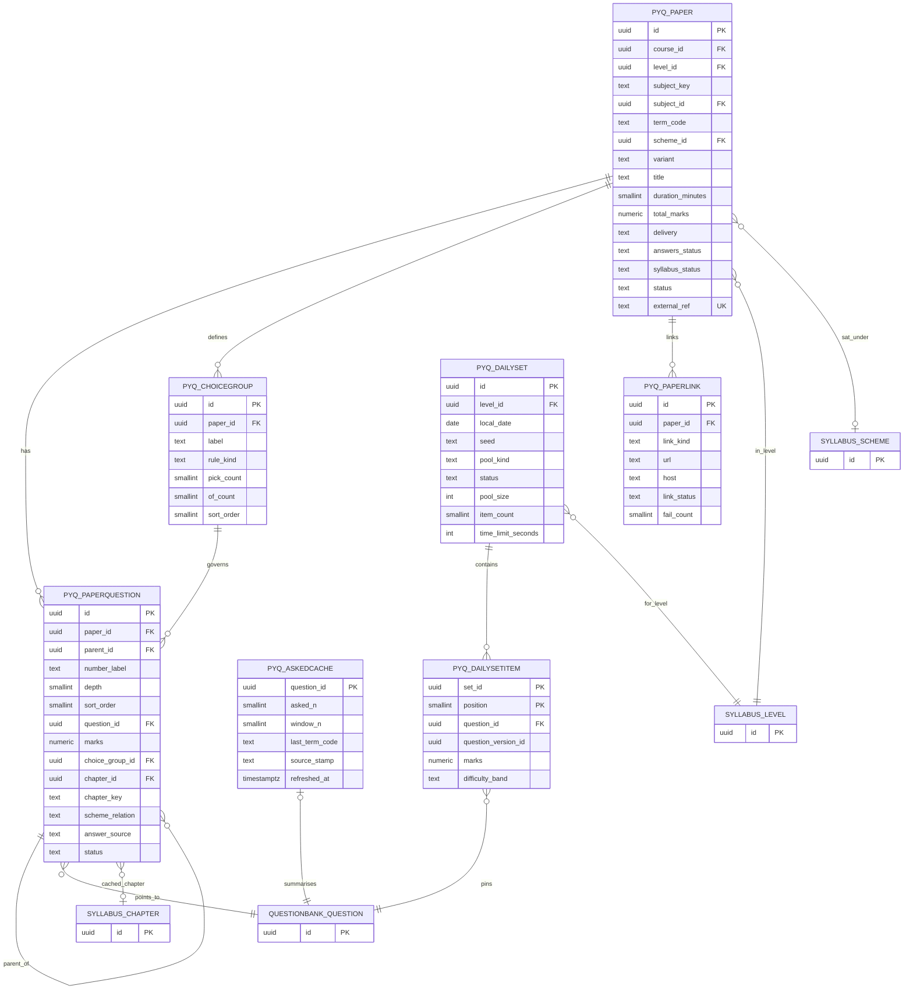
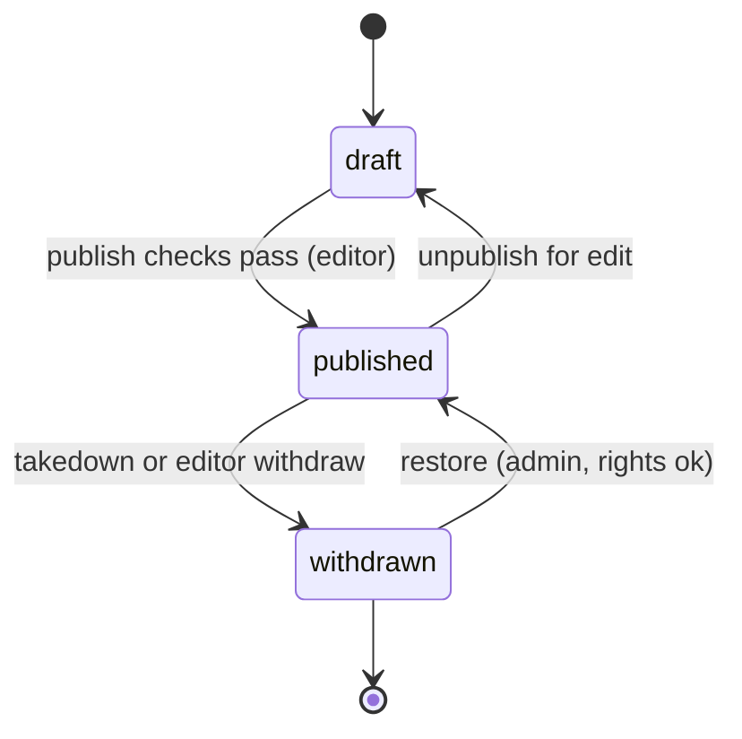
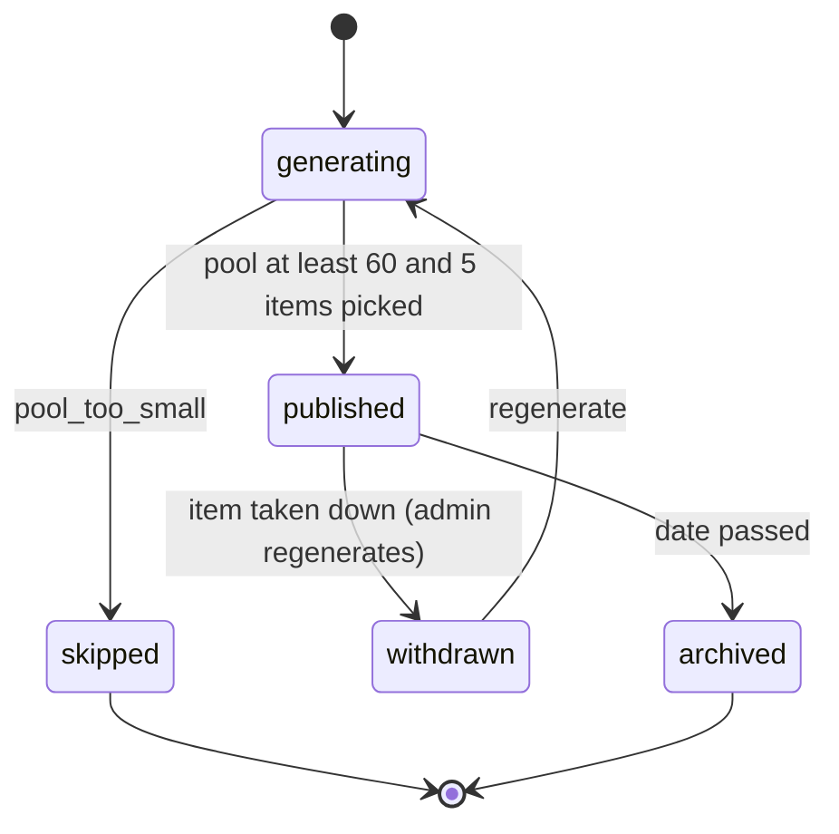

# ERD: F-09 Previous Year Questions (papers, structure, links and daily set over F-06)

| Field | Value |
| --- | --- |
| Linked PRD | `docs/product/prd/F-09-previous-year-questions.md` |
| Order | After F-06 (engine) and F-02 (taxonomy); sibling of `docs/product/erd/F-05-mcq-bank.md` (reuses its proposed F-06 extensions E-F06-1..4). Reads `docs/product/erd/F-06-question-bank-system.md` sections 0, 3 and 4 as a contract and re-models nothing from it |
| Django app | `apps/api/modules/pyq` (seven tables, three pickers, two origins, one registry) |
| Web module | `apps/web/src/modules/pyq` |
| Last updated | 2026-10-05 |

**Reading guide.** F-09 stores what a past paper *is*: the sitting, its scheme, its numbered parts, choice rules, and where the Institute's answer lives. Every question is an F-06 question (`source_kind = institute_pyq`), every attempt an F-06 session. There is no user-owned table here, so deletion and export are no-ops. Frequency statistics are cached from F-11, never computed here.

## 0. Design decisions

1. **Paper structure lives here, questions live in F-06.** `pyq_paperquestion` is a tree of numbered parts; leaf parts point at an F-06 question. Interior parts (Q.4 with sub-parts) carry only a label, marks subtotal and ordering. This lets F-08 build a blueprint from one function (`paper_blueprint`) without owning past-paper data. Ownership is open question Q-F09-1; if F-08 takes it, these four tables move with a one-way data migration and the selectors keep their signatures.
2. **Stub questions for link-out content.** When a paper is `link_out`, a leaf part still gets an F-06 question: a `long_form` (or `mcq` for objective parts) item with tag `pyq_stub`, our own short descriptor instead of the Institute's text, and one self-assessed rubric step. This keeps attempts, bookmarks, mistake reasons and spaced repetition in F-06 with no special cases.
3. **Terms are `YYYY-MM` strings** (same format as `syllabus_examterm.code` and F-06 `source_term_code`). No two-sittings-a-year assumption.
4. **Chapter fields are a cache.** The confirmed mapping is F-06's (`set_mapping`). `pyq_paperquestion.chapter_id` and `chapter_key` are denormalised for the hot chapter-list query and refreshed by subscriber; the F-06 mapping wins on conflict.
5. **Scheme relation is computed, not typed.** `scheme_relation` derives from the F-02 chapter map between the paper's scheme and the student's current scheme (section 3.5) and is recomputed by a job.
6. **The daily set is stored, not recomputed.** One row per level and date with pinned question versions, so every student sees the same five questions and a later edit cannot change a played day.
7. **Stable keys in URLs** (`subject_key`, `chapter_key`, `term_code`); UUIDs inside the API.
8. **Facts only on public pages.** Public selectors read only counts, marks and chapter names, never question text.

## 1. Diagrams

### 1.1 Entities



### 1.2 Paper and daily set lifecycles





---

## 2. Tables

Common columns unless stated: `id uuid PK default gen_random_uuid()`, `created_at timestamptz not null default now()`, `updated_at timestamptz not null default now()`. No table has `user_id`. Enums are `text` with check constraints (section 4).

### 2.1 `pyq_paper`

| Column | Type | Null | Default | Notes |
| --- | --- | --- | --- | --- |
| external_ref | text | no | | Canonical key per the F-04 `core/refs.py` grammar, e.g. `pyq:ca:inter:taxation:2025-05`; unique, import idempotency |
| course_id, level_id | uuid | no | | FK `syllabus_course`, `syllabus_level` |
| subject_key | text | no | | Stable key |
| subject_id | uuid | yes | | FK `syllabus_subject` in the scheme at save time |
| term_code | text | no | | `YYYY-MM`; check regex `^[0-9]{4}-(0[1-9]\|1[0-2])$` |
| exam_date | date | yes | | |
| variant | text | no | `''` | "Series A", "Old syllabus", "Paper 2 Group 1"; part of uniqueness |
| scheme_id | uuid | yes | | FK `syllabus_scheme`: the scheme in force at that sitting |
| syllabus_status | text | no | `unmapped` | `current`, `old_scheme`, `unmapped`; computed (section 3.5) |
| title | text | no | | 3 to 160 characters |
| paper_code | text | no | `''` | "Paper 4" as printed |
| duration_minutes | smallint | yes | | |
| reading_minutes | smallint | no | 0 | Used by F-08 |
| total_marks | numeric(6,2) | no | | |
| marks_note | text | no | `''` | Recorded difference if parts do not sum (FR-F09-31) |
| law_note | text | no | `''` | "Law as of" text, up to 300 characters |
| delivery | text | no | `link_out` | `link_out` or `hosted` |
| rights_basis | text | yes | | `original`, `licensed`, `institute_material`; required when hosted |
| permission_ref | text | no | `''` | Written permission reference; required when hosted from Institute material |
| source_name | text | no | `''` | "ICAI", "ICMAI", "ICSI" |
| ingestion_item_id | uuid | yes | | X-04 `ingestion_item.id` by value |
| answers_status | text | no | `none` | `none`, `partial`, `complete` (derived from paperquestion rows, editor override allowed) |
| question_count | smallint | no | 0 | Leaf parts, cached |
| status | text | no | `draft` | `draft`, `published`, `withdrawn` |
| withdrawn_reason | text | yes | | `takedown`, `licence_ended`, `editor`, `replaced`, `error` |
| replaced_by_id | uuid | yes | | Self FK, set null |
| published_at | timestamptz | yes | | |
| schema_version | smallint | no | 1 | `artha.paper.v1` |
| created_by | uuid | yes | | Editor |

Constraints: unique `external_ref`; unique `(course_id, level_id, subject_key, term_code, variant)`; check `delivery = 'hosted'` implies `rights_basis is not null`; check `status = 'withdrawn'` implies `withdrawn_reason is not null`; check `total_marks > 0`.

Indexes: `(level_id, subject_key, term_code desc)` where `status = 'published'` (Q-1, Q-2); `(syllabus_status)` where published (Q-9); `(status, updated_at)`.

### 2.2 `pyq_choicegroup`

| Column | Type | Null | Default | Notes |
| --- | --- | --- | --- | --- |
| paper_id | uuid | no | | FK `pyq_paper`, cascade |
| label | text | no | | "Answer any 4 of Q.2 to Q.6" (derived text, editable) |
| rule_kind | text | no | | `compulsory`, `any_n_of_m`, `either_or` |
| pick_count | smallint | no | 1 | N |
| of_count | smallint | no | 1 | M; check `pick_count <= of_count` |
| section_label | text | no | `''` | "Section A" |
| sort_order | smallint | no | 0 | |

Constraints: check `rule_kind = 'compulsory'` implies `pick_count = of_count`; unique `(paper_id, sort_order)`. Index `(paper_id)`.

### 2.3 `pyq_paperquestion`

| Column | Type | Null | Default | Notes |
| --- | --- | --- | --- | --- |
| paper_id | uuid | no | | FK `pyq_paper`, cascade |
| parent_id | uuid | yes | | Self FK, cascade; null for top-level numbers |
| number_label | text | no | | "4", "4(b)", "4(b)(ii)" as printed |
| depth | smallint | no | 0 | 0 to 3; check `depth <= 3` |
| sort_order | smallint | no | | Order inside the paper |
| is_leaf | boolean | no | true | Leaf parts carry a question |
| question_id | uuid | yes | | FK `questionbank_question`, restrict. Required when leaf and published |
| marks | numeric(5,2) | no | | Part marks; interior row = subtotal, validated against children |
| choice_group_id | uuid | yes | | FK `pyq_choicegroup`, set null; set on top-level rows |
| kind | text | no | | Mirror of F-06 kind for list display and filters |
| descriptor | text | no | `''` | Our own short description (link-out), up to 200 characters |
| chapter_id | uuid | yes | | Cache of F-06 confirmed mapping, FK `syllabus_chapter` |
| chapter_key | text | yes | | Stable key, cache |
| topic_id | uuid | yes | | Cache |
| mapping_state | text | no | `pending` | `pending`, `confirmed` (copied from F-06 `set_mapping`) |
| scheme_relation | text | no | `unmapped` | `current`, `mapped`, `changed`, `out_of_scheme`, `unmapped` |
| answer_source | text | no | `none` | `none`, `icai_suggested`, `icmai_suggested`, `icsi_guidelines`, `platform_original` |
| answer_page_hint | text | no | `''` | "p. 14" |
| source_page_hint | text | no | `''` | Page in the paper PDF |
| status | text | no | `live` | `live`, `unavailable` (takedown) |

Constraints: unique `(paper_id, number_label)`; check `is_leaf = false` implies `question_id is null`; check `depth = 0` iff `parent_id is null` (enforced in service, validated by test).

Indexes: `(paper_id, sort_order)` (Q-2); `(chapter_id, paper_id)` where `status = 'live' and mapping_state = 'confirmed' and is_leaf` (Q-3 hot chapter list); `(question_id)` where not null (Q-4 appearances, subscriber lookups); `(scheme_relation)` where `is_leaf`.

### 2.4 `pyq_paperlink`

| Column | Type | Null | Default | Notes |
| --- | --- | --- | --- | --- |
| paper_id | uuid | no | | FK `pyq_paper`, cascade |
| link_kind | text | no | | `paper`, `suggested_answers`, `examiner_remarks`, `other` |
| label | text | no | `''` | |
| url | text | no | | https only; host on allow-list `PYQ_LINKOUT_HOSTS` |
| host | text | no | | Derived, used by the allow-list check |
| page_hint | text | no | `''` | |
| link_status | text | no | `unchecked` | `unchecked`, `ok`, `failing`, `broken` |
| link_checked_at | timestamptz | yes | | |
| fail_count | smallint | no | 0 | `broken` at 2 consecutive failures |
| verified | boolean | no | false | Editor confirmed it opens the right document |

Constraints: unique `(paper_id, link_kind, url)`; check `url like 'https://%'`. Indexes: `(paper_id)`; `(link_status, link_checked_at)` where `link_status <> 'broken'` (Q-8).

### 2.5 `pyq_askedcache`

| Column | Type | Null | Default | Notes |
| --- | --- | --- | --- | --- |
| question_id | uuid | no | | PK, FK `questionbank_question`, cascade. Canonical question after F-06 duplicate merge |
| asked_n | smallint | no | 0 | Times the question (or its duplicates) appeared, as reported by F-11 |
| window_n | smallint | no | 0 | Terms in the F-11 window; chips hidden when below 3 |
| last_term_code | text | yes | | |
| source_stamp | text | no | | F-11 `stats_stamp` the row came from |
| refreshed_at | timestamptz | no | now() | |

Index: `(refreshed_at)` for stale sweeps. No statistics are derived here.

### 2.6 `pyq_dailyset`

| Column | Type | Null | Default | Notes |
| --- | --- | --- | --- | --- |
| level_id | uuid | no | | FK `syllabus_level` |
| local_date | date | no | | IST calendar day |
| seed | text | no | | `sha256(level_id:local_date:salt)` hex |
| pool_kind | text | no | `pyq_hosted` | `pyq_hosted`, `mixed_fallback` (platform originals tagged `daily_eligible`) |
| pool_size | int | no | | Eligible questions at generation |
| item_count | smallint | no | 5 | |
| time_limit_seconds | int | no | 480 | |
| status | text | no | `generating` | `generating`, `published`, `withdrawn`, `skipped`, `archived` |
| skip_reason | text | yes | | `pool_too_small` |
| generated_by | text | no | `job` | `job` or an admin uuid text |
| published_at | timestamptz | yes | | |

Constraints: unique `(level_id, local_date)`; check `status = 'skipped'` implies `skip_reason is not null`. Index `(local_date desc, level_id)` (Q-5, Q-6).

### 2.7 `pyq_dailysetitem`

| Column | Type | Null | Default | Notes |
| --- | --- | --- | --- | --- |
| set_id | uuid | no | | PK part 1, FK `pyq_dailyset`, cascade |
| position | smallint | no | | PK part 2, 1 to 5 |
| question_id | uuid | no | | FK `questionbank_question`, restrict |
| question_version_id | uuid | no | | Pinned F-06 version |
| paper_question_id | uuid | yes | | FK `pyq_paperquestion`, set null (origin label "May 2025 Q.4(b)") |
| marks | numeric(4,2) | no | | |
| difficulty_band | text | no | | `easy`, `medium`, `hard` from F-06 `p_value` when 30+ attempts, else from `difficulty` tag |

Constraints: check `position between 1 and 5`. Index `(question_id)` (no-repeat window query, Q-6).

---

## 3. Relationships to other modules and the contract

### 3.1 Foreign keys and by-value references

| From | To | Kind |
| --- | --- | --- |
| `pyq_paper.course_id, level_id, subject_id, scheme_id` | `syllabus_*` (F-02) | FK (set null for subject and scheme; reads go through `syllabus.selectors`) |
| `pyq_paperquestion.question_id`, `pyq_dailysetitem.question_id` | `questionbank_question` (F-06) | FK restrict |
| `pyq_paperquestion.chapter_id, topic_id` | `syllabus_chapter`, `syllabus_topic` | Cache, set null |
| `pyq_paper.ingestion_item_id` | X-04 `ingestion_item` | By value |
| `pyq_dailysetitem.question_version_id` | `questionbank_questionversion` | By value (pinned) |
| `practice_session.origin_module = 'pyq' / 'pyq_daily'`, `origin_ref` | F-09 | F-06 stores the reference, F-09 never joins sessions |

Code reads other modules only through their selectors and services (audit finding: no foreign model imports). Models import nothing outside `pyq` except FK targets by string.

### 3.2 Public service, selector and registry interfaces

```python
# ---- pyq/selectors.py (read only) -----------------------------------------------------------
def home(user_id: UUID) -> PyqHome                      # subjects for level, due count, daily card state, continue item
def list_terms(user_id: UUID, subject_key: str, *, course: str, level: str) -> list[TermRow]
    # TermRow(term_code, label, paper_id, syllabus_status, answers_status, delivery, attempted_pct|None)
def get_paper(paper_id: UUID, viewer_id: UUID | None = None) -> PaperDetail     # F-11 paper source; overlay of F-06 state when viewer given
def list_papers(*, level: str | None = None, subject_key: str | None = None,
                from_term: str | None = None, to_term: str | None = None, statuses=("published",)) -> list[PaperSummary]   # F-11 paper source
def paper_blueprint(paper_id: UUID) -> PaperBlueprint   # F-08: sections, order, marks, choice rules, durations, pinned question ids
def chapter_questions(user_id: UUID, subject_key: str, chapter_key: str, filters: ChapterFilters, *, cursor=None, limit=20) -> Page[ChapterRow]
    # ChapterFilters(from_term, to_term, marks_band, kind, scheme_relations, status, sort)
def appearances_for_chapter(chapter_id: UUID, *, from_term=None, to_term=None) -> list[TermAppearance]   # facts only: term, count, marks
def papers_containing_question(question_id: UUID) -> list[PaperRef]     # F-05, F-04, F-12 chips
def reask_summary(user_id: UUID) -> ReaskSummary
def daily_today(user_id: UUID, level_id: UUID) -> DailyState
def daily_result(user_id: UUID, local_date: date) -> DailyResult
def public_subject_page(course: str, level: str, subject_key: str) -> PublicSubjectPyq       # facts only
def public_chapter_page(course: str, level: str, subject_key: str, chapter_key: str) -> PublicChapterPyq
def link_health_report() -> LinkHealth
def verify_share_token(token: str) -> SharePayload | None

# ---- pyq/services.py (writes; actor checked) ------------------------------------------------
def import_paper(editor_id: UUID, payload: dict, *, dry_run: bool = False) -> ImportReport     # artha.paper.v1; idempotent on external_ref;
    # creates/updates F-06 questions via questionbank.services.upsert_from_source(origin_module='pyq', ...)
def upsert_paper_from_source(origin_module: str, payload: dict) -> PaperRef                      # F-08 runner for MTP/RTP uses the same path
def check_publish(paper_id: UUID) -> list[PublishIssue]
def publish_paper(editor_id: UUID, paper_id: UUID) -> PyqPaper         # runs check_publish; emits pyq_paper_published
def withdraw_paper(actor_id: UUID, paper_id: UUID, reason: str, *, replaced_by: UUID | None = None) -> None
def switch_to_hosted(admin_id: UUID, paper_id: UUID, *, rights_basis: str, permission_ref: str) -> PyqPaper   # admin only
def attach_link(editor_id: UUID, paper_id: UUID, *, link_kind: str, url: str, page_hint: str = "") -> PaperLink
def start_paper_session(user_id: UUID, paper_id: UUID, *, scope: str, mode: str, part_ids=(), client_id: UUID) -> SessionCreated
def start_chapter_session(user_id: UUID, subject_key: str, chapter_key: str, filters: ChapterFilters, *, count: int, client_id: UUID) -> SessionCreated
def start_reask_session(user_id: UUID, *, count: int, client_id: UUID) -> SessionCreated
def start_daily_session(user_id: UUID, set_id: UUID, *, client_id: UUID) -> SessionCreated        # unique per user and set
def generate_daily_set(level_id: UUID, local_date: date, *, actor: str = "job", force: bool = False) -> DailySet
def create_share_token(user_id: UUID, set_id: UUID, *, show_name: bool) -> str                      # HMAC, 30 days
def recompute_scheme_status(*, paper_id: UUID | None = None) -> RecomputeReport
def refresh_asked_cache(*, question_ids: Sequence[UUID] | None = None) -> int
# Account deletion/export: pyq has no personal data, so no hook is registered (test asserts no user_id column).

# ---- pyq/registry.py ------------------------------------------------------------------------
def register_paper_runner(name: str, runner: PaperRunner) -> None     # F-08 registers "mocktest"; paper page shows "Exam simulation" when present
```

Pickers registered with F-06 `register_picker`: `pyq_ranked` (chapter and filter list ordered by F-11 frequency, fallback recency), `pyq_paper` (explicit part ids in paper order, printed marks), `pyq_daily` (the stored set, versions pinned). Origins: `pyq` (label "Past paper {term} {number_label}") and `pyq_daily` (`unique_per_user`, `origin_ref = "{level_key}:{local_date}"`). Subscribers: `refresh_on_takedown`, `refresh_on_version_live`, `refresh_asked_cache`, `scheme_recompute_on_change`, `daily_completed` (translates `practice_session_completed` for origin `pyq_daily`).

### 3.3 Domain events

| Event | When | Payload | Consumers |
| --- | --- | --- | --- |
| `pyq_paper_published` | Publish | `paper_id`, `level_id`, `subject_key`, `term_code`, `syllabus_status`, `leaf_question_ids` | F-11, F-12, F-13 |
| `pyq_paper_withdrawn` | Withdraw or takedown | `paper_id`, `reason`, `replaced_by` | F-11, F-08, search |
| `pyq_daily_set_published` | Daily set ready | `set_id`, `level_id`, `local_date` | X-03, F-13, X-01 |
| `pyq_daily_challenge_completed` | Session submitted with origin `pyq_daily` | `user_id`, `set_id`, `local_date`, `score`, `max_score`, `seconds`, `perfect`, `archive` | X-03 |

Consumed: `practice_session_completed`, `question_version_live`, `question_taken_down`, `question_unpublished`, `paperanalysis_stats_refreshed`, `paperanalysis_paper_published`, `syllabus_scheme_changed` `[PROPOSED: F-02]`. Handlers are idempotent on `(event_id)`.

### 3.4 `[PROPOSED EXTENSION to F-06]` and other neighbour asks

F-09 reuses the F-05 ERD extensions: **E-F06-1** (`chapter_id` and `progress_by_chapter`, used for the chapter list status overlay), **E-F06-2** (`stats_for`, used for daily difficulty bands from `p_value`), **E-F06-3** (`get_collection`, not needed here), **E-F06-4** (`kind_group` filter, used for the "choice only" daily pool). It adds no new F-06 column. Two small asks elsewhere:

| Ask | Owner | Shape |
| --- | --- | --- |
| `syllabus.selectors.chapter_map_to_scheme(chapter_id, target_scheme_id) -> ChapterMapResult(kind: same|mapped|changed|removed, target_chapter_ids)` | F-02 `[PROPOSED]` | Read only over the existing chapter map; without it F-09 treats everything as `unmapped` |
| `paperanalysis.selectors.asked_summary(question_ids) -> dict[UUID, AskedSummary]` and the event `paperanalysis_stats_refreshed` | F-11 `[PROPOSED]` | Already planned in the F-11 draft; `AskedSummary(asked_n, window_n, last_term_code, stamp)` |

### 3.5 Behavioural reference (what the tests assert)

**Marks check (publish).** For every interior part, `marks == sum(children.marks)` (decimal exact); for the paper, the sum of marks of compulsory groups plus `pick_count` times the per-part marks of choice groups must equal `total_marks`, else a `marks_note` must exist. Choice group `any_n_of_m` requires that exactly `of_count` top-level numbers reference it.

**Scheme relation.** For each leaf with a confirmed `chapter_id`: if the paper's `scheme_id` equals the current scheme, `current`. Otherwise call `chapter_map_to_scheme`: `same` gives `mapped`, `mapped` (renamed or merged) gives `mapped`, `changed` gives `changed` (content differs, student should read the note), `removed` gives `out_of_scheme`. No confirmed mapping gives `unmapped`. Paper `syllabus_status` is `current` if all leaves are `current`, `old_scheme` if its scheme differs, else `unmapped`.

**Daily selection (deterministic).** Pool = hosted, published, live questions of the level with kind group `choice`, `rights_status` in (`original`, `licensed`, `institute_material`), text length at most 600 characters, no `pyq_stub` tag, not played by the same level in the last 60 days. If pool size is below 60, status `skipped`. Else order candidates by `sha256(seed || question_id)`; fill positions with the target band mix `easy, easy, medium, medium, hard` (bands from `p_value` at 30 or more attempts, else the `difficulty` tag); if a band is short, borrow from the next band; enforce at most 2 questions per chapter. Same inputs give the same set (property test). Regeneration with `force` writes a new set only while no session has started.

**Share token.** `base64url(json{lvl, d, s, t, n?, exp}) + "." + HMAC-SHA256(key=PYQ_SHARE_KEY, body)`; verify by constant-time compare; reject after `exp`. No user id inside.

**Link check.** HEAD then GET with Range 0-0; 2 consecutive failures set `broken` and raise an editor alert; a broken `paper` link on a published `link_out` paper sets a banner flag, not a withdrawal.

### 3.6 Provides and consumes

| Provides | Consumers |
| --- | --- |
| `get_paper`, `list_papers` (paper source `pyq`) | F-11 |
| `paper_blueprint`, `register_paper_runner`, `upsert_paper_from_source` | F-08 |
| `papers_containing_question`, `appearances_for_chapter` | F-05, F-04, F-12, F-13 |
| Pickers `pyq_ranked`, `pyq_paper`, `pyq_daily`; origins `pyq`, `pyq_daily` | F-06 |
| Events in 3.3 | F-11, F-08, X-03, F-13 |

| Consumes | Owner |
| --- | --- |
| `upsert_from_source`, `search_ids`, `stats_for` (E-F06-2), `create_session_from_items`, `question_states`, `due_for_review` | F-06 |
| `syllabus.selectors` (taxonomy, schemes, terms), `chapter_map_to_scheme` `[PROPOSED]` | F-02 |
| `asked_summary`, stats events | F-11 |
| `mocktest.selectors.papers_containing_question` | F-08 |
| Exam-paper publisher plug-in, `ingestion_item` | X-04 `[PROPOSED]` |

---

## 4. Enumerations and reference data

| Name | Values | Stored as | Owner |
| --- | --- | --- | --- |
| Paper status, withdrawn reason | draft, published, withdrawn; takedown, licence_ended, editor, replaced, error | text + check | code |
| Delivery, rights basis | link_out, hosted; original, licensed, institute_material | text + check | code |
| Answers status, answer source | none, partial, complete; none, icai_suggested, icmai_suggested, icsi_guidelines, platform_original | text + check | code |
| Syllabus status, scheme relation | current, old_scheme, unmapped; current, mapped, changed, out_of_scheme, unmapped | text + check | code |
| Choice rule kind | compulsory, any_n_of_m, either_or | text + check | code |
| Link kind, link status | paper, suggested_answers, examiner_remarks, other; unchecked, ok, failing, broken | text + check | code |
| Daily status, pool kind, skip reason | generating, published, withdrawn, skipped, archived; pyq_hosted, mixed_fallback; pool_too_small | text + check | code |
| Marks band | up to 2, 3 to 5, 6 to 10, 11 and above | API param `marks=0-2,3-5,6-10,11-` | code |

**Seed data** (migration `pyq.0003_seed`): none for papers (content comes from editor import). A fixture paper with 12 parts, one choice group and one link is loaded only in tests. The link allow-list `PYQ_LINKOUT_HOSTS` is an environment setting seeded when the Institute hosts are confirmed `[VERIFY]`.

## 5. Query patterns

| # | Query | Served by |
| --- | --- | --- |
| Q-1 | Terms of a subject, newest first | `pyq_paper (level_id, subject_key, term_code desc) where published`; attempted percent from `practice.selectors.question_states` over leaf ids (one call) |
| Q-2 | Paper page: parts in order plus F-06 state overlay | `pyq_paperquestion (paper_id, sort_order)`, `pyq_choicegroup (paper_id)`, `pyq_paperlink (paper_id)`; one `question_states` call for at most 80 ids |
| Q-3 | Chapter list with filters and keyset paging | `pyq_paperquestion (chapter_id, paper_id) where live and confirmed and is_leaf`, join `pyq_paper` for term range and status, left join `pyq_askedcache` for sort by frequency; keyset on `(sort_key, id)` |
| Q-4 | Appearances of one question | `pyq_paperquestion (question_id)` plus `mocktest.selectors.papers_containing_question` |
| Q-5 | Today's set for a level | `pyq_dailyset (level_id, local_date)` unique |
| Q-6 | No-repeat window for generation | `pyq_dailysetitem (question_id)` joined to `pyq_dailyset (local_date >= today - 60)` |
| Q-7 | Takedown refresh | `pyq_paperquestion (question_id)` set `status = 'unavailable'`; recompute `pyq_paper.question_count`; withdraw empty papers |
| Q-8 | Link check batch (50 per tick) | `pyq_paperlink (link_status, link_checked_at)` |
| Q-9 | Scheme status recompute | Per paper: leaves with `chapter_id`, one `chapter_map_to_scheme` call per distinct chapter |
| Q-10 | Public chapter page counts | Aggregate on Q-3 index grouped by `term_code`; cached 1 h at CDN |
| Q-11 | Asked cache refresh | Batch by question ids from the F-11 event; upsert by PK |

## 6. Storage, scale and retention

### 6.1 Volume assumptions

| Item | Assumption | Result |
| --- | --- | --- |
| Papers | about 60 papers across the three bodies and levels, 15 terms (3 sittings a year for 5 years) | under 1,000 rows |
| Paper parts | about 25 parts per paper | about 25,000 rows |
| Links | about 3 per paper | about 3,000 rows |
| Asked cache | one per question | about 25,000 rows |
| Daily sets | 3 levels, one a day | about 1,100 sets and 5,500 items a year |

### 6.2 Caching and hot paths

Hot: chapter list (Q-3) and public pages. Cache public selectors at CDN for 1 hour with surrogate keys per subject; authenticated lists use `ETag` from `max(updated_at)` of the paper set plus the F-06 `state_stamp` (E-F06-1). Daily today is cached per level until midnight IST.

### 6.3 Async work (Vercel limits)

Supabase cron triggers `core/jobs` tick handlers: `pyq.link_check` (daily, 50 links per run), `pyq.daily_generate` (23:30 IST, per level, idempotent), `pyq.scheme_status` (on `syllabus_scheme_changed` and weekly), `pyq.asked_refresh` (on F-11 event, batched 200). Each handler is bounded to under 20 s and resumable.

### 6.4 Storage

No files. Official PDFs stay on the Institute's site (link-out). Hosted original solutions use F-06 media. Daily OG images are rendered on demand by the web app and cached.

## 7. Security

- **Access path and RLS:** browser to Django to Postgres; Supabase Data API disabled; RLS enabled with no policies on all seven tables (post-migrate hook plus a test per table).
- **Public endpoints** return facts only (counts, marks, chapter names) and never question text, options or answers.
- **Link-out safety:** https only, host allow-list, `rel="noopener noreferrer"`, no redirects followed to unlisted hosts in the checker.
- **Rights enforcement:** hosted requires `permission_ref` or `platform_original`; `publish_paper` rechecks each question's `rights_status`; takedown flows through F-06 and withdraws.
- **Share token:** HMAC key in `PYQ_SHARE_KEY` (API only), 30-day expiry, no user id, throttled 20 per hour.
- **Abuse:** throttles `pyq_read`, `pyq_write`, `pyq_daily`, `pyq_share`; import capped at 500 parts per file and 5 MB.
- **PII:** none stored. PostHog events carry ids and bands, no question text.
- **Retention and deletion (DPDP):** nothing personal, so nothing to delete or export; withdrawn papers are kept for audit.
- **Audit:** publish, withdraw, delivery switch, daily regenerate and import write F-06 `questionbank_auditlog` rows (`entity_type = 'pyq_paper'` or `'pyq_dailyset'`).

## 8. Migration and rollout

Order (all additive, `DIRECT_DATABASE_URL`):

0. F-06 extensions if accepted (shared with F-05; do once).
1. `pyq.0001_initial`: paper, choicegroup, paperquestion, paperlink with constraints and indexes.
2. `pyq.0002_cache_daily`: askedcache, dailyset, dailysetitem (flag `pyq_daily` off until R3).
3. `pyq.0003_seed`: no content; test fixture only.
4. Post-migrate hook enables RLS.

Tables ship dark behind `pyq_bank` and `pyq_daily`; no existing screen changes. Rollback drops tables in reverse order; nothing outside `pyq` is touched. If Q-F09-1 moves ownership to F-08, copy rows to the F-08 tables in one migration and keep `pyq.selectors` as thin wrappers for one release.

## 9. Module layout

### API

```
apps/api/modules/pyq/
  models.py            PyqPaper, ChoiceGroup, PaperQuestion, PaperLink, AskedCache, DailySet, DailySetItem
  domain/              marks.py (tree and sum checks), choice.py (rule validation), scheme.py (relation), daily.py (deterministic pick),
                       token.py (share HMAC), refs.py (canonical keys via core/refs), links.py, importer.py (artha.paper.v1 schema)
  registry.py          register_paper_runner
  selectors.py         public contract (3.2)
  services.py          public contract (3.2)
  pickers.py           pick_pyq_ranked, pick_pyq_paper, pick_pyq_daily
  subscribers.py       refresh_on_takedown, refresh_on_version_live, refresh_asked_cache, scheme_recompute_on_change, daily_completed
  jobs.py              link_check, daily_generate, scheme_status, asked_refresh
  events.py serializers.py views.py urls.py permissions.py admin.py (papers with inline parts and links)
  tests/               one file per endpoint group, domain property tests (daily determinism, marks sums), picker tests against the F-06 fixture, RLS, flag-off parametrised test, no-user_id test, contract tests for F-11 and F-08
```

### Web

```
apps/web/src/modules/pyq/
  index.ts             barrel: PyqHomeContainer, ChapterPyqCard, startPyqPractice, usePaperTerms
  lib/                 api.ts, filter-url.ts, marks-band.ts, scheme.ts, share.ts
  hooks/               usePyqHome, useTerms, usePaper, useChapterQuestions, useReask, useDaily
  components/          PaperHeader, ChoiceGroupNote, QuestionPartRow, ChapterAppearanceList, SchemeBadge, AnswerSourceLink, ReaskCard, DailyCard, ShareCard
  containers/          PyqHomeContainer, SubjectContainer, PaperContainer, ChapterContainer, ReaskContainer, DailyContainer, PapersAdminContainer
```

Routes (thin, each sets `head` via `buildHead()`): `app.pyq.index`, `app.pyq.$subject.index`, `app.pyq.$subject.terms.$term`, `app.pyq.$subject.chapters.$chapter`, `app.pyq.reask`, `app.pyq.daily.index`, `app.pyq.daily.$date`, `app.admin.pyq.*`; public `courses.$course.$level.$subject.previous-year-questions` (+ `.$term`, chapter variant) and `pyq.daily.share.$token` with `noindex`.
