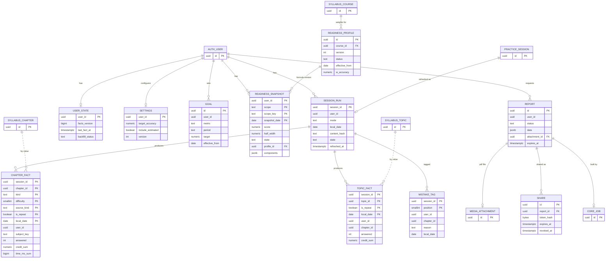
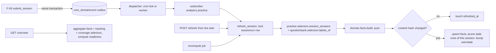
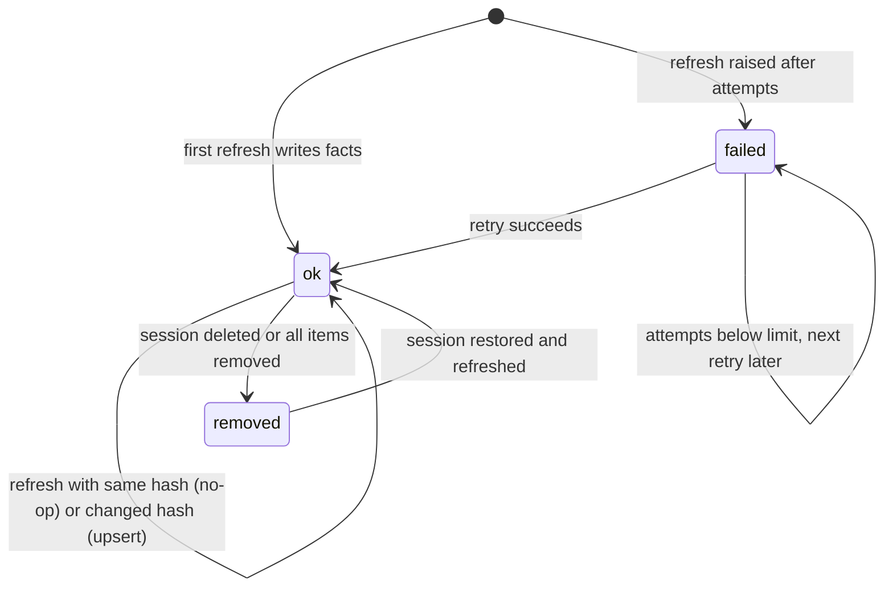
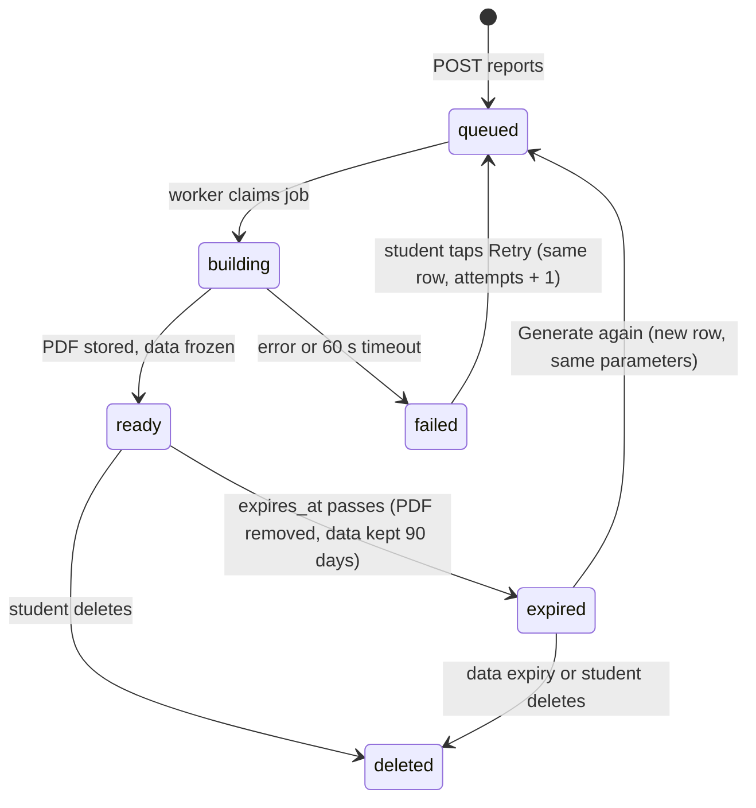

# ERD: F-10 Performance Analytics

| Field | Value |
| --- | --- |
| Linked PRD | `docs/product/prd/F-10-performance-analytics.md` |
| Order | Consumer of `docs/product/erd/F-06-question-bank-system.md` (events and selectors), `docs/product/erd/F-02-syllabus-structure-and-coverage.md` (taxonomy, coverage) and `docs/product/erd/F-01.2-time-tracker-and-analytics.md` (time, settings) |
| Django app | `apps/api/modules/analytics` (all tables below, prefix `analytics_`). Shared infrastructure used, not owned: `core/events.py`, `core/jobs.py`, `core/feature_flags.py`, `media` |
| Web module | `apps/web/src/modules/analytics` |
| Last updated | 2026-10-05 |

**Reading guide.** Section 0 states the decisions and why the design avoids the rollup races found in the audit of F-02 and F-01 (AUD-001, AUD-002). Section 3 is the contract: what this module calls, what it exposes, and which proposed extensions it needs from neighbours. Table names follow `<app>_<model>`.

## 0. Design decisions

1. **Read models, not capture.** F-10 stores only derived facts and its own settings, goals, snapshots and reports. It never writes questions, attempts, timers or coverage. Everything can be rebuilt from F-06 (retained window), F-01.2 and F-02 (FR-F10-14).
2. **Events are triggers; state is the truth.** The subscriber receives `practice_session_completed` (or `practice_regraded`, `practice_session_deleted`) but ignores the payload's numbers: it re-reads the session's **current** state through `practice.selectors.session_answers` and recomputes that session's facts. Delivery order, duplicates and lateness cannot change the result because the result is a pure function of F-06 state at processing time. This is the convergence property (NFR-F10-01) and the reason no event ordering guarantees are needed beyond F-06's at-least-once outbox.
3. **Facts are keyed by session, upserted by natural key, never incremented.** The grain is "one session, one chapter, one kind, one difficulty, one source, first or repeat attempt" (`analytics_chapterfact`) and "one session, one topic" (`analytics_topicfact`). Rows store **values**, not deltas, so a replay overwrites with the same values. A content hash on `analytics_sessionrun` turns an unchanged refresh into a no-op. Stale rows of the same session (a label changed so a key disappeared) are pruned by a refresh stamp, only for that session, in the same transaction, under that session's row lock. This is deliberately not the delete-per-user-and-day then bulk insert that raced in `coverage.recompute_rollups` and `tracking.rollups._refresh_day`.
4. **No materialised rollups in R1; aggregate on read.** A student's fact rows are small and indexed by `(user_id, local_date)`: about 12 rows per session, 1,400 a year for an average student and 5,000 a year for a heavy one (section 6.1). A 180-day mastery query reads at most a few thousand rows and a lifetime trend one `GROUP BY` over at most about 15,000. That is cheaper and safer than maintaining counters (no drift, no rebuild job, no extra writes on the grading path). Materialisation is added only when a measured threshold is crossed (section 6.4: p95 of the overview above 400 ms or more than 20,000 fact rows for the 99th percentile student), and then as a **monthly compaction table** written by upsert from facts, never as a delete-and-rebuild.
5. **Neighbours are read live through their selectors.** Time per chapter (F-01.2) and coverage signals (F-02) are already maintained read models with their own tests. Copying them would create a second copy that can drift. F-10 reads them on demand through public selectors, uses their cheap stamps (`tracking.selectors.report_stamp`, `coverage.selectors.progress_stamp`) for the ETag, and stores only the **values it used** inside readiness snapshots (so history of coverage and retention exists from the day snapshots start). Events from the tracker and coverage are therefore not needed in R1; R2 adds `coverage_changed` and `tracking_time_changed` only as invalidation hints for snapshots `[PROPOSED]`.
6. **Dates are local dates, stored.** Each fact carries the session's `local_date` (captured in the student's time zone at creation by F-06, default `Asia/Kolkata`). No read converts a UTC timestamp to a date, which avoids the UTC-versus-IST day shift of audit AUD-018. Week and month buckets are computed from `local_date` with the tracker's `week_start`. Rolling windows ("last 7 days") use the student's current zone's today.
7. **Hierarchy and exclusivity are enforced by the database.** Active readiness profiles cannot overlap per course and level (exclusion constraint). Only one report can be queued or building per student (partial unique index). Enum values have CHECK constraints (audit AUD-016). Week-over-week and goal rows use exclusion constraints like F-01.2's goals.
8. **Immutable history of the score.** Snapshots store the profile version and the component values; past days are never rewritten, except by an explicit operator `restate` that sets `restated_at`.
9. **Reports are frozen inputs plus a PDF.** `analytics_report.data` holds the exact numbers the PDF was built from (schema `artha.report.v1`), so the PDF can be regenerated byte-for-byte equivalent in content, and a share page (R2) shows precisely what the student consented to, never live data.
10. **Django is the only gateway.** All tables have RLS enabled with no policies (deny all) and a test per table. User scoping on every query; no endpoint accepts a user id.
11. **Layering.** `views -> services (writes) / selectors (reads) -> models`; pure maths in `domain/`; neighbours only through `integrations/` adapters that call their public selectors. No view touches the ORM and no foreign model is imported (audit AUD-005).

### Lessons from the F-02 and F-01 audit applied here

| Finding | Applied as |
| --- | --- |
| AUD-001, AUD-002 rollup delete and insert without locks | Decision 3: natural-key upsert, session row lock, stamp prune scoped to one session, Postgres concurrency test in CI |
| AUD-003 flag evaluation in the request path | Uses `core.feature_flags` with negative-result caching (30 s); no per-row flag calls; the subscriber does not check flags (it always keeps facts fresh, the flag only gates reads) |
| AUD-004 no central erasure | `delete_all_for_user` and `export_for_user` in services, registered with the proposed account-deletion registry |
| AUD-005 layering | Neighbour access only through `integrations/*` adapters over public selectors |
| AUD-006 exclusivity by check-then-insert | Partial unique index for the single active report; exclusion constraints for profiles and goals |
| AUD-014 GET with writes | `POST refresh/` is separate; GETs are pure reads |
| AUD-015 silent export cap | `export/` is cursor-paged; the report builder fails loudly past its caps |
| AUD-018 UTC date shift | Stored `local_date`, no date maths on timestamps at read time |
| AUD-020 scrubbing claimed but absent | Sentry `before_send` scrubber and a test that no answer text or ids appear (NFR-F10-09) |
| AUD-013 untested throttles | A test per throttle scope |

## 1. Diagrams

### 1.1 Entities



`user_id` columns reference `auth.users.id` by value, as in every other module. `PRACTICE_SESSION`, `SYLLABUS_*`, `MEDIA_ATTACHMENT` and `CORE_JOB` are shown for orientation; their definitions are in the F-06, F-02 and X-04 / F-06 ERDs.

### 1.2 Pipeline



### 1.3 Session run lifecycle



### 1.4 Report lifecycle



## 2. Tables

Conventions: `uuid` primary keys unless a natural key is stated; `created_at` and `updated_at` as `timestamptz not null default now()` where listed; enums are `text` with a CHECK constraint (values in section 4); marks and credits are `numeric`, never float; every table has RLS enabled with no policies (deny all) by the existing post-migrate hook.

### 2.1 `analytics_sessionrun` (lock, idempotency marker, bookkeeping)

One row per F-06 session that analytics has seen. It is the row the refresh locks, so two parallel refreshes of one session serialise, and it carries the content hash that makes repeats no-ops.

| Column | Type | Null | Default | Notes |
| --- | --- | --- | --- | --- |
| session_id | uuid | no | | **PK**. F-06 `practice_session.id`, by value |
| user_id | uuid | no | | Scoped on every query |
| origin_module | text | no | | Copied from the session (`mcq_bank`, `analytics_fix`, ...) |
| mode | text | no | | Session mode (`untimed`, `timed`, `chapter_quiz`, `revision`, `custom_test`, `exam`) |
| completion | text | no | | `submitted`, `auto_submitted`, `abandoned_partial` |
| session_created_at | timestamptz | no | | Lets the selector prune to one F-06 partition |
| local_date | date | no | | Session's local date at creation; the partition key of the fact tables |
| tz | text | no | `Asia/Kolkata` | Zone the date was computed in |
| content_hash | text | yes | | SHA-256 (hex) of the canonical JSON of the computed fact rows; null before the first successful refresh |
| fact_rows | smallint | no | 0 | Chapter plus topic rows written |
| state | text | no | `ok` | `ok`, `removed`, `failed` |
| attempts | smallint | no | 0 | Consecutive failed refreshes; reset on success |
| last_error | text | yes | | 300 characters, no payload, no ids of questions |
| first_refreshed_at | timestamptz | yes | | |
| refreshed_at | timestamptz | no | now() | Last successful or no-op refresh; the stamp used to prune stale rows |
| created_at | timestamptz | no | now() | |

Constraints and indexes: PK `(session_id)`; check `state in ('ok','removed','failed')`, `completion in (...)`. Indexes: `(user_id, refreshed_at desc)` (freshness, pending computation); `(user_id, local_date)` (recompute and delete by range); `(state, refreshed_at) where state = 'failed'` (retry sweep and health).

### 2.2 `analytics_chapterfact` (partitioned by year of `local_date`)

The workhorse. Values, not deltas. Natural key is the primary key, so an upsert is the only way to write and a duplicate is impossible.

`PARTITION BY RANGE (local_date)`, yearly partitions `analytics_chapterfact_y2026`, created two years ahead by `manage.py ensure_analytics_partitions` (also run by the tick), plus a default partition that alerts if it ever receives a row.

| Column | Type | Null | Default | Notes |
| --- | --- | --- | --- | --- |
| session_id | uuid | no | | PK part 1 |
| chapter_id | uuid | no | | PK part 2. Frozen primary chapter of the answer (F-06 freezes it at session creation). The zero UUID `00000000-0000-0000-0000-000000000000` means "unmapped question" (a sentinel because primary key columns cannot be null) |
| kind | text | no | | PK part 3. Question kind (`mcq_single`, `mcq_multi`, `true_false`, `numeric`, `case_study`, `long_form`, `practical`) |
| difficulty | smallint | no | 0 | PK part 4. 1 to 5 from the question labels, 0 = unrated |
| source_kind | text | no | `platform` | PK part 5. Question label (`institute_mat`, `institute_pyq`, ..., `user`) |
| is_repeat | boolean | no | false | PK part 6. True when the student had already attempted that question before this session (F-06's frozen `attempt_no > 1`) |
| local_date | date | no | | PK part 7 and partition key |
| user_id | uuid | no | | |
| subject_key | text | no | | Stable subject key (`taxation`) or `unmapped`. Reports group by it so scheme changes do not split history |
| chapter_key | text | no | `''` | Stable chapter key, empty when unmapped |
| mode | text | no | | Session mode, used for the exam evidence weight |
| answered | int | no | 0 | Graded answers: `correct + incorrect + partial` (check) |
| correct | int | no | 0 | |
| incorrect | int | no | 0 | |
| partial | int | no | 0 | |
| skipped | int | no | 0 | |
| credit_sum | numeric(9,3) | no | 0 | Sum of credits of graded answers (correct 1, partial marks fraction, incorrect 0) |
| est_answered | int | no | 0 | Answers graded by self-assessment or an AI estimate (not final): the estimated bucket |
| est_credit_sum | numeric(9,3) | no | 0 | |
| pending | int | no | 0 | Long-form not yet graded (not counted anywhere else) |
| time_n | int | no | 0 | Graded answers with a usable time (2 s to 600 s) |
| time_ms_sum | bigint | no | 0 | Their time |
| sugg_n | int | no | 0 | Of those, how many have a `suggested_seconds` |
| sugg_ms_sum | bigint | no | 0 | Sum of suggested time of those, in ms |
| nosugg_marks_sum | numeric(8,2) | no | 0 | Marks of the timed answers without a suggestion (fallback target is `marks x seconds_per_mark`) |
| marks_awarded_sum | numeric(9,2) | no | 0 | Graded marks (may be negative) for score-percent trends |
| marks_max_sum | numeric(9,2) | no | 0 | |
| refreshed_at | timestamptz | no | now() | Set by every upsert; the prune stamp |

Checks: `answered = correct + incorrect + partial`; all counters at least 0; `difficulty between 0 and 5`; `time_n <= answered`; `sugg_n <= time_n`.

Keys and indexes (created on the parent, per partition): PK as above (it also serves the prune by `session_id` and `local_date`); `(user_id, local_date)` for every read (Q-1 to Q-6); `(user_id, chapter_id, local_date)` for chapter drill-downs. Deliberately no other indexes on the largest table. Retention 60 months by dropping whole yearly partitions after the per-student delete rules in 7.

### 2.3 `analytics_topicfact` (partitioned by year of `local_date`)

Topic-level evidence for the weak-topics list. A question contributes to its **primary confirmed topic** only (`labels_of.primary_topic_id`); questions without a topic contribute only to the chapter fact.

| Column | Type | Null | Default | Notes |
| --- | --- | --- | --- | --- |
| session_id | uuid | no | | PK part 1 |
| topic_id | uuid | no | | PK part 2, by value to `syllabus_topic` |
| is_repeat | boolean | no | false | PK part 3 |
| local_date | date | no | | PK part 4 and partition key |
| user_id | uuid | no | | |
| chapter_id | uuid | no | | The topic's chapter (frozen, by value) |
| subject_key | text | no | | |
| mode | text | no | | |
| answered, correct, incorrect, partial, skipped | int | no | 0 | As in 2.2 |
| credit_sum | numeric(9,3) | no | 0 | |
| est_answered | int | no | 0 | |
| est_credit_sum | numeric(9,3) | no | 0 | |
| refreshed_at | timestamptz | no | now() | |

Indexes: PK; `(user_id, local_date)`. Same partitioning and retention as 2.2. Per-answer time is not kept at topic grain (speed is read from chapter facts).

### 2.4 `analytics_mistaketag`

The reason a student gave for a wrong answer, so patterns by reason can be aggregated without reading F-06's answer table. It has **set semantics**: the primary key is the answer, so tagging again changes the row and clearing the tag deletes it.

| Column | Type | Null | Default | Notes |
| --- | --- | --- | --- | --- |
| session_id | uuid | no | | PK part 1 |
| position | smallint | no | | PK part 2 (F-06 answer position) |
| user_id | uuid | no | | |
| chapter_id | uuid | no | | By value; zero UUID when unmapped |
| subject_key | text | no | | |
| topic_id | uuid | yes | | |
| reason | text | no | | `concept`, `silly`, `calculation`, `time`, `not_read`, `forgot`, `guess`, `other` |
| local_date | date | no | | Session's local date (the date the mistake belongs to) |
| tagged_at | timestamptz | no | | From F-06 |
| refreshed_at | timestamptz | no | now() | |

Indexes: PK; `(user_id, local_date)`; `(user_id, chapter_id)`. Not partitioned (about 3 rows per session). The untagged count is `sum(incorrect) from chapterfact` minus the count here, computed at read time. Written by the same session refresh (it reads reasons in `session_answers`) and by `practice_mistake_tagged` events `[PROPOSED EXTENSION to F-06]`; both paths upsert or delete by the primary key.

### 2.5 `analytics_userstate`

| Column | Type | Null | Default | Notes |
| --- | --- | --- | --- | --- |
| user_id | uuid | no | | **PK** |
| facts_version | bigint | no | 0 | Incremented by one in the same transaction as any refresh that changed rows (never for no-ops). Part of the ETag. A cache-invalidation counter, so replays that double-increment are harmless |
| last_fact_at | timestamptz | yes | | `refreshed_at` of the latest changed refresh; the "Updated" time in the UI |
| last_session_at | timestamptz | yes | | `ended_at` of the newest session reflected (the "includes sessions up to" time) |
| reconciled_until | timestamptz | yes | | Watermark for reconcile-on-read: sessions submitted before this are known to be reflected or removed |
| backfill_status | text | no | `none` | `none`, `queued`, `running`, `done`, `failed` |
| backfill_cursor | text | yes | | Keyset cursor of the last processed session for a resumable recompute |
| backfilled_at | timestamptz | yes | | |
| data_deleted_at | timestamptz | yes | | Set by "delete my analytics data"; fresh facts after it start a new history |
| created_at, updated_at | timestamptz | no | now() | |

### 2.6 `analytics_readinessprofile` (formula parameters, editor managed)

One row is one version of the formula for a course (optionally a level). Nothing about the formula is hard-coded; the pure functions take a profile.

| Column | Type | Null | Default | Notes |
| --- | --- | --- | --- | --- |
| id | uuid | no | gen | PK |
| course_id | uuid | no | | FK `syllabus_course`, restrict |
| level_id | uuid | yes | | FK `syllabus_level`; null = all levels of the course |
| version | int | no | | Monotonic per `(course_id, level_id)`; stored in snapshots |
| status | text | no | `draft` | `draft`, `active`, `retired` |
| effective_from | date | no | | |
| effective_to | date | yes | | Null = open |
| w_accuracy, w_breadth, w_coverage, w_retention, w_speed | numeric(4,3) | no | .400, .150, .200, .150, .100 | Check: each 0 to 1; sum equals 1 within 0.0005; accuracy and breadth at least 0.05 |
| half_life_days | smallint | no | 45 | Evidence decay `H`; check 7 to 180 |
| lookback_factor | smallint | no | 4 | Rows older than `lookback_factor x H` leave mastery |
| mode_weight_exam | numeric(3,2) | no | 1.25 | |
| repeat_weight | numeric(3,2) | no | 0.50 | |
| prior_mean | numeric(3,2) | no | 0.50 | `p0` |
| prior_strength | numeric(4,1) | no | 4.0 | `k` |
| topic_prior_strength | numeric(4,1) | no | 2.0 | |
| breadth_full_answers | smallint | no | 15 | `n_full` |
| retention_base_days | smallint | no | 14 | Stability base |
| retention_max_days | smallint | no | 60 | Stability cap |
| speed_min_timed | smallint | no | 20 | Effective timed answers needed |
| seconds_per_mark | numeric(5,1) | yes | | Fallback speed target per mark; null = speed unavailable without `suggested_seconds` |
| min_answers_subject | smallint | no | 30 | Gate |
| min_days_subject | smallint | no | 3 | Gate |
| min_weight_share | numeric(3,2) | no | 0.25 | Gate: share of paper weight in chapters with `min_answers_chapter` |
| min_answers_chapter | smallint | no | 5 | |
| min_answers_topic | smallint | no | 4 | |
| recent_window_days | smallint | no | 60 | Gate: a graded answer within this many days |
| stale_after_days | smallint | no | 21 | UI "stale" state |
| overall_min_weight_share | numeric(3,2) | no | 0.50 | Gate for the overall score |
| band_floor | numeric(3,1) | no | 3.0 | |
| band_missing_add | numeric(3,1) | no | 2.0 | |
| band_max_halfwidth | numeric(3,1) | no | 15.0 | Above this the score is hidden |
| band_high, band_medium | numeric(3,1) | no | 5.0, 10.0 | Confidence label cut-offs |
| label_getting_there, label_solid, label_strong | smallint | no | 40, 60, 75 | Label cut-offs; check ascending |
| default_target_accuracy | numeric(3,2) | no | 0.70 | |
| source_note | text | no | `''` | Where the numbers came from (`[CALIBRATE]` default) |
| created_by, activated_by | uuid | yes | | Editor ids by value |
| activated_at | timestamptz | yes | | |
| created_at, updated_at | timestamptz | no | now() | |

Constraints: unique `(course_id, coalesce(level_id, zero-uuid), version)`; **exclusion constraint** `EXCLUDE USING gist (course_id WITH =, coalesce(level_id, zero-uuid) WITH =, daterange(effective_from, effective_to, '[]') WITH &&) WHERE (status = 'active')` (needs `btree_gist`, available on Supabase), so two active versions never overlap for the same scope. Resolution (`domain/profile.resolve`): the active row whose range contains the date, level-specific before course-wide. Editing an active row is refused; an editor creates a new draft version and activates it (audited in `core` audit log by the admin layer).

### 2.7 `analytics_readinesssnapshot`

| Column | Type | Null | Default | Notes |
| --- | --- | --- | --- | --- |
| user_id | uuid | no | | PK part 1 |
| scope | text | no | | PK part 2: `overall`, `group`, `subject` |
| scope_key | text | no | `''` | PK part 3: subject key or group key; empty for overall |
| snapshot_date | date | no | | PK part 4: student's local date |
| enrollment_id | uuid | yes | | By value to `coverage_enrollment` |
| state | text | no | | `none`, `sparse`, `early`, `ready`, `stale` |
| score | numeric(4,1) | yes | | Null unless `ready` |
| half_width | numeric(3,1) | yes | | |
| confidence | text | yes | | `high`, `medium`, `low` |
| components | jsonb | no | `[]` | Schema v1: `[{"key":"accuracy","value":0.650,"weight":0.4,"points":26.0,"available":true}, ...]` plus `"v":1`. The values used, so coverage and retention history exist |
| inputs | jsonb | no | `{}` | Schema v1: `{"graded":42,"days":6,"chapters_ready":3,"weight_share":0.75,"weights_source":"equal"}` |
| profile_id | uuid | no | | FK `analytics_readinessprofile` |
| formula_version | int | no | | Profile `version` copy |
| computed_at | timestamptz | no | now() | |
| restated_at | timestamptz | yes | | Set only by the operator `restate` command |

Upsert key is the PK. Rule (service plus a test): only today's local date may be updated by `ON CONFLICT DO UPDATE`; earlier dates are insert-only. Index: PK is `(user_id, scope, scope_key, snapshot_date)` which serves history reads. Written lazily by the readiness endpoint's companion `POST refresh/` and after each refresh in R1 (today's row only); nightly for students active in the last 60 days in R2. Thinning (R2 `analytics.prune`): rows older than 90 days keep only Sundays; a delete bounded by date, never a rebuild.

### 2.8 `analytics_goal`

| Column | Type | Null | Default | Notes |
| --- | --- | --- | --- | --- |
| id | uuid | no | gen | PK |
| user_id | uuid | no | | |
| metric | text | no | | `questions`, `accuracy` |
| period | text | no | | `daily`, `weekly` for questions; `none` for accuracy |
| subject_key | text | yes | | Null = overall |
| target | numeric(6,2) | no | | questions: daily 1 to 1000, weekly 1 to 5000; accuracy: 0.30 to 0.99 |
| effective_from | date | no | | Student's local date |
| effective_to | date | yes | | Null = open |
| created_at | timestamptz | no | now() | |

Constraints: checks per metric as above; **exclusion constraint** `EXCLUDE USING gist (user_id WITH =, metric WITH =, period WITH =, coalesce(subject_key, '') WITH =, daterange(effective_from, effective_to, '[]') WITH &&)`. Index `(user_id, metric, effective_from desc)`. Time goals stay in `tracking_goal`.

### 2.9 `analytics_settings`

`user_id` PK; `target_accuracy` numeric(3,2) null (null = profile default; check 0.50 to 0.95); `include_estimated` boolean default false; `default_range` text default `30d` (`7d`, `30d`, `90d`, `all`); `version` int default 1 (incremented on each change; part of the ETag); `created_at`, `updated_at`. Time zone and week start are **not** stored here: they live in `tracking_trackersettings` and are read through the tracker (one source per student; audit AUD-009 spirit).

### 2.10 `analytics_report` (R2)

| Column | Type | Null | Default | Notes |
| --- | --- | --- | --- | --- |
| id | uuid | no | gen | PK |
| user_id | uuid | no | | |
| client_id | uuid | no | | Unique `(user_id, client_id)`; a retried POST returns the same row |
| status | text | no | `queued` | `queued`, `building`, `ready`, `failed`, `expired`, `deleted` |
| period_kind | text | no | | `30d`, `90d`, `all`, `custom` |
| from_date, to_date | date | no | | Resolved local dates; custom up to 365 days |
| subject_keys | text[] | no | `{}` | Empty = all |
| include_name, include_mistakes, include_time | boolean | no | true, false, true | Privacy toggles (FR-F10-52) |
| display_name | text | yes | | Copied from the profile at request time when `include_name`, so later renames do not change a frozen report |
| report_version | smallint | no | 1 | Template and data schema version |
| profile_id | uuid | yes | | Readiness profile used |
| data | jsonb | yes | | Frozen input, schema `artha.report.v1`, about 20 to 60 KB; set when building finishes |
| data_as_of | timestamptz | yes | | `analytics_userstate.last_fact_at` when frozen |
| attachment_id | uuid | yes | | FK `media_attachment` (kind `export_file`) |
| job_id | uuid | yes | | `core_job` id by value |
| page_count | smallint | yes | | |
| attempts | smallint | no | 0 | |
| error_code | text | yes | | `timeout`, `render_failed`, `no_data`, `storage_failed` |
| requested_at | timestamptz | no | now() | |
| started_at, finished_at | timestamptz | yes | | |
| expires_at | timestamptz | yes | | PDF downloadable until (finished + 7 days) |
| data_expires_at | timestamptz | yes | | Frozen data kept until (finished + 90 days), for shares |
| deleted_at | timestamptz | yes | | |

Constraints and indexes: **partial unique index `(user_id) where status in ('queued','building')`** (one report at a time, enforced by the database); check `to_date >= from_date` and range at most 365 days for `custom`; `(user_id, requested_at desc)`; `(status, requested_at) where status in ('queued','building')` (worker and stuck-job sweep); `(expires_at) where status = 'ready'`; `(data_expires_at) where deleted_at is null`. The daily limit (5) is counted by `requested_at >= start of the student's local day`.

### 2.11 `analytics_share` (R2, P2)

| Column | Type | Null | Default | Notes |
| --- | --- | --- | --- | --- |
| id | uuid | no | gen | PK |
| user_id | uuid | no | | The student |
| report_id | uuid | no | | FK `analytics_report`, cascade |
| token_hash | bytea | no | | SHA-256 of a 128-bit random token; the token itself is shown once. Unique |
| scopes | text[] | no | | Subset of `readiness`, `accuracy`, `trends`, `time`, `mistake_reasons`; never raw questions, answers or notes. Check `scopes <@ array[...]` |
| consent_version | text | no | | Version of the consent text the student accepted |
| consented_at | timestamptz | no | | |
| expires_at | timestamptz | no | | Check `expires_at <= consented_at + interval '90 days'`; default 30 days |
| revoked_at | timestamptz | yes | | |
| view_count | int | no | 0 | Incremented on each valid open |
| first_viewed_at, last_viewed_at | timestamptz | yes | | |
| created_at | timestamptz | no | now() | |

Indexes: unique `(token_hash)`; `(user_id, created_at desc)`; `(report_id)`; `(expires_at) where revoked_at is null`. No viewer identity, IP address or user agent is stored. A valid open requires `revoked_at is null`, `expires_at > now()` and the report's frozen data present; every other case answers the same 404.

### 2.12 Tables used but not owned

| Table or interface | Owner | Use here |
| --- | --- | --- |
| `core_domainevent`, `core_eventdelivery`, `core_job` | `core` (F-06 ERD 2.27) | Subscriber delivery, retries, job queue (`analytics.*` types) |
| `media_attachment` | `media` | The PDF (kind `export_file`, bucket `qb-files`, retention 7 days) |
| `practice_*`, `questionbank_*` | F-06 | Read through selectors only |
| `tracking_*`, `coverage_*`, `syllabus_*` | F-01.2, F-02 | Read through selectors only; FKs only to `syllabus_course` and `syllabus_level` from the profile table |

## 3. Relationships to other modules and the contract

### 3.1 Foreign keys and by-value references

| From | To | Rule |
| --- | --- | --- |
| all `user_id`, `created_by`, `activated_by` | `auth.users.id` | By value, no cross-schema FK, scoped on every query |
| `analytics_sessionrun.session_id` and all fact `session_id` | `practice_session.id` | By value (partitioned hot tables, the F-06 convention). Orphans are found by `analytics.reconcile` |
| `analytics_chapterfact.chapter_id`, `analytics_topicfact.topic_id`, `analytics_mistaketag.chapter_id` | `syllabus_chapter`, `syllabus_topic` | By value; stable keys (`subject_key`, `chapter_key`) copied so schemes can change |
| `analytics_readinessprofile.course_id`, `level_id` | `syllabus_course`, `syllabus_level` | Real FKs, restrict |
| `analytics_readinesssnapshot.profile_id` | `analytics_readinessprofile` | Real FK, restrict |
| `analytics_readinesssnapshot.enrollment_id` | `coverage_enrollment` | By value |
| `analytics_report.attachment_id` | `media_attachment` | Real FK, set null on attachment purge (status becomes `expired`) |
| `analytics_report.job_id` | `core_job` | By value |
| `analytics_share.report_id` | `analytics_report` | Real FK, cascade |

Dependency direction (no cycles): `analytics -> practice, questionbank, tracking, coverage, syllabus, media, core`. None of them imports `analytics`: they only emit events (`practice`) or are called by it. Dependencies on `syllabus` go through `syllabus.selectors` (stable keys, marks weights, chapters, topics), never its models.

### 3.2 What F-10 calls (adapters in `analytics/integrations/`)

Each neighbour has one adapter module that turns the neighbour's public selector result into a small F-10 dataclass. Tests use in-memory fakes of the adapters, so the domain and services are tested without the neighbours.

```python
# integrations/practice.py   (F-06; items marked [PROPOSED] are in PRD 14.1)
practice.selectors.get_session(user_id, session_id) -> SessionView | None             # exists
practice.selectors.session_answers(user_id, session_id) -> list[AnswerRow]            # [PROPOSED EXTENSION to F-06]
    # AnswerRow: position, question_id, version_id, kind, chapter_id, subject_id, result, marks_awarded, marks_max,
    #            grading_source, time_spent_ms, mistake_reason, attempt_no (frozen), status
practice.selectors.list_sessions(user_id, *, status=None, cursor=None, limit=20)      # exists; used by reconcile and backfill
practice.selectors.iter_user_ids(after, limit)                                        # [PROPOSED EXTENSION to F-06]
practice.selectors.accuracy(user_id, by=..., date_from, date_to)                      # exists; reconciliation only
practice.selectors.mistakes(user_id, ...)                                             # exists; "recent mistakes" preview
practice.services.create_session_from_items(user_id, *, mode, origin_module, origin_ref, items, time_limit_seconds,
                                            feedback_policy, scoring_profile, client_id, tz, title) -> SessionCreated   # exists
# integrations/questionbank.py
questionbank.selectors.labels_of(version_ids) -> dict[UUID, Labels]                   # [PROPOSED EXTENSION to F-06]
    # Labels: difficulty, source_kind, suggested_seconds, primary_topic_id
questionbank.selectors.search_ids(viewer_id, flt, *, order, seed, limit) -> list[UUID] # exists; Fix this candidates
questionbank.selectors.taxonomy_of(question_ids) -> dict                               # exists; fallback for labels
# integrations/tracking.py   (F-01.2)
tracking.selectors.settings_or_default(user_id) -> TrackerSettings                    # exists: tz, week_start
tracking.selectors.seconds_by_chapter_key(user_id, start, end, subject_keys)          # [PROPOSED EXTENSION to F-01.2]
tracking.selectors.goals_progress(user_id, today) -> dict                              # exists: time goals, read only
tracking.selectors.report_stamp(user_id, start, end, *extra) -> str                    # exists: ETag part
# integrations/coverage.py   (F-02)
coverage.selectors.get_active_enrollment(user_id, enrollment_id=None)                 # exists
coverage.selectors.chapter_signals(user_id, chapter_ids) -> dict                       # [PROPOSED EXTENSION to F-02]
coverage.selectors.progress_stamp(user_id) -> tuple                                    # exists: ETag part
# integrations/syllabus.py   (F-02)
syllabus.selectors.list_subjects / list_chapters / list_topics / get_chapter / get_subject # exist
```

### 3.3 What F-10 exposes (public interface for other documents)

```python
# analytics/selectors.py (read only)
def weak_topics(user_id: UUID, *, scope: Scope, limit: int = 10, include_early: bool = False) -> list[WeakTopic]
def readiness(user_id: UUID, *, scope: Scope, today: date | None = None) -> Readiness    # score, band, state, components, missing_gates
def overview(user_id: UUID, *, enrollment_id: UUID | None = None) -> Overview
def data_stamp(user_id: UUID, *, extra: tuple = ()) -> str                                # ETag source
# analytics/services.py (writes)
def refresh_session(user_id: UUID, session_id: UUID) -> RefreshResult                     # idempotent; used by subscriber, POST refresh/, jobs
def refresh_pending(user_id: UUID, *, limit: int = 5) -> RefreshSummary                   # reconcile on read, bounded
def forget_session(user_id: UUID, session_id: UUID) -> None
def recompute_user(user_id: UUID, *, since: date | None = None, relabel: bool = False, cursor: str | None = None) -> RecomputeProgress
def build_fix_set(user_id: UUID, *, scope: FixScope, size: int, client_id: UUID, tz: str) -> SessionCreated
def save_snapshot(user_id: UUID, readiness: Readiness, *, today: date) -> None           # today's row only
def request_report(user_id: UUID, params: ReportParams, *, client_id: UUID) -> Report     # R2
def create_share(user_id: UUID, report_id: UUID, *, scopes, expires_in_days, consent_version) -> ShareCreated   # R2
def delete_all_for_user(user_id: UUID) -> DeleteReport;  def export_for_user(user_id: UUID) -> dict
```

Registered by `analytics.apps.AnalyticsConfig.ready()`:

| Registry | Registration |
| --- | --- |
| `core.events.register_subscriber('practice_session_completed', 'analytics.practice', handler, mode='deferred')` | Refresh one session. `deferred` so the submit request is never slowed (F-06 reserves `inline` for coverage and tracker) |
| `register_subscriber('practice_regraded', 'analytics.practice_regrade', ...)` | One job per 100 sessions in the payload, each refreshing its sessions |
| `register_subscriber('practice_session_deleted', 'analytics.practice_delete', ...)`, `('practice_mistake_tagged', 'analytics.practice_mistake', ...)` | `[PROPOSED EXTENSION to F-06]` events. Without them the weekly reconcile removes orphans and the next refresh reads reasons |
| `practice.registry.register_origin('analytics_fix', OriginSpec(validate_spec=..., allowed_modes={'revision','untimed','timed'}, default_feedback_policy='instant', unique_per_user=False))` | The origin of Fix this sessions |
| `practice.registry.register_picker('checkup', fn, description=...)` | R2 |
| `core.jobs.register('analytics.refresh_session' ... 'analytics.prune')` | Job handlers (section 6.5) |

### 3.4 The refresh algorithm (`services.refresh_session`)

All steps run in one `transaction.atomic()` with `SET LOCAL lock_timeout = '3s'` and `statement_timeout = '10s'`. Reads of neighbours happen **before** the transaction opens where possible (so the lock is held only for the writes).

1. `INSERT INTO analytics_sessionrun (session_id, user_id, ...) VALUES (...) ON CONFLICT (session_id) DO NOTHING`; then `SELECT ... FROM analytics_sessionrun WHERE session_id = :s FOR UPDATE`. Two parallel refreshes serialise here. A row belonging to another `user_id` is a programming error and raises.
2. Load `session = practice.selectors.get_session(user_id, session_id)`. If it is missing or soft-deleted, run the forget path (step 9). If its status is not completed (`submitted`, `auto_submitted`, or abandoned with answers), mark the run `ok` with zero rows and return (the event can arrive before an abandon becomes final; a later event refreshes again).
3. `answers = session_answers(user_id, session_id)`; `labels = labels_of(distinct version_ids)`.
4. `rows = domain.facts.build(session, answers, labels, profile_defaults)`: a **pure** function returning chapter fact rows, topic fact rows and mistake tags as dictionaries keyed by their primary key (duplicates of a key are merged in Python, so one statement never touches a row twice: the PostgreSQL cardinality rule in `ON CONFLICT DO UPDATE`).
5. `hash = sha256(canonical_json(rows))`. If `hash == run.content_hash` and `run.state == 'ok'`: set `refreshed_at = now()`, return `unchanged` (no fact write, no version bump).
6. Upsert: `INSERT INTO analytics_chapterfact (...) VALUES ... ON CONFLICT (pk) DO UPDATE SET <all value columns> = EXCLUDED.<...>, refreshed_at = :stamp` in one statement (batches of 500 rows), then the same for `analytics_topicfact` and `analytics_mistaketag`. `:stamp` is one timestamp for the whole refresh.
7. Prune this session's stale rows: `DELETE FROM analytics_chapterfact WHERE session_id = :s AND local_date = :d AND refreshed_at < :stamp` (and the same for topic facts and mistake tags). Only rows of this session that this refresh did not produce are removed; nothing of any other session is touched.
8. `UPDATE analytics_sessionrun SET content_hash, fact_rows, state='ok', attempts=0, last_error=NULL, refreshed_at=:stamp`; `INSERT INTO analytics_userstate ... ON CONFLICT (user_id) DO UPDATE SET facts_version = analytics_userstate.facts_version + 1, last_fact_at = :stamp, last_session_at = greatest(...)`. After commit: evaluate `analytics_topic_improved` for `analytics_fix` sessions and, in R1, save today's readiness snapshot lazily on the next read.
9. Forget path: delete facts and mistake tags by `(session_id, local_date)` (the PK prefix), set the run to `removed`, bump `facts_version`. A later duplicate event finds the session missing and repeats the same no-op.

On an exception the transaction rolls back; the handler records `attempts + 1` and `last_error` in a **separate** short transaction; the outbox retries (1 min to 12 h, then dead with a Sentry alert). A refresh never fails the F-06 request that caused the event.

Why this is safe under the cases in the PRD: duplicates hit step 5; reordering is irrelevant because step 3 reads current state; a regrade changes the hash and overwrites values; a label change that moves an answer to another key leaves the old key behind, which step 7 prunes; two writers to one session serialise on step 1; two sessions of one student write disjoint keys and only meet on the `userstate` increment, which commutes.

### 3.5 Backfill, recompute and reconcile

| Operation | Behaviour |
| --- | --- |
| `recompute_user(user_id, since, relabel, cursor)` | Pages through `practice.selectors.list_sessions(status in completed, cursor)` inside the retained window (24 months of raw answers, F-06) and calls `refresh_session` for each, each in its own transaction. Progress is `userstate.backfill_cursor` and the job payload, so a crash resumes. After the last page, the **orphan sweep** compares the set of `analytics_sessionrun.session_id` with the F-06 session ids and runs `forget_session` for runs with no session. `relabel=True` recomputes labels, topics and difficulty from the current question labels (chapters stay frozen by F-06, so remaps do not move history) |
| `recompute_all` | A job that walks `practice.selectors.iter_user_ids(after, 200)` and enqueues one `recompute_user` job per user (dedupe key `recompute:{user_id}`), re-enqueuing itself with the last id. Rate limited to 20 users a minute by `run_after` spacing |
| `reconcile-on-read` | The overview computes `pending_sessions` by comparing `list_sessions(status in completed, since=reconciled_until)` with `analytics_sessionrun`. The web posts `refresh/`, which calls `refresh_pending(limit=5)` and advances `reconciled_until` only past sessions that are reflected |
| `analytics.reconcile` (weekly) | For a sample of students (all active in the last 14 days, capped at 2,000): per local date and chapter compare `answered` and `correct` of `chapterfact` plus `est_answered` with `practice.selectors.accuracy(by='chapter')`; mismatches go to Sentry with a hashed user id and the delta, and enqueue `recompute_user` for that student. It never modifies facts itself |
| `restate` (operator) | Recomputes snapshots for a date range with the current profile, setting `restated_at`; never run automatically |

### 3.6 Computation on read (`selectors.readiness`, `overview`)

1. Resolve `tz`, `week_start`, `today_local` from the tracker adapter; resolve the active profile for the enrolment's course and level on `today_local`.
2. One grouped query over `analytics_chapterfact` for the subject's chapter ids and the lookback window: `SELECT chapter_id, local_date, mode, is_repeat, sum(answered), sum(credit_sum), sum(est_answered), sum(est_credit_sum), sum(time_n), sum(time_ms_sum), sum(sugg_n), sum(sugg_ms_sum), sum(nosugg_marks_sum) ... GROUP BY chapter_id, local_date, mode, is_repeat` (at most a few thousand rows). The weights `2^(-age/H)` are applied in Python by `domain.mastery` (one source of truth, unit tested), not in SQL.
3. Chapter signals from the coverage adapter, chapter seconds from the tracker adapter, chapter weights from the syllabus adapter.
4. `domain.readiness.compute(...)` is pure and returns state, score, band, components and levers. Missing inputs are explicit `None`s so components drop out (FR-F10-33).
5. Response assembly adds `data_as_of`, `tz`, `week_start`, `formula_version`, `pending_sessions`.

**ETag** (`selectors.data_stamp`): `sha1(profile_id | profile.version | settings.version | userstate.facts_version | tracking.report_stamp(user, window) | coverage.progress_stamp(user) | local_today | canonical(query params))`. The date is included because decay changes with the day. A matching `If-None-Match` returns 304 after three cheap reads (userstate PK, tracker stamp, coverage stamp) without touching the fact tables. Responses carry `Cache-Control: private, no-cache`; the client's `staleTime` is 60 s (as in F-01.2).

### 3.7 Fix this (`services.build_fix_set`)

1. Validate scope (topic or chapter belongs to the student's active scheme through the syllabus adapter) and size 5 to 20.
2. Candidates through `questionbank.selectors.search_ids(viewer, {"chapter_ids" or "topic_id", "personal": "wrong_last"}, order='random', seed, limit=...)`, then `"personal": "unattempted"`, then `"personal": "due"` and `"never_correct"`, each with `exclude_ids` of the questions already chosen and of questions answered in the last 24 hours; random order is the F-06 seeded order, so a repeated request with the same `client_id` is repeatable.
3. Compose per the PRD (40% wrong, 40% unattempted, rest due or never correct); if short, fill from any matching question; if fewer than 5 in total raise `NotEnoughQuestions(available)`.
4. When the topic or chapter `mu` is below 0.5, order easy to hard by `difficulty` (unrated in the middle); otherwise keep the seeded order.
5. `practice.services.create_session_from_items(user_id, mode='revision', origin_module='analytics_fix', origin_ref=f"{scope}:{id}", items=[ItemSpec(question_id)...], time_limit_seconds=None, scoring_profile='practice', client_id=client_id, tz=tz, title=f"Fix: {name}")`. F-06 pins versions, freezes marks and is idempotent on `client_id`.
6. Return the session id and the composition counts. `origin_ref` carries the scope so `analytics_topic_improved` can find the before and after evidence for exactly that topic or chapter.

### 3.8 What consumers of F-10 must not do

1. Read `analytics_*` tables or import its models; call `analytics.selectors` and `analytics.services`.
2. Treat `readiness` as a prediction of exam marks, or show a score when `state != 'ready'`.
3. Write facts. Facts change only by refresh from F-06 state.
4. Store answer text, notes or question ids from analytics in logs or product analytics.

## 4. Enumerations and reference data

| Name | Values | Stored as | Owner |
| --- | --- | --- | --- |
| Session run state | ok, removed, failed | text + check | code |
| Completion | submitted, auto_submitted, abandoned_partial | text + check | F-06 |
| Question kind | as F-06 | text + check | F-06 |
| Source kind | institute_mat, institute_pyq, institute_mtp, institute_rtp, institute_mcq, coaching, teacher_list, platform, user | text + check | F-06 |
| Difficulty | 0 unrated, 1 to 5 | smallint + check | F-06 labels |
| Mistake reason | concept, silly, calculation, time, not_read, forgot, guess, other | text + check | F-06 |
| Readiness scope | overall, group, subject | text + check | code |
| Readiness state | none, sparse, early, ready, stale | text + check | `domain/readiness.py` |
| Confidence | high, medium, low | text + check | code |
| Profile status | draft, active, retired | text + check | editors |
| Goal metric and period | questions, accuracy; daily, weekly, none | text + check | code |
| Report status | queued, building, ready, failed, expired, deleted | text + check | code |
| Report error code | timeout, render_failed, no_data, storage_failed | text + check | code |
| Share scope | readiness, accuracy, trends, time, mistake_reasons | text[] + check | code |
| Time-versus-score class | high_time_low_score, low_time_low_score, low_time_high_score, high_time_high_score, no_data | API only | `domain/diagnosis.py` |
| Speed flag | fast_and_wrong, slow_and_right, on_target | API only | `domain/speed.py` |

**Seed data** (migration `analytics.0002_seed_readiness_profiles`): one `active` profile `version=1` per course (CA, CS, CMA) with the default values above, `effective_from = 2026-10-01`, `source_note = 'Default design values, [CALIBRATE] with tutors and beta data. Not Institute figures.'`. `seconds_per_mark` is null in the seed until Q-F10-11 is decided, which means speed uses only `suggested_seconds`. No other seed data. Constants that are not profile values (the 2 s and 600 s time window, the 500 rows per upsert statement, the 5-session refresh cap) are in `analytics/domain/limits.py` and mirrored in `modules/analytics/lib/limits.ts` with a parity test.

## 5. Query patterns

All reads are scoped by `user_id` and use stored `local_date`s.

| # | Query | Served by |
| --- | --- | --- |
| Q-1 | Overview: answered, correct, accuracy per subject for a range | `analytics_chapterfact (user_id, local_date)`, `GROUP BY subject_key` |
| Q-2 | Mastery inputs for a subject: grouped sums by chapter, date, mode, repeat over the 180-day window | same index, filtered by `chapter_id = ANY(:ids)` (or `subject_key`), a few thousand rows |
| Q-3 | Performance by kind, difficulty or source: grouped sums with optional filters | same; a lifetime query reads one student's partition-pruned rows (about 5,000 a year) |
| Q-4 | Topic accuracy and weak list: grouped sums by topic over 180 days | `analytics_topicfact (user_id, local_date)` |
| Q-5 | Trends by day, week, month: grouped by `local_date` then bucketed in Python with the tracker's `week_start`, or `date_trunc` for month | `(user_id, local_date)`; lifetime is one `GROUP BY` |
| Q-6 | Chapter drill-down: facts of one chapter over time | `(user_id, chapter_id, local_date)` |
| Q-7 | Speed: sums of `time_*` and `sugg_*` by subject and kind for 60 days | `(user_id, local_date)` |
| Q-8 | Mistake patterns: counts by reason, chapter and week; untagged = incorrect minus tags | `analytics_mistaketag (user_id, local_date)` plus Q-1 |
| Q-9 | Readiness history for a scope | snapshot PK `(user_id, scope, scope_key, snapshot_date)` range |
| Q-10 | ETag: userstate row by PK, tracker stamp, coverage stamp | PK lookups and the neighbours' own indexed aggregates |
| Q-11 | Pending sessions: F-06 `list_sessions(status completed, since reconciled_until)` against runs by `session_id = ANY(:ids)` | F-06 `(user_id, submitted_at desc)`, run PK |
| Q-12 | Refresh one session (section 3.4) | run PK, fact PK prefix `(session_id, ...)`, bulk upsert |
| Q-13 | Active profile for a course, level, date | `(course_id, level_id, status)` over a handful of rows (index in 2.6's unique constraint) |
| Q-14 | Reports for a student, newest first; the one active report | `(user_id, requested_at desc)`; partial unique index |
| Q-15 | Share resolution by token hash | unique `(token_hash)` |
| Q-16 | Reconcile sample: per user, date and chapter sums versus F-06 rollup | `(user_id, local_date)` and F-06 `practice_dailyrollup` |
| Q-17 | Delete or export by user | `(user_id, local_date)` on facts, PK scans on the small tables, batched deletes of 5,000 rows |

## 6. Storage, scale and retention

### 6.1 Volume assumptions

Taken from F-06 ERD 6.1 (5,000 monthly active students and 600,000 sessions in year 1; 50,000 and 6 million in year 3; about 25 answers per session) plus these F-10 assumptions.

| Quantity | Year 1 | Year 3 | Basis |
| --- | --- | --- | --- |
| Chapter fact rows per session | about 4 | about 4 | 1 to 2 chapters x 1 to 2 kinds x 1 to 3 difficulties x 1 to 2 sources, x 2 when repeats are mixed; median 3, mean 4 |
| Topic fact rows per session | about 5 | about 5 | 25 answers over about 5 topics |
| Mistake tags per session | about 3 | about 3 | 35% wrong, 30% of those tagged (F-06 target) |
| Fact rows per session, all tables | about 12 | about 12 | |
| Fact rows added per year | 7 million | 72 million | sessions x 12 |
| Fact row size | about 130 bytes plus PK and one index (about 120 bytes) | | chapter facts are the widest (about 40 columns of small numbers) |
| Fact storage added per year | about 2 GB | about 20 GB | raw answers in F-06 are about 10 times larger |
| Rows per student per year | average student 120 sessions: about 1,400; heavy student 400 sessions: about 4,800 | | |
| Rows read for the mastery window (180 days) | about 700 average, about 2,400 heavy | | one index range scan |
| Rows read for a lifetime trend, 3 years | about 4,200 average, about 14,400 heavy | | one grouped scan |
| Snapshots (R2) | 20,000 active students x 6 scopes x 365 days is 44 million a year before thinning; after thinning to Sundays beyond 90 days about 10 million rows kept per year | | about 200 bytes per row |
| Reports (R2) | 2,000 a month in year 1, 20,000 in year 3 | | about 40 KB of `data` and 300 KB of PDF each |

### 6.2 Partitioning and retention

- `analytics_chapterfact` and `analytics_topicfact` are range partitioned by year on `local_date`. The partition key is part of the primary key, as PostgreSQL requires, and `local_date` is deterministic per session, so the key is a true unique key. Yearly partitions keep the count tiny (5 to 6 live partitions); retention by `DROP` removes whole years after the 60-month window; student-level deletion uses the `(user_id, local_date)` index in batches. Re-partitioning later is expensive, so the choice is made now (the lesson F-06 records).
- Retention: facts 60 months (Q-F10-9), snapshots 60 months (thinned after 90 days), reports: PDF 7 days, frozen data 90 days, `sessionrun` follows its facts. F-06 keeps raw answers 24 months; F-10 keeps aggregates longer so "since start" survives that cut.
- Autovacuum: only the current partition receives updates (a session is refreshed within minutes, rarely again); older partitions are effectively append-only.

### 6.3 Why not a rollup table (and the trigger to add one)

The rollup alternative stores counters per student, day and chapter. It was rejected for R1 because (1) it needs increments or a rebuild per touched day, the exact pattern that raced in two shipped modules; (2) it duplicates what the fact table already is, since a fact row set per student is only about 1,400 rows a year; (3) regrades, label changes and deletions would all need delta logic. The measured triggers for materialisation are: overview p95 above 400 ms for more than 1% of requests, or a student above 20,000 fact rows. The response is a `analytics_monthlyfact` compaction table **written by upsert** from facts (key `(user_id, month, subject_key, chapter_id, kind, difficulty, source_kind)`), read for ranges older than 180 days, never rebuilt by delete.

### 6.4 Caching and hot paths

- Per-student responses: ETag and `Cache-Control: private, no-cache`; client `staleTime` 60 s; 304 after three cheap reads (section 3.6). No shared (CDN) caching: every response is personal.
- Reference reads (profiles, syllabus structure) are tiny; the active profile is cached in process for 5 minutes with the profile `version` in the key.
- Hot rows are all per student: `analytics_userstate` (one increment per changed refresh) and the student's own fact rows. There is no cross-student hot row (no popularity counters; question statistics are F-06's batch).
- The refresh handler reads F-06 once per session (one partition range) and writes about 12 rows; target 100 ms, bound 300 ms.
- The overview does one fact query per subject window and reuses the same rows for accuracy, speed, mastery and the weak list (one scan, several pure folds), so it stays within 12 queries including neighbours.

### 6.5 Async work (Vercel limits)

Nothing long runs in a request. Dispatch of the subscriber, `recompute_user` pages, `reconcile`, `snapshot_active` and `prune` are short, bounded jobs run from the existing cron tick (each bounded to 20 s, re-entrant, F-06 ERD 6.5). `analytics.build_report` runs on the always-on worker container (the one X-04 plans and F-06 extends to claim `core_job` rows), because rendering a PDF needs fonts and more memory than a 30 s function. If the worker is down, reports stay `queued` and everything else is unaffected; a stuck-job sweep re-queues `building` rows older than 5 minutes (visibility timeout) up to 3 attempts, then `failed` with `error_code`.

| Job type | Where | Dedupe key | Bound |
| --- | --- | --- | --- |
| `analytics.refresh_session` | tick | `refresh:{session_id}` | 20 s |
| `analytics.recompute_user`, `analytics.recompute_all` | tick | `recompute:{user_id}` | 50 sessions per run, then re-enqueue |
| `analytics.reconcile` | tick, weekly | `reconcile:{iso_week}` | 2,000 students in slices |
| `analytics.snapshot_active` (R2) | tick, nightly 02:30 IST | `snapshot:{date}:{slice}` | 500 students per run |
| `analytics.prune` | tick, nightly | `prune:{date}` | partition drops and bounded deletes |
| `analytics.build_report` (R2) | worker | `report:{report_id}` | 60 s render, 3 attempts |

### 6.6 PDF report pipeline (R2)

1. `POST reports/` validates limits, inserts the `analytics_report` row (the partial unique index rejects a second active one with 409) and enqueues the job; the response is 202.
2. The worker claims the job, sets `building`, calls `selectors` to assemble the frozen `data` (the same functions as the screens, so numbers cannot differ), writes `data`, `data_as_of`, `profile_id` and `report_version`.
3. A Jinja template (`report/templates/progress_report.html`) renders to HTML; **WeasyPrint** converts to PDF (CSS Paged Media: A4, running footer with report id and generated time in IST, page numbers). Charts are **server-rendered inline SVG** from the same data by `report/charts.py` (bars, meter with band, line, dumbbell), each followed by its data table and a one-line text summary. No JavaScript, no browser.
4. Fonts: Noto Sans (Latin and Devanagari, for names and for the rupee sign) embedded; document language `en-IN`, title and heading structure set, `lang` attributes for Hindi names; text is selectable. WeasyPrint's tagged-PDF support is basic, so PDF/UA conformance is **not** claimed `[VERIFY]` (PRD Appendix A, item 9).
5. The PDF goes to `media` as an attachment of kind `export_file` (bucket `qb-files`, path `{owner_user_id}/export_file/{attachment_id}`, retention 7 days, scanned state `clean` set by the service because the bytes are our own output); the report becomes `ready` with `expires_at`.
6. `GET reports/{id}/` returns a signed URL (TTL 24 hours, F-06's export convention) while `ready`. The purge job removes the file at `expires_at` and sets `expired`; the frozen `data` stays until `data_expires_at` so a share link (R2) keeps working for its consented period.

Size and speed targets: at most 6 pages and 400 KB for a student with 3 years of data (only the weakest 10 chapters are listed), render p95 under 20 s, end to end under 45 s at p95.

### 6.7 Print tokens (no raw hex in feature code)

The PDF needs colours without Tailwind. `[PROPOSED: ds]` adds `pnpm tokens:export`, which writes the light palette's semantic tokens (text, border, chart ramp, status) to `apps/api/modules/analytics/report/tokens.css` from `packages/design-system/src/styles.css`; CI fails if the generated file is stale. Until it exists, the template uses one allow-listed constants file with a comment, the same justified exception as the OG renderer (audit AUD-024). Report charts use the sequential ramp, direct labels and hatch fills so a black-and-white print stays readable.

## 7. Security

- **Access path:** browser, then Django, then Postgres. The Supabase Data API stays disabled. RLS is enabled on every `analytics_*` table with no policies (the existing post-migrate hook), and a test asserts `relrowsecurity` for each, including the partitions.
- **Scoping:** every selector and service takes `user_id` from the verified JWT; there is no endpoint parameter for a user id; detail routes (`reports/{id}`, `shares/{id}`) filter id and user together and answer 404 otherwise. Facts of one student can never be read through another student's id.
- **Roles:** students read their own; editors manage readiness profiles only (no access to facts); admins use `recompute` and `health` (counts and ids, no performance data). A support session cannot browse a student's analytics. The future mentor role reaches a student only through a share token.
- **Validation:** DRF serializers on every input; ranges capped (366 days for day grouping, 5 years for week and month); `size` 5 to 20; goal targets within ranges; share scopes from an allow-list; `client_id` required on creating writes.
- **PII classification:** facts, snapshots, goals and reports are personal data (study performance and habits); `display_name` in a report is directly identifying; the share token is a bearer secret. Treat the whole module as personal data: no logging of fact values, question ids, reasons or names; Sentry `before_send` scrubs request bodies and query strings on analytics routes and the tests assert it; PostHog events carry buckets, never ids of questions or topics (only counts and kinds).
- **Share links (R2):** 128-bit random token, only its SHA-256 stored, constant-time compare, per-IP throttle (60 per hour), identical 404 for unknown, revoked or expired, `Cache-Control: no-store`, `X-Robots-Tag: noindex, nofollow`, `Referrer-Policy: no-referrer`, a banner showing who shared it and until when, and a frozen snapshot limited to the consented scopes (the serializer for the public page takes the scope list and omits everything else, with a test per scope). Disabled for under-18 or unknown age (Q-F10-3).
- **Abuse:** DRF throttle scopes `analytics_read` 120 per minute, `analytics_write` 30 per minute, `analytics_fix` 20 per hour, `analytics_report` 5 per day, `analytics_share_public` 60 per hour per IP; the throttle cache is the shared cache that audit AUD-008 requires, with a test per scope.
- **Retention and deletion (DPDP):** `analytics.services.delete_all_for_user` deletes facts, topic facts, mistake tags, session runs, snapshots, goals, settings, reports and shares (shares cascade), queues the PDF file purge through `media`, and resets `analytics_userstate` with `data_deleted_at`. "Delete my analytics data" (FR-F10-46) calls the same function but leaves F-06 sessions untouched; account deletion calls it through the proposed central registry. `export_for_user` returns settings, goals, snapshots, report metadata and **fact rows in cursor-paged chunks** (no silent cap). Archived F-06 partitions are F-06's concern; F-10 facts older than the deletion are removed by the same batched delete in the same job.
- **Auditing:** `created_at` and `updated_at`; profile activation recorded with `activated_by` and `activated_at`; share creation and revocation are rows; job and refresh errors are in `last_error` (no payload).

## 8. Migration and rollout

Migration order:

1. Prerequisites: F-02 (`syllabus`, `coverage`), F-01.2 (`tracking`), and from F-06 the `core` events and jobs tables, `practice` and `questionbank` migrations, plus the proposed additive F-06 changes (`attempt_no` frozen on answers, `session_answers` and `labels_of` selectors, the two new events).
2. `analytics.0001_initial`: `userstate`, `sessionrun`, `chapterfact` and `topicfact` (partitioned parents, yearly partitions for the current and next two years, default partition), `mistaketag`, `readinessprofile` (with `btree_gist` extension and the exclusion constraint), `readinesssnapshot`, `goal`, `settings`.
3. `analytics.0002_seed_readiness_profiles`: the three default profiles.
4. `analytics.0003_reports`: `report`, `share` (R2; created in R1's migration set but unused until the flags are on, so R2 needs no schema change under load).
5. Post-migrate hook enables RLS on the new tables (and each partition as it is created); `ensure_analytics_partitions` runs after migrate and in the tick.
6. **Backfill** (`manage.py analytics_backfill --all`, or the `recompute_all` job): enqueues per-user recomputes from F-06 history. Run it after the subscriber is registered but with the read flag still off, so new events and the backfill overlap safely (both are idempotent). Verify with `analytics.reconcile` (mismatch 0) before turning `performance_analytics` on for the beta.

Notes:

- All changes are additive. The only change to existing tables is F-06's own additive column and selectors, owned and migrated by F-06.
- Run migrations with `DIRECT_DATABASE_URL`. Later indexes on partitioned fact tables use `CREATE INDEX CONCURRENTLY` on each partition then attach (`atomic = False`).
- The exclusion constraints need `CREATE EXTENSION btree_gist`; confirm it is enabled on the Supabase project before the migration (docs/SETUP.md note to add).
- Flags: `performance_analytics` gates all read endpoints and screens, `performance_readiness` the readiness endpoints, `analytics_reports` and `analytics_sharing` the R2 endpoints. The subscriber runs regardless of flags, so enabling the flag for a student shows complete history immediately.
- Rollback: disable the flags; the subscriber can be unregistered by a setting `ANALYTICS_SUBSCRIBER_ENABLED=false` (events then stay in the outbox until it is re-enabled, or are covered by a recompute). Dropping the tables is safe: nothing else references them.
- Expected volume: section 6.1. One Postgres handles year 3 (about 72 million fact rows a year) with yearly partitions; revisit past 500 million rows or p95 breaches (section 6.3).

### Forward compatibility

| Later need | How this design supports it |
| --- | --- |
| BKT or Elo per skill (R3) | Facts keep per-session evidence by topic and time; a per-skill sequence table can be built by a job from F-06 `answer_stream` without changing facts. The state-read design means a new model is another pure function over the same inputs |
| Forgetting curve from F-15 (R3) | Retention is one pluggable component (`domain/retention.py`); F-15's per-card stability replaces the proxy through an adapter, and snapshots record which source was used |
| F-11 chapter weights | The chapter-weight resolver already tries `paper_analysis.selectors.chapter_weights` before equal weights |
| Cohort percentile (R3, opt-in) | A nightly job over `analytics_chapterfact` aggregated per paper with a minimum cohort size writes a small `analytics_cohortstat` table; no student-level data leaves the student's rows |
| Mentor live dashboard | Selectors already take `user_id`; the mentor role adds an authorisation layer and a consent table next to `analytics_share` |
| Difficulty-adjusted accuracy (R2) | `questionbank.selectors.labels_of` gains `p_value`; a column `expected_credit_sum` is added to chapter facts by a refresh with `relabel` |
| X-01 weekly digest | `analytics_weekly_summary_ready` event carries the numbers; the selectors are reused by the template |

## 9. Module layout

### API (`apps/api/modules/analytics`)

```
analytics/
  models.py             SessionRun, ChapterFact, TopicFact, MistakeTag, UserState, ReadinessProfile, ReadinessSnapshot, Goal, Settings, Report, Share
  domain/               pure, no Django imports
    limits.py           constants mirrored in web lib/limits.ts
    facts.py            build(session, answers, labels) -> rows keyed by primary key; credit, time validity, repeat flag
    mastery.py          evidence weights, Beta shrinkage (hierarchical), Wilson interval, normal approximation of Beta quantiles
    readiness.py        components, gates, band, labels, levers, overall
    retention.py        stability and recency proxy (replaceable)
    speed.py            ratio, flags, fallback target
    diagnosis.py        time versus score classes, weak-topic probability and priority
    periods.py          day, week (week_start), month bucketing on local dates; pace for question goals
    profile.py          resolve active profile; validation of weights
  integrations/         one adapter per neighbour, returns small dataclasses; fakes live in tests
    practice.py  questionbank.py  tracking.py  coverage.py  syllabus.py
  services.py           refresh_session, refresh_pending, forget_session, recompute_user, build_fix_set, save_snapshot,
                        goals and settings writes, delete_all_for_user, request_report, create_share
  selectors.py          overview, performance, trends, speed, readiness, weak_topics, time_vs_score, mistakes_summary, data_stamp, export
  subscribers.py        thin handlers registered in AppConfig.ready(), call services only
  jobs.py               job handlers for the types in 6.5
  report/               templates/, charts.py (SVG), render.py (WeasyPrint), tokens.css (generated)
  serializers.py  views.py  urls.py  permissions.py  throttles.py
  management/commands/  analytics_backfill.py  ensure_analytics_partitions.py  analytics_reconcile.py  analytics_restate.py
  tests/
```

### Web (`apps/web/src/modules/analytics`)

```
analytics/
  index.ts                 public barrel (AnalyticsPage routes, WeakTopicsCard, ReadinessBadge for F-13)
  lib/
    api.ts                 typed calls with zod response parsing
    limits.ts              constants mirrored from the api (parity test)
    labels.ts              readiness labels, confidence labels, sentence builders ("6 h here, 52%: ...") with fixtures
    format.ts              en-IN numbers, "1 h 15 min", dates
    ranges.ts              presets and URL search-param schemas (zod)
    wilson.ts              display-only Wilson helper, parity with api fixtures
  hooks/                   useOverview, usePerformance, useTrends, useReadiness, useWeakTopics, useFixSet, useRefreshPending,
                           useReports, useAnalyticsSettings, useOfflineSnapshot (persisted query cache for the last good responses)
  components/              presentational only: ReadinessHero, ComponentBars, LeverList, SubjectCard, ChapterTable, WeakTopicRow,
                           FixDialog, TimeVsScore, MistakePatterns, ColdStartCard, FreshnessBar, StateNotice, ReportRow
  containers/              OverviewContainer, SubjectContainer, ChapterContainer, PerformanceContainer, TrendsContainer,
                           WeakTopicsContainer, TimeVsScoreContainer, MistakesContainer, ReadinessContainer, ReportsContainer, SettingsContainer
```

Routes (thin, `noindex`): `app.analytics.index`, `app.analytics.subjects.$subjectKey`, `app.analytics.subjects.$subjectKey.chapters.$chapterKey`, `app.analytics.performance`, `app.analytics.trends`, `app.analytics.weak`, `app.analytics.time-vs-score`, `app.analytics.mistakes`, `app.analytics.readiness`, `app.analytics.reports.index`, `app.analytics.reports.$id`, `app.settings.analytics`, public `progress.s.$token`. Cross-module access only through barrels (`practice` barrel for the player link, `tracker` barrel for the time report link).

### Tests (written first where marked)

| Level | What |
| --- | --- |
| Unit, pure (first) | `mastery` (shrinkage values against the worked example, decay, repeat weight, Wilson against a fixed table, normal approximation of Beta against SciPy in a test-only dependency within 0.01), `readiness` (worked example 63.3 with half-width 6.5, gates at 29 and 30 answers, missing component rescaling, band hidden above 15, labels at the cut-offs, monotonic properties: one more correct answer never lowers accuracy, band shrinks as evidence grows, score always in 0..100), `facts.build` (credit, estimated bucket, time window, repeat flag, unmapped chapter, partial credit), `periods` (IST 23:50, Monday and Sunday week start, month ends), `diagnosis`, `speed`. Shared JSON fixtures with the web mirror (`mastery_cases.json`, `readiness_cases.json`, parity test) |
| Convergence property | Random sequences of events (completed, regraded, deleted, duplicated, reordered) over a fake F-06 produce the same final fact rows as a single refresh of the final state |
| Postgres concurrency (CI uses Postgres, not SQLite) | Two threads refresh one session: one row set, no unique violation; refresh versus prune; refresh versus `recompute_user`; two sessions of one student in parallel; a regrade during a refresh; profile exclusion constraint rejects overlap; one active report per student |
| Reconciliation invariant | After random practice histories, per date and chapter `answered + est_answered` equals F-06's daily rollup; the reconcile job reports a seeded mismatch |
| API endpoint | Every endpoint: unauthenticated 401, flag off 403 `feature_disabled`, other student's id 404, validation 400, happy path, ETag 304 after no change and 200 after a refresh, throttle per scope, `refresh/` bounded to 5 sessions, `fix-sets/` idempotent on `client_id` and composition, 422 `not_enough_questions`, `export/` never truncates, no endpoint accepts a `user_id`, delete removes every row |
| Contract | `practice_session_completed.v1` and the proposed events validated against the JSON Schemas in `core/event_schemas`; adapter tests against the real neighbour selectors' signatures (import check) so a rename breaks CI |
| Privacy | A test captures Sentry and log output across all analytics routes and asserts no answer text, question id, note or name appears; share page with each scope omits the others |
| Query budget | `assertNumQueries`: overview at most 12, 304 path at most 4, refresh at most 10; a seeded 5,000-row student keeps the overview under 400 ms in a CI benchmark (informational threshold, fails over 2x) |
| Web unit | `labels`, `format`, `ranges` (URL schema round trips), `wilson` parity, cold-start state selection for 0, 7, 14, 25, 30 answers |
| E2E (Playwright) | New student: practice 10, see cold start with counts; reach 30 answers, readiness appears with a band; Fix this starts a session; finish it and see the topic change; offline banner with saved data; flag off screen |
| Accessibility and visual | Axe on every screen in Reading, Light, Dark and System at 320, 390, 768 and 1280 px; keyboard path through each chart; table view equals chart values; reduced motion; forced colours; contrast check for new tokens; the dataviz validator for the palettes per theme |
| PDF (R2) | Golden test: extracted text contains subject names, band and the method note; at most 6 pages; fonts embedded; a Devanagari name renders; regenerating from stored `data` gives the same text; privacy toggles remove names and reasons |
