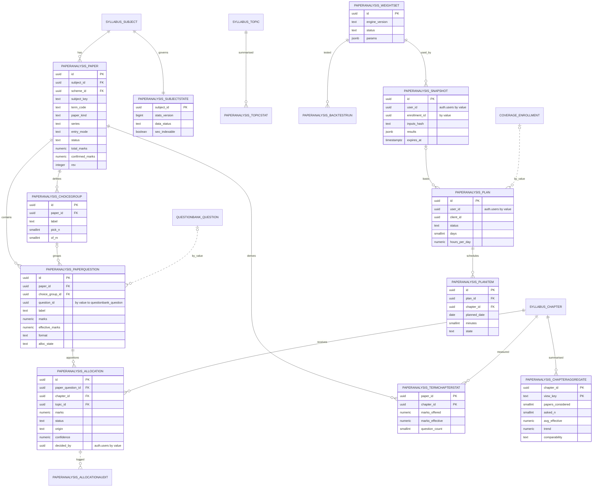
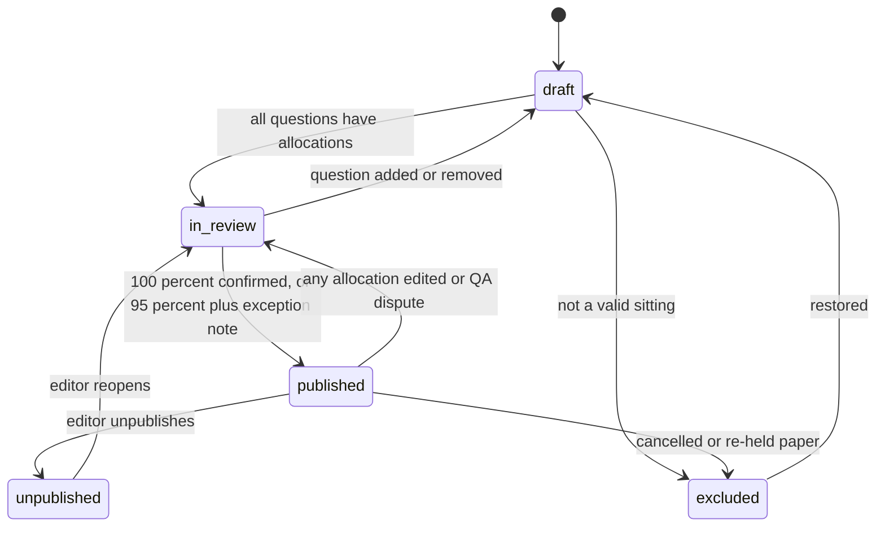
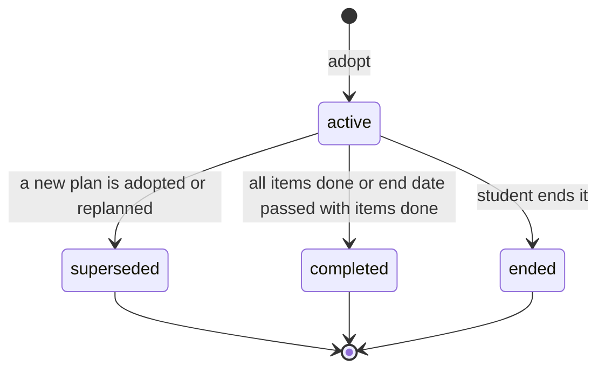

# ERD: F-11 Paper Analysis and Recommendation Engine

| Field | Value |
| --- | --- |
| Linked PRD | `docs/product/prd/F-11-paper-analysis-and-recommendations.md` |
| Django app | `apps/api/modules/paperanalysis` (reference statistics, scoring, planning); uses `core/events.py` and `core/jobs.py` from F-06 |
| Web module | `apps/web/src/modules/paperanalysis` |
| Order | After F-02, F-06 (taxonomy, questions, events) and F-09/F-08 (papers); before F-13 (consumes its provider) |
| Last updated | 2026-10-05 |

**Reading guide.** Section 0 states the decisions. Section 2 lists the 16 tables (prefix `paperanalysis_`). Section 3 is the contract: the interfaces this module provides and consumes, including every `[PROPOSED EXTENSION]` it needs from other modules, the registries, the events and the behavioural reference (formulas, templates, payloads). Sections 5 to 9 give queries, scale, security, migration and module layout with the test plan.

## 0. Design decisions

1. **One module that owns three things only.** The marks-to-chapter **allocation** (with provenance and reviewer), the **statistics read model** derived from confirmed allocations, and the **scoring and planning functions**. It owns no question, attempt or file table. Questions stay in F-06; papers' content stays in F-09/F-08.
2. **Two entry modes, one shape.** A paper is either `from_bank` (items are F-06 questions listed by F-09/F-08) or `skeleton` (question label, marks, format, chapters, no text). Both produce `paperanalysis_paperquestion` rows, so statistics never depend on whether a question text can be hosted.
3. **Marks are paper facts, not question facts.** The marks of a question inside a paper (and its choice group) live on `paperanalysis_paperquestion`, because the bank's marks can differ from the paper's. Marks are `numeric`, never float; apportionment uses a pure largest-remainder function in 0.5-mark steps so parts always sum exactly.
4. **Allocation, not just mapping.** F-06 decides which chapters a question belongs to; this module decides how many of the paper's marks went to each. Confirming an allocation outside the F-06 mapping adds a confirmed secondary mapping through `questionbank.services.set_mapping` (one source of truth for "which chapters", ours for "how many marks").
5. **Human in the loop.** AI suggestions and bank mappings create `suggested` rows. Only `confirmed` rows count. A published paper must be fully confirmed (or carry an explicit exception with at least 95% confirmed). Confirmations are audited; a 10% sample gets a second review.
6. **Statistics are derived and rebuildable.** `termchapterstat` (per paper and chapter), `chapteraggregate` (default view cache) and `topicstat` are written only by `refresh_paper_stats`, under a lock on `paperanalysis_subjectstate`, as upserts plus a targeted delete of stale keys in the same transaction. No delete-then-insert without a lock (the F-02 and F-01.2 audit findings AUD-001 and AUD-002). A management command rebuilds everything from allocations.
7. **Scheme changes are handled at read time.** Statistics are stored against the chapter of the paper's own scheme. For a student on scheme B, a pure function (`domain/comparability.py`) translates through `syllabus_chaptermap` edges (`same` and `merged`, not needing review) and marks everything else as `restructured`. Fixing a chapter map never requires rewriting stored data.
8. **The scoring function is pure and versioned.** `domain/scoring.py` (`ENGINE_VERSION = "ps-1"`) has no database, clock or randomness. Constants come from `paperanalysis_weightset` rows (immutable once active). Every snapshot and plan stores the engine version and weight set id, so any shown number can be reproduced.
9. **Explanations are structured first.** The engine emits reason codes with numbers; templates (versioned, copy-linted) render the sentences. No LLM on the student path.
10. **Honest by construction.** Minimum-data guards, shrinkage, confidence labels, a per-subject **back-test** and a withhold switch (`data_status = withheld`) mean the product refuses to rank when it cannot beat a flat list.
11. **Exclusivity by the database.** One active plan per (student, enrolment) by a partial unique index; one active weight set per scope by a partial unique index; one live paper per (subject, scheme, term, kind, series) by a unique index. Services still lock and catch conflicts to return clean errors, never a 500.
12. **Layering.** views -> services (writes) -> selectors (reads) -> models. Other modules are called through their selectors and services only, receiving DTOs (frozen dataclasses), not models (audit AUD-005). The `syllabus` and `coverage` additions this needs are listed as `[PROPOSED EXTENSION]` in 3.2.
13. **Django is the only gateway.** All tables have RLS enabled with no policies (deny all); user scoping from the JWT; admin routes check `profiles.role` in the database.

## 1. Diagrams

### 1.1 Entities



Not drawn for readability: `paperanalysis_topicstat` attributes, `paperanalysis_backtestrun`, `paperanalysis_settings`, `paperanalysis_flag` (see section 2).

### 1.2 Paper lifecycle



### 1.3 Plan lifecycle



## 2. Tables

Common columns unless stated: `id uuid PK default gen_random_uuid()`, `created_at timestamptz not null default now()`, `updated_at timestamptz not null default now()`. `user_id`-style columns reference `auth.users.id` by value (no cross-schema FK) and are scoped on every query. Enumerations are `text` with a check constraint (values in section 4). Marks are `numeric`, never float. JSONB only for payloads that are genuinely schema-less, each with a schema version column.

### 2.1 `paperanalysis_paper`

| Column | Type | Null | Default | Notes |
| --- | --- | --- | --- | --- |
| subject_id | uuid | no | | FK `syllabus_subject`, restrict (the subject row of the paper's own scheme) |
| scheme_id | uuid | no | | FK `syllabus_scheme`, the scheme in force for the term (set from the term window, editable by an editor with a reason) |
| level_id | uuid | no | | FK `syllabus_level`, denormalised for filters |
| subject_key | text | no | | Stable key copy, comparable across schemes |
| term_code | text | no | | `YYYY-MM`, same format as `syllabus_examterm.code` |
| exam_term_id | uuid | yes | | FK `syllabus_examterm` when the term exists in the taxonomy |
| term_sort | date | no | | First day of the exam if known, else the first of `term_code`; orders papers in a window |
| paper_kind | text | no | `exam` | `exam`, `mtp`, `rtp`, `sample` |
| series | text | no | `''` | For MTP and RTP series (`series-1`), empty for exams |
| title | text | no | | "CA Inter Taxation, May 2025" |
| entry_mode | text | no | | `from_bank`, `skeleton` |
| origin_module | text | no | | `pyq`, `mtp`, `skeleton` |
| origin_ref | text | yes | | F-09/F-08 paper id by value; null for skeleton papers |
| source_url | text | yes | | https only, the official PDF page |
| total_marks | numeric(6,1) | no | | Marks of the paper |
| duration_minutes | smallint | yes | | |
| status | text | no | `draft` | `draft`, `in_review`, `published`, `unpublished`, `excluded` |
| is_limited | boolean | no | false | Published with an exception note (at least 95% confirmed) |
| exception_note | text | yes | | Required when `is_limited` |
| include_in_stats | boolean | no | true | Admin switch; false removes the paper from statistics without deleting it |
| excluded_reason | text | yes | | |
| question_count | smallint | no | 0 | Derived |
| confirmed_marks | numeric(6,1) | no | 0 | Derived: marks of questions with `alloc_state = 'confirmed'` |
| marks_objective | numeric(6,1) | no | 0 | Derived: formats `mcq`, `case_mcq` (effective marks) |
| marks_descriptive | numeric(6,1) | no | 0 | Derived: formats `descriptive`, `practical` |
| marks_theory | numeric(6,1) | no | 0 | Derived with the rule in 3.5 (theory versus practical) |
| marks_practical | numeric(6,1) | no | 0 | |
| marks_optional_offered | numeric(6,1) | no | 0 | Marks in choice groups as offered |
| marks_attemptable | numeric(6,1) | no | 0 | Compulsory marks plus `pick_n x marks_each` per group |
| rev | integer | no | 1 | Optimistic lock, incremented by every write that touches the paper or its questions |
| published_at, published_by | timestamptz, uuid | yes | | |
| created_by | uuid | no | | Editor |

Constraints: unique `(scheme_id, subject_key, term_code, paper_kind, series)`; check `status = 'published'` implies `confirmed_marks >= 0.95 x total_marks` and (`is_limited` or `confirmed_marks = total_marks`) (enforced in the publish service and by a deferred check trigger, 3.5); check `total_marks > 0`; check `is_limited` implies `exception_note is not null`; check `entry_mode = 'skeleton'` implies `origin_ref is null`. Indexes: `(subject_key, scheme_id, term_sort desc)` where `status = 'published' and include_in_stats` (statistics windows, Q-1); `(status, updated_at desc)` (editor board, Q-8); `(origin_module, origin_ref)` where `origin_ref is not null`.

### 2.2 `paperanalysis_choicegroup`

| Column | Type | Null | Default | Notes |
| --- | --- | --- | --- | --- |
| paper_id | uuid | no | | FK `paperanalysis_paper`, restrict |
| label | text | no | | "Q2 to Q6" |
| pick_n | smallint | no | | Questions the student must answer |
| of_m | smallint | no | | Questions offered |
| note | text | yes | | Editor note, for example the wording on the paper |

Unique `(paper_id, label)`. Checks: `pick_n >= 1`, `of_m >= pick_n`. Rows are deleted only while the paper is not published (service rule).

### 2.3 `paperanalysis_paperquestion`

| Column | Type | Null | Default | Notes |
| --- | --- | --- | --- | --- |
| paper_id | uuid | no | | FK, restrict |
| label | text | no | | "3(b)" as printed |
| position | smallint | no | | Order in the paper |
| question_id | uuid | yes | | `questionbank_question.id` by value (hot link, version-independent); null for skeleton |
| question_version_id | uuid | yes | | Pinned version at the time of tagging |
| marks | numeric(5,1) | no | | Marks in this paper |
| choice_group_id | uuid | yes | | FK `paperanalysis_choicegroup`, restrict |
| effective_marks | numeric(6,2) | no | | `marks x pick_n / of_m` when in a group, else `marks`; set by the service on every change |
| format | text | no | | `mcq`, `case_mcq`, `descriptive`, `practical` |
| nature | text | yes | | F-06 `nature` value; drives theory versus practical |
| section_label | text | no | `''` | "Section A" |
| source_ref | text | no | `''` | "Nov 2024 Q4(b)" |
| tag_hint | text | yes | | Up to 1,000 characters pasted by an editor to help the AI on skeleton papers; editor-only, cleared on publish |
| text_available | boolean | no | true | Set false by the takedown subscriber; numbers stay, text is hidden |
| alloc_state | text | no | `untagged` | `untagged`, `suggested`, `confirmed`, `disputed` |
| confirmed_by, confirmed_at | uuid, timestamptz | yes | | |
| qa_state | text | no | `not_sampled` | `not_sampled`, `queued`, `agreed`, `disputed` |
| qa_by | uuid | yes | | Second reviewer |
| client_id | uuid | yes | | Offline workbench idempotency |
| rev | integer | no | 1 | Optimistic lock for the row |

Constraints: unique `(paper_id, label)`; unique `(paper_id, position)`; check `marks > 0`; unique `(paper_id, client_id)` where `client_id is not null` (partial). Indexes: `(paper_id, alloc_state)` (progress, Q-8); `(question_id)` where `question_id is not null` (asked summaries, Q-6); `(qa_state)` where `qa_state = 'queued'` (QA queue).

### 2.4 `paperanalysis_allocation` (marks apportioned to chapters)

| Column | Type | Null | Default | Notes |
| --- | --- | --- | --- | --- |
| paper_question_id | uuid | no | | FK, restrict |
| chapter_id | uuid | no | | FK `syllabus_chapter`, restrict (chapter of the paper's scheme) |
| topic_id | uuid | yes | | FK `syllabus_topic` (R3 uses it; R1 may leave null) |
| subject_id | uuid | no | | FK `syllabus_subject` |
| scheme_id | uuid | no | | FK `syllabus_scheme` |
| subject_key, chapter_key | text | no | | Stable keys |
| marks | numeric(5,2) | no | | Marks given to this chapter, multiples of 0.5 unless an editor overrides with a reason |
| share | numeric(4,3) | no | | `marks / paper_question.marks`, derived |
| status | text | no | `suggested` | `suggested`, `confirmed`, `rejected`, `disputed` |
| origin | text | no | `editor` | `bank_mapping`, `ai`, `editor`, `import`, `remap` |
| basis | text | no | `manual` | `single` (all marks to one chapter), `even`, `weighted`, `manual` |
| confidence | numeric(3,2) | yes | | For `ai` and `bank_mapping` rows |
| rationale | text | yes | | At most 200 characters, editor-facing |
| ai_call_ref | uuid | yes | | Shared AI ledger row by value (X-04 `ingestion_aicall`; see 3.1) |
| model, prompt_version | text | yes | | For example `gemini-...`, `alloc-1` |
| suggested_at | timestamptz | yes | | |
| decided_by, decided_at | uuid, timestamptz | yes | | Reviewer of record for `confirmed` rows |

Constraints: check `marks > 0`; unique `(paper_question_id, chapter_id, coalesce(topic_id, '00000000-0000-0000-0000-000000000000'))` where `status <> 'rejected'`; check `status = 'confirmed'` implies `decided_by is not null`; check `origin = 'ai'` implies `prompt_version is not null`. **Sum invariant:** for a paper question with `alloc_state = 'confirmed'`, the sum of its `confirmed` allocations equals `paperquestion.marks` (service check under the row lock plus a deferred constraint trigger `paperanalysis_check_alloc_sum`, 3.5; also verified nightly by the `verify_allocations` command). Indexes: `(chapter_id, status) include (paper_question_id, marks)` (stats rebuild and drill-down, Q-2); `(status, origin, suggested_at)` where `status = 'suggested'` (AI review queue); `(decided_by, decided_at)` (editor throughput).

### 2.5 `paperanalysis_allocationaudit` (append only)

| Column | Type | Null | Default | Notes |
| --- | --- | --- | --- | --- |
| id | bigint | no | identity | PK |
| paper_question_id | uuid | no | | By value (survives deletes) |
| allocation_id | uuid | yes | | By value |
| action | text | no | | `suggest`, `confirm`, `edit`, `reject`, `dispute`, `qa_agree`, `qa_disagree`, `unconfirm`, `publish`, `unpublish` |
| actor_id | uuid | yes | | Editor or admin; null for the worker |
| before, after | jsonb | yes | | Allocation sets (`[{chapter_key, topic_key, marks, status}]`), schema version in `v` |
| reason | text | yes | | |
| created_at | timestamptz | no | now() | |

A trigger rejects UPDATE and DELETE. Index `(paper_question_id, created_at)`; `(actor_id, created_at)`.

### 2.6 `paperanalysis_termchapterstat` (derived, per paper and chapter)

| Column | Type | Null | Default | Notes |
| --- | --- | --- | --- | --- |
| paper_id | uuid | no | | PK part, FK, cascade (derived data) |
| chapter_id | uuid | no | | PK part, FK `syllabus_chapter` |
| scheme_id | uuid | no | | |
| subject_key, chapter_key | text | no | | |
| term_code | text | no | | Denormalised |
| term_sort | date | no | | Denormalised |
| paper_kind | text | no | | Denormalised |
| marks_offered | numeric(6,2) | no | | Sum of allocated marks as printed |
| marks_effective | numeric(6,2) | no | | Choice-adjusted |
| marks_compulsory | numeric(6,2) | no | | Allocated marks in questions outside any choice group |
| marks_objective, marks_descriptive | numeric(6,2) | no | | By format |
| marks_theory, marks_practical | numeric(6,2) | no | | By nature rule |
| question_count | smallint | no | | |
| stats_version | bigint | no | | `subjectstate.stats_version` at write |

PK `(paper_id, chapter_id)`. Indexes `(chapter_id, term_sort desc)` include `(marks_effective, paper_kind)` (chapter windows, Q-2) and `(scheme_id, subject_key, term_sort desc)` (subject windows, Q-1). Rows exist only for papers that are `published` and `include_in_stats`; unpublish removes them in the same locked transaction.

### 2.7 `paperanalysis_chapteraggregate` (derived cache of the default view)

| Column | Type | Null | Default | Notes |
| --- | --- | --- | --- | --- |
| chapter_id | uuid | no | | PK part, FK `syllabus_chapter` (chapter of the **current** scheme) |
| view_key | text | no | | PK part, `w6-p0-o1` (window, include practice, include older). Only the default view is cached; other views are computed from `termchapterstat` on request |
| scheme_id, subject_key, chapter_key | | no | | |
| papers_considered | smallint | no | | Papers in the window in which the chapter existed or was comparable |
| asked_n | smallint | no | | Papers with effective marks above 0 |
| avg_effective | numeric(6,2) | no | | Plain average over `papers_considered`; the engine uses its own weights |
| avg_when_asked | numeric(6,2) | yes | | |
| max_effective | numeric(6,2) | yes | | |
| last_asked_term_code | text | yes | | |
| share_of_marks | numeric(5,4) | yes | | Average share of paper marks |
| trend | numeric(4,3) | yes | | `r` of 6.1 in the PRD; null when fewer than 5 papers |
| comparability | text | no | `native` | `native`, `carried`, `restructured`, `new` |
| carried_papers | smallint | no | 0 | |
| weight_basis | text | no | `inferred` | `official`, `inferred`, `prior_only` |
| stats_version | bigint | no | | |
| inputs_hash | text | no | | Hash of contributing paper ids, versions and chapter-map stamp; detects stale rows |
| computed_at | timestamptz | no | now() | |

PK `(chapter_id, view_key)`. Index `(subject_key, scheme_id, view_key)` (subject table, Q-1).

### 2.8 `paperanalysis_topicstat` (derived, R3 topic level; R1 fills only topics with allocations)

Columns: `topic_id uuid` (PK part, FK `syllabus_topic`), `view_key text` (PK part), `chapter_id uuid`, `scheme_id uuid`, `papers_considered smallint`, `asked_n smallint`, `last_asked_term_code text`, `stats_version bigint`, `computed_at timestamptz`. Index `(chapter_id, view_key)`. Serves the "Asked N times" badge at topic scope (Q-6).

### 2.9 `paperanalysis_subjectstate` (control row and lock anchor)

| Column | Type | Null | Default | Notes |
| --- | --- | --- | --- | --- |
| subject_id | uuid | no | | PK, FK `syllabus_subject` |
| scheme_id | uuid | no | | |
| subject_key | text | no | | |
| stats_version | bigint | no | 0 | Incremented on each refresh; used in ETags |
| papers_published | smallint | no | 0 | Exam and practice papers counted for guards |
| exam_papers_published | smallint | no | 0 | |
| papers_target | smallint | no | 10 | For the progress board |
| data_status | text | no | `insufficient` | `insufficient`, `limited`, `ready`, `withheld` |
| withheld_reason | text | yes | | `backtest_below_threshold`, `editor_override` |
| last_backtest_id | uuid | yes | | FK `paperanalysis_backtestrun`, set null |
| seo_indexable | boolean | no | false | Admin switch for the public page |
| min_papers_override | smallint | yes | | Admin, audited |
| updated_by | uuid | yes | | |

`SELECT ... FOR UPDATE` on this row serialises statistics refresh per subject (lock order: paper, then subjectstate; 3.5). One row is created for every published subject by a post-publish hook and the seed command.

### 2.10 `paperanalysis_weightset` (engine constants, in the database)

| Column | Type | Null | Default | Notes |
| --- | --- | --- | --- | --- |
| name | text | no | | "Global ps-1 defaults" |
| engine_version | text | no | | `ps-1`; a set only works with the engine version it names |
| scope_course_id, scope_level_id | uuid | yes | | Null scope means global; level-specific sets override global |
| params | jsonb | no | | Validated by `domain/params.py` (keys and defaults in 3.5) |
| params_schema | smallint | no | 1 | |
| status | text | no | `draft` | `draft`, `active`, `retired` |
| notes | text | yes | | Why this set exists, the back-test it came from |
| created_by | uuid | no | | |
| activated_by, activated_at, retired_at | uuid, timestamptz | yes | | |

Partial unique `(coalesce(scope_level_id, '00000000-0000-0000-0000-000000000000'), engine_version)` where `status = 'active'`. `params` is immutable after leaving `draft` (service rule plus an update trigger). Resolution order: active set for the student's level, else the global active set, else the seeded default in code (never silently different from the seed row).

### 2.11 `paperanalysis_backtestrun`

| Column | Type | Null | Default | Notes |
| --- | --- | --- | --- | --- |
| weightset_id | uuid | no | | FK, restrict |
| engine_version | text | no | | |
| subject_id | uuid | no | | FK |
| scheme_id | uuid | no | | |
| k_fraction | numeric(3,2) | no | 0.30 | Top share of chapters examined |
| papers_used | smallint | no | | Exam papers in the replay |
| folds | smallint | no | | Number of train-then-test steps |
| marks_captured | numeric(5,4) | yes | | Mean share of the test paper's marks inside the top-k chapters |
| baseline_flat | numeric(5,4) | yes | | `k_fraction` (a flat ranking), by construction |
| baseline_last_paper | numeric(5,4) | yes | | Top-k of the single most recent paper |
| lift | numeric(5,3) | yes | | `marks_captured / baseline_flat` |
| metrics | jsonb | yes | | Per fold details, schema version in `v` |
| status | text | no | `queued` | `queued`, `running`, `done`, `failed` |
| job_id | uuid | yes | | `core_job` by value |
| started_at, finished_at | timestamptz | yes | | |
| created_by | uuid | no | | |

Index `(subject_id, created_at desc)` where `status = 'done'`. The fold rule: for each paper from the 4th oldest onward, rank chapters using only earlier papers and measure marks captured in that paper.

### 2.12 `paperanalysis_settings` (per student)

`user_id uuid PK`, `window smallint default 6` (3 to 10), `include_practice boolean default false`, `include_older boolean default true`, `show_reasons_default boolean default true`, `hide_tiers boolean default false`, `default_hours_per_day numeric(3,1) null`, `created_at`, `updated_at`. Row created lazily; reads fall back to defaults.

### 2.13 `paperanalysis_snapshot` (cached recommendation result)

| Column | Type | Null | Default | Notes |
| --- | --- | --- | --- | --- |
| user_id | uuid | no | | Scoped on every query |
| enrollment_id | uuid | no | | `coverage_enrollment.id` by value |
| scope_key | text | no | | Sorted subject keys joined by `+` |
| engine_version | text | no | | |
| weightset_id | uuid | no | | FK, restrict |
| inputs_hash | text | no | | SHA-256 of: weight set id, stats versions of the subjects, coverage progress stamp, practice stamp, days-left bucket, settings revision, weakness source stamp |
| inputs_summary | jsonb | no | | `{days_left, exam_date_source, subjects:[{key, stats_version, data_status}], weakness_sources:[...], v:1}` |
| results | jsonb | no | | Per subject: ranked chapters with components, tier, confidence, reason codes and params; `results_schema` below. At most 64 KB (service check) |
| results_schema | smallint | no | 1 | |
| data_status | text | no | | Worst status across subjects |
| expires_at | timestamptz | no | | `created_at + 30 days` |

Unique `(user_id, enrollment_id, scope_key, inputs_hash)`; creation uses `INSERT ... ON CONFLICT DO NOTHING` then select. Indexes: `(user_id, enrollment_id, scope_key, created_at desc)` (latest, Q-3); `(expires_at)` (prune). Retention: the 3 latest per (user, enrolment, scope) and 30 days.

### 2.14 `paperanalysis_plan`

| Column | Type | Null | Default | Notes |
| --- | --- | --- | --- | --- |
| user_id | uuid | no | | |
| enrollment_id | uuid | no | | By value |
| client_id | uuid | no | | Idempotency key |
| status | text | no | `active` | `active`, `completed`, `ended`, `superseded` |
| days | smallint | no | | 1 to 120 |
| hours_per_day | numeric(3,1) | no | | 0.5 to 16 |
| tz | text | no | | Student's time zone at adoption |
| start_date, end_date | date | no | | Local dates |
| subject_keys | text[] | no | | |
| balance_subjects | boolean | no | false | |
| snapshot_id | uuid | yes | | FK `paperanalysis_snapshot`, set null on prune |
| engine_version | text | no | | |
| weightset_id | uuid | no | | FK, restrict |
| summary | jsonb | no | | `{covered_share, left_out_share, hours_used, chapters_n, v:1}` |
| parent_plan_id | uuid | yes | | FK self, set null: replan chain |
| ended_at | timestamptz | yes | | |

Partial unique `(user_id, enrollment_id)` where `status = 'active'` (one active plan, enforced by the database); unique `(user_id, client_id)`. Index `(user_id, created_at desc)`. Retention 12 months after `ended_at`.

### 2.15 `paperanalysis_planitem`

| Column | Type | Null | Default | Notes |
| --- | --- | --- | --- | --- |
| plan_id | uuid | no | | FK cascade |
| user_id | uuid | no | | Denormalised for the Today provider query |
| chapter_id | uuid | no | | FK `syllabus_chapter`, restrict |
| subject_key, chapter_key | text | no | | |
| planned_date | date | no | | Local date |
| position | smallint | no | | Order within the day |
| minutes | smallint | no | | |
| mode | text | no | `full` | `full`, `key_points` |
| expected_gain | numeric(5,2) | no | | Marks, from the engine, shown as "estimate" |
| mph | numeric(5,2) | no | | Expected marks per hour at planning time |
| state | text | no | `planned` | `planned`, `done`, `skipped` |
| done_at | timestamptz | yes | | |
| moved_from | date | yes | | |

Unique `(plan_id, chapter_id)`. Indexes `(plan_id, planned_date, position)`; `(user_id, planned_date)` where `state = 'planned'` (Today, Q-5).

### 2.16 `paperanalysis_flag` (student reports and system drift alerts)

| Column | Type | Null | Default | Notes |
| --- | --- | --- | --- | --- |
| user_id | uuid | yes | | Null for system flags |
| source | text | no | `student` | `student`, `system` |
| target_type | text | no | | `allocation`, `paper`, `recommendation`, `drift` |
| target_id | uuid | no | | |
| note | text | yes | | At most 500 characters, plain text |
| status | text | no | `open` | `open`, `accepted`, `rejected`, `duplicate` |
| resolved_by, resolved_at | uuid, timestamptz | yes | | |

Partial unique `(user_id, target_type, target_id)` where `status = 'open' and user_id is not null`; unique `(target_type, target_id)` where `source = 'system' and status = 'open'` (a drift alert is created once). Index `(status, created_at)`. A `drift` flag is raised when the F-06 primary chapter of a question no longer matches the largest confirmed allocation.

## 3. Relationships to other modules and the contract

### 3.1 Foreign keys and by-value references

| From | To | Rule |
| --- | --- | --- |
| all `user_id`, `created_by`, `decided_by`, `confirmed_by`, `published_by`, `resolved_by` | `auth.users.id` | By value, no cross-schema FK; scoped on every query |
| `paperanalysis_paper` (`subject_id`, `scheme_id`, `level_id`, `exam_term_id`), `paperanalysis_allocation`, `paperanalysis_termchapterstat`, `paperanalysis_chapteraggregate`, `paperanalysis_topicstat`, `paperanalysis_planitem`, `paperanalysis_subjectstate` | `syllabus_*` | Real FKs, `restrict`. Reads go through `syllabus.selectors` DTOs; this module never writes syllabus data |
| `paperanalysis_paperquestion.question_id`, `question_version_id` | `questionbank_question`, `_questionversion` | By value (like `practice_attemptanswer`); validated by `questionbank.selectors` at tagging; versions are never hard-deleted |
| `paperanalysis_paper.origin_ref` | F-09 or F-08 paper id | By value; resolved through the paper-source registry (3.3), never by importing F-09 |
| `paperanalysis_allocation.ai_call_ref` | Shared AI ledger (X-04 `ingestion_aicall` today) | By value; becomes an FK if the ledger is moved to a shared `core` table `[PROPOSED: shared AI ledger]` |
| `paperanalysis_snapshot.enrollment_id`, `paperanalysis_plan.enrollment_id` | `coverage_enrollment.id` | By value; checked through `coverage.selectors.exam_context(user_id, enrollment_id)` which returns nothing for foreign ids |
| `paperanalysis_backtestrun.job_id` | `core_job.id` | By value |

Dependency direction (no cycles): `paperanalysis -> questionbank, practice (accuracy), tracking (time per chapter), coverage (progress, exam context), syllabus`, and `paperanalysis -> core.events, core.jobs`. F-09, F-08, F-10 and F-13 depend on `paperanalysis` through its registries and selectors; `paperanalysis` imports none of them.

### 3.2 Public service and selector interfaces (the contract)

Consumers call these functions and nothing else. Signatures are Python 3.12; DTOs are frozen dataclasses.

```python
# ---- paperanalysis/selectors.py (read only) ----------------------------------------------------------------
def subject_statuses(user_id: UUID, *, enrollment_id: UUID | None = None) -> list[SubjectStatus]   # key, data_status, papers_published/target, days_left
def chapter_stats(subject_id: UUID, *, window: int = 6, include_practice: bool = False, include_older: bool = True,
                  scheme_id: UUID | None = None) -> ChapterStatsView      # table rows + comparability + weight_basis; default view served from the cache table
def patterns(subject_id: UUID, *, window: int = 6, include_practice: bool = False) -> PatternView   # per paper objective/descriptive, theory/practical, choice groups
def chapter_history(chapter_id: UUID, *, window: int = 10, include_practice: bool = True, viewer_id: UUID | None = None) -> ChapterHistory
def chapter_priority(user_id: UUID, enrollment_id: UUID | None = None, subject_ids: Sequence[UUID] | None = None,
                     *, settings: PriorityOptions | None = None) -> PriorityView   # snapshot-backed (recompute when the inputs hash changed); safe on thin data (ranking "withheld")
def asked_summary(question_ids: Sequence[UUID], *, window: int = 8) -> dict[UUID, AskedSummary]
    # AskedSummary(scope: "question"|"topic"|"chapter", asked_n, window_n, last_asked_term_code, last_asked_year, label_key)
def inferred_chapter_weights(scheme_id: UUID) -> dict[UUID, InferredWeight]     # R3, for F-02 weighted coverage
def my_active_plan(user_id: UUID, enrollment_id: UUID | None = None) -> PlanView | None
def todays_items(user_id: UUID, local_date: date, *, limit: int = 2) -> list[PlanItemView]   # used by the Today provider

# ---- paperanalysis/services.py (writes; actor-checked) ------------------------------------------------------
def create_paper(editor_id: UUID, *, subject_id: UUID, term_code: str, paper_kind: str, series: str = "", entry_mode: str,
                 origin_ref: str | None = None, total_marks: Decimal, duration_minutes: int | None = None, source_url: str | None = None) -> Paper
def import_skeleton_csv(editor_id: UUID, paper_id: UUID, rows: Iterable[dict], *, dry_run: bool) -> ImportReport       # one transaction, row-level errors
def sync_from_source(editor_id: UUID, paper_id: UUID) -> SyncReport         # pulls items from the registered paper source; idempotent on (paper_id, label)
def set_allocations(editor_id: UUID, paper_question_id: UUID, rows: Sequence[AllocationIn], *, rev: int, origin: str = "editor") -> PaperQuestion   # locks, checks sum, audits
def confirm_question(editor_id: UUID, paper_question_id: UUID, *, rev: int) -> PaperQuestion
def request_suggestions(editor_id: UUID, paper_id: UUID) -> Job             # enqueues job type paperanalysis.suggest; 429 ai_budget_exceeded when over budget
def publish_paper(editor_id: UUID, paper_id: UUID, *, rev: int, exception_note: str | None = None) -> Paper     # locks paper then subjectstate; refreshes stats; emits event
def unpublish_paper(editor_id: UUID, paper_id: UUID, *, reason: str) -> Paper
def decide_qa(editor_id: UUID, paper_question_id: UUID, *, agree: bool, note: str = "") -> PaperQuestion
def set_weightset(admin_id: UUID, ...) ; def activate_weightset(admin_id: UUID, weightset_id: UUID) -> WeightSet
def queue_backtest(admin_id: UUID, subject_id: UUID, weightset_id: UUID) -> BacktestRun
def preview_plan(user_id: UUID, inputs: PlanInputs) -> PlanPreview         # no write
def adopt_plan(user_id: UUID, *, client_id: UUID, inputs: PlanInputs, snapshot_id: UUID | None) -> PlanView      # idempotent; supersedes the active plan atomically
def replan(user_id: UUID, plan_id: UUID, *, client_id: UUID) -> PlanView
def update_plan_item(user_id: UUID, item_id: UUID, *, state: str | None = None, moved_to: date | None = None) -> PlanItemView
def end_plan(user_id: UUID, plan_id: UUID) -> None
def flag(user_id: UUID, target_type: str, target_id: UUID, note: str) -> Flag
def delete_all_for_user(user_id: UUID) -> DeleteReport; def export_for_user(user_id: UUID) -> dict
```

**`[PROPOSED EXTENSION]` additions this module needs from other modules** (each small, additive, read-only unless noted; the owners decide naming):

| Module | Addition | Why |
| --- | --- | --- |
| F-02 `syllabus.selectors` | `chapter_dtos(subject_id) -> list[ChapterDTO]` (id, key, name, subject_id, section, marks_min, marks_max, weight_source, est_study_minutes, topic_count, sort_order, is_active); `subject_dto(subject_id)` (key, name, total_marks, scheme_id, level_id, paper_number); `chapter_map_edges(to_scheme_id, from_scheme_id=None) -> list[MapEdge]` (from_chapter_id, to_chapter_id, relation, carry_ratio, needs_review, confidence); `chapter_map_stamp(scheme_id) -> str`; `scheme_for_term(level_id, term_code) -> SchemeDTO` | Avoid foreign-model queries (audit AUD-005); scheme comparability; cache hash |
| F-02 `coverage.selectors` | `exam_context(user_id, enrollment_id=None) -> ExamContext` (enrollment_id, scheme_id, level_id, exam_date, term_code, daily_hours, subject_ids incl. electives); existing `coverage_pct_by_chapter` and `progress_stamp` are used as they are | Days left, enrolled subjects, hours per day |
| F-01.2 `tracking.selectors` | `seconds_by_chapter(user_id, chapter_ids) -> dict[UUID, ChapterTime]` (all-time seconds and last tracked date, one query on the rollup table); `student_tz(user_id) -> str` | Personal pace and local dates |
| F-06 `questionbank.selectors` | `stem_text(question_ids) -> dict[UUID, str]` (plain text of the live version, no keys, up to 1,500 characters); `duplicate_cluster_ids(question_ids) -> dict[UUID, list[UUID]]` (confirmed duplicates and variants) | AI suggestion prompt; "Asked N times" at question scope |
| F-09 / F-08 | `register_paper_source` implementation (3.3) | Papers without importing F-09 |
| F-10 | `register_weakness_source` implementation | Weakness signal |
| F-13 | `today.registry.register_task_provider` and `ProviderSpec` (3.3) | Today tasks |
| X-01 | `notifications.services.notify(user_id, kind, payload)` | "New analysis" and plan check-ins |
| Shared AI client | `integrations.gemini.generate_json(prompt_id, version, payload, *, budget_scope) -> AIResult` returning call id, parsed JSON, token counts and cost in paise, writing the shared ledger | AI suggestions with cost accounting |

### 3.3 Registries (extension points)

```python
# paperanalysis/registry.py
register_paper_source(origin_module: str, source: PaperSource)
    # PaperSource(get_paper(origin_ref) -> PaperView, list_papers(subject_key, scheme_id=None) -> list[PaperRef])
    # PaperView(title, subject_key, scheme_code, term_code, paper_kind, series, total_marks, duration_minutes, source_url,
    #           choice_groups[ChoiceGroupView(label, pick_n, of_m)],
    #           items[PaperItem(label, position, question_id, version_id, marks, section_label, choice_group_label, format, nature, source_ref)])
    # F-09 registers "pyq", F-08 registers "mtp". The built-in "skeleton" source needs no registration.
register_weakness_source(name: str, fn: Callable[[UUID, Sequence[UUID]], Mapping[UUID, WeaknessSignal]], *, priority: int = 100)
    # WeaknessSignal(answered:int, correct:float, source:str, updated_at). Lowest priority number wins per chapter; built-ins: "practice_accuracy" (priority 100, over practice.selectors.accuracy)
register_reason_template(code: str, template: ReasonTemplate)   # code, version, text, params; used for tests and for later languages

# F-13 contract this module registers into (defined by F-13; shown here so both sides match)
today.registry.register_task_provider(name: str, spec: ProviderSpec)
    # ProviderSpec(label, flag="paper_analysis_planner", fetch(user_id, local_date, limit) -> list[TaskProposal],
    #              on_complete(user_id, task_dedupe_key) -> None, default_enabled=True, weight_hint=50)
    # TaskProposal(dedupe_key=f"pa:{plan_id}:{chapter_id}:{date}", kind="priority_chapter", title, subtitle, deep_link,
    #              est_minutes, rationale: list[str], source_ref=snapshot_or_plan_id, subject_key, chapter_key, priority)
# registered in PaperAnalysisConfig.ready(): register_task_provider("paper_priority", ...)
```

Registration happens in the owning app's `AppConfig.ready()` (same pattern as `register_live_timer_provider`). A consumer never edits `paperanalysis` to add behaviour.

### 3.4 Domain events (envelope as F-06 ERD 3.4)

| Event | Emitted when | Payload (key fields) | Consumers |
| --- | --- | --- | --- |
| `paperanalysis_paper_published` | `publish_paper` commits | `paper_id`, `subject_key`, `scheme_id`, `term_code`, `paper_kind`, `chapter_ids[]`, `is_limited`, `stats_version` | F-09 (badge cache), X-01 (new analysis, deferred), search and cache invalidation |
| `paperanalysis_paper_unpublished` | `unpublish_paper` or automatic reopen | `paper_id`, `subject_key`, `reason` | F-09, cache |
| `paperanalysis_stats_refreshed` | after a refresh transaction (coalesced per subject per minute) | `subject_key`, `scheme_ids[]`, `stats_version` | Snapshot staleness is by hash, so this is informational; analytics |
| `paperanalysis_plan_adopted` | `adopt_plan` or `replan` commits | `plan_id`, `enrollment_id`, `chapters_n`, `days`, `parent_plan_id` | F-13 (refresh), X-01 |

Consumed: `question_version_live` (`change_kind = remap` or any mapping change): raises a `drift` flag when the F-06 primary chapter no longer matches the largest confirmed allocation of a paper question (deferred, idempotent on event id); `question_taken_down` and `question_unpublished`: set `text_available = false` on matching paper questions (numbers stay; deferred). Subscribers are idempotent on `event.id` and never fail the emitter.

### 3.5 Behavioural reference (what the tests assert)

**Effective marks.** `effective = round_half_up(marks x pick_n / of_m, 2)` for a question in a choice group, else `marks`. A group's attemptable marks are `pick_n x marks_each` (equal marks) or the sum of the `pick_n` largest members when marks differ (conservative, documented).

**Theory versus practical.** `practical` if `format = practical` or `nature in (practical, application)`, else `theory`. For every paper, `marks_theory + marks_practical = sum(effective_marks)`.

**Apportionment (`domain/apportion.py`, pure).** Input marks `M`, non-negative weights `w` with a positive sum, step `s = 0.5` (or `0.1` when `M` is not a multiple of 0.5). `ideal_i = M x w_i / sum(w)`; `base_i = floor(ideal_i / s) x s`; the remainder `R = M - sum(base_i)` is a multiple of `s`; give `s` to the `R / s` entries with the largest `ideal_i - base_i` (ties: larger weight, then lower index). Invariants (property tests): result sums to `M` exactly in `Decimal`; no part differs from its ideal by more than `s`; deterministic. Example: 14 marks, weights 0.6 and 0.4 give 8.5 and 5.5.

**Confirmed-sum invariant.** A paper question can enter `confirmed` only when its `confirmed` allocation marks sum to `marks` in `Decimal`. Enforced by (1) the service under `SELECT ... FOR UPDATE` on the paper question, (2) a deferrable constraint trigger `paperanalysis_check_alloc_sum` on allocation and paper question (Postgres), (3) the nightly `verify_allocations` command which alerts on any difference (Sentry), and (4) a hypothesis test that applies random edit sequences.

**Statistics refresh (`refresh_paper_stats(paper_id)`, called by publish and unpublish and the rebuild command).** Lock order everywhere: paper, then `subjectstate`. Steps in one transaction: lock the subject state row; if the paper is published and `include_in_stats`, upsert `termchapterstat` rows for the paper's chapters (`INSERT ... ON CONFLICT (paper_id, chapter_id) DO UPDATE`) and delete rows of that paper whose chapter is no longer allocated; otherwise delete all of the paper's rows; recompute the aggregate rows and topic rows of the affected current-scheme chapters (the paper's own scheme plus every scheme with chapter-map edges from it) with upserts, deleting aggregates that no longer have inputs; increment `stats_version`; recompute `data_status`; emit the event. No delete-then-insert without the lock; two concurrent publishes serialise on the subject row and yield the same result as a rebuild (tested on Postgres with two threads).

**Window and weights per paper.** Papers are the newest `window` published, included papers of the subject by `term_sort desc`; for the engine the window is `window_max` regardless of the student's display window (display window affects the table only). Kind weights, recency and carry weights are as PRD 6.1.

**Comparability (`domain/comparability.py`, pure).** For a current-scheme chapter `c` and a paper in scheme `p`: if `p` is the current scheme, `native` with its own allocations. Else take the edges into `c` from scheme `p`: none means the chapter did not exist then (the paper does not count for `c`); all edges `same` or `merged` and not `needs_review` means `carried` with marks the sum over the source chapters; any `split`, `partial`, or `needs_review` edge means `restructured` (the paper does not count for `c`). A chapter with no native paper and no usable edge is `new` and uses the prior.

**Data status.** `insufficient`: fewer than `min_papers_to_rank` (4) published included papers. `withheld`: at least 6 exam papers and the latest done back-test has `lift < min_backtest_lift`, or an admin override. `limited`: 4 to 5 papers, or practice papers only, or any limited paper in the window. `ready`: otherwise.

**Params of weight set `ps-1` (schema 1; defaults).**

| Key | Default | Meaning |
| --- | --- | --- |
| `window_max` | 10 | Maximum papers used by the engine |
| `trend_min_papers` | 5 | Fewer papers: trend neutral (0.5) |
| `recency_lambda` | 0.85 | Per-sitting decay of paper weight |
| `kind_weight` | exam 1.0, mtp 0.4, rtp 0.3, sample 0.3 | Source weights |
| `carry_weight` | 0.7 | Discount for carried older-scheme papers |
| `shrink_k` | 2.0 | Strength of the prior for expected marks |
| `acc_prior_strength` | 5 | Pseudo-answers at 50% accuracy |
| `weights_far`, `weights_near` | H .40/.50, F .15/.15, T .05/.05, W .20/.10, G .20/.20 | Component weights at urgency 0 and 1 |
| `urgency_ref_days` | 120 | `u = clamp(1 - days_left / ref, 0, 1)` |
| `tier_core_share`, `tier_next_share` | 0.50, 0.80 | Cumulative expected-marks cut points |
| `target_ready` | 0.75 | Readiness the plan aims for |
| `skim_hours_factor`, `skim_gain_factor` | 0.5, 0.6 | Key-points mode |
| `budget_buffer` | 0.10 | Hours held back |
| `min_papers_for_stats`, `min_papers_to_rank`, `min_exam_papers_for_core` | 3, 4, 2 | Guards |
| `pace_clamp`, `pace_prior_n`, `pace_min_tracked_minutes` | [0.6, 1.8], 3, 30 | Personal pace |
| `fallback_minutes_per_topic`, `fallback_minutes_default` | 40, 240 | Hours fallback chain |
| `backtest_k`, `min_backtest_lift` | 0.30, 1.15 | Back-test guard |
| `default_days_left` | 90 | When no exam date |
| `today_max_tasks` | 2 | Provider limit |

Validation rejects weights that do not sum to 1.0 (tolerance 0.001), lambdas outside (0, 1], and negative values. `params` is stored whole, so a snapshot can name the exact set.

**Reason codes and sentence templates (`ps-1`, English, template version 1).** Templates are copy-linted (forbidden words in PRD 7.5). At most 3 reasons are shown per chapter, picked by salience; caveats are listed separately.

| Code | Params | Sentence |
| --- | --- | --- |
| `asked_in_window` | `max`, `asked_n`, `window_n` | "Carried up to {max} marks and appeared in {asked_n} of the last {window_n} sittings" |
| `avg_when_asked` | `avg`, `asked_n`, `window_n` | "Carried {avg} marks on average in the {asked_n} of the last {window_n} sittings where it appeared" |
| `high_expected_marks` | `share_pct` | "Among the heaviest in this paper in past sittings: about {share_pct}% of the marks (an estimate from history)" |
| `rising_trend` / `falling_trend` | `recent`, `earlier` | "Marks have been rising: {recent} on average in the last 3 sittings against {earlier} before" (falling: "lower") |
| `weak_practice` | `correct`, `answered` | "You answered {correct} of {answered} practice questions correctly here" |
| `not_enough_practice` | `answered` | "Not enough practice yet to judge your strength here ({answered} answers)" |
| `low_coverage` / `high_coverage` | `cov_pct` | "You have covered {cov_pct}% of this chapter" (high: "...so revising is a lower priority") |
| `urgency_shift` | `days_left` | "With {days_left} days left, expected marks count more than weak spots" |
| `official_weight` | `lo`, `hi` | "The Institute's published weight for this section is {lo} to {hi} marks" |
| `effort_estimate` | `hours`, `mph`, `basis` | "About {hours} hours {basis}; roughly {mph} expected marks per hour" (basis: "at your own pace", "from the editor estimate", "from the number of topics") |
| caveat `limited_history` | `papers_n` | "Only {papers_n} sittings of history, so treat this as a rough guide" |
| caveat `carried_history` | `carried_n`, `scheme_name` | "Includes {carried_n} papers from the {scheme_name} scheme" |
| caveat `restructured` / `new_chapter` | | "This chapter was restructured, so earlier papers are not counted" / "New chapter with no paper history; the subject average is used" |
| caveat `practice_papers_only` | | "Based on practice papers only" |

**Planner (`domain/planner.py`, pure).** As PRD 6.2. Candidates carry `chapter_id`, `subject_key`, `E`, `gain`, `hours`, `mph`, `sort_order`. Deterministic ordering key: `(-mph, -E, sort_order, chapter_id)`. Tests: budget never exceeded; value at least half of a brute-force optimum on random instances of up to 12 items; monotone (a larger budget never reduces total gain); balance option keeps each subject at or above its proportional share when feasible. Day assignment: items are laid out in value-per-hour order, filling each day to its hours (a chapter can span days; the first day gets the highest ratio), skipping days the student marks as off.

**AI suggestion contract (job `paperanalysis.suggest`).** Input per question: `stem_text` (from F-06 or the editor's `tag_hint`), `marks`, the subject's chapter list (key, name, section; at most 80), existing F-06 mapping. Output JSON schema `alloc-1`: `{"allocations":[{"chapter_key","topic_key":null,"share","confidence","rationale"}]}`; server validation: keys must exist, shares sum to 1.0 within 0.02, at most 4 chapters, rationale at most 200 characters; invalid outputs are discarded and counted. Temperature 0; prompt text lives in `paperanalysis/prompts/alloc_1.md` and its version is stored on each row. Bank mappings are suggested without an AI call (primary gets the full marks unless several confirmed mappings exist, then `weighted` by equal shares). The question text is never logged. A daily budget check precedes each batch.

### 3.6 Payload contracts

**`PriorityView` (response of `GET recommendations/`, `v: 1`).**

```json
{
  "v": 1, "snapshot_id": "uuid", "engine_version": "ps-1", "weightset_id": "uuid", "template_version": 1,
  "generated_at": "2026-10-05T09:00:00+05:30", "days_left": 45, "exam_date_source": "enrolment",
  "disclaimer_key": "history_not_guarantee_v1",
  "subjects": [{
    "subject_key": "taxation", "data_status": "ready", "ranking": "available",
    "papers_considered": 6, "sources": {"exam": 6, "mtp": 0, "rtp": 0}, "confidence": "medium",
    "core_share_of_marks": 0.50, "tiers": {"core": 7, "next": 9, "rest": 14},
    "chapters": [{
      "chapter_id": "uuid", "chapter_key": "gst-itc", "name": "GST: Input Tax Credit", "rank": 1,
      "score": 71.4, "tier": "core", "confidence": "medium",
      "components": {"H": 1.0, "F": 0.83, "T": 0.6, "W": 0.55, "G": 0.8},
      "expected_marks": 9.0, "weight_basis": "inferred", "comparability": "native",
      "history": {"asked_n": 5, "window_n": 6, "avg_when_asked": 10.8, "max": 18.0, "last_asked_term_code": "2025-05", "by_term": [{"term_code": "2025-05", "marks": 18.0, "kind": "exam"}]},
      "student": {"coverage_pct": 20, "answered": 20, "correct": 9, "weakness_source": "practice_accuracy"},
      "reasons": [{"code": "asked_in_window", "params": {"max": 18.0, "asked_n": 5, "window_n": 6}, "sentence": "..."}],
      "caveats": [], "links": {"chapter": "/app/analysis/taxation/gst-itc", "practise": "/app/practice/new?chapter=...", "syllabus": "/app/syllabus/..."}
    }]
  }]
}
```

When guards fail, `ranking` is `withheld` or `unavailable`, `chapters` carries statistics without scores, and `reason` names the guard (`papers`, `backtest_below_threshold`, `no_enrolment`). `rank` and `score` are never present without `confidence`.

**`AskedSummary`:** `{"scope":"topic","asked_n":4,"window_n":8,"last_asked_term_code":"2024-11","label_key":"asked_topic","label":"This topic appeared in 4 of the last 8 sittings"}`; `scope` falls back from `question` (duplicate cluster) to `topic` to `chapter`, and the label states which. Never shown when `window_n < 3`.

**Plan preview:** `{"v":1,"inputs":{...},"budget_hours":40.5,"hours_used":38.5,"items":[{"chapter_id","chapter_key","minutes","mode","expected_gain","mph","effort_basis"}],"covered_share":0.68,"left_out":{"chapters_n":14,"share":0.32},"snapshot_id","warnings":["low_confidence_subject:audit"]}`.

**Skeleton CSV columns:** `label,position,marks,format,nature,section,choice_group,pick_n,of_m,chapter_key,topic_key,share,source_ref,tag_hint`. Several rows with the same `label` and different chapters form one question with several allocations; `share` values per label must sum to 1.0 (or marks given as `alloc_marks`).

### 3.7 What consumers must not do

1. Create their own tables of "chapter weightage" or past-paper statistics; call the selectors.
2. Write to `paperanalysis_*` tables or import its models.
3. Show `rank`, `score` or `tier` without the confidence, the sentences and the disclaimer.
4. Store sentences; store the reason codes and params and render with the current template version.
5. Compute their own "asked N times"; call `asked_summary`.
6. Put raw PostHog payloads with chapter-level personal progress into analytics beyond the buckets in PRD 10.1.

### 3.8 Provides and consumes

| Provides | Consumed by |
| --- | --- |
| `asked_summary`, `chapter_stats`, `chapter_history` | F-09 (badges and filters by frequency), F-06 web question detail |
| `chapter_priority`, `todays_items`, provider `paper_priority` | F-13 Today, F-10 (links), X-02 context agent |
| `inferred_chapter_weights` (R3) | F-02 weighted coverage |
| `register_paper_source`, `register_weakness_source`, `register_reason_template` | F-09, F-08, F-10 |
| Events `paperanalysis_*` | F-09, X-01, F-13 |
| `delete_all_for_user`, `export_for_user` | Account deletion service |

| Consumes | Provided by |
| --- | --- |
| Taxonomy DTOs, chapter maps, terms | F-02 `syllabus.selectors` (plus proposed additions) |
| Exam context, coverage percent, progress stamp | F-02 `coverage.selectors` |
| Question labels, mapping, stem text, duplicates; `set_mapping` | F-06 `questionbank` |
| Accuracy by chapter | F-06 `practice.selectors.accuracy` |
| Time per chapter, time zone | F-01.2 `tracking.selectors` (proposed) |
| Paper contents | F-09 and F-08 through `register_paper_source` |
| Events, jobs, AI client | `core.events`, `core.jobs`, `integrations.gemini` |

## 4. Enumerations and reference data

| Name | Values | Stored as | Owner |
| --- | --- | --- | --- |
| Paper kind | exam, mtp, rtp, sample | text + check | code |
| Entry mode | from_bank, skeleton | text + check | code |
| Origin module (paper) | pyq, mtp, skeleton | text + check, new values via `register_paper_source` | code |
| Paper status | draft, in_review, published, unpublished, excluded | text + check | code |
| Paper question format | mcq, case_mcq, descriptive, practical | text + check | code |
| Nature | as F-06 (theory, practical, formula, section, case_law, application) | text, validated in the service | F-06 |
| Alloc state (question) | untagged, suggested, confirmed, disputed | text + check | code |
| QA state | not_sampled, queued, agreed, disputed | text + check | code |
| Allocation status | suggested, confirmed, rejected, disputed | text + check | code |
| Allocation origin and basis | bank_mapping, ai, editor, import, remap; single, even, weighted, manual | text + check | code |
| Audit action | suggest, confirm, edit, reject, dispute, qa_agree, qa_disagree, unconfirm, publish, unpublish | text + check | code |
| Comparability | native, carried, restructured, new | text + check | code |
| Weight basis | official, inferred, prior_only | text + check | code |
| Data status | insufficient, limited, ready, withheld | text + check | code |
| Confidence | high, medium, low, insufficient | not stored on tables (in snapshots) | code |
| Tier | core, next, rest | not stored on tables (in snapshots) | code |
| Weight set status | draft, active, retired | text + check | code |
| Back-test status | queued, running, done, failed | text + check | code |
| Plan status | active, completed, ended, superseded | text + check | code |
| Plan item mode and state | full, key_points; planned, done, skipped | text + check | code |
| Flag target, source, status | allocation, paper, recommendation, drift; student, system; open, accepted, rejected, duplicate | text + check | code |

**Seed data** (migration `paperanalysis.0002_seed_weightset`): one global `ps-1` weight set with the defaults of 3.5 (`status = 'active'`, notes "initial heuristics, not yet back-tested"). The `ensure_subject_states` command creates a `subjectstate` row per published subject. No paper data is seeded; the CA Intermediate launch backlog is entered by editors (PRD 13.1).

## 5. Query patterns

The reads and writes this design must make fast. "Default view" means `w6-p0-o1`.

| # | Query | Served by |
| --- | --- | --- |
| Q-1 | Subject statistics table: all chapters of a scheme's subject with aggregates (default view) | `chapteraggregate (subject_key, scheme_id, view_key)`: one indexed query, at most 80 rows, plus `syllabus.selectors.chapter_dtos`. Non-default views: `termchapterstat (scheme_id, subject_key, term_sort desc)` for the window, at most 10 papers x 80 chapters = 800 rows, aggregated in Python by the pure function |
| Q-2 | Chapter history: per sitting marks and the contributing questions | `termchapterstat (chapter_id, term_sort desc)` then `allocation (chapter_id, status) include (paper_question_id, marks)` joined to paper questions of the window; at most 10 papers x 5 questions |
| Q-3 | Latest recommendation snapshot for (user, enrolment, scope) and hash check | `snapshot (user_id, enrollment_id, scope_key, created_at desc)`, then the unique `(..., inputs_hash)` |
| Q-4 | Recompute inputs for one student (eight subjects at most): coverage percent, accuracy per chapter, seconds per chapter, subject statistics | Four selector calls (one query each), stats from Q-1; a pure function over at most about 500 chapters |
| Q-5 | Today provider: items due on a local date | `planitem (user_id, planned_date)` where `state = 'planned'` (partial) |
| Q-6 | Asked summary for up to 50 questions: paper questions of those ids, confirmed allocations, topic or chapter aggregates, duplicate clusters | `paperquestion (question_id)` partial; `allocation (paper_question_id)`; `topicstat (topic_id, view_key)`; `chapteraggregate (chapter_id, view_key)`; four queries per call, cached 5 minutes in process |
| Q-7 | Editor workbench: a paper with questions and allocations | `paperquestion (paper_id, position)` with prefetch of allocations; at most 60 questions |
| Q-8 | Progress board: counts of papers per subject and status; per paper tagged ratio | `paper (status, updated_at)` and `paper (subject_key, scheme_id, term_sort desc)`; `subjectstate` counters |
| Q-9 | QA queue and AI review queue | `paperquestion (qa_state)` partial; `allocation (status, origin, suggested_at)` partial |
| Q-10 | Refresh transaction for one paper | Allocations of the paper through `paperquestion (paper_id, alloc_state)`; at most 60 questions x 3 chapters; writes at most 80 `termchapterstat` rows and the affected aggregates |
| Q-11 | Back-test replay for a subject | Reads `termchapterstat` for the subject (at most 800 rows), pure function, one insert; runs on the worker |
| Q-12 | Prune expired snapshots and old plans | `snapshot (expires_at)`; `plan (user_id, created_at)` plus `ended_at`; in the maintenance job, batches of 1,000 |

## 6. Storage, scale and retention

### 6.1 Volume assumptions

| Quantity | Year 1 | Year 3 | Basis |
| --- | --- | --- | --- |
| Papers | 300 | 1,500 | CA, CS, CMA subjects (the seed holds 32 CA papers across levels and the CS and CMA subjects) x up to 10 sittings, plus MTP and RTP series at about 1x to 2x the exam papers |
| Paper questions | 6,000 | 40,000 | About 20 to 25 question parts per paper, including skeleton papers |
| Allocations | 9,000 | 60,000 | About 1.5 allocations per paper question (some spread over several chapters) |
| Term chapter statistics | 20,000 | 100,000 | About 60 chapters per paper with marks |
| Chapter aggregates | 3,000 | 6,000 | Chapters of published schemes, default view |
| Monthly active students using analysis | 2,500 | 25,000 | About half of MAU |
| Snapshots | 25,000 | 250,000 | Up to 10 per student per month, pruned to 3 latest per scope and 30 days |
| Plans and items | 1,500 and 15,000 | 15,000 and 150,000 | One in ten students adopts about one plan a quarter, about 10 items each |

All reference tables are tiny; no partitioning is needed. Snapshots are the only table with a notable churn; at year 3 their live size is under 250 MB (about 30 KB each at the 64 KB cap, 3 per scope, most students one or two scopes). Revisit if snapshots exceed 2 GB (then store results compressed or recompute on read).

### 6.2 Caching and hot paths

- Student-independent statistics responses carry `ETag` from `subjectstate.stats_version` and `Cache-Control: private, max-age=60`; public pages use `public, s-maxage=300, stale-while-revalidate=3600`, purged by `paperanalysis_paper_published`.
- The recommendation is served from the latest snapshot when the inputs hash matches. The hash needs: weight set id (one row, cached in process 60 s), stats versions (`subjectstate`), coverage `progress_stamp`, a practice stamp (`max(updated_at)` of the student's chapter rollups through a `[PROPOSED]` `practice.selectors.progress_stamp`, falling back to the day bucket), settings revision. A hit costs 3 to 4 indexed reads.
- Pure scoring on a miss: one subject of 60 chapters in about 1 ms; eight subjects about 10 ms.
- Per-request flag evaluation happens once (the audit's flag latency finding, AUD-003): the flag permission class caches the result on the request object.

### 6.3 Async work (Vercel limits)

Nothing long runs in a request. Jobs on `core_job`, claimed by the worker container planned in X-04 (`run_worker`): `paperanalysis.suggest` (AI suggestions for a paper, chunks of 10 questions, retried with backoff), `paperanalysis.backtest` (replay for a subject), `paperanalysis.rebuild_stats` (admin, per subject or all). Short maintenance (prune snapshots and plans, `verify_allocations`, coalesced stats events) runs from the existing minute cron tick with a 20-second bound. Statistics refresh on publish is synchronous and bounded (Q-10).

### 6.4 Storage buckets

None. Skeleton CSVs are parsed in the request (at most 600 rows and 1 MB, dry run first) and not stored; the audit table keeps the resulting allocations. Question media for `from_bank` papers is F-06's.

## 7. Security

- **Access path:** browser, Django, Postgres. The Supabase Data API stays disabled.
- **RLS:** enabled with no policies on every `paperanalysis_*` table (the post-migrate hook already does this for all public tables; `core/tests/test_row_level_security.py` is extended with the 16 names).
- **Scoping:** every student selector and service takes `user_id` from the verified JWT; no endpoint accepts a user id; plan and snapshot ids are checked against it and return 404 otherwise. Admin routes check `profiles.role` in the database and return 404 for others.
- **Integrity:** the sum invariant and the immutable audit are enforced in the database (triggers) as well as services; unique and partial unique indexes enforce exclusivity (plan, weight set, paper); services lock rows and translate integrity errors into 409s (the pattern the F-02 and F-01 audit asked for).
- **Concurrency rules:** lock order paper, then subjectstate; refresh by upsert; adoption locks the student's active plan row or an advisory lock keyed on `(user_id, enrollment_id)` before superseding; activation of a weight set retires the active one in the same transaction; subscribers are idempotent on `event.id`.
- **Abuse and cost:** throttles `pa_read`, `pa_compute`, `pa_write`, `pa_admin`, `pa_ai`; planner inputs bounded (days 1 to 120, hours 0.5 to 16, at most 8 subjects); AI budget shared with X-04; flags limited to 20 per hour per student; notes sanitised as plain text.
- **PII classification:** settings, snapshots, plans, flags and feedback are personal (study habits); papers, allocations and statistics are not. Question text appears only through F-06 visibility rules (`can_view`); `tag_hint` is editor-only and cleared at publish.
- **Retention and deletion (DPDP):** `delete_all_for_user` removes settings, snapshots, plans, items, student flags (system flags and editor audit rows stay); `export_for_user` returns the same set as JSON. Snapshots 30 days, ended plans 12 months.
- **Secrets:** Gemini key only on the API and worker; tick endpoint secret shared with F-06.
- **Logging:** no question text, no `tag_hint`, no free-text notes in logs or analytics; Sentry `before_send` scrubbing is a prerequisite shared with F-06 (it is not implemented today, audit AUD-020).

## 8. Migration and rollout

Order (all additive, run with `DIRECT_DATABASE_URL`):

1. `paperanalysis.0001_initial`: `paper`, `choicegroup`, `paperquestion`, `allocation`, `allocationaudit`, `subjectstate`, `weightset`, `flag`, with constraints; triggers (`paperanalysis_check_alloc_sum`, audit immutability, weight set params immutability) through `RunSQL` guarded by `vendor == postgresql`.
2. `paperanalysis.0002_seed_weightset`: the global `ps-1` row.
3. `paperanalysis.0003_stats`: `termchapterstat`, `chapteraggregate`, `topicstat`.
4. `paperanalysis.0004_student`: `settings`, `snapshot`, `plan`, `planitem`, `backtestrun`.
5. Post-migrate RLS hook covers the new tables.
6. Cross-module additions land in their own PRs first: F-02 DTO selectors and `exam_context`, F-01.2 `seconds_by_chapter`, F-06 `stem_text` and `duplicate_cluster_ids`. Until a proposed function exists the dependent feature is simply off (the registry or selector returns "not available" and the guard reports `unavailable`).

Notes:

- Tables ship dark: flags `paper_analysis`, `paper_analysis_planner`, `paper_analysis_public` default off; no existing screen changes.
- No backfill. Editors enter papers; the rebuild command can regenerate all statistics from allocations at any time (idempotent).
- Rollback: drop the new tables in reverse order; nothing outside `paperanalysis` is modified (cross-module selectors are additive).
- Capacity check before general availability: a synthetic dataset of 1,500 papers and 100,000 allocations; p95 for the Q-1, Q-4 and Q-6 paths; two-writer concurrency test on publish and adopt.
- Operations: the progress board is the editorial roadmap (target 10 sittings per subject); the weight-set screen records which back-test justified a change.

## 9. Module layout and tests

### 9.1 API

```
apps/api/modules/paperanalysis/
  models.py            Paper, ChoiceGroup, PaperQuestion, Allocation, AllocationAudit, TermChapterStat, ChapterAggregate, TopicStat,
                       SubjectState, WeightSet, BacktestRun, Settings, Snapshot, Plan, PlanItem, Flag
  domain/              apportion.py, effective.py (choice-adjusted marks, theory/practical), aggregate.py (window, trend, frequency),
                       comparability.py, scoring.py (ENGINE_VERSION "ps-1"), explain.py (reason selection, templates), planner.py,
                       backtest.py, params.py (schema and defaults), status.py (data_status), types.py (frozen dataclasses)
  registry.py          paper sources, weakness sources, reason templates
  selectors.py         public contract (3.2) and internal reads; DTO returns only
  services.py          public contract (3.2): papers, allocations, publish, stats refresh, weight sets, plans, flags, DPDP
  stats.py             refresh_paper_stats (locks, upserts), rebuild helpers
  signals_in.py        subscribers for question_version_live, question_taken_down (registered in apps.py)
  providers.py         Today provider (register_task_provider in ready())
  jobs.py              suggest, backtest, rebuild_stats, prune handlers
  prompts/alloc_1.md   AI prompt for allocation suggestions (version in the row)
  permissions.py       IsEditor, IsAdmin, FlagEnabled (one flag read per request)
  serializers.py views.py urls.py   (analysis/, recommendations/, plans/, admin/)
  management/commands/ rebuild_paper_stats, verify_allocations, ensure_subject_states, load_papers_csv
  tests/               domain, services, selectors, API (one file per endpoint group), RLS, concurrency (Postgres only), golden/
```

### 9.2 Web

```
apps/web/src/modules/paperanalysis/
  index.ts             barrel: AnalysisHubContainer, SubjectAnalysisContainer, ChapterHistoryContainer, PlannerContainer, ActivePlanContainer,
                       PriorityList, AskedBadge (for F-09), useAnalysisSettings
  lib/                 api.ts (typed client), filters.ts (zod URL <-> state: tab, window, tier, sort), format.ts (marks, en-IN numbers, sittings labels),
                       explain.ts (sentence rendering from codes with the same template ids; parity test with the server fixtures), plan-form.ts
  hooks/               useSubjectStats, usePriority, usePlanPreview, useActivePlan, useAnalysisFlags, useAdminPaper (offline queue aware)
  components/          PriorityRow, TierGroup, ReasonList, DisclaimerNote, SittingsTable, PatternPanel, PlanBudgetForm, PlanTable, LeftOutSummary,
                       StatusBanner (insufficient, withheld, limited), AllocationEditor, QuestionTagPanel, PaperProgressBoard
  containers/          AnalysisHubContainer, SubjectAnalysisContainer, ChapterHistoryContainer, PlannerContainer, ActivePlanContainer,
                       AnalysisSettingsContainer, admin/PapersBoardContainer, admin/WorkbenchContainer, admin/QaContainer, admin/FlagsContainer,
                       admin/WeightsContainer, admin/BacktestsContainer
packages/design-system: TermStrip, MarksBar, ConfidenceBadge (new, with showcase entries)
```

Routes (thin): `app.analysis.index`, `app.analysis.$subjectKey`, `app.analysis.$subjectKey.$chapterKey`, `app.analysis.plan`, `app.analysis.plan.active`, `app.settings.analysis`, `app.admin.analysis.papers`, `app.admin.analysis.papers.$paperId`, `app.admin.analysis.qa`, `app.admin.analysis.flags`, `app.admin.analysis.weights`, `app.admin.analysis.backtests`, public `courses.$course.$level.$subject.paper-analysis`. All private routes `noindex` through `buildHead`.

### 9.3 Test plan

First tests to write, before UI:

1. **Pure domain (unit and property):** `apportion` (sum exact, bounded error, determinism), effective marks for choice groups, theory/practical split, aggregate window and trend (including fewer than 5 papers), comparability for `same`, `merged`, `split`, `partial`, `needs_review` and new chapters, shrinkage numbers against hand-computed fixtures, scoring components and blend at urgency 0, 0.5 and 1, tier cut points, confidence rules, planner (budget, monotonicity, half-of-optimal property against brute force, determinism, skim mode, balance).
2. **Golden files:** 20 fixture subjects with expected `PriorityView` JSON (scores, tiers, sentences) for `ps-1`; any change to the engine or templates requires bumping the version and regenerating goldens in the same PR.
3. **Copy lint:** every template, string and fixture sentence in this module is checked against the forbidden-phrase list (PRD 7.5) and for the disclaimer presence on ranking surfaces (API payload and web snapshot tests).
4. **Services and API (one file per endpoint group):** create, import (dry run and real, row errors), allocate (sum mismatch 422, `rev` conflict 409), confirm, publish guard (95% rule, exception note), unpublish and auto-reopen on edit, stats refresh equals full rebuild, QA flow, AI suggestion job with a fake client (budget exceeded 429, invalid output discarded), plans (preview, adopt idempotent by `client_id`, replan, supersede), student isolation (404 for another user's plan or snapshot), flag 403 `feature_disabled` on every endpoint (parametrised over all URLs), 401 on every endpoint, throttle tests, `assertNumQueries` on Q-1, Q-4, Q-6.
5. **Concurrency (Postgres only, marked and run in CI):** two simultaneous publishes in one subject; publish racing an allocation edit; double adoption with the same and different `client_id`; two weight-set activations; assertions that no `IntegrityError` leaks and results equal a serial run.
6. **Triggers and RLS:** sum-check trigger rejects a bad confirmed set; audit table rejects update and delete; weight set params immutable after activation; RLS enabled on all 16 tables.
7. **Contract tests:** F-09 paper-source fake (from_bank sync idempotent), F-10 weakness-source fake (priority wins), F-13 provider fake (dedupe keys, limit, guards), F-06 event subscribers (drift flag, takedown hides text, replay safe), F-02 DTO selectors (chapter map edges).
8. **Web:** component tests for every state in PRD 7.3, URL state round trip for filters, sentence rendering parity with server fixtures, offline workbench queue replay, planner form validation; axe checks on all screens in four themes at 320 and 1280 px; keyboard path for the workbench.
9. **End to end (happy paths):** student with no data sees history-only list, marks a chapter finished, list reorders; N-days preview then adopt, Today shows today's item; editor creates a skeleton paper by CSV, confirms, publishes, student statistics change.
10. **Load-sensitive:** Q-1, Q-4, Q-6 against 1,500 papers and 100,000 allocations; `refresh_paper_stats` p95 under 300 ms; snapshot prune batch under 1 s.
