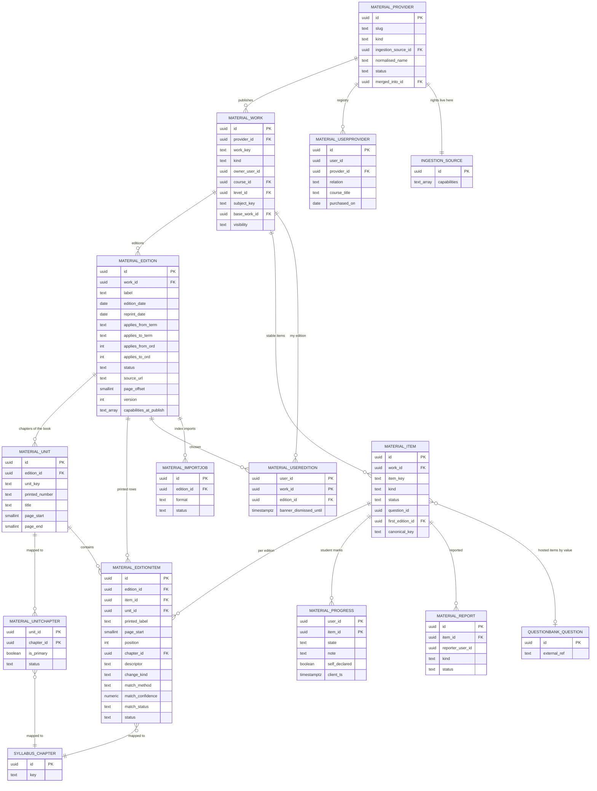
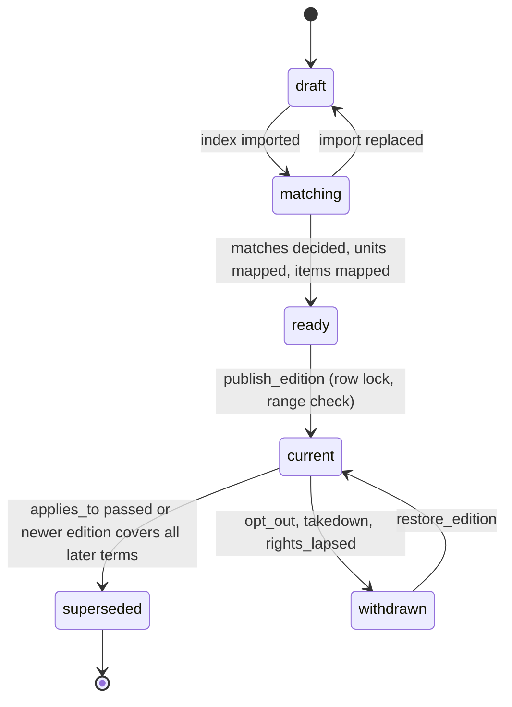
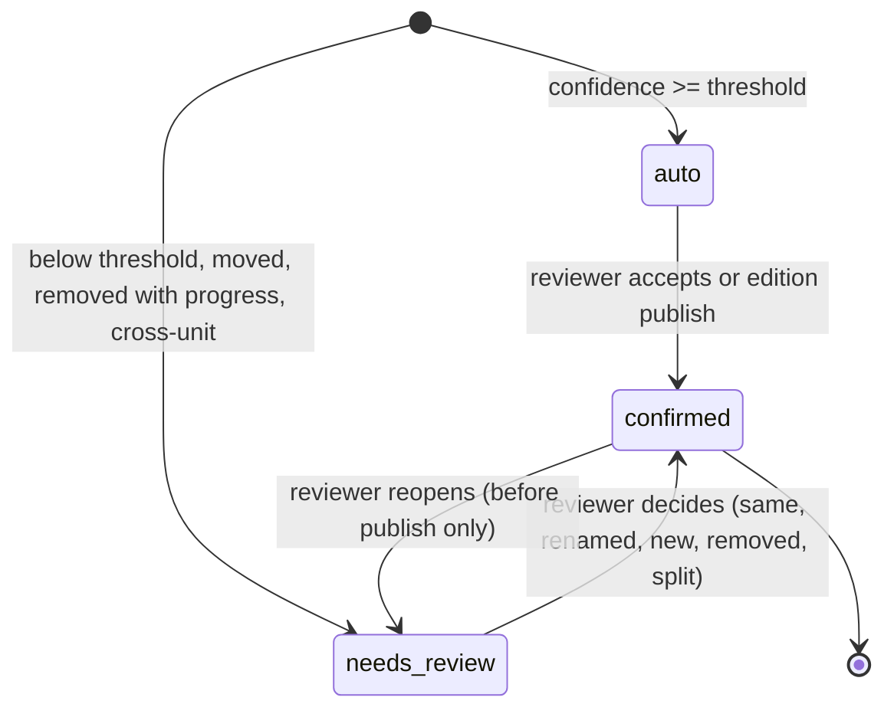

# ERD: F-12 Institute Study Material (MAT)

| Field | Value |
| --- | --- |
| Linked PRD | `docs/product/prd/F-12-institute-study-material.md` |
| Order | Content layer. Reads `docs/product/erd/F-02-syllabus-structure-and-coverage.md` (taxonomy, coverage), consumes the contract of `docs/product/erd/F-06-question-bank-system.md` (sections 0 and 3), uses the rights ledger and capability vocabulary defined in `docs/product/erd/F-04-super-50-questions.md` section 3.3 (an extension of `docs/product/erd/X-04-ingestion-scraping-service.md`) |
| Django app | `apps/api/modules/material` (tables `material_*`) |
| Web module | `apps/web/src/modules/material` |
| Last updated | 2026-10-05 |

**Reading guide.** Sections 0 and 3 are the contract. F-12 owns providers, works, editions, units, items, per-edition item rows, progress and the student's registry. It does **not** own questions, attempts, files, fetching, rights evidence or notifications; where it needs them it calls the owning module (F-06 ERD 3.7, "what consumers must not do"). Table names follow `<app>_<model>`.

## 0. Design decisions

1. **Identity is separate from edition.** A `material_item` is the stable identity of "the illustration about foreign branch conversion" across every edition of a work. What the Institute prints (label, page, position, text) lives in `material_editionitem`, one row per item per edition. Student progress, notes, the F-06 question and links from F-04 or F-09 point at the identity, so a revision never orphans anything. This is the same split F-06 uses between question identity and question version (F-06 ERD 0.2) and F-04 uses between `entry_key` and a version's entries.
2. **Editions are first-class and term-scoped.** An edition carries the term range it applies to (as F-02 term codes), its reprint date and the official applicability note. Overlap of `current` editions of one work is **impossible by a database exclusion constraint** (audit AUD-006 asked for DB-enforced exclusivity, not check-then-insert).
3. **Reference items hold facts only.** For sources without hosting rights, a `material_editionitem` has a label, kind, page, chapter mapping and an editor-written descriptor (max 140 characters). There is no column that can hold the Institute's wording. Hosted items add a link to an F-06 question; the text lives in F-06 only.
4. **Matching across editions works without stored text.** Because rung-1 sources must not be copied, the matcher uses structured fields (unit, kind, normalised label, descriptor similarity, order alignment) and, for hosted items, the F-06 content hash. A one-way fingerprint computed by the worker is allowed only with the `derive_index` capability (section 3.3). Matches below the threshold go to a human; removed and moved items always do when students have progress on them.
5. **Rights are not here.** "May we host this?" is `ingestion.selectors.source_capabilities(provider.ingestion_source_id)` (F-04 ERD 3.3). The materialisation level (L0 index, L1 deep link, L2 hosted, L3 practice, L4 public) is a pure function of the capabilities held. The edition stores `capabilities_at_publish` for audit; a daily job re-checks.
6. **Progress is student data, not content.** `material_progress` is keyed `(user_id, item_id)` and is never rewritten by publishing an edition. Chapter totals are computed from the student's edition; progress rows of items absent from it are kept and simply not counted.
7. **The registry stores claims, not proofs.** `material_userprovider` records which providers a student follows and which courses she says she bought. No receipt, amount, payment id or file is stored; claims drive personalisation only.
8. **Hosted items reuse F-06 entirely.** Items become questions through `questionbank.services.upsert_from_source` (idempotent on `(origin_module='mat', external_ref)`); attempts, notes on questions, takedown and reports are F-06's. F-12 keeps only the item-to-question link and the "done" semantics.
9. **Derived data is rebuildable.** Counters and cached levels on `material_work` and `material_edition` can be rebuilt from items and the ledger; none authorises anything.
10. **Django is the only gateway.** RLS on, no policies; user scoping on every query; 404 for what the viewer may not see.
11. **Extension, not editing.** F-12 registers an origin (`material`), subscribers, a coverage bridge, a web panel and an onboarding step through registries in `AppConfig.ready()`. Four small additive extensions are proposed and marked `[PROPOSED EXTENSION]`.

## 1. Diagrams

### 1.1 Entities



Also owned but not drawn: `material_auditlog`.

### 1.2 Edition lifecycle



### 1.3 Match lifecycle (per `material_editionitem` in a draft edition)



## 2. Tables

Common columns unless stated: `id uuid PK default gen_random_uuid()`, `created_at timestamptz not null default now()`, `updated_at timestamptz not null default now()`. `*_user_id`, `created_by`, `reviewed_by` reference `auth.users.id` by value (no cross-schema FK) and are scoped on every query. Enumerations are `text` with a check constraint (values in section 4). JSONB only for schema-less payloads with a schema version. Required extension: `btree_gist` (exclusion constraint on editions).

### 2.1 `material_provider`

| Column | Type | Null | Default | Notes |
| --- | --- | --- | --- | --- |
| slug | text | no | | Unique, kebab-case (`icai`, `icsi`, `icmai`, `xyz-classes`) |
| name | text | no | | Display name |
| normalised_name | text | no | | Lower case, ASCII, punctuation and common words (`classes`, `academy`, `institute`) removed; used for typed-name dedupe |
| kind | text | no | | `institute`, `coaching`, `publisher` |
| ingestion_source_id | uuid | no | | X-04 `ingestion_source.id` by value now, FK later; unique. Every provider, even a student-typed pending one, gets a manual source at rung 1 so rights always live in one place |
| status | text | no | `active` | `active`, `pending` (typed by a student, awaiting an editor), `merged`, `blocked`, `archived` |
| merged_into_id | uuid | yes | | FK self; set when `status = 'merged'` |
| website_url | text | yes | | https; used as the allowed host for deep links |
| created_by_user_id | uuid | yes | | The student who typed a pending provider; set null on account deletion |
| reviewed_by, reviewed_at | uuid, timestamptz | yes | | Editor decision |
| blocked_reason | text | yes | | `opt_out`, `takedown`, `other` |

Constraints and indexes: unique `slug`; unique `ingestion_source_id`; unique `normalised_name` where `status in ('active','pending')`; check `status = 'merged'` iff `merged_into_id is not null`; index `(kind, status)`; trigram index on `normalised_name` for the search box. Merging re-points `material_userprovider` and `material_work` rows in one transaction and leaves the merged row as a redirect.

### 2.2 `material_work`

One title of one provider for one subject and level, independent of editions.

| Column | Type | Null | Default | Notes |
| --- | --- | --- | --- | --- |
| provider_id | uuid | no | | FK `material_provider`, restrict |
| work_key | text | no | | Stable, kebab-case: `ca-inter-advanced-accounting` |
| title | text | no | | "Advanced Accounting study material" |
| kind | text | no | | `module`, `book`, `question_bank`, `supplement`, `checklist` |
| base_work_id | uuid | yes | | FK self; required for `supplement` (the work it updates) |
| course_id, level_id | uuid | no | | FK `syllabus_course`, `syllabus_level` |
| subject_key | text | no | | Stable taxonomy key |
| subject_id | uuid | yes | | FK `syllabus_subject` of the scheme in force (convenience; re-pointed by the remap service) |
| owner_user_id | uuid | yes | | Set only for private `checklist` works |
| visibility | text | no | `public` | `public`, `private` |
| status | text | no | `active` | `active`, `archived` |
| level_cached | smallint | no | 1 | Materialisation level 0 to 4 for display (derived; **never used to authorise**) |
| item_count_cached | int | no | 0 | Items in the latest current edition |
| deleted_at | timestamptz | yes | | Soft delete for private works |

Constraints: unique `(provider_id, work_key, coalesce(owner_user_id, '00000000-0000-0000-0000-000000000000'))`; check `kind = 'checklist'` iff `owner_user_id is not null`; check `visibility = 'private'` iff `owner_user_id is not null`; check `kind = 'supplement'` iff `base_work_id is not null`. Indexes: `(course_id, level_id, subject_key, status) where visibility = 'public'`; `(owner_user_id, status) where owner_user_id is not null`; `(provider_id, status)`.

### 2.3 `material_edition`

| Column | Type | Null | Default | Notes |
| --- | --- | --- | --- | --- |
| work_id | uuid | no | | FK, restrict |
| label | text | no | | "July 2024 edition, reprint August 2025" |
| edition_date | date | yes | | Month precision stored as the first day |
| reprint_date | date | yes | | |
| applies_from_term | text | no | | F-02 term code `YYYY-MM`, first attempt this edition applies to |
| applies_to_term | text | yes | | Last attempt, null for open-ended |
| applies_from_ord | int | no | | Generated: `year * 12 + month` of `applies_from_term` (stored generated column) |
| applies_to_ord | int | yes | | Generated, null when open-ended |
| applicability_note | text | no | `''` | "Per ICAI applicability notice for Sept 2026" with the notice's name; shown to students |
| status | text | no | `draft` | `draft`, `matching`, `ready`, `current`, `superseded`, `withdrawn` |
| withdraw_reason | text | yes | | `opt_out`, `takedown`, `rights_lapsed`, `editorial` |
| source_url | text | yes | | Official file URL (https; host must be the provider's allowed host). Base for deep links |
| source_page_url | text | yes | | The official page that lists the file (for humans) |
| page_offset | smallint | no | 0 | PDF page index minus printed page number, so printed page 41 maps to `#page=49` when 8 |
| source_snapshot_id | uuid | yes | | X-04 `ingestion_snapshot.id` by value when detected by X-04 (`study_material` notice); null for editor-created |
| source_sha256 | text | yes | | Hash of the official file when known, to detect silent re-uploads |
| version | int | no | 1 | Optimistic lock for admin edits and matching decisions |
| import_job_id | uuid | yes | | Last import job |
| capabilities_at_publish | text[] | yes | | Capabilities that covered the edition at publish (audit) |
| level_at_publish | smallint | yes | | Materialisation level at publish |
| published_at, published_by | timestamptz, uuid | yes | | |
| superseded_at | timestamptz | yes | | |
| counts | jsonb | no | `{}` | Diff counts versus the previous edition, schema in `counts_schema` smallint: `{"v":1,"same":3100,"edited":14,"renumbered":120,"new":6,"removed":3,"moved":2}` |

Constraints and indexes:
- unique `(work_id, label)`;
- check `applies_to_ord is null or applies_to_ord >= applies_from_ord`;
- check `source_url like 'https://%'`;
- **exclusion constraint** `EXCLUDE USING gist (work_id WITH =, int4range(applies_from_ord, coalesce(applies_to_ord, 2147483647), '[]') WITH &&) WHERE (status = 'current')`: two `current` editions of one work can never apply to the same term;
- check `status in ('current','superseded','withdrawn')` implies `published_at is not null`;
- index `(work_id, applies_from_ord desc)`; `(status, updated_at desc)`; `(status) where status in ('matching','ready')` (admin work list).

`publish_edition` takes `SELECT ... FOR UPDATE` on the work row, truncates the previous overlapping `current` edition's `applies_to_term` to the month before the new edition's start (inside the same transaction, so the exclusion constraint never fires in normal flow), then sets the new edition `current`. A tick moves editions whose `applies_to_ord` is in the past to `superseded` (still followable by students who choose them).

### 2.4 `material_unit` and `material_unitchapter`

`unit`: the book's own chapters or units in one edition.

| Column | Type | Null | Default | Notes |
| --- | --- | --- | --- | --- |
| edition_id | uuid | no | | FK, cascade only while the edition is draft |
| unit_key | text | no | | Stable across editions of a work (`m1-ch3`); assigned at first import, copied or matched afterwards |
| module_label | text | no | `''` | "Module 1", "Set A" |
| printed_number | text | no | `''` | "Chapter 3" |
| title | text | no | | |
| page_start, page_end | smallint | yes | | Printed pages |
| sort_order | smallint | no | 0 | |

Unique `(edition_id, unit_key)`; index `(edition_id, sort_order)`.

`unitchapter`: mapping of a unit to F-02 chapters (many to many, one primary).

| Column | Type | Null | Default | Notes |
| --- | --- | --- | --- | --- |
| unit_id, chapter_id | uuid | no | | PK; chapter FK `syllabus_chapter`, restrict |
| subject_key, chapter_key | text | no | | Stable keys |
| scheme_id | uuid | no | | FK `syllabus_scheme` |
| is_primary | boolean | no | false | Exactly one confirmed primary per unit (partial unique index) |
| status | text | no | `confirmed` | `suggested`, `confirmed`, `rejected` |
| origin | text | no | `editor` | `editor`, `copied` (from the previous edition by `unit_key`), `remap` (F-02 chapter map), `ai` |
| confidence | numeric(3,2) | yes | | |

Mapping stability: on creating a draft edition the service **copies** `unitchapter` rows by `unit_key` from the previous edition with `origin='copied'`; only units with new keys or changed scheme need review. A scheme change in F-02 produces `suggested` rows through `syllabus.selectors.chapter_map(...)`, confirmed by an editor in bulk (same pattern as F-06 `propose_remap`).

### 2.5 `material_item` (stable identity)

| Column | Type | Null | Default | Notes |
| --- | --- | --- | --- | --- |
| work_id | uuid | no | | FK, restrict |
| item_key | text | no | | `{unit_key}:{kind_short}:{seq}`, e.g. `m1-ch3:ill:0007`. `seq` is assigned once at first import and **never** derived from the printed label |
| kind | text | no | | `illustration`, `example`, `exercise`, `mcq`, `true_false`, `theory`, `practical`, `case_study`. Immutable |
| status | text | no | `active` | `active`, `retired` (absent from every current or future edition) |
| first_edition_id | uuid | no | | FK; where the identity appeared |
| last_edition_id | uuid | yes | | FK; last edition containing it, null while it is in the latest |
| question_id | uuid | yes | | F-06 `questionbank_question.id` by value; set only when materialised (hosted). Unique when not null |
| canonical_key | text | yes | | Shared grammar `core/refs.py` (for example `mat:icai:ca-inter:afm:m1-ch3:ill:0007`); lets F-04 and F-09 refer to the same identity |
| created_by | uuid | yes | | Editor |

Constraints: unique `(work_id, item_key)`; unique `(question_id)` where not null; check `char_length(item_key) <= 80`. Indexes: `(work_id, status)`; `(canonical_key) where canonical_key is not null`.

### 2.6 `material_editionitem` (what the edition prints)

| Column | Type | Null | Default | Notes |
| --- | --- | --- | --- | --- |
| edition_id | uuid | no | | FK, cascade only while draft |
| item_id | uuid | no | | FK `material_item`, restrict |
| unit_id | uuid | no | | FK `material_unit` |
| printed_label | text | no | | "Illustration 12", "Q.7", "Example 3" (as printed, max 60) |
| label_norm | text | no | | Normalised (`ill-12`, `q-7`), used for matching |
| printed_ordinal | int | yes | | Numeric part when present |
| page_start, page_end | smallint | yes | | Printed pages; deep link uses `page_start + edition.page_offset` |
| position | int | no | | Order in the unit (gap 1024) |
| descriptor | text | yes | | Editor-written facts, max 140 characters, plain text. Never the Institute's wording |
| chapter_id | uuid | no | | FK `syllabus_chapter`, restrict (the unit's primary chapter unless overridden) |
| topic_id | uuid | yes | | FK `syllabus_topic` |
| subject_key, chapter_key | text | no | | Stable keys |
| map_status | text | no | `confirmed` | `suggested`, `confirmed`, `rejected` |
| map_origin | text | no | `editor` | `editor`, `copied`, `ai`, `remap` |
| map_confidence | numeric(3,2) | yes | | |
| status | text | no | `active` | `active`, `removed` (tombstone: the item existed in the previous edition and is absent here) |
| change_kind | text | no | `new` | Versus the previous edition: `same`, `edited`, `renumbered`, `moved`, `new`, `removed` |
| previous_id | uuid | yes | | FK self: this item's row in the previous edition |
| match_method | text | no | `new` | `hash`, `label`, `alignment`, `fuzzy`, `manual`, `new` |
| match_confidence | numeric(3,2) | yes | | |
| match_status | text | no | `confirmed` | `auto`, `needs_review`, `confirmed` |
| match_hash | text | yes | | Reference items: SHA-256 of `kind` plus normalised descriptor (only when the descriptor has at least 20 characters). Hosted items: the F-06 live version `content_hash`. Used for exact matching and "revised since you did it" |
| simhash | bigint | yes | | Optional one-way fingerprint from the worker; only when the source holds `derive_index`; never text |
| question_version_id | uuid | yes | | F-06 live version pinned at publish (informational, hosted only) |
| version | int | no | 1 | Optimistic lock for matching decisions |

Constraints: unique `(edition_id, item_id)`; unique `(edition_id, unit_id, position)` deferrable; unique `(edition_id, unit_id, label_norm)` where `status = 'active'`; check `char_length(descriptor) <= 140`; check `status = 'removed'` iff `change_kind = 'removed'`; check `match_status = 'confirmed'` or the edition is not `current` (service rule asserted at publish).

Indexes (query patterns in section 5):
- `(edition_id, chapter_id, kind, position) where status = 'active'`: chapter panel and items list (Q-1, Q-2);
- `(item_id, edition_id)`: item detail across editions (Q-3);
- `(edition_id, match_status) where match_status = 'needs_review'`: review list;
- `(match_hash) where match_hash is not null`: exact matching;
- `(edition_id, unit_id, position)`.

### 2.7 `material_progress`

| Column | Type | Null | Default | Notes |
| --- | --- | --- | --- | --- |
| user_id | uuid | no | | |
| item_id | uuid | no | | FK `material_item`, cascade on delete of the item (items are retired, not deleted; cascade exists for private work deletion) |
| state | text | no | | `done`, `revise`, `skipped`. **No row means to do** |
| note | text | no | `''` | Max 2,000 characters, private |
| done_at | timestamptz | yes | | First time it became `done` |
| edition_id | uuid | no | | Edition in which it was last marked |
| content_stamp | text | yes | | `match_hash` of the edition item at marking time; compared with the current edition item to show "revised since you did it" |
| self_declared | boolean | no | false | True for private checklist items |
| revisited_at | timestamptz | yes | | Set by "Mark as revisited" (clears the revised badge for that content stamp) |
| client_ts | timestamptz | no | | Last-writer-wins guard, clamped to server time plus 5 minutes |
| updated_at | timestamptz | no | now() | |

PK `(user_id, item_id)`. Index `(user_id, state, updated_at desc)`; `(user_id, edition_id)`. The write is one statement `INSERT ... ON CONFLICT (user_id, item_id) DO UPDATE ... WHERE material_progress.client_ts <= EXCLUDED.client_ts`. For hosted items, "done by practice" is **not stored**: it is read from `practice.selectors.question_states` and merged by the selector (F-12 keeps no copy of attempts). When the student has both, the manual state is shown and `via` reports both.

### 2.8 `material_userprovider` (the student's course registry)

| Column | Type | Null | Default | Notes |
| --- | --- | --- | --- | --- |
| user_id | uuid | no | | |
| provider_id | uuid | no | | FK `material_provider`, restrict |
| relation | text | no | | `follows`, `bought_course` |
| course_title | text | no | `''` | "Company Law full batch", max 120 |
| batch_label | text | no | `''` | Max 60 |
| purchased_on | date | yes | | Claim, not proof |
| valid_until | date | yes | | Claim |
| subject_keys | text[] | no | `{}` | Subjects the course covers |
| created_via | text | no | `settings` | `onboarding`, `settings` |
| entitlement_source | text | yes | | `partner_code` (R3, issued by the partner); null for self-declared claims |
| archived_at | timestamptz | yes | | |

Unique `(user_id, provider_id, relation, course_title)`; index `(user_id) where archived_at is null`; `(provider_id)` for **aggregate-only** statistics (any provider count shown or exported is suppressed below 10 students). No column exists for a receipt, price, payment reference or file.

### 2.9 `material_useredition`

`user_id`, `work_id` (PK), `edition_id` uuid null (FK; null means "follow the edition that applies to my attempt"), `banner_dismissed_for_edition_id` uuid null, `banner_dismissed_until` timestamptz null. Rows exist only for explicit choices and dismissals; the default is computed (`material.selectors.edition_for`). Index `(work_id, edition_id)`.

### 2.10 `material_report`

| Column | Type | Null | Default | Notes |
| --- | --- | --- | --- | --- |
| item_id, edition_id | uuid | no | | FKs; the edition the reporter saw |
| reporter_user_id | uuid | no | | |
| kind | text | no | | `wrong_page`, `wrong_chapter`, `wrong_label`, `link_dead`, `copyright`, `other` (`wrong_answer` and `typo` on hosted items are routed to F-06 `report_error` and not stored here) |
| message | text | no | `''` | Max 500 |
| status | text | no | `open` | `open`, `accepted`, `rejected`, `fixed`, `duplicate` |
| resolved_by, resolved_at | uuid, timestamptz | yes | | |
| resolution_note | text | no | `''` | Sent to the reporter |

Unique `(item_id, reporter_user_id, kind)` where `status = 'open'`; indexes `(status, created_at)`, `(item_id, status)`. A `wrong_page` accepted report fixes the **edition's `page_offset`** when the pattern repeats across items (editor action), not one item at a time. `copyright` opens an X-04 takedown draft.

### 2.11 `material_importjob`

`edition_id` FK, `user_id` (editor), `format` (`csv`, `json`), `attachment_id` (F-06 `media_attachment`, file kind `import_file`), `status` (`uploaded`, `validating`, `needs_fixes`, `imported`, `failed`), `counts jsonb` (`{"v":1,"rows":3000,"ok":2990,"error":10,"created":2900,"updated":90}`), `error_attachment_id`, `finished_at`, `expires_at` (30 days). Import is idempotent by `(work, unit_key, kind, label_norm)`; rows are processed in bounded batches by the worker.

### 2.12 `material_auditlog`

`id bigint identity`, `actor_id`, `entity_type`, `entity_id`, `action`, `before jsonb`, `after jsonb`, `created_at`. Append-only; index `(entity_type, entity_id, created_at desc)`. Covers provider merges, publish, withdraw, restore, match decisions and reversals, offset changes, rights-driven changes.

## 3. Relationships to other modules

### 3.1 Foreign keys and by-value references

| From | To | Rule |
| --- | --- | --- |
| all `*_user_id`, `created_by`, `reviewed_by` | `auth.users.id` | By value; scoped on every query |
| `material_work.course_id`, `level_id`, `subject_id`; `material_unitchapter`; `material_editionitem.chapter_id`, `topic_id` | `syllabus_*` | Real FKs, restrict. **Reads and key resolution through `syllabus.selectors`** (F-04 ERD 3.2); no foreign model queries |
| `material_provider.ingestion_source_id` | `ingestion_source` | By value now, FK later; unique |
| `material_edition.source_snapshot_id` | `ingestion_snapshot` | By value |
| `material_item.question_id`, `material_editionitem.question_version_id` | `questionbank_question`, `questionbank_questionversion` | By value; created only through F-06 services |
| `material_importjob.attachment_id` | `media_attachment` | FK |
| Coverage | `material` | `material` calls `coverage.services.record_event` (3.5) |

Dependency direction (no cycles): `material -> questionbank, practice (services and selectors), ingestion (selectors, fetch service), syllabus (selectors), coverage (record_event), core.events`. Nobody imports `material` models; consumers use its selectors and events.

### 3.2 Matching algorithm (pure functions in `material.domain.matching`)

Input: previous edition rows P and new edition rows N for one work. Thresholds in settings: `MATERIAL_MATCH_AUTO = 0.85`, `MATERIAL_MATCH_MIN = 0.55`.

1. **Unit pairing.** Units pair by equal `unit_key`; otherwise by title similarity at least 0.8 (trigram) and page-range overlap, always `needs_review`.
2. **Within a paired unit, never across kinds.**
3. **Exact:** same `kind` and equal `match_hash` (both non-null). Confidence 1.0. If `label_norm` differs the change is `renumbered`, else `same`.
4. **Label:** same `kind`, equal `label_norm`, descriptor trigram similarity at least 0.6 (or both descriptors empty). Confidence 0.9; `edited` when `match_hash` differs.
5. **Alignment:** the remaining rows of the unit, ordered by `position`, are aligned with a sequence alignment (Needleman-Wunsch with gap penalty 0.3) over `(kind, descriptor tokens)`. A pair with similarity at least 0.75 is a match with confidence `0.9 * similarity`, plus 0.05 when both neighbours matched.
6. **Fuzzy across units** (item moved to another unit): trigram similarity at least 0.85 on descriptors, or `simhash` Hamming distance at most 3 when both exist. Confidence 0.7, change `moved`, always `needs_review`.
7. **Leftovers:** new rows with no match are `new` (new identity, new `item_key`); unmatched previous rows become `removed` tombstones. A tombstone is `needs_review` when at least one student has progress on the item (the reviewer sees the count), otherwise `auto`.
8. Matches with confidence below `MATERIAL_MATCH_AUTO` are `needs_review`; below `MATERIAL_MATCH_MIN` they are not proposed (the reviewer chooses). A reviewer decision (`same`, `renamed`, `new`, `removed`, `split`) sets `match_status = 'confirmed'`, and is reversible until publish (audited).
9. Hosted items add: equal F-06 `content_hash` is always exact; a changed hash with a confirmed match produces `edited` and an F-06 `new_version` with `change_kind = 'import_update'`.

Properties asserted by tests: matching is deterministic; no item is matched twice; renumbering a whole unit by +2 yields `renumbered` for every item with auto confidence; a reordered unit yields `moved` or `renumbered` but never `new`; a corpus of real renumberings from two ICAI editions (editor-supplied) is the regression fixture.

### 3.3 Rights, capabilities and materialisation levels

The ledger, capability vocabulary and rung baselines are in [F-04 ERD 3.3](./F-04-super-50-questions.md) and are not repeated. F-12 adds one capability to that vocabulary, `derive_index`: "read the official file in the worker to compute labels, pages and one-way fingerprints, discarding the text". It is **not** in any baseline, because ICAI treats unauthorised downloading, extraction and copying as an offence; it needs a `written_permission` or `counsel_opinion` evidence row.

`material.domain.levels.level_for(capabilities) -> int`:

| Level | Capabilities required | Effect |
| --- | --- | --- |
| 0 index | `metadata` | Items with labels, kinds, pages, chapters; no links |
| 1 deep link | L0 plus `link_out` | "Open at source (page N)" |
| 2 hosted | L1 plus `host_questions` and `host_solutions` (`host_media` for items with images) | F-06 questions exist and are visible |
| 3 practice | L2 plus `practice` | Practice sessions include them |
| 4 public | L3 plus `public_seo` | Item text on indexable pages |

`material.services.materialise(edition_id)` (editor action, background job): for every editionitem with a hosted payload it calls `require_capability(source, 'host_questions')` (and `host_solutions`, `host_media` when present) and then `questionbank.services.upsert_from_source(origin_module='mat', external_ref=f'mat:{provider.slug}:{work.work_key}:{item.item_key}', payload=..., ownership='platform', rights_status='licensed' (or 'institute_material' when the Institute holds the copyright and the evidence says so), actor_id=editor, provenance=...)`. The payload labels carry `source_kind` (`institute_mat` for institutes, `coaching` for coaching providers), `source_name`, `source_ref` ("Module 1, Chapter 3, Illustration 12, July 2024 edition"), `source_url` (official page), tags `institute-mat` and `provider-<slug>`, and the primary mapping from the editionitem. F-06 decides visibility; items without `public_seo` have `seo_indexable = false`.

Rights lapse: the daily `audit_material_rights` job and the `source_rights_changed` subscriber compare `edition.capabilities_at_publish` with the live capabilities. Lost `host_*` leads to `withdraw_by_source` (3.4), edition `withdrawn` for hosted items only (reference rows stay if `link_out` and `metadata` hold), event `material_edition_withdrawn`, Sentry alert.

### 3.4 F-06 interplay and the proposed extension

**Origin registration:**

```python
practice.registry.register_origin("material", OriginSpec(
    validate_spec=validate_material_spec,            # {"edition_id": ..., "chapter_ids": [...], "kinds": [...], "scope": "todo", "count": 10}
    allowed_modes=["untimed", "timed", "chapter_quiz", "revision"],
    default_feedback_policy="instant",
    unique_per_user=False,
    title_for=lambda ref, spec: f"MAT practice: {chapter_title(spec)}",
))
```

Sessions are created with `create_session_from_items(..., origin_module="material", origin_ref=str(edition_id), items=[ItemSpec(question_id, version_id=None, section_label=unit_title)])`; `version_id=None` means the live F-06 version (MAT questions follow corrections; the session pins at creation as F-06 always does). The F-02 coverage subscriber already records practice for these chapters; the coverage bridge below handles the manual "done" marks and avoids double counting by the `max()` rule.

**Subscribers** (deferred, idempotent on `event.id`):

| Event | Reaction |
| --- | --- |
| `question_taken_down`, `question_unpublished` (F-06) | Set a flag on the item's current edition rows (`needs_attention` via audit entry and admin queue); hosted item shows "Removed"; no edition change |
| `question_version_live` (F-06) | Refresh `question_version_id` on the editionitem; if the content hash changed outside an import, queue an editor task |
| `source_rights_changed` (X-04 extension) | Rights audit for the provider, as in 3.3 |
| `material_edition_published` (own) | Banner audience job |
| `amendment_published` (F-14, `[PROPOSED]`) | Nothing stored; the chapter panel queries F-14 at read time |
| `account_erasure_requested` (profiles, `[PROPOSED]`) | `delete_all_for_user` |

**`[PROPOSED EXTENSION to F-06]` `questionbank.services.withdraw_by_source`**: both F-04 and F-12 must unpublish a batch of platform questions when the rights behind them lapse, and F-06 has takedown (a legal process) and `save_live` (owner visibility) but no administrative bulk unpublish.

```python
def withdraw_by_source(actor_id: UUID | None, *, origin_module: str, external_refs: Sequence[str] | None = None,
                       question_ids: Sequence[UUID] | None = None,
                       reason: Literal["rights_lapsed", "opt_out", "editorial"], note: str = "") -> WithdrawReport
def restore_by_source(actor_id: UUID, *, origin_module: str, external_refs: Sequence[str]) -> RestoreReport   # when evidence is valid again
```

Semantics: idempotent; sets `status='archived'` and `visibility='private'` for the listed platform questions, writes `questionbank_auditlog` rows with the reason, emits `question_unpublished {reason}` per batch, never deletes versions, leaves open sessions able to review (the F-06 rule for non-`taken_down` removals). It is deliberately smaller than a takedown: no complainant, no strike, no 21-day clock. `restore_by_source` reverses it only for rows it archived.

### 3.5 Coverage bridge `[PROPOSED EXTENSION to F-02]`

F-02 `coverage_event.type` and `source` are closed lists (and the audit notes they lack a DB check). F-12 needs one new type and one new source:

| Item | Value |
| --- | --- |
| New event type | `material_progress` |
| New event source | `material` |
| `value` | Percent of the chapter's items (in the student's edition) that are `done`, 0 to 100, rounded half up |
| `payload` | `{"v":1,"done":12,"total":40,"self_declared":0}` (small, no personal text) |
| `client_id` | `uuid5(user_id, chapter_id + ':' + yyyy-mm-dd of the local day)`: one event per chapter per day, replaced by later events the same day through the ledger's compensation rule |
| Coverage rule | The **practice** component input is `max(F-06 practice measure, material_progress value)`. Neither is added to the other, so a student who practises MAT questions in F-06 and also ticks them is not counted twice. Self-declared items contribute at half weight `[Q-F12-4]` |

Emission path: a progress write enqueues a `core_job` with the dedupe key `material:cov:{user_id}:{chapter_id}` and `run_after = now + 5 minutes`; the job reads the current counts (one query) and calls `record_event(..., strict=False)`. Many ticks in a minute produce one event. The F-02 migration adds the new values to the type and source check constraints.

### 3.6 Registries and web extension points `[PROPOSED EXTENSION to F-02 web]`

| Registry | Purpose |
| --- | --- |
| `registerChapterPanel({id, order, flag, component})` in the `coverage` barrel | `material` registers `MaterialPanel`, `super50` registers `Super50Panel`; the chapter page renders registered panels in order, behind each panel's flag, without importing feature modules |
| `registerOnboardingStep({id, order, optional, component, isDone})` in the onboarding container | `material` registers `CoachingStep` (optional, skippable, never blocks the first plan) |

Both are tiny, typed and tested; without them the chapter page and onboarding would import `material` and `super50` directly, which breaks rule 1 of CLAUDE.md in the other direction.

### 3.7 Provides and consumes

**Provides**

| Interface | Signature (Python 3.12) | Used by |
| --- | --- | --- |
| `material.selectors.chapter_progress` | `(user_id: UUID, chapter_ids: Sequence[UUID], kinds: Sequence[str] \| None = None) -> dict[UUID, ChapterMaterialProgress]` | F-02 chapter pages, F-10, F-13 |
| `material.selectors.items_for_chapter` | `(user_id: UUID, chapter_id: UUID, *, state: str \| None = None, limit: int = 50) -> list[ItemCard]` | F-13, F-05 |
| `material.selectors.edition_for` | `(user_id: UUID, work_id: UUID) -> EditionRef` | F-04, F-13 |
| `material.selectors.followed_providers` | `(user_id: UUID) -> list[ProviderRef]` | F-04, F-05, F-13, F-06 browser ("My coaching") |
| `material.selectors.items_for_questions` | `(question_ids: Sequence[UUID]) -> dict[UUID, ItemRef]` | F-06 browser, F-05 ("From MAT: Illustration 12") |
| `material.services.set_followed_providers` | `(user_id: UUID, provider_ids: Sequence[UUID], custom_names: Sequence[str]) -> list[ProviderRef]` | onboarding step |
| `material.services.delete_all_for_user`, `export_for_user` | `(user_id: UUID) -> DeleteReport \| dict` | account deletion hook |
| Events | `material_edition_published`, `material_edition_withdrawn`, `material_progress_changed` (JSON schemas in `core/event_schemas/`) | X-01, coverage bridge, F-13, caches |
| Web barrel | `MaterialPanel`, `CoachingStep`, `useMaterialSummary` | chapter-panel and onboarding registries |

**Consumes**

| Interface | From |
| --- | --- |
| `questionbank.services.upsert_from_source`, `withdraw_by_source` `[PROPOSED EXTENSION]`, `restore_by_source`, `questionbank.selectors.get_review_view`, `taxonomy_of`; events `question_taken_down`, `question_unpublished`, `question_version_live` | F-06 `questionbank` |
| `practice.services.create_session_from_items`, `practice.selectors.question_states`, `register_origin` | F-06 `practice` |
| `ingestion.selectors.source_capabilities`, `ingestion.services.require_capability`, `fetch_head`, `open_takedown_draft`, event `source_rights_changed` | X-04 (F-04 ERD 3.3) |
| `syllabus.selectors` (`resolve_keys`, `chapters_of_subject`, `published_scheme`, `exam_term_by_code`, `chapter_map`) | F-02 `[PROPOSED]` |
| `coverage.services.record_event` with type `material_progress`; `coverage.selectors.enrolment_context(user_id)` | F-02 `[PROPOSED EXTENSION]` |
| `pyq.selectors.appearances(question_ids)` | F-09 `[PROPOSED]` |
| `amendments.selectors.for_chapters(chapter_ids, term_code)` | F-14 `[PROPOSED]` |
| `notes.services.create_note`, `notes.selectors.notes_for_anchor` | F-03 `[PROPOSED]` |
| `recall.services.create_card(source=...)` | F-15 `[PROPOSED]` |
| `notifications.services.notify` | X-01 `[PROPOSED]` |
| `core.refs.canonical_key` | `apps/api/core/refs.py` `[PROPOSED]`, shared with F-04 and F-09 |
| `profiles.register_erasure_hook` | profiles `[PROPOSED]` (closes audit AUD-004) |

## 4. Enumerations and reference data

| Name | Values | Stored as | Owner |
| --- | --- | --- | --- |
| Provider kind and status | institute, coaching, publisher; active, pending, merged, blocked, archived | text + check | code |
| Work kind and visibility | module, book, question_bank, supplement, checklist; public, private | text + check | code |
| Edition status | draft, matching, ready, current, superseded, withdrawn | text + check | code |
| Withdraw reason | opt_out, takedown, rights_lapsed, editorial | text + check | code |
| Item kind | illustration, example, exercise, mcq, true_false, theory, practical, case_study | text + check | code |
| Item status | active, retired | text + check | code |
| Editionitem status and change kind | active, removed; same, edited, renumbered, moved, new, removed | text + check | code |
| Match method and status | hash, label, alignment, fuzzy, manual, new; auto, needs_review, confirmed | text + check | code |
| Mapping status and origin | suggested, confirmed, rejected; editor, copied, ai, remap | text + check | code |
| Progress state | done, revise, skipped | text + check | code |
| Registry relation and via | follows, bought_course; onboarding, settings | text + check | code |
| Report kind and status | see 2.10 | text + check | code |
| Import status | uploaded, validating, needs_fixes, imported, failed | text + check | code |
| Capability vocabulary and ledger kinds | see F-04 ERD 3.3 (plus `derive_index`) | text[] + check | code |

**Kind to F-06 kind** (editor default, overridable in the payload): `mcq` to `mcq_single` (or `mcq_multi` when the key has several), `true_false` to `true_false`, `case_study` to `case_study`, `theory` to `long_form`, `illustration`, `example`, `exercise` and `practical` to `practical` (journal, working notes) or `numeric` when the answer is a single figure.

**Seed data** (migration `material.0003_seed`): providers `icai`, `icsi`, `icmai` (kind `institute`, linked to the X-04 sources seeded by the F-04 migration, at rung 1, `[VERIFY]` terms for ICSI and ICMAI), the system tag `institute-mat` (through the F-06 tag service at deploy, not by writing F-06 tables). No works, editions or items are seeded: editors create them from the official files, and nothing is hosted until evidence exists. Private-work quotas are Django settings (`MATERIAL_MAX_PRIVATE_WORKS = 5`, `MATERIAL_MAX_PRIVATE_ITEMS = 1000`, `MATERIAL_MAX_CUSTOM_PROVIDERS = 20`).

## 5. Query patterns

`E` is the student's resolved edition (`material.selectors.edition_for`).

| # | Query | Served by |
| --- | --- | --- |
| Q-1 | Chapter summary: counts by kind and done counts for `(user, chapter, E)`: `editionitem` active rows for `(E, chapter)` left-joined to `material_progress` by `(user_id, item_id)`, plus `question_states` for hosted ones | `(edition_id, chapter_id, kind, position) where status='active'`, PK of progress; at most about 80 rows per chapter; result cached 60 s per student with ETag from `max(updated_at)` |
| Q-2 | Items list for a chapter with filters (`kind`, `state`, `q`) and keyset pagination by `position` | same index; `state` filter joins progress; `q` on label and descriptor (small set, no search index) |
| Q-3 | Item detail with its row in every edition (labels per edition) and my state | `(item_id, edition_id)`, progress PK |
| Q-4 | Progress write | single `INSERT ... ON CONFLICT` on PK, guarded by `client_ts` |
| Q-5 | Work overview: chapters with totals and done counts per kind for `(user, E)` | one grouped query over `(edition_id, chapter_id)`; cached 60 s |
| Q-6 | Hub: works for the student's enrolled subjects, with my edition | `(course_id, level_id, subject_key, status)` partial, `material_useredition` PK lookups, `coverage.selectors.enrolment_context` |
| Q-7 | Edition diff (A to B): rows of B with `change_kind <> 'same'`, plus tombstones | `(edition_id, chapter_id, ...)`; filter on `change_kind`; at most a few thousand rows, paged |
| Q-8 | Banner: does a newer applicable edition than mine exist, with counts | edition by `(work_id, applies_from_ord desc)`; counts from `edition.counts` (precomputed at publish) |
| Q-9 | Banner audience (tick, batched): students following work W whose target term falls in the new edition's range and who follow an older edition | coverage enrolment pages via selector, joined to `material_useredition`; deduped by event key |
| Q-10 | Matching: rows of the two editions per unit, aligned in Python | `(edition_id, unit_id, position)`; trigram on `descriptor` for candidate lookups limited to the unit |
| Q-11 | Impact count for a removed item: students with progress | `material_progress (item_id)` via index on `item_id` (add `(item_id)` index; used only in admin matching) |
| Q-12 | Revised-since-you-did-it: progress rows whose `content_stamp` differs from the current editionitem `match_hash` and `revisited_at` is null | PK join per page of items (at most 100) |
| Q-13 | Rights audit: current editions with hosted items per provider | `(status, updated_at)`; one `source_capabilities` call per provider |
| Q-14 | Provider search (typeahead) | trigram index on `normalised_name` |
| Q-15 | Coverage debounce flush: counts for one `(user, chapter)` | Q-1 for one chapter |
| Q-16 | `items_for_questions(question_ids)` | unique `(question_id) where not null` |
| Q-17 | Export or delete for a user | `user_id` leading PKs and partial indexes; batched deletes |

## 6. Storage, scale and retention

### 6.1 Volume assumptions

| Quantity | Year 1 | Year 3 | Basis |
| --- | --- | --- | --- |
| Providers | 20 | 150 | 3 institutes plus coaching typed by students |
| Works | 60 | 400 | launch course first (CA Intermediate), then Final, CS, CMA |
| Editions | 90 | 600 | about 1.5 per work, 3 per work later |
| Items (identities) | 16,000 | 60,000 | about 25 per chapter x (304 CA + 407 CS + 231 CMA chapters), planning assumption |
| Edition item rows | 25,000 | 120,000 | about 1.6 editions per item at year 1, 2 at year 3 |
| Progress rows | 2,000,000 | 25,000,000 | 5,000 MAU x 400; 50,000 MAU x 500 |
| Registry rows | 10,000 | 120,000 | 2 per student on average |
| Reports | 3,000 | 40,000 | |

No table needs partitioning. `material_progress` at 25 million narrow rows with a two-column PK is comfortable; revisit past 100 million.

### 6.2 Caching and hot paths

- Public GET `public/subjects/.../material/` sends `Cache-Control: public, s-maxage=300, stale-while-revalidate=3600` and an ETag from `max(updated_at)` of the affected editions; `material_edition_published` and `material_edition_withdrawn` purge where possible.
- Personal data (progress, registry, my edition) is always a separate `private, no-store` request so the shared item lists stay cacheable per edition.
- The chapter summary is the hottest read (every chapter page): one indexed query pair, 60-second per-student cache with ETag, `304` for repeats.
- No per-item counters exist; popularity is never written on read.

### 6.3 Async work (Vercel limits)

Nothing long runs in a request. The 1-minute tick (`POST internal/tick/`, shared secret, bounded to 20 seconds) handles: coverage debounce flush, banner audience batches, rights audit (daily), edition status moves (`current` to `superseded`), link checks through the F-04 `super50_linkcheck` table `[PROPOSED: move to a shared linkcheck owner when both modules ship]`. Heavy jobs are `core_job` rows claimed by the worker: edition matching (3,000 items under 20 seconds of compute), index import validation, AI extraction (R2), materialisation (F-06 upserts in batches of 100).

### 6.4 Storage

F-12 stores no files. Index imports are F-06 `media_attachment` rows in `qb-files` (30 days). Hosted images are F-06 attachments. Official PDFs are never stored by F-12: only their URL and, when known, a SHA-256.

### 6.5 Retention

| Data | Retention |
| --- | --- |
| Editions, editionitems, items | Kept (students' progress and notes refer to them); withdrawn hosted editions keep rows but F-06 content is archived |
| Progress and notes | Until deleted or account deletion (30 days grace) |
| Registry | Until deleted or account deletion |
| Reports | 24 months, ids only after account deletion |
| Import jobs and files | 30 days |
| Audit log | 3 years |

## 7. Security

- **Access path:** browser, Django, Postgres. The Supabase Data API stays disabled. RLS on every `material_*` table with no policies; the RLS test is extended.
- **Scoping:** every selector and service takes `user_id` from the JWT; private works and registry rows are filtered by owner; detail routes return 404 otherwise.
- **Rights enforcement:** `publish_edition`, `materialise`, the practice bridge and the solution endpoint call `require_capability`; `capabilities_at_publish` is stored; the daily audit withdraws what lost cover. No admin override: moving up a level means adding evidence.
- **Link safety:** deep links are built only from `edition.source_url` (https, provider's allowed host, not on the deny-list) plus `#page=N`; never from user input; opened with `rel="noopener noreferrer nofollow"`.
- **No piracy surface by construction:** no endpoint accepts a file from a student into a shared surface; private checklists have no content columns and no share path; the registry has no proof fields; hosted rows require F-06 `rights_status in ('licensed','institute_material')` backed by a ledger id in `rights_note`.
- **Abuse:** throttles per PRD 9; one open report per kind per item per student; custom provider creation limited to 20 per student and normalised for dedupe; a student cannot create public works.
- **PII classification:** progress, notes, registry (which coaching she follows or bought), edition choices, private checklists: personal (study habits and commercial relationships). Provider and item data: not personal. Registry aggregates are suppressed below 10 students.
- **DPDP:** `export_for_user` returns progress, notes, registry, edition choices and private works as JSON; `delete_all_for_user` deletes them in one transaction per table batch and nulls `created_by_user_id` on pending providers; registered with the central erasure hook `[PROPOSED: profiles]` (without it the account-deletion service must call it explicitly).
- **Audit:** `material_auditlog` plus F-06 and X-04 logs for the actions they own.
- **Secrets:** AI keys only on the API and worker; the tick uses a secret header compared in constant time.

## 8. Migration and rollout

Order (all additive, `DIRECT_DATABASE_URL`):

1. Prerequisites (other documents): F-04 migration `ingestion.000x_capabilities_and_rights` (capabilities column, ledger table, `rights-evidence` bucket, seed sources); F-02 migration adding coverage event type `material_progress` and source `material` to the check constraints; `CREATE EXTENSION btree_gist`.
2. `material.0001_initial`: provider, work, edition (with generated columns and the exclusion constraint), unit, unitchapter, item, editionitem, auditlog, all constraints and indexes.
3. `material.0002_student_data`: progress, userprovider, useredition, report, importjob.
4. `material.0003_seed`: providers `icai`, `icsi`, `icmai`; system tag `institute-mat` through the F-06 service.
5. Post-migrate hook enables RLS on all new tables.

Notes:
- Tables ship dark: `study_material` and `study_material_mine` default off; the chapter page and onboarding render nothing new until the panel and step are registered and flagged.
- No backfill. Editors import the first edition of the launch course before the beta.
- Constraint additions after data exists use `NOT VALID` then `VALIDATE`; late indexes use `AddIndexConcurrently`.
- Rollback: drop `material_*` in reverse order; the extension columns and event types in other modules stay (additive).
- Concurrency tests on Postgres (not SQLite): two simultaneous `publish_edition` calls on one work; overlapping term ranges rejected by the exclusion constraint; 50 concurrent progress writes with interleaved `client_ts`; debounce job coalescing; rights audit racing a publish.
- Capacity check before general availability: 500 concurrent chapter summaries with overlay, p95 under the NFR; a 25-million-row synthetic `material_progress` for Q-1 and Q-5; matching of two synthetic 3,000-item editions with 5% renumbering in under 20 seconds.

## 9. Module layout

### API

```
apps/api/modules/material/
  models.py            Provider, Work, Edition, Unit, UnitChapter, Item, EditionItem, Progress, UserProvider, UserEdition, Report, ImportJob, AuditLog
  domain/              labels.py (normalise "Ill. 12", "Illustration-12", "Q.7(b)"), item_keys.py, pages.py (page offset and locator), matching.py (3.2),
                       levels.py (level_for), changes.py (change_kind), progress.py (chapter counts, content stamps), providers.py (normalised names)
  selectors.py         public contract (3.7) and internal list selectors
  services.py          create_provider, merge_provider, create_work, create_draft_edition, import_index, map_units, run_matching, decide_match, publish_edition,
                       withdraw_edition, restore_edition, materialise, set_progress, set_edition, set_followed_providers, create_private_work, start_practice,
                       report, delete_all_for_user, export_for_user
  rights.py            adapter over ingestion.selectors (capability gates, level computation)
  practice_bridge.py   origin registration and item building
  coverage_bridge.py   debounced material_progress emission
  subscribers.py       question_taken_down, question_version_live, source_rights_changed, material_edition_published, account_erasure_requested
  jobs.py              matching, import validation, materialise batches, banner audience, rights audit, coverage flush, edition status moves
  events.py            emit helpers and schema names
  permissions.py       IsEditor, IsAdmin, can_view_work
  serializers.py views.py urls.py (public/, works/, items/, progress/, me/, providers/, mine/, admin/, internal/)
  management/commands/ import_material_index, audit_material_rights, rebuild_material_counters
  tests/               endpoint tests, domain tests with renumbering fixtures, Postgres concurrency tests, RLS test, structural test (reference rows have no content columns), no-proof-fields test for the registry
```

### Web

```
apps/web/src/modules/material/
  index.ts             barrel: MaterialHubContainer, WorkContainer, ChapterItemsContainer, ItemContainer, ChangesContainer, RegistryContainer, MaterialPanel, CoachingStep, useMaterialSummary
  lib/                 filter-schema.ts (zod, URL <-> state), progress-queue.ts (reuses the shared IndexedDB queue from coverage), labels.ts (twin of domain/labels.py with parity test), locator.ts (page offset twin)
  hooks/               useWorks, useChapterItems, useItem, useProgress (queue aware), useEdition, useChanges, useRegistry, useProviderSearch, usePracticeLauncher
  components/          MaterialPanel, ItemRow, ItemDetail, StateToggleRow, EditionBanner, ProviderPicker, CourseRegistryForm, ChangesView, MatchReview, LicensingPanel
  containers/          MaterialHubContainer, WorkContainer, ChapterItemsContainer, ItemContainer, ChangesContainer, RegistryContainer, CoachingStepContainer, PrivateWorksContainer, AdminWorksContainer, EditionContainer, MatchingContainer, RightsContainer
```

Routes (thin): `app.material.index`, `app.material.$workKey`, `app.material.$workKey.$chapterKey`, `app.material.item.$itemId`, `app.material.$workKey.changes`, `app.material.mine.*`, `app.settings.material`, `app.admin.material.*`, public `courses.$course.$level.$subject.study-material`. Each route sets `noindex` or `buildHead` as in the PRD screens table.

First tests to write, before UI: label normalisation corpus, matching on renumbered and reordered units, exclusion constraint on overlapping editions (Postgres), capability-to-level matrix, progress last-writer-wins and carry-over across editions, "revised since you did it" rule, coverage `max()` rule and debounce coalescing, page-offset locator maths, the structural test that reference rows hold no content, the registry has no proof fields, and event names asserted against the PRD table.
