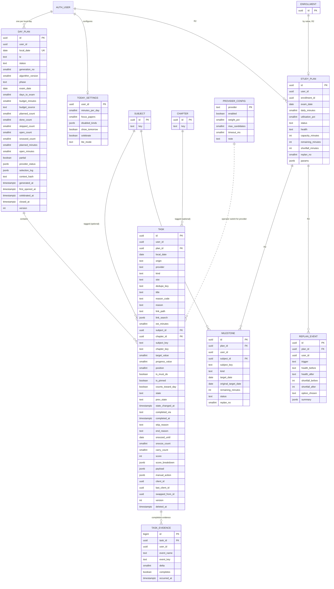
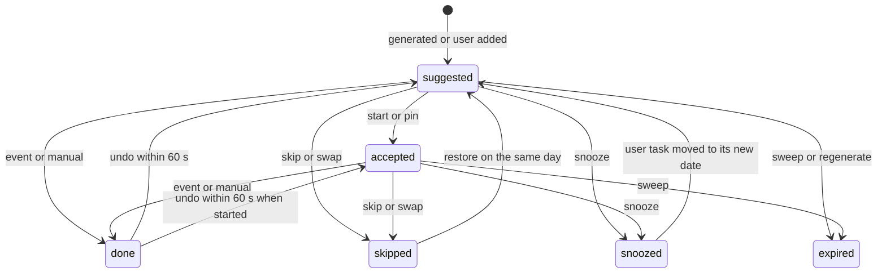
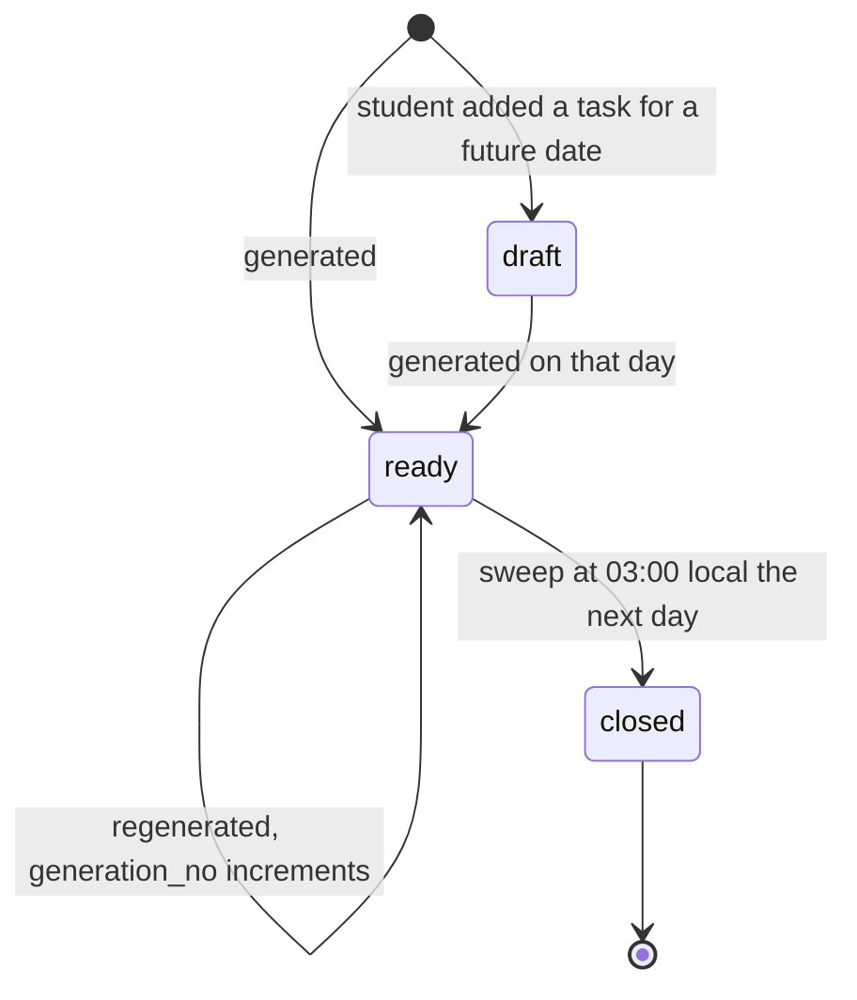

# ERD: F-13 Today (daily tasks and questions) and the study planner

| Field | Value |
| --- | --- |
| Linked PRD | `docs/product/prd/F-13-today-daily-tasks.md` |
| Order | Consumer of F-02 (`docs/product/erd/F-02-syllabus-structure-and-coverage.md`), F-01.2 (`docs/product/erd/F-01.2-time-tracker-and-analytics.md`) and F-06 (`docs/product/erd/F-06-question-bank-system.md`); extension point for every later module |
| Django app | `apps/api/modules/today` (tables prefixed `today_`; the planner is a sub-package of this app) |
| Web module | `apps/web/src/modules/today` |
| Last updated | 2026-10-05 |

**Reading guide for other authors.** Sections 0 and 3 are the contract. If your module wants to put tasks in a student's Today list, you register a provider (3.2 and 3.3) from your own `AppConfig.ready()`; you do not add tables to `today`, import its models or edit its code. Table names follow `<app>_<model>`.

## 0. Design decisions

1. **Today stores decisions, not knowledge.** A task row is a snapshot of one offer made to one student on one day (title, reason, link, estimate, state). The truth about the underlying work (a revision due, a card due, an MCQ set) stays in the owning module, which is why provider tasks are never copied forward: the provider offers the item again if it is still needed.
2. **Pull for candidates, push for completion.** Providers are called when a plan is built (pull). Completion arrives as domain events from the owning module (push, inline subscribers), with an optional read-time `reconcile` as a safety net for lost events.
3. **One plan row per (student, local date), enforced by a unique constraint.** Generation computes candidates and the selection outside the write transaction, then inserts with `ON CONFLICT DO NOTHING` and returns the winner. Losers discard their work. No advisory locks are needed for creation; regeneration and transitions use row locks (3.5).
4. **Pure composition.** `domain/compose.py` is a function of candidates, context and parameters. It reads no clock, no database and no global state. Determinism is a tested property (golden fixtures shared with the web mirror where the web needs them).
5. **State machine in one place.** `domain/states.py` holds the transition table; services call it; a shared JSON of cases is run by Python and TypeScript tests so the optimistic UI cannot drift.
6. **Counters are recomputed, never incremented.** The plan row carries counters (done, open, skipped, minutes) recomputed from its tasks by one `UPDATE ... FROM (SELECT ...)` inside the transition transaction while the plan row is locked. This avoids the drift and the delete-and-insert races found in the F-02 and F-01.2 audit (AUD-001, AUD-002).
7. **Idempotent evidence.** A completion event can be delivered twice or late. `today_taskevidence` is unique per (task, event name, event key); progress is the sum of evidence deltas.
8. **Time zone and day boundary.** `local_date` is the student's tracker time zone date (`tracking.services.get_timezone`, default `Asia/Kolkata`, UTC+5:30, no DST). Open tasks expire at 03:00 local the next day; until then a late event may still complete them.
9. **Explainability is data.** `score_breakdown` on the task and `selection_log` on the plan make "Why this?" and support questions answerable without re-running anything.
10. **Safe deep links.** Tasks store an internal path and a small search object, validated against an allow-list of `/app/...` prefixes. Keys (`subject_key`, `chapter_key`) are stored beside ids so links survive scheme switches (AUD-017).
11. **Django is the only gateway.** RLS enabled with no policies on every table; scoping by the JWT `sub` on every query; other students' ids return 404.
12. **Planner is additive.** R1 needs no planner tables (the phase is a pure function of the exam date). R2 adds `today_studyplan`, `today_milestone` and `today_replanevent` in a separate migration, so R1 can ship and be rolled back independently.

## 1. Diagrams

### 1.1 Entities



`user_id` columns reference `auth.users.id` by value (the convention of `profiles`, F-01.x and F-02). `SUBJECT`, `CHAPTER` and `ENROLLMENT` are shown for orientation; their definitions are in the F-02 ERD. `PROVIDER_CONFIG` is matched to `TASK.provider` by name, not by a foreign key.

### 1.2 Task lifecycle



### 1.3 Plan lifecycle



## 2. Tables

Common columns unless stated: `created_at timestamptz not null default now()`, `updated_at timestamptz not null default now()`.

### 2.1 `today_dayplan`

One row per student per local date. Created by generation (`ready`) or by the first own task added for a future day (`draft`).

| Column | Type | Null | Default | Notes |
| --- | --- | --- | --- | --- |
| id | uuid | no | gen | PK |
| user_id | uuid | no | | Owner |
| local_date | date | no | | Student's local date |
| tz | text | no | | IANA name used for this day (copied from tracker settings) |
| status | text | no | `ready` | `draft`, `ready`, `closed`. Check |
| generation_no | smallint | no | 1 | 0 for `draft`. Incremented by regeneration. Check `status = 'draft' or generation_no >= 1` |
| algorithm_version | smallint | no | 1 | Version of `compose` and the constants; lets old plans be explained |
| phase | text | no | `steady` | `steady`, `build`, `consolidate`, `sprint`, `final`, `post_exam`. Check |
| exam_date | date | yes | | Target date used (student's own, else the term start) |
| days_to_exam | smallint | yes | | Can be negative for `post_exam` |
| budget_minutes | smallint | no | 60 | Budget `B` used. Check 10..300 |
| budget_source | text | no | `auto` | `auto`, `setting`, `comeback`, `feedback`. Check |
| planned_count | smallint | no | 0 | Tasks that count toward the day: states suggested, accepted, done, skipped with `counts_toward_day` |
| done_count | smallint | no | 0 | |
| skipped_count | smallint | no | 0 | |
| open_count | smallint | no | 0 | suggested plus accepted |
| snoozed_count | smallint | no | 0 | |
| planned_minutes | smallint | no | 0 | Sum of `est_minutes` of the planned tasks |
| open_minutes | smallint | no | 0 | Sum for open tasks (the "about 35 min left") |
| partial | boolean | no | false | At least one provider failed in the last generation |
| provider_status | jsonb | no | `{}` | `{"v":1,"providers":{"coverage.revision":{"status":"ok","ms":42,"n":7}, "recall.due":{"status":"timeout","ms":400,"n":0}}}` |
| selection_log | jsonb | no | `{}` | `{"v":1,"candidates":31,"dropped":{"invalid_link":0,"est_range":1,"done_today":3,"suppressed":2,"duplicate":4,"budget":9,"cap":6},"focus_papers":["taxation","costing"],"starved":["costing"]}`. Counts only, at most 4 KB (check on `octet_length`) |
| context_hash | text | yes | | Hash of enrolment, scheme, exam date, settings and provider config at generation; the API tells the client when the current hash differs (`stale_hint`) |
| generated_at | timestamptz | yes | | Null for `draft` |
| first_opened_at | timestamptz | yes | | Set by `open` once |
| celebrated_at | timestamptz | yes | | Celebration shown once per day across devices |
| closed_at | timestamptz | yes | | |
| feedback | text | yes | | R2: `too_much`, `just_right`, `too_little` |
| feedback_at | timestamptz | yes | | R2 |
| bonus_minutes | smallint | no | 0 | R2 |
| version | int | no | 1 | Optimistic lock for regenerate and the ETag |

Constraints and indexes:

- Unique `(user_id, local_date)` (the idempotency key of generation, also serves "plan for a date").
- Counters are derived (3.5); a property test asserts they equal the aggregate of the plan's tasks after random transitions, instead of a database check.
- Index `(local_date) where status = 'ready'` for the close sweep.
- Index `(local_date, user_id)` for the pre-generation anti-join (students with a ready plan in the last 14 days and none for the target date).

### 2.2 `today_task`

| Column | Type | Null | Default | Notes |
| --- | --- | --- | --- | --- |
| id | uuid | no | gen | PK. Client-generated for own tasks created offline (the API accepts it as `id` only together with `client_id`) |
| user_id | uuid | no | | |
| plan_id | uuid | no | | FK `today_dayplan`, on delete cascade |
| local_date | date | no | | Equals the plan's date; kept for the open-task index. Moved with the task when an own task is snoozed |
| origin | text | no | | `provider`, `user`, `planner` (R2). Check |
| provider | text | no | `''` | Registered provider name, empty for `user` |
| kind | text | no | | Registered kind name, for example `revise_chapter`, `mcq_set`, `recall_cards`, `formula_recall`, `read_section`, `practical_question`, `amendment_read`, `daily_challenge`, `custom` (validated in code, not by a database check, because kinds are open for extension) |
| slot | text | no | | `mcq`, `formula`, `section`, `practical`, `revision`, `recall`, `read`, `amendment`, `challenge`, `custom`, `other`. Check (the UI depends on this closed list) |
| dedupe_key | text | no | | Stable per unit of work, at most 120 characters, for example `revise:<chapter_id>:3`. For own tasks `user:<id>` |
| title | text | no | | Plain text, 1 to 120 characters |
| reason_code | text | no | `custom` | From the reason registry (3.6) |
| reason | text | no | `''` | At most 160 characters, plain text, no personal data other than the student's own |
| link_path | text | no | `''` | Internal path. Check `link_path = '' or link_path like '/app/%'` |
| link_search | jsonb | no | `{}` | Flat object of scalar values, each at most 200 characters |
| est_minutes | smallint | no | | Check 1..180 (providers 1..90, own tasks up to 180) |
| subject_id | uuid | yes | | FK `syllabus_subject`, on delete set null |
| chapter_id | uuid | yes | | FK `syllabus_chapter`, on delete set null |
| subject_key | text | no | `''` | Stable key copy (survives scheme switches) |
| chapter_key | text | no | `''` | |
| target_value | smallint | yes | | For count tasks (5 MCQs, 12 cards). Check null or 1..100 |
| progress_value | smallint | no | 0 | Sum of evidence deltas, capped at the target. Check >= 0 |
| position | smallint | no | 0 | Display order inside the plan |
| is_must_do | boolean | no | false | Provider flagged it must-do (budget may stretch to 125 percent) |
| is_pinned | boolean | no | false | Kept across regeneration |
| counts_toward_day | boolean | no | true | False for bonus tasks (R2) |
| state | text | no | `suggested` | `suggested`, `accepted`, `done`, `skipped`, `snoozed`, `expired`. Check |
| prev_state | text | yes | | State before the last transition, for undo |
| state_changed_at | timestamptz | no | now() | Undo window is 60 s from here |
| completed_via | text | yes | | `event`, `manual`. Check |
| completed_at | timestamptz | yes | | |
| skip_reason | text | yes | | `not_in_attempt`, `already_know`, `no_time`, `other`, `swapped`. Check |
| end_reason | text | yes | | For `expired`: `day_ended`, `regenerated`, `no_longer_needed`. Check |
| snoozed_until | date | yes | | |
| snooze_count | smallint | no | 0 | |
| carry_count | smallint | no | 0 | Own tasks carried to a new day. At 3 the task is flagged stuck |
| score | int | no | 0 | Final permille score at generation (0 for own tasks) |
| score_breakdown | jsonb | no | `{}` | `{"v":1,"signals":{"u":90,"i":80,"w":50,"f":60},"base":730,"group":"revise","phase_mult":120,"provider_weight":100,"must_do":false,"miss_penalty":0,"rank":1,"modifiers":["exam_in_52_days","starved_paper"]}` |
| payload | jsonb | no | `{}` | Small provider data (for example `{"v":1,"mode":"chapter_quiz","n":5}`). Check `octet_length(payload::text) <= 4096` |
| manual_action | jsonb | yes | | `{"key":"coverage.log_revision","label":"Also log this revision","default":true}`; the code to run is looked up by key in the registry |
| client_id | uuid | yes | | Idempotency key of own-task creation and of swap replacements. Unique with `user_id` where not null |
| last_client_id | uuid | yes | | Idempotency key of the last transition (a replay returns the stored result) |
| swapped_from_id | uuid | yes | | The task this one replaced |
| version | int | no | 1 | Optimistic lock |
| deleted_at | timestamptz | yes | | Own tasks only (soft delete) |

Constraints:

- `origin = 'user' or (provider <> '' and dedupe_key <> '')`.
- `(state = 'done') = (completed_at is not null)`; `completed_via is null or state = 'done'`; `(state = 'snoozed') = (snoozed_until is not null)`; `skip_reason is null or state = 'skipped'`; `end_reason is null or state = 'expired'`.
- Unique `(plan_id, dedupe_key) where state <> 'expired' and deleted_at is null` (one live row per unit of work per day, including skipped and done, so a done or skipped key is never re-suggested).
- Unique `(user_id, client_id) where client_id is not null`.

Indexes (each justified in section 5):

- `(plan_id, position) where state <> 'expired' and deleted_at is null` (the plan list).
- `(user_id, local_date) where state in ('suggested','accepted')` (open tasks for completion matching, the close sweep and reminders).
- `(user_id, dedupe_key, local_date desc)` (miss count, repeated skips, suppression).
- `(user_id, snoozed_until) where state = 'snoozed'` (suppression lookup at generation).

### 2.3 `today_taskevidence`

Idempotent record that an event contributed to a task. Retained 90 days.

| Column | Type | Null | Default | Notes |
| --- | --- | --- | --- | --- |
| id | bigint | no | identity | PK |
| task_id | uuid | no | | FK `today_task`, on delete cascade |
| user_id | uuid | no | | |
| event_name | text | no | | `practice_session_completed`, `coverage_event_recorded`, ... |
| event_key | text | no | | The event's key (session id, ledger event id) |
| delta | smallint | no | 0 | Progress contributed (answered count, cards reviewed) |
| completes | boolean | no | false | The rule said done outright (exact match or reconcile) |
| occurred_at | timestamptz | no | | From the event |
| created_at | timestamptz | no | now() | |

Unique `(task_id, event_name, event_key)` (inserted with `ON CONFLICT DO NOTHING`; the row count tells the subscriber whether it was new). Index `(created_at)` for pruning.

### 2.4 `today_settings`

One row per student, created on first write.

| Column | Type | Null | Default | Notes |
| --- | --- | --- | --- | --- |
| user_id | uuid | no | | PK |
| minutes_per_day | smallint | yes | | Null = auto. Check 15..240 |
| focus_papers | smallint | yes | | Null = auto. Check 1..4 |
| disabled_kinds | jsonb | no | `[]` | Array of kind names the student hid. At most 20 entries |
| show_tomorrow | boolean | no | true | |
| celebrate | boolean | no | true | |
| lite_mode | text | no | `auto` | `auto`, `on`, `off`. Check |
| created_at, updated_at | timestamptz | no | now() | |

The time zone is not stored here: it is the tracker's (`tracking.services.get_timezone`), stored once per student.

### 2.5 `today_providerconfig`

Operator switches, edited in the Django admin. Missing rows mean defaults (enabled, weight 100). Cached in process for 60 seconds.

| Column | Type | Null | Default | Notes |
| --- | --- | --- | --- | --- |
| provider | text | no | | PK, the registered name |
| enabled | boolean | no | true | A disabled provider is skipped and shown as `disabled` in `provider_status` |
| weight_pct | smallint | no | 100 | 0..300 multiplier in the score |
| max_candidates | smallint | yes | | Overrides the registered value, 1..50 |
| timeout_ms | smallint | yes | | Overrides the registered timeout, 100..2000 |
| note | text | no | `''` | Why it was changed |
| updated_by | uuid | yes | | Admin user id |
| updated_at | timestamptz | no | now() | |

### 2.6 `today_studyplan` (R2)

The student's date-driven plan for one enrolment. At most one `active` per student and enrolment.

| Column | Type | Null | Default | Notes |
| --- | --- | --- | --- | --- |
| id | uuid | no | gen | PK |
| user_id | uuid | no | | |
| enrollment_id | uuid | no | | By value (`coverage_enrollment.id`), validated through `coverage.selectors` |
| scheme_id | uuid | no | | By value; the scheme the plan was built on |
| exam_date | date | no | | Target date |
| daily_minutes | smallint | no | | Study minutes per day used for capacity. Check 30..720 |
| utilisation_pct | smallint | no | 70 | Share of study time realistically usable. Check 30..100 |
| status | text | no | `active` | `active`, `superseded`, `archived` |
| health | text | no | `unknown` | `unknown`, `on_track`, `slightly_behind`, `at_risk` |
| capacity_minutes | int | no | 0 | Reading capacity until the reading deadline |
| remaining_minutes | int | no | 0 | Estimated reading minutes left |
| shortfall_minutes | int | no | 0 | `max(0, remaining - capacity)` |
| reading_deadline | date | yes | | End of the learn window |
| revise_until | date | yes | | End of the revise window (exam week follows) |
| health_checked_at | timestamptz | yes | | |
| last_replanned_at | timestamptz | yes | | |
| replan_no | smallint | no | 0 | |
| params | jsonb | no | `{}` | `{"v":1,"learn_share":70,"exam_week_days":7,"lanes":2}` |
| version | int | no | 1 | |
| created_at, updated_at | timestamptz | no | now() | |

Partial unique `(user_id, enrollment_id) where status = 'active'`. Index `(user_id, status)`.

### 2.7 `today_milestone` (R2)

| Column | Type | Null | Default | Notes |
| --- | --- | --- | --- | --- |
| id | uuid | no | gen | PK |
| plan_id | uuid | no | | FK `today_studyplan`, cascade |
| user_id | uuid | no | | |
| subject_id | uuid | yes | | FK `syllabus_subject`, on delete set null |
| subject_key | text | no | `''` | Stable key; empty for whole-plan milestones such as `exam_week` |
| kind | text | no | | `finish_reading`, `first_revision`, `mock`, `exam_week`. Check |
| target_date | date | no | | Current target |
| original_target_date | date | no | | First target (to show "moved by 6 days") |
| remaining_minutes | int | no | 0 | Work left at the last check |
| status | text | no | `pending` | `pending`, `done`, `at_risk`, `missed`, `dropped`. Check |
| done_at | timestamptz | yes | | |
| sort_order | smallint | no | 0 | |
| replan_no | smallint | no | 0 | Plan revision that last changed it |

Unique `(plan_id, kind, subject_key)`. Index `(user_id, target_date) where status in ('pending','at_risk')`.

### 2.8 `today_replanevent` (R2)

Audit of re-plans so the student can see what moved and support can explain it.

| Column | Type | Null | Default | Notes |
| --- | --- | --- | --- | --- |
| id | uuid | no | gen | PK |
| plan_id | uuid | no | | FK cascade |
| user_id | uuid | no | | |
| trigger | text | no | | `missed_days`, `weekly`, `manual`, `exam_date`, `scheme_switch`. Check |
| health_before, health_after | text | no | | As in the plan |
| shortfall_before, shortfall_after | int | no | 0 | Minutes |
| moved_count | smallint | no | 0 | Milestones whose date changed |
| option_chosen | text | yes | | `more_time`, `skim_low_weight`, `next_attempt`, `none`. Null while options are pending |
| summary | jsonb | no | `{}` | `{"v":1,"moved":[{"subject_key":"audit","kind":"finish_reading","from":"2026-11-02","to":"2026-11-08"}],"options":[...]}`, at most 8 KB |
| created_at | timestamptz | no | now() | |

Index `(plan_id, created_at desc)`.

## 3. Relationships to other modules and the contract

### 3.1 Foreign keys and by-value references

| From | To | Rule |
| --- | --- | --- |
| all `user_id` | `auth.users.id` | By value, no cross-schema FK; scoped on every query |
| `today_task.subject_id`, `chapter_id`; `today_milestone.subject_id` | `syllabus_subject`, `syllabus_chapter` | Real FKs, `on delete set null`; stable `subject_key` and `chapter_key` copies kept. Reads through `syllabus.selectors`, never its models |
| `today_studyplan.enrollment_id`, `scheme_id` | `coverage_enrollment`, `syllabus_scheme` | By value; validated through `coverage.selectors` and `syllabus.selectors` |
| `today_task.provider`, `kind` | Provider registry (code) | By name; validated at write time |
| Practice sessions started from a task | `practice_session.origin_ref` | By value (`origin_module = 'today'`, `origin_ref = task id`), written by `practice` when the web creates the session |
| Tracker goal, streak, time zone | `tracking.selectors.goals_progress`, `streak`, `day_totals`; `tracking.services.get_timezone`, `local_today` | Function calls; no table access |
| Account deletion | `today.services.delete_all_for_user`, `export_for_user` | Called by the central erasure hook proposed in audit AUD-004 |

Dependency direction (no cycles): `today -> coverage -> syllabus`, `today -> tracking`, `today -> core`. Providers live in their owners and depend on `today.registry` only (a leaf module with no model imports). `today` imports no provider code. F-06 `practice` registers its provider and origin from `today_providers.py` and imports `today.registry`; `today` does not import `practice` (it only subscribes to `practice_session_completed` by event name through `core.events`).

### 3.2 Public interfaces (the contract)

Python 3.12. Everything not listed is private and may change.

```python
# ---- today/registry.py (leaf module: types and registration only; safe to import from any app) ----------------
Group = Literal["learn", "revise", "practice", "exam", "news"]
Slot  = Literal["mcq", "formula", "section", "practical", "revision", "recall", "read", "amendment", "challenge", "custom", "other"]

@dataclass(frozen=True)
class KindSpec:
    name: str            # "revise_chapter", "mcq_set", "recall_cards", ...  (globally unique)
    group: Group         # which phase multiplier applies
    slot: Slot           # which tile slot it fills (one task per slot per paper)
    icon: str            # a key in the design-system icon map
    default_est_minutes: int

@dataclass(frozen=True)
class DeepLink:
    path: str            # "/app/practice/new"; must match the allow-list in today/domain/deeplinks.py
    search: Mapping[str, str | int]   # flat, scalar values, each at most 200 chars

@dataclass(frozen=True)
class Signals:           # integers 0..100; the provider says how it looks, Today decides the weight
    urgency: int         # how overdue or time-bound (revision overdue days, amendment close to the attempt)
    importance: int      # marks weight, historical frequency, priority chapter
    weakness: int        # low accuracy, forgotten cards
    freshness: int       # how long since the student touched this area

@dataclass(frozen=True)
class TaskCandidate:
    kind: str                       # one of the provider's declared KindSpec names
    dedupe_key: str                 # stable for the same unit of work across days, <= 120 chars
    title: str                      # plain text, <= 80 chars, no HTML
    reason_code: str                # from the reason registry (3.6)
    reason: str                     # <= 140 chars, human sentence ("Revision 2 was due 3 days ago")
    link: DeepLink
    est_minutes: int                # 1..90
    signals: Signals
    subject_id: UUID | None = None  # None = General pool
    chapter_id: UUID | None = None
    target_value: int | None = None # for count tasks (5 MCQs)
    must_do: bool = False           # rare: overdue milestone, amendment for an attempt within 14 days
    expires_on: date | None = None  # not offered after this local date (daily challenge: today)
    payload: Mapping[str, Any] = field(default_factory=dict)   # <= 2 KB, schema-versioned by the provider
    manual_action: ManualActionRef | None = None

@dataclass(frozen=True)
class EnrollmentCtx: id: UUID; scheme_id: UUID; course_code: str; level_code: str; exam_date: date | None; term_code: str | None; daily_hours: Decimal | None
@dataclass(frozen=True)
class PaperCtx:      subject_id: UUID; key: str; name: str; paper_number: int | None; kind: str; coverage_pct: int; days_untouched: int | None
@dataclass(frozen=True)
class PlanContext:
    user_id: UUID; local_date: date; tz: str
    enrollment: EnrollmentCtx | None
    days_to_exam: int | None; phase: str
    papers: tuple[PaperCtx, ...]            # active, not excluded, in the student's scheme and electives
    done_keys: frozenset[str]; suppressed_keys: frozenset[str]
    budget_minutes: int; comeback: bool; seed: int; is_preview: bool

@dataclass(frozen=True)
class TaskRequest:  ctx: PlanContext; limit: int; deadline_ms: int

@dataclass(frozen=True)
class ProviderResult:
    candidates: Sequence[TaskCandidate]
    backlog_count: int = 0                  # how many more the student has than the candidates (38 overdue revisions)
    backlog_label: str = ""                 # "revisions are overdue"
    backlog_link: DeepLink | None = None    # "/app/revision"

# ---- completion, reconcile, manual action ---------------------------------------------------------------------
@dataclass(frozen=True)
class Match:
    evidence_key: str        # the event's key (session id): the idempotency anchor
    done: bool = False       # exact completion
    delta: int = 0           # progress toward target_value (answered questions, reviewed cards)

@dataclass(frozen=True)
class CompletionRule:
    event_name: str                                  # a core.events name
    match: Callable[[Event, TaskView], Match | None] # PURE: no I/O, no clock, runs inline (budget 5 ms per task)

@dataclass(frozen=True)
class Evidence:  done: bool; progress: int | None; key: str

@dataclass(frozen=True)
class ManualAction:
    key: str                                         # "coverage.log_revision"
    label: str                                       # "Also log this revision"
    default_on: bool
    run: Callable[[UUID, TaskView], None]            # idempotent: derive client_id = uuid5(NS, str(task.id)); never raise on replay

def register_task_provider(
    name: str,                                       # "coverage.revision"  (<module>.<what>)
    provide: Callable[[TaskRequest], ProviderResult],
    *,
    kinds: Sequence[KindSpec],
    label: str,                                      # shown in admin and "Why this?"
    flag: str | None = None,                         # PostHog flag; off means the provider is skipped
    timeout_ms: int = 400,
    max_candidates: int = 20,
    enabled_for: Callable[[UUID], bool] | None = None,   # cheap per-user gate (for example "has any recall cards")
    completion: Sequence[CompletionRule] = (),
    reconcile: Callable[[UUID, Sequence[TaskView], date], Mapping[UUID, Evidence]] | None = None,
    manual_actions: Sequence[ManualAction] = (),
) -> None

def register_reason(code: str, *, label: str) -> None            # extends the reason registry

# ---- today/selectors.py (read only) ----------------------------------------------------------------------------
def get_plan(user_id: UUID, local_date: date) -> PlanView | None
def preview(user_id: UUID, local_date: date) -> PreviewView                 # composes without persisting; at most 14 days ahead
def completion_history(user_id: UUID, date_from: date, date_to: date) -> list[DaySummary]   # planned, done, skipped, completed
def reminder_digest(user_id: UUID, local_date: date) -> Digest              # [PROPOSED: X-01] open_count, open_minutes, top3 [{title, link}], streak_at_risk, is_done
def is_day_done(user_id: UUID, local_date: date) -> bool
def get_settings(user_id: UUID) -> SettingsView

# ---- today/services.py (writes; user-checked) -----------------------------------------------------------------
def open_today(user_id: UUID, *, local_date: date | None, client_id: UUID, source: str) -> OpenResult          # ensure plan, idempotent
def regenerate(user_id: UUID, local_date: date, *, expected_generation: int, reason: str, client_id: UUID) -> PlanView   # PlanChanged
def add_task(user_id: UUID, *, client_id: UUID, title: str, local_date: date, est_minutes: int, subject_id=None, chapter_id=None) -> TaskView
def edit_task(user_id, task_id, changes: dict, *, version: int) -> TaskView
def delete_task(user_id, task_id, *, client_id) -> TaskView
def start_task(user_id, task_id, *, client_id) -> StartResult                # accepted + link
def complete_task(user_id, task_id, *, client_id, client_ts, run_manual_action: bool) -> TaskView
def skip_task(user_id, task_id, *, client_id, reason: str | None) -> SkipResult
def snooze_task(user_id, task_id, *, client_id, until: date) -> TaskView
def swap_task(user_id, task_id, *, client_id) -> SwapResult                   # NoAlternative
def undo_task(user_id, task_id, *, client_id, from_state: str) -> TaskView    # UndoExpired
def update_settings(user_id, changes: dict) -> SettingsView
def close_expired_plans(now: datetime, *, limit: int = 500) -> int           # cron
def pregenerate(now: datetime, *, limit: int = 200) -> int                    # cron
def prune(now: datetime) -> PruneReport                                       # cron: retention
def delete_all_for_user(user_id: UUID) -> DeleteReport;  def export_for_user(user_id: UUID) -> dict
```

**Rules for providers (enforced by a contract test every provider must pass):**

1. Pure read. No writes, no events, no calls to other providers, no network. Use the owner's own selectors.
2. Deterministic for the same `TaskRequest` and the same database state (use `ctx.seed` for any random choice).
3. Return within `timeout_ms`; return at most `max_candidates`; never return a candidate for a paper that is not in `ctx.papers`.
4. `dedupe_key` is stable across days for the same unit of work (so a snooze, skip or done on it is remembered) and changes when the unit changes (`revise:<chapter_id>:3` becomes `...:4` after the third revision).
5. Titles and reasons are plain text, no personal data of other users, no HTML; the student's own titles may appear.
6. Links are internal, allow-listed, and must resolve in the route manifest test (`today/tests/test_links_resolve.py` reads the web route list).
7. Signals are honest integers in 0..100; a provider cannot see or set the final score.
8. Never decide the number of tasks to show: offer candidates and, if there are many, `backlog_count`.

### 3.3 Registries and subscriptions

- `register_task_provider` and `register_reason` as above, called in the owning app's `AppConfig.ready()` (the same place the Pomodoro registers its live-timer provider).
- Today registers inline subscribers with `core.events.register_subscriber(event_name, "today.complete", handler, mode="inline")` for the union of event names named in providers' `CompletionRule`s (done once at start from the registry). Inline because the student returns to Today within a second of finishing; handlers are cheap (one indexed query, pure matching) and idempotent.
- Today registers one `register_origin("today", OriginSpec(...))` equivalent in `practice/today_providers.py` (owned by F-06) so sessions carry the task id.

### 3.4 Domain events

Envelope and delivery are those of the F-06 ERD (3.4): outbox in the emitter's transaction, at-least-once, subscribers idempotent on `key`. JSON Schema files live in `apps/api/core/event_schemas/<name>.v1.json`.

Emitted by Today:

| Event | Key | Payload (v1) | Consumers |
| --- | --- | --- | --- |
| `today_plan_generated` | `plan_id:generation_no` | `plan_id`, `local_date`, `generation_no`, `task_count`, `planned_minutes`, `phase`, `partial` | analytics, X-01 (schedule today's reminder) |
| `today_task_completed` | `task_id` | `task_id`, `plan_id`, `local_date`, `kind`, `provider`, `via`, `chapter_id`, `est_minutes` | X-03, F-10 |
| `today_day_completed` | `plan_id` | `plan_id`, `local_date`, `done`, `skipped`, `planned_minutes` | X-01 (stop reminders), X-03 |
| `today_day_closed` | `plan_id` | `plan_id`, `local_date`, `done`, `skipped`, `expired`, `completed` | F-10, X-01 |

Consumed by Today:

| Event | Emitter | Used for | Status |
| --- | --- | --- | --- |
| `practice_session_completed` | F-06 | MCQ and practical tasks: exact match on `origin_ref`, fuzzy by chapter; `by_chapter[].answered` gives the progress | Defined in F-06 |
| `coverage_event_recorded` | F-02 | Revision tasks (`type = revision_done`), topic tasks (`topic_done`), practice and mock signals | `[PROPOSED EXTENSION to F-02]` payload `{chapter_id, subject_id, type, source, source_ref, occurred_at}`, key = ledger event id |
| `recall_session_completed` | F-15 | Recall tasks: `reviewed` count as progress | `[PROPOSED: F-15]` |
| `amendment_read` | F-14 | Amendment tasks | `[PROPOSED: F-14]` |
| `challenge_completed` | X-03 or F-09 | Daily challenge task | `[PROPOSED: X-03]` |
| `coverage_enrollment_changed` | F-02 | Regenerate when exam date, scheme or exclusions change | `[PROPOSED EXTENSION to F-02]` payload `{user_id, enrollment_id, change}`; until it exists, `context_hash` mismatch on the next read triggers `stale_hint` and regeneration |

### 3.5 Behavioural reference (what the tests assert)

**Generation (`ensure_plan`).**

1. Resolve the student's local date and settings; load the enrolment (via `coverage.selectors.study_state`); compute phase, budget and comeback from tracker `day_totals` and the last plans' counters.
2. Collect candidates: for each enabled provider whose flag and `enabled_for` pass, run in a thread pool with `timeout_ms`; catch every exception; build `provider_status`. Add carried own tasks (user tasks whose date has arrived) as pre-selected tasks.
3. `compose(candidates, ctx, params)` (pure) returns the ordered selection with breakdowns and the drop counts.
4. In one transaction: `INSERT INTO today_dayplan ... ON CONFLICT (user_id, local_date) DO NOTHING RETURNING id`. If a row was returned (or the existing row is a `draft`, locked `FOR UPDATE`), insert the tasks and recount. If the plan already existed as `ready`, discard the work and return the stored plan. Emit `today_plan_generated` inside the transaction.
5. Same inputs and same database state give the same `dedupe_key` sequence (golden test).

**Transitions (all writes to a task).**

1. Resolve the plan id of the task without a lock, then `SELECT ... FROM today_dayplan WHERE id = :p FOR UPDATE`, then `SELECT ... FROM today_task WHERE id = :t AND user_id = :u FOR UPDATE`. Lock order is always plan then tasks ordered by id (no deadlocks).
2. If `last_client_id = :client_id` return the stored result. If the target state equals the current state return it (idempotent). Otherwise apply the matrix below; invalid moves raise 422 `invalid_transition` with the allowed states.
3. Update the task (`prev_state`, `state_changed_at`, `version + 1`), recount the plan in the same transaction, emit domain events, return the task and the plan counters.

| From, to | suggested | accepted | done | skipped | snoozed | expired |
| --- | --- | --- | --- | --- | --- | --- |
| suggested | n/a | start, pin | tick, event | skip, swap | snooze | system |
| accepted | system (never) | n/a | tick, event | skip, swap | snooze | system |
| done | undo (60 s) | undo if started | n/a | no | no | no |
| skipped | restore (same day) | no | no | n/a | no | system |
| snoozed | user task moved | no | no | no | n/a | system |
| expired | no | no | event within the grace window | no | no | n/a |

Conflict rule across devices: `done` is terminal against a later write; between non-terminal states the later `client_ts` wins and the loser receives 409 `state_conflict` with the current task. An event can complete an `expired` task of the previous day only before 03:00 local (the grace window).

**Counters.** `recount(plan)` is one statement under the plan lock:
`planned_count = count(state in (suggested, accepted, done, skipped) and counts_toward_day)`, `done_count`, `skipped_count`, `open_count = count(state in (suggested, accepted))`, `snoozed_count`, `planned_minutes`, `open_minutes`.

**Day completed.** True when `open_count = 0` and `done_count >= 1` and `2 * done_count >= done_count + skipped_count`. The celebration shows when it first becomes true and `celebrated_at` is null; the update of `celebrated_at` is a compare-and-set so two devices celebrate once.

**Completion by event.**

1. Subscriber receives the event. Candidate tasks: the student's open tasks (`state in (suggested, accepted)`) with `local_date` equal to the event's local date, plus yesterday's within the grace window, restricted to providers that declared a rule for this event name.
2. For each task run `rule.match(event, task_view)`. On a match: `INSERT INTO today_taskevidence ... ON CONFLICT DO NOTHING`; if no row was inserted stop (replay).
3. Lock the plan, then the task; `progress_value = min(target, sum(delta))`; if `done` or progress reaches the target, set `done`, `completed_via = 'event'`; recount; emit `today_task_completed`.
4. Reconcile on read: for open tasks older than 5 minutes whose provider has `reconcile`, call it with a 150 ms budget; apply the same steps with an evidence key `reconcile:<provider>:<date>`.

**Regeneration.** Lock the plan; compare `generation_no` with `expected_generation` (else `plan_changed`); keep tasks in states done, accepted, snoozed, user-origin and pinned; expire the rest with `end_reason = 'regenerated'`; run steps 1 to 3 of generation with the kept dedupe keys as `done_keys` (so they are not offered twice); insert; `generation_no + 1`; recount. At most 6 per day per student.

**Swap.** Same as regeneration for one task: exclude every key shown today plus the old one, prefer the same paper, run the providers for that paper's scope only (or the cached `ctx`), compose with one slot, insert the replacement at the same `position` with `swapped_from_id`, and mark the old task `skipped` with reason `swapped` in the same transaction. 20 per day per student.

**Suppression at generation.** A key is suppressed when a `snoozed` row for it has `snoozed_until > local_date`, or when it was skipped 3 or more times in the last 14 days (the suppression ends 14 days after the last skip). `miss_count` is the number of `expired` rows for the key in the last 7 days.

**Close sweep.** `close_expired_plans`: for plans `ready` whose local date is before the student's current local date and whose grace ended (03:00 local), set open tasks `expired` (`day_ended`), set `closed_at`, `status = 'closed'`, recount, emit `today_day_closed`. Own tasks that expired get a new copy on the next plan with `carry_count + 1` (at most 3 carries). Idempotent; processes at most 500 plans per tick.

**Planner (R2, pure functions in `today/planner/`).**

```
days        = local dates from today to exam_date - 1
exam_week   = last 7 days (no new reading)
reading_deadline = exam_date - max(14, round(0.30 * len(days)))        # learn window ends at the latest 70 percent of the runway
reading_cap = sum(daily_minutes * utilisation * learn_share for each day before reading_deadline)    # learn_share 0.70
remaining   = sum(est_study_minutes(chapter, default 60) * (100 - read_pct) / 100 for non-excluded chapters)
shortfall   = max(0, remaining - reading_cap)
health      = on_track if shortfall = 0; slightly_behind if shortfall <= 0.10 * reading_cap; else at_risk
milestones  = papers sorted by (marks desc, paper_number) assigned to `lanes` (2) lanes; each lane works through its papers in order at
              (daily_minutes * utilisation * learn_share / lanes) per day; finish_reading = lane time of the paper; first_revision = finish + 7 days;
              mock = reading_deadline + 7 days for each paper; exam_week milestone at exam_date - 7
replan      = same computation with today's progress; milestone dates may move earlier or later; if shortfall > 0 it also computes options:
              more_time:  required daily_minutes = ceil(remaining / (days_in_learn_window * utilisation * learn_share))
              skim_low_weight: chapters ordered by (marks weight per estimated minute) ascending, halved estimate until shortfall <= 0
              next_attempt: the next open exam term from F-02
              nothing is applied until the student chooses (option_chosen); with shortfall = 0 dates shift automatically and a note lists what moved
triggers    = 2 consecutive missed days, every Monday, manual, exam date change, scheme switch
```

Defaults are tunable constants (`today/planner/constants.py`) and `[VERIFY]` with the founder.

### 3.6 Enumerations owned here

Reason codes (`register_reason` extends the list): `revision_overdue`, `revision_due_today`, `recall_due`, `weak_topic`, `high_yield`, `amendment_new`, `not_practised_yet`, `next_in_syllabus`, `starved_paper`, `daily_challenge`, `milestone_behind`, `comeback`, `custom`. Each has a label used by "Why this?" when a provider's own text is missing.

### 3.7 What providers and consumers must not do

1. Add tables that duplicate tasks, plans or streaks, or compute their own streak; use `tracking.selectors` through Today's payload.
2. Write to `today_*` tables or import `today.models`; use `today.registry` and the services.
3. Poll Today; subscribe to its events.
4. Return side effects from `provide` or `match`.
5. Send task titles or reasons to analytics or logs.

### Provides and consumes (summary)

| Provides | Consumes |
| --- | --- |
| `today.registry.register_task_provider`, `register_reason`, the candidate and result types | `coverage.selectors.study_state` `[PROPOSED EXTENSION to F-02]`, `syllabus.selectors` (subjects, chapters, terms) |
| `today.selectors.reminder_digest`, `is_day_done`, `completion_history`, `get_plan`, `preview` | `tracking.selectors.goals_progress`, `streak`, `day_totals`; `tracking.services.get_timezone`, `local_today` |
| Events `today_plan_generated`, `today_task_completed`, `today_day_completed`, `today_day_closed` | Events `practice_session_completed`, `coverage_event_recorded`, `coverage_enrollment_changed`, and the F-15, F-14, X-03 events above |
| `today.services.delete_all_for_user`, `export_for_user` | `core.events`, `core.jobs`, `core.feature_flags`, the central erasure hook |

## 4. Enumerations and reference data

| Name | Values | Stored as | Owner |
| --- | --- | --- | --- |
| Plan status | draft, ready, closed | text with check | code |
| Phase | steady, build, consolidate, sprint, final, post_exam | text with check | code (`domain/phases.py`) |
| Budget source | auto, setting, comeback, feedback | text with check | code |
| Task origin | provider, user, planner | text with check | code |
| Task state | suggested, accepted, done, skipped, snoozed, expired | text with check | code (`domain/states.py`, shared JSON cases) |
| Slot | mcq, formula, section, practical, revision, recall, read, amendment, challenge, custom, other | text with check | code and design system icon map |
| Kind group | learn, revise, practice, exam, news | registry | providers declare, Today owns the multipliers |
| Completed via | event, manual | text with check | code |
| Skip reason | not_in_attempt, already_know, no_time, other, swapped | text with check | code |
| End reason | day_ended, regenerated, no_longer_needed | text with check | code |
| Lite mode | auto, on, off | text with check | code |
| Plan health, milestone kind and status, replan trigger and option (R2) | as in 2.6 to 2.8 | text with check | code |
| Constants | `MAX_TASKS` 8, `MIN_TASKS` 3, budget formula, focus papers, caps, undo 60 s, grace 180 min, snooze presets, quotas, phase table | `today/domain/constants.py`, mirrored in `modules/today/lib/limits.ts` with a parity test | code |

No seed data. `today_providerconfig` rows are created on demand by the admin or by `manage.py sync_today_providers` (idempotent, inserts missing providers with defaults).

## 5. Query patterns

| # | Query | Served by |
| --- | --- | --- |
| Q-1 | Plan for a student and date (open and read), with tasks in order | unique `(user_id, local_date)`; `(plan_id, position)` partial |
| Q-2 | Ensure plan: insert with conflict, return winner | unique `(user_id, local_date)` |
| Q-3 | Task transition: lock plan then task, update, recount | PK of both |
| Q-4 | Open tasks of a student for today (and yesterday in the grace window) for event matching | `(user_id, local_date) where state in ('suggested','accepted')` |
| Q-5 | Evidence insert with conflict | unique `(task_id, event_name, event_key)` |
| Q-6 | Suppression and miss counts at generation: rows for the student's dedupe keys in the last 14 days | `(user_id, dedupe_key, local_date desc)` |
| Q-7 | Snoozed keys with `snoozed_until > date` | `(user_id, snoozed_until) where state = 'snoozed'` |
| Q-8 | Week strip and history: day counters for up to 92 days | unique `(user_id, local_date)` range scan, counters only (no task join) |
| Q-9 | Close sweep: plans `ready` with `local_date` before the current local date for their tz | `(local_date) where status = 'ready'`, then tz check in code |
| Q-10 | Pre-generation: students with a plan in the last 14 days and none for the target date | `(local_date, user_id)` anti-join, 200 per tick |
| Q-11 | Reminder digest: open count, minutes, top 3 titles | plan counters plus `(plan_id, position)` limit 3 |
| Q-12 | Own tasks for future dates (quota check, 200 open) | `(user_id, local_date) where state in ('suggested','accepted')` filtered to `origin = 'user'` |
| Q-13 | Prune: tasks older than 13 months, evidence older than 90 days, plans older than 24 months | `local_date`, `created_at` range deletes in batches of 5,000 |
| Q-14 | Provider candidate queries | in the owning modules, each within the 400 ms budget |
| Q-15 (R2) | Active plan and milestones for a student | partial unique on `today_studyplan`; `(plan_id, kind, subject_key)` |

Hot paths read the plan and tasks only; they never recompute composition. The plan response is cacheable per student with an `ETag` built from `version` and the maximum task `updated_at`.

## 6. Storage, scale and retention

No files, no Supabase Storage bucket.

**Volume assumptions.** 50,000 monthly students at maturity, 30 percent open Today on a given day, 6 provider tasks and 1 own task on average: about 100,000 plans and 700,000 task rows a day, about 250 million task rows a year before retention. Year one is expected to be two orders of magnitude smaller (5,000 monthly students, a few million rows). Plan rows are 1 per student per day, so about 36 million a year at maturity.

- **No partitioning in R1.** With the retention below, the live `today_task` is about 13 months of rows. The design relies on `(user_id, local_date)` indexes and batch pruning. Revisit (monthly range partitions on `local_date`, with the PK widened to include it) before 150 million live rows or when the prune job cannot finish in its window. The unique keys are all per plan or per student, so they can include `local_date` without semantic change when that time comes.
- **Retention.** `today_task` 13 months; `today_taskevidence` 90 days; `today_dayplan` 24 months (counters stay for adherence after tasks are pruned); replan events 24 months. `today.prune` runs as a `core_job` nightly in batches of 5,000.
- **Caching.** Provider config 60 s in process; plan response ETag; the web caches the plan in IndexedDB. The 03:30 pre-generation spreads the morning peak.
- **Async work.** Vercel limits: no request over about 10 s of work. `open` generates inline (target 1.2 s, 400 ms per provider in parallel). Cron jobs `today.pregenerate` (200 students per tick), `today.sweep`, `today.prune` and later `today.remind` run through `POST internal/tick/` and the shared `core_job` queue; all are idempotent and bounded.
- **Generation cost.** Per open: one study-state read, one tracker read, one history read, N providers (each with its own queries, budgeted), one insert batch of at most 8 plus own tasks. No AI.

## 7. Security

- **Access path:** browser, Django, Postgres. The Supabase Data API stays disabled.
- **RLS:** enabled with no policies on `today_dayplan`, `today_task`, `today_taskevidence`, `today_settings`, `today_providerconfig`, `today_studyplan`, `today_milestone`, `today_replanevent` by the post-migrate hook; `core/tests/test_row_level_security.py` derives the list from models, so new tables are covered automatically (Postgres only; CI has a Postgres service).
- **Scoping:** every selector and service takes `user_id` from the verified JWT; no endpoint accepts it. Detail routes filter id and `user_id` together (404 for others). The completion subscriber loads tasks by the event's `user_id` only.
- **Validation:** DRF serializers at the edge; `link_path` allow-list and scalar-only search values; text lengths; dates within range (own tasks up to 30 days ahead, preview up to 14); numbers within the checks above; provider output re-validated in `compose` step 1.
- **Abuse:** throttles `today_read`, `today_write`, `today_regen`; per-day limits (20 own tasks, 20 swaps, 6 regenerations); the internal tick endpoint requires `X-Tick-Secret` with a constant-time compare and is not reachable with a user token.
- **Injection and XSS:** titles and reasons are plain text, rendered as text nodes; no Markdown or HTML in any task field.
- **PII classification:** own task titles are free text (personal); plan times, counters and skip reasons reveal habits. All are personal data under the DPDP Act 2023; none leaves the API except to the owner. `[VERIFY with counsel]` the age-gate assumption stated in F-06 8.6.
- **Logging and analytics:** no titles, reasons or payloads in Sentry or PostHog; `before_send` scrubbing must exist first (audit AUD-020).
- **Deletion and export:** `today.services.delete_all_for_user` deletes plans (tasks and evidence cascade), settings, planner rows; `export_for_user` returns plans, tasks, settings and plan history as JSON. Both are registered with the central hook (AUD-004); until it exists the module's own settings screen offers them.
- **Auditing:** `created_at` and `updated_at`; `state_changed_at` and `prev_state` on tasks; `provider_status`, `selection_log` and `score_breakdown` explain every plan; `today_providerconfig.updated_by` records operator changes.

## 8. Migration and rollout

Order:

1. Prerequisites: F-02 (`syllabus`, `coverage`), F-01.x (`tracking`, `focus`), `core.events` and `core.jobs` from F-06 slices 1 and 2.
2. `today.0001_initial` (R1): `today_dayplan`, `today_task`, `today_taskevidence`, `today_settings`, `today_providerconfig`, all constraints and indexes. Tables are new and empty, so normal (non-concurrent) index creation is fine.
3. Post-migrate hook: RLS on the new tables.
4. `today.0002_planner` (R2): `today_studyplan`, `today_milestone`, `today_replanevent`.
5. `today.0003_dayplan_feedback` (R2): `feedback`, `feedback_at`, `bonus_minutes` on `today_dayplan` (nullable or defaulted, additive).

Notes:

- All changes are additive; no backfill. Use `DIRECT_DATABASE_URL` for migrations.
- Later indexes on `today_task` use `AddIndexConcurrently` (`atomic = False`).
- The `today_plan` flag (and `today_planner` for R2) gates the endpoints with 403 `feature_disabled`; tables ship before the UI. The flag uses `core/feature_flags.py` with the negative-cache fix (AUD-003) because Today is the hottest authenticated path.
- Provider registration is safe with the flag off (registration is in-process only); providers are only called by Today.
- Rollback: drop the R2 tables, then the R1 tables; no other module depends on them (providers only import `today.registry`, which can remain).
- Order of provider rollout: R1 ships Today with the `coverage` and `practice` providers (slice 7). Others are added by their own PRs without a Today migration.

### Forward compatibility

| Later need | How this design supports it |
| --- | --- |
| New content module in Today | `register_task_provider` from its `AppConfig.ready()`; new `KindSpec`s; optional completion rule and reconcile |
| X-01 reminders | `reminder_digest`, `is_day_done`, domain events; no schema change |
| X-03 gamification and daily challenge | `challenge` slot and kind, `expires_on`, `challenge_completed` event, `today_day_completed` for XP |
| Mentor assigning tasks | A new `origin = 'mentor'` value and a nullable `assigned_by uuid` column; the check on `origin` is extended in one migration |
| Time blocking and calendar | Nullable `planned_start time` on `today_task`; the tracker's `plan_task_id` column reserved in its ERD links actual to planned time |
| Estimate calibration | Join `today_task.est_minutes` to tracker rollups by `chapter_id` and date; no new capture |
| Recurring own tasks | `recurrence jsonb` on a new `today_template` table that creates own tasks at generation |
| Multiple enrolments | `today_dayplan` gains `enrollment_id` and the unique key widens to `(user_id, local_date, enrollment_id)` |

## 9. Module layout

### API (`apps/api/modules/today`)

```
today/
  registry.py        leaf: types, KindSpec, register_task_provider, register_reason, provider list (no model imports)
  models.py          DayPlan, Task, TaskEvidence, TodaySettings, ProviderConfig, (R2) StudyPlan, Milestone, ReplanEvent
  domain/            pure, unit tested
    constants.py     all numbers of PRD 5.5
    phases.py        days_to_exam -> phase, multipliers
    budget.py        auto budget, comeback, focus papers
    scoring.py       base, group multiplier, provider weight, penalties
    compose.py       compose(candidates, ctx, params) -> Selection (selection, order, starter, drop counts)
    states.py        transition table, undo window, conflict rules
    deeplinks.py     allow-list and validation
    estimates.py     bounds and defaults per kind
    week.py          day summaries, completed rule
  planner/           (R2) pure: capacity, milestones, health, replan, options
  generation.py      collect candidates (thread pool, timeouts), context building via selectors
  services.py        open_today, regenerate, task actions, settings, sweep, pregenerate, prune, delete and export
  completion.py      inline subscribers, evidence, reconcile
  selectors.py       plan, preview, history, digest, settings
  serializers.py  views.py  urls.py  admin.py (ProviderConfig, read-only plan metadata)
  apps.py            TodayConfig.ready(): register event subscribers for the registry's rules
  management/commands/sync_today_providers.py
  tests/             domain (golden, property), registry contract, services (locks, idempotency, concurrency on Postgres), views (401, 403, 404, 409, 422, 429), completion (replayed and out-of-order events), links resolve, RLS, schema contract for events
```

Other apps add `today_providers.py` (for example `coverage/today_providers.py`, `practice/today_providers.py`) imported from their `AppConfig.ready()`; they import `today.registry` only.

### Web (`apps/web/src/modules/today`)

```
today/
  index.ts                 public barrel: TodayPage, TodaySettingsPage, useTodaySummary
  lib/
    api.ts                 typed calls
    plan-view.ts           pure: group tasks into tiles, ring segments, time left, starter, week strip, completed rule
    transitions.ts         mirror of states.ts for optimistic UI (parity test with shared JSON cases)
    limits.ts              constants mirrored from the API (parity test)
    time.ts                local date, rollover check, durations (reuses tracker formatDuration)
    lite.ts                data saver and connection detection
    offline.ts             plan cache (IndexedDB), queued actions via the shared offline queue in src/lib
    event-schema.json      analytics contract
  hooks/
    useTodayPlan.ts  useOpenToday.ts  useTaskActions.ts (mutations with per-task scope)  useAddTask.ts
    useTomorrowPreview.ts  useTodaySettings.ts  useDayHistory.ts  useRolloverWatcher.ts
  components/              presentational only
    TodayHeader.tsx  StarterButton.tsx  PaperTile.tsx  TaskRow.tsx  TaskMenu.tsx  WhyPopover.tsx
    AddTaskSheet.tsx  SnoozeSheet.tsx  SkipSheet.tsx  WeekStrip.tsx  TomorrowCard.tsx
    OverloadNotice.tsx  PartialAlert.tsx  ExamDateCard.tsx  CelebrationCard.tsx  EmptyStates.tsx  StatusBanners.tsx
  containers/
    TodayContainer.tsx  DayContainer.tsx  SettingsContainer.tsx  (R2) PlannerContainer.tsx
```

Routes (thin): `app.today.index`, `app.today.$date`, `app.settings.today`, (R2) `app.planner`. The `app` index redirects to `app.today.index` when the flag is on. The first unit tests, before any UI: `compose` golden fixtures and the 60-day rotation simulation, `phases`, `budget`, `states` with the shared JSON cases, `plan-view` (tiles, ring segments, starter), the deep-link validator, and the Postgres concurrency test (two simultaneous `open` calls give one plan; two devices completing and skipping the same task give `done`).
