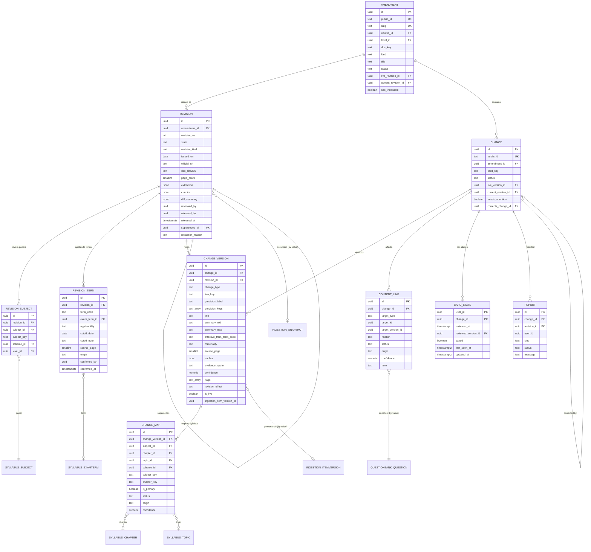
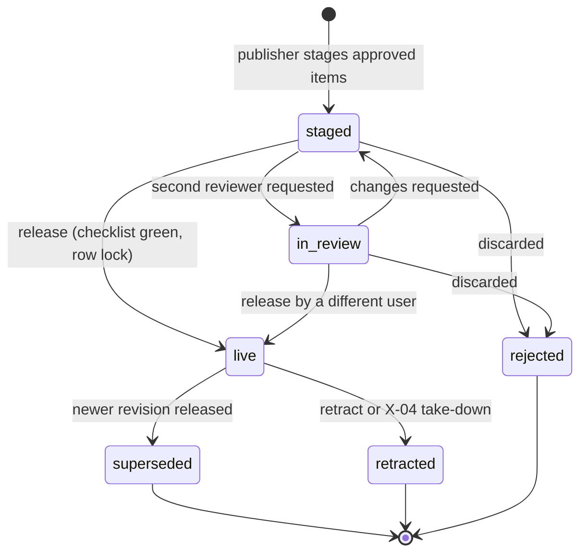
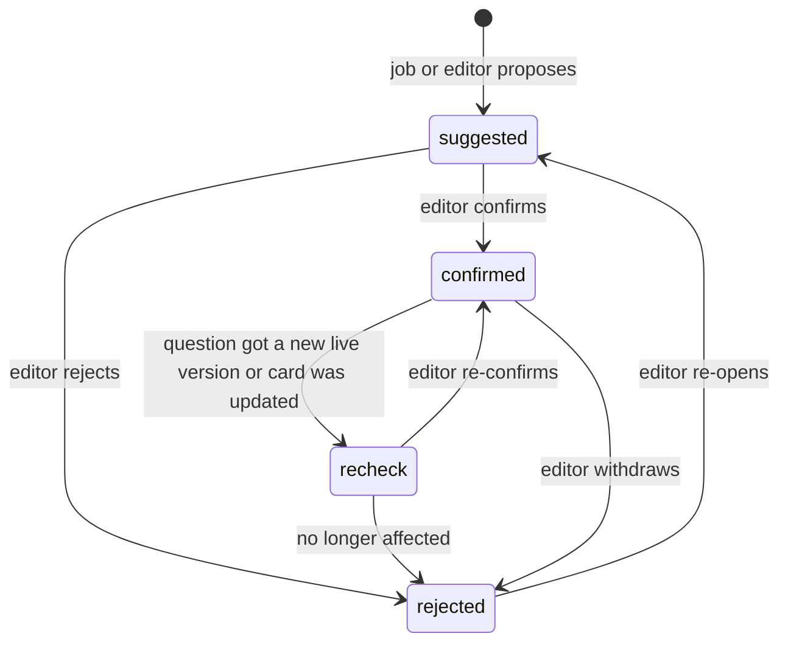

# ERD: F-14 Amendments

| Field | Value |
| --- | --- |
| Linked PRD | `docs/product/prd/F-14-amendments.md` |
| Order | After X-04 (publisher host), F-02 (taxonomy and coverage) and F-06 (events, jobs, questions). Reads `docs/product/erd/X-04-ingestion-scraping-service.md`, `docs/product/erd/F-02-syllabus-structure-and-coverage.md`, `docs/product/erd/F-06-question-bank-system.md` |
| Django app | `apps/api/modules/amendments` (tables `amendments_*`). Extraction plug-in `apps/api/modules/ingestion/extractors/plugins/amendments_pdf*` (parsing only, no F-14 tables) |
| Web module | `apps/web/src/modules/amendments` |
| Proposed small extensions to neighbours | X-04 (publication state `staged`), F-02 (`coverage_chapterflag`, three selectors, one subscriber), F-06 (annotator registry, `parse_reference`), syllabus (three read selectors). All listed in section 3.3 |
| Last updated | 2026-10-05 |

**Reading guide.** Sections 0 and 3 are the contract (what exists, interfaces, events, what neighbours must add). Section 10 is the extraction pipeline and its accuracy guard rails. Table names follow `<app>_<model>`. F-14 does **not** model fetching, raw files, snapshots, the review queue, sources or take-down: those are X-04 tables referenced by value.

## 0. Design decisions

1. **Publisher plug-in, not a pipeline.** F-14 registers `AmendmentChangePublisher` for the X-04 content type `amendment_change` and an extraction plug-in `amendments_pdf`. X-04 keeps the item, version, snapshot, review and publication rows; F-14 stores only what students see and what links students to the syllabus. Provenance is by value (`ingestion_item_id`, `ingestion_item_version_id`, `provenance_snapshot_id`), as F-06 does for `provenance_item_id`.
2. **Document, revision, card: three levels, two of them versioned.** `amendment` is the stable stream (one Institute document identity). `revision` is one issued file of that stream (initial, Institute re-issue, or our correction) and is the unit of review and release. `change` is the stable identity of one card across revisions, `changeversion` its content in one revision. Stable identity is what lets reviewed state, question links and flags survive a re-issue.
3. **Staged then released.** The publisher writes into a `staged` revision. Students and public pages only ever see `live` revisions. Releasing is one atomic service call under a row lock; it supersedes the previous live revision, carries over unchanged cards, emits one event and confirms the X-04 publications. This gives a document-level gate on top of X-04's item-level approval, because a half-published amendment is worse than a late one.
4. **Immutable once live.** A live or superseded revision and its card versions are never edited (service rule plus a test that tries every mutation, same approach as F-06 versions). Corrections create a new revision. The only mutable columns afterwards are the liveness flags, `status` columns of identity rows and student or link state.
5. **Applicability is data plus one pure function.** Terms and cut-off dates are rows (`amendments_revisionterm`), confirmed by a human. A pure function (`domain/applicability.py`, mirrored in TypeScript for optimistic UI with shared fixtures, the F-02 formula approach) combines a student's term, the document's rows and the card's effective term into `applies`, `not_applicable` or `unknown` with a reason code. Nothing is assumed when the Institute has not spoken.
6. **Match by stable keys, store ids for integrity.** Paper scope and chapter mapping store `subject_key`, `chapter_key`, `topic_key` beside real foreign keys. A student on another scheme is matched by `(level, subject_key)` and chapter key, so a CMA document that lists two syllabi works and a scheme switch does not orphan anything.
7. **The AI proposes, the checks dispose, a human decides.** Every card carries a verbatim `evidence_quote` that must be found in the source text; numbers in our summaries must occur in the source; two independent passes must agree; unclaimed text is listed. Term rows proposed by AI need an editor confirmation. Amendments never auto-publish, whatever the source setting says.
8. **Public data is separate from evidence.** Our summaries are public. The evidence quote, snapshots and bounding anchors beyond page numbers are admin-only. Public serializers are separate allow-list classes with a leak test.
9. **Layering and no foreign models.** Views, then services (writes), then selectors (reads), then models. Syllabus, coverage and questionbank are used through their selectors and services; the audit's AUD-005 pattern (querying foreign models) is not repeated. Foreign keys to `syllabus_*` are real foreign keys, but lookups go through `syllabus.selectors`.
10. **Concurrency and idempotency by constraint.** One live and one open revision per amendment are partial unique indexes; release, retract and re-issue lock the `amendments_amendment` row (`SELECT ... FOR UPDATE`); event consumers are idempotent on `event.id`; flags are written with `INSERT ... ON CONFLICT`; nothing derived is rebuilt with delete-then-insert (AUD-001, AUD-002). Every text enum has a `CHECK` constraint (AUD-016).
11. **Django is the only gateway.** RLS enabled, no policies, on every table. User scoping on every student query; detail routes answer 404 for out-of-scope ids.
12. **Events for fan-out.** `amendment_published`, `amendment_corrected` and `amendment_retracted` go through the F-06 `core.events` outbox. Coverage, X-01 and analytics subscribe; F-14 knows none of them.

## 1. Diagrams

### 1.1 Entities



`user_id` columns reference `auth.users.id` by value, scoped on every query. Not drawn: `amendments_auditlog` (append-only). `coverage_chapterflag` (F-02) is drawn in section 3.3.

### 1.2 Revision lifecycle



A retracted document is revived only by a new revision (`our_correction`), never by flipping the state back. Only one revision per amendment is `live` and one is open (`staged` or `in_review`).

### 1.3 Content link lifecycle



## 2. Tables

Common columns unless stated: `id uuid PK default gen_random_uuid()`, `created_at timestamptz not null default now()`, `updated_at timestamptz not null default now()`. `*_by`, `user_id` columns reference `auth.users.id` by value. Enumerations are `text` with a `CHECK` constraint (values in section 4). Dates are `date` in Indian local calendar; instants are `timestamptz`. JSONB only where genuinely schema-less, each with a schema-version column.

### 2.1 `amendments_amendment` (stable document stream)

| Column | Type | Null | Default | Notes |
| --- | --- | --- | --- | --- |
| public_id | text | no | | 10-character Crockford base32, unique, used in share links. Never reused |
| slug | text | no | | Unique, kebab-case, for `/amendments/documents/$slug`. Generated from the title once; later renames never change it |
| course_id | uuid | no | | FK `syllabus_course`, restrict |
| level_id | uuid | no | | FK `syllabus_level`, restrict |
| doc_key | text | no | | Stable identity chosen by the plug-in: normalised `{kind}:{paper keys}:{primary term code}:{title stem}` with words like "revised" and "updated" removed. Unique per level |
| kind | text | no | | `statutory_update`, `judicial_update`, `academic_update`, `legislative_amendment`, `standards_update`, `corrigendum`, `applicability_notice`, `other` |
| title | text | no | | Institute's title, as published (max 200). It is a fact, not prose, and is shown beside the source link |
| short_title | text | no | `''` | Our short label ("Statutory Update, Taxation, May 2027"), max 120 |
| issuer_label | text | no | | "ICAI Board of Studies", "ICSI", "ICMAI Directorate of Studies" |
| landing_url | text | yes | | https page where the document is listed |
| status | text | no | `active` | `active`, `retracted`, `taken_down` |
| live_revision_id | uuid | yes | | FK `amendments_revision`. Null until the first release or after retraction |
| current_revision_id | uuid | yes | | Latest revision in any state, for the editor |
| first_released_at, last_released_at | timestamptz | yes | | |
| seo_indexable | boolean | no | true | Document and card pages are indexable only when true |
| source_id | uuid | yes | | X-04 `ingestion_source.id` by value |
| created_by | uuid | yes | | Null when created by the publisher |

Constraints: unique `public_id`; unique `slug`; unique `(level_id, doc_key)`; check `course_id` is the level's course (set by the service, not editable); check `status` and `kind` values; check `live_revision_id is null or status = 'active'`. Indexes: `(level_id, status, last_released_at desc)` for the hub and term pages, `(source_id)`.

### 2.2 `amendments_revision` (one issued file; the unit of review and release)

| Column | Type | Null | Default | Notes |
| --- | --- | --- | --- | --- |
| amendment_id | uuid | no | | FK, restrict |
| revision_no | int | no | | 1-based per amendment |
| state | text | no | `staged` | `staged`, `in_review`, `live`, `superseded`, `retracted`, `rejected` |
| revision_kind | text | no | `initial` | `initial`, `institute_reissue`, `our_correction` |
| change_note | text | no | `''` | Public text for re-issues and corrections ("Corrected the section number on page 9"), max 300 |
| doc_title | text | no | | Title on this file (a re-issue may differ) |
| issued_on | date | yes | | Date printed on or published with the file |
| official_url | text | no | | https URL of the official file. Must be on a host allowed by the source (publisher validates) |
| official_url_status | text | no | `unknown` | `unknown`, `ok`, `broken` (from a daily link check through the X-04 fetcher) |
| official_url_checked_at | timestamptz | yes | | |
| doc_sha256 | text | no | | Hash of the official file as snapshotted. A re-issue is a different hash |
| page_count | smallint | yes | | |
| lang | text | no | `en` | |
| provenance_snapshot_id | uuid | yes | | X-04 `ingestion_snapshot.id` by value |
| classification_origin | text | no | `rules` | `rules`, `ai`, `manual` |
| extraction | jsonb | no | `{}` | `{"schema":1,"plugin":"amendments_pdf@1.0","model":"...","prompt_version":"...","passes":2,"pages":24,"ocr_pages":[],"blocks":142,"claimed":131,"unclaimed":[{"block":"p9b3","page":9,"bbox":[...]}],"expected_rows":14,"cards":14,"flags":{"numeric_mismatch":2,"low_agreement":1}}` |
| checks | jsonb | no | `{}` | Last release-checklist result: `{"schema":1,"run_at":"...","items":[{"code":"mapping","ok":false,"detail":[...]}]}` |
| diff_summary | jsonb | no | `{}` | For re-issues: `{"schema":1,"unchanged":11,"updated":2,"new":1,"removed":0,"updated_keys":[...],"material":1}` |
| unclaimed_ack | boolean | no | false | Editor acknowledged remaining unclaimed blocks |
| copy_check_ack | boolean | no | false | Editor acknowledged summaries flagged by the copy check |
| content_hash | text | no | | SHA-256 over scope, terms and the ordered card content hashes; equal hashes mean "no change" |
| reviewed_by, reviewed_at | uuid, timestamptz | yes | | Last human who completed review |
| diff_viewed_by, diff_viewed_at | uuid, timestamptz | yes | | Who opened the re-issue diff (release check `reissue`) |
| released_by, released_at | uuid, timestamptz | yes | | Set at release; `released_at` is the "live since" instant |
| supersedes_id | uuid | yes | | FK self. The live revision this one replaced |
| superseded_at | timestamptz | yes | | |
| retracted_at, retracted_by | timestamptz, uuid | yes | | |
| retraction_reason | text | yes | | `institute_withdrew`, `extraction_error`, `legal_request`, `superseded_by_reissue` |
| retraction_note | text | no | `''` | Public text, max 300 |

Constraints and indexes: unique `(amendment_id, revision_no)`; partial unique `(amendment_id)` where `state = 'live'`; partial unique `(amendment_id)` where `state in ('staged','in_review')`; check `state = 'live'` implies `released_by is not null and released_at is not null`; check `state = 'retracted'` implies `retraction_reason is not null`; check `official_url like 'https://%'`; check `reviewed_by <> released_by` is **not** a constraint (the four-eyes rule is a setting enforced in the service). Indexes: `(state, created_at)` for the editor queue, `(doc_sha256)` for re-issue detection, `(amendment_id, revision_no desc)`, `(official_url_checked_at)` where `state = 'live'` for the link-check job.

### 2.3 `amendments_revisionsubject` (which papers the document covers)

| Column | Type | Null | Default | Notes |
| --- | --- | --- | --- | --- |
| revision_id | uuid | no | | FK, cascade only while the revision is `staged` (service rule) |
| subject_id | uuid | no | | FK `syllabus_subject`, restrict. May belong to different schemes of the same level (CMA 2016 and 2022) |
| subject_key | text | no | | Stable key copy |
| scheme_id | uuid | no | | FK `syllabus_scheme`, from the subject |
| level_id | uuid | no | | FK `syllabus_level`, denormalised for the student lookup index |
| paper_label | text | no | `''` | As the Institute writes it ("Paper 3A") for display only |
| origin | text | no | `rules` | `rules`, `ai`, `manual` |

Unique `(revision_id, subject_id)`. Index `(level_id, subject_key) include (revision_id)` (Q-3, the student scope lookup).

### 2.4 `amendments_revisionterm` (which attempts it applies to, and the cut-off)

| Column | Type | Null | Default | Notes |
| --- | --- | --- | --- | --- |
| revision_id | uuid | no | | FK |
| term_code | text | no | | `YYYY-MM` (same format as `syllabus_examterm.code` and F-06 `source_term_code`). Check `term_code ~ '^[0-9]{4}-(0[1-9]\|1[0-2])$'` |
| exam_term_id | uuid | yes | | FK `syllabus_examterm` when the term exists for the level; filled by `link_terms` when it appears later |
| applicability | text | no | `applies` | `applies`, `excluded` (the Institute says it does not apply to that attempt) |
| cutoff_date | date | yes | | "Issued up to this date are applicable" (ICAI, ICSI and ICMAI all state one; see PRD appendix) |
| cutoff_note | text | no | `''` | Our words, max 200 ("Rules and notifications issued up to the cut-off") |
| source_page | smallint | yes | | Page of the official file where this is stated |
| origin | text | no | `manual` | `rules`, `ai`, `manual` |
| confirmed_by | uuid | yes | | Editor who confirmed this row |
| confirmed_at | timestamptz | yes | | The release checklist requires every row confirmed (applicability is the highest-risk field) |

Unique `(revision_id, term_code)`. Index `(term_code) include (revision_id)` (Q-1, Q-16).

### 2.5 `amendments_change` (stable card identity)

| Column | Type | Null | Default | Notes |
| --- | --- | --- | --- | --- |
| public_id | text | no | | 10-character Crockford base32, unique, used in URLs and share cards |
| amendment_id | uuid | no | | FK, restrict |
| card_key | text | no | | 16 hex characters: `sha1(law_key + primary provision key or normalised label + change_type + effective term)`, plus a deterministic ordinal when two cards of one document collide. Computed by `domain/card_key.py`, used by the plug-in for X-04 `identity_key` and by the re-issue diff |
| status | text | no | `active` | `active`, `withdrawn` (no longer in the live revision) |
| live_version_id | uuid | yes | | FK `amendments_changeversion` |
| current_version_id | uuid | yes | | Latest version in any state |
| needs_attention | boolean | no | false | Set by the report threshold or an editor; shows "Under review" |
| attention_since | timestamptz | yes | | |
| corrects_change_id | uuid | yes | | FK self. Set when this card (from a corrigendum) corrects another card |
| first_released_at | timestamptz | yes | | |
| withdrawn_at | timestamptz | yes | | |

Unique `public_id`; unique `(amendment_id, card_key)`; check `corrects_change_id <> id`. Index `(amendment_id, status)`, `(needs_attention)` where `needs_attention`.

### 2.6 `amendments_changeversion` (card content in one revision; immutable once the revision is live)

| Column | Type | Null | Default | Notes |
| --- | --- | --- | --- | --- |
| change_id | uuid | no | | FK, restrict |
| revision_id | uuid | no | | FK, restrict |
| previous_version_id | uuid | yes | | FK self. The version in the previous live revision, when there is one |
| revision_effect | text | no | `new` | `new`, `unchanged`, `updated`. Set by the re-issue diff at release time (stays `new` for an initial revision) |
| change_type | text | no | | `addition`, `deletion`, `modification`, `new_standard`, `clarification` |
| law_label | text | no | `''` | "CGST Act, 2017" |
| law_key | text | no | `''` | Normalised: `cgst`, `igst`, `it-act`, `companies-act`, `sa`, `as`, `indas`, `cost-standards`, `icsi-ss`, ... (shares the vocabulary of F-06 `search_keys`) |
| provision_label | text | no | `''` | "Section 17(5)(d)" |
| provision_keys | text[] | no | `{}` | Normalised references in the F-06 form (`cgst:17(5)`, `indas:115`, `sa:230`, `as:2`), produced with `questionbank.references.parse_reference` `[PROPOSED EXTENSION to F-06]`. Used to match questions |
| title | text | no | | Our headline, max 140. Public |
| summary_old | text | yes | | Our words: what it said before. Plain text, max 600. Null for `addition` |
| summary_new | text | yes | | Our words: what it says now. Plain text, max 600. Null for `deletion` |
| effect_note | text | no | `''` | Optional editor note on what to do differently (max 300). Must state a verifiable basis; never "will be asked" |
| effective_text | text | no | `''` | "Applicable from 1 April 2025 (AY 2026-27)" in our words, max 160 |
| effective_from_date | date | yes | | When the provision takes effect, if stated |
| effective_from_term_code | text | yes | | First attempt for which the Institute applies it, if stated at card level. Null means "the document's terms decide" |
| effective_to_term_code | text | yes | | Rare; for provisions that lapse |
| materiality | text | no | `normal` | `high` (changes an answer or a computation), `normal`, `low` (wording, format). Editor-set; AI proposes |
| source_page | smallint | no | | 1-based page in the official file |
| source_page_end | smallint | yes | | |
| anchor | jsonb | no | `{}` | `{"schema":1,"page":12,"page_w":595.3,"page_h":841.9,"quads":[[x0,y0,x1,y1],...],"precision":"quote"}` in PDF points. Admin only (public shows the page number) |
| anchor_precision | text | no | `page` | `quote`, `block`, `page`. Denormalised from `anchor` for filtering |
| evidence_quote | text | no | `''` | Verbatim text copied from the source (max 500). **Admin only**; the grounding check proves it exists in the file |
| evidence_hash | text | no | `''` | SHA-256 of the normalised quote |
| origin | text | no | `ai` | `ai`, `rules`, `manual` |
| confidence | numeric(3,2) | no | 0 | Composite (section 10.4) |
| flags | text[] | no | `{}` | `numeric_mismatch`, `low_agreement`, `ocr`, `table_span`, `anchor_block_only`, `copy_run`, `type_guess` |
| ingestion_item_id | uuid | yes | | X-04 `ingestion_item.id` by value |
| ingestion_item_version_id | uuid | yes | | X-04 `ingestion_itemversion.id` by value |
| content_hash | text | no | | SHA-256 of canonical public content: type, keys, title, summaries, effective fields, materiality. Equal hash means unchanged in a re-issue |
| is_live | boolean | no | false | True while its revision is `live`; maintained by release, retract and supersede |
| reviewed_by, reviewed_at | uuid, timestamptz | yes | | Set from the X-04 review or a direct edit |
| last_edited_by, last_edited_at | uuid, timestamptz | yes | | Manual edits in a staged revision |

Constraints: unique `(change_id, revision_id)`; unique `(ingestion_item_version_id)` where not null (idempotent publisher); checks on enum values; `char_length(title) <= 140`, summaries `<= 600`; `source_page >= 1`; `effective_from_term_code ~ '^[0-9]{4}-(0[1-9]|1[0-2])$'` when set; shape rules `change_type = 'addition'` implies `summary_old is null and summary_new is not null`, `deletion` implies `summary_new is null and summary_old is not null`, `modification` implies both not null, `new_standard` and `clarification` imply `summary_new is not null`. Indexes: `(revision_id)`, GIN `(provision_keys)` where `is_live`, `(change_id, revision_id desc)`, `(is_live, change_type)`, `(content_hash)`.

Immutability: once the revision leaves `staged` (released), these rows change only `is_live`. The service enforces it and a test tries every other mutation (the F-06 version rule).

### 2.7 `amendments_changemap` (card to syllabus)

| Column | Type | Null | Default | Notes |
| --- | --- | --- | --- | --- |
| change_version_id | uuid | no | | FK, cascade only while staged (service rule) |
| subject_id | uuid | no | | FK `syllabus_subject`, restrict. Always set (paper level at least) |
| chapter_id | uuid | yes | | FK `syllabus_chapter`. Null when the paper has no chapters seeded yet |
| topic_id | uuid | yes | | FK `syllabus_topic` |
| scheme_id | uuid | no | | FK `syllabus_scheme` |
| subject_key, chapter_key, topic_key | text | no, yes, yes | | Stable key copies |
| is_primary | boolean | no | false | Exactly one confirmed primary per card version |
| status | text | no | `suggested` | `suggested`, `confirmed`, `rejected` |
| origin | text | no | `ingestion` | `ingestion` (X-04 mapper), `rule` (provision-key rule), `editor`, `inherited` (copied from the previous version for an unchanged card), `remap` (through `syllabus_chaptermap`) |
| confidence | numeric(3,2) | yes | | |
| reasons | jsonb | no | `[]` | `["provision key cgst:17(5)","keyword ITC"]`, schema-less list of short strings |
| decided_by, decided_at | uuid, timestamptz | yes | | |

Unique index `(change_version_id, subject_id, coalesce(chapter_id, '00000000-0000-0000-0000-000000000000'), coalesce(topic_id, '00000000-0000-0000-0000-000000000000'))`; partial unique `(change_version_id)` where `is_primary and status = 'confirmed'`; index `(chapter_id, status) include (change_version_id)` (chapter panel and flags); `(subject_key, chapter_key)`; `(scheme_id, subject_id)`. Only `confirmed` rows count for students, flags and links. Writing a primary mapping needs no denormalisation (no hot filter).

### 2.8 `amendments_contentlink` (card to question or recall card; platform content only)

| Column | Type | Null | Default | Notes |
| --- | --- | --- | --- | --- |
| change_id | uuid | no | | FK to the stable card identity, so links survive re-issues |
| target_type | text | no | | `question` (F-06), `recall_card` (F-15, platform decks only, R3) |
| target_id | uuid | no | | `questionbank_question.id` by value (identity, not version) |
| target_version_id | uuid | yes | | The question version the link was decided against |
| relation | text | no | | `answer_changed`, `question_obsolete`, `explanation_outdated`, `partially_affected` |
| status | text | no | `suggested` | `suggested`, `confirmed`, `rejected`, `recheck` |
| origin | text | no | `editor` | `reference_key`, `chapter`, `ai`, `editor` |
| confidence | numeric(3,2) | yes | | |
| reasons | jsonb | no | `[]` | Short strings ("both cite cgst:17(5)"); never the question text |
| note_md | text | no | `''` | Student-facing note, plain text, max 300. Required to confirm `answer_changed` and `partially_affected` |
| recheck_reason | text | yes | | `question_new_version`, `card_updated`, `card_withdrawn` |
| decided_by, decided_at | uuid, timestamptz | yes | | |
| created_by | uuid | yes | | Null for jobs |

Unique `(change_id, target_type, target_id)`. Indexes: `(target_type, target_id) include (change_id, relation, note_md) where status in ('confirmed','recheck')` (**the annotator hot path, Q-5**), `(change_id, status)`, `(status, updated_at) where status in ('suggested','recheck')` (editor lists). Private user content is never linked here: notes and personal PDFs (F-03) are resolved at read time through chapter mapping, so no student's private data enters a global table.

### 2.9 `amendments_cardstate` (per student)

| Column | Type | Null | Default | Notes |
| --- | --- | --- | --- | --- |
| user_id | uuid | no | | PK part 1 |
| change_id | uuid | no | | PK part 2, FK `amendments_change`, cascade on withdraw only through the delete service |
| reviewed_at | timestamptz | yes | | Null means not reviewed |
| reviewed_version_id | uuid | yes | | FK `amendments_changeversion`; the version she reviewed. A materially different live version shows "Updated" |
| saved | boolean | no | false | "Save for later" |
| first_seen_at | timestamptz | no | now() | Set on the first state write, never by a GET |
| client_id | uuid | yes | | Last idempotency key (offline replays) |
| updated_at | timestamptz | no | now() | Last write wins between devices |

Indexes: `(user_id, reviewed_at desc) where reviewed_at is not null`, `(change_id)` (for the delete and diff paths). One row per student per card; PUT is an upsert (`INSERT ... ON CONFLICT (user_id, change_id) DO UPDATE ... WHERE excluded.updated_at >= amendments_cardstate.updated_at`).

### 2.10 `amendments_report`

| Column | Type | Null | Default | Notes |
| --- | --- | --- | --- | --- |
| change_id | uuid | yes | | FK; null for a whole-document report |
| revision_id | uuid | no | | FK; the revision the reporter saw |
| user_id | uuid | yes | | Null for anonymous |
| anon_key | text | yes | | HMAC of IP and user agent with a daily salt, only to count distinct anonymous reporters; never reversible |
| kind | text | no | | `wrong_change`, `wrong_mapping`, `wrong_applicability`, `missing_change`, `broken_link`, `other` |
| message | text | no | | Max 1,000, e-mail-like strings scrubbed |
| status | text | no | `open` | `open`, `accepted`, `rejected`, `fixed` |
| resolved_by, resolved_at | uuid, timestamptz | yes | | |
| resolution_revision_id | uuid | yes | | FK; the correction revision that fixed it |

Indexes `(status, created_at)`, `(change_id, kind, created_at) where status = 'open'`. Threshold: three distinct reporters (user ids or anon keys) of `wrong_change` within 7 days set `amendments_change.needs_attention` (service rule).

### 2.11 `amendments_auditlog`

`actor_id uuid`, `action text`, `entity_type text`, `entity_id uuid`, `before jsonb`, `after jsonb`, `created_at`. Append-only, written by services for stage, edit, map, confirm term, release, retract, correct, link decisions and report resolution. Index `(entity_type, entity_id, created_at desc)`. Released card content is never overwritten, so the audit mainly proves who decided what.

## 3. Relationships to other modules and the contract

### 3.1 Foreign keys and by-value references

| From | To | Rule |
| --- | --- | --- |
| `amendments_amendment` (course, level), `revisionsubject`, `revisionterm`, `changemap` | `syllabus_*` | Real foreign keys, `restrict`. Lookups, validation and key resolution go through `syllabus.selectors`; F-14 never writes `syllabus_*` |
| `amendments_revision.provenance_snapshot_id`, `changeversion.ingestion_item_id`, `ingestion_item_version_id`, `amendment.source_id` | `ingestion_*` | By value (X-04 owns them). Written only by the publisher; edits keep the pointer |
| `amendments_contentlink.target_id` | `questionbank_question.id` | By value; reads through `questionbank.selectors`; links are never FKs into a hot, partitioned or foreign table |
| `amendments_cardstate.user_id`, `*_by` | `auth.users.id` | By value, scoped on every query |
| Coverage (F-02) | F-14 | Coverage subscribes to `amendment_published`, `amendment_corrected` and `amendment_retracted`; it never imports F-14 and holds the flag table |
| X-01 `[PROPOSED: X-01]` | F-14 | Subscribes to the same events |
| F-06 | F-14 | F-14 registers an annotator in F-06 (inversion of control); F-06 never imports F-14 |

Dependency direction (no cycles): `amendments -> syllabus`, `amendments -> coverage` (selectors only), `amendments -> questionbank` (selectors and registry), `amendments -> ingestion` (registry, `confirm_publication`, fetcher for link checks), `amendments -> core.events, core.jobs`. Reverse flows use events and registries: coverage, X-01 and analytics subscribe; `ingestion` calls the publisher by registry; `questionbank` calls the annotator by registry.

### 3.2 Public service and selector interfaces (the contract)

Consumers call these and nothing else. Python 3.12; `UUID` is `uuid.UUID`.

```python
# ---- amendments/selectors.py (read only) -------------------------------------------------------------
class ViewerCtx(TypedDict):          # produced by coverage.selectors.enrollment_context(user_id); anonymous = None
    user_id: UUID; enrollment_id: UUID; level_id: UUID; scheme_id: UUID
    term_code: str | None            # target term, "2027-05"; None when not set
    subject_keys: list[str]          # papers in scope (not excluded; chosen electives only)

Applicability = Literal["applies", "not_applicable", "unknown"]    # plus reason code, see 3.5

def public_level(course: str, level: str) -> LevelHub
def public_term(course: str, level: str, term_code: str) -> TermArchive
def public_paper(course: str, level: str, term_code: str, subject_key: str, *, type: str | None, cursor: str | None, limit: int = 20) -> Page[PublicCard]
def public_change(public_id: str) -> PublicCardDetail | Tombstone            # never includes evidence_quote or anchor
def public_document(slug: str) -> PublicDocument | Tombstone
def latest_documents(limit: int = 12) -> list[PublicDocumentRow]
def sitemap_paths() -> Iterator[SitemapEntry]

def my_summary(viewer: ViewerCtx) -> MySummary
def my_changes(viewer: ViewerCtx, flt: MyFilter, *, cursor: str | None, limit: int = 20) -> Page[MyCard]        # applicability computed here
def my_change(viewer: ViewerCtx, public_id: str) -> MyCardDetail | None                                         # None when not in scope
def changes_for_chapters(viewer: ViewerCtx | None, chapter_ids: Sequence[UUID]) -> dict[UUID, list[ChapterChange]]  # F-02 panel, F-03
def my_archive(viewer: ViewerCtx) -> list[TermGroup]
def affected_question_ids(viewer: ViewerCtx | None, *, chapter_ids: Sequence[UUID] | None = None,
                          relation_in: Sequence[str] | None = None, applies_only: bool = True, limit: int = 2000) -> list[UUID]
def annotations_for_questions(question_ids: Sequence[UUID], viewer: ViewerCtx | None, *, detail: Literal["chip","full"]) -> dict[UUID, list[Annotation]]
def summary_for_user(user_id: UUID) -> MySummary                                          # X-01 copy, F-13

# ---- amendments/services.py (writes; actor-checked) ----------------------------------------------------
def stage_from_item_version(item_version: IngestionItemVersionRef) -> UUID                # the publisher body; idempotent on item_version id; returns changeversion id
def edit_staged_change(actor_id: UUID, change_version_id: UUID, patch: ChangePatch) -> ChangeVersion
def add_manual_change(actor_id: UUID, revision_id: UUID, payload: ChangePayload) -> ChangeVersion
def remove_staged_change(actor_id: UUID, change_version_id: UUID) -> None
def set_revision_scope(actor_id: UUID, revision_id: UUID, *, subject_ids: Sequence[UUID], terms: Sequence[TermIn]) -> None
def confirm_terms(actor_id: UUID, revision_id: UUID, term_codes: Sequence[str]) -> None
def set_mapping(actor_id: UUID, change_version_id: UUID, mappings: Sequence[MappingIn]) -> None
def propose_remap(from_scheme_id: UUID, to_scheme_id: UUID) -> int                       # suggested mappings via syllabus_chaptermap
def run_release_checks(revision_id: UUID) -> CheckReport                                  # pure checks + reads; stores revisions.checks
def release_revision(actor_id: UUID, revision_id: UUID, *, idempotency_key: str) -> Revision   # locks the amendment row; emits event; confirms X-04 publications
def retract_revision(actor_id: UUID, revision_id: UUID, *, reason: str, note: str = "") -> Revision
def start_correction(actor_id: UUID, amendment_id: UUID) -> Revision                      # copies the live revision into a staged our_correction revision
def retract_by_source(actor_id: UUID, source_id: UUID, *, reason: str = "legal_request") -> int   # X-04 take-down
def set_card_state(user_id: UUID, public_id: str, *, reviewed: bool | None, saved: bool | None, client_id: UUID | None, client_ts: datetime | None) -> CardState
def bulk_set_reviewed(user_id: UUID, public_ids: Sequence[str], *, reviewed: bool, client_id: UUID) -> BulkResult   # returns an undo token (10 s)
def decide_link(actor_id: UUID, link_id: UUID, decision: str, *, relation: str | None = None, note: str = "") -> ContentLink
def add_link(actor_id: UUID, change_id: UUID, target_type: str, target_id: UUID, *, relation: str, note: str) -> ContentLink
def file_report(user_id: UUID | None, anon_key: str | None, *, public_id: str, kind: str, message: str) -> Report
def resolve_report(actor_id: UUID, report_id: UUID, outcome: str, *, resolution_revision_id: UUID | None = None) -> Report
def delete_all_for_user(user_id: UUID) -> DeleteReport; def export_for_user(user_id: UUID) -> dict
```

### 3.3 Registrations and the small extensions F-14 asks of neighbours

F-14 registers at `AppConfig.ready()`:

```python
ingestion.registry.register_publisher("amendment_change", AmendmentChangePublisher)    # publish(item_version) -> changeversion id; withdraw(target_id)
ingestion.registry.register_parser("amendments_pdf", AmendmentsPdfExtractor)           # engine "plugin", definition {"parser": "amendments_pdf"}
questionbank.registry.register_annotator("amendments", annotations_for_questions)       # [PROPOSED EXTENSION to F-06]
core.events.register_subscriber("question_version_live", "amendments.links_recheck", links_recheck, mode="deferred")
core.events.register_subscriber("question_taken_down", "amendments.links_drop", links_drop, mode="deferred")
profiles.erasure.register("amendments", delete_all_for_user, export_for_user)           # [PROPOSED] central account-deletion hook (audit AUD-004)
```

**`[PROPOSED EXTENSION to X-04]`** (small):

1. `ingestion_publication.state` gains `staged` (before: `live`, `withdrawn`). A publisher may declare `staged = True`; after `publish(item_version)` the publication is `staged`, and the target calls `ingestion.services.confirm_publication(publication_id)` when it really goes live (F-14 does this for every card at release). Rationale: amendments need a document-level gate beyond item approval. Other publishers are unaffected.
2. The plug-in sets `identity_key` itself (X-04 allows "any stable identity inside a source"): `{doc_key}:{card_key}`, instead of `{pdf sha}#{index}`, so a re-issued PDF yields version 2 of the same item rather than new items. No schema change.
3. The `amendment_change` pydantic schema is the one defined in 3.6. The review view renders `source_ref` (page, quads) and the evidence quote highlight (already part of X-04's side-by-side design).
4. `ingestion.services.check_url(source_id, url) -> UrlStatus` (HEAD through the polite fetcher with SSRF guard) for the daily official-link check; F-14 never fetches directly.

**`[PROPOSED EXTENSION to F-02]`** (kept minimal): flags for chapters the student has already started. One table, three read selectors, two small services, one subscriber.

```
coverage_chapterflag
  id uuid PK, user_id uuid, enrollment_id uuid FK coverage_enrollment (cascade), chapter_id uuid FK syllabus_chapter,
  kind text check in ('needs_reread'),            -- reserved for other kinds later
  source_module text check in ('amendments'), source_ref uuid,   -- source_ref = amendments_amendment.id (the stream, not the revision)
  change_count smallint, high_count smallint, label text (max 120), href text (relative app URL),
  status text check in ('open','resolved','dismissed','superseded'), resolution text null,  -- 'reread','dismissed','retracted','superseded'
  opened_at, resolved_at, created_at, updated_at
  unique (enrollment_id, chapter_id, kind, source_module, source_ref)
  index (enrollment_id, status) where status = 'open'; index (user_id)
```

* Selectors: `coverage.selectors.enrollment_context(user_id) -> ViewerCtx | None` (active enrolment, level, scheme, target term code, in-scope subject keys with chosen electives and without exclusions); `chapter_states(user_id, chapter_ids) -> {chapter_id: {status, coverage_pct, last_studied_at, has_progress}}`; `audience(scheme_id, term_codes, subject_keys, *, cursor, limit=1000) -> Page[AudienceRow]` where `AudienceRow = (user_id, enrollment_id, term_code, chapters_with_progress: set[UUID])`; `open_flags(user_id, kind=None)`.
* Services: `coverage.services.resolve_flag(user_id, flag_id, resolution)` and `resolve_flags_for_chapter(user_id, chapter_id, kind, resolution)`; endpoints `GET coverage/flags/` and `PUT coverage/flags/{id}/`; the overview adds `flags_open` per subject; the due list (`/app/revision`) includes flagged chapters ordered by `high_count`.
* Subscriber `coverage.subscribers.on_amendment_published` (deferred, idempotent on `event.id`): pages through `audience(...)` in jobs of 1,000 enrolments; for each chapter in the event whose student state `has_progress` and whose subject is in scope, `INSERT ... ON CONFLICT` the flag. A re-issue re-opens a resolved or dismissed flag only when the event says that chapter has `updated` high or normal cards. `amendment_retracted` sets matching open flags to `superseded` and resolves with `retracted`. No ledger events are written and the coverage percent is never changed. Enrolments are matched on `scheme_id` first and otherwise on `(level, subject_key, chapter_key)`; unmatched chapters are counted in `amendment_flags_created.unmatched`.

**`[PROPOSED EXTENSION to F-06]`** (kept minimal, generic, reusable):

1. `questionbank.registry.register_annotator(name, fn)` with `fn(question_ids, viewer, *, detail) -> dict[UUID, list[Annotation]]`, where `Annotation` v1 is `{"source", "id", "kind", "severity": "info"|"warn", "title", "body", "label", "href", "applies": "yes"|"no"|"unknown", "meta"}` (`body` empty when `detail = "chip"`).
2. `QuestionCard` and list serializers add `annotations` (chips only), `PlayableQuestion` adds the chip subset always and the full subset only when the session's feedback policy allows feedback (`instant` after Check, review, or `at_end` after submit), `ReviewQuestion` adds the full set. In `exam` mode nothing is returned until review. One batched call per annotator per response (at most 100 ids). A failing or slow annotator (over 50 ms budget) is skipped and counted.
3. Pure `questionbank.references.parse_reference(label: str) -> list[str]` returning the `search_keys` form, so F-14 and F-06 share one normaliser.
4. `question_version_live` and `question_taken_down` events already exist and are consumed as-is.

**`[PROPOSED]` small read selectors in `syllabus.selectors`:** `resolve_chapter(scheme_id, subject_key, chapter_key) -> Chapter | None`, `terms_for_level(level_id) -> list[Term]`, `chapter_map_for(from_scheme_id, to_scheme_id) -> list[ChapterMapRow]`. They avoid repeating the foreign-model queries the F-02 audit flagged (AUD-005).

**`[PROPOSED: X-01]`** subscribes to the three F-14 events and sends from templates `amendment_new`, `amendment_updated`, `amendment_retracted`, `amendment_corrected`; if X-01 prefers a call style, the same data is passed to `notifications.services.notify(user_id, kind, payload, dedupe_key=f"{amendment_id}:{revision_id}:{user_id}")`.

### 3.4 Domain events (envelope as in F-06 section 3.4)

| Event | Emitted when | Payload (key fields) | Consumers |
| --- | --- | --- | --- |
| `amendment_published` | A revision of kind `initial` or `institute_reissue` goes live | see below | F-02 coverage (deferred), X-01 (deferred), analytics |
| `amendment_corrected` | An `our_correction` revision goes live | same shape; `material: bool` | coverage (only when material), X-01 (only when material) |
| `amendment_retracted` | A revision is retracted or taken down | `amendment_id`, `revision_id`, `reason`, `chapter_ids[]`, `subject_keys[]`, `term_codes[]`, `hours_live` | coverage (resolve flags), X-01, CDN purge |

`amendment_published` payload (version 1; `key = revision_id`, `user_id = null`, `actor_id = releaser`):

```json
{
  "amendment_id": "uuid", "revision_id": "uuid", "revision_no": 1, "revision_kind": "initial",
  "kind": "statutory_update", "course": "ca", "level": "intermediate", "level_id": "uuid",
  "title": "Statutory Update, Taxation", "issued_on": "2026-10-12", "lag_hours": 20.5,
  "terms": [{"term_code": "2027-05", "applicability": "applies", "cutoff_date": "2026-10-31"}],
  "subjects": [{"subject_id": "uuid", "subject_key": "taxation", "scheme_id": "uuid"}],
  "counts": {"cards": 14, "high": 3, "normal": 9, "low": 2, "new": 14, "updated": 0, "removed": 0},
  "chapters": [
    {"chapter_id": "uuid", "chapter_key": "gst-itc", "subject_key": "taxation", "scheme_id": "uuid",
     "cards": 2, "high": 1, "normal": 1, "updated": 0}
  ],
  "paper_level_cards": [{"subject_key": "taxation", "cards": 1}],
  "is_reissue": false, "path": "/amendments/documents/statutory-update-taxation-may-2027"
}
```

Rules: only `high` and `normal` cards count toward `chapters[].cards` (low-materiality cards are listed in `counts` only), so subscribers cannot over-flag. Delivery semantics are F-06's (outbox, at-least-once, subscribers idempotent on `event.id`, no ordering guarantee). Schemas live in `apps/api/core/event_schemas/amendment_*.v1.json`.

### 3.5 Behavioural reference (what the tests assert)

**Applicability (`domain/applicability.py`, pure).** Inputs: `student_term_code T | None`, revision term rows `R = {code: (applicability, cutoff)}`, card `effective_from_term_code E | None`. Codes compare as strings (`YYYY-MM` sorts correctly). Output `(state, reason)`.

1. `T is None` gives `unknown`, `no_target_term`.
2. If `T in R`: `excluded` gives `not_applicable`, `explicitly_excluded`; `applies` continues to step 5.
3. Else let `D` = codes with `applies`. `D` empty gives `unknown`, `no_term_declared`.
4. Else if `T < min(D)` gives `not_applicable`, `for_later_attempt`; otherwise `unknown`, `rule_not_published` (T is after or between declared terms; we never carry forward).
5. If `E` is set and `T < E` gives `not_applicable`, `effective_later`; otherwise `applies`, `declared_term`.

| Case | T | Rows | E | Result |
| --- | --- | --- | --- | --- |
| Declared | 2027-05 | {2027-05 applies} | none | applies, declared_term |
| Declared but effective later | 2026-11 | {2026-11 applies} | 2027-05 | not_applicable, effective_later |
| Later attempt, no rule yet | 2027-11 | {2027-05 applies} | none | unknown, rule_not_published |
| Earlier attempt | 2026-11 | {2027-05 applies} | none | not_applicable, for_later_attempt |
| Excluded | 2027-05 | {2027-05 excluded} | none | not_applicable, explicitly_excluded |
| Gap between terms | 2027-05 | {2026-11 applies, 2027-11 applies} | none | unknown, rule_not_published |
| No term set | none | any | any | unknown, no_target_term |
| No rows | 2027-05 | {} | none | unknown, no_term_declared |
| Several declared | 2027-11 | {2027-05, 2027-11} | none | applies, declared_term |

**Re-issue diff (`domain/revision_diff.py`, pure).** Match cards by `card_key`. Same key and same `content_hash` gives `unchanged`; same key, different hash gives `updated` (and `material` when `change_type`, `summary_*`, `effective_*` or `provision_keys` differ, not only `title` or `effect_note`); key only in the new revision gives `new`; key only in the old gives `removed` (the change becomes `withdrawn`). Unchanged cards copy mappings and keep links and student state; `reviewed_version_id` of students is untouched, and the student view shows "Updated" only when the live version is `material`ly different from the reviewed one.

**Release checklist (`domain/release_checks.py`).** Codes, each with `ok`, `detail`:

| Code | Rule |
| --- | --- |
| `items_decided` | Every X-04 item of the snapshot is approved or rejected (none `needs_review`); reads X-04 through a service |
| `scope` | At least one `revisionsubject` row |
| `terms` | At least one `revisionterm` row and every row `confirmed_at` set |
| `classified` | `kind` is set and `classification_origin` is not an unreviewed `ai` guess (editor confirmed) |
| `mapping` | Every card that is not `clarification` has at least one confirmed mapping (paper level at least) and exactly one primary |
| `cards_valid` | All constraints hold; each card has `source_page` and a title; `numeric_mismatch`, `low_agreement` and `ungrounded` flags were each resolved or edited (cleared by an editor action) |
| `unclaimed` | `extraction.unclaimed` is empty or `unclaimed_ack` |
| `pdf` | `official_url_status = ok` (checked now through X-04) and `doc_sha256` equals the snapshot's |
| `copy` | No summary shares a run of 20 or more consecutive normalised words with the source page text, or `copy_check_ack` |
| `reissue` | For `institute_reissue` and `our_correction`, `diff_summary` exists and the diff was viewed (`diff_viewed_by`) |
| `four_eyes` | When enabled and any card is `high`, `released_by <> reviewed_by` |

**Release transaction.** `SELECT ... FOR UPDATE` on the amendment row; re-run the checks; classify cards (diff); set revision `live`, previous `superseded` with `superseded_at`; set `is_live` on versions; update `change.live_version_id`, `status`, `first_released_at`; copy mappings of unchanged cards; set `amendment.live_revision_id`, `last_released_at`; write audit; `emit` the event (same transaction); enqueue `amendments.suggest_links` and `ingestion` confirmations; purge CDN paths after commit. A second call with the same `Idempotency-Key` or on an already live revision returns the live revision.

**Flags.** Only cards with `materiality in ('high','normal')` count. A chapter flag opens when the student's chapter state has progress. Flags are keyed by the amendment stream, so a re-issue updates the same row.

**Question notice.** `relation in (answer_changed, question_obsolete)` and applicability `applies` or `unknown` gives severity `warn`; otherwise `info`. Applicability `not_applicable` gives an `info` line with the effective term. Anonymous viewers get `unknown` and a public href.

### 3.6 Payload contract for X-04 (`amendment_change`, schema v1)

The X-04 canonical type `amendment_change` (X-04 PRD 5.3 lists only a summary of fields) is fixed as follows. It is validated by a pydantic model in `ingestion/schemas/amendment_change.py` and the same JSON Schema is given to Gemini.

```json
{
  "schema": "artha.amendment_change.v1",
  "document": {
    "doc_key": "statutory_update:taxation:2027-05:statutory-update-taxation",
    "kind": "statutory_update", "title": "...", "issuer_label": "ICAI Board of Studies",
    "official_url": "https://...", "landing_url": "https://...", "issued_on": "2026-10-12",
    "sha256": "...", "page_count": 24,
    "course": "ca", "level": "intermediate",
    "papers": [{"subject_key": "taxation", "scheme_code": "nset", "label": "Paper 3A"}],
    "terms": [{"term_code": "2027-05", "applicability": "applies", "cutoff_date": "2026-10-31",
               "cutoff_note": "...", "source_page": 2}],
    "corrects": null, "revision_hint": "unknown"
  },
  "change": {
    "card_key": "9f3a1c04b7d2e611", "change_type": "modification",
    "law_label": "CGST Act, 2017", "law_key": "cgst",
    "provision_label": "Section 17(5)(a)", "provision_keys": ["cgst:17(5)"],
    "title": "...", "summary_old": "...", "summary_new": "...", "effective_text": "...",
    "effective_from_date": null, "effective_from_term_code": null,
    "materiality_hint": "high",
    "source_page": 12, "source_page_end": null,
    "anchor": {"schema": 1, "page": 12, "page_w": 595.3, "page_h": 841.9, "quads": [[72,310,520,342]], "precision": "quote"},
    "evidence_quote": "...", "subject_keys": ["taxation"], "chapter_hints": ["gst-itc"],
    "flags": [], "confidence": 0.86, "passes": {"a": "ok", "b": "ok", "agree": true}
  }
}
```

`document` is repeated on every item of a PDF (identical values); the publisher takes the first and verifies the rest match (`doc_key` and `sha256`). `identity_key = "{document.doc_key}:{change.card_key}"`. Mapping suggestions stay in X-04's `itemversion.mapping` and are copied into `amendments_changemap` as `suggested` rows. Fields not in the schema are dropped by the validator.

**Publisher behaviour.** `publish(item_version)`: validate against schema v1; refuse unless the source `license_tier` is `facts_and_summary` or `host` (`license_tier_insufficient`) and `official_url` host is in the source's `allowed_domains`; `get_or_create` the amendment by `(level, doc_key)`; find the open revision with the same `doc_sha256` or create one (`initial` when the amendment has no revision, `institute_reissue` when a live revision has a different hash); create or reuse the change by `card_key`; create the `changeversion` (idempotent on `ingestion_item_version_id`); stage mappings; return the changeversion id. `withdraw(target_id)`: remove a staged version, or for a live card start a correction revision without it. The publisher never releases and never reports `auto_publish` as allowed.

### 3.7 What consumers must not do

1. Read or write `amendments_*` tables or import their models; use the selectors and services above.
2. Show `evidence_quote`, `anchor` or snapshot URLs to students.
3. Infer applicability themselves; call the selectors, which use the pure function.
4. Treat an annotation as grading input; it is display only and never changes marks, keys or scores.
5. Put card text, notes or report messages in analytics or logs.
6. Link private user content (notes, personal documents) to a card; resolve through chapters at read time.

### 3.8 Provides and Consumes (summary)

| Provides | Consumers |
| --- | --- |
| Selectors in 3.2, events in 3.4, publisher `amendment_change`, annotator `amendments`, erasure handler, web barrel (`ChapterAmendmentsPanel`, `AmendmentChip`, `useChapterAmendments`) | F-02 coverage, F-03, F-05, F-08, F-09, F-13, F-06, X-01, X-04, profiles |

| Consumes | From |
| --- | --- |
| `register_publisher`, `register_parser`, `confirm_publication`, `check_url`, snapshots, review decisions, take-down hook | X-04 |
| `syllabus.selectors` (published scheme, chapters, topics, terms, chapter map, `resolve_chapter`, `terms_for_level`, `chapter_map_for`) | F-02 syllabus |
| `coverage.selectors.enrollment_context`, `chapter_states`, `audience`, `open_flags`; flag table and subscriber | F-02 coverage |
| `questionbank.selectors.search_ids/taxonomy_of/can_view`, `register_annotator`, `references.parse_reference`, events `question_version_live`, `question_taken_down` | F-06 |
| `core.events.emit/register_subscriber`, `core.jobs.enqueue` | core |
| `notifications.services.notify` or event subscription | X-01 `[PROPOSED]` |
| `register_today_provider` | F-13 `[PROPOSED]` |
| `recall.services.create_card_from_source` | F-15 `[PROPOSED]` |

## 4. Enumerations and reference data

| Name | Values | Stored as | Owner |
| --- | --- | --- | --- |
| Amendment kind | statutory_update, judicial_update, academic_update, legislative_amendment, standards_update, corrigendum, applicability_notice, other | text + check | code |
| Amendment status | active, retracted, taken_down | text + check | code |
| Revision state | staged, in_review, live, superseded, retracted, rejected | text + check | code |
| Revision kind | initial, institute_reissue, our_correction | text + check | code |
| Retraction reason | institute_withdrew, extraction_error, legal_request, superseded_by_reissue | text + check | code |
| Official URL status | unknown, ok, broken | text + check | code |
| Classification and row origin | rules, ai, manual | text + check | code |
| Term applicability | applies, excluded | text + check | code |
| Change type | addition, deletion, modification, new_standard, clarification | text + check | code |
| Materiality | high, normal, low | text + check | code |
| Revision effect | new, unchanged, updated | text + check | code |
| Anchor precision | quote, block, page | text + check | code |
| Card flag | numeric_mismatch, low_agreement, ocr, table_span, anchor_block_only, copy_run, type_guess | text[] (checked by the service against the list) | code |
| Mapping status and origin | suggested, confirmed, rejected; ingestion, rule, editor, inherited, remap | text + check | code |
| Link target type | question, recall_card | text + check | code |
| Link relation | answer_changed, question_obsolete, explanation_outdated, partially_affected | text + check | code |
| Link status and origin | suggested, confirmed, rejected, recheck; reference_key, chapter, ai, editor | text + check | code |
| Link recheck reason | question_new_version, card_updated, card_withdrawn | text + check | code |
| Report kind and status | wrong_change, wrong_mapping, wrong_applicability, missing_change, broken_link, other; open, accepted, rejected, fixed | text + check | code |
| Applicability state and reason | applies, not_applicable, unknown; declared_term, explicitly_excluded, for_later_attempt, effective_later, rule_not_published, no_term_declared, no_target_term | code only (computed) | code |
| Law keys | cgst, igst, utgst, it-act, companies-act, sa, as, indas, cost-standards, icsi-ss, fema, sebi, other; extended in code | code list | code |

**Seed data.** None in the tables. Migration `amendments.0002_seed_sources` asks `ingestion.services.upsert_source(...)` for three **draft** X-04 sources (ICAI BoS updates, ICSI applicability notices, ICMAI student circulars) with `content_types = [amendment_change]`, `license_tier = facts_and_summary`, `auto_publish = false`, `parser = amendments_pdf`. URLs are entered by the founder in the admin; nothing is crawled until a source is `active` (X-04 seed rule).

## 5. Query patterns

`L` is a live revision (`state = 'live'`), `V` a live card version (`is_live`).

| # | Query | Served by |
| --- | --- | --- |
| Q-1 | Public paper page: live cards for `(level, term_code, subject_key)`: `revisionterm(term_code)` to revision `L` to `revisionsubject(level_id, subject_key)` to `changeversion V` to confirmed `changemap`, grouped by chapter, cursor pagination on `(chapter sort, title, id)` | `(term_code) include (revision_id)`, `(level_id, subject_key) include (revision_id)`, `(revision_id)`, `(chapter_id, status) include (change_version_id)`. A paper-term has tens of cards; CDN cached |
| Q-2 | Public card by `public_id`: change PK via unique `public_id`, `live_version_id`, document and terms | unique `public_id`, PK lookups |
| Q-3 | Student list: `ViewerCtx.subject_keys` and `level_id` to `revisionsubject` to live revisions to `V` to terms; applicability computed in Python for at most about 300 cards; join `cardstate` by `(user_id, change_id IN ...)` | `(level_id, subject_key)`, `(change_id)`, PK `(user_id, change_id)` |
| Q-4 | Chapter panel and F-03: confirmed maps by `chapter_id` to `V` | `(chapter_id, status) include (change_version_id)`, `(is_live)` |
| Q-5 | **Annotator batch** for up to 100 question ids: confirmed or recheck links by `(target_type, target_id)` to `V` of the change, plus the revision's term rows for the viewer; at most two queries per response | partial covering index on `contentlink`, PK lookups; result cached 60 s per `(change_id, term_code)` |
| Q-6 | `affected_question_ids`: links confirmed for changes mapped to given chapters, applicability filter in Python | `(change_id, status)`, `(chapter_id, status)` |
| Q-7 | Release payload: confirmed maps grouped by chapter for the staged revision, filtered by materiality | `(revision_id)`, `changemap (change_version_id)` |
| Q-8 | Release: lock one amendment row, load staged and live revision cards by `revision_id`, diff by `card_key` | PK, unique `(amendment_id, card_key)` |
| Q-9 | Sitemap: live amendments with live cards and `last_released_at` | `(level_id, status, last_released_at desc)` |
| Q-10 | Editor queue: revisions by `state` oldest first with SLA age | `(state, created_at)` |
| Q-11 | Link suggestion job: `questionbank.selectors.search_ids` by `reference_keys` and mapped chapters (no F-14 table scan) | GIN `(provision_keys)`; F-06 indexes |
| Q-12 | Recheck and suggestion lists | `(status, updated_at)` partial |
| Q-13 | Reports ranked by distinct reporters in 7 days for open reports | `(change_id, kind, created_at) where status = 'open'` |
| Q-14 | Daily link check: live revisions not checked in 24 h | `(official_url_checked_at) where state = 'live'` |
| Q-15 | Export and delete a student's state | PK prefix `(user_id, ...)` |
| Q-16 | Term archive for a level: terms with counts | `(term_code) include (revision_id)` and `revision` by state |
| Q-17 | Re-issue detection: revisions with the same `doc_sha256` | `(doc_sha256)` |

## 6. Storage, scale and retention

**Volume assumptions (state them, recalibrate after the first term).** Three institutes; about 40 to 60 live revisions a year in total (CA about 15 to 25 across Intermediate and Final papers and terms, CS and CMA about 10 each, plus re-issues and corrigenda); about 25 cards per revision gives roughly 1,000 to 1,500 cards a year and under 10,000 over five years. Students: 20,000 enrolled in year one; about 30 reviewed cards each gives 600,000 `cardstate` rows; flags about 10 per student, 200,000 rows (F-02 table). Content links about 3,000 to 6,000. Public read peaks around Statutory Update season; student reads and flags burst on release day.

| Table | Order of magnitude | Notes |
| --- | --- | --- |
| `amendments_amendment`, `revision`, `revisionsubject`, `revisionterm` | hundreds | No partitioning |
| `amendments_change`, `changeversion`, `changemap` | thousands to tens of thousands | No partitioning |
| `amendments_contentlink` | thousands | Hot annotator index is partial and covering |
| `amendments_cardstate` | 10^5 to 10^6 | PK `(user_id, change_id)`; partition not needed; revisit past 50 million |
| `amendments_report`, `auditlog` | thousands | Reports pruned after 12 months |

**Caching and hot paths.** Public GETs are CDN cacheable (`s-maxage=120`) and purged on release and retraction; target purge within 5 minutes. Student GETs send an ETag over `(max live version updated, cardstate max updated_at, viewer term)`. The annotator result is cached in process for 60 seconds per change and term and bypassed after a release event. Applicability is computed in Python on at most a few hundred rows, so no applicability column is stored.

**Async work (Vercel limits).** Everything slow runs as `core_job` types on the X-04 worker or the cron tick: `amendments.suggest_links` (after release and after a question edit), `amendments.check_official_urls` (daily), `amendments.link_terms` (when new terms appear), `amendments.fanout` is owned by coverage and X-01 (their own jobs, paged). No request does more than constant-size work.

**Storage.** No new bucket. Raw files are in X-04's private `ingest-raw` bucket (admins get 5-minute signed URLs through X-04; students never do). Students open the **official** URL. OG images are rendered on demand by the web server (F-02 pattern) and cached by the CDN; nothing is stored. Synthetic test PDFs (generated by us, committed) cover unit tests; real Institute PDFs used as golden fixtures stay in the private bucket as pinned snapshots (never committed to git, copyright) and CI reads them with a read-only key.

**Retention.** `staged` and `rejected` revisions kept 90 days then purged with their cards (the X-04 snapshot follows X-04 retention; snapshots of live revisions are pinned). Live, superseded and retracted revisions kept indefinitely for audit. `cardstate` until the student deletes it or the account is deleted. Reports 12 months. Event outbox 30 days (F-06 rule).

## 7. Security

- **Access.** Public endpoints are read-only and use dedicated serializers with an allow-list of fields; a test asserts `evidence_quote`, `anchor`, `ingestion_*`, `reviewed_by` and any editor field never appear. Student endpoints require a Supabase JWT and the `amendments` flag; every query filters by the JWT subject and, for cards, by the student's scope (`ViewerCtx`); out-of-scope ids answer 404. Editor, publisher and admin routes use the role and group rules in PRD section 8; release needs `amendments:release`, retraction `amendments:retract`.
- **RLS.** Enabled with no policies on every `amendments_*` table by the post-migrate hook; `core/tests/test_row_level_security.py` covers them automatically (derived from models). Django connects with the service role.
- **Untrusted content.** Text from PDFs is data. Summaries, titles and notes are stored and rendered as **plain text** (no HTML, no Markdown), escaped everywhere; URLs are rendered only from `official_url`, which must be `https` and on an allowed host of the X-04 source; links open with `rel="noopener noreferrer"`. The extraction prompt wraps source text as data, the model has no tools, and output must validate against the schema (X-04 rules). Injected instructions in a PDF cannot add cards because every card needs a quote found in the source block and passes review.
- **SSRF.** F-14 never fetches. The daily link check uses `ingestion.services.check_url` (X-04's polite fetcher with the SSRF guard).
- **Abuse.** DRF throttle scopes: `amendments_state` 120 per minute per user, `amendments_bulk` 10 per minute, `amendments_report` 10 per day per user and a per-IP limit for anonymous reports (needs `NUM_PROXIES` and a shared cache; audit AUD-008), `amendments_public` generous per IP. Reports are scrubbed of e-mail-like strings and never echoed publicly.
- **Legal.** Tier `facts_and_summary` is enforced by the publisher and by the public serializers (no verbatim, no raw file). Take-down: X-04 withdrawal calls `retract_by_source`; caches purged; `legal_request` pages answer 410 and drop from the sitemap.
- **Privacy and PII.** Public data has none. `cardstate` is study behaviour: exported and deleted on request (`export_for_user`, `delete_all_for_user`) and included in the central erasure hook. Anonymous report keys are salted HMACs rotated daily. No card text or report text goes to Sentry or PostHog (events carry keys and counts only).
- **Feature flag.** `amendments` evaluated on web and API with the existing `core/feature_flags.py` (cached; fail-open behaviour as in F-02 with the negative-caching fix from AUD-003). Public endpoints do not call PostHog.
- **Audit.** `amendments_auditlog` plus X-04's `ingestion_review` and `ingestion_auditlog` give a complete trail of who decided what.

## 8. Migration and rollout

Order:

1. Prerequisites: X-04 migrations (`ingestion.0001`, `0002`) and F-02 migrations; F-06 `core_domainevent` and `core_job` tables for events and jobs.
2. `amendments.0001_initial`: all tables, all `CHECK` constraints, unique and partial unique indexes (new tables only; no backfill).
3. `amendments.0002_seed_sources`: three draft X-04 sources through `ingestion.services` (idempotent).
4. Post-migrate hook: RLS on all `amendments_*` tables.
5. `ingestion.00xx_publication_staged`: widens the `state` check of `ingestion_publication` with `staged` (small constraint change, no data rewrite) `[PROPOSED EXTENSION to X-04]`.
6. `coverage.00xx_chapterflag`: new table and indexes `[PROPOSED EXTENSION to F-02]`; the subscriber ships dark.
7. F-06 additions (annotator registry, `parse_reference`) are code only, no migration.

Notes:

- Everything ships dark behind the flag `amendments`; the public routes ship with the web release but return 404 until a revision is live, and the sitemap has no entries until then.
- Use `DIRECT_DATABASE_URL` for migrations; later indexes on `amendments_cardstate` use `AddIndexConcurrently`.
- Rollback: drop `coverage_chapterflag` and `amendments_*` tables before any other feature depends on them; the X-04 `staged` state value is harmless to keep.
- Backfill tool (R2): `manage.py amendments_import_manual <csv>` lets editors enter past terms' amendments by hand for the archive, going through the same services (`origin = manual`).
- Management commands: `amendments_recheck_links`, `amendments_check_urls`, `amendments_golden_report` (runs the golden set and prints per-document precision and recall).

## 9. Module layout

### API

```
apps/api/modules/amendments/
  models.py selectors.py services.py permissions.py urls.py admin.py apps.py (registrations in ready())
  serializers.py             student and editor serializers
  public_serializers.py      allow-list serializers for public endpoints (leak test)
  views_public.py views_me.py views_admin.py
  domain/                    pure, unit tested
    applicability.py card_key.py revision_diff.py release_checks.py copy_check.py materiality.py provision.py
  publishers.py              AmendmentChangePublisher
  annotators.py              F-06 annotator
  subscribers.py             question_version_live, question_taken_down handlers
  jobs.py                    suggest_links, check_official_urls, link_terms
  links/ suggest.py          reference-key, chapter and AI suggestion, ranked, capped at 200 per card
  management/commands/       amendments_golden_report.py amendments_recheck_links.py amendments_check_urls.py amendments_import_manual.py
  tests/ fixtures/           shared JSON cases (applicability, diff) also read by the web tests
apps/api/modules/ingestion/extractors/plugins/
  amendments_pdf.py          registers the parser; thin
  amendments_pdf/            layout.py segment.py extract.py verify.py anchors.py terms.py prompts/ (versioned) schemas/
apps/api/core/event_schemas/ amendment_published.v1.json amendment_corrected.v1.json amendment_retracted.v1.json
```

### Web

```
apps/web/src/modules/amendments/
  index.ts                   barrel: ChapterAmendmentsPanel, AmendmentChip, useChapterAmendments
  lib/ (api.ts, applicability.ts mirror of the pure function, urls.ts, seo.ts, offline queue adapter on the shared IndexedDB queue)
  hooks/ (useMyChanges, useMyChange, useCardState, useChapterAmendments, useArchive, useReport)
  components/ (ChangeCard, DiffPair, ChangeTypeBadge, ApplicabilityTag, SourceLine, VerifyNotice, ProgressSummary, FilterBar, ChapterGroup, Tombstone, UpdatedTag, QuestionNoticeData)
  containers/ (MyAmendmentsContainer, MyChangeContainer, ArchiveContainer, PublicLevelContainer, PublicTermContainer, PublicPaperContainer, PublicChangeContainer, PublicDocumentContainer)
apps/web/src/routes/ thin: amendments.index, amendments.$course.$level.index, amendments.$course.$level.$term.index,
  amendments.$course.$level.$term.$subject.index, amendments.$course.$level.$term.$subject.$change,
  amendments.documents.$slug, app.amendments.index, app.amendments.$publicId, app.amendments.archive,
  og routes: og.amendments.$course.$level.$term, og.amendments.c.$publicId
```

Design-system additions (packages/design-system, built once, shared): `Callout` (info, warn, danger variants with icon and text; also used by F-06 banners), `Sheet` (bottom sheet, shared with F-06 filters), `DiffPair` (labelled Before and After blocks, stacked or side by side). Existing primitives reused: Button, Card, Badge, Tabs, Select, SegmentedControl, Checkbox, ProgressBar, Skeleton, EmptyState, Popover, Toast with Undo, Breadcrumb, Accordion, Dialog. Icons come only from `@artha/design-system` (Lucide set): for example `Plus`, `Minus`, `Pencil`, `FileText`, `AlertTriangle`, `CircleHelp`, `Archive`, `ExternalLink`.

## 10. Extraction pipeline and accuracy guard rails (plug-in `amendments_pdf`)

Runs on the X-04 worker as the `extract` stage for sources whose profile engine is `plugin: amendments_pdf`. It receives the snapshot (file and text layer), returns `amendment_change` items. Cheapest first, as X-04 prescribes: rules, then the model for understanding, then verification.

### 10.1 Stages

| # | Stage | Method | Output |
| --- | --- | --- | --- |
| 1 | Classify | Listing title and first-page text through rules (regex on "Statutory Update", "Judicial Update", "Academic Update", "Applicability", "Corrigendum", level and paper names, "May 2026" and similar); Gemini fills gaps for title only | `document.kind`, level, papers, terms, issue date, `doc_key`, `revision_hint` (compare with live revision hash) |
| 2 | Layout parse | PyMuPDF words and blocks with coordinates; table detection (PyMuPDF `find_tables`, fallback pdfplumber) `[VERIFY versions]`; heading hierarchy from font size and weight; OCR output from X-04 for scanned pages (marked `ocr`) | Page model: blocks of type `heading`, `clause`, `table_row`, `paragraph`, each with `id`, page, bbox, text |
| 3 | Segment | Rules: "Existing / Amended" or "Old / New" column tables give one block per row; numbered clauses and "Section/Rule/Regulation/Standard/Ind AS/AS/SA" lead-ins give clause blocks; blocks capped near 1,500 tokens (split on sentences) and merged when tiny; boilerplate recognised (cover, contents, disclaimer, page numbers) and marked non-claimable | Candidate blocks with their heading path |
| 4 | Terms and cut-off | Dedicated pass over the first pages and any "applicable for" sentences; proposes `revisionterm` rows with page | Term rows with `origin = ai` or `rules` (always editor-confirmed) |
| 5 | Extract, pass A | Gemini, text of up to 8 blocks per call plus heading path, JSON-schema output (the `change` object per block, or `no_change`) | Cards with `evidence_quote` |
| 6 | Extract, pass B | An independent pass: page image plus text for table-heavy or ocr or redlined pages, with a differently worded prompt and no view of pass A | Cards for comparison |
| 7 | Verify | Guard rails in 10.2, anchor search, agreement, completeness | Flags, anchors, confidence, unclaimed list |
| 8 | Map | X-04 mapper restricted to the paper's chapter keys, plus provision-key rules (a table maps `cgst:17(5)` to chapters by key and by seen editor decisions) | Suggestions with reasons |
| 9 | Emit | Items with `identity_key = doc_key:card_key`; X-04 dedupes and versions | `ingestion_item` and versions |

A document needs no model at all when its structure is a clean two-column table and rules recover every field; the model is then used only for the summary wording and the type guess (pass A) and verification (pass B).

### 10.2 Guard rails (each is a test)

| Guard rail | Rule | Failure result |
| --- | --- | --- |
| Grounding | `evidence_quote` is normalised (NFKC, collapsed whitespace, soft hyphens and line-break hyphenation removed, quote and dash variants unified, lower case) and must occur in the block text (token similarity at least 0.97 for OCR text, exact otherwise) | Card is not queued as valid; stored as `invalid` with reason `ungrounded` |
| Numeric and reference fidelity | Every number, section reference, date, percentage, rate and amount in `summary_*`, `title`, `effective_text` must appear in the block text after normalisation (Indian grouping `1,00,000`, `Rs.`, `%`, `17(5)(d)`, `1st April, 2025`, `A.Y. 2026-27`); the model is told to copy figures as written | Flag `numeric_mismatch` (review priority up; a mismatch on a reference or amount blocks release until edited or cleared) |
| Two-pass agreement | Passes A and B must agree on `provision_keys`, `change_type` and `effective_from_term_code` (set equality on figures) | Flag `low_agreement`; the card shows both readings in review; confidence reduced |
| Completeness | Count expected items (table rows with a non-empty amended cell, numbered clauses with a provision lead-in) against claimed blocks; list every non-boilerplate block with no card as `unclaimed` with page and bbox; page-coverage map shown to the editor | Release blocked until unclaimed blocks are resolved (add a card or mark "no change") or acknowledged |
| Anchor | Search the first 12 words and last 12 words of the quote on the page (`search_for`) to get quads; if found precision `quote`; if only the block is known precision `block`; else `page` | `anchor_block_only` flag when below `quote` |
| Applicability never guessed | The model may propose term rows from a stated sentence, but they carry `origin = ai` and need `confirmed_at`; the card-level `effective_from_term_code` is filled only when stated | Release blocked while any term row is unconfirmed |
| No invented provisions | `provision_keys` must be derivable from the block text by `parse_reference`; keys from the model alone are dropped | Flag `type_guess` or empty keys for editor input |
| Copy guard (legal) | No summary shares 20 or more consecutive normalised words with its block text | Flag `copy_run`; rewrite or acknowledge |
| Injection | Block text inside a fixed template as data; no tools; schema-validated output; every field except wording must be grounded | Failing output is discarded |
| Determinism and versioning | Temperature 0, prompt version and model id stored in `revision.extraction` | A prompt or model change must pass the golden gate |
| Budget | X-04 daily AI budget; at most 2 passes per block; hard cap 300 pages per document (larger documents are split by the editor) | `skipped_budget` items go to manual entry |

Image-based verification for redlined and table-heavy pages follows the lesson that heuristics over text styling (colour, strike-through, underline) miss clear changes while looking at the page works better (PRD appendix item 10); styling signals are passed as hints only.

### 10.3 Review experience (X-04 view plus F-14 additions)

The editor sees, per card: source page image with the anchor highlighted, the evidence quote, our before and after, flags and their reasons, both pass readings when they disagree, the mapping suggestions with reasons, and the page-coverage map. Edits are field level in `ingestion_review.edits` and become metrics. Mapping corrections create learned rules (X-04). Adding a missed change is a first-class action (`add_manual_change`), which also lowers the recall measure for that document and is reported.

### 10.4 Confidence and quality measurement

`confidence = round(0.35 * grounding + 0.25 * agreement + 0.20 * structure + 0.20 * type_certainty, 2)` where `grounding` is 1.0 for an exact quote hit and the similarity otherwise, `agreement` is the fraction of the three compared fields that match, `structure` is 1.0 for a table-row or numbered-clause block and 0.6 for free paragraphs, and `type_certainty` is 1.0 when a rule fixed the change type and 0.7 when only the model did. Mapping confidence is separate (X-04). Confidence orders the queue and never gates publication.

Quality gates (CI and monthly):

| Measure | How | Gate |
| --- | --- | --- |
| Card recall and precision per golden document | `manage.py amendments_golden_report` against pinned snapshots | Recall at least 95% and precision at least 90% on the golden set; a prompt, model or plug-in change that drops either fails CI |
| Field accuracy | Reviewer edits per field from `ingestion_review.edits` | Provision 98%, change type 95%, effective term 90% (PRD metrics); dashboard in the editor view |
| Unclaimed-block rate | Share of non-boilerplate blocks left unclaimed at first review | Under 5%, tracked per source |
| Wrong-applicability reports | `amendments_report` kind `wrong_applicability` confirmed | Under 1 per 1,000 card views; each triggers a correction revision |
| Drift | X-04 health (zero items, validation failure) plus a monthly human recount on one document per source | Auto-pause on failure (X-04 FR-18) |

Golden set: at least 6 real documents (3 papers, 3 terms) plus synthetic documents we generate that mimic the observed layouts (two-column tables, numbered clauses, redlined text, scanned page, an applicability notice, a re-issue pair and a corrigendum). Real PDFs are stored as pinned snapshots in the private bucket, not in git (open question Q-F14-3).

### 10.5 Cost and capacity

Assumption: a 30-page document is about 25,000 input tokens per pass and 2 to 4 KB of output; two passes on a Flash-class model plus verification stays under 5 rupees per document `[VERIFY current pricing]`; about 60 documents a year makes AI cost negligible beside review time. Peak load is bursts of 10 to 20 documents in a day, well inside the X-04 worker and daily budget.
