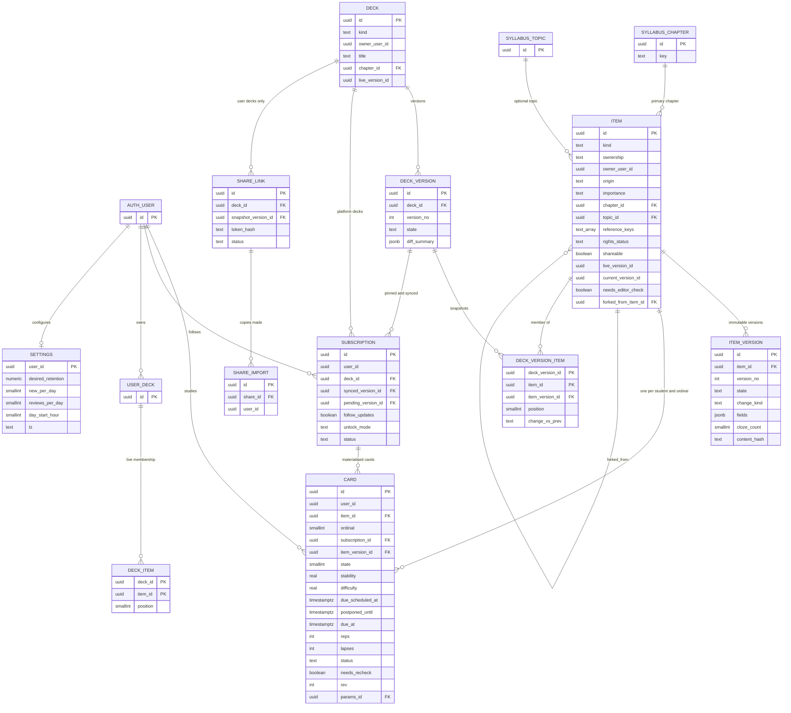
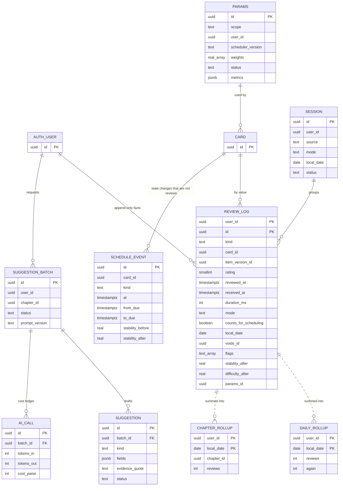
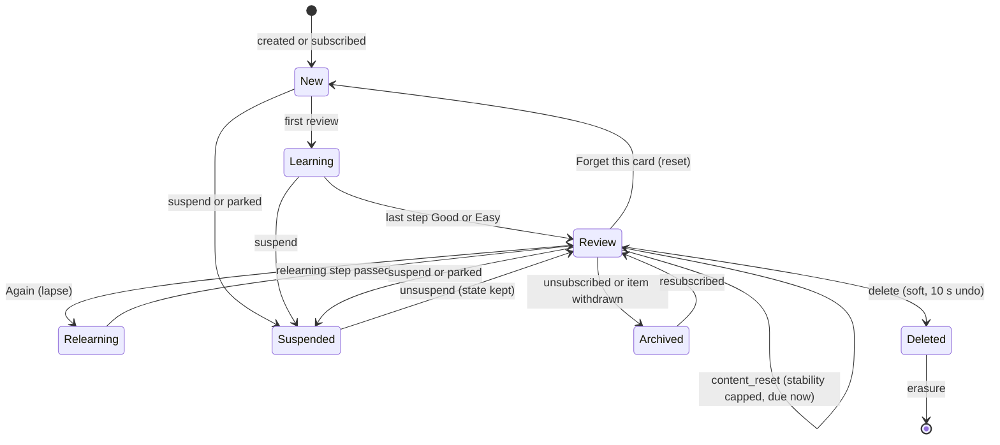
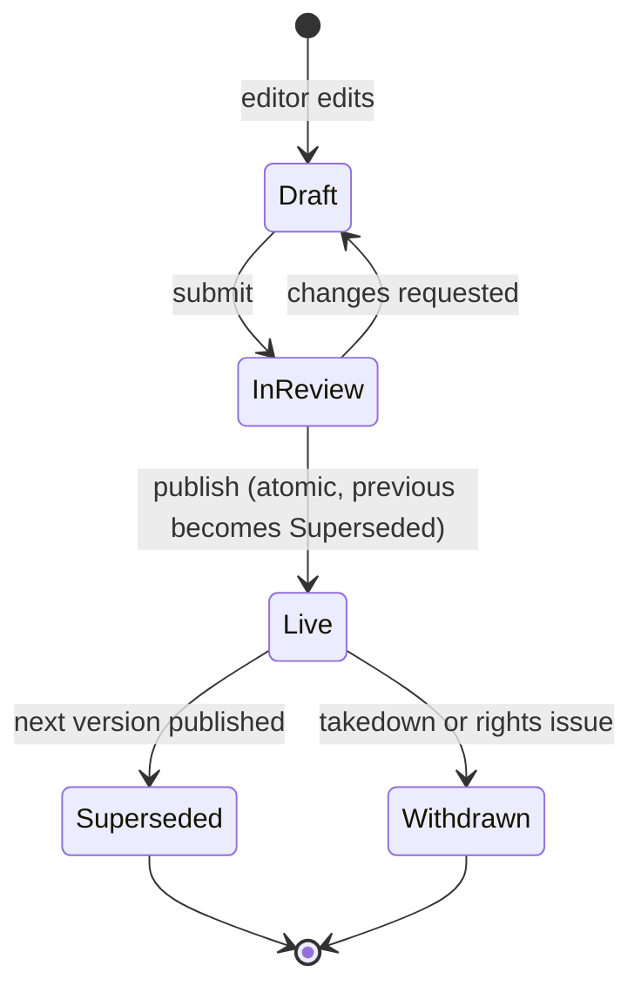

# ERD: F-15 Forgotten Pointers / Recall System

| Field | Value |
| --- | --- |
| Linked PRD | `docs/product/prd/F-15-recall-system.md` |
| Order | Phase 3 pointer. Reads `docs/product/erd/F-02-syllabus-structure-and-coverage.md` (taxonomy, enrolment, exam date, revision signals), uses `docs/product/erd/F-06-question-bank-system.md` section 3 (`core.events`, `core.jobs`, rich-content rules), mirrors conventions of `docs/product/erd/F-01.2-time-tracker-and-analytics.md` (by-value `user_id`, idempotency keys, rollups). Consumed by F-13 Today, F-03 Notes, F-06 UI, F-14 Amendments, F-10, X-01 through the interfaces in section 3 |
| Django app | `apps/api/modules/recall` (tables `recall_*`) |
| Web module | `apps/web/src/modules/recall` |
| Last updated | 2026-10-05 |

**Reading guide for other authors.** Sections 0 and 3 are the contract: what exists, the exact service and selector signatures, the registries, the event catalogue, the scheduler and replay semantics, and what you must not do. If your pointer needs a recall card, a review, a due count or a deck, call the interface here; do not add tables for them.

## 0. Design decisions

1. **Facts are immutable, state is a cache.** `recall_reviewlog` stores only what happened (card, rating, time, duration, mode, device). A card's memory state (`stability`, `difficulty`, `due_at`) is a pure function of its facts and the parameter set, so it can be rebuilt (replayed) at any time. This is what allows offline merging, late events, undo, scheduler upgrades and per-student parameter fits without rewriting history. Columns on the log that hold derived values (`*_before`, `*_after`) are an explicit cache the replay service may rewrite; fact columns are protected by a trigger.
2. **Item versus card.** `recall_item` (content, with immutable `recall_itemversion` rows) is shared by platform and user; `recall_card` is one student's scheduled unit of an item (and cloze number). Progress lives on the card keyed by (student, item, ordinal), so platform fixes never touch progress and a student can unsubscribe and resubscribe without losing it.
3. **Copy-on-subscribe, content by reference.** Subscribing materialises the student's own `recall_card` rows from a pinned `recall_deckversion` (membership is copied, text is referenced through `item_version_id`). A later deck version is applied by a sync service that classifies each item change (`typo`, `clarify`, `substantive`, `amendment`); only the last two disturb memory state. Pinned subscribers apply updates by hand.
4. **The scheduler is a pure, versioned function**, `recall.domain.fsrs6` (FSRS-6, `scheduler_version = "fsrs-6.0"`), with a TypeScript twin and shared golden vectors. Services never inline scheduling maths. A new version (for example FSRS-7) is a new module and a replay job.
5. **One parameter table.** `recall_params` holds the 21 weights (default set seeded; per-student sets later). Every card and log row records `params_id` and `scheduler_version`, so a re-fit is explainable and reversible.
6. **Effective due is derived.** `due_scheduled_at` is the raw scheduler output; `postponed_until` is a student or catch-up deferral; `due_at` is the materialised effective due (exam horizon applied). The queue indexes `due_at`.
7. **Study day.** Daily limits, streak and rollups use a study day that starts at `day_start_hour` (default 04:00) in the student's `tz`; `local_date` is stored on each log row at ingest.
8. **Hash-partitioned log.** `recall_reviewlog` is hash partitioned by `user_id` (16 partitions), primary key `(user_id, id)` where `id` is the client-generated event id. This gives idempotency per student without a time-partition key, all hot access is by student, and nothing is pruned by age (the log is the memory model).
9. **Audit lessons applied.** Row locks on every write path (`select_for_update` on the card; advisory lock per subscription for subscribe and sync); rollups are incremented with `INSERT ... ON CONFLICT DO UPDATE` only when a log row was newly inserted (no delete and insert); DB check constraints for every enum; no foreign model queries (all cross-module reads through `recall/adapters` calling selectors and services); GET endpoints do not write; the erasure function is registered with a central hook; throttle scopes are named and tested; no silent export caps.
10. **Rich content** is Markdown with KaTeX through the F-06 pipeline (F-06 PRD 8.2); plain text is derived. Field limits and kind templates are in the kind registry, not in the database.
11. **Extension by registries.** Card kinds (`register_card_kind`), event subscribers (`core.events.register_subscriber`), Today (`register_task_provider` (F-13 ERD 3.2)) and erasure (`register_erasure_hook`, `[PROPOSED: profiles]`) are registries, so consumers never edit this module.
12. **Django is the only gateway.** All tables have RLS enabled with no policies (deny all) through the existing `post_migrate` hook; a test asserts `relrowsecurity` per table including the partitions.

## 1. Diagrams

### 1.1 Content, subscriptions and cards



`USER_DECK` is the same table as `DECK` (kind `user`), drawn twice only for readability. `SYLLABUS_*` and `AUTH_USER` are shown for orientation; `user_id` columns reference `auth.users.id` by value, the same convention as `profiles`, F-01 and F-06.

### 1.2 Review facts, derived state and AI



### 1.3 Card lifecycle



`state` (new, learning, review, relearning) is memory phase; `status` (active, suspended, archived, deleted) is availability. They are independent columns.

### 1.4 Deck version lifecycle



## 2. Tables

Common columns unless stated (not repeated per table): `id uuid PK default gen`, `created_at timestamptz default now()`, `updated_at timestamptz default now()`. `user_id` columns reference `auth.users.id` by value and are scoped on every query. Enums are `text` with a check constraint (the audit found missing checks on F-02; here every enum has one). `real` is 32-bit float, enough for stability and difficulty (as py-fsrs stores floats; replay tolerance 1e-6 is tested on doubles in the domain layer and rounded to real only on write).

### 2.1 `recall_item` (content identity; platform or user)

| Column | Type | Null | Default | Notes |
| --- | --- | --- | --- | --- |
| kind | text | no | | `pointer`, `formula`, `section`, `definition`, `mnemonic`, `case_law`, `cloze`. Immutable once a version is live (a change of kind is a new item) |
| ownership | text | no | | `platform`, `user` |
| owner_user_id | uuid | yes | | Null for `platform`. Check: `(ownership = 'platform') = (owner_user_id is null)` |
| origin | text | no | `manual` | `manual`, `selection`, `solution`, `mistake`, `ai_suggestion`, `import_csv`, `import_share`, `editor`, `fork`, `amendment_card`, `material_item`, `super50_entry` |
| status | text | no | `active` | `active`, `archived`, `withdrawn` (platform takedown), `deleted` (user soft delete) |
| importance | text | no | `bullet` | `bullet`, `important`, `mandatory`. For user items `important` means "starred" |
| course_id, level_id, scheme_id | uuid | yes | | FK `syllabus_course`, `_level`, `_scheme`, restrict; set from the chapter |
| subject_id | uuid | yes | | FK `syllabus_subject`, restrict |
| chapter_id | uuid | yes | | FK `syllabus_chapter`, restrict. Primary chapter (null means "Unsorted") |
| topic_id | uuid | yes | | FK `syllabus_topic`, set null |
| subject_key, chapter_key | text | yes | | Stable keys copied from the taxonomy so a scheme switch can re-point through `syllabus_chaptermap` |
| reference_keys | text[] | no | `{}` | Normalised provision keys such as `cgst:17(5)`, `indas:115`, `as:2` (same format as F-06 `search_keys`). GIN indexed; matched by amendment events |
| tags | text[] | no | `{}` | Max 12, each at most 40 characters |
| rights_status | text | no | `unknown` | `original`, `licensed`, `institute_material`, `third_party_claimed`, `unknown`. Platform items cannot go live when `unknown` (service rule) |
| source_label | text | no | `''` | "ICAI Study Material, Taxation, Ch 3" (platform provenance, shown to students) |
| source_url | text | yes | | https only |
| origin_module | text | yes | | `notes`, `questionbank`, `amendments`, `study_material`, `super50` for source-created cards |
| origin_ref | text | yes | | Object id in the origin module (note document, question id) |
| origin_locator | jsonb | yes | | `{"v":1,"page":12,"annotation_id":"...","field":"explanation_md","range":[120,180]}`. Schema-less per origin, versioned |
| origin_dangling | boolean | no | false | Set when the origin is deleted or taken down; the card keeps working |
| shareable | boolean | no | false | True for manual cards in the owner's words; selection-created cards need `shareable_attested_at` |
| shareable_attested_at | timestamptz | yes | | "In my own words" attestation, audit-logged |
| forked_from_item_id | uuid | yes | | FK self, set null. `fork` and `import_share` origins |
| live_version_id | uuid | yes | | FK `recall_itemversion`; served version. Platform: the published version. User: always equals `current_version_id` |
| current_version_id | uuid | yes | | Latest version (draft for platform, live for user) |
| needs_editor_check | boolean | no | false | Platform item flagged by an amendment or report; shows the "Under review" ribbon |
| check_reason | text | yes | | `amendment`, `report`, `rights` |
| check_ref | text | yes | | Amendment id or report id |
| fingerprint | text | no | | SHA-256 of the normalised plain text (lower case, collapsed whitespace, LaTeX spacing removed); duplicate warning |
| search_text | text | no | `''` | Plain text of the live version, truncated at 10,000 characters |
| search_tsv | tsvector | no | generated | `to_tsvector('english', search_text)`; stored generated column |
| external_ref | text | yes | | Editor import idempotency key (`seed:ca-inter:tax:gst-itc:17-5`); unique where not null |
| client_id | uuid | yes | | Offline create idempotency; unique `(owner_user_id, client_id)` where not null |
| created_by | uuid | yes | | Editor or student |
| deleted_at | timestamptz | yes | | Soft delete (user items); erased by the erasure service |

Constraints: check `kind` and `status` and `importance` values; unique `external_ref` where not null; check `char_length(fingerprint) = 64`.

Indexes: `(owner_user_id, status, updated_at desc)` where `ownership = 'user'` (my cards); `(chapter_id, importance, id)` where `ownership = 'platform' and status = 'active'` (library); `(owner_user_id, fingerprint)` where `ownership = 'user'` (duplicates); GIN `reference_keys`; GIN `tags`; GIN `search_tsv`; `(forked_from_item_id)` where not null; `(needs_editor_check)` where true.

### 2.2 `recall_itemversion` (immutable once it leaves draft)

| Column | Type | Null | Default | Notes |
| --- | --- | --- | --- | --- |
| item_id | uuid | no | | FK `recall_item`, restrict |
| version_no | int | no | | 1-based per item |
| state | text | no | `draft` | `draft`, `live`, `superseded`, `withdrawn`. User items skip draft (created live) |
| change_kind | text | no | `create` | `create`, `typo`, `clarify`, `substantive`, `amendment`. Drives how subscribers' cards react (PRD 4.5) |
| change_note | text | no | `''` | Required (10+ characters) for `substantive` and `amendment` on platform items |
| fields | jsonb | no | | Kind-specific fields, for example `{"v":1,"name":"EVA","expression_md":"EVA = NOPAT - ...","variables_md":"...","when_md":""}`. `v` is the kind's field schema version (registry); validated by the kind's validator, never trusted from the client |
| fields_schema | smallint | no | 1 | Same as `fields.v`, as a column for migrations |
| cloze_count | smallint | no | 0 | Number of cloze deletions (1..20) for `cloze`, else 0 |
| content_hash | text | no | | SHA-256 of canonical `fields`; an unchanged hash creates no new version (editor imports) |
| plain_text | text | no | | Derived plain text |
| authored_by | uuid | yes | | |
| live_at, superseded_at | timestamptz | yes | | |

Unique `(item_id, version_no)`; partial unique `(item_id)` where `state = 'live'`. Platform versions are never edited or deleted; user versions beyond the latest 5 are pruned by the `recall.prune` job (logs refer to version ids by value, so a pruned id only loses its text, not its meaning).

### 2.3 `recall_deck`

| Column | Type | Null | Default | Notes |
| --- | --- | --- | --- | --- |
| kind | text | no | | `platform`, `user` |
| owner_user_id | uuid | yes | | Null for platform. Same check as items |
| slug | text | yes | | Platform only, unique, used in library URLs (`gst-itc-mandatory-pointers`) |
| title | text | no | | 3 to 80 characters |
| description | text | no | `''` | Max 500 characters |
| course_id, level_id, subject_id, chapter_id | uuid | yes | | FKs to `syllabus_*`; a platform chapter deck sets chapter and subject |
| status | text | no | `active` | `active`, `archived`, `withdrawn` |
| live_version_id | uuid | yes | | FK `recall_deckversion` (platform decks and shared snapshots) |
| draft_version_id | uuid | yes | | Open draft (platform) |
| client_id | uuid | yes | | Unique `(owner_user_id, client_id)` where not null |
| deleted_at | timestamptz | yes | | Soft delete for user decks |

Indexes: `(kind, status, chapter_id)` (library); `(owner_user_id, status, updated_at desc)` where `kind = 'user'`; unique `slug` where not null.

### 2.4 `recall_deckversion`

| Column | Type | Null | Default | Notes |
| --- | --- | --- | --- | --- |
| deck_id | uuid | no | | FK `recall_deck`, restrict |
| version_no | int | no | | 1-based |
| state | text | no | `draft` | `draft`, `in_review`, `live`, `superseded`, `withdrawn` |
| changelog_md | text | no | `''` | Shown on the update screen |
| item_count | smallint | no | 0 | |
| tier_counts | jsonb | no | `{}` | `{"v":1,"mandatory":14,"important":22,"bullet":18}` |
| diff_summary | jsonb | no | `{}` | Versus the previous live version: `{"v":1,"added":3,"removed":1,"typo":2,"clarify":1,"substantive":1,"amendment":0}` |
| published_by | uuid | yes | | |
| published_at | timestamptz | yes | | |

Unique `(deck_id, version_no)`; partial unique `(deck_id)` where `state = 'live'`. User decks get version rows only for share snapshots (state `live`, one per snapshot, older ones `superseded`).

### 2.5 `recall_deckversionitem` (snapshot rows)

| Column | Type | Null | Default | Notes |
| --- | --- | --- | --- | --- |
| deck_version_id | uuid | no | | PK part 1, FK, cascade only while the version is a draft |
| item_id | uuid | no | | PK part 2, FK `recall_item`, restrict |
| item_version_id | uuid | no | | FK `recall_itemversion`: the exact content in this snapshot |
| position | smallint | no | 0 | Order in the deck |
| change_vs_prev | text | no | `unchanged` | `added`, `unchanged`, `typo`, `clarify`, `substantive`, `amendment`; computed at publish by comparing with the previous live version |

Index `(item_id)` (which snapshots contain an item; used by unsubscribe to keep cards that another subscription still contains).

### 2.5a `recall_deckitem` (live membership of a student's own deck)

`(deck_id, item_id)` PK, `position smallint`, `added_at timestamptz`. FK `recall_deck` (cascade) and `recall_item` (cascade for user items). Only user decks use this table; membership of platform decks is the snapshot.

### 2.6 `recall_subscription` (copy-on-subscribe record)

| Column | Type | Null | Default | Notes |
| --- | --- | --- | --- | --- |
| user_id | uuid | no | | |
| deck_id | uuid | no | | FK `recall_deck` (kind `platform`, check by service) |
| pinned_version_id | uuid | no | | The version the student subscribed at |
| synced_version_id | uuid | no | | The version her cards currently reflect |
| pending_version_id | uuid | yes | | A newer live version waiting for a pinned subscriber to apply |
| follow_updates | boolean | no | true | |
| unlock_mode | text | no | `with_coverage` | `with_coverage`, `all` |
| min_importance | text | no | `bullet` | Subscribe only to cards at or above this tier |
| status | text | no | `active` | `active`, `archived` |
| subscribed_at, archived_at, last_sync_at | timestamptz | yes | | |

Unique `(user_id, deck_id)`. Index `(deck_id, follow_updates, status)` (the sync job walks subscribers of one deck), `(user_id, status)`.

### 2.7 `recall_card` (one student's scheduled unit)

| Column | Type | Null | Default | Notes |
| --- | --- | --- | --- | --- |
| user_id | uuid | no | | |
| item_id | uuid | no | | FK `recall_item`, restrict |
| ordinal | smallint | no | 0 | `0` default face; `1..20` cloze number; `100` reverse face |
| subscription_id | uuid | yes | | FK `recall_subscription`, set null; null for own cards |
| item_version_id | uuid | no | | The version this card currently renders (platform: from the synced deck version; user: current) |
| chapter_id | uuid | yes | | Denormalised from the item for filters; kept in sync by the service when an item moves |
| subject_key | text | yes | | Same |
| importance | smallint | no | 0 | 0 bullet, 1 important, 2 mandatory (denormalised for the queue sort) |
| state | smallint | no | 0 | 0 new, 1 learning, 2 review, 3 relearning (1..3 equal py-fsrs `State`) |
| step | smallint | yes | | Learning or relearning step index |
| stability | real | yes | | Days; null while new |
| difficulty | real | yes | | 1 to 10; null while new |
| due_scheduled_at | timestamptz | yes | | Raw scheduler due. Null while new |
| postponed_until | timestamptz | yes | | Rebalance or manual postpone; cleared by the next review |
| due_at | timestamptz | yes | | Effective due = horizon(max(due_scheduled_at, postponed_until)). Null while new |
| last_review_at | timestamptz | yes | | Time of the last counted review |
| reps | int | no | 0 | Counted reviews |
| lapses | int | no | 0 | Again on a review-state card |
| last_lapse_at | timestamptz | yes | | |
| leech | boolean | no | false | Lapses reached the threshold (setting, default 8); cleared by Rewrite |
| status | text | no | `active` | `active`, `suspended`, `archived`, `deleted` |
| suspend_reason | text | yes | | `manual`, `parked`, `leech` |
| buried_until | timestamptz | yes | | Sibling burying and manual bury (end of study day) |
| needs_recheck | boolean | no | false | Content changed substantively or an amendment may apply |
| recheck_reason | text | yes | | `content_changed`, `amendment` |
| recheck_ref | text | yes | | Deck version id or amendment id |
| scheduler_version | text | no | `fsrs-6.0` | |
| params_id | uuid | yes | | FK `recall_params`; the set that produced `stability` and `difficulty` |
| rev | int | no | 1 | Incremented on every change; the offline pack carries it; edit conflicts use it |
| deleted_at | timestamptz | yes | | |

Constraints: unique `(user_id, item_id, ordinal)`; checks on `state` (0..3), `status`, `importance` (0..2), `difficulty` between 1 and 10 and `stability` greater than 0 when not null, `(state = 0) = (stability is null)`, `(state = 0) = (due_at is null)`.

Indexes (the hot ones; all partial where possible):

| Index | Serves |
| --- | --- |
| `(user_id, due_at)` where `status = 'active' and state > 0` | Due queue and counts (Q-1, Q-2) |
| `(user_id, importance desc, created_at)` where `status = 'active' and state = 0` | New-card selection (Q-3) |
| `(user_id, chapter_id, status)` | Chapter filter, recall strength (Q-6) |
| `(user_id, last_lapse_at desc)` where `lapses > 0 and status = 'active'` | Forgotten list (Q-5) |
| `(user_id, needs_recheck)` where `needs_recheck` | Re-check list |
| `(item_id)` | Platform item change fan-out (bulk update by item) |
| `(subscription_id)` where not null | Subscription sync and unsubscribe |

### 2.8 `recall_reviewlog` (append-only facts; hash partitioned by `user_id`, 16 partitions)

| Column | Type | Null | Default | Notes |
| --- | --- | --- | --- | --- |
| user_id | uuid | no | | **PK part 1**; partition key |
| id | uuid | no | | **PK part 2**. Client-generated event id (UUID v7); the idempotency key |
| kind | text | no | `review` | `review`, `undo` (compensating) |
| card_id | uuid | no | | By value (no FK on the partitioned table); the card may later be deleted |
| item_id | uuid | no | | By value |
| item_version_id | uuid | no | | The version the student saw (stale-content detection) |
| session_id | uuid | yes | | By value |
| rating | smallint | yes | | 1 to 4; null only for `undo` |
| reviewed_at | timestamptz | no | | Device time, clamped by the service (flag `clamped_time`) |
| received_at | timestamptz | no | now() | Server receive time |
| duration_ms | int | yes | | 0 to 600,000 (capped); used for minutes estimates, never for scheduling |
| mode | text | no | `normal` | `normal`, `catchup`, `quick_revision`, `cram`, `review_ahead` |
| counts_for_scheduling | boolean | no | true | False for `cram`, stale content, `late_unapplied` and voided events. Excluded from fitting |
| device_id | text | yes | | Random per-install id, at most 64 characters (no hardware ids) |
| tz_offset_min | smallint | no | 0 | Offset at review time, minutes (so `local_date` can be re-derived) |
| local_date | date | no | | Study day (04:00 rule) at the student's `tz`; used by rollups |
| voids_id | uuid | yes | | For `undo`: the event id voided. Unique `(user_id, voids_id)` |
| flags | text[] | no | `{}` | `offline`, `late`, `clamped_time`, `stale_content`, `deleted_card`, `duplicate_device` |
| phase_before | smallint | yes | | Derived cache from here on (rewritable only by the replay service): state before |
| stability_before, difficulty_before | real | yes | | |
| elapsed_days | int | yes | | Whole days since the previous counted review |
| retrievability_before | real | yes | | Predicted recall at review time (calibration and true-retention analytics) |
| phase_after | smallint | yes | | |
| stability_after, difficulty_after | real | yes | | |
| scheduled_days | real | yes | | Interval chosen (fraction of a day for learning steps) |
| due_after | timestamptz | yes | | Raw due after this review |
| params_id | uuid | yes | | Parameter set used for the derived columns |
| scheduler_version | text | yes | | |

Checks: `rating between 1 and 4` for `review`, null for `undo`; `kind = 'undo'` iff `voids_id is not null`; `duration_ms between 0 and 600000`.

Immutability: a trigger `recall_reviewlog_immutable` rejects `DELETE` and any `UPDATE` that changes a fact column (`id`, `user_id`, `kind`, `card_id`, `item_id`, `item_version_id`, `session_id`, `rating`, `reviewed_at`, `received_at`, `duration_ms`, `mode`, `device_id`, `tz_offset_min`, `local_date`, `voids_id`); `counts_for_scheduling` and `flags` may only change through the replay service (session variable `recall.replaying`); the account-erasure service sets `recall.erasing` to allow deletes. A test asserts all three behaviours.

Indexes (created on the parent, one per partition): `(user_id, card_id, reviewed_at, id)` (replay and card history); `(user_id, reviewed_at desc)` (export, stats ranges); `(user_id, reviewed_at desc)` where `kind = 'review' and rating = 1` (forgotten list and lapse counts); unique `(user_id, voids_id)` where `voids_id is not null`.

### 2.9 `recall_scheduleevent` (state changes that are not reviews)

| Column | Type | Null | Default | Notes |
| --- | --- | --- | --- | --- |
| user_id | uuid | no | | |
| card_id | uuid | no | | FK `recall_card`, cascade |
| kind | text | no | | `content_reset`, `forget`, `postpone`, `unpostpone`, `horizon`, `manual_due`, `suspend`, `unsuspend` |
| at | timestamptz | no | now() | When it took effect (used to order against reviews in replay) |
| from_due, to_due | timestamptz | yes | | For due changes |
| stability_before, stability_after | real | yes | | For `content_reset` (cap at 3 days) |
| reason_code | text | no | `''` | `typo_free`, `substantive`, `amendment`, `rebalance`, `vacation`, `student`, `exam_horizon`, `parked` |
| ref | text | yes | | Deck version id, amendment id, rebalance run id |
| created_at | timestamptz | no | now() | |

Replay uses `content_reset` (cap stability), `forget` (everything before is ignored), `postpone` and `unpostpone` (due override valid until the next review). `horizon`, `suspend` and `unsuspend` are audit only. Index `(user_id, card_id, at)`. Retention: 24 months, then pruned (the memory state is already folded into the card).

### 2.10 `recall_session`

| Column | Type | Null | Default | Notes |
| --- | --- | --- | --- | --- |
| user_id | uuid | no | | |
| client_id | uuid | no | | Unique `(user_id, client_id)`; created client side so offline sessions upsert |
| source | text | no | | `today`, `chapter`, `deck`, `forgotten`, `quick`, `catchup`, `cram`, `review_ahead` |
| spec | jsonb | no | `{}` | `{"v":1,"chapter_id":...,"deck_id":...,"kind":...,"tier":...}` |
| status | text | no | `open` | `open`, `closed`, `auto_closed` |
| started_at, last_event_at, ended_at | timestamptz | | | `last_event_at` drives auto close after 60 idle minutes |
| tz | text | no | | |
| local_date | date | no | | Study day of `started_at` |
| planned_count | smallint | no | 0 | |
| reviewed, new_count, again, hard, good, easy | int | no | 0 | Counters maintained by the review service (increment only for newly inserted log rows) |
| active_seconds | int | no | 0 | Sum of capped durations |

Indexes: `(user_id, started_at desc)`; `(status, last_event_at)` where `status = 'open'` (auto close job).

### 2.11 `recall_params`

| Column | Type | Null | Default | Notes |
| --- | --- | --- | --- | --- |
| scope | text | no | | `default`, `user`, `pooled` |
| user_id | uuid | yes | | Set for `user` |
| scheduler_version | text | no | | `fsrs-6.0` |
| weights | real[] | no | | Exactly 21 values for `fsrs-6.0` (check `array_length = 21`); validated against the bounds in the domain module on write |
| status | text | no | `active` | `active`, `candidate`, `retired`, `rejected` |
| n_reviews, n_cards | int | yes | | Size of the fitting data |
| fitted_from, fitted_to | timestamptz | yes | | |
| metrics | jsonb | no | `{}` | `{"v":1,"log_loss_old":0.352,"log_loss_new":0.331,"rmse_bins_old":0.061,"rmse_bins_new":0.048,"auc_new":0.71}` |
| optimiser | text | yes | | Name and version of the optimiser that produced it |
| activated_at | timestamptz | yes | | |

Partial unique `(scheduler_version)` where `scope = 'default' and status = 'active'`; partial unique `(user_id)` where `scope = 'user' and status = 'active'`. Seed: one `default` row with the FSRS-6 defaults `[0.212, 1.2931, 2.3065, 8.2956, 6.4133, 0.8334, 3.0194, 0.001, 1.8722, 0.1666, 0.796, 1.4835, 0.0614, 0.2629, 1.6483, 0.6014, 1.8729, 0.5425, 0.0912, 0.0658, 0.1542]` (migration data, with a test that equals the py-fsrs defaults).

### 2.12 `recall_dailyrollup` and 2.13 `recall_chapterrollup` (derived, rebuildable)

`recall_dailyrollup`: `user_id`, `local_date` (PK pair), `new_cards int`, `learn_reviews int`, `review_reviews int`, `relearn_reviews int`, `again int`, `hard int`, `good int`, `easy int`, `mandatory_reviews int`, `seconds int`, `updated_at`. Updated by `INSERT ... ON CONFLICT (user_id, local_date) DO UPDATE SET col = col + EXCLUDED.col` in the same transaction as the log insert, **only when the log row was newly inserted**; an `undo` applies the negative deltas to the voided event's `local_date`. The streak is computed from these rows.

`recall_chapterrollup`: `user_id`, `local_date`, `chapter_id` (null allowed), `reviews int`, `again int`, `mandatory_reviews int`; unique index `(user_id, local_date, coalesce(chapter_id, '00000000-0000-0000-0000-000000000000'))`; same maintenance. Both are rebuilt by `manage.py recall_rebuild_rollups --user --from` from the log (a test compares incremental against rebuilt after random sync, undo and replay sequences).

### 2.14 `recall_sharelink` and `recall_shareimport`

`recall_sharelink`:

| Column | Type | Null | Default | Notes |
| --- | --- | --- | --- | --- |
| deck_id | uuid | no | | FK `recall_deck` (kind `user`) |
| owner_user_id | uuid | no | | |
| token_hash | text | no | | SHA-256 of a 128-bit random token (shown once); unique |
| token_prefix | text | no | | First 6 characters for support lookups |
| snapshot_version_id | uuid | no | | FK `recall_deckversion`; the frozen content |
| title_snapshot | text | no | | |
| card_count | smallint | no | | Own cards in the snapshot (at most 500) |
| excluded_platform_count | smallint | no | 0 | Shown as "N platform cards not included" |
| chapters | jsonb | no | `[]` | `[{"chapter_key":"gst-itc","name":"GST: ITC","count":22}]`, schema v1 |
| show_author | boolean | no | false | Display name shown on the preview |
| status | text | no | `active` | `active`, `revoked`, `expired`, `disabled` (reports), `removed` (takedown) |
| expires_at | timestamptz | yes | | |
| import_count, open_count, report_count | int | no | 0 | Counters (approximate for opens) |
| disabled_reason | text | yes | | |
| revoked_at | timestamptz | yes | | |

Indexes: unique `token_hash`; `(owner_user_id, status)` (link cap); `(status, expires_at)` where `status = 'active'` (expiry job).

`recall_shareimport`: `share_id` FK, `user_id`, `snapshot_version_id`, `item_count`, `imported_at`; unique `(share_id, user_id, snapshot_version_id)` (re-import of the same snapshot is a no-op with a message); index `(user_id, imported_at desc)` (daily import cap).

### 2.15 `recall_report`

`target_kind` (`item`, `share`, `deck`), `target_id` uuid, `item_version_id` uuid null, `reporter_user_id`, `reason` (`wrong`, `outdated`, `copyright`, `abusive`, `spam`, `other`), `note` (500 characters, never logged), `status` (`open`, `actioned`, `dismissed`), `handled_by`, `handled_at`, `created_at`. Unique `(reporter_user_id, target_kind, target_id)` where `status = 'open'`; index `(status, target_kind, created_at)`; a trigger-free service rule disables a share at 3 distinct open reporters (`disabled_reason = 'reports'`) and raises `needs_editor_check` on an item at 2.

### 2.16 `recall_settings` (one row per student, created on first read)

| Column | Type | Null | Default | Notes |
| --- | --- | --- | --- | --- |
| user_id | uuid | no | | **PK** |
| desired_retention | numeric(3,2) | no | 0.90 | Check 0.80 to 0.97 |
| new_per_day | smallint | no | 10 | Check 0..100 |
| reviews_per_day | smallint | no | 100 | Check 20..500 |
| learning_steps_min | smallint[] | no | `{1,10}` | Max 4 entries, each 1..1440 (steps of a day or more are discouraged and rejected above 1,440) |
| relearning_steps_min | smallint[] | no | `{10}` | Max 3 entries |
| max_interval_days | int | no | 365 | Check 30..3650 |
| leech_threshold | smallint | no | 8 | Check 4..20 |
| day_start_hour | smallint | no | 4 | Check 0..6 |
| tz | text | no | `Asia/Kolkata` | IANA; copied from the tracker's tz on first creation, then owned here (Q-F15-3 asks to centralise) |
| bury_siblings | boolean | no | true | |
| interleave | boolean | no | true | |
| catchup_mode | text | no | `auto` | `auto`, `off` |
| pause_new_in_catchup | boolean | no | true | |
| exam_horizon | boolean | no | true | |
| recall_counts_as_revision | boolean | no | true | FR-F15-64 |
| gestures | boolean | no | true | Swipe on touch |
| show_intervals | boolean | no | true | |
| quick_minutes_per_day | smallint | no | 30 | Check 5..240 |
| vacation_until | date | yes | | |
| improve_scheduler_consent | boolean | no | false | Pooled fitting (R3) |
| consent_at | timestamptz | yes | | |
| params_id | uuid | yes | | FK `recall_params`; null means the active default set |

### 2.17 `recall_suggestionbatch`, `recall_suggestion`, `recall_aicall`

`recall_suggestionbatch`: `user_id`, `chapter_id` FK, `sources text[]` (`notes`, `wrong_answers`, `pasted`), `source_hash text` (SHA-256 of the normalised source text; cache key with `prompt_version`), `source_chars int`, `requested_count smallint` (1..10), `kinds text[]`, `status` (`queued`, `running`, `ready`, `failed`, `cancelled`, `expired`), `job_id uuid`, `prompt_id text`, `prompt_version text`, `model text`, `error_code text`, `expires_at` (30 days), `finished_at`. Pasted source text is held in `core_job.payload` only until the job finishes and is then cleared (the batch row keeps the hash and size, not the text).

`recall_suggestion`: `batch_id` FK cascade, `user_id`, `kind`, `fields jsonb` (kind schema `v`), `evidence_quote text` (at most 300 characters, verbatim from the source, validated by the service), `evidence_source text` (`note:<id>`, `question:<id>`, `pasted`), `confidence numeric(3,2)`, `status` (`draft`, `accepted`, `edited_accepted`, `rejected`, `expired`), `item_id uuid` (created item), `fingerprint text` (reject memory for 90 days), `decided_at`. Indexes `(user_id, status, created_at desc)`, `(user_id, fingerprint)` where `status = 'rejected'`.

`recall_aicall` (cost ledger; the same shape as the X-04 `ingestion_aicall` so one budget view can union them): `user_id`, `batch_id`, `prompt_id`, `prompt_version`, `model`, `tokens_in int`, `tokens_out int`, `cost_paise int`, `latency_ms int`, `status` (`ok`, `blocked`, `timeout`, `error`), `cache_hit boolean`, `created_at`. Quota counting uses `recall_suggestion` and `recall_suggestionbatch` rows per study day; prompts and payloads are never stored.

### 2.18 `recall_quotaplan` and `recall_auditlog`

`recall_quotaplan`: `plan_code text PK` (`free`, `pro`), `max_cards int`, `max_cards_per_deck int`, `max_decks int`, `max_active_shares int`, `ai_suggestions_per_day int`, `ai_batches_per_day int`, `share_imports_per_day int`, `pack_size int`. Seeded with PRD 8.3. The student's plan code comes from the payments pointer through `profiles` (`free` until then).

`recall_auditlog`: `actor_id`, `action` (`deck_publish`, `item_withdraw`, `share_takedown`, `attest_own_words`, `params_activate`, `force_replay`, `quota_change`), `target_kind`, `target_id`, `detail jsonb` (ids and counts only, schema v1, no text), `created_at`; index `(target_kind, target_id, created_at)`; kept 24 months.

## 3. Relationships to other modules and the contract

### 3.1 Foreign keys and by-value references

| From | To | Rule |
| --- | --- | --- |
| all `user_id`, `owner_user_id`, `*_by` | `auth.users.id` | By value, no cross-schema FK; scoped on every query |
| `recall_item` (course, level, scheme, subject, chapter, topic) and `recall_deck` | `syllabus_*` | Real FKs (restrict; topic set null). Reads and validation through `recall/adapters/syllabus.py`, which calls `syllabus.selectors` only; never `syllabus` models |
| `recall_item.origin_ref`, `origin_locator` | F-03 note or annotation, F-06 question | By value (text); no FK. The adapter resolves titles and deep links through the owner's selectors |
| `recall_card.item_id`, `item_version_id`, `subscription_id`, `params_id` | `recall_*` | Real FKs (the card table is not partitioned) |
| `recall_reviewlog.card_id`, `item_id`, `item_version_id`, `session_id`, `voids_id`, `params_id` | `recall_*` | By value (partitioned hot table; the card may be deleted while its facts stay) |
| `recall_scheduleevent.card_id` | `recall_card` | FK, cascade |
| `recall_sharelink.snapshot_version_id` | `recall_deckversion` | FK, restrict |
| Coverage (F-02) | recall | Recall calls `coverage.services.record_event(user_id, chapter_id, 'revision_done', value=None, source='system', client_id=uuid5(NS, f"{user_id}:{chapter_id}:{iso_week}"), source_ref=session_id, strict=False)` from the `recall_chapter_pass_completed` subscriber; `[PROPOSED: F-02]` adds `source='recall'` to the coverage source enum (until then `system`) |
| Tracker (F-01.2) | recall | Deferred subscriber on `recall_session_completed` calls `tracking.services.record_session(source='auto', activity_type='revision', ...)` only when the student enabled auto capture, no live timer runs and the daily auto cap is not reached (the same rule F-06 uses) |
| Today (F-13) | recall | `register_task_provider('recall', provide)` (F-13 ERD 3.2) called in `RecallConfig.ready()` |

Dependency direction (no cycles): `recall -> syllabus` (selectors), `recall -> coverage` (selectors and `record_event`), `recall -> tracking` (service), `recall -> questionbank` (selectors, optional), `recall -> core.events, core.jobs`; consumers (F-03, F-06 UI, F-13, F-14, F-10, X-01) `-> recall` through section 3.2 only. `recall` never imports `practice`, `questionbank` models or `notes` models. All foreign calls live in `apps/api/modules/recall/adapters/*.py` (one file per neighbour) so layering is checked in one place (the audit's AUD-005 pattern is avoided by construction).

### 3.2 Public service and selector interfaces (the contract)

Signatures are Python 3.12. Everything not listed is private and may change.

```python
# ---- recall/selectors.py (read only; no side effects) ---------------------------------------------------
class QueueSource(Enum): TODAY; CHAPTER; DECK; FORGOTTEN; QUICK; CATCHUP; CRAM; REVIEW_AHEAD

def today_plan(user_id: UUID, *, now: datetime) -> TodayPlan
    # counts (new, learning, due), queue_size, deferred, mode, days_to_clear, est_minutes, next_due_at, per-subject kind tiles
def build_queue(user_id: UUID, source: QueueSource, *, now: datetime, limit: int = 20, filters: QueueFilters, exclude: Sequence[UUID] = ()) -> list[QueueCard]
def due_counts(user_id: UUID, *, subject_key: str | None = None, chapter_ids: Sequence[UUID] | None = None, now: datetime) -> DueCounts   # F-10, chapter pages
def recall_strength(user_id: UUID, chapter_ids: Sequence[UUID], *, now: datetime) -> dict[UUID, StrengthRow]   # mean predicted R, active card count, due count
def forgotten(user_id: UUID, *, window_days: int = 30, limit: int = 20, subject_key: str | None = None) -> list[ForgottenRow]
def quick_revision_plan(user_id: UUID, *, exam_at: datetime | None, minutes_per_day: int, subject_key: str | None, now: datetime) -> QuickPlan
def pack_for_device(user_id: UUID, *, limit: int, now: datetime) -> Pack
def get_card(user_id: UUID, card_id: UUID) -> CardView | None                  # 404 semantics: None for another student's card
def list_cards(user_id: UUID, flt: CardFilter, *, cursor: str | None, limit: int = 30) -> Page[CardRow]
def list_platform_decks(viewer_id: UUID, flt: DeckFilter, *, cursor: str | None) -> Page[DeckRow]
def subscription_updates(user_id: UUID, subscription_id: UUID) -> DeckDiff
def forecast(user_id: UUID, *, days: int = 30, now: datetime) -> list[ForecastRow]
def stats_summary(user_id: UUID, *, range: str, now: datetime) -> StatsSummary
def get_settings(user_id: UUID) -> Settings;  def active_params(user_id: UUID) -> Params
def preview_shared(token: str) -> SharePreview | None                          # None for unknown, revoked, expired alike
def provide_today(req: TaskRequest) -> ProviderResult   # registered with F-13 via register_task_provider
def reviewed_by_subject_kind(user_id: UUID, local_date: date) -> dict   # completion reconcile for F-13
def items_for_reference_keys(keys: Sequence[str], chapter_ids: Sequence[UUID]) -> list[UUID]   # F-14 flagging

# ---- recall/services (writes; transactional; actor-checked) ----------------------------------------------
def create_card(user_id: UUID, *, kind: str, fields: dict, chapter_id: UUID | None, topic_id: UUID | None, importance: str = "bullet",
                tags: Sequence[str] = (), reference_keys: Sequence[str] = (), deck_ids: Sequence[UUID] = (), client_id: UUID,
                force: bool = False, origin: str = "manual") -> CreatedCards
    # validates through the kind registry, lints Markdown, duplicate check (raises DuplicateCard unless force), quota,
    # creates item + version 1 + one card per ordinal (state new). Idempotent on (user_id, client_id).
def create_card_from_selection(user_id: UUID, *, origin: Literal["note_highlight", "solution_text", "chapter_page", "question_review"],
                               selection_text: str, source: SourceRef, chapter_id: UUID | None = None, topic_id: UUID | None = None,
                               kind: str | None = None, deck_id: UUID | None = None, quick: bool = False, client_id: UUID) -> CreatedFromSelection
    # SourceRef(module: Literal["notes", "questionbank", "syllabus"], object_id: str, locator: dict)
    # Kind is suggested by pure rules when None. Result carries card_id, item_id, kind, undo_token (10 s). Selection-created items are shareable=False.
def create_card_from_question(user_id: UUID, *, question_id: UUID, version_id: UUID, client_id: UUID) -> CreatedCards
def update_card(user_id: UUID, card_id: UUID, *, base_rev: int, fields: dict | None = None, chapter_id=..., importance=None, tags=None) -> CardView   # EditConflict(server_fields), CardDeleted
def set_card_status(user_id: UUID, card_id: UUID, action: Literal["suspend", "unsuspend", "bury", "reset", "recheck_ok", "delete", "undo_delete"], *, until: date | None = None) -> CardView
def bulk_update(user_id: UUID, ids: Sequence[UUID], action: str, **args) -> BulkResult        # <= 200, all or none
def defer_cards(user_id: UUID, card_ids: Sequence[UUID], days: int, *, reason: str = "snooze") -> int   # F-13 snooze and swap; writes postpone schedule events

def open_session(user_id: UUID, *, client_id: UUID, source: str, spec: dict, tz: str) -> Session
def submit_review(user_id: UUID, ev: ReviewEvent) -> ReviewResult          # idempotent on ev.id; locks the card; late events replay
def submit_reviews(user_id: UUID, events: Sequence[ReviewEvent]) -> list[ReviewResult]   # <= 100, sorted by reviewed_at inside
def undo_review(user_id: UUID, *, undo_id: UUID, voids: UUID) -> ReviewResult
def close_session(user_id: UUID, session_id: UUID, *, auto: bool = False) -> SessionSummary   # emits recall_session_completed, idempotent
def rebalance(user_id: UUID, *, days: int = 7, now: datetime) -> RebalanceResult
def set_vacation(user_id: UUID, until: date | None) -> Settings
def update_settings(user_id: UUID, data: dict) -> Settings                 # validates ranges; changing retention never reschedules

def subscribe(user_id: UUID, deck_id: UUID, *, follow_updates: bool = True, unlock_mode: str = "with_coverage", min_importance: str = "bullet") -> Subscription
def unsubscribe(user_id: UUID, subscription_id: UUID) -> None              # archives cards; keeps those still in another active subscription
def sync_subscription(user_id: UUID, subscription_id: UUID, *, target_version_id: UUID | None = None) -> SyncResult   # idempotent per target version
def create_deck(...); update_deck(...); set_deck_items(...); delete_deck(...)
def create_share_link(user_id: UUID, deck_id: UUID, *, expires_at: datetime | None, show_author: bool) -> ShareLinkCreated   # ShareNotAllowed(reason), QuotaExceeded
def revoke_share_link(user_id: UUID, share_id: UUID) -> None
def import_shared_deck(user_id: UUID, token: str, *, client_id: UUID) -> ImportResult   # copies own-wording items as the importer's user items, state new, no progress
def report(user_id: UUID, target_kind: str, target_id: UUID, reason: str, note: str = "") -> Report

def request_suggestions(user_id: UUID, *, chapter_id: UUID, sources: Sequence[str], pasted_text: str | None, count: int, kinds: Sequence[str]) -> SuggestionBatch  # enqueues job
def decide_suggestion(user_id: UUID, suggestion_id: UUID, decision: Literal["accept", "reject"], *, fields: dict | None = None) -> CreatedCards | None

# staff (permission checked by the caller's scope)
def publish_deck_version(editor_id: UUID, deck_id: UUID, version_id: UUID, *, changelog_md: str) -> DeckVersion    # atomic; computes change_vs_prev; emits recall_deck_published
def withdraw_item(editor_id: UUID, item_id: UUID, *, reason: str) -> None
def flag_items_for_amendment(*, reference_keys: Sequence[str], chapter_ids: Sequence[UUID], amendment_id: str) -> FlagResult   # called by the subscriber

# lifecycle
def replay_card(user_id: UUID, card_id: UUID, *, params: Params | None = None) -> CardState     # used by late events, undo, fits
def delete_all_for_user(user_id: UUID) -> DeleteReport;  def export_for_user(user_id: UUID) -> dict
```

Pure domain (no I/O, no Django imports; the unit-test surface and the Python half of the parity contract), `apps/api/modules/recall/domain/`:

```python
# fsrs6.py   SCHEDULER_VERSION = "fsrs-6.0"
@dataclass(frozen=True) class MemoryState: phase: int; step: int | None; stability: float | None; difficulty: float | None; last_review_at: datetime | None; reps: int; lapses: int
@dataclass(frozen=True) class Cfg: desired_retention: float; learning_steps: tuple[int, ...]; relearning_steps: tuple[int, ...]; max_interval_days: int; day_start_hour: int; tz: str; fuzz: bool = True
def retrievability(stability: float, elapsed_days: float, w20: float) -> float
def interval_days(stability: float, retention: float, w20: float, max_interval: int) -> int
def review(state: MemoryState, rating: int, now: datetime, w: Weights, cfg: Cfg, *, card_id: UUID) -> ReviewOutcome   # new state, interval, due_scheduled_at, deltas for lapses and phase; deterministic fuzz from (card_id, reps)
def preview(state: MemoryState, now: datetime, w: Weights, cfg: Cfg, *, card_id: UUID) -> dict[int, Preview]       # the four buttons
def cap_stability(state: MemoryState, cap_days: float) -> MemoryState                                              # content_reset
# folding.py
def fold(events: Iterable[Event], w: Weights, cfg: Cfg, *, card_id: UUID) -> MemoryState   # reviews and schedule events in (time, id) order; ignores voided and counts_for_scheduling=False
# scheduling.py
def plan_queue(cards: Sequence[CardRow], settings: PlanSettings, counts: DayCounts, now: datetime, source: str) -> QueuePlan
def catchup_state(due_review_count: int, max_overdue_days: int, limit: int) -> bool
def days_to_clear(backlog: int, forecast_incoming: Sequence[int], limit: int) -> int
def priority(importance: int, retrievability: float, overdue_days: int) -> float
def horizon(due_scheduled_at: datetime, last_review_at: datetime | None, exam_at: datetime | None, card_id: UUID, now: datetime) -> datetime
def r_exam(state: MemoryState, exam_at: datetime, w20: float) -> float
def quick_set(cards, exam_at, minutes_per_day, median_seconds, now) -> QuickPlan
def pacing(unseen_in_scope: int, days_to_exam: int, new_per_day: int) -> Pacing
def forgetting_score(importance: int, lapses_30d: int, again_14d: int) -> float
def streak(rollup_rows: Sequence[DayRow], today: date, vacation_ranges) -> int
# cards.py     kind registry validators, render(kind, fields, ordinal) -> (front_md, back_md), cloze parser, suggest_kind(selection_text), fingerprint
```

The web mirrors `fsrs6`, `folding`, `plan_queue` (client side queue for offline packs) and `render` in `apps/web/src/modules/recall/lib/` and runs the same JSON golden vectors in `apps/api/modules/recall/tests/vectors/` (shared through `packages/` or a copied file with a CI diff check).

### 3.3 Registries (extension points)

```python
# recall/registry.py
register_card_kind(spec: KindSpec)
    # KindSpec(name, fields: tuple[FieldSpec], validate(fields) -> list[Issue], render(fields, ordinal) -> Rendered, ordinals(fields) -> list[int],
    #          suggest(selection_text) -> float (score for kind suggestion), icon_key, example_fields)
    # built in: pointer, formula, section, definition, mnemonic, case_law, cloze. Web side: a matching field-form entry in the module `lib/kinds.ts`.
# core/events.py (F-06): register_subscriber(event_name, subscriber, fn, mode=...), emit(...)
# F-13 (written) register_task_provider(key, provide: Callable[[TaskRequest], ProviderResult]); recall kinds: recall_cards, formula_recall, section_recall, forgotten_cards, quick_revision
# [PROPOSED: profiles] register_erasure_hook(name: str, delete_fn: Callable[[UUID], DeleteReport], export_fn: Callable[[UUID], dict])
```

Registration happens in `RecallConfig.ready()` (as the Pomodoro registers its live-timer provider and F-06 registers its kinds).

### 3.4 Domain events (envelope and delivery as in F-06 ERD 3.4)

Names are `noun_verb`; schemas live in `apps/api/core/event_schemas/<name>.v1.json`.

| Event | Emitted when | Payload (key fields) | Consumers |
| --- | --- | --- | --- |
| `recall_session_completed` | `close_session` (manual or auto close) | `session_id`, `source`, `mode`, `started_at`, `ended_at`, `active_seconds`, `tz`, `local_date`, `counts{new, learning, review, relearn, again, hard, good, easy}`, `by_chapter[{chapter_id, chapter_key, subject_id, subject_key, reviews, again, mandatory_reviews}]`, `streak_after` | tracker (inline, opt-in), F-10, X-03, X-01 |
| `recall_chapter_pass_completed` | A chapter's mandatory and important set (at least 5 cards, 80% reviewed Hard or better in 7 days) is reached | `chapter_id`, `chapter_key`, `local_date`, `set_size`, `coverage_of_set` | coverage (inline) |
| `recall_leech_detected` | A card reaches the lapse threshold | `card_id`, `item_id`, `lapses`, `kind`, `chapter_id` | X-01 (in-app) |
| `recall_deck_published` | `publish_deck_version` commits | `deck_id`, `version_no`, `diff_summary`, `chapter_ids[]`, `substantive_count` | sync fan-out job (deferred), X-01 |
| `recall_share_reported` | Share disabled by reports or a report arrives | `share_id`, `report_count` | editors |
| `recall_params_updated` | A candidate parameter set is activated | `user_id`, `params_id`, `log_loss_old`, `log_loss_new` | support, analytics |

Consumed events and how recall reacts (all subscribers are idempotent on `event.id` or `key`):

| Event | From | Rule |
| --- | --- | --- |
| `amendment_published` / `amendment_corrected` / `amendment_retracted` (F-14 ERD 3.4), payload `amendment_id`, `chapter_ids[]`, `provision_keys[]` `[PROPOSED EXTENSION to F-14]`, `effective_from`, `summary` | F-14 | `flag_items_for_amendment`: platform items with overlapping `reference_keys` get `needs_editor_check = true`, `check_reason = 'amendment'`; users' own cards with overlapping `reference_keys` get `needs_recheck = true`, `recheck_reason = 'amendment'`, `recheck_ref = amendment_id` (chapter-only matches are not flagged on user cards). One bulk `UPDATE ... WHERE reference_keys && :keys` per user batch of 1,000 |
| `enrollment_scheme_switched` `[PROPOSED: F-02]`, payload `user_id`, `old_scheme_id`, `new_scheme_id`, `chapter_map[{old, new, relation}]` | F-02 | Re-point `recall_item.chapter_id` of the student's own items and `recall_card.chapter_id` through the map by `chapter_key`; unmappable cards get `chapter_id = null` and appear in "Needs a new chapter" |
| `note_annotation_deleted` `[PROPOSED: F-03]`, `question_taken_down` (exists) | F-03, F-06 | `origin_dangling = true` for items whose `origin_ref` matches |
| `profile_deleted` `[PROPOSED: profiles]` | profiles | `delete_all_for_user` |

### 3.5 Behavioural reference (what the tests assert)

**Applying a review (`submit_review`, one transaction).**

1. Validate: rating 1 to 4, `duration_ms` capped, `reviewed_at` not more than 5 minutes in the future (else clamped to `received_at`, flag `clamped_time`) and not older than 30 days (older: stored with `counts_for_scheduling = false`, flag `late`, result `late_unapplied`).
2. `INSERT INTO recall_reviewlog ... ON CONFLICT (user_id, id) DO NOTHING RETURNING`. No row returned means duplicate: return the stored outcome, change nothing, count nothing.
3. `SELECT ... FROM recall_card WHERE id = :card AND user_id = :u FOR UPDATE`. Missing or `status = 'deleted'`: the log row stays (flag `deleted_card`), result `applied_to_deleted`.
4. Stale content: if the event's `item_version_id` differs from the card's and any version in between has `change_kind` in (`substantive`, `amendment`), set `counts_for_scheduling = false`, flag `stale_content`, result `stale_content`, and mark `needs_recheck`.
5. Fast path when `reviewed_at >= card.last_review_at` (or the card is new): `outcome = fsrs6.review(state, rating, reviewed_at, w, cfg)`; write the derived columns on the log row, update the card (`state`, `step`, `stability`, `difficulty`, `due_scheduled_at`, `due_at = horizon(max(due_scheduled_at, null), ...)`, `last_review_at`, `reps`, `lapses`, `last_lapse_at`, `leech`, `postponed_until = null`, `rev + 1`). Sibling burying: other cards of the same item get `buried_until = end of study day`.
6. Slow path (late event, `reviewed_at < last_review_at`): `replay_card` folds all effective reviews and schedule events in `(time, id)` order, rewriting the derived columns of affected log rows; result `applied` with flag `merged`.
7. Rollups: `dailyrollup` and `chapterrollup` upserts and session counters, only for a newly inserted `review` row. `undo`: insert the `undo` row (unique `voids`), set the voided row's `counts_for_scheduling = false` through the replay service, replay the card, apply negative rollup deltas to the voided row's `local_date`.
8. After commit: leech check (event), chapter pass check (deferred job), nothing else on the hot path.

**Replay (`fold`).** Start from `new`. Process events ordered by `(time, kind order, id)` where time is `reviewed_at` for reviews and `at` for schedule events. `forget` resets to new and ignores earlier events. `content_reset` caps stability at 3 days and sets due now. `postpone` sets `postponed_until` until the next review. Reviews with `counts_for_scheduling = false` or voided are skipped. The result must equal what incremental application produced; a property test applies 200 random event orders (with duplicates and undos) and compares the final state to `fold`.

**Sync protocol (`reviews/batch/`).** The client sends events oldest first with their own ids; the server sorts again by `reviewed_at`. Per-event result codes: `applied`, `duplicate`, `applied_to_deleted`, `stale_content`, `late_unapplied`, `invalid` (with the reason). The response includes the updated card rows (`id`, `rev`, state, due) so the client replaces its local state. A card's `rev` is a hint for the client, not a precondition for events (events are facts and are never rejected for a stale `rev`). Two devices rating the same card are both kept; the final state is the fold of both.

**Queue planning (`plan_queue`).** Inputs: active, not buried, due cards (`due_at <= end of study day`, learning cards by exact time), counters from `dailyrollup`, settings. `importance_weight` = 1.0, 1.5, 2.0 (bullet, important, mandatory). `priority = importance_weight * (1 - R_now) + 0.02 * min(overdue_days, 30)`. `catchup` is true when `catchup_mode = 'auto'` and (`due_review_count > 2 * reviews_per_day` or (`max_overdue_days > 3` and `due_review_count > reviews_per_day`)). Order: learning and relearning cards due now (never limited), then reviews by `priority` descending up to `reviews_per_day - reviews_done_today`, then new cards up to `new_per_day - new_done_today` (zero in catch-up when `pause_new_in_catchup`), interleaved one new card after every three reviews, one sibling per item per day, subjects alternated when the setting is on. New cards are drawn only from chapters in scope: coverage status not `not_started`, or `unlock_mode = 'all'`, or the student's own cards, or an exam within 60 days. `days_to_clear` simulates 14 days of (backlog + forecast incoming) against the limit. `est_minutes = ceil(queue_size * median_seconds / 60)` with a 12 second default until 30 reviews exist.

**Forgetting score.** `lapses_30d` counts `review` rows with `rating = 1` and `phase_before in (2, 3)` in 30 days; `again_14d` counts all Again in 14 days. `score = importance_weight * (2 * lapses_30d + again_14d)`; listed when the score is at least 2; ties by `last_lapse_at` descending.

**Quick revision.** `R_exam = (1 + F * days(exam_at - last_review_at) / S) ^ -w20`. Candidate set: cards of enrolled chapters (optionally one subject) with importance at least 1 and `R_exam < 0.90`, plus unseen mandatory cards; ordered by `importance_weight * (1 - R_exam)`; sized to `minutes_per_day * (days_to_exam - 2) * 60 / median_seconds` cards; the plan reports the cut-off count. Exam date: `coverage.selectors.get_active_enrollment(user_id).exam_date`, else the term's `exam_start` through `syllabus.selectors`; none gives 422 `no_exam_date`.

**Exam horizon.** When `settings.exam_horizon` and `0 < days_to_exam <= 90`: if `due_scheduled_at > exam_at - 2d` and `last_review_at <= exam_at - 6d`, effective due is `exam_at - 7d + (hash(card_id) mod 5) days`, never earlier than `now + 1d`. In the last 30 days mandatory cards use `max(desired_retention, 0.95)` for the next interval. A nightly job re-evaluates cards whose effective due would change after an exam date edit.

**Subscribe and sync.** `subscribe` takes `pg_advisory_xact_lock(hashtext(user_id || deck_id))`, creates the subscription (unique per student and deck), then `INSERT ... SELECT` cards for each `recall_deckversionitem` at or above `min_importance` and each cloze ordinal, with `ON CONFLICT (user_id, item_id, ordinal) DO UPDATE SET subscription_id = coalesce(card.subscription_id, EXCLUDED.subscription_id), status = case when card.status = 'archived' then 'active' else card.status end` so a card she already owns or archived is reused with its progress. `sync_subscription(target)` takes the same lock, loads the diff of `recall_deckversionitem` rows (`change_vs_prev` relative to her `synced_version_id`; when she skipped versions the worst change kind across versions applies), and per item: `added` creates cards; removed items archive the card; `typo` and `clarify` update `item_version_id` silently; `substantive` and `amendment` update `item_version_id`, set `needs_recheck`, write a `content_reset` schedule event (stability capped at 3 days, due now). It finishes by setting `synced_version_id = target`. Re-running with the same target changes nothing.

**Catch-up rebalance.** Candidates: overdue review cards sorted by risk ascending (highest retrievability first). Day `k` (1 to `days`) receives up to `reviews_per_day` cards; cards are moved to `postponed_until = start of study day k`. Never earlier, never more than 14 days from now, never mandatory cards with `R_now < 0.7`. Each move writes a `postpone` schedule event (no review row).

**Leech.** At the lapse that makes `lapses = leech_threshold`, the card is flagged `leech`, an event is emitted, and the UI offers Rewrite (clears the flag after an edit), Add mnemonic (creates a linked mnemonic item in the same chapter), Split, Suspend 7 days (`suspend_reason = 'leech'`).

**Streak.** A study day counts when `reviews >= 5` or the day's planned queue was cleared (a `recall_session` with `status = closed` and `reviewed >= planned_count > 0`). Vacation days neither count nor break the streak. The streak is read from `recall_dailyrollup` and `recall_session`.

### 3.6 Payload contracts

**`ReviewEvent`** (single and batch): `{"id": uuid, "card_id": uuid, "rating": 1..4, "reviewed_at": iso, "duration_ms": int, "session_id": uuid, "mode": "normal|catchup|quick_revision|cram|review_ahead", "item_version_id": uuid, "device_id": str, "tz_offset_min": int}`.

**`QueueCard`**: `{"id", "rev", "item_id", "item_version_id", "kind", "ordinal", "front_md", "back_md", "state", "badges": ["tricky", "updated", "amendment", "new"], "importance", "chapter": {"id", "key", "name"} | null, "previews": {"1": "10 min", "2": "2 d", "3": "5 d", "4": "11 d"}, "preview_days": {"1": 0.007, ...}, "source": {"label", "url"} | null}`. Previews are strings for display plus numeric days for the client's own recomputation.

**`Pack`**: `{"pack_id", "generated_at", "server_time", "expires_at", "settings", "weights": [21 floats], "scheduler_version", "cards": [QueueCard + memory state {stability, difficulty, due_scheduled_at, last_review_at, reps, lapses, step}], "counters": {"new_done_today", "reviews_done_today", "local_date"}}`.

**Card `fields` per kind (v1):**

| Kind | Fields | Front shows | Back shows |
| --- | --- | --- | --- |
| pointer | `prompt_md`, `answer_md` | prompt | answer |
| formula | `name`, `expression_md`, `variables_md`, `when_md` | name (and "When to use" hint) | expression, variables |
| section | `act`, `reference`, `prompt_md`, `gist_md`, `exceptions_md` | "Reference + prompt" | gist, exceptions |
| definition | `term`, `definition_md`, `source_ref` | term | definition and source |
| mnemonic | `mnemonic`, `expands_md`, `topic` | topic and "What does it stand for?" | expansion |
| case_law | `case_name`, `citation`, `court`, `year`, `facts_md`, `held_md` | case name and facts | held, citation |
| cloze | `text_md` with `{{cN::answer::hint}}` | text with active cloze hidden | text with the active cloze revealed |

Each Markdown field at most 4,000 characters; `reference`, `name`, `term`, `case_name`, `citation` at most 200.

### 3.7 What consumers must not do

1. Create their own card, review, due or streak tables; call the interfaces above.
2. Write to `recall_*` tables or import its models. Call the services.
3. Read `recall_reviewlog` directly for analytics: use `selectors` (`forgotten`, `stats_summary`, `due_counts`) or subscribe to `recall_session_completed`; F-10 may read the rollups through a selector added here.
4. Compute intervals themselves. Always use `domain.fsrs6` or the web twin; never copy formulas.
5. Poll for changes; subscribe to events.
6. Store card text or search text in analytics, logs or notification payloads.

## 4. Enumerations and reference data

| Name | Values | Stored as | Owner |
| --- | --- | --- | --- |
| Card kind | pointer, formula, section, definition, mnemonic, case_law, cloze | text + check; registry `register_card_kind` | code |
| Importance | bullet, important, mandatory (card column: 0, 1, 2) | text + check; smallint + check | code |
| Item ownership, status | platform or user; active, archived, withdrawn, deleted | text + check | code |
| Item origin | manual, selection, solution, mistake, ai_suggestion, import_csv, import_share, editor, fork | text + check | code |
| Item version state | draft, live, superseded, withdrawn | text + check | code |
| Change kind | create, typo, clarify, substantive, amendment | text + check | code |
| Deck kind, status, version state | platform or user; active, archived, withdrawn; draft, in_review, live, superseded, withdrawn | text + check | code |
| Subscription | status active or archived; unlock_mode with_coverage or all | text + check | code |
| Card memory state | 0 new, 1 learning, 2 review, 3 relearning | smallint + check | code |
| Card status | active, suspended, archived, deleted; suspend reason manual, parked, leech | text + check | code |
| Rating | 1 Again, 2 Hard, 3 Good, 4 Easy | smallint + check | code |
| Review mode | normal, catchup, quick_revision, cram, review_ahead | text + check | code |
| Log kind and flags | review, undo; offline, late, clamped_time, stale_content, deleted_card, duplicate_device | text + check; text[] | code |
| Schedule event kind | content_reset, forget, postpone, unpostpone, horizon, manual_due, suspend, unsuspend | text + check | code |
| Session source and status | today, chapter, deck, forgotten, quick, catchup, cram, review_ahead; open, closed, auto_closed | text + check | code |
| Params scope and status | default, user, pooled; active, candidate, retired, rejected | text + check | code |
| Share status | active, revoked, expired, disabled, removed | text + check | code |
| Report target and reason | item, share, deck; wrong, outdated, copyright, abusive, spam, other | text + check | code |
| Suggestion batch and suggestion status | queued, running, ready, failed, cancelled, expired; draft, accepted, edited_accepted, rejected, expired | text + check | code |
| Plan codes | free, pro | rows in `recall_quotaplan` | admin |
| Importance weight, thresholds | 1.0, 1.5, 2.0; catch-up 2x limit and 3 days; leech 8; stability cap 3 days; undo 10 events and 30 minutes; session idle close 60 minutes; offline event age 30 days; clock skew 5 minutes | constants in `domain/limits.py`, mirrored in `lib/limits.ts` with a parity test | code |

**Seed data.** (1) The default `recall_params` row (FSRS-6 defaults). (2) `recall_quotaplan` rows. (3) Platform deck seed files `apps/api/modules/recall/seed/<course>-<level>-<paper>/<chapter-key>.json` (one folder per paper, one file per chapter; for example `cma-final-paper13/the-companies-act-2013.json`) loaded by `manage.py load_recall_seed <file or folder>` as **drafts** (idempotent on `external_ref`; `--publish` after an editor verified them), the same workflow as `load_syllabus_seed`. The pilot (Q-F15-4): two subjects, about 12 chapters, 40 cards each.

## 5. Query patterns

`now` and the study day come from the student's `tz` and `day_start_hour`. "Active" means `status = 'active'`.

| # | Query | Served by |
| --- | --- | --- |
| Q-1 | Due learning and review cards for the queue: `user_id = :u and status = 'active' and state > 0 and due_at <= :end_of_study_day` ordered by priority (computed in Python from up to a few thousand rows, then top N) | `(user_id, due_at)` partial index |
| Q-2 | Today plan counts: due review count, learning count, new available, plus `dailyrollup` row of today; per-subject kind tiles as one `GROUP BY subject_key, kind` over due cards joined to `recall_item` by id | Q-1 index; PK of `dailyrollup`; the join is on at most the due set |
| Q-3 | New cards: `state = 0`, importance descending, in-scope chapters (chapter ids from `coverage.selectors` through the adapter, passed as a list), limited to the remaining allowance | `(user_id, importance desc, created_at)` partial |
| Q-4 | Review write: insert log (`ON CONFLICT DO NOTHING`), lock card by PK, update card, upsert two rollups and the session counters | PK lookups; the log partition by hash |
| Q-5 | Forgotten list: last 30 days of `rating = 1` reviews grouped by card, joined to active cards; top 20 by score | partial log index `(user_id, reviewed_at desc) where rating = 1`; `(user_id, last_lapse_at desc)` shortcut for the candidate set |
| Q-6 | Recall strength by chapter: active cards of the chapter with stability and last review, R computed in Python | `(user_id, chapter_id, status)` |
| Q-7 | Card browser with filters and cursor pagination (subject, chapter, kind, tier, state, deck, text search) | `(user_id, chapter_id, status)`, `recall_item` GIN `search_tsv` joined by `item_id` and `owner_user_id` |
| Q-8 | Offline pack: Q-1 limited to 300 plus next-day learning plus Q-3 allowance, with item text from `recall_itemversion` by `item_version_id IN (...)` | PK lookups |
| Q-9 | Subscribe: insert subscription, bulk insert cards from `recall_deckversionitem` of the pinned version (up to 500 rows, one statement) | PK of `deckversionitem`; unique `(user_id, item_id, ordinal)` |
| Q-10 | Sync one subscription: diff between two deck versions by `item_id`; update cards by `(user_id, item_id, ordinal)` | `deckversionitem` PK; card unique key |
| Q-11 | Platform item change fan-out (importance change, withdrawal): update cards where `item_id = :i` (one statement, batched by 5,000) | `(item_id)` on cards |
| Q-12 | Replay one card: its reviews and schedule events in order | `(user_id, card_id, reviewed_at, id)`; `(user_id, card_id, at)` |
| Q-13 | Due forecast for 30 days: `date_trunc('day', due_at at time zone :tz)` counts over active review cards | Q-1 index |
| Q-14 | Quick revision candidates: active cards of enrolled chapters with importance >= 1 and state > 0, R_exam in Python; unseen mandatory cards | `(user_id, chapter_id, status)` |
| Q-15 | Export: stream cards by id order and reviews by `(user_id, reviewed_at)` with a server-side cursor and `cursor` pagination (no silent cap) | the log and card indexes |
| Q-16 | Shared preview: link by `token_hash`, first 5 items of the snapshot by `position` | unique `token_hash`; `deckversionitem` PK |
| Q-17 | Auto-close sessions idle 60 minutes | `(status, last_event_at)` partial |
| Q-18 | Optimiser extraction: all effective reviews of one student ordered by `(card_id, reviewed_at)` as a stream | log index |
| Q-19 | Amendment matching on user cards: `reference_keys && :keys` on items, then cards by `item_id` | GIN `reference_keys`; `(item_id)` |
| Q-20 | Streak and stats ranges: `dailyrollup` rows of a date range | PK `(user_id, local_date)` |

Report-style responses (`stats/*`) send an `ETag` from the maximum `updated_at` of the rollup rows in range and `Cache-Control: private, no-cache`; the 60 seconds live in the client `staleTime` (the same decision as F-01.2).

## 6. Storage, scale and retention

### 6.1 Volume assumptions

| Quantity | Assumption (year one target) |
| --- | --- |
| Active students | 5,000 at launch scaling to 20,000 within the year |
| Own cards per student | median 150, p95 1,500 (free limit) |
| Platform cards in a student's scope | 300 to 1,500 (about 4,000 to 7,000 platform cards per level in total) |
| Reviews per active day | median 40, p95 150 |
| Log rows | 5,000 students x 40 = 200,000 a day (73 million a year); at 20,000 students 800,000 a day (290 million a year) |
| Log row size | about 120 bytes of data plus about 200 bytes of indexes per row, so about 100 GB a year at the high end |
| Card rows | 20,000 students x 700 = 14 million rows, 250 bytes each plus indexes |
| Sessions | 1.5 per active day |

### 6.2 Partitioning and retention

- `recall_reviewlog`: `PARTITION BY HASH (user_id)`, 16 partitions, created in the migration. Queries always include `user_id`, so each touches one partition. Nothing is dropped by age: the log is the memory model and the optimiser's input. If the table passes about 1.5 billion rows, create a 64-partition twin and copy per student with the app in read-only mode for recall (a one-night job); until then no action. Alternative considered: monthly range partitions (as F-06 chose for answers); rejected because the idempotency key would need the time in it and the hottest queries (replay, forgotten, export) are per student across all time.
- Archive option (R3): rows older than 24 months for students inactive 12 months can be exported to a Parquet file in the `recall-archive` bucket and removed from the table with a stub in `recall_scheduleevent` noting the fold boundary (`forget`-free); only if the table size becomes a cost issue.
- `recall_scheduleevent` pruned after 24 months; `recall_session` kept 24 months; item versions of user items pruned beyond the last 5; share snapshots removed 30 days after revocation; suggestions 30 days; event deliveries 30 days (F-06 rule).

### 6.3 Caching and hot paths

- The review request path is: one insert, one `FOR UPDATE` read, one update, two upserts. No selects against other modules. Settings and the active parameter set are cached in process for 60 seconds per student (small, versioned by `updated_at`).
- `queue/`, `today/` and `pack/` read the due index and return at most 50 or 300 rows. Item text is fetched by primary key in one query.
- Platform deck library and deck detail responses are public-ish reads with `Cache-Control: private, max-age=300` and an `ETag` on the live version id.
- Feature-flag evaluation: the flag check uses `core.feature_flags` with the negative-result cache fix from AUD-003 (a PostHog outage must not add 1.5 s to every review). Review endpoints do not call PostHog; they read the cached flag.

### 6.4 Async work (Vercel limits: no long requests)

Jobs on `core_job` (F-06), driven by the cron tick and a worker where needed. New job types: `recall.sync_subscribers` (per deck version, chunks of 200 subscriptions, dedupe key `deck_version_id:chunk`), `recall.sync_subscription` (one subscription), `recall.autoclose_sessions` (every 10 minutes), `recall.chapter_pass` (after a session closes), `recall.exam_horizon` (nightly per student with an exam within 90 days, in chunks), `recall.suggest` (Gemini call), `recall.flag_amendment` (chunks of 1,000 cards), `recall.prune` (versions, events, snapshots), `recall.digest` (hourly: students whose local time matches, calls `notifications.services.notify`), `recall.fit_params_enqueue` (R3: lists eligible students, the worker outside Vercel does the fit), `recall.rebuild_rollups`. Every job is idempotent. The optimiser itself runs outside Vercel (Q-F15-2).

### 6.5 AI usage

- Only `integrations/gemini.py` talks to Gemini; the `recall.suggest` job calls it through the adapter `recall/adapters/ai.py`. Prompt id and version are code constants stored on the batch; the model name comes from settings. Inputs: source text only (capped at 12,000 characters, assembled from notes selectors, F-06 explanations of her mistakes, or her pasted text). Output: JSON validated against the kind schemas; each suggestion needs `evidence_quote` found by exact substring (after whitespace normalisation) in the source, else dropped. At most 10 suggestions per batch; kinds restricted to her selection.
- Quotas per plan (`recall_quotaplan`), counted per study day; blocked calls are logged in `recall_aicall` with status `blocked`. Cost in paise per call. Cache by `(source_hash, prompt_version, kinds)` for 7 days (a repeat request returns the same drafts at no cost). Human in the loop: nothing becomes a card without Accept. The UI shows "AI drafts can be wrong. Check against your source."
- Failure handling: timeout 30 s per call, one retry, then batch `failed` with `error_code`; the quota is not consumed on failure.

### 6.6 Storage buckets

None in R1 to R2: cards are text. R3 may add `recall-archive` (private, Parquet exports, signed URL 15 minutes, retention per student request) and, if images are ever added, reuse `media_attachment` (F-06) with kind `recall_media`.

## 7. Security

- **Access path:** browser, then Django, then Postgres. The Supabase Data API stays disabled. RLS is enabled on every table (parent and partitions) with no policies; `core/tests/test_row_level_security.py` gets the `recall_*` tables.
- **Scoping:** every selector and service takes `user_id` from the verified JWT; no endpoint accepts `user_id`. Detail routes filter id and `user_id` together (another student's id is 404). Platform items and decks are readable by any authenticated student only when `live`; drafts need `recall.deck.author`.
- **Validation:** kind registry validators; Markdown lint and KaTeX rules from F-06 8.2; field limits; reference keys normalised; subject and chapter must exist and (for own cards) belong to a scheme the student is enrolled in or an earlier scheme linked by the chapter map; share and import caps; ranges on settings.
- **Share links:** 128-bit random tokens shown once, stored as SHA-256; preview endpoint returns identical 404 for unknown, revoked, expired and removed; per-IP rate limit; previews contain card text for at most 5 cards and never author identity unless she opted in; snapshots are immutable; imports copy text only (no progress, no ids of the owner's cards); the sanitiser and an allow-list reject external URLs and images in shared cards; takedown by editors writes `recall_auditlog`.
- **Prompt and content injection:** source text is passed to Gemini as data in a delimited block; the model output is parsed as JSON and validated; nothing from the model reaches a URL fetch or HTML rendering path.
- **PII classification:** card text (can hold personal notes), `device_id`, review times and `tz` are personal data. `device_id` is a random per-install value, not a hardware id. No card text, notes, tokens or `note` fields reach PostHog or Sentry (`before_send` scrubbing on `recall` routes with a test, which the audit found missing for tracking).
- **Abuse:** throttle scopes listed in PRD 9 (tested); quotas in the database; share creation gates (age, activity); report thresholds; AI cost ceilings.
- **Retention and deletion:** `recall.services.delete_all_for_user` (registered with the erasure hook) sets `recall.erasing`, deletes the student's cards, own items and versions, decks, subscriptions, share links and snapshots, suggestions, sessions, schedule events, rollups, settings, parameter sets of scope `user`, and the log rows (one `DELETE ... WHERE user_id` on one partition). Platform content and copies others imported are untouched. `export_for_user` returns the same entities as JSON; the CSV exports stream with a cursor.
- **Auditing:** `created_at` and `updated_at` everywhere; editor actions in `recall_auditlog`; the log itself is the audit of reviews.

## 8. Migration and rollout

Migration order (all additive, new tables only):

1. (Prerequisite) `syllabus`, `coverage` (F-02), `core` events and jobs (F-06 slices 1 and 2).
2. `recall.0001_content`: `recall_item`, `recall_itemversion`, `recall_deck`, `recall_deckversion`, `recall_deckversionitem`, `recall_deckitem`, constraints, indexes (empty tables, normal migration).
3. `recall.0002_student_state`: `recall_params` (+ default row), `recall_settings`, `recall_subscription`, `recall_card`, `recall_session`, `recall_scheduleevent`, `recall_quotaplan` (+ seed).
4. `recall.0003_reviewlog`: `recall_reviewlog` as a partitioned table with 16 hash partitions (raw SQL `RunSQL` because Django has no native partitioned-table model; the model is `managed = False` with a migration-created table), indexes, immutability trigger.
5. `recall.0004_rollups_sharing_ai`: rollups, `recall_sharelink`, `recall_shareimport`, `recall_report`, `recall_suggestionbatch`, `recall_suggestion`, `recall_aicall`, `recall_auditlog`.
6. Post-migrate hook: RLS on all tables including partitions; test asserts it.
7. `manage.py load_recall_seed` (drafts), editors publish v1 of the pilot decks, then the `recall_system` flag is turned on for the beta.

Notes:

- Run migrations with `DIRECT_DATABASE_URL` (port 5432). Any later index on `recall_reviewlog` or `recall_card` uses `AddIndexConcurrently` (`atomic = False`); on the partitioned table create it per partition with `CONCURRENTLY` and attach.
- The flags gate every endpoint (403 `feature_disabled`), so tables ship before the UI. Rollback: drop the `recall_*` tables; no other module's schema changes (the only edits elsewhere are code: subscribers and adapters).
- Settings and environment: `RECALL_DEFAULT_WEIGHTS_VERSION`, `RECALL_PACK_MAX`, `GEMINI_MODEL_RECALL` (documented in `apps/api/.env.example` and `docs/SETUP.md`; the audit flagged missing env docs as AUD-019). Web: no new `VITE_*` values.
- Dev tooling: `py-fsrs` and `ts-fsrs` as dev dependencies only (oracle tests); `fsrs[optimizer]` only in the worker image.
- Support commands: `recall_replay --user <id> [--card <id>]`, `recall_rebuild_rollups --user --from`, `recall_check_vectors` (runs golden vectors), `load_recall_seed [--publish]`.

### Forward compatibility

| Later need | How this design supports it |
| --- | --- |
| FSRS-7 or later | New `domain/fsrs7.py` and `scheduler_version`; `recall_params.weights` length is validated per version; replay job re-derives card state from the unchanged log; cards carry `scheduler_version` so a rollout can be gradual |
| Per-student parameter fit | `recall_params` rows with `scope = 'user'`; log has everything the optimiser needs (rating, time, duration); `counts_for_scheduling` excludes cram and voided events |
| Image cards, audio | New field types in a kind spec plus `media_attachment`; `fields.v` bumps |
| Anki `.apkg` import | An importer registry like F-06 `register_importer` writing through `create_card` |
| Mentor-assigned decks | A subscription row created by a mentor service with `origin = 'assigned'` |
| X-01 notifications, X-03 gamification | Already fed by events and `notify` calls; no schema change |
| F-10 analytics | Rollups and `selectors`; the log for ad-hoc analysis through a read-only role |

## 9. Module layout

### API: `apps/api/modules/recall/`

```
recall/
  models.py              tables only (RecallItem ... RecallAuditLog; ReviewLog is managed = False)
  domain/                pure Python, no Django: fsrs6.py, folding.py, scheduling.py, cards.py (kinds, render, cloze, suggest_kind), limits.py, similarity.py
    tests/vectors/       fsrs6_cases.json, folding_cases.json, queue_cases.json (shared with the web twin)
  adapters/              the only place that talks to neighbours: syllabus.py, coverage.py, tracking.py, notes.py, questionbank.py, notify.py, ai.py
  services/              package: cards.py, reviews.py, sessions.py, decks.py, subscriptions.py, sharing.py, suggestions.py, settings.py, replay.py, erasure.py (re-exported in __init__)
  selectors/             package: queue.py, today.py, cards.py, decks.py, stats.py, forgotten.py, quick.py, pack.py (read only)
  registry.py            register_card_kind
  subscribers.py         event subscribers (amendment, scheme switch, dangling sources, erasure)
  jobs.py                job handlers listed in 6.4
  serializers.py  views.py  urls.py  permissions.py  throttles.py  errors.py (re-exports core errors; no copies)
  admin.py               deck and item editor (R1), reports, params
  management/commands/   load_recall_seed, recall_replay, recall_rebuild_rollups, recall_check_vectors
  seed/                  platform deck JSON per course, level, subject
  tests/                 one file per endpoint group, domain property tests, Postgres-only concurrency and RLS tests
```

Errors, `FeatureDisabled`, the flag permission and the write-view base come from `core` (the audit asked to stop copying them per module); if `core` does not yet export them, this slice moves them there first.

### Web: `apps/web/src/modules/recall/`

```
recall/
  index.ts                  public barrel (RecallHub, ReviewPlayer, hooks for Today and F-03: useCreateCardFromSelection)
  lib/
    fsrs6.ts                pure twin of domain/fsrs6 (golden vectors, ts-fsrs oracle in tests)
    folding.ts  queue.ts    local state fold and offline queue planning
    cloze.ts  render.ts  kinds.ts   cloze parser, field forms per kind, render
    limits.ts               constants mirrored from the API (parity test)
    eventStore.ts           IndexedDB store: pack, pending events, sessions (ordered, batched flush)
    sync.ts                 batch flush, result handling, merge summary
    api.ts                  typed calls
  hooks/
    useTodayPlan.ts  useQueue.ts  useReviewSession.ts (local-first)  useSync.ts  useCards.ts  useDecks.ts  useSubscription.ts
    useSettings.ts  useStats.ts  useQuickPlan.ts  useSuggestions.ts  useShare.ts  useShortcuts.ts  useGestures.ts
  components/               presentational only
    CardFace.tsx  ClozeText.tsx  KindChip.tsx  ImportanceBadge.tsx  QueueSummary.tsx  CatchUpNotice.tsx  ForgottenRow.tsx
    DeckCard.tsx  DeckDiff.tsx  SuggestionTray.tsx  ShareDialog.tsx  SyncStatus.tsx  ConflictDialog.tsx  SessionSummary.tsx  StatsCharts.tsx
  containers/
    HubContainer.tsx  ReviewContainer.tsx  SummaryContainer.tsx  CardsContainer.tsx  CardEditorContainer.tsx
    DecksContainer.tsx  DeckContainer.tsx  UpdatesContainer.tsx  ForgottenContainer.tsx  QuickContainer.tsx
    SuggestionsContainer.tsx  StatsContainer.tsx  SettingsContainer.tsx  SharedDeckContainer.tsx
```

Routes (thin): `app.recall.index`, `app.recall.review`, `app.recall.review.summary.$sessionId`, `app.recall.cards.index`, `app.recall.cards.new`, `app.recall.cards.$cardId`, `app.recall.decks.index`, `app.recall.decks.$deckId`, `app.recall.decks.$deckId.updates`, `app.recall.forgotten`, `app.recall.quick`, `app.recall.suggestions.index`, `app.recall.suggestions.$batchId`, `app.recall.stats`, `app.settings.recall`, public `recall.shared.$token`, and `features.recall` via the catalog.

The review player is local-first: it reads the queue (or the pack), applies `fsrs6.review` locally, writes the event to `eventStore` and renders the next card without waiting for the network; `sync.ts` flushes in batches in the background and reconciles card rows from the responses. It does not reuse the coverage write queue (its volume and ordering needs differ: thousands of ordered events and a local state fold), but follows the same persisted-IndexedDB pattern and server clock offset helper.

The first unit tests to write, before any UI: `fsrs6` golden vectors and oracle test (both languages), `folding` property tests (incremental equals replay under random order, duplicates and undos), `plan_queue` (limits, catch-up thresholds, interleaving, burying), `horizon` and `r_exam`, `forgetting_score`, `cloze` parse and render, `suggest_kind`, the rollup incremental-versus-rebuilt equality, and the Postgres concurrency test (two concurrent reviews of one card, two syncs of one subscription).
