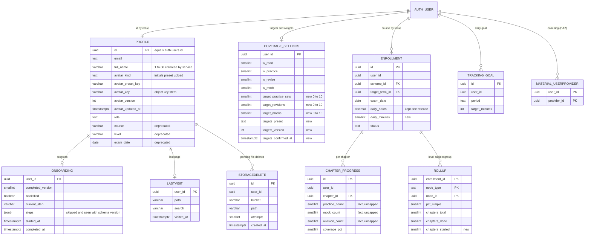
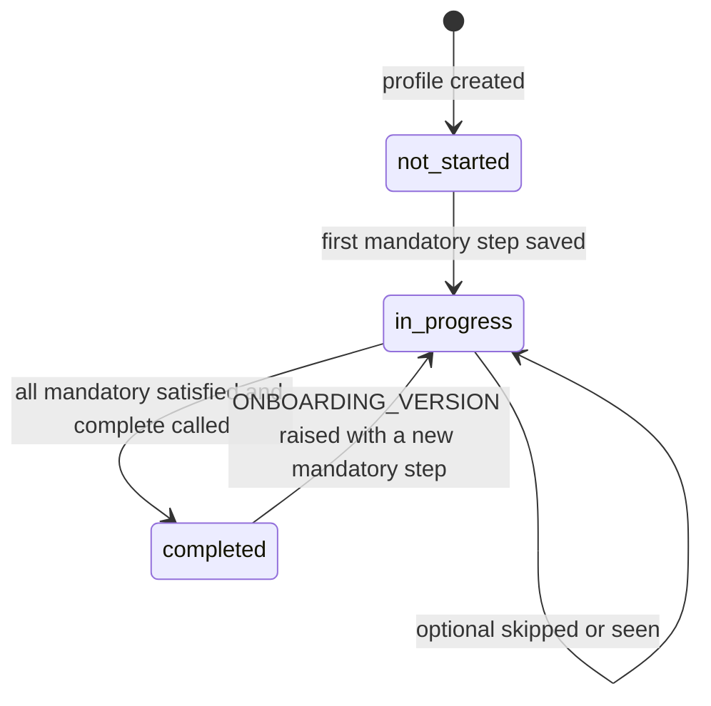

# ERD: F-16 Personalization, Onboarding, Profile and Workspace Home

| Field | Value |
| --- | --- |
| Linked PRD | `docs/product/prd/F-16-personalization-onboarding-profile.md` |
| Order | Seventeenth PRD/ERD, built before the practice-engine wave. Extends `docs/product/erd/F-02-syllabus-structure-and-coverage.md` (settings, enrolment, rollup), reads `docs/product/erd/F-01.2-time-tracker-and-analytics.md` (goal, streak) and registers into `docs/product/erd/F-12-institute-study-material.md` (coaching registry) |
| Django apps | `apps/api/modules/profiles` (owner: profile, avatar, onboarding, last visit, account export and erasure), `apps/api/modules/coverage` (additive: targets, `daily_minutes`, `chapters_started`, cap and gate rules) |
| Web module | `apps/web/src/modules/personalization` (new), with small additions to `layout`, `auth`, `coverage`, `courses`, `features`, `tracker`, `focus` and `packages/design-system` |
| Last updated | 2026-10-06 |

Reading guide: sections 0 and 3 are the contract; section 8 is the incremental migration; section 9 is the web plan and the test list.

## 0. Design decisions

1. **One module owns "the student", and it already exists.** `profiles` stays the owner of identity data (name, avatar), onboarding progress and last visit. It does **not** become the owner of coverage data: targets live in `coverage_settings` (already per student, already holds the weights 40/30/20/10 and the revision gaps, already recomputes percentages when changed) as three additive columns. The dependency direction is `profiles -> coverage` through services and selectors only (coverage never imports profiles), so the audit finding AUD-005 is not repeated.
2. **"The student's course" has one source of truth: the active F-02 enrolment** (`coverage_enrollment` joined to scheme, level, course, term). Today `profiles.course`, `profiles.level` and `profiles.exam_date` exist but nothing reads or writes them (the web never calls `/me/`). They are retired: read-only and derived in the API for one release, dropped later (expand and contract).
3. **Facts over flags for onboarding.** Each step declares `is_satisfied(user_id)` against the owning table. `profiles_onboarding` stores only order, skipped optional steps, timestamps and the `completed_version`. A stale flag can never mark someone complete with missing data.
4. **Targets are goals, counts are facts.** Counters (`practice_count`, `mock_count`, `revision_count`) and the ledger are never rewritten when targets change. The formula (already `min(1, count / target)`) and the display (`min(count, target)`) absorb the change. Cap and confidence rules are enforced server side under the chapter row lock, idempotent on `client_id`.
5. **Last visit is a separate narrow table**, not a column on `profiles`. It is the only write this feature makes on a timer-less event (tab hide), so it must not rewrite the wide `profiles` row (index maintenance, `updated_at`, vacuum churn), has a different retention (can be cleared at will), and can be upserted with HOT updates. One row per student.
6. **Avatars: two server-rendered WebP renditions in a public bucket with random immutable keys**, written only by Django with the service-role key. No dependence on Supabase image transformations (Pro plan, metered). Initials and preset avatars need no storage at all. A server function `avatar_urls(profile)` is the only place that turns a key into a URL, so moving to signed URLs later is a one-file change.
7. **Presets, route allow-list and onboarding steps are code, not tables.** They change with releases, need review, and have parity tests against shared JSON fixtures (the pattern `coverage/tests/fixtures/formula_cases.json` already uses). Coaching providers are data owned by F-12.
8. **Registries keep the module open for extension:** `register_onboarding_step` (F-12 adds `coaching`, F-13 may add a planner step), `register_eraser` and `register_exporter` (every module registers its `delete_all_for_user` and `export_for_user` once, closing AUD-004).
9. **Django is the only gateway.** No table here is reachable through the Supabase Data API; RLS is enabled with no policies by the existing post-migrate hook, and the RLS test lists `profiles` as a fifth app label.

## 1. Diagram



`user_id` columns reference `auth.users.id` by value (the convention of `profiles`, F-01.x and F-02). `TRACKING_GOAL` and `MATERIAL_USERPROVIDER` are shown for orientation; their definitions are in the F-01.2 and F-12 ERDs.

Onboarding lifecycle (derived from facts plus the stored version):



## 2. Tables

### 2.1 `profiles` (changes only; base table in `modules/profiles/models.py`, migrations 0001 and 0002)

| Column | Type | Null | Default | Notes |
| --- | --- | --- | --- | --- |
| id | uuid | no | | PK, equals `auth.users.id` (unchanged) |
| full_name | varchar(120) | no | `''` | Column unchanged; the service enforces 1 to 60 characters after trim, NFC, no control or bidi override characters. Longer legacy values are left alone and truncated only on the next edit |
| avatar_kind | varchar(8) | no | `initials` | check in (`initials`, `preset`, `upload`) |
| avatar_preset_key | varchar(24) | no | `''` | Key from the preset catalogue (`p01` to `p24`); empty unless kind is `preset` |
| avatar_key | varchar(120) | no | `''` | Object key stem `{user_id}/{token}`; renditions are `{stem}-512.webp` and `{stem}-128.webp`. Empty unless kind is `upload` |
| avatar_version | integer | no | 0 | Incremented on every avatar change; part of the web query key |
| avatar_updated_at | timestamptz | yes | | |
| avatar_url | varchar(200) | no | `''` | **Deprecated**: provider image URL copied from the JWT claims. Not served. Kept only as the source for the optional "Use my Google photo" action (R3) |
| course, level, exam_date | existing | | | **Deprecated**, no reader, no writer after S5; dropped in S14 + 2 releases |

Constraints: `profiles_avatar_kind_valid` (kind in the three values); `profiles_avatar_shape` (`kind = 'upload'` implies `avatar_key <> ''`, `kind = 'preset'` implies `avatar_preset_key <> ''`, `kind = 'initials'` implies both empty). Indexes: none new (all reads are by primary key).

### 2.2 `profiles_onboarding`

One row per student, created lazily by `get_or_create_onboarding` on the first `GET /me/` (race safe: `get_or_create` with `IntegrityError` retry).

| Column | Type | Null | Default | Notes |
| --- | --- | --- | --- | --- |
| user_id | uuid | no | | **PK**, by value |
| completed_version | smallint | no | 0 | Highest `ONBOARDING_VERSION` the student completed. 0 means never |
| backfilled | boolean | no | false | True when set by the migration (analytics and support can tell) |
| current_step | varchar(24) | no | `''` | Last step shown; resume hint only, never trusted |
| steps | jsonb | no | `{"v": 1, "items": {}}` | Only for steps that are not derived from facts: `{"items": {"avatar": {"state": "skipped", "at": "2026-10-06T10:02:11Z"}, "coaching": {"state": "seen", "at": "..."}}}`. `v` is the schema version of this document |
| started_at | timestamptz | yes | | First step saved |
| completed_at | timestamptz | yes | | Last completion |
| created_at, updated_at | timestamptz | no | now() | |

Constraints: `profiles_onboarding_version_range` (0 to 100); `profiles_onboarding_completed_pair` (`completed_at` is not null exactly when `completed_version > 0`). No secondary indexes (primary key access only). JSONB is justified: a small, schema-versioned bag keyed by step key that other modules extend through the registry without a migration.

### 2.3 `profiles_lastvisit`

| Column | Type | Null | Default | Notes |
| --- | --- | --- | --- | --- |
| user_id | uuid | no | | **PK** |
| path | varchar(300) | no | | Pathname only, validated against the allow-list (starts with `/app`, no `//`, no `..`, no control characters, no scheme or host) |
| search | varchar(200) | no | `''` | Query string without the leading `?`, only keys the route allow-list names (for example `range`), re-validated on restore |
| visited_at | timestamptz | no | | Client hide time clamped to server time (never in the future) |

Constraints: `profiles_lastvisit_path_app` (`path like '/app%'`). Table `fillfactor = 70` so repeated updates are HOT (no indexed column changes). Size: one row per active student, about 100 bytes; 100,000 students is 10 MB.

### 2.4 `profiles_storagedelete` (outbox for file deletions)

Rows exist only when an immediate Storage delete failed or a rollback needs cleanup. A `sweep_avatars` command (cron, daily) retries them and then removes the row. This is the small stand-in for `core/jobs` (F-06) until it exists; it moves there without a schema change to anything else.

| Column | Type | Null | Default | Notes |
| --- | --- | --- | --- | --- |
| id | uuid | no | gen | PK |
| user_id | uuid | no | | For account deletion and support |
| bucket | varchar(40) | no | `avatars` | |
| path | varchar(200) | no | | Full object path |
| attempts | smallint | no | 0 | Gives up and alerts (Sentry) after 8 |
| created_at | timestamptz | no | now() | |

Constraint: unique (`bucket`, `path`). Index: (`created_at`) for the sweep.

### 2.5 `coverage_settings` (additive; model `CoverageSettings`, PK `user_id`)

| Column | Type | Null | Default | Notes |
| --- | --- | --- | --- | --- |
| target_practice_sets | smallint | no | 1 | Per chapter, applies to every chapter of every paper. 0 means "not tracked" |
| target_revisions | smallint | no | 2 | |
| target_mocks | smallint | no | 1 | |
| targets_preset | varchar(10) | no | `custom` | `light`, `standard`, `intense`, `custom`. Derived and stored for display and analytics; recomputed from the numbers on save (if the numbers equal a preset, that preset) |
| targets_version | integer | no | 1 | Incremented on every change (ETag input, event idempotency) |
| targets_confirmed_at | timestamptz | yes | | Null until the student confirms in onboarding or settings; the `targets` onboarding step is satisfied only when set. Existing rows stay null, so they are asked once with their current values prefilled |

Constraints: `coverage_settings_targets_range` (each between 0 and 10), `coverage_settings_targets_preset_valid`. The defaults equal the values every student has today (1, 2, 1), so the deploy changes no percentage.

### 2.6 `coverage_enrollment` (additive)

| Column | Type | Null | Default | Notes |
| --- | --- | --- | --- | --- |
| daily_minutes | smallint | yes | | Planned study time per day. Check 15 to 960 when not null. Backfill `round(daily_hours * 60)`. `daily_hours` stays for one release (read for fallback, no longer written), then dropped (Q-F16-9) |

### 2.7 `coverage_rollup` (additive)

| Column | Type | Null | Default | Notes |
| --- | --- | --- | --- | --- |
| chapters_started | smallint | no | 0 | Included chapters with `coverage_pct > 0`, computed by `formula.rollup` next to `chapters_done`. The migration ends with a data step that runs `recompute_rollups` for every active enrolment (one row set per enrolment, a few dozen rows each), so no student sees a stale 0 |

### 2.8 Unchanged tables used by this feature

`syllabus_chapter.target_practice_sets`, `target_revisions`, `target_mocks`: **no longer read by coverage** after S2 (the student's targets apply). Kept so editors can later publish a "suggested" value (Q-F16-2); a comment on the model says so. `coverage_chapterprogress` counters and `coverage_event` are untouched. `tracking_goal` (F-01.2) receives one daily goal through `tracking.services.set_goal` when the hours step ticks "Use as my daily goal" and no goal exists. `material_userprovider` (F-12) receives the coaching step through `material.services.set_followed_providers` `[PROPOSED: F-12]`.

### 2.9 Code-defined reference data (not tables)

| Name | Where | Content |
| --- | --- | --- |
| `ONBOARDING_VERSION` and step specs | `profiles/domain/onboarding.py` | `StepSpec(key, mandatory, since, available, is_satisfied, apply, serializer)`; initial: `profile`, `course`, `hours`, `targets` (mandatory), `catchup`, `coaching`, `avatar` (optional); required version 2 |
| Target presets | `coverage/domain/targets.py` | `{"light": (1, 1, 1), "standard": (2, 2, 2), "intense": (3, 3, 3)}` `[CALIBRATE]`; returned by `GET /coverage/settings/` |
| Avatar preset keys | `profiles/domain/avatars.py` and `packages/design-system/src/avatars/manifest.json` | `p01` to `p24`; a parity test compares the two |
| Restorable routes | `profiles/domain/restorable.py` and `apps/web/src/modules/personalization/lib/restorable.ts` | Same list, parity-tested through `profiles/tests/fixtures/restorable_cases.json` (accept and reject cases) |
| Avatar tokens | `packages/design-system/src/theme` | `--avatar-1` to `--avatar-8` (+ foreground), checked by `check:contrast` |

## 3. Relationships to existing modules

**Provides (public service and selector interfaces)**

| Interface | Signature | Used by |
| --- | --- | --- |
| `profiles.selectors.bootstrap` | `(user_id) -> Bootstrap` (profile, avatar, onboarding summary, course summary, last visit) | `GET /me/`; F-13 Today and F-10 can read the same course summary |
| `profiles.selectors.display_names` | `(user_ids) -> dict[uuid, str]` | Future mentor and share features |
| `profiles.services.update_name` / `set_avatar_upload` / `set_avatar_preset` / `remove_avatar` | `(user_id, ...) -> Profile` | Account endpoints |
| `profiles.services.save_step` / `skip_step` / `complete_onboarding` | `(user_id, key, data) -> OnboardingState` | Onboarding endpoints |
| `profiles.registry.register_onboarding_step(spec)` | at app `ready()` | F-12 (`coaching`), F-13 (optional planner step), X-01 (notification consent step) |
| `profiles.registry.register_eraser(name, fn)` and `register_exporter(name, fn)` | `fn(user_id) -> dict` | Every module with user data (coverage, tracking, focus, F-06, F-10, F-12, F-15, F-03) closes AUD-004 |
| `profiles.services.delete_account` / `export_account` | `(user_id)` | `DELETE /me/`, `GET /me/export/` |
| `coverage.selectors.get_targets` / `coverage.services.update_targets` | `(user_id) -> Targets`, `(user_id, practice_sets, revisions, mocks, preset)` | Settings, onboarding, F-05 and F-08 (read the denominators) |
| `coverage.domain.targets.can_log` / `confidence_allowed` | pure | Coverage services, unit-tested |

**Consumes**

| Dependency | How |
| --- | --- |
| F-02 coverage | `create_enrollment`, `switch_scheme`, `update_enrollment`, `catchup`, `selectors.course_summary` (new, read-only: course, level, term, exam date, days remaining, `daily_minutes`), `get_or_create_settings`; never coverage models |
| F-02 syllabus | only through coverage (the course step reuses the existing `syllabus` list and terms endpoints in the web) |
| F-01.2 tracking | `tracking.services.set_goal` (daily goal), `tracking.selectors.today_summary` and `streak` for the workspace home (web calls the existing endpoints; no API aggregation in R1) |
| F-01.1 focus | web `LiveMiniTimer` state for "Resume timer" |
| F-12 material | `[PROPOSED: F-12]` `material.services.set_followed_providers(user_id, provider_ids, other_names)` and `material.selectors.list_providers(course)`; `material_userprovider` is the owner of the registry |
| `core.feature_flags` | `flag_enabled(name, user_id)` for `personalization`, `profile_avatar`, `study_targets` |
| Supabase | Storage REST (service role) for `avatars`; Auth Admin API to delete the user; JWT claims for the first name and `amr` |

**Events**

| Emitted (domain, `[PROPOSED: core/events]` outbox; until it exists a synchronous `register_subscriber` list in `profiles.registry`) | Payload | Consumers |
| --- | --- | --- |
| `onboarding_completed` | user_id, version, course, level, targets preset | F-13 (first plan reveal), X-01 (welcome), analytics |
| `profile_updated` | user_id, fields | none yet |
| `study_targets_changed` | user_id, old, new, version | F-10 (readiness uses targets), F-13 |
| `account_deleted` | user_id (hashed) | analytics only |

Consumes: `practice_session_completed` (F-06) and tracking events are untouched; they continue to call `coverage.services.record_event` with `source != manual`, which the cap deliberately does not block.

## 4. Enumerations and reference data

| Enumeration | Values | Where enforced |
| --- | --- | --- |
| `avatar_kind` | `initials`, `preset`, `upload` | DB check, serializer |
| `onboarding step key` | `profile`, `course`, `hours`, `targets`, `catchup`, `coaching`, `avatar` | Registry; unknown key 404 |
| `step state` (derived in the API) | `todo`, `done`, `skipped`, `unavailable` | `profiles/domain/onboarding.py` |
| `targets_preset` | `light`, `standard`, `intense`, `custom` | DB check |
| Error codes (new) | `target_reached` (409), `activity_not_tracked` (409), `confidence_locked` (409), `onboarding_incomplete` (409), `step_mandatory` (409), `invalid_image`, `image_too_large`, `image_too_small` (400), `unknown_preset` (400), `path_not_restorable` (400), `payload_too_large` (413), `reauth_required` (401), `confirmation_required` (400), `field_read_only` (400), `feature_disabled` (403) | Exception classes with their own `default_code`, because `core.exceptions.api_exception_handler` takes the code from the exception class (a plain `ValidationError` always reads `invalid`) |

Maintainers: onboarding steps, presets and routes are code (reviewed in PRs); avatar artwork is design-system; coaching providers are F-12 editors.

## 5. Query patterns

| # | Pattern | Frequency | Design answer |
| --- | --- | --- | --- |
| 5.1 | Bootstrap `GET /me/`: profile by pk, onboarding by pk, last visit by pk, active enrolment with scheme, level, course, term (one `select_related`), settings by pk | Once per page load of the SPA (cached 60 s client side, ETag) | 5 PK or single-join queries, no scans; `assertNumQueries(5)` test |
| 5.2 | Onboarding `is_satisfied` checks (name, active enrolment exists, `daily_minutes` set, `targets_confirmed_at` set) | Same request as 5.1 | Reuse rows already loaded by 5.1 (the selector passes them in), no extra queries |
| 5.3 | Save step: one transaction that calls the owner's service and updates `profiles_onboarding.steps` | Per step, about 7 per student, ever | Row lock on the onboarding row (`select_for_update`) so two tabs serialise |
| 5.4 | Last visit upsert: `UPDATE profiles_lastvisit SET ... WHERE user_id = :u AND NOT (path = :p AND visited_at > now() - interval '60 seconds')`; if zero rows and none exists then `INSERT` (ignore `IntegrityError`) | At most once per tab hide, client-deduplicated; server skip rule bounds it | PK only, HOT update, 20 per minute throttle |
| 5.5 | Cap check inside `record_event`: lock the chapter progress row, read the counter and the student's target, compare | Per manual log | Row lock on `coverage_chapterprogress` (unique `user_id, chapter`), counters are on the row, settings by pk; no ledger scan |
| 5.6 | Change targets: update settings, then `_recompute_enrollment` (bulk update of all chapter rows and a rollup rebuild) | Rare (a few times per student) | One transaction, one `bulk_update`; about 400 chapters worst case (CA), measured target under 400 ms; advisory lock on the user for the transaction |
| 5.7 | Workspace widgets (existing endpoints): `coverage/overview` (rollups), `coverage/due` (partial index `coverage_cp_due_idx`), tracker today summary and streak (daily rollups), most recent chapter (`coverage_cp_recent_idx` on `user_id, -last_studied_at`, limit 1) | Per dashboard view, parallel | All indexed already; no new index. R2 candidate: `GET /me/home/` composite if p95 exceeds 500 ms |
| 5.8 | Account export and deletion | Rare | Registry order; each eraser idempotent; deletion by `user_id` uses existing user indexes; storage by prefix `{user_id}/` |
| 5.9 | Support query for the "25% with 0 chapters done" case (read only) | Manual | See below |

Query 5.9 (also run by the new regression test on a fixture):

```sql
select count(*)                                              as chapters,
       count(*) filter (where coverage_pct > 0)              as started,
       count(*) filter (where coverage_pct >= 100
                           or status = 'exam_ready')         as completed,
       count(*) filter (where read_pct = 100)                as fully_read,
       round(avg(coverage_pct) filter (where not is_excluded)) as average_pct
from coverage_chapterprogress
where user_id = :user_id and enrollment_id = :enrollment_id;
```

Expected for the reported case: `started` about 60, `completed` 0, `fully_read` about 60, `average_pct` 25 (each fully read chapter is worth the reading weight, 40, so 60 of 119 chapters times 40 is about 20 to 25). If `fully_read` is 0 and the average is still 25, the rollup is stale: run `python manage.py rebuild_coverage`.

### 5.10 Cap and gate algorithm (coverage service, replaces the unlocked path)

```python
@transaction.atomic
def record_event(user_id, chapter_id, type, value=None, source=MANUAL, client_id=None, *, occurred_at=None, payload=None, ...):
    chapter, enrollment = resolve(user_id, chapter_id)                  # syllabus via its selectors
    progress = lock_progress(enrollment, chapter.id)                    # SELECT ... FOR UPDATE (also fixes AUD-001 here)
    if client_id and (existing := event_by_client_id(user_id, client_id)):
        return RecordResult(existing, created=False)                    # 200: replay beats the cap
    if source == MANUAL and type in CAPPED_TYPES:                       # practice_done, mock_done, revision_done
        settings = get_or_create_settings(user_id)
        decision = targets.can_log(type, count=counter(progress, type), add=int(payload.get("count", 1)),
                                   target=target_for(settings, type))   # pure, unit-tested
        if decision is Decision.NOT_TRACKED: raise ActivityNotTracked(type)
        if decision is Decision.AT_TARGET:   raise TargetReached(type, target, count)
    event = append_event(...); apply_event(progress, ...); settle(enrollment, [progress])
    return RecordResult(event, created=True)                            # 201
```

`can_log` rule: target 0 gives `NOT_TRACKED`; `count + add > target` gives `AT_TARGET` (a request that would exceed, including `count` greater than 1, is refused whole, not clipped); otherwise `OK`. The view returns 201 for `created=True` and 200 otherwise (today it always answers 201). Confidence:

```python
def set_confidence(user_id, chapter_id, rating):
    progress = lock_progress(...)
    if rating and not targets.confidence_allowed(progress.coverage_pct):    # coverage_pct >= 50
        raise ConfidenceLocked(required=50, current=progress.coverage_pct)  # 409, details {required, current}
    ...                                                                     # clearing (None or "") is always allowed
```

Serializer change: each component exposes `done = min(count, target)`, `target`, `logged = count`; the web shows `logged` only when it is above `target`.

### 5.11 Onboarding resolution (pure, in `profiles/domain/onboarding.py`)

```python
def resolve(steps, facts, stored, required_version):
    # steps: registered StepSpec list; facts: callables bound to user_id; stored: ONBOARDING row
    active = [s for s in steps if s.available() and s.since <= required_version]
    todo = [s for s in active if s.mandatory and not s.is_satisfied()]
    optional = [s for s in active if not s.mandatory and stored.state(s.key) is None]
    status = "completed" if not todo and stored.completed_version >= required_version else \
             "not_started" if stored.started_at is None and todo else "in_progress"
    return State(status, next_step=(todo or optional or [None])[0], missing=[s.key for s in todo])
```

A student with every mandatory step satisfied but `completed_version < required_version` is `in_progress` with `next_step = None` and `missing = []`: the web calls `POST complete` silently (this is exactly the backfilled-user case after a version bump that added no mandatory step) and does not show onboarding.

## 6. Storage

| Item | Value |
| --- | --- |
| Bucket | `avatars`, **public** read, no insert, update or delete policies (only the service role writes). Bucket limits: `file_size_limit` 1 MB, `allowed_mime_types` `image/webp` |
| Path | `{user_id}/{token}-512.webp` and `{user_id}/{token}-128.webp`; `token = secrets.token_urlsafe(16)` (128 bits), new on every upload, so URLs are immutable and unguessable; the `user_id` prefix makes prefix deletion at account deletion trivial |
| Headers on upload | `cache-control: public, max-age=31536000, immutable`, `content-type: image/webp`, `x-upsert: false` |
| Size | Typical 20 to 60 KB (512) and 3 to 8 KB (128). Hard cap at the API 1 MB (input) and at the bucket 1 MB. Per student at most 2 live objects |
| Retention | Deleted on remove, on replace and on account deletion. Failed deletes go to `profiles_storagedelete` and are retried daily; backups of the storage layer roll off in the provider's window (documented in the privacy notice, 35 days assumed `[VERIFY]`) |
| URL policy | `avatar_urls(profile)` returns `{"small": ..., "large": ...}` built from `SUPABASE_URL` and the key (public URL form). Decision Q-F16-4; switching to signed URLs (TTL 1 h, regenerated per `/me/`) changes only this function and adds the cache cost of an unstable URL |
| Transformations | Not used (Pro plan only, 100 included per month, 25 MB, 50 MP limits). We render the two sizes at upload time |
| Upload path | Browser to Django (multipart, at most 1 MB, well under the Vercel function body limit `[VERIFY]` about 4.5 MB), Django to Storage with the service-role key. The browser never holds a Storage credential and never uploads directly |
| Pipeline (server) | 1. size check on the stream (413 above 1 MB). 2. `Image.open` with warnings as errors (`DecompressionBombWarning`), format in JPEG, PNG, WebP (SVG, GIF animation, HEIC and TIFF refused), `n_frames == 1`. 3. pixel cap 25 MP. 4. `ImageOps.exif_transpose`. 5. reject short side under 128 px. 6. center-crop to square if the ratio differs by more than 1%. 7. convert to sRGB RGB, flatten transparency on the theme-neutral colour. 8. resize with Lanczos to 512 and 128. 9. save WebP quality 82, `method=4`, **no `exif`, `icc_profile` or `xmp` arguments**, so no metadata survives. 10. upload both, update the row (version + 1, kind `upload`, new key), commit, then delete the old pair. 11. any failure after step 10's first upload queues deletes of the new objects |

Presets are static SVGs in the design-system bundle: no storage, no request, no retention.

## 7. Security

- **Access path:** browser, then Django, then Postgres and Storage. The Supabase Data API stays disabled for every table. RLS is enabled with no policies on `profiles_onboarding`, `profiles_lastvisit` and `profiles_storagedelete` by the existing post-migrate hook; `core/tests/test_row_level_security.py` adds `profiles` to `APP_LABELS` and asserts `relrowsecurity` on each table (Postgres CI).
- **Scoping:** every selector and service takes `user_id` from the verified JWT; no endpoint accepts `user_id`; avatar keys are derived server side and never taken from input; `PUT /me/avatar/preset/` checks the key against the catalogue.
- **Service-role key:** new API-only secret `SUPABASE_SERVICE_ROLE_KEY` (Storage writes, Auth Admin delete). Added to `docs/SETUP.md`, never `VITE_*`, never logged; the storage client lives in `core/storage.py` so `media` (F-06) adopts it.
- **Beacon authentication (last visit).** `navigator.sendBeacon` cannot set an `Authorization` header, so the web sends `text/plain` `{"t": "<access token>", "path": "...", "search": "..."}` (a CORS-safelisted request, no preflight). Only `LastVisitView` lists a second authentication class, `BeaconBodyAuthentication`, that reads `t` from the body and verifies it with the same `decode_token`. The body is never logged: Sentry `before_send` drops request bodies for this path (this closes the AUD-020 gap for this endpoint). Token replay risk equals a bearer token's and is bounded by its 1 h expiry. If `sendBeacon` returns false the web uses `fetch(..., {keepalive: true})` with the normal header. The web keeps the current access token in a ref updated by `onAuthStateChange` because `getSession()` is asynchronous and cannot run during `pagehide`.
- **Input validation:** name rules (2.1); path allow-list server and client with the same fixtures; body at most 1 KB (413); onboarding payloads by per-step DRF serializers (reusing the coverage serializers); image pipeline in section 6.
- **Open redirect:** the destination function only emits paths that pass `safeNextPath` and the restorable allow-list.
- **Abuse:** throttle scopes `profile_write` 30/min, `avatar_write` 10/hour, `lastvisit_write` 20/min, `onboarding_write` 60/min, `account_export` 3/hour, `account_delete` 3/day; Pillow runs only after the size and stream checks; worker memory is bounded by the platform; uploads need a verified email (always true after the confirmation flow).
- **Account deletion:** `DELETE /me/` needs `{confirm: "DELETE"}` and a recent authentication: the JWT `amr` entry with a timestamp within 10 minutes `[VERIFY the claim in the project's tokens]`; otherwise 401 `reauth_required`, and the web runs the existing emailed-code reauthentication (`sendReauthCode`). Sequence: registered erasers in reverse dependency order (each idempotent and reporting counts), delete storage prefix, delete `profiles_*` rows, delete the Supabase user through the Auth Admin API, then queue a PostHog person deletion `[PROPOSED]`. A failure returns 500 `deletion_incomplete` with the done steps; the call can be repeated safely.
- **PII classification:** name, email, photo (personal; possibly a minor's image), exam date, planned study time, coaching claims (personal, commercial relationship), last visited path (behavioural, low), targets (low). Not collected: date of birth, phone, address, government ids. Photo visible only to the owner in this release.
- **Retention and export:** data is kept until the student deletes it or the account. `GET /me/export/` returns profile, onboarding, last visit, targets, and each module's export (registry), plus the avatar URL. Backfilled and sample rows contain no extra personal data.
- **Content safety:** no image moderation in this release because no one else can see the image. Before any sharing feature, add report and takedown and a nudity/violence classifier `[PROPOSED]`.

## 8. Migration and rollout

Principles: additive first (expand), switch readers, then remove (contract). Run with `DIRECT_DATABASE_URL`; follow the F-01.2 notes (constraints `NOT VALID` then `VALIDATE`; concurrent indexes if ever added).

| Step | Migration or change | Notes |
| --- | --- | --- |
| 1 | `coverage.0003_targets_minutes_started`: `coverage_settings` target columns, preset, version, confirmed; `coverage_enrollment.daily_minutes`; `coverage_rollup.chapters_started`; data step: `daily_minutes = round(daily_hours * 60)`; `recompute_rollups` for active enrolments | All defaults equal today's behaviour (1, 2, 1). Reversible (drop columns). Shipped with S1/S2 |
| 2 | S1 code (no schema): cap, gate, display, wording | Not flagged: bug fixes |
| 3 | `profiles.0003_profile_personalization`: avatar columns and checks; `profiles_onboarding`, `profiles_lastvisit`, `profiles_storagedelete` with `fillfactor` on lastvisit | `ALTER TABLE ... ADD COLUMN ... NOT NULL DEFAULT` is metadata-only on Postgres 11+, no rewrite |
| 4 | `profiles.0004_backfill_onboarding` (data, idempotent, reversible): for each profile with an active enrolment insert `completed_version = 1, backfilled = true, completed_at = now()`; profiles without an enrolment get no row (created lazily with 0). Batches of 1,000 by primary key | Test dataset: user with enrolment, user with profile only, user with neither |
| 5 | Storage: create bucket `avatars` (public, 1 MB, `image/webp`) by `supabase/config.toml` `[storage.buckets.avatars]` and the production dashboard; add `SUPABASE_SERVICE_ROLE_KEY` to the API project | Documented in SETUP.md and `docs/F-16-ROLLOUT.md` |
| 6 | Stop writing `profiles.course/level/exam_date` (serializer read-only, `field_read_only`) | Web never used them |
| 7 | Flags on in order: `study_targets` (internal), `profile_avatar`, `personalization` (5%, 25%, 100%) | Gate last: it is the change students notice |
| 8 | Contract (S14 plus two releases): drop `profiles.course`, `level`, `exam_date`, `avatar_url` if unused, and `coverage_enrollment.daily_hours` | Separate PR, after confirming no reader (grep and logs) |

Zero-downtime notes: old web builds that call `POST /coverage/events/` keep working (the new 409 codes are additive; their error handling shows the server message). Old API instances ignore the new columns. The web bootstrap treats a missing `onboarding` object as "complete" so a web deploy before the API deploy cannot trap students.

Expected volumes (assumptions): 100,000 registered students, 30,000 weekly active; `/me/` 3 loads per student per day is about 1 request per second average, 20 peak; last-visit writes about 2 per student per day (about 60,000 per day, under 1 per second); avatar uploads about 0.3 per student ever (30,000 objects, 4 GB incl. renditions at 150 KB); onboarding writes about 7 per new student. One Postgres handles all of this; nothing is partitioned.

Rollback: each step is reversible; the gate is a flag, so it can be switched off without a deploy. Dropping the new tables loses only onboarding progress (recomputed from facts), last visit and the avatar pointer (objects remain until the sweep).

### Forward compatibility

| Later need | How this design supports it |
| --- | --- |
| Avatars visible to others, mentors | `avatar_urls` is the single seam; add visibility column and moderation; signed URLs |
| Per-subject targets | New table `coverage_targetoverride (user_id, subject_key, target_*)`; `target_for(settings, chapter)` is already the only lookup |
| F-13 Today planner step | `register_onboarding_step` (optional step) |
| X-01 notification consent step | Same registry; `since = 3` mandatory only if legal requires |
| Other languages | Names are NFC text; initials use grapheme segmentation |
| Importing Google photo | `avatar_url` already holds the claim; server fetch, re-encode, same pipeline |
| Locale or time zone preference | `tracking_trackersettings.tz` stays the owner; onboarding can add an optional step |

## 9. Web module plan, build structure and tests

### 9.1 `apps/web/src/modules/personalization` (new; barrel `index.ts`)

```
lib/        destination.ts       resolvePostAuthDestination(bootstrap, next, lastVisit, now)   pure, tested
            restorable.ts        isRestorable(path, search)  (fixture parity with the API)
            lastVisit.ts         hide handlers, dedupe, sendBeacon then keepalive fetch, localStorage copy keyed by user id
            landingBypass.ts     builds the inline pre-paint script for `/` (reads the Supabase session key)
            initials.ts          grapheme-aware initials and colour index (hash of user id)
            onboardingSteps.ts   step list, order, copy, URL <-> step mapping
            api.ts, keys.ts, types.ts (zod schemas for /me/ and onboarding)
hooks/      useBootstrap, useOnboarding, useProfileMutations, useLastVisitReporter
containers/ RequireOnboarded, OnboardingContainer, ProfileSection, WorkspaceHomeContainer, CourseScopeContainer
components/ steps/ProfileStep, CourseStep (wraps coverage step components), HoursStep, TargetsStep, CatchupStep, CoachingStep, AvatarStep,
            WorkspaceHome sections: GreetingStrip, TodayCard, ContinueCard, DueCard, ProgressCard, FinishSetupCard, ToolsList
```

Existing modules change as follows (barrel exports only): `coverage` exports `CourseLevelStep`, `TermStep`, `ElectiveStep`, `CatchupStep` and the new `StudyTargetsForm`; the old `OnboardingContainer` stays behind the flag until S10 removes it. `layout` uses `useBootstrap` for the header avatar and name and drops `WorkspaceHome`. `courses` and `features` read `useBootstrap` through the barrel to scope. `auth` is unchanged except that its containers route through `resolvePostAuthDestination` supplied by the route (auth must not import personalization). Routes stay thin: `app.tsx` mounts `RequireAuth` then `RequireOnboarded`; `index.tsx` adds the bypass script and `LandingRedirect`.

### 9.2 `apps/api/modules/profiles` (extended)

```
models.py            Profile (+columns), Onboarding, LastVisit, StorageDelete
domain/              names.py, avatars.py, onboarding.py, restorable.py, images.py (Pillow, pure over bytes), registry.py
services/            profile.py, avatar.py, onboarding.py, lastvisit.py, account.py       (writes)
selectors.py         bootstrap, get_onboarding, last_visit                                  (reads)
serializers.py       profile, avatar, onboarding step payloads, beacon body
views.py, urls.py    thin
management/commands/ sweep_avatars.py, backfill_onboarding.py
tests/               fixtures/restorable_cases.json, fixtures/images/ (jpeg with exif, png bomb, animated gif, svg, truncated)
core/storage.py      Supabase Storage REST client (shared)
core/authentication.py  BeaconBodyAuthentication
```

### 9.3 Tests

| Layer | Tests |
| --- | --- |
| Pure (Python) | `can_log` truth table (target 0, 1, 3, add 1 and 2); `confidence_allowed` boundaries 49, 50; onboarding `resolve` for new, partial, backfilled, version bump; name normalisation corpus (spaces, NFC, Devanagari, bidi override, emoji); restorable cases; image pipeline (EXIF removed, orientation applied, bomb refused, animated refused, SVG refused, under 128 px refused, non-square cropped, output under 1 MB); preset parity |
| Pure (TypeScript) | `resolvePostAuthDestination` (matrix: gate, deep link, last visit fresh and stale, unsafe `next`); `isRestorable`; `initials` (Latin, Devanagari, single name, empty, email fallback); `toHm` and `fromHm` (0, 59, 60, 125, max); formula mirror with the user-targets fixture; toast catalogue keys all exist |
| API endpoints | Every endpoint in PRD section 9: 401 unauthenticated, 403 flag off, 404 foreign ids, validation errors, throttles (`avatar_write`, `lastvisit_write`), idempotent replays, `assertNumQueries` on `/me/`; coverage: `target_reached`, `activity_not_tracked`, replay returns 200, lowering and raising targets recompute, `chapters_started`, `confidence_locked` and clear allowed |
| Concurrency (Postgres, skipped on SQLite like the existing ones) | Two parallel manual logs at 2 of 3 give one 201 and one 409; two parallel `complete` calls; two tabs saving the same step; upload racing remove |
| Contract | `formula_cases.json` extended (targets 0, per-student targets, count above target); `restorable_cases.json`; avatar preset manifest parity; error code list parity between API and web `errors.ts` |
| Web component | `DurationField` (typing, carry, keyboard, min and max messages), `ImageCropDialog` (keyboard zoom and move, cancel), `Celebration` (no canvas under reduced motion), `RequireOnboarded` (gate, loading, error, completed cache), onboarding steps (resume, skip, back), Log form disabled states, Confidence disabled hint, toast roles |
| E2E happy paths (Playwright, mock auth) | New Google user to onboarding to workspace; email code signup to onboarding; mid-flow close and resume; existing user v2 prompt; avatar upload crop remove; lower targets then log blocked; tab hide then sign in restores page; landing redirect for signed-in; signed-out SSR HTML snapshot unchanged for `/`, `/courses`, `/features` |
| Accessibility | axe on every step, dialog and the dashboard in four themes; keyboard-only run through onboarding and the crop dialog; reduced-motion run; 320 px overflow check; contrast check for avatar tokens (`check:contrast`) |
| Load-sensitive | `/me/` query count and timing; `update_targets` on a 400-chapter fixture under 400 ms; upload of a 1 MB image under 1.5 s server time |
