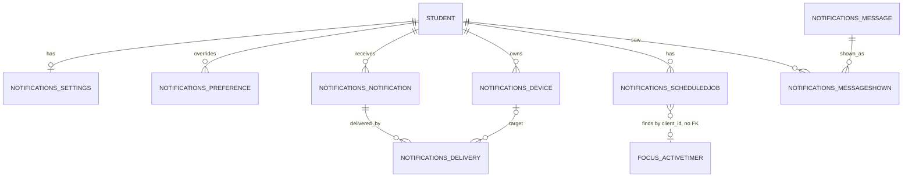

# X-01 Notifications, F-01.3 Floating Timer, F-01.4 Keep Awake: ERD

| | |
| --- | --- |
| Status | Approved 2026-10-06 |
| Companion document | [PRD](../prd/X-01-notifications-floating-timer-stay-awake.md) |
| Module | New Django module `notifications`; five new columns in `focus` |

## Overview

One new Django module, `notifications`, owns nine tables. The `focus` module gets five new settings columns. No timer, session or syllabus data is copied: notifications refer to timers by `client_id` and to courses through the existing taxonomy. All user data is keyed by the Supabase user id (`user_id uuid`), and Django is the only writer, as everywhere else.

Action tokens (`notifications_actiontoken`, phase 4) are not drawn.

Read it from the student outwards: settings, preferences, devices and notifications belong to one student, deliveries link a notification to a device, and jobs find timers by `client_id`.

### Entities and their rules

| Entity (table) | Purpose | Key columns | Keys and indexes |
| --- | --- | --- | --- |
| `notifications_settings` | One row per student: master switch, quiet hours, daily nudge, permission state | `user_id` PK, `push_master` bool, `timezone`, `quiet_enabled`, `quiet_start` time (22:00), `quiet_end` time (07:00), `nudge_enabled`, `nudge_time` (10:00), `nudge_tone`, `next_nudge_at` timestamptz, `permission_state`, `permission_decided_at`, `permission_ask_count`, `last_asked_at`, `thought_shown_on` date | Index on `next_nudge_at` where `nudge_enabled`. `permission_state` is one of not\_asked, pre\_prompt\_shown, granted, denied, dismissed, unsupported |
| `notifications_preference` | Sparse overrides of the code defaults, one row only when a student changes a switch | `id`, `user_id`, `category`, `channel` (push, email, inbox), `enabled` | Unique (`user_id`, `category`, `channel`) |
| `notifications_device` | A place a student can be reached: a browser or installed app (Web Push) or the desktop companion | `id`, `user_id`, `kind` (web\_push, desktop\_app), `endpoint` null, `p256dh` null, `auth_secret` null, `platform`, `browser`, `display_mode` (browser, standalone, app), `label`, `app_version`, `created_at`, `last_seen_at`, `last_success_at`, `last_failure_at`, `consecutive_failures`, `revoked_at`, `revoked_reason` | Unique `endpoint` where not null. Index (`user_id`) where `revoked_at` is null. Endpoint and keys are secrets (below) |
| `notifications_notification` | What we decided to tell the student; also the in-app inbox | `id`, `user_id`, `category`, `event`, `dedupe_key`, `title`, `body`, `deep_link` (relative path only), `tag`, `priority` (0 exempt to 3 low), `payload` jsonb, `created_at`, `read_at`, `expires_at` | Unique (`user_id`, `dedupe_key`). Index (`user_id`, `created_at` desc). Partial index on unread (`user_id`) where `read_at` is null |
| `notifications_delivery` | One attempt per notification, channel and device, including the ones we chose not to send | `id`, `notification_id` FK cascade, `device_id` FK set null, `channel`, `status` (queued, sent, failed, suppressed), `suppress_reason` (quiet\_hours, cap, preference, no\_device, stale, visited\_today), `http_status`, `error`, `attempt`, `attempted_at`, `sent_at`, `clicked_at` | Index (`notification_id`). Index (`status`, `attempted_at`) |
| `notifications_scheduledjob` | A planned send: timer end, long stopwatch, digest, streak check, nudge, exam milestone | `id`, `user_id`, `kind`, `subject_key` (timer `client_id` or a date), `fire_at`, `expected_version` null, `status` (pending, fired, skipped, cancelled, failed), `external_id` null (queue message id), `attempts`, `fired_at`, `created_at` | Unique (`user_id`, `kind`, `subject_key`, `expected_version`). Index (`status`, `fire_at`) |
| `notifications_actiontoken` | One-time permission for a notification button to act on a timer without a sign-in (P2) | `id`, `user_id`, `timer_client_id`, `action` (pause, resume, extend, start\_break), `token_hash` char 64, `expires_at`, `used_at` | Unique `token_hash`. Index `expires_at` |
| `notifications_message` and `notifications_messageshown` | The motivation library (edited in admin) and which message a student saw on which day | message: `id`, `body`, `attribution` null, `course` FK null and `level` null (existing taxonomy), `tone`, `phase` (far, near, final\_week, exam\_day, any), `status` (draft, published, retired), `locale`, `published_at`. Shown: `user_id`, `message_id` FK, `shown_on` date, `channel` | Shown: unique (`user_id`, `shown_on`) so one message a day is shared by the in-app card and the push; index (`user_id`, `message_id`) for the 60-day no-repeat rule |

### Changes to existing tables

| Table | Change | Why |
| --- | --- | --- |
| `focus_focussettings` | Add `keep_awake` bool default true, `keep_awake_in_breaks` bool default false, `popout_on_start` bool default false, `popout_size` (pill, card) default pill, `popout_prompt_seen` bool default false | Per-account behaviour that follows the student across devices. Safe migration: nullable-free columns with defaults |
| `focus_focussettings.notifications_enabled` | Read once by a data migration that writes the matching `notifications_preference` rows, then ignored and removed in a later release | One place for alert preferences (DRY). The two-step removal avoids a risky same-release drop |
| Onboarding registry (F-16, `profiles`) | Register step `alerts` with `since = 3`. No new table: `is_satisfied` reads `notifications_settings.permission_decided_at` or `permission_state = unsupported` | F-16's rule: facts over flags |

### Relationships

A student has one settings row, many preferences, many devices, many notifications and many scheduled jobs. A notification has many deliveries, and each delivery points to at most one device. A shown message points to one library message. A scheduled job names a timer by its `client_id` but has no foreign key to `focus_activetimer`, because that row is deleted when the timer ends and the job must be able to find that out and skip.

### Privacy, security and retention

- **Secrets.** `endpoint`, `p256dh` and `auth_secret` let anyone send a push to a device. They are encrypted at rest at the field level, never returned by any API, and left out of the account export (the export lists device label, platform and dates).
- **Row Level Security.** Enabled on every table. The only student-facing policy is read-own on `notifications_notification` (`user_id = auth.uid()`), so Supabase Realtime can update the bell. All writes go through Django.
- **Deep links** are stored as relative paths and checked against an allow-list of route prefixes, so a notification can never send a student to another site.
- **Erase and export.** The module registers one eraser and one exporter in `core.registry`, so account delete and export include it automatically.
- **Retention.** Deliveries 90 days. Notifications 180 days (the inbox shows the last 50). Fired or cancelled jobs 30 days. Revoked devices 30 days. Used or expired action tokens one day.

### Migration order

1. Create `notifications` tables and indexes.
2. Add the `focus_focussettings` columns.
3. Data migration for `notifications_enabled`, idempotent.
4. Backfill `notifications_settings` lazily on first read, not in the migration, so the deploy stays fast.
5. Load the starter message library as drafts (`manage.py load_motivation_seed`), published only after an editor review, matching how syllabus seeds work.
