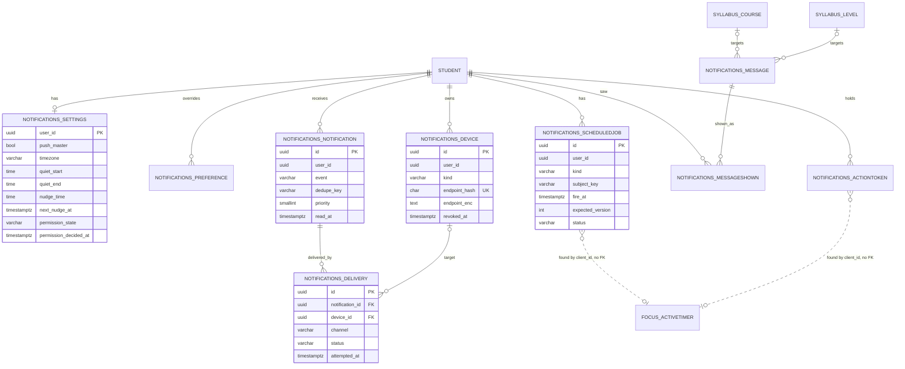

# ERD: X-01.1 Push Notifications

| Field | Value |
| --- | --- |
| Linked PRD | `docs/product/prd/X-01.1-push-notifications.md` |
| Django app | `apps/api/modules/notifications` (new); two small additive migrations in `apps/api/modules/focus` |
| Web module | `apps/web/src/modules/notifications` (new) |
| Status | Draft for founder review (2026-10-06) |
| Last updated | 2026-10-06 |
| Supersedes | The `notifications_*` tables in `erd/X-01-notifications-floating-timer-stay-awake.md` for build purposes (that document stays the source for floating timer and keep awake) |

## 0. Overview and what changed from the approved ERD

One new Django module owns eight tables in P2 and P3 (plus one more for Android buttons). It owns no timer, session or syllabus data: it refers to timers by `client_id` and to courses through the existing taxonomy. Every user row is keyed by the Supabase user id (`user_id uuid`, no cross-schema foreign key) and Django is the only writer.

Changes from the approved ERD, each with its reason:

| # | Change | Reason |
| --- | --- | --- |
| E1 | `notifications_scheduledjob.expected_version` is `NOT NULL DEFAULT 0` | In Postgres a unique key containing NULL never collides, so duplicate jobs could be created |
| E2 | `notifications_device` stores `endpoint_enc`, `p256dh_enc`, `auth_enc` (encrypted) and `endpoint_hash` (HMAC-SHA256, unique) | Encrypted text with a random nonce cannot be matched or made unique; the hash is the lookup key and cannot confirm a known endpoint without the pepper |
| E3 | Jobs exist only for **exact-time work started by an event**: `timer_end`, `stopwatch_long`, `deliver_deferred`. Calendar alerts (nudge, streak, revision, exam, weekly) are produced by the sweep and made idempotent by `dedupe_key` | Fewer rows, nothing to cancel, same safety; the approved list of job kinds is narrowed |
| E4 | `notifications_settings.thought_shown_on` is removed; `notifications_messageshown` (unique per student and day) already answers it | One source of truth |
| E5 | `notifications_delivery` gains `user_id`, `counts_toward_cap`, `lateness_ms`; `error` becomes `error_code` (a short code, never a response body) | Daily cap and fatigue queries without a join; SLO measurement; no remote text stored |
| E6 | The data migration for `focus_focussettings.notifications_enabled` is **dropped** | The column defaults to false, so "never turned on" cannot be told from "chose off". Writing disabled preferences from it would silence the timer push for almost everyone. Nothing is carried over; the focus settings toggle becomes a link to notification settings; the column is removed in a later release (two steps) |
| E7 | Pop-out columns in `focus_focussettings` move to the P4 migration; only `keep_awake` and `keep_awake_in_breaks` ship in W2.6 | Do not ship unused columns early |
| E8 | `notifications_settings` gains `permission_source`, `digest_offered_at`; states gain `skipped_install` | Consent record (who asked, from where) and the fatigue offer cadence |
| E9 | `notifications_device` gains `first_failure_at`, `sw_version`; `revoked_reason` is a fixed list | "Five failures over at least seven days" needs a start time; SLO logs need the worker version |

## 1. Diagram

Read it from the student outwards: settings, preferences, devices and notifications belong to one student; a delivery links a notification to at most one device; a job finds its timer by `client_id` because the timer row is deleted when the timer ends and the job must be able to notice that and skip. The diagram shows keys and the columns that drive behaviour; section 2 lists every column.

## 2. Tables

Common to all tables (from `core.models`): `UUIDModel` gives `id uuid PK default uuid4`, `created_at timestamptz not null`, `updated_at timestamptz not null`. `notifications_settings` uses `user_id` as its primary key (like `focus_focussettings`) and `TimeStampedModel`. Columns listed below are the table-specific ones. Times are `timestamptz` in UTC; local times of day are `time` plus the student's IANA `timezone`.

### 2.1 `notifications_settings` (W2.1)

One row per student, created on the first write (settings change, permission-state record or device registration). A read of a student without a row returns the defaults and writes nothing.

| Column | Type | Null | Default | Notes |
| --- | --- | --- | --- | --- |
| user_id | uuid | no | | PK, Supabase user id |
| push_master | boolean | no | true | Master switch for push and email channels; inbox is unaffected |
| timezone | varchar(64) | no | `Asia/Kolkata` | IANA name, validated with `zoneinfo` in the service; the browser's zone is proposed at first visit |
| quiet_enabled | boolean | no | true | |
| quiet_start | time | no | 22:00 | Local |
| quiet_end | time | no | 07:00 | Local; window may cross midnight |
| nudge_enabled | boolean | no | true | |
| nudge_time | time | no | 10:00 | Local (approved D5) |
| nudge_tone | varchar(12) | no | `calm` | `calm`, `driven`, `celebratory` |
| next_nudge_at | timestamptz | yes | | UTC instant of the next nudge, recomputed on any change of time, zone or switch, and after each send (DST safe) |
| permission_state | varchar(16) | no | `not_asked` | See section 4 |
| permission_source | varchar(12) | yes | | `onboarding`, `followup`, `settings` (consent record) |
| permission_decided_at | timestamptz | yes | | Set when the student decides (also for "Not now") |
| permission_ask_count | smallint | no | 0 | |
| last_asked_at | timestamptz | yes | | For the 14-day follow-up rule |
| digest_offered_at | timestamptz | yes | | W3.7, once per 30 days |

Constraints and indexes: check `permission_ask_count between 0 and 3`; check `quiet_start <> quiet_end`; check `nudge_tone in (...)`; check `permission_state in (...)`. Partial index `notif_settings_nudge_idx (next_nudge_at) WHERE nudge_enabled AND push_master AND next_nudge_at IS NOT NULL`.

### 2.2 `notifications_preference` (W2.1)

Sparse overrides of the defaults that live in `domain/catalogue.py`. A row exists only when the student changes a switch.

| Column | Type | Null | Default | Notes |
| --- | --- | --- | --- | --- |
| id | uuid | no | uuid4 | PK |
| user_id | uuid | no | | |
| category | varchar(16) | no | | Validated against the catalogue in the service, not in the database, so a new category needs no migration |
| channel | varchar(8) | no | | `push`, `email`, `inbox` (database check) |
| enabled | boolean | no | | |

Unique (`user_id`, `category`, `channel`) (also serves the lookup by student).

### 2.3 `notifications_device` (W2.2)

A place a student can be reached: a browser or installed app (Web Push) or, in P5, the desktop companion.

| Column | Type | Null | Default | Notes |
| --- | --- | --- | --- | --- |
| id | uuid | no | uuid4 | PK |
| user_id | uuid | no | | |
| kind | varchar(12) | no | | `web_push`, `desktop_app` |
| endpoint_enc | text | yes | | Encrypted push URL. Required for `web_push` |
| endpoint_hash | char(64) | yes | | HMAC-SHA256 hex of the endpoint with `FIELD_HASH_PEPPER`. Required for `web_push`. Unique |
| p256dh_enc | text | yes | | Encrypted public key. Required for `web_push` |
| auth_enc | text | yes | | Encrypted auth secret. Required for `web_push` |
| platform | varchar(10) | no | `other` | `android`, `ios`, `windows`, `macos`, `linux`, `other` |
| browser | varchar(12) | no | `other` | `chrome`, `edge`, `firefox`, `safari`, `other` |
| display_mode | varchar(10) | no | `browser` | `browser`, `standalone`, `app` |
| label | varchar(80) | no | | Student-readable, for example "Chrome on Android" |
| app_version | varchar(20) | yes | | Companion app version |
| sw_version | varchar(16) | yes | | Service worker version that registered it |
| last_seen_at | timestamptz | no | now | Updated on register and on settings visit |
| last_success_at | timestamptz | yes | | |
| last_failure_at | timestamptz | yes | | |
| first_failure_at | timestamptz | yes | | Start of the current failure run; cleared on success |
| consecutive_failures | smallint | no | 0 | |
| revoked_at | timestamptz | yes | | |
| revoked_reason | varchar(14) | yes | | `gone` (404 or 410), `failures`, `user_removed`, `signed_out`, `account_erased` |

Constraints and indexes: unique `endpoint_hash` (NULLs allowed); check "`kind = 'web_push'` implies endpoint, keys and hash not null"; check `consecutive_failures >= 0`; index `notif_device_active_idx (user_id) WHERE revoked_at IS NULL`; index `notif_device_revoked_idx (revoked_at) WHERE revoked_at IS NOT NULL` (pruning). Re-subscribing an endpoint that was revoked reuses the row (clears `revoked_at`), so the unique key never blocks a student. The limit of 10 active devices is checked in the service inside the transaction (soft limit; a race can exceed it by one, which is harmless).

### 2.4 `notifications_notification` (W2.1, inbox UI in W3.1)

What we decided to tell the student. It is also the in-app inbox.

| Column | Type | Null | Default | Notes |
| --- | --- | --- | --- | --- |
| id | uuid | no | uuid4 | PK, sent in the payload as `id` |
| user_id | uuid | no | | |
| category | varchar(16) | no | | |
| event | varchar(24) | no | | Event key from the catalogue |
| dedupe_key | varchar(120) | no | | See PRD section 9.3 |
| title | varchar(80) | no | | |
| body | varchar(240) | no | | |
| deep_link | varchar(200) | no | | Relative path, validated by `domain/deeplinks.py` at creation |
| tag | varchar(80) | no | | Replaces an older alert on the device |
| priority | smallint | no | | 0 exempt to 3 low |
| context | jsonb | no | `{}` | Small facts used to build the copy (round, minutes, counts). Never secrets |
| read_at | timestamptz | yes | | |
| expires_at | timestamptz | yes | | A deferred send after this instant is dropped |

Constraints and indexes: unique (`user_id`, `dedupe_key`); check `priority between 0 and 3`; check `deep_link like '/%' and deep_link not like '//%'`; index `notif_inbox_idx (user_id, created_at DESC)`; partial index `notif_unread_idx (user_id) WHERE read_at IS NULL`; index `notif_created_idx (created_at)` for pruning.

### 2.5 `notifications_delivery` (W2.2)

One row per attempt to reach a student on one channel and device, including the ones we chose not to send.

| Column | Type | Null | Default | Notes |
| --- | --- | --- | --- | --- |
| id | uuid | no | uuid4 | PK |
| notification_id | uuid | no | | FK to `notifications_notification`, cascade |
| user_id | uuid | no | | Denormalised on purpose: the cap and fatigue queries must not join |
| device_id | uuid | yes | | FK to `notifications_device`, set null. Null for email and for `no_device` rows |
| channel | varchar(8) | no | | `push`, `email` |
| status | varchar(10) | no | | `queued`, `sent`, `failed`, `suppressed` |
| suppress_reason | varchar(16) | yes | | `preference`, `quiet_hours`, `cap`, `no_device`, `stale`, `visited_today`, `flag_off`. Required when `status = 'suppressed'` |
| counts_toward_cap | boolean | no | false | True for priority 1 to 3 pushes that were sent |
| http_status | smallint | yes | | Push service answer |
| error_code | varchar(40) | yes | | Short code only (for example `timeout`, `gone`), never a response body |
| attempt | smallint | no | 1 | 1 to 3 |
| lateness_ms | integer | yes | | `sent_at` minus the intended time, for the SLO |
| attempted_at | timestamptz | no | now | |
| sent_at | timestamptz | yes | | |
| clicked_at | timestamptz | yes | | Set by the click endpoint |

Constraints and indexes: unique (`notification_id`, `channel`, `device_id`) with `nulls_distinct = False` (PostgreSQL 15 and later; production and CI both qualify) so a retry updates the same row and a `no_device` row is not duplicated; check `status in (...)`; check "suppressed implies reason not null"; index `notif_delivery_sent_idx (user_id, attempted_at DESC) WHERE status = 'sent'` (daily cap and fatigue); index `notif_delivery_notif_idx (notification_id)`; index `notif_delivery_attempted_idx (attempted_at)` (pruning and the sweep's monitoring query).

### 2.6 `notifications_scheduledjob` (W2.3)

An exact-time piece of work started by an event.

| Column | Type | Null | Default | Notes |
| --- | --- | --- | --- | --- |
| id | uuid | no | uuid4 | PK; the queue calls `internal/jobs/{id}/fire/` |
| user_id | uuid | no | | |
| kind | varchar(20) | no | | `timer_end`, `stopwatch_long`, `deliver_deferred` |
| subject_key | varchar(64) | no | | Timer or stopwatch `client_id`, or the notification id for a deferred send |
| expected_version | integer | no | 0 | Timer version when planned (0 where not applicable) |
| fire_at | timestamptz | no | | Intended send time |
| context | jsonb | no | `{}` | Snapshot for the copy: phase, round, minutes, overtime flag |
| status | varchar(10) | no | `pending` | `pending`, `fired`, `skipped`, `cancelled`, `failed` |
| skip_reason | varchar(16) | yes | | `changed`, `paused`, `gone`, `flag_off`, `disabled`, `stale` |
| external_id | varchar(64) | yes | | Queue message id, used for the courtesy cancel |
| attempts | smallint | no | 0 | |
| fired_at | timestamptz | yes | | |

Constraints and indexes: unique (`user_id`, `kind`, `subject_key`, `expected_version`); check `status in (...)`; partial index `notif_job_due_idx (fire_at) WHERE status = 'pending'`; index `notif_job_prune_idx (updated_at) WHERE status <> 'pending'`. A job is claimed with `UPDATE ... SET status='fired', fired_at=now() WHERE id=%s AND status='pending'`; only the caller that updates one row proceeds.

### 2.7 `notifications_message` and `notifications_messageshown` (W3.3)

The motivation library (edited in Django admin) and which message a student saw on which local day.

| Column (message) | Type | Null | Default | Notes |
| --- | --- | --- | --- | --- |
| id | uuid | no | uuid4 | PK |
| body | varchar(240) | no | | Original text; quotes from real people only with attribution and permission |
| attribution | varchar(80) | yes | | |
| course | uuid | yes | | FK to `syllabus_course`, null means any |
| level | uuid | yes | | FK to `syllabus_level`, null means any |
| tone | varchar(12) | no | | `calm`, `driven`, `celebratory` |
| phase | varchar(12) | no | `any` | `far`, `near`, `final_week`, `exam_day`, `any` |
| locale | varchar(8) | no | `en` | |
| status | varchar(10) | no | `draft` | `draft`, `published`, `retired` |
| published_at | timestamptz | yes | | |

Index `ix_notif_message_pick (status, tone, phase)`.

| Column (messageshown) | Type | Null | Default | Notes |
| --- | --- | --- | --- | --- |
| id | uuid | no | uuid4 | PK |
| user_id | uuid | no | | |
| message | uuid | no | | FK to `notifications_message`, `PROTECT` (history keeps its text; messages are retired, not deleted) |
| shown_on | date | no | | Student's local date |
| channel | varchar(8) | no | | `inapp`, `push` (first one wins the day) |

Unique (`user_id`, `shown_on`): one message a day, shared by the card and the push. The 60-day no-repeat rule reads the same index by range.

### 2.8 `notifications_actiontoken` (W3.6)

One-time permission for a notification button to act on a timer without a fresh sign-in.

| Column | Type | Null | Default | Notes |
| --- | --- | --- | --- | --- |
| id | uuid | no | uuid4 | PK |
| user_id | uuid | no | | |
| timer_client_id | uuid | no | | The timer phase this token may act on |
| action | varchar(12) | no | | `pause`, `resume`, `extend`, `start_break` |
| token_hash | char(64) | no | | SHA-256 of a 32-byte random token; the token itself is only in the push payload |
| expires_at | timestamptz | no | | 10 minutes after creation |
| used_at | timestamptz | yes | | Set in the same statement that checks it |

Unique `token_hash`; index `ix_notif_token_expiry (expires_at)`. Use is one atomic `UPDATE ... WHERE token_hash=%s AND used_at IS NULL AND expires_at > now()`; the action then goes through `focus.services` with the timer's `version`, so a stale token changes nothing.

### 2.9 Changes to existing tables (`focus`)

| Migration | Table | Change | Wave |
| --- | --- | --- | --- |
| `focus.0003_keep_awake` | `focus_focussettings` | Add `keep_awake boolean not null default true`, `keep_awake_in_breaks boolean not null default false` | W2.6 |
| `focus.0004_popout` | `focus_focussettings` | Add `popout_on_start boolean default false`, `popout_size varchar(4) default 'pill'` (check in `pill, card`), `popout_prompt_seen boolean default false` | P4 |
| later release | `focus_focussettings` | Drop `notifications_enabled` after the settings toggle has pointed to notification settings for one release | after W2.7 |

Columns with defaults are metadata-only additions in PostgreSQL 11 and later, so there is no table rewrite and no downtime. The onboarding registry in `profiles` gets one registered step (`alerts`, `since = 3`) and no table; `is_satisfied` reads `notifications_settings.permission_decided_at`, or `permission_state = 'unsupported'`, so the step follows the F-16 rule of facts over flags.

## 3. Relationships to existing modules

`notifications` reads other modules only through their public selectors, and writes nothing in them except through the owner's service. Nothing below is a database foreign key across modules except the two taxonomy references.

| Needs | From | How | Direction |
| --- | --- | --- | --- |
| Timer facts for the judge: does this `client_id` still exist, same `version`, running, planned end, overtime, away | `focus` | New public selector `focus.selectors.timer_end_state(user_id, client_id, version, now)`. Pure read from `ActiveTimer` using `timing.phase_end_at`; never calls `_settle` or `sync` | notifications reads focus |
| Timer change announcements | `focus` | `focus.events.announce(timer_or_none, user_id)` emits `focus.timer_changed`; called once from each public service action and from `_begin` and the deletion paths | focus emits, notifications subscribes |
| Stopwatch and goal facts | `tracking` | `tracking.stopwatch_changed`, `tracking.goal_reached` events; selectors `streak`, `goals_progress`, `day_totals` | same |
| "Opened the app today?" for the nudge | `profiles` | `profiles.selectors.get_last_visit(user_id).visited_at` (F-16), converted to the student's local date | notifications reads profiles |
| Exam date, due revision count | `coverage` | `coverage.selectors.get_active_enrollment(...).exam_date`, `due_for_revision(enrollment, today)` | notifications reads coverage |
| Onboarding step | `profiles` | `register_step('alerts', since=3, is_satisfied=...)`; the function reads `notifications.selectors.permission_decided(user_id)` (public) | profiles calls notifications selector |
| Account erase and export | `core.registry` | `register_eraser('notifications', ...)`, `register_exporter('notifications', ...)` in `apps.py` | notifications registers |
| Course and level on messages | `syllabus` | FK to `syllabus_course` and `syllabus_level` (SET_NULL). Never copy their names | notifications references taxonomy |

The only upward dependency risk is `profiles` calling a `notifications` selector for the step; keep it to that one function, listed in the barrel of `notifications/selectors`, so the rule "other modules only through the public surface" holds.

## 4. Enumerations and reference data

All sets are defined once in code (`domain/catalogue.py`, `domain/enums.py`) and mirrored by database checks only where the set is stable. A new notification category or event never needs a migration.

| Enumeration | Values | Owner |
| --- | --- | --- |
| `permission_state` | `not_asked`, `pre_prompt_shown`, `granted`, `denied`, `dismissed`, `skipped_install`, `unsupported` | `domain/enums.py` |
| Channel | `push`, `email`, `inbox` (delivery uses `push`, `email`) | `domain/enums.py` |
| Category | `timer`, `tracker`, `revision`, `plan`, `content`, `evaluation`, `exam`, `progress`, `motivation` | `domain/catalogue.py` |
| Event key, priority, exempt flag, default channels, dedupe template, copy builder | PRD section 9.3 | `domain/catalogue.py` (`EventSpec` frozen dataclass) |
| Device kind | `web_push`, `desktop_app` | enums |
| Device revoke reason | `gone`, `failures`, `user_removed`, `signed_out`, `account_erased` | enums |
| Job kind | `timer_end`, `stopwatch_long`, `deliver_deferred` | enums; handlers registered in `handlers.py` |
| Job status and skip reason | PRD and section 2.6 | enums |
| Delivery suppress reason | `preference`, `quiet_hours`, `cap`, `no_device`, `stale`, `visited_today`, `flag_off` | enums |
| Action | `pause`, `resume`, `extend`, `start_break` | enums |
| Push-service host allow-list | Suffixes of the hosts browsers use (`fcm.googleapis.com`, `updates.push.services.mozilla.com`, `*.notify.windows.com`, `web.push.apple.com` and its regional hosts), checked when a device registers | `domain/devices.py`; verified in spike S1 to S3 and when browsers change |
| Seed data | A starter motivation library of original lines, loaded as drafts by `manage.py load_motivation_seed`, published only after an editor review (same pattern as the syllabus seeds) | Content editor in admin |

## 5. Query patterns

These drive the indexes above. Row estimates assume 10,000 daily students.

| # | Read or write | How often | Served by |
| --- | --- | --- | --- |
| 1 | Settings by student | every send, every settings visit | PK `user_id` |
| 2 | Overrides for a student | every send | unique (`user_id`, `category`, `channel`) |
| 3 | Active devices for a student | every push | `notif_device_active_idx` |
| 4 | Device by endpoint hash (register, revoke on 410) | every register | unique `endpoint_hash` |
| 5 | Plan a timer job: upsert on (`user_id`, `kind`, `subject_key`, `expected_version`), then mark older pending jobs for the same `subject_key` cancelled | every timer mutation (about 25 a day per active student) | unique key prefix; same index |
| 6 | Claim one job by id | every fire | PK plus `status = 'pending'` |
| 7 | Overdue jobs for the sweep: `status='pending' AND fire_at <= now() ORDER BY fire_at LIMIT 200 FOR UPDATE SKIP LOCKED` | once a minute | `notif_job_due_idx` (tiny: only pending rows) |
| 8 | Daily cap: count of `sent`, `counts_toward_cap` deliveries for a student since the start of their local day (computed in UTC) | every non-exempt send | `notif_delivery_sent_idx` |
| 9 | Fatigue: last five `sent` deliveries and their `clicked_at` | on send for non-exempt events | same index |
| 10 | Due nudges: `next_nudge_at <= now() AND nudge_enabled AND push_master ORDER BY next_nudge_at LIMIT 200 FOR UPDATE SKIP LOCKED` | once a minute | `notif_settings_nudge_idx` |
| 11 | Inbox page (cursor on `created_at`, `id`) and unread count | every app load with the bell | `notif_inbox_idx`, `notif_unread_idx` |
| 12 | Today's message: existing row for (`user_id`, `shown_on`); else candidates by course, level, tone and phase, minus messages shown in the last 60 days | first open of each day | unique (`user_id`, `shown_on`), `ix_notif_message_pick` |
| 13 | Mark clicked: update delivery and notification by id | every notification click | PK |
| 14 | Prune in batches of at most 1000 by time column | nightly through the sweep | the time indexes above |

Volume (estimate): about 60,000 notifications and about 90,000 delivery rows a day at 10,000 daily students (devices per student about 1.5). Ninety days of deliveries is about 8 million rows of roughly 120 bytes before indexes, well inside a single Postgres table; monthly partitioning is not needed below about 50 million rows.

## 6. Storage

No Supabase Storage bucket and no uploaded files. The service worker and icons are static assets served by the web project (`apps/web/public`). Motivation messages are plain text rows. If rich images are added to pushes later, they get their own bucket and signed URLs under the F-06 `media` module; that is out of scope here.

## 7. Security

| Topic | Decision |
| --- | --- |
| Row Level Security | `core.apps.enable_rls_everywhere` already enables RLS with no policies on every public table after each migrate, so the Data API sees nothing. Add the new tables to `core/tests/test_row_level_security.py`. No student-facing policy in this release: the Data API is disabled (`docs/SETUP.md` 2.4) and the bell polls through Django. If Realtime is added later (PRD Q11), the migration must create a read-own policy (`user_id = auth.uid()`) and add the table to the `supabase_realtime` publication only when schema `auth` exists, because CI uses plain Postgres 16 |
| Secrets at rest | `endpoint_enc`, `p256dh_enc`, `auth_enc` use an `EncryptedTextField` in a shared `core/fields.py` (Fernet). `FIELD_ENCRYPTION_KEYS` is a comma list; the first key encrypts, every key decrypts (`MultiFernet`), so rotation is: prepend a new key, deploy, run `manage.py reencrypt_fields` (idempotent), later drop the old key. `FIELD_HASH_PEPPER` keys the HMAC for `endpoint_hash`. Both exist only on the API project |
| Secrets in transit and logs | Never returned by any endpoint, never in an export, never in a log line or Sentry event (a `before_send` scrubber drops keys named `endpoint`, `p256dh`, `auth`, `token`) |
| Student isolation | Every query is scoped by the Supabase user id from the verified token; `devices/{id}/` returns 404 for another student's id |
| Internal endpoints | Signature (QStash current and next signing keys) or `Authorization: Bearer <CRON_SECRET>`, constant-time compare, no cookies, excluded from CORS, not documented in the public API schema |
| SSRF | Device registration rejects non-`https` and hosts outside the allow-list, because the server will later POST to that URL |
| Deep links | Allow-list of route prefixes (`/app/focus`, `/app/tracker`, `/app/revision`, `/app/syllabus`, `/app/notifications`, `/app/settings/notifications`, `/app`), relative paths only, checked at creation and again in the service worker before opening |
| PII | Study habits in notification text and `context`. Retention below. Export lists device label, platform, browser, dates and the student's own notifications; erase removes all |
| Deletion | The eraser deletes every row in every `notifications_*` table for the student and revokes devices first so an in-flight job finds none; queued messages then skip because the user or job no longer exists. Idempotent |

**Retention (pruned by `manage.py prune_notifications`, run from the sweep nightly, batches of at most 1000):** deliveries 90 days after `attempted_at`; notifications 180 days after `created_at` (the inbox shows the last 50); jobs not pending 30 days after `updated_at`; revoked devices 30 days after `revoked_at`; action tokens one day after `expires_at`; `messageshown` kept 120 days (it only needs 60 for the no-repeat rule).

## 8. Migration and rollout

Order, one migration per wave, each reversible and each safe to deploy before the code that uses it (tables and columns are added first, read later):

| Order | Migration | Wave | Notes |
| --- | --- | --- | --- |
| 1 | `core` shared field helper (no migration) | W2.1 | `core/fields.py`, `core/feature_flags.py` strict mode; new settings `NOTIFICATIONS_*`, `FIELD_*` |
| 2 | `notifications.0001_initial`: settings, preference, device, notification, delivery, scheduledjob | W2.1 | Tables are empty at creation, so deploy is instant. `post_migrate` enables RLS |
| 3 | `focus.0003_keep_awake` | W2.6 | Two columns with defaults |
| 4 | `notifications.0002_motivation`: message, messageshown | W3.3 | Seed loaded as drafts, published by an editor |
| 5 | `notifications.0003_actiontoken` | W3.6 | |
| 6 | `focus.0004_popout` | P4 | Three columns with defaults |
| 7 | Later release: drop `focus_focussettings.notifications_enabled` | after W2.7 | Two-step removal: first stop reading it, then drop it in a later migration |

Backfills: none. `notifications_settings` rows are created lazily on first read, not in a migration, so the deploy stays fast (same pattern as `focus_focussettings`). Existing students meet the `alerts` step once because of `since = 3`.

Zero-downtime rules: add columns nullable or with defaults; add indexes with `CREATE INDEX CONCURRENTLY` through `AddIndexConcurrently` (non-atomic migration) for any index added after launch to a table with data; never rename in the same release that the code starts using the new name; the kill switch must be in place (default off) before the first migration is applied to production.

Rollback by wave: set the PostHog flag to 0% (about a minute, flag cache) or `NOTIFICATIONS_ENABLED=false` (read at start-up, so it needs a redeploy); nothing needs a database rollback. Queued messages that arrive later find the switch off and are recorded `skipped: disabled`. Reverse migrations exist for tests, not for production use.

## 9. Data-layer test checklist

1. Each table: create, unique constraint, check constraint (negative case), cascade or set-null behaviour.
2. `endpoint_hash` is stable, differs per pepper, and two registrations of one endpoint leave one row.
3. Encrypted fields: round trip, rotate keys, old rows still readable, dump contains no readable endpoint.
4. Job claim: two concurrent claims (two connections) give exactly one winner.
5. Sweep query uses the partial index (`EXPLAIN` in a test on real Postgres in CI).
6. Eraser leaves zero rows in every `notifications_*` table; exporter returns no secret.
7. RLS: `anon` and `authenticated` roles read nothing from any `notifications_*` table (extend `core/tests/test_row_level_security.py`).
8. Prune is idempotent and never deletes pending jobs or unread notifications inside retention.
9. Time-zone cases: quiet window across midnight, DST change in a zone with DST, `next_nudge_at` recomputed after a zone change.
