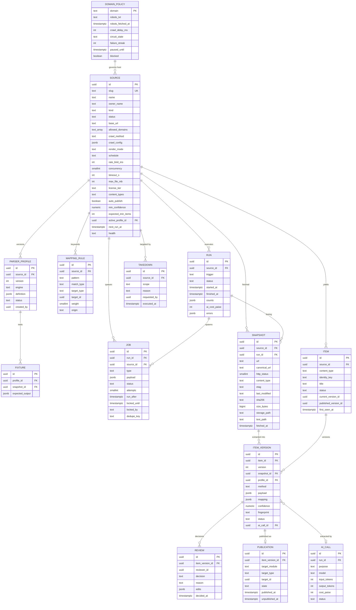

# ERD: X-04 Ingestion Service

| Field | Value |
| --- | --- |
| Linked PRD | `docs/product/prd/X-04-ingestion-scraping-service.md` |
| Django app | `apps/api/modules/ingestion` (plus a worker entry point `manage.py run_ingest_worker`) |
| Web module | `apps/web/src/modules/admin-ingestion` (Phase C), Django admin before that |
| Storage | Supabase Storage private bucket `ingest-raw` |
| Last updated | 4 Oct 2026 |

## 0. Design decisions

1. **Config is data.** Sources, schedules, limits, parser profiles and mapping rules are rows edited from the admin, not code. Code only provides generic engines (crawlers, fetchers, extractors) and optional parser plug-ins for unusual sites.
2. **Postgres is the queue.** `ingestion_job` rows are claimed with `SELECT ... FOR UPDATE SKIP LOCKED`, have a visibility timeout and retry counters. No Redis or broker to run. If volume ever needs more, the interface (`enqueue`, `claim`, `complete`, `fail`) lets us swap it.
3. **Immutable snapshots, versioned items.** What we fetched never changes (`ingestion_snapshot`, checksum). What we understood about it is versioned (`ingestion_item` with `ingestion_itemversion`). Re-running extraction creates a new version, never edits history.
4. **Review is a state machine on item versions.** `extracted -> needs_review -> approved -> published` (or `rejected`, `invalid`, `superseded`, `unpublished`). Every transition is written to `ingestion_review` or the audit log.
5. **Publishing is a plug-in.** Downstream modules own their tables. Ingestion calls the registered publisher and stores only a reference (`ingestion_publication`). Ingestion never writes to another module's tables directly.
6. **Everything has provenance.** Every item version points to its snapshot, source, parser profile version, extraction method and AI call (if any).
7. **Admin-only data.** None of these tables is student-readable. Student-facing data lives in the consuming modules.

## 1. Diagram



Plus two small tables not drawn: `ingestion_settings` (singleton) and `ingestion_auditlog`.

## 2. Tables

Common columns unless stated: `id uuid PK default gen`, `created_at timestamptz default now()`, `updated_at timestamptz default now()`.

### 2.1 `ingestion_source`

| Column | Type | Null | Default | Notes |
| --- | --- | --- | --- | --- |
| slug | text | no | | Unique, for example `icmai-announcements` |
| name | text | no | | |
| owner_name | text | no | | ICAI, ICSI, ICMAI or teacher or channel name |
| kind | text | no | `official` | `official`, `teacher`, `aggregator`, `manual` |
| status | text | no | `draft` | `draft`, `active`, `paused`, `archived`, `blocked` |
| paused_reason | text | yes | | `manual`, `health`, `circuit`, `takedown` |
| base_url | text | no | | Starting point, validated (https, public host) |
| allowed_domains | text[] | no | | Only these hosts are fetched. Includes the base host |
| crawl_method | text | no | | `feed`, `sitemap`, `listing`, `url_list`, `pdf_harvest`, `manual` |
| crawl_config | jsonb | no | `{}` | Method specific: feed URL, listing URLs, pagination rule, max depth, include and exclude URL patterns, link selector |
| render_mode | text | no | `http` | `http` or `headless` |
| schedule | text | no | `0 */6 * * *` | Cron expression (UTC) or `every:6h` |
| rate_limit_ms | int | no | 2000 | Minimum gap between requests to the host |
| concurrency | smallint | no | 1 | Check 1..4 |
| timeout_s | int | no | 30 | |
| max_file_mb | int | no | 50 | |
| retry_policy | jsonb | no | `{"max":5,"base_s":30}` | |
| license_tier | text | no | `link_only` | `link_only`, `facts_and_summary`, `host` |
| license_note | text | yes | | Who approved, link to permission, ToS review date |
| content_types | text[] | no | | Canonical types this source may produce |
| auto_publish | boolean | no | false | Only effective for `official` or explicitly trusted sources |
| min_confidence | numeric(3,2) | no | 0.90 | Threshold used for auto-publish and "high confidence" bulk approve |
| expected_min_items | int | no | 1 | Health check threshold |
| active_profile_id | uuid | yes | | FK `ingestion_parserprofile` |
| next_run_at | timestamptz | yes | | Scheduler uses this |
| last_run_at | timestamptz | yes | | |
| health | text | no | `unknown` | `healthy`, `degraded`, `failing`, `unknown` |
| notes | text | yes | | |

Constraints and indexes: unique `slug`; `auto_publish` requires `status <> blocked`; `license_tier = 'host'` requires `license_note is not null`; index `(status, next_run_at)` for the scheduler; index `(kind, status)`.

### 2.2 `ingestion_parserprofile`

| Column | Type | Null | Default | Notes |
| --- | --- | --- | --- | --- |
| source_id | uuid | no | | FK, cascade |
| version | int | no | | Increments per source |
| engine | text | no | `selectors` | `selectors` (declarative), `plugin` (Python class), `ai_only` |
| definition | jsonb | no | | For `selectors`: list page and detail page selectors, field mappings and transforms (date formats, URL joins), pagination. For `plugin`: `{"parser": "icai_amendments"}` registered in code |
| status | text | no | `draft` | `draft`, `tested`, `active`, `retired` |
| created_by | uuid | yes | | Editor |
| notes | text | yes | | |

Unique `(source_id, version)`. A profile can become `active` only if all its fixtures pass.

### 2.3 `ingestion_fixture`

| Column | Type | Null | Default | Notes |
| --- | --- | --- | --- | --- |
| profile_id | uuid | no | | FK |
| snapshot_id | uuid | no | | FK, a saved real page or PDF |
| name | text | no | | |
| expected_output | jsonb | no | | The expected normalised items |

The snapshot is pinned (excluded from retention while a fixture refers to it).

### 2.4 `ingestion_mappingrule`

| Column | Type | Null | Default | Notes |
| --- | --- | --- | --- | --- |
| source_id | uuid | yes | | Null means global rule |
| pattern | text | no | | Keyword, phrase, regex or section number |
| match_type | text | no | `keyword` | `keyword`, `regex`, `section` |
| target_type | text | no | | `subject`, `chapter`, `topic` |
| target_id | uuid | no | | Reference by id into `syllabus_*` |
| weight | smallint | no | 50 | Contribution to confidence |
| origin | text | no | `manual` | `manual` or `learned` (created from a reviewer correction) |
| is_active | boolean | no | true | |

Index `(source_id, is_active)`.

### 2.5 `ingestion_settings` (singleton)

One row (enforced by `id = 1` check): `kill_switch boolean`, `default_rate_limit_ms`, `ai_model text`, `ai_daily_budget_paise int`, `default_min_confidence numeric`, `snapshot_retention_days int default 180`, `alert_emails text[]`, `blocked_domains text[]`, `user_agent text`, `scheduler_enabled boolean`.

### 2.6 `ingestion_domainpolicy`

Shared across sources that hit the same host.

| Column | Type | Null | Default | Notes |
| --- | --- | --- | --- | --- |
| domain | text | no | | PK, lowercase host |
| robots_txt | text | yes | | Cached body |
| robots_fetched_at | timestamptz | yes | | Refresh after 24 h |
| robots_status | text | no | `unknown` | `ok`, `missing`, `unreachable`, `disallow_all` |
| crawl_delay_ms | int | yes | | From robots or admin |
| circuit_state | text | no | `closed` | `closed`, `open`, `half_open` |
| failure_streak | int | no | 0 | Consecutive 4xx, 5xx, timeouts |
| paused_until | timestamptz | yes | | Set when the circuit opens |
| blocked | boolean | no | false | Manual or take-down block |
| last_request_at | timestamptz | yes | | For the per domain limiter across workers |

### 2.7 `ingestion_run`

| Column | Type | Null | Default | Notes |
| --- | --- | --- | --- | --- |
| source_id | uuid | no | | FK |
| trigger | text | no | | `schedule`, `manual`, `preview`, `retry` |
| status | text | no | `queued` | `queued`, `running`, `succeeded`, `partial`, `failed`, `cancelled` |
| started_at, finished_at | timestamptz | yes | | |
| counts | jsonb | no | `{}` | discovered, fetched, unchanged, snapshots, extracted, invalid, queued_for_review, auto_published, failed |
| ai_cost_paise | int | no | 0 | |
| errors | jsonb | no | `[]` | First 20 errors with URLs and stage |
| triggered_by | uuid | yes | | Admin user for manual runs |

Index `(source_id, started_at desc)`. Preview runs (`trigger = preview`) write nothing to items or publications.

### 2.8 `ingestion_job` (the queue)

| Column | Type | Null | Default | Notes |
| --- | --- | --- | --- | --- |
| run_id | uuid | yes | | FK |
| source_id | uuid | no | | FK |
| type | text | no | | `discover`, `fetch`, `extract`, `map`, `publish`, `cleanup`, `healthcheck` |
| payload | jsonb | no | `{}` | For example `{"url": "...", "snapshot_id": "..."}` |
| status | text | no | `pending` | `pending`, `running`, `done`, `failed`, `dead` |
| attempts | smallint | no | 0 | |
| max_attempts | smallint | no | 5 | |
| run_after | timestamptz | no | now() | Backoff and rate limiting set this |
| locked_by | text | yes | | Worker id |
| locked_until | timestamptz | yes | | Visibility timeout |
| last_error | text | yes | | |
| dedupe_key | text | yes | | Prevents duplicate pending jobs for the same step |

Indexes: `(status, run_after)` where status in (`pending`, `running`) for claiming; unique `(dedupe_key)` where status in (`pending`, `running`) and `dedupe_key is not null`.

Claim query:

```sql
UPDATE ingestion_job SET status='running', locked_by=:w, locked_until=now()+interval '5 minutes', attempts=attempts+1
WHERE id = (
  SELECT id FROM ingestion_job
  WHERE (status='pending' AND run_after <= now()) OR (status='running' AND locked_until < now())
  ORDER BY run_after FOR UPDATE SKIP LOCKED LIMIT 1)
RETURNING *;
```

A job past `max_attempts` becomes `dead` and raises an alert; it can be re-queued from the admin.

### 2.9 `ingestion_snapshot` (immutable)

| Column | Type | Null | Default | Notes |
| --- | --- | --- | --- | --- |
| source_id | uuid | no | | FK |
| run_id | uuid | yes | | FK |
| url | text | no | | As requested |
| canonical_url | text | no | | Normalised (scheme, host case, tracking params removed, sorted query, fragment dropped) |
| http_status | smallint | no | | |
| content_type | text | yes | | |
| etag, last_modified | text | yes | | For conditional requests next time |
| sha256 | text | no | | Of the body |
| size_bytes | bigint | no | | |
| storage_path | text | yes | | `ingest-raw/{source}/{yyyy}/{mm}/{sha256}` (null if over the size limit or not stored) |
| text_path | text | yes | | Extracted plain text (PDF, HTML) for search and AI |
| page_count | int | yes | | PDFs |
| fetched_at | timestamptz | no | now() | |
| pinned | boolean | no | false | Used by fixtures and published items, protected from cleanup |

Indexes: `(source_id, canonical_url, fetched_at desc)` (latest snapshot of a URL, conditional request headers), unique `(source_id, canonical_url, sha256)` (identical content is stored once), `(sha256)`.

### 2.10 `ingestion_item` (logical thing, stable identity)

| Column | Type | Null | Default | Notes |
| --- | --- | --- | --- | --- |
| source_id | uuid | no | | FK |
| content_type | text | no | | Canonical type (PRD 5.3) |
| identity_key | text | no | | Stable identity inside a source: canonical detail URL, or a hash of title and date, or `{pdf sha}#{item index}` |
| title | text | no | | Current title |
| status | text | no | `active` | `active`, `unpublished`, `rejected`, `merged`, `taken_down` |
| current_version_id | uuid | yes | | Latest item version |
| published_version_id | uuid | yes | | Version shown to students, if any |
| merged_into_id | uuid | yes | | Duplicate resolution |
| first_seen_at | timestamptz | no | now() | |
| last_seen_at | timestamptz | no | now() | Last time the source still listed it |

Unique `(source_id, content_type, identity_key)`. Index `(status, content_type)`, `(source_id, last_seen_at desc)`.

### 2.11 `ingestion_itemversion`

| Column | Type | Null | Default | Notes |
| --- | --- | --- | --- | --- |
| item_id | uuid | no | | FK |
| version | int | no | | Per item |
| snapshot_id | uuid | no | | FK, where it came from |
| profile_id | uuid | yes | | Parser profile used |
| method | text | no | | `feed`, `selectors`, `plugin`, `pdf_rules`, `ai`, `manual` |
| payload | jsonb | no | | Canonical fields for the type, validated by a pydantic schema |
| mapping | jsonb | no | `{}` | `[{"type":"chapter","id":"...","confidence":0.86,"reasons":["section 17(1)","keyword ITC"]}]` |
| confidence | numeric(3,2) | no | 0 | Overall |
| fingerprint | text | no | | Hash of normalised text for exact change detection |
| simhash | bigint | yes | | Near duplicate detection |
| status | text | no | `extracted` | `extracted`, `invalid`, `needs_review`, `approved`, `rejected`, `published`, `superseded`, `unpublished` |
| validation_errors | jsonb | no | `[]` | |
| ai_call_id | uuid | yes | | FK `ingestion_aicall` |
| source_ref | jsonb | no | `{}` | Page number, bounding box or CSS path of the origin, shown in the review view |

Unique `(item_id, version)`. Indexes: `(status, confidence desc)` (review queue), `(snapshot_id)`, `(fingerprint)`.

A new version is created only when `fingerprint` differs from the latest version. Otherwise `last_seen_at` is updated and nothing else changes.

### 2.12 `ingestion_review`

| Column | Type | Null | Default | Notes |
| --- | --- | --- | --- | --- |
| item_version_id | uuid | no | | FK |
| reviewer_id | uuid | no | | Editor user |
| decision | text | no | | `approve`, `reject`, `edit_approve`, `merge`, `unpublish` |
| reason | text | yes | | Required for reject |
| edits | jsonb | no | `{}` | Field level before and after |
| decided_at | timestamptz | no | now() | |

Edits to mapping create or strengthen `ingestion_mappingrule` rows with `origin = learned` (a service rule, not a trigger).

### 2.13 `ingestion_publication`

| Column | Type | Null | Default | Notes |
| --- | --- | --- | --- | --- |
| item_version_id | uuid | no | | FK |
| target_module | text | no | | `notices`, `amendments`, `tests`, `resources`, `syllabus` |
| target_type | text | no | | Model name in the target module |
| target_id | uuid | no | | Id returned by the publisher |
| state | text | no | `live` | `live`, `withdrawn` |
| published_at | timestamptz | no | now() | |
| unpublished_at | timestamptz | yes | | |

Unique `(item_version_id, target_module, target_type)`. Index `(target_module, target_id)`.

### 2.14 `ingestion_aicall`

| Column | Type | Null | Default | Notes |
| --- | --- | --- | --- | --- |
| run_id | uuid | yes | | FK |
| purpose | text | no | | `extract`, `map`, `summarise`, `selector_suggest` |
| model | text | no | | |
| input_tokens, output_tokens | int | no | 0 | |
| cost_paise | int | no | 0 | Estimated |
| status | text | no | | `ok`, `error`, `skipped_budget`, `invalid_output` |
| latency_ms | int | yes | | |

No prompt or page text is stored here (the snapshot already holds the source); only metadata. Index `(created_at)` for daily budget sums.

### 2.15 `ingestion_takedown`

| Column | Type | Null | Default | Notes |
| --- | --- | --- | --- | --- |
| source_id | uuid | yes | | |
| scope | text | no | | `source`, `domain`, `url`, `item` |
| target | text | no | | The source id, domain, URL or item id |
| reason | text | no | | |
| requested_by_contact | text | yes | | Who asked (email or name of the complainant) |
| executed_by | uuid | no | | Admin |
| executed_at | timestamptz | no | now() | |
| items_affected | int | no | 0 | |

Executing a take-down sets matching items to `taken_down`, withdraws their publications through the publishers, sets the source `blocked` when requested, and blocks the domain in `ingestion_domainpolicy`.

### 2.16 `ingestion_auditlog`

`actor_id uuid`, `action text`, `entity_type text`, `entity_id uuid`, `before jsonb`, `after jsonb`, `created_at`. Append-only, written by services for config changes, publishes, unpublishes, take-downs and settings changes. Index `(entity_type, entity_id, created_at desc)`.

## 3. Relationships to other modules

| Link | Rule |
| --- | --- |
| `ingestion_mappingrule.target_id`, `ingestion_itemversion.mapping` | Reference `syllabus_subject`, `syllabus_chapter`, `syllabus_topic` ids by value. Reads through `syllabus.selectors` |
| Syllabus changes | A `syllabus_change` item publishes through `syllabus.services.create_draft_scheme(...)`. It can never publish a scheme directly |
| Publishers | `notices`, `amendments`, `tests`, `resources` modules each expose `publish(item_version) -> target_id` and `withdraw(target_id)`; registered in `ingestion.registry` at app start |
| Notifications | After publish, `ingestion.events.content_published` is emitted; the notifications module subscribes |
| Users | `created_by`, `reviewer_id`, `executed_by` are Supabase user ids by value; permission comes from the `role` on `profiles` |

Dependency direction: `ingestion -> syllabus` (read and draft writes) and `ingestion -> publishers` via the registry (inversion of control: modules depend on the interface, ingestion does not import their models).

## 4. Enumerations and reference data

| Name | Values | Stored as | Owner |
| --- | --- | --- | --- |
| Source kind | official, teacher, aggregator, manual | text + check | code |
| Source status | draft, active, paused, archived, blocked | text + check | code |
| Crawl method | feed, sitemap, listing, url_list, pdf_harvest, manual | text + check | code (each has an engine class) |
| Render mode | http, headless | text + check | code |
| License tier | link_only, facts_and_summary, host | text + check | code |
| Content type | notice, amendment_change, mock_paper, question_set, study_material, syllabus_change, resource_link, exam_event | text + check | code (pydantic schema per type in `ingestion/schemas/`) |
| Item version status | see 2.11 | text + check | code |
| Job type and status | see 2.8 | text + check | code |
| Extraction method | feed, selectors, plugin, pdf_rules, ai, manual | text + check | code |

Seed rows (migration, all `draft`): ICAI notices and amendments, ICSI notices, ICMAI notices. URLs are filled by you in the admin; none are crawled until an admin sets them `active`.

## 5. Query patterns

| # | Query | Served by |
| --- | --- | --- |
| Q-1 | Scheduler: due sources (`status = active and next_run_at <= now()`), enqueue `discover` jobs | `(status, next_run_at)` |
| Q-2 | Worker claim of the next job | `(status, run_after)` with `SKIP LOCKED` |
| Q-3 | Latest snapshot headers for a URL (ETag, Last-Modified) for conditional GET | `(source_id, canonical_url, fetched_at desc)` |
| Q-4 | Dedupe by checksum: has this body already been stored | unique `(source_id, canonical_url, sha256)` |
| Q-5 | Upsert item by identity | unique `(source_id, content_type, identity_key)` |
| Q-6 | Change detection: compare fingerprint with the current version | PK lookup of `current_version_id` |
| Q-7 | Review queue, highest confidence first, filtered by type and source | `(status, confidence desc)` joined to item |
| Q-8 | Run history and funnel for a source | `(source_id, started_at desc)` |
| Q-9 | Per domain rate limiter across workers: `UPDATE ... SET last_request_at = now() WHERE domain = :d AND last_request_at <= now() - :gap RETURNING` (a row-level token) | PK on `domain` |
| Q-10 | AI spend today | `(created_at)` on `ingestion_aicall` summed per day |
| Q-11 | Take-down: all items by source or domain | `(source_id, last_seen_at)`, join to snapshot URL host |
| Q-12 | Cleanup: unpinned snapshots older than retention not referenced by a published version | `(fetched_at)` plus pinned flag |
| Q-13 | Health: items extracted per run over the last 10 runs | `counts` jsonb in `ingestion_run` |

## 6. Storage

| Item | Value |
| --- | --- |
| Bucket | `ingest-raw` (private, no public policy) |
| Path | `{source_slug}/{yyyy}/{mm}/{sha256}.{ext}` for the file and `{sha256}.txt` for extracted text |
| Access | Service key from the worker; admins get short lived signed URLs (5 minutes) through the API; students never get access unless the source is `host`, in which case a separate public bucket and copy are created by the publisher |
| Size limit | Per source `max_file_mb`, default 50 MB; larger files are recorded without a stored body and flagged |
| Retention | Controlled by settings (default 180 days for unpinned snapshots); pinned snapshots (fixtures, published items) are kept |
| Safety | Files are checked for type and size before parsing, parsed only in the worker, never opened in the browser by the admin console (download only, or rendered through a sanitised text view) |

## 7. Security

- **Access:** all endpoints need a Supabase JWT and the `admin` or `editor` role from `profiles.role`. Global settings, take-down and kill switch are `admin` only. The scheduler tick endpoint uses a secret header (`X-Ingest-Secret`), compared in constant time.
- **RLS:** enabled with no policies on every `ingestion_*` table. Django and the worker connect with the service role. Student tokens can never read these tables.
- **Secrets:** Gemini and Supabase service keys exist only on the API and worker. No credentials for external sites are stored (we never log in).
- **SSRF protection:** every URL is resolved first; private, loopback, link-local and cloud-metadata addresses are refused; redirects are re-validated per hop; only hosts in `allowed_domains` and not in `blocked_domains` are fetched; only http and https.
- **Untrusted content:** HTML is sanitised before display; PDFs parsed in the worker with size and page limits; text sent to the AI is passed as data inside a fixed prompt template, the model has no tools, output must validate against the schema, and anything that fails goes to `invalid`.
- **Politeness and compliance:** robots.txt decisions are logged per request; `license_tier` is checked by the publisher before anything student-facing is created (a `link_only` source cannot publish a `host` payload).
- **Audit:** `ingestion_auditlog` plus `ingestion_review` give a complete trail of who changed what and who published what.
- **PII:** no personal data is collected on purpose. Names of teachers appear only as source attribution. If a page contains personal data, extractors drop fields not in the schema.
- **Retention and deletion:** see section 6. Deleting a source archives it and withdraws its publications; rows are kept for audit.

## 8. Migration and rollout

Order:

1. `ingestion.0001_initial`: settings, domainpolicy, source, parserprofile, run, job, snapshot, item, itemversion, review, publication, aicall, takedown, auditlog (new tables only).
2. `ingestion.0002_seed_sources`: draft sources for ICAI, ICSI and ICMAI (no URLs crawled until activated) and the singleton settings row with `kill_switch = true` by default.
3. Post-migrate hook: RLS on all tables.
4. Create the private `ingest-raw` bucket (documented step in `docs/SETUP.md`, plus a management command `ensure_ingest_bucket`).

Notes:

- No backfill and no downtime risk; the feature ships dark (`kill_switch` on, `ingestion` flag off).
- Deploy the worker separately; it uses the same code and `DIRECT_DATABASE_URL` (or the pooler in session mode for `SKIP LOCKED` friendliness; transaction pooling works as each claim is one statement).
- `ingestion_job` and `ingestion_snapshot` grow the fastest. Add a nightly cleanup job (jobs done older than 30 days; snapshots by retention). Partition `ingestion_job` by month only if it reaches tens of millions of rows.
- Late indexes use `AddIndexConcurrently`.

## 9. Module layout

```
apps/api/modules/ingestion/
  models.py selectors.py services.py serializers.py views.py urls.py admin.py permissions.py
  registry.py                  publisher and parser plug-in registries
  events.py                    content_published signal
  schemas/                     pydantic schema per canonical content type (+ JSON schema for AI)
  engine/
    queue.py                   enqueue, claim, complete, fail (Postgres)
    scheduler.py               due sources to jobs
    politeness.py              robots cache, per domain limiter, circuit breaker, backoff
    urls.py                    canonicalisation, SSRF guard
    pipeline.py                job handlers: discover, fetch, extract, map, publish
  crawlers/                    feed.py sitemap.py listing.py url_list.py pdf_harvest.py
  fetchers/                    http.py headless.py (Playwright)
  extractors/                  selectors.py pdf.py ocr.py ai.py plugins/ (icai_amendments.py ...)
  mappers/                     rules.py ai.py learn.py
  dedupe/                      fingerprint.py simhash.py versioning.py
  publishers/                  base.py (interface) notices.py (amendments, tests, resources live in their own modules)
  management/commands/         run_ingest_worker.py ensure_ingest_bucket.py ingest_run_source.py
  tests/                       unit tests on saved fixtures (no live internet)
worker/
  Dockerfile                   python, playwright browsers, pdf libs; command: run_ingest_worker
```

Web (Phase C): `apps/web/src/modules/admin-ingestion` with `containers` (SourcesContainer, SourceDetailContainer, ReviewQueueContainer, SettingsContainer), presentational `components` (SourceForm, ParserProfileEditor, PreviewTable, ReviewSplitView, RunTimeline, HealthTile) and `hooks` (`useSources`, `usePreview`, `useReviewQueue`). Routes under `/admin/ingestion/*` stay thin and guarded by role.

## 10. Adding a new website (the day-to-day workflow)

1. Admin, Sources, Add source: name, owner, kind, base URL, allowed domains, license tier (default `link_only`).
2. Choose the crawl method (feed, listing, sitemap, URL list). Enter the listing URL and optional URL patterns.
3. Click Preview. The service fetches a few pages (respecting robots.txt) and shows what the generic extractor found.
4. If fields are missing, open the Parser tab and set selectors (title, date, link, body, attachments). Preview again. Save the page as a fixture.
5. Mapping tab: add keyword rules or leave AI mapping on.
6. Publishing tab: choose content types and review rules; keep auto-publish off.
7. Set the schedule and limits, then set the source `active`. The first run fills the review queue.
8. Watch Runs and Health for a few days; adjust.

A source that needs special logic gets a small Python plug-in (a class in `extractors/plugins/` registered by name) and the same configuration around it.
