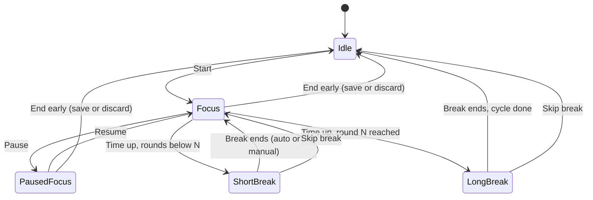
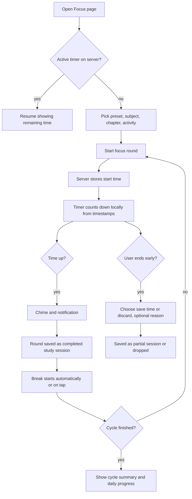

# PRD: F-01.1 Pomodoro Focus Timer

| Field | Value |
| --- | --- |
| Status | Draft for review |
| Owner | Pawan |
| Last updated | 4 Oct 2026 |
| Source | `docs/product/FEATURE_MAP.md`, F-01 Time Tracker |
| Linked ERD | `docs/product/erd/F-01.1-pomodoro-focus-timer.md` |
| Order | **Second** PRD/ERD, after F-02 Syllabus Structure and Coverage (`prd/F-02-syllabus-structure-and-coverage.md`), which provides the subject and chapter lists |
| Next PRD | F-01.2 Time Tracker and Analytics (builds on the data created here) |

---

## 1. Problem and goal

CA, CS and CMA students study for many hours a day, usually without structure. They lose time to phone distractions, burn out in long unbroken stretches, and cannot say afterwards how much real, focused study they did on which subject.

**Goal:** give students a calm, reliable Pomodoro timer (focus intervals with short breaks) that is tied to the subject and chapter they are studying. Every verified focused interval is saved automatically as study time, which becomes the foundation for the Time Tracker, Analytics, Syllabus Coverage and the daily plan.

Why this goes first: it is small, daily-use, self-contained, and it creates the first real habit loop (open the app, start a timer, see progress). The data model it introduces (a study session) is the same one the full Time Tracker will use, so nothing is thrown away.

## 2. Users and scenarios

**Aarav, CA Intermediate, studies 5 to 6 hours a day.**
He opens ArthaCommerce, picks Taxation and chapter "GST: Input Tax Credit", and starts a 25 minute focus round. After four rounds he takes a long break. At night he sees "3 h 20 min focused today, goal 4 h".

**Neha, CS Executive, works a job and studies in the evening.**
She uses a 50/10 preset because 25 minutes feels too short for case-law reading. She starts on her phone during the commute and continues on her laptop at home. The timer is the same on both.

**Rohan, CMA Final, gets interrupted often.**
His round is cut short by a call. He ends the round early, chooses "Save 12 minutes", and picks the reason "Phone call". The 12 minutes still count as study time but do not count as a completed Pomodoro.

## 3. Success metrics

Targets are starting hypotheses to calibrate after the first 100 users.

| Metric | Definition | Target | Event(s) |
| --- | --- | --- | --- |
| Activation | New signed-in users who complete one focus round within 24 h of first visit | 40% | `focus_session_completed` |
| Habit | Users with 3 or more completed rounds on 3 different days in their first 7 days | 25% | `focus_session_completed` |
| Completion rate | Completed rounds divided by started rounds | 70% | `focus_session_started`, `focus_session_completed` |
| Tagging rate | Rounds with a subject attached | 85% | `focus_session_started` (has_subject) |
| Timer accuracy | Difference between displayed remaining time and server time across tab sleep, refresh and device switch | under 1 second | client diagnostics |
| Reliability | Rounds lost or duplicated by sync problems | under 0.5% | server logs |

## 4. Scope

### In scope (v1)

1. Pomodoro timer screen and a persistent mini timer visible on every signed-in page.
2. Presets and custom durations.
3. Attach each round to a subject, optional chapter and an activity type.
4. Start, pause, resume, extend, skip break, end early (save or discard).
5. Automatic transitions between focus, short break and long break.
6. Alerts: sound, browser notification (with permission), tab title countdown, vibration on mobile.
7. Timer survives refresh, tab close and device switch (one active timer per student).
8. Daily focus goal, progress ring and day streak.
9. Today view and history of rounds, with the ability to edit tags or delete a round.
10. Offline tolerance: the timer keeps running locally and syncs when back online.
11. Accessibility and keyboard shortcuts.
12. Analytics events and a PostHog feature flag.

### Out of scope (later)

| Item | Planned for |
| --- | --- |
| Charts, trends, per-subject and per-chapter reports | F-01.2 Time Tracker and Analytics |
| Manual time entry, stopwatch mode | F-01.2 |
| Ambient sounds and white noise | v1.1 |
| Alerts when the browser is fully closed (Web Push) | v1.1 |
| Full-screen focus mode and distraction blocking | v1.2 |
| Study rooms with shared timers | Phase 5 |
| Linking a round to a planner task or Today item | after the Planner and Today exist |
| Native mobile app | not planned; PWA instead |

## 5. User flows

### 5.1 Timer states



### 5.2 Main flow



### 5.3 Edge cases (must be designed and tested)

| Case | Behaviour |
| --- | --- |
| Page refreshed or tab closed during a round | Timer continues on the server clock. On return the page shows the correct remaining time. |
| Laptop sleeps or tab is throttled | Remaining time is computed from timestamps, never by counting ticks, so it stays correct. |
| Time up while the student is away | **Decision (Q1): count only if the page was seen alive in the last 2 minutes before the round ended.** The open page sends a heartbeat (with every 20 s poll). If the last heartbeat is within 2 minutes of the end time, the server closes the round as completed and marks it `auto_closed`. If not, nothing is counted automatically; on the next visit the page shows "Your timer ended while we could not see you. Did you study the full time?" with **Yes, count it** (saved as completed, `presence_verified = false`) and **No, discard**. |
| Started on phone, opened on laptop | Laptop shows the same running timer with a note "Running on another device". Controls work from either device. |
| Student taps Start on a second device while one timer is active | Server refuses with a conflict. The screen offers "Resume that timer" or "End it and start new". |
| Device clock is wrong | All calculations use server time. The client keeps an offset from the server's clock. |
| Offline during a round | Local countdown continues. Finishing, pausing and ending are queued and sent when online. A banner shows "Offline, will sync". |
| Network error on start | Round starts locally, retries with the same client id so a duplicate is never created. |
| Notification permission denied | Fall back to sound plus tab title plus on-page banner. Never ask again automatically; offer a settings link. |
| Student changes subject mid-round | Allowed. The whole round is attributed to the latest choice; shown in history. |
| Round shorter than 1 minute ended early | Always discarded without asking. |
| Student deletes an account or session | Hard delete. Daily totals are recomputed. |
| Daylight saving or travel across time zones | Study day is based on the student's time zone stored on the round, so a late-night round stays on the right day. |

## 6. Functional requirements

Priority: P0 must ship in v1, P1 should ship in v1, P2 can follow shortly after.

| ID | Requirement | Priority | Acceptance criteria |
| --- | --- | --- | --- |
| FR-1 | Presets: Classic (25 focus, 5 short break, 15 long break, long break after 4 rounds), Deep (50, 10, 20, after 3), Light (15, 3, 10, after 4), and Custom | P0 | Given a signed-in student, when they open the Focus page, then the four presets are listed and the last used one is selected. |
| FR-2 | Custom durations with limits: focus 5 to 120 min, short break 1 to 30, long break 5 to 60, rounds before long break 2 to 8 | P0 | Given Custom, when a value is outside the limit, then the field shows an error and Start is disabled. |
| FR-3 | Tag a round with subject (required to be shown prominently, optional to start), chapter (optional, filtered by subject) and activity type: Reading, Practice, Revision, Notes, Mock test, Other | P0 | Given a subject is selected, when the chapter list opens, then only that subject's chapters appear. |
| FR-4 | Start a focus round | P0 | Given Idle, when the student taps Start, then the countdown begins within 200 ms and the server has stored the start time. |
| FR-5 | Pause and resume. Pausing time is excluded from focus time | P0 | Given a running round paused for 3 minutes, when it later completes, then focus time equals planned time, not planned plus 3. |
| FR-6 | Extend the current round by 5 minutes (up to 3 times) | P1 | Given a running round, when Extend is tapped, then remaining time increases by 5 minutes and focus time reflects it. |
| FR-7 | End early: choose Save time or Discard. Optional reason: Distracted, Phone call, Tired, Urgent work, Other | P0 | Given 12 minutes of focus, when ending early with Save time, then a partial session of 12 minutes is stored and no Pomodoro is counted. |
| FR-8 | Automatic phase transitions: focus to short break, long break after N rounds, then cycle ends | P0 | Given Classic, when round 4 completes, then a 15 minute long break starts. |
| FR-9 | Setting "Auto-start breaks" and "Auto-start next focus", each on or off (defaults: breaks on, focus off) | P1 | Given auto-start breaks is off, when a round completes, then a "Start break" button is shown instead of a countdown. |
| FR-10 | Skip a break | P0 | Given a break is running, when Skip is tapped, then the timer returns to Idle (or next focus if auto-start is on). |
| FR-11 | Alerts at phase end: soft chime (volume setting, mute option), browser notification when permitted, tab title shows `24:12 Focus`, vibration on supported phones | P0 | Given the tab is in the background, when a round ends, then a chime plays and a notification appears. |
| FR-12 | Timer is accurate across refresh, sleep, tab throttling | P0 | Given a 25 minute round, when the page is refreshed at 10:03 elapsed, then the page shows 14:57 remaining within 1 second. |
| FR-13 | One active timer per student, shared across devices | P0 | Given a running timer on device A, when device B opens the app, then it shows the same state within 5 seconds of load. |
| FR-14 | Cross-device live updates while a page is open (polling every 20 seconds and on tab focus) | P1 | Given pause on device A, when device B is visible, then it reflects Paused within 20 seconds. |
| FR-15 | Mini timer visible on all signed-in pages while a timer is active, showing phase, remaining time, subject, and Pause and Open buttons | P0 | Given an active timer, when the student navigates to Notes, then the mini timer remains and keeps counting. |
| FR-16 | Daily focus goal in minutes (default 120, range 15 to 720), with a progress ring on the Focus page | P1 | Given goal 120 and 90 minutes focused, then the ring shows 75%. |
| FR-17 | Day streak: consecutive days on which the goal was met | P1 | Given the goal was met yesterday and today, then streak is 2. A missed day resets it to 0. |
| FR-18 | Today summary: focused time, completed rounds, partial rounds, goal progress | P0 | Given three completed rounds of 25 minutes, then Today shows 1 h 15 min and 3 rounds. |
| FR-19 | History list grouped by day with subject, chapter, duration, status, and edit (tags, note) and delete | P1 | Given a past round, when the subject is edited, then Today and daily totals remain correct. |
| FR-20 | Settings page for presets, auto-start flags, sound and volume, notifications, goal, and a "Reset to defaults" action | P1 | Given changes are saved, when the student signs in on another device, then the same settings apply. |
| FR-21 | Keyboard shortcuts: Space start or pause, S skip, E end early, plus a visible shortcut hint | P2 | Given focus is not in a text field, when Space is pressed, then the timer toggles. |
| FR-22 | Offline queue: actions taken offline sync later without duplicates | P1 | Given an offline round completed, when the connection returns, then exactly one session exists. |
| FR-23 | Empty and first-run states: first visit explains Pomodoro in two lines and preselects Classic | P1 | Given a new student, when they open Focus, then a one-screen intro appears once. |
| FR-24 | Data export and delete of all focus data from account settings | P2 | Given a delete request, then all rounds and settings are removed. |
| FR-26 | Heartbeat: while a timer page or the mini timer is open, the client confirms it is alive with every poll (every 20 s while visible, on tab focus, and on every action). The server stores `last_seen_at` | P0 | Given a running round and a visible page, when 60 seconds pass, then `last_seen_at` is less than 25 seconds old. |
| FR-27 | Away handling: a round that ends with no heartbeat in the final 2 minutes is not counted automatically. The student can claim it with one tap or discard it | P0 | Given the tab was closed 10 minutes before the end, when the student returns, then no session exists yet and the claim prompt is shown; after "Yes, count it" exactly one completed session exists with `presence_verified = false`. |
| FR-25 | Feature flag `focus_timer` and events listed in section 10 | P0 | Given the flag is off, then Focus is hidden from navigation and the API returns 404. |

## 7. Screens, URLs and design-system needs

### Screens and URLs (all deep-linkable)

| Screen | URL | Notes |
| --- | --- | --- |
| Focus (main timer) | `/app/focus` | Query params preselect context: `?subject=taxation&chapter=gst-itc&preset=deep`. Used later by chapter pages and Today. |
| History | `/app/focus/history` | `?date=2026-10-04` shows one day, default is the last 7 days. |
| Focus settings | `/app/settings/focus` | Also reachable from a gear icon on the Focus page. |
| Mini timer | global, inside the signed-in layout | Not a route. Hidden on `/app/focus` itself. |

### Layout of `/app/focus` (mobile first)

```
┌──────────────────────────────┐
│ Preset:  Classic | Deep | Light | Custom │
│                              │
│          ╭──────────╮        │
│         │   24:12    │       │   large ring, tabular numbers
│         │   FOCUS    │       │   phase label
│          ╰──────────╯        │
│        ● ● ○ ○  round 3 of 4 │   cycle dots
│                              │
│  [ Taxation ▾ ] [ Chapter ▾ ] [ Reading ▾ ]  │
│                              │
│     [   Pause   ]  [ End ]   │   primary + secondary
│                              │
│ Today  1h 40m · 4 rounds · 83% of goal  🔥3  │
│ ─ Recent rounds ─────────────│
└──────────────────────────────┘
```

Desktop: ring on the left, today and history on the right.

Aha moment: when the first round completes, the ring fills with a short celebratory animation and a card appears: "First focus round done. 25 minutes of Taxation logged." with the day's progress ring starting to fill.

### Design-system components

Existing: Button, Card, Badge, Input, Tabs, Container, Section, Reveal.
New primitives to add to `packages/design-system` (each also shown in the `/design-system` showcase):

| Component | Used for |
| --- | --- |
| `ProgressRing` | Timer ring and goal ring (value, size, stroke, label slot, reduced-motion safe) |
| `SegmentedControl` | Preset picker |
| `Select` / `Combobox` | Subject, chapter, activity pickers (searchable) |
| `NumberField` (stepper) | Custom durations |
| `Switch` | Auto-start, sound, notification toggles |
| `Slider` | Volume |
| `Dialog` and `Sheet` | End early dialog, settings on mobile |
| `Toast` | "Saved", "Offline, will sync" |
| `Tooltip`, `Kbd` | Shortcut hints |
| `Skeleton` | Loading Today and history |

## 8. Data and permissions

- Everything is private to the student. No sharing in v1.
- Entities and columns are defined in the ERD. In short: user focus settings, one active timer per student, finished study sessions, and a daily rollup.
- All reads and writes go through the Django API and are scoped to the signed-in student's id.
- Personal data: study habits are personal data. They are deleted when the account is deleted and can be exported.
- Retention: kept until the student deletes them.

## 9. API surface

All paths are under `/api/v1/focus/`, require a Supabase bearer token, and return the standard error shape `{"error": {code, message, details}}`.
Every response that carries timer state also includes `server_time` (ISO 8601 with milliseconds) so clients can correct clock offset.
Every mutating call takes a client generated `client_id` (UUID) or a `version` number so retries are safe.

| Method and path | Purpose | Request (key fields) | Response / errors |
| --- | --- | --- | --- |
| GET `settings/` | Get focus settings (created with defaults on first read) | none | settings |
| PUT `settings/` | Replace settings | presets, auto-start flags, sound, volume, notifications, goal minutes, time zone | settings. 400 on invalid ranges |
| GET `timer/` | Current active timer or none | none | timer + `server_time`, or `{"timer": null}` |
| POST `timer/start/` | Start a focus round | `client_id`, `preset`, durations, `subject_id?`, `chapter_id?`, `activity_type` | 201 timer. 409 `timer_already_active` with the active timer |
| POST `timer/pause/` | Pause | `version` | timer. 409 on stale version |
| POST `timer/resume/` | Resume | `version` | timer |
| POST `timer/extend/` | Add 5 minutes | `version` | timer. 400 after 3 extensions |
| POST `timer/complete/` | Finish the current phase | `version` | timer (next phase) and the saved session |
| POST `timer/skip-break/` | Skip break | `version` | timer or null |
| POST `timer/heartbeat/` | Confirm the page is alive (also done implicitly by `GET timer/` with `alive=1`) | `version` | `server_time`, timer |
| POST `timer/claim/` | Count or discard a round that ended while away | `version`, `count` (bool) | saved session or null |
| POST `timer/end/` | End early | `version`, `save` (bool), `reason?` | saved session or null |
| PATCH `timer/context/` | Change subject, chapter, activity while running | `version`, fields | timer |
| GET `sessions/` | List finished rounds | `date_from`, `date_to`, `subject_id`, `cursor` | paginated list |
| PATCH `sessions/{id}/` | Edit tags or note | `subject_id`, `chapter_id`, `activity_type`, `note` | session |
| DELETE `sessions/{id}/` | Delete a round | none | 204 |
| GET `summary/today/` | Focus minutes, rounds, goal progress, streak for a study date | `date?` (defaults to student's today) | summary |

Idempotency: `start` with a `client_id` already used returns the same timer or session instead of creating another.
Concurrency: every timer carries an integer `version`; a stale version returns 409 with the latest timer so the client can refresh.

## 10. Analytics events and notifications

Event names use `noun_verb`. No personal text (notes) is ever sent.

| Event | Properties |
| --- | --- |
| `focus_session_started` | preset, planned_minutes, has_subject, has_chapter, activity_type, source_device |
| `focus_session_paused` / `focus_session_resumed` | elapsed_minutes |
| `focus_session_completed` | planned_minutes, focus_minutes, extended, auto_closed, presence_verified |
| `focus_away_claim` | result (counted, discarded), minutes_away |
| `focus_session_abandoned` | focus_minutes, saved, reason |
| `focus_break_started` / `focus_break_skipped` | kind (short or long) |
| `focus_goal_reached` | goal_minutes, streak |
| `focus_settings_changed` | changed_keys |
| `focus_notification_permission` | result (granted, denied, dismissed) |
| `focus_timer_conflict` | action (resume_existing, replace) |

Notifications in v1 are in-page only (sound, browser notification while the page is open, tab title). Scheduled push when the browser is closed arrives with Web Push in v1.1.

## 11. Non-functional requirements

| Area | Requirement |
| --- | --- |
| Accuracy | All time derived from timestamps and server offset. No setInterval counting as source of truth. Displayed time within 1 second of true time. |
| Performance | Start, pause and resume return in under 300 ms at the 95th percentile. Focus page interactive in under 2 s on a mid-range phone on 4G. |
| Reliability | At most one active timer per student, enforced by the database. Retries never duplicate rounds. |
| Accessibility | WCAG 2.2 AA. `role="timer"` with a label that updates once per minute (not every second). Phase changes announced politely through `aria-live`. Controls reachable by keyboard. Respects reduced motion. Colour is never the only signal. |
| Mobile | Works in mobile browsers and as an installed PWA. Touch targets at least 44 px. |
| Security | Auth required. All data scoped by student id. Rate limit on mutating endpoints. |
| SEO | The app pages are `noindex`. A public marketing page `/features/pomodoro-focus-timer` (SEO and WhatsApp preview) can be added with this release. |
| Privacy | No third-party trackers beyond PostHog and Sentry. Notes not sent to analytics. |
| i18n | English first. Time and numbers formatted for en-IN. Strings kept in one place for later Hindi. |
| Cost | No AI use. Negligible storage. |

## 12. Risks and open questions

| # | Question or risk | Proposed default |
| --- | --- | --- |
| Q1 | When a round time-ends while the student is away, do we count it? | **Decided by Pawan (4 Oct 2026):** count only if the page was seen alive within 2 minutes before the end. Otherwise the student confirms with one tap (`presence_verified = false`) or discards. Revisit after beta if too many students lose time because phones freeze background tabs (see R1). |
| Q2 | Is choosing a subject mandatory? | No. Strongly nudged, and unlabelled rounds show as "Untagged" until tagged. |
| Q3 | Should breaks be saved as time? | No. Only focus time is study time. |
| Q4 | Default daily goal | 120 minutes, set during onboarding later. |
| Q5 | Sound assets | Use licensed or self-made short chimes; no copyrighted audio. |
| R1 | Mobile browsers throttle or freeze background tabs | Timestamp based timing removes drift; alerts while backgrounded may be late until Web Push ships (v1.1). Communicate this honestly in the UI. |
| R2 | Subject and chapter lists do not exist yet | Provided by F-02 Syllabus Structure (first PRD/ERD). This feature only needs course, level, scheme, subject and chapter read access. |
| R3 | Streak anxiety | Keep tone kind: no red warnings; streak freeze arrives with Gamification. |

## 13. Rollout

1. **Prerequisite:** F-02 Syllabus Structure (taxonomy tables and seed) shipped.
2. **Phase A:** API and database behind the `focus_timer` flag, tests green.
3. **Phase B:** Web timer page and mini timer, internal testing.
4. **Phase C:** Closed beta with about 50 students, watch the metrics in section 3 for two weeks.
5. **Phase D:** General availability, add the public marketing page, announce through the notification system once it exists.
6. **Support notes:** FAQ entry on how time is counted (focus only, pauses excluded, auto-closed rounds).

## 14. Slicing into PR-sized work (draft)

1. (Done by F-02) `syllabus` backend module and seed: course, level, scheme, subject, chapter
2. `tracking` module: `StudySession`, `DailyFocusSummary` models, services, tests
3. `focus` module: settings, active timer state machine service, endpoints, tests
4. Design-system primitives: ProgressRing, SegmentedControl, Select, NumberField, Switch, Dialog, Toast
5. Web `focus` module: timer math (pure, tested), `useFocusTimer`, Focus page
6. Mini timer, alerts, tab title, notifications
7. Today summary, history, settings page
8. Offline queue, cross-device polling, analytics events, feature flag
9. Marketing page `/features/pomodoro-focus-timer`
