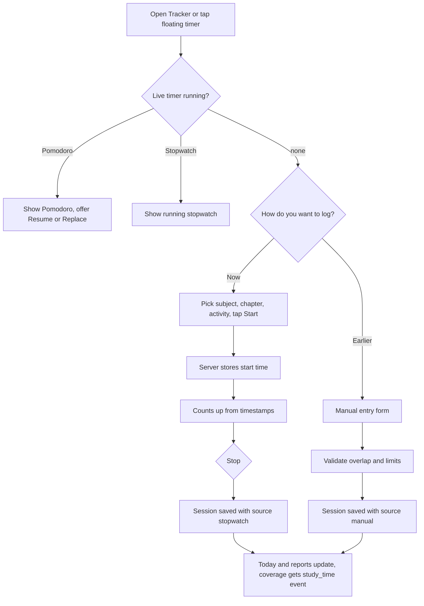
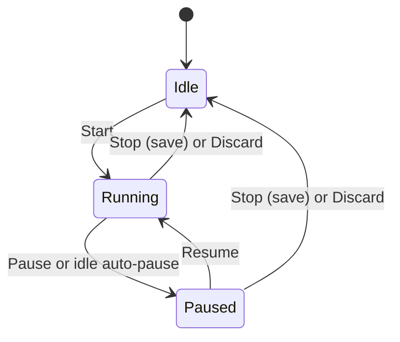
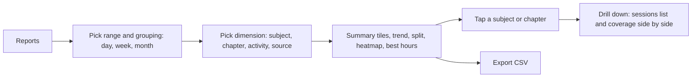

# PRD: F-01.2 Time Tracker and Analytics

| Field | Value |
| --- | --- |
| Status | Implemented (see "Build notes and deviations" at the end) |
| Owner | Pawan |
| Last updated | 5 Oct 2026 |
| Source | `docs/product/FEATURE_MAP.md`, F-01 Time Tracker (items 1, "subject-wise tracking system" and page 4 "Time tracker analytics") |
| Linked ERD | `docs/product/erd/F-01.2-time-tracker-and-analytics.md` |
| Order | **Fourth** PRD/ERD. Builds on F-01.1 Pomodoro Focus Timer (`tracking_studysession`) and on F-02 (subjects and chapters) |
| Next | The rest of the build order in FEATURE_MAP section 8 (Notes, Question Bank, Mock tests, Amendments, Today, ...) |

---

## 1. Problem and goal

A CA, CS or CMA student studies five to ten hours a day but cannot answer simple questions: "How many hours did I really study this week? Which subject got too little time? Which chapter is eating my hours without raising my marks? When in the day do I focus best?" The Pomodoro timer (F-01.1) captures focused rounds, but real study is not always in 25 minute blocks: reading a module for two hours, solving a practical, forgetting to start the timer.

**Goal, in two parts:**

1. **Capture every kind of study time**, not only Pomodoro rounds: a free-running stopwatch, manual entry (and edit, merge, split) for time the student forgot to track, all tagged with subject, optional chapter and activity type.
2. **Turn it into insight**: daily, weekly and monthly views, split by group, subject, chapter and activity, goals (daily and weekly, overall and per subject), a calendar heatmap, trend lines and best hours of the day, plus a weekly summary and CSV export.

Everything lands in the **same table** that F-01.1 created (`tracking_studysession`), so a Pomodoro round, a stopwatch session and a manual entry are one kind of record with a different `source`. Nothing from F-01.1 is thrown away.

## 2. Users and scenarios

**Aarav, CA Intermediate, 6 hours a day.**
He reads the Taxation module for two hours without a Pomodoro. He taps Start on the stopwatch, picks Taxation and "GST: Input Tax Credit", and goes. At night the weekly view shows Taxation 11 h, Advanced Accounting 4 h, and a nudge: "Corporate Laws got 1 h this week, goal 5 h".

**Neha, CS Executive, studies after work.**
She forgot to start the timer at 7 pm and studied until 9. She adds a manual entry for 2 hours, Company Law, Revision. On Sunday she opens the monthly view, sees the calendar heatmap with two empty weeks, and her best hours are 7 to 10 pm.

**Rohan, CMA Final, wants proof for his mentor.**
He sets a weekly goal of 40 hours, with at least 8 hours of Cost Audit. He exports the month as CSV and shares it. The report shows which chapters took most time and how that compares with his coverage percent (F-02).

## 3. Success metrics

Targets are starting hypotheses to calibrate after the first 100 users.

| Metric | Definition | Target | Event(s) |
| --- | --- | --- | --- |
| Capture coverage | Share of active students' study days that have at least one tracked entry | 60% | `session_logged` |
| Non-Pomodoro share | Share of tracked minutes from stopwatch or manual | track (expect 30 to 50%) | `stopwatch_stopped`, `manual_entry_added` |
| Report adoption | Weekly active students who open Reports at least once | 40% | `report_viewed` |
| Goal usage | Students with a weekly goal set | 50% of active | `goal_set` |
| Tagging rate | Sessions with a subject | 90% | `session_logged` (has_subject) |
| Correction rate | Manual edits per 100 sessions (high means timers are unreliable) | under 15 | `session_edited` |
| Report speed | Reports endpoint p95 | under 400 ms | server metrics |

## 4. Scope

### In scope (v1)

**Capture**

1. Stopwatch: start, pause, resume, stop, with subject, chapter and activity type, one tap from anywhere (floating timer shared with the Pomodoro mini timer).
2. Manual entry: date, start and end (or date and duration), subject, chapter, activity, note.
3. Edit a session: tags, times, note. Delete. Undo the last delete or merge.
4. Merge two or more adjacent sessions, split one session into two.
5. Idle handling for the stopwatch: after a configurable idle period the student is asked "Still studying?"; no answer within 2 minutes auto-pauses at the last active moment.
6. One live timer at a time: starting a stopwatch while a Pomodoro runs (or the reverse) offers to resume or replace.
7. Offline: stopwatch and manual entries queue locally with client ids and sync without duplicates.

**Goals**

8. Daily and weekly target minutes, overall and optional per subject.
9. Progress against goals shown on the tracker and in reports; streak logic from F-01.1 uses the daily goal.

**Analytics**

10. Reports by day, week and month for any date range.
11. Breakdown by course level, group, subject, chapter and activity type, plus by source (Pomodoro, stopwatch, manual).
12. Calendar heatmap, trend line, subject split (bar and share), best hours of the day, weekday pattern.
13. Compare periods (this week versus last week, this month versus last month).
14. Subject and chapter time shown next to coverage percent (F-02) to spot "high time, low coverage" chapters.
15. Weekly summary (in the app) and CSV export of sessions and of aggregates.
16. Time forwarded to F-02 coverage as "last studied" and "total minutes" per chapter (never changes the percent).

**Platform**

17. Feature flag `time_tracker`; analytics events (section 10); accessibility and keyboard shortcuts.

### Out of scope (later)

| Item | Planned for |
| --- | --- |
| Auto-capture while on Notes, Question Bank or Mock pages (the `[ADD]` "auto-capture with user consent") | After those modules exist. Reserved `source = auto` already exists in the data model. See open question Q1 |
| Planned versus actual (plan tasks, planner) | Planner and Today PRDs |
| Readiness score, marks versus time analytics, mistake log | F-10 Performance Analytics (it will read these tables) |
| Weekly summary by email or push | X-01 Notification System |
| Sharing reports with a mentor, PDF progress report | Mentor mode, F-10 |
| Study rooms, shared timers | Phase 5 |
| Tags beyond subject, chapter and activity type | Later `tag` table (see ERD forward compatibility) |
| Tracking time by app or website usage | Not planned |

## 5. User flows

### 5.1 Capture



### 5.2 Stopwatch states



### 5.3 Reading the reports



### 5.4 Edge cases (must be designed and tested)

| Case | Behaviour |
| --- | --- |
| Stopwatch left running overnight | Idle check asks "Still studying?". With no answer the stopwatch pauses at the last activity time (last heartbeat or interaction). On stop, anything over 12 hours is capped at the last-activity time and the student can adjust before saving. |
| Page closed during a stopwatch session | The server keeps counting from timestamps. On return the student sees the running time with the note "Running while you were away since {time}" and can stop and trim the end time. |
| Manual entry overlaps an existing session | Warn and offer: trim the new entry, keep both (allowed for manual, flagged "overlaps"), or cancel. Overlap between two live-captured rows (Pomodoro or stopwatch) is blocked. |
| Manual entry in the future | Rejected. Entries more than 60 days old need a confirmation tick (guards typos). Older than 365 days are rejected. |
| Entry crosses midnight | Stored as one row; `study_date` is the start day in the student's time zone; hour buckets and daily rollups are split correctly across the two days. |
| Merge sessions with different subjects | Student picks the subject for the merged row; allowed only for sessions less than 30 minutes apart on the same day. |
| Split a session | Choose a split time; two rows, each at least 1 minute; tags copied. Pauses are attributed to the first part. |
| Edit changes the day | Daily rollups for both days are recomputed in the same transaction. |
| Subject removed or scheme changed | Session keeps the subject id (set null if deleted). Reports group by the stable subject key across schemes. |
| Goal changed mid-week | Past days keep the goal that was in force (snapshot); the weekly goal in force on the week's Monday applies to that week. |
| Time zone travel | `study_date` uses the time zone stored on each session; reports show the student's current time zone and say so. |
| Week start | Default Monday, setting allows Sunday. |
| No data yet | Reports show an empty state with a "Start the stopwatch" and "Add time you forgot" call to action, and sample numbers are never faked. |
| Very large ranges | Range limited to 366 days per request for day grouping, 5 years for week and month grouping. |
| Offline | Stopwatch continues locally; stop, pause and manual entries queue and sync with the same client id (no duplicates). Banner "Offline, will sync". |

## 6. Functional requirements

Priority: P0 must ship in v1, P1 should ship in v1, P2 can follow shortly after.

### Capture

| ID | Requirement | Priority | Acceptance criteria |
| --- | --- | --- | --- |
| FR-1 | Start a stopwatch with optional subject, chapter and activity type (same pickers as Pomodoro) | P0 | Given Idle, when Start is tapped, then counting begins within 200 ms and the server stores the start time. |
| FR-2 | Pause and resume; pause time is excluded from counted time | P0 | Given a 10 minute pause in a 60 minute run, then the saved session counts 50 minutes. |
| FR-3 | Stop and save; sessions under 1 minute are discarded without asking | P0 | Given 40 seconds elapsed, when Stop is tapped, then nothing is saved and a toast says so. |
| FR-4 | Stopwatch survives refresh, tab close, device switch (one live timer per student) | P0 | Given a running stopwatch, when the student opens another device, then the same running time shows within 5 seconds. |
| FR-5 | Only one live timer of any kind: Pomodoro and stopwatch are mutually exclusive | P0 | Given a Pomodoro is active, when Start stopwatch is requested, then the server answers 409 and the UI offers Resume or Replace. |
| FR-6 | Floating mini timer on every signed-in page shows whichever timer is live (phase or "Stopwatch"), subject, time, Pause and Open | P0 | Given a live timer, when the student navigates, then the mini timer stays and keeps counting. |
| FR-7 | Idle prompt: after N minutes without interaction or heartbeat visibility (default 10, range 5 to 60, or off) show "Still studying?"; no answer in 2 minutes pauses at the last active time | P1 | Given idle 12 minutes with default, then the prompt appears and a missed answer saves time only up to the last active moment. |
| FR-8 | Manual entry by (date, start, end) or (date, duration) with subject, chapter, activity, note | P0 | Given date, 19:00 and 21:00, then a 2 h manual session is saved with `study_date` of that day. |
| FR-9 | Manual entry validation: not in the future, at most 24 h, at most 60 days old without confirmation, none over 365 days | P0 | Given a start tomorrow, then Save is disabled with an error. |
| FR-10 | Overlap handling for manual entries (trim, keep both, cancel) and a block for live-captured overlaps | P1 | Given an overlapping entry, then the three choices are offered. |
| FR-11 | Edit a session: subject, chapter, activity, start, end, note (times only for stopwatch and manual; Pomodoro rounds keep their times) | P0 | Given a stopwatch session edited from 60 to 45 minutes, then daily and subject totals update. |
| FR-12 | Delete a session with a 10 second Undo | P0 | Given a delete then Undo within 10 s, then the session returns with the same id. |
| FR-13 | Merge two or more same-day sessions less than 30 minutes apart | P2 | Given two adjacent sessions merged, then one row has the summed focus time and the chosen tags. |
| FR-14 | Split a session at a chosen time | P2 | Given a 90 minute session split at 40 minutes, then rows of 40 and 50 minutes exist. |
| FR-15 | Offline queue for stopwatch actions and manual entries without duplicates | P1 | Given a manual entry saved offline, when the connection returns, then exactly one session exists. |
| FR-16 | Every saved session of any source forwards `study_time` to coverage (`coverage.services.record_event`) when a chapter is set | P1 | Given a stopwatch session on a chapter, then the chapter shows an updated last studied and total minutes. |

### Goals

| ID | Requirement | Priority | Acceptance criteria |
| --- | --- | --- | --- |
| FR-17 | Daily goal and weekly goal in minutes (overall). The daily goal is the same value as the Pomodoro daily goal and is edited in one place | P0 | Given the daily goal is changed on the tracker, then the Pomodoro page shows the same goal. |
| FR-18 | Optional weekly goal per subject | P1 | Given Taxation 8 h per week and 5 h done by Thursday, then the subject row shows 62% and "3 h left". |
| FR-19 | Goal progress rings and "on track" text: compares actual with the expected pace for the day of the week | P1 | Given a 35 h weekly goal on Wednesday with 10 h done, then it says "behind pace by 4 h". |
| FR-20 | Goals are versioned by effective date; past days and weeks keep the goal that applied | P1 | Given a goal changed on Wednesday, then Monday and Tuesday still evaluate against the old goal. |

### Analytics

| ID | Requirement | Priority | Acceptance criteria |
| --- | --- | --- | --- |
| FR-21 | Summary tiles for a range: total time, days studied, average per studied day, longest day, sessions, longest session | P0 | Given a week with data, then tiles match the sum of sessions. |
| FR-22 | Time series by day, week or month (bar or line) for the selected range | P0 | Given a month with grouping week, then five bars (or the right number) show. |
| FR-23 | Breakdown by subject (bar and share), drill to chapters, with group and level roll-up | P0 | Given Advanced Accounting 6 h and Taxation 4 h, then the split shows 60 and 40 percent and Group totals. |
| FR-24 | Breakdown by activity type and by source | P1 | Given mixed sources, then each source shows minutes and share. |
| FR-25 | Calendar heatmap (last 12 months by default) with tooltips and click to open that day | P1 | Given a day with 3 h, then its cell shades by intensity bucket and the tooltip shows "3 h 0 min". |
| FR-26 | Best hours of the day (24 buckets over the last 90 days) and weekday pattern | P1 | Given most study at 20:00 to 23:00, then those hours show the highest bars. |
| FR-27 | Compare with the previous period of equal length, shown as change in minutes and percent | P1 | Given this week 20 h and last week 25 h, then it shows "down 5 h (20%)". |
| FR-28 | Time versus coverage view per chapter: time spent and coverage percent (from F-02), flagging "high time, low coverage" and "low time, low coverage" | P2 | Given a chapter with 6 h and 20% coverage, then it appears in "High time, low coverage". |
| FR-29 | Day detail: timeline of the sessions of one day with edit actions | P1 | Given a day opened from the heatmap, then sessions list in time order. |
| FR-30 | Weekly summary card (in-app) each Monday for the previous week: total, best day, top subject, goal result, one suggestion | P2 | Given last week's data, then the card shows on first visit of the week and can be dismissed. |
| FR-31 | CSV export of sessions for a range, and CSV of the current aggregate table | P1 | Given a range, then a CSV with one row per session downloads within 5 s for 10,000 rows. |
| FR-32 | Reports respect the student's time zone and week start | P0 | Given a session at 23:30 IST, then it counts on that IST day. |
| FR-33 | Feature flag `time_tracker`; Focus (F-01.1) is unaffected when the flag is off | P0 | Given the flag is off, then Tracker is hidden and its endpoints return 404; Pomodoro still works. |
| FR-34 | Data export and delete: sessions, goals and settings are included in the existing "export all" and "delete all" | P2 | Given a delete request, then all tracking data for the student is removed. |

## 7. Screens, URLs and design-system needs

### Screens and URLs (all deep-linkable)

| Screen | URL | Notes |
| --- | --- | --- |
| Tracker (today) | `/app/tracker` | Stopwatch card, today total, goal rings, today's sessions, "Add time" button. Query preselects context: `?subject=taxation&chapter=gst-itc` |
| Reports | `/app/tracker/reports` | Query holds state: `?range=week&from=2026-09-28&to=2026-10-04&group=day&by=subject&compare=1` |
| Day detail | `/app/tracker/day/2026-10-04` | Timeline of that day |
| Sessions log | `/app/tracker/log` | Filterable list: `?subject=&source=&from=&to=` with edit, merge, split, delete |
| Goals | `/app/tracker/goals` | Daily, weekly and per-subject goals |
| Tracker settings | `/app/settings/tracker` | Idle prompt, week start, default activity, reset to defaults |
| Mini timer | global, in the signed-in layout | Shared with F-01.1 |

### Layout of `/app/tracker` (mobile first)

```
┌──────────────────────────────┐
│ Today  3 h 40 m   ◔ 92% of goal  🔥5 │
│                              │
│        ╭──────────╮          │
│       │  01:12:45  │         │   stopwatch (tabular numbers)
│        ╰──────────╯          │
│ [ Taxation ▾ ][ Chapter ▾ ][ Reading ▾ ]│
│     [  Pause  ]  [  Stop  ]  │
│ [ + Add time I forgot ]      │
│ ─ Today ─────────────────────│
│ 19:00 Company Law · 2 h  manual │
│ 16:10 Taxation · 1 h 12  stopwatch │
│ 09:00 Taxation · 3 x 25 pomodoro   │
│ This week  21 h of 35 h · behind pace by 3 h  › │
└──────────────────────────────┘
```

Reports (mobile): range selector on top, summary tiles, then stacked cards: trend, subject split, heatmap, best hours, time versus coverage. Desktop: two-column grid with filters on the left. Every chart has a data table alternative (see section 11).

Aha moment: after the first week with at least three tracked days, a card appears: "Your week: 18 h across 4 subjects. Your best hours are 8 to 10 pm. Corporate Laws needs more time." This is the reason to come back.

### Design-system components

Existing after F-02 and F-01.1: Button, Card, Badge, Input, Tabs, ProgressRing, ProgressBar, SegmentedControl, Select/Combobox, NumberField, Switch, Dialog, Sheet, Toast, Tooltip, Kbd, Skeleton, EmptyState.

New for this feature (add to `packages/design-system` with showcase entries, designed with the `dataviz` guidance and palette tokens, working in all four themes):

| Component | Used for |
| --- | --- |
| `DateRangePicker` | Range and presets (Today, 7 days, 30 days, This month, Custom) |
| `TimeField` / `DateTimeField` | Manual entry |
| `BarChart`, `LineChart`, `StackedBar` | Trend and split (SVG, token colours, table fallback) |
| `Heatmap` | Calendar heatmap and hour-of-day bars (with a text alternative) |
| `StatTile` | Summary numbers with change indicator |
| `DataTable` | Aggregate table, sessions log, accessible chart alternative |
| `Timeline` | Day detail |
| `Menu` (row actions) | Edit, merge, split, delete |

Chart colours come only from design tokens; no raw hex.

## 8. Data and permissions

- Everything is private to the student. No sharing in v1.
- Entities and columns are in the ERD. In short: the shared `tracking_studysession` table gains a few columns, plus a live `tracking_activestopwatch`, goal tables, derived rollups (daily by subject and chapter, hour of day) and a small audit trail for edits, merges and deletes.
- All reads and writes go through the Django API, scoped to the signed-in student's id.
- Study habits are personal data: exported and deleted on request. Notes are never sent to analytics.
- Retention: kept until the student deletes them. The audit trail keeps only ids and counts, never note text, for 30 days.

## 9. API surface

All paths are under `/api/v1/tracking/`, require a Supabase bearer token, and return the standard error shape `{"error": {code, message, details}}`. Timer-state responses include `server_time`. Mutating calls take a client generated `client_id` or a `version` for safe retries. Pomodoro endpoints stay under `/api/v1/focus/` (F-01.1).

### Capture

| Method and path | Purpose | Request (key fields) | Response / errors |
| --- | --- | --- | --- |
| GET `stopwatch/` | Current stopwatch or none, plus `live` (the kind of timer live: `pomodoro`, `stopwatch`, `none`) | `alive=1` for heartbeat | stopwatch + `server_time` |
| POST `stopwatch/start/` | Start | `client_id`, `subject_id?`, `chapter_id?`, `activity_type` | 201. 409 `timer_already_active` with the live timer |
| POST `stopwatch/pause/` and `resume/` | Pause, resume | `version`, `at?` (for idle auto-pause, server clamps to last seen) | stopwatch. 409 on stale version |
| POST `stopwatch/stop/` | Stop | `version`, `save` (bool), `end_at?` (trim, never later than now) | saved session or null |
| PATCH `stopwatch/context/` | Change subject, chapter, activity while running | `version`, fields | stopwatch |
| POST `sessions/` | Manual entry | `client_id`, `started_at`, `ended_at` or `duration_seconds`, tags, `note`, `on_overlap` (`trim`, `keep`, `reject`) | 201 session. 409 `overlap` with the conflicting ids. 400 on limits |
| GET `sessions/` | Filterable list | `from`, `to`, `subject_id`, `chapter_id`, `source`, `cursor` | paginated |
| PATCH `sessions/{id}/` | Edit | tags, times, note | session. 400 for Pomodoro time edits |
| DELETE `sessions/{id}/` | Delete | none | 204 + `undo_token` |
| POST `sessions/undo/` | Undo delete or merge | `undo_token` | session(s). 410 after 10 s |
| POST `sessions/merge/` | Merge | `session_ids`, `subject_id?`, `chapter_id?` | merged session |
| POST `sessions/{id}/split/` | Split | `at` | two sessions |
| GET `sessions/export.csv` | CSV of sessions | `from`, `to`, filters | streamed CSV |

### Goals and settings

| Method and path | Purpose |
| --- | --- |
| GET `goals/` | Current goals (overall daily and weekly, per subject) with progress for today and this week |
| PUT `goals/` | Replace goals (creates new effective-dated rows) |
| GET, PUT `settings/` | Idle minutes, week start, default activity, time zone |

### Reports (read only, cacheable per student for 60 s with `ETag`)

| Method and path | Purpose | Key params |
| --- | --- | --- |
| GET `reports/summary/` | Tiles for a range, with optional previous period | `from`, `to`, `compare` |
| GET `reports/series/` | Time series | `from`, `to`, `group` (`day`, `week`, `month`), `by` (`total`, `subject`, `activity`, `source`) |
| GET `reports/breakdown/` | Split by dimension with roll-up | `from`, `to`, `by` (`level`, `group`, `subject`, `chapter`, `activity`, `source`), `parent_id?` |
| GET `reports/heatmap/` | Per-day seconds for a range | `from`, `to` (max 366 days) |
| GET `reports/hours/` | Seconds per hour of day and per weekday | `from`, `to` |
| GET `reports/time-vs-coverage/` | Chapters with time and coverage percent | `subject_id`, `from`, `to` |
| GET `reports/weekly-summary/` | Previous week card data | `week_start?` |
| GET `reports/export.csv` | Aggregate table as CSV | same as breakdown |

All reports use the student's stored time zone and week start. Ranges are limited as in section 5.4.

## 10. Analytics events and notifications

Event names use `noun_verb`. No personal text (notes) is ever sent.

| Event | Properties |
| --- | --- |
| `stopwatch_started` / `stopwatch_stopped` | has_subject, has_chapter, activity_type, minutes (on stop), saved |
| `stopwatch_idle_prompted` | result (still_studying, auto_paused) |
| `manual_entry_added` | minutes, days_ago_bucket, has_subject, overlap_choice |
| `session_logged` | source, minutes, has_subject, has_chapter, activity_type |
| `session_edited` / `session_deleted` / `session_undone` | source, fields_changed |
| `session_merged` / `session_split` | count |
| `timer_conflict` | live_kind, action (resume_existing, replace) |
| `report_viewed` | range_kind, group, by, compare |
| `report_exported` | kind (sessions, aggregate), rows_bucket |
| `goal_set` / `goal_reached` | scope (daily, weekly, subject), minutes |
| `weekly_summary_viewed` | goal_met |
| `tracker_settings_changed` | changed_keys |

Notifications: none in v1 (in-page only). Later via X-01: weekly summary, "behind pace" nudge, forgotten-timer reminder, goal reached.

## 11. Non-functional requirements

| Area | Requirement |
| --- | --- |
| Accuracy | All time derived from server timestamps and offset, never from counting ticks. Report totals equal the sum of sessions (tested), also after edit, merge, split, delete. |
| Performance | Start, pause, stop under 300 ms p95. Reports endpoints under 400 ms p95 for a student with 3 years of data (about 5,000 sessions) because they read rollups, not raw sessions. Tracker page interactive under 2 s on a mid-range phone on 4G. |
| Reliability | One live timer per student enforced by the database; retries never duplicate sessions; rollups rebuildable from sessions. |
| Accessibility | WCAG 2.2 AA. Every chart has a data table alternative and text summary ("Taxation 11 h, 42 percent of the week"); heatmap cells are keyboard focusable with labels; colour is never the only signal (patterns or labels); stopwatch uses `role="timer"` with a label updated once a minute; reduced motion respected. |
| Themes and layout | Works in Reading, Light, Dark and System; no horizontal scroll from 320 to 1280 px; touch targets at least 44 px. |
| Security | Auth required. All data scoped by student id. Detail routes return 404 for other students' ids. Throttle on mutating endpoints and on exports. |
| Privacy | No sharing in v1. Notes not sent to PostHog or Sentry. |
| SEO | App pages `noindex`. A public page `/features/time-tracker` can ship with the release for search and WhatsApp previews. |
| i18n | English first. en-IN numbers and dates, durations as "1 h 15 min". Strings in one place for later Hindi. |
| Cost | No AI use. Report caching (60 s) and rollups keep database load low. |

## 12. Risks and open questions

| # | Question or risk | Proposed default |
| --- | --- | --- |
| Q1 | Auto-capture while on Notes, Question Bank or Mock pages ([ADD] in the feature map, needs consent) | Not in v1. Reserve `source = auto`. Design it when those modules exist; consent toggle per source, off by default. **Please confirm.** |
| Q2 | Must a manual entry have a subject? | No. Nudged; untagged shows as "Untagged" and is easy to bulk tag from the log. |
| Q3 | Should manual time count toward the daily goal and streak? | Yes, all sources count; reports can filter by source. Risk of gaming is low (private data). Revisit if Gamification (X-03) adds leaderboards. |
| Q4 | Chapter required or subject enough? | Subject is enough. Chapter is optional but unlocks the time versus coverage view. |
| Q5 | Pomodoro and stopwatch at the same time? | Not allowed: one live timer. Keeps data honest and the UI simple. |
| Q6 | Daily goal lives where? | One value shared with Pomodoro (F-01.1), edited on either screen. |
| Q7 | Should reports count `presence_verified = false` Pomodoro rounds? | Yes by default with a filter "verified only" in Reports. |
| R1 | Forgetting to stop the stopwatch | Idle prompt, 12 hour cap, trim-on-stop and easy edit. |
| R2 | Reports become slow as sessions grow | Derived rollups (daily by subject and chapter, hour of day); partitioning not needed for years of one student's data. |
| R3 | Scheme change splits a subject's history across two subject ids | Reports group by the stable subject key (see ERD section 5). |
| R4 | Dependencies not built yet: F-02 (subjects and chapters) and F-01.1 (`tracking_studysession`) are documented but not implemented | Build order in section 13 starts with them. Tracker work cannot start before `tracking` and `syllabus` modules exist. |
| R5 | Chart quality and accessibility effort in the design system | Build the chart primitives once with the `dataviz` skill and reuse them in F-10 Performance Analytics. |

## 13. Rollout

1. **Prerequisites (both documented, neither built yet):** F-02 `syllabus` module and seed; F-01.1 `tracking` and `focus` modules.
2. **Phase A:** database changes and capture API (stopwatch, manual entry, edit, delete) behind the `time_tracker` flag, tests green.
3. **Phase B:** Tracker page, mini timer integration, manual entry and sessions log.
4. **Phase C:** goals, rollups and the reports endpoints; Reports page with summary, trend, subject split.
5. **Phase D:** heatmap, best hours, compare periods, time versus coverage, CSV export, weekly summary card.
6. **Phase E:** closed beta (the same 50 students as F-01.1), watch the metrics in section 3 for two weeks, then general availability and the public marketing page.
7. **Support notes:** FAQ "How is my time counted?" (pauses excluded, sources, time zone, goals), and "How do I fix a wrong entry?".

## 14. Slicing into PR-sized work (draft)

1. `tracking` schema changes: new columns on `studysession`, `activestopwatch`, rollup tables, audit table, tests (migration only)
2. `tracking.services`: record, edit, delete with undo, merge, split, overlap rules, rollup maintenance, `rebuild_tracking_rollups` command, tests
3. Stopwatch service and endpoints with the mutual-exclusion rule against `focus_activetimer`, tests
4. Goals and settings (effective-dated), endpoints, tests
5. Reports selectors and endpoints (summary, series, breakdown, heatmap, hours), with fixtures that check totals equal the sum of sessions
6. Design-system chart primitives: DateRangePicker, StatTile, BarChart, LineChart, Heatmap, DataTable, Timeline (with showcase and accessibility checks)
7. Web `tracker` module: pure `duration` and `range` maths (tested), stopwatch hook, Tracker page, manual entry form
8. Sessions log with edit, delete and undo, merge, split
9. Reports page (summary, trend, split, heatmap, hours, compare), URL-driven state
10. Time versus coverage view and coverage forwarding (`study_time` events)
11. Offline queue, analytics events, feature flag, CSV export, weekly summary card, marketing page `/features/time-tracker`

## 15. Build notes and deviations (5 Oct 2026)

What was built: the `tracking` module in the API and `tracker` module on the web, the `tracking_studysession` base table and service from F-01.1 (no Pomodoro UI), the stopwatch, manual entry with edit, merge, split and a ten second undo, goals, settings, daily and hour-of-day roll-ups, the report endpoints and screens, and forwarding of finished time to coverage. Rollout steps are in `docs/F-01.2-ROLLOUT.md`. Where the build differs from this PRD:

1. **Flag off returns 403, not 404.** The API answers 403 with code `feature_disabled`, like `syllabus_coverage`. The web shows "The time tracker is not available yet".
2. **Streak** is computed from the daily roll-ups and the goal in force on each day, with a default goal of 120 minutes when none is set. There is no `tracking_dailyfocussummary` table.
3. **Mini timer.** F-01.1 is not built, so the layout mini timer is stopwatch-only. The `useLiveTimer` hook is the seam Pomodoro will extend.
4. **Offline.** Start, pause, resume, stop and manual entries are queued in the persisted IndexedDB queue (shared with My Coverage). A queued stopwatch action carries the moment of the tap, corrected by the server clock offset; the server clamps it to the past 12 hours and never to the future. Pause, resume and stop sent without a `version` are idempotent, so a replay is harmless.
5. **Overlap rules.** A live session (stopwatch or Pomodoro) may not overlap another live session. A live session that overlaps manual time is saved and flagged "overlaps other time". A manual entry that overlaps asks the student: keep the free part (the longest free segment), keep both, or cancel.
6. **Undo** covers delete, merge and split (ten seconds). Edits of times and the manual trim are recorded in the audit trail but are not undoable. `DELETE` returns 200 with an `undo_token` instead of 204. Notes are not kept in the audit trail, so the page resends the note with the undo.
7. **Heat-map buckets** are fixed at none, under 30 minutes, 30 to 90, 90 to 180, 180 to 300, and over 300 minutes. The web mirrors them (`lib/limits.ts`) and a test checks parity.
8. **Pace** is linear over seven days, from the days completed before today, with a 15 minute tolerance. The PRD example (35 h goal, 10 h done on Wednesday means behind by 4 h) does not follow from a linear rule; the build does not match it. **Open for a product decision.**
9. **Weekly goal of a past week** is the goal in force on its first day, or else the earliest goal set during that week. The current week uses the goal in force today.
10. **Coverage forwarding** happens once, on creation (stopwatch stop, manual add). Edits, deletes, merges and splits do not correct the coverage ledger because it has no negative events. The Time vs coverage report reads the tracker's own roll-ups.
11. **Manual entries** always need a start time (the form prefills it), plus either an end or a duration. They carry a client id, so a retry or an offline replay never adds twice.
12. **Caching.** Reports send an ETag and `Cache-Control: private, no-cache`; the 60 seconds live in the client's `staleTime`. The ETag covers the row count, the sum and the settings and goal versions.
13. **Auto capture** (open question Q1) is out of scope. `source=auto` is reserved.
14. **Design system.** The PRD lists Dialog, Toast, Tooltip, Sheet and similar as existing; they were not. Added: StatTile, SegmentedControl, BarChart (single or stacked, with a legend and a "view as table"), Heatmap, Dialog and Toast with Undo. Date ranges use native date inputs and a segmented preset control instead of a custom DateRangePicker. A line chart, tooltip popovers and a sheet were not needed; the chart readout line and the table cover them. Chart colours are five validated tokens (`--chart-1` to `--chart-5`), checked for colour-blind separation and 3:1 contrast in all themes.
15. **Extra endpoints.** `POST tracking/stopwatch/idle/` (answers "prompted" and "still studying"), and `alive` and `active` query parameters on `GET tracking/stopwatch/`, so the server can auto-pause an idle stopwatch lazily.
16. **Limits.** A stopwatch session or any other live source is capped at 12 hours; manual and auto entries at 24 hours.
17. **Public page.** The optional `/features/time-tracker` marketing page was not built.
