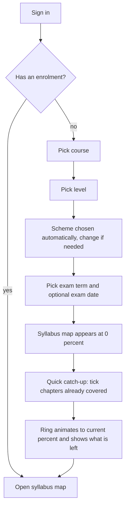
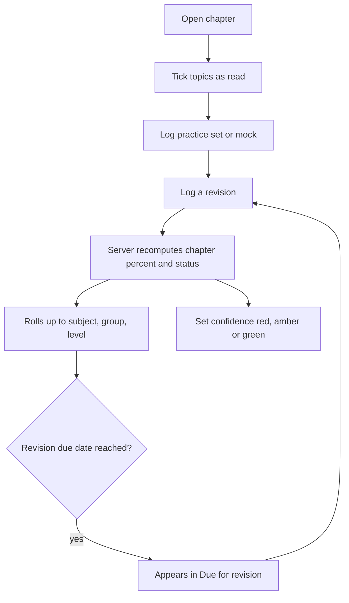

# PRD: F-02 Syllabus Structure and Coverage (with X-05 Taxonomy)

| Field | Value |
| --- | --- |
| Status | Draft for review |
| Owner | Pawan |
| Last updated | 4 Oct 2026 |
| Order | **First** PRD/ERD. Every other pointer references the tables defined here |
| Source | `docs/product/FEATURE_MAP.md`, X-05 Syllabus Taxonomy and F-02 Syllabus Coverage |
| Linked ERD | `docs/product/erd/F-02-syllabus-structure-and-coverage.md` |
| Next | F-01.1 Pomodoro Focus Timer (second), then X-04 Ingestion Service, then F-01.2 Time Tracker + Analytics |

---

## 1. Problem and goal

A CA, CS or CMA student faces a huge syllabus split across levels, groups, papers, chapters and topics, and keeps asking: "How much have I really covered? What is left? What should I revise?" Today the answer lives in a notebook, a coaching schedule or a vague feeling.

**Goal, in two parts:**

1. **Syllabus structure (the backbone).** A clean, versioned map of every course: course, level, scheme, group, subject (paper), chapter and topic, with marks weightage. It drives navigation, public SEO pages, tagging in every other feature, and the Today and planner features later.
2. **Syllabus coverage (the student's progress).** Per student, show coverage in percent from group, to subject, to chapter, built from honest signals (reading, practice, revision, mock and past papers), with a status per chapter, a revision counter, a confidence rating and a "due for revision" date.

Why first: Pomodoro, Time Tracker, Notes, Question Bank, Mocks, Amendments and Today all ask "which subject and chapter?". Building the structure once, correctly and versioned, avoids rework in every later feature.

## 2. Users and scenarios

**Aarav, CA Intermediate, May 2027 attempt.**
He signs up, picks CA, Intermediate, May 2027. Instantly he sees his six papers as rings at 0%. A "Quick catch-up" screen lets him tick the chapters he already finished in coaching. His overall ring jumps to 22% and he sees the plan of what is left. This is the aha moment.

**Neha, CS Executive, studying while working.**
She skips two chapters her institute has marked "not in my scheme". She marks them Excluded; the percentages recompute without them. Before her paper she opens Company Law and sees which chapters are green (exam ready), amber and red, with a "due for revision" list.

**Rohan, CMA Final, switching to a new scheme.**
The institute releases a new scheme. His old progress must not vanish. The system keeps his progress on the old scheme and carries matching chapters into the new one, listing the chapters that are new so he can start them.

**A parent or friend opens a WhatsApp link** to `/courses/ca/intermediate/taxation` (public). The page shows the paper, chapters and marks weightage with a preview image and a "Track your coverage" button. This is the SEO and growth surface.

## 3. Success metrics

| Metric | Definition | Target | Event(s) |
| --- | --- | --- | --- |
| Enrolment activation | New users who complete course and level selection | 80% of sign-ups | `enrollment_created` |
| Aha reached | Users who tick or bulk mark at least 3 chapters in the first session | 60% | `coverage_catchup_completed`, `topic_ticked` |
| Weekly return | Users who update progress or revision at least once in a week | 50% | `coverage_updated` |
| Revision loop | Chapters with at least one logged revision per active user per month | 3 | `revision_logged` |
| Public reach | Organic landing sessions on syllabus pages | track | PostHog pageview on `/courses/*` |
| Data quality | Syllabus issues reported per 1000 views | under 2 | `syllabus_issue_reported` |

## 4. Scope

### In scope (v1)

**Structure**

1. Taxonomy: course, level, scheme version, group, subject, chapter, topic, with marks weightage and optional term calendar.
2. Seed for CA, CS and CMA from the official syllabi, human reviewed. The first fully curated set is the course chosen for launch (see Q7 in the feature map; default CA Intermediate), the others can start at subject level.
3. Scheme versioning with a mapping between old and new chapters.
4. Public, server-rendered, indexable pages for course, level, subject and chapter with OG previews (extends the existing `/courses/*` routes).
5. Admin ability to edit and publish the taxonomy (Django admin first, a custom admin console later).
6. A "Report a wrong syllabus item" link.

**Coverage**

7. Onboarding enrolment: course, level, scheme, target exam term, optional exam date.
8. Syllabus map screen with group, subject and chapter percentages and status.
9. Chapter page with a topic checklist, practice, revision and mock logging, notes link slot, confidence rating.
10. Coverage formula with configurable weights (default read 40, practise 30, revise 20, mock 10) and a marks-weighted view.
11. Status per chapter: not started, reading, practised, revised once, revised twice or more, exam ready.
12. Revision counter and next revision due date (spaced schedule), and a "Due for revision" list.
13. Exclude or skip a chapter or subject.
14. Quick catch-up: bulk mark chapters as already covered.
15. Event ledger so other features (Tracker, Question Bank, Mock tests, Notes) can feed coverage later without changes to the model.
16. Switch to a new scheme with carry-over.
17. Data export and delete.

### Out of scope (later)

| Item | Planned for |
| --- | --- |
| Automatic practice and mock signals from real attempts | Question Bank and Mock Tests PRDs (they will call the event API defined here) |
| Time spent per chapter charts | F-01.2 Time Tracker and Analytics (this PRD only shows last studied and total minutes forwarded by the tracker) |
| Study planner and Today tiles | Planner and Today PRDs (they read the due list and priorities) |
| Syllabus scraping and auto-proposed changes | X-04 Ingestion Service PRD (publishes a draft scheme or amendment for review) |
| Sharing coverage with a mentor | Mentor mode, Phase 5 |
| Coaching-specific schedules ("Course bought") | After Courses and MAT exist |

## 5. User flows

### 5.1 Onboarding and the aha moment



### 5.2 Chapter progress loop



### 5.3 Edge cases

| Case | Behaviour |
| --- | --- |
| Student ticks a topic then unticks | The ledger records both events; percent recomputes. |
| Student excludes a chapter that had progress | Progress is kept but not counted; unexcluding restores it. |
| Student marks all topics read but has no practice | Percent is read weight only (for example 40%); status is "reading", then "practised" after the first practice log. |
| A topic is removed or merged in a new scheme | Old progress stays on the old scheme; the mapping decides carry-over: same, split, merged, removed, new. Unmapped chapters start at 0. |
| Student has no enrolment (guest) | Public pages work; the app asks to sign in and pick course and level when they open My Coverage. |
| A chapter has no topics yet (seed incomplete) | Chapter-level tick is available; coverage uses a single implicit topic until topics exist. |
| Offline | Ticks and logs queue locally with client ids and sync later without duplicates. |
| Two devices edit at once | Last write wins per topic (timestamps compared on the server); the ledger keeps both events. |
| Student changes the weights | Percentages recompute immediately; history is not rewritten, only the presentation. |
| Level not yet curated (only subject names) | Chapter list shows "Coming soon" and subject-level self-reported percent only. |

## 6. Functional requirements

P0 must ship in v1, P1 should ship in v1, P2 can follow.

### Structure (X-05)

| ID | Requirement | Priority | Acceptance criteria |
| --- | --- | --- | --- |
| FR-1 | Hierarchy: course, level, scheme, group (optional), subject, chapter, topic | P0 | Given CA Intermediate, then groups, papers and chapters render in order with stable keys. |
| FR-2 | Every syllabus node has a stable `key` (slug) that never changes across schemes, plus display `name` | P0 | A renamed chapter keeps its key, so old links and progress keep working. |
| FR-3 | Marks weightage per chapter (min and max marks, or a single value) and total marks per subject | P0 | Given a 15-mark chapter, then the marks-weighted view counts it more than a 5-mark chapter. |
| FR-4 | Scheme versions with status draft, published, retired and an applicability window (from exam term, to exam term) | P0 | Given two schemes, then an enrolment is bound to exactly one. |
| FR-5 | Chapter mapping between schemes (same, split, merged, removed, new). The default map is proposed from equal keys, then equal or close names and position in the paper, then merges and splits; every proposal below high confidence, and every merge, split, move or rename, is flagged for editor review | P1 | Given a scheme switch, then progress carries over for mapped chapters, and topics carry over on equal keys or equal names. Given a chapter renamed between schemes, then the proposed map links it and flags it for review. |
| FR-6 | Public indexable pages: course list, level, subject and chapter with title, description, JSON-LD and OG image. Course, level and paper pages share a per-course image; chapter pages have their own. Pages read the API and fall back to the static catalog | P0 | Given the chapter URL shared on WhatsApp, then the preview shows chapter name, paper and course. |
| FR-7 | Sitemap includes all published syllabus pages | P0 | `sitemap.xml` lists every published subject and chapter URL. |
| FR-8 | Admin can create, edit, reorder (drag and drop, or Alt+Arrow keys, for papers, chapters and topics) and publish nodes; publish makes a scheme visible, retiring does not delete | P0 | Given a draft scheme, then it is invisible to students until published. Given a dragged chapter, then its siblings are renumbered and the move is in the change history. |
| FR-9 | Seed loader that is idempotent and keyed on stable keys | P0 | Running the seed twice creates no duplicates. |
| FR-10 | "Report a wrong syllabus item" from any public or private page: level, paper and chapter pages, and the syllabus map, paper and chapter screens | P1 | Report is stored with the node and the user (optional). |
| FR-11 | Exam term calendar (for example May 2027 attempt) with exam start and end dates | P1 | Given a term, then the app shows days remaining. |

### Coverage (F-02)

| ID | Requirement | Priority | Acceptance criteria |
| --- | --- | --- | --- |
| FR-12 | Enrolment: course, level, scheme, target term, optional exam date, daily hours; one active enrolment per level | P0 | Given a signed-in user without enrolment, then the app routes to onboarding. |
| FR-13 | Syllabus map with percent for level, group, subject and chapter | P0 | Given progress on two chapters, then subject and group percents match the formula. |
| FR-14 | Topic checklist per chapter with tick and untick | P0 | Given a chapter with 10 topics and 4 ticked, then read progress is 40%. |
| FR-15 | Log events: practice set done, mock or past paper done (with optional score), revision done | P0 | Given a revision logged today, then `revision_count` increments and the next due date is set. |
| FR-16 | Coverage formula: `coverage = read*wR + practice*wP + revise*wV + mock*wM`, each component 0 to 100, weights sum to 100, default 40/30/20/10 | P0 | Given read 100, practice 50, revise 50, mock 0, then coverage is 65. |
| FR-17 | Component targets per chapter: practice sets target, revisions target, mocks target (defaults 1, 2 and 1, overridable by admin per chapter, editable in the chapter list) | P1 | Given a target of 2 revisions and 1 done, then revise component is 50. |
| FR-18 | Chapter status derived from the data: not started, reading, practised, revised once, revised twice or more, exam ready (coverage 85 or more and at least 2 revisions) | P0 | Status updates within one second of an event. |
| FR-19 | Spaced revision schedule: next due date after each revision (defaults 3, 7, 21, 45 days, configurable) | P1 | Given the first revision today, then the due date is in 3 days. |
| FR-20 | "Due for revision" list across the enrolment, ordered by overdue days and marks weight | P1 | Overdue and high-weight chapters appear first. |
| FR-21 | Confidence rating per chapter: red, amber, green, shown beside the measured percent | P1 | Rating is stored per student and chapter. |
| FR-22 | Exclude a chapter or subject; excluded nodes are removed from percent maths | P0 | Excluding a chapter of 10 marks changes the denominators of its subject. |
| FR-23 | Marks-weighted roll-up toggle (simple average or marks-weighted) on the syllabus map and on the paper screen; an explicit `?view` is kept when moving from the map to a paper | P1 | Toggle changes subject and level percent without reloading. Given `?view=weighted` on either screen, then both show the weighted percent. |
| FR-24 | Quick catch-up: select several chapters or a whole subject and mark them as read, with an optional "also revised once" | P0 | Given three chapters selected, then three read components become 100 and the ring animates. |
| FR-25 | Custom weights and revision schedule on the Coverage settings page, with reset to defaults | P1 | Weights must total 100; otherwise Save is disabled. |
| FR-26 | Event ledger API for other modules: `POST` internal service call `coverage.services.record_event` with type, chapter, value, source, client id | P0 | Duplicate client ids create one event. |
| FR-27 | Time forwarded by the tracker is shown as "last studied" and "total minutes" per chapter; it does not change the percent | P1 | After a Pomodoro round tagged to a chapter, the chapter shows updated last studied. |
| FR-28 | Scheme switch with carry-over and a summary of what carried, what is new and what no longer exists, as lists of chapters and not only counts | P1 | Given a mapped chapter at 60%, then it shows 60% in the new scheme and is listed under carried, with the old chapter it came from. |
| FR-29 | Export all coverage data (JSON) and delete all coverage data | P2 | Delete removes enrolments, progress, events and settings. |
| FR-30 | Feature flag `syllabus_coverage`, evaluated on the web and on the API (PostHog, per user, fail-open); public syllabus pages are not behind a flag; a student can always export and delete their own data | P0 | Flag off hides My Coverage only. Given the flag off for a user, then every coverage endpoint except export and delete answers 403 `feature_disabled` and the web shows the "not available yet" state. |
| FR-31 | Coverage writes that carry a client id (tick a topic or chapter, log an event) are kept in a persisted offline queue when the network fails, shown as "N changes saved on this device", and replayed in order with the same client ids when the student is back online | P1 | Given a tick made offline and replayed twice, then the server counts it once. |

## 7. Screens, URLs and design-system needs

### Public (SSR, indexable)

| Screen | URL | Notes |
| --- | --- | --- |
| Courses | `/courses` | exists as the courses list today |
| Course | `/courses/$course` | CA, CS, CMA |
| Level | `/courses/$course/$level` | exists; extends to list schemes and subjects |
| Subject (paper) | `/courses/$course/$level/$subject` | marks, chapters, weightage, group |
| Chapter | `/courses/$course/$level/$subject/$chapter` | topics, weightage, "Track this chapter" call to action |

Each page uses `buildHead()` with a unique title, description, canonical URL, JSON-LD (`Course` or `Article` style as suitable) and an OG image. The OG image for the shareable pages is generated per course and level.

### Private (noindex)

| Screen | URL | Notes |
| --- | --- | --- |
| Onboarding | `/app/onboarding` | course, level, term, catch-up |
| Syllabus map | `/app/syllabus` | rings and bars for groups and subjects. Query: `?view=weighted&status=due` |
| Subject coverage | `/app/syllabus/$subject` | chapter list with percent, status, confidence |
| Chapter coverage | `/app/syllabus/$subject/$chapter` | topics, logs, revision history, notes slot |
| Due for revision | `/app/revision` | later joined by recall (F-15) |
| Coverage settings | `/app/settings/coverage` | weights, schedule, scheme, exclusions |

### Layout of `/app/syllabus` (mobile first)

```
┌──────────────────────────────┐
│ CA Intermediate · May 2027   │
│        ╭────────╮            │
│       │   47%    │  overall ring      Weighted ▢
│        ╰────────╯            │
│ Group 1                      │
│  Advanced Accounting   ████░░ 62%  ●green │
│  Corporate and Other Laws ██░░░ 35% ●amber│
│  Taxation              ███░░░ 48%  ●amber │
│ Group 2   ...                │
│ Due for revision (4)  ›      │
└──────────────────────────────┘
```

Aha moment: after Quick catch-up the overall ring animates from 0 to the new value and a card says "You have already covered 22% of CA Intermediate. 78% to go. Start with Taxation: 3 chapters not started."

### Design-system components

Existing: Button, Card, Badge, Input, Tabs, Container, Section, Reveal. Needed (shared with the Pomodoro PRD where it overlaps, built once): `ProgressRing`, `ProgressBar`, `StatusBadge` (chapter status), `Checkbox`, `Accordion` (group, subject, chapter tree), `Select/Combobox`, `Dialog/Sheet`, `Toast`, `Skeleton`, `Stepper` (onboarding), `Tooltip`, `EmptyState`, `Breadcrumb`, `RatingDot` (red, amber, green).

## 8. Data and permissions

- **Syllabus (taxonomy) data is public read, admin write.** It is the same for every student. Writes need an admin or editor role (Django admin, later the web admin console).
- **Coverage data is private to the student.** Enrolments, progress, events, settings. Read and write only by the owner through the API.
- Entities and columns: see the ERD.
- Study habits and self-assessed confidence are personal data. They are exported or deleted on request.
- Retention: coverage is kept until the student deletes it. Old schemes are retired, never deleted, so history stays readable.

## 9. API surface

All paths under `/api/v1/`. Errors use `{"error": {code, message, details}}`.

### Syllabus (public read, CDN cacheable with `Cache-Control: public, s-maxage=300, stale-while-revalidate=3600`)

| Method and path | Purpose |
| --- | --- |
| GET `syllabus/courses/` | Courses with levels |
| GET `syllabus/courses/{course}/levels/{level}/` | Level with current scheme, groups, subjects |
| GET `syllabus/subjects/{subject_id}/` | Subject with chapters and weightage |
| GET `syllabus/chapters/{chapter_id}/` | Chapter with topics |
| GET `syllabus/terms/` | Exam terms |
| POST `syllabus/reports/` | Report a wrong item (auth optional, rate limited) |

Public pages are rendered on the server by the web app through route loaders that call these endpoints, so crawlers and WhatsApp see full HTML.

### Coverage (auth required, and gated by the `syllabus_coverage` flag except export and delete)

| Method and path | Purpose |
| --- | --- |
| GET, POST `coverage/enrollments/` | List, create enrolment |
| PATCH `coverage/enrollments/{id}/` | Change term, date, scheme (with carry-over), archive. A scheme change returns `switch_summary`: counts plus `carried` (chapter, subject, relation, the old chapters it came from), `new` and `removed` lists |
| PUT `coverage/enrollments/{id}/electives/` | Choose the elective for each optional paper `{choices: {slot_key: subject_id or null}}`; only the chosen one counts |
| GET `coverage/overview/` | Level, group, subject percents for the active enrolment (params: `weighted`) |
| GET `coverage/subjects/{subject_id}/` | Chapter rows with percent, status, confidence |
| GET `coverage/chapters/{chapter_id}/` | Topics, components, events summary, revision history |
| PUT `coverage/topics/{topic_id}/` | Tick or untick `{done, client_id}` |
| POST `coverage/catchup/` | Bulk mark chapters `{chapter_ids, also_revised}` |
| POST `coverage/events/` | Log practice, mock, revision `{chapter_id, type, value?, client_id}` |
| PUT `coverage/chapters/{chapter_id}/confidence/` | Red, amber, green |
| PUT `coverage/chapters/{chapter_id}/exclusion/` | Exclude or include |
| GET `coverage/due/` | Due for revision |
| GET, PUT `coverage/settings/` | Weights, schedule, weighted default |
| GET `coverage/export/` and DELETE `coverage/` | Export and delete all |

Internal service interface (not HTTP): `coverage.services.record_event(user_id, chapter_id, type, value, source, client_id)` is the single entry point used by the tracker, question bank, mock tests and notes.

## 10. Analytics events and notifications

| Event | Properties |
| --- | --- |
| `enrollment_created` | course, level, scheme, term |
| `coverage_catchup_completed` | chapters_count, resulting_percent |
| `topic_ticked` / `topic_unticked` | subject_key, chapter_key |
| `practice_logged`, `mock_logged`, `revision_logged` | subject_key, chapter_key, score_bucket |
| `confidence_set` | rating |
| `chapter_excluded` | subject_key |
| `coverage_settings_changed` | changed_keys |
| `scheme_switched` | from, to, carried_count, new_count |
| `electives_chosen` | slots (how many elective papers were set in the request), cleared (true when one was set back to "decide later") |
| `coverage_write_queued` | kind (tick, practice_done, mock_done or revision_done): a write was saved on the device because the network failed |
| `syllabus_issue_reported` | node_type |
| `coverage_milestone_reached` | scope (subject or level), milestone (25, 50, 75, 100) |

Notifications later (X-01): revision due, "3 chapters overdue in Taxation", milestone reached, new scheme or amendment affecting a chapter you finished.

## 11. Non-functional requirements

| Area | Requirement |
| --- | --- |
| Performance | Overview endpoint under 200 ms p95 for a full level (about 150 chapters). Tick event acknowledged under 300 ms. Public syllabus pages cached at the CDN; server render under 500 ms uncached. |
| Accuracy | Percent is always derived from stored facts; recomputing from the ledger gives the same result (tested). |
| Reliability | Events are idempotent; ticks never duplicate. |
| Accessibility | WCAG 2.2 AA. Progress rings have text equivalents ("Taxation, 48 percent, amber confidence"). Colour is never the only signal (status label plus icon). |
| SEO | Public syllabus pages: unique title and description, canonical, JSON-LD, sitemap, OG image 1200x630, breadcrumbs. Private pages `noindex`. |
| Mobile | Chapter list and tick targets at least 44 px; swipe actions optional. |
| Security | Taxonomy writes need an admin role. Student data scoped by user id on every query. |
| Privacy | Coverage never leaves the app; no sharing in v1. |
| Cost | No AI use in v1. Public pages cacheable. |
| i18n | English first; keys are stable so Hindi names can be added as translations later. |

## 12. Risks and open questions

| # | Question or risk | Proposed default |
| --- | --- | --- |
| Q1 | Accuracy of the syllabus content (schemes change, weightages differ by source) | Seed only from official institute documents, human review before publishing, show "Based on the {scheme} issued by {institute}" with a source link, and a report-wrong-item link. Weightage ranges are indicative, not official. |
| Q2 | Self-reported versus computed coverage | Both: topics ticked by the student, practice and mock initially self-logged; automatic signals replace self-logging as Question Bank and Mock Tests ship. |
| Q3 | Which course gets a full chapter and topic seed first | Default CA Intermediate; others start at subject level (Q7 in the feature map). |
| Q4 | Topics granularity: too fine is a chore to tick | Topics are optional per chapter; chapter-level tick works. Seed topics only where the syllabus names them. |
| Q5 | Marks weightage source | Institute-published where available, otherwise labelled "analysis based" (later from Paper Analysis, F-11). |
| Q6 | Should exam ready be self-declared | Derived by default (85 percent and 2 revisions); the student can override with confidence green. |
| R1 | Scheme change mid-preparation | Versioned schemes plus chapter mapping (FR-4, FR-5). |
| R2 | Copyright on syllabus text | Syllabus structure (titles, order, marks) is facts. Do not copy explanatory text; link to the institute source. Legal review before bulk publishing. |
| R3 | Tick fatigue | Quick catch-up, bulk actions, and automatic signals later. |

## 13. Rollout

1. **Phase A:** database, seed for the launch course, public API, admin editing, tests.
2. **Phase B:** public syllabus pages with SEO and OG (usable without sign-in, helps growth immediately).
3. **Phase C:** onboarding, syllabus map, chapter page, logging, behind the `syllabus_coverage` flag for internal use.
4. **Phase D:** closed beta with about 50 students; tune weights and defaults.
5. **Phase E:** general availability; Pomodoro and the Tracker then attach to the same chapters.
6. **Support notes:** FAQ on how the percent is computed; a visible "How is this calculated?" popover.

## 14. Slicing into PR-sized work (draft)

1. `syllabus` backend: models, migrations, selectors, public endpoints, tests
2. Seed loader and the first curated seed (launch course) plus Django admin
3. Web: public subject and chapter routes with SEO, OG image, sitemap
4. Design-system primitives: ProgressRing, ProgressBar, StatusBadge, Checkbox, Accordion, Stepper
5. `coverage` backend: enrolment, event ledger, recompute service, overview and chapter endpoints, tests
6. Web `coverage` module: onboarding and Quick catch-up
7. Web: syllabus map, subject and chapter coverage screens, logging
8. Revision schedule, due list, confidence, exclusion
9. Settings (weights, schedule), scheme switch with carry-over
10. Analytics events, feature flag, export and delete
