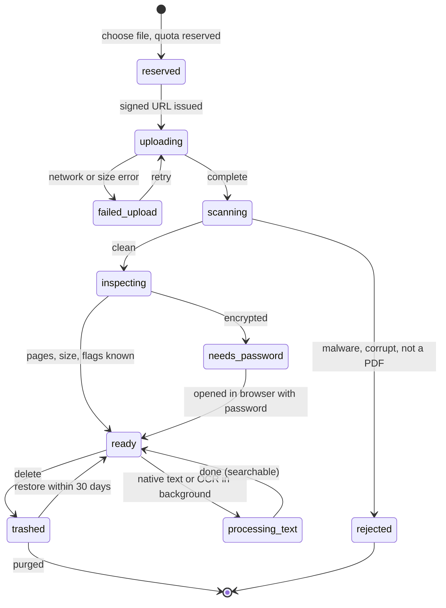
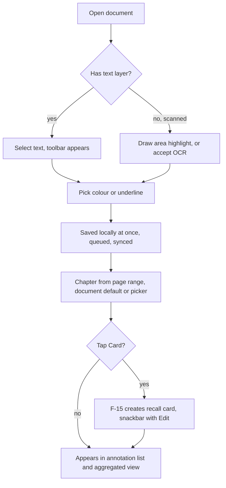
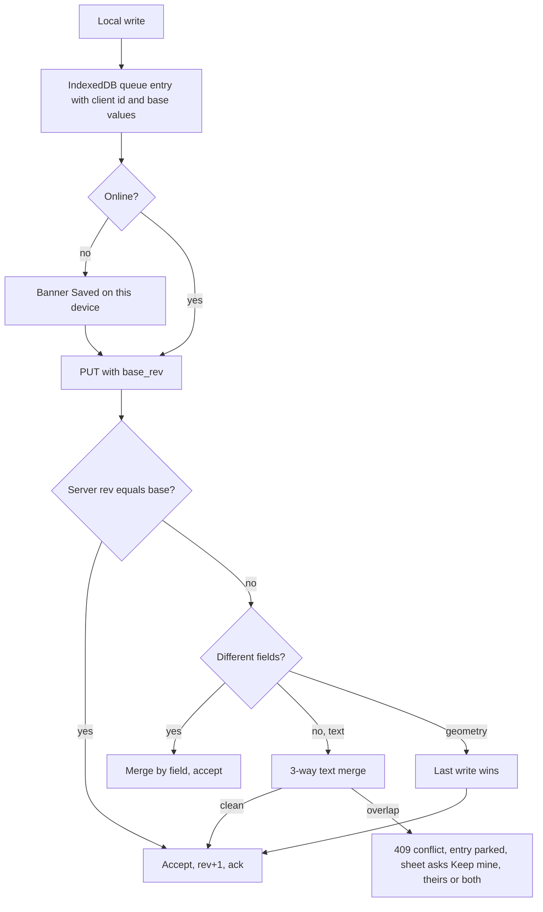
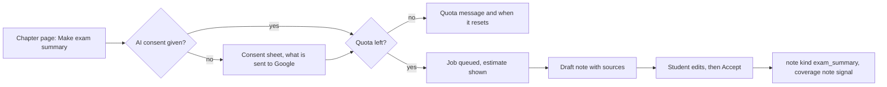

# PRD: F-03 Notes and PDF Editor

| Field | Value |
| --- | --- |
| Status | Draft (for founder review) |
| Owner | Pawan (founder) |
| Last updated | 2026-10-05 |
| Source | `docs/product/FEATURE_MAP.md` section F-03 (item 3 and page 3 "Notes"), page 2 mind map ("Notes", "Exam summary notes" as coverage signals), section 5 (X-01, X-02, X-04), section 7 (risks 4, 5, 6) |
| Linked ERD | `docs/product/erd/F-03-notes-and-pdf-editor.md` |
| Role | Study-content pointer (Phase 3). Gives every chapter a private place for typed notes, PDF study material with highlights and marks, and one aggregated "everything I noted for this subject" view. Feeds My Coverage (F-02), recall cards (F-15), Today (F-13) and the context agent (X-02) |
| Modules | API `apps/api/modules/notes`; web `apps/web/src/modules/notes`. Uses shared `media`, `core/events.py`, `core/jobs.py` (F-06) and the PDF worker described in the ERD |
| Feature flags | `notes` (typed notes, aggregated views, search; R1), `notes_pdf` (PDF library, reader, annotations, OCR, export; R2), `notes_ai` (exam summary notes, AI OCR; R3), `notes_share` (share by link; R3). Server checked, 403 `feature_disabled` |
| Depends on | F-02 taxonomy (through `syllabus.selectors`), F-06 `media`, events and jobs, `profiles.role`, a PDF-capable worker (ERD section 6.5). Soft dependencies: F-15 (recall cards), F-13 (Today), F-14 (amendments), X-01 (notifications) |

---

## 1. Problem and goal

A CA, CS or CMA student studies from 20 to 40 MB module PDFs, coaching PDFs, scanned photocopies and her own handwriting, and keeps notes in a mix of WhatsApp "saved messages", phone gallery photos, a PDF reader that cannot sync, and a notebook. At revision time nothing is findable ("where did I note the Section 17(5) exceptions?"), nothing is tied to the syllabus, and highlights never turn into something she is quizzed on.

**Goal, in four parts:**

1. **A fast, calm PDF reader with a non-destructive annotation layer.** Upload a PDF, read it on a 360 px phone, highlight, underline, draw, add sticky notes and text boxes, bookmark. The original file is never modified; marks live in our database as normalised coordinates per page, sync across devices, work offline, and can be exported as a flattened PDF.
2. **Typed notes with formulas, tables and images**, using the same rich-content format as the Question Bank (Markdown plus KaTeX), versioned and recoverable.
3. **Everything linked to the syllabus.** Each note, highlight and document can point to a subject, chapter and topic (F-02). That powers chapter-wise, topic-wise and aggregated views, the "Notes" slot on the chapter page, and the coverage notes signal.
4. **From a mark to learning.** One tap turns a highlight into a recall card (F-15); an AI helper drafts "exam summary notes" from the student's own notes and highlights, with sources, quotas and a human review step.

**Decision, build versus integrate (details in ERD section 0 and Appendix A).** Integrate **pdf.js** (Apache-2.0, Mozilla) as the rendering and text engine behind a thin adapter, and **build our own annotation layer and library** on top of it. Reasons: the value of this feature is the data layer (taxonomy links, tags, recall cards, offline conflicts, aggregated views), which no viewer library models; the annotation toolset we need is six tools; pdf.js's built-in editor serialises annotations into a modified PDF and exposes no per-annotation events, so it cannot be our source of truth; Nutrient (PSPDFKit) is commercial and per-domain, a cost line that scales with free-tier students; EmbedPDF (Apache-2.0, PDFium WebAssembly) is promising but young. Revisit triggers are in ERD 0.

## 2. Users and scenarios

**Aarav, CA Intermediate, on a crowded train (360 px phone).** He opens the 28 MB Taxation module PDF he uploaded last week. It resumes at page 142 in under 2 seconds. He long-presses a sentence on ITC blocked credits, drags the handles, taps the green dot ("Formula or rule" in his colour legend) and the toolbar offers "Card". One tap makes a recall card (F-15) and a snackbar says "Card added to GST: ITC". At home the Taxation chapter page in My Coverage shows "11 highlights, 2 notes", and the aggregated view lists them with page links.

**Neha, CS Executive, scanned coaching PDF.** She uploads a 320-page photocopied PDF. The reader opens at once (area highlights work immediately); a banner says "Scanned pages. Make it searchable? About 25 minutes." She accepts; search starts working page by page while OCR runs. Next week she searches "Section 149" and lands on page 211 with the hit marked.

**Rohan, CMA Final, phone and laptop, patchy Wi-Fi.** He highlights on the phone in a lift (offline); the laptop edits the same sticky note meanwhile. When the phone reconnects, a sheet shows "This sticky note changed on another device" with both texts and Keep mine, Keep theirs, Keep both. Nothing is lost. Before the exam he taps "Make exam summary" for Cost Audit chapter 4; the draft arrives in a minute, each bullet linked to his highlight; he edits two bullets and accepts it.

**Kavya, first upload fails at 80 %.** On mobile data the 40 MB upload drops. The card says "Upload paused: connection lost. Retry" and keeps the quota reservation for 30 minutes; retry restarts cleanly and the failure never leaves a half file in her library.

## 3. Success metrics

Starting hypotheses, to calibrate after the first 100 active students. No text of notes, titles or search queries is ever sent to analytics.

| Metric | Definition | Target | Event(s) |
| --- | --- | --- | --- |
| Notes activation | Enrolled students who create a note or open a PDF within 14 days of first seeing Notes | 35% | `note_created`, `pdf_opened` |
| Time to first highlight | Upload complete (or first open) to first annotation, median | under 3 min | `pdf_upload_completed`, `annotation_added` (`first=true`) |
| Reader first paint | Open tap to first page visible, p75, 20 MB PDF on 4G | under 2 s | `pdf_opened` (`ttfp_ms_bucket`) |
| Linking rate | Notes and highlights linked to a chapter | 70% | `item_linked_to_chapter` |
| Revisit rate | Students who open the aggregated view for a subject at least twice in 30 days | 30% | `aggregate_viewed` |
| Highlight to card | Highlights turned into recall cards (when F-15 is on) | 10% | `recall_card_created_from_note` |
| Upload success | Uploads that reach `ready` within 60 s (non-scanned, under 20 MB) | 97% | `pdf_upload_completed`, `pdf_upload_failed` |
| OCR completion | Scanned documents that finish OCR after the student accepted | 95% within 2 h | `ocr_completed` |
| Search usefulness | Searches followed by an open or jump within 30 s | 60% | `notes_search_performed`, `search_result_opened` |
| Offline reliability | Queued note and annotation writes eventually saved without loss | 99.5% | `notes_write_queued`, `notes_queue_replayed` |
| Conflict health | Sync conflicts needing the student to choose, per 1,000 queue replays | under 5 | `annotation_conflict_resolved`, `note_conflict_resolved` |
| Summary acceptance | AI exam summaries accepted (edited or not) | 50% | `exam_summary_accepted`, `exam_summary_ready` |
| Cost guard | AI plus OCR spend per active student per month | under 5 rupees (free plan) | server ledger (`notes_aijob.cost_paise`) |

## 4. Scope

### 4.1 In scope

**R1: Typed notes and the syllabus link (flag `notes`)**

1. Typed notes in Markdown plus KaTeX with toolbar, tables, images, formulas, autosave, version history, trash.
2. Link to subject, chapter, topic; unfiled inbox with suggestions; tags.
3. Subject, chapter, topic and aggregated views with filters (tag, colour, date, kind).
4. Search across notes; the `create_clip` service for other modules; notes count on the chapter page and the coverage `note_added` signal.
5. Offline-first notes (persisted queue, idempotent writes, conflict rules).

**R2: PDF library, reader and annotations (flag `notes_pdf`)**

6. Upload with quota, scan, inspection, large-document mode, encrypted and scanned detection.
7. Reader: continuous scroll, fit-width, zoom, resume, outline, page tones, in-document search, distraction-free chrome.
8. Annotations: highlight, underline, pen, text box, sticky note, bookmark, area highlight; colours with student-defined meaning; tags; chapter link by page range.
9. Scanned PDFs: Tesseract OCR job, OCR text layer for selection and search; area highlights always.
10. Full-text search across all PDFs; export flattened PDF; "Download my notes".
11. One-tap highlight to recall card (needs F-15); offline annotation queue with conflict handling.
12. Platform-hosted PDFs (for example licensed amendment PDFs) openable in the reader without using quota.

**R3: Smart and share (flags `notes_ai`, `notes_share`)**

13. AI exam summary notes from the student's own notes and highlights, with consent, sources and quotas.
14. AI OCR for low-confidence or handwritten pages (paid plans), replace-edition with re-anchoring, offline PDF packs, resumable large uploads.
15. Share a note or highlight digest by link, read-only, expiring, revocable (never the PDF).

### 4.2 Out of scope

| Item | Why or when |
| --- | --- |
| Real-time co-editing, comments from others | Single-owner data model; CRDT revisit trigger in ERD 0 |
| Editing PDF text, form filling, true redaction, page reorder | Different product; revisit with EmbedPDF if demanded |
| Sharing or hosting students' PDFs, public note marketplace | Copyright (FEATURE_MAP risk 4); see 8.6 |
| Audio and video notes, handwriting recognition inside typed notes | Later |
| Mentor view of a student's notes | Mentor mode (FEATURE_MAP section 6) |
| Importing from Notion, GoodNotes, OneNote | `[NEW]` P2 after R3: Markdown and DOCX import through the clip format |
| Native apps | Web only; installable PWA is a platform decision (Q-F03-12) |

## 5. User flows

### 5.1 PDF lifecycle



`ready` means readable and annotatable. Text extraction and OCR are background enrichments that never block reading.

### 5.2 Read, mark, learn



### 5.3 Sync and conflicts



### 5.4 Exam summary (R3)



### 5.5 Edge cases (designed and tested)

| Case | Behaviour |
| --- | --- |
| Huge PDF (over 25 MB or 400 pages) | "Large document mode": no thumbnails strip, two pages prefetched, text search served by the server only, canvas pixel cap, a one-line notice once. Hard limits (free plan): 50 MB, 1,000 pages. Over a hard limit the upload is refused before bytes move, with the limit and what to try (split the PDF, compress) |
| Encrypted with a user password | Opens only after the student types the password in the browser (never sent to the server in R2); background text extraction and OCR stay paused with "Locked: search and OCR need the password" |
| Owner-password or copy-restricted | Opens; annotations allowed; "Export flattened" and AI features disabled with the reason; no OCR of text the file marks as not copyable `[VERIFY with counsel]` |
| Scanned PDF | Detected when most pages have no extractable text; area highlight and sticky note work at once; OCR offered with page estimate and monthly OCR page quota |
| Corrupt or partly broken PDF | Pages that render are shown; failing page shows "This page could not be drawn. Retry or skip"; if the file cannot be opened at all the upload is `rejected` with `pdf_corrupt` |
| Upload fails or is abandoned | State `failed_upload` with Retry; reservations released after 30 minutes; orphans purged in 24 hours |
| Quota exceeded | Blocked before upload with used/limit, the five largest documents with Delete or Download, and the plan boundary; notes (text) keep working up to their own limits |
| Same file twice | Detected after scan by SHA-256: "You already have this file" with Open or Keep both (a second copy counts against quota) |
| Page rotated, cropped or different size across devices | Coordinates are normalised to the unrotated crop box, so marks stay on the same text |
| New edition of a PDF | R3: Replace file keeps marks, re-anchors by text quote; unmatched marks appear in "Needs attention" |
| Annotation edited on two devices | Field merge, text 3-way merge, otherwise the conflict sheet; edit beats delete (nothing is lost) |
| Account on two tabs | One tab flushes the queue (Web Locks); the other shows a live count |
| Syllabus scheme switched | Notes and marks follow stable subject and chapter keys; the aggregated view shows them under the new scheme's chapter with the same key, and unmatched ones under "Moved or removed chapters" |
| Chapter removed from the syllabus | Item stays, labelled with the old chapter name; the student can re-link in bulk |
| Deleted item that has a recall card | Student is asked once: delete the card too, or keep it as a standalone card |
| Very long note (over 100,000 characters) | Save is blocked with a counter; "Split into two notes" action |
| Clock skew on a phone | Ordering uses server revision numbers, never client time; client time is only displayed |
| Offline for days (iOS Safari browser) | Browser may clear site storage after 7 days of no use `[VERIFY]`; the queue banner warns when entries are older than 3 days and offers "Export unsynced as a file" |

## 6. Functional requirements

Priority: P0 must ship in its release, P1 should, P2 can follow. Release column: R1, R2, R3 (section 4.1). `[NEW]` marks additions beyond the FEATURE_MAP.

### A. Library and upload (R2)

| ID | Requirement | Pri | Acceptance criteria |
| --- | --- | --- | --- |
| FR-F03-01 | Upload a PDF; quota, size and page limits are checked before any byte moves | P0 | Given 480 MB used of 500 MB, when a 40 MB file is chosen, then no upload starts and the quota-exceeded state shows used, limit and the largest documents |
| FR-F03-02 | Progress, cancel, retry; upload continues while the student navigates inside the app | P0 | Given a 30 MB upload at 40%, when she opens a note, then a progress chip stays in the app layout and completes |
| FR-F03-03 | Pipeline states are visible and the file is readable as soon as it is `ready`; text and OCR enrich later | P0 | Given a 300-page text PDF, when the scan finishes, then Open is enabled before text extraction ends |
| FR-F03-04 | Validation: PDF magic bytes, size, page count, encryption, malware scan; failures name the reason | P0 | Given a renamed `.exe`, then status `rejected` with `scan_rejected` and a plain message; the file is deleted |
| FR-F03-05 | Library list with cover thumbnail, title, pages, progress, status, chapter chips; filter by subject, chapter, tag, status, source; sort by recent or title; "Continue reading" row | P0 | Given 12 documents, then filters narrow the list and the count updates under 300 ms |
| FR-F03-06 | Edit title, source kind (Institute material, coaching, my own notes, handwritten, other), edition label, default chapter | P0 | Given source "coaching", then the document shows a "Private to you" badge and cannot be shared |
| FR-F03-07 | Trash with restore for 30 days; permanent delete frees quota immediately | P0 | Given a delete then Undo within 10 s, then it returns unchanged; after 30 days the file and marks are purged |
| FR-F03-08 | Duplicate detection by content hash | P1 | Given the same bytes uploaded twice, then the second shows "You already have this file" |
| FR-F03-09 | `[NEW]` Platform documents: open a hosted platform PDF (for example an amendment PDF when X-04 licence allows hosting) in the same reader; marks are the student's, bytes do not count towards quota | P1 | Given the service `open_platform_document`, then a document row with `origin=platform` opens and the quota used does not change |
| FR-F03-10 | `[NEW]` Replace a document with a newer edition and re-anchor marks by quote | P2 (R3) | Given 40 highlights and a new edition where text moved 2 pages, then at least the unchanged-text ones re-attach and the rest list under Needs attention |

### B. Reader (R2)

| ID | Requirement | Pri | Acceptance criteria |
| --- | --- | --- | --- |
| FR-F03-11 | Continuous vertical scroll, fit-width default, pinch and double-tap zoom, keyboard and toolbar zoom | P0 | Given a 360 px phone, then page text is readable at fit-width without horizontal page scroll; zoomed pages pan inside the reader |
| FR-F03-12 | First page visible fast: range requests, render visible pages plus one ahead, low-resolution placeholder first | P0 | Given a 20 MB PDF on 4G, then the first page is visible in under 2 s p75 and only about 5 pages hold canvases |
| FR-F03-13 | Resume at the last page and zoom on any device | P0 | Given page 142 on the phone, when opened on a laptop, then it opens at page 142 |
| FR-F03-14 | Distraction-free chrome: top and bottom bars hide on scroll and return on tap or scroll-up; reading area is the full screen | P0 | Given scrolling down, then bars hide after 1 s; a tap in the middle toggles them |
| FR-F03-15 | Page tone: original, paper (follows Reading theme), night (inverts the page, not the marks) | P1 | Given Dark theme, then Night is suggested once; highlights stay visible with 3:1 against the page in every tone |
| FR-F03-16 | Outline (bookmarks of the PDF), page scrubber, "go to page", back to previous position after a jump | P1 | Given a PDF outline, then tapping an entry jumps and shows a Back chip for 10 s |
| FR-F03-17 | In-document search with hit highlighting and next and previous | P0 | Given a text PDF, then typing "ITC" marks hits on visible pages and lists the first 50 |
| FR-F03-18 | Large-document mode (section 5.5) | P0 | Given 600 pages, then thumbnails are off, search is server-side and scrolling stays above 30 fps on a mid-range phone |
| FR-F03-19 | Encrypted PDFs: password prompt in the browser, wrong password retry, never stored or sent in R2 | P0 | Given a user-password PDF, then the prompt appears; three wrong tries show a hint, nothing is stored |
| FR-F03-20 | Copy-restricted PDFs: annotate allowed; export and AI disabled with explanation | P1 | Given a restricted file, then Export flattened is disabled with the reason |
| FR-F03-21 | A page that fails to render shows a retry state without breaking the reader | P0 | Given a corrupt page, then only that page shows the error |

### C. Annotations (R2)

| ID | Requirement | Pri | Acceptance criteria |
| --- | --- | --- | --- |
| FR-F03-22 | Highlight and underline selected text in five colours; stored as normalised line rectangles plus a text quote | P0 | Given a selection across two lines, then two rectangles are saved; rotating the device or zooming keeps them on the same words |
| FR-F03-23 | Pen: freehand ink with three widths and five colours; stylus draws, finger scrolls unless "finger draws" is on; strokes simplified and saved per drawing | P0 | Given a stylus, then drawing does not scroll; palm touches are ignored |
| FR-F03-24 | Sticky note (pin with text up to 2,000 characters), text box, bookmark with a title | P0 | Given a tap on Note then the page, then a pin appears and the text field is focused |
| FR-F03-25 | Area highlight: drag a rectangle on any page (figures, scanned pages) | P1 | Given a scanned page, then a rectangle with colour saves and appears in the list as "Area, page 7" |
| FR-F03-26 | Edit colour, text, tags and chapter; move or resize ink, text box and area; delete with 10 s Undo | P0 | Given a delete then Undo, then the same id and rev+1 return |
| FR-F03-27 | Annotation list (sheet on phones, side panel on desktop) in page order with filters by colour, tag, kind, "mine today"; each row jumps to the mark; works as the screen-reader alternative to marks on canvas | P0 | Given 23 marks, then each row reads "Highlight, page 14, yellow, Formula, ITC blocked credits" |
| FR-F03-28 | `[NEW]` Colour legend: the student names what each colour means (Important, Formula, Section or rule, Doubt, Example); the name is shown beside the colour everywhere and chooses the recall card type | P1 | Given green = Formula, then a green highlight offers "Card: Formula" |
| FR-F03-29 | Non-destructive: the original object in storage is never written; marks live in the database; deleting all marks returns the document exactly as uploaded | P0 | Given any sequence of edits, then the stored file hash is unchanged |
| FR-F03-30 | Page-range to chapter mapping for a document (pages 12 to 40 = GST: ITC), suggested from the PDF outline; a mark inherits the chapter of its page unless set explicitly | P1 | Given ranges, then new marks on page 20 show that chapter chip; changing a range re-links inherited marks, not explicit ones |
| FR-F03-31 | Tags on documents, notes and marks (free text, per student, max 200) | P1 | Given tag "doubt", then it filters lists and the aggregated view |

### D. Typed notes (R1)

| ID | Requirement | Pri | Acceptance criteria |
| --- | --- | --- | --- |
| FR-F03-32 | Create and edit a note in Markdown plus KaTeX with a toolbar (headings, lists, tables, formula, image, task list), live preview, `prose-reading` render | P0 | Given `$\frac{a}{b}$`, then the preview renders it and the saved body is plain Markdown |
| FR-F03-33 | Autosave every 2 s after typing stops, local draft first; reopening after a crash restores the draft | P0 | Given the tab is killed mid-edit, then the text is back on reopen with "Recovered draft" |
| FR-F03-34 | Images in notes (camera or gallery) through `media`; alt text required | P1 | Given an image without alt, then Save warns and offers "Mark decorative" |
| FR-F03-35 | Version history: list, view, compare, restore; every restore is itself a new version | P1 | Given a restore of version 4, then the note has a new head with that text and nothing is deleted |
| FR-F03-36 | Trash and restore for 30 days | P0 | Given a delete, then Undo within 10 s, and Trash lists it for 30 days |
| FR-F03-37 | Quick capture from the global add button and from any chapter page (`?chapter=` prefilled); unlinked notes land in "Unfiled" | P1 | Given capture from a chapter page, then the note is linked without a picker |
| FR-F03-38 | `[NEW]` `create_clip` service and a `SaveToNotes` button used by other modules: wrong answer in review (F-06), illustration (F-12), amendment card (F-14), solution text (F-09) | P1 | Given "Save to notes" on a reviewed MCQ, then a note with the stem, the student's answer and the chapter link exists, idempotent on client id |
| FR-F03-39 | Pin notes; "Unfiled inbox" with one-tap chapter suggestions | P1 | Given 5 unfiled notes, then the hub shows "File 5 notes" and suggestions come from a pure text-match function with no AI |

### E. Linking, aggregation and coverage (R1)

| ID | Requirement | Pri | Acceptance criteria |
| --- | --- | --- | --- |
| FR-F03-40 | Link any note, mark or document to subject, chapter and optional topic using the F-02 picker; stored with stable keys | P0 | Given a chapter pick, then id, `subject_key`, `chapter_key` and `level_id` are saved |
| FR-F03-41 | Views: Hub, Subject (chapters with counts), Chapter (notes, marks, documents, exam summary), Topic filter, Aggregated "everything for Subject X" with filters tag, colour, date range, kind, document; sort recent or by document page | P0 | Given Subject Taxation, then the list shows notes and highlights from all documents and the filters narrow it; URL keeps every filter |
| FR-F03-42 | Chapter page slot in My Coverage: counts, "Open notes", "New note", exam summary status | P0 | Given 11 highlights and 2 notes, then the chapter page shows them and links to the chapter view |
| FR-F03-43 | Coverage signal: when a chapter's active note counts change, emit `notes_chapter_counts_changed`; coverage stores a `note_added` event with the count (display only; coverage percent unchanged, see Q-F03-4) | P0 | Given the first note on a chapter, then the ledger has one `source=notes` event, idempotent on replay |
| FR-F03-44 | Scheme switch continuity: views resolve by `level`, `subject_key`, `chapter_key` | P0 | Given a switch, then notes appear under the equivalent chapter, and unmatched under "Moved or removed" |
| FR-F03-45 | `[NEW]` Amendment awareness: a banner on chapter views "An amendment published 3 Oct may affect this chapter" with a link to F-14 | P2 | Given an F-14 amendment for the chapter newer than the note, then the banner shows |

### F. Search (R1 notes, R2 PDFs)

| ID | Requirement | Pri | Acceptance criteria |
| --- | --- | --- | --- |
| FR-F03-46 | Search typed notes, highlight quotes and comments with filters; results show chapter, kind, snippet | P0 | Given "17(5)", then notes and highlights containing it rank first; p95 under 300 ms |
| FR-F03-47 | Search inside all PDFs (native text and OCR) with page and snippet, grouped by document, jump to the hit | P0 | Given 20 documents, then results list the top 5 pages per document and open the page with the hit marked |
| FR-F03-48 | Empty, partial (text still processing) and typo hints | P1 | Given a document still extracting, then results say "2 documents are still being indexed" |

### G. OCR (R2)

| ID | Requirement | Pri | Acceptance criteria |
| --- | --- | --- | --- |
| FR-F03-49 | Detect scanned pages after upload and offer OCR with the page count and the monthly OCR quota left | P0 | Given a scanned PDF, then the banner shows "About 25 minutes, uses 320 of 500 pages this month" |
| FR-F03-50 | OCR runs as a background job in chunks of 10 pages, progressive (searchable as pages finish), resumable after a crash; identical files are OCR'd once for all students who uploaded the same bytes | P0 | Given a worker restart at page 120, then OCR resumes at page 121; a second student with the same file is `done` instantly |
| FR-F03-51 | OCR text layer lets scanned pages support text selection, highlight and search | P1 | Given OCR done, then long-press selects words on a scanned page |
| FR-F03-52 | Quality indicator per page and "Improve with AI" for low-confidence or handwritten pages (paid, quota, consent) | P2 (R3) | Given a page with confidence 52, then "Improve this page" appears when `notes_ai` is on |

### H. Export (R2)

| ID | Requirement | Pri | Acceptance criteria |
| --- | --- | --- | --- |
| FR-F03-53 | Export a flattened PDF with marks burned in: options page range, include highlights, ink, text boxes, notes appendix, filter by colour or tag; runs as a job, download link valid 24 h | P0 | Given 40 highlights and 3 pen drawings, then the PDF shows them in the right places in any viewer and the original is unchanged |
| FR-F03-54 | "Download my notes": Markdown zip of notes with front matter (chapter, tags), highlight digest per document as Markdown or CSV | P1 | Given a request, then a zip is ready in under 60 s for 500 notes |

### I. Recall (R2, needs F-15)

| ID | Requirement | Pri | Acceptance criteria |
| --- | --- | --- | --- |
| FR-F03-55 | One tap: highlight (or selected note text) to a recall card with the quote as the back, an auto prompt as the front, chapter and topic inherited, kind from the colour meaning; idempotent per mark and kind | P0 | Given a tap, then within 1 s the snackbar shows "Card added" with Edit; a second tap says "Already a card" |
| FR-F03-56 | Card badge on marks and notes; deleting the mark asks about the card | P1 | Given a card, then the mark shows the badge and a link |

### J. AI exam summary (R3)

| ID | Requirement | Pri | Acceptance criteria |
| --- | --- | --- | --- |
| FR-F03-57 | One-time AI consent describing what is sent to Google (the selected notes and highlights, not the PDF) and how to withdraw | P0 | Given no consent, then Generate opens the consent sheet; withdrawing blocks new jobs |
| FR-F03-58 | Generate "Exam summary notes" for a chapter from the student's notes and highlights; quota per plan; estimate before running; async | P0 | Given 5 free summaries per month used, then a quota message with the reset date and no job is created |
| FR-F03-59 | Result is a draft with bullets linked to their sources, labelled "AI draft, check against the material"; Accept creates a note of kind `exam_summary` (one current per chapter); Discard keeps nothing | P0 | Given Accept, then the chapter shows "Exam summary" with its date; the coverage note signal counts it |
| FR-F03-60 | Cache by input hash: regenerating unchanged inputs returns the earlier draft without cost | P1 | Given no change since the last run, then Regenerate says "No changes since your last summary" |

### K. Offline and sync (R1 notes, R2 annotations)

| ID | Requirement | Pri | Acceptance criteria |
| --- | --- | --- | --- |
| FR-F03-61 | Notes and annotations are written locally first and queued with client ids; the shared persisted queue replays them in order; sync state is always visible (Saved, Saving, Offline queued N, Needs attention) | P0 | Given airplane mode, then 12 highlights and a note survive a reload and sync once online with no duplicates |
| FR-F03-62 | Conflict rules as in ERD 3.6: field merge, 3-way text merge, geometry last-write, edit beats delete; unresolved text conflicts open a sheet with Keep mine, Keep theirs, Keep both; parked conflicts never block other queued writes | P0 | Given two devices editing the same sticky note offline, then no text is lost and the sheet appears on the second sync |
| FR-F03-63 | Recently opened notes (200) and the last three opened PDFs are readable offline | P1 | Given offline, then the aggregated view shows cached items marked "Offline copy" |
| FR-F03-64 | One flusher per account across tabs (Web Locks) | P1 | Given two tabs, then writes replay once |
| FR-F03-65 | `[NEW]` Offline PDF pack: "Keep on this device" for up to 3 documents with a storage estimate | P2 (R3) | Given a pack, then the document opens offline and marks queue |

### L. Sharing (R3, P2)

| ID | Requirement | Pri | Acceptance criteria |
| --- | --- | --- | --- |
| FR-F03-66 | Default everything private. Share a note, or a highlight digest of a document (quotes capped at 300 characters, page numbers, comments optional), by link: read-only, expires in 30 days by default, revocable, noindex; never the PDF | P2 | Given a link, then the public page shows the digest, no sign-in; revoke returns 404 immediately |
| FR-F03-67 | Recipient can "Save a copy" after sign-in; report a link | P2 | Given Save a copy, then a new note owned by the recipient exists with a credit line |

### M. Platform

| ID | Requirement | Pri | Acceptance criteria |
| --- | --- | --- | --- |
| FR-F03-68 | Flags per release; flag off hides screens and the API answers 403 `feature_disabled`; export and delete remain available | P0 | Given `notes` off, then every endpoint except export and delete answers 403 |
| FR-F03-69 | Quotas enforced atomically in the database (storage, documents, notes, OCR pages, AI summaries, exports, share links); usage visible in settings | P0 | Given two simultaneous uploads that together exceed the quota, then exactly one is accepted |
| FR-F03-70 | Data export and delete: everything the student owns, including files, is included in "export all" and "delete all" and in the central account deletion | P0 | Given delete all, then rows and storage objects are gone (files within 24 h) and a report is returned |
| FR-F03-71 | Reader and notes meet WCAG 2.2 AA (section 11) | P0 | Given keyboard only, then a student can open, navigate, add a highlight from a search hit or a text selection, and delete it |

## 7. Screens, URLs and design-system needs

All filters, tabs, panels and the current page live in the URL (zod-validated search params). `/app/...` is private and `noindex`. `$subject` and `$chapter` are the stable syllabus keys (not scheme-specific ids), so links survive a scheme switch (audit AUD-017).

### 7.1 Screens and URLs

| Screen | URL | Notes |
| --- | --- | --- |
| Notes hub | `/app/notes` | Continue reading, unfiled inbox, subjects with counts, recent, quick capture |
| Subject view (aggregated) | `/app/notes/$subject` | Chapters with counts; `?tab=all\|notes\|highlights\|documents&tag=&color=&from=&to=&doc=&sort=&cursor=` |
| Chapter view | `/app/notes/$subject/$chapter` | Same filters plus `?topic=`; exam summary card on top |
| Note editor | `/app/notes/n/$noteId` | `?v=4` opens a version, `?panel=history`; `/app/notes/new?chapter=&topic=&clip=` |
| PDF library | `/app/notes/library` | `?subject=&chapter=&status=&tag=&q=&sort=` |
| PDF reader | `/app/notes/pdf/$docId` | `?page=142&zoom=fit&ann=<id>&q=<in-doc search>&panel=annotations\|outline\|search&tool=` |
| Search | `/app/notes/search` | `?q=&scope=all\|notes\|highlights\|pdf&subject=&chapter=` |
| Trash | `/app/notes/trash` | Notes, marks, documents; restore |
| Exam summary draft | `/app/notes/summary/$jobId` | Review, edit, Accept, Discard (R3); start with `/app/notes/summary/new?chapter=` |
| Notes settings and usage | `/app/settings/notes` | Colour legend, page tone, finger draws, OCR default, AI consent, offline documents, usage and quota |
| Public shared note | `/n/$token` | `noindex`, `buildHead` with a neutral title, no JSON-LD (R3) |
| Marketing | `/features/smart-notes` | Already in `modules/catalog/features.ts`; status moves from `soon` when `notes` is on |

### 7.2 Wireframes (mobile first, 320 to 1280 px)

**Reader at 360 px (`/app/notes/pdf/$docId`)**

```
┌────────────────────────────────┐   top bar hides on scroll
│ ←  GST: ITC  Taxation   ⌕  ⋯  │   44 px targets; title truncates
├────────────────────────────────┤
│                                │
│   (page canvas, fit width)     │   marks drawn over the page
│   Input tax credit shall not   │   ▒▒▒▒▒▒▒▒▒▒▒▒▒▒ highlight
│   be available in respect of…  │   ____________   underline
│                          ◉ pin │
│                                │
│   ┌ selection toolbar ───────┐ │   appears at the selection
│   │ ● ● ● ● ●  U  Note  Card │ │   five colour dots, each named
│   └──────────────────────────┘ │
├────────────────────────────────┤
│ p. 142 / 328 ──●────────  ≡ 23 │   page scrubber, annotations count
│ [✎ Mark] [Pen] [Text] [Pin]    │   tool pill, one active tool
└────────────────────────────────┘
```

Tools row collapses to a single "Mark" button while reading; pen mode shows a thin banner "Pen on. Scroll with two fingers" (finger draws off).

**Aggregated subject view (`/app/notes/$subject`)**

```
┌────────────────────────────────┐
│ Taxation          [+ Note]     │
│ [All][Notes][Highlights][PDFs] │   segmented control
│ Chapter ▾  Tag ▾  Colour ▾  ⋯  │   active filters as removable chips
│ ┌ Exam summary: GST ITC ──────┐│   only when one exists (R3 draft button otherwise)
│ ┌────────────────────────────┐ │
│ │ ■ Formula · GST: ITC       │ │   colour has a name and a shape, not colour alone
│ │ "ITC is blocked for motor…"│ │   quote clamps to 3 lines
│ │ Taxation module · p. 142   │ │   tap: open PDF at the mark
│ │ #doubt   ✓ card            │ │
│ └────────────────────────────┘ │
│ ┌ Note · Rules of Place of … ┐ │
└────────────────────────────────┘
```

Desktop: left rail with chapters and counts (320 px), list in the middle, preview pane on the right with the PDF page crop around the mark.

**Library and upload sheet (`/app/notes/library`)**

```
┌────────────────────────────────┐
│ Library        412 of 500 MB   │   usage bar with text, not colour only
│ [ + Upload PDF ]               │
│ ┌──┐ Taxation module  328 p.   │
│ │▒▒│ Ready · read 43%          │
│ └──┘ [Taxation][GST]           │
│ ┌──┐ Coaching scan   320 p.    │
│ │▒▒│ Scanned · OCR 120/320 ▓▓░ │   searchable as pages finish
│ └──┘                           │
│ ┌──┐ RTP May 27.pdf  uploading │
│ │  │ 63% · Cancel               │
└────────────────────────────────┘
```

### 7.3 UI states per screen

Every cell below is designed, built and covered by a component test or showcase entry. "Skeleton" means layout-stable placeholders.

**PDF library**

| State | Behaviour |
| --- | --- |
| First time, empty | "Add your first PDF" with three tips (module, coaching PDF, scanned notes), size limits shown up front, drag and drop on desktop, file picker on phones; typed notes shortcut "Start a note instead" |
| Loading | Skeleton cards with cover blocks; usage bar skeleton |
| Partial | Some cards `processing` (spinner icon plus text "Preparing"), `scanned` (badge "Scanned, search off"), `ocr` (progress), others ready; list stays usable |
| Success | Cards sorted by recent; Continue reading row on top |
| Error | Inline alert with Retry and request id; last good list stays dimmed |
| Offline | Banner "Offline: showing documents on this device"; Upload disabled with reason; offline packs marked "Available offline" |
| Flag off / no permission | "PDF library is not available yet" page (flag `notes_pdf` off); typed notes unaffected |
| Quota exceeded | Upload button opens the quota sheet: used and limit in MB and documents, the five largest documents with Open, Download original, Delete, and "Why is there a limit?"; no dead end |
| Long content | Titles wrap to two lines then truncate with full title in the details; 100+ documents paginate by cursor |

**Upload sheet and failure states**

| State | Behaviour |
| --- | --- |
| Choosing | File name, size, pages after a quick client check (pdf.js reads page count in under 1 s for most files); limits listed; Reserve space happens on Upload |
| Too large or too many pages | Refused before upload: "50 MB limit (this file 63 MB)". Actions: Choose another, "How to shrink a PDF" help |
| Not a PDF or unreadable | "This does not look like a PDF". File is not uploaded |
| Uploading | Progress with bytes, Cancel; continues in the background (progress chip) |
| Upload failure | Network lost: "Upload paused, connection lost" with Retry (restarts the file in R2, resumes in R3); server 5xx: "Something went wrong on our side. Retry" with request id; the reservation is kept 30 minutes |
| Scan rejected | "We could not accept this file" with the plain reason (malware found, file damaged); the object is removed; no technical detail beyond a code |
| Duplicate | "You already have this file: Open it or Keep both" |
| Encrypted | Accepted; card shows a lock icon "Locked: opens with your password" |
| Scanned | Accepted; card shows "Scanned" and the OCR offer |
| Success | Card flips to Ready; toast with Open |

**Reader**

| State | Behaviour |
| --- | --- |
| Loading | Chrome skeleton, first page placeholder at the right aspect ratio from stored page sizes, no layout jump |
| Partial | Later pages render as placeholders until scrolled to; marks load from the local cache first, then delta from the server |
| Success | Continuous pages with marks; page indicator; sync state chip (Saved) |
| Huge PDF | Large-document mode notice once; scrubber replaces thumbnails; search uses server results |
| Encrypted | Password dialog (labelled input, show toggle, error text with `aria-describedby`); Cancel returns to the library |
| Scanned, no OCR yet | Banner "Scanned pages. Search and text selection need OCR. [Make searchable] [Not now]"; area highlight, pen, pin and text box available |
| Scanned, OCR partial | Pages with OCR support selection; others show the area tool; progress in the banner |
| Page render error | That page shows "This page could not be drawn. [Retry]"; the rest works |
| Error opening | Full-page "We could not open this file" with Retry, Download original, Report; request id |
| Offline | Banner "Offline: marks are saved on this device"; uncached pages that cannot load show "Not available offline"; online-only actions (export, OCR) disabled with text |
| Flag off / no permission | Redirect to the library with "Reader is not available yet"; other users' document ids return the standard 404 page |
| Annotation conflict | Chip "1 needs your attention" opens the conflict sheet (section 5.3) with both versions, device names and times |
| Quota or limit | Marks per document capped at 20,000; at 95% a notice; beyond it new marks are blocked with a message and the list of heaviest pages (ink) |
| Long content | A mark with a long comment clamps to 3 lines in lists and expands in a sheet |

**Annotation list sheet and editing**

| State | Behaviour |
| --- | --- |
| Empty | "No marks yet. Select text to highlight, or tap Mark." |
| Loading, error | Skeleton rows; error with Retry; local marks still listed |
| Success | Rows with kind icon plus text, colour name, page, chapter chip, tag chips, card badge |
| Filtered to nothing | "No marks match. Clear filters" |
| Edit sheet | Colour (named swatches), comment, tags, chapter, "Make card", Delete with Undo toast |

**Note editor**

| State | Behaviour |
| --- | --- |
| New | Empty editor with chapter chip prefilled from the URL, placeholder "Start typing, or paste a formula" |
| Loading | Skeleton lines; local draft appears first if present |
| Saving, saved, offline | Status text (not colour only): Saving, Saved, Offline: saved on this device, N waiting |
| Error | "Could not save. Your text is safe on this device. Retry" |
| Conflict | Sheet with Keep mine, Keep theirs, Keep both (merged with markers) and a diff |
| Limits | Counter at 90% of 100,000 characters; images over quota show the quota sheet |
| Long content | Preview scrolls; tables scroll inside their container; formulas wrap or scroll inside |
| Version panel | List of versions with time and source (autosave, manual, restore, AI); Restore and Compare; read-only banner while viewing an old version |
| Trashed | Banner "In Trash until 4 Nov. [Restore]" |

**Aggregated, subject and chapter views**

| State | Behaviour |
| --- | --- |
| Empty subject | "No notes for Taxation yet. [New note] [Open a PDF]"; if documents exist: "Link your PDFs to chapters to see highlights here" |
| Loading, partial | Skeleton list; counts arrive first, items next; PDF-derived snippets can lag |
| Success | Mixed list; filters as chips; exam summary on top when present |
| Filter yields nothing | Suggest the strongest filter to remove |
| Error, offline | Retry; offline shows cached items marked "Offline copy" |
| Moved or removed chapters | A group at the bottom with the old chapter name and "Re-link" bulk action |
| Flag off | `notes` off: "Notes are not available yet" |
| Long lists | Cursor pagination, 30 per page; "Jump to chapter" |

**Search**

| State | Behaviour |
| --- | --- |
| First time | Recent searches (kept on device only) and tips ("Try a section number") |
| Loading | Skeleton rows; results stream by group: notes first, then PDFs |
| Partial | "2 documents are still being indexed" with progress |
| Empty | "No matches for ..." with typo hints and "Search all scopes" |
| Locked or scanned without OCR | "3 documents cannot be searched yet (locked or scanned). [Make searchable]" |
| Offline | Searches cached notes and marks only, labelled |

**Exam summary (R3), consent and quota**

| State | Behaviour |
| --- | --- |
| No consent | Consent sheet: what is sent (selected notes and highlight text), to whom (Google AI Studio), retention, withdraw anywhere in settings |
| Too little material | "Add at least 5 notes or highlights in this chapter first" (threshold server-side) |
| Quota exceeded | Message with used, limit and reset date; Regenerate disabled; manual note still available |
| Running | Progress text with an estimate, can leave the page; X-01 or in-app toast on completion |
| Ready | Draft with sources, banner "AI draft, check against the material"; Accept, Edit, Discard, Regenerate |
| Failed | Plain reason (budget, model error, content blocked), Retry later, quota not charged |

**Share (R3) and public page**

| State | Behaviour |
| --- | --- |
| Dialog | Choose what is shared, expiry (7 or 30 days, never), comments on or off; the PDF is never included (stated) |
| Not allowed | Documents with source kind coaching or Institute material cannot have a digest shared: "Only your own notes can be shared" `[VERIFY with counsel]` (Q-F03-3) |
| Public page | Read-only content, "Shared by" only when she opted in, Save a copy (sign in), Report; link revoked or expired returns a plain "This link is no longer available" |

**Settings and usage**

| State | Behaviour |
| --- | --- |
| Success | Colour legend editor, page tone, finger draws, OCR default (ask, always, never), AI consent toggle, usage bars with numbers and the reset date, offline documents list |
| Error, loading | Standard patterns |
| Quota exceeded | Bars show the limit text "Storage full" with Manage storage |

### 7.4 Design-system components

Existing after F-02, F-01 and F-06's planned slice 8: Button, Card, Badge, Checkbox, Dialog, DropdownMenu, EmptyState, Input, Popover, Progress, SegmentedControl, Select, Skeleton, Slider, Switch, Tabs, TextField, Toast with Undo, Tooltip, `Sheet`, `Combobox`, `TagInput`, `FilterChip`, `RichText`, `RichTextEditor`, `SplitPane`, `DataTable`.

New to `packages/design-system` (showcase entries, all four themes, `check:contrast`):

| Component | Used for |
| --- | --- |
| `SwatchPicker` | Highlight colours: radio group where each swatch has a name and a shape marker; tokens `--highlight-yellow`, `-green`, `-blue`, `-pink`, `-orange` and `--ink-1` to `--ink-5` for pen colours, defined for Reading, Light and Dark, drawn with multiply (original, paper) or screen (night) blending |
| `FloatingToolbar` | Selection toolbar anchored to a rectangle, collision aware, keyboard reachable, hidden from the page reading order until active |
| `FileDropzone` | Drag, drop, pick; shows accepted types and limits; works with keyboard |
| `UsageBar` | Quota meter with text value (shared with F-06 and billing later) |
| `SyncChip` | "Saved / Saving / Offline N / Needs attention" status (also usable by tracker) |

App-specific (stay in `apps/web/src/modules/notes`): `PdfPage`, `PdfReader`, `AnnotationLayer`, `OcrTextLayer`, `PageScrubber`, `AnnotationList`, `ConflictSheet`, `NoteEditor` composition, `AggregatedList`, `ChapterPicker` (wraps coverage/syllabus pickers), `SaveToNotes` (exported through the barrel for other modules).

Aha moments to instrument: first highlight appearing on the chapter page in My Coverage (`annotation_added` then `chapter_notes_seen`), first one-tap recall card, first search that jumps to a PDF page, first accepted exam summary.

## 8. Data and permissions

Entities, columns and indexes are in the ERD. Everything is reached only through the Django API; the Supabase Data API stays closed and RLS is deny-by-default.

### 8.1 Entities at a glance

| Group | Tables (ERD section 2) | Owner |
| --- | --- | --- |
| Library | `notes_document`, `notes_documentchapter` | `notes` |
| Derived file content (shared by identical bytes) | `notes_filecontent`, `notes_filepage` | `notes` |
| Authored content | `notes_note`, `notes_noteversion`, `notes_annotation` | `notes` |
| Organisation | `notes_tag`, `notes_itemtag` | `notes` |
| AI, export, share | `notes_aijob`, `notes_exportjob`, `notes_sharelink`, `notes_sharereport` | `notes` |
| Student settings and limits | `notes_settings`, `notes_quotausage`, `notes_monthlyusage`, `notes_quotaplan` | `notes` |
| Shared infrastructure used, not owned | `media_attachment`, `core_domainevent`, `core_eventdelivery`, `core_job` | F-06 |

### 8.2 Rich text decision (reuse of F-06)

Typed notes use the F-06 format: **sanitised Markdown plus KaTeX**, canonical `body_md` and derived `body_text`, no stored HTML. Why it fits notes as well as questions: diffable (version history and the 3-way merge in the conflict flow are plain text operations), searchable, small, importable and exportable (the "Download my notes" zip is just `.md` files), and Gemini reads and writes it natively (summaries). Differences, defined as a `note` **profile** of the shared pipeline `[PROPOSED EXTENSION to F-06]` (ERD 3.3): headings level 2 to 4, task lists and horizontal rules allowed; tables up to 100 rows by 12 columns; images only as ``; body up to 100,000 characters; at most 40 images per note. The same remark and rehype pipeline renders on server and client, the same conformance corpus runs in both. A WYSIWYG skin (TipTap with a Markdown serialiser) can be added later without a data migration (Q-F03-6). Highlight comments and sticky notes are **plain text** (2,000 characters), because they are also flattened into exported PDFs.

### 8.3 Ownership and visibility

| Item | Visibility | Rule |
| --- | --- | --- |
| Notes, marks, documents, tags, summaries | Private to the owner, always | Detail routes return 404 for anyone else; no staff read access to content |
| Shared digest or note (R3) | Anyone with the link, read-only | Only typed notes and highlight digests of documents whose source kind is "my own notes" or "handwritten"; never PDF bytes |
| Platform documents | Visible to all students | Marks on them stay private |
| Aggregate counts | Feed coverage, Today, analytics | Counts and ids only, never text |

### 8.4 Permission matrix

| Action | Anonymous | Student | Editor | Admin |
| --- | --- | --- | --- | --- |
| Read, write, delete own notes, marks, documents | no | yes | yes (own) | yes (own) |
| Read another student's content | no | no | no | no (no support access in scope) |
| Open a share link (R3) | yes | yes | yes | yes |
| Report a share link | yes (throttled) | yes | yes | yes |
| Disable a share link, see report queue | no | no | no | yes (metadata only; audited) |
| Manage quota plans and flags | no | no | no | yes (Django admin) |
| Create platform documents | no | no | yes (through X-04 and F-12 publishers) | yes |

### 8.5 Quotas (plan `free`, editable in `notes_quotaplan`; paid numbers are Q-F03-2)

| Limit | Free | Why |
| --- | --- | --- |
| Storage (PDFs plus note images), logical bytes | 500 MB | About 10 module PDFs; about 1 rupee per month of storage at list price (ERD 6.1) |
| Largest file / pages per document | 50 MB / 1,000 | Matches the Gemini document limits (50 MB, 1,000 pages) and phone memory |
| Documents / notes | 100 / 2,000 | |
| Note size / images per note | 100,000 characters / 40 | |
| Marks per document | 20,000 | Bounds ink payloads |
| Tags | 200 | |
| OCR pages per month (Tesseract) | 300 | About 2 rupees of compute at the ERD 6.1 assumptions |
| AI OCR pages per month | 0 free (paid plans only) | About 0.5 rupee per page, about 70 times Tesseract |
| AI exam summaries per month | 5 | At most about 6 rupees each |
| Flattened exports per month | 10 | |
| Active share links | 20 | |
| Offline documents | 3 | Browser storage limits |
| Trash retention | 30 days | |

### 8.6 Privacy, retention and DPDP Act 2023

- Personal data here: notes, highlights, comments, handwriting scans, reading progress, and the student's own uploads. Treated like F-01 and F-06 data: private, exported and deleted on request. The DPDP Rules published 14 November 2025 start most duties about 18 months later `[VERIFY with counsel]`; minors (CA Foundation, CSEET) need the age gate and consent owned by the auth module (F-06 PRD 8.6).
- **Third-party processing (Google AI Studio)** happens only after explicit, versioned, withdrawable consent, and only for the items the student selects (summary input) or the pages she asks to improve. Provider data-use terms are checked before launch `[VERIFY]`.
- **Uploaded copyrighted material.** Students upload their own copies of Institute and coaching PDFs for private study. We host them privately, never show them to others, never include them in shares, and honour takedown notices through the F-06 process. Derived text (extraction, OCR) is stored once per distinct file and used only for search results shown to students who uploaded the same bytes `[VERIFY with counsel]` (Q-F03-3).
- Retention: documents and notes until the student deletes them; trash 30 days; versions as ERD 6.4; export files 7 days; AI job rows keep cost data only after 90 days (scope text removed); derived file content is purged 30 days after its last referencing document is gone.
- Account deletion calls `notes.services.delete_all_for_user`, which returns a report; storage objects are purged within 24 hours; the nightly job removes orphan derived content. It must be registered in the central erasure hook that audit AUD-004 asks for; until then the settings screen offers the same action.
- No note text, title, highlight quote, comment, search query or filename goes to PostHog or Sentry; the shared `before_send` scrubber (audit AUD-020) is a **launch prerequisite** for R1.

## 9. API surface

REST under `/api/v1/notes/`. Bearer Supabase token unless marked public. Errors use `{"error": {code, message, details}}`. Lists use cursor pagination (`cursor`, `limit` up to 100). Offline-capable writes take a client generated `client_id` (and a `base_rev` or `base` values for edits). Throttle scopes: `notes_read` 300/min, `notes_write` 600/min, `notes_upload` 30/hour, `notes_search` 60/min, `notes_ai` 10/hour, `notes_export` 6/hour, `notes_share_public` 60/min per IP. Limits that protect cost (quotas) are enforced in the database, not by throttles, because throttle state is per instance on serverless (audit AUD-008).

### 9.1 Documents (flag `notes_pdf`)

| Method and path | Purpose | Notes and errors |
| --- | --- | --- |
| POST `documents/` | Reserve quota and get an upload target `{client_id, filename, bytes, mime, page_count_hint?}` | 201 `{document, upload_url, headers, expires_at}`; 413 `file_too_large`; 422 `too_many_pages`; 415 `unsupported_type`; 429 `quota_exceeded` with details |
| POST `documents/{id}/complete/` | Bytes are in storage; queue scan and inspection | Idempotent |
| GET `documents/` | Library list | Filters `subject`, `chapter`, `tag`, `status`, `source`, `q`, `include=trashed` |
| GET `documents/{id}/` | Metadata, page sizes, outline, processing progress, signed file URL (TTL 4 h), `change_seq` | 404 for others; `file_url` only when `ready` |
| PATCH `documents/{id}/` | Title, source kind, edition, default chapter, tags | |
| DELETE `documents/{id}/`, POST `documents/{id}/restore/` | Trash and restore | 204 with `undo_token` semantics as the tracker |
| PUT `documents/{id}/chapters/` | Replace page ranges `[{page_from, page_to, chapter_id, topic_id?}]` | 409 `ranges_overlap` (database exclusion constraint) |
| PUT `documents/{id}/progress/` | Last page, zoom, tone | Idempotent, last write wins |
| GET `documents/{id}/pages/text/?from=&to=` | OCR word boxes and page text for up to 20 pages | |
| GET `documents/{id}/search/?q=` | In-document hits (page, snippet) | |
| POST `documents/{id}/ocr/` | Start OCR (`mode: tesseract\|ai`, `pages?`) | 202 job; 429 `quota_exceeded`; 409 `locked` |
| POST `documents/{id}/exports/`, GET `exports/{id}/` | Flattened PDF job and status with download URL | 202; 422 `export_not_allowed` (restricted file); 429 |
| POST `documents/{id}/replace/` | New edition (R3) | |

### 9.2 Annotations (flag `notes_pdf`)

| Method and path | Purpose | Notes and errors |
| --- | --- | --- |
| GET `documents/{id}/annotations/` | Delta list `?since_seq=&limit=` including tombstones | Returns `change_seq` |
| PUT `annotations/{uuid}/` | Upsert by client id: `{document_id, kind, page, geometry, color, comment, quote*, tags, chapter_id?, base_rev, base: {field: value}}` | 200 `{rev, seq}`; 409 `annotation_conflict` with `mine`, `theirs`; 422 `invalid_geometry` |
| DELETE `annotations/{uuid}/`, POST `annotations/{uuid}/restore/` | Soft delete and restore | Delete of an edited mark returns `edit_wins` and the live row |
| POST `annotations/batch/` | Up to 100 ops (queue flush, ink) | Per-op status `ok`, `conflict`, `rejected`; one document lock per document |
| POST `annotations/{uuid}/card/` | One-tap recall card (F-15) | 200 `{card_id, existing}`; 503 `recall_unavailable` |

### 9.3 Notes, aggregation, search, tags (flag `notes`)

| Method and path | Purpose | Notes and errors |
| --- | --- | --- |
| GET, POST `notes/` | List (filters `subject`, `chapter`, `topic`, `tag`, `unfiled`, `kind`, `pinned`) and create `{client_id, title, body_md, chapter_id?, topic_id?, tags?}` | 429 `quota_exceeded`; 422 lint errors |
| GET, PATCH, DELETE `notes/{id}/` | Read, edit with `base_rev`, trash | 409 `note_conflict` `{theirs, merged?}`; PATCH may carry `base_body_md` for a server merge |
| POST `notes/{id}/restore/` | From trash | |
| GET `notes/{id}/versions/`, GET `notes/{id}/versions/{rev}/`, POST `notes/{id}/versions/{rev}/restore/` | History | |
| POST `clips/` | Clip from another module `{client_id, text_md, source{module, ref, label}, chapter_id?, tags?}` | Idempotent |
| GET `notes/changes/?since=` | Delta of notes including tombstones (offline cache) | |
| GET `aggregate/` | Union of notes, marks and documents `?subject=&chapter=&topic=&tab=&tag=&color=&from=&to=&doc=&q=&cursor=` | |
| GET `aggregate/counts/?subject=` | Counts per chapter (ETag, 60 s client cache) | |
| GET `chapters/{chapter_key}/overview/?level=&subject=` | Slot for the chapter page: counts, current summary, documents | |
| GET `search/?q=&scope=&subject=&chapter=` | Search | `scope=pdf` needs `notes_pdf` |
| GET, POST `tags/`; PATCH, DELETE `tags/{id}/`; PUT `items/tags/` | Tags | 429 at 200 |
| POST `items/chapter-suggest/` | Pure text-match suggestions `{text}` | No AI |
| GET, PUT `settings/`; GET `usage/` | Settings, consent, usage and quota | |
| GET `export/`; DELETE `` | Export all, delete all | Not gated by flags |

### 9.4 AI and sharing (flags `notes_ai`, `notes_share`)

| Method and path | Purpose | Notes and errors |
| --- | --- | --- |
| POST `ai/summary/` | `{client_id, chapter_id, include: [notes, highlights]}` | 202 job; 403 `ai_not_consented`; 422 `not_enough_material`; 429 `quota_exceeded`; 503 `ai_budget_exhausted` |
| GET `ai/jobs/{id}/`, POST `ai/jobs/{id}/accept/`, `.../discard/`, `.../cancel/` | Status, accept (creates the note), discard | Accept is idempotent |
| POST `shares/`, GET `shares/`, DELETE `shares/{id}/` | Manage links | 422 `rights_block_sharing` |
| GET `public/shares/{token}/` | Public read | 404 when revoked or expired; `Cache-Control: public, s-maxage=60` |
| POST `public/shares/{token}/report/`, POST `shares/{token}/save-copy/` | Report, save a copy | |
| POST `internal/tick/` | Cron: purge trash, thin versions, reconcile usage, expire reservations | Secret header, constant-time compare |

## 10. Analytics events and notifications

### 10.1 Product events (PostHog, `noun_verb`, no personal text, no ids of notes)

| Event | Properties |
| --- | --- |
| `notes_hub_viewed` | unfiled_bucket, notes_bucket, docs_bucket |
| `note_created` | source (`new`, `capture`, `clip`, `summary`), has_chapter, kind, first |
| `note_saved` | autosave, chars_bucket, offline |
| `note_deleted`, `note_restored`, `note_version_restored` | kind, age_bucket |
| `pdf_upload_started`, `pdf_upload_completed`, `pdf_upload_failed` | bytes_bucket, pages_bucket, duration_bucket, reason (`network`, `too_large`, `too_many_pages`, `type`, `scan_rejected`, `quota`, `server`), encrypted, scanned |
| `pdf_opened` | pages_bucket, source_kind, from (`library`, `search`, `chapter`, `aggregate`), ttfp_ms_bucket, large_mode |
| `pdf_reading_session_ended` | duration_bucket, pages_viewed_bucket, marks_added |
| `annotation_added` | kind, color_key, has_chapter, tool (`selection`, `area`, `pen`, `tap`), device_class, first |
| `annotation_edited`, `annotation_deleted`, `annotation_undone` | kind |
| `annotation_conflict_resolved`, `note_conflict_resolved` | choice (`mine`, `theirs`, `both`), kind |
| `notes_write_queued`, `notes_queue_replayed` | count, age_bucket, kind |
| `item_linked_to_chapter` | via (`manual`, `range`, `suggestion`, `document_default`, `clip`) |
| `aggregate_viewed`, `chapter_notes_seen` | tab, filters_count, items_bucket |
| `notes_search_performed`, `search_result_opened` | scope, query_length_bucket, result_bucket |
| `ocr_requested`, `ocr_completed`, `ocr_failed` | mode, pages_bucket, avg_conf_bucket, duration_bucket |
| `recall_card_created_from_note` | source_type, kind, one_tap, existing |
| `exam_summary_requested`, `exam_summary_ready`, `exam_summary_accepted`, `exam_summary_discarded` | items_bucket, cost_bucket, cached |
| `notes_quota_blocked` | kind (`storage`, `documents`, `notes`, `ocr`, `ai`, `export`) |
| `export_requested`, `export_completed` | pages_bucket, options |
| `share_link_created`, `share_link_opened`, `share_link_reported` | kind, expiry |
| `notes_settings_changed` | changed_keys |

### 10.2 Domain events (ERD 3.4)

Emitted: `notes_chapter_counts_changed`, `notes_document_ready`, `notes_summary_ready`, `notes_export_ready`. Consumed: none in R1 to R3 except F-15 `recall_card_deleted` `[PROPOSED: F-15]` and F-14 `amendment_published` `[PROPOSED: F-14]` (P2).

### 10.3 Notifications (through X-01 when it exists; in-page toasts until then)

| Trigger | Copy |
| --- | --- |
| Document ready after a long scan or OCR | "Your PDF 'Taxation module' is ready to search." |
| OCR finished | "OCR finished for 'Coaching scan': 320 pages are searchable." |
| Summary ready | "Your exam summary for GST: ITC is ready to review." |
| Export ready | "Your annotated PDF is ready. The link works for 24 hours." |
| Queue stuck (older than 3 days) | "Some notes have not synced yet. Open the app online to save them." |

## 11. Non-functional requirements

| Area | Requirement |
| --- | --- |
| Performance | Reader: first page visible p75 under 2 s for a 20 MB PDF on 4G (range requests, first page placeholder); scroll at 60 fps on a mid-range phone, floor 30 fps in large mode; mark added to visible under 100 ms (local first). API: note save p95 under 250 ms, annotation PUT p95 under 200 ms, batch of 100 under 600 ms, aggregate list p95 under 300 ms, search p95 under 300 ms notes and under 500 ms PDFs, upload reservation under 300 ms. Reader bundle is lazy loaded (route level); the main bundle does not grow |
| Memory | At most 5 page canvases alive; canvas area capped (16.7 million pixels on iOS Safari, `[VERIFY]` current limit); pdf.js runs in a worker; off-screen canvases released |
| Scalability | Assumptions in ERD 6.1 (50,000 monthly active students and 9 million marks in year 3). Per-user data is small, so private lists and notes search scan one student's rows; the only large shared index is PDF page text, stored once per distinct file |
| Reliability | Writes are idempotent and ordered per account; a parked conflict never blocks the queue; document, note and annotation writes lock one row per student so counters and revisions cannot race (audit AUD-001 pattern); quota reservations are atomic; OCR and export jobs are resumable and retried with backoff; if the worker is down, uploads stay `processing` and reading continues |
| Accuracy of marks | Coordinates normalised to the unrotated crop box with five decimals; reopening at any zoom, rotation or device draws within 1 px of the original; a text quote is stored so a mark can be re-anchored |
| Security | RLS deny-all on every table; signed URLs only (4 h for the reader, 1 h elsewhere); PDFs parsed only in the worker, JavaScript in PDFs never enabled in pdf.js (`enableScripting` off); uploads scanned (ClamAV) and structure checked; sanitised Markdown only; share tokens 128-bit; secrets only on the API and worker; quotas in the database |
| Accessibility | WCAG 2.2 AA. Marks on canvas are mirrored by the annotation list (real list items, labels like "Highlight, page 14, yellow, Formula"); colour is never the only signal (name and shape marker); selection toolbar and tool pill reachable by keyboard and screen reader with focus returned to the page after each action; sync state announced with `aria-live="polite"`; reduced motion respected (no animated chrome); pinch zoom never disabled; page text exposed through the pdf.js text layer for screen readers; keyboard shortcuts for next and previous page, zoom, search, add highlight from a search hit; touch targets 44 px (audit AUD-010: the design-system `sm` and `icon` buttons must be raised first) |
| Themes and layout | Reading, Light, Dark, System; 320 to 1280 px; the page canvas scrolls inside the reader, never the document; highlight and ink tokens meet 3:1 against the page in original, paper and night tones; `check:contrast` includes the new tokens |
| SEO and sharing | App pages `noindex`; the public share page (R3) is `noindex` with a neutral title; the marketing page `/features/smart-notes` is indexable |
| i18n | English first; en-IN number and date formats; OCR language `eng` by default, `eng+hin` opt-in per document (Q-F03-13); Devanagari text indexed with the `simple` configuration |
| Cost | OCR on the worker (Tesseract) is the default; AI paths need consent, quota and the shared daily budget; summaries cached by input hash; identical files processed once; per-student monthly AI plus OCR cost guard in section 3 |
| Observability | Sentry for API, worker and web; metrics: upload success, scan latency, processing queue depth and age (`core_job`), OCR pages per hour, export duration, queue replay conflicts, conflict dead-letters, Gemini spend; dashboards for job age p95 under 10 minutes |
| Browser support | Last two versions of Chrome, Safari (iOS 16 and later), Firefox, Edge; pen input via Pointer Events with a finger fallback |

## 12. Risks and open questions

| # | Question or risk | Recommended default | Decides |
| --- | --- | --- | --- |
| Q-F03-1 | Build versus integrate | pdf.js engine behind an adapter plus our own annotation layer; run a two-day EmbedPDF spike before slice 14 and keep the adapter so a swap stays cheap (ERD 0.1) | Engineering, founder confirms |
| Q-F03-2 | Plan boundary and paid numbers (storage, OCR, AI) | Free table in 8.5; paid values set with the billing PRD; `notes_quotaplan` makes it a data change | Founder |
| Q-F03-3 | Copyright posture for uploaded Institute and coaching PDFs, shared derived text, share restrictions | Private only; shares exclude PDFs and restricted source kinds; derived text shared across identical files; counsel review before R2 launch | Founder with counsel |
| Q-F03-4 | Do notes change the coverage percent? | No, display only (`note_added` count, summary flag); "writing a note" is not mastery. Optional later: exam summary counts as one revision, off by default | Founder (F-02 owner) |
| Q-F03-5 | OCR engine and who gets AI OCR | Tesseract for everyone within 300 pages a month; AI OCR paid and per page on demand | Founder |
| Q-F03-6 | Note editor | Markdown source with toolbar in R1 (shared `RichTextEditor`); TipTap WYSIWYG skin after R2 if note usage justifies | Engineering |
| Q-F03-7 | Cross-user dedupe | Dedupe derived content (text, OCR, page sizes) by server-computed SHA-256; never dedupe the stored file bytes | Engineering with counsel |
| Q-F03-8 | Tags: personal vocabulary or shared with F-06 | Personal per-student tags owned here; shared curated vocabulary stays in `questionbank_tag` | Engineering |
| Q-F03-9 | AI consent wording and retention at Google | One versioned consent, withdrawable; check provider terms before R3 | Founder with counsel |
| Q-F03-10 | Share scope | Typed notes and highlight digests only, expire in 30 days, never PDFs | Founder |
| Q-F03-11 | Platform-hosted PDFs in the reader (amendments, licensed material) | Yes, when the X-04 licence tier allows hosting; counts no quota | Founder, X-04 owner |
| Q-F03-12 | PWA shell and service worker (needed for true offline reload and offline PDF packs) | R3 prerequisite owned by a platform issue; until then offline means "keeps working while the app is open, queued writes survive reload" | Founder, engineering |
| Q-F03-13 | OCR language packs | `eng` default, `eng+hin` opt-in; check Hindi quality on real scans | Engineering |
| Q-F03-14 | Encrypted PDFs: unlock for search and OCR | R2 browser-only password; R3 optional "Unlock for search" with a short-lived encrypted job secret | Founder |
| R-F03-1 | pdf.js memory and speed on low-end phones with big PDFs | Page virtualisation, canvas cap, large mode, lazy bundle, device test matrix (Android 8 GB and 3 GB, iPhone SE) before R2 | |
| R-F03-2 | Scanned PDFs dominate and OCR is slow or poor | Area highlights from day one, progressive OCR, dedupe, quality indicator, AI OCR on demand | |
| R-F03-3 | Annotation drift across devices | Normalised unrotated coordinates, golden-file parity tests between Python and TypeScript, quote re-anchoring | |
| R-F03-4 | Offline conflicts lose text | Field merge, 3-way text merge, edit beats delete, parked conflicts, property tests | |
| R-F03-5 | Storage and AI cost growth | Atomic quotas, 500 MB, dedupe of derived content, consent and quota on AI, budget ledger | |
| R-F03-6 | Copyright claims about uploaded PDFs | Private-only, no share of files, takedown through F-06 process, counsel review | |
| R-F03-7 | Worker dependency (OCR, scan, export) | Reading never depends on it; queue depth alert; the worker already planned for F-06 and X-04 | |
| R-F03-8 | Scope is large | R1 ships without any PDF; R2 and R3 behind separate flags | |

### Provides and consumes

| Provides (public interface) | Used by |
| --- | --- |
| `notes.services.create_clip(...)`, web `SaveToNotes` button | F-06 review, F-09, F-12, F-14 |
| `notes.services.open_platform_document(user_id, attachment_id, title, chapter_id)` | F-12, F-14, X-04 publishers (hosted PDFs only) |
| `notes.selectors.counts_for_chapters(user_id, chapter_ids)`, `notes.selectors.search(user_id, q, scope, limit)`, `notes.selectors.recent(user_id, limit)` | F-02 chapter page, F-13 Today, F-10, X-02 |
| Domain events `notes_chapter_counts_changed`, `notes_document_ready`, `notes_summary_ready`, `notes_export_ready` | coverage, X-01, F-13 |
| `notes.services.delete_all_for_user`, `export_for_user` | central account deletion and export |
| Today provider registration (`register_today_provider('notes')`) `[PROPOSED: F-13]` | F-13 |

| Consumes | From |
| --- | --- |
| `syllabus.selectors.chapter_refs`, `topic_refs`, `resolve_keys`, `chapters_for_scheme` `[PROPOSED EXTENSION to F-02]` | F-02 |
| `coverage` subscriber for `notes_chapter_counts_changed` writing `note_added` `[PROPOSED EXTENSION to F-02]` | F-02 |
| `media.services` and `register_kind` `[PROPOSED EXTENSION to F-06]`; `core.events`, `core.jobs` | F-06 |
| `core/richtext` shared Markdown lint and extraction with a `note` profile `[PROPOSED EXTENSION to F-06]` | F-06 |
| `recall.services.create_card_from_source`, `recall.selectors.cards_for_source`, event `recall_card_deleted` `[PROPOSED: F-15]` | F-15 |
| `notifications.services.notify(...)` `[PROPOSED: X-01]` | X-01 |
| `amendments.selectors.for_chapters(...)`, event `amendment_published` `[PROPOSED: F-14]` | F-14 |
| `integrations.gemini` (generate, budget), `profiles.role`, `core.feature_flags`, `quota_plan_for(user_id)` (billing stub) | platform |

## 13. Rollout

### 13.1 Flags and phases

| Release | Flags on | Content |
| --- | --- | --- |
| **R1: Notes** (about 4 to 5 weeks) | `notes` | Typed notes, versions, trash, tags, links, aggregated views, search, offline queue, clip service, chapter slot, coverage count. Launch prerequisites: Sentry and PostHog scrubbing (AUD-020), syllabus selectors, shared offline queue extraction |
| **R2: PDF** (about 8 to 10 weeks) | `notes_pdf` | Library, reader, annotations, page ranges, native text search, OCR (Tesseract), export, recall bridge (when F-15 exists), platform documents. Launch prerequisites: worker with ClamAV and the PDF toolchain, device test matrix, counsel sign-off on Q-F03-3 |
| **R3: Smart and share** | `notes_ai`, `notes_share` | Exam summary, AI OCR, share links, replace edition, resumable upload, offline PDF packs |

Closed beta with the same 50 students as F-01 and F-02 for R1 and R2; 10 heavy PDF users for R2 stress. Support notes: FAQ "How big can my PDF be?", "Why is my PDF locked?", "Why can't I search my scanned PDF?", "What does AI see?", "How do I export my notes?".

### 13.2 Slicing into PR-sized issues

Each slice is independently shippable (tests green, behind a flag, nothing user-visible until its flag is on).

0. F-02 additive PR: `syllabus.selectors` (`chapter_refs`, `topic_refs`, `resolve_keys`, `chapters_for_scheme`), tests; plus the `core.errors` and flag-permission consolidation (audit AUD-009) if it has not landed, so notes does not add a fourth copy.
1. `core/richtext` extraction with profiles `question` and `note`, shared conformance corpus, `RichText` profile prop.
2. `notes` schema for typed notes: note, noteversion, tag, itemtag, settings, quotaplan, quotausage; RLS test; seed `free`.
3. Notes pure domain: `merge3`, chapter suggestion, quota maths, text extraction; tests.
4. Notes services, selectors and endpoints: notes CRUD with revisions, versions, trash, tags, clips, row locks, Postgres concurrency test.
5. Aggregate, search, counts and chapter overview endpoints.
6. Events and coverage subscriber (`note_added` count), F-02 chapter slot API.
7. Extract the shared persisted offline queue to `src/lib/offline-queue` with `scope` and a parked-conflict store; coverage and tracker keep working.
8. Design system: `SyncChip`, `UsageBar`; web `notes` module: editor, hub, subject and chapter views, search, trash, settings; chapter page slot; `SaveToNotes`. **R1 complete.**
9. `media` registry extension and kinds `note_pdf`, `note_image`, `note_export`, bucket `notes-private`; worker PDF inspect and scan job.
10. Document schema and endpoints: reserve (atomic quota), complete, library, trash, page ranges.
11. Derived content: `filecontent`, `filepage`, native text extraction job, in-document and global PDF search.
12. Annotation schema, geometry domain with Python and TypeScript parity fixtures, services (batch, delta, conflicts), endpoints.
13. Reader spike (EmbedPDF versus pdf.js, 2 days) then web `pdf-engine` adapter, reader shell, virtualisation, large mode, password prompt, resume.
14. Annotation layer for highlight, underline, area, pin, bookmark; list sheet; offline queue integration; conflict sheet; `SwatchPicker`, `FloatingToolbar`.
15. Pen and text box with stylus handling; ink simplification.
16. Library screens, upload flow and all upload failure states; `FileDropzone`.
17. OCR worker, OCR text layer, progress UI, dedupe by content.
18. Flattened export job and "Download my notes".
19. Recall bridge to F-15 and badges; platform documents.
20. **R2 hardening**: device matrix, load test, a11y pass. **R2 complete.**
21. AI exam summary: consent, quota, job, prompt v1, review UI (R3).
22. AI OCR improve-page (R3).
23. Share links, public page, report queue (R3).
24. Replace edition with re-anchoring (R3).
25. Resumable upload and offline PDF pack with service worker (R3, after Q-F03-12).

## 14. Dependencies and interfaces

| Document | Relationship |
| --- | --- |
| [F-02 PRD](./F-02-syllabus-structure-and-coverage.md) and [ERD](../erd/F-02-syllabus-structure-and-coverage.md) | Taxonomy (FKs plus stable keys); coverage subscribes to notes counts and stores `note_added` (reserved event type and `notes` source already exist); chapter page slot |
| [F-06 PRD](./F-06-question-bank-system.md) and [ERD](../erd/F-06-question-bank-system.md) | Reuses `media`, events, jobs, the Markdown plus KaTeX decision and the takedown process; three small additive extensions marked `[PROPOSED EXTENSION to F-06]` (media kind registry, `core/richtext` profiles, `quota_plan_for`); `SaveToNotes` is called from its review screens |
| [X-04 PRD](./X-04-ingestion-scraping-service.md) and [ERD](../erd/X-04-ingestion-scraping-service.md) | Shares the worker, AI client and daily budget; hosted PDFs from `host` sources open through `open_platform_document` |
| [F-01.2 PRD](./F-01.2-time-tracker-and-analytics.md) | `SyncChip` shared; reading time is not captured by notes in R1 to R3 (auto capture for the reader is an `[NEW]` P2 later, reusing `POST tracking/auto/` rules) |
| F-15 Recall (written, in `docs/product/`) | `recall.services.create_card_from_source`; this document specifies the interface it needs |
| F-13 Today, F-14 Amendments, F-10, X-01, X-02 (written, in `docs/product/`) | See Provides and consumes above |

## Appendix A. Research notes and references

| # | Source | Finding | Changed the design |
| --- | --- | --- | --- |
| 1 | [EmbedPDF README](https://cdn.jsdelivr.net/gh/embedpdf/embed-pdf-viewer@main/README.md) | Apache-2.0 viewer on a PDFium fork compiled to WebAssembly; tree-shakable plugins; highlight, sticky note, free text, ink, true redaction; works with React. Bundle size and export behaviour not stated there | Kept as the swap candidate behind the engine adapter and as the spike in slice 13; not chosen because it is young and writes annotations as PDF objects |
| 2 | [Nutrient Web SDK licensing](https://www.nutrient.io/guides/web/pspdfkit-for-web/licensing/) | Commercial only; per-domain origin checks; usage-based self-serve with a free tier; pricing depends on mode, components and users | Rejected for cost that scales with free students and for vendor lock-in |
| 3 | [Nutrient on the pdf.js annotation editor layer](https://www.nutrient.io/blog/pdfjs-annotation-editor-layer/) | pdf.js supports free text, ink, stamp and highlight; `saveDocument()` writes standard annotations into a new PDF; no per-annotation events, no way to inject annotations without embedding them, no collaboration or database sync | Own sidecar annotation layer; pdf.js used for rendering and text only. The article does not state pdf.js's licence; Apache-2.0 is believed from the repository `[VERIFY]` |
| 4 | [react-pdf-highlighter-extended](https://github.com/DanielArnould/react-pdf-highlighter-extended) | MIT; text and area highlights on pdf.js; position data independent of the viewport and suitable for server storage | Confirms the normalised-coordinate approach; library not adopted (limited tools, we need ink and our own sync model) |
| 5 | [Hypothesis: robust anchoring](https://web.hypothes.is/blog/fuzzy-anchoring/) | Stores position selector plus text quote with 32 characters of prefix and suffix and re-attaches by fuzzy matching | Marks store quote, prefix, suffix and offsets; enables Replace edition (R3) and OCR re-runs |
| 6 | [W3C Web Annotation robust anchoring slides](https://www.w3.org/2014/04/annotation/slides/RobustAnchoring.pdf) | Standard selector vocabulary (text quote, text position) | Field names follow the vocabulary; export JSON can map to Web Annotation later |
| 7 | [Gemini API document processing](https://ai.google.dev/gemini-api/docs/document-processing?lang=rest) | Up to 50 MB and 1,000 pages per document; about 258 tokens per page; native text costs nothing | Free-plan file limits mirror it; cost model in ERD 6.1 |
| 8 | [Gemini 3.5 Flash pricing (third-party aggregator, 5 Oct 2026)](https://anotherwrapper.com/llm-pricing/gemini-3.5-flash) | 1.50 dollars per million input tokens, 9.00 per million output `[VERIFY on Google's pricing page]` | AI OCR is about 70 times Tesseract per page, so Tesseract is the default and AI is paid, per page, on demand |
| 9 | [OCRmyPDF on PyPI](https://pypi.org/project/ocrmypdf/) | Tesseract based, MPL-2.0, needs Ghostscript, writes a new PDF/A with a text layer | Rejected for our pipeline: a second copy doubles storage and may alter page geometry; we run Tesseract directly and keep word boxes in the database |
| 10 | [RemNote PDF annotation](https://www.remnote.com/feature/annotate-pdf) | Competitor pattern: colour highlights with comments, one-click flashcards from a sentence, offline annotation with sync, AI summaries | Validates highlight to card as the core loop; we add taxonomy links and aggregated chapter views |
| 11 | [ICAI Board of Studies app](https://www.icai.org/post/icai-bos-mobile-app) | The Institute app offers downloadable study material, faculty notes, RTPs and offline recorded lectures; no annotation or syllabus-linked notes mentioned | Students bring Institute PDFs to us; reader must handle large Institute-style PDFs well |
| 12 | [Safari 7-day storage cap](https://searchengineland.com/what-safaris-7-day-cap-on-script-writeable-storage-means-for-pwa-developers-332519) | Safari removes script-writable storage after 7 days without interaction for sites in the browser; home-screen web apps are treated differently `[VERIFY current behaviour]` | Offline PDF packs and long offline queues carry an eviction warning; queue age banner at 3 days; PWA question Q-F03-12 |

**Findings that changed the design:** the annotation sidecar (3, 4), quote anchoring (5, 6), Tesseract default with paid AI OCR (7, 8, 9), the 50 MB and 1,000 page limits (7), highlight to card as the signature loop (10), offline eviction handling (12).
