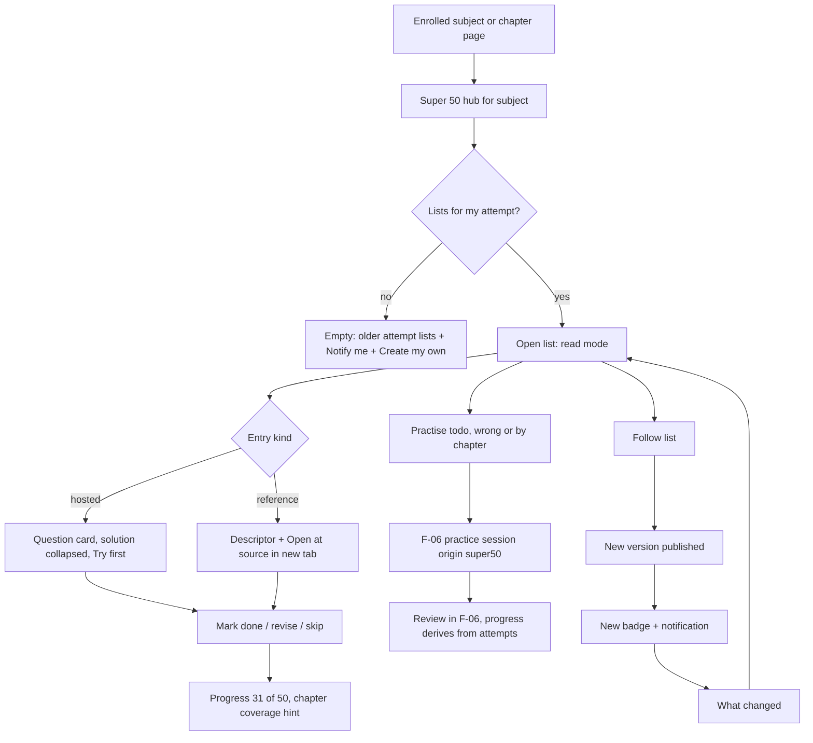
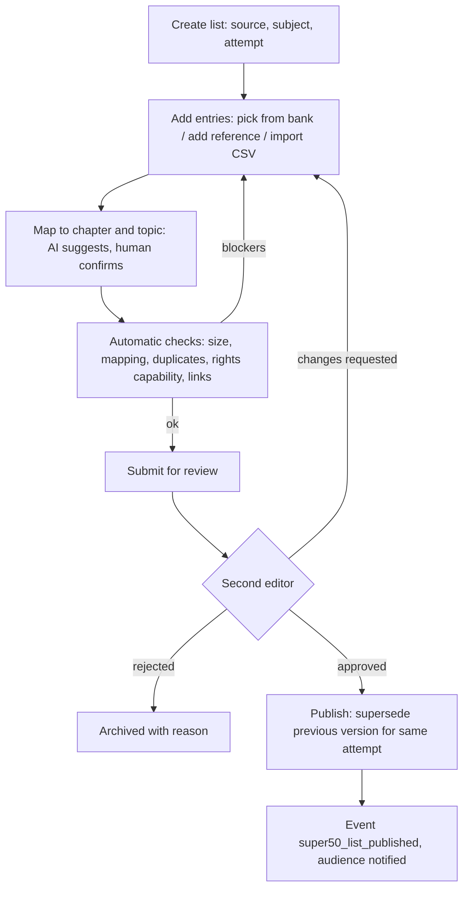
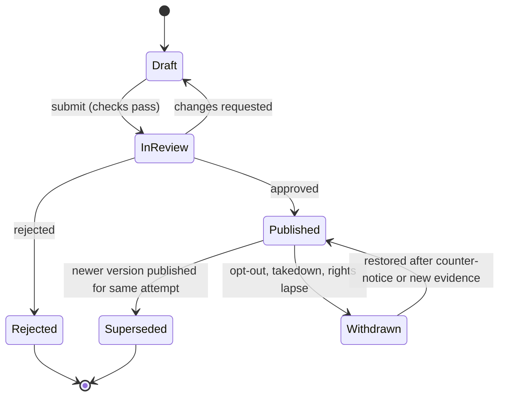

# PRD: F-04 Super 50 Questions

| Field | Value |
| --- | --- |
| Status | Draft (for founder review) |
| Owner | Pawan (founder) |
| Last updated | 2026-10-05 |
| Source | `docs/product/FEATURE_MAP.md` section F-04 (page 3 "Super 50 questions: upload / read / practice; scraping the famous teachers' websites for real-time updating of free resources"), section 7 risk 1 (copyright and terms of service), section 9 confirmation 3 ("Super 50 = the 50 most important questions per subject") |
| Linked ERD | `docs/product/erd/F-04-super-50-questions.md` |
| Role | **Curation layer.** A "Super 50" list is a curated, versioned, attributed list of about 50 important questions for one subject and one attempt. F-04 owns lists, versions, entries, follows, progress, ratings, reports and the legal posture of every source. It owns **no** question, attempt, file, ingestion or notification tables: questions live in F-06, attempts in F-06 `practice`, fetching and extraction in X-04, delivery in X-01 |
| Modules | API `apps/api/modules/super50` (tables `super50_*`), web `apps/web/src/modules/super50`. No new shared module |
| Feature flags | `super50_lists` (browse, read, follow, progress, practise), `super50_upload` (students create and upload their own lists). Server checked, 403 `feature_disabled`. Practice buttons additionally require the F-06 flag `question_bank` |
| Depends on | F-02 (`syllabus_*` subject and chapter keys, exam terms, enrolment target term), F-06 (`questionbank`, `practice`, `media`, events), X-04 (sources, fetch politeness, review queue, takedown, **rights ledger extension proposed here**), `profiles.role` |
| Siblings | [F-12 Institute Study Material](./F-12-institute-study-material.md) (shares the rights ledger and the posture ladder), [F-05 MCQ Bank](./F-05-mcq-bank.md) `[PROPOSED]`, [F-09 PYQ](./F-09-previous-year-questions.md) `[PROPOSED]`, [F-14 Amendments](./F-14-amendments.md) `[PROPOSED]` |

---

## 1. Problem and goal

A CA, CS or CMA student in the last two months before an attempt collects "most important questions" from five places: a teacher's PDF forwarded on WhatsApp, a coaching test series, a YouTube description link, the Institute's RTP and MTP, and a friend's photographed list. Each is in a different format and a different state of freshness. Nobody tells her that the list was revised after the amendments, which of the 50 she has already done, which chapter a question belongs to, or whether three teachers all picked the same question (a strong signal). Nothing connects a list to her coverage, her attempts or her mistakes.

**Goal, in four parts:**

1. **One place per subject.** Every Super 50 list for her subject and attempt, with source name, link, published date, the attempt it targets and a version history, so she picks a list in seconds and always knows how fresh it is.
2. **Two ways to use a list.** *Read mode*: the list with solutions (where we may host them) or with an exact "open at the source" button (where we may not). *Practice mode*: the hosted questions are pushed into an F-06 practice session, so attempts, mistakes, time and coverage work as everywhere else.
3. **Never stale.** A "New" badge and a notification (through X-01) when a followed list is updated, a "What changed" view between versions, and progress that carries over from one version of a list to the next.
4. **A legal posture we can defend.** The feature map flags scraping teachers' websites as a copyright and terms-of-service risk. This PRD turns that into a concrete **posture ladder** (section 4.3): every source starts at link-out with metadata only; each higher rung needs recorded evidence (permission, student upload with takedown, or a reusable licence) and unlocks specific, named capabilities (for example `host_solutions`) that publishers enforce in code. A platform cannot be talked into hosting what it has no right to host, and a source can be dropped back down in one action.

This is a product and engineering design, not legal advice. Every rung and every `[VERIFY]` needs counsel before launch (Q-F04-1).

## 2. Users and scenarios

**Aarav, CA Intermediate, eight weeks to the attempt.**
He opens Taxation from his syllabus map and sees "Super 50 lists" with three entries: "Artha Editorial, May 2027, v2, updated 12 Mar", "A teacher's list, link-out, May 2027" and "Neha's list (shared by link)". He opens the editorial list in read mode: 50 entries grouped by chapter, each with its source ("RTP Nov 2024, Q4(b)"), marks, and a collapsed solution ("Try first, then reveal"). He taps "Practise the 20 I have not done", works through them on the train with answers saving offline, and the list header becomes "31 of 50 done". Two weeks later a "New" badge appears: v3 added 4 questions after an amendment and removed 2; the "What changed" view shows exactly those, and his 31 done marks are still there.

**Neha, CS Executive, wants her teacher's list in one place.**
Her coaching teacher shared a PDF of 50 Company Law questions. Neha creates a private list, pastes the 50 question references (title, page and chapter, or the teacher's URL) and uploads the PDF to her own private import (F-06 import, `third_party_claimed`). The platform maps each entry to a chapter with AI suggestions she confirms in one pass. The list is private to her; she cannot publish or share the questions. She can share the *reference* list (titles and chapters only) by link with a friend who has the same PDF. If the teacher later partners with the platform, an editor can re-home the list at a higher rung without Neha redoing anything.

**Meera, editor, builds the platform's Final FR list.**
She opens the admin queue, creates "Financial Reporting, CA Final, May 2027", picks 50 entries from the question bank (hosted, original or licensed) and adds 12 references to Institute RTP questions we may only link to. Each reference carries our own one-line descriptor, source, date and a link. The review screen shows automatic checks (every entry mapped and confirmed, no duplicates inside the list, every hosted entry is within its source's rights, links reachable). She submits, a second editor approves, the list goes live, and followers get a notification.

**A teacher, "Mr. Rao", sees his list linked on the platform.**
He finds a page in `/legal/teachers` explaining that his public list is shown as title, date and a link to his own page, with his name as attribution. He can opt out (the source is blocked in 24 hours) or propose a partnership (hosted solutions, attribution, a "Premium list by Mr. Rao" label, optional self-service updates later). Opt-out and takedown tooling is the same one X-04 and F-06 already use.

## 3. Success metrics

Hypotheses to calibrate after the first 100 active students.

| Metric | Definition | Target | Event(s) |
| --- | --- | --- | --- |
| Discovery | Students in an enrolled subject who open a list within 14 days of first seeing the hub | 35% | `super50_hub_viewed`, `super50_list_opened` |
| Time to first useful entry | Tap on a list to first entry visible, p75 | under 1.5 s | `super50_list_opened` (render timing) |
| Progress depth | Median entries done per student per followed list after 3 weeks | 20 of 50 | `super50_entry_marked`, server counts |
| Practice conversion | Opened lists where the student starts a practice session from the list | 30% of lists with at least 10 hosted entries | `super50_practice_started` |
| Update pull | Students who open a followed list within 3 days of a "New" notification | 40% | `super50_list_published` (server), `super50_changes_viewed` |
| Carry-over | Done marks kept across a new version of the same list | 100% by entry key | server invariant test |
| Link health | Published reference links reachable at the last check | 97% | `super50_link_check_failed` (server) |
| Report rate | Reports per 1,000 entry opens | under 3 | `super50_entry_reported` |
| Fix speed | Median time from a confirmed broken link or wrong mapping to a fixed version | under 48 h | `super50_report_resolved` (server) |
| Mapping quality | AI-suggested mappings accepted without edit by reviewers | 75% (alert below 60%) | `super50_mapping_decided` (server) |
| Review SLA | List versions decided within 48 h (p90) | 90% | `super50_review_decided` (server) |
| Rights integrity | Hosted entries whose source capability is valid at the time of the daily audit | 100% (any miss is a Sentry alert) | `super50_rights_audit_failed` (server) |
| Save latency | PUT progress p95 | under 250 ms | server metrics |
| Offline reliability | Queued progress writes eventually saved without loss | 99.5% | `super50_write_queued`, `super50_queue_replayed` |

## 4. Scope

### 4.1 In scope (this pointer, by release)

**R1 (Platform lists, read and practise)**
- Sources, lists, versioned snapshots per attempt, entries (hosted and reference), mapping to subject, chapter and topic with human confirmation.
- Platform-curated lists by editors; read mode and practice mode; per-entry progress with offline queue; chapter filter; coverage-aware "Practise what I have not done".
- Admin review queue and publishing; source records with the posture ladder and the capability flags; links checked on publish.
- Public subject page listing the lists (metadata and links only) with SEO.

**R2 (Update loop and community)**
- Follow a list or source, "New" badge, "What changed" diff, notifications through X-01 `[PROPOSED: X-01]`.
- Student lists: private reference lists, student upload through F-06 import, share-by-link of reference-only lists.
- Ratings, reports of broken or wrong items, link-health job, duplicate and consensus signals ("in 4 of 6 lists").
- Partnership rung: hosted questions and solutions for sources with a recorded written permission.

**R3 (Ingestion and scale)**
- X-04-driven discovery of updated lists on permitted sources, AI-assisted mapping queue, amendment impact flags from F-14, a Today provider (F-13), a source-manager capability for partner teachers.

### 4.2 Boundaries (what lives where)

| Need | Owner | How F-04 uses it |
| --- | --- | --- |
| Question text, options, key, rubric, versions, takedown, duplicate detection, report-an-error for hosted questions | F-06 `questionbank` | Entries of kind `question` hold `question_id` and a pinned `question_version_id`. Content is created only through `questionbank.services.upsert_from_source` or the F-06 editor. F-04 never writes `questionbank_*` |
| Attempts, scoring, mistakes, bookmarks, notes on questions | F-06 `practice` | `practice.services.create_session_from_items(origin_module='super50', origin_ref=<list version id>, ...)`; per-question state read through `practice.selectors.question_states` |
| Fetching teacher pages politely, robots.txt, domain circuit breaker, review queue, takedown on a source | X-04 `ingestion` | Link checks go through the X-04 fetch service (same politeness, same domain policy). Discovery of updated lists is an X-04 publisher (R3) |
| Rights evidence and per-source capability flags | X-04 (extension `[PROPOSED EXTENSION to X-04]`, ERD 3.3) | F-04 reads `ingestion.selectors.source_capabilities(source_id)` and refuses to publish what the source does not allow |
| Files (uploaded lists) | F-06 `media` and F-06 import | Student uploads become F-06 import jobs and private questions |
| Notifications | X-01 `[PROPOSED]` | `notifications.services.notify(...)`, with a domain event as fallback |
| Syllabus keys, chapters, terms | F-02 | Through syllabus selectors only (ERD 3.2) |

"Super 50" is a **format**, not a hard number: a list targets about 50 questions for one subject. The platform's own label "Super 50" is used for lists with 40 to 60 entries; other lists show their count ("Top 35 for FR"). The size limits are soft (30 to 70) and checked at review (FR-F04-08).

### 4.3 Legal posture ladder (the central design decision)

Facts that shape it (research appendix): ICAI states "All Intellectual Property rights including Copyright etc. are reserved" and prohibits reproduction without written permission, and its 2011 notice treats unauthorised downloading, extraction and copying of its examination material as an offence; Section 52(1)(i) of the Copyright Act (the Delhi University photocopy case) protects reproduction by **educational institutions in the course of instruction**, which is not the position of a commercial platform; Indian courts have ordered Telegram to disclose operators of channels sharing coaching material; free teacher lists are published with "all copyrights remain with the authors" notices. Conclusion: copying is the risk, linking and facts are not; **hosting needs evidence**.

Each source sits on exactly one rung per capability. New sources start at rung 1. A rung is just a named bundle of capabilities (ERD 3.3 defines the vocabulary); rights evidence is recorded in the X-04 ledger and publishers check the capability at publish time and in a daily audit.

| Rung | Name | Student sees | We store | Capabilities unlocked | Evidence required | Typical sources |
| --- | --- | --- | --- | --- | --- | --- |
| 0 | **Platform original** | Full questions and solutions, "Artha Editorial" | Everything (we own it) | all, `practice`, `host_*` | Editor attestation that the content is original (F-06 `rights_status='original'`) | Our editors' lists written from scratch or from public-domain statutes |
| 1 | **Link-out with metadata only** (default) | Title, our own one-line descriptor (max 140 characters, written by an editor or the student), source name and logo-free text attribution, published date, attempt targeted, chapter, marks if the source states them; **Open at source** button to the exact page or file | Metadata and a link. No question text, no solution, no PDF, no snapshot served to students | `link_out`, `metadata`, `ai_map` on metadata only | A ToS and robots review recorded as `tos_review`; opt-out honoured | Teachers' public lists, coaching free resources, Institute RTP and MTP (until counsel clears more) |
| 2 | **Permissioned partnership** | Hosted questions and solutions with attribution and a "Source: Mr. Rao, used with permission" line; practice mode | Content as F-06 `licensed` questions, `rights_note` pointing at the ledger entry | `host_questions`, `host_solutions`, `host_media`, `practice`, `ai_summarise` as granted | Written permission or agreement scoped to named capabilities, subjects and a term, stored as evidence | Partner teachers and coaching institutes; the Institutes if they agree |
| 3 | **Student upload with takedown** | Only the uploader sees it (private) or, for reference-only lists, people with the share link | Private F-06 questions `third_party_claimed`; reference lists as metadata | `private_host` for the owner only; never public | Accepted upload terms (contributor terms version), takedown process live (F-06 8.7), strike policy | Neha's PDF |
| 4 | **Reusable licence** | Hosted like rung 2, with licence and attribution shown | Content with `licence_spdx` recorded | `host_*` and `practice`; share-alike or attribution duties shown and enforced | A licence that permits commercial reuse: CC BY, CC BY-SA, public domain, government open data licence. **Non-commercial licences (CC BY-NC) are not enough** because the platform has paid plans | Open educational resources, statutes and government publications that allow reuse |

Rules that follow from the table:

1. **Default down, evidence up.** A capability exists only if a non-expired ledger entry grants it (or the rung baseline gives it). Expiry or revocation removes it; the daily audit unpublishes hosted entries that lost cover (`rights_lapsed`).
2. **Link-out is not a loophole.** We link only to the source's own page or file. We never link to a known mirror, Telegram channel or file locker (a domain deny-list in X-04 settings), never deep-link past a login or paywall, never use a link that circumvents the owner's access control. The link target is checked on publish and weekly.
3. **Facts, not expression.** For rung 1 we store facts about the item (the source names it "Q4(b) RTP Nov 2024", chapter, marks, date) and an editor-written descriptor. We do not copy the question wording. AI mapping at rung 1 sees only that metadata.
4. **Robots and TDM signals respected.** Link checks and discovery honour `robots.txt` through X-04's domain policy; a TDM reservation signal (`TDMRep` header or `/.well-known/tdmrep.json`) or `ai.txt` found on a source is recorded and disables `ai_map` and discovery for that source.
5. **Opt-out in 24 hours.** `/legal/teachers` accepts an opt-out; an admin blocks the source (X-04 takedown), all its lists become `withdrawn`, followers see "This list is no longer available", progress is kept (it is the student's data).
6. **Student uploads never become public by accident.** Rung 3 content has visibility `private` (F-06 rule for `user_uploaded`); promoting it requires an editor to record rung 2 or 4 evidence.
7. **One hosting switch.** "Can we host this?" is answered in one place, `ingestion.selectors.source_capabilities`, for F-04 and F-12 alike. There is no per-feature override.

### 4.4 Out of scope (later or elsewhere)

| Item | Where |
| --- | --- |
| Scraping teachers' sites for discovery at scale | R3 through X-04 publisher, only for sources at rung 1 with `discover` capability and a positive robots review. Not in R1 or R2 |
| Marketplace or payments for premium lists | Billing pointer (later); the data model keeps `source_id` and `plan_required` ready |
| Teacher dashboards and analytics | R3 source manager (P2), mentor mode in the feature map |
| Daily challenge built on Super 50 | X-03 registers a picker over published lists |
| Writing questions or solutions | F-06 editor |
| Priority scoring of chapters | F-11 (consumes `super50.selectors.consensus`) |
| Anonymous (signed-out) practice | F-06 Q5 |

## 5. User flows

### 5.1 Student: from subject to done



### 5.2 Editor: curate, review, publish



### 5.3 List version lifecycle



### 5.4 Edge cases (designed and tested)

| Case | Behaviour |
| --- | --- |
| Student follows a list that is superseded for the same attempt | Sees the newest version; the old version stays reachable at `?v=` for 12 months with an "Older version" banner; progress is by entry key so nothing resets |
| An entry's question is taken down (F-06) | Entry shows "Removed", stays in position, excluded from practice, counts as neither done nor todo; the list owner is told |
| Entry's hosted question gets a new live version | Entry keeps its pinned version; "Newer version available" badge for the student in read mode; a new list version re-pins |
| Reference link is dead | Entry shows "Link not working, report", still counts; after 3 failed weekly checks it is flagged and the editor queue gets it |
| Same question in two lists | Shown in both; progress is by canonical key, so doing it once ticks it in every list; "also in 3 lists" |
| Student changes target attempt | Hub reorders lists to the new attempt; lists for the old attempt move under "Earlier attempts" |
| Subject changes scheme (F-02) | Entries keep `subject_key` and `chapter_key`; chapter ids re-point through the chapter map; unmapped entries show "Old syllabus" and appear in the editor remap queue |
| Offline | Reading cached lists works; progress writes queue and replay with `client_id`; practice only for sessions already loaded (F-06 rule) |
| Flag off | `super50_lists` off: hub entry is hidden and every endpoint answers 403 `feature_disabled` |
| Student uploads a list over quota | 429 `quota_exceeded` with the limit; existing lists unaffected |
| Source opts out while a student is mid-practice | Open sessions continue (F-06 rule: only `taken_down` removes review), the list disappears from the hub |

## 6. Functional requirements

Priorities: P0 = R1, P1 = R2, P2 = R3 or later. "Given/When/Then" is abbreviated G/W/T.

### A. Sources, lists and versions

| ID | Requirement | Priority | Acceptance criteria |
| --- | --- | --- | --- |
| FR-F04-01 | A **source** represents who a list comes from (platform, teacher, coaching, institute, student pool) and is linked 1:1 to an X-04 `ingestion_source` that carries its rights. Sources have a display name, kind, website and attribution line | P0 | G an editor creates a source W saved T an `ingestion_source` exists (kind `manual` when not crawled) and the source starts at rung 1 with capabilities `link_out`, `metadata` only (rung 0 only for the platform source) |
| FR-F04-02 | A **list** is identified by source, course, level, subject key and an edition slug; it holds **versions**, each an immutable snapshot targeted at one attempt (`YYYY-MM`, the F-02 term code) | P0 | G a version is published W an editor edits entries T a new draft version is created; the published one is unchanged |
| FR-F04-03 | A **version** has a published date, a **source date** ("list dated 12 Mar 2027 by the teacher"), source link, change summary and an entry count | P0 | G publishing without a source date for a non-platform source T blocked with `source_date_required` |
| FR-F04-04 | Exactly one **published** version per list and attempt; publishing a new one supersedes the old one atomically | P0 | G two editors publish at once T one wins under a row lock, the other gets 409 `stale_version`; the database allows only one published row per `(list_id, attempt_code)` |
| FR-F04-05 | Platform lists are curated by editors from the question bank (hosted entries) and from references; the editorial rubric (frequency in past papers, marks, concept coverage, not duplicating another entry) is shown on the review screen | P0 | G a reviewer opens a draft T every entry shows its basis note and (when F-11 exists) its frequency |
| FR-F04-06 | Each **entry** is either `question` (hosted F-06 question, pinned version) or `reference` (descriptor, source locator, link). Both carry position, marks, difficulty hint, chapter mapping, a `canonical_key` and a stable `entry_key` that is the same across versions of the list | P0 | G a new version keeps an entry W the entry text is unchanged T `entry_key` is identical; a removed and re-added entry gets the old key back when its canonical key matches |
| FR-F04-07 | Each entry stores **source name, link, date and the attempt targeted** (inherited from the version, overridable per entry for lists that mix terms) | P0 | G an entry from "RTP Nov 2024, Q4(b)" T it shows that label, the link and `Nov 2024` |
| FR-F04-08 | Size rules: 30 to 70 entries per version (warning outside 40 to 60 when titled "Super 50"); hard limit 100 | P0 | G a version with 25 entries T review blocks with `too_few_entries`; 65 entries T warning only |
| FR-F04-09 | The **platform label** "Super 50" is reserved for platform-curated lists with 40 to 60 entries | P1 | G a student list is named "Super 50" T the label is shown as "Super 50 (student list)" |

### B. Rights and posture

| ID | Requirement | Priority | Acceptance criteria |
| --- | --- | --- | --- |
| FR-F04-10 | A hosted entry (`question`) can be published only if `source_capabilities(source)` contains `host_questions` (and `host_solutions` when the solution is shown); a reference entry only needs `link_out` | P0 | G a rung-1 source W an editor adds a hosted entry from that source T publish is blocked with `rights_blocked` and the entry is listed with the missing capability |
| FR-F04-11 | Capability and rung are shown to editors on the source page with the evidence list, expiry dates and what each rung would unlock | P0 | G a ledger entry expires in 30 days T the source page shows an amber "expires 4 Nov" and the admin gets a reminder |
| FR-F04-12 | **Daily rights audit**: for every published hosted entry the capability must still hold; otherwise the version is `withdrawn` (reason `rights_lapsed`), F-06 is asked to unpublish the items through the extension in F-12 ERD 3.4, and admins are alerted | P0 | G a permission expires W the audit runs T hosted entries disappear from students within 24 h and the event `super50_list_withdrawn` is emitted |
| FR-F04-13 | Opt-out and takedown: admin action "Block source" withdraws all its published versions, blocks the domain in X-04 and records the request. `/legal/teachers` accepts opt-out and partnership requests | P0 | G an opt-out is executed T lists vanish from search and the hub within 5 minutes (cache purge or TTL), source status `blocked`, audit row written |
| FR-F04-14 | Link policy: only `https`, only the source's allowed domains (plus an editor-approved list), never the deny-list; links open in a new tab with `rel="noopener noreferrer nofollow"` | P0 | G an editor adds a Telegram invite link T validation fails `link_denied` |
| FR-F04-15 | AI processing of third-party text is governed by `ai_map` and `ai_summarise` capabilities; a source with a TDM reservation signal has both disabled | P1 | G a source publishes a TDM opt-out W discovery runs T the source gets status `paused (tdm_reserved)` and no AI call is made for it |

### C. Mapping and quality

| ID | Requirement | Priority | Acceptance criteria |
| --- | --- | --- | --- |
| FR-F04-16 | Every entry maps to subject, chapter and optionally topic. Hosted entries inherit the F-06 primary mapping (`questionbank.selectors.taxonomy_of`); references are mapped by editors or suggested by AI (metadata only) | P0 | G a reference entry W no confirmed mapping T the version cannot be submitted (`mapping_incomplete`) |
| FR-F04-17 | **AI-assisted mapping with human review**: an editor can run "Suggest mapping" on selected entries; suggestions carry confidence and reasons; a human confirms or edits each (bulk confirm above 0.90 confidence) | P1 | G 40 unmapped references T Suggest runs as a job T each entry shows a suggestion, none is confirmed automatically |
| FR-F04-18 | **De-duplication across sources**: entries get a `canonical_key` (normalised Institute reference such as `icai:rtp:2024-11:ca-inter:fr:q4b`, or the F-06 fingerprint for hosted items); entries with the same key are linked; a list cannot contain the same canonical key twice | P0 | G an editor adds a question already in the list T 409 `duplicate_entry` naming the position |
| FR-F04-19 | **Consensus signal**: for each subject and attempt, count how many published lists contain each canonical key; entries show "In 4 of 6 lists" | P1 | G three lists include the same key T each shows "In 3 lists" after the next rebuild (at most 15 minutes) |
| FR-F04-20 | **Report** a broken or wrong entry: kinds `link_dead`, `wrong_mapping`, `wrong_details`, `not_important`, `copyright`, `other`. Hosted-question errors (`wrong_answer`, `typo`) route to F-06 `report_error` | P1 | G a student reports `link_dead` T one open report per kind per student per entry; three distinct reporters flag the entry `needs_attention` |
| FR-F04-21 | **Link-health job**: weekly check of every published reference link through the X-04 fetch service; status `ok`, `redirected`, `dead`, `blocked`, `unknown`; three consecutive failures raise an editor task | P1 | G a link returns 404 on three weeks T the entry is flagged and an admin queue item exists |
| FR-F04-22 | **Admin review queue** before anything goes live: pending, claimed (30 minutes), approved, changes requested, rejected; automatic checks listed beside each; second reviewer required when a hosted entry's source is above rung 1 or the list is the first for its subject | P0 | G the author submits W the author is also a reviewer T they cannot approve their own version |

### D. Reading and practising

| ID | Requirement | Priority | Acceptance criteria |
| --- | --- | --- | --- |
| FR-F04-23 | **Read mode**: entries grouped by chapter in list order; hosted entries show the question, with the solution collapsed behind "Reveal" (remembered per student); reference entries show descriptor and **Open at source** | P0 | G a hosted entry W the solution is collapsed T tapping Reveal shows the F-06 review view; a screen reader announces the state |
| FR-F04-24 | **Practice mode**: "Practise" builds an F-06 session from the list's hosted entries (all, not done, wrong last time, chosen chapters, count N) with `origin_module='super50'`, `origin_ref=<list version id>` | P0 | G 30 of 50 entries are hosted W Practise 20 T a session of 20 hosted questions opens in under 2 s and the page says "20 of 30 hosted; 20 more open at the source" |
| FR-F04-25 | For reference entries, practice is offered as **Practise the same ground**: an F-06 session over platform questions mapped to the entry's chapter and topic | P1 | G a reference entry mapped to GST ITC T the button starts a chapter-filtered session of platform questions |
| FR-F04-26 | Hosted entries in the list reflect the F-06 per-question state (attempted, last result, bookmarked) via `practice.selectors.question_states`; no copy of attempts is stored | P0 | G the student answered an entry in another session T the list shows it as done with the last result |
| FR-F04-27 | **Progress by entry key**: states `todo`, `done`, `revise`, `skipped`, a private note (max 500 characters on references; hosted notes live in F-06 `practice_questionstate.note`). Writes are idempotent and offline-capable | P0 | G the student marks done offline W reconnects T one row, same state, no duplicate; an older `client_ts` never overwrites a newer one |
| FR-F04-28 | Progress carries across versions and across lists through `canonical_key`; done in one list is done in every list that contains the same canonical key (shown as "done in another list") | P1 | G the same RTP question is in two lists T marking done in one shows done in the other |
| FR-F04-29 | List header shows "31 of 50 done", per-chapter counts and a "Next up" button that opens the first not-done entry | P0 | G 31 done T the progress bar has text "31 of 50" and an `aria-valuenow` |
| FR-F04-30 | Notes: a per-entry note on references; for hosted entries the F-06 note | P1 | G a note is saved T it is private and exported with the student's data |

### E. Updates, follow and notification

| ID | Requirement | Priority | Acceptance criteria |
| --- | --- | --- | --- |
| FR-F04-31 | **Follow** a list (or all lists of a source or a subject); default follow for the lists the student opens twice | P1 | G the student opens a list twice T a one-time prompt offers Follow; declining is remembered |
| FR-F04-32 | **"New" badge**: a list shows New when a version was published after the student's last seen version; entries added in that version show New; seen state is set when the student opens "What changed" or the list for 5 seconds | P1 | G version 3 is published T followers see New on the hub and on the 4 added entries; opening clears the list badge, not the entry badges until marked |
| FR-F04-33 | **What changed** view: added, removed, moved and re-mapped entries between any two versions, with the change summary | P1 | G v2 to v3 removed 2 and added 4 T the view lists exactly those with their chapters |
| FR-F04-34 | **Notification on update** `[PROPOSED: X-01]`: one notification per followed list per published version, batched, deduplicated by `super50:{list_id}:{version_no}`, respecting the student's quiet hours and category preference | P1 | G a version is published W X-01 is absent T an in-app banner on the hub is the fallback and no email is sent |
| FR-F04-35 | Amendment impact `[PROPOSED: F-14]`: when an amendment affects a chapter, list entries in that chapter show "May be affected by an amendment" and the editor queue gets a review task | P2 | G F-14 emits `amendment_published` for chapter X T entries mapped to X are flagged within 15 minutes |

### F. Student lists and upload

| ID | Requirement | Priority | Acceptance criteria |
| --- | --- | --- | --- |
| FR-F04-36 | A student can create a **private list** from reference entries (descriptor, optional URL, chapter) and from F-06 questions she owns or can see | P1 | G Neha adds 50 references T the list is private, not indexable, not shown to others |
| FR-F04-37 | **Upload**: a student can upload a PDF, DOCX, CSV or photo of a list; it becomes an F-06 import job (private, `third_party_claimed`); the list entries reference those private questions. She accepts the contributor terms version first | P1 | G Neha uploads a PDF T she gets "Your import is ready to review" and the entries stay private; no public link can be created for them |
| FR-F04-38 | **Share by link** only lists that are reference-only or made of the student's own original questions; third-party hosted content cannot be shared (`rights_block_sharing`) | P1 | G a list with an uploaded third-party question T Share is disabled with the reason |
| FR-F04-39 | Quotas (free): 10 lists, 100 entries per list, 5 uploads per day, 20 MB per file; levels from F-06 contributor rules may raise them | P1 | G the 11th list T 429 `quota_exceeded` |

### G. Ratings and trust

| ID | Requirement | Priority | Acceptance criteria |
| --- | --- | --- | --- |
| FR-F04-40 | **Rating** 1 to 5 plus optional tags (`useful`, `too_hard`, `outdated`, `great_solutions`) per student per list; allowed after the student has marked 5 entries or opened 10; shown as a rounded average once there are 5 raters | P1 | G 4 raters T no number shown, "Not enough ratings yet" |
| FR-F04-41 | Ratings are per list (all versions), cannot be edited more than once per 7 days, and an editor can discard abusive ones with an audit entry | P1 | G a student rates twice in a day T the second replaces the first |

### H. Platform

| ID | Requirement | Priority | Acceptance criteria |
| --- | --- | --- | --- |
| FR-F04-42 | Public subject page lists published lists (title, source, attempt, count, updated, rating, "Open at source" or "Sign in to practise") with SEO and OG image; **no question text** unless the entry is hosted at rung 0, 2 or 4 and its F-06 question is public | P0 | G an anonymous visitor opens the page T she sees titles and metadata; view-source contains no question text for rung-1 lists |
| FR-F04-43 | Export and delete: `export_for_user` and `delete_all_for_user` cover follows, progress, ratings, notes, private lists and uploads | P0 | G the account is deleted T all `super50_*` rows keyed by the user are gone within the deletion job; approved platform lists are untouched |
| FR-F04-44 | Events: domain events `super50_list_published`, `super50_list_withdrawn`, `super50_entry_flagged` and product events (section 10) | P0 | G a version is published T exactly one domain event is written in the same transaction |
| FR-F04-45 | `[NEW, P2]` **Source manager**: a partner teacher (capability scoped to one source) can draft versions of their own lists, which still go through review | P2 | G the teacher saves a draft T it appears in the review queue marked "from source" |
| FR-F04-46 | `[NEW, P1]` **Exam-week mode**: within 14 days of the attempt the hub puts "Super 50 of my weakest chapters" first (uses `coverage` chapter status), and the daily "3 from Super 50" tile is offered to F-13 | P1 | G 10 days to the attempt T the hub shows "Start with these 12" ordered by weakest coverage |

## 7. Screens and URLs

All app screens are noindex (`buildHead`), all state is in the URL, public pages use `buildHead` with canonical URLs.

| Screen | URL | Notes |
| --- | --- | --- |
| Hub for a subject | `/app/super50` | `?subject=&attempt=&source=&state=followed\|new`. Defaults to the student's enrolled subjects; chips for subject |
| List (read mode) | `/app/super50/$listId` | `?v=3&mode=read\|practice&chapter=&state=todo\|done\|revise&q=&entry=`; `entry` scrolls to and opens one entry (deep link from a notification) |
| What changed | `/app/super50/$listId/changes` | `?from=2&to=3` |
| My lists | `/app/super50/mine` | Private and shared student lists |
| New or edit student list | `/app/super50/mine/new`, `/app/super50/mine/$listId/edit` | Add references, import, map |
| Upload | `/app/super50/mine/$listId/import` | F-06 import flow embedded |
| Settings | `/app/settings/super50` | Follows, notifications, "stay on older attempt" off by default |
| Admin: lists and versions | `/app/admin/super50/lists`, `/app/admin/super50/lists/$listId/versions/$n` | Draft editor with entry table, mapping column, checks panel |
| Admin: review queue | `/app/admin/super50/review` | `?status=pending&flag=&item=` (side panel) |
| Admin: sources and rights | `/app/admin/super50/sources`, `/app/admin/super50/sources/$id` | Rung, capabilities, evidence, expiry, opt-out; edit rights in Django admin (X-04) |
| Admin: reports and links | `/app/admin/super50/reports`, `/app/admin/super50/links` | Ranked by distinct reporters; link health |
| Public subject page | `/courses/$course/$level/$subject/super-50` | SSR, indexable; JSON-LD `ItemList` and `BreadcrumbList`; OG image `/og/courses/.../super-50` |
| Public list page | `/super-50/$slug` | SSR, indexable for platform lists only; student lists never public |
| Public: shared reference list | `/s50/$token` | `noindex`, preview card with title and count |
| Legal | `/legal/teachers` | Opt-out and partnership form, explains the posture in plain words |

### 7.1 Wireframes (mobile first, 320 to 1280 px)

**List, read mode (`/app/super50/$listId`), mobile**

```
┌──────────────────────────────────┐
│ ← Taxation · Super 50   [Follow] │
│ Artha Editorial · for May 2027   │
│ v2 · updated 12 Mar · ★ 4.6 (31) │
│ ▓▓▓▓▓▓░░░░  31 of 50 done        │  role=progressbar, text value
│ [Read | Practise]  [Chapter ▾]   │  SegmentedControl; filter chips below
│ [New 4] [Todo 19] [Revise 3]     │
│ ── GST: Input Tax Credit (6) ──  │
│ ┌──────────────────────────────┐ │
│ │ 4  NEW · RTP Nov 24 Q4(b)    │ │
│ │ Blocked credits u/s 17(5)    │ │  hosted: stem excerpt, 3 lines
│ │ In 4 of 6 lists · 6 marks    │ │
│ │ [Try it] [Reveal solution]   │ │
│ │ ○ todo  ● done  ◐ revise  ⋯  │ │  44 px targets, text labels
│ └──────────────────────────────┘ │
│ ┌──────────────────────────────┐ │
│ │ 5  Mr. Rao · Mar 2027        │ │  reference entry
│ │ Place of supply, composite   │ │  our descriptor (140 chars)
│ │ [Open at source ↗] [Same ground]│
│ └──────────────────────────────┘ │
│ [Practise the 19 not done]       │  pinned bottom bar
└──────────────────────────────────┘
```

Desktop: left rail with chapter list and counts (320 px), list in the middle, right pane previews the selected entry or the "What changed" summary. The bottom bar becomes a header action.

**Hub (`/app/super50`), mobile**

```
┌──────────────────────────────────┐
│ Super 50 lists    [Subject: Tax ▾]│
│ For May 2027 (my attempt)        │
│ ┌─ Artha Editorial ─── NEW ─────┐│
│ │ Taxation · 50 · v2 · 12 Mar   ││
│ │ 31/50 done · ★ 4.6            ││
│ └───────────────────────────────┘│
│ ┌─ Mr. Rao · link-out ──────────┐│
│ │ Taxation · 48 · dated 2 Mar   ││
│ │ Opens at the source           ││
│ └───────────────────────────────┘│
│ Earlier attempts (2)  ▸          │
│ [+ Add my own list]              │
└──────────────────────────────────┘
```

**Admin review (`/app/admin/super50/review?item=`), desktop**

```
┌ queue ────────────┬ version 3 · Artha Editorial · Taxation ───────────┐
│ ▸ Taxation v3 NEW │ Checks: ✓ 50 entries  ✓ all mapped  ⚠ 2 links 404 │
│ ▸ FR v1  rights ⚠ │         ✓ no duplicates  ✓ rights ok (rung 0)     │
│ ▸ Audit v2        │ ┌ # ┬ Entry ───────────┬ Chapter ┬ Map ┬ Link ┐   │
│                   │ │ 1 │ Blocked credits..  │ ITC     │ ✓   │ ✓    │   │
│                   │ │ 2 │ Composite supply.. │ POS     │ 0.82│ 404  │   │
│                   │ └───┴──────────────────┴─────────┴─────┴──────┘   │
│                   │ [Approve] [Request changes] [Reject]  reason ▾     │
└───────────────────┴─────────────────────────────────────────────────────┘
```

### 7.2 UI states per screen

**List (read and practice mode)**

| State | Behaviour |
| --- | --- |
| First time | One-time sheet: "Read first or practise: your marks are saved either way. Hosted questions open here; the others open at their source." Dismissible, remembered |
| Loading | Header and 6 entry skeleton rows, stable layout; progress bar placeholder |
| Partial | Entries load first; personal overlay (done, last result), consensus counts and ratings fade in later; overlay failure shows the list with a quiet "Your progress could not load. Retry" |
| Success | List, progress, pinned practice bar |
| Empty (no entries match filters) | "No entries match" with the strongest filter to remove as a chip |
| Empty (list withdrawn) | "This list is no longer available" with the reason class (source request, rights, replaced) and a link to alternatives for the subject; progress kept |
| Error | Alert with Retry and request id; last good data dimmed |
| Offline | Banner "Offline: showing saved list"; progress writes queue with a visible count; Practise disabled unless a session is loaded; Open at source disabled with explanation |
| Feature disabled | `super50_lists` off: "Super 50 is not available yet" page; practice bar hidden when `question_bank` is off |
| Quota exceeded | Not applicable for reading; for my lists: "You have 10 lists. Delete one to add another" |
| Long content | Descriptors clamp at 3 lines with Expand; long source names wrap; chapter names wrap |
| Reveal solution | Disclosure button with `aria-expanded`; focus moves to the solution; collapsed by default; remembered |
| New badge | Text "New" with an icon; never colour only |
| Link-out entry | Button label "Open at {source}" with an external-link icon and "(opens a new tab)" in the accessible name |

**Hub**

| State | Behaviour |
| --- | --- |
| First time, no enrolment | Prompt to pick a course and level (F-02 onboarding) with one tap, then lists appear |
| Empty (no list for my subject and attempt) | "No Super 50 list for May 2027 yet" with "Notify me" (X-01), "See earlier attempts" and "Create my own" when `super50_upload` is on |
| Loading, error, offline | Skeleton cards; inline retry; cached hub shown with a banner |
| Many lists | Cards sorted by my attempt, followed, rating, freshness; "Show all" after 5 |

**Student list editor and upload**

| State | Behaviour |
| --- | --- |
| First time | Explains in two lines what stays private and what can be shared (rung 3 rules) and shows the terms checkbox |
| Importing | Progress with status text from the F-06 import job; leaving the page is safe |
| Row errors | Per-row error list with a downloadable error CSV (F-06) |
| Mapping | Table with AI suggestions and confidence; "Confirm all above 90%" requires a visible count |
| Quota exceeded, flag off | As above; the upload entry hidden without `super50_upload` |

**What changed, admin review and source pages** follow the same pattern (skeleton, empty "no changes", error with retry, offline banner, permission denied page for non-editors).

### 7.3 Design-system components

Existing: Accordion, Alert, Badge, Breadcrumb, Button, Card, Checkbox, Dialog, DropdownMenu, EmptyState, FilterChip, Input, Label, Progress (bar and ring), SegmentedControl, Sheet, Combobox, TagInput, DataTable, Pagination/LoadMore, SplitPane, RichText (F-06).

New in `packages/design-system` (showcase entry, four themes, contrast checked, 44 px targets): `RatingInput` (radio group of five with text labels, read-only variant), `ExternalLinkButton` (icon, new-tab announcement, `rel` set once, used by F-12 as well), `DiffList` (added/removed/moved rows with icon and text, not colour only).

App-specific (`apps/web/src/modules/super50`): `ListCard`, `EntryRow`, `EntryDetail`, `SourceBadge`, `PostureNote` (explains rung to editors), `NewBadge`, `ChangesView`, `PracticeBar`, `ReportEntryDialog`, `MappingTable`, `ReviewChecks`.

## 8. Data and permissions

Entities are in the ERD: `super50_source`, `super50_list`, `super50_listversion`, `super50_entry`, `super50_review`, `super50_userlist`, `super50_progress`, `super50_report`, `super50_linkcheck`, `super50_consensus`, `super50_auditlog`. Rights evidence is **not** here: it is the X-04 extension `ingestion_sourcerights` (ERD 3.3), shared with F-12.

### 8.1 Permission matrix

| Action | Anonymous | Student | Uploader (terms accepted) | Editor | Admin |
| --- | --- | --- | --- | --- | --- |
| Read public subject page and platform list pages (metadata) | yes | yes | yes | yes | yes |
| Open a list, read, follow, mark progress, rate, report | no | yes | yes | yes | yes |
| Practise hosted entries | no | yes | yes | yes | yes |
| Create private lists, upload | no | no (needs `super50_upload`) | yes | yes | yes |
| Share a reference-only list by link | no | no | yes | yes | yes |
| Create and edit platform lists, map entries | no | no | no | yes | yes |
| Decide reviews (not your own), resolve reports, set mapping | no | no | no | yes | yes |
| Publish at rung 2 or 4 (needs ledger evidence) | no | no | no | no (propose only) | yes |
| Block a source, withdraw a version, edit rights evidence | no | no | no | no | yes |
| Read another student's progress | no | no | no | no | no |

Roles come from `profiles.role`; "uploader" derives from F-06 `questionbank_contributor.terms_accepted_at` (no second terms table).

### 8.2 Privacy, retention and DPDP

- Personal data: follows, progress marks and dates (study habits), notes, ratings, private lists and uploads. Same stance as F-01 and F-06: private, exportable, deletable.
- `delete_all_for_user` removes follows, progress, ratings, notes, private lists and entries, and asks F-06 to delete the user's imports. Ratings used in aggregates are decremented by the nightly recompute. Reports keep ids only. Platform lists are not touched.
- No note text, descriptor text typed by a student or list title is sent to PostHog or Sentry.
- Retention: report rows 24 months; link-check rows 90 days; review rows kept; audit log kept 3 years.
- Students may be minors (CA Foundation, CSEET). Consent and age gate are in the auth module (F-06 8.6 `[VERIFY with counsel]`).

## 9. API surface

REST under `/api/v1/super50/`. Bearer Supabase token unless marked public. Errors use the `core/errors` envelope `{"error": {code, message, details}}`. Lists use cursor pagination (`cursor`, `limit` up to 100). Writes take `client_id` or `client_ts`. Throttle scopes: `super50_read` 300/min, `super50_write` 120/min, `super50_report` 20/h, `super50_upload` 20/day, `super50_public` 60/min per IP. Flag `super50_lists` (and `super50_upload` for student-list writes) answers 403 `feature_disabled` on every endpoint.

### 9.1 Public

| Method and path | Auth | Purpose | Notes and errors |
| --- | --- | --- | --- |
| GET `public/subjects/{course}/{level}/{subject}/lists/` | public, CDN `s-maxage=300, stale-while-revalidate=3600` | Published platform and partner lists as metadata | No question text unless entry is hosted and public; 404 unknown subject |
| GET `public/lists/{slug}/` | public, CDN | Public list page data | Entries as metadata or public cards; 404 for private lists (no leakage) |
| GET `public/shared/{token}/` | public, throttled | Shared reference list | Metadata only; 404 revoked or expired |

### 9.2 Student

| Method and path | Auth | Purpose | Notes and errors |
| --- | --- | --- | --- |
| GET `lists/` | user | Hub lists for subject, attempt, source, `state=followed\|new`, `include=progress` | Cursor; 403 `feature_disabled` |
| GET `lists/{id}/` | user | List with version (`?v=`), header, counts, my follow and rating | 404 when not visible |
| GET `lists/{id}/entries/` | user | Entries page (`chapter`, `state`, `q`, `cursor`) with overlay when `include=state` | Hosted entries include `PlayableQuestion`-safe card (no key); solution only through the next endpoint |
| GET `entries/{id}/solution/` | user | Review view for a hosted entry | 403 `rights_blocked` unless `host_solutions`; delegates to `questionbank.selectors.get_review_view` |
| GET `lists/{id}/versions/`, `lists/{id}/changes/?from=&to=` | user | History and diff | |
| PUT `lists/{id}/follow/` | user | `{followed, notify}` | Idempotent |
| POST `lists/{id}/seen/` | user | `{version_id}` clears New | Idempotent |
| PUT `lists/{id}/rating/`, DELETE | user | `{stars, tags}` | 409 `rating_not_allowed` before the engagement threshold |
| PUT `progress/{entry_key}/` | user | `{list_id, state, note, client_id, client_ts}` | Idempotent; older `client_ts` ignored |
| POST `progress/batch/` | user | Replay of queued writes, max 100 | Returns per-item result |
| POST `lists/{id}/practice/` | user | `{scope: all\|todo\|wrong\|chapter, chapter_ids, count, mode, client_id}` creates an F-06 session | 422 `no_hosted_entries`; 409 `question_bank_disabled`; passes through F-06 errors |
| POST `entries/{id}/report/` | user | `{kind, message}` | One open report per kind per student and entry |
| GET `me/export/`, DELETE `me/data/` | user | DPDP | |

### 9.3 Student lists

| Method and path | Auth | Purpose | Notes and errors |
| --- | --- | --- | --- |
| GET, POST `mine/lists/` | uploader | List and create | 429 `quota_exceeded` |
| GET, PATCH, DELETE `mine/lists/{id}/` | owner | | |
| POST `mine/lists/{id}/entries/` | owner | Add reference (`descriptor`, `url`, `source_ref`) or hosted (`question_id`) | 422 `link_denied`, `duplicate_entry`; 409 `rights_block_sharing` |
| PUT `mine/lists/{id}/order/`, DELETE `mine/lists/{id}/entries/{entry_id}/` | owner | | |
| POST `mine/lists/{id}/import/` | owner | Starts an F-06 import job and links the result | Returns the import job id |
| POST `mine/lists/{id}/mapping/suggest/` | owner | Queue AI mapping on metadata | Returns job id; 429 on AI budget |
| POST `mine/lists/{id}/share/` | owner | Share link (reference-only lists) | 422 `rights_block_sharing` |

### 9.4 Admin (editor and admin)

| Method and path | Auth | Purpose | Notes and errors |
| --- | --- | --- | --- |
| GET, POST, PATCH `admin/sources/` | editor (admin for rights) | Sources; capabilities read-only here (X-04 ledger) | |
| POST `admin/sources/{id}/block/`, `unblock/` | admin | Opt-out and takedown | |
| GET, POST `admin/lists/`, POST `admin/lists/{id}/versions/` | editor | Lists and new draft versions | |
| PATCH `admin/versions/{id}/`, entries CRUD under `admin/versions/{id}/entries/` | editor | Edit draft | 409 when not draft |
| PUT `admin/entries/{id}/mapping/`, POST `admin/versions/{id}/mapping/suggest/` | editor | Confirm or suggest | |
| POST `admin/versions/{id}/submit/` | editor | Run checks and queue review | 422 `checks_failed` with the list |
| GET `admin/reviews/`, POST `admin/reviews/{id}/claim/`, `decide/` | editor | Queue | Cannot decide own; 409 `stale_version` |
| POST `admin/versions/{id}/publish/`, `withdraw/`, `restore/` | admin (editor for rung 0 and 1) | Lifecycle | 409 `rights_blocked`, `stale_version` |
| GET, POST `admin/reports/`, `admin/links/`, POST `admin/links/{hash}/recheck/` | editor | Reports and link health | |
| POST `internal/tick/` | secret header | Link checks, audience batches, consensus rebuild, rights audit | Bounded 20 s per tick |

## 10. Notifications and analytics events

### 10.1 Product events (PostHog, `noun_verb`, no personal text)

| Event | Properties |
| --- | --- |
| `super50_hub_viewed` | lists_count_bucket, has_followed, from (syllabus, nav, notification) |
| `super50_list_opened` | source_kind, rung, attempt_relation (mine, earlier, other), hosted_share_bucket, entries_bucket |
| `super50_mode_changed` | mode |
| `super50_entry_opened` | entry_kind (hosted, reference), source_kind, rung, position_bucket (link-out click, no URL) |
| `super50_solution_revealed` | tried_first (bool), position_bucket |
| `super50_entry_marked` | state, entry_kind, via (manual, practice), offline |
| `super50_practice_started` | scope, count, hosted_available_bucket |
| `super50_list_followed`, `super50_list_unfollowed` | source_kind |
| `super50_changes_viewed` | added_bucket, removed_bucket, from (notification, badge) |
| `super50_list_rated` | stars, tags_count |
| `super50_entry_reported` | kind |
| `super50_list_created`, `super50_list_uploaded` | entries_bucket, format |
| `super50_mapping_suggested` (server), `super50_mapping_decided` (server) | count_bucket, accepted_bucket |
| `super50_review_decided` (server) | decision, age_hours_bucket, flags |
| `super50_list_published` (server) | rung, hosted_share_bucket, entries_bucket, change_kind |
| `super50_link_check_failed` (server) | status, fail_streak |
| `super50_write_queued`, `super50_queue_replayed` | count, age_bucket |
| `super50_rights_audit_failed` (server) | capability, source_kind |

### 10.2 Domain events (outbox, F-06 envelope)

| Event | Emitted when | Payload | Consumers |
| --- | --- | --- | --- |
| `super50_list_published` | version becomes published | `list_id`, `version_id`, `version_no`, `attempt_code`, `subject_key`, `course`, `level`, `added_count`, `removed_count`, `source_kind`, `rung` | X-01 (fan-out), F-13, F-11 |
| `super50_list_withdrawn` | withdrawn | `list_id`, `version_id`, `reason` (`opt_out`, `takedown`, `rights_lapsed`, `replaced`) | X-01, search cache purge |
| `super50_entry_flagged` | needs_attention set | `entry_id`, `kind`, `report_count` | admin |

### 10.3 Notifications `[PROPOSED: X-01]`

| Trigger | Copy |
| --- | --- |
| Followed list updated | "Taxation Super 50 was updated for May 2027: 4 new, 2 removed. See what changed." |
| List you follow withdrawn | "A list you followed is no longer available. Your progress is saved." |
| Upload ready | "Your list of 48 questions is ready to map." |
| Report resolved | "We fixed the link you reported. Thank you." |
| Exam-week digest | "12 Super 50 entries in your weakest chapters. 20 minutes today." |

## 11. Non-functional requirements

| Area | Requirement |
| --- | --- |
| Performance | `NFR-F04-01` list detail (50 entries, overlay included) p95 under 300 ms uncached; hub p95 under 300 ms; progress PUT p95 under 250 ms; public subject page CDN hit under 80 ms; practice session creation per F-06 (under 500 ms) |
| Scalability | `NFR-F04-02` assumptions: year 1 about 300 published versions, 15,000 entries; year 3 about 2,000 versions, 100,000 entries; 50,000 monthly students, about 6 followed lists each, 300,000 progress rows in year 1 and 15 million in year 3 (ERD 6.1). All hot reads are keyed by `(user_id, list_id)` or the published version id |
| Accessibility | `NFR-F04-03` WCAG 2.2 AA; progress has text and `aria-valuenow`; New and status are text plus icon; Reveal is a disclosure with `aria-expanded`; 44 px targets (the audit found 36 and 40 px buttons elsewhere, so this feature uses the corrected sizes); keyboard shortcuts `j/k` next and previous entry, `d` mark done (off by default for screen reader users) |
| Responsive and themes | `NFR-F04-04` 320 to 1280 px, no horizontal scroll, tables inside entries scroll in their own container; all four themes, semantic tokens only |
| SEO | `NFR-F04-05` public subject and platform list pages are SSR with `buildHead`, canonical URL, `ItemList` JSON-LD and OG image; student lists, shared reference lists and every `/app` page are `noindex`. No third-party question text on any public page unless hosted under a rung that allows it |
| Security | `NFR-F04-06` RLS deny-all on every table; user id only from the JWT; detail routes return 404 for what the viewer may not see; keys come only via F-06 review view and only when `host_solutions` holds; outbound link validation (scheme, host allow-list, deny-list, no IP literals, no redirects to private ranges when checking); SSRF-safe link checker through X-04's fetcher |
| Rights integrity | `NFR-F04-07` publish-time check plus daily audit; a hosted entry is never served when its capability has lapsed more than 24 hours; audit logged |
| Concurrency | `NFR-F04-08` one published version per `(list, attempt)` by partial unique index and a row lock on the list in `publish_version`; progress upserts are single-statement `ON CONFLICT` guarded by `client_ts`; no check-then-insert (audit AUD-001, AUD-006) |
| Cost | `NFR-F04-09` AI mapping runs on metadata only, at most 200 entries per job, budgeted under X-04's daily AI budget; cost ledger entries per call; cached by descriptor hash |
| Reliability | `NFR-F04-10` link checks never block a request; failures never unpublish by themselves; ticks bounded to 20 s; at-least-once event consumers are idempotent |
| Observability | `NFR-F04-11` Sentry for service errors with ids only; PostHog events as above, names exactly as listed (the audit found drift between PRD and code elsewhere, so a test asserts the emitted names against this table) |

## 12. Risks and open questions

| # | Question | Recommended default | Decides |
| --- | --- | --- | --- |
| Q-F04-1 | Legal posture per rung (the ladder in 4.3), in particular showing a teacher's name and list title publicly at rung 1, and whether linking to a freely published file is acceptable under Indian law | Ship R1 with rung 0 and rung 1 only, names shown as factual attribution with an opt-out in 24 h, no logos, no excerpts beyond the editor descriptor. Counsel reviews before the public subject pages go live | Founder with counsel |
| Q-F04-2 | Who is the first partner for rung 2? | Approach three teachers with a one-page agreement (attribution, scope of capabilities, term, takedown, no exclusivity). Until one signs, hosted entries are platform originals only | Founder |
| Q-F04-3 | Can platform lists host Institute RTP and MTP questions verbatim? | No: reference entries (rung 1) with our descriptor until F-06 Q1 and X-04 Q1 clear a licence tier. Platform-authored lookalike questions fill the gap | Founder with counsel |
| Q-F04-4 | Who curates the platform lists and by what rubric? | A qualified editor per course; rubric: frequency in past papers (F-11 when available), marks weight, concept coverage, no near-duplicates, mix of theory and practical; a second editor reviews | Founder |
| Q-F04-5 | Do manual ticks on reference entries feed coverage (F-02)? | No in R1 and R2: hosted practice already feeds coverage through F-06; manual ticks are unverifiable. Revisit with F-10 | Founder |
| Q-F04-6 | Is "Super 50" exactly 50? | A format: soft range 30 to 70, label reserved for 40 to 60 | Founder |
| Q-F04-7 | Notification defaults | Follow-only notifications, one per version, in-app until X-01 ships email | Founder with X-01 author |
| Q-F04-8 | May students upload a PDF that contains a teacher's solutions? | Yes, private only, `third_party_claimed`, with the upload terms and the takedown process; never shared | Founder with counsel |
| Q-F04-9 | Does link checking count as scraping a teacher's site? | HEAD or conditional GET only, robots respected, one request per host per second, weekly per link, identifiable user agent with a contact page; counsel to confirm | Founder with counsel |
| Q-F04-10 | Rating abuse and brigading | Engagement threshold, 5-rater minimum, one rating per student, editors can discard with audit | Engineering |
| Q-F04-11 | Hindi or bilingual lists | English first (F-06 Q11) | Founder |
| R1 | Copyright complaint from a teacher | Rung 1 default, opt-out in 24 h, takedown tooling, audit trail, no hosted third-party content without evidence | |
| R2 | A list goes stale after an amendment | F-14 impact flags, link and content freshness shown (source date), editors own updates, "dated" badge when older than 90 days | |
| R3 | Wrong mapping misleads coverage | Human confirmation required; confidence shown; reports for `wrong_mapping` | |
| R4 | Students treat "Super 50" as a guarantee | Copy: "Curated by Artha editors from past papers and RTPs. Not a prediction of the paper" shown on every platform list | |
| R5 | Moderation load | Checks automated, high-confidence bulk confirm, SLA display, second review only for rung 2+ and first lists | |

## 13. Rollout

### 13.1 Flags and phases

| Release | Flags | Content |
| --- | --- | --- |
| **R1: Platform lists** (about 5 to 6 weeks after F-06 R1) | `super50_lists` | Sources and rights, platform lists (rung 0 and 1), entries, mapping with human confirmation, review queue, read and practise, progress, public subject page, rights audit |
| **R2: Update loop and community** | `super50_lists`, `super50_upload` | Follow, New, What changed, notifications, ratings, reports, link health, consensus, student lists and upload, partner hosting (rung 2) |
| **R3: Ingestion and scale** | plus per-source `discover` capability | X-04 publisher, AI mapping queue at scale, amendment flags, Today provider, source manager |

Closed beta with the same 50 students; one platform list per subject of the beta course (CA Intermediate first, per F-02 report) before the hub is shown to everyone. Support notes: FAQ "What is a Super 50 list?", "Why does this one open another website?", "How do I remove my list?", "I am a teacher and want my list removed or featured".

### 13.2 Slicing into PR-sized issues

Each slice is independently shippable behind the flag.

1. F-02 prerequisite selectors `[PROPOSED: F-02]`: resolve `(course, level, subject_key, chapter_key)` to ids, chapters of a subject, published scheme of a level, exam term by code. Removes any need for foreign model queries.
2. X-04 extension `[PROPOSED EXTENSION to X-04]`: `ingestion_source.capabilities`, `ingestion_sourcerights`, `source_capabilities`, `require_capability`, seed register, tests, Django admin.
3. `super50` schema: source, list, listversion, entry, auditlog, constraints, RLS test.
4. Pure domain: canonical-key normaliser, entry-key rules, diff, size rules, URL policy, badge rules; tests with a corpus.
5. Services: create list and draft, entries, mapping, checks, submit, review decide, publish (row lock, supersede), withdraw; events.
6. Selectors and read endpoints (hub, list, entries, solution, versions), public endpoints with cache headers.
7. Web hub and list read mode, progress with the shared IndexedDB queue, public subject page and SEO.
8. Practice bridge: `register_origin('super50')`, session from the list, F-06 subscribers (`question_taken_down`, `question_version_live`), "Practise the same ground".
9. Admin UI: sources and rights view, list editor, review queue. **R1 complete.**
10. Follow, seen state, New badge, What changed, notifications through X-01 or the in-app fallback.
11. Ratings, reports, link-health job, consensus rebuild.
12. Student lists: private references, upload through F-06 import, share by link for reference-only lists.
13. Partner path: `curated_list` content type publisher `[PROPOSED EXTENSION to X-04]`, hosted entries at rung 2 and 4, rights audit alerts.
14. AI mapping suggestions queue and review UI.
15. Amendment subscriber (F-14) and exam-week mode, Today provider (F-13).
16. Source manager capability (R3).

## 14. Dependencies and interfaces

| Document | Relationship |
| --- | --- |
| [F-06 PRD](./F-06-question-bank-system.md), [ERD](../erd/F-06-question-bank-system.md) | Hosted entries are F-06 questions; practice sessions use `create_session_from_items`; read mode uses `get_review_view`; takedown and report flows are reused; F-06 FR-59 curated collections are mirrored optionally (ERD 3.4) |
| [X-04 PRD](./X-04-ingestion-scraping-service.md), [ERD](../erd/X-04-ingestion-scraping-service.md) | Sources, fetch politeness, takedown; **extended** with capabilities and the rights ledger (ERD 3.3); R3 publisher for new content type `curated_list` |
| [F-02 PRD](./F-02-syllabus-structure-and-coverage.md), [ERD](../erd/F-02-syllabus-structure-and-coverage.md) | Subject and chapter keys, exam terms, chapter maps; coverage reacts to F-06 sessions with origin `super50` |
| [F-12 PRD](./F-12-institute-study-material.md) | Shares the rights ledger and capability vocabulary; MAT items are not Super 50 entries but may appear as references to illustrations |
| [F-05 MCQ Bank](./F-05-mcq-bank.md) `[PROPOSED]` | MCQ entries in a list can be practised in F-05 modes; F-05 shows "in Super 50" badges through `super50.selectors.lists_containing(question_ids)` |
| [F-09 PYQ](./F-09-previous-year-questions.md) `[PROPOSED]` | Shares the `canonical_key` format for Institute question references so a PYQ and a Super 50 entry resolve to the same identity; PYQ pages show "in N Super 50 lists" |
| [F-14 Amendments](./F-14-amendments.md) `[PROPOSED]` | Emits `amendment_published` with chapter ids; F-04 flags entries (FR-F04-35) |
| F-11 Paper Analysis `[PROPOSED]` | Consumes `super50.selectors.consensus`; provides frequency data for the editorial rubric |
| F-13 Today `[PROPOSED]` | `super50` registers a Today provider ("3 from Super 50") |
| X-01 `[PROPOSED]` | `notifications.services.notify` for updates |
| F-03, F-15 `[PROPOSED]` | Optional: "make a recall card from this entry" through F-15 service |

**Provides**

| Interface | Used by |
| --- | --- |
| `super50.selectors.lists_for_subject(user_id, subject_key, attempt_code)` | F-13, hub, chapter pages |
| `super50.selectors.lists_containing(question_ids)` | F-05, F-09, F-06 browser badge |
| `super50.selectors.consensus(subject_key, attempt_code)` | F-11 |
| `super50.selectors.progress_summary(user_id, subject_key)` | F-10, F-13 |
| Events `super50_list_published`, `super50_list_withdrawn`, `super50_entry_flagged` | X-01, F-13, caches |
| Web barrel: `Super50Panel` chapter-page panel, `useSuper50Lists` | F-02 chapter pages (through the panel registry `[PROPOSED EXTENSION to F-02 web]`) |

**Consumes**

| Interface | From |
| --- | --- |
| `questionbank.services.upsert_from_source`, `questionbank.selectors.get_playable/get_review_view/taxonomy_of/can_view`, events `question_taken_down`, `question_version_live` | F-06 |
| `practice.services.create_session_from_items`, `practice.selectors.question_states`, `register_origin` | F-06 |
| `ingestion.selectors.source_capabilities`, `require_capability`, fetch service for link checks, takedown | X-04 (extension) |
| `syllabus.selectors` (key resolution, chapters, terms) | F-02 `[PROPOSED]` |
| `notifications.services.notify` | X-01 `[PROPOSED]` |
| `profiles.register_erasure_hook` | profiles `[PROPOSED]`, closing audit finding AUD-004 |

## Appendix A. Research notes and references

| # | Source | Finding | Changed the design |
| --- | --- | --- | --- |
| 1 | [ICAI BoS Knowledge Portal](https://www.icai.org/post/bos-knowledge-portal) | Portal offers syllabus, study material, RTP, MTP and announcements; IPR notice: all rights reserved, no reproduction or transmission without ICAI's written permission | Institute questions stay at rung 1 (link-out) until written permission; evidence lives in a ledger |
| 2 | [ICAI announcement on unauthorised use, 31 Dec 2011](https://www.icai.org/post/announcement-regarding-unauthorised-downloading-use-of-examination-related-information-data-31-12-2011) | Unauthorised use, downloading, extraction and copying of examination information is "viewed and treated as an offence" | No bulk download, no mirroring, link checks only through the polite fetcher |
| 3 | [CA Test Series: Super 50 Practice Questions by ANM Classes](https://www.catestseries.org/resource/18328614) | Real "Super 50" product: a 90-page PDF of 50 practice questions for CA Inter Advanced Accounting, free, with a notice that copyrights remain with authors and statutory bodies | Confirms the format and the attribution model; lists are per subject and per attempt; a platform that aggregates must treat teacher PDFs as third-party works |
| 4 | [Delhi University photocopy case (SpicyIP)](https://spicyip.com/2016/09/du-photocopy-case-a-breakthrough-in-indian-copyright-jurisprudence.html) | Section 52(1)(i) covers reproduction by educational institutions in the course of instruction | Do not rely on the educational exception for a commercial platform; it is not a basis for hosting |
| 5 | [Delhi HC on Telegram channels sharing study material (SCC Online)](https://www.scconline.com/blog/post/2023/10/02/delhi-hc-orders-blocking-of-telegram-channels-for-illegally-sharing-apna-college-study-material-legal-news/) and [Nishith Desai note](https://nishithdesai.com/research-and-articles/hotline/ip-hotline/indian-courts-can-direct-intermediaries-operating-in-india-to-disclose-copyright-infringers-information-despite-server-being-outside-india-delhi-high-court-8275) | Courts block channels and order disclosure of operators who share coaching material | Deny-list for Telegram and file-locker links; takedown SLA and audit trail |
| 6 | [CJEU Svensson summary (Fieldfisher)](https://www.fieldfisher.com/en/services/technology-and-data/technology-law-blog/cjeu-rules-that-posting-hyperlinks-to-freely-accessible-content-does-not-infringe-copyright) | In the EU, linking to freely accessible content is not a new communication to the public (not Indian law, and linking to infringing copies is treated differently) | Link-out only to the owner's own page, never to mirrors; Indian counsel to confirm `[VERIFY]` |
| 7 | [W3C TDM Reservation Protocol](https://www.w3.org/community/tdmrep) | Machine-readable text and data mining opt-out via HTTP header or `/.well-known/tdmrep.json` | Source records a TDM signal and disables AI mapping and discovery for it (FR-F04-15) |
| 8 | [ICAI BoS study material page for September 2026 (VSI Jaipur)](https://www.vsijaipur.com/icai-news/icai-bos-study-material-ca-foundation-intermediate-september-2026/) | ICAI names the exact edition applicable to an attempt (for example July 2024 edition, reprint August 2025 onwards, plus RTP) | Lists and versions are attempt-scoped; every version states the attempt it targets |
| 9 | [How to track amendments and syllabus changes (caexams.in)](https://caexams.in/blog/how-to-track-amendments-syllabus-changes-ca-exams) | Material is labelled by attempt; statutory updates and RTPs follow; students are told to verify applicability | Source date and attempt shown on every entry; amendment flags (FR-F04-35) |
| 10 | [F-06 PRD appendix](./F-06-question-bank-system.md) | Takedown timings, rights statuses, collection rules | Reuse, not re-model: `rights_status`, takedown, `third_party_claimed` |

Findings that changed the design: (1) every source starts at link-out; hosting is a per-source capability backed by dated evidence, not a feature switch; (2) the educational-use exception is not available to us; (3) TDM and robots signals disable AI and discovery per source; (4) lists are versioned by attempt because ICAI itself versions by attempt; (5) a real "Super 50" is a free teacher PDF with an author copyright notice, so the first rung must work without hosting anything.
