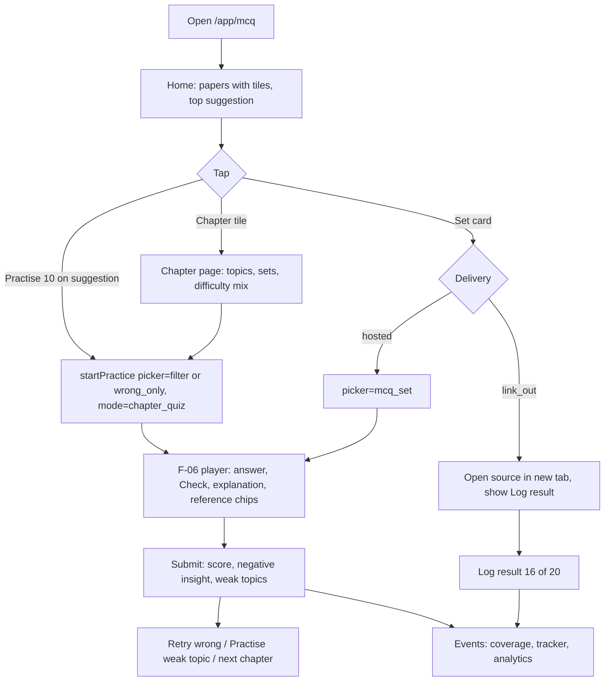
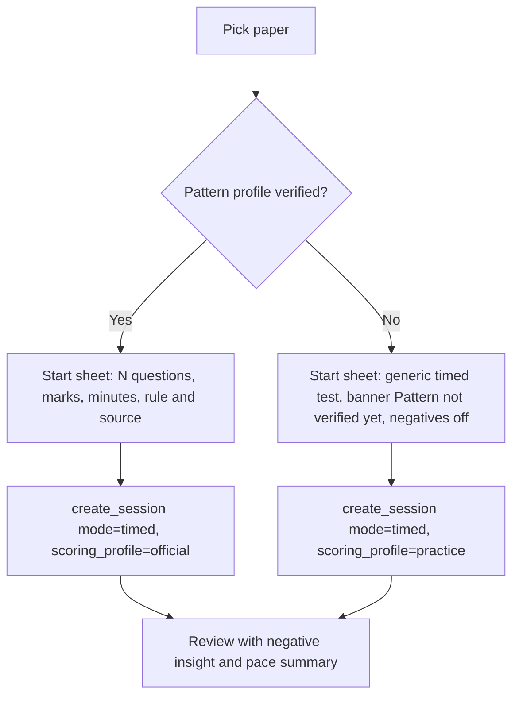
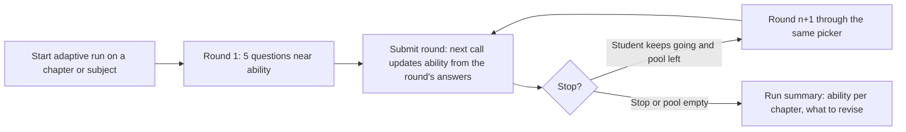

# PRD: F-05 MCQ Bank

| Field | Value |
| --- | --- |
| Status | Draft (for founder review) |
| Owner | Pawan (founder) |
| Last updated | 2026-10-05 |
| Source | `docs/product/FEATURE_MAP.md` section F-05 (item 5 "MCQ bank", page 3: "from the Institute, accessible directly through the website; subject-wise, group-wise") and its `[ADD]` items, section 6 (custom test generator, adaptive practice), section 7 risks 1 and 2 |
| Linked ERD | `docs/product/erd/F-05-mcq-bank.md` |
| Role | **Practice surface, not a data owner.** F-05 is a thin experience over [F-06](./F-06-question-bank-system.md): it owns how a student finds MCQs, which practice presets exist, how institute MCQ sets are delivered (hosted or link-out), the MCQ-specific tests (exam-pattern test, blueprint test) and adaptive practice. It owns **no question, option, attempt, score or file table**. Every answer is an F-06 `practice_session` and every question an F-06 `questionbank_question` |
| Modules | API `apps/api/modules/mcqbank` (small: sets, patterns, presets, adaptive state); web `apps/web/src/modules/mcqbank`. Justification for a separate module rather than extra code in `practice`: it adds seven tables and three registered pickers that only exist for MCQ, and it must be switchable by its own flag without touching the engine |
| Feature flags | `mcq_bank` (all student surfaces and APIs; also requires `question_bank`), `mcq_adaptive` (adaptive practice, R3). Server checked, 403 `feature_disabled`. Permission scopes: `mcqbank.read` (student), `mcqbank.manage_sets`, `mcqbank.manage_patterns` (editor), `mcqbank.admin` (admin) |
| Depends on | F-06 (questions, sessions, scoring, events), F-02 (taxonomy, enrolment, coverage), X-04 (Institute MCQ sets via the `question_set` content type and licence tiers) |
| Siblings | [F-09 PYQ](./F-09-previous-year-questions.md) (same engine, paper-shaped), [F-04 Super 50](./F-04-super-50-questions.md) (curated lists), [F-08 Mock tests](./F-08-mock-tests-and-mtp.md) `[PROPOSED]` (strict exam simulation), [F-10 Analytics](./F-10-performance-analytics.md), [F-13 Today](./F-13-today-daily-tasks.md), [F-12 Study material](./F-12-institute-study-material.md) `[PROPOSED]` |

---

## 1. Problem and goal

A CA, CS or CMA student wants to "do MCQs" in a very particular way: by paper and chapter, from the Institute where possible, in the exam's own format and marking, and then see what went wrong. Today the MCQs are scattered: Institute PDFs and RTP/MTP papers, the Institute's own BoS app (which offers topic-wise MCQ tests), coaching packs sold per paper, and teachers' lists. None remembers what she has seen, none connects to her syllabus coverage, and the negative-marking rule differs by paper (CA Foundation objective papers are reported to carry 0.25 negative marking; CA Intermediate and Final MCQs and the CMA papers are reported to carry none, and ICSI sources disagree, see F-06 section 8.8). Content is also a legal question: the Institute's copyright policy requires prior written permission for reproduction, so "hosting the Institute's MCQs" cannot be assumed.

**Goal, in four parts:**

1. **Find in two taps.** From `/app/mcq` the student lands on her own course, level and attempt, sees every paper (group, subject, chapter, topic) with honest numbers (available, unseen, wrong, due, accuracy) and starts "Practise 10" on the chapter that needs it most.
2. **Practise the way the exam asks.** Untimed with instant explanation, timed with a pace guide, chapter quiz, revision of wrong or unattempted, a custom test builder with a chapter blueprint, an exam-pattern test per paper that uses the verified marking rule, and (R3) adaptive practice that keeps difficulty near 70% success.
3. **Learn from every answer.** Instant explanation with the section or standard referenced, bookmark, doubt and report, a negative-marking insight ("guessing cost you 2.5 marks"), and the F-06 mistake log. Every finished session feeds coverage (F-02), time (F-01.2) and analytics (F-10) through the F-06 event contract. F-05 adds no second path.
4. **Institute MCQs without legal guesswork.** Each MCQ set carries a delivery mode: `hosted` (only when rights are `licensed` or `institute_material` and the X-04 licence tier is `host`) or `link_out` (default: a card that opens the Institute's own page or app, with an optional "I scored 16/20" log that still counts towards coverage).

Out of scope here and owned elsewhere: the question and attempt model (F-06), curated "Super 50" lists (F-04), strict exam simulation with sections and auto-submit (F-08), term-wise paper structure (F-09), scores, readiness and weak-topic analysis (F-10).

## 2. Users and scenarios

**Aarav, CA Intermediate, 15 minutes between classes.** He opens `/app/mcq`. The top card says "Taxation: GST ITC has 34 questions you have not seen and 6 you got wrong. Practise 10". One tap, the first question shows in under 2 seconds. After Check he sees the explanation and the chip "Section 17(5), CGST Act". He taps the chip and reads the syllabus topic in a side sheet, then returns to the same question. He finishes 8/10 and taps "Retry the 2 wrong".

**Meera, CA Foundation, Paper 3 (objective), exam in 20 days.** She picks "Exam-pattern test: Paper 3". The start sheet says "Marks: +1 per correct answer, minus 0.25 per wrong answer. Source: ICAI exam notice (verified by our editor on 12 Sep)" (illustrative numbers; real ones come from verified rules `[VERIFY]`). After the timed test the review shows "Penalties: -1.75 (7 wrong). You marked 11 answers as guess and were right on 4 (36%). The break-even for this rule is 20%, so your guesses paid off: net +2.25." She learns that educated guesses help under this rule, and which topics she was guessing on.

**Rohan, CMA Final, wants the Institute's own MCQs.** The set catalogue shows "ICMAI practice MCQs, Paper 14, Dec 2025" with the badge "Opens ICMAI site". He practises there, comes back, taps "Log result", enters 17 of 20, and the chapter's practice count moves in My Coverage. A second set, written by our editors, is badged "Platform" and runs in the app with instant explanations.

**Neha, CS Executive, builds a revision test.** She builds a custom test: Company Law, 5 chapters, 25 questions proportional to chapter weightage, medium and hard only, "hide questions affected by an amendment", 30 minutes, saved as the preset "CL sprint". Next week she reuses it with one tap.

**Staff: Karan, editor.** He opens a new Institute MCQ set in the admin, sees that its X-04 source tier is `link_only`, so the form forces delivery `link_out` and hides "hosted". When counsel clears a licence for one source he switches that set to hosted and the publish check verifies every question's `rights_status`.

## 3. Success metrics

Starting hypotheses, calibrated after the first 100 active students.

| Metric | Definition | Target | Event(s) |
| --- | --- | --- | --- |
| Time to first MCQ | Tap on "Practise 10" to first question visible, p75 | under 2 s (served in the F-06 create response) | `mcq_practice_started`, `practice_question_viewed` |
| Cold start | Open `/app/mcq` to first question visible for a returning student, p75 | under 6 s on 4G | same plus `mcq_home_viewed` |
| Quick-start share | Share of MCQ sessions started from a "Practise 10" or tile action, not the builder | 55% | `mcq_practice_started` (`from`) |
| Breadth | Students with at least one MCQ session in 3 subjects within 14 days of first session | 35% | `mcq_practice_started` |
| Weekly depth | MCQs answered per weekly active MCQ student | 80 | server counts from F-06 |
| Revision loop | Sessions followed by a revision-mode session (wrong or due) within 3 days | 25% | `mcq_practice_started` (`mode=revision`) |
| Pattern test adoption | Students within 30 days of their exam who run an exam-pattern test | 30% | `mcq_pattern_test_started` |
| Negative insight value | Students who view the insight and then mark confidence on at least half of their answers (the insight needs it) | 40% of viewers | `mcq_negative_insight_viewed` and F-06 data |
| Link-out honesty | Link-out clicks followed by a logged result within 24 h | 20% | `mcq_linkout_clicked`, `mcq_external_logged` |
| Content quality | Reported errors per 1,000 MCQ answers | under 2 (same as F-06) | `question_reported` |
| Latency | Chapter tiles p95 (cached 60 s) | under 300 ms | server metric |

## 4. Scope

### 4.1 In scope

**R1: Practise (about 3 weeks after F-06 R1)**

1. MCQ home and subject, chapter and topic navigation with progress tiles; filters (difficulty, source, year, term, kind, verified, personal) in the URL; search.
2. One-tap quick start; untimed, timed, chapter quiz and revision modes; custom test builder (wraps the F-06 builder with an MCQ filter and a source filter).
3. Instant explanation with reference chips; bookmark, doubt and report (F-06 components reused).
4. Negative marking: rule and source shown before start, `practice` and `official` profiles, "not verified" fallback.
5. Set catalogue: platform sets (hosted) and Institute link-out cards.
6. Coverage, analytics and mistake log feeding verified by a contract test (no new code path).
7. Public SEO page per subject ("CA Inter Taxation MCQs").

**R2: Test shapes**

8. Exam-pattern test per paper from `mcqbank_patternprofile` (verified facts only).
9. Chapter blueprint (quota by weightage, difficulty mix) and saved presets.
10. Negative-marking insight at review; pace guide in timed mode; "hide amendment-affected questions" (F-14).
11. External result log for link-out sets; reference chips that open a bare-act link.
12. F-13 Today provider and F-04 "in Super 50" badge.

**R3: Adaptive**

13. Adaptive practice (Elo-style ability per chapter, target 70% success), "Add to recall" hook (F-15), hosted Institute sets once licences exist.

### 4.2 Out of scope (and who owns it)

| Concern | Owner | Note |
| --- | --- | --- |
| Question, option, key, version, report, moderation, duplicate detection | F-06 | F-05 only calls `questionbank.selectors` and `services` |
| Session lifecycle, answers, scoring rules, mistake reason, bookmarks, review screen | F-06 `practice` | F-05 launches sessions with `startPractice` and lands the student in the F-06 player and review |
| Curated lists ("Super 50") | F-04 | F-05 shows a badge via `super50.selectors.lists_containing` |
| Strict mock exam (no pause, sections, auto-submit, percentile) | F-08 | F-05 never uses session mode `exam` |
| Previous year questions by term | F-09 | Shares the same engine; F-05 does not duplicate paper structure |
| Weak topics, readiness, reports | F-10 | F-05 only deep-links ("Fix this" starts an F-05 session with an F-10 picker spec) |
| Scraping and fetching Institute sets | X-04 | F-05 registers a publisher for `question_set` and reads licence tiers |
| Notifications, streaks, XP | X-01, X-03 | F-05 emits events only |
| Long-form answers and AI evaluation | F-06 and F-07 | F-05 is MCQ only (kind group `choice`) |

## 5. User flows

### 5.1 Quick start (the aha flow)



### 5.2 Exam-pattern test



### 5.3 Adaptive round chain (R3)



### 5.4 Edge cases (designed and tested)

| Case | Behaviour |
| --- | --- |
| Fewer questions than asked | Create returns `not_enough_questions`; the sheet offers "Practise the 7 available" and the nearest chapters in the subject |
| Chapter has no MCQs | Tile reads "No MCQs yet", `Notify me` (X-01 `[PROPOSED]`), link to the F-06 question browser if other kinds exist |
| Student not enrolled | Home asks for course and level (reuses the F-02 onboarding picker); browsing public subjects works without enrolment |
| Scheme switch after enrolment | URLs use stable keys (`subject_key`, `chapter_key`), not scheme UUIDs, so bookmarks survive a scheme change (audit AUD-017); filters default to the current published scheme |
| Rule unverified | `official` profile degrades to "negative marking off, rule not verified" with the reason (F-06 FR-43); never a guessed number |
| Question taken down mid-session | F-06 shows "Removed", excluded from the score; set counts refresh on `question_taken_down` |
| Link-out target moves | A link check marks the set `broken` after 2 failures and hides it from the catalogue; the log form still works for old links |
| Student logs the same external result twice | Idempotent by `client_id`; a second log for the same set and day replaces the first (one coverage event) |
| Two devices | Sessions are server state (F-06); presets are last write wins by `updated_at` with a conflict toast |
| Offline | Home and chapter tiles show the last cached numbers with an "Offline" banner; starting a new session is disabled; an open session continues (F-06 queue) |
| 5 open sessions | F-06 returns `too_many_open_sessions`; the sheet shows the list to resume or abandon |

## 6. Functional requirements

IDs are `FR-F05-nn`. Priority and release follow section 4.

### A. Browse and navigate

| ID | Requirement | Priority | Acceptance criteria |
| --- | --- | --- | --- |
| FR-F05-01 | `[NOTE]` Browse by group, subject, chapter and `[ADD]` topic from the student's enrolment; hierarchy comes only from `syllabus.selectors` (no copy) | P0 R1 | Given a CA Inter student on the 2023 scheme, then `/app/mcq` lists her groups and papers in syllabus order, and a CMA Final student with an elective choice sees only the chosen elective paper |
| FR-F05-02 | Progress tile per chapter: available, unseen, last-wrong, bookmarked, due, accuracy over the last 3 sessions, last practised; one cached call per subject | P0 R1 | Given 40 MCQs of which 12 attempted and 3 last wrong, then the tile shows 40 / 28 unseen / 3 wrong and the numbers equal the F-06 question state counts |
| FR-F05-03 | Filters: difficulty (Easy 1-2, Medium 3, Hard 4-5 from the editorial label), source (Institute, Platform, Community), year and term, kind (single, multiple, true or false, case scenario), verified only, personal (unattempted, wrong last time, never correct, bookmarked, doubt, due); all in the URL; counts capped at "1,000+" | P0 R1 | Given `?difficulty=hard&source=institute&state=wrong`, then a reload and another device show the same list |
| FR-F05-04 | MCQ-only guarantee: every F-05 list and picker adds `kind_groups=["choice"]` so long-form and practical items never appear; a case-scenario parent qualifies only when all its live children are choice kinds | P0 R1 | Given a case study with one long-form child, then it never appears in an F-05 list or session |
| FR-F05-05 | Search by words and by provision ("17(5)", "Ind AS 115", "SA 230") inside a subject or chapter (F-06 search) | P0 R1 | Given "inpt tax credit", then ITC MCQs appear in the first 20 |
| FR-F05-06 | Source labels never overstate: Institute (verified or not), Platform, Community (unverified) with a visible badge; default filter prefers Institute and Platform | P0 R1 | Given a mixed list, then Community items carry the badge text "Community, unverified" |
| FR-F05-07 | Public SEO page per subject: chapters, counts, 3 sample questions with explanations hidden, sign-in call to action | P1 R1 | Given a subject with at least 5 public MCQs, then `/courses/ca/intermediate/taxation/mcqs` renders on the server with `buildHead`, canonical URL and BreadcrumbList; with fewer than 5 it is `noindex` |

### B. Practice modes

| ID | Requirement | Priority | Acceptance criteria |
| --- | --- | --- | --- |
| FR-F05-08 | One-tap quick start per chapter or subject: default mix is unseen first, then last-wrong, then due, then random; count 10 (setting 5, 10, 15, 20) | P0 R1 | Given 4 unseen, 3 wrong and 20 others in a chapter, then "Practise 10" contains the 4, the 3 and 3 others |
| FR-F05-09 | Untimed mode: F-06 mode `untimed`, feedback `instant`; Check then Next; keyboard 1-4, Enter, N | P0 R1 | Given Check, then result, key, explanation and references show within 300 ms p95 |
| FR-F05-10 | Timed mode: F-06 mode `timed`, feedback `at_end`; time limit default = sum of `suggested_seconds`; pace guide "ahead, on pace, behind" from per-question suggested time | P0 R1 (pace P1 R2) | Given a 20-question test of 30 minutes, then at question 10 after 18 minutes the guide says "behind by 3 minutes" in text and icon |
| FR-F05-11 | Chapter quiz: F-06 mode `chapter_quiz`, 10 questions with a fixed difficulty mix (about 3 easy, 5 medium, 2 hard when available), ends with weak topics | P0 R1 | Given a chapter with enough items, then the mix is respected within one question |
| FR-F05-12 | Revision: pickers `wrong_only`, `unattempted` and F-06 filter `bookmarked`, `doubt`, `due`; mode `revision` | P0 R1 | Given 12 questions answered wrongly in Taxation, then "Revise wrong (12)" starts a 12-question session |
| FR-F05-13 | Custom test builder: wraps the F-06 builder, adds source and amendment toggles, live available count under 300 ms; count 5 to 100; time; scoring profile | P0 R1 | Given filters matching 3 questions and count 10, then "3 available. Widen filters?" |
| FR-F05-14 | Blueprint: per-chapter quota proportional to chapter marks weight (`marks_min/max` from F-02, equal share when unknown) or manual, plus difficulty mix; picker `mcq_blueprint` | P1 R2 | Given chapters weighted 20, 10, 10 and count 20, then quotas are 10, 5, 5 and fall back to other chapters when a chapter lacks items |
| FR-F05-15 | Presets: save a builder state as a named preset (max 20 per student), system presets for each paper; "use" starts a session | P1 R2 | Given the preset "CL sprint", then one tap starts it with the same spec and `use_count` increases |
| FR-F05-16 | Exam-pattern test: per paper from `mcqbank_patternprofile` (question count, marks per question, minutes); uses `scoring_profile=official` only when the pattern and the F-06 rule are both verified | P1 R2 | Given a verified profile (40 questions, 1 mark, 60 minutes), then the session has 40 questions, 60 minutes and the frozen rule shown before start; given an unverified profile, then the start sheet says so and uses `practice` |
| FR-F05-17 | Adaptive practice: chain of 5-question rounds near the student's chapter ability (target success 0.70), prefers unseen items | P2 R3 | Given ability 0.4 on a chapter, then round 1 averages predicted success within 0.60 to 0.80 and ability moves after each round |

### C. Answering and feedback

| ID | Requirement | Priority | Acceptance criteria |
| --- | --- | --- | --- |
| FR-F05-18 | `[ADD]` Instant explanation after Check with source line and reference chips (section, standard, SA, AS) from F-06 `reference_labels` and `search_keys` | P0 R1 | Given a question citing `cgst:17(5)`, then a chip "Section 17(5), CGST Act" shows below the explanation |
| FR-F05-19 | Reference chip opens a bottom sheet with the syllabus topic whose `search_keys` match (via F-06 search) and, when `mcqbank_refsource` has a template, an "Open bare act" link | P1 R2 | Given the chip, then the sheet lists up to 3 matching topics and one external link marked "opens in a new tab" |
| FR-F05-20 | `[ADD]` Bookmark, doubt, report an error and private note use the F-06 components and endpoints unchanged | P0 R1 | Given Report, then the F-06 dialog opens with `question_id` and version; no F-05 endpoint exists for it |
| FR-F05-21 | `[ADD]` Negative marking shown before start (rule text, per-wrong deduction, source, verified date) and during the session ("-0.25 if wrong"); skipping never costs marks | P0 R1 | Given a verified rule, then the start sheet and each question show the deduction; given none, then they show "No negative marking" |
| FR-F05-22 | `[NEW]` Negative-marking insight at review: total penalties, answers by confidence band (F-06 `confidence`: sure, unsure, guess) with accuracy, the rule's break-even accuracy (negative / (marks + negative), 20% for 0.25 on 1 mark) and whether each band paid off; "sure but wrong" listed as concept checks. Never advises skipping by hindsight alone | P1 R2 | Given 11 guesses of which 4 right (+1 each) and 7 wrong (-0.25 each), then the insight shows net +2.25, accuracy 36%, break-even 20% and "guessing paid off"; computed from the review payload by a pure function with a TypeScript twin and shared fixtures |
| FR-F05-23 | `[NEW]` Hide questions affected by an amendment (F-14) in builders and quick start when the student toggles it (default on for tax and law papers) | P1 R2 | Given the toggle on and 5 affected ids from `affected_question_ids`, then none appear in the session |

### D. Feeding the system

| ID | Requirement | Priority | Acceptance criteria |
| --- | --- | --- | --- |
| FR-F05-24 | `[ADD]` Every submitted or auto-submitted session with `origin_module=mcq_bank` produces the F-06 `practice_session_completed` event with `by_chapter`; coverage receives `practice_done` or `revision_done`; no F-05 code writes coverage | P0 R1 | Given a 10-question chapter session, then one `practice_done` exists for the chapter (idempotent on replay) and the tracker auto session exists only if the student enabled auto capture |
| FR-F05-25 | `[ADD]` Mistake log: wrong answers appear in the F-06 mistakes list; F-05 deep-links "Mistakes" and "Bookmarks" with `?kind_group=choice` | P0 R1 | Given a wrong answer, then it is listed within 2 s and the F-05 hub count equals the F-06 count |
| FR-F05-26 | "Fix this": from a review's weak topics, start a 5-question session on that topic (picker `filter`, topic scope) | P1 R2 | Given a weak topic, then one tap starts 5 questions of that topic, unseen first |

### E. Institute and curated sets

| ID | Requirement | Priority | Acceptance criteria |
| --- | --- | --- | --- |
| FR-F05-27 | `[NOTE]` Set catalogue by subject and chapter: kind (Institute, RTP, MTP, platform, coaching), term, source, count, delivery badge (`Hosted` or `Opens {source}`) | P0 R1 | Given a published set, then it appears under its chapter and subject with the correct badge and count |
| FR-F05-28 | Hosted delivery only when the set's collection has every question `rights_status in (licensed, institute_material)` and the X-04 source tier is `host`, or all questions are `original` platform content; checked at publish | P0 R1 | Given one `unknown` question, then publish fails with the offending ids |
| FR-F05-29 | Link-out delivery: card with title, source, term, "Opens {source} in a new tab" (`rel="noopener noreferrer"`), no scraped text; click is logged | P0 R1 | Given a link-out set, then clicking opens the source in a new tab and records `mcq_linkout_clicked` with the host only |
| FR-F05-30 | External result log: score, maximum, date; creates one idempotent coverage `practice_done` (source `manual`) for the set's chapter; shown in history labelled "self-reported" | P1 R2 | Given 17 of 20, then one coverage event with value 85 exists and a duplicate log changes nothing |
| FR-F05-31 | Set withdrawal: when a takedown or licence ends, a hosted set becomes `withdrawn`, hidden within 15 minutes; open sessions finish; students see "Removed" | P0 R1 | Given `question_taken_down` for a member, then the set count drops and the card shows the new count |
| FR-F05-32 | `[ADD]` "In Super 50" badge on a question or set when `super50.selectors.lists_containing` returns lists | P1 R2 | Given a question in two lists, then the badge says "In 2 Super 50 lists" |

### F. Platform

| ID | Requirement | Priority | Acceptance criteria |
| --- | --- | --- | --- |
| FR-F05-33 | `[NEW]` Today provider: registers an MCQ provider with F-13 (`register_task_provider`) offering "5 MCQs: {chapter}" with completion by `practice_session_completed` | P1 R2 | Given Today asks for MCQ candidates, then at most 2 per paper are returned with a rationale ("6 wrong last week") |
| FR-F05-34 | `[NEW]` "Add to recall" on an explanation creates an F-15 card from the reference label (R3, `[PROPOSED: F-15]`) | P2 R3 | Given F-15 present, then the button shows and creates a card; given absent, the button is hidden |
| FR-F05-35 | Admin: editors manage sets, pattern profiles and system presets in the Django admin (R1) and a React curation page (R2); scoring rules stay F-06 admin | P0 R1 | Given an editor, then they can create a set, attach an F-06 collection and publish; a student receives 403 |
| FR-F05-36 | Flags and quotas: `mcq_bank` server checked on every endpoint (403 `feature_disabled`); presets 20, external logs 200 per month | P0 R1 | Given the flag off, then every F-05 endpoint answers 403 `feature_disabled` (parametrised test) |

## 7. Screens, URLs and design-system needs

All filters, tabs and selections live in the URL (zod-validated search params). `/app/...` is private and `noindex`; public pages use `buildHead()`. URLs use stable keys (`$subject` is `subject_key`, `$chapter` is `chapter_key`), never scheme-specific UUIDs.

### 7.1 Screens and URLs

| Screen | URL | Notes |
| --- | --- | --- |
| MCQ home | `/app/mcq` | Top suggestion, paper tiles, resume, due, "Tests", "Sets". `?group=` filters by group |
| Subject | `/app/mcq/$subject` | `?tab=chapters\|sets\|tests&section=` Chapter tiles grouped by section, subject-level quick start |
| Chapter | `/app/mcq/$subject/$chapter` | `?topic=&difficulty=&source=&kind=&year=&term=&state=&q=&sort=&cursor=`; question list, quick actions, sets for the chapter |
| Set catalogue | `/app/mcq/sets` | `?subject=&kind=&term=&delivery=&q=` |
| Set detail | `/app/mcq/sets/$slug` | Hosted: start, counts, chapters; link-out: open source, `?log=1` opens the result dialog |
| Test builder | `/app/mcq/test` | `?subject=&chapters=&n=&difficulty=&source=&time=&profile=&blueprint=&hideAmended=&preset=` |
| Exam-pattern tests | `/app/mcq/tests` | One card per paper with a verified or unverified pattern; `?paper=<subject_key>` opens the start sheet |
| Presets | `/app/mcq/presets` | List, rename, delete, use |
| Adaptive | `/app/mcq/adaptive`, `/app/mcq/adaptive/$runId` | R3. Start sheet and run summary; rounds play in the F-06 player |
| Player and review | `/app/practice/session/$id`, `.../review` | F-06; F-05 links with `?from=mcq` for the back target |
| Mistakes, bookmarks | `/app/practice/mistakes?kind_group=choice`, `/app/practice/bookmarks?kind_group=choice` | F-06 pages; the `kind_group` param is a `[PROPOSED EXTENSION to F-06]` (E-F06-4) |
| Public subject MCQs | `/courses/$course/$level/$subject/mcqs` | SSR, indexable when at least 5 public MCQs; OG image from `/og/courses/...` |
| Admin sets and patterns | `/app/admin/mcq/sets`, `/app/admin/mcq/patterns` | R2 React pages; R1 uses Django admin |

### 7.2 Wireframes (mobile first, 320 to 1280 px)

**MCQ home (`/app/mcq`)**

```
┌──────────────────────────────────┐
│ MCQ practice   CA Inter · 2023   │
│ ┌──────────────────────────────┐ │
│ │ Start here                   │ │  one suggestion, with a reason
│ │ Taxation · GST ITC           │ │
│ │ 34 unseen · 6 wrong last time│ │
│ │ [ Practise 10 ]   [Other ▾]  │ │
│ └──────────────────────────────┘ │
│ Resume (1)  ▸ Costing, 6 of 10   │
│ Due for revision today: 5  [Go]  │
│ Group 1                          │
│ ┌ Advanced Accounting ─────────┐ │
│ │ ▓▓▓░░░░ 38% seen · acc 71%   │ │  SegmentedBar + text (never colour only)
│ │ 12 chapters · 410 MCQs   ›   │ │
│ └──────────────────────────────┘ │
│ Group 2 ...                      │
│ [Tests] [Sets] [My presets]      │
└──────────────────────────────────┘
```

**Chapter page (`/app/mcq/taxation/gst-itc`)**

```
┌──────────────────────────────────┐
│ ← Taxation   GST: Input Tax Credit│
│ 62 MCQs · 28 unseen · 3 wrong · 2 due │
│ [ Practise 10 ] [ Timed 20 ] [ More ▾ ]│  More: Revise wrong, Bookmarked, Custom
│ Difficulty  Easy 18 · Medium 30 · Hard 14 │
│ Topics: Eligibility (14) · Blocked credit (11) ... │ chips filter the list
│ Sets for this chapter                    │
│  ICAI RTP May 2025 (hosted, 12)   ›      │
│  ICAI practice MCQs  [Opens ICAI site ↗] │
│ [Filters (2)] [Sort ▾]  62 results       │
│ ┌ MCQ · 2 marks · RTP May 25 ──────────┐ │
│ │ Input tax credit on motor vehicles...│ │
│ │ Institute · Verified  ✗ last time  ☆ │ │
│ └──────────────────────────────────────┘ │
└──────────────────────────────────┘
```

**Start sheet and review insight (exam-pattern test)**

```
Start sheet                           Review: negative marking insight
┌────────────────────────────┐        ┌────────────────────────────────┐
│ Paper 3: Business Maths... │        │ Score 31.25 / 40               │
│ 40 questions · 60 minutes  │        │ Penalties: -1.75 (7 wrong)     │
│ +1 correct · -0.25 wrong   │        │ You marked 11 as "guess":      │
│ Source: ICAI notice,       │        │  4 right (+4), 7 wrong (-1.75) │
│ verified 12 Sep 2026       │        │ Right 36%; break-even is 20%,  │
│ [ Start test ]             │        │ so guessing paid off (+2.25).  │
│ Rule not verified? Shows   │        │ [ Practise the guessed topics ]│
│ "negative marking off".    │        └────────────────────────────────┘
└────────────────────────────┘
```

### 7.3 UI states per screen

"Skeleton" means layout-stable placeholders. Every cell is built and covered by a component test or showcase entry.

**MCQ home and subject**

| State | Behaviour |
| --- | --- |
| First time | Not enrolled: course and level picker (F-02 onboarding component). Enrolled but no sessions: the suggestion card reads "Try your first 10 in {weakest-coverage chapter}" and a one-time coach mark explains tiles |
| Loading | Suggestion and 6 tile skeletons; tiles load per subject; navigation stays usable |
| Partial | Tiles render from the syllabus first; progress numbers fade in; a failed progress call shows tiles without numbers and "Progress could not load. Retry" |
| Success | Suggestion, resume list (max 5), due count, subjects with SegmentedBar and text |
| Empty content | Subject without MCQs: "No MCQs yet", Notify me, link to the F-06 browser |
| Error | Inline alert with Retry and request id; last good data stays dimmed |
| Offline | Banner "Offline: showing numbers from {time}"; Practise disabled except Resume |
| Flag off | "MCQ practice is not available yet" page |
| Long content | Paper names wrap to two lines; group lists collapse after 6 papers with "Show all" |

**Chapter page**

| State | Behaviour |
| --- | --- |
| First time | Coach mark on Practise 10 and the difficulty split |
| Loading | Header numbers pulse; 6 question skeleton rows |
| Empty result after filters | "No MCQs match" with the strongest filter suggested for removal |
| Success | Header counts, actions, topic chips, sets, list with personal overlay |
| Not enough questions | Practise 10 becomes "Practise 7" with the reason |
| Link-out set | Card shows the source name, "Opens in a new tab", and after return a "Log result" prompt |
| Error / offline | As home; the list keeps the last page |
| Long content | Stems clamp to 3 lines; chips scroll horizontally inside their row |

**Set catalogue and set detail**

| State | Behaviour |
| --- | --- |
| Empty | "No sets for this paper yet. Practise by chapter instead" |
| Hosted | Count, chapters, estimated minutes, Start; "Verified" and licence line ("Provided under licence from ICAI" only when the source says so) |
| Link-out | Badge "Opens ICAI", note "Not hosted here", Open and Log result; broken link state hides Open and says "This link no longer works" |
| Withdrawn | Card greyed "Removed", sessions in progress finish |
| Log dialog | Score and maximum numeric fields (max 500), date defaults today, validation inline, success toast "Logged. Coverage updated" |
| Quota | 200 logs per month: "Limit reached, try next month"; practising is unaffected |

**Builder, presets, pattern tests**

| State | Behaviour |
| --- | --- |
| First time | Builder opens with the chapter preselected from the URL; a sample preset "Quick 20 mixed" is shown |
| Live count | Count pulses while computing, then "42 available"; under 300 ms |
| Blueprint | Quota steppers per chapter with the weight source ("indicative"), sum check, "Balance" button |
| Pattern unverified | Banner "We have not verified this paper's pattern yet. Running a generic timed test" |
| Presets full | "You have 20 presets. Delete one" |
| Error | Create errors map to fields; `not_enough_questions` offers a smaller count |
| Offline | Builder disabled with a banner; saved presets visible read-only |

**Review insight and adaptive**

| State | Behaviour |
| --- | --- |
| No negatives | Insight card hidden; the F-06 review shows normally |
| No guess marks | Card shows penalties only and the tip "Mark confidence next time to see guess analysis" |
| Provisional | Not applicable (MCQ only) |
| Adaptive between rounds | Summary of the round, ability bar with text, "Continue" or "Stop"; reduced motion respected |
| Adaptive pool exhausted | "You have seen every question in this scope. Switch to revision?" |

### 7.4 Design-system components

Reused from `packages/design-system` (after F-06): Button, Card, Badge, Tabs, Sheet, Dialog, Combobox, FilterChip, SegmentedControl, ProgressRing, Alert, Skeleton, EmptyState, StatTile, Toast, NumberStepper, Switch, Slider, DataTable, RichText, Tooltip.

New (add to `packages/design-system` with showcase entries, four themes, contrast checked): `SegmentedBar` (stacked proportion bar with a text alternative and optional legend; unseen, wrong, right as pattern plus label, not colour only).

App-specific (stay in `apps/web/src/modules/mcqbank`): `ChapterTile`, `SubjectCard`, `SuggestionCard`, `SetCard`, `LogResultDialog`, `StartSheet`, `NegativeInsight`, `ReferenceChip`, `PaceGuide`, `PresetList`, `PatternCard`, `BlueprintEditor`, `AdaptiveSummary`. Icons come only from `@artha/design-system` (Lucide set). No raw hex.

Aha moments to instrument: first "Practise 10" tap from the suggestion, first reference chip opened, first retry of wrong answers, first negative insight viewed, first external log.

## 8. Data and permissions

Entities, columns and indexes are in the [ERD](../erd/F-05-mcq-bank.md). Everything is reached through the Django API; the Supabase Data API stays closed and RLS is deny-by-default.

### 8.1 Entities at a glance

| Table | Purpose | Personal data |
| --- | --- | --- |
| `mcqbank_set` | Catalogue entry for an MCQ set, hosted (F-06 collection) or link-out (URL) | No |
| `mcqbank_patternprofile` | Verified MCQ structure of a paper (count, marks, minutes) | No |
| `mcqbank_testpreset` | Saved builder specs: system presets and per-student presets | Yes (user presets) |
| `mcqbank_externallog` | Self-reported result of a link-out set | Yes |
| `mcqbank_refsource` | Reference prefix to bare-act URL template | No |
| `mcqbank_adaptiverun`, `mcqbank_abilityestimate` | Adaptive practice state (R3) | Yes |

### 8.2 Permission matrix

| Action | Anonymous | Student | Editor | Admin |
| --- | --- | --- | --- | --- |
| Read public subject MCQ page | yes | yes | yes | yes |
| Home, chapter tiles, sets, start practice, presets, external log | no | yes | yes | yes |
| Create and publish sets, edit pattern profiles and system presets | no | no | yes | yes |
| Mark a pattern profile or a set `verified` | no | no | yes | yes |
| Change delivery of a set to `hosted` | no | no | no | yes (needs rights evidence) |
| Scoring rules, takedown | no | no | no | yes (F-06) |

### 8.3 Quotas (defaults for plan `free`, `[PROPOSED]` columns on `questionbank_quotaplan` or constants until billing exists)

| Limit | Free |
| --- | --- |
| Presets | 20 |
| External log entries | 200 per month |
| Adaptive runs open | 3 |
| Open sessions | 5 (F-06) |

### 8.4 Privacy, retention and DPDP Act 2023

- Personal data owned here: presets, external logs, adaptive state (study habits). Same stance as F-01 and F-06: private, exported and deleted on request. `mcqbank.services.delete_all_for_user` and `export_for_user` join the central deletion hook (audit AUD-004 is the reason this is a requirement, not an option).
- Retention: external logs and presets until the student deletes them or the account; adaptive runs older than 12 months are summarised then deleted.
- No answer text, question text or search text is sent to PostHog or Sentry. Link-out clicks log the host only.
- Link-out is a navigation, not data sharing: no identifier is appended to the outbound URL.

### 8.5 Licensing posture (what we show for Institute MCQs)

| Delivery | When | What students see | Source of truth |
| --- | --- | --- | --- |
| `link_out` (default) | Any Institute or teacher source without a written licence | Title, term, source, count if the source states it, "Opens {source}" button, optional result log | `mcqbank_set.source_url`, X-04 tier `link_only` or `facts_and_summary` |
| `hosted` platform | Our own authored MCQs (`rights_status=original`) | Full practice | F-06 rights |
| `hosted` licensed | X-04 source tier `host` with a recorded written permission, questions `licensed` or `institute_material` | Full practice with attribution "Source: ICAI RTP May 2025" | F-06 rights plus `rights_note`; counsel sign-off (Q-F05-1) |

ICAI's copyright policy states material may be reproduced only after prior written permission with prominent acknowledgement, and ICMAI states copyright of its suggested answers is reserved. Therefore **R1 hosts only original platform MCQs and links out for Institute MCQs**. This is a product and engineering design, not legal advice `[VERIFY with counsel]`.

## 9. API surface

REST under `/api/v1/mcq/`. Bearer Supabase token. Errors use `{"error": {code, message, details}}`. Lists use cursor pagination. Throttle scopes: `mcq_read` 300/min, `mcq_write` 60/min, `mcq_adaptive` 120/min. Flag `mcq_bank`: 403 `feature_disabled` when off. Sessions are created with the F-06 `POST /api/v1/practice/sessions/` (picker names below), so there is no parallel session API.

| Method and path | Purpose | Notes and errors |
| --- | --- | --- |
| GET `home/` | Suggestion, resume, due count, subject cards with SegmentedBar numbers | Private, `no-store`; suggestion reasons are structured codes translated on the client |
| GET `subjects/{subject_key}/chapters/` | Chapter tiles (available, unseen, wrong, bookmarked, due, accuracy, last practised) | ETag, client cache 60 s; 404 unknown subject |
| GET `chapters/{subject_key}/{chapter_key}/` | Topics with counts, difficulty split, sets, pattern snippet | 404 for unknown keys |
| GET `sets/`, GET `sets/{slug}/` | Catalogue and detail | Filters `subject`, `kind`, `term`, `delivery`; withdrawn hidden |
| POST `sets/{id}/clicks/` | Record a link-out click (host only) | 204, throttled |
| POST `sets/{id}/external-log/`, GET `external-log/`, DELETE `external-log/{id}/` | Self-reported result | 201 idempotent by `client_id`; 422 `score_exceeds_max`; 429 `quota_exceeded` |
| GET, POST `presets/`; PATCH, DELETE `presets/{id}/`; POST `presets/{id}/use/` | Presets | 429 at 20; `use` returns a ready F-06 session spec |
| GET `patterns/`, GET `patterns/{id}/` | Verified MCQ structure per paper | `?course=&level=&subject_key=` |
| POST `tests/preview/` | Blueprint resolution: quotas per chapter, available counts, warnings | No write; under 300 ms |
| GET `reference-sources/` | Prefix to link template list | CDN cacheable 1 hour |
| POST `adaptive/`, GET `adaptive/{id}/`, POST `adaptive/{id}/next/`, POST `adaptive/{id}/stop/` | Adaptive run (R3) | `next` is idempotent by round number and locks the run row; 409 `round_open` while a round is unfinished |
| GET `public/subjects/{course}/{level}/{subject}/summary/` | Public SEO data: chapters, counts, samples | CDN `s-maxage=300` |
| Admin: POST, PATCH `admin/sets/`, POST `admin/sets/{id}/publish/`, `.../withdraw/`; CRUD `admin/patterns/`; POST `admin/patterns/{id}/verify/` | Curation | editor; hosted switch is admin only |

Pickers registered with F-06 `register_picker` (names are part of the contract in ERD 3.2): `mcq_set` (spec `{set_id}`), `mcq_blueprint` (spec `{chapters:[{chapter_id, n}] or subject_key+count, mix: smart|random, difficulty_mix, filter, hide_amended}`; quick start and chapter quiz are single-chapter blueprints), `mcq_adaptive` (spec `{run_id}`, R3). Built-in pickers `filter`, `wrong_only`, `unattempted`, `collection` are reused. Origin `mcq_bank` registered with `register_origin` (allowed modes `untimed`, `timed`, `chapter_quiz`, `revision`, `custom_test`; not `exam`).

## 10. Analytics events and notifications

### 10.1 Product events (PostHog, `noun_verb`, no personal text)

| Event | Properties |
| --- | --- |
| `mcq_home_viewed` | has_enrolment, subjects_count, suggestion_reason |
| `mcq_chapter_viewed` | subject_key, chapter_key, available_bucket, unseen_bucket |
| `mcq_practice_started` | mode, picker, scope (chapter, subject, set, custom), question_count, scoring_profile, from (suggestion, tile, builder, preset, set, today) |
| `mcq_filter_applied` | filter_keys, result_bucket |
| `mcq_set_opened`, `mcq_set_started` | set_kind, delivery, source_kind |
| `mcq_linkout_clicked` | source_host, set_kind |
| `mcq_external_logged` | score_pct_bucket, source_host |
| `mcq_preset_saved`, `mcq_preset_used` | spec_kind, use_count_bucket |
| `mcq_pattern_test_started` | paper_subject_key, verified |
| `mcq_negative_insight_viewed` | penalties_bucket, guess_count_bucket |
| `mcq_reference_chip_opened` | prefix, target (topic, external) |
| `mcq_adaptive_started`, `mcq_adaptive_round_completed` | round_no, ability_bucket |

F-06 events (`practice_*`, `question_*`) are not duplicated.

### 10.2 Domain events

Emitted (envelope per F-06 ERD 3.4, schemas in `core/event_schemas`): `mcq_set_published` (`set_id`, `delivery`, `chapter_ids[]`, `subject_key`, `question_count`), `mcq_set_withdrawn` (`set_id`, `reason`), `mcq_external_logged` (`set_id`, `chapter_id`, `score_pct`), `mcq_adaptive_round_applied` (R3). Consumed: `practice_session_completed` (origin `mcq_bank`, for preset use counts, deferred), `question_taken_down` and `question_unpublished` (refresh set counts, withdraw empty sets), `collection_updated` (refresh `question_count`), `question_version_live` (invalidate count caches).

### 10.3 Notifications (X-01 `[PROPOSED]`)

| Trigger | Copy |
| --- | --- |
| New hosted set for a followed subject (R3) | "A new set is ready: Taxation, RTP May 2026, 25 MCQs." |
| Link broken | Staff only (Sentry and admin list) |

## 11. Non-functional requirements

| Area | Requirement |
| --- | --- |
| Performance | Home p95 under 400 ms; chapter tiles p95 under 300 ms (60 s cache, ETag); blueprint preview under 300 ms; session create under 500 ms (F-06). Home interactive under 2 s on a mid-range phone on 4G |
| Scalability | At 50,000 MAU, about 3 tile requests per active student per day: under 1 request per second average; tile query is one indexed read of `practice_questionstate` grouped by chapter (E-F06-1) plus facet counts cached 10 minutes |
| Accuracy | Tile numbers equal F-06 state counts (contract test with a 500-question fixture); scoring is F-06's only |
| Security | No answer key leaves the server before the policy allows (F-06); link-out URLs are `https` only, rendered with `rel="noopener noreferrer"`; presets validated against the `QuestionFilter` v1 schema and size-capped (4 KB) |
| Accessibility | WCAG 2.2 AA. SegmentedBar and difficulty badges carry text; tiles are single links with a full label ("Taxation, GST ITC, 34 unseen, 6 wrong"); result of Check announced in `aria-live="polite"` (F-06); keyboard path for every action; link-out buttons say "opens in a new tab" |
| Themes and layout | Reading, Light, Dark, System; 320 to 1280 px without horizontal page scroll; 44 px targets (audit AUD-010: new components use the larger size) |
| SEO and sharing | Public subject page server-rendered with `buildHead`, canonical URL, BreadcrumbList JSON-LD; `Quiz` JSON-LD only on F-06 public question pages `[VERIFY eligibility]`; thin-content guard (5 public MCQs); private pages `noindex` |
| Privacy | As 8.4 |
| Cost | No AI on the student path in R1 to R3 (adaptive is arithmetic). Editors may use F-06/X-04 AI import under the shared budget |
| Observability | Sentry on API and web; metrics: tile latency, cache hit ratio, preset count, set link-check failures; PostHog events above |
| Offline | Home and tile cache for 24 hours in IndexedDB (reusing the shared queue module); sessions use the F-06 queue |
| i18n | English first; `en-IN` number formats; labels ready for Hindi (F-06 `lang`) |

## 12. Risks and open questions

| # | Question or risk | Recommended default | Decides |
| --- | --- | --- | --- |
| Q-F05-1 | Can we host Institute MCQs (RTP, MTP, practice MCQs) verbatim? | No in R1 and R2: link-out with metadata; host only after written permission per source; ask each Institute for a licence letter | Founder with counsel |
| Q-F05-2 | Negative marking per paper | Seeded `draft` in F-06; a rule is shown as `official` only when verified; third-party sources say CA Foundation objective papers carry 0.25 and CA Inter and Final MCQs none `[VERIFY]` | Founder, after reading each Institute's exam notice |
| Q-F05-3 | MCQ counts and minutes per paper for the exam-pattern test | Empty `draft` profiles; editors fill and verify from the Institute's published exam pattern; no number is invented in docs | Editor |
| Q-F05-4 | Are case-scenario MCQs (CA Inter and Final) part of the bank or a separate mode? | Part of the bank as F-06 `case_study` with MCQ children (kind group `choice`); a "Case scenarios" filter chip | Founder |
| Q-F05-5 | Default source preference | Institute and Platform first; Community unverified shown last and badged | Founder |
| Q-F05-6 | Should link-out external logs count as full coverage evidence | Yes as `practice_done` (source `manual`) with value from the score; F-10 can exclude `self_reported` rows | Founder with F-10 author |
| Q-F05-7 | Adaptive target success | 0.70, tunable in settings by editors; the Elo-style update is arithmetic, not AI | Engineering |
| Q-F05-8 | Where should "hide amended questions" default | On for tax and law papers only | Founder |
| Q-F05-9 | Separate module vs code inside `practice` | Separate `mcqbank` (7 small tables, own flag); revisit if it stays under 400 lines of services | Engineering |
| R-F05-1 | Thin content: link-out only is a weak product on day one | Ship platform-authored sets first (editors, F-06 CSV import) and make the chapter tiles useful with F-06 community content | |
| R-F05-2 | Link rot on Institute pages | Link-check job, `broken` state after 2 failures, hide automatically | |
| R-F05-3 | Wrong pattern facts damage trust | `verified` flag, source note and date shown, unverified patterns never use the official profile | |
| R-F05-4 | Tile queries become slow | Denormalised `chapter_id` on question state (E-F06-1), 60 s cache, per-subject calls | |
| R-F05-5 | Scope creep into F-06 internals | This document adds no question or attempt table; extensions to F-06 are four small additive items (ERD 3.4) | |

## 13. Rollout

### 13.1 Flags and phases

| Release | Flags on | Content |
| --- | --- | --- |
| **R1: Practise** (about 3 weeks after F-06 R1) | `mcq_bank` | Home, tiles, chapter page, filters, quick start, modes, builder, explanation with references, negative marking display, set catalogue (platform hosted plus link-out), public subject page, contract tests for events |
| **R2: Test shapes** | same | Pattern tests, blueprint, presets, negative insight, pace guide, amendment toggle, external log, reference links, Today provider, Super 50 badge |
| **R3: Adaptive** | `mcq_adaptive` | Adaptive rounds, recall hook, hosted Institute sets when licences exist |

Closed beta with the same 50 students as F-06 R1. Support FAQ: "Why is negative marking off?", "What does Opens ICAI mean?", "How is Start here chosen?", "Why do I see Community badges?".

### 13.2 Slicing into PR-sized issues

Each slice is independently shippable behind `mcq_bank` (nothing visible until the flag is on).

1. F-06 extensions E-F06-1 (`practice_questionstate.chapter_id`, `progress_by_chapter`), E-F06-4 (`kind_group`), small PRs in F-06's modules with tests.
2. `mcqbank` app skeleton: models for set, patternprofile, refsource, migrations, RLS test, Django admin, flag.
3. Selectors: `chapter_tiles`, `suggest_quick_set` (pure ranking in `domain/suggest.py`), tile cache, endpoints `home/`, `subjects/.../chapters/`, `chapters/.../`.
4. Pickers `mcq_set`, `mcq_blueprint` (domain: quota allocation, difficulty mix) and origin `mcq_bank`; picker tests with the F-06 fixture.
5. Design system: `SegmentedBar` with showcase and contrast checks.
6. Web: home, subject, chapter containers; filters in the URL; `startPractice` wiring.
7. Set catalogue: hosted and link-out cards, click logging, publish checks, withdrawal subscriber.
8. Negative marking display on start sheet and per question (reads F-06 `scoring-rules/resolve`).
9. Public subject page with `buildHead` and sitemap entry. **R1 complete.**
10. Pattern profiles, `tests/` page, start sheet, official profile fallback.
11. Presets and the blueprint editor.
12. Negative insight (pure function in `lib/negative-insight.ts`, mirrored test fixture) and pace guide.
13. External log, reference sources and chip sheet.
14. F-14 amendment toggle, F-04 badge, F-13 provider. **R2 complete.**
15. Adaptive: ability model (pure), run table, `next` with locks, UI. **R3.**

## 14. Dependencies and interfaces

| Document | Relationship |
| --- | --- |
| [F-06 PRD](./F-06-question-bank-system.md) and [ERD](../erd/F-06-question-bank-system.md) | Engine. F-05 uses `questionbank.selectors.list_published/search_ids/count_matching/facets/taxonomy_of`, `practice.services.create_session`, `practice.selectors.question_states/accuracy`, registries `register_picker` and `register_origin`, and events. Four `[PROPOSED EXTENSION to F-06]` items in ERD 3.4 |
| [F-02 PRD](./F-02-syllabus-structure-and-coverage.md) and [ERD](../erd/F-02-syllabus-structure-and-coverage.md) | Hierarchy and enrolment through `syllabus.selectors` (`get_subject_by_keys`, `get_chapter_by_keys`, `list_chapters`, `list_topics`) and `coverage.selectors.get_active_enrollment`; coverage receives `practice_done` and `revision_done` through the F-06 subscriber. No syllabus model is queried |
| [X-04 PRD](./X-04-ingestion-scraping-service.md) and [ERD](../erd/X-04-ingestion-scraping-service.md) | `question_set` content type and licence tiers decide delivery; F-06 registers the publisher; F-05 reads source tier through an X-04 selector |
| [F-01.2 PRD](./F-01.2-time-tracker-and-analytics.md) | Auto time arrives through the F-06 subscriber; nothing here |
| [F-09 PRD](./F-09-previous-year-questions.md) | Sibling surface; shares the picker pattern and the `kind_group` filter; MCQ PYQs appear in F-05 lists with source Institute and a "Past paper" chip, the paper structure stays in F-09 |
| [F-04 PRD](./F-04-super-50-questions.md) | `super50.selectors.lists_containing(question_ids)` for badges; list entries open in F-05 modes |
| [F-14 PRD](./F-14-amendments.md) | `amendments.selectors.affected_question_ids` for the toggle; banners through the F-06 annotator extension |
| [F-13 PRD](./F-13-today-daily-tasks.md) | F-05 registers an MCQ task provider (`register_task_provider`) `[PROPOSED]` |
| [F-10 PRD](./F-10-performance-analytics.md) | Reads F-06 rollups; "Fix this" links open F-05 sessions |
| [F-08](./F-08-mock-tests-and-mtp.md) `[PROPOSED]` | Strict simulation. F-05's exam-pattern test is a timed practice, labelled as such |
| [F-11](./F-11-paper-analysis-and-recommendations.md) | Chapter weight for blueprints may later come from F-11 `inferred_chapter_weights` `[PROPOSED]`; until then F-02 `marks_min/max` |
| F-15 `[PROPOSED]` | "Add to recall" hook |
| X-01, X-03 `[PROPOSED]` | Notifications and gamification subscribe to events |

### Provides

| Interface | Consumers |
| --- | --- |
| Web barrel `~/modules/mcqbank`: `McqHomeContainer`, `ChapterMcqCard`, `startMcqPractice({scope, mode, count})`, `useChapterTiles` | F-02 chapter page ("Practise MCQs"), F-13, F-10 "Fix this" |
| `mcqbank.selectors.chapter_tiles(user_id, subject_key)`, `suggest_quick_set(user_id, *, course_id, count)` | F-13 provider, F-10 |
| Pickers `mcq_set`, `mcq_blueprint`, `mcq_adaptive`; origin `mcq_bank` | F-06 `create_session`, F-13, F-10 |
| Events `mcq_set_published`, `mcq_set_withdrawn` | X-01, search, analytics |
| `mcqbank.services.delete_all_for_user`, `export_for_user` | Central deletion hook |

### Consumes

| Interface | Provider |
| --- | --- |
| `questionbank.selectors` (`list_published`, `search_ids`, `count_matching`, `facets`, `taxonomy_of`), `[PROPOSED]` `kind_groups` filter, stats read | F-06 |
| `practice.services.create_session`, `practice.selectors.question_states`, `[PROPOSED]` `progress_by_chapter`; `register_picker`, `register_origin`; events | F-06 |
| `syllabus.selectors`, `coverage.selectors.get_active_enrollment` | F-02 |
| `ingestion` source tier (selector) and publisher registry | X-04 |
| `super50.selectors.lists_containing`, `amendments.selectors.affected_question_ids` | F-04, F-14 |
| `today.registry.register_task_provider` `[PROPOSED]` | F-13 |
| `core.events`, `core.jobs` | F-06 |

## Appendix A. Research notes and references

| # | Source | Finding | Changed the design |
| --- | --- | --- | --- |
| 1 | [ICAI BoS Knowledge Portal](https://icai.org/post/about-bos-knowledge-portal) | Repository of study material, RTPs, suggested answers, MTPs, sample questions and previous attempts' papers as PDFs; refers to a copyright policy and disclaimer | Institute sets are link-out by default; the portal is a primary source for set cards |
| 2 | [ICAI BoS mobile app](https://www.icai.org/post/icai-bos-mobile-app) | The Institute's app already offers "MCQ Paper Practice" with topic-wise online tests and tracks performance | We do not compete on Institute-hosted MCQs; we add syllabus coverage, mistake log, pattern tests and cross-source history; link-out cards point to the app |
| 3 | [ICAI website copyright policy](https://icai.org/post/16585) | Reproduction only after prior written permission, with prominent acknowledgement; no misleading or altered use | R1 hosts original platform MCQs only; hosted Institute MCQs need written permission (Q-F05-1) |
| 4 | [CA Foundation negative marking (catestseries.org)](https://www.catestseries.org/blogs/ca-foundation-negative-marking-rules-what-every-student-must-know.php) | Third-party: Papers 3 and 4 are objective, 1 mark correct, 0.25 deducted per wrong, none for unanswered | Negative marking is a first-class, effective-dated rule; the insight screen exists because the penalty makes skip decisions matter `[VERIFY]` against the ICAI notice |
| 5 | [ICAI new scheme exam pattern (catestseries.org)](https://catestseries.org/blogs/icai-new-scheme-details) | Third-party: Intermediate and Final papers are about 30% objective and 70% subjective with no negative marking; Financial Management and Strategic Management have 15 objective marks | Case-scenario MCQ is part of the bank; pattern profiles hold per-paper MCQ marks, never assumed `[VERIFY]` |
| 6 | [ICAI exam frequency announcement (Business Standard)](https://business-standard.com/india-news/ca-final-exams-to-be-held-thrice-a-year-from-this-year-announces-icai-125032701286_1.html) | Foundation, Intermediate and Final are held three times a year (January, May, September) from 2025 | Term codes are `YYYY-MM` with any month; nothing assumes May and November (also see F-09) |
| 7 | [Zeroinfy MCQ revision pack](https://zeroinfy.in/products/ca-inter-advanced-accounting-mcq-revision-pack) | Market scan: sold per paper, 250 questions across top chapters, chapter-wise and timed modes, "AI-generated plus ICAI-sourced", 180-day validity, price about 299 rupees | Competitors sell per-paper packs with analytics; our edge is one attempt model, coverage link, Institute link-outs and free community content |
| 8 | [Roediger and Karpicke 2006, Test-enhanced learning (PubMed)](https://pubmed.ncbi.nlm.nih.gov/16507066/) | Taking tests improves long-term retention more than restudying | Practice and revision are the primary actions on the home screen; instant explanation after each answer |
| 9 | [Elo-based adaptive practice (Pelanek, Masaryk University)](https://www.fi.muni.cz/~xpelanek/publications/CAE-elo.pdf) | Simple Elo update of student skill and item difficulty with a decreasing uncertainty factor and a target success rate (for example 75%) gives estimates close to joint maximum likelihood and works online | Adaptive practice uses a one-sided Elo update per chapter (items' difficulty comes from F-06 statistics, avoiding hot rows), target 0.70 |
| 10 | [CMA exam negative marking (lakshyacommerce.com)](https://lakshyacommerce.com/blog/cma-india-exam-negative-marking) (via F-06) | CMA Foundation 50 MCQs of 2 marks without negative marking (third-party) | Pattern profiles per level and paper, all `[VERIFY]` |
