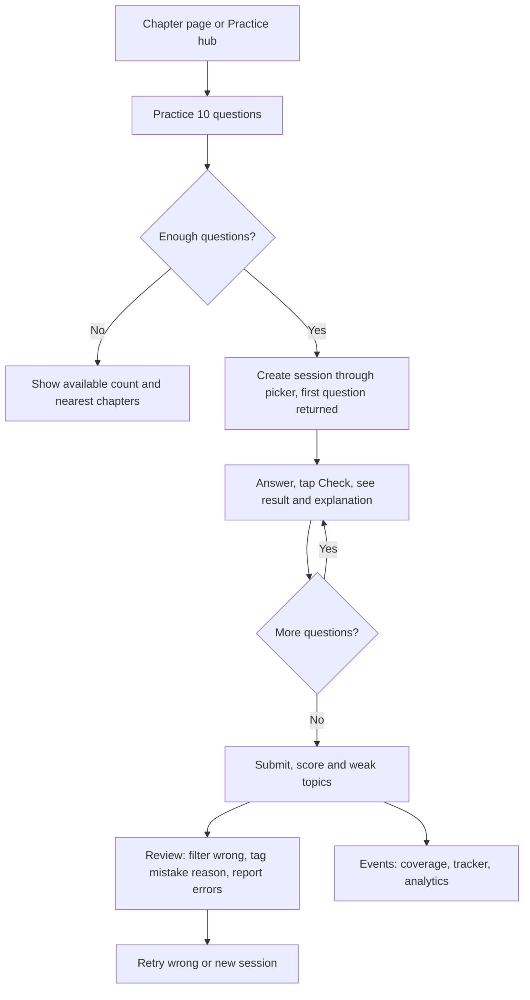
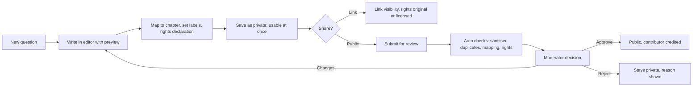
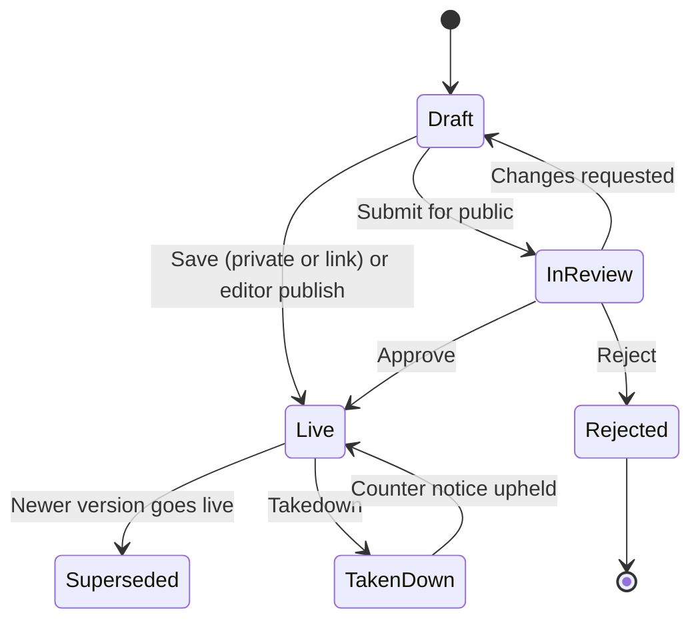
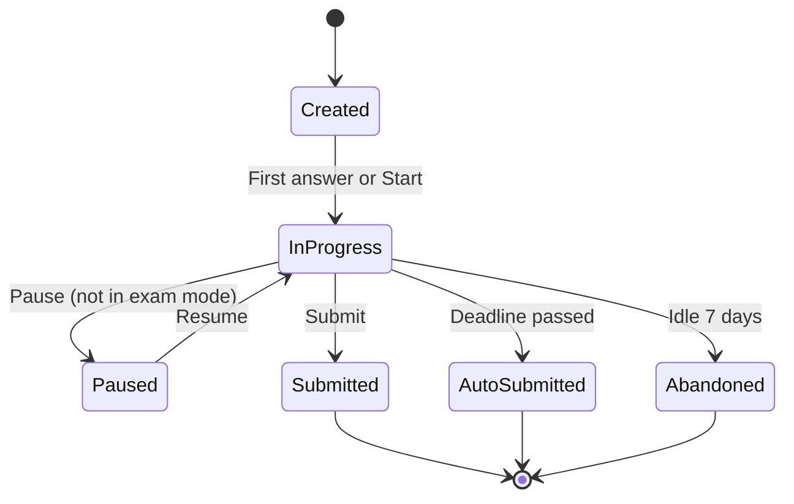
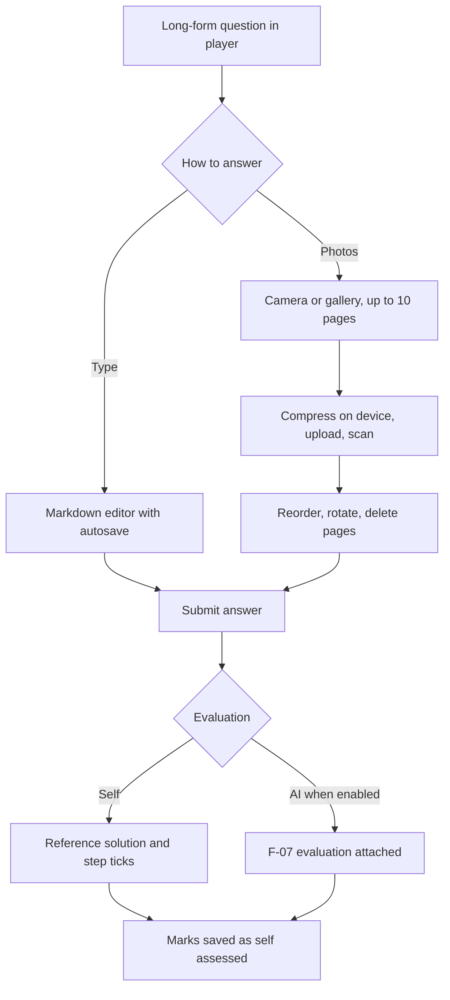

# PRD: F-06 Question Bank System

| Field | Value |
| --- | --- |
| Status | Draft (for founder review) |
| Owner | Pawan (founder) |
| Last updated | 2026-10-05 |
| Source | `docs/product/FEATURE_MAP.md` section F-06 (page 5 "Question bank system", item 6 "users upload mock test questions and answers", item 10 side note "illustrations, examples and questions with solutions") and section 5 (X-01, X-03, X-04) |
| Linked ERD | `docs/product/erd/F-06-question-bank-system.md` |
| Role | **Foundation pointer.** F-04 Super 50, F-05 MCQ Bank, F-08 Mock Tests and MTP, F-09 PYQ, F-12 Institute MAT, F-07 AI Scoring and F-10 Analytics all build on the question and attempt model defined here. The ERD is the contract other authors must not re-model |
| Modules | API `apps/api/modules/questionbank` (content) and `apps/api/modules/practice` (attempts), plus two small shared modules this pointer introduces: `apps/api/modules/media` (attachments) and `apps/api/core/events.py` (domain events). Web `apps/web/src/modules/questionbank` and `apps/web/src/modules/practice` |
| Feature flags | `question_bank` (browse and practice), `question_contrib` (create, upload, share, import), `practice_longform` (long-form answers and image upload). Server checked, 403 `feature_disabled` |
| Depends on | F-02 syllabus tables (`syllabus_*`), X-04 ingestion (provenance, publishers), `profiles.role` |

---

## 1. Problem and goal

A CA, CS or CMA student practises from five places that do not talk to each other: the Institute's MCQ PDFs and RTP/MTP papers, coaching test series, teacher "important questions" lists, the study material's illustrations, and WhatsApp photos of a friend's notes. Nothing remembers what she attempted, which options she picked, why she got it wrong, how long it took or which chapter it belongs to. Each source has its own format, so the platform cannot give a student one place to practise, one mistake log, or one honest readiness picture.

**Goal, in three parts:**

1. **One question model for everything.** Single and multiple correct MCQs, true/false, numeric, case studies with sub-questions, long-form theory answers and practicals (journal, working notes), each with solution, marking scheme, labels and a place in the syllabus (F-02 chapter and topic). Platform-owned, user-uploaded and user-created questions share the same tables, with visibility (private, link, public after review), moderation, duplicate detection, error reports, edit history and a "verified" badge.
2. **One attempt model for every practice surface.** A `practice_session` is created through a service by any consuming module (MCQ Bank chapter quiz, Super 50 practice, PYQ term paper, custom test, mock exam, revision of wrong answers, daily challenge). It stores per-question answers, time, review marks, bookmarks, doubts and mistake reasons, scores with configurable negative marking, and long-form answers with photographed pages.
3. **One event contract.** Finished sessions emit domain events so coverage (F-02), the time tracker (F-01.2), analytics (F-10), notifications (X-01) and gamification (X-03) react without this module knowing them. Consumers plug in through registries (question pickers, session origins, evaluators, importers), never by editing this module.

This document also fixes the **boundary**: what lives here and what belongs to consumers (section 4.2). The decisions that other authors will rely on are in the ERD section 0 and its "Contract" sections.

## 2. Users and scenarios

**Aarav, CA Intermediate, 20 minutes on the train.**
He opens the Taxation chapter "GST: Input Tax Credit" from his syllabus map and taps "Practice 10 questions". The first question shows in under 2 seconds. He picks an option, taps Check, sees the right answer, the explanation and "Section 17(5), CGST Act". On question 7 the signal drops; his answers keep saving on the device. He finishes at the station, gets 7/10, sees the two weak topics, tags one mistake as "calculation", and taps "Retry the 3 I got wrong". The chapter's practice count in My Coverage moves by one.

**Neha, CS Executive, wants to share what she wrote.**
She wrote 15 case-study MCQs for Company Law while preparing. She creates them in the editor (formula toolbar, live preview, an image of a balance sheet), maps each to a chapter, and submits them for public review. The editor warns "2 look like questions already in the bank". She keeps 13. A reviewer approves 12 and asks for a better explanation on one. Her contributor level rises, 3 classmates practise from her shared link on WhatsApp (the preview shows "20 questions, CS Executive, Company Law").

**Rohan, CMA Final, practises long-form answers.**
He picks a 14-mark Cost Audit question, writes the answer on paper, takes three photos in the app, reorders pages and submits. Without AI scoring yet (F-07 not enabled) he opens the reference solution and the step marks, ticks the steps he covered, and gets a self-assessed 9/14 marked clearly as "self-assessed". When F-07 ships, the same submission gets an AI evaluation attached to the same record.

**Staff: Meera, editor.** Her day starts in the moderation queue: oldest first, auto-checks (duplicates, mapping confidence, rights declaration, sanitiser warnings) shown beside the content, approve or request changes in two clicks. Reports of wrong answers arrive ranked by number of reporters. When a key is wrong she publishes a corrected version and chooses "re-grade past attempts".

## 3. Success metrics

Starting hypotheses, to calibrate after the first 100 active students.

| Metric | Definition | Target | Event(s) |
| --- | --- | --- | --- |
| Time to first question | Tap on "Practice this chapter" to first question visible, p75 | under 2 s (first question served in the create response) | `practice_session_created`, `practice_question_viewed` |
| First-session activation | New students who submit a session within their first 7 days | 40% | `practice_session_submitted` |
| Weekly practice depth | Questions answered per weekly active practising student | 60 | `practice_answer_checked`, server counts |
| Session completion | Sessions submitted divided by sessions started | 75% | `practice_session_submitted`, `practice_session_started` |
| Review engagement | Submitted sessions where the review screen is opened | 65% | `practice_review_opened` |
| Mistake tagging | Wrong answers given a mistake reason | 30% | `mistake_reason_set` |
| Retry loop | Sessions followed by a "retry wrong" session within 3 days | 20% | `practice_retake_started` |
| Content quality | Reported errors per 1,000 answers | under 2 | `question_reported` |
| Fix speed | Median time from first confirmed wrong-key report to a corrected live version | under 24 h | `question_report_resolved` (server) |
| Duplicate leakage | Published questions that are confirmed duplicates of another | under 1% | duplicate review |
| Moderation SLA | Submissions decided within 48 h (p90) | 90% | `moderation_decided` |
| Contributor yield | Submitted user questions approved | 60% | `contribution_decided` |
| Save latency | PUT answer p95 | under 250 ms | server metrics |
| Browser speed | Question list p95 (uncached) | under 300 ms; CDN hit under 80 ms | server metrics |
| Offline reliability | Queued answers eventually saved without loss | 99.5% | `practice_write_queued`, `practice_queue_replayed` |
| Upload success | Long-form pages that reach `clean` within 30 s of upload | 97% | `longform_page_uploaded` |

## 4. Scope

### 4.1 In scope

**R1 (the shippable core, section 13)**

1. Question model with all seven types, versions, options, answer keys, solutions, rubrics, labels, syllabus mapping (primary plus secondary), ownership and visibility.
2. Platform content authoring by editors in the web editor and bulk CSV import; publication through the editor path; the X-04 publisher hook for `question_set`.
3. Question browser with filters (group, subject, chapter, topic, type, source, year, term, marks, difficulty, bloom, tags) and search; public chapter question pages for SEO.
4. Practice engine: session creation by service and by the builder UI, untimed, timed, chapter quiz, revision (wrong or unattempted), custom test; instant feedback policy; mark for review; bookmark; doubt; mistake reason; server-side scoring with configurable negative marking per course, level, paper; offline answer queue.
5. Review screen with filters, explanations, retry wrong, report an error.
6. Domain events and the extension registries; coverage subscriber (F-02) in R1.
7. Report an error, edit history, verified badge, admin review queue (platform content), duplicate detection on submit.

**R2**

8. User-created and user-uploaded questions, private and link visibility, public-after-review, contributor profile and level, moderation queue with SLA, copyright takedown flow, quotas.
9. Collections, saved filters, shareable practice links with link preview.
10. Long-form answers: typed or photographed pages, upload pipeline with scan, self-grading against the rubric, `apply_evaluation` hook for F-07.
11. Regrade after key correction; question statistics ("62% answered this correctly").
12. Bulk import from DOCX and PDF or images with AI extraction (staged, human reviewed); bulk export (JSON, CSV).

**R3**

13. Spaced re-ask, QTI 3.0 import and export, semantic similar-questions search (pgvector), anonymous "try 5 questions" from a share link, trusted-contributor fast lane, offline packs, PDF export of collections.

### 4.2 What stays out of this module (and who owns it)

| Concern | Owner | How it plugs in (exact interface, details in ERD section 3) |
| --- | --- | --- |
| Mock exam simulation: paper structure, sections, choice rules ("answer any 5 of 7"), section timers, question palette rules, auto-submit policy, percentile | F-08 `mocktest` | Calls `practice.services.create_session_from_items(...)` with `mode='exam'`, explicit ordered items, section labels and per-item marks. Owns `mocktest_paper`, `mocktest_section` referencing `questionbank_question.id` |
| AI evaluation of long-form answers: OCR, matching, step scoring, feedback, re-evaluation, cost ledger | F-07 `evaluation` | Subscribes to `practice_submission_submitted`; reads `questionbank.selectors.get_rubric(version_id)` and signed page URLs from `media.services`; calls back `practice.services.apply_evaluation(...)` |
| PYQ term pages, "asked N times", frequency and weight analysis, old-scheme badge logic | F-09 and F-11 | Query labels (`source_year`, `source_term_code`, chapter mapping) through `questionbank.selectors.search_ids/list_published`; no own question table |
| MCQ Bank browsing presets, Institute MCQ curation, chapter quiz entry tiles | F-05 | Web module composing `questionbank` browser components and `practice` builder; content arrives via X-04 and the editor |
| Super 50 curated lists, "New" badge, teacher attribution, ratings | F-04 | `questionbank_collection` rows of `kind='curated'` plus F-04's own metadata table keyed by `collection_id` |
| Institute MAT items (illustrations, examples, exercises), "mark done", notes, licence check | F-12 | Creates questions through `questionbank.services.upsert_from_source(...)` with `source_kind='institute_mat'`; progress via the shared events |
| Dashboards, readiness score, weak-topic analysis, PDF progress report | F-10 | Reads `practice.selectors` (rollups, question state, answer stream) and subscribes to events. Never reads tables directly |
| Notification delivery (in-app, email, push), preferences | X-01 | Subscribes to `question_report_resolved`, `contribution_decided`, `import_job_finished`, `collection_updated` |
| Streaks, XP, daily challenge rules, leaderboards | X-03 | Registers a question picker (`register_question_picker('daily_challenge', ...)`) and subscribes to `practice_session_completed` |
| Time capture and goals | F-01.2 | Subscribes to `practice_session_completed` for opt-in auto time (source `auto`, activity `practice`) |
| Billing, plans | Future billing module | `quota_plan_for(user_id)` stub returns `free` until it exists |
| Scraping and fetching sources | X-04 | Publishes `question_set` items via the publisher this module registers |
| Notes, recall cards from a question | F-03, F-15 | Later hooks (`add_to_recall`), not built here |

## 5. User flows

### 5.1 Practise a chapter (the aha flow)



### 5.2 Contribute and publish



### 5.3 Question version lifecycle



### 5.4 Practice session lifecycle



### 5.5 Long-form answer



### 5.6 Edge cases (designed and tested)

| Case | Behaviour |
| --- | --- |
| Fewer questions match than requested | Create with what exists if at least 3, with a notice "Only 6 questions match"; below 3 return 422 `not_enough_questions` with the available count and a "widen filters" suggestion |
| Question edited or taken down while a session is open | Sessions pin `question_version_id`; the student keeps the version she started with. After a takedown the item shows "This question was removed" and is excluded from scoring (marks max reduced), no penalty |
| Answer key corrected after attempts | New version with `change_kind='key_fix'`. Editor may start a regrade job; affected students get a notification and see "Re-graded: your score changed from 6 to 7" |
| Timed session deadline passes while offline | The server deadline rules: answers with a client timestamp before the deadline plus 2 minutes grace are accepted on replay, later ones are dropped with a visible note on the review screen |
| Same answer sent twice (retry) | Idempotent: the row for `(session, position)` is updated with last-write-wins on client timestamp; nothing doubles |
| Two devices open the same session | Allowed; the later write wins per question; a banner "Also open on another device" appears from the second heartbeat |
| Multiple correct question, partial selection | Scored by the question's scoring mode (all or nothing, strict partial, net partial); the review screen states which rule applied |
| Numeric answer typed in Indian style | `1,25,000`, `Rs. 500`, `(500)` for negative and trailing `%` are parsed by one function mirrored in TypeScript; unparseable input is rejected before saving with an inline message |
| Case study with 5 sub-questions | One shared stem pinned at the top (collapsible on mobile), sub-questions answered in sequence, palette shows them as 3.1 to 3.5, marks sum on the parent |
| Unmapped or old-scheme question | Visible with an "Old syllabus" badge; excluded from coverage events unless its chapter maps through `syllabus_chaptermap` |
| Contributor deletes a public question already used in collections and sessions | Soft archive: hidden from browsing, kept in history and collections of others as "Archived by author" until an editor decides |
| User deletes their account | Private content and answers deleted; approved public contributions are anonymised ("Former contributor") unless the user chose to withdraw them; answer sheets purged within 30 days |
| Image upload fails the scan | Page shows "This file was rejected" with the reason code, never rendered, and does not count toward quota |
| Rights declaration missing for public request | Submit button disabled with the missing field named |
| Quota reached | Clear message with the number used and what to remove; read, practise and report remain available |
| Flag off | `question_bank` off: nav hidden, endpoints 403 `feature_disabled`, public SEO pages unaffected. `question_contrib` off: authoring hidden, practising unaffected |

## 6. Functional requirements

Priority: P0 must ship in its release, P1 should, P2 can follow. Release tags R1 to R3 are in section 13. Items tagged `[NEW]` are proposals added by us; `[NOTE]` items come from the founder's pages; other `[ADD]` items from the feature map are kept unless stated.

### A. Question model and content

| ID | Requirement | Priority | Acceptance criteria |
| --- | --- | --- | --- |
| FR-1 | `[NOTE]` Question types: `mcq_single`, `mcq_multi`, `true_false`, `numeric`, `case_study` (parent with sub-questions), `long_form`, `practical`. Type behaviour (validator, grader, player widget) is registered per kind, so adding a kind later does not touch consumers | P0 | Given an editor saves an `mcq_single` with two correct options, then save fails with `exactly_one_correct`. Given a `case_study` with zero children, then it cannot go live |
| FR-2 | Versioned content: stem, options, key, solution, marks, rubric belong to an immutable version once it leaves draft. Edits create a new version; sessions pin the version they served | P0 | Given a live version v2 and a session started on v1, when v3 goes live, then the open session still shows v1 and the review screen says "A newer version exists" |
| FR-3 | `[NOTE]` Solution/explanation as rich content, with the cited section, standard or rule (`reference_labels`) and optional per-option feedback | P0 | Given a question with explanation and reference "Section 17(5), CGST Act", then Check shows both, and searching "17(5)" finds it |
| FR-4 | `[NOTE]` Marking scheme: marks per question, optional negative-marks override, and for `long_form` and `practical` a rubric with a reference solution and step marks that sum exactly to the question marks | P0 | Given a 14-mark question and steps 4+3+3+2+2, then it saves; with steps summing to 13 it fails with `rubric_marks_mismatch` |
| FR-5 | `[NOTE]` Labels: source (kind, name, link, reference such as "RTP May 2025 Q4(b)"), year, term, marks, difficulty (1 to 5), type of content (theory, practical, formula, section, case law, application), bloom level, free tags | P0 | Given filters year=2023 and term=May, then only questions with those labels return |
| FR-6 | `[NOTE]` Organised group-wise, subject-wise, chapter-wise through the F-02 taxonomy: one primary chapter (and its topic) plus any number of secondary chapters. Mapping can be suggested by AI and must be confirmed by a person before it counts | P0 | Given a question with a primary and one secondary chapter, then it appears in both chapter lists, and coverage events go to the primary only |
| FR-7 | `[NOTE]` Ownership `platform`, `user_uploaded` (user brings third-party material), `user_created` (user wrote it), shown as a badge. Rights status controls what visibility is allowed (table in section 8.3) | P0 | Given `user_uploaded` with rights `third_party_claimed`, then Link and Public are disabled with the reason |
| FR-8 | `[ADD]` Visibility `private`, `link` (unguessable token, revocable), `public` (only after review) | P1 (R2) | Given link visibility, when the token is revoked, then the link returns 404 and open sessions continue |
| FR-9 | `[ADD]` Verified badge: a person with the editor role confirms the live version against a named source ("Verified against ICAI RTP May 2025 solution"). A new live version removes the badge until re-verified | P1 | Given verified v2, when v3 goes live, then the badge disappears and the question shows "Community" or "Platform, unverified" |
| FR-10 | `[ADD]` Case studies: shared stem with tables and images, children of any non-case type, marks summed, palette shows 3.1, 3.2 | P0 | Given a case with 3 children of 2 marks, then the session item shows total 6 and each child is graded alone |
| FR-11 | `[NEW]` Option pinning: options like "None of the above" or "Both A and B" can be pinned so shuffling never moves them | P1 | Given shuffle on and a pinned last option, then it stays last in every session |
| FR-12 | Rich content in Markdown with KaTeX formulas, tables and images (decision and rules in section 8.2). No raw HTML. All images need alt text | P0 | Given a stem containing `<script>` or an `onerror` attribute, then it is stored as text and never executed; given an image without alt text, then Save is blocked in the editor with the field highlighted |
| FR-13 | Numeric answers: key value, absolute and relative tolerance, optional unit, extra accepted values (alternative methods) | P0 | Given key 12,500 with tolerance 1%, then 12,450 is correct and 12,300 is incorrect |

### B. Authoring and contribution

| ID | Requirement | Priority | Acceptance criteria |
| --- | --- | --- | --- |
| FR-14 | Editor screen: stem, options, key, solution, rubric, labels, mapping, media; live preview identical to the player; autosave draft every 5 s; offline-safe drafts with a client id | P0 (editors), P1 (students) | Given the connection drops while typing, then the draft stays on the device and saves once online without duplicates |
| FR-15 | `[NOTE]` Users can create and upload questions, including mock test questions and answers (item 6). Terms and a rights declaration are accepted once | P1 (R2) | Given first use, then a terms dialog appears; declining keeps authoring disabled |
| FR-16 | Private questions are usable immediately in the user's own practice and collections, without review | P1 (R2) | Given a saved private question, when the user builds a custom test from "My questions", then it is included |
| FR-17 | `[ADD]` Submit for public review. Auto checks run first: sanitiser warnings, duplicate candidates, mapping present, rights declared, minimum solution text (60 characters for MCQ) | P1 (R2) | Given a missing solution, then Submit is blocked naming the check |
| FR-18 | `[ADD]` Contributor level and reputation: level 0 (new) to 4 (trusted), driven by approvals, rejections and takedowns; levels change limits (daily submissions, quota) | P1 (R2) | Given 10 approvals and 0 takedowns, then the profile shows level 2 and the daily limit rises from 10 to 30 |
| FR-19 | `[NEW]` Duplicate warning while writing: after a pause in typing the editor shows up to 3 near matches ("Same as Q-8F3K2?"), without revealing other users' private content | P1 | Given a stem equal to a public question, then the warning links to the public one; for a match with someone's private question, nothing is shown |
| FR-20 | Edit history: every version is kept; diff of two versions; metadata edits are audited | P0 | Given three versions, then the history lists author, time, change kind and note, and a diff view highlights changed text and options |
| FR-21 | Quotas per plan: questions, storage, collections, daily submissions (section 8.5) | P1 (R2) | Given the limit reached, then create returns 429 `quota_exceeded` with used and limit |

### C. Quality, moderation and legal

| ID | Requirement | Priority | Acceptance criteria |
| --- | --- | --- | --- |
| FR-22 | `[ADD]` Moderation queue: oldest first, filters (source, subject, contributor level, auto-check flags), claim, approve, request changes, reject with reason code; every decision audited | P0 for platform content (R1), P1 for user content (R2) | Given 20 items, then a reviewer can decide each in two clicks and the queue shows SLA countdowns (target 24 h, limit 48 h) |
| FR-23 | `[ADD]` Duplicate detection on submit and on import: exact fingerprint, template fingerprint (same question with different figures, labelled "variant"), near-duplicate (simhash plus trigram check). Reviewer merges, keeps both or marks not duplicate | P0 | Given a question equal to a live one after normalising case, spaces and LaTeX spacing, then it is flagged `exact` and cannot be auto-approved |
| FR-24 | `[ADD]` Report an error from the player, review and detail screens in two taps: wrong answer, typo, unclear, outdated law, wrong chapter, duplicate, copyright, offensive, other (message up to 1,000 characters) | P0 | Given a report, then it appears in the admin list within 5 s and the reporter sees "Thanks, we will tell you what we decide" |
| FR-25 | Three distinct reporters of `wrong_answer` within 14 days set `needs_attention`, raise the item to the top of the queue and show students a quiet "Under review" tag | P1 | Given 3 reports from 3 users, then the flag is set; 3 reports from one user do not |
| FR-26 | Reporter is notified when the report is resolved (X-01) | P1 | Given a resolved report, then a `question_report_resolved` event is emitted with the outcome |
| FR-27 | `[ADD]` Copyright takedown: public page and form for rights holders; an admin executes a takedown, the content is hidden everywhere within 15 minutes, the uploader is told, a counter-notice can reinstate; strikes on repeat | P1 (R2) | Given a validated notice, then the question is `taken_down`, its public media is deleted, and the SLA clock (36 hours from receipt `[VERIFY with counsel]`) is recorded |
| FR-28 | Platform content from X-04 enters the review queue with its provenance (source, snapshot, confidence); nothing goes live unreviewed | P0 | Given an ingested `question_set` item, then approving it creates draft questions with `provenance` filled and no student can see them before approval |

### D. Discovery

| ID | Requirement | Priority | Acceptance criteria |
| --- | --- | --- | --- |
| FR-29 | `[NOTE]` Browser filtered by group, subject, chapter, topic and every label; filters live in the URL; counts shown (capped at "1,000+") | P0 | Given `?subject=taxation&kind=mcq_single&year=2024`, then the same results appear after refresh and on another device |
| FR-30 | Full-text search over stem, options, explanation and reference keys ("17(5)", "Ind AS 115", "SA 230"); typo-tolerant for short queries | P0 | Given "inpt tax credit", then ITC questions appear in the first page |
| FR-31 | Personal overlays on every list: attempted, last result, bookmarked, doubt. Filters "unattempted", "wrong last time", "bookmarked", "never correct" | P0 | Given 40 attempted questions, when "wrong last time" is chosen, then only those with a last result of incorrect remain |
| FR-32 | `[ADD]` Saved filters (name, spec) with "new matches since last visit" count | P1 (R2) | Given a saved filter, when 5 matching questions go public, then the next visit shows "5 new" |
| FR-33 | Public pages for platform questions: chapter question list and question page with title, OG image and structured data (sections 7 and 11) | P1 | Given a public chapter list, then it renders on the server with `buildHead`, and the question page is indexable only when `seo_indexable` is true |
| FR-34 | `[NEW]` "Similar questions" under every question (same chapter and topic, nearest fingerprint, other years) | P2 | Given a question, then up to 5 similar items appear |

### E. Practice engine (the shared attempt model)

| ID | Requirement | Priority | Acceptance criteria |
| --- | --- | --- | --- |
| FR-35 | Sessions are created only through `practice.services.create_session` or `create_session_from_items`. Modes: `untimed`, `timed`, `chapter_quiz`, `revision`, `custom_test`, `exam` (strict, used by F-08). `origin_module` and `origin_ref` say who asked | P0 | Given a call with an unknown origin, then 400 `unknown_origin`; registered origins pass |
| FR-36 | Question selection via pickers: `filter` (random or ordered from a filter), `wrong_only` and `unattempted` (revision), `collection`, `explicit_items`; others register more (`weak_topics` from F-10, `due_for_review`, `daily_challenge`) | P0 | Given `picker=wrong_only` and chapter X, then only questions last answered wrongly by this student are drawn |
| FR-37 | Custom test builder: choose subject, chapters, kinds, difficulty, count (5 to 100), time, scoring profile; live "available" count | P0 | Given filters that match 3 questions and count 10, then the builder shows "3 available" and offers to widen |
| FR-38 | Feedback policy per session: `instant` (default for untimed, chapter quiz, revision), `after_section`, `at_end` (default for timed and custom), `never_until_submit` (exam). Keys, explanations and rubrics never leave the server before the policy allows | P0 | Given `at_end`, then no response before submit contains `is_correct`, the key or the explanation (API test) |
| FR-39 | Answer saving: tap an option, type a number or attach a submission; saves within 250 ms p95; offline queue with last-write-wins; time spent per question; answer change count | P0 | Given airplane mode, when 5 answers are given then the connection returns, then exactly 5 rows are updated and no duplicate exists |
| FR-40 | Mark for review, doubt flag (session level) and bookmark (global per question), strike-through of options (device only, not stored), confidence (sure, unsure, guess) | P0 for mark and bookmark, P1 for confidence | Given a bookmark on a question, then it shows in Bookmarks across sessions |
| FR-41 | Pause and resume for untimed and timed sessions; exam mode cannot pause. Server-side deadline from `started_at`, paused time and the limit; auto-submit when the deadline passes | P0 | Given a 20-minute session left alone for 30 minutes, then opening it shows Submitted with unanswered counted as skipped |
| FR-42 | `[ADD]` Scoring with configurable negative marking per course, level, paper and question kind, effective-dated, frozen into the session at creation so past scores never change when rules change | P0 | Given rule "CA Foundation, MCQ, fraction 0.25 of marks" and a 2-mark question answered wrongly, then marks awarded are -0.5; changing the rule later does not alter that session |
| FR-43 | Scoring profiles: `practice` (negatives off unless the creator turns them on) and `official` (resolved rule, shown to the student before start, with the source) | P0 | Given an `official` timed session for a paper whose rule is unverified, then the player says "Marking rule not yet verified, negative marking off" instead of guessing |
| FR-44 | Submit: idempotent, grades everything auto-gradable, sets `score_status` `final` or `provisional` (when long-form answers await evaluation), emits `practice_session_completed` | P0 | Given a repeated submit call, then the response is identical and one event exists |
| FR-45 | Sessions in progress: resume list on the hub, limit 5 open sessions per student | P0 | Given 5 open sessions, then a 6th returns 409 `too_many_open_sessions` with the list |
| FR-46 | `[ADD]` Re-take: new session with scope all, wrong only, unattempted or flagged, linked to the original (`retake_of_id`) | P0 | Given a session with 3 wrong, then Retry wrong creates a 3-question session |
| FR-47 | Regrade: after a corrected key an editor runs a regrade job; affected sessions update scores, rollups and question state; students are notified once | P1 (R2) | Given 200 affected answers, then the job completes in under 2 minutes and the event `practice_regraded` carries the deltas |

### F. Long-form and practical answers

| ID | Requirement | Priority | Acceptance criteria |
| --- | --- | --- | --- |
| FR-48 | `[NOTE]` Long-form answer typed (Markdown with tables and formulas, autosave) or uploaded as photos of the handwritten answer, or both | P1 (R2) | Given a long-form item, then the student can type, attach pages, or do both |
| FR-49 | Up to 10 pages per answer; camera or gallery; on-device compression to at most 2,400 px on the long side and 1.5 MB; reorder, rotate, delete; per-page upload progress; resume on failure | P1 (R2) | Given 3 photos of 6 MB each, then three pages of at most 1.5 MB are uploaded and listed in order |
| FR-50 | Upload pipeline: signed upload, scan and re-encode by the worker, status shown (`pending`, `scanning`, `clean`, `rejected`); rejected files never render | P1 (R2) | Given an EICAR test file renamed `.jpg`, then the page ends `rejected` and is never served |
| FR-51 | `[NOTE]` Submission handed to AI evaluation (F-07) through an event; until F-07 is enabled the student self-assesses against the reference solution and rubric steps; marks are labelled `self-assessed` or `AI estimate` | P1 (R2) | Given F-07 off, then the review screen shows steps to tick and a "self-assessed" total; given F-07 on later, then the same submission shows the AI result with its disclaimer |
| FR-52 | Answer sheets are personal data: owner-only signed URLs (5-minute TTL), delete on request, default retention 12 months | P1 (R2) | Given Delete on a submission, then pages are unreachable immediately and purged from storage within 24 hours |

### G. Review and mistakes

| ID | Requirement | Priority | Acceptance criteria |
| --- | --- | --- | --- |
| FR-53 | Review screen after submit: per question your answer, correct answer, explanation, marks, time against average, flags; filters (all, wrong, skipped, flagged, slow); palette | P0 | Given filter "wrong", then only incorrect and partial items show and counts match the summary |
| FR-54 | Mistake reason on each wrong answer: concept, silly, calculation, time, not read, forgot, guess, other | P1 | Given a chosen reason, then it is saved and shown in the mistake list and sent to analytics |
| FR-55 | Mistakes and Bookmarks lists across sessions (latest result per question), start a practice set from either | P1 | Given 12 wrongly answered questions in Taxation, when "Practise these" is tapped, then a 12-question session starts |
| FR-56 | `[NEW]` Private note on a question (2,000 characters) shown on later attempts | P2 | Given a note, then it appears collapsed on the next attempt |
| FR-57 | `[NEW]` Spaced re-ask: wrong questions get a next review date (1, 3, 7, 21 days); `due_for_review` picker; the hub shows "5 due today" | P2 (R3) | Given a wrong answer today, then the next review is tomorrow; two correct reviews in a row move the box up |

### H. Collections, sharing, import and export

| ID | Requirement | Priority | Acceptance criteria |
| --- | --- | --- | --- |
| FR-58 | `[ADD]` Collections: custom ordered sets of questions (own, public, or others' public), add from any list, reorder, notes per item, practise the whole set or a random subset | P1 (R2) | Given a collection of 25, when Practise is chosen with 10, then 10 random items form a session |
| FR-59 | Curated collections (`kind='curated'`) created by editors for F-04 and F-09; visibility public, versioned items follow the live version | P1 | Given a curated list updated, then `collection_updated` is emitted once |
| FR-60 | `[ADD]` Shareable practice links: token URL, expiry, optional question count and mode, preview card for WhatsApp, revocable, view and start counts. Only content the sharer may share (section 8.3) | P1 (R2) | Given a link to a collection with a third-party-claimed question, then creating it fails with the offending ids |
| FR-61 | `[ADD]` Bulk import: CSV template (R1, editors), DOCX and PDF/image through AI extraction (R2), staged rows with per-row errors, nothing live until committed, duplicate check per row | P0 (CSV), P1 (AI) | Given a CSV with 200 rows and 7 errors, then 193 rows can be committed and the 7 downloaded as an error file |
| FR-62 | `[ADD]` Bulk export of own content and own collections as JSON (`artha.question.v1`) and CSV; platform content cannot be bulk exported | P1 (R2) | Given an export request, then a file link valid for 24 hours is produced within 60 seconds for 1,000 questions |

### I. Events, extension points and platform

| ID | Requirement | Priority | Acceptance criteria |
| --- | --- | --- | --- |
| FR-63 | Domain events (section 10.2) emitted through the outbox, at-least-once, with idempotent subscribers; a failing subscriber never fails the student's request | P0 | Given a subscriber that raises, then the session still submits, a delivery row is `failed` and retried |
| FR-64 | Registries: question kinds, pickers, session origins, evaluators, importers, publishers. Registering needs no change in this module | P0 | Given a test module registering a picker, then `create_session(picker='x')` works |
| FR-65 | Coverage subscriber (F-02): practice sets, revision and mock events per chapter with `source='question_bank'`, idempotent per session and chapter | P0 | Given a session with 6 answered questions in chapter X, then one `practice_done` event with value = accuracy exists; with 3 answered, none |
| FR-66 | Feature flags `question_bank`, `question_contrib`, `practice_longform` server and web | P0 | Given a flag off, then API 403 `feature_disabled` and the web shows "not available yet" |
| FR-67 | Accessibility: complete keyboard path (1 to 6 select option, Enter check, arrows move, F flag, B bookmark), screen-reader announcements for results, no colour-only status | P0 | Axe checks pass on all screens; a keyboard-only run completes a 10-question session |
| FR-68 | Account export and delete (DPDP): sessions, answers, submissions, notes, collections, own questions in the "export all"; delete removes them as in section 8.6 | P1 | Given a delete request, then no row with the user's id remains in `practice_*` and private `questionbank_*` after the job |

## 7. Screens, URLs and design-system needs

All filters, tabs, selected items and the current question live in the URL (zod-validated search params). `/app/...` is private and `noindex`; public pages use `buildHead()`.

### 7.1 Screens and URLs

| Screen | URL | Notes |
| --- | --- | --- |
| Practice hub | `/app/practice` | Resume, "Practise a chapter", due today, mistakes, bookmarks, recent results |
| Practice builder | `/app/practice/new` | `?chapter=&subject=&mode=&n=&kind=&picker=&collection=`; deep-linked from syllabus chapter pages and collections |
| Player | `/app/practice/session/$id` | `?q=12` current position; works for MCQ and long-form |
| Review | `/app/practice/session/$id/review` | `?filter=wrong&q=3` |
| Mistakes / Bookmarks | `/app/practice/mistakes`, `/app/practice/bookmarks` | `?subject=&reason=` |
| History | `/app/practice/history` | Cursor list of sessions |
| Long-form submission | `/app/practice/submission/$id` | Pages, text, self-grade, evaluation result |
| Practice settings | `/app/settings/practice` | Defaults: shuffle, count, auto-advance, shortcuts, text size |
| Question browser | `/app/questions` | `?scope=public\|mine\|collection&subject=&chapter=&topic=&kind=&source=&year=&term=&marks=&difficulty=&bloom=&tag=&q=&state=unattempted\|wrong\|bookmarked&sort=&cursor=` |
| Question detail | `/app/questions/$id` | `?v=3` shows a version; actions: practise, bookmark, add to collection, report, edit if allowed |
| My questions | `/app/questions/mine` | Drafts, in review, live, rejected with reasons |
| Editor | `/app/questions/new`, `/app/questions/$id/edit` | `?kind=mcq_single&chapter=` prefill |
| Import | `/app/questions/import`, `/app/questions/import/$jobId` | Upload, mapping, row review, commit |
| Collections | `/app/questions/collections`, `/app/questions/collections/$id` | List and detail with reorder |
| Admin: review queue | `/app/admin/questions/review` | `?status=pending&source=&flag=&cursor=`; detail in a side panel `?item=` |
| Admin: reports | `/app/admin/questions/reports` | Ranked by distinct reporters |
| Admin: duplicates | `/app/admin/questions/duplicates` | Suggested pairs side by side |
| Admin: takedowns | `/app/admin/questions/takedowns` | Notices, SLA, counter-notices |
| Admin: scoring rules and contributors | `/app/admin/questions/scoring-rules`, `/app/admin/questions/contributors` | Django admin is the fallback for rare edits |
| Public: chapter questions | `/courses/$course/$level/$subject/$chapter/questions` | SSR, indexable, first 20 questions, link to sign in to practise |
| Public: question | `/questions/$publicId` (canonical `/questions/$publicId-$slug`) | SSR, OG image `/og/questions/$publicId`, `noindex` unless `seo_indexable` |
| Public: shared question | `/q/$token` | `noindex`, preview card |
| Public: shared practice | `/practice/s/$token` | Landing with title, count, chapters, time, creator display name (opt-in); Start requires sign-in (R1), anonymous try later |
| Public: copyright notice | `/legal/copyright` | Form and process for rights holders |

### 7.2 Wireframes (mobile first, 320 to 1280 px)

**Question browser (`/app/questions`), mobile**

```
┌──────────────────────────────────┐
│ Questions             [Saved ▾]  │
│ [ Search sections, topics...  ⌕ ]│
│ CA Inter · Taxation · GST-ITC  ✕ │  active filter chips (scroll in row)
│ [Filters (3)]  [Sort: Newest ▾]  │  opens bottom sheet
│ 142 questions   [Practise these] │  primary action: builds a session
│ ┌──────────────────────────────┐ │
│ │ MCQ · 2 marks · May 2024     │ │
│ │ Input tax credit is blocked… │ │  stem excerpt, 3 lines
│ │ ✓ Verified   ◔ 62% correct   │ │
│ │ You: ✗ last time    ☆  ⋯     │ │  personal overlay
│ └──────────────────────────────┘ │
│ ...skeleton rows while loading   │
└──────────────────────────────────┘
```

Desktop: left filter rail (320 px), results list in the middle, preview pane on the right when a row is selected (`?preview=`); the "Practise these" bar stays pinned.

**Practice player (`/app/practice/session/$id`), MCQ, mobile**

```
┌──────────────────────────────────┐
│ ← Taxation · GST-ITC   ⏱ 12:40   │  timer only in timed modes
│ ▓▓▓▓▓░░░░░  Q 5 of 10   [palette]│
│ MCQ · 2 marks   Source: RTP May 24│
│ Which of the following ITC is    │
│ blocked under Section 17(5)?     │  prose-reading, KaTeX, tables scroll inside
│ ( ) A  Motor vehicles for ...    │  44 px rows, strike-through on long press
│ (•) B  Goods lost, stolen ...    │
│ ( ) C  Works contract ...        │
│ ( ) D  None of the above         │
│ [⚑ Review] [☆ Save] [? Doubt]    │
│ ───────────────────────────────  │
│ [  Check answer  ]               │  one primary action; becomes Next after check
└──────────────────────────────────┘
```

After Check: the chosen row shows a check or cross icon plus text "Correct" or "Incorrect", the right option is marked, explanation panel opens (collapsed on very long content), reference chips, "Report an error", mistake chips if wrong, then Next.

**Long-form answer capture (`/app/practice/session/$id?q=4`), mobile**

```
┌──────────────────────────────────┐
│ Q 4 of 6 · 14 marks · Practical  │
│ [Question ▾ collapsible, scrolls]│
│ [ Type ]  [ Photos ]             │  segmented control
│ Photos  (3 of 10)                │
│ ┌────┐┌────┐┌────┐┌╌╌╌╌┐        │
│ │ p1 ││ p2 ││ p3 ││ +  │        │  reorder by drag or Move left/right buttons
│ │ ✓  ││ ✓  ││ 63%││Add │        │  status text under each: Ready, Uploading 63%, Scanning
│ └────┘└────┘└────┘└╌╌╌╌┘        │
│ Rotate · Delete · Retake         │
│ [   Submit answer   ]            │  disabled until at least one page is ready or text exists
└──────────────────────────────────┘
```

**Moderation queue (`/app/admin/questions/review`), desktop**

```
┌────────────┬─────────────────────────┬─────────────────────┐
│ Queue (41) │ Question as students    │ Checks and decision │
│ filters    │ see it (player render)  │ Duplicates: 1 near  │
│ ▸ item 1   │ Key, explanation, rubric│ Mapping: 0.82       │
│ ▸ item 2   │ Labels and mapping edit │ Rights: original    │
│            │ Diff vs live version    │ [Approve][Changes][Reject]
└────────────┴─────────────────────────┴─────────────────────┘
```

### 7.3 UI states per screen

Every cell below must be designed, built and covered by a component test or Storybook-style showcase entry. "Skeleton" means layout-stable placeholders (no spinner-only screens).

**Question browser and filter**

| State | Behaviour |
| --- | --- |
| First time, no filters | Opens on the student's current course, level and exam term from enrolment; a coach-mark explains filters once; chapter chips of weakest coverage first |
| Empty result | Illustration-free message "No questions match", the strongest filter to remove is suggested as a one-tap chip ("Remove year 2019"), plus "Report missing content" |
| Empty because content does not exist yet | "We have not added questions for this chapter yet" with "Notify me" (X-01) and "Create your own" when `question_contrib` is on |
| Loading | Filter rail skeleton, 6 list skeleton rows, count shows a pulsing placeholder; filters stay usable |
| Partial | Stems load first; stats ("62% correct") and personal overlays load a moment later and fade in; failure of the overlay shows the list without it and a quiet "Your progress could not load. Retry" |
| Success | List with count, pinned "Practise these" bar, selection mode (checkboxes) for "Add to collection" |
| Error | Inline alert with Retry and the request id; filters remain; last good results stay visible dimmed when a refresh fails |
| Offline | Banner "Offline: showing questions saved on this device"; only recently viewed lists and the active session cached; Practise is disabled except for sessions already loaded |
| Flag off / no permission | `question_bank` off: "Question bank is not available yet" page; `scope=mine` without `question_contrib`: scope hidden |
| Quota exceeded | Not applicable to browsing; saved filters over limit show "You have 20 saved filters. Delete one to add another" |
| Long content | Stems clamp to 3 lines with Expand; tables inside stems scroll inside their own container; long chapter names wrap |
| Filter sheet | Opens as a bottom sheet on phones with Apply and Clear; counts update live under 300 ms; selected state is shown by check icon and text, not colour only |

**Practice player (MCQ and long-form)**

| State | Behaviour |
| --- | --- |
| First time | One-time intro sheet: how Check works, what negative marking applies (with source), keyboard shortcuts on desktop |
| Loading | Session skeleton with palette placeholders; the first question is already in the create response, so no empty first paint; the next 3 questions prefetch |
| Question states in palette | unseen, seen, answered, marked for review, answered and marked, checked correct, checked incorrect, skipped, removed; each has an icon or number style plus an `aria-label` |
| Answered (instant policy) | Check enabled after selection; after Check, selection locks, result banner with text and icon, explanation, references, report link; Next is the primary action |
| Answered (at_end / exam policy) | Selection saves, "Saved" tick, no result shown; Next; Clear response available until submit |
| Timer | `role="timer"` updated each minute for screen readers, visual seconds in timed modes; warnings at 5 minutes and 1 minute (text and icon); expiry shows "Time is up, submitting" and auto-submits |
| Paused | Content hidden behind a "Paused" card (prevents reading while paused) with Resume; unavailable in exam mode |
| Offline | Banner "Offline: answers are saved on this device"; Check shows "Result will appear when you are back online" in instant mode; submit queues and shows "Will submit when online"; the deadline still binds |
| Error saving | Row-level "Not saved. Retry" with the queue count; never blocks navigation |
| Reconnect | Banner changes to "Back online, syncing 5 answers", then a Toast "All answers saved" |
| Case study | Sticky collapsible case panel (collapsed by default after the first sub-question on phones), sub-question numbering 3.1, 3.2 |
| Numeric | Numeric keyboard, live Indian-format preview ("1,25,000"), inline parse error, unit label |
| Long content | Stem and options scroll in the content area; the action bar is fixed with safe-area padding; images open full-screen with pinch zoom and alt text; wide tables scroll horizontally inside |
| Long-form: choose method | Segmented control Type or Photos; both allowed; draft kept per question |
| Long-form: typing | Markdown editor with toolbar (table, formula, list), word count against the suggested length, autosave status ("Saved 10:42") |
| Photos: picking | Camera or gallery; permission-denied state explains how to allow the camera and offers gallery |
| Photos: compressing / uploading / scanning | Per page text statuses with percent; the whole screen stays usable; scanning shows "Checking file" |
| Photos: rejected | The page shows "Rejected: {reason}" with Retake; never previews the rejected bytes |
| Photos: ready | Thumbnails with order numbers, rotate, delete, reorder by drag or by "Move earlier/later" buttons (keyboard and screen-reader path) |
| Photos: limit | At 10 pages the add tile is disabled with "10 of 10 pages" |
| Submit long-form | Confirmation sheet shows page count and typed word count; after submit the page locks and offers "Self-assess now" or "Wait for AI evaluation" when enabled |
| Quota exceeded (answer sheets) | "You have used 95% of your answer-sheet storage" at 80%; at 100% new uploads blocked with a link to delete old sheets; typed answers still work |
| Flag off | `practice_longform` off: long-form items are shown as "Practise on paper, then check the reference solution" with only the self-assess step |
| Session ended elsewhere | Banner "This session was submitted on another device" with the Review link |

**Review screen**

| State | Behaviour |
| --- | --- |
| Loading | Summary header skeleton, list skeleton |
| Provisional score | Banner "Score is provisional: 2 long-form answers are not evaluated yet" with progress; updates when evaluations arrive (poll every 20 s while visible, or on focus) |
| Success | Score ring with text, accuracy, time, per-chapter bars (chart with a data table), list of questions with filters, "Retry wrong", "New session on weak topics" |
| Empty filter | "No wrong answers in this session" celebratory state without confetti under reduced motion |
| Item detail | Your answer, correct answer, explanation, per-option feedback, marks with the rule shown ("-0.25 for a wrong answer"), time versus average, mistake chips, report, bookmark, note |
| Version changed | Tag "A newer version of this question exists" with a link to the current version |
| Removed question | Greyed item "Removed (copyright or quality)", excluded from the score, explained |
| Regraded | Banner "Re-graded: Q7 was corrected. Your score changed from 6 to 7" |
| Offline | Review of a session already opened is available from cache; actions that write (mistake tag, bookmark) queue |
| Error | Alert with Retry; partial render of the summary if the list fails |
| Long content | Collapsible explanation after 12 lines with "Show full explanation"; long tables scroll inside |

**Contributor editor**

| State | Behaviour |
| --- | --- |
| First time | Terms and rights dialog, then a 3-step guide (write, map, preview); sample question to start from |
| Empty draft | Type picker (7 kinds with an example thumbnail each), then the form for the kind |
| Loading | Form skeleton; editor tools disabled until the draft loads |
| Editing | Autosave status line, live preview tab (mobile) or side-by-side (desktop), checklist of blockers (key set, solution present, alt text on images, mapping done, rights declared) |
| Validation errors | Field-level messages linked from a summary at the top (focus moves to it), `aria-invalid` on fields |
| Formula help | Toolbar with common accounting and maths snippets (fraction, sum, subscript, percent); invalid LaTeX shows the error inline in the preview, never a blank |
| Image upload | Same status machine as long-form pages; alt text required before insert; rejected files explained |
| Duplicate warning | Inline panel "Looks similar to Q-8F3K2" with open-in-new-tab and "Not the same" |
| Saved private | Toast "Saved. You can use it in your own practice"; next step suggestions (share link, submit for review) |
| Submitted | Status chip "In review", editing locked on that version, "Withdraw" available; new edits create a new draft version |
| Changes requested | Reviewer comments pinned at the top by field; "Resubmit" enabled when blockers clear |
| Rejected | Reason code and text; stays private; "Duplicate and edit" |
| Conflict | If another tab saved a newer draft: "A newer draft exists" with Compare and Keep mine/Use theirs |
| Offline | Drafts are kept on the device with a client id; "Saved on this device, will sync" and a limited preview (no server lint) |
| Permission | Without terms or flag: read-only message; editors see extra fields (verification, ownership platform) |
| Quota exceeded | "You have 200 of 200 questions. Archive some to add more" with a link to My questions; editing existing drafts still works |
| Long content | Editor fields grow to 60% of viewport height then scroll; stem 20,000 characters and 12 images limits shown as counters |

**Moderation queue (admin and editor)**

| State | Behaviour |
| --- | --- |
| Empty queue | "Nothing waiting" with the date of the last cleared item; shows reports and duplicates counts as other queues |
| Loading | Row skeletons, detail panel placeholder |
| Success | Rows show source, kind, contributor level, age and SLA countdown (text plus icon at 12 h and 24 h), flags (duplicate, mapping low, rights unclear, sanitiser warning) |
| Claim conflict | If another reviewer claimed it: "Claimed by Meera 2 min ago" and Open read-only |
| Decision | Approve, Request changes (select fields, comment, reason code), Reject (reason code and text required); Undo for 10 s on approve |
| Bulk | Select up to 20 high-confidence items and Approve all; each is still audited individually |
| Diff | New live versions show a diff against the current live one |
| Error | Decision failure keeps the item selected with Retry; stale item (changed by author) shows "Updated after you opened it" with Reload |
| Offline | Read-only banner; decisions disabled |
| Permission | Editors see platform and user queues; only admins see takedowns, strikes and scoring rules; others get 403 page |
| Long content | Detail panel scrolls separately from the list; keyboard: J/K move, A approve, C changes, R reject |
| SLA breach | Rows past 48 h are pinned with a "Late" label and counted on the page header |

**Collections**

| State | Behaviour |
| --- | --- |
| First time | Empty state with the action "Add questions from the browser" and a sample to try |
| Loading | Card skeletons, then item list skeleton |
| Success | Collection header (title, visibility, count, estimated time), items with drag handle and "Move up/down", Practise (all, random 10, wrong only), Share, Export (own content only) |
| Item removed from bank | Row shows "Unavailable (removed or made private)" and is skipped in practice |
| Others' public collection | Read-only with "Copy to my collections" |
| Share | Dialog with generated link, expiry choice, preview of the WhatsApp card, Copy and Revoke |
| Empty after filter | "No items match" with reset |
| Quota exceeded | "You have 50 collections" or "This collection has 500 questions (limit)" with the action blocked and read/practise unaffected |
| Error | Per-action toast with Retry; reorder failure restores the previous order |
| Offline | View cached collections; edits disabled with a banner |
| Permission | Link-visibility collections show a lock icon and "Anyone with the link"; revoked link page says "This link is no longer active" |
| Long content | Titles wrap on two lines; 500 items virtualised |

### 7.4 Design-system components

Existing (from `packages/design-system`): Accordion, Alert, Badge, Breadcrumb, Button, Card, Checkbox, ConfidenceDot, Dialog, DropdownMenu, EmptyState, Input, Kbd, Label, NumberStepper, Popover, Progress (ring and bar), RadioGroup, SegmentedControl, Select, Separator, Skeleton, Slider, StatTile, Stepper, Switch, Tabs, TextField, Textarea, Toast, Tooltip, chart primitives (BarChart, Heatmap).

New (added to `packages/design-system` with `/design-system` showcase entries, all four themes, contrast checked):

| Component | Used for |
| --- | --- |
| `Sheet` (bottom sheet on phones, side panel on desktop) | Filters, palette, intro, share |
| `Combobox`, `TagInput` | Chapter and tag pickers, multi-select filters |
| `RichText` (read-only render) | Stems, options, explanations: Markdown subset, KaTeX, sanitised tables and images with `prose-reading` |
| `RichTextEditor` | Textarea with toolbar, snippets, live preview and lint messages |
| `NumberGrid` / `StatusGrid` | Question palette (cells with state icon plus text) |
| `ImagePicker` and `ImageStrip` | Camera or gallery capture, per page status, reorder with keyboard path |
| `Countdown` | Tabular-number timer with `role="timer"` behaviour |
| `FilterChip` | Active filter chips (remove button with label) |
| `SplitPane` | Moderation and desktop browser panes |
| `DataTable` (shared with F-01.2) | Admin lists, chart text alternatives |
| `Pagination` / `LoadMore` | Cursor lists |

App-specific (stay in `apps/web/src/modules`): `QuestionCard`, `OptionList`, `ExplanationPanel`, `PlayerShell`, `ReviewList`, `ContextBadges` (source, year, marks, verified), `ReportDialog`, `ModerationPanel`.

Aha moments to instrument: first Check with explanation (`practice_answer_checked` with `first=true`), first completed session with weak topics shown, first retry of wrong answers, first approved contribution.

## 8. Data and permissions

Entities, columns and indexes are in the ERD. Everything is reached only through the Django API; the Supabase Data API stays closed and RLS is deny-by-default.

### 8.1 Entities at a glance

| Group | Tables (ERD section 2) | Owner module |
| --- | --- | --- |
| Content | `questionbank_question`, `_questionversion`, `_option`, `_answerkey`, `_rubric`, `_rubricstep`, `_questiontopic`, `_tag`, `_questiontag`, `_versionmedia`, `_fingerprint`, `_questionstats` | `questionbank` |
| Quality and legal | `_review`, `_report`, `_duplicatelink`, `_verification`, `_takedown`, `_contributor`, `_auditlog`, `_quotaplan` | `questionbank` |
| Collections and exchange | `_collection`, `_collectionitem`, `_savedfilter`, `_sharelink`, `_importjob`, `_importrow`, `_exportjob` | `questionbank` |
| Attempts | `practice_session`, `practice_attemptanswer` (partitioned), `practice_submission`, `practice_submissionpage`, `practice_scoringrule`, `practice_questionstate`, `practice_dailyrollup`, `practice_regradejob`, `practice_settings` | `practice` |
| Shared infrastructure | `media_attachment`, `core_domainevent`, `core_eventdelivery`, `core_job` | `media`, `core` |

### 8.2 Rich content decision: sanitised Markdown with KaTeX (not ProseMirror JSON)

| Option | For | Against |
| --- | --- | --- |
| **Markdown subset + KaTeX (chosen)** | Plain text in the database: diffable for edit history, searchable, small, easy to import and export (CSV, DOCX conversion, QTI later), what Gemini reads and writes natively (X-04 extraction, rubric drafting), no editor lock-in, renders on the server for SEO | A text editor is less friendly than WYSIWYG; Markdown tables are verbose |
| ProseMirror or TipTap JSON | WYSIWYG, structured | Opaque to diff and search, heavy to import, tied to one editor schema, harder for AI and bulk tools, needs its own sanitiser and schema migrations |

Decision: store `body_md` (canonical) plus a server-derived `body_text` (plain, for search and fingerprints). No HTML is stored. A WYSIWYG skin can be added later on top of the same Markdown (TipTap with a Markdown serialiser) without a data migration. Accounting tables use GFM tables with column alignment; "Dr/Cr" layouts for practicals live in the rubric's `answer_template_md`.

- **Allowed syntax:** paragraphs, line breaks, emphasis, strong, sub and superscript, ordered and unordered lists, blockquote, GFM tables (at most 40 rows by 12 columns), inline `$...$` and display `$$...$$` math, links (`https` only, in explanation and source fields), images only as ``.
- **Rejected or stripped:** raw HTML (kept as literal text), `javascript:`, `data:` and `file:` URLs, SVG and external image URLs, iframes, footnotes, task lists, headings inside options.
- **Math rules:** KaTeX with `trust: false`, `strict: 'ignore'`, `throwOnError: false`, `maxExpand: 1000`, `maxSize: 20`. The save-time linter rejects `\href`, `\url`, `\includegraphics`, `\html*`, `\def`, `\newcommand`, `\renewcommand`, `\input`, `\write`; each expression at most 2,000 characters and 200 per field.
- **Limits:** stem 20,000 characters, option 2,000, explanation 30,000, rubric step 2,000; at most 12 images per version.
- **Pipeline:** the web renders with one remark/rehype pipeline on server (SSR) and client (strict `rehype-sanitize` schema, `rehype-katex`). The API lints, extracts plain text with a Python Markdown parser and sanitises with `nh3` for any HTML it must produce (email, later PDF export). A shared conformance corpus (40 hostile and 40 valid fixtures) runs in both test suites so the two renderers cannot drift.

### 8.3 Ownership, rights and visibility

| Ownership | Who creates | Rights status allowed | Visibility allowed |
| --- | --- | --- | --- |
| `platform` | Editors, X-04 publishers, F-12 and F-08 importers | `original`, `licensed`, `institute_material` (only after the legal decision, Q1) | public (editor publish), link, private (drafts) |
| `user_created` | Student authors | `original` | private, link, public after review |
| `user_uploaded` | Student brings material written by someone else (coaching mock tests, notes) | `third_party_claimed` (default), or `licensed` when an editor records proof | private only unless an editor records `licensed` |

A public item always carries source attribution. `institute_material` items show "Source: ICAI RTP May 2025" with a link and obey the licence tier of the X-04 source they came from. This is a product and engineering design, not legal advice.

### 8.4 Permission matrix

| Action | Anonymous | Student | Contributor (terms accepted) | Editor | Admin |
| --- | --- | --- | --- | --- | --- |
| Read public questions and chapter pages | yes | yes | yes | yes | yes |
| Practise, bookmark, report, create collections | no | yes | yes | yes | yes |
| Create private or link questions, import own CSV | no | no | yes | yes | yes |
| Submit for public review | no | no | yes (level rules) | n/a | n/a |
| Edit own live question (creates a new version) | no | no | yes | yes | yes |
| Edit platform questions, publish directly | no | no | no | yes | yes |
| Decide reviews, resolve reports, merge duplicates, verify | no | no | no | yes | yes |
| Run regrade | no | no | no | yes | yes |
| Execute takedown, manage strikes, scoring rules, quota plans | no | no | no | no | yes |
| Read another student's answers | no | no | no | no | no (audited support access is out of scope) |

Roles come from `profiles.role` (`student`, `editor`, `admin`). "Contributor" is a capability derived from `questionbank_contributor.terms_accepted_at`, not a role. A mentor role is out of scope.

### 8.5 Quotas (defaults for plan `free`, editable in `questionbank_quotaplan`)

| Limit | Free | Level 3 and above contributors |
| --- | --- | --- |
| User-created or uploaded questions | 200 | 1,000 |
| Question media storage | 100 MB | 300 MB |
| Public submissions per day | 10 | 30 |
| Collections / items per collection | 50 / 500 | 200 / 1,000 |
| Active share links | 20 | 100 |
| Imports per day / rows per import | 3 / 500 | 10 / 2,000 |
| Answer-sheet pages per month / storage | 200 / 500 MB | same |
| Open practice sessions | 5 | 5 |

### 8.6 Privacy, retention and DPDP Act 2023

- Personal data here: answers and timing (study habits), typed and photographed answers (handwriting), notes, contributor identity. Treated like F-01 tracking data: private, exported and deleted on request.
- Retention: raw `practice_attemptanswer` rows 24 months, then the partition is detached once rollups hold the aggregates (ERD section 6). Answer-sheet images 12 months by default or until deleted. Import staging rows 30 days. Export files 7 days. Domain events 30 days after delivery.
- Account deletion: private questions, collections, answers, submissions, notes and state are deleted; answer-sheet files are purged within 24 hours; approved public contributions are anonymised to "Former contributor" unless the student chose to withdraw them (then they are unpublished). Report and takedown records keep ids only.
- The DPDP Rules were published on 14 November 2025 with most substantive duties starting 18 months later (about May 2027); processing a child's data needs verifiable parental consent. Students may be under 18 (CA Foundation, CSEET). The age gate and consent belong to the auth module and this feature assumes it. `[VERIFY with counsel]`.
- No answer text, notes or search text is sent to PostHog or Sentry.

### 8.7 Copyright and takedown process

1. Rights holders use `/legal/copyright` (form: work, location of the item as a question id or URL, proof of ownership, contact, signed statement). A grievance contact is published.
2. Intake creates a `questionbank_takedown` with an SLA of 36 hours from receipt (the practice described in the sources for Section 52(1)(c) of the Copyright Act and the intermediary rules; `[VERIFY with counsel]`).
3. An admin validates and executes: question status `taken_down`, public media objects deleted, listings and collections hide it, sessions show "Removed", the uploader is told the reason, a strike is recorded (3 strikes in 12 months suspend contribution).
4. The uploader may send a counter-notice. If the complainant produces no court order within 21 days the admin may reinstate (content and versions are never hard-deleted during this period).
5. X-04 `ingestion_takedown` and this table link by item id, so one notice can cover both.

### 8.8 Scoring rules: facts and what we do not assume

Third-party summaries say CA Foundation has two descriptive and two objective papers with negative marking on the objective ones; CA Intermediate is about 70% descriptive and 30% case-scenario MCQ with no negative marking; CA Final is fully descriptive. They say CMA Foundation is 100% MCQ with no negative marking and CMA Intermediate and Final are 30 marks objective and 70 descriptive with none. For ICSI the sources disagree (0.25 per wrong answer in one place, no penalty in another). Because sources conflict and rules change, **no negative marking number is hard-coded**. `practice_scoringrule` rows are seeded with `verified = false`, an editor verifies each against the Institute's current exam notice, and the player applies and displays an `official` rule only when it is verified (FR-43). `[VERIFY]` every row before launch.

## 9. API surface

REST under `/api/v1/`. Bearer Supabase token unless marked public. Errors use `{"error": {code, message, details}}`. Lists use cursor pagination (`cursor`, `limit` up to 100). Retriable writes take a `client_id` or `client_ts`. Throttle scopes: `qb_read` 300/min, `qb_write` 60/min, `qb_upload` 100/hour, `qb_report` 20/hour, `practice_write` 600/min, `qb_export` 6/hour, `qb_import` 5/day, `legal_notice` 5/hour per IP.

### 9.1 Questionbank (`/api/v1/questionbank/`)

| Method and path | Auth | Purpose | Notes and errors |
| --- | --- | --- | --- |
| GET `public/questions/` | public, CDN `s-maxage=300, stale-while-revalidate=3600` | Public list | Same filter params as the browser; keys never included; 400 for unknown filters |
| GET `public/questions/{public_id}/` | public, CDN | Public detail | `?answer=1` returns key and explanation as a separate cached response |
| GET `public/facets/` | public, CDN | Counts per chapter (kind, year, difficulty, source) | Materialised, refreshed every 10 minutes |
| GET `questions/` | user | Browser list, scope `public`, `mine`, `collection`, `saved`, optional `include=state` | 403 `feature_disabled` |
| GET `questions/{id}/` | user | Detail with versions summary, labels, mapping, stats | 404 when the viewer cannot see it (never 403, no leakage) |
| POST `questions/` | contributor or editor | Create draft (`client_id`) | 201; 422 field errors; 429 `quota_exceeded` |
| PATCH `questions/{id}/` | owner or editor | Edit draft or metadata | 409 `version_conflict` |
| POST `questions/{id}/versions/` | owner or editor | New draft from live | |
| GET `questions/{id}/versions/`, `.../{n}/diff/{m}/` | owner or editor | History and diff | |
| POST `questions/preview/` | contributor | Lint, text extraction, duplicate candidates without saving | Returns `warnings`, `blockers`, `duplicates[]` |
| POST `questions/{id}/save/` | owner | Make draft live as private or link | |
| POST `questions/{id}/submit/` | owner | Submit for public review | 422 `checks_failed` with the list |
| POST `questions/{id}/withdraw/`, `archive/`, `restore/` | owner | Lifecycle | |
| PUT `questions/{id}/mapping/` | owner or editor | Primary and secondary chapters and topics | 400 if the chapter is not in a published or retired scheme |
| POST `questions/{id}/report/` | user | Report an error | 201; one open report per user and kind per question |
| POST `questions/{id}/share/` | owner | Create a share link | 422 `rights_block_sharing` |
| GET, POST `collections/` | user | List and create | |
| GET, PATCH, DELETE `collections/{id}/` | owner | | |
| POST `collections/{id}/items/`, DELETE `collections/{id}/items/{question_id}/`, PUT `collections/{id}/order/` | owner | Items | 429 at the item limit |
| POST `collections/{id}/share/` | owner | Share link | |
| GET `share/{token}/` | public | Landing data for `/practice/s/{token}` and `/q/{token}` | 404 when revoked or expired |
| GET, POST, PATCH, DELETE `saved-filters/` | user | | |
| POST `imports/`, GET `imports/{id}/`, GET `imports/{id}/rows/`, POST `imports/{id}/commit/`, DELETE `imports/{id}/` | contributor or editor | Staged bulk import | File upload goes through media |
| POST `exports/`, GET `exports/{id}/` | owner | Export own content | 429 |
| POST `takedowns/` | public, throttled | Copyright notice intake | 201 with a reference number |
| GET `admin/review-queue/`, POST `admin/reviews/{id}/claim/`, `.../decide/` | editor | Moderation | 409 `already_claimed` |
| GET `admin/reports/`, POST `admin/reports/{id}/resolve/` | editor | Reports | |
| GET `admin/duplicates/`, POST `admin/duplicates/{id}/resolve/` | editor | Merge, keep both, not duplicate | |
| POST `admin/questions/{id}/verify/`, `.../publish/` | editor | | |
| POST `admin/questions/{id}/takedown/`; GET, POST `admin/takedowns/`; POST `admin/takedowns/{id}/execute/`, `.../restore/` | admin | | |
| CRUD `admin/tags/`, `admin/quota-plans/`, `admin/scoring-rules/`; GET, POST `admin/contributors/{user_id}/` | admin | | |

### 9.2 Media (`/api/v1/media/`)

| Method and path | Purpose |
| --- | --- |
| POST `uploads/` | Request an upload `{kind, mime, bytes, sha256, client_id}`; returns `{attachment_id, upload_url, headers, expires_at}`; 415 for types outside the kind's allow-list, 413 over size, 429 over quota |
| POST `uploads/{id}/complete/` | Bytes are in storage; queues the scan |
| GET `{id}/` | Status (`pending`, `scanning`, `clean`, `rejected`) and a signed URL when `clean` (owner or authorised viewer) |
| DELETE `{id}/` | Delete (blocked while referenced by a live version or a submission under evaluation) |

### 9.3 Practice (`/api/v1/practice/`)

| Method and path | Purpose | Notes and errors |
| --- | --- | --- |
| POST `sessions/` | Create from a picker spec (`client_id`, `mode`, `picker`, `spec`, `scoring_profile`, `time_limit_seconds?`) | 201 with the session and first 3 items; 422 `not_enough_questions`; 409 `too_many_open_sessions` |
| POST `sessions/preview/` | Count and chapter breakdown for a spec | Fast, no write |
| GET `sessions/` | History and resume list (`status=open`) | |
| GET `sessions/{id}/` | State, palette, deadline, `server_time`, flags | 404 for other users |
| GET `sessions/{id}/items/{position}/` | Question render payload (no key) | Prefetchable |
| PUT `sessions/{id}/answers/{position}/` | Save answer `{selected_option_ids or numeric_value or submission_id, time_spent_ms_delta, marked_for_review?, doubt?, confidence?, client_ts}` | 409 `session_closed` after submit; late offline writes beyond grace return `dropped_late` |
| POST `sessions/{id}/answers/{position}/check/` | Instant feedback (policy `instant`) and lock | 409 `feedback_not_allowed` |
| POST `sessions/{id}/pause/`, `resume/`, `submit/`, `abandon/` | Lifecycle | Submit is idempotent |
| GET `sessions/{id}/review/` | Full review with keys (after submit only) | 403 `review_locked` before |
| PATCH `sessions/{id}/answers/{position}/mistake/` | `{reason, note?}` | |
| POST `sessions/{id}/retake/` | `{scope: all, wrong, unattempted, flagged}` | |
| PUT `state/{question_id}/`; GET `state/` (`question_ids=`, max 100) | Bookmark, doubt, note; overlay for lists | Overlay is private and `no-store` |
| GET `bookmarks/`, `mistakes/`, `summary/` | Lists and hub numbers | |
| POST `submissions/`, PUT `submissions/{id}/pages/`, POST `submissions/{id}/submit/`, POST `submissions/{id}/self-grade/`, GET and DELETE `submissions/{id}/` | Long-form lifecycle | 422 `pages_not_clean` while scanning |
| GET `scoring-rules/resolve/` | Resolve a rule (`course`, `level`, `subject_key`, `kind`) for display | |
| GET, PUT `settings/` | User defaults | |
| POST `admin/regrade/` | Start a regrade for a question and version range | editor |
| POST `internal/tick/` | Cron: auto-submit expired, close abandoned, refresh stats, dispatch events, prune | Secret header `X-Tick-Secret`, constant-time compare |

## 10. Analytics events and notifications

### 10.1 Product events (PostHog, `noun_verb`, no personal text)

| Event | Properties |
| --- | --- |
| `question_browser_viewed` | scope, filters_count, result_bucket |
| `question_filter_applied` | filter_keys, result_bucket |
| `question_search_performed` | query_length_bucket, result_bucket |
| `question_viewed` | kind, source_kind, ownership, from (browser, review, share) |
| `practice_session_created` | mode, picker, origin_module, question_count, scoring_profile, from |
| `practice_session_started` | mode, question_count |
| `practice_question_viewed` | position_bucket, kind, first |
| `practice_answer_checked` | kind, result, time_bucket, confidence, first |
| `practice_session_submitted` | mode, completion, score_pct_bucket, answered, duration_bucket, provisional |
| `practice_session_resumed`, `practice_session_paused` | mode, minutes_away_bucket |
| `practice_review_opened` | filter, wrong_count |
| `practice_retake_started` | scope, count |
| `mistake_reason_set` | reason |
| `question_bookmarked`, `question_doubt_flagged` | kind |
| `question_reported` | report_kind |
| `practice_write_queued`, `practice_queue_replayed` | count, age_bucket |
| `longform_page_uploaded` | page_no, bytes_bucket, status |
| `longform_submitted` | pages, typed, mode (self, ai) |
| `longform_self_graded` | marks_pct_bucket |
| `question_draft_saved` | kind, autosave |
| `question_submitted_for_review` | kind, ownership, checks_failed_count |
| `collection_created`, `collection_shared` | items_bucket, visibility |
| `share_link_opened`, `practice_link_started` | kind |
| `import_started`, `import_finished` | format, rows_bucket, error_rows_bucket |
| `export_requested` | format, rows_bucket |
| `moderation_decided` (server) | decision, age_hours_bucket, auto_flags |
| `takedown_received` (server) | scope |

### 10.2 Domain events (server integration contract; envelope and schemas in the ERD section 3.4)

`practice_session_started`, `practice_session_completed`, `practice_submission_submitted`, `practice_submission_evaluated`, `practice_regraded`, `question_version_live`, `question_unpublished`, `question_taken_down`, `question_flagged`, `question_report_resolved`, `contribution_decided`, `collection_updated`, `import_job_finished`. Delivery is at-least-once through the outbox; payloads carry ids, counts and chapter breakdowns, never answer text.

### 10.3 Notifications (through X-01 when it exists; in-page toasts until then)

| Trigger | Copy |
| --- | --- |
| Report resolved | "We fixed the answer to the question you reported. Thank you." or "We reviewed your report; the original answer is correct. Here is why." |
| Contribution decided | "Your question was approved and is now public." or "Changes requested: {reason}" |
| Regraded | "A wrong answer key was corrected. Your score in {session} changed from 6 to 7." |
| Import finished | "Your import of 193 questions is ready to review." |
| Shared collection updated (R3) | "Neha added 5 questions to Company Law Cases." |
| Due for review (R3) | "5 questions are due for revision today." |

## 11. Non-functional requirements

| Area | Requirement |
| --- | --- |
| Performance | Session create (first question included) p95 under 500 ms; PUT answer p95 under 250 ms; Check p95 under 300 ms; question list p95 under 300 ms uncached and under 80 ms on a CDN hit; builder "available count" under 300 ms. Player interactive under 2 s on a mid-range phone on 4G; the first question is in the create response |
| Scalability (assumptions in ERD section 6) | 500,000 questions in three years; 50,000 monthly active students; 6 million sessions and 150 million answers a year at that scale. Answers are range-partitioned by month with 24 months hot; hot paths read rollups and `practice_questionstate`, never scan answers; public lists are cached at the CDN and personal overlays are fetched separately |
| Search | Postgres full text (`english` plus a reference-key array for "17(5)", "Ind AS 115") and `pg_trgm` for typo tolerance on short stems; revisit an external engine past 2 million questions or p95 over 500 ms |
| Reliability | Answer writes idempotent; offline queue replay safe; events at-least-once with idempotent consumers; cron tick bounded to 20 s and re-entrant; no feature depends on a long request (imports, scans, exports, regrades run as jobs) |
| Accuracy | Scores computed only on the server, from the pinned version and the frozen scoring rule; re-grading a session with the same inputs gives the same result (property test) |
| Security | Answer keys never leave the server before the feedback policy allows; detail routes return 404 for items the viewer may not see; share tokens are 128-bit random capability URLs, revocable and expiring; uploads re-encoded; all user text sanitised as in 8.2; throttles in section 9; RLS deny-all with a test per table |
| Accessibility | WCAG 2.2 AA. Every status (answered, correct, flagged, rejected, scanning) has text or icon beside colour; palette cells are real buttons with labels ("Question 5, answered, marked for review"); results announced via `aria-live="polite"`; timer `role="timer"` with minute updates; drag reorder has button alternative; images require alt text; formulas expose KaTeX MathML to screen readers; focus moves to the explanation after Check and to the first error after a failed save |
| Themes and layout | Reading, Light, Dark, System; 320 to 1280 px with no horizontal page scroll (tables and formulas scroll inside); 44 px targets; long stems use `prose-reading` with a 68ch measure |
| SEO and sharing | Public chapter question pages and question pages server-rendered with `buildHead`, canonical URLs, OG image per question (stem excerpt, chapter, marks), JSON-LD `Quiz` and `Question` only on public indexable pages `[VERIFY eligibility for rich results]`, sitemap entries from `modules/seo/sitemap.ts` for indexable pages, thin-content guard (a list page needs at least 5 questions to be indexable), private and shared pages `noindex` |
| Privacy | As in 8.6 |
| Cost | Gemini only from the API through the shared client: mapping suggestions (about 300 input tokens per question), import extraction, rubric drafting (editors). Daily budget and ledger shared with X-04; no AI call on the student practice path in R1. Storage: 100 MB question media, 500 MB answer sheets per free student, public media deduplicated by SHA-256 |
| Observability | Sentry for API and web; request ids in error envelopes; metrics: save latency, queue depth (`core_job`, `core_eventdelivery`), scan latency, dead-letter count, moderation backlog age; PostHog events in section 10.1 |
| i18n | English first; en-IN number and date formats (`1,25,000`, `5 Oct 2026`); `lang` column on versions for later Hindi explanations |
| Browser support | Last two versions of Chrome, Safari (iOS 16 and later), Firefox, Edge; camera capture falls back to the file picker |

## 12. Risks and open questions

| # | Question or risk | Recommended default | Decides |
| --- | --- | --- | --- |
| Q1 | Can we host Institute questions (PYQ, MTP, RTP, MCQ bank, MAT illustrations) verbatim? | Ship R1 with platform-authored content and permissioned sources; Institute items enter only as `institute_material` after counsel clears a licence tier per source (X-04 Q1); otherwise link-out with our own facts and labels | Founder with counsel |
| Q2 | Who may publish publicly? | Editor-reviewed only; `contributor level 4` fast lane with 10% sampled audit in R3 | Founder |
| Q3 | Negative marking per course, level and paper | Configurable and effective-dated; seeded unverified; `practice` profile has none; `official` shows only verified rules (8.8) | Founder, after reading each Institute's current exam notice |
| Q4 | Rich content format | Markdown + KaTeX, WYSIWYG skin later (8.2) | Engineering, confirm by founder |
| Q5 | Anonymous attempts from share links | Not in R1 and R2: sign-in required; R3 "try 5 questions" without account, results kept in the browser | Founder |
| Q6 | Retention windows | 24 months raw answers, 12 months answer sheets, aggregates until account deletion | Founder with counsel (DPDP) |
| Q7 | Shared job queue and worker | One `core_job` queue, claimed by Vercel Cron for short jobs and by the always-on worker for scans and extraction; X-04 reuses it instead of `ingestion_job` before it is built | Engineering |
| Q8 | Are self-assessed long-form marks used in analytics and readiness? | Stored and shown with a `self` flag; F-10 excludes them from readiness until reviewed | F-10 author with founder |
| Q9 | Show "62% answered correctly" to students | Yes when at least 30 attempts; hidden below | Founder |
| Q10 | Contributor incentives | Recognition (level, badge, credit line) only; no cash in R2 | Founder |
| Q11 | Hindi or bilingual questions | English only in R1 to R3; `lang` column ready | Founder |
| Q12 | Quota numbers and the plan boundary (free vs paid) | Table 8.5 as defaults; billing later swaps the plan lookup | Founder |
| Q13 | May unverified community questions appear next to verified platform ones? | Yes, with a visible "Community, unverified" badge; default filters prefer verified; platform exams (F-08) use verified only | Founder |
| Q14 | User-uploaded mock tests of coaching institutes | Private only (8.3); we state this at upload | Founder with counsel |
| Q15 | Semantic similarity and search with embeddings (pgvector) | R3; start with fingerprints and trigram | Engineering |
| Q16 | Admin UI in React or Django admin | React for queue, reports, duplicates and takedowns (R1 for queue); Django admin for tags, scoring rules and quota plans | Engineering |
| R1 | Wrong answer keys damage trust | Reports, three-reporter flag, regrade, verification badge, 24 h fix target | |
| R2 | Moderation backlog | SLA display, auto-checks, level-based limits, bulk approve for high confidence | |
| R3 | Copyright claims on user content | Rights declaration, private-only for third-party material, takedown process, strikes | |
| R4 | `practice_attemptanswer` grows fast | Monthly partitions, slim rows, rollups, 24-month retention, per-partition indexes (ERD 6) | |
| R5 | Scope is large | R1 is practising and platform content only; contribution, collections and long-form ship in R2 behind their own flags | |
| R6 | Two renderers (web and Python) drift | Shared conformance corpus; Python renders HTML only for rare cases | |

## 13. Rollout

### 13.1 Flags and phases

| Release | Flags on | Content |
| --- | --- | --- |
| **R1: Practise** (about 6 to 8 weeks) | `question_bank` | Platform questions (editors, CSV import), browser, player (MCQ, multi, true/false, numeric, case study), builder, review, mistakes, bookmarks, reports, verified badge, admin queue, events, coverage subscriber |
| **R2: Contribute and long-form** | `question_contrib`, `practice_longform` | User questions, rights, moderation for users, takedowns, quotas, collections, saved filters, share links, long-form with photos and self-grade, regrade, stats, AI import, export, F-07 hook |
| **R3: Scale and delight** | same, plus later flags | Spaced re-ask, QTI, pgvector similar questions, anonymous try, trusted fast lane, offline packs, PDF export |

Closed beta with the same 50 students as F-01 and F-02 for R1; contribution beta with 10 trusted students for R2. Support notes: FAQ "How is my score calculated?" (rule and source shown), "What does Verified mean?", "How do I report a wrong answer?", "How do I delete my answer sheets?".

### 13.2 Slicing into PR-sized issues

Each slice is independently shippable (tests green, behind a flag, nothing user-visible until its flag is on).

1. `core` events: `core/events.py` (emit, register_subscriber, outbox tables `core_domainevent`, `core_eventdelivery`), dispatcher command, JSON schemas folder, tests.
2. `core` jobs: `core_job` queue (enqueue, claim with `SKIP LOCKED`, retry), `internal/tick` pattern, tests.
3. `media` module: `media_attachment`, signed upload and complete, allow-lists, signed read URLs, quota counters, scan state machine with a stub scanner, tests.
4. `questionbank` schema: question, version, option, answer key, rubric, labels, topic mapping, tags, migrations, RLS test.
5. `questionbank` pure domain: Markdown lint and text extraction, normalisation, fingerprint and simhash, numeric parse, kind registry with the 7 kinds, tests and the conformance corpus.
6. `questionbank` services and editor endpoints: create, save, versions, publish by editor, mapping, audit.
7. `questionbank` selectors: filters, keyset pagination, full text and trigram search, facets, public endpoints with cache headers.
8. Design system: `Sheet`, `Combobox`, `TagInput`, `FilterChip`, `RichText`, `NumberGrid`, `Countdown` with showcase and contrast checks.
9. Web `questionbank` module: browser, filters in URL, question detail, public chapter pages, SEO.
10. `practice` schema: sessions, attempt answers (partitioned), questionstate, dailyrollup, scoring rules, settings, migrations, partition maintenance command, RLS test.
11. `practice` pure domain: grading per kind, scoring and negative marking, multi-select modes, numeric tolerance, rule resolution, frozen snapshot; property tests.
12. `practice` services and endpoints: pickers (`filter`, `wrong_only`, `unattempted`, `collection`, `explicit_items`), create, save, check, pause, submit, auto-submit tick, retake, state, events.
13. Web `practice`: builder, player for MCQ, numeric, case study; offline queue; hub.
14. Web review, mistakes, bookmarks, history; mistake reasons; report dialog.
15. Subscribers: coverage (F-02) and tracker auto time (F-01.2); idempotency tests.
16. Editor UI (staff first), CSV import, admin review queue, reports, duplicates, verify badge. **R1 complete.**
17. Contributor flow: terms, rights, private and link visibility, submit, level and quota rules (R2).
18. Collections, saved filters, share links, link previews (R2).
19. Long-form: submissions, pages, upload UX, worker scan and re-encode, self-grade, `apply_evaluation` hook (R2).
20. Takedown flow and public notice page (R2).
21. Regrade jobs, stats batch, "% correct" display (R2).
22. AI-assisted import (DOCX, PDF, image) and export (R2).
23. R3 items one by one (spaced re-ask, QTI, pgvector, anonymous try, fast lane).

## 14. Dependencies and interfaces

| Document | Relationship |
| --- | --- |
| [F-02 PRD](./F-02-syllabus-structure-and-coverage.md) and [ERD](../erd/F-02-syllabus-structure-and-coverage.md) | Reads `syllabus_*` for mapping and filters; coverage consumes `practice_session_completed` and receives `practice_done`, `mock_done`, `revision_done` through `coverage.services.record_event` |
| [X-04 PRD](./X-04-ingestion-scraping-service.md) and [ERD](../erd/X-04-ingestion-scraping-service.md) | `questionbank` registers a publisher for `question_set`; every question stores a provenance reference by value; takedowns link; shares the AI client and daily budget; may share the `core_job` queue |
| [F-01.2 PRD](./F-01.2-time-tracker-and-analytics.md) and [ERD](../erd/F-01.2-time-tracker-and-analytics.md) | Subscribes to `practice_session_completed` for opt-in auto time (needs the nullable `source_ref` column its ERD already reserves) |
| [F-01.1 PRD](./F-01.1-pomodoro-focus-timer.md) | No direct dependency; `practice` does not register a live-timer provider (practice time is not a timer) |
| F-04, F-05, F-08, F-09, F-12 (documents now written) | Consume the interfaces in ERD section 3; must not add question or attempt tables |
| F-07 (written, in `docs/product/`) | Consumes `practice_submission_submitted`, `get_rubric`, `media.services`; calls `practice.services.apply_evaluation` |
| F-10 (written, in `docs/product/`) | Reads `practice.selectors` and subscribes to events |
| X-01, X-03 (written, in `docs/product/`) | Subscribe to events; X-03 registers a picker |

## Appendix A. Research notes and references

| # | Source | Finding | Changed the design |
| --- | --- | --- | --- |
| 1 | [CA Exam Pattern Decoded (catestseries.org)](https://www.catestseries.org/blogs/ca-exam-pattern-decoded-marking-rules-timing-and-negative-marking-by-level.php) | CA Foundation: two subjective and two objective papers with negative marking on objective; Intermediate: 70% descriptive, 30% case-study MCQ, no negative marking; Final fully descriptive; 40% per paper and 50% aggregate (third-party site, exact Foundation penalty not stated) | Case-study MCQ as a first-class kind; negative marking configurable and unverified by default (8.8). `[VERIFY]` against ICAI |
| 2 | [CMA exam negative marking (lakshyacommerce.com)](https://lakshyacommerce.com/blog/cma-india-exam-negative-marking) | CMA Foundation 50 MCQs of 2 marks, no negative marking; Intermediate and Final 30 objective plus 70 descriptive (third-party) | Same: per level and kind rules; MCQ weight per paper varies |
| 3 | [CS exam pattern (pw.live)](https://www.pw.live/cs/exams/icsi-cs-exam-pattern) | CS Executive about 20% case-based objective and 80% descriptive; the page states both "no penalty" and "0.25 per wrong" | Proof that sources conflict: no hard-coded negative marking, verification flag on rules |
| 4 | [KaTeX options](https://katex.org/docs/options) | `trust` default false, `maxExpand` default 1000, `maxSize`, `strict`, `throwOnError` | Math rules in 8.2 |
| 5 | [1EdTech QTI 3](https://www.1edtech.org/standards/qti/index) | QTI 3 (May 2022) defines choice, ordering, match, text entry, extended text and graphic interactions, packaged as zip with a manifest | Kind registry so new kinds can be added; QTI import and export in R3; our JSON schema versioned from day one |
| 6 | [PostgreSQL pg_trgm](https://www.postgresql.org/docs/current/pgtrgm.html) | GIN and GiST trigram indexes support LIKE, ILIKE and similarity operators; default similarity threshold 0.3 | Trigram only on short columns and as a duplicate re-ranker; full text for search |
| 7 | [PostgreSQL partitioning](https://www.postgresql.org/docs/current/ddl-partitioning.html) | Unique constraints must include the partition key; typical OLTP 10 to 100 partitions; detach concurrently; re-partitioning later is painful | `practice_attemptanswer` partitioned monthly from day one with a deterministic `created_at` (ERD 2.20 and 6.2) |
| 8 | [nh3 documentation](https://nh3.readthedocs.io/) | Allow-lists for tags, attributes and URL schemes, `link_rel` default | Server-side sanitiser for HTML output (8.2) |
| 9 | [DPDP Rules 2025 highlights (SCC Online)](https://www.scconline.com/blog/post/2025/12/26/digital-personal-data-protection-rules-2025-key-highlights/) | Published 14 November 2025, most duties after 18 months, verifiable parental consent for children, erase when purpose is fulfilled | Retention windows, delete and export behaviour (8.6) `[VERIFY]` |
| 10 | [Takedown notices under Indian law (S.S. Rana)](https://ssrana.in/ip-laws/copyright-law-india/take-down-notice-under-indian-law/) | 36 hours to remove on a specific notice, 21 days to obtain a court order, restoration allowed otherwise | Takedown SLA and reinstatement logic (8.7) `[VERIFY with counsel]` |
| 11 | [Moodle question subsystem](https://moodledev.io/docs/5.0/apis/subsystems/question) | Splits the question bank (authoring) from the question engine (attempts) | Two modules, `questionbank` and `practice`, with versions pinned by attempts |
| 12 | Market scan: [CATestSeries](https://catestseries.org) and chapter-wise "ICAI authentic" MCQ packs sold per paper (for example on zeroinfy.in) | Competitors sell MCQ and test-series content by paper and chapter; nothing found that unifies attempts, mistakes, coverage and student contribution (observation from search results, not a full review) | Focus on one attempt model feeding coverage and analytics; contribution and moderation as differentiators |
