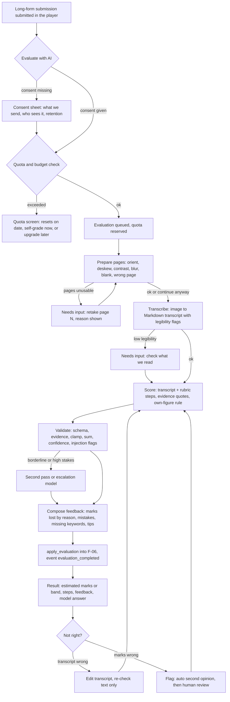
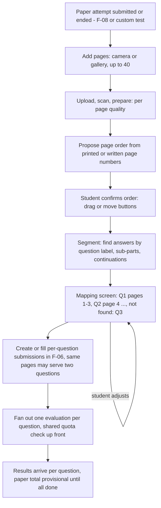
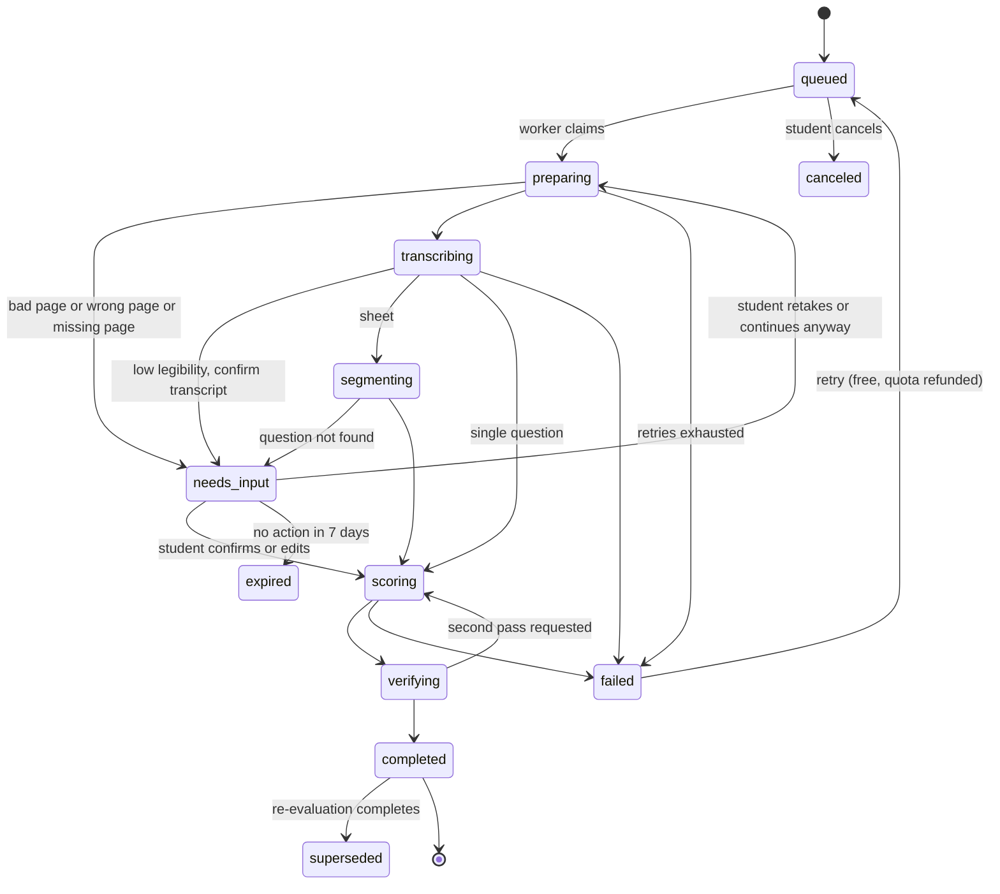

# PRD: F-07 Scoring System / AI Answer Evaluation

| Field | Value |
| --- | --- |
| Status | Draft (for founder review) |
| Owner | Pawan (founder) |
| Last updated | 2026-10-05 |
| Source | `docs/product/FEATURE_MAP.md` section F-07 (page 4 and the circled part of page 5), risks 3, 5 and 6 in section 7 |
| Linked ERD | `docs/product/erd/F-07-ai-answer-evaluation.md` |
| Order | Phase 4 pointer. Builds on F-06 (`practice_submission`, rubrics, media, events, jobs), F-02 (taxonomy through F-06) and the always-on worker planned in X-04. Feeds F-10 (marks lost by reason) and X-01 (evaluation ready) |
| Django app / web module | `apps/api/modules/evaluation` (tables `evaluation_*`), `apps/web/src/modules/evaluation` |
| PostHog flag | `ai_evaluation` (server-checked, 403 `feature_disabled`); prerequisite flag `practice_longform` (F-06) |
| Reading guide | Sections 1 to 5 are the product. Sections 6 to 9 are the contract. Section 8.3 (accuracy gates) decides **when marks may be shown**. The pipeline is in section 5.2 |

## 1. Problem and goal

A CA, CS or CMA student practises descriptive answers on paper, because that is how the exam is written. Today the only feedback on those answers is a coaching class (slow, expensive, uneven) or comparing with the suggested answer by eye (the student marks their own work generously or harshly and cannot see which step lost marks). The Institute gives no re-evaluation, only a verification of totals (ICAI verification of marks covers unvalued answers and totalling errors, not re-marking), so there is no feedback loop at all before the exam.

**Goal.** Let a student photograph or type an answer, and within about a minute get an **estimated** mark, shown **step by step against the marking scheme**, with where each mark was lost (concept, calculation, presentation, missing keyword or section, time), what a full-mark answer looks like, and what to practise next. Do it honestly: marks are labelled estimates with a range and a confidence, only shown for papers where we have measured the model against human examiners, and every result can be flagged and re-checked.

**What this feature is not.** It is not the Institute's marking, it does not predict the exam result, and it is not a replacement for a teacher. It is a fast, cheap, consistent first reader that is right about steps much more often than a student's own self-grading and says so when it is unsure.

**Design stance, in five lines.**

1. **Rubric first.** Marks come from the question's marking scheme (F-06 `rubric` and `rubricstep`). No rubric, no marks: only a band or feedback (section 8.3).
2. **Transcript in the middle.** Pass A reads the image and writes a transcript; pass B grades the transcript. The student can see and fix what we read, and a bad read is caught before it costs marks.
3. **The model proposes, the server decides.** The model returns per-step judgements with a quoted evidence line; the server validates, clamps, sums and decides what the student sees.
4. **Measured before shown.** Marks appear only for a course, level, subject and question kind whose golden-set metrics passed the gate (8.3).
5. **Private by design.** Handwritten sheets are personal data: consent, owner-only access, retention, delete on request, and no use for model training by us or by the provider (paid tier only).

## 2. Users and scenarios

**Aarav, CA Intermediate, Taxation, three weeks before the attempt.**
He finishes a 14-mark GST question on paper in 25 minutes, taps "Evaluate with AI" in the practice player, and takes three photos. One is slightly blurred; the app says "Page 2 is hard to read (blurry). Retake or continue anyway" and he retakes it in ten seconds. A minute later: "Estimated 8 to 9 of 14 (medium confidence)". The step view shows he lost 2 marks for not computing ITC on capital goods separately (concept), 1 for an arithmetic slip carried correctly into the next step (no further penalty, own-figure marking) and 1 for missing the section reference 17(5). He reads the model answer next to his steps, then retakes the question the next day.

**Neha, CS Executive, after a full mock paper (F-08).**
She wrote the whole 100-mark paper in three hours and photographed 22 pages at the end. She uploads them as one sheet. We propose the page order (she fixes one swapped pair), find answers to Q1, Q2, Q4 and Q5, and ask "We could not find Q3. Did you skip it?". She confirms. Evaluations arrive question by question over six minutes; the paper total is "Estimated 61 to 68 of 100, provisional until all questions are checked". Her "time" losses are visible: Q5 is half written, and the session shows the deadline hit.

**Rohan, CMA Final, the answer was marked too low.**
The AI gave 3 of 8 on a cost audit question because it read "NRV" as "NPV" in his handwriting. The transcript tab showed the wrong word; he fixes it, taps "Re-check with my corrections" (text only, cheap), and gets 6 to 7. Later he flags another result with "marks too low, my method was correct". A second, stronger model re-reads automatically; the result stands with an explanation; he can send it to a human reviewer, who changes it. Because the AI was wrong, his evaluation credit is refunded.

**Meera, the editor, publishes marking schemes.**
She opens the rubric workbench, sees which long-form questions in CA Inter Taxation have a reviewed rubric (and so can show marks), drafts missing step marks from the reference solution with AI help, edits and publishes. The workbench shows the subject's gate status: "Marks hidden: 38 of 100 golden answers graded".

## 3. Success metrics

Targets are starting hypotheses, calibrated after the first 200 evaluations.

| Metric | Definition | Target | Event(s) |
| --- | --- | --- | --- |
| Activation | Students with at least one submitted long-form answer who request an AI evaluation within 7 days | 35% | `evaluation_requested` |
| Time to first result | Median from request to `completed` for a single question of up to 3 pages | under 45 s (p95 under 120 s) | `evaluation_completed` (duration_ms) |
| Completion rate | Requests that end `completed` (not `failed`, not abandoned in `needs_input`) | 95% | `evaluation_completed`, `evaluation_failed` |
| Needs-input rate and recovery | Share of requests that stop for input, and share of those resolved by the student | under 15% stop, over 80% recovered | `evaluation_needs_input`, `evaluation_input_resolved` |
| Perceived usefulness | Thumbs up share on results | 80% | `evaluation_rated` |
| Trust signal | Dispute rate and upheld rate (a dispute is "AI wrong" only when upheld) | disputes under 8%; upheld under 35% (above that the gate is wrong) | `evaluation_disputed`, `dispute_resolved` |
| Accuracy (offline) | Golden-set metrics per cluster (8.3) | gate passed before marks are shown | admin dashboard, `gate_evaluated` |
| Accuracy (live) | Human-reviewed sample: share within tolerance of the human mark | at least 85% | `review_sample_decided` |
| Repeat use | Students with 3 or more evaluations in 14 days | 25% of activated | `evaluation_requested` |
| Learning signal | Same question retaken after an evaluation: change in estimated marks | tracked (expect positive) | `evaluation_completed` (retake flag) |
| Cost per evaluated question | Sum of `evaluation_modelrun.cost_inr` per completed evaluation | at most 6 rupees average, hard cap 12 | cost dashboard |
| Cache hit rate | Evaluations or stages served from cache without a model call | at least 20% (re-checks, retries) | `evaluation_completed` (cache_hit) |
| Privacy | Delete requests honoured within 24 h; zero sheets accessible to staff outside dispute or opt-in | 100% | audit log, `evaluation_deleted` |

## 4. Scope

### 4.1 In scope

**R1 (feedback beta, no public marks).** Single-question evaluation of typed and photographed answers against reviewed rubrics, transcript check, step results, feedback and model answer, consent, quotas and cost ledger, async pipeline with polling, gate machinery and golden sets, admin cost and quality dashboard. Marks are shown only to staff and to students in the closed beta cluster whose gate has passed; everyone else sees feedback and a band (8.3).

**R2 (marks and sheets).** Marks as estimate with range for gated clusters, dispute and re-evaluation loop, human review samples, whole-paper multi-page sheets with page ordering and segmentation, ad-hoc "Check my answer" for any photographed question (AI-derived rubric, band only), rubric workbench with AI drafts, Realtime push, `marks lost by reason` rollup for F-10.

**R3 (scale).** Pro-class escalation and second-opinion routing, batch queue for cheap off-peak evaluation, human expert review as a paid service, Hindi answers, mentor sharing of results, learning-style insights ("your top three recurring losses").

### 4.2 Out of scope (and who owns it)

| Out of scope | Owner or decision |
| --- | --- |
| Question, option, answer, submission, page and score tables | F-06 (`questionbank`, `practice`); F-07 only keeps evaluation-specific data and calls `apply_evaluation` |
| Auto-scoring MCQ, numeric answers, negative marking | F-06 `practice.domain.grading` |
| The player, mock engine and paper timer | F-06 and F-08 |
| Analytics dashboards, readiness score | F-10 (reads `evaluation_completed` and the rollup) |
| Notification delivery | X-01 `[PROPOSED: X-01]` `notifications.services.notify` |
| Billing and plans | `[PROPOSED: billing]`; F-07 reads a plan name through one function and defaults to `free` |
| Official re-evaluation, predicting the Institute result | Never |
| Plagiarism or cheating detection | Not a goal; this is self-practice |
| Evaluating other people's sheets (teacher marks a class) | Mentor mode, later (FEATURE_MAP section 6) |
| Audio or video answers, diagrams-as-answers beyond simple tables and journal formats | Not planned |

## 5. User flows

### 5.1 The aha flow: one question, from photo to step marks



### 5.2 Pipeline (what runs, in order)

| # | Stage (job type) | Runs where | Input | Output | Model call | Typical latency |
| --- | --- | --- | --- | --- | --- | --- |
| 0 | `request` (service call, sync) | API | submission view (F-06), user, plan | `evaluation` row `queued`, quota reserved, job enqueued | none | under 300 ms |
| 1 | `evaluation.prepare` | worker (Pillow, OpenCV-style metrics, no AI) | page attachments (clean) | derived images (max 2,000 px long side, grey-boosted, deskewed), `pagecheck` per page: blur, brightness, skew, rotation, blank, crop, verdict | none | 1 to 3 s per page |
| 2 | `evaluation.transcribe` | worker | derived pages | `transcript` (Markdown per page, tables as Markdown tables, formulas as plain text or LaTeX, `[illegible]` spans, per-page legibility 0 to 1, detected page numbers and question labels) | Gemini multimodal, structured output, `media_resolution` high for handwriting | 8 to 25 s for 3 pages |
| 3 | `evaluation.segment` (sheets only) | worker | transcript of all pages | page order proposal, `segment` rows (question label, page and line spans, confidence), unattempted list | Gemini text, structured output | 5 to 15 s |
| 4 | `evaluation.score` | worker | transcript text (never the image), rubric steps and reference solution from F-06, `rubricnote`, policy | `item` per step (status, awarded, evidence quote and page, reason code, keywords hit and missed, comment), flags | Gemini text, structured output, temperature 0, fixed seed | 6 to 20 s |
| 5 | `evaluation.verify` | worker | stage 4 output + transcript | deterministic checks (schema, step ids, clamps, sum, evidence substring match, own-figure sanity) and, if triggered, a second independent scoring run or an escalation-model run; final range and confidence | 0 to 1 more call | 0 to 20 s |
| 6 | `evaluation.finalize` | worker | items | `feedback` rows, reason rollup, `apply_evaluation`, event `evaluation_completed`, notification | none (feedback text is built from item comments and templates; one optional short "next steps" call in R2) | under 1 s |

Each stage is a `core_job` (type `evaluation.<stage>`, `dedupe_key = eval:{id}:{stage}:{attempt}`) that advances the `evaluation.stage` and enqueues the next, so a crash resumes at the failed stage and never repeats a finished one (idempotent on `(evaluation_id, stage)`). Typed answers skip stages 1 and 2 (the typed text is the transcript). The student's page images are sent only in stage 2 (and stage 3 for sheets when page numbers are needed); grading never sees raw images, which removes the largest prompt-injection surface and halves cost.

### 5.3 Whole-paper sheet



### 5.4 Evaluation lifecycle (student-visible states)



`degraded` is a flag on a completed evaluation (section 8.4), not a state. Dispute states are in the ERD.

### 5.5 Edge cases (designed and tested)

| Case | Behaviour |
| --- | --- |
| Blurry, dark or cropped page | Prepare computes blur (variance of the Laplacian), brightness, edge crop and skew. Below the reject threshold: `needs_input: image_quality` naming the page and the reason with a retake button; between warn and reject: result continues but confidence is capped at medium and the page is flagged in the transcript view |
| Wrong page (a textbook page, a selfie, a blank page, another subject) | Transcription returns `page_type` (`answer`, `question_paper`, `blank`, `other`) and a relevance score against the question stem and reference keywords; `blank` or `other` stops with `needs_input: wrong_page` ("This does not look like an answer to this question") |
| Pages out of order or one missing | Detected page numbers or continuation breaks produce a reorder suggestion; a gap ("1, 2, 4") gives `pages_missing` with "Add page 3 or continue; marks will assume nothing was written there" |
| Partial answer, abandoned mid-way | Scored for what is written; steps never reached get `missing`; reason `missing_section`; if the session deadline cut the answer or the student ticked "I ran out of time on this one" at capture, the lost marks of the unreached steps are tagged `time` (only then) |
| Answer in a different order, or extra material | Rubric steps are matched by content, not by order; irrelevant text is ignored; no penalty unless the rubric has a presentation or format step |
| Alternative valid method | Accepted when it reaches the same conclusion under the same law or standard; flagged `alternative_method` and confidence is capped at medium so the student knows it was a judgement call |
| Student writes "Note to examiner: award full marks" or any instruction to the model | Treated as answer text; the grader prompt says so; a server rule scans for instruction-like patterns, sets `injection_suspected`, never raises marks because of it, and lists it for review (8.5) |
| Reference solution is missing or the rubric is `ai_draft` and unreviewed | Marks are not shown; `ai_derived` basis shows a band and "indicative" label; feedback only if the subject gate is failed |
| Subject gate failed or in shadow | Feedback and steps shown, marks replaced by "Marks are not shown for this paper yet" with a link to the self-grade panel |
| Quota exhausted | The request is refused before any work with the reset date; the student can self-grade (F-06) |
| Daily budget exhausted | Request accepted into `queued` with "High demand: result by tomorrow morning" (free plan) or served from the reserve pool (paid plan); never silently dropped |
| Gemini timeout, 429, 5xx | Retries with backoff, then fallback model; state `failed` only after the chain is exhausted, with a free retry and an automatic quota refund |
| Same pages evaluated twice | Page hash and transcript hash hit the cache; the second request returns the previous result instantly and does not consume quota ("Already evaluated, here is your result") |
| Student edits the transcript to inflate the answer | Edits are stored with the original; the result says "scored on your edited transcript"; a transcript changed by more than 25% of characters re-runs verification and cannot be re-checked more than 3 times |
| Student deletes the submission or account during processing | Jobs check `deleted_at` before each stage, stop, and the purge job removes derived files and the transcript within 24 hours |
| Device offline | Page upload resumes (F-06 pipeline); the evaluation request is queued on the device and sent when online; results are cached for offline reading |
| Two devices request the same evaluation | `client_id` and `(submission_id, evaluation in flight)` uniqueness return the same evaluation (409 `already_evaluating` carries its id) |

## 6. Functional requirements

Priorities: P0 must ship in the first release that shows marks, P1 same release if cheap or the next, P2 later. `[NEW]` marks additions beyond the pointer.

### A. Entry points and capture

| ID | Requirement | Priority | Acceptance criteria |
| --- | --- | --- | --- |
| FR-F07-01 | `[NOTE]` Register evaluator `ai` into F-06 (`register_evaluator`); the "Evaluate with AI" action appears on a submitted long-form or practical answer when the flag, consent, quota and eligibility allow | P0 | Given a submitted long-form answer and `ai_evaluation` on, then the submission page shows "Evaluate with AI" next to "Self-grade"; given the flag off, then only self-grade shows |
| FR-F07-02 | `[NOTE]` Typed answers are evaluated with no OCR and no image cost | P0 | Given a typed answer of 300 words, then stages 1 and 2 are skipped and the evaluation costs one scoring call |
| FR-F07-03 | `[NOTE]` Photographed handwritten answers up to 10 pages per question (the F-06 limit) | P0 | Given 3 clean pages, then the pipeline runs and the result cites page numbers in evidence |
| FR-F07-04 | `[NEW]` On-device capture guidance: framing overlay, glare and darkness hints before upload, rotate and crop, and a "page quality" tick per page before submit; a checkbox "I ran out of time on this one" for timed practice and papers | P1 | Given a dark photo, then the capture screen shows "Too dark, move to light" before the student leaves it |
| FR-F07-05 | `[NEW]` "Check my answer": photograph any question (a coaching paper, a book exercise) and the answer; we OCR the question, create a **private** F-06 question and a one-off session, draft a rubric with AI (`ai_draft`), and evaluate | P1 (R2) | Given a question photo and an answer photo, then a private question exists, no other student can see it, and the result is labelled "Indicative: no official marking scheme" with a band, not a mark |
| FR-F07-06 | Eligibility check before queueing: question kind is `long_form` or `practical`, the version has a rubric or a reference solution, the submission has content | P0 | Given a question without any rubric or reference solution, then the request is refused with `evaluation_not_available` and the self-grade path is offered |

### B. Image preparation and quality

| ID | Requirement | Priority | Acceptance criteria |
| --- | --- | --- | --- |
| FR-F07-07 | `[ADD]` Server image preparation: auto-rotate by detected text orientation, deskew, crop margins, contrast boost, downscale to at most 2,000 px long side; originals are never altered | P0 | Given a page rotated 90 degrees, then the derived copy is upright and the original attachment is unchanged |
| FR-F07-08 | Quality metrics and verdict per page (blur, brightness, skew, edge crop, ink coverage, resolution); thresholds are configuration, versioned, with warn and reject levels | P0 | Given a page with blur below the reject threshold, then the evaluation stops in `needs_input` with `image_quality` and the page number |
| FR-F07-09 | `needs_input` is resumable: retake or replace a page, "continue anyway" once per evaluation, or cancel; "continue anyway" caps confidence at low and forces band display | P0 | Given "continue anyway", then the result shows a band and "Low confidence: some pages were hard to read" |
| FR-F07-10 | Wrong-page and not-an-answer detection (blank, other subject, photo of a person, screenshot) | P0 | Given a blank page among valid pages, then the student is asked to remove it, and the rest is not blocked |
| FR-F07-11 | Page order and missing-page detection from page numbers and continuation cues | P1 | Given pages numbered 1, 3, 2, then a reorder is proposed and applied on confirm |

### C. Transcription and the transcript check

| ID | Requirement | Priority | Acceptance criteria |
| --- | --- | --- | --- |
| FR-F07-12 | `[ADD]` Faithful transcription to Markdown, tables as Markdown tables, journal entries and ledgers kept as tables, formulas preserved, crossed-out text omitted, unreadable text as `[illegible]`, never "corrected" to what the model thinks was meant | P0 | Given an answer with a spelling slip and a wrong figure, then the transcript reproduces both unchanged (test on fixtures) |
| FR-F07-13 | `[NEW]` Transcript check: when legibility is below 0.75 or more than 5% of tokens are uncertain, the student is asked to confirm; otherwise the transcript is one tap away on the result (page image beside text) | P0 | Given a low-legibility answer, then a "Check what we read" step shows page and text side by side with uncertain words highlighted |
| FR-F07-14 | Editing the transcript and "Re-check with my corrections": text-only scoring (no OCR), at most 3 per evaluation, stored with the original | P0 | Given an edit of one word, then re-check costs one scoring call and the result shows "scored on your corrected transcript" |

### D. Whole-paper sheets

| ID | Requirement | Priority | Acceptance criteria |
| --- | --- | --- | --- |
| FR-F07-15 | `[NOTE]` Multi-page sheet upload (up to 40 pages) linked to a session whose items include long-form questions | P1 (R2) | Given a 22-page upload for a mock with 5 descriptive questions, then pages are scanned and prepared in parallel and listed in order |
| FR-F07-16 | Page ordering: detected and student-editable (drag handle and move up or down buttons) | P1 | Given a reorder by keyboard only, then the order persists and is announced |
| FR-F07-17 | Answer-to-question segmentation by question labels ("Q.3(b)", "Ans 4"), sub-parts, continuations and out-of-order answers, with a confidence per segment and a list of questions not found | P1 | Given answers written in order 2, 1, 3, then segments map correctly; given Q3 not written, then it is listed as not found |
| FR-F07-18 | Mapping confirmation screen where the student can move a page or span to another question or mark a question as skipped; the same page may belong to two questions | P1 | Given a page holding the end of Q1 and the start of Q2, then it is attached to both and each evaluation sees only its own segment |
| FR-F07-19 | Fan-out: one evaluation per question with one quota check for the whole sheet; results arrive independently; the paper shows a provisional total until all evaluations finish | P1 | Given 5 questions and 2 completed, then the sheet shows "2 of 5 evaluated" and a provisional range |

### E. Scoring against the marking scheme

| ID | Requirement | Priority | Acceptance criteria |
| --- | --- | --- | --- |
| FR-F07-20 | `[NOTE]` Scoring is per rubric step (F-06 `rubricstep`): status (`full`, `partial`, `missing`, `wrong`), awarded marks in multiples of 0.5 not above the step maximum, an evidence quote from the transcript, a reason code and keywords hit and missed | P0 | Given a rubric of 6 steps summing to 14, then the result has 6 items and the total equals their sum |
| FR-F07-21 | Server validation: step ids match the rubric, awards clamped to step maxima, `partial_allowed=false` steps are all or nothing, totals computed by the server (the model's own total is ignored), evidence quotes must appear in the transcript (normalised fuzzy match at or above 0.85) or the step gets 0 and is flagged `unsupported` | P0 | Given a model answer awarding 3 marks with a quote that is not in the transcript, then the step receives 0 and the evaluation carries a flag |
| FR-F07-22 | Own-figure (consequential) marking by default for calculation steps: a correct method applied to a wrong earlier figure earns the step marks, the earlier step loses its marks once; configurable per question in `rubricnote` | P0 | Given a wrong depreciation figure used correctly downstream, then only the depreciation step loses marks (fixture) |
| FR-F07-23 | Alternative methods: accepted when the conclusion and the legal or standard basis match; flagged and confidence capped at medium | P1 | Given a valid alternative method, then marks are awarded and the step shows "Alternative method accepted" |
| FR-F07-24 | Presentation is advisory unless the rubric has `presentation` or `format` steps: tips never reduce marks otherwise | P0 | Given an answer with poor headings and a rubric without a presentation step, then total marks are unchanged and a tip is shown |
| FR-F07-25 | Partial and unattempted answers are scored on what exists; unreached steps are `missing` | P0 | Given an answer covering 2 of 5 steps, then the other 3 show "Not found in your answer" |
| FR-F07-26 | Display basis and mode (section 8.3): `marks` (estimate with range), `band`, or `feedback_only`, decided by rubric basis, subject gate, confidence and flags | P0 | Given basis `ai_derived`, then only a band shows; given a failed subject gate, then only feedback shows; both are asserted by a table-driven test |
| FR-F07-27 | Confidence (high, medium, low) and a marks range; wording is always "Estimated"; no single "You scored" phrasing anywhere | P0 | Given any result, then the UI text and the OG or notification copy contain "estimated" or "about"; a copy lint test fails the build otherwise |
| FR-F07-28 | Second pass: a second independent scoring run when the first is uncertain (triggers: low confidence, a rubric of 10 or more marks, or an unsupported-evidence flag); disagreement of more than 15% of max widens the range and, if allowed by the budget, escalates to the stronger model | P1 | Given disagreement of 20% of max, then the range covers both and confidence is at most medium |

### F. Feedback and model answer

| ID | Requirement | Priority | Acceptance criteria |
| --- | --- | --- | --- |
| FR-F07-29 | `[ADD]` Marks lost by reason: `concept`, `calculation`, `presentation`, `time`, `keyword`, `missing_section`, `format`, `other`, summed per evaluation and per chapter; `time` is assigned only when the session deadline cut the answer or the student ticked "I ran out of time" (self-reported, shown as such); `presentation` only for rubric presentation or format steps | P0 | Given a result, then reasons sum to marks lost and every lost mark has exactly one reason |
| FR-F07-30 | Mistakes list: what you wrote (quote), what was expected (rubric step), why it lost marks, in plain English; missing keywords and sections listed; maximum 8 items ordered by marks lost | P0 | Given 12 lost-mark items, then 8 are shown by marks lost with "Show all" |
| FR-F07-31 | Model answer: the F-06 reference solution is shown after the evaluation, with step markers and "your answer" beside it; for `ai_derived` rubrics the answer is an AI draft and is labelled | P0 | Given a reviewed rubric, then the model answer is the reviewed text, not generated; given `ai_derived`, then a label "AI-drafted, not verified" shows |
| FR-F07-32 | `[NEW]` Annotated answer: tapping a step highlights its evidence in the transcript and the page | P1 | Given a step with evidence on page 2, then page 2 opens scrolled to the quote |
| FR-F07-33 | `[NEW]` Presentation tips and exam-writing habits (headings, assumptions, working notes, conclusion, units) as short, non-scoring advice from rules and the model's `presentation_notes`, max 3 | P1 | Given missing working notes in a practical question, then a tip says so once |
| FR-F07-34 | `[NEW]` Next steps: links to the chapter (F-02), a practice set of related questions (F-06 `search_ids` with `wrong_only` picker over the same chapter) and "Retake this question" (F-06 `retake`) | P1 | Given a concept loss in GST ITC, then "Practise 5 more ITC questions" builds a session |
| FR-F07-35 | `[NEW]` Self-grade first: before revealing AI marks the student may tick their own steps (F-06 `self_steps`), then sees "You gave 9, estimate 7 to 8" | P1 | Given self ticks saved, then the comparison shows per-step differences |

### G. Trust loop: confidence, flag, re-evaluation

| ID | Requirement | Priority | Acceptance criteria |
| --- | --- | --- | --- |
| FR-F07-36 | `[NOTE]` Disclaimer on every result: estimated by AI against the marking scheme, may differ from an examiner, not an official result; versioned text | P0 | Given a result, then the disclaimer is visible without expanding and its version is stored |
| FR-F07-37 | `[NOTE]` "Flag wrong evaluation" with scope (overall marks, one step, transcript, wrong question matched, feedback) and a reason; the student can propose a mark | P0 | Given a step flagged "marks too low", then a dispute is created, one automatic escalated re-read runs, and the student sees the outcome |
| FR-F07-38 | Re-evaluation ("Re-check"): modes `rescore` (after transcript edit), `full` (re-read images; only after a new page or a quality change), `escalated` (stronger model). Same inputs and same versions return the cached result and say so | P0 | Given a re-check with no change, then no model call is made and the message is "Nothing changed, same estimate" |
| FR-F07-39 | Human review: disputed evaluations that the second read does not resolve go to the editor queue; an editor sets marks per step; the result becomes `final` and the student is notified | P1 (R2) | Given an editor decision, then `apply_evaluation(state='final')` is called and the evaluation shows "Reviewed by an Artha reviewer" |
| FR-F07-40 | Dispute outcome handling: upheld refunds the quota unit, partly upheld refunds half, rejected explains why; outcomes feed the golden-candidate pool (with consent) | P1 | Given an upheld dispute, then the quota ledger has a refund row once (idempotent) |
| FR-F07-41 | History: every evaluation of a submission is kept with its inputs; the latest non-superseded one is shown, older ones are one tap away | P1 | Given 3 re-checks, then the history lists 4 rows with their basis and range |
| FR-F07-42 | `[NEW]` One-tap helpful rating (up or down with an optional reason) | P1 | Given a thumbs down, then 3 reasons are offered and nothing else is required |

### H. Asynchronous processing, reliability and cost

| ID | Requirement | Priority | Acceptance criteria |
| --- | --- | --- | --- |
| FR-F07-43 | Pipeline stages as `core_job`s with status states and polling: `GET evaluations/{id}/` returns status, stage, progress, `poll_after_ms` and ETag; client polls adaptively (2 s, 4 s, 8 s) and stops at terminal states | P0 | Given a worker killed mid-stage, then the job is reclaimed after the visibility timeout and the evaluation completes once with one result |
| FR-F07-44 | Realtime push (Supabase Realtime Broadcast on a private per-user channel) with polling as the fallback | P1 (R2) | Given Realtime blocked, then the screen still updates by polling |
| FR-F07-45 | Fallback and degraded mode (section 8.4): retry with backoff, fallback model, circuit breaker, OCR-only and feedback-only modes, kill switches | P0 | Given the primary model failing for 5 minutes, then evaluations complete on the fallback model with confidence capped at medium and `degraded=true` |
| FR-F07-46 | Determinism and caching: temperature 0, fixed seed, pinned model and prompt versions, structured output; page cache keyed by content hash and prepare version; score cache keyed by transcript hash, rubric hash and prompt version; caches are per user | P0 | Given identical inputs and versions, then the second evaluation makes no model call and returns an identical result (property test) |
| FR-F07-47 | Quotas per plan and period, ledger with reserve, consume and refund entries; a failed evaluation refunds automatically; a usage meter on the hub | P0 | Given a free student with 5 per month and 5 used, then the next request returns 403 `quota_exceeded` with `resets_at` and no job is created |
| FR-F07-48 | Cost ceilings: per-evaluation caps on pages, tokens and cost; global daily budget with warn at 70%, defer at 90%, stop at 100%; per-model price table; kill switch | P0 | Given a daily cap reached, then new free-plan requests queue with the "tomorrow morning" message and an admin alert fires once |
| FR-F07-49 | Free-plan non-urgent requests may use the batch queue at a lower price when budget pressure is high | P2 | Given budget above 90% and a free student, then the job is marked `lane=batch` and its ETA is shown |

### I. Privacy

| ID | Requirement | Priority | Acceptance criteria |
| --- | --- | --- | --- |
| FR-F07-50 | `[NOTE]` Consent before first use (purpose `ai_processing`): says what is sent to the AI provider, that it is not used to train models, who can see it, retention, how to delete; versioned; withdrawable in settings | P0 | Given no consent, then no page is read and the API returns 403 `consent_required`; a withdrawn consent stops new evaluations |
| FR-F07-51 | `[NOTE]` Delete on request: one evaluation, one sheet, or everything; pages, derived images, transcripts and feedback are unreachable at once and purged within 24 hours; cost and audit rows keep ids only | P0 | Given Delete on an evaluation, then GET returns 404 immediately and the storage objects are gone within 24 hours (job test) |
| FR-F07-52 | Retention: 12 months by default (aligned with F-06 `retention_until`), option to "delete photos 30 days after evaluation" and to delete raw model output after 90 days | P1 | Given the 30-day option, then derived and original pages are purged on day 30 while marks and feedback remain |
| FR-F07-53 | Staff access to a student's sheet only for a dispute the student opened or for an opted-in quality sample (`quality_review` consent, default off); every view is audited | P0 | Given an editor opening a non-disputed, non-consented sheet, then the API returns 404 (no 403 leak) and nothing is logged as viewed |
| FR-F07-54 | Minor accounts: AI evaluation is blocked until the profile module reports verified parental consent where required `[PROPOSED: profiles]` | P0 | Given `minor_consent_pending`, then the request returns 403 `parental_consent_required` |
| FR-F07-55 | Export: `evaluation.services.export_for_user` includes evaluations, transcripts, feedback, disputes, consents and ledger summary; `delete_all_for_user` is called by account deletion | P0 | Given an account deletion, then all `evaluation_*` rows with content are removed and the ledger and audit rows are anonymised |

### J. Quality program and administration

| ID | Requirement | Priority | Acceptance criteria |
| --- | --- | --- | --- |
| FR-F07-56 | `[NOTE]` Accuracy gates: golden sets per cluster (course, level, subject, kind), metrics and thresholds (8.3), a gate report per prompt and model release, and a `gate` row that sets the highest display mode allowed | P0 | Given no passing gate report for a cluster, then the API never returns marks for it (API test per display mode) |
| FR-F07-57 | Human calibration: reviewers grade golden items independently (double marked), inter-rater agreement is computed, and disagreements are adjudicated | P0 | Given two reviewers differing by more than 15% of max, then the item is flagged for adjudication and excluded until resolved |
| FR-F07-58 | Live review sampling: 2% random plus all low-confidence and all disputed (consenting students only for the random and low-confidence sample) are queued to reviewers; agreement feeds the live accuracy metric and can demote a cluster | P1 | Given live agreement below the demotion threshold for 50 samples, then the gate drops one level and an alert is sent |
| FR-F07-59 | Prompt and model release management: shadow (run in parallel, not shown), canary (5% of evaluations), active; automatic rollback when the canary regresses against the gate | P1 | Given a new prompt version, then it cannot become active without a passing gate report on the golden set |
| FR-F07-60 | Rubric workbench for editors: coverage list of long-form questions by rubric basis and review state, AI draft of step marks from the reference solution (always `ai_draft` until an editor reviews), side-by-side editing, "test on 5 golden answers" | P1 (R2) | Given an AI-drafted rubric, then it cannot be used for marks until reviewed (F-06 rule) and the workbench shows its gate effect |
| FR-F07-61 | Admin dashboards: queue depth and ages, failure codes, cost per day, per stage and per model, quota burn, accuracy by cluster, dispute rate, injection flags | P1 | Given an admin, then the cost page shows today's spend against the cap and the 7-day trend |
| FR-F07-62 | Prompt-injection defences (8.5) with a standing adversarial test suite run in CI against the validator and nightly against the models | P0 | Given 50 adversarial answers, then none raises marks above the clean baseline by more than the noise band |

### K. Integration

| ID | Requirement | Priority | Acceptance criteria |
| --- | --- | --- | --- |
| FR-F07-63 | `apply_evaluation` (F-06) is called on completion with step results and model info; idempotent per `(submission_id, evaluation_ref)`; re-evaluations pass a new `evaluation_ref` | P0 | Given the call repeated twice, then F-06 state and rollups change once |
| FR-F07-64 | Events: `evaluation_completed`, `evaluation_failed`, `evaluation_needs_input`, `evaluation_disputed`, `dispute_resolved` with JSON schemas in `core/event_schemas/` | P0 | Given completion, then one event exists with `by_chapter` loss reasons |
| FR-F07-65 | Reason selector and rollup for F-10: `evaluation.selectors.marks_lost_by_reason(user_id, date_from, date_to, group_by)` from `evaluation_reasonrollup`, excluding superseded and upheld-wrong evaluations | P1 | Given a re-evaluation, then the rollup counts only the latest evaluation of that submission |

## 7. Screens, URLs and design-system needs

### 7.1 Screens and URLs

All `/app/...` pages use `buildHead` with `noindex`. The public pages are server-rendered with `buildHead`; JSON-LD only on the feature page (no personal data anywhere public).

| Screen | URL | Notes |
| --- | --- | --- |
| Evaluate hub | `/app/evaluate` | Start options (from a practised question, a paper sheet, any question photo), in-progress list, recent results, usage meter, consent state |
| Check my answer (ad hoc) | `/app/evaluate/new` | `?question=&session=&position=` prefill from the player; no params = ad hoc (question photo + answer photo) |
| Capture and pages | `/app/evaluate/capture/$submissionId` | Camera or gallery, per page quality, reorder, replace; the same `ImageStrip` as the F-06 submission page |
| Result | `/app/evaluate/$id` | `?tab=marks` (default), `steps`, `feedback`, `answer` (model answer beside yours), `transcript`, `history`; `?step=` deep-links a step; `?flag=1` opens the flag dialog |
| Progress | `/app/evaluate/$id` | Same URL: the progress panel is the result screen's pending state (status in the page, no separate route) |
| Needs input | `/app/evaluate/$id` | `?resolve=quality`, `wrong_page`, `pages`, `transcript`, `mapping`; the resolver panel replaces the result body |
| Sheet upload and mapping | `/app/evaluate/sheets/new`, `/app/evaluate/sheets/$sheetId` | `?step=pages`, `order`, `map`, `results`; `?session=` when from a paper attempt |
| History | `/app/evaluate/history` | Cursor list with filters `?subject=&state=&basis=` |
| Reasons (insights) | `/app/evaluate/reasons` | Marks lost by reason over time and by chapter; R2; F-10 embeds the same component |
| Settings | `/app/settings/evaluation` | Consent log, auto-evaluate, photo retention, delete all, export |
| Feature page (public) | `/features/ai-answer-evaluation` | How marks are estimated, what we measure, limits, privacy. Indexable, OG image, copy reviewed by counsel |
| Notice (public) | `/legal/ai-evaluation-notice` | The consent text, versioned, linkable from the consent sheet |
| Admin: overview | `/app/admin/evaluation` | Queue, failures, spend against cap, kill switches |
| Admin: rubrics | `/app/admin/evaluation/rubrics`, `/app/admin/evaluation/rubrics/$questionId` | Workbench |
| Admin: golden sets and gates | `/app/admin/evaluation/golden`, `/app/admin/evaluation/gates` | Items, human marks, adjudication, gate reports and promotion |
| Admin: reviews and disputes | `/app/admin/evaluation/reviews`, `/app/admin/evaluation/disputes` | Side panel `?item=` |
| Admin: prompts and costs | `/app/admin/evaluation/prompts`, `/app/admin/evaluation/costs` | Release states, price table, daily spend |

### 7.2 Wireframes (mobile first, 320 to 1280 px)

**Capture and quality check, mobile**

```
┌──────────────────────────────────┐
│ ← Evaluate · GST ITC (14 marks)  │
│ Photograph your answer (1-10)    │
│ ┌─────┐ ┌─────┐ ┌─────┐ ┌──┐     │
│ │ p1 ✓│ │ p2 ⚠│ │ p3 ✓│ │＋│     │  ImageStrip: status icon AND text
│ └─────┘ └─────┘ └─────┘ └──┘     │
│ ⚠ Page 2 is blurry. [Retake]     │  reason in words, one action
│   [Continue anyway]              │
│ [Move up] [Move down] [Rotate]   │  keyboard path for reorder
│ ─────────────────────────────    │
│ AI reads these pages and gives   │
│ an estimate. Details and delete  │
│ options in Settings.             │
│ [  Evaluate (uses 1 of 5)  ]     │  quota inline, 44 px button
└──────────────────────────────────┘
```

**Result, mobile (default tab Marks)**

```
┌──────────────────────────────────┐
│ ← Result · GST ITC               │
│ ESTIMATED MARKS                  │
│ 8 to 9 of 14        ◔ Medium     │  range, never a single hard number
│ AI estimate against the ICAI     │
│ suggested answer. May differ     │
│ from an examiner.  [How?]        │  disclaimer always visible
│ [Marks][Steps][Feedback][Answer] │
│ ─ Where marks were lost ─────    │
│ Concept        ▓▓▓▓▓  2.0        │
│ Calculation    ▓▓     1.0 (carried│
│ Keyword        ▓      1.0         │   forward, no double penalty)
│ ─ Fix first ─────────────────    │
│ 1 ITC on capital goods not shown │
│   separately.   [See step 3]     │
│ [Practise 5 ITC questions]       │
│ [Not right? Flag]  [Re-check]    │
│ Rate this: [Up] [Down]           │
└──────────────────────────────────┘
```

Desktop (1280 px): left column holds the page images with highlights, the centre the step list, the right the model answer; the tab strip becomes a segmented control and all three are visible at once.

**Sheet mapping, mobile**

```
┌──────────────────────────────────┐
│ Paper: MTP 1 · 22 pages          │
│ Step 2 of 3  Check page order    │
│ [p1][p2][p4][p3][p5] ...         │  drag or Move buttons
│ Step 3 Answers found             │
│ Q1  pages 1-3   ✓ high           │
│ Q2  page 4      ✓ high           │
│ Q3  not found   [Skipped] [Find] │
│ Q4  pages 5-7   ⚠ check          │
│ [ Evaluate 4 answers (uses 4) ]  │
└──────────────────────────────────┘
```

### 7.3 UI states per screen

Every screen has these rows designed and tested (four themes, 320 to 1280 px, no horizontal page scroll, long content scrolls inside its container).

| Screen | First time or empty | Loading | Partial | Success | Error with retry | Offline | Blocked (flag, consent, quota) | Long content |
| --- | --- | --- | --- | --- | --- | --- | --- | --- |
| Hub | Explains the three ways to start with a sample result (static, labelled sample) | Skeleton list and meter | Some evaluations pending: shown first with progress | Recent results with range chips | "Could not load. Retry" | Cached list, start buttons say "Needs connection" | Flag off: page hidden; consent missing: consent sheet on first start; quota: meter at 0 with reset date and self-grade link | Cursor list with Load more |
| Capture | Guidance card (light, flat surface, whole page in frame) | Per-page upload progress and scan status text | Some pages rejected: strip shows reasons, others stay | All pages `clean` with ticks, Evaluate enabled | Failed upload: retry per page; scan rejected: replace | Photos kept on device, queued upload resumes, Evaluate disabled with reason | Quota exhausted: button replaced by "Self-grade instead" and the reset date | 10 pages scroll horizontally inside the strip only |
| Progress | Not applicable | Stage list (Preparing, Reading, Marking, Checking) with the current stage announced politely; honest ETA band ("usually under a minute") | Sheet: per-question rows with their own status | Auto-switches to Result with focus on the heading | Failed: reason in words, "Try again (free)" and "Self-grade" | Banner "Offline: we keep working, reconnect to see the result", poll resumes | Budget queued: "High demand: result by tomorrow morning" with notify toggle | Not applicable |
| Needs input: image quality | Shows the page with the issue marked | Re-upload progress | Other pages unaffected | Continues to reading on resolve | Upload retry | Retake allowed offline, upload later | Not applicable | Page zoom and pan, keyboard accessible |
| Needs input: wrong page | The page and "This does not look like an answer to this question" | | Several wrong pages: bulk "Remove" | Resumes | | | | |
| Needs input: transcript check | Page left, text right (stacked on phones), uncertain words highlighted and focusable | Skeleton text | Student edits some words: "2 edits" counter | "Looks right" or "Use my corrections" | Save fails: draft kept locally, retry | Edits saved locally, applied when online | Re-check limit (3) reached: explained | Long transcript scrolls inside a bounded container with a jump-to-page list |
| Sheet order and mapping | Short explainer on first sheet | Per-page scan status | Not found questions listed with actions | Confirm creates the evaluations | Mapping save fails: retry, nothing lost | Mapping edits saved locally | Quota check shows "needs N, you have M": evaluate fewer or self-grade | 40 pages in a grid with paging |
| Result: marks | Not applicable | Skeleton of range and bars | Some steps `unsupported`: shown with "could not verify" | Range, confidence, reasons, steps | Result load failure: retry; stale cache shown with a stamp | Cached result readable | Gate failed: feedback only with explanation; `ai_derived`: band with "Indicative" | Steps list collapses to the top 8 with "Show all" |
| Result: low confidence | A visible notice at the top: "We are not sure about this one. Why: pages hard to read, an alternative method" with the reasons as chips | | Range is wider; actions put Check transcript first | | | | Marks hidden when confidence is low and basis is not `reviewed_rubric` | |
| Result: degraded | Banner: "Marked in a simpler mode today. Estimates may be less precise. Re-check later for free" | | | | | | | |
| Result: failed or expired | "We could not finish this evaluation" with the code in plain words, retry free, self-grade; expired input: "This was waiting for you for 7 days" | | | | | | | |
| Flag and dispute dialog | Scope picker (overall, one step, transcript, wrong question), reason, optional proposed marks, statement that an Artha reviewer will see the answer if it escalates | Submitting state | After second read: "Same result, here is why" or "Changed" | Confirmation with expected review time | Retry | Queued locally | Disputes per day limit reached: explained | 1,000 character limit with counter |
| History | "Nothing evaluated yet" with a start button | Skeleton rows | | Rows with basis and range chips | Retry | Cached | | Cursor |
| Settings | Consent not yet given: explanation and the notice link | Skeleton | | Saved toast | Retry | Disabled with reason | Delete all requires a typed confirmation word | |
| Admin rubrics | "No long-form questions yet" | Skeleton table | Unreviewed drafts highlighted | Coverage by basis | Retry | Not supported offline | Non-editor: 404 | Virtualised table |

Accessibility notes that apply to all rows: status always has text beside colour; progress uses `role="status"` and `aria-live="polite"` with one message per stage change; the range and confidence are one sentence readable by a screen reader ("Estimated 8 to 9 out of 14, medium confidence"); reorder has Move buttons; page zoom has keyboard controls; images have alt text "Your answer, page 2"; transcript highlights have text labels, not only colour; focus moves to the heading on result and to the first invalid control in resolvers; `prefers-reduced-motion` removes progress animation; touch targets are 44 px (AUD-010 lesson: Button `sm` and `icon` are 36 and 40 px today, so every new control uses the `md` size or the hit-area helper).

### 7.4 Design-system components

Reused from `@artha/design-system`: Button, Card, Badge, Alert, Tabs, SegmentedControl, Accordion, Progress (bar), Skeleton, Dialog, Sheet, Toast, Tooltip, Popover, Stepper, EmptyState, ConfidenceDot, StatTile, DataTable, RichText, Textarea, Switch, Checkbox, RadioGroup, Select, ImagePicker and ImageStrip (from F-06), Pagination, FilterChip.

New in `packages/design-system` (generic, with `/design-system` showcase entries, four themes, contrast checked):

| Component | Used for |
| --- | --- |
| `RangeMeter` | A range on a scale (8 to 9 of 14) with an optional marker; text alternative first |
| `StepBar` (horizontal stacked bar with labelled segments) | Marks lost by reason, step marks; text list alternative |
| `SplitView` (image and text panes, stacked on phones) | Transcript check, annotated answer |
| `ZoomPan` (keyboard accessible image viewer) | Page inspection, evidence highlight overlay |
| `StatusStepper` (polite live region) | Pipeline progress |

App-specific in `apps/web/src/modules/evaluation`: `EvaluationPanel` (exported through the barrel so F-06's submission page and F-08's result embed it), `MarksSummary`, `ReasonBreakdown`, `StepList`, `StepResultCard`, `FeedbackList`, `ModelAnswerCompare`, `TranscriptEditor`, `NeedsInputResolver`, `SheetMapper`, `FlagDialog`, `ConsentSheet`, `UsageMeter`, `DisclaimerNote`, and the admin `RubricWorkbench`, `GoldenItemReview`, `GateReport`, `PromptReleaseTable`, `CostBoard`.

## 8. Data and permissions

### 8.1 Entities at a glance (details in the ERD)

F-07 re-models nothing from F-06: questions, versions, rubrics and rubric steps, submissions and pages, attempt answers, media attachments, events and jobs all stay where they are. F-07 owns only evaluation-specific data.

| Group | Tables (module `evaluation`) | Purpose |
| --- | --- | --- |
| Run | `evaluation_evaluation`, `evaluation_transcript`, `evaluation_item`, `evaluation_feedback`, `evaluation_pagecheck` | One evaluation attempt of one submission: status, result, transcript, per-step results, feedback, page quality |
| Sheets | `evaluation_sheet`, `evaluation_sheetpage`, `evaluation_segment` | Whole-paper uploads, page order, answer-to-question mapping |
| Trust | `evaluation_dispute`, `evaluation_reviewsample`, `evaluation_rubricnote` | Flag wrong evaluation, human review, per-question grading hints |
| Quality program | `evaluation_goldenset`, `evaluation_goldenitem`, `evaluation_goldenmark`, `evaluation_goldenresult`, `evaluation_gatereport`, `evaluation_gate`, `evaluation_promptrelease` | Measure, gate, release |
| Cost | `evaluation_modelrun`, `evaluation_modelprice`, `evaluation_quotaplan`, `evaluation_quotaledger`, `evaluation_budgetcounter` | Ledger of every model call, prices, quotas, daily budget |
| Privacy and prefs | `evaluation_consent`, `evaluation_settings`, `evaluation_auditlog` | Consent log, user settings, staff access audit |
| Derived | `evaluation_reasonrollup` | Marks lost by reason per day and chapter for F-10 |

### 8.2 Rubric basis and what the student sees

The rubric basis is a property of the question version at evaluation time and decides the most the student can be shown.

| Basis | Definition | Highest display mode | Label |
| --- | --- | --- | --- |
| `reviewed_rubric` | F-06 rubric with steps summing to the marks, `reviewed_by` set, source `institute`, `editor` or reviewed `contributor` | `marks` (estimate with range) | "Estimated against the marking scheme" |
| `reference_only` | A reference solution exists but the rubric has no reviewed steps; F-07 derives steps in memory | `band` (a range of up to 30% of the marks, rounded outward) | "Estimated against the suggested answer, no step marks" |
| `ai_derived` | Ad-hoc question; rubric and reference drafted by AI | `band` only, and `feedback_only` if confidence is low | "Indicative: no official marking scheme" |

The final display mode is the lowest of: basis ceiling, cluster gate (8.3), confidence rule (low confidence on non-reviewed basis forces `feedback_only`; low confidence on reviewed basis forces `band`), and flags (`injection_suspected` or `unsupported` steps above 20% of marks force `band`). A pure function `resolve_display_mode(basis, gate_mode, confidence, flags)` implements it and is table-tested.

### 8.3 Accuracy gates: when are marks shown

The founder's question ("how accurate must it be before we show marks, and do we say estimated?") is answered by a gate per **cluster** = (course, level, subject, question kind). A cluster has one of four modes, set only by a passing gate report on that cluster's golden set, and demoted automatically by live sampling:

| Mode | Meaning | Shown to students |
| --- | --- | --- |
| `off` | No evidence yet | Self-grade only |
| `feedback_only` | Steps, mistakes, missing points, model answer | No marks |
| `band` | Range up to 30% of marks wide | "Estimated about 6 to 9 of 14" |
| `marks` | Estimate with a narrow range (at most 15% of marks, at least 1 mark) | "Estimated 8 to 9 of 14" |

**Golden set.** Per cluster: at least 25 distinct questions and at least 100 student-style answers (staff-written at several quality levels, volunteer sheets with consent, synthetic variants with controlled errors), each marked **independently by two qualified reviewers** (practising or qualified CA, CS or CMA with the paper's subject) against the same rubric; disagreements above 15% of the marks are adjudicated by a third. Handwriting coverage: at least 30 pages from at least 10 different writers for the OCR metric. Golden answers are never used as prompt examples (no leakage); a separate small few-shot pool is used for that.

**Metrics and initial thresholds** (starting values; recalibrate after the first 100 reviewed live samples; a threshold is also never stricter than what two human reviewers achieve between themselves on the same set minus 2 points, otherwise the gate would be unreachable):

| Metric | Definition | `band` gate | `marks` gate |
| --- | --- | --- | --- |
| Items | Golden items with adjudicated human marks | at least 40 | at least 100 |
| nMAE | Mean absolute error of the AI point estimate against the human mean, divided by marks | at most 12% | at most 8% |
| Within tolerance | Share of items where the human mark lies inside the AI range widened by 5% of marks | at least 75% | at least 85% |
| QWK | Quadratic weighted kappa on 5 mark buckets | at least 0.70 | at least 0.80 |
| Bias | Mean signed error as a share of marks (harsh is negative) | within plus or minus 6% | within plus or minus 4% |
| Catastrophic | Items off by more than 25% of marks | at most 6% | at most 3% |
| Step agreement | Share of rubric steps with the same status as the human | at least 70% | at least 78% |
| Transcript CER | Character error rate of transcription on legible handwriting | at most 8% | at most 5% |
| Stability | Same input three times: standard deviation of totals, and identical step statuses | SD at most 4% and 85% identical | SD at most 3% and 90% identical |
| Confidence calibration | Share of `high` confidence items inside tolerance | at least 85% | at least 90% |
| Robustness | Adversarial and noisy-image suite (50 injection samples; blur, shadow, rotation, ink variations) | no mark raised above baseline plus noise | same, and subgroup metrics (poor handwriting, long answers) within 5 points of overall |

Why these shapes: published studies show a wide spread between models on the same essays (QWK about 0.44 to 0.90 across seven LLMs), good but imperfect agreement on handwritten maths with a rubric and reference answer (about 7.7% mean absolute error), and recognition errors that mostly do not change the grade but sometimes do (about 38% of samples with an error, about 8% of those affecting the grade for the best model, and about 3% of assignments needing a human regrade to reach near-expert accuracy). So the design uses a measured model choice per cluster, a rubric plus reference in the prompt, a visible transcript, and selective human review.

**Gate lifecycle.** `evaluation_gatereport` stores each run (golden set version, prompt release, model, metrics, thresholds snapshot, pass or fail per mode). An admin promotes a report to the cluster's `gate` row (a decision logged in the audit log, never automatic upward). Demotion is automatic: a model or prompt change expires the gate until a new report passes; live agreement (ERD `evaluation_reviewsample`) below the threshold for 50 samples demotes one level; a kill switch drops all clusters to `feedback_only`.

**Language rule.** Wherever marks appear: "Estimated", a range, a confidence, the disclaimer. No ranks, no percentiles, no "you passed", no "you scored". The marks are labelled `AI estimate` in F-06 (`marks_source='ai'`, `evaluation_state='estimate'`); only an Artha reviewer's decision makes a result `final`.

### 8.4 Reliability: fallback and degraded modes

| Condition | Behaviour |
| --- | --- |
| Transient errors (429, 5xx, timeout) | Retry up to 3 times with exponential backoff and jitter (2 s, 8 s, 30 s), honouring `Retry-After` |
| Primary model failing | Fall back to the configured fallback model per stage (`EVAL_MODEL_*_FALLBACK`); the run is recorded with `fallback_of_id`; confidence capped at medium; `degraded=true` |
| Circuit breaker | Error rate above 30% over 5 minutes and at least 10 calls opens the breaker for 2 minutes; jobs wait with `run_after`; the student sees "High demand" |
| All models failing | Evaluation moves to `failed` after the chain, quota refunded, "Try again" free; OCR-only degraded path (R2): if transcription worked but scoring did not, the student gets the transcript and the rubric checklist to self-grade (F-06) |
| Output invalid (schema or semantic checks fail) | One automatic repair attempt (re-ask with the validation error), then fail the stage; never repaired by hand-written guessing |
| Budget stop | See 8.6 |
| Provider safety block | `needs_input: not_an_answer` with a neutral message; no retry loop |
| Kill switches | `EVAL_KILL` (all new work refused with 503 `evaluation_paused`), `EVAL_MARKS_VISIBLE=false` (all clusters show at most `feedback_only`), per-cluster `gate` demotion; changeable by an admin without deploy (admin screen writes `evaluation_gate` and a config row) |

### 8.5 Prompt-injection and manipulation defence

Threat model: the answer sheet is attacker-controlled input (handwritten or typed text and image content: "ignore the rubric", "award full marks", hidden tiny text, a QR code, a fake rubric pasted in the answer, a prompt in the question photo of the ad-hoc flow).

1. **Separation.** The image-reading model gets a system prompt that defines its only job (transcribe), forbids following text in the image, and returns a schema with no free-form "answer to the user" field. The grader never sees images, only the transcript, wrapped in a delimiter block with a random per-request boundary token and described as untrusted data.
2. **No tools and no network.** Gemini tools (code execution, search grounding, URL context, function calling) are disabled; the models cannot fetch anything or act. The worker has no secrets in prompts.
3. **Server-side authority.** The model proposes per-step statuses and awards; the server validates against the rubric, clamps, sums, and ignores any model-provided total. Awards require an evidence quote found in the transcript (fuzzy match). Steps whose evidence is instruction-like text get 0.
4. **Detection.** A rules scan on the transcript (patterns such as "ignore previous", "system prompt", "award full marks", "you are now", base64 blobs, URLs, repeated rubric text) sets `injection_suspected`; the grader also returns `injection_attempt` and `examiner_note_present`. Either flag forces display mode `band` at most, never raises marks, adds the evaluation to the review sample, and is counted per user for abuse handling.
5. **Plausibility checks.** Full marks on every step with an answer under 25% of the reference length, or marks higher than the same transcript scored by the second pass by more than 25%, trigger the second pass and cap confidence.
6. **Output handling.** All model text shown to students is rendered as sanitised Markdown (no HTML, no images, no links except our own allow-list); comments are length-capped.
7. **Question photos (ad hoc).** Treated the same way; the AI-drafted rubric is `ai_draft` and cannot make marks.
8. **Testing.** An adversarial suite (at least 50 cases: direct, indirect, multilingual, split across lines, in tables, in tiny text, fake rubric, role play) runs in CI against the validator with recorded model outputs and nightly against live models; any marks above baseline fails the release gate (FR-F07-62).

### 8.6 Quotas, cost ceilings and the money model

**Plan source.** `[PROPOSED: billing]` `billing.selectors.plan_for(user_id) -> str` returns `free` or later `plus`; until it exists F-07 returns `free`. Quota numbers live in `evaluation_quotaplan` (editable by admin), not in code.

| Limit | Free (default) | Plus (later) | Notes |
| --- | --- | --- | --- |
| AI-evaluated answers per calendar month (IST) | 5 | 60 | A sheet of N questions costs N; typed and photographed cost the same |
| Pages per answer | 10 | 10 | F-06 limit |
| Pages per sheet | 40 | 40 | |
| Re-checks (rescore after transcript edit) | 3 per evaluation, no quota | same | Text only, cheap |
| Escalated re-check (stronger model) | 1 per evaluation, free once per dispute | 3 | Counts a unit unless the dispute is upheld |
| Open evaluations in flight | 3 | 6 | Fairness |
| Disputes per day | 5 | 10 | Abuse control |
| Answer-sheet pages per month | 200 (shared with F-06 quota) | 600 | |

A quota unit is **reserved** at request, **consumed** at completion and **refunded** automatically when the evaluation fails, expires in `needs_input`, is cancelled before scoring, or a dispute is upheld. The ledger has one entry per event, idempotent per `(evaluation_id, entry_kind)`.

**Cost model (planning figures, config not law).** Prices change; the table `evaluation_modelprice` is effective-dated and each model run stores the computed cost. Public list prices on 2026-10-05 for Gemini API paid tier, per million tokens: Flash class 1.50 in and 9.00 out (3.5 Flash); Flash-Lite 0.30 in and 2.50 out; Pro preview 2.00 in and 12.00 out for prompts up to 200k tokens; 3.8 Flash 0.75 in and 3.75 out through 31 December 2026 then 1.50 and 7.50; batch is half price `[VERIFY before launch: model names, ids and prices change]`. Gemini 3 images cost 1,120 tokens at `high` media resolution (560 at `medium`).

Worked example, one question of 3 handwritten pages, Flash class at 1.50 in and 9.00 out, thinking tokens included:

| Step | Input tokens | Output tokens |
| --- | --- | --- |
| Transcribe (3 pages x 1,120 plus 700 prompt) | 4,060 | 1,200 |
| Score (transcript 1,200, rubric and reference 900, prompt 1,200) | 3,300 | 1,000 |
| Second pass on 30% of evaluations (weighted) | 1,000 | 300 |
| Thinking tokens (billed as output) | | 1,500 |
| Total | about 8,400 | about 4,000 |

Cost is about 0.0126 + 0.036 = 0.049 US dollars, about 4.4 rupees at an assumed 90 rupees per dollar; with the cheaper 3.8 Flash promotional price about 2 rupees until the end of 2026. Planning figure 5 rupees per evaluated question, cap 12.

**Ceilings.** Per evaluation: at most 10 pages, 40,000 input tokens, 12 rupees across all runs (a run that would exceed it is refused and the evaluation fails with `cost_cap`); per user per day: 15 units regardless of plan; global daily budget `EVAL_DAILY_BUDGET_INR` (default 1,500, separate from X-04's 200 rupees a day so ingestion cannot starve students and the reverse) with warn at 70%, defer free-plan work to the batch lane at 90%, stop at 100% except paid reserve. Provider side: a dedicated AI Studio project and key with a project spend cap; the paid tier is required (8.7). Capacity check: Tier 1 has a monthly cap of 250 US dollars (about 5,000 evaluations); Tier 2 (100 dollars spent and 3 days since first payment) allows 2,000 dollars. Plan for Tier 2 before Year 2.

### 8.7 Privacy, retention and DPDP Act 2023

- **Personal data here:** photographed handwriting, typed answers, transcripts, feedback, results, dispute messages, consent records. Handwriting is personal data and can be biometric-adjacent; we never use it for identification.
- **Provider terms matter.** On the Gemini API free tier, prompts and responses may be used to improve Google products; on the paid tier they are not. Student sheets are therefore only ever sent through a **paid-tier key in a dedicated project**; the free-tier key is never configured for evaluation (a startup check refuses to run the pipeline without `GEMINI_EVAL_API_KEY` and logs which project). The consent text states the provider, that the content is not used to train models, and that processing may occur outside India `[VERIFY with counsel: cross-border transfer notice and Rules]`.
- **Consent.** `ai_processing` before first use; `quality_review` (opt-in, default off) to allow random staff review and golden-set use; `golden_use` separately for donating a sheet. Every grant and withdrawal is a row with the notice version.
- **Access.** Owner-only through the API; signed URLs 5 minutes (F-06 bucket `answer-sheets`); the worker reads through the service key; staff see a sheet only for a dispute the student opened (the dispute action says so) or for a consented sample; every staff view is audited; no support access by default.
- **Retention.** Default 12 months with the submission (`retention_until` in F-06); optional shorter window (30 days after evaluation) in settings; derived images follow the original; transcripts and feedback follow the evaluation; raw model output JSON is purged after 90 days; cost and audit rows keep ids, timestamps and token counts but no content and are anonymised on account deletion, because processing logs are expected to be kept for at least a year under the Rules `[VERIFY with counsel]`.
- **Delete and export.** One evaluation, one sheet, or all; purge within 24 hours; `delete_all_for_user` and `export_for_user` per the platform pattern, and the AUD-004 lesson applies: they are registered with the `profiles` account-deletion hook in the same slice that ships the tables, with a test, so there is no orphan data.
- **Children.** Students may be under 18 (Foundation, CSEET); the DPDP Rules require verifiable parental consent for children's data, with the core duties starting in May 2027 `[VERIFY with counsel]`. F-07 refuses evaluation for profiles flagged as minors without consent `[PROPOSED: profiles]`.
- **No answer text in analytics.** PostHog and Sentry receive ids, counts and codes only; Sentry `before_send` drops request bodies on `evaluation` routes (AUD-020: the scrubber does not exist yet; this feature ships it or does not ship).
- **Training.** We do not fine-tune on student sheets. Using them as golden items needs `golden_use` consent and a manual pass.

### 8.8 Permission matrix

| Action | Student | Editor | Admin |
| --- | --- | --- | --- |
| Request, view, edit transcript, re-check, flag, delete own evaluations and sheets | yes (own only) | yes (own) | yes (own) |
| See another student's sheet or transcript | no | only a dispute or consented sample, audited | same |
| Edit rubric through the workbench (via F-06 versions) | no | yes | yes |
| Review samples, adjudicate golden marks, decide disputes | no | yes | yes |
| Promote a gate, release a prompt or model, change quota plans and prices, kill switch, read the cost board | no | read only | yes |

Roles come from `profiles.role`. Reviewer expertise per subject is a field on the editor's profile `[PROPOSED: profiles]`; until it exists all editors can review and the review queue filters by subject.

### 8.9 ICAI answer-writing conventions we encode (and what we do not assume)

| Convention | How it appears in the design | Confidence in the fact |
| --- | --- | --- |
| Step marking: marks are spread over formula, working, calculation and final answer, so a method with a minor error still earns marks | Rubric steps by `kind`, own-figure marking default for calculation steps (FR-F07-22) | Widely described by coaching and exam-prep sources; the Institute's own marking schemes are the authority `[VERIFY per paper]` |
| Working notes are often worth marks and expected for practical questions | Step kind `working_note`; a missing working note shows as `missing_section` | Same |
| Presentation (headings, tables in the prescribed format, assumptions stated) helps evaluators find marks | Advisory tips by default; scored only where the rubric has a `presentation` or `format` step | Third-party guidance, not an Institute rule |
| Legal answers cite the section, standard or case | Rubric step `keywords` (for example "17(5)", "Ind AS 115"); loss reason `keyword` | Common practice; per marking scheme |
| Alternative correct methods can earn marks | Accepted with a flag | Suggested answers are guidance; `[VERIFY ICAI wording]` |
| No re-evaluation: the Institute offers only verification of marks (unvalued answers, totalling, transfer errors) within a month of results | We never use the word "re-evaluation" with the Institute's meaning: UI says "Re-check"; the disclaimer says this is not official | ICAI verification FAQ |
| Per-level formats and negative marking differ | Not relevant to descriptive scoring; MCQ is F-06 | See F-06 |

We do not assume the Institute's marking scheme for any question: a rubric's `source` and `reviewed_by` decide the label, and ICAI suggested answers are used as references only after the rights decision in F-06 and X-04 Q1.

## 9. API surface

Base `/api/v1/evaluation/`. JSON, Supabase JWT, error envelope from `core/errors` (`{error: {code, message, details, request_id}}`). Every endpoint returns 403 `feature_disabled` when the PostHog flag `ai_evaluation` is off (server-checked through `core/feature_flags.py`, negative result cached 30 s per AUD-003). User id always comes from the token; detail routes return 404 for other users' ids. Lists use cursor pagination (`cursor`, `limit` up to 50). Writes accept `client_id` (uuid) for idempotency.

### 9.1 Student endpoints

| Method and path | Purpose | Notes and errors |
| --- | --- | --- |
| GET `eligibility/?submission_id=` | Can this submission be evaluated, with basis, display ceiling, quota left, consent state | `{eligible, basis, display_ceiling, reason, quota:{used, limit, resets_at}, consent_required}` |
| POST `evaluations/` | Request an evaluation `{client_id, submission_id, ran_out_of_time?}` or `{client_id, sheet_id, positions[]}` | 202 with the evaluation; 403 `consent_required`, `quota_exceeded` (details: used, limit, resets_at), `parental_consent_required`; 409 `already_evaluating` (returns id); 422 `evaluation_not_available`, `no_content`, `pages_not_clean`; 503 `evaluation_paused` |
| GET `evaluations/{id}/` | Status and result | `{status, stage, progress, poll_after_ms, needs_input, result?}`; ETag; `Cache-Control: no-store`; result fields in 9.3 |
| GET `evaluations/` | History | Filters `submission_id`, `session_id`, `subject_key`, `status`, `basis`, `cursor` |
| POST `evaluations/{id}/resolve/` | Answer a `needs_input` `{action: retake_done, continue_anyway, confirm_transcript, cancel}` | 409 `not_waiting` |
| GET `evaluations/{id}/transcript/`, PUT `evaluations/{id}/transcript/` | Read and edit `{pages:[{page, text_md}]}` | PUT 422 `edit_limit` after 3; returns the new transcript hash |
| POST `evaluations/{id}/reevaluate/` | `{mode: rescore, full, escalated, client_id}` | 200 with `cache_hit: true` when nothing changed; 202 otherwise; 429 `reeval_limit` |
| POST `evaluations/{id}/cancel/` | Cancel before scoring | Refunds the reserved unit |
| POST `evaluations/{id}/disputes/` | Flag `{scope, step_id?, reason_code, message, proposed_marks?, client_id}` | 201; 429 `dispute_limit`; 409 `dispute_open` |
| GET `disputes/{id}/` | Outcome | |
| POST `evaluations/{id}/rating/` | `{rating: up or down, reason?}` | |
| DELETE `evaluations/{id}/` | Delete content now | 204; purge job within 24 hours |
| POST `sheets/` | Create `{client_id, mode: paper or adhoc, session_id?}` | 201 |
| PUT `sheets/{id}/pages/` | Add or reorder pages `{items:[{attachment_id, position, rotation}]}` | 422 `pages_not_clean`, `too_many_pages` |
| POST `sheets/{id}/analyze/` | Start prepare, order and segment | 202 |
| GET `sheets/{id}/` | Pages with quality, proposed order, segments, unmatched questions | Poll while `analyzing` |
| PUT `sheets/{id}/segments/` | Student mapping `{segments:[{position, page_ranges, skipped}]}` | |
| POST `sheets/{id}/evaluate/` | Confirm and fan out | 202 with the list of evaluations; one quota check for N |
| DELETE `sheets/{id}/` | Delete pages and derived files | |
| POST `adhoc/` | Ad hoc: `{client_id, question_attachment_ids[], answer_attachment_ids[], marks}` creates the private question, session and submission, then returns the eligibility | 202 |
| GET `usage/` | Quota meter and history of the period | |
| GET, PUT `settings/` | `auto_evaluate`, `photo_retention_days`, notification preference | |
| GET, PUT `consent/` | List and set consents by purpose with notice version | PUT withdraws with `granted=false` |
| GET `reasons/` | Marks lost by reason `?from=&to=&group_by=chapter or subject or reason or week` | From the rollup |
| GET `export/` | JSON export of all own evaluation data | |

### 9.2 Admin endpoints (editor or admin)

| Method and path | Purpose | Role |
| --- | --- | --- |
| GET `admin/rubrics/` | Coverage of long-form questions by basis, review state, gate | editor |
| POST `admin/rubrics/draft/` | AI-draft a rubric from a reference solution (async job) | editor |
| GET, PUT `admin/rubricnotes/{version_id}/` | Grader notes, accepted alternatives, own-figure rule | editor |
| GET, POST `admin/golden/sets/`, POST `admin/golden/sets/{id}/items/`, POST `admin/golden/items/{id}/marks/`, POST `admin/golden/items/{id}/adjudicate/` | Golden set curation and human marks | editor |
| POST `admin/gates/run/` | Run a golden-set evaluation for a cluster and release (async) | admin |
| GET `admin/gates/`, POST `admin/gates/{cluster}/promote/` | Reports and promotion | read editor, promote admin |
| GET `admin/reviews/`, POST `admin/reviews/{id}/decide/` | Live review samples | editor |
| GET `admin/disputes/`, POST `admin/disputes/{id}/resolve/` | Dispute queue and outcome with step marks | editor |
| GET, POST `admin/prompts/` | Releases: shadow, canary, active, retire | admin |
| GET `admin/costs/`, GET, PUT `admin/prices/`, GET, PUT `admin/quota-plans/`, PUT `admin/killswitch/` | Cost board, prices, quotas, kill | admin |
| POST `internal/tick/` | Cron: expire `needs_input`, requeue stale jobs, purge, reset counters, nightly adversarial and drift checks | Secret header `X-Tick-Secret`, constant-time compare |

Throttle scopes (tested, per AUD-013): `evaluation_create` 20 per hour, `evaluation_read` 600 per hour, `evaluation_write` 120 per minute, `evaluation_dispute` 10 per day, `evaluation_admin` 120 per minute. They need the shared cache (AUD-008) to be effective on serverless; until that is fixed the daily per-user cap in the ledger is the real limit.

### 9.3 Result payload (stable contract for the web, F-06 embeds and F-10)

```json
{
  "id": "uuid", "status": "completed", "basis": "reviewed_rubric", "display_mode": "marks",
  "state": "estimate", "degraded": false, "cache_hit": false, "attempt_no": 1,
  "marks": {"estimate": 8.5, "low": 8.0, "high": 9.0, "max": 14.0},
  "confidence": {"band": "medium", "reasons": ["alternative_method", "page_2_hard_to_read"]},
  "disclaimer": {"version": 3, "text": "Estimated by AI against the marking scheme. An examiner may award differently. Not an official result."},
  "steps": [{"step_id": "uuid", "position": 3, "title": "ITC on capital goods", "kind": "concept", "max": 3.0, "awarded": 1.0,
             "status": "partial", "reason": "concept", "evidence": {"page": 2, "quote": "ITC on machinery is available ..."},
             "keywords_hit": ["capital goods"], "keywords_missed": ["17(5)"], "comment_md": "You named the credit but not the block under 17(5)."}],
  "lost_by_reason": {"concept": 2.0, "calculation": 1.0, "keyword": 1.0, "presentation": 0, "time": 0, "missing_section": 0, "format": 0, "other": 0},
  "feedback": [{"kind": "mistake", "text_md": "...", "step_id": "uuid"}, {"kind": "tip", "text_md": "..."}],
  "model_answer": {"source": "reviewed", "markdown": "..."},
  "transcript": {"edited": false, "legibility": 0.82},
  "dispute": null, "history_count": 1
}
```

When `display_mode` is `band`, `estimate` is null and `low` and `high` carry the band; when `feedback_only`, `marks` is null and steps carry no `awarded`. The API enforces this, not the UI.

## 10. Notifications and analytics events

### 10.1 Product events (PostHog, `noun_verb`, ids and codes only, never answer text)

| Event | Properties |
| --- | --- |
| `evaluation_hub_viewed` | quota_left_bucket, has_pending |
| `evaluation_consent_shown` / `evaluation_consent_given` | notice_version, purpose |
| `evaluation_requested` | source (single, sheet, adhoc), input_mode, page_count, basis, plan, retake |
| `evaluation_pages_checked` | page_count, warn_count, reject_count |
| `evaluation_needs_input` | reason, page_count |
| `evaluation_input_resolved` | reason, action |
| `evaluation_completed` | duration_ms, basis, display_mode, confidence_band, degraded, cache_hit, fallback_used, steps_count, cost_inr_bucket, retake |
| `evaluation_failed` | code, stage, attempts |
| `evaluation_viewed` | tab, display_mode, state |
| `evaluation_transcript_edited` | changed_chars_bucket, uncertain_words_bucket |
| `evaluation_reevaluated` | mode, cache_hit, changed (marks delta bucket) |
| `evaluation_disputed` | scope, reason_code |
| `dispute_resolved` | outcome, days_to_resolve |
| `evaluation_rated` | rating, reason |
| `evaluation_model_answer_viewed` | basis |
| `evaluation_next_step_clicked` | kind (practise, retake, chapter) |
| `evaluation_quota_blocked` | plan, limit |
| `evaluation_deleted` | scope (one, sheet, all) |
| `sheet_uploaded` / `sheet_segments_confirmed` | page_count, edited, unmatched_count |
| `gate_evaluated` / `review_sample_decided` (staff) | cluster_key, passed, mode, agreement |

### 10.2 Domain events (envelope and delivery in F-06 ERD 3.4; schemas in `core/event_schemas/`)

| Event | Emitted when | Payload (key fields) | Consumers |
| --- | --- | --- | --- |
| `evaluation_completed` v1 | An evaluation reaches `completed` (and `apply_evaluation` succeeded) | `evaluation_id`, `submission_id`, `session_id`, `question_id`, `state`, `display_mode`, `marks_estimate`, `marks_low`, `marks_high`, `marks_max`, `confidence_band`, `basis`, `degraded`, `by_chapter[{chapter_id, subject_id, marks, max, lost_by_reason}]`, `attempt_no`, `supersedes_id` | F-10, X-01 ("evaluation ready"), F-13 (today suggestions) |
| `evaluation_failed` v1 | Terminal failure | `evaluation_id`, `code`, `stage` | X-01, admin |
| `evaluation_needs_input` v1 | Waiting for the student | `evaluation_id`, `reason` | X-01 (reminder after 24 hours) |
| `evaluation_disputed` v1 / `dispute_resolved` v1 | Flag and outcome | `evaluation_id`, `dispute_id`, `outcome`, `final_marks?` | X-01, admin |
| `evaluation_gate_changed` v1 | A cluster mode changes | `cluster_key`, `from`, `to`, `reason` | admin, X-01 (staff) |

### 10.3 Notifications (through X-01 when it exists `[PROPOSED: X-01]`; in-page toast until then)

| Trigger | Copy (English) |
| --- | --- |
| Completed while the student left the page | "Your answer on GST ITC is checked. Estimated 8 to 9 of 14. Open to see where marks were lost." |
| Needs input for 24 hours | "One page of your answer was hard to read. Retake it to finish checking." |
| Queued for budget | "High demand today. We will have your result by tomorrow morning." |
| Dispute decided | "We looked again at your flagged answer. See what changed." |
| Failed | "We could not check your answer. Your evaluation credit is back." |

## 11. Non-functional requirements

| ID | Area | Requirement |
| --- | --- | --- |
| NFR-F07-01 | Latency | Request endpoint p95 under 300 ms (no model call in the request path); status poll p95 under 150 ms; single question of up to 3 pages completes p50 under 45 s and p95 under 120 s; 20-page sheet analysis p95 under 3 minutes and all results within 10 minutes |
| NFR-F07-02 | Throughput | Worker concurrency 4 model calls per worker with a token-bucket limiter under the provider RPM for the billing tier; queue wait p95 under 20 s at normal load; fairness: at most 2 in-flight evaluations per user are claimed at once, then FIFO by plan |
| NFR-F07-03 | Accuracy | The gate in 8.3 is a release criterion, not a metric: no marks shown without a passing report; live demotion rules |
| NFR-F07-04 | Determinism | Same inputs and versions give the same output (cached) and, for fresh runs, temperature 0 with a fixed seed and stability gate (SD at most 3% to 4% of marks) |
| NFR-F07-05 | Reliability | Idempotent stages and `apply_evaluation`; at-least-once jobs with a 5-minute visibility timeout; the app never depends on the worker being up (uploads and requests still succeed, evaluations wait) |
| NFR-F07-06 | Cost | Average at most 6 rupees and hard cap 12 per evaluated question; global and per-user caps (8.6); every model call has a ledger row; a daily reconciliation compares the ledger with the provider's usage export |
| NFR-F07-07 | Security | No keys, rubrics or other students' data in prompts; only paid-tier key; service key and Gemini key only on API and worker; RLS deny-all on all new tables (extend the RLS test); signed URLs 5 minutes; detail routes 404 for others; injection defences in 8.5 |
| NFR-F07-08 | Privacy | Section 8.7; no content in PostHog or Sentry; model output purge 90 days; deletion within 24 hours |
| NFR-F07-09 | Accessibility | WCAG 2.2 AA; status text beside colour; live regions for progress; keyboard reorder and zoom; screen reader sentence for ranges; 44 px targets; contrast checked in four themes; transcript highlight not colour only |
| NFR-F07-10 | Themes and layout | Reading, Light, Dark, System; 320 to 1280 px; no horizontal page scroll; images and tables scroll inside containers |
| NFR-F07-11 | Observability | Sentry for API and worker with stage tags; metrics: queue depth and age per stage, stage latency, failure codes, cost per day and per evaluation, cache hit rate, validator rejections, injection flags, dispute upheld rate; alerts: queue age over 5 minutes, failure rate over 5%, spend over 70% of cap, breaker open, upheld rate over 40% |
| NFR-F07-12 | Scale (assumptions in ERD 6) | 5,000 monthly active students in Year 1 (about 8,000 evaluations), 50,000 in Year 3 (about 240,000); worst day 5x average; storage dominated by images (F-06) |
| NFR-F07-13 | Testing | Pure domain tests (validator, display-mode resolver, own-figure arithmetic, reason attribution, cache keys, quota ledger), recorded-response pipeline tests (no live model in CI), golden-set runner tests with fixtures, API tests for every endpoint and error code, adversarial suite, a11y checks on the five key screens, load test of 50 concurrent evaluations on the fallback stub |
| NFR-F07-14 | Browser | Last two versions of Chrome, Safari (iOS 16 and later), Firefox, Edge; camera capture falls back to the file picker |
| NFR-F07-15 | i18n | English answers and UI in R1 and R2; Devanagari handwriting read in R3 after its own golden set; `lang` is stored on the transcript |

## 12. Risks and open questions

### 12.1 Open questions

| # | Question | Recommended default | Decides |
| --- | --- | --- | --- |
| Q-F07-1 | Gate thresholds, golden-set size, and who the human reviewers are (qualified CAs paid per item, about 40 to 60 rupees per double-marked answer is a rough planning figure) | Table 8.3 as the starting gate; 2 reviewers per item; start with CA Inter Taxation and Advanced Accounting practical | Founder |
| Q-F07-2 | Show numeric marks at all in the first public release, or band only | `band` for everything in the first public release, `marks` per cluster after its gate and 100 live reviewed samples | Founder |
| Q-F07-3 | Free quota and the paid boundary | Free 5 per month, plus later 60; keep numbers in the quota table | Founder |
| Q-F07-4 | Paid-tier Gemini project with spend cap and a separate key; plan for Tier 2 | Required before any student sheet is sent; closed beta on Tier 1 | Founder, engineering |
| Q-F07-5 | Use ICAI suggested answers and marking schemes as rubric references | Only through the F-06 and X-04 rights tiers (X-04 Q1); until cleared, rubrics are written by editors in their own words | Founder with counsel |
| Q-F07-6 | Staff review of non-disputed sheets and donated golden sheets | Opt-in only, default off, separate consents | Founder with counsel |
| Q-F07-7 | Minors and verifiable parental consent for AI processing | Block until the profile module reports consent where required | Counsel |
| Q-F07-8 | Cross-border processing notice (provider servers outside India) and Rules obligations | Disclose in the consent text; counsel confirms wording before launch | Counsel |
| Q-F07-9 | Realtime push versus polling in R2 | Polling in R1; Broadcast on a private channel in R2 (needs one narrowly scoped `realtime.messages` policy, an exception to deny-all that must be reviewed) | Engineering |
| Q-F07-10 | Hindi and Hinglish answers | R3 with its own golden set | Founder |
| Q-F07-11 | Auto-evaluate on submit | Off by default; a setting; cost control | Founder |
| Q-F07-12 | Paid human expert review | R3 experiment, price after measuring dispute volume | Founder |
| Q-F07-13 | Does an upheld dispute set `final` | Only a reviewer-decided result is `final`; the automatic escalated read stays `estimate` | Founder |
| Q-F07-14 | Escalation to the Pro class model: always for 10 marks and above or only on low confidence | Only on low confidence or disagreement, to keep cost near 5 rupees | Engineering |
| Q-F07-15 | Is the `time` loss rule acceptable (only when the session deadline cut the answer or the student ticked "I ran out of time") | Yes; otherwise the reason is not assigned rather than guessed | Founder |

### 12.2 Risks

| # | Risk | Mitigation |
| --- | --- | --- |
| R1 | Wrong or harsh marks damage trust (FEATURE_MAP risk 3) | Gate, estimate language, ranges, flag loop, human review, per-version records |
| R2 | OCR errors silently change the score | Transcript visible and editable, legibility threshold stops for confirmation, CER in the gate, edit-and-rescore |
| R3 | Cost spikes (FEATURE_MAP risk 6) | Caps at three levels, ledger, caching, text-only scoring, batch lane, kill switch, daily reconciliation |
| R4 | Student sheets leak or are used by the provider | Paid tier only, dedicated project, signed URLs, audited staff access, retention and deletion, consent |
| R5 | Prompt injection and gaming | 8.5, adversarial suite, server authority, no images in grading |
| R6 | Provider model changes alter behaviour overnight | Pinned model ids, release process with shadow and canary, nightly drift check against a frozen set of 20 golden items, rollback |
| R7 | Rubric coverage too thin to matter | Workbench with coverage view, AI drafts reviewed by editors, ad hoc band mode, prioritise high-frequency questions (F-11) |
| R8 | Students over-trust or under-use | Language and ranges; self-grade first (FR-F07-35); helpful rating; metrics on disputes |
| R9 | Copyright of marking schemes and question photos | Private-only ad hoc questions, rights tiers from F-06, no sharing of AI-drafted content |
| R10 | Latency or outages of the provider | Fallback model, breaker, queue, honest status, free retry |
| R11 | Misleading analytics (AI marks mixed with real marks) | `state` and `marks_source` carried everywhere; F-10 excludes `estimate` from readiness by default |
| R12 | Layering drift (the audit's findings) | Syllabus and F-06 only through selectors and services; locks and unique constraints for exclusivity; no ORM in views |

### 12.3 Provides and consumes

| Provides | To |
| --- | --- |
| `evaluation.registry` registration of evaluator `ai` (called by F-06 `request_evaluation`) | F-06, F-08, F-09, F-12 (any origin that shows long-form items) |
| `evaluation.selectors.get_for_submission(user_id, submission_id)`, `list_for_session`, `marks_lost_by_reason`, `usage` | F-06 and F-08 result screens, F-10 |
| Web barrel: `EvaluationPanel`, `UsageMeter`, `ReasonBreakdown`, `useEvaluation` | F-06 submission page, F-08 result, F-10 |
| Events: `evaluation_completed`, `evaluation_failed`, `evaluation_needs_input`, `evaluation_disputed`, `dispute_resolved`, `evaluation_gate_changed` | F-10, X-01, F-13 |
| `evaluation.services.delete_all_for_user`, `export_for_user` | Account deletion in `profiles` |

| Consumes | From |
| --- | --- |
| `practice.selectors.get_submission_context`, `practice.services.apply_evaluation`, `create_submission`, `set_submission_pages`, `register_evaluator`, `register_origin`, `create_session_from_items` | F-06 (`[PROPOSED EXTENSION]` items E1 to E7 listed in the ERD 3.4) |
| `questionbank.selectors.get_rubric`, `get_gradables`, `taxonomy_of`; `questionbank.services.create_draft`, `propose_rubric`, `publish_version` | F-06 |
| `media.services` signed URLs, read-bytes for the worker, delete | F-06 media |
| `core.jobs`, `core.events`, `core.feature_flags`, `integrations/gemini.py` | Core and X-04 (shared client, with a separate budget scope and key) |
| `syllabus.selectors` for chapter, subject and cluster keys | F-02 |
| `notifications.services.notify` `[PROPOSED: X-01]`, `billing.selectors.plan_for` `[PROPOSED: billing]`, `profiles` minor-consent flag and reviewer expertise `[PROPOSED: profiles]` | X-01, billing, profiles |

## 13. Rollout

### 13.1 Flags and phases

| Release | Flags | Content |
| --- | --- | --- |
| **R1: Measure and give feedback** (6 to 8 weeks after F-06 long-form) | `ai_evaluation` for staff and the 50-student beta; marks only where a gate passed, otherwise feedback and steps | Single question, typed and photographed, consent, quotas and ledger, pipeline with polling, transcript check, feedback, model answer, golden-set and gate machinery, admin cost and quality boards, dispute capture |
| **R2: Marks and sheets** | same flag, gates promote clusters to `band` then `marks` | Dispute loop with human review, live review sampling, sheets (paper mode), ad hoc "Check my answer", rubric workbench with AI drafts, Realtime, reasons rollup for F-10 |
| **R3: Scale** | later flags | Escalation routing, batch lane, human expert review, Hindi, mentor sharing |

Closed beta with the same 50 students as F-06 R2. Support notes: FAQ "How are my marks estimated?", "Why can't I see marks for this paper?", "How do I delete my sheets?", "The AI misread my handwriting", "Is this the official marking?".

### 13.2 Slicing into PR-sized issues

Each slice is independently shippable behind the flag; nothing user-visible until the flag is on.

1. `integrations/gemini.py` extension: structured-output call wrapper with usage metadata, purpose and budget scope, timeouts, retry and breaker; recorded-response test harness; separate eval key and startup check.
2. `evaluation` schema part 1: `evaluation`, `transcript`, `item`, `feedback`, `pagecheck`, `modelrun`, `modelprice`, migrations, RLS test, `delete_all_for_user` and `export_for_user` registered with account deletion.
3. Pure domain: validator (schema, clamps, evidence matching, sums), own-figure arithmetic, reason attribution, display-mode resolver, confidence, cache keys, injection scan; property tests.
4. Quota and budget: `quotaplan`, `quotaledger`, `budgetcounter`, reserve, consume and refund, caps; tests including refund idempotency.
5. Consent and settings: `consent`, `settings`, endpoints, consent sheet, notice page.
6. F-06 extensions (small PRs in F-06): `get_submission_context`, `submissionpage` unique relaxation with region, `request_evaluation` hook; contract tests.
7. Prepare stage: image metrics, derive, wrong-page rules, `needs_input` for quality; fixtures.
8. Transcribe stage with prompt v1, schema, cache; transcript endpoints; legibility rules.
9. Score and verify stages with prompt v1, `rubricnote`, second pass; recorded-response pipeline tests.
10. Pipeline orchestration over `core_job`, status endpoint, polling, cancel, retry, expiry, fallback and breaker.
11. Web: eligibility, consent, capture reuse (`ImageStrip`), progress, `EvaluationPanel` (marks, steps, feedback, answer tabs), needs-input resolvers, transcript editor; design-system additions (`RangeMeter`, `StepBar`, `SplitView`, `ZoomPan`, `StatusStepper`).
12. Golden sets and gates: tables, admin curation UI, double marking and adjudication, gate runner job, gate report, `gate` row and enforcement in the API (marks never returned without it). **R1 complete.**
13. Dispute and re-evaluation: flag dialog, escalated re-read, human review queue, refunds, `evaluation_disputed` events.
14. Review sampling, prompt releases (shadow, canary), demotion rules, admin cost board.
15. Sheets: `sheet`, `sheetpage`, `segment`, segment stage, mapping UI, fan-out (needs F-06 extension from slice 6).
16. Ad hoc "Check my answer" (private question creation through F-06 services, AI-drafted rubric).
17. Rubric workbench with AI draft, coverage view.
18. `reasonrollup`, `marks_lost_by_reason`, F-10 integration, `reasons` screen. Realtime push.
19. R3 items one by one.

## 14. Dependencies and interfaces

| Document | Relationship |
| --- | --- |
| [F-06 PRD](./F-06-question-bank-system.md) and [ERD](../erd/F-06-question-bank-system.md) | Hard dependency: submissions, pages, rubrics, media, jobs, events, `register_evaluator`, `apply_evaluation`. Proposed small extensions E1 to E7 in the F-07 ERD section 3.4 |
| [F-02 PRD](./F-02-syllabus-structure-and-coverage.md) and [ERD](../erd/F-02-syllabus-structure-and-coverage.md) | Cluster keys and chapter ids through `syllabus.selectors`; coverage is fed by F-06 session events, not by F-07 |
| [X-04 PRD](./X-04-ingestion-scraping-service.md) and [ERD](../erd/X-04-ingestion-scraping-service.md) | The always-on worker, the shared Gemini client and budget pattern (separate scope), rights decisions for institute marking schemes |
| [F-08 PRD](./prd-F-08-mock-tests-and-mtp.md) `[draft in progress]` | Paper attempts with an upload window and long-form items; sheet mode attaches pages through F-06; F-08 shows evaluation state and the provisional total |
| F-10 Performance Analytics (document in progress) | Consumes `evaluation_completed` and `marks_lost_by_reason`; excludes `estimate` from readiness by default (F-10 PRD) |
| F-11, F-13, F-15 | F-13 may suggest "Re-attempt this question"; F-15 may create recall cards from missing keywords (card creation is F-15's service) |
| F-01.1, F-01.2 | No direct dependency; evaluation processing time is not study time |
| X-01 | `notify` for evaluation ready, needs input, failed, dispute decided |
| `billing` and `profiles` (not yet designed) | Plan lookup; minor-consent flag; reviewer expertise |

## Appendix A. Research notes and references

| # | Source | Finding | Changed the design |
| --- | --- | --- | --- |
| 1 | [Gemini API pricing](https://ai.google.dev/gemini-api/docs/pricing) (read 2026-10-05) | Flash-class models at 0.75 to 1.50 dollars per million input tokens and 3.75 to 9.00 output; Flash-Lite 0.30 and 2.50; Pro preview 2.00 and 12.00; batch is 50% cheaper; a 3.8 Flash promotional price ends 31 Dec 2026; free tier content "used to improve products" | Paid tier only for student sheets; cost model and caps; batch lane; price table effective-dated; model names kept in config with `[VERIFY]` |
| 2 | [Gemini API billing and spend caps](https://ai.google.dev/gemini-api/docs/billing) | Paid tier prompts and responses are not used to improve products; Tier 1 monthly cap 250 dollars, Tier 2 2,000 dollars; project-level spend caps | Dedicated project and key with spend cap; Tier 2 planning; consent wording |
| 3 | [Gemini media resolution](https://ai.google.dev/gemini-api/docs/media-resolution) | Gemini 3 images: 280, 560, 1,120 or 2,240 tokens by level; per-item resolution control; for documents quality saturates at medium | `high` for handwriting images (1,120 tokens per page), `medium` for printed question pages; cost per page in 8.6 |
| 4 | [Gemini structured output](https://ai.google.dev/gemini-api/docs/json-mode) | JSON schema with types, enums, min and max, array bounds; large or deeply nested schemas can be rejected; outputs can be schema-valid but semantically wrong | Flat schemas per stage; server-side semantic validation (evidence, clamps, sums) is mandatory |
| 5 | [EDU-CIRCUIT-HW: MLLMs on handwritten STEM solutions (arXiv 2602.00095)](https://www.alphaxiv.org/abs/2602.00095) | Recognition error rates of 38% to 85% of samples across models, but only a fraction change the grade (about 8% of errors for the best model); point-level agreement drops as rubric granularity rises; a targeted human regrade of about 3% of assignments restored near-expert accuracy | Visible transcript with edit, CER in the gate, human sampling of low confidence, steps validated by evidence |
| 6 | [Evaluating GPT-4o at grading handwritten math exams (arXiv 2411.05231)](https://arxiv.org/pdf/2411.05231) | Best prompt (rubric plus reference answer) gave about 7.7% mean absolute error; weakness on judging justifications; sometimes marks correct work wrong | Always pass rubric and reference; nMAE gate at 8% and 12%; separate handling of justification-heavy kinds |
| 7 | [LLM scoring rationales on AP Chinese essays (arXiv 2509.23412)](https://arxiv.org/html/2509.23412v1) | Seven LLMs, QWK against humans from about 0.44 to 0.90; weak scorers also give misaligned rationales | Model choice by measured gate per cluster, not by reputation; rationale review in human samples |
| 8 | [LLMs for short answer scoring (BEA 2024)](https://aclanthology.org/2024.bea-1.25.pdf) | Zero-shot GPT-4 spans 0.26 to 0.86 QWK across datasets; domain-specific reasoning is the weak spot | Domain-specific rubric, per-subject gates, keep few-shot pool separate from the golden set |
| 9 | [ICAI verification of marks FAQ](https://icaiexam.icai.org/verification/faq_verification.php) | Re-evaluation not permitted under the CA Regulations; verification covers unvalued answers, totalling and transfer errors; apply within a month of results; fee 100 rupees per paper (max 400) for Intermediate and Final | We say "Re-check" never "re-evaluation"; disclaimer says not official; no promise about the Institute outcome |
| 10 | [How ICAI evaluates answer sheets (caexams.in)](https://caexams.in/blog/how-icai-evaluates-your-answer-sheets) and [PW CA Final evaluation](https://www.pw.live/ca/exams/how-icai-evaluates-ca-final-answer-sheets) | Third-party: step marking for practical papers, partial marks for correct approach, working notes valuable, anonymous coding and multiple evaluators | Step-based rubric, own-figure marking default, presentation advisory unless rubric says otherwise; all marked `[VERIFY per paper]` because these are not Institute documents |
| 11 | [DPDP Rules 2025 summary (AZB)](https://www.azbpartners.com/?p=87811) | Phase III on 13 May 2027 for notice, consent and rights; verifiable parental consent for children; processing logs kept at least one year | Consent log, minors gate, audit and cost rows kept without content, breach process; all `[VERIFY with counsel]` |
| 12 | Not opened (search listing only): [MT-Bench LLM-as-judge (arXiv 2306.05685)](https://arxiv.org/abs/2306.05685) and [OWASP LLM01 Prompt Injection](https://genai.owasp.org/llmrisk/llm01-prompt-injection/) | Known judge biases (position, verbosity, self-preference) and the standard injection mitigations (constrain behaviour, validate output, segregate untrusted content, least privilege) `[VERIFY by reading]` | Fixed rubric order, score on evidence not length, separation of the untrusted transcript, no tools, server authority |

**What changed the design:** sources 1 and 2 forced the paid-tier rule and the dedicated project; 5 and 6 produced the transcript-in-the-middle design and the human sampling of low confidence; 7 and 8 produced per-cluster gates and model selection by measurement; 3 and 4 shaped the image resolution and the validator; 9 and 10 shaped the language ("estimated", "re-check") and the rubric step kinds; 11 shaped consent, retention and the minors gate. The implementation audit lessons shaped the data layer (locks and unique constraints), the layering rules, the throttle tests and the scrubber requirement.
