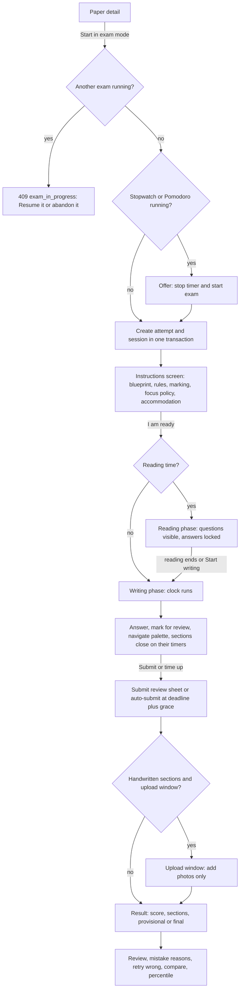
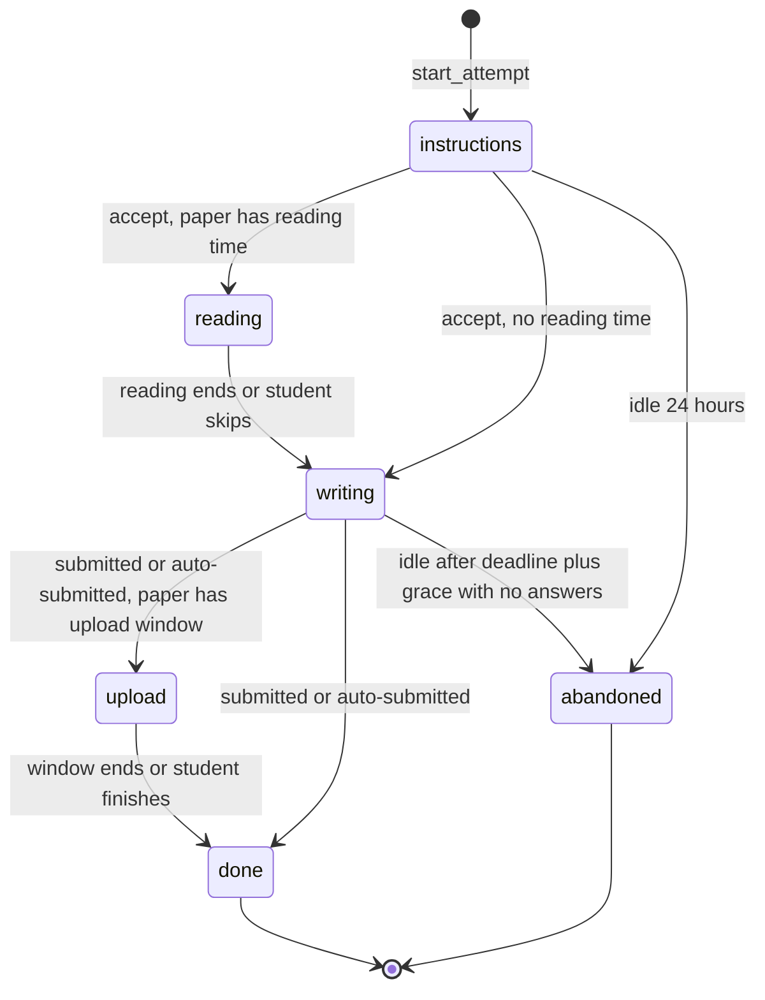

# PRD: F-08 Mock Tests and MTP

| Field | Value |
| --- | --- |
| Status | Draft (for founder review) |
| Owner | Pawan (founder) |
| Last updated | 2026-10-05 |
| Source | `docs/product/FEATURE_MAP.md` section F-08 (item 6 "users upload mock test questions and answers", mind map "Mock test papers", page 6 "MTP"), section 5 (X-01, X-03, X-04), section 7 (risks 1, 2, 4) |
| Linked ERD | `docs/product/erd/F-08-mock-tests-and-mtp.md` |
| Role | **The exam-simulation engine.** A mock test is a *paper* (a blueprint over F-06 questions) plus an *attempt* (an exam-mode `practice_session` with a server clock, sections, palette and a resumable lifecycle). F-08 owns the paper definition, the exam rules and the exam UI; F-06 owns questions, answers, scoring and events |
| Modules | API `apps/api/modules/mocktest`; web `apps/web/src/modules/mocktest`. It is a separate module (not a sub-feature of `practice`) because it has its own tables, rules, screens and a different change cadence (institute releases, exam formats); it reuses `practice` components and services through barrels, never models |
| Feature flags | `mock_tests` (browse, attempt, review, compare), `mock_contrib` (upload and generate), `mock_percentile` (anonymous comparison). Server checked, 403 `feature_disabled` (the behaviour of `time_tracker` and `focus_timer` in code) |
| Depends on | `docs/product/prd/F-06-question-bank-system.md` (hard), `docs/product/prd/F-02-syllabus-structure-and-coverage.md` (taxonomy, terms, schemes, coverage), `docs/product/prd/X-04-ingestion-scraping-service.md` (MTP publisher), `docs/product/prd/F-01.1-pomodoro-focus-timer.md` and `docs/product/prd/F-01.2-time-tracker-and-analytics.md` (live-timer exclusion, auto time). Soft: F-07, F-09, F-10, F-11, F-14, X-01 (interfaces proposed in section 14) |

---

## 1. Problem and goal

A CA, CS or CMA student does not fail for lack of reading; she fails in the exam hall: three hours, a paper she has never seen in this shape, choices to make ("answer any 4 of 6"), a clock that does not stop, and descriptive answers that must be written fast. The Institutes publish Mock Test Papers (MTPs) in series before each term (for CA, two series of six papers per level, question paper at 9:30 am and the answer key within 48 hours, self-assessed by the student), coaching classes sell test series, and friends share PDFs. Today the student prints a PDF, times herself on her phone, and never learns how she did against the paper pattern, her own earlier attempts, or other students. She also gets no signal into her coverage plan that she has "done a mock" for a chapter.

**Goal, in four parts:**

1. **One paper model.** A paper has sections, marks, duration, optional negative marking, choice rules ("any 4 of 6"), reading time, instructions and a syllabus scheme. The same model holds Institute MTPs/RTPs, supplementary papers for the latest syllabus, "Course bought" test series (user supplied), user-created mocks, platform mocks and auto-generated custom mocks.
2. **A faithful, humane exam simulator.** Server-authoritative clock, section timing, a question palette with mark for review, autosave, resume after a crash or a dead connection, auto-submit, an exam-hall-like layout on a phone, and no proctoring: one live exam per student, one writer per attempt (two tabs cannot fight), and a focus policy that informs but never punishes.
3. **A review that teaches.** Per-question time against target, your answer, the key, the solution, the mistake reason, per-section and per-chapter marks, comparison with your earlier attempts, and an optional anonymous percentile that appears only when the cohort is large enough to protect everyone.
4. **A content pipeline that scales.** Institute papers arrive through X-04 (announcement, paper, then key), land as drafts through the F-06 `upsert_from_source` path, are reviewed, published and linked to the exam term and syllabus scheme; students upload their own mocks with questions and answers under F-06 moderation; the test builder generates a custom mock by chapters, marks and difficulty.

Not a goal: proctoring, identity verification, or "official" certification. This is practice; the product says so (section 8.8).

## 2. Users and scenarios

**Aarav, CA Intermediate, May 2027 attempt, MTP release day.**
ICAI publishes MTP Series 1 for Taxation at 9:30 am. X-04 picked up the announcement an hour earlier; by 9:45 the paper is in the app as "MTP Series 1, Paper 4: Taxation, May 2027 attempt, 100 marks, 3 hours, key expected within 48 hours". Aarav taps "Start in exam mode" in the evening, reads the instructions (70 descriptive marks plus 30 MCQ marks, no negative marking, "answer any 4 of 6" in Section B), uses the 15-minute reading time (his phone shows questions but locks inputs), types the MCQs, writes the descriptive answers on paper and uploads three photos in the 20-minute upload window. His brother calls; he leaves the tab for 2 minutes; the clock kept running, the app says so, and nothing else happens. The key arrives the next morning: his MCQs re-score automatically (new key version, F-06 regrade), the review opens with a notification, and "Taxation: mock done" moves in My Coverage.

**Neha, CS Executive, bought a coaching test series.**
She has 8 PDF mocks from her coach. For each she creates a paper from the template "CS Executive paper pattern", pastes the answer key as `1-A 2-C 3-B ...` and attaches nothing else (companion mode, section 5.6): the app runs the timer and an answer sheet while she reads the PDF in another window, scores her, and tags the source "Course bought" so it counts toward her coverage mock signal. The papers stay private; nobody else sees her coach's content.

**Rohan, CMA Final, three weeks before the exam, weak in Cost Audit.**
He opens the builder, picks Paper 18 chapters 3, 5 and 6, chooses "match the paper pattern: 30 marks objective, 70 descriptive, 3 hours", sets difficulty medium-hard and "prefer questions I have not attempted". The builder shows "98 of 100 marks filled; Chapter 6 has only 14 marks of descriptive questions" and he accepts. He attempts it in relaxed mode (he is on a train and may pause twice), self-grades the long answers with the rubric, and the compare screen shows his third attempt in this subject: 41%, 48%, 57%, with time per mark falling from 2.4 to 1.9 minutes. After the 4th attempt a percentile band appears: "Top 25 to 50% of students who took this paper under exam conditions".

**Staff: Meera, editor.** She reviews the Series 1 draft X-04 created: the blueprint (sections, marks, choice rules) is shown beside the extracted questions, a validator says "Section B: marks per question differ, a choice group needs equal marks", she fixes it, publishes with the term May 2027 and scheme 2023, and when the key arrives she reviews the key diff before releasing it (a regrade fans out to everyone who attempted).

## 3. Success metrics

Starting hypotheses, to calibrate after the first 100 active students.

| Metric | Definition | Target | Event(s) |
| --- | --- | --- | --- |
| First mock activation | Students with a chosen level who start a mock within 14 days | 25% | `mock_attempt_started` |
| Exam completion | Exam-mode attempts that reach submitted or auto-submitted divided by those that reach `writing` | 75% | `mock_attempt_submitted`, `mock_phase_changed` |
| Clean finish | Completed exam attempts with no lease takeover loss and no dropped answers | 98% | `mock_lease_lost`, `mock_answer_dropped` (server) |
| No lost answers | Accepted-then-missing answers found by the nightly reconciliation (client queue ack vs stored) | 0 per 10,000 | `mock_reconcile_failed` (server) |
| Clock accuracy | p95 absolute difference between the displayed remaining time and the server remaining time at each heartbeat | under 1 s | `mock_clock_drift` (sampled) |
| Autosave latency | PUT answers p95 | under 250 ms | server metrics |
| Review engagement | Completed attempts whose review is opened within 24 h | 70% | `mock_review_opened` |
| Mistake reasons | Wrong or skipped answers with a reason in the first review | 25% | `mistake_reason_set` (F-06) |
| Repeat | Students with a second completed mock within 14 days of the first | 35% | `mock_attempt_submitted` |
| Retake loop | Completed attempts followed by "retry wrong" or a builder mock on the weak chapters within 3 days | 20% | `mock_retake_started`, `mock_builder_generated` |
| MTP freshness | Median time from official paper release to published paper; from key release to key live | under 6 h, under 12 h | `mock_paper_published`, `mock_key_released` |
| Percentile reach | Exam-mode completions of papers with 30 or more eligible attempts that show a percentile | 60% (after day 30 of a paper) | `mock_percentile_viewed` |
| Upload yield | User mocks started that get a valid blueprint and a first attempt | 50% | `mock_upload_started`, `mock_upload_validated` |
| Moderation SLA | Public submissions decided in 48 h (p90) | 90% | `moderation_decided` (F-06) |
| Focus-loss complaints | Support tickets mentioning unfair focus handling | 0 | support tag |

## 4. Scope

### 4.1 In scope

**R1 (shippable core, section 13)**

1. Paper model: sections, marks, duration, negative marking by rule or by explicit paper rule, instructions, scheme and term, source tag, versions, answer-key status. Editors publish institute, platform and supplementary papers through the editor and CSV paths.
2. Catalogue: browse by course, level, subject, series, exam term, source tag; "latest syllabus" default with an "older scheme" fold; MTP series pages (public, SEO) and a paper detail with blueprint.
3. Exam engine, exam mode: instructions, server-authoritative clock with section deadlines, palette, mark for review, autosave with offline queue, resume after a crash, single-writer lease, auto-submit, one live exam per student, exam-hall layout on phone and desktop, humane focus policy (log only).
4. Scoring through F-06 (`create_session_from_items`, `official` profile, frozen rule); mixed MCQ and long-form papers with self-assessment fallback; provisional and final scores.
5. Review mode, result screen, retry wrong, mistake reasons.
6. Coverage mock signal with source tag; auto time through F-06 events; live-timer exclusion.

**R2**

7. Sectional timing (locked sequence), choice groups ("any N of M"), reading time, upload window for handwritten pages, relaxed mode (limited pauses), time accommodation (extra time percentage), attempt one section.
8. Test builder (blueprint-fill picker) and "save as paper".
9. Compare attempts and trends; X-04 MTP publisher with key-release regrade; notifications (X-01).
10. User mock upload wizard (structured, paste-an-answer-key, CSV) with F-06 moderation; `Course bought` source.
11. F-07 evaluator hook for long-form sections (the F-06 `register_evaluator` registry makes this a no-code change here).

**R3**

12. Anonymous percentile with cohort floor; PDF companion mode (timer plus answer sheet, no question text) pending the legal decision; AI extraction of uploaded papers (F-06 `import_ai`); in-app calculator; offline reload through a service worker; F-11 priority weights in the builder; supplementary-paper alerts from F-14 amendments.

### 4.2 Out of scope (and who owns it)

| Concern | Owner | Note |
| --- | --- | --- |
| Question, option, key, rubric, tags, moderation of single questions, duplicates | F-06 `questionbank` | F-08 only references `question_id` and pins `question_version_id` |
| Answer storage, scoring arithmetic, review payload, regrade, events | F-06 `practice` | F-08 adds exam rules through the origin hooks in section 14 |
| AI scoring of handwritten answers | F-07 | Registers an evaluator; F-08 shows its state |
| Term-wise past papers, "asked N times" | F-09 and F-11 | MTP questions carry `source_kind='institute_mtp'`, so F-09 chapter views already include them |
| Dashboards, readiness | F-10 | Reads `practice` rollups and F-08 events |
| Fetching, parsing, review queue for institute files | X-04 | F-08 registers the `mock_paper` publisher |
| Proctoring, webcam, ID checks, lockdown browser | Not built | Section 8.8 explains why |
| Billing and entitlements for "Course bought" content | Future billing | `entitlement_key` is reserved, unused |
| Notifications delivery | X-01 | Called through `notifications.services.notify` `[PROPOSED: X-01]` |

## 5. User flows

### 5.1 Main flow: take a paper in exam mode



### 5.2 Attempt phases



Relaxed attempts add `paused` inside `writing` (see FR-F08-34). The phase is derived from timestamps by one pure function (`domain/clock.py`), then materialised under a row lock (ERD 3.5).

### 5.3 Edge cases (designed and tested)

| Case | Behaviour |
| --- | --- |
| Phone dies or the browser crashes mid-exam | The clock does not stop (exam mode). Reopening `/app/mocks/attempt/$id` restores the position, flags and the answers from the server plus the device queue; the banner says "You were away 7 min. The clock kept running." |
| Offline for 12 minutes | Writing continues from the downloaded bundle; answers queue on the device; the status chip reads "Offline: 9 answers waiting"; on reconnect the queue replays in one bulk call; answers with a client time up to the deadline plus 120 s are accepted, later ones are listed in the review as "arrived after time" |
| Offline when the deadline passes | Inputs lock locally at the deadline (the countdown is monotonic and anchored to the last server sync); the queue replays on reconnect; the server finalises at deadline plus 120 s |
| Same exam open in two tabs or two devices | One holder at a time (lease epoch). The second tab opens read-only with "This exam is active in another tab. Use it here", which transfers the lease; the first tab becomes read-only on its next call (at most 5 s) and its pending writes are rejected with `lease_lost` and kept visible so the student can copy a text answer |
| Clock manipulated on the device | Irrelevant to the deadline (server decides); the client timer is a display. Writes carry corrected time (client time plus measured offset); a write that claims a time long before it arrived marks the attempt `replay_flagged` and removes it from percentile cohorts, never from the student's own score |
| Student is in a Pomodoro or stopwatch | Starting an exam offers "Stop timer and start exam" (one tap); starting a timer while an exam runs returns 409 with a link back to the exam |
| Student closes the tab and never returns | At deadline plus grace the tick auto-submits with what was saved; unanswered counts as skipped; the result is visible on next visit |
| Paper edited, key corrected or question taken down after the start | The attempt pins paper version and question versions. A takedown shows "Question removed" and excludes it from max marks; a key correction goes through the F-06 regrade |
| "Answer any N" with more than N answered | `block` policy: the (N+1)th selection is refused with a prompt to clear another; `first_n` and `best_n` policies score the first N by paper order or the best N and show which counted |
| Fewer questions available than the blueprint needs (builder) | Preview shows the shortfall per chapter; below 60% of the target marks the generation is refused (422 `not_enough_questions`) with suggestions |
| Paper has no answer key yet | The attempt runs; MCQ results are `ungraded` and the score is provisional ("awaiting answer key"); a notification and an automatic re-score arrive with the key |
| Student with approved extra time | Time limit frozen at start as `duration x (1 + pct)`; the instructions screen states it; percentile excludes the attempt (different conditions), the score is unaffected |
| Deadline hits during the submit sheet | The sheet closes and "Time is up. Submitting." appears; the submit is idempotent so a tap at the same moment changes nothing |
| Flag off | `mock_tests` off: nav hidden, API 403 `feature_disabled`, public SEO pages unaffected. `mock_contrib` off: builder and upload hidden. `mock_percentile` off: no percentile UI, no cohort writes |
| Account deletion | Attempts, events, settings and generated or uploaded private papers are deleted through `mocktest.services.delete_all_for_user` (called by the future central erasure hook, audit AUD-004); approved public papers are anonymised like F-06 contributions |

### 5.4 Review and compare flow

Result screen (score, sections, time) leads to Review (filters: wrong, skipped, slow, marked and right, changed answer) with the F-06 mistake chips; from Review the student starts "Retry wrong" (F-06 `retake`), "Practise these chapters" (F-06 picker with the weak chapters) or "Compare with my earlier attempts".

### 5.5 Upload flow

Basics (source tag, course, level, subject, pattern template) leads to Questions (type or paste, or import CSV), Answers (key string, per-question key, solution text or photo), Check (validator report), Visibility and rights (private by default), then "Practise it now". Public requests go to the F-06 review queue (FR-F08-47).

### 5.6 PDF companion (R3, legal decision first)

For papers whose text we may not host, the paper has `delivery_mode='pdf_companion'`: the app shows the blueprint, the timer, sections and an answer sheet (OMR-style choices for MCQ, a page upload slot for descriptive answers) while the student reads the official PDF elsewhere. Questions exist only as hidden stubs ("Question 3 in the official paper") with the key as facts; this needs `questionbank_question.listed=false` `[PROPOSED EXTENSION to F-06]`. Decision in Q-F08-2.

### 5.7 Edge case: syllabus and term

A paper written for a retired scheme opens behind the "Older syllabus" fold with the banner "Written for the 2023 scheme; 3 chapters changed". Coverage events apply only through `syllabus_chaptermap` (F-06 rule), so an old paper cannot inflate coverage of a chapter that no longer exists.

## 6. Functional requirements

Priorities: P0 must ship in R1, P1 in R2, P2 in R3. `[NEW]` marks additions beyond `FEATURE_MAP.md`.

### A. Paper definition (the blueprint)

| ID | Requirement | Priority | Acceptance criteria |
| --- | --- | --- | --- |
| FR-F08-01 | A paper version defines `total_marks`, `duration_seconds`, optional `reading_seconds` and `upload_window_seconds`, `instructions_md`, sections (key, title, kind objective, descriptive or mixed, optional section duration) and ordered items (question, pinned version, marks, optional negative marks, display label such as `Q.4(b)`) | P0 | Given a paper with two sections, when it is published, then `total_marks` equals the sum of counted item marks and the section marks and each item's marks are frozen |
| FR-F08-02 | Negative marking comes from the F-06 `practice_scoringrule` resolved for course, level, subject and kind (`scoring_mode='rule'`) or from an explicit paper rule with a source note (`explicit`); an unverified rule is never applied silently | P0 | Given the `official` profile and an unverified rule, then the instructions say "Marking rule not yet verified, negative marking off" and no penalty is applied (F-06 FR-43) |
| FR-F08-03 | Choice groups: "answer any N of M" with equal marks per item and an overflow policy `block`, `first_n` or `best_n`; max score counts N items | P1 | Given a group of 6 items worth 5 marks with N=4, then the paper's maximum for the group is 20 and unequal marks fail validation with 422 `invalid_blueprint` naming the group |
| FR-F08-04 | A blueprint validator (pure) checks: sections non-empty, marks positive, group equality, duration positive, every MCQ has a key, every long-form item has a rubric or reference solution, no duplicate question in a paper, sum consistent with the declared total | P0 | Given a draft with an MCQ lacking a key, then publish is refused with a list of problems and the editor sees each item highlighted |
| FR-F08-05 | Exam formats: `mocktest_examformat` rows (course, level, subject, effective dates) describe the real pattern (total marks, duration, objective and descriptive split, section skeleton, negative rule reference, `verified`). They prefill the editor, the upload wizard and the builder | P1 | Given the format "CMA Intermediate paper, 30 objective + 70 descriptive, 3 h", when the builder picks it, then two sections with those marks are proposed |
| FR-F08-06 | Immutable versions: a live version is never edited; a fix creates a new version (`revision_label` original, revised or supplementary); attempts pin the version they started with | P0 | Given a revised paper, then new attempts use the new version and old attempts keep theirs, with "A revised version is available" on their result |
| FR-F08-07 | Source tag per paper: `institute`, `course_bought`, `user`, `platform`; with `kind` (`mtp`, `rtp`, `sample`, `mock`, `generated`, `user_upload`) | P0 | Given a paper tagged `course_bought`, then it is visible only to its owner unless an editor records `licensed` rights |
| FR-F08-08 | Syllabus fit: every paper stores the scheme it was written for and an optional exam term; `syllabus_status` is `current`, `old_scheme`, `amended` or `unknown` and is recomputed when a scheme is retired or F-14 reports an amendment `[PROPOSED: F-14]` | P1 | Given scheme 2023 is retired, then its papers show "Older syllabus" and drop out of the default list |

### B. Catalogue, MTP and supplementary papers

| ID | Requirement | Priority | Acceptance criteria |
| --- | --- | --- | --- |
| FR-F08-10 | Browse papers by course, level, group, subject, series, term, source tag, kind, state (new, in progress, attempted), key status; default filter is the student's enrolled level and the current scheme | P0 | Given an enrolled CA Intermediate student, then the list opens on CA Intermediate, current scheme, newest first |
| FR-F08-11 | MTP parity with PYQ: term-wise grouping, suggested answers, and a practice mode. "Practise question by question" opens an untimed F-06 session with `explicit_items` from the paper; "Practise by chapter" filters the paper's questions by chapter | P0 | Given an MTP, then the detail page offers Exam mode, Relaxed mode, Question-by-question and Review of last attempt |
| FR-F08-12 | Series pages: a series groups the papers of one release (for example "MTP Series 1, May 2027") with the release schedule and key status per paper | P1 | Given a series with 6 papers, then the page lists 6 cards with "Paper released", "Key due by {date}" or "Key available" |
| FR-F08-13 | Supplementary and revised papers [NEW]: `revision_label` and `revision_of_id`; the older version stays attemptable; the catalogue shows the newest revision first with "Revised on {date}" | P1 | Given a revised MTP, then both appear, the old one under "Earlier version" |
| FR-F08-14 | "Latest syllabus" mode: a toggle (URL `scheme=current\|any`) hides papers for retired schemes; supplementary papers by the latest syllabus are first-class results | P1 | Given `scheme=current`, then no `old_scheme` paper appears |
| FR-F08-15 | Public SEO pages: `/courses/$course/$level/mock-tests` (series list), series page and paper landing (blueprint, no questions text unless licence allows), `buildHead()`, Breadcrumb JSON-LD, OG image | P1 | Given a public series page, then it is SSR, indexable, and the OG image shows title, marks and duration |
| FR-F08-16 | Release awareness: upcoming releases from `release_schedule` appear as "Releases tomorrow 9:30 am" and trigger a reminder to students who opt in (X-01) | P2 | Given an opted-in student, then one notification is sent at release |

### C. The exam engine

| ID | Requirement | Priority | Acceptance criteria |
| --- | --- | --- | --- |
| FR-F08-20 | Start: creates the attempt, the F-06 session (mode `exam`, origin `mtp` or `mock`, scoring profile `official`) and per-section rows in one transaction; idempotent on `client_id` | P0 | Given a retried start with the same `client_id`, then one attempt exists |
| FR-F08-21 | One live exam per student, enforced by the database (partial unique index) and the live-timer registry: starting a second returns 409 `exam_in_progress` with the first attempt; an exam is a live timer for F-01.1/F-01.2 (`register_live_timer_provider`) | P0 | Given two simultaneous start requests, then exactly one succeeds (concurrency test on Postgres) |
| FR-F08-22 | Instructions screen before the clock: blueprint table, marking, choice rules, navigation rules, focus policy, extra-time notice, what happens offline; must be accepted; the clock starts at acceptance (or at the end of reading time) | P0 | Given the screen is open for 10 minutes, then no time is consumed |
| FR-F08-23 | Server-authoritative clock: `deadline_at` is the only truth; every response carries `server_time`, `remaining_ms` and the phase; the client countdown uses a monotonic clock anchored to the last sync and re-syncs on each heartbeat | P0 | Given a device clock set 2 hours ahead, then the countdown still matches the server within 1 s |
| FR-F08-24 | Reading time: questions readable, answers locked (409 `reading_phase`), "Start writing now" allowed; the writing clock starts then | P1 | Given 15 minutes of reading time and a tap at minute 5, then writing starts with the full duration |
| FR-F08-25 | Sectional timing (`sequential`): sections open in order, each with its own deadline; closing a section is irreversible; the next opens at once; unused time does not carry over | P1 | Given section A ends at 40:00, then at 40:00 the server closes it and any later write returns 409 `section_closed` |
| FR-F08-26 | Palette with states not visited, not answered, answered, marked for review, answered and marked (counts for evaluation, as in GATE style papers), plus not counted (choice overflow), locked (section closed), pages ready (long-form); every state has an icon and text, not colour alone | P0 | Given an answered and marked question, then it is counted in the score and labelled "Answered and marked for review" |
| FR-F08-27 | Autosave: each change is saved within 400 ms debounce through bulk or single PUT with a lease epoch, the corrected client time and time-spent deltas; failures queue in IndexedDB and replay in order; the status chip shows Saved, Saving, Offline with a count, or Sync failed with Retry | P0 | Given airplane mode and 5 answers, then after reconnect exactly 5 answers are stored once |
| FR-F08-28 | Resume: the player restores section, question, flags and answers from the server (the source of truth) merged with the device queue; the last viewed position is stored by heartbeat | P0 | Given a crash at question 37, then reopening lands on question 37 with all saved answers |
| FR-F08-29 | Single-writer lease: acquire with a tab id and label; every write carries the epoch; stale epochs get 409 `lease_lost`; "Use it here" takes over (increments the epoch); the lease renews every 30 s and a lease unrenewed for 90 s can be taken without confirmation | P0 | Given two tabs, then only the latest taker can write and the other is read-only within 5 s |
| FR-F08-30 | Submit review sheet before final submit: per section answered, not answered, marked, not visited; choice warnings; remaining time; irreversible confirmation; idempotent submit | P0 | Given 6 of "any 4" answered, then the sheet lists which 4 will count |
| FR-F08-31 | Auto-submit at `deadline_at` plus grace (120 s, F-06) by the lazy read path and the tick; unanswered counts as skipped | P0 | Given a student who left, then the attempt is submitted within 3 minutes of the deadline |
| FR-F08-32 | Focus policy (`log` default): losing focus, leaving full screen or going offline is recorded as events and shown back to the student in review ("away 2 min 10 s, 3 times"); no penalty, no auto-submit, never shown to anyone else; the student can switch on gentle reminders | P0 | Given a tab switch, then no dialog interrupts the exam and the review shows the away time |
| FR-F08-33 | Exam-hall layout: a distraction-free layout hides the app navigation, uses the full dynamic viewport with safe-area insets, keeps the screen awake where supported, offers optional full screen on desktop, and works from 320 px; on phones the palette is a bottom sheet and the section tabs a scrollable strip | P0 | Given a 320 px portrait phone, then question, options, timer and primary action are visible without horizontal scroll and the palette opens in one tap |
| FR-F08-34 | Relaxed mode [NEW]: F-06 mode `timed` with pause allowed up to 3 pauses and 30 minutes in total (paper default, editor adjustable); results are labelled "Relaxed" and are excluded from percentile | P1 | Given a 4th pause request, then 409 `pause_limit_reached` |
| FR-F08-35 | Time accommodation [NEW]: a student setting of extra time (0, 10, 25, 50, 100 percent) is frozen into the attempt; WCAG 2.2.1 compliance for the product's own limits comes from this plus the practice modes, since the exam limit itself is essential | P1 | Given 25%, then a 180-minute paper runs 225 minutes and says so on the instructions |
| FR-F08-36 | Handwritten answers and the upload window [NEW]: for descriptive sections the student may write on paper and upload page photos until `upload_until` (default 20 minutes after submit); only page attach is allowed in that window; pages are stamped with server receipt time | P1 | Given a submitted attempt inside the window, then a page upload succeeds and a text edit returns 409 `attempt_closed` |
| FR-F08-37 | Attempt one section [NEW]: run a single section with proportional time; labelled "Section practice", excluded from percentile | P2 | Given section A of 30 marks in a 100-mark, 180-minute paper, then the limit is 54 minutes |
| FR-F08-38 | In-app calculator (basic) when the paper allows | P2 | Given `calculator='basic'`, then a labelled calculator opens in a sheet and its use is not recorded |
| FR-F08-39 | Prefetch bundle: the whole paper (playable payloads without keys, media URLs valid for the exam length plus the upload window) is downloaded at start and cached in IndexedDB | P0 | Given offline after start, then every question still opens and no key is present in the bundle (API test per kind) |

### D. Scoring and mixed mode

| ID | Requirement | Priority | Acceptance criteria |
| --- | --- | --- | --- |
| FR-F08-40 | MCQ and numeric items are auto-scored by F-06 at submit with the frozen `scoring_snapshot`; item marks override question marks as pinned in the paper | P0 | Given a 2-mark question answered wrongly under a 0.25 fraction rule, then marks awarded are -0.5 |
| FR-F08-41 | Mixed papers: long-form items stay `pending`; the score is `provisional` until each long-form answer is self-graded or evaluated; the result shows "MCQ 24/30 final, descriptive pending" | P0 | Given a mixed paper, then the result shows a final objective score and a provisional total |
| FR-F08-42 | Self-assessment fallback: with no evaluator registered (or enabled), the student marks each rubric step; self marks are flagged and excluded from comparable score and percentile; F-07 replaces them when available | P1 | Given F-07 disabled, then the self-grade panel appears; given F-07 enabled, then "Evaluate with AI" is offered and the self marks remain until replaced |
| FR-F08-43 | Section scores, per-chapter marks, time per mark and negative marks lost are computed at submit and stored for the compare screen | P0 | Given a submitted attempt, then each section shows score, max, answered, correct, time |
| FR-F08-44 | Missing key: items without a key score `ungraded`; when the key arrives (new question version) F-08 triggers the F-06 regrade for the paper's items and notifies the student | P1 | Given an attempt made before the key, then after key release its MCQ marks fill in and the notification says what changed |

### E. Review, compare and percentile

| ID | Requirement | Priority | Acceptance criteria |
| --- | --- | --- | --- |
| FR-F08-45 | Review mode: for each item, your answer, the key, the solution, time spent against the suggested time, marks, whether you changed your answer, marked for review, mistake reason chips; filters wrong, skipped, slow, marked and right, changed | P0 | Given the review opened before submit, then 403 `review_locked` |
| FR-F08-46 | Attempt comparison: for a paper or a subject, a timeline of score percent, time used, section scores and time per mark across attempts, with a table equivalent of every chart | P1 | Given 3 attempts of one paper, then the chart shows 3 points and the table lists exact values |
| FR-F08-47 | Anonymous percentile [NEW]: opt-in, first exam-mode clean attempt per student per paper version, cohort floor 30 (`MOCKTEST_MIN_COHORT`), quartile bands below 100, percentile at 100 or more, refreshed in batches, never a leaderboard | P2 | Given 29 eligible attempts, then "Not enough students yet" appears and no number is exposed |

### F. Test builder (custom mock)

| ID | Requirement | Priority | Acceptance criteria |
| --- | --- | --- | --- |
| FR-F08-50 | Builder by chapters, marks target, difficulty mix, kinds, source filters, "prefer unattempted or weak", with a pattern preset from an exam format; preview with filled marks per chapter and shortfalls | P1 | Given a 100-mark target, then the preview shows marks filled within 2 of the target or the shortfall per chapter |
| FR-F08-51 | The builder is the registered picker `mock_blueprint` (F-06 `register_picker`), deterministic by seed, reusable by Today and F-10 for exam-like sets | P1 | Given the same spec and seed, then the same questions in the same order |
| FR-F08-52 | Chapter weights from syllabus marks (`marks_min`, `marks_max`) in R2; F-11 priority weights in R3 `[PROPOSED: F-11]` | P1, P2 | Given F-11 absent, then syllabus weights are used |
| FR-F08-53 | "Save as paper": a generated mock is saved as a private paper (kind `generated`) so it can be retaken identically or shared by link | P1 | Given a saved generated paper, then a retake gives the same questions |

### G. User upload and moderation

| ID | Requirement | Priority | Acceptance criteria |
| --- | --- | --- | --- |
| FR-F08-55 | Upload wizard (structured), paste-an-answer-key (`1-A 2-C ...`), CSV through the F-06 importer with section, label, marks and group columns; drafts autosave | P1 | Given a 30-MCQ paper and a pasted key, then a runnable private paper exists in under 5 minutes |
| FR-F08-56 | Questions of uploaded papers are created through `questionbank.services` with ownership `user_uploaded` or `user_created` and F-06 rights rules (third-party material stays private) | P1 | Given source tag "Course bought", then rights are `third_party_claimed` and visibility stays private |
| FR-F08-57 | Public submission of a user-created paper creates one F-06 review per question plus one paper-level review (blueprint, key completeness, duplicate paper hash); the paper goes live only when all items are live and the paper review is approved | P2 | Given one rejected question, then the paper returns to draft with that item named |
| FR-F08-58 | Quotas: papers, items and storage inherit F-06 quotas; generated papers per day are limited | P1 | Given the limit, then a clear message states used and allowed |

### H. MTP ingestion and platform

| ID | Requirement | Priority | Acceptance criteria |
| --- | --- | --- | --- |
| FR-F08-60 | X-04 publisher for `mock_paper` (and the question payloads extracted from it): `publish(item_version)` creates or updates a draft paper and its questions through `upsert_from_source`, `withdraw` unpublishes; idempotent on `(origin_module, external_ref)` | P1 | Given the same item version twice, then one paper exists |
| FR-F08-61 | Two-stage release: paper first (key status `none`), key later (`partial` or `complete`) as a new question version per item, with an editor diff view before release | P1 | Given a key item version, then editors see old and new keys side by side |
| FR-F08-62 | Legal tier respected: a `link_only` source publishes a link card only; a `facts_and_summary` source may carry blueprint facts and keys but not question text; `host` allows full text | P1 | Given `link_only`, then no question rows are created |
| FR-F08-63 | Coverage mock signal: on completion F-08 emits `mock_attempt_completed` with the source tag; coverage records `mock_done` per chapter with `answered >= 5`, idempotent on (student, paper, chapter) so retakes do not inflate; `coverage_event.source_tag` carries institute, course_bought, user or platform `[PROPOSED EXTENSION to F-02]` | P0 | Given the same paper attempted three times, then the chapter's mock count rises once |
| FR-F08-64 | Auto time: the F-06 tracker subscriber records one auto session for the elapsed writing time (not the sum of per-question times) when auto capture is on and no live timer overlaps | P1 | Given an exam without auto capture, then no tracking row is written |
| FR-F08-65 | Flags and permissions as in section 8; every endpoint tested for 401, 403 `feature_disabled`, 404 for other users' attempts | P0 | Given a flag-off request, then 403 `feature_disabled` on every endpoint |

## 7. Screens, URLs and design-system needs

All filters, tabs, the current section and the current question live in the URL (zod-validated). `/app/...` is private and `noindex`; public pages use `buildHead()`.

### 7.1 Screens and URLs

| Screen | URL | Notes |
| --- | --- | --- |
| Mock hub | `/app/mocks` | Resume exam card (top, with time left), new MTP releases, "Your next mock", recent results, builder entry |
| Paper catalogue | `/app/mocks/papers` | `?course=&level=&subject=&series=&term=&source=&kind=&state=&scheme=current\|any&key=&q=&sort=&cursor=` |
| Paper detail | `/app/mocks/papers/$paperId` | `?v=` version; blueprint, history of my attempts, start options |
| Series | `/app/mocks/series/$slug` | Papers of a release with key status |
| Instructions | `/app/mocks/attempt/$attemptId/instructions` | Must be accepted before the clock |
| Exam player | `/app/mocks/attempt/$attemptId` | `?s=B&q=12` section and question; exam-hall layout (no app chrome) |
| Result | `/app/mocks/attempt/$attemptId/result` | Score, sections, provisional state, next steps |
| Review | `/app/mocks/attempt/$attemptId/review` | `?filter=wrong\|skipped\|slow\|marked\|changed&q=` |
| Upload window | `/app/mocks/attempt/$attemptId/pages` | Add photos for descriptive answers within the window |
| History and compare | `/app/mocks/history`, `/app/mocks/compare` | `?paper=` or `?subject=`, `?ids=a,b,c` |
| Builder | `/app/mocks/builder` | `?course=&level=&subject=&chapters=&marks=&minutes=&difficulty=&preset=` |
| My mocks, wizard | `/app/mocks/mine`, `/app/mocks/new`, `/app/mocks/$paperId/edit` | Drafts, in review, live, rejected with reasons |
| Settings | `/app/settings/mocks` | Extra time, focus reminders, percentile consent, default run mode |
| Admin | `/app/admin/mocks/papers`, `/series`, `/formats`, `/reviews`, `/keys` | Editors; Django admin as fallback |
| Public | `/courses/$course/$level/mock-tests`, `/courses/$course/$level/mock-tests/$series`, `/mock-tests/$publicId` | SSR, indexable, OG `/og/mock-tests/$publicId` |
| Shared paper | `/m/$token` | `noindex`, landing with blueprint; start requires sign-in |

### 7.2 Wireframes (mobile first, 320 to 1280 px)

**Exam player, phone portrait, writing phase**

```
┌──────────────────────────────────┐
│ MTP 1 · Taxation   ⏱ 02:41:07   │  timer text + role=timer (minute updates for SR)
│ [A MCQ][B Descr.][C Cases] ▸     │  section strip (scrolls), current underlined + text
│ Q 14 of 40 · 2 marks · -0.5      │
│ Which ITC is blocked under       │
│ Section 17(5)?                   │
│ ( ) A  Motor vehicles for ...    │  44 px rows
│ (•) B  Goods lost, stolen ...    │
│ ( ) C  Works contract ...        │
│ ( ) D  None of the above         │
│ ● Saved   [Clear]                │  status chip: Saved / Saving / Offline: 3 waiting
│ [⚑ Mark & Next] [Save & Next ▸]  │  one primary, one secondary
│ [▦ Palette 14/40]  [Submit …]    │  palette = bottom sheet, submit = review sheet
└──────────────────────────────────┘
```

**Exam player, desktop (1280 px)**

```
┌───────────────────────────────────────────────────────┬───────────────┐
│ MTP Series 1 · Taxation  [A][B][C]   ⏱ 02:41:07  Saved│ Palette       │
│ Q 14 · MCQ · 2 marks · negative 0.5                   │ 1 2 3 ● 5 ⚑ 7 │
│ Stem ...  options ...                                  │ legend: text  │
│ [⚑ Mark for review & Next] [Save & Next] [Clear]       │ A 12/20 B 0/8 │
│ [◂ Previous]                           [Submit paper]   │ [Submit]      │
└───────────────────────────────────────────────────────┴───────────────┘
```

**Result and review, phone**

```
┌──────────────────────────────────┐
│ Result · MTP 1 Taxation · Relaxed│
│ 62.5 / 100  (provisional)        │  "MCQ 24/30 final · Descriptive 38.5/70 self-graded"
│ ▓▓▓▓▓▓░░░░ 62%    Time 2h 41m    │
│ Section A 24/30  B 30/50  C 8/20 │  text + bars
│ Top 25 to 50% (118 students)     │  only if eligible and consented
│ [Review answers] [Retry wrong 9] │
│ [Compare my attempts] [Practise  │
│   weakest chapters]              │
└──────────────────────────────────┘
```

### 7.3 UI states per screen

Every cell is designed, built and covered by a component test or showcase entry. Skeletons are layout-stable.

**Paper catalogue and detail**

| State | Behaviour |
| --- | --- |
| First time | Opens on enrolled level, current scheme; a one-time card explains "Exam mode vs Relaxed vs Question-by-question" |
| Loading | 6 card skeletons, filter chips usable |
| Empty | "No papers match", strongest filter removable by chip; for a level with none "We have not added mocks for this level yet. Build your own" with the builder link |
| Partial | Cards load first; "your attempts" overlay and key status fade in; overlay failure shows quiet "Your history could not load. Retry" |
| Success | Cards with marks, duration, source tag text, key status, syllabus badge, "Resume" if in progress |
| Error | Alert with Retry and request id, last list dimmed |
| Offline | "Offline: you can resume the exam you started; new papers need a connection" |
| Flag off | "Mock tests are not available yet" page |
| Long content | Titles wrap, blueprint tables scroll inside their own container |
| Quota | Not applicable to browse; upload and builder show used and allowed |

**Instructions and start**

| State | Behaviour |
| --- | --- |
| Normal | Blueprint table, marking rule with source and verified label, choice rules in plain words, navigation rules, offline behaviour, focus policy, extra time notice, "I have read the instructions" checkbox then Start |
| Another exam running | Blocking card with "Resume that exam" and "Abandon it" |
| Timer running | Card "Stop the stopwatch and start the exam" |
| Rule unverified | Notice "Marking rule not yet verified, negative marking off" |
| Key missing | Notice "Answer key not released yet; MCQ marks will appear when it is" |
| Offline | Start disabled with reason; the bundle download needs a connection |
| Loading bundle | Progress "Downloading the paper (12 of 40)", Start enabled after the first section is ready |

**Exam player**

| State | Behaviour |
| --- | --- |
| Reading phase | Banner with reading countdown and "Start writing now"; options visible but disabled with text "Answers unlock when writing starts" |
| Writing, normal | Palette, timer, section strip, status chip |
| Palette states | not visited, not answered, answered, marked, answered and marked, not counted, locked, pages ready; icon plus text plus `aria-label` |
| Autosave | Chip: Saved, Saving, Offline with count, Sync failed with Retry; never blocks input |
| Timer warnings | At 30, 10, 5 and 1 minute: a polite `aria-live` message and a visual banner, no modal; section end warnings at 5 and 1 minute |
| Section closed | Locked palette entries; focus moves to the next section; message "Section A closed" |
| Choice limit | Inline "You can answer 4 of these 6. Clear one to answer this" |
| Offline | Banner "Offline. Your answers are saved on this device and will sync" |
| Lease lost | Read-only overlay "This exam is active in another tab" with Use it here; pending text answers remain copyable |
| Focus loss | No interruption; on return a small toast "You were away 40 s. The clock kept running" (reminders optional) |
| Long content | Case study stem pinned and collapsible; tables scroll within; zoom 200% supported |
| Time up | Inputs lock, "Time is up. Submitting." then the result or the upload window |
| Error | Non-blocking toast per failed save with Retry; persistent failure >2 minutes shows a banner with "Copy my answers" |
| Flag off mid-exam | The attempt continues to the end (a flag never kills a running exam) |
| Reduced motion | No animated timer ring; text only |

**Submit sheet, result, review, pages**

| State | Behaviour |
| --- | --- |
| Submit sheet | Per-section counts, choice warnings, remaining time, "Submit paper" and "Go back" |
| Result loading | "Scoring your paper" skeleton; MCQ final within 2 s |
| Provisional | Banner explaining what is pending, with the self-grade or AI action per answer |
| Awaiting key | Banner "Answer key expected by {date}"; notify me |
| Review | List with filters, per-item time bar vs target (with numbers), your answer vs key (icon and text), solution panel, mistake chips |
| Review locked | Before submit: "Review opens after you submit" |
| Pages window | Countdown to `upload_until`, per-page status Ready, Uploading 63%, Scanning, Rejected with reason |
| Percentile | Hidden, "Not enough students yet", band, or percentile; all with text and the cohort size |
| Offline | Review of cached attempts works; actions queue |

**Builder, upload wizard, compare**

| State | Behaviour |
| --- | --- |
| Builder first time | Starts from a preset ("Match my paper pattern") with chapters of the weakest coverage preselected |
| Builder preview | Live marks per chapter with shortfall chips; under 300 ms |
| Builder error | `not_enough_questions` with widen suggestions |
| Wizard | Steps with autosave, validator report with item links, offline draft kept on device |
| Compare empty | "Take this paper twice to compare" with the retake button |
| Compare success | Chart plus a data table, both keyboard reachable |

### 7.4 Design-system components

Reused from `@artha/design-system`: Button, Card, Tabs, Sheet (bottom sheet), Dialog, Alert, Badge, Progress, Skeleton, Toast, Table, Checkbox, RadioGroup, Tooltip, Icons (Lucide). Reused from the `practice` barrel: `QuestionPane`, `Palette` (extended with the exam states), `ReviewList`, `ReviewItem`, `ScoreSummary`, `SubmissionPanel`, `SelfGradePanel`, `ImageStrip`, `MistakeChips`.

New (in `packages/design-system` where generic, else in the module): `ImmersiveLayout` (DS layout: dynamic viewport height, safe-area insets, no app chrome), `CountdownText` (DS: monotonic countdown with `role="timer"` and minute-level screen reader updates), `StatusChip` (DS), `ExamShell`, `SectionStrip`, `SubmitReviewSheet`, `LeaseOverlay`, `InstructionsPanel`, `PaperBlueprintCard`, `ReadingBanner`, `AttemptTimeline` (chart with table twin), `PercentileBand`, `BlueprintBuilderForm`, `PaperWizard`, `ClockSyncProvider` (module). Chart colours come from tokens; palette states never rely on colour only. Icons only from the design system.

## 8. Data and permissions

Tables and columns: ERD. Everything goes through Django; RLS is deny-by-default.

### 8.1 Entities

`mocktest_series`, `mocktest_paper`, `mocktest_paperversion`, `mocktest_section`, `mocktest_choicegroup`, `mocktest_item`, `mocktest_examformat`, `mocktest_paperreview`, `mocktest_attempt`, `mocktest_attemptsection`, `mocktest_attemptevent`, `mocktest_cohortstat`, `mocktest_settings`, `mocktest_auditlog`. Questions, answers, sessions, scoring rules, attachments, events and jobs are F-06 and `core`.

### 8.2 Permission matrix

| Action | Anonymous | Student | Contributor (F-06 terms accepted) | Editor | Admin |
| --- | --- | --- | --- | --- | --- |
| See public series and paper landing pages | yes | yes | yes | yes | yes |
| Browse papers, start attempts, review, compare | no | yes | yes | yes | yes |
| Build a custom mock, save as private paper | no | yes (`mock_contrib`) | yes | yes | yes |
| Upload a private mock, share by link | no | no | yes | yes | yes |
| Submit a mock for public review | no | no | yes (level rules) | n/a | n/a |
| Create institute or platform papers, publish, release keys, revise | no | no | no | yes | yes |
| Verify exam formats and scoring-rule links | no | no | no | yes | yes |
| Take down a paper (legal) | no | no | no | no | yes |
| Read another student's attempt | no | no | no | no | no (audited support access is out of scope) |

Scopes: `mocktest.play`, `mocktest.contribute`, `mocktest.edit`, `mocktest.moderate`, `mocktest.admin`. Roles from `profiles.role`; contributor is F-06's derived capability.

### 8.3 Ownership and rights

Rights follow F-06 section 8.3: platform and Institute papers `institute_material` only after the legal decision (X-04 Q1 and Q-F08-2); uploaded third-party mocks stay private; user-created mocks may go public after review. A public paper always shows its source. The paper's `source_tag` is a student-facing label and a coverage input, not a legal status.

### 8.4 Privacy, retention and DPDP Act 2023

- Personal data: answers and timings (via F-06), attempt events (focus, offline, lease), accommodation setting (may reveal a disability: sensitive, stored as a number only, never shown to others, never exported to PostHog), percentile consent.
- Retention: attempts with the F-06 session lifetime; `mocktest_attemptevent` 12 months; cohort stats keep only aggregates; generated and private uploaded papers until the student deletes them.
- Export and deletion through `mocktest.services.export_for_user` and `delete_all_for_user`, composed with F-06's by the future central erasure hook.
- The DPDP Rules (published 14 November 2025, main duties about 18 months later) and minors' consent `[VERIFY with counsel]`; focus events are not biometric or proctoring data, and no camera or microphone is ever used.
- No question text, answer text or search text is sent to PostHog or Sentry.

### 8.5 Quotas (plan `free`; editable in config)

| Limit | Free |
| --- | --- |
| Exam attempts | unlimited (a student may have one live exam and 5 open sessions in total) |
| Generated papers per day | 5 |
| Private uploaded papers / items per paper | 50 / 200 (items count toward the F-06 200 questions quota) |
| Attempt events kept per attempt | 500 (extra dropped with a counter) |
| Photo pages per month | shared with F-06 answer-sheet quota (200 pages) |

### 8.6 Scoring and exam facts: what we do not assume

Third-party summaries (they conflict, see Appendix A) say: CA Foundation has four papers, two of them objective with negative marking of 0.25 per wrong answer; CA Intermediate papers are 70 descriptive plus 30 case-study MCQ marks with no negative marking; CA Final is either fully descriptive or 70 plus 30 depending on the source and the scheme; papers run 3 hours with a reading time `[VERIFY: 15 minutes]`; the passing rule is 40% per paper and 50% aggregate. CMA Foundation is 50 MCQs of 2 marks per paper, CMA Intermediate and Final are 30 objective (15 x 2) plus 70 descriptive in 3 hours, no negative marking. CSEET is moving to three subjective papers of 3 hours plus a 2-hour OMR MCQ paper from June 2026, offline, no negative marking. For CS Executive and Professional we found no reliable source: `[VERIFY]`. **No pattern is hard-coded**: formats and scoring rules are data (`mocktest_examformat`, `practice_scoringrule`) seeded as unverified drafts that an editor verifies against the Institute's current exam notice. The ICAI MTP process (two series, paper at 9:30 am per schedule, key within 48 hours, self-evaluation, not evaluated by ICAI) is likewise stored as editable release data.

### 8.7 Integrity stance (non-proctored)

| Option | Decision | Why |
| --- | --- | --- |
| Webcam or microphone proctoring, ID checks | Not built | Privacy, DPDP and minors, cost, bias and false flags; the students are the only party harmed by cheating in practice |
| Forced full screen or lockdown | Not forced; optional full screen on desktop | Breaks accessibility, mobile, split-screen tools students legitimately use; unsupported on some phone browsers `[VERIFY]` |
| Tab switch penalty or auto-submit | Not built | Notifications, calls and OS dialogs trigger it; punishes honest students |
| Tab switch and offline logging | Built, shown only to the student | Honest feedback ("you lost 6 minutes") that improves exam habits |
| Block copy, paste, text selection | Not built | Hurts screen readers and zoom; no integrity value for self-assessment |
| Shuffle questions or options | Off for Institute papers (fixed order matters), on for generated papers (seeded) | Fidelity versus fairness |
| Keys and solutions | Never leave the server before submit | Real protection, at no cost to the student |
| Percentile integrity | Only exam-mode, no extension, first attempt, no replay flag, opted in | Keeps the comparison meaningful without surveilling anyone |
| One live exam, one writer | Database enforced | Prevents accidental double sessions, not cheating |

## 9. API surface

Base `/api/v1/mocktest/`, DRF serializers, cursor pagination, error envelope from `core/errors`, flag `mock_tests` (contribution endpoints also need `mock_contrib`, percentile `mock_percentile`), all 403 `feature_disabled`. Writes that can be replayed carry `client_id` or a lease epoch plus client time.

### 9.1 Papers and series

| Method and path | Purpose | Notes and errors |
| --- | --- | --- |
| GET `public/series/`, `public/series/{slug}/`, `public/papers/{public_id}/` | Public SEO data | CDN cache like F-06 public GETs |
| GET `papers/` | Catalogue (filters in 7.1) | cursor; overlay of my attempts is a separate `no-store` call `papers/overlay/?ids=` |
| GET `papers/{id}/` | Detail with blueprint, key status, my attempts | 404 for what the viewer may not see |
| POST `papers/`, PATCH `papers/{id}/`, PUT `papers/{id}/blueprint/` | Draft create and edit (sections, groups, items) | 422 `invalid_blueprint` with problems |
| POST `papers/{id}/submit-review/`, `withdraw/`, DELETE `papers/{id}/` | Lifecycle | 422 `checks_failed` |
| POST `papers/import/`, POST `papers/key-string/parse/` | CSV import via F-06 importer; key-string preview | |
| GET `series/`, `series/{slug}/` | Series list and detail | |
| GET `formats/` | Verified and draft exam formats for pickers | |

### 9.2 Builder

| Method and path | Purpose | Notes and errors |
| --- | --- | --- |
| POST `builder/preview/` | Marks filled per chapter, shortfalls, estimated time | no write; under 300 ms |
| POST `builder/generate/` | Create a generated paper and optionally start an attempt | 422 `not_enough_questions`, 429 quota |

### 9.3 Attempts

| Method and path | Purpose | Notes and errors |
| --- | --- | --- |
| POST `attempts/` | Start `{paper_id, version_id?, run_mode, section_scope?, client_id, tz}` | 409 `exam_in_progress`, 409 `timer_running` (with `stop_and_start` option), 422 `paper_not_available` |
| GET `attempts/`, GET `attempts/{id}/` | Resume list, history; state with phase, clock, sections, lease | 404 for others |
| GET `attempts/{id}/bundle/` | Playable payloads for every item, no keys; ETag | media URLs valid for the attempt length |
| GET `attempts/{id}/clock/` | `{server_time, remaining_ms, section_remaining_ms, phase}` | cheap, 20 per minute |
| POST `attempts/{id}/accept/` | Instructions accepted, starts reading or writing | idempotent |
| POST `attempts/{id}/writing/start/` | Skip the rest of reading time | |
| POST `attempts/{id}/lease/` | `{tab_id, label, takeover}` returns epoch | 409 `lease_held` without takeover |
| POST `attempts/{id}/heartbeat/` | `{epoch, position, section, events[]}` returns clock and lease state | every 30 s visible, 60 s hidden |
| PUT `attempts/{id}/answers/` | Bulk save (max 100) `[ {position, answer, client_ts, flags} ]` with header `X-Lease-Epoch` | per-item result `saved`, `dropped_late`, `section_closed`, `reading_phase`, `choice_limit_reached`, `invalid`; 409 `lease_lost` for the whole call |
| PUT `attempts/{id}/answers/{position}/` | Single save | same results |
| POST `attempts/{id}/sections/{key}/close/` | Close a section early | irreversible, idempotent |
| POST `attempts/{id}/pause/`, `resume/` | Relaxed only | 409 `pause_limit_reached` |
| POST `attempts/{id}/submit/` | Submit (idempotent); `auto` is server only | returns the result summary |
| GET `attempts/{id}/result/` | Score, sections, provisional state, percentile state | |
| GET `attempts/{id}/review/` | F-06 review payload plus per-item time, layout, choice resolution | 403 `review_locked` before submit |
| POST `attempts/{id}/events/` | Batched client events (max 50) | rate limited |
| POST `attempts/{id}/retake/` | `{scope: all\|wrong\|unattempted\|flagged, run_mode, client_id}` | wraps the F-06 retake for scopes, new attempt for `all` |
| POST `attempts/{id}/pages/` | Attach photo pages in the upload window | wraps F-06 submission pages; 409 `attempt_closed` after the window |
| GET `attempts/compare/?ids=` and `papers/{id}/history/` | Comparison series | |
| GET `attempts/{id}/percentile/` | Band or percentile or unavailable reason | 403 without consent |
| GET, PUT `settings/` | Extra time, reminders, consent | |

### 9.4 Admin and internal

| Method and path | Purpose | Notes |
| --- | --- | --- |
| POST `admin/papers/{id}/publish/`, `revise/`, `key-release/`, `takedown/` | Editor actions | key release triggers regrade jobs |
| POST `admin/reviews/{id}/decide/` | Paper review decision | |
| CRUD `admin/series/`, `admin/formats/` (+ `verify/`) | Reference data | |
| (no new cron) | Jobs `mocktest.phase_sweep`, `mocktest.cohort`, `mocktest.key_regrade`, `mocktest.syllabus_status`, `mocktest.events_prune` run from the F-06 `practice/internal/tick/` dispatcher through `core_job` | |

Throttle scopes: `mocktest_write` 240/min (autosave), `mocktest_clock` 20/min per attempt, `mocktest_events` 30/min, `mocktest_start` 10/h, `mocktest_generate` 20/h, `mocktest_upload` as F-06. Backed by a shared cache (audit AUD-008) or they are not meaningful on serverless.

## 10. Notifications and analytics events

### 10.1 Product events (PostHog, `noun_verb`, no personal text, no answers)

| Event | Properties |
| --- | --- |
| `mock_catalogue_viewed` | filters_count, scheme_mode, result_bucket |
| `mock_paper_viewed` | source_tag, kind, has_key, syllabus_status |
| `mock_attempt_started` | run_mode, source_tag, kind, sections_count, duration_bucket, has_reading, from |
| `mock_instructions_accepted` | seconds_on_screen_bucket |
| `mock_phase_changed` | from, to, reason (student, timeout, tick) |
| `mock_section_closed` | reason, remaining_bucket |
| `mock_palette_opened` | position_bucket |
| `mock_answer_queued`, `mock_queue_replayed` | count, age_bucket |
| `mock_lease_lost`, `mock_lease_takeover` | seconds_since_renew_bucket |
| `mock_focus_returned` | away_bucket, count_bucket |
| `mock_clock_drift` (sampled 1%) | drift_ms_bucket |
| `mock_attempt_submitted` | run_mode, completion, score_pct_bucket, answered_bucket, duration_bucket, provisional, integrity_class |
| `mock_result_viewed`, `mock_review_opened` | filter, wrong_count_bucket |
| `mock_retake_started` | scope, count |
| `mock_compare_viewed` | attempts_count |
| `mock_percentile_viewed` | state (hidden, band, percentile), cohort_bucket |
| `mock_builder_previewed`, `mock_builder_generated` | marks_target_bucket, chapters_count, shortfall |
| `mock_upload_started`, `mock_upload_validated`, `mock_upload_submitted` | method (wizard, key_string, csv), items_bucket, source_tag |
| `mock_pages_uploaded` | pages, bytes_bucket, in_window |

Server-only: `mock_answer_dropped` (reason), `mock_reconcile_failed`, `mock_key_released` (latency_bucket), `mock_paper_published` (latency_bucket from official release).

### 10.2 Domain events (outbox, schemas in `core/event_schemas`)

`mock_attempt_started`, `mock_attempt_completed` (enrichment of `practice_session_completed`: `attempt_id`, `session_id`, `paper_id`, `paper_version_id`, `series_id`, `source_tag`, `kind`, `run_mode`, `integrity_class`, `section_scores[]`, `comparable_score`, `comparable_max`, `by_chapter[]`), `mock_paper_published`, `mock_paper_revised`, `mock_key_released`, `mock_paper_unpublished`. Consumers: coverage, F-10, X-03, X-01, F-11.

### 10.3 Notifications (through `notifications.services.notify` `[PROPOSED: X-01]`; in-page toasts until then)

| Trigger | Copy |
| --- | --- |
| New MTP released for your level | "MTP Series 1, Taxation is out. Try it in exam mode." |
| Key released | "The answer key for MTP 1 Taxation is out. Your MCQ score is now final: 24 of 30." |
| Revised paper | "A revised version of {paper} is available." |
| Exam still running (strict, at 10 minutes left, only if the tab is not active) | "Your mock ends in 10 minutes. Open it to keep writing." |
| Percentile available | "Your percentile band for {paper} is ready." |
| Paper decision (user upload) | "Your mock was approved and is public." or "Changes requested: {reason}" |

## 11. Non-functional requirements

| ID | Area | Requirement |
| --- | --- | --- |
| NFR-F08-01 | Latency | Start (attempt, session, 100 answer rows) p95 under 700 ms; autosave PUT p95 under 250 ms; clock GET p95 under 100 ms; bundle for 100 items under 1.5 s and under 400 KB gzipped (media excluded); builder preview under 300 ms |
| NFR-F08-02 | Clock integrity | Server time is the only authority; drift p95 under 1 s; deadline never moves in exam mode; the grace is 120 s (F-06) and sectional grace 15 s |
| NFR-F08-03 | Durability | An answer acknowledged by the server is never lost; the nightly reconciliation compares client-acked ids (from heartbeats) with stored rows |
| NFR-F08-04 | Concurrency | One live exam per student (DB), one writer per attempt (epoch), attempt lifecycle transitions under `SELECT ... FOR UPDATE`; submit and auto-submit idempotent; rollups and cohort stats by upsert, not delete and insert (audit AUD-001, AUD-002, AUD-006) |
| NFR-F08-05 | Spike | MTP release spike: 5,000 starts in 10 minutes and 3,000 concurrent exams with 1 write per 80 s each (about 40 writes per second) within targets; paper payloads cached at the CDN edge for public data only, never for bundles |
| NFR-F08-06 | Accessibility | WCAG 2.2 AA; keyboard shortcuts (N, P, M, S, arrow keys, `?` help); screen-reader timer with minute updates and warnings at 30, 10, 5, 1 minutes; palette is a labelled grid; no reliance on colour; 44 px targets (the design-system minimum, audit AUD-010); zoom to 200%; reduced motion; 320 to 1280 px; four themes with the Reading theme default |
| NFR-F08-07 | Mobile | Exam-hall layout uses dynamic viewport units and safe-area insets, `overscroll-behavior: contain`, keeps the screen awake where the Wake Lock API exists `[VERIFY iOS support]`, handles the software keyboard through `visualViewport`, survives rotation without losing state |
| NFR-F08-08 | Offline | Bundle and queue in IndexedDB reusing the shared queue; a reload while offline restores the player only if the app shell is cached (service worker, R3); otherwise the clock continues server side and the student reconnects |
| NFR-F08-09 | Security | No keys, solutions or rubrics in any response before the policy allows (test per kind); signed media only; lease and epoch checked server side; no user id in requests; RLS deny-by-default on all tables |
| NFR-F08-10 | Privacy | Percentile cohort floor 30, batched refresh (at least 5 new eligible attempts or 1 hour), no per-user rank exposure, attempt events visible only to their owner |
| NFR-F08-11 | Observability | Sentry on web and API with request ids; PostHog events above; dashboards for drift, lease conflicts, dropped answers, queue age; alerts on `mock_reconcile_failed` over 0 |
| NFR-F08-12 | Cost | No AI in the exam path; AI use only through F-07 and F-06 import with their quotas; cohort and key jobs bounded per tick |

## 12. Risks and open questions

| Risk | Mitigation |
| --- | --- |
| Institute copyright on MTP text | Legal tier from X-04; `link_only` shows a link card; companion mode; counsel review before launch (Q-F08-2) |
| Exam patterns conflict across sources | Data, not code; unverified rows apply no negative marking; editor verification against the notice |
| Student distrust of percentile | Explicit opt-in, floor 30, bands, honest eligibility text |
| Clock complaints ("my timer was wrong") | Server clock, drift telemetry, visible sync status, the review shows deadline and submit times |
| Hard-to-test concurrency | Postgres-only tests in CI (the audit found SQLite hides these), a load test on 3,000 concurrent attempts |
| Handwritten answers cannot be proven | Honest labels ("self-assessed", "estimated"), excluded from percentile |
| Spike on release day | Pre-warmed caches, queue-based key regrade, tick bounded work |
| Focus policy backlash either way | Log-only default with an opt-in reminder; revisit with data (Q-F08-6) |

### Open questions

| ID | Question | Recommended default | Decides |
| --- | --- | --- | --- |
| Q-F08-1 | What exactly is a "supplementary paper" (extra papers by the Institute for the latest syllabus, revised MTPs, or papers for amended law)? `[VERIFY]` | Treat as revised or additional papers tagged `revision_label=supplementary` tied to a scheme | Founder |
| Q-F08-2 | May we host MTP question text (native) or only link out with companion mode? | Native for platform-written and user-created, `pdf_companion` plus facts for Institute until counsel clears hosting | Founder with counsel |
| Q-F08-3 | Percentile consent: default off with an in-flow ask, or default on? | Off by default, asked once at the first clean exam submit | Founder |
| Q-F08-4 | Cohort floor and band thresholds | 30 floor, quartile bands below 100 | Founder |
| Q-F08-5 | Official facts to verify: reading time, "first N answers evaluated" rule, per-subject negative marking, CS Executive and Professional patterns | Seed as unverified drafts; editor verifies | Editor |
| Q-F08-6 | Focus loss: log only (default) or opt-in reminders on by default for new students? | Log only; reminders opt-in | Founder |
| Q-F08-7 | Default run mode for new students: exam or relaxed? | Relaxed for the first attempt, exam from the second | Founder |
| Q-F08-8 | Starting an exam while a timer runs: ask or auto-stop? | Ask (one tap) | Founder |
| Q-F08-9 | May users publish their own mocks publicly after review? | Yes, user-created only; uploads of third-party content stay private | Founder |
| Q-F08-10 | Daily cap for generated papers and any plan gating | 5 per day free, revisit with billing | Founder |
| Q-F08-11 | Do section-scope attempts count toward coverage? | No, only full papers | Founder |
| Q-F08-12 | Time accommodation: self-declared or proof? | Self-declared, private, no proof | Founder with counsel |
| Q-F08-13 | How does "Course bought" content enter besides user upload (partnerships, entitlements)? | User upload only until billing exists | Founder |

## 13. Rollout

### 13.1 Flags and phases

| Phase | Flags | Contents |
| --- | --- | --- |
| R1 | `mock_tests` (internal, then 10%, then all) | Paper model, editor and CSV publishing, catalogue, exam engine (exam mode, whole-paper clock, palette, autosave, resume, lease, auto-submit), scoring through F-06, review, coverage mock signal, live-timer exclusion |
| R2 | `mock_tests`, `mock_contrib` | Sections and choice groups, reading time, upload window, relaxed mode, accommodation, builder, compare, X-04 publisher and key release, user upload and moderation, F-07 hook, notifications |
| R3 | `mock_percentile` | Percentile, PDF companion, AI extraction, calculator, service worker offline reload, F-11 weights, F-14 syllabus status |

Tables ship dark. Migration is additive; no backfill. Support notes: a student who lost an exam to a bug can be granted a retake by an admin (audited), never an edited score.

### 13.2 Slicing into PR-sized issues

1. `feat(db)`: `mocktest` app, paper tables (series, paper, version, section, choicegroup, item), RLS, seed examformats as unverified drafts.
2. `feat(api)`: pure domain modules with tests (`blueprint`, `clock`, `choice`, `palette`, `integrity`).
3. `feat(api)`: paper services and editor endpoints, validator, CSV import through F-06 importer; Django admin.
4. `feat(api)`: `[PROPOSED EXTENSION to F-06]` origin hooks (`guard`, `before_submit`, `owns_coverage`, `active_seconds`), `start_session`, `not_counted` result, `ungraded` for keyless items, behind a version check.
5. `feat(api)`: attempt tables and services: start, instructions, clock, lease, bulk save, submit, results; live-timer provider; Postgres concurrency tests.
6. `feat(web)`: catalogue, paper detail, instructions, `ClockSyncProvider`, bundle and queue.
7. `feat(web)` and `feat(ds)`: `ImmersiveLayout`, `CountdownText`, `ExamShell`, palette states, submit sheet, lease overlay, offline states.
8. `feat(web)`: result and review screens (reusing practice components), retake.
9. `feat(api)`: coverage subscriber for `mock_attempt_completed` and the tracker hook; `source_tag` extension in F-02.
10. `feat(api)` and `feat(web)`: sections and choice groups, reading time, upload window.
11. `feat(api)` and `feat(web)`: relaxed mode and accommodation settings.
12. `feat(api)` and `feat(web)`: builder (picker `mock_blueprint`), save as paper.
13. `feat(api)`: X-04 publisher, key release, regrade fan-out, editor key-diff view.
14. `feat(web)`: compare and history.
15. `feat(api)` and `feat(web)`: upload wizard, key string, moderation, quotas.
16. `feat(api)`: cohort stats job and percentile endpoints; `feat(web)`: percentile UI.
17. `feat(web)`: public SEO pages and OG images.

## 14. Dependencies and interfaces

Full signatures and the table design are in the ERD (sections 3 and 9).

| Document | Direction | What |
| --- | --- | --- |
| `docs/product/prd/F-06-question-bank-system.md` | consumes | `practice.services.create_session_from_items`, `save_answer`, `submit_session`, `retake`, `apply_evaluation`, `set_mistake_reason`; `practice.selectors.review_payload`, `sessions_for_origin`; `questionbank.services.upsert_from_source`, `create_draft`, `submit_for_review`; `questionbank.selectors.search_ids`, `get_playable`, `get_review_view`; registries `register_origin`, `register_picker`, `register_evaluator`, `register_importer`; `core.events`, `core.jobs`, `media` |
| `docs/product/prd/F-02-syllabus-structure-and-coverage.md` | consumes | Course, level, scheme, term, subject and chapter through `syllabus.selectors` only; `coverage.services.record_event` through the subscriber |
| `docs/product/prd/X-04-ingestion-scraping-service.md` | consumes and provides | Provides the `mock_paper` publisher; consumes items, provenance, legal tier |
| `docs/product/prd/F-01.1-pomodoro-focus-timer.md`, `F-01.2-time-tracker-and-analytics.md` | consumes | `register_live_timer_provider`, auto time through the F-06 event |
| `F-07` (written, in `docs/product/`) | provides slot | Registers an evaluator; sees long-form items through F-06 |
| `F-09`, `F-11` (written, in `docs/product/`) | provides | `mocktest.selectors.papers_containing_question`, `chapter_marks_for_papers` for marks-per-chapter statistics `[PROPOSED: F-11]`; F-11 provides `paperanalysis.selectors.chapter_weights` `[PROPOSED: F-11]` |
| `F-10` | provides | Events and `mocktest.selectors.attempt_summaries` for readiness |
| `F-14` | consumes | `amendment_published` to update `syllabus_status` `[PROPOSED: F-14]` |
| X-01 | consumes | `notifications.services.notify(...)` `[PROPOSED: X-01]` |

**Provides**: `mocktest.services` (`start_attempt`, `generate_paper`, `upsert_paper_from_source`, `delete_all_for_user`, `export_for_user`), `mocktest.selectors` (`list_papers`, `get_paper`, `papers_containing_question`, `chapter_marks_for_papers`, `attempt_summaries`, `compare_attempts`), picker `mock_blueprint`, X-04 publisher `mock_paper`, live-timer provider, events in 10.2.
**Consumes**: as the table above.

## Appendix A. Research notes and references

Search was run in this session; official Institute pages were not directly readable, so facts below come from secondary summaries and carry `[VERIFY]` until an editor confirms them against the Institute notice.

1. CA exam pattern by level (third-party): https://catestseries.org/blogs/ca-exam-pattern-decoded-marking-rules-timing-and-negative-marking-by-level. Foundation four papers, two objective with negative marking; Intermediate 70/30; Final fully descriptive; 40% per paper and 50% aggregate.
2. ICAI new scheme details (third-party): https://catestseries.org/blogs/icai-new-scheme-details. Says Final is also 70 + 30 and negative marking is absent. It contradicts source 1, which is why patterns are data with a `verified` flag, not code.
3. ICAI MTP Series I and II, CA Intermediate May 2026: https://studycafe.in/icai-announces-mock-test-paper-series-i-and-ii-for-ca-intermediate-may-2026-406960.html. Two series, papers released at 9:30 am per schedule, key within 48 hours, self-evaluation. Drove the two-stage release (paper, then key), `release_schedule`, `ungraded` MCQs, key-release regrade, and "not evaluated by the Institute" labelling.
4. ICAI announcements index (official, listing only): https://www.icai.org/category/bos-important-announcements. The X-04 source to watch for MTP schedules.
5. CSEET 2026 exam pattern: https://finance.careers360.com/articles/cseet-2026-exam-pattern. From June 2026 three subjective 3-hour papers and one 2-hour OMR MCQ paper, offline, no negative marking. Drove the paper-companion mode and the pen-and-paper upload window, since Institutes are moving away from computer-based delivery.
6. CMA pattern and negative marking: https://lakshyacommerce.com/blog/cma-india-exam-negative-marking. Foundation 50 MCQs x 2 marks; Intermediate and Final 15 x 2 objective + 70 descriptive; no negative marking. Seed for exam formats.
7. GATE paper instructions (NTA-style engine): https://gate.iitk.ac.in/GATE2023/doc/papers/2014/me_2014.pdf. Five palette states, "answered and marked for review" counts for evaluation, server-set clock, automatic termination at the deadline, answer not saved unless saved before navigating. Drove the palette states and server clock; we deliberately save on every change instead of on "Save & Next".
8. WCAG 2.2.1 Timing Adjustable (Understanding): https://www.w3.org/TR/UNDERSTANDING-WCAG/time-limits-required-behaviors.html. Essential-time-limit exception for exams, and the note that a third party may grant extra time. Drove the accommodation setting and relaxed mode.
9. Tab-change detection overview (vendor): https://classmarker.com/online-testing/blog/The-Power-of-Tab-Change-Detection-in-Online-Exams. Logging and deterrence are the vendor's argument; it does not address false positives. Drove log-only, student-visible focus events.
10. MDN Page Visibility API, Screen Wake Lock API and Fullscreen API: https://developer.mozilla.org/en-US/docs/Web/API/Page_Visibility_API, https://developer.mozilla.org/en-US/docs/Web/API/Screen_Wake_Lock_API, https://developer.mozilla.org/en-US/docs/Web/API/Fullscreen_API. Not fetched in this session (permission prompt unanswered); behaviour on iOS Safari, tab discard and wake lock release is `[VERIFY]` before the exam-hall layout is finalised.
11. Internal: `docs/product/erd/F-06-question-bank-system.md` (contract) and `docs/product/validation/F-02-F-01-implementation-audit-2026-10-05.md` (concurrency, layering and flag lessons).

**What changed the design**: sources 1 and 2 disagree, so patterns are data; source 3 created the two-stage release and key-regrade path; source 5 added the handwritten upload window and companion mode; source 7 fixed the palette semantics and the server clock; sources 8 and 9 produced the humane, log-only integrity stance; the audit produced the database-enforced single live exam, row locks on lifecycle changes and upsert-based cohort stats.
