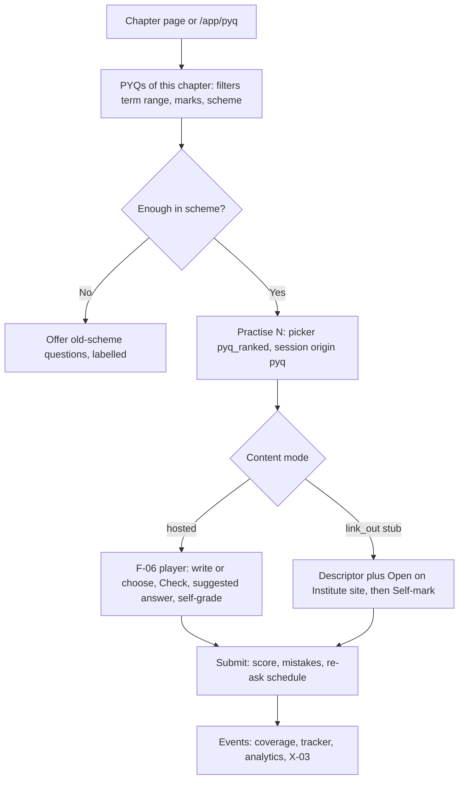
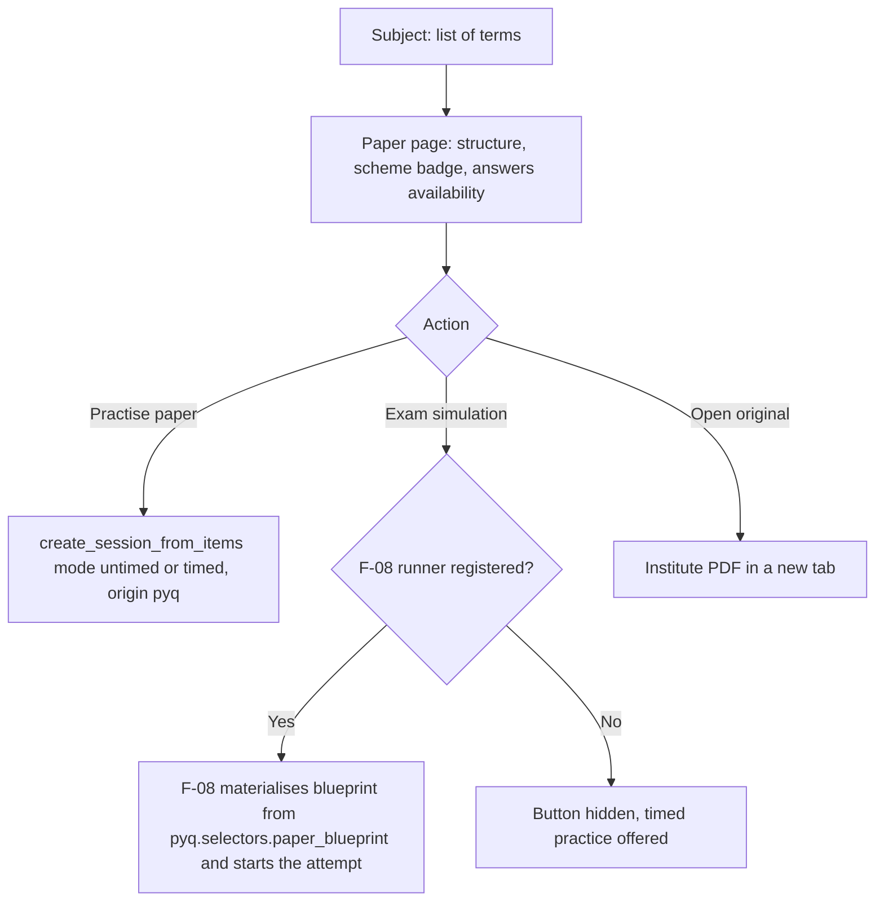
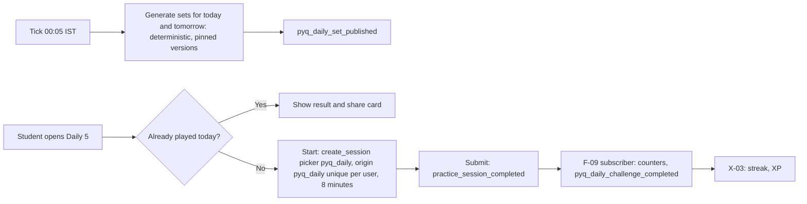

# PRD: F-09 Previous Year Questions (PYQ)

| Field | Value |
| --- | --- |
| Status | Draft (for founder review) |
| Owner | Pawan (founder) |
| Last updated | 2026-10-05 |
| Source | `docs/product/FEATURE_MAP.md` section F-09 (item 11 and page 6: "10 to 15 years of papers, term-wise, questions with suggested answer, practice mode, gamified version like LinkedIn games") and its `[ADD]` items (browse by chapter, marks and frequency; "asked N times" and last asked term from F-11; daily 5-question challenge; spaced re-ask of wrong ones; old-scheme flag), section 5 X-03, section 7 risks 1 and 2 |
| Linked ERD | `docs/product/erd/F-09-previous-year-questions.md` |
| Role | **Past-paper layer over F-06.** F-09 owns what a past paper *is* (paper, term, scheme, question numbering, marks, sub-parts, choice rules, where the Institute's suggested answer lives) and the PYQ-specific experience (browse, practise, re-ask, daily challenge hooks, hand-off to a full simulation). It owns **no question, option, attempt, score or file table**: every PYQ is an F-06 question labelled `source_kind = institute_pyq`, every attempt an F-06 `practice_session`. Frequency statistics belong to [F-11](./F-11-paper-analysis-and-recommendations.md) and are only cached here |
| Modules | API `apps/api/modules/pyq` (seven tables); web `apps/web/src/modules/pyq`. Separate from `questionbank` because paper and term structure, answer provenance and the daily set are PYQ-only and must be switchable by their own flags |
| Feature flags | `pyq_bank` (browse, practise, public pages), `pyq_daily` (daily challenge hooks). Server checked, 403 `feature_disabled`. Both also need `question_bank`. Permission scopes: `pyq.read` (student), `pyq.manage_papers` (editor), `pyq.admin` (admin: daily regenerate, hosted switch) |
| Depends on | F-06 (questions, sessions, scoring, events), F-02 (taxonomy, schemes, chapter maps, terms), X-04 (provenance, licence tiers) |
| Siblings | [F-05 MCQ Bank](./F-05-mcq-bank.md), [F-08 Mock tests](./F-08-mock-tests-and-mtp.md) (strict simulation, MTP/RTP papers), [F-11 Paper analysis](./F-11-paper-analysis-and-recommendations.md) (statistics), [F-12 Study material](./F-12-institute-study-material.md), [F-04 Super 50](./F-04-super-50-questions.md), [F-14 Amendments](./F-14-amendments.md), X-03 Gamification `[PROPOSED]` |

---

## 1. Problem and goal

Every serious CA, CS or CMA student does past papers, and every one of them does it badly: papers are PDFs on three different Institute sites, the suggested answers are separate PDFs (published by ICAI and ICMAI, "answer guidelines" by ICSI `[VERIFY]`), nothing says which chapter a question belongs to, nothing says how often a topic comes, and the syllabus has changed under the paper (CA Intermediate and Final moved to a new scheme with the first Final exam in May 2024 and the last old-scheme attempt in November 2023, so only about seven sittings exist under the current CA scheme). Exam terms are not even "May and November" any more: ICAI now holds Foundation, Intermediate and Final three times a year (January, May, September) while CS and CMA use June and December.

**Goal, in four parts:**

1. **A term-wise paper library with structure.** For every level and paper, every sitting we can lawfully show, with its scheme, duration, marks, question numbers, sub-parts, compulsory and choice rules, and where the Institute's suggested answer lives. Target: 10 to 15 years (phased, section 13) with an honest **old-scheme flag** per paper and per question.
2. **Practise past questions the way a student thinks.** By chapter ("all PYQs of GST ITC, last 5 terms"), by marks, by term, by frequency (from F-11), as a whole paper, as a timed paper or as a full exam simulation (hand-off to F-08), always with self-marking against the suggested answer and the F-06 mistake log and spaced re-ask of the ones she got wrong.
3. **A daily habit.** A fair daily 5-question challenge (same questions for everyone in a level, once a day, timed) built on the F-06 session model, with a share card; F-09 supplies the picker, the stored set and the events, X-03 owns streaks, XP and leaderboards.
4. **Lawful by construction.** Institute papers and answers are copyrighted (ICAI requires prior written permission to reproduce; ICMAI reserves copyright of its suggested answers). Each paper carries a delivery mode: `link_out` (default: structure, chapter mapping, marks, our own one-line descriptors and a deep link to the Institute's PDF) or `hosted` (question text and answers in the app, only with written permission or when the solution is our own original work). The product is useful on day one without hosting a single Institute sentence, and richer the day a licence arrives.

Out of scope here: the question and attempt model (F-06), the exam engine (F-08), statistics and priority scores (F-11), streaks and XP (X-03), AI evaluation (F-07).

## 2. Users and scenarios

**Aarav, CA Intermediate, May attempt in 40 days.** He opens the chapter "GST: Input Tax Credit" and taps "PYQs". The list says "7 questions in the last 7 terms (new scheme)" and every row shows the term, number and marks ("Sep 2025, Q.4(b), 5 marks"), a badge "Asked 4 times, last Sep 2025" (from F-11, with its scope stated) and his own status. He practises 5, opens the Institute's suggested answer from a link at the right page, marks himself 3/5, and the three he got wrong are scheduled to come back in 1, 3 and 7 days.

**Priya, CMA Final, "old paper" worry.** She browses Paper 14, December 2019. The banner says "Old syllabus (2016 scheme). 9 of 14 questions map to chapters that still exist; 5 do not." The old ones are hidden by default and one tap shows them. Each question tells her where it maps in the current chapters.

**Kabir, CS Executive, commuting.** At 8:10 he opens "Daily 5". Five questions, 8 minutes, no negative marking. He scores 4/5, sees "Only 31% got Q3 right", and shares a result card on WhatsApp that previews as "Kabir scored 4/5 on today's CS Executive challenge". The streak counter on the page is X-03's; this page only knows he finished.

**Staff: Meera, editor.** She imports ICAI's May 2026 Taxation paper from a CSV (`artha.paper.v1`): 6 numbered questions, 21 sub-parts, marks, the choice rule "answer any 4 of Q2 to Q6", the chapter of each part (suggested by AI, confirmed by her), the link to the Institute PDF and the page of each suggested answer. The paper cannot be published until every part is mapped and the licence mode is set.

## 3. Success metrics

Starting hypotheses, calibrated after the first 100 active students.

| Metric | Definition | Target | Event(s) |
| --- | --- | --- | --- |
| First PYQ | Students who practise or mark a PYQ within 7 days of enrolling in an attempt | 45% | `pyq_practice_started` |
| Chapter reach | Share of PYQ sessions started from a chapter page or chapter list | 60% | `pyq_practice_started` (`from`) |
| Answer use | PYQ sessions where the suggested answer is opened or self-grade is completed | 70% | `pyq_answer_opened`, `longform_self_graded` |
| Re-ask completion | Due PYQ re-asks answered within 2 days of becoming due | 50% | `pyq_reask_started` |
| Coverage of library | Published papers divided by papers released for the student's level in the last 5 years | 90% in the launch course | server count |
| Answer availability | Published papers with `answers_status = complete` | 85% | server count |
| Mapping quality | Published questions with a confirmed chapter mapping (not AI-only) | 98% | server count |
| Link health | Link-out URLs checked `ok` in the last 7 days | 98% | link-check job |
| Old-scheme clarity | Support contacts mentioning "wrong syllabus" per 1,000 sessions | under 2 | support tags |
| Daily challenge reach | Weekly active students who play at least 3 of 7 days | 20% | `pyq_daily_started` |
| Daily completion | Daily sessions started that are submitted | 90% | `pyq_daily_completed` |
| Share rate | Daily completions that open the share sheet | 8% | `pyq_daily_shared` |
| Latency | Chapter PYQ list p95 (uncached) | under 300 ms; CDN hit under 80 ms | server metrics |
| Pool health | Levels whose daily pool exceeds 60 eligible questions | 100% before `pyq_daily` opens | admin report |

## 4. Scope

### 4.1 In scope

**R1: Library and practice (about 4 weeks after F-06 R1)**

1. Paper catalogue by level, paper and term; paper page with structure (numbering, sub-parts, marks, choice groups), scheme badge, source link and answer availability.
2. Editor import (`artha.paper.v1` JSON or CSV), chapter mapping through F-06 `set_mapping`, publish checks, link health, Django admin for papers and links.
3. Browse by chapter, marks band, term range, kind and scheme relation; old-scheme flag at paper and question level.
4. Practice: by chapter (F-06 `filter` picker), a paper (`create_session_from_items`, untimed or timed to the paper's duration), self-marking, attempted and revise-later (F-06 state), mistake log.
5. Delivery tiers: `link_out` default, `hosted` for original solutions and licensed content.
6. Public SEO pages: subject index, term page, chapter page.

**R2: Insight, re-ask, simulation**

7. "Asked N times" and last-asked chips, sort by frequency (cache of F-11 `asked_summary`); F-11 paper source registration.
8. Spaced re-ask hub card and queue (needs F-06 R3 `due_for_review`; fallback "wrong last time").
9. Hand-off to F-08 for the full exam simulation (`register_paper_runner`).
10. "Law as of" notes and F-14 amendment annotations; F-04 "in Super 50" badge.

**R3: Daily challenge and depth**

11. Daily 5 challenge hooks: stored deterministic set, picker, origin, events, result card; archive.
12. Legacy years (10 to 15) with chapter-map review queue; offline term packs for hosted content.

### 4.2 Out of scope (and who owns it)

| Concern | Owner | Note |
| --- | --- | --- |
| Question model, versions, options, keys, rubrics, reports, moderation, duplicates | F-06 | F-09 calls `questionbank.selectors` and `services` (including `upsert_from_source`) |
| Session lifecycle, answers, scoring, negative marking, mistake reasons, bookmarks, spaced-repetition box | F-06 `practice` | F-09 launches sessions and links to the F-06 player and review |
| Strict exam simulation: reading time, section clocks, choice-rule resolution, auto-submit, percentile | F-08 | F-09 hands over a paper blueprint; it never uses mode `exam` itself |
| Marks-to-chapter allocation statistics, "asked N times", priority score, "if you have N days" | F-11 | F-09 caches `asked_summary` and links to F-11 pages |
| Streaks, XP, badges, leaderboards, friends | X-03 `[PROPOSED]` | F-09 emits events and provides a picker; it owns no gamification state |
| MCQ practice by chapter from the Institute and platform | F-05 | PYQ MCQs are also visible there with a "Past paper" chip |
| MTP and RTP papers | F-08 | They carry `institute_mtp` / `institute_rtp` source kinds and appear in F-09 chapter lists only through filters the student chooses |
| Fetching, scraping, extraction, review queue | X-04 | F-09 registers a publisher for exam papers `[PROPOSED]` |
| AI evaluation of written answers | F-07 | Self-marking in R1 |

## 5. User flows

### 5.1 Practise a chapter's past questions (the aha flow)



### 5.2 Paper page and hand-off



### 5.3 Daily challenge (R3)



### 5.4 Edge cases (designed and tested)

| Case | Behaviour |
| --- | --- |
| Paper has questions but no hosted text (link-out) | Structure, marks, mapping, descriptors and the Open original link show; practise offers self-marking stubs; MCQ items show only "Open on Institute site" (options are not hosted) |
| Suggested answer missing for a term | Paper chip "Answers: none"; per question "No suggested answer published"; self-grade uses our reference note only when `platform_original`; never a made-up answer |
| Old-scheme paper | Banner with counts; out-of-scheme questions hidden by default in chapter lists; the mapping to the current chapter is shown when a chapter map exists |
| Same term has two schemes (transition sittings) | Two papers for the same term and subject, distinguished by `scheme_code`; the student's scheme is preselected |
| Term label per Institute | Labels derive from `term_code`; Jan, May, Sep (CA from 2025), Jun, Dec (CS, CMA), May, Nov (older CA); nothing assumes two sittings a year |
| Medium (English, Hindi) | One paper row per medium; English first; Hindi rows are R3 |
| Question taken down | The row stays with "Removed" (rights); counts and daily pools refresh; open sessions finish |
| Link to Institute breaks | Link-check marks `failing` then `broken`; the Open button hides; structure remains |
| Daily set cannot be generated (pool too small) | `pool_too_small` flag; the card hides; X-03 may fall back to another source |
| Second daily attempt | F-06 origin uniqueness returns 409 `already_played` with the finished session, never a second score |
| Timezone | The day is `Asia/Kolkata`; `local_date` of the set decides, not the device clock |
| Offline | Library pages cached 24 hours; a loaded session continues through the F-06 queue; the daily challenge needs a connection to start |

## 6. Functional requirements

IDs are `FR-F09-nn`.

### A. Papers, terms and structure

| ID | Requirement | Priority | Acceptance criteria |
| --- | --- | --- | --- |
| FR-F09-01 | `[NOTE]` Paper catalogue by course, level, paper (subject) and term, newest first, 10 to 15 years as content allows (phases in 13) | P0 R1 | Given CA Intermediate Taxation, then `/app/pyq/taxation` lists every published term with scheme, marks and answer availability |
| FR-F09-02 | `[NOTE]` Term-wise model: `term_code` (`YYYY-MM`), label derived ("Sep 2025"), exam date optional; no assumption of two sittings a year | P0 R1 | Given terms 2025-01, 2025-05 and 2025-09 for CA, then three papers show for the year in that order |
| FR-F09-03 | Paper page: title, term, scheme badge, duration, total marks, sections, source link, answers availability, legislation note, question list | P0 R1 | Given a published paper, then every field is present or explicitly "Not stated" |
| FR-F09-04 | Question numbering with sub-parts (Q.4, Q.4(b), Q.4(b)(ii)), marks per part and per question, grouped under the parent number with a subtotal | P0 R1 | Given Q.2 with parts (a) 5, (b) 5, (c) 4, then the page shows Q.2 14 marks and three rows |
| FR-F09-05 | Compulsory and choice rules shown as text and data ("Q.1 compulsory", "Answer any 4 of Q.2 to Q.6", "Either (a) or (b)") | P0 R1 | Given a choice group, then the label, pick count and members show; practice mode does not enforce it (F-08 does) |
| FR-F09-06 | `[ADD]` Old-scheme flag: paper `syllabus_status` (`current`, `old_scheme`, `unmapped`) and question `scheme_relation` (`current`, `mapped`, `changed`, `out_of_scheme`, `unmapped`) computed from F-02 schemes and chapter maps; recomputed when a scheme is published | P0 R1 | Given a 2019 paper and a chapter that was removed in the current scheme, then the question is `out_of_scheme` and hidden by default; given a chapter mapped `same`, then `mapped` and shown with its new chapter |
| FR-F09-07 | `[NEW]` "Law as of" note: paper-level text such as "Law as applicable to the May 2025 attempt `[VERIFY]`", plus F-14 annotation chips when an amendment affects the question | P1 R2 | Given a Taxation paper from 2022 and an amendment affecting a question, then the chip "Affected by an amendment" shows with a link |

### B. Questions and suggested answers

| ID | Requirement | Priority | Acceptance criteria |
| --- | --- | --- | --- |
| FR-F09-08 | `[NOTE]` Suggested answers: per paper `answers_status` (`none`, `partial`, `complete`) and per question `answer_source` (`icai_suggested`, `icmai_suggested`, `icsi_guidelines`, `platform_original`, `licensed`, `none`) and a page hint; the Institute's disclaimer is shown with every suggested answer | P0 R1 | Given a question with an ICAI source, then the answer area states "Suggested answer by ICAI. Indicative, not the marking scheme" and the page hint "p. 7" |
| FR-F09-09 | Delivery tiers per paper: `link_out` (default) and `hosted`. Hosted requires either original solutions (`platform_original`) or a recorded permission reference and F-06 `rights_status` of `licensed` or `institute_material`; checked at publish | P0 R1 | Given a hosted paper with one `unknown` question, then publish fails listing the ids |
| FR-F09-10 | Link-out answers and papers: deep link with page hint, opens in a new tab (`rel="noopener noreferrer"`), host allow-listed, health checked daily | P0 R1 | Given a broken link, then it shows "This link no longer works" and the Open button is hidden within one check cycle |
| FR-F09-11 | Answers are revealed after the student's attempt or self-mark by the F-06 feedback policy (`instant` in untimed, `at_end` in timed); never in the question list | P0 R1 | Given a timed paper session, then no response before submit contains answer text |

### C. Practice

| ID | Requirement | Priority | Acceptance criteria |
| --- | --- | --- | --- |
| FR-F09-12 | `[NOTE]` Practice mode by chapter: "Practise PYQs of this chapter" with filters (term range, marks band, kind, scheme relation, my status); picker `pyq_ranked` orders by frequency when F-11 data exists, else newest first | P0 R1 | Given 12 in-scheme PYQs in a chapter and "Practise 5", then 5 are chosen in rank order and the session origin is `pyq` |
| FR-F09-13 | Practise a paper: all, one section, one question number, or only unattempted; untimed, or timed with the paper's duration; F-06 `create_session_from_items` with the printed marks | P0 R1 | Given a 100-mark, 3-hour paper, then "Timed" sets 10,800 seconds and item marks equal the paper's marks |
| FR-F09-14 | Self-marking of written answers against the suggested answer (F-06 self-grade; one "self-assessed" step when no rubric exists); marks labelled "self-assessed" | P0 R1 | Given a stub question worth 5, then the student enters 0 to 5, saves, and the session score is provisional until all are marked |
| FR-F09-15 | `[NOTE]` Mark attempted, correct, revise later: attempted and correct come from F-06 state; "revise later" is the F-06 bookmark | P0 R1 | Given a bookmark, then the question appears in `/app/practice/bookmarks` and with a "Revise later" chip in PYQ lists |
| FR-F09-16 | Exam simulation hand-off: if F-08 registered a paper runner, the paper page shows "Exam simulation" and F-08 builds the blueprint through `pyq.selectors.paper_blueprint(paper_id)` | P1 R2 | Given the runner registered, then one tap starts an F-08 attempt with sections, choice groups, marks and duration equal to the paper; given none, the button is absent |

### D. Browse

| ID | Requirement | Priority | Acceptance criteria |
| --- | --- | --- | --- |
| FR-F09-17 | `[ADD]` Browse by chapter (stable keys in URLs), by marks band (up to 2, 3 to 5, 6 to 10, 11 and above), by term range, by kind; filters in the URL | P0 R1 | Given `?marks=6-10&from=2024-05`, then a reload and another device show the same list |
| FR-F09-18 | `[ADD]` Frequency: "Asked N times" badge, last asked term chip and sort by frequency come from F-11 `asked_summary`, cached in `pyq_askedcache`; the label states the scope (question cluster, topic or chapter) and window ("in 4 of the last 8 sittings"); never shown when the window is under 3 sittings or F-11 is off | P1 R2 | Given a cached summary `scope=topic, asked 4 of 8`, then the chip says "This topic appeared in 4 of the last 8 sittings"; given F-11 off, then no chip and the frequency sort is hidden |
| FR-F09-19 | `[NEW]` "Where this chapter appeared": per-term list of questions with marks for a chapter (facts from our papers, no statistics) | P0 R1 | Given a chapter, then the page lists term, number and marks in descending term order |
| FR-F09-20 | `[NEW]` "Seen before" on a question: other papers (including MTP and RTP through `mocktest.selectors.papers_containing_question`) that contain the same question | P2 R3 | Given a question in two papers, then both are listed |

### E. Spaced re-ask

| ID | Requirement | Priority | Acceptance criteria |
| --- | --- | --- | --- |
| FR-F09-21 | `[ADD]` Re-ask queue: wrong PYQs scheduled by F-06 (box 1, 3, 7, 21 days); the PYQ hub shows "N due today" and starts a session with `personal=due` and `source_kinds=[institute_pyq]` | P1 R2 | Given a wrong answer today, then it is due tomorrow; two correct reviews in a row move it up a box (F-06 behaviour) |
| FR-F09-22 | Fallback before F-06 R3: "Wrong last time" queue ordered oldest first, with the label "Revise wrong" | P1 R2 | Given F-06 due is unavailable, then the card reads "Wrong last time (8)" and starts those |

### F. Gamified daily challenge hooks (X-03 `[PROPOSED]`)

| ID | Requirement | Priority | Acceptance criteria |
| --- | --- | --- | --- |
| FR-F09-23 | `[ADD]` Daily set: for each level and local date, 5 auto-gradable questions (choice kinds) chosen deterministically from the hosted PYQ pool with a difficulty mix (about 1 easy, 3 medium, 1 hard), no repeat within 60 days, versions pinned, generated two days ahead, immutable once live | P1 R3 | Given the same seed and pool, then two generations produce identical sets; given a live set, then it cannot change except by an audited admin replacement |
| FR-F09-24 | Picker `pyq_daily` and origin `pyq_daily` (`unique_per_user`, `origin_ref = {level}:{date}`), mode `timed`, 8 minutes (5 x about 90 seconds), `practice` scoring profile, feedback `at_end` | P1 R3 | Given a second start on the same day, then 409 `already_played` returns the finished session |
| FR-F09-25 | Events: `pyq_daily_set_published` and `pyq_daily_challenge_completed` (score, seconds, perfect) for X-03; F-09 holds no streak or XP | P1 R3 | Given a completed daily session, then exactly one completion event exists (idempotent on replay) |
| FR-F09-26 | Result page and share card: score, time, "x% got this right" per question; HMAC-signed share URL, `noindex`, OG image; display name only when the student opts in | P2 R3 | Given a share URL with a tampered score, then it returns 404; given a valid one, the preview shows score and level only |
| FR-F09-27 | Pool guard: a level needs at least 60 eligible hosted questions; otherwise `pool_too_small` and no set | P1 R3 | Given 40 eligible questions, then the daily card is hidden and the admin report shows the shortfall |
| FR-F09-28 | Archive: replay a past day without X-03 credit (event carries `archive: true`) | P2 R3 | Given yesterday's set, then Play archive works and the event is flagged |

### G. Platform

| ID | Requirement | Priority | Acceptance criteria |
| --- | --- | --- | --- |
| FR-F09-29 | Public SEO pages: `/courses/$course/$level/$subject/previous-year-questions` (terms and availability), `.../$term` (paper page facts), chapter page ("PYQs of this chapter": per-term list) | P1 R1 | Given a subject with at least 3 published papers, then the page is server-rendered with `buildHead`, canonical URL, BreadcrumbList; fewer papers means `noindex` |
| FR-F09-30 | Editor import: `artha.paper.v1` JSON or CSV, idempotent on `external_ref`, creates or updates F-06 questions through `upsert_from_source` and paper rows in one job; AI chapter suggestions through F-06 `questionbank.remap`, human confirmed | P0 R1 | Given the same file imported twice, then the second import reports 0 created, 0 changed |
| FR-F09-31 | Publish checks: every part mapped (confirmed), marks sum equals stated total (or a recorded difference), choice groups valid, delivery rules, link present, scheme set | P0 R1 | Given a missing mapping, then publish returns `checks_failed` with the part labels |
| FR-F09-32 | F-11 integration: register the paper source `pyq` (`get_paper`, `list_papers`) and consume `paperanalysis_stats_refreshed` to refresh the cache | P1 R2 | Given F-11 asks `get_paper(origin_ref)`, then it receives items with marks, section, choice group and `question_id` |
| FR-F09-33 | Takedown and withdrawal: `question_taken_down` marks the paper row unavailable and refreshes counts within 15 minutes; a paper can be withdrawn by an editor with a reason | P0 R1 | Given a takedown, then the question shows "Removed" and the paper counts drop |
| FR-F09-34 | Flags and quotas: `pyq_bank` and `pyq_daily` on every endpoint (403 `feature_disabled`); shares 20 per hour | P0 R1 | Given the flag off, then every endpoint answers 403 (parametrised test) |
| FR-F09-35 | F-09 stores no student data of its own (all state is F-06); nothing to export or delete here, which a test asserts by checking every F-09 table has no `user_id` column | P0 R1 | Given the deletion hook, then F-09 is a no-op and the test passes |

---

## 7. Screens, URLs and design-system needs

### 7.1 Screens and URLs

Private screens are `noindex` under `/app`; public pages use `buildHead()` and JSON-LD `BreadcrumbList` only (no `Quiz` or `Question` markup, because answers are not shown publicly). Filters live in the query string (`?marks=6-10&from=2023-05&kind=case&scheme=current,mapped&sort=freq&status=unseen`).

| Screen | URL | Access | Notes |
| --- | --- | --- | --- |
| PYQ home | `/app/pyq` | student, `pyq_bank` | Daily card (flag), re-ask card, subjects of the student's level, recently opened papers |
| Subject | `/app/pyq/$subject` | student | Tabs: Terms, Chapters, Re-ask. `$subject` is the stable `subject_key` |
| Term list and paper page | `/app/pyq/$subject/terms/$term` | student | `$term` = `term_code` (`2025-05`). Structure, choice groups, source link, questions |
| Chapter PYQs | `/app/pyq/$subject/chapters/$chapter` | student | Where it appeared, filters, "Practise these" |
| Re-ask hub | `/app/pyq/reask` | student | Due today, wrong last time (fallback), by subject |
| Daily challenge | `/app/pyq/daily` | student, `pyq_daily` | Today's set, start or resume, yesterday result |
| Daily archive day | `/app/pyq/daily/$date` | student | `YYYY-MM-DD`, archive replay, no X-03 credit |
| Session player and review | F-06 routes | student | Origin chip "Past paper Sep 2025 Q.4" |
| Editor papers | `/app/admin/pyq/papers`, `/app/admin/pyq/papers/$id` | editor | Import, structure grid, mapping, publish checks, links |
| Editor daily and health | `/app/admin/pyq/daily`, `/app/admin/pyq/health` | admin | Pool size per level, regenerate, link health, scheme status |
| Public subject PYQ | `/courses/$course/$level/$subject/previous-year-questions` | public, indexable | Terms, availability, "what is in a past paper", CTA to sign up |
| Public term | `/courses/$course/$level/$subject/previous-year-questions/$term` | public, indexable | Paper facts only: structure, marks, chapters touched, official link |
| Public chapter | `/courses/$course/$level/$subject/chapters/$chapter/previous-year-questions` | public, indexable | Which terms asked it, marks per term (counts only, no question text) |
| Daily share | `/pyq/daily/share/$token` | public, `noindex` | Signed token card; OG image `/og/pyq/daily/$token` |

### 7.2 Wireframes (mobile first, 320 to 1280 px)

PYQ home (320 px):

```
+--------------------------------+
| Past papers            [Search]|
| CA Inter  v                    |
+--------------------------------+
| Daily 5  ·  8 min  ·  Fri 5 Oct|
| 4 of 5 yesterday  [ Play today ]|
+--------------------------------+
| Revise wrong        7 due today |
| [ Start 7 ]                     |
+--------------------------------+
| Subjects                        |
| [Taxation        8 terms  ###- ]|
| [Advanced Acctg  8 terms  ##-- ]|
| [Audit           7 terms  #--- ]|
+--------------------------------+
| Continue: Taxation May 2025 Q.4 |
+--------------------------------+
```

Paper page (768 px and up shows the meta panel at right; at 320 px it stacks above the list):

```
+--------------------------------------------------+
| < Taxation   May 2025   [Current scheme]         |
| 100 marks · 3 h · Answers: complete (ICAI link)  |
| Law as of: May 2025 attempt [VERIFY]             |
| [ Practise whole paper ] [ Timed 3h ] [ Exam sim ]|
+--------------------------------------------------+
| Q.1 compulsory (20)       Q.2 to Q.6: any 4 of 5 |
| Q.1(a) 5  GST ITC            [x] attempted  [bm] |
| Q.1(b) 5  TDS salary         [ ] unseen          |
| Q.4  (16)  Asked 4 times · last Nov 2024  [Open] |
| Source: ICAI paper PDF p.6  [Open in new tab]    |
+--------------------------------------------------+
```

Chapter page:

```
+--------------------------------------------------+
| GST: Input tax credit   (Taxation)               |
| Appeared in 6 of 8 terms · 31 questions          |
| Filters: [Last 5 terms v][Marks v][Kind v][Scheme v]|
| Sort: [Most asked v]            [ Practise 12 ]  |
+--------------------------------------------------+
| Nov 2024  Q.3(a)  5 marks  case   Asked 4x  [ ]  |
| May 2024  Q.2(b)  4 marks  theory Changed *      |
|  * Syllabus changed since: see mapped topic      |
+--------------------------------------------------+
```

### 7.3 UI states per screen

| Screen | First-time | Loading | Partial | Success | Error | Offline | Flag off | Quota | Long content |
| --- | --- | --- | --- | --- | --- | --- | --- | --- | --- |
| PYQ home | No level chosen: onboarding link to My Coverage; no papers: "Papers for your level arrive soon" with request button | Skeleton cards | Subjects without papers shown disabled with reason | Cards populated | Inline Alert with Retry; cached copy retained | Last cached home with "Offline" badge, Play and Start disabled | `EmptyState` "Past papers are not available for your account yet" | n/a | Subject list scrolls; names truncate with title text |
| Paper page | n/a | Skeleton header and rows | Mapping incomplete: chip "chapter pending"; answers partial: per-question badge | Structure and questions | Retry; 404 shows "Paper withdrawn" with replacement link when set | Cached paper (hosted only); link-out rows show "Needs internet" | As home | Session start 429 shows next-allowed time | 60+ parts virtualised, sticky section headers, per-question collapse |
| Chapter page | No papers mapped: "No past questions mapped yet, practise MCQs instead" with F-05 link | Skeleton | Frequency chips hidden (not zero) while F-11 stats are missing | List and counts | Retry | Cached last result | As home | As above | Cursor pagination, 20 per page |
| Re-ask hub | Nothing wrong yet: "Wrong answers will return here at day 1, 3, 7, 21" | Skeleton | Fallback "Revise wrong" label when F-06 `due_for_review` is off | Due count and start | Retry | Start disabled, queue count cached | As home | n/a | Group by subject, show first 5 |
| Daily | Set not yet generated or `pool_too_small`: "Today's challenge is being prepared" | Skeleton card | Resume banner with time left | Result with per-question percent | Retry; session conflict opens the existing session | Play disabled, explained | Card hidden | 429 on share: "Try again in N minutes" | Question text over 600 characters is excluded from the pool |
| Editor papers | No papers: Import button | Skeleton grid | Publish checks listed per failing part | Published badge | Import errors per row with downloadable report | n/a | 404 | n/a | Import capped at 500 parts per file |

### 7.4 Design-system components

Reused from `packages/design-system`: Button, Card, Badge, Tabs, Sheet, Dialog, Combobox, FilterChip, SegmentedControl, ProgressRing, Alert, Skeleton, EmptyState, StatTile, Toast, Tooltip, plus the F-06 player components (`QuestionCard`, `SessionHeader`). Icons only through `@artha/design-system` (Lucide: `FileText`, `CalendarDays`, `RotateCcw`, `ExternalLink`, `Flame` not used, X-03 owns it).

New in `packages/design-system` (showcase entries, four themes, contrast checked): `DotMeter` (5 to 10 dots showing how often something appeared, with a text alternative "asked 4 of the last 8 terms"), `TermChip` (term code with scheme state), `DailyScoreStrip` (five result cells with text labels, never colour only). New in F-05 and reused here: `SegmentedBar` if F-05 ships first.

App-specific (`apps/web/src/modules/pyq`): `PaperHeader`, `ChoiceGroupNote`, `QuestionPartRow`, `ChapterAppearanceList`, `SchemeBadge`, `AnswerSourceLink`, `ReaskCard`, `DailyCard`, `ShareCard`. Aha moments to instrument: first chapter practise from "Where this chapter appeared", first "Asked N times" tap, first re-ask completed, first daily completed.

---

## 8. Data and permissions

Columns and indexes are in the [ERD](../erd/F-09-previous-year-questions.md). Django is the only writer; Supabase Data API closed; RLS deny-by-default.

### 8.1 Entities at a glance

| Table | Purpose | Personal data |
| --- | --- | --- |
| `pyq_paper` | One sitting of one paper: term, scheme, marks, duration, delivery tier, answers status, source link | No |
| `pyq_paperquestion` | A numbered part of a paper pointing to an F-06 question, with marks, parent, choice group, scheme relation | No |
| `pyq_choicegroup` | Compulsory and "any N of M" rules | No |
| `pyq_paperlink` | Official URLs (paper, suggested answers, examiner remarks) with health status | No |
| `pyq_askedcache` | Cached F-11 `asked_summary` per question | No |
| `pyq_dailyset`, `pyq_dailysetitem` | The deterministic daily set per level and date, pinned versions | No |

No table has a `user_id`. All student state (attempts, bookmarks, boxes) is in F-06, so DPDP export and delete need nothing from F-09 (FR-F09-35).

### 8.2 Permission matrix

| Action | Anonymous | Student | Editor | Admin |
| --- | --- | --- | --- | --- |
| Public subject, term and chapter pages (facts only) | yes | yes | yes | yes |
| Browse papers, chapter lists, appearances, start sessions, daily | no | yes | yes | yes |
| Open public share card with a valid token | yes | yes | yes | yes |
| Import, edit structure, map chapters, attach links, publish | no | no | yes | yes |
| Withdraw a paper | no | no | yes (reason) | yes |
| Switch a paper to `hosted` | no | no | no | yes (needs permission reference or original solutions) |
| Regenerate daily set, recompute scheme status | no | no | no | yes |

### 8.3 Licensing posture (what we show)

| Source | Our default | Hosted only when |
| --- | --- | --- |
| ICAI papers and suggested answers | `link_out`: structure, marks, own-word descriptors, deep link. Suggested answers carry the Institute's disclaimer that they are guidance, not the only answer `[VERIFY wording]` | Written permission recorded as `permission_ref`, or original platform solutions |
| ICMAI papers and suggested answers | Same as ICAI | Same |
| ICSI papers and answer guidelines | Same as ICAI `[VERIFY availability]` | Same |
| Platform-written solutions | Hosted | Always, `rights_status = original` |
| Daily set | Only hosted choice questions | Pool needs at least 60 per level |

Our rule: never copy Institute question text into a public page. Public pages show counts, marks and chapter names only. Takedown follows F-06 (`question_taken_down`).

### 8.4 Privacy

No personal data stored. Share token carries only level, date, score, seconds and an optional display name the student opted into; it expires after 30 days. PostHog events carry ids, never question text.

---

## 9. API surface

Base `/api/v1/pyq/`. Cursor pagination (`?cursor=`, `limit` max 50), error envelope from `core/errors`, flag `pyq_bank` (and `pyq_daily` for daily routes) checked server side (403 `feature_disabled`). Writes that start sessions take an `Idempotency-Key` header. Stable keys (`subject_key`, `chapter_key`, `term_code`) in paths.

| Method and path | Purpose | Scope |
| --- | --- | --- |
| GET `home/` | Daily card state, re-ask counts, subjects for the student's level, continue item | `pyq.read` |
| GET `subjects/{subject_key}/terms/` | Terms with scheme badge, answers status, counts | `pyq.read` |
| GET `papers/{id}/` and `subjects/{subject_key}/terms/{term_code}/` | Paper page: structure, choice groups, links, parts with F-06 state overlay | `pyq.read` |
| GET `chapters/{subject_key}/{chapter_key}/questions/` | Filtered chapter list. Params: `from`, `to`, `marks`, `kind`, `scheme`, `status`, `sort=freq|recent|marks` | `pyq.read` |
| GET `questions/{question_id}/appearances/` | Other papers (and MTP/RTP via F-08) with the same question; frequency chip | `pyq.read` |
| POST `papers/{id}/sessions/` | Body: `scope` (`all|section|question|unattempted`), `mode` (`untimed|timed`), `part_ids`. Returns `session_id` | `pyq.read` |
| POST `chapters/{subject_key}/{chapter_key}/sessions/` | Practise a chapter with the same filters; picker `pyq_ranked` | `pyq.read` |
| GET `reask/summary/` and POST `reask/sessions/` | Due count by subject; start (F-06 `personal=due`) | `pyq.read` |
| GET `daily/today/` | Today's set status, session id, time left | `pyq.read` and `pyq_daily` |
| POST `daily/{set_id}/sessions/` | Start or resume (origin `pyq_daily`, unique per user) | same |
| GET `daily/{date}/result/` | Score, time, per-question percent right | same |
| POST `daily/{set_id}/share/` | Returns signed share URL (20 per hour) | same |
| GET `public/daily/share/{token}/` | Public card data (no auth) | none |
| GET `public/subjects/{course}/{level}/{subject}/`, `.../terms/{term}/`, `.../chapters/{chapter}/` | Public facts pages, CDN cacheable 1 h | none |
| POST `admin/papers/import/` | `artha.paper.v1` JSON or CSV; `dry_run=true` supported; idempotent on `external_ref` | `pyq.manage_papers` |
| GET, PATCH `admin/papers/{id}/`; POST `.../publish/`, `.../withdraw/` | Structure edit, publish checks, withdraw with reason | `pyq.manage_papers` |
| POST `admin/papers/{id}/links/`, GET `admin/link-health/` | Links and health | `pyq.manage_papers` |
| POST `admin/daily/regenerate/`, POST `admin/scheme-status/recompute/` | Admin operations | `pyq.admin` |

Throttles: `pyq_read` 300 per minute, `pyq_write` 60 per minute, `pyq_daily` 30 per minute, `pyq_share` 20 per hour. Versioned by path; additive changes only inside v1. Detail serializers carry `schema_version` for the paper import contract.

---

## 10. Analytics events and notifications

### 10.1 Product events (PostHog, `noun_verb`, no question text)

| Event | Properties |
| --- | --- |
| `pyq_home_viewed` | `level`, `has_daily`, `due_count` |
| `pyq_paper_opened` | `paper_id`, `term_code`, `scheme_status`, `delivery`, `from` (`list|search|continue|chapter`) |
| `pyq_chapter_opened` | `subject_key`, `chapter_key`, `filters_count` |
| `pyq_practice_started` | `scope`, `mode`, `count`, `from` (`paper|chapter|reask|daily`), `delivery` |
| `pyq_answer_opened` | `paper_id`, `answer_source`, `kind` (`hosted|link_out`) |
| `pyq_selfgrade_completed` | `marks_pct_band` |
| `pyq_sourcelink_clicked` | `paper_id`, `link_kind` |
| `pyq_reask_started` | `due_count`, `fallback` |
| `pyq_daily_started`, `pyq_daily_completed`, `pyq_daily_shared` | `level`, `score`, `seconds`, `archive` |
| `pyq_filter_changed` | `filter`, `value_band` |
| `pyq_import_completed` (editor) | `rows`, `errors`, `dry_run` |

### 10.2 Domain events

Emitted: `pyq_paper_published`, `pyq_paper_withdrawn`, `pyq_daily_set_published`, `pyq_daily_challenge_completed` (consumed by X-03 `[PROPOSED]`). Consumed: `practice_session_completed` (to emit the daily completion event when origin is `pyq_daily`), `question_version_live`, `question_taken_down`, `question_unpublished` (refresh paper availability and daily pool), `paperanalysis_stats_refreshed` and `paperanalysis_paper_published` (refresh `pyq_askedcache`), `syllabus_scheme_changed` `[PROPOSED: F-02]` (recompute scheme status).

### 10.3 Notifications (X-01 `[PROPOSED]`)

`notifications.services.notify(user_id, kind="pyq_daily_ready" | "pyq_reask_due", ...)`. F-09 only calls it when X-01 exists and the student opted in; default off in R3.

---

## 11. Non-functional requirements

| ID | Requirement | Target |
| --- | --- | --- |
| NFR-F09-01 | Chapter PYQ list p95 | under 300 ms uncached, under 80 ms from CDN for public pages |
| NFR-F09-02 | Paper page p95 (60 parts, with F-06 state overlay) | under 350 ms |
| NFR-F09-03 | Session start from a paper | under 600 ms p95, no N+1 (query count asserted in tests) |
| NFR-F09-04 | Accessibility | WCAG 2.2 AA; DotMeter, scheme badge and score strip never rely on colour; all rows reachable by keyboard; focus order follows question order |
| NFR-F09-05 | Responsive | 320 to 1280 px, no horizontal scroll; question tables collapse to stacked rows |
| NFR-F09-06 | Daily generation | deterministic, idempotent per level and date, finishes under 5 s, runs by Supabase cron 23:30 IST for the next day |
| NFR-F09-07 | Availability | Library readable from cache when F-11 is down (frequency chips hidden, not zero) |
| NFR-F09-08 | Link health | every link-out checked daily; broken link raises an editor alert within 24 h |
| NFR-F09-09 | Security | host allow-list for links; share token HMAC-SHA256, 30-day expiry; no student data in public endpoints; `rel="noopener noreferrer"` |
| NFR-F09-10 | Privacy | zero `user_id` columns; PostHog payloads without question text |
| NFR-F09-11 | Observability | Sentry on import and daily generation; metrics for pool size, link health, scheme status counts |
| NFR-F09-12 | Testing | Unit: choice-group resolution, part-tree marks sum, scheme relation, daily selection determinism. API: every endpoint and flag-off. Contract: F-06 `upsert_from_source`, F-11 paper source, F-08 blueprint. E2E: chapter practise, paper practise, re-ask, daily. A11y: axe on paper and chapter pages. Load: chapter list with 5,000 questions |

---

## 12. Risks and open questions

### 12.1 Risks

| ID | Risk | Mitigation |
| --- | --- | --- |
| R-F09-1 | Institute copyright: hosting question text or suggested answers without permission | `link_out` default, hosted only with `permission_ref`, takedown within 24 h, public pages show facts only |
| R-F09-2 | Old-scheme questions mislead students (CA new scheme has only a few sittings) | Visible scheme badge, `scheme_relation` per question, filter defaults to `current,mapped` |
| R-F09-3 | Wrong chapter mapping poisons frequency counts in F-11 | Confirmed mapping required to publish; review queue; F-11 reads confirmed only |
| R-F09-4 | Daily pool too small, leading to repeated or low quality sets | Pool guard (FR-F09-27), no set rather than a bad set |
| R-F09-5 | Link rot of Institute URLs | Daily link check, stored deep link plus fallback to the Institute portal |
| R-F09-6 | Overlap with F-08 on paper structure | Ownership rule in Q-F09-1, one blueprint function |

### 12.2 Open questions

| ID | Question | Recommended default | Decider |
| --- | --- | --- | --- |
| Q-F09-1 | Who owns past-paper structure, F-09 or F-08? | F-09 owns paper identity and structure; F-08 gets `paper_blueprint` and registers a runner. Reconcile with the F-08 author before slice 7 | Founder with F-08 owner |
| Q-F09-2 | Do we have written permission from ICAI, ICMAI or ICSI to host question text or suggested answers? | No; ship `link_out` and original platform solutions; request permission in parallel | Founder (legal) |
| Q-F09-3 | Daily challenge when the hosted pool is below 60 | Show nothing (no set) until the pool is ready; allow editors to add original MCQs tagged `daily_eligible` | Founder |
| Q-F09-4 | F-11 timing: ship "Asked N times" before F-11? | Hide frequency until F-11 `window_n` is at least 3; chapter appearance list (facts) ships in R1 | Founder with F-11 owner |
| Q-F09-5 | How many legacy years and which schemes to include | Last 5 sittings of the current scheme in R1, older ones in R3 behind the old-scheme flag | Founder |
| Q-F09-6 | Does X-03 count archive plays? | No credit; event carries `archive: true` | Founder with X-03 owner |
| Q-F09-7 | Show a display name on the share card? | Opt-in per share, default anonymous | Founder |
| Q-F09-8 | Add a F-02 selector `chapter_map_to_scheme` (old chapter to new scheme chapter)? | Yes, read only, owned by F-02; see ERD section 3.4 | F-02 owner |
| Q-F09-9 | ICSI and ICMAI answer availability rules (are suggested answers published for every sitting?) | Treat as `partial` until verified per sitting `[VERIFY]` | Editor lead |

---

## 13. Rollout

### 13.1 Flags and phases

| Phase | Flags | Audience | Exit criteria |
| --- | --- | --- | --- |
| R1 | `question_bank`, `pyq_bank` | Internal, then 10% of CA Inter students | 90% of last 5 sittings published, link health 98%, no open takedowns |
| R2 | `pyq_bank` plus F-11 and F-06 R3 | 50%, then all | Frequency chips live; re-ask completion at least 50% |
| R3 | `pyq_daily` | 10%, then all | Pool above 60 per level, 90% completion |

### 13.2 Slicing into PR-sized issues

| # | Slice | Independently shippable because |
| --- | --- | --- |
| 1 | Migrations 0001 for `pyq_paper`, `pyq_choicegroup`, `pyq_paperquestion`, `pyq_paperlink`; admin; flag plumbing | Dark, no routes |
| 2 | `artha.paper.v1` import service with dry run and publish checks, using F-06 `upsert_from_source` | Editors can load papers |
| 3 | Selectors and read API: terms, paper, chapter lists, appearances | Read-only endpoints behind flag |
| 4 | Web: PYQ home, subject terms, paper page (link-out) | Browse only |
| 5 | Practise paper and chapter sessions (`create_session_from_items`, picker `pyq_ranked`), self-grade step | Students can practise |
| 6 | Public pages and OG | SEO without app changes |
| 7 | Paper blueprint selector and F-08 runner registration | Needs F-08 slice; harmless otherwise |
| 8 | `pyq_askedcache`, `asked_summary` refresh, F-11 paper source registration, frequency chips | Needs F-11 |
| 9 | Scheme status job and old-scheme filter; F-02 selector | Content correctness |
| 10 | Link check job and admin health page | Operations |
| 11 | Re-ask hub (needs F-06 R3; fallback "Revise wrong") | Independent card |
| 12 | Daily set generator, picker, origin, API, web card | Behind `pyq_daily` |
| 13 | Result, signed share card, OG, events | Needs 12 |
| 14 | Archive and offline term packs (hosted only) | Polish |

---

## 14. Dependencies and interfaces

Siblings: [F-05 MCQ Bank](./F-05-mcq-bank.md) (shares the "Past paper" chip and F-06 extensions E-F06-1..4 in its ERD), [F-08 Mock tests](./F-08-mock-tests-and-mtp.md) (runner and blueprint), [F-11 Paper analysis](./F-11-paper-analysis-and-recommendations.md) (statistics), [F-12 Study material](./F-12-institute-study-material.md) (illustration items link to PYQs by chapter), [F-04 Super 50](./F-04-super-50-questions.md) ("In Super 50" badge), [F-14 Amendments](./F-14-amendments.md) (law-as-of notes), [F-06](./F-06-question-bank-system.md), [F-02](./F-02-syllabus-structure-and-coverage.md), [X-04](./X-04-ingestion-scraping-service.md).

### Provides

| Interface | Used by |
| --- | --- |
| `pyq.selectors.get_paper(paper_id)`, `list_papers(level, subject, from_term, to_term)` | F-11 (paper source `pyq`) |
| `pyq.selectors.paper_blueprint(paper_id)` and `pyq.registry.register_paper_runner(fn)` | F-08 |
| `pyq.selectors.papers_containing_question(question_id)` | F-05, F-04, F-12 chips |
| `pyq.selectors.appearances_for_chapter(chapter_id)` | F-11, F-12, F-13 |
| Pickers `pyq_ranked`, `pyq_paper`, `pyq_daily`; origins `pyq`, `pyq_daily` | F-06 |
| Events `pyq_paper_published`, `pyq_paper_withdrawn`, `pyq_daily_set_published`, `pyq_daily_challenge_completed` | F-11, X-03, F-13 |
| Today provider `pyq_daily`, `pyq_reask` `[PROPOSED: F-13]` | F-13 |

### Consumes

| Interface | Owner | Use |
| --- | --- | --- |
| `questionbank.services.upsert_from_source`, `selectors.search_ids`, `stats_for` (E-F06-2) | F-06 | Questions, p-values for daily difficulty |
| `practice.services.create_session`, `create_session_from_items`, `selectors.question_states`, `due_for_review` | F-06 | Sessions, state overlay, re-ask |
| `syllabus.selectors` (taxonomy, chaptermap), `chapter_map_to_scheme` `[PROPOSED: F-02]` | F-02 | Chapter keys, scheme relation |
| `paperanalysis.selectors.asked_summary` and events | F-11 | Frequency cache |
| `mocktest.selectors.papers_containing_question` | F-08 | Seen-before |
| Publisher plug-in for exam papers `[PROPOSED: X-04]` | X-04 | Source provenance |
| `notifications.services.notify` `[PROPOSED: X-01]` | X-01 | Optional reminders |

---

## Appendix A. Research notes and references

| # | Source | Finding | Changed the design |
| --- | --- | --- | --- |
| 1 | [ICAI BoS Knowledge Portal](https://icai.org/post/about-bos-knowledge-portal) | Past attempts' papers, suggested answers, MTPs and RTPs are published as PDFs with a copyright policy | Link-out with deep links is the default; we add structure and mapping, not copies |
| 2 | [ICAI copyright policy](https://icai.org/post/16585) | Reproduction needs prior written permission with acknowledgement | `hosted` tier requires `permission_ref`; takedown path |
| 3 | ICAI suggested answers page (post/10139, post/14913) `[VERIFY URL]` | Suggested answers are guidance and carry a disclaimer that other valid answers can earn marks | Answer label "Institute suggested answer, not the only way"; self-marking not auto-grading |
| 4 | [ICAI exam frequency (Business Standard)](https://business-standard.com/india-news/ca-final-exams-to-be-held-thrice-a-year-from-this-year-announces-icai-125032701286_1.html) | Exams moved to three sittings a year | `term_code` is `YYYY-MM`; never assume two sittings |
| 5 | [ICAI new scheme details (catestseries.org)](https://catestseries.org/blogs/icai-new-scheme-details) | Third-party: new scheme mixes about 30% objective and 70% subjective | Old-scheme flag; MCQ parts inside papers are first-class parts |
| 6 | ICMAI question papers and suggested answers pages `[VERIFY URL]` | Papers and suggested answers published per term | Same model for all three Institutes; `answer_source` enum |
| 7 | ICSI past papers and answer guidelines `[VERIFY]` | Availability unclear per sitting | `answers_status` partial by default; Q-F09-9 |
| 8 | Fortune on LinkedIn puzzle games `[VERIFY URL]` | Short daily puzzles with a shareable result drive habit | Daily 5 in 8 minutes, share card, no streak state owned here |
| 9 | [Roediger and Karpicke 2006](https://pubmed.ncbi.nlm.nih.gov/16507066/) | Testing improves retention more than restudy | Re-ask hub on the home screen; practice before reading answers |
| 10 | Market scan of PYQ products (catestseries.org and similar) `[VERIFY]` | Sold as chapter-wise PDFs or test series by paper and attempt | Chapter-wise practice with frequency and old-scheme clarity is the differentiator |
