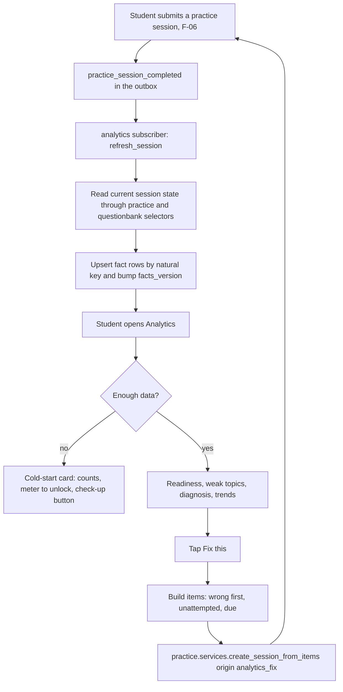
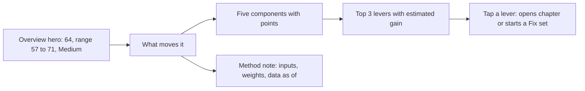
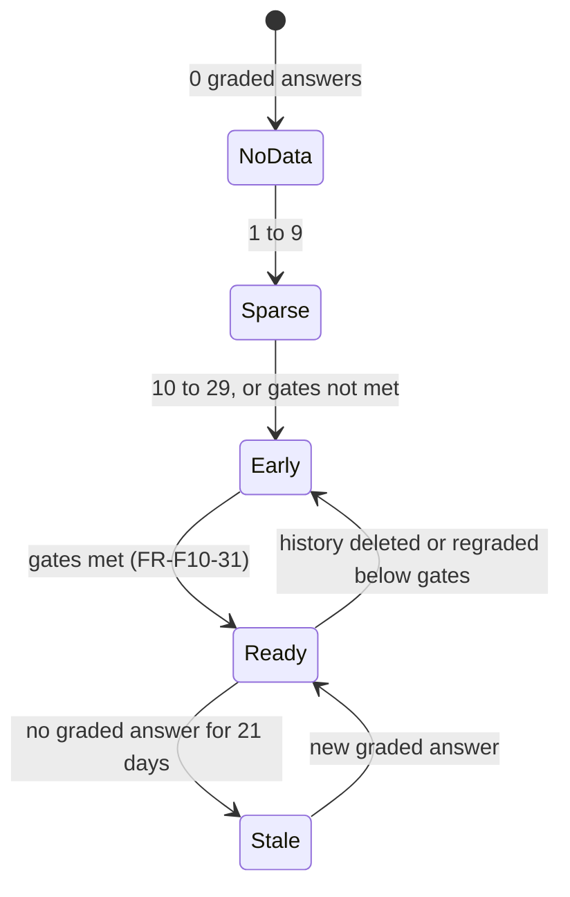

# PRD: F-10 Performance Analytics

| Field | Value |
| --- | --- |
| Status | Draft (for founder review) |
| Owner | Pawan (founder) |
| Last updated | 2026-10-05 |
| Source | `docs/product/FEATURE_MAP.md` section F-10 (items 7 and 8: "performance per week / day / month on coverage", "number of questions solved in each subject") and the `[ADD]` items under it |
| Linked ERD | `docs/product/erd/F-10-performance-analytics.md` |
| Role | **Read-model pointer.** Turns the attempts of F-06, the study time of F-01.2 and the coverage of F-02 into one honest picture of where a student stands and what to do next. Owns no questions, attempts or timers |
| Modules | API `apps/api/modules/analytics`; web `apps/web/src/modules/analytics`. Chart primitives go to `packages/design-system` |
| Feature flags | `performance_analytics` (everything except the items below), `performance_readiness` (readiness score), `analytics_reports` (PDF progress report, worker), `analytics_sharing` (share a report with a mentor or parent, P2). All server checked, 403 `feature_disabled` |
| Depends on | F-06 (`practice` events and selectors, `questionbank` labels), F-02 (taxonomy, coverage signals), F-01.2 (time, settings, goals), `core/events.py`, `core/jobs.py`, `media` |

---

## 1. Problem and goal

A CA, CS or CMA student solves hundreds of questions a month and still cannot answer four questions: "Where am I actually weak, in which chapter and which kind of question? Is it concepts, silly mistakes or time? Am I ready for this paper, and what would move that most? What should I practise in the next 20 minutes?" Test-series products show a score per test and a chapter-wise accuracy table (see Appendix A, item 1); few connect accuracy to the hours spent and the syllabus covered, and none we found explain why a readiness number moved.

**Goal, in three parts:**

1. **Show the truth about performance** by subject, chapter, topic, question type, difficulty and source, per day, week and month, with speed against a target and with the sample size always visible (a 3 of 4 is not "75%").
2. **Turn it into the next action**: a ranked weak-topics list whose "Fix this" button builds a practice set through F-06, a "high time, low score" diagnosis that tells a student when more hours are not the answer, and mistake patterns by reason (concept, silly, calculation, time, not read, forgot).
3. **Give a readiness score that can be trusted**: per subject and overall, computed by a published formula, with a confidence band, minimum-data rules (so we never show a misleading number on 12 answers), and an explanation of exactly what moves it. It is a practice-based indicator, not a predicted exam mark, and says so.

Everything here is **derived**. F-10 never captures a question, answer, timer or tick; it subscribes to events and reads other modules through their public selectors (the rule that F-06 ERD 3.7 sets for consumers). It can be wiped and rebuilt from F-06, F-01.2 and F-02 at any time (FR-F10-14).

## 2. Users and scenarios

**Aarav, CA Intermediate, six weeks before the exam, studies in the evening.**
He finished Taxation chapters on the syllabus map and practised MCQs for two weeks. He opens Analytics and sees "Taxation: 64 (range 57 to 71), Medium confidence" with a bar for each thing that makes up the score. "What moves it" says: "Practise GST: Input Tax Credit (4 answers so far, needs 15): up to +5. Revise Income from Salary (last touched 31 days ago): +3." He taps "Fix this" on the first weak topic, a 10-question set starts in one tap, and the next day the topic moved from "likely weak" to "needs more data".

**Neha, CS Executive, new to the app, 14 answers so far.**
She has done two short quizzes. The page does not show a readiness number or a ranking. It shows "14 answers, 9 correct" per subject with small-sample marks, a progress meter "Readiness appears at 30 answers in a subject", her coverage and study hours (which already exist), and one button: "10-question check-up across Company Law". After it, her first chapter map appears.

**Rohan, CMA Final, wants proof for his mentor.**
He spends 11 hours a week on Cost Audit and scores 48% there, while Strategic Financial Management gets 3 hours and scores 71%. The "time versus score" view flags Cost Audit chapters "high time, low score: try practice, not rereading". At month end he generates a PDF progress report (name included, mistake reasons excluded), downloads it in under a minute and sends it on WhatsApp. The report says when it was generated and how the numbers are computed.

## 3. Success metrics

Targets are hypotheses to calibrate after the first 100 users.

| Metric | Definition | Target | Event(s) |
| --- | --- | --- | --- |
| Analytics adoption | Weekly active practising students who open Analytics at least once | 50% | `analytics_viewed` |
| Fix-this conversion | Students who tap Fix this, among students shown a weak-topic list | 25% | `analytics_fix_started` / `weak_topics_viewed` |
| Fix-this follow-through | Sessions started by Fix this that are submitted | 70% | `analytics_fix_started`, `practice_session_submitted` (origin `analytics_fix`) |
| Measured improvement | Median accuracy change on a topic between the evidence before and the evidence after one fix set (min 5 answers each side) | +10 points | `analytics_topic_improved` (server, computed at refresh) |
| Cold-start activation | New students with 0 answers who start the check-up from the empty state and finish it | 40% | `analytics_checkup_started`, `analytics_checkup_finished` |
| Mistake tagging | Wrong answers with a reason after the "tag your mistakes" prompt | 30% (F-06 sets the same target) | `mistake_reason_set` (F-06), `analytics_mistake_prompt_shown` |
| Readiness trust | Students who open "What moves my score" after seeing a readiness number | 35% | `readiness_explained_opened` |
| Readiness validity (R3) | Rank correlation between readiness and the student's next exam-mode score in the same subject | at least 0.5 | offline analysis (F-08 data) |
| Report usage | Students who generate a PDF in their first month with 100 or more answers | 15% | `report_requested`, `report_downloaded` |
| Freshness | Completed sessions reflected in analytics within 2 minutes | 95% (99% within 15 minutes) | server metric `analytics_event_lag_seconds` |
| Speed | Overview endpoint p95 | under 400 ms (304 under 100 ms) | server metrics |

## 4. Scope

### In scope

**R1 (Insight)** flags `performance_analytics`, `performance_readiness` (beta label)

1. Event-fed read models (session facts, topic facts, mistake tags), idempotent, with backfill and reconcile (FR-F10-10 to 16).
2. Overview, subject and chapter drill-down: questions solved, accuracy, speed, coverage and time side by side (FR-F10-01 to 06).
3. Accuracy by subject, chapter, topic, question type, difficulty and source, with sample sizes and ranges (FR-F10-02).
4. Trends by day, week, month and since start; goal versus actual for questions and accuracy (FR-F10-07, 08).
5. Speed against target (FR-F10-05).
6. Weak topics with "Fix this" through `practice.services.create_session_from_items` (FR-F10-20 to 23).
7. "High time, low score" diagnosis (FR-F10-24).
8. Mistake patterns by reason, linking to the F-06 mistake list (FR-F10-25).
9. Readiness per subject and overall, explanation, confidence band, minimum-data rules, cold-start states (FR-F10-30 to 38).
10. Freshness indicator, offline read, all UI states, four themes, accessible charts (FR-F10-40 to 46).

**R2 (Share and sustain)** flags `analytics_reports`, `analytics_sharing`

11. PDF progress report built off-request by a worker job (FR-F10-50 to 53).
12. Share the frozen report with a mentor or parent by expiring link, with explicit consent (FR-F10-54, P2).
13. Nightly readiness snapshots, readiness history chart, reason-aware "Fix this", the 10-question check-up as a registered picker, difficulty-adjusted accuracy (needs F-06 R2 statistics), weekly summary events for X-01 (FR-F10-60 to 64).

**R3 (Intelligence)**

14. Per-skill knowledge tracing (BKT or Elo) and forgetting-curve retention calibrated with F-15 data, readiness validation against F-08 mock results, cohort percentile (opt-in), mentor live dashboard, exam-day projection with F-11 weights.

### Out of scope

| Item | Where |
| --- | --- |
| Capturing questions, attempts, long-form answers, bookmarks, mistake reasons | F-06 (this module reads them) |
| The mistake **list** and "Practise these" from it | F-06 `/app/practice/mistakes` (F-10 adds patterns and links to it, FR-F10-25) |
| Time capture, time reports, time goals | F-01.2 (`/app/tracker/reports`); F-10 reads and links, never copies |
| Syllabus ticks, revision schedule | F-02 |
| Evaluating long-form answers | F-07 |
| Exam-paper trends, marks per chapter per term, priority engine | F-11 (F-10 supplies the student's weakness to it) |
| Notifications and emails | X-01 (F-10 only emits events and marks `[PROPOSED: X-01]` calls) |
| Mentor accounts and dashboards | A later mentor-mode pointer; F-10 R2 shares a frozen snapshot only |
| Leaderboards and percentile ranks | X-03 / R3, opt-in |

## 5. User flows

### 5.1 From a finished session to the next action



### 5.2 Reading a readiness score



### 5.3 Data state of a subject (drives every card)



### 5.4 Edge cases (must be designed and tested)

| Case | Behaviour |
| --- | --- |
| Session finished at 23:50 IST | Counts on that IST day (session `local_date`, captured in the student's zone at creation). Weekly and monthly buckets use the tracker's `week_start`; the page states the time zone used (fixes the gap in F-01.2 AUD-007) |
| Session crosses midnight | Attributed to its creation `local_date`, the same rule as F-06's daily rollup, so totals reconcile (Q-F10-6) |
| Event delivered late or twice | Handler reads current state and upserts by natural key, so the result is the same. A late event for an old date changes only that date's facts |
| Regrade after a key fix | `practice_regraded` triggers a refresh of the listed sessions; a banner "2 sessions were rescored after a correction" shows once; past readiness snapshots are not rewritten |
| Question removed (takedown) | Removed items are excluded from counts; the session total shrinks; weekly reconcile detects drift |
| Student retakes wrong answers | Repeat attempts carry a lower evidence weight (default 0.5) so memorising answers does not inflate mastery; raw counts still show them |
| Self-assessed long-form marks | Excluded from accuracy and readiness by default (F-06 Q8); counted in a separate "self-assessed" column and in volume; a setting includes them with a label |
| AI-estimated marks (F-07, `estimate`) | Same as self-assessed until `final` |
| Student switches syllabus scheme | Reports group by stable subject and chapter keys; readiness uses the active enrolment's chapters; old facts keep their chapter ids and map by key |
| Elective papers | Overall readiness covers the papers the student actually takes (enrolment electives) |
| Chapters without marks weights (CA, CS today) | Equal chapter weights; the method note says "equal chapter weights (no official weights)"; F-11 weights plug in later |
| Student has data only in one paper | Subject card works; overall shows "1 of 6 papers" and no overall number |
| History deleted by the student | Facts for those sessions are removed by session key; readiness falls back to cold start if under the gates; past snapshots remain until the student deletes analytics data |
| Flag off, or a neighbour module off (tracker or coverage) | Card-level "not available" for that signal; the rest works; readiness drops the unavailable component and widens its band (FR-F10-33) |
| Offline | Last successful responses are shown with "Saved data from 4:12 pm"; Fix this and Generate report are disabled with the reason |
| Very large history | Mastery looks back 180 days (weights beyond are under 6%); trends and totals use all history through one grouped query |
| Student under 18 or age unknown | Sharing is off (Q-F10-3); the student's own analytics are unaffected |

## 6. Functional requirements

Priority: P0 must ship in its release, P1 should, P2 can follow. `[NOTE]` = written on the founder's pages, `[ADD]` = proposed in the feature map and kept, `[NEW]` = added by this document. "Answer" below means a graded answer (correct, incorrect or partial) unless stated. Formulas are in section 6.1.

### A. Performance views

| ID | Requirement | Priority | Acceptance criteria |
| --- | --- | --- | --- |
| FR-F10-01 | `[NOTE]` Questions solved per subject, for any range: answered, correct, incorrect, partial, skipped, with per-subject totals and the overall total | P0 (R1) | Given 40 answers in Taxation and 25 in Law between 1 and 7 Oct, when the range is that week, then the subject list shows 40 and 25, total 65, and the totals equal the sum of F-06 `practice.selectors.accuracy` for the same range |
| FR-F10-02 | `[ADD]` Accuracy by subject, chapter, topic, question type (kind), difficulty (1 to 5, plus "unrated") and source (`source_kind`), each row showing answered, accuracy, a range for small samples and a "low sample" badge under 10 answers | P0 (R1) | Given a chapter with 7 of 10 correct, then the row shows "70% (7 of 10)" with an 80% range of 50 to 84 and a low-sample badge; given 7 of 100, no badge and a range of about 63 to 77 |
| FR-F10-03 | `[NOTE]` Performance per day, week and month "on coverage": the practice volume and accuracy series next to the coverage movement for the same buckets (coverage from F-02 snapshots, FR-F10-64) | P1 (R1 volume and accuracy, R2 coverage line) | Given the weekly grouping, then each bar shows answers and the line shows accuracy; hovering a week shows both and the chapters touched |
| FR-F10-04 | `[ADD]` Filters in the URL: range, subject, chapter, kind, difficulty, source, mode (practice or exam), include self-assessed | P0 (R1) | Given `?by=chapter&subject=taxation&kind=mcq_single&from=2026-09-01`, then reloading or sharing the link shows the same table |
| FR-F10-05 | `[ADD]` Speed: average time per answer against the target, per subject and per kind, with "fast and wrong" (under 0.5 of target and below the accuracy target) and "slow and right" flags | P0 (R1) | Given 40 timed answers at 90 s average with a 60 s target, then the subject shows "1.5 x target"; given an average of 25 s with 45% accuracy, then "fast and wrong" shows |
| FR-F10-06 | Subject and chapter drill-down pages combine for each chapter: coverage percent (F-02), hours (F-01.2), answers, accuracy, mastery, readiness contribution | P0 (R1) | Given Taxation, then every chapter row shows all six values or "no data" for the missing ones, never zero for missing |
| FR-F10-07 | `[ADD]` Trends daily, weekly, monthly and since start for answered, accuracy, time per answer and exam-mode score percent, with "compare with previous period" | P0 (R1) | Given range 30 days and group week, then up to 5 points; compare adds a muted previous-period series; points with fewer than 10 answers are drawn hollow |
| FR-F10-08 | `[ADD]` Goal versus actual: optional goals for questions per day or week and accuracy per subject (own table), plus the F-01.2 time goal shown read-only | P1 (R1) | Given a weekly goal of 150 questions and 90 done on Thursday, then "behind pace by 20" using the F-01.2 linear pace rule (days completed before today); time goals link to the tracker |

### B. Read models and data correctness

| ID | Requirement | Priority | Acceptance criteria |
| --- | --- | --- | --- |
| FR-F10-10 | Subscribe to `practice_session_completed` and `practice_regraded` (and the proposed `practice_session_deleted` and `practice_mistake_tagged`, section 14) through `register_subscriber`; each delivery refreshes one session | P0 (R1) | Given a submitted session, when the event is delivered, then facts for that session exist and `analytics_userstate.facts_version` increased once |
| FR-F10-11 | Idempotent and convergent: processing the same event twice, or events in any order, gives identical rows. The handler reads the **current** session state and upserts by natural key; a content hash makes an unchanged refresh a no-op | P0 (R1) | Given 3 deliveries of one event in random order with a regrade between, then the final rows equal those from one delivery after the regrade, and the second and third refreshes write nothing |
| FR-F10-12 | No delete-then-insert rebuilds of a student's data. A session refresh upserts its rows, then prunes only that session's rows that are no longer produced, all under that session's row lock | P0 (R1) | Given two parallel refreshes of one session on Postgres, then one set of rows exists and neither request fails with a unique violation |
| FR-F10-13 | Reconcile on read: the overview response reports `pending_sessions`; the web calls `POST analytics/refresh/` (bounded, throttled, idempotent) to refresh up to 5 sessions inline, so a student who just finished a quiz sees it even if the dispatcher lags. GET endpoints never write | P0 (R1) | Given a session whose event is still queued, when Analytics opens, then the chip says "1 session updating", the refresh runs once, and the numbers include the session within 3 s |
| FR-F10-14 | Backfill and recompute: an admin command and a job rebuild a student's facts, or all students', from F-06 sessions in the retained window, in resumable batches, without downtime and without deleting existing rows before new ones exist | P0 (R1) | Given 1,000 students with history, when `recompute_all` runs and is interrupted halfway, then re-running continues and the final facts equal a fresh single run |
| FR-F10-15 | Late data: sessions from any past date are accepted; past readiness snapshots are immutable unless an operator restates them (sets `restated_at`) | P0 (R1) | Given an event for a session dated 40 days ago, then the 40-day-old facts change, trends show it, and the snapshot of that day is unchanged |
| FR-F10-16 | Reconciliation check: a weekly job compares per student, per local day and chapter, F-10 answered and correct totals with F-06's daily rollup (including the estimated bucket) for a sample of students and alerts on any difference | P1 (R1) | Given a seeded mismatch of 1 answer, then Sentry receives an alert naming the student id hash, date and delta |

### C. Weak topics, diagnosis, mistakes

| ID | Requirement | Priority | Acceptance criteria |
| --- | --- | --- | --- |
| FR-F10-20 | `[ADD]` Weak topics list: topics (and chapters without topics) ranked by how likely accuracy is below the student's target (default 70%) times the topic's weight in the paper; each row shows answers, accuracy, "we are 84% sure you are below target", last practised and the dominant mistake reason | P0 (R1) | Given topic A with 4 of 14 correct and topic B with 1 of 2, then A ranks above B and B sits in "needs more data" because it has under 4 answers |
| FR-F10-21 | `[ADD]` "Fix this" builds a practice set (default 10, range 5 to 20) for a topic or chapter by calling `practice.services.create_session_from_items` with `origin_module='analytics_fix'`; composition: up to 40% questions last answered wrongly, up to 40% unattempted, rest due or never correct; easier first when mastery is under 50% | P0 (R1) | Given topic A with 6 wrong, 20 unattempted, then the set has about 4 wrong and 4 unattempted and 2 due or other; the session opens in the F-06 player in one tap |
| FR-F10-22 | Fix this is repeat-safe and shows its limits: a `client_id` makes a double tap create one session; when fewer than 5 matching questions exist the student is offered the whole chapter instead; questions seen in the last 24 hours are avoided unless needed to reach 5 | P0 (R1) | Given a double tap, then one session exists; given a topic with 3 questions, then the dialog offers "Practise the chapter (24 questions)" |
| FR-F10-23 | `[NEW]` After a fix session is submitted, the topic card shows the change: "62% before, 80% after this set (5 answers each side)", only when both sides have at least 5 answers | P1 (R1) | Given the example, then the card shows both numbers and the sample sizes; with 3 answers after it shows "need 2 more answers to compare" |
| FR-F10-24 | `[ADD]` Coverage versus time versus score: for each chapter of a subject classify as `high_time_low_score`, `low_time_low_score`, `low_time_high_score`, `high_time_high_score` or `no_data` with a plain sentence for each. High time means at least 1.25 x the subject's average chapter time and 60 minutes; low score means mastery below the target; minimum 8 answers | P0 (R1) | Given a chapter with 6 h (average 3 h) and mastery 52% on 20 answers, then it is `high_time_low_score` with "6 h here, 52%: try practising questions instead of rereading"; given 7 answers it is `no_data` |
| FR-F10-25 | `[ADD]` Mistake patterns: share of wrong answers by reason overall, per subject and over time; a prompt when more than 5 wrong answers have no reason; a link to the F-06 mistake list with the reason filter | P0 (R1) | Given 20 mistakes of which 8 are "calculation", then calculation shows 40% of tagged mistakes in Cost Accounting, and "12 untagged" links to `/app/practice/mistakes?reason=untagged` |

### D. Readiness

| ID | Requirement | Priority | Acceptance criteria |
| --- | --- | --- | --- |
| FR-F10-30 | `[ADD]` Readiness per subject (0 to 100) and overall, computed by the published formula (6.1) from five components: accuracy, breadth, coverage, retention, speed | P0 (R1, beta) | Given the worked example in 6.1, then the API returns 63.3 with a range of 56.7 to 69.8 and the web shows 63, range 57 to 70, Medium confidence |
| FR-F10-31 | Minimum-data rules: a subject score needs at least 30 graded answers on at least 3 distinct days and chapters totalling at least 25% of the paper's weight each with 5 or more answers, and at least one answer in the last 60 days. Otherwise the state is `early` or `stale` and no number is shown. Overall needs scored papers worth at least 50% of the student's papers by marks | P0 (R1) | Given 29 answers, then no number and "1 more answer unlocks it"; given 30 answers on 2 days, then "needs a second day"; given 2 of 6 equal papers scored, then the overall is hidden |
| FR-F10-32 | Confidence band: an 80% range and a label High (half-width up to 5), Medium (up to 10) or Low (up to 15). A score whose half-width would exceed 15 is not shown | P0 (R1) | Given 30 answers across 3 chapters, then the score shows with "Low confidence"; given 14 half-width points after a regrade, still shown as Low; given 16, hidden |
| FR-F10-33 | Missing signals are never faked as zero: if coverage, timing or retention data is unavailable (module off, no enrolment, fewer than 20 timed answers), that component is dropped, the weights of the others are rescaled, the band widens by 2 points per missing component and the card says what is missing | P0 (R1) | Given no timing data, then speed is "not included" and the score still shows; given no accuracy data, the score is not shown |
| FR-F10-34 | `[ADD]` Explanation: a "What moves your score" panel lists each component with its value, weight, points contributed and points still available, and the method note with data as-of date and formula version | P0 (R1) | Given the accuracy component 65 with weight 0.40, then it shows "26.0 of 40 points", and the five contributions sum to the headline within rounding |
| FR-F10-35 | `[NEW]` Levers: up to three suggestions with estimated gain, computed by re-evaluating the same formula with one hypothetical change (practise a chapter to 15 effective answers, revise a chapter now, finish reading a chapter) | P1 (R1) | Given a chapter with 4 answers and weight 12%, then "Practise GST: ITC: up to +5" where +5 is the recomputed difference, and tapping it opens the practice builder for that chapter |
| FR-F10-36 | Weights, half-lives and thresholds come from an effective-dated, editor-managed profile per course (and optionally per level); every snapshot stores the profile version; changing a profile does not restate the past | P0 (R1) | Given an editor activates profile v3 for CA Intermediate, then new scores use it, the page footnote shows "formula v3", and yesterday's snapshot still says v2 |
| FR-F10-37 | Labels, not predictions: bands "Building" (under 40), "Getting there" (40 to 59), "Solid" (60 to 74), "Strong" (75 and above) `[CALIBRATE]`; no pass or fail wording, no predicted marks; the disclaimer is visible without scrolling on the readiness page | P0 (R1) | Given 62, then the chip says "Solid" and the page contains "This is a practice indicator, not a prediction of your exam marks" |
| FR-F10-38 | Cold-start UX for 0 to 29 answers (section 7.3): no ranking, no percentages for fewer than 10 answers in a unit, always a next step | P0 (R1) | Given 0, 7, 14 and 25 answers, then the four designed states of 7.3 show and none shows a score |

### E. Platform and UX

| ID | Requirement | Priority | Acceptance criteria |
| --- | --- | --- | --- |
| FR-F10-40 | Freshness indicator on every analytics page: "Updated 2 min ago, includes sessions up to 5 Oct, 9:14 pm" and "n sessions updating" while pending | P0 (R1) | Given a pending session, then the chip shows "1 session updating" and replaces itself without a full reload |
| FR-F10-41 | Reports are cached per student with `ETag` and `Cache-Control: private, no-cache`; a matching `If-None-Match` returns 304 without computing | P0 (R1) | Given no new data, then a repeat request returns 304; after a session, 200 with a new ETag |
| FR-F10-42 | All UI states of section 7.4 exist for every screen, including offline, feature disabled and long content | P0 (R1) | Each screen in the state table has a story in the showcase and a test |
| FR-F10-43 | Every chart has a text summary, a data table view, keyboard focus on marks and a non-colour cue; works in all four themes | P0 (R1) | Axe passes in the four themes; Tab reaches each bar or point; the table view lists the same numbers |
| FR-F10-44 | Time zone and week start come from F-01.2 settings, are displayed on trends ("days in IST, weeks start Monday") and changeable in Analytics settings (which writes through the tracker settings service) | P0 (R1) | Given a 23:50 IST session, then it appears on that IST day, not the next UTC day |
| FR-F10-45 | Settings: target accuracy (50 to 95, default 70), include self-assessed (default off), default period, goals, reset to defaults | P1 (R1) | Given target 80, then weak topics and diagnosis use 80 and the page says so |
| FR-F10-46 | Delete and export: "delete my analytics data" removes facts, snapshots, goals, settings and reports (F-06 sessions are untouched); account deletion and export call `analytics.services.delete_all_for_user` and `export_for_user` | P1 (R1) | Given delete, then no row with the user id remains in `analytics_*` and the next view is the empty state |

### F. Reports and sharing (R2)

| ID | Requirement | Priority | Acceptance criteria |
| --- | --- | --- | --- |
| FR-F10-50 | `[ADD]` Request a PDF progress report for a period (30 days, 90 days, since start, custom up to 365 days) and subjects; generation is a `core_job` run by the worker, never in the request | P0 (R2) | Given a request, then the API answers 202 with a report id in under 300 ms, and the status moves queued, building, ready |
| FR-F10-51 | Report content: cover (period, generated at, data as of, optional name), readiness per subject with band and confidence (or "not enough data"), accuracy by subject and weakest 10 chapters, trend charts with data tables, practice volume, time versus coverage, goals, optional mistake reasons, and a "how to read this" page | P0 (R2) | Given 100 answers, then the PDF is at most 6 pages, text is selectable, every chart is followed by its table, and the footer has the report id |
| FR-F10-52 | Privacy toggles before generation: include name (default on), include mistake reasons (default off), include time data (default on); never question text, answers or notes | P0 (R2) | Given mistake reasons off, then no reason appears anywhere in the PDF or its share page |
| FR-F10-53 | Report lifecycle and limits: 5 reports a day, one building at a time, ready PDFs downloadable 7 days (signed URL, 24 h), then "expired, generate again"; failed jobs offer retry | P0 (R2) | Given a 6th request in a day, then 429 `report_limit` with the reset time; given an expired report, then Generate again reuses the same parameters |
| FR-F10-54 | `[NEW]` Share a report with a mentor or parent: explicit consent text, scope tick boxes, expiry (default 30 days, max 90), a link to a frozen snapshot page, revoke at any time, and a view count the student can see | P2 (R2) | Given a link revoked, then opening it shows the same "not found" page as an unknown token and the view count stops |

### G. Later in R2

| ID | Requirement | Priority | Acceptance criteria |
| --- | --- | --- | --- |
| FR-F10-60 | Nightly readiness snapshots for students active in the last 60 days, so the history chart and "fell 3 points because chapters were not revised" are real | P1 (R2) | Given 3 days without practice, then the snapshot shows a lower retention component and the page says why |
| FR-F10-61 | Reason-aware Fix this: dominant reason "concept" offers "Re-read then practise", "calculation" a short untimed set, "time" a timed drill | P2 (R2) | Given 60% calculation mistakes in a topic, then the Fix dialog's default is the careful set |
| FR-F10-62 | Check-up picker `register_picker('checkup')`: 10 questions across a subject's chapters, one per chapter weight first | P1 (R2, a simple `filter`-picker version ships in R1) | Given Company Law with 14 chapters, then the set covers the 10 heaviest chapters once |
| FR-F10-63 | Difficulty-adjusted accuracy using `questionbank_questionstats.p_value` ("you scored 62% on questions the average student gets 55% right"), only for questions with 30 or more attempts | P2 (R2) | Given the example, then the row shows both numbers; below 30 attempts it shows nothing |
| FR-F10-64 | Coverage movement per week stored in the readiness snapshots (coverage percent, practice breadth) so FR-F10-03 can draw it | P1 (R2) | Given 4 weekly snapshots, then the coverage line has 4 points |
| FR-F10-65 | Weekly summary event for X-01 (`analytics_weekly_summary_ready`) and a Today suggestion provider (`[PROPOSED: F-13]`) returning the top 2 weak topics | P2 (R2) | Given a Monday job, then one event per active student with totals and top topic |

### 6.1 Definitions and the readiness formula (reference for tests)

All values are computed by pure functions in `analytics/domain/` and mirrored in TypeScript only for display (rounding, labels), with shared JSON fixtures (`mastery_cases.json`, `readiness_cases.json`) and a parity test, the pattern F-02 uses for `formula_cases.json`.

**Per answer.** `credit` is 1 for correct, 0 for incorrect, `marks_awarded / marks_max` clamped to 0..1 for partial. Skipped answers have no credit and count as skipped. Pending long-form is ignored. Answers graded by self-assessment or an AI estimate go to the **estimated bucket** (own counters) and are excluded from accuracy and readiness unless the student's setting includes them (default off, Q-F10-5). Negative marking does not change accuracy: accuracy is about knowing, marks are F-06's business.

**Evidence weight of a fact row** (one session, chapter, kind, difficulty, source, first or repeat attempt):

```
age_days = local_today - local_date            (student's current time zone, whole days)
w        = 2^(-age_days / H)  x  mode_weight  x  (repeat ? repeat_weight : 1)
           H = 45 days, mode_weight: practice 1.0, exam 1.25, repeat_weight 0.5      (profile values, [CALIBRATE])
only rows with age_days <= 4H (180 days) enter mastery; all rows enter totals and trends
```

**Chapter mastery** (hierarchical Beta shrinkage, "small samples are pulled towards your subject average"):

```
S_c = sum(w x credit_sum)   N_c = sum(w x answered)        over the chapter's rows
S_s, N_s = the same sums over the whole subject
mu_s = (S_s + k x p0) / (N_s + k)                            p0 = 0.5, k = 4
alpha = S_c + k x mu_s ;  beta = (N_c - S_c) + k x (1 - mu_s)
mu_c  = alpha / (alpha + beta)                               sd_c = sqrt(alpha x beta / ((alpha+beta)^2 x (alpha+beta+1)))
topic mastery uses the chapter's mu_c as its prior with strength k_t = 2
```

Raw tables (FR-F10-02) show raw counts and a **Wilson 80% interval**, which behaves well for small n; mastery (readiness, weak topics) uses the Beta posterior above. Two tools, two jobs, documented on the method page (Appendix A, items 7 and 3).

**Chapter weight** `W_c`: the syllabus marks weight `coalesce((marks_min+marks_max)/2, marks_max, marks_min)` when at least 80% of the subject's chapters have one (F-02 ERD 2.7), else F-11's chapter weights when F-11 exists (`[PROPOSED: F-11]`), else 1 (equal). The method note states which one was used.

**The five components of a subject** (each 0 to 1):

| Component | Definition | Default weight |
| --- | --- | --- |
| Accuracy `A` | `sum(W_c x mu_c) / sum(W_c)` over chapters with at least 5 raw graded answers | 0.40 |
| Breadth `B` | `sum(W_c x min(1, N_c / 15)) / sum(W_c)` over all included chapters: how much of the paper's weight has been practised enough | 0.15 |
| Coverage `C` | `(w_read x read_pct + w_revise x revise_pct) / (w_read + w_revise) / 100` from F-02 chapter progress, weighted by `W_c`. It deliberately leaves out F-02's practice and mock parts so practice is not counted twice | 0.20 |
| Retention `R` | `sum(W_c x 0.5^(age_c / stab_c)) / sum(W_c)` over chapters with any evidence; `age_c` = days since the latest practice, revision or reading; `stab_c = min(60, 14 x (1 + 0.5 x (revision_count + practice_days_c)))`. A transparent proxy for forgetting, not a fitted curve (R3 replaces it with F-15 data) | 0.15 |
| Speed `P` | `1 - clamp(ratio - 1, 0, 1)` where `ratio = time / target` over timed answers of the last 60 days (answers between 2 s and 600 s); needs 20 effective timed answers. Target = the version's `suggested_seconds`, else `marks x seconds_per_mark` from the profile `[VERIFY]` | 0.10 |

```
Readiness_s = 100 x sum(w_k x x_k) / sum(w_k)        over available components (A and B are required)
Overall     = sum(marks_s x Readiness_s) / sum(marks_s)   over scored papers (paper marks from the syllabus, default 100)
```

**Confidence band.** `half_width = 100 x w_A/sum(w) x 1.2816 x sd_A + 3 + 2 x missing_components`, where `sd_A = sqrt(sum((W_c x sd_c)^2)) / sum(W_c)` over the accuracy chapters (independence assumed, a documented simplification) and 3 is a model-uncertainty floor. Label: High up to 5, Medium up to 10, Low up to 15; above 15 the score is hidden. The band describes sampling uncertainty of the accuracy part and our model floor; it is not an exam-mark prediction interval.

**Worked example** (default profile, four equal chapters, values already weighted): chapter (N, S) = (24, 19), (12, 7), (6, 3), none. Subject sums N_s = 42, S_s = 29 so `mu_s = 0.674`; chapter means 0.775, 0.606, 0.570 (sd 0.078, 0.119, 0.149); `A = 0.650`. `B = (1 + 0.8 + 0.4 + 0) / 4 = 0.55`. `C = 0.60`, `R = 0.60`, `ratio = 1.2` so `P = 0.80`. Points: 26.0 + 8.25 + 12.0 + 9.0 + 8.0 = **63.3**. `sd_A = 0.0686`, half-width `= 40 x 1.2816 x 0.0686 + 3 = 6.5`, so the page shows **63, range 57 to 70, Medium confidence**.

**Gates** (profile values): subject score needs 30 raw graded answers, 3 distinct days, chapters with 5 or more raw answers worth 25% of the paper's weight, and a graded answer in the last 60 days; chapter mastery shown at 5 raw answers; topic listed as weak at 4 raw answers and probability of being below target of at least 0.6; overall needs scored papers worth 50% of the student's marks.

**Weak-topic score.** `P_weak = Phi((tau - mu) / sd)` with `tau` the target accuracy (70%) and `Phi` the normal CDF (Beta approximated by a normal; cross-checked against SciPy in a test-only dependency); `priority = P_weak x chapter_weight_share`. Listed when `P_weak >= 0.6`; ties by lower `mu`.

**Time versus score classes** (FR-F10-24) and **speed flags** (FR-F10-05) are pure functions with the thresholds above. **Pace** for question goals reuses F-01.2's linear rule (days completed before today, 15 minute tolerance there; here a tolerance of 5 questions).

## 7. Screens, URLs and design-system needs

All filters, tabs and selected entities are in the URL (zod-validated search params). All `/app/...` screens are `noindex` through `buildHead()`. Time zone and week start are shown on every time-based screen.

### 7.1 Screens and URLs

| Screen | URL | Notes |
| --- | --- | --- |
| Overview | `/app/analytics` | Hero (readiness or cold-start), subject cards, weak topics (top 3), this week's trend, mistake nudge. `?enrollment=` for a second level |
| Subject | `/app/analytics/subjects/$subjectKey` | Readiness breakdown, chapter table (coverage, hours, answers, accuracy, mastery), speed, `?sort=&dir=&q=` |
| Chapter | `/app/analytics/subjects/$subjectKey/chapters/$chapterKey` | Topics, kinds, difficulty, recent sessions (from F-06), Fix this |
| Performance explorer | `/app/analytics/performance` | `?by=subject\|chapter\|topic\|kind\|difficulty\|source&subject=&from=&to=&kind=&difficulty=&source=&mode=&est=0\|1&cursor=` |
| Trends | `/app/analytics/trends` | `?group=day\|week\|month\|all&metric=answered\|accuracy\|time&by=total\|subject&from=&to=&compare=0\|1` |
| Weak topics | `/app/analytics/weak` | `?subject=&min=` ranked list, Fix this per row |
| Time versus score | `/app/analytics/time-vs-score` | `?subject=` scatter (md and up) or ranked list (phones) |
| Mistake patterns | `/app/analytics/mistakes` | `?subject=&reason=&from=&to=`; links to `/app/practice/mistakes` |
| Readiness | `/app/analytics/readiness` | `?scope=overall\|subject&subject=` formula, components, levers, history (R2), method note |
| Reports | `/app/analytics/reports`, `/app/analytics/reports/$id` | Create, list, status, download, share (R2) |
| Analytics settings | `/app/settings/analytics` | Target accuracy, include self-assessed, goals, default range, delete data, reset to defaults |
| Shared snapshot (R2) | `/progress/s/$token` | Public by link only, `noindex, nofollow`, `Referrer-Policy: no-referrer`, `Cache-Control: no-store` |
| Marketing | `/features/performance-analytics` | Public feature page through `modules/catalog` (status `soon` until the flag is on), `buildHead()`, sitemap, WhatsApp OG; no invented numbers |

A top tab bar (Overview, Subjects, Trends, Weak topics, Mistakes, Reports) is a `Tabs` with links; it scrolls horizontally inside its own container at 320 px.

### 7.2 Wireframes (mobile first)

Overview, 390 px wide, `ready` state:

```
┌────────────────────────────────────┐
│ Analytics        ⟳ Updated 2 min ago│
│ Days in IST · weeks start Monday   │
├────────────────────────────────────┤
│ OVERALL READINESS  Beta            │
│  63    Solid · Medium confidence   │  hero figure, same-hue meter
│  ▕░░░░░░░░░▓▓▓▓▓▓▓▒▒░░░░▏ 0 ... 100│  band shaded, target tick
│  Based on 4 of 6 papers  [What moves it ›]│
├────────────────────────────────────┤
│ Subjects                [Table ▢]  │
│ Taxation        64  ±7  ▲2 wk  ›   │
│ Adv. Accounting 58  ±9      ›   │
│ Corporate Laws  Building: 21 of 30 ›│  progress to unlock
├────────────────────────────────────┤
│ Fix these first                    │
│ GST: Input Tax Credit   38%  n=13  │
│  likely below your 70% target      │
│  [ Fix this · 10 questions ]       │
│ ... 2 more   [All weak topics ›]   │
├────────────────────────────────────┤
│ This week  112 answers · 71%  [Trends ›]│
│ ▂▃▅▇▅▃  (bars: answers; line: accuracy)│
│ 12 mistakes have no reason [Tag them ›]│
└────────────────────────────────────┘
```

Overview, cold start (14 answers), same width:

```
┌────────────────────────────────────┐
│ Analytics                          │
├────────────────────────────────────┤
│ Your first map is 16 answers away  │
│ ▓▓▓▓▓▓▓░░░░░░░░ 14 of 30 in Company Law│
│ 9 correct of 14 so far (early signal)│
│ [ Start a 10-question check-up ]   │  primary action
│ or practise a chapter ›            │
├────────────────────────────────────┤
│ Already here for you               │
│ Coverage 31% · This week 6 h 20 m  │  from F-02 and F-01.2
├────────────────────────────────────┤
│ What you will see at 30 answers:   │  describes, shows no numbers
│  readiness range · weak topics · speed│
└────────────────────────────────────┘
```

Subject page, desktop, readiness breakdown and chapters:

```
┌──────────────────────────────────────────────────────────────────────┐
│ Taxation   63 (57 to 70) Solid · Medium     data as of 5 Oct 9:14 pm │
├───────────────────────────────┬──────────────────────────────────────┤
│ What moves your score         │ Chapters           [Sort: weight ▾]  │
│ Accuracy  65 x 0.40  26.0/40  │ Chapter        Cov  Hrs  n   Mastery │
│ Breadth   55 x 0.15   8.3/15  │ GST: ITC       80%  6.0  24   77 ▓▓▓▓│
│ Coverage  60 x 0.20  12.0/20  │ Salary         55%  3.5  12   61 ▓▓▓ │
│ Retention 60 x 0.15   9.0/15  │ Capital gains  20%  1.0   6   57 ▓▓  │
│ Speed     80 x 0.10   8.0/10  │ TDS            0%   0.0   0   no data│
│ Levers                         │ ⚑ GST: ITC high time, low score      │
│ + Practise TDS ......... +5   │ [View as table]                      │
│ + Revise Salary ........ +3   │                                      │
└───────────────────────────────┴──────────────────────────────────────┘
```

### 7.3 Cold-start design (0 to 29 answers)

| Graded answers in the subject | Shows | Does not show | Primary action |
| --- | --- | --- | --- |
| 0 (whole account) | Welcome card: what Analytics will tell you, three greyed layout outlines (no numbers, labelled "Example layout"), coverage and hours that already exist | Any number derived from answers | "Start a 10-question check-up" (R1: F-06 `filter` picker over the subject, R2: `checkup` picker) |
| 1 to 9 | Counts only: "7 answered, 5 correct"; progress meter "Readiness appears at 30 answers" | Percentages, ranges, rankings, weak topics | "Practise a chapter" |
| 10 to 19 | Raw "9 of 14 (64%)" with Wilson range and low-sample badge per unit; unlock meter; speed if 10 timed answers | Readiness, "weak" labels | Check-up or continue the last chapter |
| 20 to 29 | "Early signals": up to 3 weak-topic candidates labelled "early", chapter accuracy with range | Readiness number; overall | "Fix this" on an early signal |
| 30 or more but gates not met | The exact missing gate: "needs a second day of practice", "needs 2 more chapters with 5 answers" | Readiness number | The gate-specific action |
| Gates met, half-width above 15 | "We are still learning your level" with the range hidden | Number | Continue practising |

The first aha moment is the first chapter map after the check-up (instrumented as `analytics_first_insight_viewed`).

### 7.4 UI states for every screen

| State | Condition | What the student sees |
| --- | --- | --- |
| First time, empty | 0 answers in the account | Welcome and cold-start card (7.3); no skeleton loops; coverage and time still shown |
| Loading | First fetch | Skeletons shaped like the final cards; hero shows a skeleton figure; no layout shift |
| Refreshing | Background refetch | Old data stays, the freshness chip shows a small spinner |
| Updating | `pending_sessions > 0` | Chip "1 session updating"; the refresh call runs once; polls every 15 s for up to 2 minutes |
| Partial | Some subjects ready, others not; or tracker or coverage unavailable | Ready cards render; the others show their own cold-start or "not available" tile; readiness text says what is not included |
| Stale | No graded answer for 21 days in a subject | Last score in muted style with "as of 12 Sep, practise to refresh"; retention component visibly lower |
| Success | Fix set created; report ready; settings saved | Toast with the action; Fix opens the F-06 player; undo for settings |
| Error | Any request fails | Per-card error with Retry; the rest of the page stays; Sentry id shown in details; 5xx never blanks the page |
| Offline | `navigator.onLine` false or fetch fails | Banner "Offline, showing data saved at 4:12 pm"; Fix this and Generate disabled with the reason |
| Feature disabled | 403 `feature_disabled` | "Analytics is not available for your account yet" with the feature page link; nothing else loads |
| No enrolment | No active F-02 enrolment | Prompt to pick a level (`/app/onboarding`); practice-only facts still shown by subject key |
| Limit reached | 429 `report_limit` or fix throttle | "You have made 5 reports today. Try again at 6:30 am" (local time) |
| Regraded | `practice_regraded` touched the student | One-time banner: "2 sessions were rescored after a correction"; link to the sessions |
| Long content | 6 or more subjects, 40 or more chapters, long names | Subject cards in a grid that wraps; chapter table sorts and searches inside its own scroll container; names wrap with a title; "Show 20 more" paging; tabs scroll horizontally |
| Share page, revoked or expired | Token not valid | The same "This link is not available" page as an unknown token (no leak), `noindex` |
| Report states | queued, building, ready, failed, expired | Status row with progress text, download button, Retry, "expired, generate again" |
| Reduced motion / forced colours | OS settings | No count-up or chart entrance animation; patterns replace colour differences |

### 7.5 Charts and design

Built with the `dataviz` skill method: pick the form by the job, assign colour by job, validate palettes with `scripts/validate_palette.js` for Reading, Light and Dark, add the hover layer, then an accessibility pass.

| View | Form | Colour job | Notes |
| --- | --- | --- | --- |
| Readiness hero | Hero figure plus **meter with a shaded confidence band** and a target tick (not a gauge or pie) | Sequential, one hue | Band is a lighter step of the same hue; the number is text; label "Solid" has an icon |
| What moves it | Horizontal bars, one per component, direct labels "26.0 of 40" | Sequential, one hue, ghost track for the points still available | Sorted by headroom, not by weight |
| Accuracy by chapter / topic | Horizontal bars sorted, target tick at the student's target, hatched fill when the sample is under 10 | Sequential | Low sample is shown by texture and a badge, not by hue alone |
| Trends | Two charts, never dual axis: columns for answers, line for accuracy; hollow points under 10 answers; previous period as a muted line | One accent plus gray (emphasis) | Crosshair tooltip, "view as table" |
| Subject by week | Heatmap, rows subjects, columns weeks | Sequential | Cells show accuracy in the tooltip and table; empty weeks are blank, not zero |
| Speed | Dumbbell per subject: actual versus target | One hue, two shades | Flags "fast and wrong" as text with an icon |
| Time versus score | Scatter with quadrant labels at `md` and up; ranked two-bar list below `md` | Emphasis: flagged chapters in the accent, the rest gray | Quadrant names as text; each point focusable |
| Mistake reasons | Sorted horizontal bars (8 reasons exceed the categorical cap, so no hue per reason) | Sequential | Reason names as labels; trend of the top reason as a small multiple |
| Status (weak, strong, stale) | Reserved status colours with icon and label | Status palette | Never reused as series colours |

Tokens: chart colours come from `--chart-1..5` (F-01.2) plus new tokens added to all three palettes and checked by `pnpm check:contrast`: `--chart-seq-1..6` (sequential ramp), `--chart-band`, `--chart-target`, `--chart-muted`, `--chart-hatch`. No raw hex. The PDF uses a print token set exported from the same source (ERD 6.4).

### 7.6 Design-system components

| Reused (exist after F-01.2 build note 14) | New in `packages/design-system` (showcase entry, four themes, contrast checked) |
| --- | --- |
| `StatTile`, `SegmentedControl`, `BarChart` (single, stacked, view as table), `Heatmap`, `Dialog`, `Toast`, `Card`, `Badge`, `Tabs`, `ProgressBar`, `Button`, `Select` | `LineChart` (with hollow low-n points and compare series), `MeterRange` (value, band, target), `DumbbellChart`, `ScatterQuadrant`, `Sparkline`, `ConfidenceBadge`, `DataTable` (sortable, own scroll container), `Tooltip`, `Skeleton`, `EmptyState` (verify first: F-01.2 note 14 says some listed primitives did not exist), `FreshnessChip`, `LowSampleHatch` (pattern fill) |

Domain-aware pieces (`ReadinessCard`, `WeakTopicRow`, `FixDialog`, `LeverList`) stay in `apps/web/src/modules/analytics` because they know about topics and readiness.

## 8. Data and permissions

- **Entities** (full columns in the ERD): `analytics_sessionrun` (one row per refreshed session, lock and idempotency marker), `analytics_chapterfact` and `analytics_topicfact` (per session facts, upserted by natural key, partitioned by year), `analytics_mistaketag`, `analytics_userstate` (version counters, freshness), `analytics_readinessprofile` (weights per course), `analytics_readinesssnapshot`, `analytics_goal`, `analytics_settings`, `analytics_report`, and (R2) `analytics_share` (with view counters, no per-view rows).
- **Ownership.** F-10 owns only derived data and its own settings, goals and reports. Questions, attempts, mistake reasons: F-06. Time: F-01.2. Coverage and chapter weights: F-02. F-10 reads them through public selectors listed in section 14, never through their models (the layering failure of audit AUD-005 is not repeated).
- **Who can do what**

| Capability | Student | Mentor or parent (R2) | Editor | Admin |
| --- | --- | --- | --- | --- |
| Read own analytics, goals, settings | yes | no | no | no |
| Create reports, shares | yes | no | no | no |
| Open a shared snapshot | n/a | yes, by token only, scopes the student ticked | no | no |
| Edit readiness profiles (draft, activate) | no | no | yes | yes |
| Recompute, health dashboard (counts only) | no | no | no | yes |
| Read any student's facts | no | no | no | no (support uses recompute and counts) |

- **Privacy.** Study performance is personal data, and the combination with study time describes habits. Facts are scoped by `user_id` on every query; no endpoint accepts a user id; detail routes return 404 for other users' ids. No question text, answer or note is stored in F-10 or sent to PostHog or Sentry; ids are hashed in Sentry tags. Retention: facts for 60 months (longer than F-06's 24 months of raw answers, so "since start" survives; Q-F10-9), snapshots 60 months, reports 7 days (PDF) and 90 days (frozen data for a share link), all deletable by the student at once (FR-F10-46).
- **Minors.** DPDP Act section 9 requires verifiable parental consent for processing data of anyone under 18 and forbids tracking or behavioural monitoring of children (Appendix A, item 10). Many CA Foundation students are 17 to 18. The student's own dashboards are processing for the student's benefit and ship; sharing with third parties is disabled for under-18 or unknown age until counsel confirms (Q-F10-3, `[VERIFY with counsel]`).
- **Mentor sharing consent (R2).** Consent is per share: the student sees what will be visible (scopes), who can open the link, for how long, and that she can revoke it; the consent text version and timestamp are stored; the share page shows a banner "Shared by the student, valid until 4 Nov". Views are counted and shown to the student; viewer identity is not collected. Raw questions, answers, notes and tags never go into a share.

## 9. API surface

Base path `/api/v1/analytics/`. Supabase bearer token required. Errors use `{"error": {code, message, details}}`. Flag `performance_analytics` is checked server side (403 `feature_disabled`, using `core.feature_flags` with the negative-result cache that audit AUD-003 asks for); readiness endpoints also need `performance_readiness`, report endpoints `analytics_reports`, share endpoints `analytics_sharing`. Lists use `core.pagination.DefaultPagination` (cursor). Reads are GET and never write (the fault of AUD-014 is avoided: the refresh is its own POST). Ranges: day grouping up to 366 days, week and month up to 5 years (as F-01.2). Dates are the student's local dates in the stored time zone; each response includes `tz`, `week_start` and `data_as_of`.

### 9.1 Reads (cacheable, `ETag`, `Cache-Control: private, no-cache`)

| Method and path | Purpose | Key params | Notes |
| --- | --- | --- | --- |
| GET `overview/` | Hero (readiness or cold-start), subject cards, top 3 weak topics, week trend, mistake nudge, `pending_sessions`, `data_as_of` | `enrollment_id?` | One call so the first paint needs one request |
| GET `performance/` | Accuracy rows by dimension with answered, correct, accuracy, Wilson range, low-sample, time, estimated bucket | `by` (`subject`, `chapter`, `topic`, `kind`, `difficulty`, `source`, `mode`), `from`, `to`, `subject_key?`, `chapter_id?`, `kind?`, `difficulty?`, `source?`, `mode?`, `include_estimated=0\|1`, `cursor` | Cursor for chapter and topic |
| GET `trends/` | Series by group | `group` (`day`, `week`, `month`, `all`), `metric` (`answered`, `accuracy`, `time`, `marks_pct`), `by` (`total`, `subject`), `from`, `to`, `compare` | Goal lines included when set |
| GET `speed/` | Time versus target per subject and kind, flags | `from`, `to`, `by` | |
| GET `readiness/` | Score, band, state, components, levers, method note, formula version | `scope` (`overall`, `subject`), `subject_key?`, `history_days?` (R2) | State is one of `none`, `sparse`, `early`, `ready`, `stale` with `missing_gates[]` |
| GET `weak-topics/` | Ranked list with probability, evidence, dominant reason | `subject_key?`, `limit` (max 50), `include_early=0\|1` | |
| GET `time-vs-score/` | Chapter classes for a subject | `subject_key`, `from`, `to` | Joins `tracking.selectors` and `coverage.selectors` |
| GET `mistakes/summary/` | Reasons by subject, chapter, week; untagged count | `from`, `to`, `subject_key?` | The list itself is `GET /api/v1/practice/mistakes/` |
| GET `goals/`, PUT `goals/` | Question and accuracy goals with progress (effective dated) | | Time goals are read from tracking |
| GET, PUT `settings/` | `target_accuracy`, `include_estimated`, `default_range`, `tz`/`week_start` pass through to tracking | | PUT supports reset |
| GET `export/` | JSON dump of own analytics (DPDP) | | Cursor-paged for large histories, never silently truncated |

### 9.2 Writes

| Method and path | Purpose | Request | Response and errors |
| --- | --- | --- | --- |
| POST `refresh/` | Refresh up to 5 pending sessions now | none | `{refreshed, pending}`. Idempotent, throttled 12 per minute |
| POST `fix-sets/` | Build and start a practice set | `client_id`, `scope` (`topic` with `topic_id` or `chapter` with `chapter_id`), `size` 5 to 20 | 201 `{session_id, url, composition:{wrong, unattempted, due, other}}`. 422 `not_enough_questions` with `available`. 409 `too_many_open_sessions` (from F-06). Idempotent on `client_id` |
| DELETE `data/` | Delete all own analytics data | `confirm: true` | 204 |
| POST `reports/` | Request a PDF (R2) | `client_id`, `period`, `from?`, `to?`, `subject_keys?`, `include_name`, `include_mistakes`, `include_time` | 202 `{id, status}`. 429 `report_limit`. 409 `report_in_progress` |
| GET `reports/`, GET `reports/{id}/`, DELETE `reports/{id}/` | List, status with signed URL when ready, delete | | 409 `report_not_ready` on download; 410 when expired |
| POST `reports/{id}/share/`, DELETE `shares/{id}/` | Create or revoke a share (R2, P2) | `scopes[]`, `expires_in_days`, `consent_version` | 201 `{url, expires_at}`; 403 `sharing_not_allowed` (age rule) |
| GET `public/shares/{token}/` | Frozen snapshot for the link (R2, public) | | 404 for unknown, expired or revoked (identical body); `Cache-Control: no-store`; throttled per IP |

### 9.3 Admin and internal

| Method and path | Who | Purpose |
| --- | --- | --- |
| GET, POST, PATCH `admin/readiness-profiles/` | editor, admin | Draft, validate (weights sum to 1, ranges), activate with an effective date; activation is audited |
| POST `admin/recompute/` | admin | `{user_id}` or `{all: true, since}`; enqueues `analytics.recompute_*` jobs, returns the job id |
| GET `admin/health/` | admin | Event lag, failed or dead deliveries for the subscriber, stale session runs, last reconcile result, job backlog (counts only) |

Registered job types (via `core/jobs.py`): `analytics.refresh_session`, `analytics.recompute_user`, `analytics.recompute_all`, `analytics.reconcile`, `analytics.snapshot_active` (R2), `analytics.build_report` (R2, worker), `analytics.prune`. Short jobs run from the existing cron tick; `build_report` runs on the always-on worker (ERD 6.5).

Throttle scopes: `analytics_read` 120 per minute, `analytics_write` 30 per minute, `analytics_fix` 20 per hour, `analytics_report` 5 per day, `analytics_share_public` 60 per hour per IP. Each scope has a throttle test (audit AUD-013).

## 10. Notifications and analytics events

### 10.1 Product events (PostHog, `noun_verb`, no personal text, no ids of questions)

| Event | Properties |
| --- | --- |
| `analytics_viewed` | tab, data_state, subjects_ready_count |
| `analytics_first_insight_viewed` | answers_bucket |
| `analytics_filter_applied` | keys, by, range_kind |
| `weak_topics_viewed` | count, early_count |
| `analytics_fix_started` | scope (topic, chapter), size, composition_wrong, composition_unattempted, from (overview, weak, subject, readiness_lever) |
| `analytics_fix_failed` | code |
| `analytics_topic_improved` (server) | delta_bucket, answers_before_bucket, answers_after_bucket |
| `analytics_checkup_started`, `analytics_checkup_finished` | subject_key_hash, answers |
| `readiness_viewed` | state, confidence, band_halfwidth_bucket |
| `readiness_explained_opened` | state |
| `readiness_lever_tapped` | lever_kind |
| `diagnosis_viewed` | high_time_low_score_count |
| `analytics_mistake_prompt_shown` | untagged_bucket |
| `analytics_chart_table_viewed` | chart |
| `analytics_goal_set` | metric, period |
| `analytics_settings_changed` | changed_keys |
| `analytics_data_deleted` | none |
| `report_requested`, `report_downloaded`, `report_failed` | period_kind, include_name, include_mistakes, include_time, duration_bucket, code |
| `report_shared`, `share_revoked`, `share_opened` (server) | scopes_count, expires_days_bucket |

### 10.2 Domain events emitted (server contract, JSON Schemas in `core/event_schemas/`)

| Event | Emitted when | Payload | Consumers |
| --- | --- | --- | --- |
| `analytics_readiness_changed` | A snapshot differs from the previous by 5 points or more, or the state changes (R2) | `user_id`, `scope`, `subject_key`, `score_before`, `score_after`, `state` | X-01 (nudge, `[PROPOSED: X-01]`), F-13 |
| `analytics_topic_improved` | FR-F10-23 conditions met | `user_id`, `topic_id`, `before`, `after`, `n_before`, `n_after` | X-03 (kudos), X-01 |
| `analytics_weekly_summary_ready` | Monday job (R2) | `user_id`, `week_start`, totals, `top_weak_topic_id` | X-01 |

Notifications: none in R1 (in-page only). Later through X-01 only (`notifications.services.notify(...)`, `[PROPOSED: X-01]`): weekly progress summary, readiness-dropped nudge with the reason, report ready.

## 11. Non-functional requirements

| ID | Area | Requirement |
| --- | --- | --- |
| NFR-F10-01 | Correctness | Totals equal F-06's daily rollup for the same range (weekly reconcile, FR-F10-16). Facts are a pure function of F-06 state: applying events in any order with duplicates gives identical rows (property test). Readiness is a pure function of facts, coverage, time and the profile |
| NFR-F10-02 | Concurrency | One refresh per session at a time through a row lock; upserts use `ON CONFLICT DO UPDATE`; no unlocked delete-and-insert (audit AUD-001, AUD-002). A Postgres concurrency test runs in CI (the SQLite-only gap of the earlier audit is closed) |
| NFR-F10-03 | Performance | `overview/` p95 under 400 ms and 304 under 100 ms for a student with 3 years of data (about 5,000 fact rows); other reads under 300 ms; `fix-sets/` under 800 ms; refresh of one session under 300 ms; query counts asserted in tests (overview at most 12) |
| NFR-F10-04 | Freshness | 95% of completed sessions reflected within 2 minutes, 99% within 15 minutes; `analytics_event_lag_seconds` histogram and alert at p95 over 5 minutes |
| NFR-F10-05 | Reliability | A failing neighbour (tracker, coverage) degrades one component, never the page; subscriber failures retry through the outbox (1 min to 12 h) and go `dead` with a Sentry alert; the worker being down delays only reports |
| NFR-F10-06 | Accessibility | WCAG 2.2 AA. Every chart has a text summary and a table view; marks are keyboard focusable; no colour-only signal (icon, label, hatch); charts respect reduced motion and forced colours; 44 px targets (audit AUD-010); the PDF has real text, headings, a title and language, and chart data tables; full PDF/UA conformance is not claimed `[VERIFY]` |
| NFR-F10-07 | Themes and layout | Reading, Light, Dark, System; 320 to 1280 px with no horizontal page scroll; wide tables scroll inside their container; chart colours validated per theme with the dataviz validator |
| NFR-F10-08 | Security | Auth on everything except the share snapshot; user scoping on every query; share tokens 128-bit random, stored hashed, constant-time compare, per-IP throttle; RLS deny-all on every table with a test per table; secrets and the signing key only on the API |
| NFR-F10-09 | Privacy | No answer text or notes in logs, Sentry or PostHog (`before_send` scrubbing implemented, not just documented: audit AUD-020); share page `no-store`, `noindex`, no referrer; delete and export complete (FR-F10-46) |
| NFR-F10-10 | Cost | No AI use in R1 or R2. PDF generation on the existing worker with a 60 s timeout and 5 reports a day per student. Storage: report PDFs about 300 KB, deleted after 7 days |
| NFR-F10-11 | Observability | Sentry tags `module=analytics`, `job`; metrics: lag, refresh duration, facts written per refresh, cache hit rate (304 ratio), report duration, reconcile mismatches, dead deliveries |
| NFR-F10-12 | i18n | English first; en-IN numbers and dates (`5 Oct 2026`, `1,00,000`), durations "1 h 15 min"; all strings in one catalogue |
| NFR-F10-13 | SEO | App pages `noindex`; the marketing page indexable; the share page `noindex, nofollow` |

## 12. Risks and open questions

| # | Risk | Mitigation |
| --- | --- | --- |
| R-1 | A readiness number is read as a prediction and causes false confidence or panic | Labels not grades, band and confidence always shown, hidden under the gates, disclaimer above the fold, calibration against F-08 results in R3, beta label in R1 |
| R-2 | Facts drift from F-06 | State-read convergence, content hash, weekly reconcile with alerts, `recompute` is safe to run any time |
| R-3 | Event lag or dead deliveries make the page look stale | Freshness chip, reconcile-on-read refresh, health endpoint, alerts |
| R-4 | Dependence on proposed F-06, F-02, F-01.2 extensions (section 14) | Every extension is small and additive; R1 has a defined fallback for each (listed in 14) |
| R-5 | Sparse data for CA and CS (no chapter marks, few questions per topic early on) | Equal weights stated openly, hierarchical shrinkage, topic gates, "needs more data" bucket |
| R-6 | Gaming by retakes or by tagging mistakes randomly | Repeat weight, estimated bucket excluded, reasons never enter readiness |
| R-7 | Minors and sharing (DPDP s.9) | Sharing off for under 18 or unknown, counsel review before R2 sharing |
| R-8 | PDF generation fails or is slow | Off-request job, retry, 60 s timeout, status UI, kill-switch flag `analytics_reports` |
| R-9 | Chart quality and accessibility effort | Build primitives once with the dataviz method; they serve F-01.2 reports too |

| # | Open question | Recommended default | Decides |
| --- | --- | --- | --- |
| Q-F10-1 | Ship readiness in R1 as a labelled beta, or hold it to R2? | Ship in R1 behind `performance_readiness` to the 50 beta students, with the calibration plan in R3 | Pawan |
| Q-F10-2 | Default weights (0.40, 0.15, 0.20, 0.15, 0.10), half-life 45 days, `k = 4`, label cut-offs 40 / 60 / 75 | Keep as written, marked `[CALIBRATE]`, review with two CA/CS/CMA tutors before launch; editable per course without a release | Pawan with tutors |
| Q-F10-3 | Sharing with mentors or parents for students under 18 or of unknown age | Disabled until counsel confirms DPDP section 9 treatment | Pawan with counsel |
| Q-F10-4 | Exam-mode evidence weight 1.25 and repeat weight 0.5 | Keep, calibrate with data | Engineering with Pawan |
| Q-F10-5 | Include self-assessed and AI-estimate marks in accuracy | Excluded by default, setting to include (confirms F-06 Q8) | Pawan |
| Q-F10-6 | Attribute a session to its creation date or its completion date | Creation `local_date`, identical to F-06 so totals reconcile | Engineering |
| Q-F10-7 | Cohort percentile ("better than 62% of students") | Not before R3, opt-in, minimum cohort 200 per paper | Pawan |
| Q-F10-8 | PDF engine: WeasyPrint on the worker or headless Chromium | WeasyPrint (no browser to ship; weaker PDF/UA tagging, Appendix A item 9), revisit if tagging matters | Engineering |
| Q-F10-9 | Retention of facts (60 months default) and snapshots | 60 months, user deletable | Pawan with counsel |
| Q-F10-10 | Default target accuracy 70% | 70, user setting 50 to 95; not linked to Institute pass marks (40% per paper, 50% aggregate per a third-party source, `[VERIFY]` against ICAI, ICSI, ICMAI) | Pawan |
| Q-F10-11 | Seconds per mark fallback for the speed target when a question has no `suggested_seconds` | Profile value per course, initial 72 s per mark for MCQ papers `[VERIFY]` from exam duration and marks | Tutors |
| Q-F10-12 | Mistake-tagging nudge intensity (prompt after each session or only on the Analytics page) | Analytics page and review screen only; no push in R1 | Product |

### Provides and consumes

| Provides (public interface) | Used by |
| --- | --- |
| `analytics.selectors.weak_topics(user_id, *, scope, limit)` | F-13 Today, F-11 (student weakness input), X-01 |
| `analytics.selectors.readiness(user_id, *, scope)` returning score, band, state | F-13, X-03, F-14 (impact of an amendment on weak chapters) |
| `analytics.services.build_fix_set(user_id, *, scope, size, client_id)` | the web and F-13 |
| Registered picker `checkup` (R2) and origin `analytics_fix` | F-06 |
| Events `analytics_readiness_changed`, `analytics_topic_improved`, `analytics_weekly_summary_ready` | X-01, X-03, F-13 |
| `analytics.services.delete_all_for_user`, `export_for_user` | account deletion, export all |

| Consumes | From |
| --- | --- |
| Events `practice_session_completed`, `practice_regraded`; proposed `practice_session_deleted`, `practice_mistake_tagged` | F-06 `practice` |
| `practice.selectors`: `session_answers` (proposed), `list_sessions`, `accuracy`, `mistakes`, `question_states`; `practice.services.create_session_from_items` | F-06 |
| `questionbank.selectors`: `search_ids`, `taxonomy_of`, `labels_of` (proposed) | F-06 |
| `tracking.selectors`: settings, goals progress, chapter seconds, `report_stamp` | F-01.2 |
| `coverage.selectors`: chapter signals (proposed), `progress_stamp`, active enrolment | F-02 |
| `syllabus.selectors`: subjects, chapters, topics, stable keys, marks weights | F-02 |
| `core.events`, `core.jobs`, `core.feature_flags`, `media.services` | platform |

## 13. Rollout

### 13.1 Flags and phases

| Release | Flags on | Content | Exit criteria |
| --- | --- | --- | --- |
| R1 Insight (about 6 weeks after F-06 R1) | `performance_analytics`, then `performance_readiness` for the beta | Section 4 items 1 to 10 | Reconcile mismatch 0 for 2 weeks, freshness SLO met, a11y checks green, readiness reviewed by two tutors |
| R2 Share and sustain (about 4 weeks) | `analytics_reports`, `analytics_sharing` (after counsel) | PDF, share link, nightly snapshots, check-up picker, reason-aware fixes, difficulty-adjusted accuracy | PDF p95 under 45 s, dead jobs 0 |
| R3 Intelligence | later flags | Section 4 item 14 | Readiness validity metric at least 0.5 |

Closed beta with the same 50 students as F-01, F-02 and F-06 R1 for two weeks, watching section 3 metrics. Support FAQ: "How is my readiness calculated?", "Why is there no score yet?", "Why did my score fall?", "How do I delete my analytics data?".

### 13.2 Slicing into PR-sized issues (each independently shippable behind the flag)

1. `core`: confirm `register_subscriber`, outbox and `core_job` from F-06 slices 1 and 2; add the F-10 event schemas fixtures (docs and tests only).
2. `analytics` schema: `sessionrun`, `chapterfact`, `topicfact` (yearly partitions), `mistaketag`, `userstate`, migrations, RLS test, partition command.
3. `analytics.domain` pure maths: credit, evidence weights, Beta shrinkage, Wilson, weak score, time-vs-score classes, pace; shared JSON fixtures; property tests.
4. Refresh pipeline: `services.refresh_session` (lock, upsert, prune, hash), subscriber registration, `POST refresh/`, convergence and Postgres concurrency tests.
5. Backfill and recompute jobs, admin command, reconcile job against F-06 rollup, health endpoint.
6. Read selectors and endpoints: overview, performance, trends, speed with ETag and 304; query-count tests.
7. Neighbour adapters: `tracking`, `coverage`, `syllabus` selector wrappers in `analytics/integrations/` with the fallbacks in 14; contract tests with fakes.
8. Weak topics and `build_fix_set` through `create_session_from_items`; idempotency and composition tests.
9. Time-vs-score and mistake-pattern endpoints.
10. Design system: `LineChart`, `MeterRange`, `DumbbellChart`, `ScatterQuadrant`, `Sparkline`, `ConfidenceBadge`, `DataTable`, `FreshnessChip`, chart tokens, showcase, validator run per theme.
11. Web `analytics` module scaffold: `lib` (formatting, ranges, labels with fixture parity), API client, hooks, route shells, flag handling.
12. Overview and cold-start states with the freshness chip and refresh call.
13. Subject, chapter, performance explorer, trends (URL state).
14. Weak topics page and Fix dialog; time-vs-score; mistake patterns.
15. Readiness: profile table and seed, formula endpoints, explainer page, levers (flag `performance_readiness`).
16. Goals and settings, delete and export, marketing page. **R1 complete.**
17. R2: report job and PDF template, signed download, reports UI.
18. R2: share link (consent, frozen data, public page), after counsel.
19. R2: nightly snapshots, history chart, readiness-changed event, check-up picker, reason-aware fixes.

## 14. Dependencies and interfaces

| Document | Relationship |
| --- | --- |
| [F-06 PRD](./F-06-question-bank-system.md) and [ERD](../erd/F-06-question-bank-system.md) | Source of attempts, labels, mistake reasons and events. F-10 follows ERD 3.7 ("what consumers must not do") |
| [F-02 PRD](./F-02-syllabus-structure-and-coverage.md) and [ERD](../erd/F-02-syllabus-structure-and-coverage.md) | Taxonomy, stable keys, marks weights, coverage progress, enrolment and electives |
| [F-01.2 PRD](./F-01.2-time-tracker-and-analytics.md) and [ERD](../erd/F-01.2-time-tracker-and-analytics.md) | Time per chapter, time zone, week start, goals, pace rule; F-10 links to its reports instead of repeating them. Chart primitives are shared |
| [F-01.1 PRD](./F-01.1-pomodoro-focus-timer.md) | None directly (its time arrives through the tracker) |
| [X-04 PRD](./X-04-ingestion-scraping-service.md) | None; shares `core_job` and the worker |
| F-11, F-13, F-14, F-08, F-07, F-15, X-01, X-03 (to be written) | See the proposed items below |

### 14.1 Proposed extensions (small, additive, each with an R1 fallback)

| Owner | Extension | Why | Fallback if not delivered |
| --- | --- | --- | --- |
| `[PROPOSED EXTENSION to F-06]` | `practice.selectors.session_answers(user_id, session_id) -> list[AnswerRow]` returning per answer: position, question_id, version_id, kind, chapter_id, subject_id, result, marks_awarded, marks_max, grading_source, time_spent_ms, mistake_reason, and a frozen `attempt_no` (prior graded attempts of that question before this session) | The event carries only per-chapter totals; difficulty, source, topic, speed and repeat attempts need per answer data. One partition read | Use `answer_stream(since, until)` filtered to the session's window (slower, bounded); treat all answers as first attempts |
| `[PROPOSED EXTENSION to F-06]` | `questionbank.selectors.labels_of(version_ids) -> dict` with `difficulty`, `source_kind`, `suggested_seconds`, `primary_topic_id` (the confirmed primary mapping) | Dimensions F-10 groups by | Call `get_playable` per version (heavier) |
| `[PROPOSED EXTENSION to F-06]` | Events `practice_session_deleted` (session id, user id) and `practice_mistake_tagged` (session id, position, reason or null) with schemas | Facts must follow history cleanup and late reason tags | Weekly reconcile removes orphans and reads reasons through `practice.selectors.mistakes` |
| `[PROPOSED EXTENSION to F-06]` | `practice.selectors.iter_user_ids(after, limit)` (keyset over users with sessions) for the all-student recompute | Resumable fan-out | The admin passes explicit user ids |
| `[PROPOSED EXTENSION to F-06]` | `mistakes` filter value `reason=untagged` on `GET practice/mistakes/` | FR-F10-25 link | Link without the filter |
| `[PROPOSED EXTENSION to F-02]` | `coverage.selectors.chapter_signals(user_id, chapter_ids)` returning read_pct, revise_pct, last_studied_at, last_revised_at, revision_count, next_revision_due, is_excluded; and `enrolled_subjects(user_id, enrollment_id)` including chosen electives | Coverage component and retention without touching coverage models | Use `coverage_pct_by_chapter` (single value) and drop retention |
| `[PROPOSED EXTENSION to F-01.2]` | `tracking.selectors.seconds_by_chapter_key(user_id, start, end, subject_keys)` (exists in spirit inside `time_vs_coverage`) and a public `get_timezone_and_week_start(user_id)` | Hours per chapter across schemes | Use `time_vs_coverage` per subject; settings through `settings_or_default` |
| `[PROPOSED: profiles]` | A registry for account deletion and export so modules register `delete_all_for_user` once (audit AUD-004) | FR-F10-46 | Call `analytics.services.delete_all_for_user` from the settings screen only |
| `[PROPOSED: F-11]` | `paper_analysis.selectors.chapter_weights(subject_key)` | Marks weights for CA and CS | Equal weights |
| `[PROPOSED: F-13]` | A provider registry entry returning the top weak topics | Today suggestions | None needed |
| `[PROPOSED: X-01]` | `notifications.services.notify(...)` | Nudges, weekly summary | In-page only |
| `[PROPOSED: ds]` | Token export for the PDF (`pnpm tokens:export` writing a print CSS) | No raw hex duplicated in Python | An allow-listed constants file like the OG renderer's (audit AUD-024) |

## Appendix A. Research notes and references

| # | Source | Finding | Changed the design |
| --- | --- | --- | --- |
| 1 | [How to Use CA Test Series Performance Data to Fix Weak Areas (catestseries.org)](https://catestseries.org/blogs/how-to-use-ca-test-series-performance-data-to-fix-weak-areas) | Competitor guidance: students review subject marks, chapter-wise accuracy, time per question, wrong and skipped answers; advice is to separate weak chapters from weak exam skills and find repeated mistake patterns | Mistake patterns and speed are first-class; "high time, low score" separates effort from skill; skipped answers counted separately. Observation from one competitor article, not a full market review |
| 2 | [CA Exam Pattern Decoded (catestseries.org)](https://catestseries.org/blogs/ca-exam-pattern-decoded-marking-rules-timing-and-negative-marking-by-level) | Third-party: Foundation has objective papers with negative marking; Intermediate is about 70% descriptive and 30% case-study MCQ, no negative marking; Final fully descriptive; 40% per paper and 50% aggregate; 3 hours per paper | Accuracy ignores negative marking; readiness is practice-based, so descriptive-heavy papers rely on self-assessed or F-07 marks that start excluded. `[VERIFY]` against ICAI, ICSI and ICMAI |
| 3 | [pyBKT: an accessible Python library of Bayesian Knowledge Tracing models (arXiv 2105.00385)](https://arxiv.org/pdf/2105.00385) | Standard BKT has four parameters (prior, learn, guess, slip), assumes no forgetting, and needs enough students and sequence length to identify parameters | BKT is deferred to R3: our per-topic sequences are short and heterogeneous, and forgetting matters for exam prep. R1 uses a Beta-Binomial estimate with recency decay |
| 4 | [BKT interactive explainer (Williams College)](https://www.cs.williams.edu/~iris/res/bkt-balloon/index.html) | BKT can behave counterintuitively when guess or slip exceed 0.5; mastery is declared at P(known) 0.95 | Reinforces keeping the R1 model simple and explainable; no "mastered" badge from a latent probability |
| 5 | [Elo-based learner modelling for adaptive practice (Papousek, Pelanek, Stanislav)](https://www.fi.muni.cz/~xpelanek/publications/umuai-adaptive-practice.pdf) | An Elo-style model gives accuracy close to BKT with far lower complexity, uses an uncertainty term that shrinks with evidence, and recommends combining early answers with population priors for cold start; about 75% target success works best for practice | Hierarchical shrinkage toward subject then course priors for cold start; Elo with item difficulty is the R3 candidate; Fix sets start easier when mastery is low |
| 6 | [FSRS explained](https://domenic.me/fsrs/) | FSRS models recall with a power-law forgetting curve, per-item stability and difficulty, a 90% default desired retention, and needs review history to fit | R1 retention uses a transparent exponential proxy with stability that grows with revisions and practice days; F-15 data later calibrates a real curve (R3) |
| 7 | [Wilson vs Agresti-Coull vs Clopper-Pearson (metricgate.com)](https://metricgate.com/blogs/wilson-vs-agresti-coull-vs-clopper-pearson/) | Wilson interval is the recommended default for small n (under about 40) and stays inside 0 to 1 near the extremes | Raw accuracy rows show Wilson 80% ranges and a low-sample badge |
| 8 | [PostgreSQL INSERT: ON CONFLICT](https://www.postgresql.org/docs/current/sql-insert.html) | `ON CONFLICT DO UPDATE` guarantees an atomic insert-or-update under concurrency; the statement cannot affect the same row twice; the WHERE clause is evaluated after the conflict and rows are still locked | Fact refresh uses a natural-key upsert in batches with distinct keys per statement; no delete-and-insert rebuilds |
| 9 | [WeasyPrint vs alternatives (DocRaptor, a vendor, so treat as biased)](https://DocRaptor.com/compare/weasyprint) | WeasyPrint has strong CSS Paged Media support but rudimentary, buggy PDF/UA tagging and heavy CPU and memory on large documents | PDF runs on the worker with a timeout; reports stay short; full PDF/UA conformance is not claimed; real text, headings and data tables are provided instead |
| 10 | [Prohibition of behavioural tracking of children under the DPDP Act (CyberPeace)](https://cyberpeace.org/resources/blogs/prohibition-of-behavioral-tracking-and-targeted-advertising-for-children-under-the-dpdp-act-2023) | Section 9 requires verifiable parental consent for under-18 data and bars tracking or behavioural monitoring of children, with possible exemptions by rule | Sharing is off for under 18 or unknown age; third-party disclosure only with explicit consent; counsel review `[VERIFY]`. See also F-06 Appendix A item 9 on the DPDP Rules 2025 |
| 11 | Internal: `docs/product/validation/F-02-F-01-implementation-audit-2026-10-05.md` | Delete-then-insert rollups raced (AUD-001, AUD-002), cross-module model queries (AUD-005), GET with writes (AUD-014), UTC date bug (AUD-018), flag latency (AUD-003), claimed scrubbing absent (AUD-020) | Natural-key upserts under a row lock, selector-only neighbour access, a separate refresh POST, local dates stored on facts, negative-cached flags, scrubbing implemented and tested |
