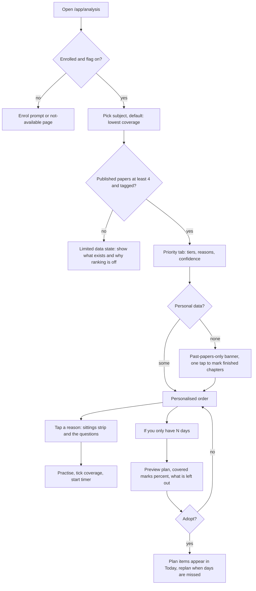
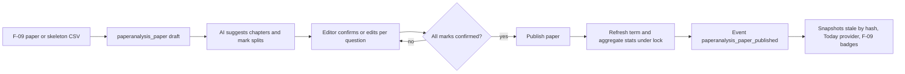

# PRD: F-11 Paper Analysis and Recommendation Engine

| Field | Value |
| --- | --- |
| Status | Draft (for founder review) |
| Owner | Pawan (founder) |
| Last updated | 2026-10-05 |
| Source | `docs/product/FEATURE_MAP.md` section F-11 (item 9 "Paper analysis, priority in exams" and page 5 "for previous 5 to 10 exams, question pattern; recommendation engine: marks and chapters in that particular subject"), plus F-09 `[ADD]` "Asked N times badge" and F-13 `[ADD]` "priority chapters (F-11)" |
| Linked ERD | `docs/product/erd/F-11-paper-analysis-and-recommendations.md` |
| Role | **Intelligence pointer.** Turns past papers (F-09 PYQ, F-08 MTP/RTP) into per-chapter mark statistics and a transparent priority score, and feeds F-13 Today and a "If you only have N days" planner. It owns no questions and no attempts: it owns the **marks-to-chapter allocation**, the **statistics read model**, the **scoring function** and the **planner** |
| Modules | API `apps/api/modules/paperanalysis`; web `apps/web/src/modules/paperanalysis`. No new shared infrastructure; it reuses `core/events.py`, `core/jobs.py` and the shared AI client from F-06 and X-04 |
| Feature flags | `paper_analysis` (student surfaces and APIs), `paper_analysis_planner` (N-days planner and adopted plans), `paper_analysis_public` (public subject analysis pages). Server checked, 403 `feature_disabled` |
| Depends on | F-02 (taxonomy, scheme versions, chapter maps, enrolment and exam date), F-06 (questions, chapter mappings, events), F-09 (term-wise papers, `[PROPOSED]` paper interface), F-01.2 (time per chapter), F-10 (weakness signal, `[PROPOSED]`), F-13 (Today provider registry, `[PROPOSED]`) |

---

## 1. Problem and goal

A CA, CS or CMA student with 40 days to an attempt cannot cover everything at the same depth, and everyone knows it. Today they decide what to skip from a senior's advice, a coaching "ABC analysis" PDF (chapters sorted A, B, C from past papers) or a WhatsApp forward. Those sources are generic (not about this student), unexplained (no way to check "why is this chapter an A?"), usually out of date after a scheme change, and sometimes over-confident ("sure-shot chapters"). The Institute does not publish chapter-wise weightage, so every analysis is somebody's inference from papers (see Appendix A).

**Goal, in three parts:**

1. **Make past papers measurable.** For each subject, show how many marks each chapter carried in each of the last 5 to 10 sittings, how often it appeared, its average, and its trend, plus the shape of the paper (MCQ and case study versus descriptive, theory versus practical, choice patterns). Every number can be traced to the questions behind it.
2. **Turn it into a personal, explained priority list.** Combine history, trend, the student's weakness (F-10), what they have already covered (F-02) and the days left into one score per chapter, always with plain sentences: "Input Tax Credit carried 18 marks in its best sitting and appeared in 5 of the last 6 sittings. You have covered 20% of it."
3. **Answer "I only have N days".** Pick the chapters that give the most expected marks per hour of study, using the student's own pace from the tracker, and hand the result to Today (F-13) and the planner.

**What this is not.** It is not a prediction of the next paper and never says what "will come". It is a transparent heuristic over history, with confidence labels, minimum-data guards, a back-test against past sittings and a standing reminder that the Institute can ask from any chapter. The copy rules in 7.5 are requirements, not style.

## 2. Users and scenarios

**Aarav, CA Intermediate, 45 days to the attempt, covered about 60%.**
He opens Analysis, picks Taxation and sees the Priority tab: seven "Core" chapters that carried about half of the marks in the last 6 sittings. Under GST: Input Tax Credit he reads "Carried 18 marks in its best sitting; appeared in 5 of the last 6 sittings. You answered 9 of 20 practice questions correctly. Coverage 20%." He taps the sentence, sees the six-sitting strip and the actual questions, and starts a practice set from there. The Today screen later shows it as one task.

**Neha, CS Executive, signed up an hour ago, nothing tracked.**
After choosing level and exam date she lands on Analysis. With no personal data yet she still sees, in under 60 seconds, "Chapters that carried the most marks in Company Law over the last 6 sittings", labelled "Based on past papers only. Mark what you have finished to personalise this." One tap on "I have finished these" (coverage quick-start from F-02) re-orders the list. She never sees an empty screen.

**Rohan, CMA Final, 9 days left, panicking.**
He opens "If you only have N days", enters 9 days and 5 hours a day for Cost Audit and Strategic Financial Management. The plan picks 11 chapters (8 in full, 3 as "key points only"), shows that they covered about 68% of the marks that chapters historically carried, and says what is left out: "Not in this plan: 14 chapters that carried 32% of marks in past papers. The Institute can ask from any chapter." He adopts the plan; Today now shows two chapter tasks per day.

**Meera, a CA who edits content part time.**
She opens a published past paper in the tagging workbench. The AI has suggested chapters and mark splits for 22 question parts; she confirms 17 with one tap, fixes a 14-mark practical question that spans Ind AS 115 (8 marks) and Ind AS 116 (6 marks), and publishes the paper. Statistics refresh in seconds. A student's list may change tomorrow because of her work, so her confirmations are audited.

## 3. Success metrics

Targets are starting hypotheses to calibrate after the first 100 users.

| Metric | Definition | Target | Event(s) |
| --- | --- | --- | --- |
| Activation | Enrolled students who view an analysis within 7 days of enrolment | 35% | `analysis_viewed` |
| Time to first insight | Median seconds from first `/app/analysis` load to first rendered Priority list | under 8 s | `analysis_viewed` (render_ms) |
| Action rate | Students who open a chapter, start practice or start the timer from a recommendation within 24 h of viewing | 30% of viewers | `analysis_chapter_opened`, then practice and tracker events |
| Reason engagement | Sessions that open at least one reason sentence (shows people check why) | 25% | `analysis_reason_opened` |
| Plan adoption | Students who preview an N-days plan and adopt it | 20% | `plan_previewed`, `plan_adopted` |
| Trust | "Helpful" share of feedback on the Priority list | 70% or more | `analysis_feedback_given` |
| Data quality | Share of marks in published papers with a human-confirmed chapter allocation | 100% of published papers; 95% or more on any paper shown as "Limited" | `paperanalysis_paper_published` |
| Tagging effort | Editor minutes per paper with AI suggestions | under 25 min | `allocation_confirmed` (changed_from_ai) |
| AI acceptance | Suggested allocations confirmed unchanged | 70% or more (calibrates when to auto-suggest first) | `allocation_confirmed` |
| Back-test lift | Marks captured by the top 30% of chapters in the next sitting, divided by the 30% a flat ranking would capture | 1.25 or more, else the subject shows "history only" (FR-F11-30) | server metric, `backtest_finished` |
| Wrong-tag flags | Student flags per 100 allocations shown | under 2 | `analysis_flag_submitted` |
| Latency | Priority list p95 | under 400 ms (cached stats and snapshot) | server metrics |

## 4. Scope

### 4.1 In scope

**R1: Know the papers (data and statistics)**

1. `paperanalysis` module with papers (exam, MTP, RTP, sample), paper questions with paper-specific marks, **choice groups** ("answer any 4 of 5") and **chapter allocations** (marks apportioned across chapters, with origin, confidence, AI call reference and human reviewer). `[NOTE]` item: marks per chapter per term.
2. Two ways in: `from_bank` papers (built from F-09/F-06 questions through the `[PROPOSED]` F-09 paper interface) and **skeleton papers** (question number, marks, format, chapters; no question text), entered by CSV or form, so analysis does not wait for content licensing (Q-F11-1).
3. Admin tagging workbench: AI-suggested allocations, human review, confirm, partial publish rules, 10% second-reviewer QA sample, audit trail. `[ADD]` item.
4. Statistics read model: per chapter per sitting, per chapter aggregate (papers considered, times asked, average, maximum, last asked, trend, share of paper), per paper pattern (objective versus descriptive, theory versus practical, optional marks). `[NOTE]` item: question pattern.
5. Scheme-change handling: only comparable chapters carry history across schemes; restructured chapters are flagged, never silently merged.
6. Student screens: Analysis hub, subject analysis (Priority, Chapters, Patterns, Sittings tabs), chapter history. Public tables only at first; personal overlay when data exists.
7. "Asked N times" feed for F-09 (`paperanalysis.selectors.asked_summary`). `[ADD]` item from F-09.
8. Minimum-data guards, confidence labels and the disclaimer system.

**R2: Recommend and plan**

9. Versioned pure scoring function `ps-1`, weights in the database (`paperanalysis_weightset`), explanation payload and sentence templates. `[ADD]` items: priority score, explainable output.
10. Weakness input through a registry (default: F-02 coverage and F-06 accuracy; F-10 plugs in later).
11. "If you only have N days" planner (greedy on expected marks per estimated hour, with a single-best-item safeguard), hours from F-02 estimates adjusted by the student's own pace from F-01.2.
12. Adopt, replan and end a plan; `register_task_provider` into F-13 Today; domain events.
13. Back-test job and guard (no ranking when the engine does no better than a flat list).
14. Public subject analysis pages (history only) behind `paper_analysis_public`.

**R3: Sharper and wider**

15. Topic-level allocations and topic recommendations; "Asked N times" at topic level for every public question.
16. Auto-publish of AI allocations above a measured confidence for low-stakes papers (MTP/RTP), human sampling remains.
17. Inferred chapter weights published to F-02 for the weighted coverage toggle (`[PROPOSED: F-02 follow-up]`).
18. Weight tuning from back-tests per level, mentor read access, Hindi sentence templates.

### 4.2 What stays out of this module (and who owns it)

| Item | Owner |
| --- | --- |
| Questions, versions, chapter mappings of a question, takedown | F-06 `questionbank` (this module reads mappings and may call `set_mapping`) |
| Term-wise paper pages, "practise this paper" sessions | F-09 (this module reads papers through the `[PROPOSED]` interface and publishes badges data) |
| Mock test simulation, attempts and scores | F-08 and F-06 `practice` |
| Weakness model, readiness score, mistake analytics | F-10 (this module consumes a weakness signal) |
| Daily task list, snooze, swap | F-13 (this module provides a provider) |
| Reminders and nudges | X-01 (`notifications.services.notify`, `[PROPOSED: X-01]`) |
| Study-time capture and per-chapter time history | F-01.1 and F-01.2 (read only) |
| Syllabus schemes, chapter maps, exam terms and dates | F-02 (read through `syllabus.selectors` and `[PROPOSED]` DTO selectors) |
| Predicting individual questions, scoring a student's expected marks | Out of scope for good. We only rank chapters by historical weight and effort |

## 5. User flows

### 5.1 Student: from landing to action



### 5.2 Paper to statistics (editor pipeline)



### 5.3 Edge cases (designed and tested)

| Case | Behaviour |
| --- | --- |
| No exam date set | Use the term's `exam_start`; if none, assume 90 days and show "Set your exam date to sharpen this" |
| Exam date passed | "This attempt has passed" with a prompt to pick the next term; stats stay readable |
| Fewer than 3 papers for a chapter | Chapter shows "Limited history"; its history component is shrunk to the prior (ERD 3.5); never shown as "Core" on history alone |
| Fewer than 4 published papers in the subject | No ranking, only the stats table and a progress note "3 of 4 papers analysed" |
| New scheme, first sitting not yet held | Stats from MTP, RTP and sample papers only, labelled "Practice papers" with their lower weight; banner "New scheme: no exam history yet" |
| Chapter restructured (split, merged, renamed) | Marked "Restructured"; history carried only for `same` and `merged` relations (merged sums the old chapters, weight 0.7); `split` and `partial` are not carried until topic-level remap is reviewed |
| Chapter in the new scheme absent from old papers | "New chapter: no history" and the subject's average as prior, flagged |
| Question spans several chapters | Allocation rows apportion the marks; the sum must equal the question marks |
| Choice group (answer any 4 of 5) | Chapter weight counts `marks x pick/of` ("effective"), offered marks shown in drill-down |
| Paper question taken down in F-06 | Marks and allocation stay (they are numeric facts); question text is hidden; the drill-down shows "Question text not available" |
| Student has unrelated electives | Only enrolled subjects (including chosen electives) are ranked |
| Offline | Last computed list (snapshot) is shown with "Saved on this device, 2 days ago"; planner preview disabled |
| Concurrent edits by editors | Paper-level row lock and `rev` check; the second editor gets 409 `paper_conflict` with a reload prompt |
| Weights changed by an admin | Snapshots carry `weightset_id`; next load shows "Ranking method updated" once, with a link to what changed |
| Student disagrees with a tag | "Report wrong tag" on the question row creates a flag for editors; the number is never edited by the student |

## 6. Functional requirements

IDs use `FR-F11-nn`. Priority P0 means R1 launch, P1 R2, P2 R3. `[NEW]` marks additions beyond the pointer.

### A. Papers, questions and allocations (editor side)

| ID | Requirement | Priority | Acceptance criteria |
| --- | --- | --- | --- |
| FR-F11-01 | Create a paper (kind `exam`, `mtp`, `rtp`, `sample`) for a subject key, term code and scheme, from an F-09 paper or as a skeleton | P0 | Given an editor and a subject, when they create a paper with term `2025-05`, then it is stored `draft` with `entry_mode` and the scheme derived from the term; duplicate (subject_key, term_code, paper_kind, series) is refused with 409 `paper_exists` |
| FR-F11-02 | Import a skeleton paper by CSV (question label, parts, marks, format, nature, choice group, chapters with shares) | P0 | Given a CSV with 25 rows, when imported, then valid rows are created, invalid rows are listed with row numbers and reasons, and nothing is half-written (one transaction) |
| FR-F11-03 | Each paper question stores paper-specific marks (numeric), format (`mcq`, `case_mcq`, `descriptive`, `practical`), nature, section label and optional link to an F-06 question | P0 | Given a question used in a paper with 8 marks and bank marks of 6, when stored, then statistics use 8 |
| FR-F11-04 | **Choice groups**: a group has `pick_n` of `of_m` and member questions; effective marks are `marks x pick_n / of_m` | P0 | Given a group "any 4 of 5" with 14 marks each, then each member has effective marks 11.2 and the group's attemptable marks are 56 |
| FR-F11-05 | **Apportion marks across chapters** for a question that spans several: allocation rows with shares; marks are split in 0.5-mark steps using largest remainder so the parts sum exactly | P0 | Given 14 marks with shares 0.6 and 0.4, then allocations are 8.5 and 5.5 (largest remainder), sum 14.0; a sum other than the question marks cannot be confirmed |
| FR-F11-06 | AI suggestion: for unmapped questions the worker proposes chapters and shares using the F-06 mapping (if any) and the question text; each suggestion keeps model, prompt version, confidence, short rationale and the AI call reference | P0 | Given 20 untagged questions and budget left, when the editor taps "Suggest", then a job runs and rows appear as `suggested` within 60 s; over budget returns 429 `ai_budget_exceeded` and manual tagging still works |
| FR-F11-07 | Human review: only `confirmed` allocations count in statistics; confirmation records reviewer and time; editing a confirmed row writes an audit row | P0 | Given a suggested row, when an editor confirms, then `decided_by` and `decided_at` are set and the audit trail has one entry; an AI row is never counted before confirmation |
| FR-F11-08 | Keep the question bank consistent: confirming an allocation to a chapter that is not in the question's F-06 mapping calls `questionbank.services.set_mapping` as a confirmed secondary mapping (feature `sync_bank_mapping`, default on) | P1 | Given a bank question mapped only to Ind AS 115, when an editor allocates 6 marks to Ind AS 116, then the bank mapping gains Ind AS 116 as secondary; failure to sync never blocks the allocation |
| FR-F11-09 | Publish a paper only when 100% of marks are confirmed (or the editor records an exception with reason and the tagged ratio is at least 95%) | P0 | Given 97% confirmed and an exception note, then publish succeeds and the paper is marked `limited`; given 80%, then 422 `paper_not_ready` |
| FR-F11-10 | Unpublish and re-publish; every publish and unpublish refreshes statistics and emits `paperanalysis_paper_published` or `_unpublished` | P0 | Given a published paper, when one allocation changes, then the paper returns to `in_review` automatically and the stats exclude it until re-published (no half-updated numbers) |
| FR-F11-11 | QA sample: 10% of confirmed allocations (setting) are queued for a second editor; disagreements reopen the row and count towards a per-editor and per-AI-version disagreement rate | P1 | Given 100 confirmed rows, then about 10 appear in the QA queue; a disagreement sets the row `disputed` and removes it from stats until resolved |
| FR-F11-12 | Tagging queue shows progress per subject: papers needed (target 10 sittings), analysed, in review | P0 | Given CA Inter Taxation, then the board shows "6 of 10 sittings published, 2 in review" |

### B. Statistics (read model)

| ID | Requirement | Priority | Acceptance criteria |
| --- | --- | --- | --- |
| FR-F11-13 | Per chapter per paper: offered marks, effective marks, question count, objective and descriptive marks, theory and practical marks, compulsory marks | P0 | Given a published paper, then the per-chapter rows sum to the paper's allocated marks within 0.01 |
| FR-F11-14 | Per chapter aggregate over the window (default last 6 exam sittings, maximum 10): papers considered, times asked, average effective marks per sitting, average marks when asked, maximum, last asked term, share of subject marks, trend | P0 | Given 6 papers and a chapter asked in 4 with 18, 6, 0, 12, 0, 9 marks, then asked 4 of 6, average 7.5, maximum 18, last asked term shown |
| FR-F11-15 | Trend: compares the mean of the last 3 sittings with the previous up to 3, shown only when at least 5 papers exist; otherwise "Not enough sittings for a trend" | P0 | Given 4 papers, then trend is `null` and the UI shows the message, not "flat" |
| FR-F11-16 | Window and source options: `window` 3 to 10, include MTP/RTP (off by default for display, weighted in the engine), include older-scheme comparable papers (on) | P0 | Given `window=3`, then only the 3 latest exam sittings are used and the response echoes the settings |
| FR-F11-17 | Per paper pattern: objective versus descriptive marks, theory versus practical, optional marks and choice patterns (groups, pick of m) | P0 | Given a CA Inter paper with 30 case-MCQ and 70 descriptive marks, then the pattern row shows 30/70 and the trend of that split across sittings |
| FR-F11-18 | Statistics are rebuilt idempotently per paper under a lock and are never partially visible | P0 | Given two simultaneous publishes in one subject, then both complete, aggregates equal a full rebuild, and no unique-constraint error reaches a client |
| FR-F11-19 | Every number in the UI links to its data: aggregate to per-sitting strip to the questions with their allocated marks | P0 | Given the chapter row "7.5 avg", when tapped, then the sittings table with each question's marks is shown |

### C. Scheme change and comparability

| ID | Requirement | Priority | Acceptance criteria |
| --- | --- | --- | --- |
| FR-F11-20 | Each paper is tied to the scheme in force for its term; statistics for a current-scheme chapter use native papers plus older papers only through `syllabus_chaptermap` rows with relation `same` or `merged` and not `needs_review` | P0 | Given a chapter renamed with key preserved, then old marks carry; given `split`, then they do not and the chapter shows "Restructured" |
| FR-F11-21 | Carried history has a configurable recency discount (default 0.7) and is labelled "Includes 2023-scheme papers" | P0 | Given carried papers, then the explanation text states it and the weight in the response is 0.7 times the native weight |
| FR-F11-22 | A "Restructured chapters" list (admin and student) shows what is not comparable and why | P1 | Given a scheme with 12 split chapters, then the list names them and links to the F-02 map review |

### D. Recommendation engine

| ID | Requirement | Priority | Acceptance criteria |
| --- | --- | --- | --- |
| FR-F11-23 | Priority score is a pure, versioned function (`ps-1`) of historical stats, student signals and days left, defined in 6.1; no I/O, no clock, no randomness | P1 | Given identical inputs and weights, then output is byte-identical; a golden-file test fixes the outputs for 20 fixtures |
| FR-F11-24 | Weights and constants live in the database (`paperanalysis_weightset`), validated against a schema, immutable once active, one active set per scope with fallback to global | P1 | Given an admin edits parameters, then a new version is created and activated; snapshots made earlier keep their old `weightset_id` |
| FR-F11-25 | Every score carries its component values, confidence (`high`, `medium`, `low`, `insufficient`), tier (`core`, `next`, `rest`) and up to 3 reasons with data pointers | P1 | Given a response, then each chapter has `components`, `confidence`, `tier`, `reasons[{code, params}]` and rendered `sentences[]` |
| FR-F11-26 | **Explainable sentences** are rendered from reason codes and numbers with versioned templates; no free-text generation by an LLM on the student path | P1 | Given reason `asked_in_window` with asked 5, window 6, max 18, then the sentence equals "Carried up to 18 marks and appeared in 5 of the last 6 sittings" |
| FR-F11-27 | Weakness comes from a registry: default source uses F-02 coverage and F-06 accuracy (shrunk); F-10 registers a richer source | P1 | Given a student with 2 answers, then weakness is neutral (0.5) and the reason says "Not enough practice yet"; with 20 answers at 40% it reflects the evidence |
| FR-F11-28 | Days left is computed in the student's time zone from the enrolment exam date, never UTC midnight | P1 | Given 23:30 IST, then days left counts the local date |
| FR-F11-29 | Minimum-data guards: subject ranks only with at least 4 published exam or practice papers; a chapter needs 3 papers to be anything other than `low` confidence; MTP-only history cannot make a chapter `core` | P1 | Given a subject with 3 papers, then `data_status = insufficient` and no scores are returned, only stats |
| FR-F11-30 | **Back-test guard**: for each subject the job replays past sittings (train on earlier, test on the next) and stores marks captured by the top 30% of chapters and the lift over a flat ranking; below the threshold (default 1.15) the subject shows history only | P1 | Given lift 1.05 for a subject, then the API returns `ranking: "withheld"` with reason `backtest_below_threshold` and the UI shows the history table with an explanation |
| FR-F11-31 | Recommendations are limited to the student's enrolled subjects and respect electives | P1 | Given an elective not chosen, then it is absent |
| FR-F11-32 | Snapshots: results are cached with an `inputs_hash`; a changed input (stats version, weight set, coverage stamp, practice stamp, days-left bucket, settings) makes it stale and recomputed on next read | P1 | Given a coverage tick, then the next read recomputes; given no change, then the same `snapshot_id` is returned |

### E. "If you only have N days" planner

| ID | Requirement | Priority | Acceptance criteria |
| --- | --- | --- | --- |
| FR-F11-33 | Input: days (1 to 120), hours per day (0.5 to 16), subjects (default: all enrolled), optional "balance subjects" | P1 | Given invalid input, then 422 with field errors; defaults come from the enrolment (`daily_hours`) |
| FR-F11-34 | Selection by expected marks per estimated hour (greedy, 6.2) with a best-single-item safeguard, a 10% buffer and "key points only" mode for the last chapter | P1 | Given a 36-hour budget, then the plan's hours never exceed 36 x 0.9 and the selected set's value is at least 50% of the optimal value (property test against brute force on small inputs) |
| FR-F11-35 | Hours per chapter come from F-02 `est_study_minutes`, else topic count, else subject median, adjusted by the student's pace (F-01.2 history, shrunk) and by what is already covered | P1 | Given a student who took 1.4 times the estimate on 3 finished chapters, then pace is about 1.2 (shrunk) and shown as "Based on your own pace" |
| FR-F11-36 | Output: chosen chapters with minutes, mode, expected marks share, what is left out and the share of historical marks the plan covers; never a predicted score | P1 | Given a plan, then it shows "Covers about 68% of the marks these chapters carried in past papers" and "Not in this plan" with total marks share |
| FR-F11-37 | Adopt a plan (idempotent by `client_id`), replan when days are missed, end a plan; one active plan per enrolment | P1 | Given an active plan and a new adoption, then the old one becomes `superseded` in the same transaction; a double tap returns the same plan |
| FR-F11-38 | Day-by-day schedule is a suggestion (chapters assigned to days by order of value per hour, balanced to the day budget); items can be marked done, skipped or moved | P1 | Given a missed day, then "Replan" re-runs the planner with the remaining days and unfinished items |

### F. Student experience, honesty and first time

| ID | Requirement | Priority | Acceptance criteria |
| --- | --- | --- | --- |
| FR-F11-39 | First-time experience works with no personal data: history-only Priority list within one screen, banner and one-tap quick-start into coverage | P0 | Given a new enrolment with zero events, then the list shows top chapters by expected marks with the "past papers only" banner |
| FR-F11-40 | Disclaimer system: every surface that shows ranking or a plan carries the standing note and the "history is not a guarantee" line; share cards and exports include it | P0 | Given any ranking surface, then the note is present in the DOM and exports (test) |
| FR-F11-41 | Copy lint: forbidden phrases ("guaranteed", "sure shot", "will come", "predicted", "skip") fail CI in templates and strings of this module | P0 | Given a template containing "will come", then the lint test fails |
| FR-F11-42 | Settings: window, include practice papers, include older-scheme papers, hide tiers, "show reasons by default" | P1 | Given a saved setting, then it is reflected in URL defaults and API echo |
| FR-F11-43 | Feedback and flags: "Helpful?" on the list; "Report wrong tag" on a question row | P1 | Given a flag, then an editor sees it with the allocation and paper; the student gets no numeric change from it |
| FR-F11-44 | Public subject analysis page (history only, no personal data) with `buildHead`, OG image and Breadcrumb JSON-LD, indexable only when an editor sets `seo_indexable` | P1 | Given a subject with 6 or more published papers and the flag on, then the page renders server-side with the table, the pattern strip and the disclaimer |
| FR-F11-45 | Accessibility of data views: every chart has a table alternative; tier and trend are conveyed by text and icon, not colour alone | P0 | Given a screen reader, then each chapter row reads "GST Input Tax Credit, Core, expected 9 marks, appeared in 5 of 6 sittings" |

### G. Integrations

| ID | Requirement | Priority | Acceptance criteria |
| --- | --- | --- | --- |
| FR-F11-46 | `asked_summary(question_ids)` returns per question: asked count and window at topic, chapter or duplicate-cluster level, last asked term, with the scope used so F-09 can label honestly | P0 | Given a question whose topic appeared in 4 of 8 sittings, then the summary says scope `topic`, asked 4 of 8, last term; with no topic allocation it falls back to `chapter` and says so |
| FR-F11-47 | `register_task_provider("paper_priority", ...)` into F-13: at most 2 chapter tasks a day with reason sentences, only when confidence is `medium` or `high` and the plan or list exists | P1 | Given a student with an adopted plan, then Today receives today's items with `dedupe_key` per chapter and day; with `insufficient` data, no tasks |
| FR-F11-48 | Weakness registry and F-10: `register_weakness_source` accepts F-10's source without changing this module | P1 | Given a registered source, then it is used for weakness in new snapshots and the weakness reason names its source |
| FR-F11-49 | Events: `paperanalysis_paper_published`, `paperanalysis_paper_unpublished`, `paperanalysis_stats_refreshed`, `paperanalysis_plan_adopted` (envelope as F-06 ERD 3.4); consumes `question_version_live`, `question_taken_down` | P1 | Given a published paper, then one event with the paper id and chapter ids is in the outbox in the same transaction |
| FR-F11-50 | Privacy: `export_for_user` and `delete_all_for_user` for settings, snapshots, plans, flags; called from the account deletion service; editor audit rows keep an anonymised actor | P0 | Given a deletion request, then personal rows are gone, aggregate stats are unchanged |
| FR-F11-51 | Feature flag `paper_analysis` enforced server and web (403 `feature_disabled`); planner and public pages under their own flags | P0 | Given a flag off, then the web shows "Not available yet" and the API answers 403 |

### 6.1 Engine specification `ps-1` (the documented formula)

Inputs for a student and subject: the subject's published papers (window up to 10, newest first) with per-chapter effective marks; chapter metadata; student coverage fraction `cov` (0 to 1), practice answers and correct count per chapter; days left `d`; enrolled subjects. All constants below are keys in `paperanalysis_weightset.params` with the shown defaults.

**Historical expectation.** For chapter `c` and paper `i` (age `a_i` = 0 for the newest): weight `w_i = lambda^a_i x kind_i x carry_i` with `lambda = 0.85`, `kind` 1.0 exam, 0.4 MTP, 0.3 RTP, 0.3 sample, `carry` 0.7 for older-scheme comparable papers, else 1. Marks `m_i` are effective marks (0 when not asked). Then `n_eff = sum w_i`, `E_raw = sum(w_i m_i) / n_eff`, and shrinkage towards a prior: `E = (n_eff x E_raw + k x prior) / (n_eff + k)` with `k = 2`. The prior is the chapter's official weight midpoint (F-02 `marks_min`, `marks_max`, when `weight_source = official`), else the subject's total marks divided by its chapter count. Frequency `F = sum(w_i x [m_i > 0]) / n_eff`.

**Components, each from 0 to 1.** `H = E / max E in subject`. `F` as above. Trend `T = (clamp(r, -1, 1) + 1) / 2` where `r = (mean(last 3) - mean(previous up to 3)) / max(1, mean(all))`, `T = 0.5` when fewer than 5 papers. Weakness `W = 1 - acc`, with `acc = (correct + 5 x 0.5) / (answered + 5)` from the weakness source (0.5 neutral with no evidence). Gap `G = 1 - cov`.

**Urgency and blend.** `u = clamp(1 - d / 120, 0, 1)`. Weights far from the exam: `H 0.40, F 0.15, T 0.05, W 0.20, G 0.20`. Close to the exam: `H 0.50, F 0.15, T 0.05, W 0.10, G 0.20`. Applied weight = `far x (1 - u) + near x u` (always sums to 1). Reason: far from the exam it is worth fixing weak chapters; with days left short, expected marks dominate and hard-to-fix chapters matter less. `score = round(100 x (wH H + wF F + wT T + wW W + wG G), 1)`.

**Tiers (Pareto framing, rank-based).** Sort by score. `core` = the shortest prefix whose `E` covers 50% of the subject's total `E`; `next` = up to 80%; `rest` = remainder. `rest` is labelled "Lower expected weight" and never "skip".

**Confidence.** `high`: `n_papers >= 6` and all comparable; `medium`: 4 to 5, or 6 or more with carried papers; `low`: 3; `insufficient`: fewer (no score).

**Marks per hour (planner).** `ready_now = cov x (0.5 + 0.5 x acc)`. `target = 0.75`. Expected gain `gain = E x max(0, target - ready_now)`. Remaining effort fraction `r = max(0, target - ready_now) / target`. Hours `h = base_minutes x r x pace / 60`, with `base_minutes` from the fallback chain (editor estimate, topic count x 40, subject median, 240) and `pace = clamp((n x median_ratio + 3) / (n + 3), 0.6, 1.8)` over `n` chapters the student finished with at least 30 tracked minutes (`median_ratio` = tracked minutes divided by estimate). `mph = gain / h`.

### 6.2 Planner algorithm (`ps-1`)

1. Budget `B = days x hours_per_day x 0.9`. Candidates: chapters of selected subjects with `gain > 0`, confidence not `insufficient`.
2. Sort by `mph` descending; ties by higher `E`, then `sort_order`. Add whole chapters while they fit.
3. Compute the best single candidate that fits `B`; if its gain exceeds the greedy total, use it (classic 2-approximation safeguard).
4. Leftover time of at least half of the next chapter's hours: add it in "key points only" mode at 50% hours and 60% gain.
5. Optional balance: ensure each selected subject has at least its proportional share of hours (`balance_subjects`).
6. Report: chosen items, covered share `sum(E chosen) / sum(E all)` ("of the marks chapters historically carried"), excluded share, hours used. Fractional-knapsack theory justifies the ratio order; the integral case is a heuristic with the safeguard, which is why the copy says "suggested".

## 7. Screens, URLs and design-system needs

### 7.1 Screens and URLs

| Screen | URL | Notes |
| --- | --- | --- |
| Analysis hub | `/app/analysis` | Subject tiles with data status, days left, plan card; `noindex` |
| Subject analysis | `/app/analysis/$subjectKey` | `?tab=priority\|chapters\|patterns\|sittings&window=6&practice=0&older=1&tier=core&sort=priority&q=` |
| Chapter history | `/app/analysis/$subjectKey/$chapterKey` | Per-sitting table, questions, reasons; deep link from syllabus chapter page and F-09 |
| N-days planner | `/app/analysis/plan` | `?days=14&hours=4&subjects=taxation,audit&balance=1`; preview is a computed view, shareable by URL |
| Active plan | `/app/analysis/plan/active` | Day list, mark done, replan, end |
| Analysis settings | `/app/settings/analysis` | Window, sources, display |
| Admin: papers | `/app/admin/analysis/papers` | `?subject=&status=&kind=&term=`; progress board |
| Admin: workbench | `/app/admin/analysis/papers/$paperId` | Tagging queue, `?q=12` current question, side panel for the bank question |
| Admin: QA and flags | `/app/admin/analysis/qa`, `/app/admin/analysis/flags` | Second review sample and student flags |
| Admin: weights and back-tests | `/app/admin/analysis/weights`, `/app/admin/analysis/backtests` | Versioned weight sets, lift per subject |
| Public subject analysis | `/courses/$course/$level/$subject/paper-analysis` | SSR, `buildHead`, OG `/og/courses/.../paper-analysis`, Breadcrumb JSON-LD, history only; `noindex` unless `seo_indexable` |

### 7.2 Wireframes (mobile first, 320 to 1280 px)

**Subject analysis, Priority tab (mobile)**

```
┌──────────────────────────────────┐
│ ← Taxation        45 days left   │
│ [Priority] Chapters Patterns Sit.│  SegmentedControl, scrolls in row
│ Based on 6 sittings · Medium conf│  Badge, opens "How this works" sheet
│ ┌ Core: about 50% of marks ────┐ │
│ │ 1 GST: Input Tax Credit      │ │
│ │   Core · expected 9 marks    │ │
│ │   ▮▮▯▮▮▯  asked 5 of 6       │ │  TermStrip with text alternative
│ │   Carried up to 18 marks...  │ │  reason sentences (max 2 here)
│ │   You: coverage 20%, 9/20 ok │ │
│ │   [Practise] [Open chapter]  │ │
│ └──────────────────────────────┘ │
│ ... 6 more Core rows             │
│ ▸ Next: up to 80% of marks (9)   │  collapsed groups
│ ▸ Lower expected weight (14)     │
│ History is not a guarantee. The  │
│ Institute can ask from any chapter│
│ [If you only have N days  →]     │
└──────────────────────────────────┘
```

**N-days planner (desktop, two columns)**

```
┌ Inputs ─────────────┐ ┌ Plan preview ─────────────────────────────┐
│ Days        [ 9 ]   │ │ 11 chapters · 38.5 of 40.5 h              │
│ Hours/day   [ 5 ]   │ │ Covers about 68% of marks these chapters  │
│ Subjects  [x] SFM   │ │ carried in past papers                    │
│           [x] Audit │ │ ┌ # Chapter        h   mode     marks/h ┐ │
│ [ ] Balance subjects│ │ │ 1 Derivatives    3.0 Full      2.1     │ │
│ [ Preview ]         │ │ │ 9 Bonds          1.5 Key points 1.1    │ │
└─────────────────────┘ │ └ Not in this plan: 14 chapters, 32% ─────┘ │
                        │ [Adopt this plan]  [Change inputs]          │
                        └─────────────────────────────────────────────┘
```

**Tagging workbench (desktop)**

```
┌ CA Inter Taxation · May 2025 · Exam · 31 of 36 marks confirmed ───────────────┐
│ Q-list (left)        │ Question 3(b)   14 marks   Practical   Choice: any 4/5│
│ ✓ 1(a) 2m            │ [question text or "skeleton: no text"]                │
│ ✓ 1(b) 2m            │ Allocation   Chapter                 Marks   Origin   │
│ ● 3(b) 14m  AI 0.82  │              Ind AS 115 Revenue      [ 8.5 ]  AI      │
│ ○ 4    14m           │              Ind AS 116 Leases       [ 5.5 ]  AI      │
│ ...                  │ Sum 14.0 of 14.0 ✓      [Confirm] [Add chapter] [Skip]│
└──────────────────────┴───────────────────────────────────────────────────────┘
```

### 7.3 UI states per screen

Every cell is designed, built and covered by a component test or a design-showcase entry. Skeletons keep layout stable; no spinner-only screens.

**Subject analysis (all tabs)**

| State | Behaviour |
| --- | --- |
| First time, no personal data | Priority tab opens on history only with the banner "Based on past papers only. Mark what you have finished to personalise this." and a primary "Mark finished chapters" button (coverage quick-start); a one-time coach mark explains tiers and the disclaimer |
| First time, no papers analysed yet | `EmptyState`: "We are still analysing past papers for this subject (0 of 4 needed)". Shows the pattern facts we do have (paper marks and duration from F-02) and "Notify me" `[PROPOSED: X-01]` |
| Loading | Header and tab bar render at once; 6 row skeletons; the sittings strip skeleton keeps its width; filters stay usable |
| Partial | History loads first (cacheable); personal overlay (coverage, accuracy) loads after and fades in; if the overlay fails: "Your progress could not load. Retry" and the list stays in history-only order with a note |
| Success | Tiers, rows, reasons; "Updated with 6 sittings, May 2025 latest" |
| Insufficient data | Table of what exists, a progress line "3 of 4 papers analysed", ranking hidden with reason; never a half ranking |
| Ranking withheld (back-test) | History table plus "We do not rank this subject yet: in past sittings our ranking was no better than a flat list. Here is the history." |
| Error | Inline `Alert` with Retry and request id; last good data dimmed and kept |
| Offline | Banner with the saved date; read-only; planner and refresh disabled |
| Feature disabled | "Paper analysis is not available yet" page; nav item hidden |
| Quota exceeded | Planner previews limited by throttle: "You have run many previews. Try again in a minute" with `Retry-After`; no content loss |
| Long content | Chapter names wrap to 3 lines then truncate with full name in the drill-down; tables scroll inside their container; reasons clamp to 2 lines with "Show all" |
| Scheme changed | Banner "Your syllabus changed. History for 12 chapters is not comparable" with the list |
| Exam passed | "This attempt has passed" and pick next term; stats stay |

**N-days planner**

| State | Behaviour |
| --- | --- |
| First time | Defaults from enrolment (days to exam, `daily_hours`); one sentence explains the method; the preview runs once on open so there is something to read |
| Loading | Preview shows a skeleton table; inputs stay editable; changing inputs cancels the in-flight request |
| Empty result | "Nothing fits 1 hour. Try at least 2 hours" with the smallest feasible chapter named |
| Success | Table, covered share, left-out share, adopt button; the URL holds the inputs |
| Error | Alert with retry; inputs preserved |
| Offline | Disabled with explanation; an adopted plan remains readable |
| Plan exists | "You have an active plan (day 3 of 9). Adopting replaces it" with a diff of chapters |
| Insufficient data | "We need more analysed papers for Audit. Plan the other subjects?" |

**Tagging workbench (editors)**

| State | Behaviour |
| --- | --- |
| Empty paper | Add questions (from F-09, form or CSV) with a template download |
| Loading | List skeleton; question pane loads independently |
| AI running | Row chips show "Suggesting..." with job progress; manual tagging remains possible |
| AI over budget | Banner "AI budget for today is used up. Tag by hand or retry tomorrow" (429 `ai_budget_exceeded`) |
| Conflict | "Another editor changed this paper" with reload and a diff of the rows |
| Sum mismatch | Inline error under the allocation: "Sum 13.5 of 14.0"; Confirm disabled; "Distribute evenly" and "Fix remainder" helpers |
| Offline | Edits queue locally per question (IndexedDB, same queue as coverage) and sync with `rev` check; publish disabled offline |
| No permission | Role other than editor or admin gets 404 on admin URLs |
| Long content | Question text scrolls inside its pane; 40 or more questions use a virtualised list |

### 7.4 Design-system components

Existing (`@artha/design-system`): Alert, Badge, Button, Card, Checkbox, Dialog, DropdownMenu, EmptyState, Input, NumberStepper, Popover, Progress, RadioGroup, SegmentedControl, Select, Skeleton, Slider, StatTile, Tooltip, Accordion, Tabs, DataTable (shared with F-01.2), plus `Sheet`, `Combobox`, `FilterChip` (added by F-06). Icons from Lucide through the design system only.

New (added to `packages/design-system` with showcase entries, all four themes, contrast checked):

| Component | Used for |
| --- | --- |
| `TermStrip` | One cell per sitting showing marks (number inside the cell, pattern or icon for "not asked"), with an `aria-label` that spells out each value; never colour only |
| `MarksBar` | Horizontal bar with the value as text, tabular numbers, for expected marks and share |
| `ConfidenceBadge` | `high`, `medium`, `low`, `insufficient` with icon and text, opens the explanation sheet |

App-specific (`apps/web/src/modules/paperanalysis`): `PriorityRow`, `ReasonList`, `DisclaimerNote`, `TierGroup`, `PlanBudgetForm`, `PlanTable`, `AllocationEditor`, `QuestionTagPanel`, `PaperProgressBoard`.

### 7.5 Honesty and copy guidelines (requirements)

1. Say what happened, not what will happen: "carried", "appeared in", "historically". Never "will come", "expected question", "sure shot", "guaranteed", "predicted", "skip", "important for sure".
2. Use "expected marks" only as a labelled estimate: "Expected from history: 9 marks (an estimate, not a forecast)".
3. Every ranking or plan surface carries the standing note: "Based on past papers. History is not a guarantee. The Institute can ask from any chapter, so keep covering the whole syllabus." The note is part of share cards and exports.
4. Show the evidence beside every claim: number of sittings, source mix (exam, practice papers), carried papers, confidence.
5. Say what is left out: every plan and tier shows the marks share not covered.
6. State limits plainly: "Institute-wide chapter weightage is not published; these numbers are our analysis of past papers" `[VERIFY the exact Institute position before launch]`.
7. Never compare a student with others in this feature; never show a "predicted score".
8. Plain English, Indian number and date formats (`5 Oct 2026`, `1,25,000`), no emojis.

## 8. Data and permissions

Entities (full definitions in the ERD): `paperanalysis_paper`, `paperanalysis_choicegroup`, `paperanalysis_paperquestion`, `paperanalysis_allocation`, `paperanalysis_allocationaudit`, `paperanalysis_termchapterstat`, `paperanalysis_chapteraggregate`, `paperanalysis_topicstat`, `paperanalysis_subjectstate`, `paperanalysis_weightset`, `paperanalysis_backtestrun`, `paperanalysis_settings`, `paperanalysis_snapshot`, `paperanalysis_plan`, `paperanalysis_planitem`, `paperanalysis_flag`.

### 8.1 Permission matrix

| Action | Anonymous | Student | Editor | Admin |
| --- | --- | --- | --- | --- |
| Read public subject analysis (flag on, `seo_indexable`) | yes | yes | yes | yes |
| Read statistics, patterns and chapter history | no | yes | yes | yes |
| Personal recommendations, planner, plans, settings | no | own only | own only | own only |
| Flag a wrong tag, give feedback | no | yes | yes | yes |
| Create and import papers, tag, confirm, publish and unpublish | no | no | yes | yes |
| Second-review QA | no | no | yes (not the original tagger) | yes |
| Resolve flags | no | no | yes | yes |
| Edit weight sets, activate, run back-tests, set `seo_indexable`, change thresholds | no | no | no | yes |
| Read another student's snapshot or plan | no | no | no | no |

Roles come from `profiles.role`; there is no mentor access in this release.

### 8.2 Privacy and retention

Personal data: settings, snapshots (derived from the student's coverage and practice), plans, flags and feedback. Aggregate statistics and papers are not personal data. Snapshots keep the 3 latest per (student, enrolment, scope) and expire after 30 days; ended plans are kept 12 months, then deleted. The student can export and delete everything personal (DPDP Act 2023; the deletion service calls `paperanalysis.services.delete_all_for_user`). Editor audit rows keep the editor id (staff) and are not deleted with a student account. Analytics events never contain answers or notes; chapter keys are fine, question text is never sent.

## 9. API surface

REST under `/api/v1/paperanalysis/`. Bearer Supabase token unless marked public. Errors use the `core/errors` envelope `{"error": {code, message, details}}`. Lists use cursor pagination (`cursor`, `limit` up to 100). Idempotent writes take `client_id`. Throttle scopes: `pa_read` 120/min, `pa_compute` 30/min (planner preview, recommendations recompute), `pa_write` 60/min, `pa_admin` 300/min, `pa_ai` 30/h per editor. Flag off gives 403 `feature_disabled`; one flag evaluation per request. Stats and pattern GETs send `ETag` from `stats_version` and `Cache-Control: private, max-age=60`; public GETs `public, s-maxage=300, stale-while-revalidate=3600`.

### 9.1 Student

| Method and path | Auth | Purpose | Notes and errors |
| --- | --- | --- | --- |
| GET `subjects/` | user | Enrolled subjects with data status (`ready`, `limited`, `insufficient`, `withheld`), papers analysed, days left | 403 `feature_disabled` |
| GET `subjects/{subject_key}/analysis/` | user | Chapter statistics table with aggregates, trend, restructured flags | Params `window`, `practice`, `older`; 404 unknown subject for the enrolment |
| GET `subjects/{subject_key}/patterns/` | user | Per sitting: objective versus descriptive, theory versus practical, choice groups | |
| GET `subjects/{subject_key}/chapters/{chapter_key}/history/` | user | Per sitting marks and the questions with allocated marks (text hidden if not available) | |
| GET `recommendations/` | user | Priority list with tiers, components, confidence, sentences, disclaimer; params `subject_key` (repeatable), `enrollment_id` | 200 with `ranking: "withheld"` and `reason` when guards fail; never 500 for thin data |
| POST `plans/preview/` | user | Body `{days, hours_per_day, subject_keys[], balance_subjects}`; returns the N-days selection | Computed, not stored; 422 field errors; throttled `pa_compute` |
| POST `plans/` | user | Adopt (`client_id`, the preview inputs and `snapshot_id`) | 201; 409 `snapshot_stale` asks to preview again |
| GET `plans/active/` | user | Active plan with items | 404 when none |
| POST `plans/{id}/replan/` | user | Re-run for remaining days | 200 new plan version |
| PATCH `plans/{id}/items/{item_id}/` | user | State `done`, `skipped`, `moved` | |
| DELETE `plans/{id}/` | user | End plan | |
| GET and PATCH `settings/` | user | Window, sources, display | |
| GET `asked/` | user | `question_ids` (up to 50) asked summaries (also callable in-process: `asked_summary`) | |
| POST `feedback/`, POST `flags/` | user | Helpful vote; wrong-tag flag (`allocation_id`, `note`) | Flag limit 20 per hour |
| GET `export/`, DELETE `me/` | user | DPDP export and delete | |

### 9.2 Public

| Method and path | Auth | Purpose | Notes and errors |
| --- | --- | --- | --- |
| GET `public/subjects/{course}/{level}/{subject_key}/analysis/` | public, CDN | History-only table and pattern strip for an indexable subject | 404 unless `seo_indexable` and flag `paper_analysis_public`; no personal data, no ranking |

### 9.3 Editor and admin (`/api/v1/paperanalysis/admin/`)

| Method and path | Auth | Purpose | Notes and errors |
| --- | --- | --- | --- |
| GET `papers/` | editor | Papers with status and progress; filters `subject_key`, `status`, `kind`, `term` | |
| POST `papers/` | editor | Create from an F-09 paper (`origin_ref`) or skeleton | 409 `paper_exists` |
| POST `papers/import/` | editor | Skeleton CSV import (dry run with `?dry_run=1`) | 422 with row errors |
| GET `papers/{id}/` and `papers/{id}/questions/` | editor | Paper and its questions with allocations | |
| PUT `paperquestions/{id}/allocations/` | editor | Replace the allocation set (`rev` required) | 409 `paper_conflict`, 422 `allocation_sum_mismatch` |
| POST `paperquestions/{id}/confirm/` | editor | Confirm the allocations | |
| POST `papers/{id}/suggest/` | editor | Queue AI suggestions for untagged questions | 202; 429 `ai_budget_exceeded` |
| POST `papers/{id}/publish/`, POST `papers/{id}/unpublish/` | editor | Publish (optional `exception_note`) and unpublish | 422 `paper_not_ready` |
| GET `qa/`, POST `qa/{allocation_id}/decide/` | editor | Second-review sample | Not the original confirmer |
| GET `flags/`, POST `flags/{id}/resolve/` | editor | Student flags | |
| GET `weightsets/`, POST `weightsets/`, POST `weightsets/{id}/activate/` | admin | Versioned weights | 422 schema errors |
| POST `backtests/`, GET `backtests/` | admin | Queue and read back-test runs | Job runs on the worker |
| PATCH `subjects/{subject_key}/settings/` | admin | `seo_indexable`, `min_papers`, ranking override reason | Audited |

## 10. Analytics events and notifications

### 10.1 Product events (PostHog, `noun_verb`, no personal text)

| Event | Properties |
| --- | --- |
| `analysis_viewed` | course, level, tab, data_status, confidence, has_personal_data, render_ms_bucket |
| `analysis_filter_changed` | window, practice, older, tier |
| `analysis_reason_opened` | reason_code, tier |
| `analysis_chapter_opened` | tier, rank_bucket, from (priority, chapters, plan, today, f09) |
| `analysis_insufficient_data_seen` | reason (papers, tagging, backtest, no_exam_date) |
| `analysis_feedback_given` | helpful, surface |
| `analysis_flag_submitted` | target (allocation, paper) |
| `plan_previewed` | days_bucket, hours_bucket, subjects_n, chapters_n, covered_share_bucket, left_out_share_bucket |
| `plan_adopted` / `plan_replanned` / `plan_ended` | days, chapters_n, reason (missed_days, manual) |
| `plan_item_updated` | state |
| `analysis_settings_changed` | changed_keys |
| `allocation_suggested` (server) | origin, count, model_version |
| `allocation_confirmed` (server) | origin, changed_from_ai, editor_role |
| `paper_published` (server) | kind, exception, tagged_ratio_bucket |
| `backtest_finished` (server) | subject_key, lift_bucket, withheld |

### 10.2 Notifications `[PROPOSED: X-01]`

Through `notifications.services.notify(user_id, kind, payload)` when X-01 exists; in-page toasts until then. Triggers: "New analysis for your paper: Taxation, Nov 2025 is now included" (once per sitting per subject, opt-in); R3: "You are 2 days behind your plan. Replan?". Copy follows 7.5 and never uses urgency language.

## 11. Non-functional requirements

| Area | Requirement |
| --- | --- |
| Performance | Priority list p95 under 400 ms with a fresh snapshot, under 900 ms on recompute (pure function over at most 8 subjects x 60 chapters, about 5 ms CPU; the rest is 4 selector calls); planner preview p95 under 500 ms; stats GET p95 under 250 ms; public page under 80 ms on a CDN hit; first render of the subject page under 2 s on a mid-range phone on 4G |
| Scalability | Tiny reference data: about 1,000 papers and 80,000 paper questions by year 3 (ERD 6); per-student rows are snapshots and plans only. Statistics are student independent and cacheable; no per-request scans of attempts |
| Correctness | Scores are deterministic functions of stored inputs (golden-file tests); chapter marks always sum to paper marks (DB-level and service-level checks); stats rebuilds are idempotent and race-free under Postgres (concurrency test with two writers) |
| Reliability | Nothing long in a request: AI suggestions and back-tests are `core_job` jobs; stats refresh per paper is bounded (at most 40 questions x 3 chapters) and runs inline in the publish transaction; failures leave the previous stats intact |
| Security | Django only gateway; RLS deny-all on every table (test); user scoping from the JWT; admin routes return 404 for non-staff; `pa_*` throttles; no student-supplied numbers influence statistics; AI calls only from the API/worker |
| Privacy | As 8.2; snapshots hold no free text; PostHog gets keys and buckets only |
| Accessibility | WCAG 2.2 AA; tables are the primary representation, `TermStrip` and bars are supplements with text; tier, trend and confidence use icon plus text; 44 px targets (planner and workbench controls included); announcements via `aria-live="polite"` on preview updates; keyboard shortcuts in the workbench (`j`, `k`, `c` confirm) with a visible legend |
| Themes and layout | Reading, Light, Dark, System; 320 to 1280 px, no horizontal page scroll (tables scroll inside); `TermStrip` collapses to a count at 320 px |
| SEO and sharing | Public analysis pages server-rendered with `buildHead`, canonical URL, OG image per subject, Breadcrumb JSON-LD only, sitemap entries only for `seo_indexable` subjects; private pages `noindex` |
| Cost | AI only in the editor path (about 600 tokens per question; the CA Inter backlog of about 1,500 question parts is under 1 million tokens); shared daily budget and ledger with X-04 and F-06; no AI on the student path |
| Observability | Sentry (API and web), PostHog events in 10.1; metrics: stats refresh latency, snapshot hit rate, back-test lift per subject, tagging backlog age, AI acceptance, dead jobs |
| Testing | See the test plan in the ERD (section 9.3); copy lint, golden files, property tests, concurrency tests run in CI on Postgres |
| Browser support | Last two versions of Chrome, Safari (iOS 16 and later), Firefox, Edge |

## 12. Risks and open questions

| Risk | Mitigation |
| --- | --- |
| Students treat ranking as a promise and skip chapters | Copy rules (7.5), `rest` labelled "Lower expected weight", disclaimer on every surface and share card, "left out" share shown, back-test guard, no "skip" wording |
| Thin or inconsistent data (new scheme, few papers) | Minimum-data guards, shrinkage to a prior, confidence labels, withheld ranking, visible "papers analysed" progress |
| Wrong tagging poisons statistics | Human confirmation required, 10% QA sample, student flags, audit trail, AI acceptance metric, unpublish and rebuild |
| Legal exposure of question text and derived tables | Skeleton papers carry no text; marks per chapter are our own analysis facts `[VERIFY with counsel]` (Q-F11-1) |
| Predictive weakness: ICAI changes pattern (twice-yearly Final from May 2026, Inter and Foundation unchanged `[VERIFY]`) | Window in sittings, not years; recency weights; per-level weight sets; scheme-aware carry |
| Over-engineering the score | Five components, one blend, documented; all constants in DB; back-test decides if it earns a place |
| Concurrency bugs like the F-02/F-01 audit (delete then insert rollups, check-then-insert) | Row lock on the paper, advisory lock per subject for aggregates, upserts, unique constraints, Postgres concurrency tests (AUD-001/002/006 lessons) |
| Layering violations into `syllabus` models | Only DTO selectors (`[PROPOSED]` additions in F-02), no foreign models imported |

**Open questions** (each with a recommended default and who decides):

| ID | Question | Recommended default | Decides |
| --- | --- | --- | --- |
| Q-F11-1 | May we publish per-chapter mark statistics (not question text) derived from Institute papers, including on public pages? | Yes for authenticated students from skeleton data in R1; public pages only after counsel review | Founder with counsel |
| Q-F11-2 | Do MTP and RTP count towards the ranking, and how much? | Yes with weights 0.4 and 0.3 (exam 1.0); students can hide them in display; they alone never create a `core` chapter | Founder |
| Q-F11-3 | What happens when back-testing shows no lift? | Withhold the ranking, show history (FR-F11-30), threshold 1.15 | Founder |
| Q-F11-4 | Who tags and reviews: in-house editors or contracted qualified reviewers; one or two reviewers? | One qualified editor confirms, 10% second-review sample; contracted CA/CS/CMA reviewers for the launch backlog | Founder |
| Q-F11-5 | Count optional questions at `marks x pick/of`? | Yes (effective marks), with offered marks visible | Founder |
| Q-F11-6 | Who fills `est_study_minutes` (CA and CS have none today)? | Topic-count fallback now; editors fill the top 10 subjects before R2 | Founder with editors |
| Q-F11-7 | Public analysis pages (SEO) in R2? | Yes for subjects with 6 or more published papers, `noindex` until an admin switches on | Founder |
| Q-F11-8 | Is the planner free or a paid feature? | Free in beta; decide with the plans work (payments pointer) | Founder |
| Q-F11-9 | Carry `merged` chapters across schemes at 0.7 weight? | Yes; `split` and `partial` not carried until topic-level remap is reviewed | Founder with editors |
| Q-F11-10 | Default exam date when none is set | Term `exam_start`, else 90 days with a prompt | Founder |

## 13. Rollout

### 13.1 Flags and phases

| Release | Flags on | Content |
| --- | --- | --- |
| **R1: Know the papers** (about 5 to 6 weeks, mostly editorial data work in parallel) | `paper_analysis` | Papers, skeleton import, tagging workbench with AI suggestions, statistics, patterns, student stats screens (history only), "asked N times" feed, guards and disclaimers |
| **R2: Recommend and plan** (about 5 weeks) | plus `paper_analysis_planner`, `paper_analysis_public` | `ps-1` engine, weight sets, snapshots, explanations, weakness registry, back-test guard, N-days planner, adopted plans, F-13 provider, public pages |
| **R3: Sharper and wider** | same | Topic-level allocation, auto-suggest tuning, inferred weights to F-02, per-level tuning, Hindi templates |

Closed beta with the same 50 students as F-01 and F-02; start with CA Intermediate (6 papers, up to 10 sittings, about 1,500 question parts) as the launch course, then CMA and CS. Support notes: FAQ "How is my priority calculated?", "Why is a chapter Core?", "Does this predict the exam?" (no), "Why can't I see a ranking for Audit?", "How do I report a wrong tag?".

### 13.2 Slicing into PR-sized issues

Each slice ships independently (tests green, behind the flag, nothing visible until its flag is on).

1. `paperanalysis` schema: paper, choice group, paper question, allocation, audit; migrations, RLS test, constraints and the sum-check trigger.
2. Pure domain: `apportion` (largest remainder), effective marks, aggregation, trend, classification (theory versus practical), comparability rules; unit and property tests.
3. Services for papers and allocations: create, import CSV (dry run), allocate, confirm, publish, unpublish, row locks, audit; API tests.
4. Stats refresh service: per-paper rows, chapter aggregates and topic stats under locks, `stats_version`; concurrency test on Postgres.
5. `[PROPOSED]` extensions in other modules: F-02 DTO selectors, F-01.2 `seconds_by_chapter`, F-09 paper interface adapter (stub when F-09 is absent); selectors tests.
6. AI suggestion job (`core_job` type) with prompt version, cost ledger reference and budget checks; fake-client tests.
7. Admin web: papers board, workbench, QA and flags screens.
8. Student read APIs: subjects, analysis, patterns, chapter history, ETags, flag and feature checks.
9. Web student screens: hub, subject tabs (history only), chapter history, first-time states, `TermStrip`, `MarksBar`, `ConfidenceBadge` in the design system. **R1 complete with `asked_summary` (slice 10).**
10. `asked_summary` selector and endpoint, handed to F-09.
11. Weight set model, schema validation, activation, seed `ps-1` default.
12. Scoring function and explanation templates with golden files, copy lint, property tests.
13. Snapshots and recommendations endpoint with weakness registry and guards.
14. Priority tab UI with reasons, tiers, disclaimers, feedback.
15. Back-test job, results table, guard and admin screen.
16. Planner function (greedy, safeguard, skim mode, balance) with brute-force property tests; preview endpoint; planner UI.
17. Plans: adopt, replan, items, events; F-13 `register_task_provider`; Today integration test.
18. Public subject pages, OG image, sitemap, `seo_indexable` switch. **R2 complete.**
19. R3 items one by one.

## 14. Dependencies and interfaces

| Document | Relationship |
| --- | --- |
| [F-02 PRD](./F-02-syllabus-structure-and-coverage.md) and [ERD](../erd/F-02-syllabus-structure-and-coverage.md) | Reads taxonomy, scheme versions, `syllabus_chaptermap`, exam terms and dates, `est_study_minutes`, `marks_min/max` through `syllabus.selectors`; reads coverage percent and enrolment through `coverage.selectors`. `[PROPOSED EXTENSION to F-02]`: DTO selectors listed in ERD 3.2 so no foreign models are queried (audit AUD-005) |
| [F-06 PRD](./F-06-question-bank-system.md) and [ERD](../erd/F-06-question-bank-system.md) | Reads question labels and mappings (`taxonomy_of`), may call `set_mapping`; consumes `question_version_live` and `question_taken_down`; reads accuracy via `practice.selectors.accuracy`; uses `core/events.py` and `core/jobs.py` |
| [X-04 PRD](./X-04-ingestion-scraping-service.md) and [ERD](../erd/X-04-ingestion-scraping-service.md) | Shares the AI client, daily budget and ledger; may later receive Institute papers as skeleton drafts through a publisher `[PROPOSED: X-04 publisher "paper_skeleton"]` |
| [F-01.2 PRD](./F-01.2-time-tracker-and-analytics.md) | Reads time per chapter for pace (`[PROPOSED EXTENSION]` `tracking.selectors.seconds_by_chapter`) and the student's time zone |
| F-09 PYQ (see `F-13-today-daily-tasks.md`; interface is `register_task_provider`, `TaskCandidate`) | `[PROPOSED: F-09]` exposes `pyq.selectors.get_paper(origin_ref)` and `list_papers(subject_key)` returning ordered items with paper marks, section, choice group; calls `paperanalysis.selectors.asked_summary` for "Asked N times" badges |
| F-08 Mock tests and MTP (see `F-13-today-daily-tasks.md`; interface is `register_task_provider`, `TaskCandidate`) | Same paper interface for MTP and RTP papers (`paper_kind`) |
| F-10 Analytics (see `F-13-today-daily-tasks.md`; interface is `register_task_provider`, `TaskCandidate`) | `[PROPOSED: F-10]` registers a weakness source through `register_weakness_source`; links "weak topics" to this module's chapter pages |
| F-13 Today (see `F-13-today-daily-tasks.md`; interface is `register_task_provider`, `TaskCandidate`) | `today.registry.register_task_provider` (defined in F-13); this module registers `paper_priority` |
| X-01 Notifications (see `F-13-today-daily-tasks.md`; interface is `register_task_provider`, `TaskCandidate`) | `[PROPOSED: X-01]` `notifications.services.notify` for new analysis and plan check-ins |

**Provides**

| Interface | Consumers |
| --- | --- |
| `paperanalysis.selectors.asked_summary(question_ids)` | F-09 badges, question browser (F-06 web) |
| `paperanalysis.selectors.chapter_priority(user_id, enrollment_id, subject_ids)` | F-13 provider, F-10 links, X-02 context agent |
| `paperanalysis.selectors.inferred_chapter_weights(scheme_id)` (R3) | F-02 weighted coverage when `weight_source` is unknown |
| `paperanalysis.registry.register_weakness_source(name, fn)` | F-10 |
| Events `paperanalysis_paper_published`, `_unpublished`, `_stats_refreshed`, `_plan_adopted` | F-09, X-01, cache invalidation |
| `paperanalysis.services.delete_all_for_user`, `export_for_user` | Account deletion service |

**Consumes**

| Interface | Provider |
| --- | --- |
| `syllabus.selectors` (chapters, topics, schemes, chapter maps, terms) plus DTO extensions | F-02 |
| `coverage.selectors.coverage_pct_by_chapter`, `progress_stamp`, `exam_context` `[PROPOSED]` | F-02 coverage |
| `questionbank.selectors.taxonomy_of`, `get_playable` labels, `questionbank.services.set_mapping` | F-06 |
| `practice.selectors.accuracy(by="chapter")` | F-06 |
| `tracking.selectors.seconds_by_chapter` `[PROPOSED]`, tracker time zone | F-01.2 |
| Paper interface `[PROPOSED]` | F-09 and F-08 |
| `core.events.emit` and `register_subscriber`, `core.jobs.enqueue`, shared AI client | F-06, X-04 |

## Appendix A. Research notes and references

| # | Source | Finding | Changed the design |
| --- | --- | --- | --- |
| 1 | [CA Final chapter-wise weightage and ABC analysis (catestseries.org)](https://www.catestseries.org/blogs/ca-final-chapterwise-weightage-abc-analysis) | Coaching "ABC analysis" classes chapters A (about 10+ marks average), B (5 to 12), C (0 to 5) from past papers; states that the Institute does not release chapter-wise weightage, that the pattern can change every attempt, that analysis only guides, and that no chapter should be left untouched | Tiers are rank-based and labelled (core, next, lower expected weight), never "skip"; disclaimer on every surface; inferred versus official weight shown as provenance. Third-party claim, `[VERIFY]` against the Institute |
| 2 | [Section wise and skill wise weightages disclosed by ICAI (studycafe.in)](https://studycafe.in/section-wise-and-skill-wise-weightages-of-marks-for-selected-papers-by-icai-56981.html) | The Institute publishes section-wise and skill-wise weightage for selected papers from the May 2019 examination (page lists papers; percentages not extractable from the text) `[VERIFY]` | Official section weights are used as the prior where F-02 holds them (`weight_source = official`); chapter weights are inferred, and labelled as such |
| 3 | [CA Intermediate new scheme exam pattern (careers360.com)](https://finance.careers360.com/article/34273) | 6 papers of 100 marks, 30% case-study MCQ and 70% descriptive, no negative marking, 40% per paper and 50% per group to pass (third party) `[VERIFY]` | Format split (objective versus descriptive) is a first-class pattern statistic; the 30/70 is shown as a trend per sitting rather than assumed |
| 4 | [CA Inter Taxation Sep 2025 paper (careers360.com)](https://finance.careers360.com/articles/ca-inter-sep-2025-taxation-question-paper-with-suggested-answers) | Papers released as separate descriptive and MCQ documents; internal choice not documented in the source | Choice groups are modelled explicitly and entered by editors; no assumption of choice rules `[VERIFY]` |
| 5 | [CA Final twice a year from May 2026 (catestseries.org)](https://catestseries.org/blogs/ca-final-exam-twice-a-year-from-may-2026-icai-official-announcement) | Final moves from three sittings a year back to May and November from May 2026; Foundation and Intermediate unchanged `[VERIFY]` | "Last N sittings", not "last N years"; term calendar read from F-02 per level |
| 6 | [The 80/20 rule in CA preparation (mastermindsindia.com)](https://mastermindsindia.com/the-80-20-rule-in-ca-preparation-what-actually-matters/) | Recommends analysing 5 to 10 years of papers, RTPs and mocks to find high-yield chapters; warns that the rule does not mean ignoring the rest | Window default 6, maximum 10; Pareto framing used only for tiers with the "not a skip list" copy |
| 7 | [Pareto principle study guide (University of York)](https://subjectguides.york.ac.uk/study-revision/pareto-principle) | Prioritise the few activities that return most; used for revision planning | Core tier defined by the share of expected marks (50%, then 80%) |
| 8 | [Fractional knapsack, greedy by value per weight](https://faculty.iiitd.ac.in/~dbera/teach/cse525-m21/Lectures/CSE525%20Lec23-notes.pdf) | Greedy by ratio is optimal for the fractional problem; for 0/1 it can be arbitrarily bad unless the best single item is compared, which gives a 2-approximation | Planner: ratio order plus best-single-item safeguard, "key points only" as the fractional remainder, brute-force property test |
| 9 | [Empirical Bayes shrinkage (metricgate.com)](https://metricgate.com/blogs/empirical-bayes-shrinkage-estimation/) | Small-sample estimates are pulled towards a prior in proportion to their noise, lowering total error | Expected marks and accuracy are shrunk (`k = 2` and `a = 5`), so a chapter asked once is not over-ranked |
| 10 | F-02 implementation audit, 5 Oct 2026 (`docs/product/validation/F-02-F-01-implementation-audit-2026-10-05.md`) | CA and CS have 0 chapters with marks; rollups deleted and re-inserted without locks; foreign-model queries; UTC date shifts for IST | Inferred weights feed F-02 (R3); locks and upserts for stats; DTO selectors; days left in student time zone |
| 11 | F-06 PRD Appendix A items 1 to 3 | CA Foundation negative marking on objective papers; CMA and CS patterns differ and sources conflict | Format and negative-marking facts are data, not code; unknowns marked `[VERIFY]` |
| 12 | Market scan: coaching ABC analyses, chapter-wise weightage PDFs and test series (catestseries.org, lakshyacommerce.com, taxmann.com trend posts) | Static, per-attempt PDFs, not personalised, rarely explained, seldom updated after scheme changes (search observation, not a review of every product) | Our differentiators: per-question traceability, scheme-aware carry, personal overlay, N-days mode, back-test guard |

**Findings that changed the design:** (a) the Institute does not publish chapter weights, so every figure is labelled as inferred (items 1 and 2); (b) sittings per year differ by level and have changed (item 5); (c) small samples need shrinkage and honest confidence labels (item 9); (d) coaching ABC lists invite "skip" behaviour, so tiers are never skip lists (items 1 and 6); (e) the audit showed which concurrency and layering mistakes to avoid (item 10).
