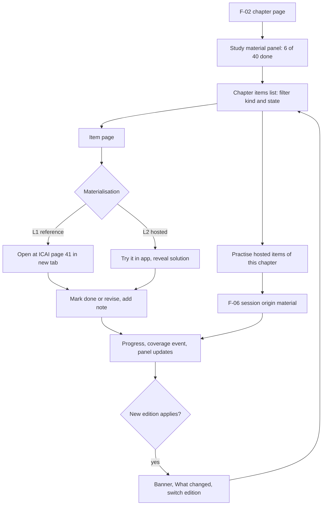
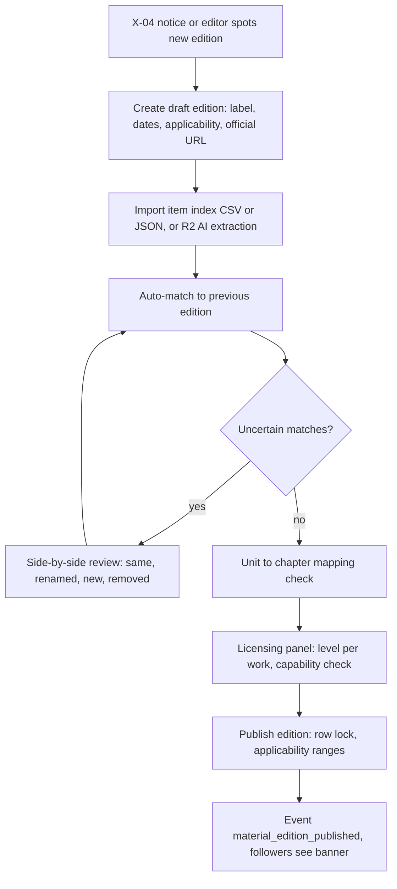
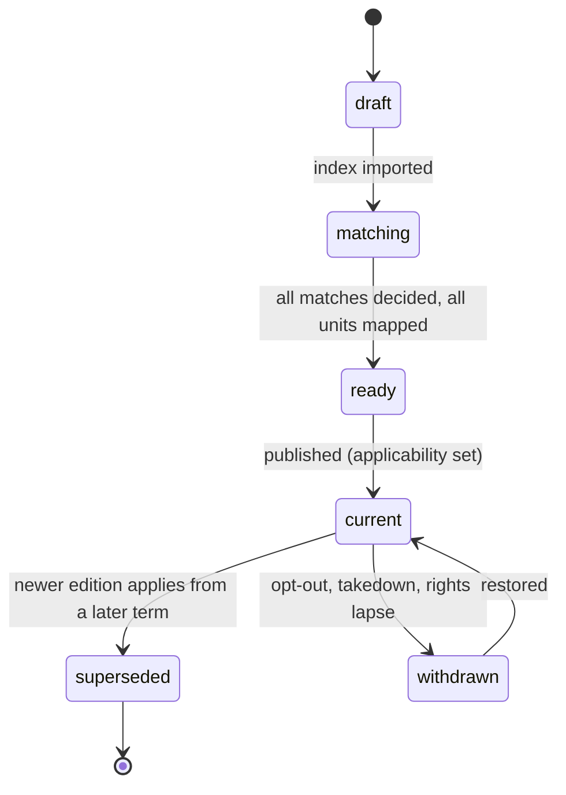

# PRD: F-12 Institute Study Material (MAT)

| Field | Value |
| --- | --- |
| Status | Draft (for founder review) |
| Owner | Pawan (founder) |
| Last updated | 2026-10-05 |
| Source | `docs/product/FEATURE_MAP.md` section F-12 (item 10: "Institute MAT with all illustrations and questions with their solutions"), page 2 mind map ("Institute -> module question practice", "Course bought -> MAT question practice"), section 7 risk 2 (Institute content), section 6 onboarding ("optionally the coaching you follow"), section 9 confirmations 1 and 2 (MAT = Institute study material; course bought = a paid coaching course the student has purchased) |
| Linked ERD | `docs/product/erd/F-12-institute-study-material.md` |
| Role | **Content-curation layer.** F-12 turns the printed structure of study material (chapter, illustration, example, exercise, test-your-knowledge question) into an index that every student can open from a chapter page, mark done, annotate and practise. Items that we may host become F-06 questions tagged "Institute MAT" or the coaching provider; items we may not host stay as references that open the exact page at the source. F-12 owns providers, works, editions, units, items, progress and the student's course registry. It owns **no** question, attempt, file, ingestion or notification tables |
| Modules | API `apps/api/modules/material` (tables `material_*`), web `apps/web/src/modules/material`. No new shared module |
| Feature flags | `study_material` (browse, progress, notes, registry, onboarding step), `study_material_mine` (private course checklists, P2). Server checked, 403 `feature_disabled`. Practice buttons additionally need the F-06 flag `question_bank` |
| Depends on | F-02 (`syllabus_*`, enrolment target term, chapter page), F-06 (`questionbank`, `practice`, `media`, events), X-04 (sources, takedown, **rights ledger extension defined in the F-04 ERD 3.3**), `profiles.role` |
| Siblings | [F-04 Super 50](./F-04-super-50-questions.md) (same legal ladder and ledger), [F-05 MCQ Bank](./F-05-mcq-bank.md) `[PROPOSED]`, [F-09 PYQ](./F-09-previous-year-questions.md) `[PROPOSED]`, [F-14 Amendments](./F-14-amendments.md) `[PROPOSED]`, [F-03 Notes](./F-03-notes-and-pdf.md) `[PROPOSED]`, [F-15 Recall](./F-15-recall-system.md) `[PROPOSED]`, [F-13 Today](./F-13-today-daily-tasks.md) `[PROPOSED]` |

---

## 1. Problem and goal

The Institute's study material (MAT) is the book every CA, CS and CMA student is told to master: each chapter has concepts, **illustrations**, summaries and a "Test Your Knowledge" section of MCQs, true/false, theory and practical questions with answers. Students work through it in a PDF or a printed module, lose their place ("did I do Illustration 12 or 13?"), cannot jump from the syllabus chapter to the exact illustration, cannot attach a note to it, and have no measure of "how much of the MAT have I actually done". Coaching students add a second layer: a paid course with its own question bank, which also lives outside any tracker. When the Institute revises the material (a new edition for the next attempt, or a reprint with corrections), they do not know what changed.

**Goal, in five parts:**

1. **Open the exact item.** From a chapter page the student sees "Study material: 40 items" and opens the exact illustration or question (the page in the official PDF when we may only link, the hosted item when we may host).
2. **Track it.** Mark done, revisit or skip; add a note; progress shows as "illustrations done 12 of 40" and feeds coverage.
3. **Practise it.** Hosted items are F-06 questions tagged "Institute MAT" (and the coaching provider), so attempts, mistakes, time and coverage work as everywhere else.
4. **Survive revision.** Editions are first-class. The student follows the edition that applies to her attempt; when a new edition appears she sees what changed, and her done marks and notes carry over through stable item identities.
5. **Stay inside the law.** A licensing check decides, per source, whether an item is a **reference** (link-out, metadata and page number only) or **hosted** (F-06 question). Hosting needs recorded evidence (the F-04 posture ladder and the X-04 rights ledger). A student-owned registry records what she follows and what she bought for personalisation only: no piracy features, no hosting of paid content unless rights are proven.

This is a product and engineering design, not legal advice. Every `[VERIFY]` needs counsel before launch (Q-F12-1).

## 2. Users and scenarios

**Aarav, CA Intermediate, studies Advanced Accounting from the Institute module.**
At onboarding he picks CA Intermediate, May 2027 and, on an optional step, the coaching he follows. On the chapter "Accounting for Branches" he sees a panel "Study material (ICAI, July 2024 edition): 18 illustrations, 22 questions, 6 of 40 done". He taps Illustration 7 and lands on an item page: "Illustration 7, page 41, Module 1, Chapter 3" with **Open at ICAI (page 41)**, **Mark done**, **Add note**. He reads it in the official PDF, comes back, marks it done and adds "check foreign branch conversion rate". The panel says 7 of 40. In the evening he practises the 12 hosted "Test your knowledge" MCQs of the chapter through the normal practice player.

**Neha, CS Executive, follows a coaching course and wants one checklist.**
She picked her coaching in onboarding (it was not in the list, so she typed it; it appears for her immediately and goes to an editor for a quick check). She registers "Company Law full batch" as a course she bought. The platform shows the Institute material and the F-04 lists from her coaching first. Her coaching's question bank is not on the platform and we have no rights to it, so she creates a **private checklist**: "Coaching QB, Chapter 4, Q1 to Q35". She ticks as she goes; the progress counts in her chapter view as hers only, flagged "self-declared". Nothing she enters is public or hosted.

**Rohan, CMA Final, gets a new edition mid-cycle.**
In June the Institute issues a revised edition applicable to the November attempt. Rohan, following the old edition, sees a banner on the Cost Audit chapter: "A new edition applies to Nov 2026. 14 items changed, 6 are new, 3 were removed. Your 52 done marks are kept." He opens "What changed", sees the 6 new items (to do), the 14 changed ones marked "revised since you did it", and switches his edition. Illustration numbering shifted by two in one chapter; his notes are still on the right illustrations.

**Meera, editor, imports a new edition.**
She uploads an item index (CSV from the Institute PDF, or the AI-assisted extraction in R2) for the new edition. The system matches items to the previous edition (identical text, same label and near-identical text, fuzzy within the chapter) and lists 9 uncertain matches. She resolves them in a side-by-side screen, maps two renamed chapters, checks the licensing panel (reference-only for this source), and publishes. Students following the old edition are told; progress is untouched.

## 3. Success metrics

Hypotheses to calibrate after the first 100 active students.

| Metric | Definition | Target | Event(s) |
| --- | --- | --- | --- |
| Chapter-to-item activation | Enrolled students who open at least one item from a chapter page within 7 days of enrolment | 40% | `material_item_opened` (from=chapter_page) |
| Items done per active week | Median items marked done per weekly active student who opened material | 15 | `material_item_marked` |
| Chapter material completion | Chapters with 100% of items done among chapters a student marked at least 5 items in | 35% | server counts |
| Open-at-source success | Link-out clicks that do not lead to a report within 24 h | 98% | `material_source_opened`, `material_report_submitted` |
| Onboarding coaching step | Students who select at least one provider or pick "none" explicitly | 60% (skip is allowed and never blocks) | `material_provider_followed`, `material_onboarding_skipped` |
| Edition handling | Students on an old edition who view "What changed" within 7 days of a banner | 60% | `material_edition_banner_viewed`, `material_changes_viewed` |
| Carry-over | Done marks and notes preserved across editions for matched items | 100% | invariant test |
| Mapping integrity | MAT items with a confirmed chapter | 99.5% (publish blocked below 100% for new editions) | server check |
| Match quality | Edition matches decided automatically and not reversed by a reviewer | 90% | `material_match_decided` (server) |
| Rights integrity | Hosted items whose source capability is valid at the daily audit | 100% (any miss alerts) | `material_rights_audit_failed` (server) |
| Link health | Reference deep links reachable at the weekly check | 97% | shared with F-04 `super50_linkcheck` |
| Save latency | PUT progress p95 | under 250 ms | server metrics |
| Offline reliability | Queued progress writes eventually saved | 99.5% | `material_write_queued`, `material_queue_replayed` |

## 4. Scope

### 4.1 In scope, by release

**R1 (Index, open, track)**
- Providers, works, **editions with applicability to attempts**, units mapped to syllabus chapters, items (illustration, example, exercise, question kinds) with printed label, page and kind.
- Item index import by editors (CSV and JSON template); matching across editions with human review.
- Chapter panel and item pages: **open the exact item** (deep link to the official PDF page for references), mark done, note, progress and "12 of 40", feed to coverage.
- Student registry: followed providers and "course bought", edition choice, onboarding step.
- Public study-material page per subject (facts and official links only).
- Hosted path **built and gated**: a source with a valid capability can have items materialised as F-06 questions; no hosting goes live without ledger evidence.

**R2 (Hosting, practice and revisions at scale)**
- Hosted items for sources with evidence (permissioned or licensed); practice sessions from a chapter's items; "Also asked in PYQ" badges; edition "What changed" UX complete; AI-assisted item extraction from official PDFs (X-04 `ai_summarise` or `derive_index` capability), amendment flags (F-14), notes through F-03.
- Private course checklists (`study_material_mine`).

**R3 (Scale and partners)**
- Partner coaching providers with hosted content and entitlements issued by the partner, Today provider (F-13), recall cards (F-15), supplements as linked works, bulk edition tooling.

### 4.2 Boundaries (what lives where)

| Need | Owner | How F-12 uses it |
| --- | --- | --- |
| Question text, options, key, solution, versions, takedown, duplicate detection, error reports for hosted items | F-06 `questionbank` | Hosted items are created only through `questionbank.services.upsert_from_source(origin_module='mat', external_ref=<item_key>, ...)`, tagged `institute-mat` and the provider tag. F-12 never writes `questionbank_*` |
| Attempts, scoring, mistakes, bookmarks | F-06 `practice` | `practice.services.create_session_from_items(origin_module='material', ...)`; "attempted" derived through `practice.selectors.question_states` |
| MCQ practice modes (timed, revision, custom test) | F-05 `[PROPOSED]` | F-12 deep links into the F-05/F-06 builder with `source_kind=institute_mat&chapter=` |
| Past paper appearances ("asked in May 2023") | F-09 `[PROPOSED]` | Read-only selector `pyq.selectors.appearances(question_ids)` |
| Rights evidence, capability flags, posture ladder | X-04 extension (F-04 ERD 3.3) | `ingestion.selectors.source_capabilities`, `require_capability` |
| Super 50 lists | F-04 | Independent; a Super 50 reference entry may point at a MAT item through the shared `canonical_key` grammar (`core/refs.py`) |
| Notes and the PDF library | F-03 `[PROPOSED]` | R1 notes are `material_progress.note`; when F-03 exists, notes anchor to `material_item` ids through `notes.services` and R1 notes migrate |
| Amendments and statutory updates | F-14 `[PROPOSED]` | F-12 shows "Amendments apply to this chapter" using `amendments.selectors.for_chapters`; it does not parse amendments |
| Recall cards from an illustration | F-15 `[PROPOSED]` | A "Make a recall card" action calls `recall.services.create_card(source={type:'material_item', id})` |
| Today tasks | F-13 `[PROPOSED]` | Registers a Today provider: "2 illustrations to do in GST-ITC" |
| Syllabus and coverage | F-02 | Keys and chapter ids via `syllabus.selectors`; coverage through a new event type (section 6, FR-F12-27) |
| Files | F-06 `media` | F-12 stores none; hosted items' images are F-06 attachments |

### 4.3 The licensing check (central design decision)

What the research found (appendix): the ICAI BoS Knowledge Portal publishes study material free for students but its IPR notice reserves all rights and prohibits reproduction or transmission "without the written permission of the ICAI"; each ICAI module carries a notice that no part may be reproduced or stored in a retrieval system without written permission; an ICAI announcement treats unauthorised use, downloading, extraction and copying of its examination material as an offence; ICSI and ICMAI terms could not be verified (`[VERIFY]`), although ICMAI publishes archives of study material per group on its student site; the educational exception of Section 52(1)(i) covers educational institutions in the course of instruction, not a commercial platform; Indian courts have blocked Telegram channels sharing coaching material. **Conclusion: indexing, deep linking and our own progress tracking are low risk; reproducing illustrations and solutions needs written permission.**

**Materialisation levels** (computed per work from the source's capabilities, never chosen by hand):

| Level | What exists per item | Capabilities needed | Student experience |
| --- | --- | --- | --- |
| **L0 Index** | Printed label ("Illustration 12"), kind, unit, page, chapter mapping, our one-line descriptor optional (max 140 chars, facts only) | `metadata` | Item appears in lists and progress |
| **L1 Deep link** | L0 plus a link to the page of the official file (`...pdf#page=41`) or the item URL | `link_out` | **Open at ICAI (page 41)** in a new tab |
| **L2 Hosted** | An F-06 question with stem, options, solution, tagged `institute-mat` | `host_questions`, `host_solutions`, `host_media` as needed | Item opens in the app; Try it, Reveal solution, practise |
| **L3 Practice** | L2 plus practice sessions | `practice` | Chapter practice from MAT questions |
| **L4 Public** | L2 plus SEO text | `public_seo` | Indexable item pages |

Default for ICAI, ICSI and ICMAI: **L1** (rung 1 of the F-04 ladder). L2 and above requires a ledger row such as a `written_permission` from the Institute's publication department naming the capabilities, subjects and a term; until then the hosted code path stays dark. A coaching provider is L1 at most for its own material (we cannot even index what is not public); a partner coaching provider with a signed agreement can reach L2 for the scope in the agreement. The posture ladder, its rules (default down, evidence up; no mirrors; facts not expression; TDM and robots respected; 24-hour opt-out) are defined once in [F-04 PRD 4.3](./F-04-super-50-questions.md) and apply here unchanged.

**No piracy features, by design:**
1. We never accept an upload of a provider's paid PDF into any shared surface. A student's own copy may live in her **private** F-03 library (F-03 must keep private documents unshareable); F-12 may deep link into it ("Open in my copy, page 41") but never copies, shares or indexes its text.
2. We never link to mirrors, Telegram channels or file lockers (the X-04 deny-list applies); official links only.
3. The registry records **claims** ("I bought this course"), not proofs. Claims unlock personalisation only (what we show first, which lists and checklists), never access to paid content. No receipts, payment details or screenshots are collected.
4. Entitlements to partner-hosted paid content (R3) come from the partner (a signed claim or code), recorded with the source of the entitlement, and expire with the partner's term.
5. A rights-holder notice (`/legal/copyright`, F-06 8.7) or a source opt-out reaches F-12 through the same X-04 takedown and the daily audit: hosted items are withdrawn through F-06, references are hidden, progress is kept.

### 4.4 Out of scope (later or elsewhere)

| Item | Where |
| --- | --- |
| Reading the MAT inside the app (a PDF viewer) | F-03 PDF library for the student's own copy; official PDFs open at the source |
| AI answers to MAT items | F-07 (long-form evaluation) over F-06 questions |
| Priority of chapters by marks | F-11 |
| Selling or reselling any material | Billing pointer; not a goal |
| Hindi material | English first (F-06 Q11) |
| RTP and MTP papers | F-08 and F-09; they are different works with their own editions and ladders |

## 5. User flows

### 5.1 Student: from chapter to done



### 5.2 Editor: new edition



### 5.3 Edition lifecycle



### 5.4 Edge cases (designed and tested)

| Case | Behaviour |
| --- | --- |
| Item renumbered in a new edition | Same `item_id`; the label shows per edition ("Illustration 14, was 12 in the July 2024 edition"); done and notes kept |
| Item changed in content | Same `item_id`, `change_kind = edited`; students who did it see "Revised since you did it" with a one-tap "Mark as revisited" |
| Item removed in the new edition | Kept for students on the old edition; hidden and excluded from totals for the new edition; progress kept (never deleted) |
| Item split or merged | One keeps the identity; the other is `new` or `removed`; reviewers decide in the matching screen |
| Chapter renamed or moved between modules | Unit mapping keys on stable `unit_key`; the chapter mapping is re-proposed from the F-02 chapter map and confirmed by an editor |
| Student's printed book is an older edition | She picks it in settings ("My edition"); all items show the labels of that edition; banner never nags again for 30 days after dismissal |
| No target attempt in enrolment | Latest `current` edition; banner explains how to set the attempt |
| Two editions overlap in applicability | Impossible: a database exclusion constraint on term ranges per work (ERD 2.3) |
| Source opts out while the student is mid-practice | Open sessions continue (F-06 rule); hosted items vanish from lists; references stay hidden; progress kept |
| Deep link page offset wrong | "Report wrong page" on the item page; editors fix the offset for the whole edition, not item by item |
| Offline | Reading cached lists works; progress writes queue and replay; Open at source disabled with explanation; practice only for loaded sessions |
| Flag off | `study_material` off: panel hidden, every endpoint 403 `feature_disabled` |
| Custom coaching name typed by student | Visible to her at once as `pending`; editor merges it into an existing provider or approves it; duplicates are merged by normalised name |

## 6. Functional requirements

Priorities: P0 = R1, P1 = R2, P2 = R3 or later. G/W/T = Given/When/Then.

### A. Providers, works and editions

| ID | Requirement | Priority | Acceptance criteria |
| --- | --- | --- | --- |
| FR-F12-01 | A **provider** is the publisher of material: `institute` (ICAI, ICSI, ICMAI), `coaching`, or `publisher`. Each provider is linked 1:1 to an X-04 `ingestion_source` that carries its rights (manual sources allowed) | P0 | G an editor creates provider "ICAI" T an `ingestion_source` exists at rung 1 with capabilities `link_out`, `metadata`, `ai_map` |
| FR-F12-02 | A **work** is one title of a provider for one subject and level (for example "ICAI study material, CA Intermediate, Advanced Accounting"), identified by a stable `work_key`, independent of editions | P0 | G a new edition is published W the work exists T the `work_key` and URLs are unchanged |
| FR-F12-03 | An **edition** of a work has a label ("July 2024 edition, reprint August 2025"), edition date, optional reprint date, the term range it applies to (`applies_from_term`, optional `applies_to_term`, as F-02 term codes), an `applicability_note` with the official source ("per ICAI applicability notice for Sept 2026") and its official URL | P0 | G an edition applies from `2026-09` W another edition applies from `2026-05` to `2026-05` T both coexist; overlapping ranges are rejected by the database |
| FR-F12-04 | **Statuses** `draft`, `matching`, `ready`, `current`, `superseded`, `withdrawn`. Only `current` editions are visible to students; `superseded` stays readable for students who follow it | P0 | G an edition is draft T no student endpoint returns it |
| FR-F12-05 | Publishing an edition is atomic: it takes a row lock on the work, validates term ranges, sets the previous overlapping edition `superseded` from the new edition's start term, emits `material_edition_published` | P0 | G two editors publish at once T one succeeds, the other gets 409 `stale_edition` |
| FR-F12-06 | `[NEW, P1]` **Supplements** (statutory updates, addenda) are separate works of kind `supplement` linked to a base work and an attempt; they appear under the chapter as "Updates" and never overwrite items | P1 | G a statutory update applies to May 2027 T the base work's chapter shows an "Updates (1)" link to it |

### B. Units, items and mapping

| ID | Requirement | Priority | Acceptance criteria |
| --- | --- | --- | --- |
| FR-F12-07 | An edition has **units** (the book's own chapters or units) with a stable `unit_key`, printed number and title, page range, and a mapping to one or more F-02 chapters | P0 | G a unit covers two syllabus chapters T it is mapped to both; items of that unit show under both chapter panels |
| FR-F12-08 | An **item** is the stable identity of an illustration, example, exercise or question inside a work: `item_key`, `kind` (`illustration`, `example`, `exercise`, `mcq`, `true_false`, `theory`, `practical`, `case_study`), unit key, and a chapter mapping | P0 | G the same illustration appears in two editions T it is one item |
| FR-F12-09 | Each edition lists its items with the **printed label**, ordinal, page, content hash and `change_kind` versus the previous edition (`same`, `edited`, `renumbered`, `new`, `removed`) | P0 | G illustration 12 becomes 14 T the item is `renumbered` with both labels visible in history |
| FR-F12-10 | Items map to chapter and optionally topic with human confirmation; an edition cannot be published with unconfirmed items | P0 | G one item is unmapped T publish is blocked with `mapping_incomplete` and lists it |
| FR-F12-11 | **Item index import** (CSV and JSON template: label, kind, unit, page, chapter key, optional descriptor, optional hosted payload) creates items and edition rows idempotently by `(work, unit_key, kind, printed_label)` | P0 | G the same file is imported twice T the second import changes nothing |
| FR-F12-12 | **Matching across editions**: hash equality, then same label and near-identical text, then fuzzy match within the unit (SimHash distance and trigram re-rank), else `new`; matches below the confidence threshold wait for a reviewer | P0 | G 3,000 items W 9 low-confidence matches T exactly those 9 are in the review list and nothing publishes until decided |
| FR-F12-13 | Matching never merges across kinds or across works, and never matches a hosted item to a reference item without a reviewer | P0 | G an illustration resembles an exercise T they are not auto-matched |
| FR-F12-14 | `[NEW, P1]` **AI-assisted index extraction** from the official PDF (labels, kinds, pages, chapter) as an X-04 job, only for sources with `ai_map` and `derive_index`; reviewers confirm | P1 | G an extraction runs T every item is `needs_review`, none is published automatically |

### C. Opening, marking and notes

| ID | Requirement | Priority | Acceptance criteria |
| --- | --- | --- | --- |
| FR-F12-15 | **Open the exact item from a chapter page**: the F-02 chapter page shows a panel with counts by kind and a list; each item opens `/app/material/item/$itemId` | P0 | G the student taps Illustration 7 T the item page opens in one navigation and shows label, page, unit, edition |
| FR-F12-16 | For a **reference** item the primary action is **Open at {source} (page N)**: the official file URL with `#page=N` (printed page plus the edition's `page_offset`), opening in a new tab with `rel="noopener noreferrer"` | P0 | G page 41 and offset 8 T the link ends with `#page=49` |
| FR-F12-17 | For a **hosted** item the page shows the question; the solution is collapsed behind Reveal; "Try it" starts an F-06 practice session of that item | P1 | G the solution is revealed T the F-06 review view is shown only if the source has `host_solutions` |
| FR-F12-18 | **Mark done**: states `done`, `revise`, `skipped` (no row means to do), one tap from the list and the item page, with undo | P0 | G the student taps Done T the state changes in under 100 ms (optimistic), persists, and the panel count updates |
| FR-F12-19 | For hosted items, "done" is also **derived** when the student attempted the question in any F-06 session; it shows "done by practice" and cannot be un-derived (she can still mark revise) | P1 | G an F-06 session answers the MAT question T the item shows done without a manual mark |
| FR-F12-20 | **Notes**: a private note per item (max 2,000 characters). In R1 stored in `material_progress.note`; for hosted items the F-06 note is the same text (one source of truth chosen by the service) | P0 | G a note is saved offline T it syncs once; it is included in the export |
| FR-F12-21 | `[PROPOSED: F-03]` Notes become anchored F-03 notes: `notes.services.create_note(user_id, body_md, anchors=[{type:'material_item', id}], chapter_id)`; existing R1 notes migrate in one job | P2 | G F-03 ships T the migration copies notes and keeps ids so no note is lost |
| FR-F12-22 | **Revised since you did it**: when a matched item's content changed in a newer edition and the student marked it done in an older one, the item shows the badge until she taps "Revisited" | P1 | G `change_kind = edited` and done on the older edition T badge shown on the new edition |
| FR-F12-23 | **Open in my copy** `[PROPOSED: F-03]`: if the student bound her own private PDF to an edition, the action opens it at the page | P2 | G a bound file exists T the link opens the viewer at the page |

### D. Progress and coverage

| ID | Requirement | Priority | Acceptance criteria |
| --- | --- | --- | --- |
| FR-F12-24 | **Chapter progress**: "illustrations done 12 of 40" is computed over the items of the student's edition mapped to the chapter, by kind (illustrations, examples, questions) and total; removed or other-edition items are excluded from totals | P0 | G the student follows edition B with 40 items W 12 are done T the panel says 12 of 40 |
| FR-F12-25 | Progress carries across editions through item identity; matched items keep their state and note; new items are to do | P0 | G edition B publishes and the student switches T her 52 done marks remain and 6 new items are to do |
| FR-F12-26 | Progress writes are idempotent and offline-capable: one row per `(user, item)`, last writer wins by `client_ts`, replays create no duplicates | P0 | G two devices mark the same item T the later `client_ts` wins and no 500 occurs |
| FR-F12-27 | **Coverage feed** `[PROPOSED EXTENSION to F-02]`: the service emits `material_progress_changed` (debounced 5 minutes per student and chapter) and calls `coverage.services.record_event(type='material_progress', value=percent_done, source='material', payload={done,total}, client_id=uuid5(user, chapter, day))`. Coverage treats it as the **practice** component input and takes the maximum of the F-06 practice measure and this one (no double counting) | P0 | G 12 of 40 done T the chapter's practice component reads at least 30%; F-06 practice sessions on MAT questions do not add a second 30% |
| FR-F12-28 | Self-declared progress (private checklists) is flagged `self_declared`; coverage shows it with the same badge as F-04's manual ticks and F-10 may exclude it | P2 | G a private checklist item is done T the event payload carries `self_declared=true` |
| FR-F12-29 | Subject and work views show overall progress ("Advanced Accounting MAT: 112 of 480") with a stacked bar by kind and text values | P0 | G the bar is rendered T it has a text alternative with the numbers |

### E. Practice

| ID | Requirement | Priority | Acceptance criteria |
| --- | --- | --- | --- |
| FR-F12-30 | **Practise this chapter's MAT**: builds an F-06 session from the chapter's hosted items (all, not done, wrong last time, kinds), `origin_module='material'`, `origin_ref=<edition id>` | P1 | G 22 hosted items W Practise 10 not done T a session of 10 opens in under 2 s |
| FR-F12-31 | For reference items practice is **Practise the same ground**: platform questions mapped to the item's chapter and topic via the F-06 picker | P1 | G a reference item mapped to a topic T the button starts a session filtered to that topic |
| FR-F12-32 | MAT MCQs appear in F-05's modes through the source filter (`source_kind=institute_mat`) without any F-12 code | P1 | G F-05 filters by source T MAT questions are included |
| FR-F12-33 | Item pages show **"Also asked in {term}"** from F-09 when the same question is a PYQ, and "In N Super 50 lists" from F-04, through their selectors | P2 | G a MAT question is a duplicate of a PYQ T the badge shows the term |

### F. Registry, onboarding and editions per student

| ID | Requirement | Priority | Acceptance criteria |
| --- | --- | --- | --- |
| FR-F12-34 | **Onboarding step "Which coaching do you follow?"**: optional, skippable, never blocks the first plan; search the provider list; choose several; "Other" accepts free text; "None, I self-study" is an explicit choice | P0 | G the student skips T onboarding completes and no row is written; G she types "XYZ Classes" T a `pending` provider is created and linked to her at once |
| FR-F12-35 | **Student registry** (`/app/settings/material`): providers she follows and **courses she bought** (provider, course title, purchased on, optional valid until, subjects, batch). It records claims only; no proof is requested | P0 | G she adds a course W the page shows "Used only to personalise what we show first" T no file or payment data is asked |
| FR-F12-36 | Registry drives personalisation: followed providers first in material and F-04 lists, "Course bought" tag filters in the F-06 browser, and F-13 suggestions | P1 | G she follows coaching A T lists and items tagged A sort first and the tag filter has a "My coaching" chip |
| FR-F12-37 | **Edition selection**: default is the edition whose applicability covers her target term; she may choose another per work ("My edition"); the choice is remembered | P0 | G the target term is `2027-05` T the matching edition is selected and labelled "Applies to your attempt" |
| FR-F12-38 | **Edition banner**: when a newer applicable edition exists than the one she follows, a dismissible banner shows counts (changed, new, removed) and "What changed" | P1 | G edition B publishes T within 15 minutes she sees the banner with exact counts |
| FR-F12-39 | **What changed** view per work or chapter: new, removed, renumbered, edited items between two editions | P1 | G A to B has 14 edited T the view lists those 14 with both labels |
| FR-F12-40 | `[NEW, P2]` **Private course checklist**: a private work with items generated from a range ("Chapter 4, Q1 to Q35"), tracked like any item; never public, never hosted, never shared | P2 | G she creates 35 items T they are tracked and flagged `self_declared`; Share is absent |
| FR-F12-41 | Quotas (free): 5 private works, 1,000 private items, 20 custom providers typed | P2 | G the 6th private work T 429 `quota_exceeded` |

### G. Rights, admin and platform

| ID | Requirement | Priority | Acceptance criteria |
| --- | --- | --- | --- |
| FR-F12-42 | The **licensing panel** per work shows its materialisation level, the capabilities held, the evidence with expiry and what each higher level needs; it is read-only for editors and links to the X-04 ledger for admins | P0 | G a permission expires in 30 days T the panel shows the date and an admin reminder exists |
| FR-F12-43 | Hosting is **capability-gated**: `publish_edition` and the materialiser call `require_capability`; hosted items without cover are rejected (`rights_blocked`) | P0 | G a rung-1 source W an editor imports a hosted payload T publish is blocked and the items are listed |
| FR-F12-44 | **Daily rights audit**: hosted items lose cover T the edition is `withdrawn` for those items, F-06 is asked to unpublish them (`withdraw_by_source`), admins are alerted, event `material_edition_withdrawn` | P0 | G a licence expires T hosted items disappear within 24 h; references remain |
| FR-F12-45 | **Report** an item: `wrong_page`, `wrong_chapter`, `wrong_label`, `link_dead`, `wrong_answer` (hosted only, routed to F-06 `report_error`), `copyright`, `other` | P1 | G she reports `wrong_page` T one open report per kind per item per student; three distinct reporters flag the item |
| FR-F12-46 | Public study-material page per subject lists works, edition labels, applicability, the official link, chapter list and counts by kind (facts only) with SEO | P0 | G an anonymous visitor opens it T no item text appears unless L4; JSON-LD `ItemList` and `BreadcrumbList` present |
| FR-F12-47 | Export and delete: `export_for_user` and `delete_all_for_user` cover progress, notes, registry, edition choices, private works | P0 | G the account is deleted T all `material_*` rows keyed by the user are gone; platform data untouched |
| FR-F12-48 | Events: domain events `material_edition_published`, `material_edition_withdrawn`, `material_progress_changed`; product events in section 10 | P0 | G an edition is published T exactly one domain event is written in the same transaction |

## 7. Screens and URLs

All app screens are noindex (`buildHead`), all state is in the URL; public pages use `buildHead` with canonical URLs.

| Screen | URL | Notes |
| --- | --- | --- |
| Hub: my material | `/app/material` | `?subject=&provider=`; works for enrolled subjects with progress |
| Work overview | `/app/material/$workKey` | `?edition=`; chapters with progress by kind |
| Chapter items | `/app/material/$workKey/$chapterKey` | `?kind=illustration\|example\|exercise\|mcq\|...&state=todo\|done\|revise&edition=&q=`; also embedded as a panel on the F-02 chapter page |
| Item | `/app/material/item/$itemId` | `?edition=`; stable across editions |
| What changed | `/app/material/$workKey/changes` | `?from=&to=&chapter=` |
| My courses | `/app/settings/material` | Followed providers, courses bought, my edition per work |
| Private checklists | `/app/material/mine`, `/app/material/mine/new` | P2 |
| Onboarding step | `/app/onboarding?step=coaching` | Optional step registered into F-02 onboarding |
| Admin: works and editions | `/app/admin/material/works`, `/app/admin/material/editions/$id` | Import, units, mapping |
| Admin: matching review | `/app/admin/material/editions/$id/matching` | Side by side; `?item=` |
| Admin: licensing | `/app/admin/material/rights` | Level per work, evidence, expiry (edit rights in Django admin, X-04) |
| Admin: providers, reports | `/app/admin/material/providers`, `/app/admin/material/reports` | Pending custom providers, merge |
| Public subject page | `/courses/$course/$level/$subject/study-material` | SSR, indexable; official link-outs, edition labels, counts |

### 7.1 Wireframes (mobile first, 320 to 1280 px)

**F-02 chapter page, Study material panel**

```
┌──────────────────────────────────┐
│ Accounting for Branches          │
│ ...coverage, read, revise...     │
│ ┌ Study material · ICAI ────────┐│
│ │ July 2024 edition · your attempt││
│ │ Illustrations ▓▓▓░░░  12 of 40 ││  text + progress, 44 px rows
│ │ Questions     ▓░░░░░   6 of 22 ││
│ │ Next up: Illustration 7  [Open]││
│ │ [All items]  [Practise 12]     ││  Practise only if hosted
│ └────────────────────────────────┘│
│ ⚠ New edition applies to Nov 26  │
│   14 changed · 6 new  [See what]  │
└──────────────────────────────────┘
```

**Item page (reference item), mobile**

```
┌──────────────────────────────────┐
│ ← Branches · Illustration 7      │
│ ICAI Advanced Accounting M1      │
│ Chapter 3 · page 41 · July 2024  │
│ "Foreign branch, conversion"     │  our descriptor (optional, 140)
│ [ Open at ICAI (page 41) ↗ ]     │  ExternalLinkButton
│ ○ To do  ● Done  ◐ Revise        │
│ Note ───────────────────────────│
│ check conversion rate…           │  autosave, offline safe
│ Also: In 3 Super 50 lists · PYQ  │  badges (F-04, F-09)
│ [Practise the same ground]       │
│ Report wrong page / link         │
└──────────────────────────────────┘
```

**My courses and editions (`/app/settings/material`), desktop**

```
┌ My courses ───────────────────────┬ My editions ──────────────────────┐
│ ICAI (Institute)        [Following]│ Advanced Accounting               │
│ XYZ Classes · Company Law batch    │  ● July 2024 (applies to May 27)  │
│   bought 12 Jun 2026   [Edit] [x]  │  ○ Choose another edition ▾       │
│ [+ Add provider]                   │ Taxation                          │
│ Used only to show your things      │  ● July 2025 (applies to May 27)  │
│ first. No proof asked.             │                                   │
└────────────────────────────────────┴───────────────────────────────────┘
```

### 7.2 UI states per screen

**Chapter panel and items list**

| State | Behaviour |
| --- | --- |
| First time | One-time sheet: "Tick items as you finish them. We keep your marks even when the Institute revises the material." |
| Empty (no material indexed for this chapter) | "We have not indexed the material for this chapter yet" with "Notify me" (X-01) and "Create a checklist" (when `study_material_mine` is on) |
| Loading | Panel skeleton with three stable rows; list skeleton rows |
| Partial | Items first; progress and derived "done by practice" load a moment later and fade in; failure shows the list and a quiet "Your progress could not load. Retry" |
| Success | Counts by kind, next up, list with state controls |
| Error | Alert with Retry and request id; last good data dimmed |
| Offline | Banner "Offline: showing saved items"; marks queue with a visible count; Open at source disabled with explanation |
| Flag off | Panel hidden; routes show "Study material is not available yet" |
| Quota exceeded | Private works at the limit: "You have 5 checklists. Delete one to add another" |
| Long content | Labels and descriptors wrap; descriptors clamp at 3 lines with Expand; unit titles wrap |
| Edition mismatch | Banner as in the wireframe; dismissal remembered for 30 days |
| Removed in newer edition | Item row shows "Not in the current edition" in text with an icon, stays visible only on the old edition |

**Item page**: loading skeleton, error with retry, offline (note and mark work, links disabled), reference vs hosted layouts, hosted with solution collapsed (`aria-expanded`), `removed` and `taken_down` ("This item was removed. Your note is kept."), no permission (404).

**Registry and onboarding step**: first time (explains personalisation and privacy in two lines), search empty ("Not found? Add it"), pending custom provider (badge "Waiting for a quick check"), saving error with retry, offline (changes queued), duplicate provider (merge prompt), quota.

**Admin matching**: empty ("All matches decided"), loading, side-by-side long text with horizontal scroll inside the pane, conflict (409 stale edition), permission denied for non-editors.

### 7.3 Design-system components

Existing: Accordion, Alert, Badge, Breadcrumb, Button, Card, Checkbox, Dialog, DropdownMenu, EmptyState, FilterChip, Input, Label, Progress, SegmentedControl, Sheet, Combobox, TagInput, DataTable, Pagination/LoadMore, SplitPane, RichText.

New in `packages/design-system` (showcase entry, four themes, contrast checked, 44 px targets): `ProgressSegments` (stacked bar by kind with a required text alternative), `ExternalLinkButton` (shared with F-04: icon, "opens a new tab" in the accessible name, `rel` set once), `DiffList` (shared with F-04), `StateToggle` (three-state done/revise/to do control with icon and text, keyboard arrow navigation).

App-specific (`apps/web/src/modules/material`): `MaterialPanel` (chapter panel), `ItemRow`, `ItemDetail`, `EditionBanner`, `ProviderPicker`, `CourseRegistryForm`, `MatchReview`, `LicensingPanel`.

## 8. Data and permissions

Entities are in the ERD: `material_provider`, `material_work`, `material_edition`, `material_unit`, `material_unitchapter`, `material_item`, `material_editionitem`, `material_progress`, `material_userprovider`, `material_useredition`, `material_report`, `material_importjob`, `material_auditlog`. Rights evidence is the X-04 extension (F-04 ERD 3.3).

### 8.1 Permission matrix

| Action | Anonymous | Student | Editor | Admin |
| --- | --- | --- | --- | --- |
| Read the public subject page | yes | yes | yes | yes |
| Open items, mark done, note, practise, report | no | yes | yes | yes |
| Manage own registry, edition choice, private checklists | no | yes | yes | yes |
| Create providers (custom, pending), works, editions, import indexes, map units, decide matches | no | custom provider only | yes | yes |
| Publish an edition at L0 and L1 | no | no | yes | yes |
| Publish hosted items (L2 and above) | no | no | propose only | yes (needs ledger evidence) |
| Record or revoke rights evidence, block a provider, withdraw an edition | no | no | no | yes |
| Read another student's progress or registry | no | no | no | no |

### 8.2 Privacy, retention and DPDP

- Personal data: progress marks and dates, notes, registry (which coaching she follows or bought and when), edition choices, private checklists. A coaching purchase is business-sensitive but not financial data: **no receipts, amounts or payment identifiers are collected**.
- `delete_all_for_user` removes all of it; `export_for_user` returns it as JSON. Registered with the central erasure hook `[PROPOSED: profiles]` (audit AUD-004).
- Custom provider names typed by students are not personal data once normalised; the link between a student and a pending provider is deleted with the account.
- No note text or descriptor text reaches PostHog or Sentry. Students may be minors: consent and age gate belong to auth (F-06 8.6 `[VERIFY with counsel]`).
- Retention: progress and notes until deletion; reports 24 months; audit log 3 years; import files 30 days (F-06 media rules).

## 9. API surface

REST under `/api/v1/material/`. Bearer Supabase token unless marked public. Errors use the `core/errors` envelope. Cursor pagination (`cursor`, `limit` up to 100). Writes take `client_id` or `client_ts`. Throttle scopes: `material_read` 300/min, `material_write` 120/min, `material_report` 20/h, `material_import` 10/h, `material_public` 60/min per IP. Flag `study_material` answers 403 `feature_disabled` on every endpoint.

### 9.1 Public

| Method and path | Auth | Purpose | Notes and errors |
| --- | --- | --- | --- |
| GET `public/subjects/{course}/{level}/{subject}/material/` | public, CDN `s-maxage=300, stale-while-revalidate=3600` | Works, edition labels, applicability, official link, chapters with counts by kind | Facts only; no item text unless L4; 404 unknown subject |

### 9.2 Student

| Method and path | Auth | Purpose | Notes and errors |
| --- | --- | --- | --- |
| GET `works/` | user | Works for my subjects or `subject=`; `include=progress` | |
| GET `works/{work_key}/` | user | Work, my edition, chapters with progress by kind, banner data | `?edition=` |
| GET `works/{work_key}/chapters/{chapter_key}/items/` | user | Items (`kind`, `state`, `q`, `edition`, `cursor`) with overlay | Hosted entries carry a key-free card |
| GET `chapters/{chapter_id}/summary/` | user | Panel data for the F-02 chapter page (done and total by kind, next up) | ETag, cached 60 s per student |
| GET `items/{id}/` | user | Item with labels per edition, locator, my state and note | `?edition=`; 404 when not visible |
| GET `items/{id}/solution/` | user | Solution of a hosted item | 403 `rights_blocked` unless `host_solutions`; delegates to F-06 `get_review_view` |
| PUT `progress/{item_id}/` | user | `{state, note, client_id, client_ts}` | Idempotent; older `client_ts` ignored |
| POST `progress/batch/` | user | Offline replay, max 100 | Per-item result |
| POST `items/{id}/practice/`, `works/{work_key}/practice/` | user | Start an F-06 session (`scope`, `chapter_ids`, `kinds`, `count`, `mode`, `client_id`) | 422 `no_hosted_items`; 409 `question_bank_disabled` |
| GET `works/{work_key}/changes/?from=&to=&chapter=` | user | Diff between two editions | |
| PUT `me/editions/{work_key}/` | user | `{edition_id \| null}` | 422 `edition_not_available` |
| GET `providers/?q=`, POST `providers/` | user | Search; create custom (pending) | 429 `quota_exceeded`; merges by normalised name |
| GET, POST `me/providers/`, PATCH, DELETE `me/providers/{id}/` | user | Registry: `relation` (`follows`, `bought_course`), `course_title`, `purchased_on`, `valid_until`, `subjects` | No proof fields exist |
| POST `items/{id}/report/` | user | `{kind, message}` | One open report per kind per item per student |
| GET, POST `mine/works/`, POST `mine/works/{id}/items/` | user (`study_material_mine`) | Private checklists | 429 `quota_exceeded` |
| GET `me/export/`, DELETE `me/data/` | user | DPDP | |

### 9.3 Admin

| Method and path | Auth | Purpose | Notes and errors |
| --- | --- | --- | --- |
| GET, POST, PATCH `admin/providers/`, POST `admin/providers/{id}/merge/` | editor | Providers | Admin for rights |
| GET, POST `admin/works/`, POST `admin/works/{id}/editions/` | editor | Works and draft editions | |
| POST `admin/editions/{id}/import/` | editor | Upload CSV or JSON index (F-06 `media` file) | Returns import job; 422 row errors |
| GET, PUT `admin/editions/{id}/units/`, PUT `admin/units/{id}/chapters/` | editor | Units and chapter mapping | |
| GET `admin/editions/{id}/matches/?status=needs_review`, PUT `admin/matches/{id}` | editor | Decide matches (`same`, `renamed`, `new`, `removed`, `split`) | |
| POST `admin/editions/{id}/publish/`, `withdraw/`, `restore/` | editor (L0, L1) or admin (L2 and above) | Lifecycle | 409 `stale_edition`, `rights_blocked`, `mapping_incomplete` |
| GET `admin/works/{id}/rights/` | editor | Licensing panel data | Read-only |
| GET, POST `admin/reports/` | editor | Reports | |
| POST `internal/tick/` | secret header | Banner audience, progress debounce flush, rights audit, link checks | Bounded 20 s |

## 10. Notifications and analytics events

### 10.1 Product events (PostHog, `noun_verb`, no personal text)

| Event | Properties |
| --- | --- |
| `material_hub_viewed` | works_count_bucket, from |
| `material_chapter_viewed` | kind_counts_bucket, edition_relation (mine, other), from (chapter_page, hub, notification) |
| `material_item_opened` | kind, materialisation (reference, hosted), from (chapter_page, list, search, super50), edition_relation |
| `material_source_opened` | provider_kind, kind, has_page (link-out click, no URL) |
| `material_item_marked` | state, kind, via (manual, practice), offline |
| `material_note_saved` | length_bucket, kind |
| `material_practice_started` | scope, count, hosted_available_bucket |
| `material_onboarding_step_viewed`, `material_onboarding_skipped` | none |
| `material_provider_followed`, `material_provider_unfollowed` | provider_kind, relation, via (onboarding, settings) |
| `material_provider_added_custom` | via |
| `material_edition_banner_viewed`, `material_edition_banner_dismissed` | changed_bucket, new_bucket |
| `material_edition_switched` | work_kind, direction (newer, older) |
| `material_changes_viewed` | changed_bucket, from |
| `material_report_submitted` | kind |
| `material_checklist_created` | items_bucket |
| `material_write_queued`, `material_queue_replayed` | count, age_bucket |
| `material_import_finished` (server) | rows_bucket, error_bucket |
| `material_match_decided` (server) | decision, method, confidence_bucket |
| `material_edition_published` (server) | items_bucket, new_bucket, edited_bucket, removed_bucket, level |
| `material_rights_audit_failed` (server) | capability, provider_kind |

### 10.2 Domain events (outbox, F-06 envelope)

| Event | Emitted when | Payload | Consumers |
| --- | --- | --- | --- |
| `material_edition_published` | edition becomes current | `work_id`, `edition_id`, `applies_from`, `counts{new, edited, renumbered, removed}`, `subject_key`, `course`, `level` | X-01 (banner and notification), F-13, caches |
| `material_edition_withdrawn` | withdrawn | `edition_id`, `reason` (`opt_out`, `takedown`, `rights_lapsed`, `editorial`) | X-01, caches |
| `material_progress_changed` | progress changes (debounced) | `user_id`, `chapter_id`, `done`, `total`, `self_declared` | Coverage subscriber (registered by F-12, calls `record_event`) |

### 10.3 Notifications `[PROPOSED: X-01]`

| Trigger | Copy |
| --- | --- |
| New edition applies to my attempt | "A new edition of Advanced Accounting applies to May 2027: 14 changed, 6 new. Your marks are kept. See what changed." |
| Provider you follow adds material | "XYZ Classes added Company Law questions. Open the checklist." (R3) |
| Pending provider approved | "Your coaching XYZ Classes is now in the list." |
| Report resolved | "We fixed the page number you reported. Thank you." |

## 11. Non-functional requirements

| Area | Requirement |
| --- | --- |
| Performance | `NFR-F12-01` chapter summary p95 under 150 ms (cached 60 s with ETag); items list p95 under 300 ms uncached; item page under 250 ms; progress PUT p95 under 250 ms; public page CDN hit under 80 ms |
| Scalability | `NFR-F12-02` planning assumption about 25 items per chapter: CA 304, CS 407, CMA 231 chapters (F-02 seed) give about 16,000 items per edition; each new edition adds an edition row per item (about 16,000), so 3 editions in 3 years is under 60,000 `material_editionitem` rows; progress rows: 5,000 MAU x 400 = 2 million in year 1, 50,000 x 500 = 25 million in year 3. Edition publish with 3,000 items runs as a background job under 20 s of compute |
| Accessibility | `NFR-F12-03` WCAG 2.2 AA; state control has icon plus text and arrow-key navigation; progress has text alternatives; the external link button announces "opens in a new tab"; 44 px targets (the audit found 36 and 40 px buttons elsewhere); no colour-only states |
| Responsive and themes | `NFR-F12-04` 320 to 1280 px, no horizontal scroll (side-by-side matching scrolls inside its pane); four themes with semantic tokens |
| SEO | `NFR-F12-05` public subject page SSR with `buildHead`, canonical URL, `ItemList` and `BreadcrumbList` JSON-LD, OG image `/og/courses/.../study-material`; all `/app` pages `noindex`; no item text on public pages unless `public_seo` |
| Security | `NFR-F12-06` RLS deny-all on every table; user id only from the JWT; 404 for invisible items; keys only through F-06 review view and only when `host_solutions` holds; link validation (https, source hosts only, deny-list, no IP literals); files parsed only by the worker |
| Rights integrity | `NFR-F12-07` publish-time check, daily audit, `capabilities_at_publish` stored per edition; a hosted item is never served more than 24 hours after its cover lapsed |
| Concurrency | `NFR-F12-08` one `current` edition per work and term range enforced by an exclusion constraint plus a row lock in `publish_edition`; progress upserts are single-statement `ON CONFLICT` guarded by `client_ts`; matching decisions use optimistic `version` columns; coverage emission is idempotent by `client_id` (audit AUD-001, AUD-006) |
| Cost | `NFR-F12-09` AI extraction (R2) is metadata-first, budgeted in X-04's daily AI budget, at most 500 items per job, cached by file SHA-256 |
| Reliability | `NFR-F12-10` progress writes never block on coverage; failed coverage events retry from the outbox; ticks bounded to 20 s |
| Observability | `NFR-F12-11` events named exactly as in section 10; a test asserts emitted names against the table (the audit found drift elsewhere) |

## 12. Risks and open questions

| # | Question | Recommended default | Decides |
| --- | --- | --- | --- |
| Q-F12-1 | Licensing of Institute material: may we host illustrations, questions and solutions? | No until written permission. Ship L0 and L1 (index and deep links) for ICAI, ICSI, ICMAI; write to each Institute's publication department in parallel asking for a licence scoped to named capabilities and subjects; keep the hosted path dark and tested. Counsel to confirm that linking and indexing facts are acceptable `[VERIFY]` | Founder with counsel |
| Q-F12-2 | Who builds the item index in R1, and what does it cost? | Editors build the CSV from the official PDFs for the launch course (CA Intermediate first, per the F-02 report): about 6 papers x 25 chapters x 25 items is about 3,750 rows; budget editor time before engineering | Founder |
| Q-F12-3 | Do MAT MCQs live under F-12 or F-05? | They are F-06 questions tagged `institute-mat`; F-05 owns MCQ modes and filters; F-12 only links | Founder |
| Q-F12-4 | How does material progress feed coverage? | New event type with `max()` against the F-06 practice measure, so nobody is counted twice (FR-F12-27); requires the F-02 extension and its DB check | Founder with F-02 owner |
| Q-F12-5 | Default edition when the student has no target attempt | Latest `current`; banner asks for the attempt | Founder |
| Q-F12-6 | Custom coaching names | Visible to the student at once, pending editor review within 48 h, merged by normalised name; no public listing before approval | Founder |
| Q-F12-7 | Entitlements for partner-hosted paid content | R3; the partner issues a signed claim or code; we never verify purchases ourselves | Founder |
| Q-F12-8 | Private checklists that mirror a coaching's question numbers | Allowed (facts, private, never shared); legal review of the numbering as facts `[VERIFY]` | Founder with counsel |
| Q-F12-9 | Item granularity for sub-parts (a), (b) | One item per printed question number; sub-parts are not tracked separately | Founder |
| Q-F12-10 | Supplements and statutory updates | Separate works of kind `supplement` (R2), linked from chapters; F-14 parses amendments | Founder |
| Q-F12-11 | Provider logos and trademarks | Text names only; no logos without permission | Founder with counsel |
| Q-F12-12 | Hindi material | English only (F-06 Q11) | Founder |
| R1 | An Institute objects to indexing or deep linking | Opt-out in 24 hours; reference items hidden; progress kept; L0 facts only | |
| R2 | Page offsets or editions are wrong and links land on the wrong page | Offset per edition, "Report wrong page", weekly link check, editors fix once per edition | |
| R3 | Matching merges two different items | Never auto-match across kind or work; confidence threshold; reviewer; reversible matches with history | |
| R4 | Editors cannot keep up with indexing | Start with one course and the highest-use papers; AI extraction in R2 with human confirmation; progress works even where only chapters exist (chapter-level "done") | |
| R5 | Students see the registry as a purchase check | Copy says claims are only for personalisation; no proof requested; no access is gated | |
| R6 | A feature that reproduces ICAI text becomes a liability | Structural: reference items have no content columns; hosted items require ledger evidence | |

## 13. Rollout

### 13.1 Flags and phases

| Release | Flags | Content |
| --- | --- | --- |
| **R1: Index, open, track** (about 6 weeks after F-02 chapter pages and F-06 R1) | `study_material` | Providers, works, editions, units, items, index import, matching, chapter panel, item page, deep links, mark done, notes, progress and coverage feed, registry and onboarding step, public subject page, rights panel |
| **R2: Hosting, practice, revisions** | `study_material`, `study_material_mine` | Hosted items with evidence, practice sessions, What changed, banners, AI extraction, F-09 and F-04 badges, amendment flags, F-03 notes, private checklists |
| **R3: Partners and scale** | plus per-provider entitlements | Partner coaching providers, Today provider, recall cards, supplements |

Closed beta with the same 50 students; CA Intermediate Advanced Accounting and Taxation first. Support notes: FAQ "Why does an illustration open the ICAI site?", "Which edition am I on?", "What happens to my notes when the Institute revises the material?", "Do I have to tell you which coaching I follow?" (no).

### 13.2 Slicing into PR-sized issues

Each slice is independently shippable behind the flag.

1. Prerequisites: F-04 slices 1 and 2 (syllabus selectors, X-04 capabilities and rights ledger). F-02 extension: coverage event type `material_progress` with source `material` and its DB check `[PROPOSED EXTENSION to F-02]`.
2. `material` schema: provider, work, edition (with term-range exclusion constraint), unit, unitchapter, item, editionitem, auditlog; RLS test.
3. Pure domain: item-key rules, label normalisation (`Ill. 12`, `Illustration-12`), page offset maths, hash and SimHash matching, `change_kind` rules, progress-key rules; tests with a corpus.
4. Services: providers, works, editions, import (CSV and JSON), units mapping, publish with row lock; events.
5. Matching service and admin review UI.
6. Selectors and student read endpoints (hub, work, chapter items, item, summary), public endpoint.
7. Progress: `material_progress`, PUT and batch, offline queue, chapter summary, coverage subscriber and debounce.
8. Web: chapter panel (F-02 panel registry `[PROPOSED EXTENSION to F-02 web]`), items list, item page, state toggle, notes.
9. Registry and edition selection: `material_userprovider`, `material_useredition`, settings page, onboarding step (F-02 onboarding step registry `[PROPOSED EXTENSION to F-02 web]`). **R1 complete.**
10. Licensing panel, rights audit job, hosted path: `require_capability`, F-06 materialiser `upsert_from_source`, `withdraw_by_source` `[PROPOSED EXTENSION to F-06]`.
11. Practice bridge: origin `material`, session from a chapter, same ground.
12. Edition banner, What changed, revised-since-you-did-it, notifications through X-01 or the in-app fallback.
13. Reports, link checks (shared with F-04), item badges from F-04 and F-09.
14. AI-assisted extraction as an X-04 job.
15. Private checklists.
16. F-03 notes migration, F-14 flags, F-15 recall action, F-13 provider (as those pointers ship).

## 14. Dependencies and interfaces

| Document | Relationship |
| --- | --- |
| [F-06 PRD](./F-06-question-bank-system.md), [ERD](../erd/F-06-question-bank-system.md) | Hosted items are F-06 questions (`origin_module='mat'`, tags `institute-mat` and provider tags); practice, takedown, report flows reused; extension `withdraw_by_source` (ERD 3.4) |
| [F-04 PRD](./F-04-super-50-questions.md), [ERD](../erd/F-04-super-50-questions.md) | Shares the posture ladder, the capability vocabulary and the X-04 rights ledger; shares `core/refs.py` canonical keys, `ExternalLinkButton`, `DiffList` |
| [X-04 PRD](./X-04-ingestion-scraping-service.md), [ERD](../erd/X-04-ingestion-scraping-service.md) | Sources, takedown, notices of new editions through content type `study_material` (detects a new file; F-12 turns it into an editor task), extraction jobs |
| [F-02 PRD](./F-02-syllabus-structure-and-coverage.md), [ERD](../erd/F-02-syllabus-structure-and-coverage.md) | Chapter pages host the panel; onboarding hosts the coaching step; coverage gets a new event type; topics of kind `illustration` may be linked to items |
| [F-05 MCQ Bank](./F-05-mcq-bank.md) `[PROPOSED]` | Filters MAT MCQs by source; practice modes |
| [F-09 PYQ](./F-09-previous-year-questions.md) `[PROPOSED]` | Provides `pyq.selectors.appearances` for "also asked"; shares canonical keys |
| [F-14 Amendments](./F-14-amendments.md) `[PROPOSED]` | Provides `amendments.selectors.for_chapters`; emits `amendment_published`; F-12 shows "amendments apply" on chapters |
| [F-03 Notes](./F-03-notes-and-pdf.md) `[PROPOSED]` | Anchored notes and "Open in my copy" |
| [F-15 Recall](./F-15-recall-system.md) `[PROPOSED]` | "Make a recall card" from an item |
| [F-13 Today](./F-13-today-daily-tasks.md) `[PROPOSED]` | Today provider (R3) |
| X-01 `[PROPOSED]` | `notifications.services.notify` for edition banners |

**Provides**

| Interface | Used by |
| --- | --- |
| `material.selectors.chapter_progress(user_id, chapter_ids, kinds=None)` | F-02 chapter pages, F-10, F-13 |
| `material.selectors.items_for_chapter(user_id, chapter_id)` | F-13, F-05 badges |
| `material.selectors.edition_for(user_id, work_id)` | F-04, F-13 |
| `material.selectors.followed_providers(user_id)` | F-04, F-05, F-13 (personalisation) |
| `material.selectors.items_for_questions(question_ids)` | F-06 browser and F-05 ("From MAT, Illustration 12") |
| `material.services.set_followed_providers(user_id, provider_ids, custom_names)` | onboarding step |
| `material.services.delete_all_for_user`, `export_for_user` | account deletion hook |
| Events `material_edition_published`, `material_edition_withdrawn`, `material_progress_changed` | X-01, coverage, F-13, caches |
| Web barrel: `MaterialPanel`, `CoachingStep`, `useMaterialSummary` | F-02 chapter page panel registry, onboarding step registry |

**Consumes**

| Interface | From |
| --- | --- |
| `questionbank.services.upsert_from_source`, `withdraw_by_source` `[PROPOSED EXTENSION]`, `selectors.get_review_view`, `get_playable`, `taxonomy_of`, events | F-06 |
| `practice.services.create_session_from_items`, `selectors.question_states`, `register_origin` | F-06 |
| `ingestion.selectors.source_capabilities`, `services.require_capability`, takedown, `fetch_head` | X-04 (extension in F-04 ERD 3.3) |
| `syllabus.selectors` (key resolution, chapters, terms, chapter maps) | F-02 `[PROPOSED]` |
| `coverage.services.record_event` with the new type | F-02 `[PROPOSED EXTENSION]` |
| `pyq.selectors.appearances`, `amendments.selectors.for_chapters`, `notes.services`, `recall.services.create_card` | F-09, F-14, F-03, F-15 (all `[PROPOSED]`) |
| `notifications.services.notify` | X-01 `[PROPOSED]` |
| `profiles.register_erasure_hook` | profiles `[PROPOSED]` |

## Appendix A. Research notes and references

| # | Source | Finding | Changed the design |
| --- | --- | --- | --- |
| 1 | [ICAI BoS Knowledge Portal](https://www.icai.org/post/bos-knowledge-portal) | Free portal with study material, RTP, MTP and announcements; IPR notice reserves all rights and bars reproduction or transmission without ICAI's written permission | Default L1 (index and deep link); hosting needs written permission recorded in the ledger |
| 2 | [ICAI module front matter (Module 1 PDF)](https://www.icai.org/resource/61784bos50279mod1-ipages.pdf) | Each module carries "All rights reserved, no part may be reproduced, stored in a retrieval system or transmitted ... without prior permission in writing"; shows original edition, revisions and current revised edition with dates; chapter structure: Learning Outcomes, Overview, Concepts with illustrations, Summary, Test Your Knowledge (MCQs, true/false, theory, practical with answers) | Item kinds follow the real structure; editions carry edition and reprint dates; "Test Your Knowledge" items are the MCQ and practice source |
| 3 | [ICAI announcement on unauthorised use, 2011](https://www.icai.org/post/announcement-regarding-unauthorised-downloading-use-of-examination-related-information-data-31-12-2011) | Unauthorised use, downloading, extraction and copying of examination material is treated as an offence | No bulk download or text extraction of ICAI files in R1; only editor-built indexes and links; AI extraction only with the capability |
| 4 | [ICAI BoS study material for September 2026 (VSI Jaipur)](https://www.vsijaipur.com/icai-news/icai-bos-study-material-ca-foundation-intermediate-september-2026/) | ICAI names the exact edition per paper per attempt (for example "July 2024 edition, reprint August 2025 onwards" and "July 2025 edition" for Taxation) and tells students to cross-check their edition | Editions with term applicability, reprint dates and a student-selectable "my edition" |
| 5 | [Tracking amendments and syllabus changes (caexams.in)](https://caexams.in/blog/how-to-track-amendments-syllabus-changes-ca-exams) | Material is labelled by attempt; statutory updates and RTPs supplement it; applicability documents per attempt | Supplements as linked works; chapter "amendments apply" link to F-14; `applicability_note` stored on the edition |
| 6 | [ICAI new course study material (CA Test Series)](https://www.catestseries.org/blogs/icai-new-course-study-material.php) | Study material is periodically updated; new-course changes remove, add or restructure content in some papers | Item matching must survive removed, new and restructured chapters |
| 7 | [ICMAI student site, Intermediate Syllabus 2022 study material archive](https://icmai.in/studentswebsite/Syl-2022-Inter-Stdy-Mtrls_G1_Archive.php) | ICMAI keeps per-group archives of study material (search result; page not read in full) | Archive pages are candidate sources for editions `[VERIFY]` |
| 8 | [ICSI study material 2023 page](https://icsi.edu/academic-portal/new-syllabus-2022/study-material-2023/) | Page exists per syllabus and year; content not readable during research | ICSI terms and format marked `[VERIFY]`; ICSI ships at L1 only |
| 9 | [Delhi University photocopy case (SpicyIP)](https://spicyip.com/2016/09/du-photocopy-case-a-breakthrough-in-indian-copyright-jurisprudence.html) | Section 52(1)(i) covers reproduction by educational institutions in the course of instruction | The exception is not available to a commercial platform; not a basis for hosting |
| 10 | [Delhi HC on Telegram channels sharing coaching material (SCC Online)](https://www.scconline.com/blog/post/2023/10/02/delhi-hc-orders-blocking-of-telegram-channels-for-illegally-sharing-apna-college-study-material-legal-news/) | Courts order blocking of channels sharing paid course material | "No piracy features" rules; deny-list; no sharing of private copies |
| 11 | [CJEU Svensson summary (Fieldfisher)](https://www.fieldfisher.com/en/services/technology-and-data/technology-law-blog/cjeu-rules-that-posting-hyperlinks-to-freely-accessible-content-does-not-infringe-copyright) | In the EU, linking to freely accessible content is not a new communication to the public (not Indian law; infringing copies treated differently) | Link only to the owner's own file; Indian counsel to confirm `[VERIFY]` |
| 12 | [F-04 PRD appendix](./F-04-super-50-questions.md), [F-06 PRD 8.3 and 8.7](./F-06-question-bank-system.md) | Posture ladder, rights statuses, takedown flow | Reused, not re-modelled |

Findings that changed the design: (1) the first working version is an index with exact deep links, because that is the part ICAI's terms do not obviously restrict and the part students most need; (2) editions are first-class with term applicability, because ICAI itself names the edition per attempt; (3) item identity is stable across editions and separate from the printed label, because numbering shifts between editions; (4) hosting is capability-gated and dark until evidence exists; (5) the registry records claims only, so it cannot become a piracy or purchase-verification surface.
