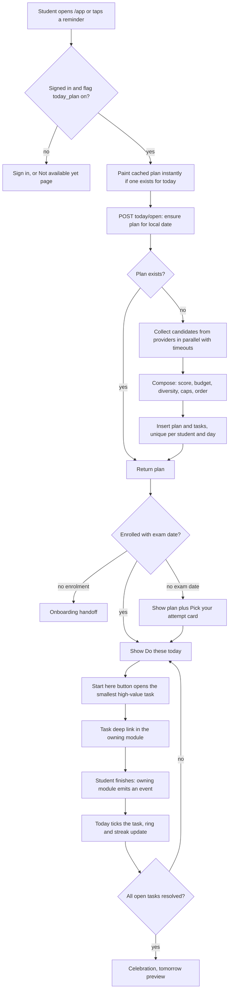
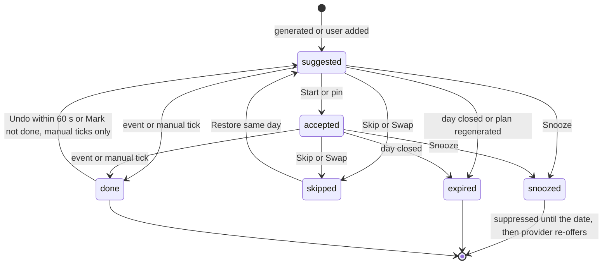
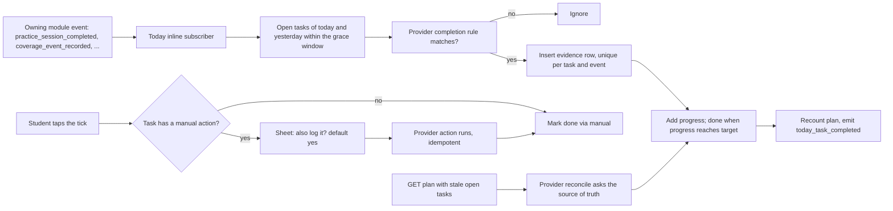

# PRD: F-13 Today (daily tasks and questions) with the lightweight study planner

| Field | Value |
| --- | --- |
| Status | Draft (for founder review) |
| Owner | Pawan (founder) |
| Last updated | 2026-10-05 |
| Source | `docs/product/FEATURE_MAP.md` section 4 F-13 (item 12 "If I open the website, show every day tasks or questions in each paper") and section 6 "Study planner" ("date-driven plan that re-plans when days are missed") |
| Linked ERD | `docs/product/erd/F-13-today-daily-tasks.md` |
| Django app / web module | `apps/api/modules/today` and `apps/web/src/modules/today` (the planner lives inside the same module, see section 4.3) |
| PostHog flags | `today_plan` (R1), `today_planner` (R2) |
| Order | Builds on F-02 (coverage, due revisions), F-01.2 (shared goal and streak), F-06 (practice sessions and events). Every later module plugs into it through a provider registry |

---

## 1. Problem and goal

A CA, CS or CMA student has a syllabus of 150 chapters per level, six or more papers, and no answer to the daily question "what do I do today so that I am actually on track?". Students decide at 9 pm, from memory, and the loud paper wins while the quiet one is ignored for three weeks. Revisions fall due and nobody notices, formulas are forgotten, an amendment lands and is never read. The founder's note (item 12) is plain: when I open the website, show me the tasks or questions in each paper that I have to do anyhow, such as objectives, formulas, sections and rules, or a practical question.

**Goal.** One screen, "Do these today": a short, honest, time-boxed list, grouped by paper, with a progress ring, that a student can open and start within 10 seconds. It is the daily-habit home of the product.

Four ideas make it work:

1. **Today does not know any content.** It composes the list from tasks that other modules offer through a registry (`register_task_provider`, same pattern as `register_live_timer_provider`). Revisions come from F-02, recall cards from F-15, MCQ sets from F-05 and F-06, and so on. A new module appears in Today by registering, with no change to Today.
2. **The list is small on purpose.** A time budget, a hard cap on tasks, diversity across papers, and a cap on backlog items make overload impossible by construction. The research on spaced-repetition tools (Anki) is blunt: unbounded daily queues make students quit.
3. **Every task says why it is there.** "Revision 2 was due 3 days ago." "Costing has had no activity for 5 days." Explainable ranking builds trust and lets the student correct it (swap, snooze, skip).
4. **Tasks finish themselves.** When the student finishes the practice set or logs the revision, the task is ticked by the event, with no manual bookkeeping. A manual tick is always allowed.

The **study planner** is the date-driven spine behind it: the exam date sets the phase (build, consolidate, sprint, final), the phase changes what Today favours, and in R2 a small milestone plan re-plans itself when days are missed.

## 2. Users and scenarios

**Aarav, CA Intermediate, 6 hours a day, May attempt in 52 days.** He opens the app on the bus at 7:40 am. Today is already there (pre-generated overnight): "6 tasks, about 1 h". The big button says "Start with a 5 minute win: recall 3 costing formulas". He does it, ticks it, then does 5 GST MCQs. The practice set finishes and the task ticks itself (3 of 5, then 5 of 5). By 9 pm the ring is at 5 of 6; he snoozes "Read Sec 17(5)" to tomorrow and sees "Tomorrow: 5 tasks, about 55 min". Streak 12.

**Neha, CS Executive, works a day job, back after 6 days of missed study.** She opens the app expecting guilt. Instead: "Welcome back. Here is a lighter day to restart: 4 tasks, 35 min." Overdue revisions (31 of them) are not dumped on her: 3 are scheduled today, the rest are spread by importance, with one link "See all overdue revisions". She finishes all four, a short celebration plays, and the streak counts from today.

**Rohan, CMA Final, has not set an exam date.** Today shows a plan anyway (next unfinished chapters, revisions, a practical question) and one calm card: "Pick your attempt so we can pace you." He picks "Dec 2026" in 3 taps and the plan re-generates with the right emphasis (sprint phase: more mock and PYQ, fewer new chapters). He also adds his own task: "Call Sir about test series, 5 min".

## 3. Success metrics

Targets are starting hypotheses to calibrate after the first 100 users. A 10 percent holdout (flag `today_plan` off) measures real lift.

| Metric | Definition | Target | Event(s) |
| --- | --- | --- | --- |
| Time to first action | Median time from `today_opened` to the first `today_task_started` or `today_task_completed` of the day | p50 under 10 s, p90 under 30 s | `today_opened`, `today_task_started` |
| Activation | New enrolled students who start at least one Today task in their first session | 55% | `today_task_started` |
| Daily open rate | Weekly active students who open Today on 4 or more days of the week | 50% | `today_opened` |
| Plan completion | Median share of planned tasks done on days the student opened Today | 60% or more | `today_day_closed` |
| Full-day rate | Opened days that end with the "day completed" state | 30% | `today_day_completed` |
| Overload guard | Share of planned tasks that end skipped or expired (and "too much" feedback) | under 35% (and "too much" under 15% of feedback) | `today_day_closed`, `today_feedback_given` |
| Retention lift | Day 14 retention, Today on versus holdout | +5 points | PostHog cohort on flag |
| Event-detected completion | Completions of event-capable tasks detected by events, not manual ticks | 70% | `today_task_completed` (via) |
| False completion | Undo within 60 s of an event-detected completion | under 3% | `today_task_undone` |
| Provider health | Plans generated with at least one provider failed (partial) | under 2% | `today_plan_generated` (partial) |
| Speed | `POST open/` p95 (generate), `GET plan/` p95 | under 1.2 s, under 250 ms | server metrics |
| Estimate accuracy (R3) | Tasks whose tracked minutes are within 40% of the estimate | 70% | `today_task_completed` plus tracker |

## 4. Scope

### 4.1 In scope

**R1: Today (the daily list)**

1. Lazy, idempotent generation of one plan per student per local day, pre-generated overnight for active students.
2. Composition: time budget, task cap, diversity across papers (with a rotation guarantee so no paper starves), backlog smoothing, exam-phase awareness, comeback mode after missed days, explainable score and reason on every task.
3. The task provider registry and contract, with timeouts and failure isolation (partial plans).
4. Task lifecycle: suggested, accepted, done, skipped, snoozed, expired; undo for 60 seconds.
5. Actions: start (deep link with context), mark done (with an optional "also log it" action), skip with optional reason, snooze, swap, add your own task, edit and delete own tasks.
6. Completion by events (practice sessions, coverage revision events) with progress on count tasks ("3 of 5"), plus a safety-net reconcile on read.
7. Motivation: segmented progress ring with time left, shared streak and goal from F-01.2, week strip, honest completion celebration, tomorrow preview.
8. Surfaces: `/app/today` (mobile first), past and preview days, settings, exam date prompt, lite mode for slow networks, offline plan and queued actions.
9. R1 providers (registered from the owning modules): F-02 coverage (due revisions, next topics and sections, next chapter) and F-06 practice (MCQ sets, practical question). User-added tasks.
10. Events for analytics, a digest selector and domain events for X-01 reminders `[PROPOSED: X-01]`.

**R2: Planner**

11. A `StudyPlan` per active enrolment: phases from the exam date, subject milestones (finish reading, first revision, mock), plan health, and re-plan on missed days with options the student chooses. A planner provider emits the day's milestone tasks. `/app/planner`.
12. Adaptive budget from the "too much, just right, too little" feedback; "bonus round" after a full day; providers from F-10, F-11, F-14, F-15, F-04 and F-09 as those modules ship.

### 4.2 Out of scope (later or elsewhere)

| Item | Where |
| --- | --- |
| Hour-by-hour timetable, drag and drop calendar, time blocking | R3 |
| Estimate calibration from tracked time, recurring user tasks | R3 |
| Mentor or teacher assigning tasks, parents' view | Mentor mode (R3, `[PROPOSED]`) |
| The reminder channels, quiet hours, push, email, WhatsApp | X-01 (this PRD only emits events and a digest) |
| XP, badges, leaderboards, streak freeze | X-03 (Today shows what F-01.2 computes) |
| Writing coverage, practice or recall data | Never. Today only reads and links; the owning modules write |
| Natural language "plan my week" assistant | X-02 |

### 4.3 Where the planner lives (decision)

The architecture roadmap listed a separate `planner` app. This PRD keeps the planner **inside the `today` module** (tables prefixed `today_`, a `planner/` sub-package). Reasons: its only consumer is Today, a separate app would create a two-way dependency (the planner emits tasks, Today stores them), and the R1 planner is just a pure function (phase from exam date). The R2 tables are added by their own migration and can be split into an app later without changing any public interface, because other modules never talk to the planner, only to the provider registry.

## 5. User flows

### 5.1 Open Today (the main flow)



### 5.2 Task lifecycle



Rules that the diagram cannot show: `done` is terminal against any later write from another device (a stale "skip" never beats "done"); a user-added task that is snoozed moves to the new date (same row); a provider task that is snoozed is suppressed until that date and re-offered by its provider only if it is still needed.

### 5.3 How a task completes



### 5.4 Composition algorithm (deterministic and explainable)

Pure function `compose(candidates, context, params) -> Selection` in `today/domain/compose.py`. No clock, no database, no randomness other than a seeded tie-break. Same inputs always give the same plan (golden fixtures in tests). Constants are in section 5.5.

**Step 0. Inputs.** `context` has the exam date and `days_to_exam`, the active (non-excluded) papers with `days_untouched`, the keys already done today, keys suppressed (snoozed to a future date, or skipped 3 or more times in the last 14 days), the time budget `B` in minutes, `comeback` flag, and the seed `hash(user_id, local_date, generation_no)`.

**Step 1. Normalise and filter.** Drop a candidate when: its deep link is not allow-listed, `est_minutes` is outside 1 to 90, its paper is not in the student's active enrolment, its `dedupe_key` is done today, suppressed, or already present (keep the copy with the higher provider weight), or `expires_on` is past. Dropped counts by reason go to `selection_log`.

**Step 2. Score (integers, 0 to about 1000).**

```
base      = (35*urgency + 25*importance + 25*weakness + 15*freshness) / 10      # signals are 0..100 integers from the provider
group     = kind group of the candidate: learn, revise, practice, exam or news
score     = base * phase_multiplier[phase][group] / 100 * provider_weight / 100
score    += 300 if must_do else 0
score    -= 40 * min(3, miss_count)          # miss_count: times this dedupe_key expired unfinished in the last 7 days (anti-nag)
```

`phase` comes from the exam date (5.5). Providers only give signals, never the final score, so they cannot dominate each other.

**Step 3. Choose the day's focus papers.** `F = clamp(round(B / 40), 1, 3)` (student setting can raise it to 4). Paper need = best score + half the second best score, plus 150 when the paper has been untouched for `STARVATION_DAYS` (4) or more days (the rotation guarantee: with N active papers, every paper appears at least every `ceil(N / F) + 1` days). Take the top `F` papers. Candidates with no paper (recall cards, amendments, the daily challenge) form a **General** pool with at most 2 slots.

**Step 4. Fill by rounds under the budget.** Round-robin over the focus papers and the General pool, ordered by need. Each turn takes that pool's best remaining candidate that fits: at most **one task per slot type per paper** (so a tile reads "5 MCQs, 3 formulas, 1 section, 1 practical", never two MCQ sets), at most 4 tasks per paper, at most 3 `revision` slot tasks per day (backlog smoothing), at most `MAX_TASKS` (8) in total. A candidate that does not fit the remaining budget is skipped and the next one tried. Stop when planned minutes reach 90 percent of `B`, no candidate fits, or the task cap is reached. `must_do` candidates go first and may use up to 125 percent of `B`, never more.

**Step 5. Floors.** If fewer than `MIN_TASKS` (3) tasks were selected and candidates remain, relax the per-slot and per-paper caps, then the budget up to 125 percent, until 3 exist or nothing is left. If still empty, the plan is a legitimate empty plan (section 7.3, "nothing due").

**Step 6. Order for display.** Tiles in order of paper need, General last, within a tile by estimated minutes ascending (easy first builds momentum), ties by score then `dedupe_key`. The **starter** (the "Start here" button) is the open task with the highest score among those of 10 minutes or less, else the highest score overall.

**Step 7. Explain.** Each selected task stores its signals, multiplier, penalties, rank and reason code (`score_breakdown`), and the plan stores counts of dropped candidates by reason (`selection_log`). "Why this?" shows the provider's reason string plus up to two modifiers ("exam in 52 days: revision weighs more", "no activity in this paper for 5 days").

**Carry-over rules.** Provider tasks are never copied forward: the underlying fact (a revision still due) persists in its module, so the provider offers it again if it is still needed, with a `miss_count` penalty so the same item cannot nag forever (after 3 misses it is shown once as "Still relevant? Keep, snooze a week, or drop"). Tasks the student added are carried to the next day automatically up to 3 times, then flagged stuck. Planner milestone tasks (R2) are re-derived from the plan.

**Comeback mode.** If the last 3 or more local days have no tracked time and no done task, `B` is multiplied by 0.6, the task cap drops to 5, `must_do` is ignored except amendments for an attempt within 14 days, and the header says so.

**Regeneration.** Keeps every task that is done, accepted, user-added or pinned; replaces the rest. Triggered by the student ("Refresh"), a change of exam date, scheme or budget, or a provider recovering after a partial plan. Optimistic: the request carries `expected_generation`.

### 5.5 Phases and constants

Phase from `days_to_exam` (calendar days to the target date, student's own date wins over the exam term of F-02). The thresholds assume the shorter exam cycles reported for ICAI (three attempts a year for Foundation and Intermediate, two for Final from May 2026, `[VERIFY]` with ICAI notices), so a "long runway" is about 90 days, not 6 months. All values are defaults to tune in beta.

| Phase | days_to_exam | learn | revise | practice | exam (PYQ, mock, challenge) | news (amendments) |
| --- | --- | --- | --- | --- | --- | --- |
| `steady` (no date) | none | 100 | 100 | 100 | 100 | 100 |
| `build` | 91 or more | 130 | 80 | 100 | 60 | 100 |
| `consolidate` | 31 to 90 | 100 | 120 | 120 | 90 | 110 |
| `sprint` | 11 to 30 | 60 | 130 | 120 | 130 | 140 |
| `final` | 1 to 10 | 20 | 150 | 100 | 130 | 150 |
| `post_exam` | 0 or past | n/a | n/a | n/a | n/a | n/a (Today shows "Your attempt has passed. Pick the next one" instead of a plan) |

| Constant | Value | Notes |
| --- | --- | --- |
| `MAX_TASKS`, `MIN_TASKS` | 8, 3 | Never above 8 provider tasks plus the student's own |
| Auto budget `B` | `clamp(round5(0.35 * daily_minutes), 30, 120)` | `daily_minutes` from the enrolment's `daily_hours`; 60 when unknown; student can set 15 to 240 |
| Hard cap | 125 percent of `B` | Only for `must_do` and floor relaxation |
| Fill target | 90 percent of `B` | |
| Focus papers `F` | `clamp(round(B / 40), 1, 3)` | Setting 1 to 4 |
| Per paper, per slot | 4 tasks, 1 per slot | |
| General pool | 2 | |
| Revision slot per day | 3 | Backlog smoothing |
| `STARVATION_DAYS` | 4 | |
| Estimate bounds | 1 to 90 minutes per task | Student tasks 1 to 180 |
| Undo window | 60 seconds | |
| Late-night grace | 180 minutes after local midnight | An event may still complete yesterday's open task |
| Snooze presets | tomorrow, in 3 days, next week | |
| Comeback | 3 missed days: `B` x 0.6, 5 tasks | |
| Student task quota | 20 per day, 200 open in the future | |

### 5.6 Worked example (for tests and for the founder to sanity-check)

Aarav, `minutes_per_day = 65`, 60 days to exam, so phase `consolidate` (revise 120, practice 120, learn 100, news 110), `F = round(65/40) = 2`, hard cap 81 minutes. Nine candidates (signals urgency, importance, weakness, freshness):

| Key | Paper | Task | Group, slot | Min | u, i, w, f | Score |
| --- | --- | --- | --- | --- | --- | --- |
| A | Taxation | Revise GST: ITC | revise, revision | 20 | 90, 80, 50, 60 | 876 |
| B | Taxation | 5 MCQs: GST ITC | practice, mcq | 8 | 40, 80, 70, 50 | 708 |
| C | Taxation | Read Sec 17(5) | learn, section | 12 | 50, 70, 40, 80 | 570 |
| D | Audit | Revise SA 230 | revise, revision | 15 | 60, 60, 60, 90 | 774 |
| E | Audit | Practical question | practice, practical | 20 | 30, 70, 80, 60 | 684 |
| F | Costing | Recall 3 formulas | revise, formula | 5 | 50, 60, 70, 95 | 771 |
| I | Costing | Read: process costing | learn, read | 40 | 40, 60, 30, 70 | 470 |
| G | General | Recall 12 cards | revise, recall | 6 | 70, 60, 50, 40 | 696 |
| H | General | Read 3 amendments | news, amendment | 10 | 60, 70, 0, 50 | 506 |

Paper need: Taxation 876 + 354 = 1230; Audit 774 + 342 = 1116 (touched yesterday); Costing 771 + 235 = 1006, plus 150 because it has had no activity for 5 days = 1156. Focus papers are Taxation and Costing; Audit waits until tomorrow, and the "Why this?" on Costing says so. Rounds: A (20), F (25), G (31); B (39), I does not fit the remaining 26 minutes, H (49); C (61). Stop: 61 is at least 58.5 (90 percent of 65). Result: 6 tasks, 61 minutes. Starter: the highest score among tasks of 10 minutes or less, which is F (771). Display: Taxation tile (B 8, C 12, A 20), Costing tile (F 5), General (G 6, H 10).

### 5.7 Edge cases (designed and tested)

| Case | Behaviour |
| --- | --- |
| Two tabs or two devices open at midnight | Plan creation is unique per student and day; the second request returns the first plan. Both see the same task ids |
| Day changes while the page is open | The container compares `local_date` every minute and on focus; it shows "A new day started. Show today" without discarding in-flight actions |
| Student studies past midnight | An event up to 3 hours after midnight can still complete yesterday's open task; the new plan is shown from 00:00 |
| Underlying work already done before the plan was generated | The provider does not offer it, and a done key is never re-suggested the same day |
| Event arrives twice or out of order | Evidence rows are unique per task and event; progress is recomputed from evidence |
| Done on one device, skipped on another | Done wins (terminal). Other transitions: the later `client_ts` wins; the loser gets the current task in a 409 body |
| Provider offers a task whose link no longer resolves | Contract test fails the provider's PR; at runtime the candidate is dropped and counted |
| Scheme switch during the day (F-02) | Subject and chapter ids change. Tasks keep subject and chapter keys; plan regenerates (suggested tasks replaced, started ones kept and shown as "from your previous scheme") |
| Student excludes a chapter or paper | Provider stops offering it; any suggested task for it is expired on the next regeneration; no immediate removal while the student is looking at it |
| Exam date moves or attempt changes | Regenerate with the new phase; plan health is re-evaluated (R2) |
| Backlog of 38 revisions after a break | 3 scheduled; an overload notice with the count and a link to `/app/revision`; never 38 rows |
| Student has more than 8 own tasks | Own tasks are listed under "Yours" and do not count toward the 8; the day-time total warns above 3 hours |
| All providers fail | Empty plan with "We could not build your plan. Retry" and any own tasks; last good plan is never shown as today's |
| One provider fails | Partial plan with a quiet alert; a retry regenerates only the missing provider's share |
| Timezone changed in settings | Next day uses the new tz; today's plan keeps its date |
| Account has two active enrolments (two levels) | R1 composes for the primary enrolment (most recent); R2 offers a switcher |
| Student deletes the account | `delete_all_for_user` removes plans, tasks, evidence, settings and planner rows |

## 6. Functional requirements

Priority: P0 must ship in R1, P1 should ship in R1, P2 can follow. `[NOTE]` = from the founder's pages, `[ADD]` = from the feature map, `[NEW]` = added here. "R" gives the release (section 13). IDs use the pointer prefix.

### A. Plan generation and composition

| ID | Requirement | P / R | Acceptance criteria |
| --- | --- | --- | --- |
| FR-F13-01 | `[NOTE]` One plan per student per local day, created on first open and shown as "Do these today" grouped by paper | P0 / R1 | Given an enrolled student with no plan for today, when `POST today/open/` is called, then a plan with 3 to 8 tasks (or a legitimate empty plan) is returned in under 1.2 s p95 and a second identical call returns the same plan and task ids |
| FR-F13-02 | Generation is idempotent and single-flight per (student, date) | P0 / R1 | Given two simultaneous opens, then exactly one `today_dayplan` row exists and both responses carry the same `generation_no` |
| FR-F13-03 | `[ADD]` Time budget: planned minutes never exceed 125 percent of the budget and normally land at 90 to 100 percent | P0 / R1 | Given budget 65, then total estimate is at most 81 and a fixture with nine candidates yields the plan in section 5.6 |
| FR-F13-04 | `[ADD]` Diversity across papers with a rotation guarantee; one task per slot per paper; at most 3 papers by default | P0 / R1 | Given 6 active papers, then no paper is absent for more than `ceil(6 / F) + 1` consecutive plans (simulation test over 60 days) |
| FR-F13-05 | `[ADD]` Per-paper tile mix "5 MCQs, 3 formulas, 1 section, 1 practical question" is the target shape of a tile, filled only from what providers offer | P0 / R1 | Given a paper whose providers offer MCQ, formula, section and practical candidates, then its tile shows one task per slot; a paper with only MCQ shows one task, never a padded tile |
| FR-F13-06 | `[NEW]` Explainable ranking: every task stores a reason code, a reason text and its score breakdown; "Why this?" shows them | P0 / R1 | Given any task, when "Why this?" is opened, then the provider reason and up to two modifiers are shown and the same data is in the API response |
| FR-F13-07 | `[ADD]` Exam-date awareness: phase from `days_to_exam` changes the multipliers; without a date the phase is `steady` and a "Pick your attempt" card is shown | P0 / R1 | Given 5 days to the exam, then `learn` tasks score at 20 percent and revision at 150 percent; given no date, then the card is visible and the plan still generates |
| FR-F13-08 | `[NEW]` Backlog smoothing: at most 3 `revision` tasks per day; the remainder is summarised as one notice with the count and a link to `/app/revision` | P0 / R1 | Given 38 overdue revisions, then 3 are tasks (highest overdue times weight) and the notice reads "38 revisions are overdue, 3 are scheduled today" |
| FR-F13-09 | `[NEW]` Comeback mode after 3 missed days: budget x 0.6, at most 5 tasks, friendly copy, no guilt wording | P1 / R1 | Given 4 days with no tracked time and no done task, then the plan header says "Welcome back, a lighter day" and has 5 tasks or fewer |
| FR-F13-10 | `[NEW]` Deterministic composition with golden fixtures: same candidates and context give the same task keys in the same order | P0 / R1 | Given the fixture files, then the Python and the shared JSON cases pass byte for byte on keys and order |
| FR-F13-11 | `[NEW]` Pre-generation: a scheduled job creates tomorrow's plan for students active in the last 14 days; the lazy path stays the source of truth | P1 / R1 | Given an active student, then at 03:30 local the plan for the day exists and `generated_at` precedes the first open |
| FR-F13-12 | Regeneration keeps done, accepted, user-added and pinned tasks, replaces the rest, is optimistic and rate limited | P1 / R1 | Given a plan with 1 done and 5 suggested tasks and a changed exam date, when regenerate is called with the current `expected_generation`, then the done task remains, suggested ones are replaced and `generation_no` increments; with a stale value the API returns 409 `plan_changed` |
| FR-F13-13 | Day boundary uses the student's tracker time zone (default `Asia/Kolkata`, no DST); open tasks expire at 03:00 the next day; events up to that time can still complete them | P1 / R1 | Given a practice session finished at 00:40 for a task of yesterday, then yesterday's task is done and today's plan is unaffected |
| FR-F13-14 | `[NEW]` Student settings: minutes per day (15 to 240, or auto), focus papers (1 to 4, or auto), hide task kinds, show or hide tomorrow preview and celebration | P1 / R1 | Given minutes per day 90, then the next generation uses budget 90; hiding `challenge` removes such tasks from later plans |

### B. Providers and completion

| ID | Requirement | P / R | Acceptance criteria |
| --- | --- | --- | --- |
| FR-F13-15 | `[NEW]` Provider registry: any module registers `register_task_provider(...)` in `AppConfig.ready()`; Today imports no provider code | P0 / R1 | Given a test provider registered in a fixture app, then its candidates appear without any change in `today` |
| FR-F13-16 | Provider contract validation: candidates with a bad link, estimate, key, slot or reason code are dropped and counted, not fatal | P0 / R1 | Given a candidate with link `https://evil.example`, then it is dropped and `selection_log.invalid_link` increments |
| FR-F13-17 | Failure isolation: each provider has a timeout (default 400 ms) and runs in parallel; one failure yields a partial plan flagged `partial` with the failed provider names | P0 / R1 | Given a provider that raises and one that sleeps 2 s, then the plan returns within 1.2 s with the other providers' tasks and `provider_status` lists both failures |
| FR-F13-18 | Operators can disable or re-weight a provider without a deploy (`today_providerconfig`, Django admin) | P1 / R1 | Given a provider disabled in admin, then the next generation excludes it within 60 s |
| FR-F13-19 | `[ADD]` Completion by events: an owning module's event completes a matching open task and updates progress ("3 of 5") | P0 / R1 | Given a task "5 MCQs: GST ITC" and `practice_session_completed` with 3 answered in that chapter, then progress is 3 of 5; a second session with 2 answered completes it; replaying either event changes nothing |
| FR-F13-20 | Exact match for sessions started from Today (`origin_module = today`, `origin_ref = task id`), fuzzy match by chapter and day otherwise | P0 / R1 | Given a student who practises the same chapter from the question browser, then the Today task still progresses |
| FR-F13-21 | Safety-net reconcile: on `GET plan/`, open tasks older than 5 minutes are re-checked through the provider's `reconcile` when one is registered | P1 / R1 | Given a dead-lettered event, then the next read still completes the task with `completed_via = event` |
| FR-F13-22 | Today never writes content or progress itself; a manual tick may run the provider's declared manual action once, idempotently | P0 / R1 | Given "Revise GST ITC" ticked manually with "Also log revision" on, then exactly one `revision_done` event exists in coverage for that task id, even after a retry |

### C. Task actions

| ID | Requirement | P / R | Acceptance criteria |
| --- | --- | --- | --- |
| FR-F13-23 | Start: opens the task's deep link with `from=today&task=<id>`, marks it `accepted`, and offers to start the stopwatch tagged to the paper and chapter | P0 / R1 | Given a task, when Start is tapped, then the destination opens with its context and the task shows "In progress" |
| FR-F13-24 | Manual tick with a 44 px target, optimistic, undoable for 60 s | P0 / R1 | Given a tick followed by Undo within 60 s, then the task is `suggested` or `accepted` again and the ring reverts |
| FR-F13-25 | Skip with an optional reason (not in my attempt, already know it, no time, other); a task skipped 3 times in 14 days is suppressed for 14 days | P1 / R1 | Given the third skip of the same key, then the next plans do not offer it for 14 days and a toast says so |
| FR-F13-26 | Snooze to tomorrow, in 3 days or next week; a provider task is suppressed until then, a user task moves | P1 / R1 | Given a user task snoozed to tomorrow, then it appears in tomorrow's plan once, with `carry_count` 1 |
| FR-F13-27 | Swap: replaces one task by the next best alternative from the same paper (else any), excluding what was shown today; the old task ends `skipped` with reason `swapped` | P1 / R1 | Given a swap, then the replacement appears in the same tile within 600 ms or the API returns 422 `no_alternative` and the UI says "Nothing else to suggest for this paper" |
| FR-F13-28 | `[NOTE]` Add your own task: title, optional paper and chapter, minutes, date up to 30 days ahead | P0 / R1 | Given a title and 20 minutes, then a task exists in today's list under "Yours", counts in the ring and survives a reload |
| FR-F13-29 | Edit and delete own tasks; carry to the next day up to 3 times, then flagged "stuck" | P1 / R1 | Given a user task left open for 3 days, then on day 4 it shows "Still relevant? Keep, snooze or delete" |
| FR-F13-30 | Quotas: 20 own tasks per day, 200 open future tasks, 120 task actions per minute | P1 / R1 | Given the 21st own task of a day, then 429 `quota_exceeded` with a human message |

### D. Motivation

| ID | Requirement | P / R | Acceptance criteria |
| --- | --- | --- | --- |
| FR-F13-31 | `[ADD]` Segmented progress ring (one segment per task) with text "3 of 6 done" and time left ("about 35 min left") | P0 / R1 | Given 6 tasks and 3 done, then 3 segments fill, the label and the `aria-label` read the same, and time left sums open estimates |
| FR-F13-32 | `[ADD]` Streak and goal reuse the F-01.2 values (`tracking.selectors.goals_progress`); Today never computes its own streak | P0 / R1 | Given the tracker streak is 12, then Today shows 12 and the daily goal ring from the same call; the streak-at-risk hint appears after 18:00 local when today's goal is unmet |
| FR-F13-33 | Week strip: the last 7 days as dots (done all, some, none, rest), each linking to that day | P1 / R1 | Given 4 completed days this week, then four filled dots and today outlined |
| FR-F13-34 | `[ADD]` Celebration once per day when all open tasks are resolved and at least half of resolved tasks were done; otherwise a calm "Day closed" message | P1 / R1 | Given 5 done and 1 skipped, then a short celebration plays once (reduced-motion: static check); given 1 done and 5 skipped, then no celebration and the message "You did 1 and skipped 5. Tomorrow is a fresh start" |
| FR-F13-35 | `[ADD]` Tomorrow preview: up to 4 tasks and the minutes, labelled "may change", after the day is done or after 18:00 | P1 / R1 | Given an unfinished day at 19:00, then the card shows tomorrow's likely tasks; it never persists tasks |
| FR-F13-36 | `[NEW]` Bonus round after a completed day: "Do a little more" adds up to 20 minutes of extra tasks that never affect completion or streak | P2 / R2 | Given a completed day, when the student taps it, then 1 to 3 extra tasks are added marked "Bonus" |
| FR-F13-37 | `[NEW]` One-tap day feedback after the day closes: too much, just right, too little | P2 / R2 | Given three "too much" in a row, then the suggested minutes per day drops by 15 percent and the student confirms with one tap |

### E. Surfaces, offline, privacy

| ID | Requirement | P / R | Acceptance criteria |
| --- | --- | --- | --- |
| FR-F13-38 | Today screen at `/app/today` is mobile first, with a "Start here" primary action, tiles per paper and a persistent progress header | P0 / R1 | Given a 320 px viewport, then no horizontal scroll and all targets are at least 44 px |
| FR-F13-39 | First open under 10 seconds: cached plan painted first, route chunk under 60 KB gzipped, `/app` redirects to Today when the flag is on | P0 / R1 | Given a returning student on a mid-range phone on 4G, then the first task is visible in under 2 s and startable in under 10 s (p50) |
| FR-F13-40 | Lite mode (auto on slow networks or data saver, or by setting): no motion, no mini charts, plan JSON under 12 KB | P1 / R1 | Given `saveData` on, then the lite layout renders and the plan response is under 12 KB gzipped |
| FR-F13-41 | Offline: the last plan is cached; actions and own tasks queue with `client_id` and replay without duplicates; a stale plan is labelled | P1 / R1 | Given airplane mode, a tick then reconnect, then exactly one `done` transition exists and the banner clears |
| FR-F13-42 | Past days are read-only recaps; future days show a preview or the student's own tasks | P2 / R1 | Given `/app/today/2026-10-03`, then the day's tasks and outcomes are shown without edit actions |
| FR-F13-43 | `[ADD]` Reminders hook: domain events and a `reminder_digest` selector so X-01 can send "3 tasks left, about 20 min" and stop when done `[PROPOSED: X-01]` | P1 / R1 | Given a day with 3 open tasks, then `digest` returns count, minutes, top three titles with links and `is_done = false`; once all are resolved `is_done = true` |
| FR-F13-44 | Flag `today_plan` on the API (403 `feature_disabled`) and the web; Today off must not affect other modules | P0 / R1 | Given the flag off, then every Today endpoint answers 403 `feature_disabled`, providers still register harmlessly and no other module changes behaviour |
| FR-F13-45 | Privacy: export and delete include plans, tasks, evidence, settings and planner rows; own task titles never go to analytics or Sentry | P1 / R1 | Given a delete request, then no `today_*` row remains for the student |
| FR-F13-46 | Analytics events exactly as section 10, validated by a contract test against a JSON schema | P0 / R1 | Given any emitted event, then its property names match the schema file (no drift) |

### F. Planner (R2)

| ID | Requirement | P / R | Acceptance criteria |
| --- | --- | --- | --- |
| FR-F13-47 | `[ADD]` Date-driven study plan per active enrolment from the exam date, daily minutes and remaining chapters (estimates from `syllabus_chapter.est_study_minutes`, marks weight) | P1 / R2 | Given a target date and daily minutes, then milestones per paper (finish reading, first revision, mock) with dates are created and the sum of remaining reading minutes fits the plan capacity or the plan is `at_risk` |
| FR-F13-48 | Plan health: on track, slightly behind (shortfall up to 10 percent of capacity), at risk (more than 10 percent) with the numbers shown | P1 / R2 | Given 120 h of reading left and 100 h of capacity, then health is `at_risk` and shows "20 h short" |
| FR-F13-49 | `[ADD]` Re-plan when days are missed: after 2 consecutive missed days, weekly, or on demand, recompute milestone dates; never silently drop content; when infeasible offer options (more daily time, skim low-weight chapters, next attempt) and apply only the student's choice | P1 / R2 | Given 3 missed days and a feasible plan, then dates shift automatically and a note says what moved; given an infeasible plan, then three options appear and nothing changes until one is chosen |
| FR-F13-50 | Planner provider emits the day's milestone tasks (next chapter to read for the paper that is behind) | P1 / R2 | Given a paper behind its milestone, then "Read: {chapter}" has `must_do` only when the milestone is overdue by 3 or more days |
| FR-F13-51 | Planner screen `/app/planner`: phases bar, milestones list, health card, "Re-plan" | P1 / R2 | Given a plan, then milestones, health and the next re-plan date are visible at 320 px without horizontal scroll |

## 7. Screens, URLs and design-system needs

All state lives in the URL (zod-validated search params). `/app/...` is private and `noindex` through `buildHead`. The marketing page `/features/today` is public (catalog entry, status `soon` until the flag is fully on).

### 7.1 Screens and URLs

| Screen | URL | Notes |
| --- | --- | --- |
| Today | `/app/today` | `?paper=<subject key>` expands one tile on phones; `?task=<id>` opens the task sheet (why, edit); `?add=1` opens the add sheet; `?from=reminder` for analytics. `/app` redirects here when `today_plan` is on |
| Day view | `/app/today/$date` | `2026-10-06` is the preview (tomorrow) or the student's own future tasks; a past date is a read-only recap |
| Today settings | `/app/settings/today` | Minutes per day, focus papers, hidden kinds, tomorrow preview, celebration, lite mode, reset to defaults |
| Planner (R2) | `/app/planner` | `?enrollment=` for a second level; phases bar, milestones, health, re-plan |
| Public marketing | `/features/today` | SSR, `buildHead`, OG image from the existing generator |

### 7.2 Wireframes (mobile first, 320 to 1280 px)

**Today, mobile (390 px), typical day**

```
┌──────────────────────────────────┐
│ Mon 5 Oct          🔥 12  ⚙      │  streak from F-01.2
│ ◔◔◔◔○○  3 of 6 done · about 35 m │  segmented ring + time left
│ goal 2 h: 1 h 20 m  ▓▓▓▓▓░░      │  tracker daily goal (shared)
│ [ Start: Recall 3 formulas · 5 m ]│  primary action = the starter
│ 38 revisions overdue. 3 today. See all ›   (only when it applies)
│ ── Taxation ───────────  2/3 ──  │  tile: paper, progress
│ ☑ 5 MCQs: GST ITC     8 m   3/5 ⋯│  44 px checkbox, progress for count tasks
│    Practised, not revised yet    │  reason line, muted
│ ☐ Read Sec 17(5)      12 m     ⋯ │
│ ☐ Revise GST: ITC     20 m  Due 3d ago ⋯
│ ── Costing ────────────  0/1 ──  │
│ ☐ Recall 3 formulas   5 m   ★Start ⋯
│ ── General ─────────────  0/2 ── │
│ ☐ Recall 12 cards     6 m      ⋯ │
│ ── Yours ───────────────  0/1 ── │
│ ☐ Call Sir about tests 5 m     ⋯ │
│ [ + Add your own task ]          │
│ Tomorrow: 5 tasks, about 55 min ›│  after 18:00 or when done
└──────────────────────────────────┘
```

`⋯` opens a menu (bottom sheet on phones): Why this?, Swap, Snooze, Skip, Edit and Delete (own tasks). Swipe actions may exist as a shortcut but every action is also a button.

**Today, desktop (1280 px)**

```
┌──────────────────────────────────────────┬───────────────────────┐
│ Do these today            Mon 5 Oct      │ ◔ 3 of 6   about 35 m │
│ [ Start: Recall 3 formulas · 5 m ]       │ 🔥 12 day streak       │
│ Taxation tile | Costing tile | General   │ Goal 1 h 20 of 2 h    │
│ (tiles stack, tasks full width, reasons  │ Week  ● ● ○ ● ● · ·   │
│  visible, keyboard: j k move, x done)    │ Tomorrow: 5 tasks ›   │
│                                          │ Plan health (R2)      │
└──────────────────────────────────────────┴───────────────────────┘
```

**Day completed**

```
┌──────────────────────────────────┐
│   ✓  Day complete                │  one short celebration (motion, 600 ms)
│   6 of 6 done · 58 min planned   │
│   🔥 13 day streak               │  from the tracker, updates when its goal is met
│   Tomorrow: 5 tasks, about 55 min│
│   [ Do a little more ]  [ Close ]│  bonus (R2) never changes completion
└──────────────────────────────────┘
```

### 7.3 UI states per screen

Every cell is designed, built and covered by a component test or showcase entry. "Skeleton" means a layout-stable placeholder (no spinner-only screens).

**Today (`/app/today`)**

| State | Behaviour |
| --- | --- |
| First time, not enrolled | Single card "Choose your course and level to get your first plan" with one button to `/app/onboarding`. No empty tiles |
| First time, enrolled, no exam date | A real plan (steady phase) plus a dismissible card "Pick your attempt so we can pace you" with the F-02 terms as chips and "Set my own date". Setting it regenerates once and shows "Plan updated for your attempt" |
| First plan reveal (aha) | After onboarding, a 600 ms reveal of the first plan with "Your first plan is ready: 6 tasks, about 1 h"; instrumented as the activation moment |
| Loading | Cached plan paints immediately with a quiet "Updating" text; with no cache, header skeleton and 5 skeleton rows; the Start button appears as soon as the plan arrives |
| Generating slowly (over 2 s) | Skeleton stays, text "Building your plan from your syllabus and revisions"; at 8 s offers Retry without losing the page |
| Success | Header, starter button, tiles, own tasks, notices, tomorrow card |
| Partial (a provider failed) | Plan shown; `Alert` (non-blocking): "Some suggestions could not load (recall cards). Retry" with a Retry that regenerates only the missing share. Task count and time are shown as of now |
| Total failure | Alert with Retry and request id; own tasks still listed; never shows yesterday's plan as today's |
| Nothing due (new student, empty content) | Honest empty state: "Nothing is due. Start a chapter" with the next chapter as the single task (coverage fallback). If even that is empty: "No chapters in your syllabus yet" with a link to the syllabus map |
| Nothing due (caught up) | "You are all caught up. Enjoy the break or read ahead" with a link to the next chapter and a "Do a little more" bonus (R2). No fake tasks |
| Overload (backlog) | Notice "38 revisions are overdue, 3 are scheduled today" with `/app/revision` link; never more than 8 provider tasks |
| Comeback | Header line "Welcome back, a lighter day" and a smaller plan; no streak-loss wording |
| In progress | A started task shows "In progress" and moves to the top of its tile; the starter button changes to "Continue" |
| All done | Celebration card (once per day, device-agnostic via `celebrated_at`), then the done list collapses, tomorrow preview opens |
| Day closed with skips | "You did 1 and skipped 5. Tomorrow is a fresh start." No confetti |
| Offline | Banner "Offline: your changes are saved on this device"; ticks and own tasks queue with a count; Start links to owner modules that may need the network show "Needs a connection" |
| Reconnect | Banner "Back online, syncing 3 changes" then toast "All changes saved" |
| Stale cache | Cached plan older than 6 hours: "Updated 7 h ago. Refresh"; cached plan of a previous date: dimmed recap "Plan from yesterday. Connect to get today's" and actions disabled |
| Day rollover while open | Inline bar "A new day started. Show today" |
| Flag off | "Today is not available yet" page with a link to the syllabus; no redirect loop from `/app` |
| Permission | Signed-out: sign-in redirect. No role differences in R1 |
| Quota exceeded | Own-task sheet: "You have 20 tasks today. Move one to tomorrow or delete one" |
| Long content | Titles clamp to 2 lines with Expand; long paper names wrap; many own tasks scroll in the list, never the page; time total warns above 3 h: "That is a long day. Consider moving one" |
| Skeleton to content | No layout shift beyond 0.1 CLS; rows keep their height |
| Undo | After tick, skip or snooze a toast with Undo (10 s, pauses on hover and focus), and a persistent "Restore" in the menu for 60 s |
| Wrong guess by the engine | Skip reasons ("not in my attempt") show a link to exclude the chapter or paper in coverage settings |
| Celebration with reduced motion | Static check, no animation, same text |
| Lite mode | No motion, plain list, no mini charts, smaller header |

**Add task sheet**: fields title (required, 120), paper (optional select), chapter (optional, filtered by paper), minutes (preset chips 5, 10, 20, 30, 45, 60 plus number), date (today, tomorrow, pick up to 30 days). States: validation errors inline with `aria-describedby`, saving, offline "Saved on this device", quota, duplicate title today (soft warning, allowed).

**Snooze, skip, swap menus**: bottom sheets with radio rows (44 px). Skip reason is optional and defaults to none. Swap shows "Finding another" for up to 600 ms then the change, or "Nothing else to suggest for this paper".

**Settings**: minutes per day (presets 30, 60, 90, 120 and auto), focus papers, hidden kinds as switches, lite mode (auto, on, off), reset to defaults. States: loading skeleton, saved toast, error with retry, offline disabled with explanation.

**Day view (`/app/today/$date`)**: preview banner "Preview, may change" (tomorrow), recap (past), own tasks only (future beyond tomorrow). Empty: "No plan for this day".

**Planner (R2)**: first-time (no exam date: same pick-your-attempt card), on track, slightly behind, at risk with three options, re-planning (progress, then a summary of what moved), error with retry, offline read-only, long milestone lists scroll in their own container.

### 7.4 Design-system components (reuse before create)

Existing after F-02, F-01.x (and F-06 slice 8): Button, Card, Badge, Checkbox, ProgressRing, SegmentedControl, Select, NumberField, Switch, TextField, Dialog, Toast (with Undo), Tooltip, Skeleton, EmptyState, Alert, DropdownMenu, Tabs, StatTile, icons including Flame.

| New (in `packages/design-system`, with showcase entries and contrast checks) | Used for |
| --- | --- |
| `ProgressRing` extension: `segments` (1 to 12) and `segmentLabel` | The task ring, one segment per task, text alternative |
| `Celebrate` | The once-a-day celebration; honours reduced motion; uses tokens only |
| `Sheet` (bottom on phones, side on desktop) | Menus, add, snooze, why. Added by whichever of F-06 slice 8 or F-13 lands first |
| Icons added to `icons.ts`: `Shuffle`, `AlarmClock`, `Sparkles`, `Undo2`, `ListChecks`, `CalendarClock`, `Info` | Swap, snooze, bonus, undo, plan, planner, why |

Stays in the web `today` module (it knows the domain): `TodayHeader`, `PaperTile`, `TaskRow`, `TaskMenu`, `WhyPopover`, `AddTaskSheet`, `WeekStrip`, `TomorrowCard`, `OverloadNotice`, `PartialAlert`, `ExamDateCard`, `CelebrationCard`. All colours are semantic tokens; status is never colour alone (icon and text beside it).

## 8. Data and permissions

Entities are in the ERD. Summary: `today_dayplan` (one per student and local day, with counters, provider status and the selection log), `today_task`, `today_taskevidence` (idempotent completion evidence), `today_settings`, `today_providerconfig` (operator switches), and in R2 `today_studyplan`, `today_milestone`, `today_replanevent`.

| Action | Anonymous | Student | Editor | Admin |
| --- | --- | --- | --- | --- |
| Read, generate and act on own plans and tasks | no | yes | no | no |
| Read another student's plan or tasks | no | no | no | no |
| Enable, disable or re-weight a provider | no | no | no | yes (Django admin) |
| Read aggregate adoption metrics | no | no | no | yes (PostHog, not row access) |
| Mentor read of consenting students (R3) | n/a | n/a | n/a | `[PROPOSED]` |

- Permission scopes: `today.use` (any signed-in student, own data only) and `today.operate_providers` (Django admin group "Today operators": provider switches and read-only plan metadata). No role other than the owner can read task rows.
- Everything is personal data: study habits, own task titles (free text) and the pace. Exported and deleted on request; the account deletion hook calls `today.services.delete_all_for_user`.
- Retention: `today_task` 13 months, `today_dayplan` counters 24 months, `today_taskevidence` 90 days, replan events 24 months. After task retention, the plan counters remain for streak-adherence and F-10.
- Admin and support see plan metadata (counts, provider status) read-only; own task titles are hidden in the admin.
- Analytics never receive titles or reasons; only kinds, counts and buckets.

## 9. API surface

REST under `/api/v1/today/`. Bearer Supabase token. Errors use `{"error": {code, message, details}}`. Flag off: 403 `feature_disabled`. Writes take `client_id` (and `client_ts` where order matters); repeating a write with the same `client_id` returns the original result. Responses include `server_time`. Throttle scopes: `today_read` 120 per minute, `today_write` 120 per minute, `today_regen` 6 per day (shared cache, see audit AUD-008).

`GET` endpoints never write. Generation is an explicit idempotent `POST open/` (the audit flagged GET endpoints that write, AUD-014).

| Method and path | Purpose | Request (key fields) | Response and errors |
| --- | --- | --- | --- |
| POST `open/` | Ensure and return today's plan (the app-open call) | `client_id`, `date?` (default student's today), `source` (`nav`, `reminder`, `redirect`) | 200 plan (`created` flag). 200 with `state: not_enrolled` or `state: post_exam` and no plan. 403 flag |
| GET `plan/` | Read the plan for a date without generating | `date?`, ETag with `If-None-Match` | 200 plan, 304, 404 `plan_not_generated` |
| GET `preview/` | Preview for a future date (tomorrow), not persisted | `date` (at most 14 days ahead) | 200 up to 4 tasks and minutes plus the student's own tasks |
| POST `plan/regenerate/` | Regenerate suggested tasks | `expected_generation`, `reason` (`manual`, `exam_date`, `settings`, `provider_recovered`), `client_id` | 200 plan. 409 `plan_changed`. 429 |
| POST `tasks/` | Add own task | `client_id`, `title`, `date`, `subject_id?`, `chapter_id?`, `est_minutes` | 201 task. 400. 429 `quota_exceeded` |
| PATCH `tasks/{id}/` | Edit own task (title, minutes, paper, date) | fields, `version` | 200. 409 `state_conflict`. 403 for provider tasks |
| DELETE `tasks/{id}/` | Delete own task (soft) | none | 200 with `undo_until` |
| POST `tasks/{id}/start/` | Mark accepted, return the deep link | `client_id` | 200 `{task, link}` |
| POST `tasks/{id}/complete/` | Manual tick | `client_id`, `client_ts`, `run_manual_action` (bool) | 200 task. Idempotent |
| POST `tasks/{id}/skip/` | Skip | `client_id`, `reason?` | 200 task, `suppressed_days?` |
| POST `tasks/{id}/snooze/` | Snooze | `client_id`, `until` (date or preset) | 200 task. 400 date out of range |
| POST `tasks/{id}/swap/` | Replace with an alternative | `client_id` | 200 `{old, new}`. 422 `no_alternative`. 429 (20 swaps per day) |
| POST `tasks/{id}/undo/` | Revert the last transition within 60 s | `client_id`, `from_state` | 200 task. 410 after the window |
| GET `history/` | Day counters for the week strip and recaps | `from`, `to` (at most 92 days) | 200 list of day summaries |
| GET, PUT `settings/` | Student settings | fields | 200. 400 |
| POST `internal/tick/` | Cron: pre-generate, expire, prune, remind | header `X-Tick-Secret` | 200 counts. Constant-time secret compare |

Errors worth naming: `invalid_transition` (422, includes the allowed states), `state_conflict` (409, returns the current task), `plan_changed` (409), `no_alternative` (422), `quota_exceeded` (429), `feature_disabled` (403).

Plan payload (R1, version 1): `{"date","tz","server_time","state","phase","days_to_exam","generation_no","partial","failed_providers":[],"budget_minutes","planned_minutes","counts":{"planned","done","open","skipped","snoozed"},"starter_task_id","backlog":[{"kind","count","label","link"}],"tiles":[{"subject_id","subject_key","name","tasks":[task_id]}],"tasks":[{"id","origin","kind","slot","title","reason","reason_code","why":{"signals","modifiers"},"est_minutes","progress","target","state","link":{"path","search"},"subject_id","chapter_id","manual_action":{"label","default"}|null,"is_must_do","version"}],"streak","goal":{"target_minutes","done_seconds","percent"},"week":[...],"celebrate":bool,"tomorrow":{"count","minutes"}}`. Size budget: 12 KB gzipped in lite mode (no `why.signals`, no `week`).

## 10. Analytics events and notifications

Names are `noun_verb`. Properties are exactly these (contract-tested against `apps/web/src/modules/today/lib/event-schema.json` and the API twin, so no drift as found in audit AUD-011). Never sent: task titles, reasons, notes. Buckets: minutes `0-5, 6-15, 16-30, 31-60, 61+`; time `lt1s, 1-3s, 3-10s, 10-30s, 30s+`.

| Event | Where | Properties |
| --- | --- | --- |
| `today_opened` | web | source, plan_state (`cached`, `fresh`, `empty`, `not_enrolled`), task_count, planned_minutes_bucket, from_cache, render_time_bucket, lite |
| `today_plan_generated` | api | trigger (`open`, `cron`, `regenerate`), generation_no, task_count, planned_minutes, budget_minutes, phase, partial, failed_provider_count, candidate_count, generation_time_bucket |
| `today_plan_regenerated` | api | reason, kept_count, replaced_count |
| `today_task_started` | web | kind, provider, position, slot, was_starter |
| `today_task_completed` | api | kind, provider, via (`event`, `manual`), est_minutes_bucket, position, first_of_day, since_open_bucket, manual_action_ran |
| `today_task_skipped` | api | kind, reason, suppressed |
| `today_task_snoozed` | api | kind, until_days |
| `today_task_swapped` | api | kind, result (`replaced`, `no_alternative`) |
| `today_task_added` | web | has_subject, est_minutes_bucket, offline |
| `today_task_undone` | web | from_state, via |
| `today_why_opened` | web | kind, reason_code |
| `today_day_completed` | api | done, skipped, planned, minutes_bucket, streak |
| `today_day_closed` | api (cron) | done, skipped, expired, planned, completed (bool), comeback |
| `today_celebration_viewed` | web | reduced_motion |
| `today_tomorrow_viewed` | web | task_count |
| `today_overload_shown` | web | kind, backlog_bucket |
| `today_exam_date_prompted` / `today_exam_date_set` | web | action (`chip`, `custom`, `dismissed`), days_to_exam_bucket |
| `today_feedback_given` | web | rating |
| `today_offline_queued` / `today_offline_replayed` | web | count, age_bucket |
| `today_settings_changed` | web | changed_keys |
| `provider_failed` | api | provider, status (`timeout`, `error`, `invalid`), ms_bucket |

Domain events emitted through `core.events` (ERD 3.4): `today_plan_generated`, `today_task_completed`, `today_day_completed`, `today_day_closed`. Consumers: X-01 (stop reminders), X-03 (XP, daily challenge), F-10 (adherence).

**Notifications (X-01 not designed here; interface only) `[PROPOSED: X-01]`.** Today supplies `today.selectors.reminder_digest(user_id, date)` and calls `notifications.services.notify(user_id, category="today_reminder", dedupe_key="today:<date>", payload=digest)` only when that module exists. Copy to propose: morning "Today: 6 tasks, about 1 h. Start with a 5 minute win." Evening only if open tasks and not done "3 tasks left, about 20 min." Streak-at-risk uses the tracker's numbers. Rules owned by X-01: quiet hours, one per day per category, stop when `is_done`. Web push on iOS needs an installed home-screen app (iOS 16.4 or later), so in-app and email come first.

## 11. Non-functional requirements

| Area | Requirement |
| --- | --- |
| Performance | `POST open/` generating p95 under 1.2 s (providers in parallel, 400 ms timeout each); existing plan under 250 ms p95; task actions under 250 ms p95; swap under 600 ms p95. Route chunk under 60 KB gzipped; first task visible under 2 s on a mid-range phone on 4G; plan JSON under 12 KB gzipped in lite mode |
| Reliability | Generation single-flight and idempotent; every write idempotent on `client_id`; completion evidence idempotent; a failing provider never fails a plan; cron jobs re-entrant and bounded (batches of 200 students, 20 s) |
| Determinism and accuracy | Composition is a pure function with golden fixtures; completion is never inferred from time spent; a manual tick is labelled as manual in analytics |
| Concurrency | Row lock order: plan, then tasks by id; counters recomputed under the plan lock (no incremental drift); no delete-and-insert rollups (lessons of AUD-001 and AUD-002) |
| Scalability | Assumptions in the ERD (6): 50,000 monthly students and about 35 million task rows a year at 30 percent daily activity; reads are by plan id and `(user_id, local_date)`; no scans |
| Security | Auth required; all rows scoped by the JWT `sub`; other students' ids return 404; deep links allow-listed (internal `/app/...` paths only, no scheme or host); provider output sanitised as plain text; throttles; RLS deny-all with a test per table |
| Privacy | DPDP: personal data, export, delete; no titles in analytics or Sentry; retention in section 8 |
| Accessibility | WCAG 2.2 AA. Task list is a real list; each checkbox has the label "Mark done: {title}, {minutes}"; the ring has a text alternative; changes announced politely ("3 of 6 done"); undo is reachable by keyboard and not time-limited for assistive users (the "Restore" menu item lasts 60 s); focus moves to the next open row after a tick; no swipe-only actions; celebration respects reduced motion; 44 px targets (raise the Button `sm` and `icon` sizes, see AUD-010) |
| Themes and layout | Reading, Light, Dark and System; 320 to 1280 px; no horizontal scroll; `prose-reading` only for long reasons; status never by colour alone |
| SEO | App pages `noindex`; `/features/today` public with `buildHead`, OG image |
| i18n | English first; en-IN dates (`5 Oct 2026`); durations "1 h 5 min"; strings in one file for later Hindi |
| Cost | No AI in R1 or R2 (pure rules). Provider fan-out is bounded to registered providers and `max_candidates` 20 each |
| Observability | Sentry for API and web; metrics: generation time, provider failure rate, partial rate, event-detection share, undo rate, cron lag; PostHog events in section 10 |
| Compatibility | Last two versions of Chrome, Safari (iOS 16 and later), Firefox, Edge; IndexedDB unavailable falls back to memory |

## 12. Risks and open questions

| # | Question or risk | Recommended default | Decides |
| --- | --- | --- | --- |
| Q-F13-1 | Should the streak count a "minimum day" (any one Today task done) instead of only the tracker goal? Duolingo found that separating the streak from the daily goal raised day 14 retention by 3.3 percent | R1 keeps the shared F-01.2 streak unchanged and shows Today completion separately; run the holdout, then decide a `[PROPOSED EXTENSION to F-01.2]` "minimum day" at D30 | Founder |
| Q-F13-2 | Default time budget and presets | 35 percent of the student's daily hours, clamped 30 to 120 minutes; presets 30, 60, 90, 120; calibrate in beta | Founder |
| Q-F13-3 | Day boundary | Local midnight, with 3 hours of completion grace; a "day starts at" setting only if beta shows night owls complaining | Founder |
| Q-F13-4 | Do the student's own tasks count in completion and the celebration? | Yes by default (their choice to add); they never count toward the 8 provider tasks | Founder |
| Q-F13-5 | All papers daily, or a rotating subset? | Rotating focus papers (1 to 3) with the starvation guarantee, because 6 papers a day overloads; make the number a setting | Founder |
| Q-F13-6 | Manual tick of a revision: also write the revision to coverage? | Ask once per task with "Also log revision" defaulting to on | Founder |
| Q-F13-7 | Exam date source of truth | Student's own enrolment date, else the exam term start from F-02; never hard-code institute dates `[VERIFY]` | Founder |
| Q-F13-8 | Each owning module must ship a `today_providers.py` | Yes. The F-02 and F-06 additions are listed in section 14; later PRDs must list theirs | Engineering |
| Q-F13-9 | A skip reason of "not in my attempt": act on it? | Show a link to exclude the chapter or paper in coverage; never exclude automatically | Founder |
| Q-F13-10 | Mentor or teacher visibility (R3) | Consent-based read-only view; no data model in R1 | Founder |
| Q-F13-11 | Rest day, streak freeze | Out of R1; belongs with X-03 and the tracker; Today can show a "rest" dot in the week strip once a rest day exists | Founder |
| Q-F13-12 | Estimates per kind (MCQ 1.5 min each, recall 0.5 min per card, practical 2 min per mark) | Use as defaults, mark `[VERIFY]`, calibrate from tracked time in R3 | Engineering with founder |
| Q-F13-13 | Move the IndexedDB write queue from the coverage module to `src/lib` now that Today is the third consumer | Yes, as slice 8, so modules do not import coverage for infrastructure | Engineering |
| Q-F13-14 | Pre-generation scheduler | Supabase `pg_cron` or Vercel Cron calling `internal/tick/`; same mechanism as F-06 | Engineering |
| Q-F13-15 | Name clash: `focus/components/TodayCard` is the Pomodoro summary | Keep; rename to `FocusTodayCard` when convenient so search results are unambiguous | Engineering |
| R-F13-1 | Provider sprawl makes the list incoherent | One scoring function, provider weights, caps, kill switch, contract tests, at most 8 tasks | |
| R-F13-2 | Guilt or overload drives students away | Budget, caps, comeback mode, calm copy, skip without penalty, backlog smoothing | |
| R-F13-3 | Content is thin at launch (few questions, no recall cards) | R1 works from coverage alone (revisions, next topics, next chapter); empty states are honest; providers add value as modules ship | |
| R-F13-4 | Estimates are wrong | Visible and editable on own tasks, bounded 1 to 90, calibrated later | |
| R-F13-5 | Many cross-module events are proposed, not built | R1 needs only `practice_session_completed` and `coverage_event_recorded`; reconcile covers the rest | |
| R-F13-6 | Generation on the request path at peak (morning) | Pre-generation overnight, single-flight, provider timeouts, cache | |
| R-F13-7 | Deep links break after a scheme switch (AUD-017) | Tasks store keys beside ids; the web resolves by key where the route supports it | |

**Provides**

| Interface | Purpose |
| --- | --- |
| `today.registry.register_task_provider(...)` and the `TaskCandidate`, `TaskRequest`, `ProviderResult`, `CompletionRule` types | Every module contributes tasks |
| `today.selectors.reminder_digest(user_id, date)` and `is_day_done(user_id, date)` | X-01 reminders and "stop when done" |
| `today.selectors.completion_history(user_id, date_from, date_to)` | F-10 adherence, X-03 |
| Domain events `today_plan_generated`, `today_task_completed`, `today_day_completed`, `today_day_closed` | X-01, X-03, F-10 |
| `today.services.delete_all_for_user`, `export_for_user` | Account deletion and DPDP export |
| Web barrel `~/modules/today`: `TodayPage`, `useTodaySummary` (ring and counts for a dashboard widget) | Dashboard, mini widgets |

**Consumes**

| From | Interface |
| --- | --- |
| F-02 | `coverage.selectors` (enrolment, study state, due revisions), `syllabus.selectors` (subjects, chapters), event `coverage_event_recorded` `[PROPOSED EXTENSION to F-02]` |
| F-01.2 | `tracking.selectors.goals_progress`, `streak`, `day_totals`; `tracking.services.get_timezone`, `local_today` |
| F-06 | `practice_session_completed`, `register_origin("today")`, `create_session` through the web link, `practice.selectors.accuracy`, `weak_topics`, `due_for_review` |
| Core | `core.events`, `core.jobs`, `core.feature_flags` (with the AUD-003 negative cache) |
| X-01, F-05, F-09, F-10, F-11, F-14, F-15, F-04, X-03 | `[PROPOSED]` providers and events, section 14 |

## 13. Rollout

### 13.1 Flags and phases

| Release | Flags | Content |
| --- | --- | --- |
| **R1: Today** (about 5 to 6 weeks) | `today_plan` | Plan generation and composition, registry, coverage and practice providers, user tasks, lifecycle and actions, event completion, ring, streak, week strip, celebration, tomorrow preview, offline, lite mode, settings, digest and events for X-01, pre-generation cron |
| **R2: Planner and breadth** (about 4 weeks plus provider slices) | `today_planner` | Study plan, milestones, health, re-plan, `/app/planner`, adaptive budget and feedback, bonus round, providers from F-10, F-11, F-14, F-15, F-04, F-09 as they ship, notification calls to X-01 |
| **R3: Depth** | later flags | Time blocking and calendar, estimate calibration, recurring own tasks, mentor view, two-level switcher |

Closed beta with the same 50 students as F-01 and F-02, with a 10 percent holdout, for two weeks; watch section 3 (time to first action, completion, overload, partial rate). Support notes: FAQ "Why is this task here?", "Why is my plan small today?", "How do I change how much I get?", "How does a task get ticked?".

### 13.2 Slicing into PR-sized issues

Each slice is independently shippable (tests green, behind the flag, nothing user-visible until the flag is on).

1. `today` schema R1: `dayplan`, `task`, `taskevidence`, `settings`, `providerconfig`, constraints, RLS test.
2. Pure domain `today/domain`: constants, phases, budget, scoring, compose, ordering, state machine, deep-link validation, estimates; golden fixtures, property tests (simulate 60 days for rotation and cap invariants), shared JSON cases for the web mirror.
3. Registry and provider runner: contract types, validation, parallel execution with timeouts, partial status, a fake provider for tests, `providerconfig` cache.
4. Services and read endpoints: `ensure_plan` (single-flight, idempotent), regenerate, `open`, `plan`, `preview`, `history`, flags, throttles, tests (unauthenticated 401 for every URL, other user's id 404).
5. Task transitions: start, complete, skip, snooze, swap, undo, own tasks CRUD, quotas, locks, counter recount, idempotency tests.
6. Completion: inline subscribers, completion rules, evidence, progress, reconcile on read, late-night grace; tests with replayed and out-of-order events.
7. Owner-module providers: `coverage` (`coverage_event_recorded`, `today_providers.py`: revision, next topics, next chapter, manual action) and `practice` (`register_origin("today")`, MCQ set and practical providers) `[PROPOSED EXTENSION to F-02 and F-06]`.
8. Web foundations: move the offline queue to `src/lib`, `today` lib (view model, time, transitions mirror with parity test, limits), hooks, query keys, flag hook.
9. Design system: `ProgressRing` segments, `Celebrate`, `Sheet` (if absent), icons, showcase.
10. Web Today screen: header, starter, tiles, rows, states (loading, partial, empty, error), route and `/app` redirect.
11. Web actions: tick with undo, menu, why, skip, snooze, swap, add task sheet, optimistic updates with per-task mutation `scope`.
12. Motivation: streak and goal from the plan payload, week strip, celebration, tomorrow preview, overload notice, comeback copy.
13. Offline and lite: persisted plan cache, queued actions, stale labels, lite mode, analytics events with the schema contract test.
14. Settings, exam date card, onboarding handoff, public page `/features/today`, catalog entry.
15. Cron: pre-generation, close sweep, prune, digest selector, domain events, account deletion and export hooks. **R1 complete.**
16. R2 schema and pure planner (phases, capacity, milestones, health, re-plan rules) with fixtures.
17. R2 services, endpoints, planner provider, replan events.
18. R2 web: planner screen, health card, re-plan flow, feedback and adaptive budget, bonus round.
19. One provider slice per owning module, as those PRDs land (F-10, F-11, F-14, F-15, F-04, F-09), each in the owner's repository area with its own contract test.
20. R3 items one by one.

## 14. Dependencies and interfaces

| Document | Relationship |
| --- | --- |
| [F-02 PRD](./F-02-syllabus-structure-and-coverage.md) and [ERD](../erd/F-02-syllabus-structure-and-coverage.md) | Enrolment, exam date and term, subjects, chapters, due revisions, topic kinds (section, formula, rule). Needs: `coverage.selectors.study_state(user_id, today)` returning plain data (no model objects) `[PROPOSED EXTENSION to F-02]`; event `coverage_event_recorded` `{chapter_id, subject_id, type, source, source_ref, occurred_at}` emitted through `core.events` `[PROPOSED EXTENSION to F-02]`; provider registration in `coverage/today_providers.py`; the UTC-date fix for `next_revision_due` (AUD-018) so "due today" is right for IST students |
| [F-01.2 PRD](./F-01.2-time-tracker-and-analytics.md) and [ERD](../erd/F-01.2-time-tracker-and-analytics.md), [F-01.1](./F-01.1-pomodoro-focus-timer.md) | Shared daily goal and streak (read only through `tracking.selectors`), time zone, `day_totals` for missed-day detection. Today does not register a live timer; Start may open the stopwatch with the paper and chapter prefilled |
| [F-06 PRD](./F-06-question-bank-system.md) and [ERD](../erd/F-06-question-bank-system.md) | `register_origin("today", ...)` so a session started from a task carries `origin_ref = task id`; `practice_session_completed` completes tasks; `practice.selectors.accuracy`, `weak_topics`, `due_for_review` feed provider signals; `core.events` and `core.jobs` are shared infrastructure. MCQ and practical providers `[PROPOSED EXTENSION to F-06]` in `practice/today_providers.py` |
| [X-04 PRD](./X-04-ingestion-scraping-service.md) | None directly; amendments arrive through F-14 |
| F-05 MCQ Bank (written, in `docs/product/`) | `[PROPOSED: F-05]` registers an MCQ-set provider with chapter-level modes; until then the F-06 provider is used |
| F-09 PYQ and X-03 (written, in `docs/product/`) | `[PROPOSED: F-09]` daily PYQ challenge provider (kind `challenge`, `expires_on` = the date, general pool); event `challenge_completed` `[PROPOSED: X-03]` |
| F-10 Analytics (written, in `docs/product/`) | `[PROPOSED: F-10]` weak-topic provider and `weakness` signals; reads Today's `completion_history` |
| F-11 Paper analysis (written, in `docs/product/`) | `[PROPOSED: F-11]` priority-chapter provider (`importance` signal from historical marks and trend) |
| F-14 Amendments (written, in `docs/product/`) | `[PROPOSED: F-14]` provider "read N amendments" with `expires_on`; event `amendment_read` |
| F-15 Recall (written, in `docs/product/`) | `[PROPOSED: F-15]` due cards provider (kinds `recall`, `formula`); event `recall_session_completed`; reconcile through its due-count selector |
| F-04 Super 50 (written, in `docs/product/`) | `[PROPOSED: F-04]` provider "5 questions from the Super 50 of {paper}" built on F-06 sessions |
| F-12 MAT (written, in `docs/product/`) | `[PROPOSED: F-12]` practical question and illustration provider |
| X-01 (written, in `docs/product/`) | `[PROPOSED: X-01]` consumes events and `reminder_digest`; owns schedule, preferences, channels; Today calls `notifications.services.notify` once it exists |
| X-02 Context agent (written, in `docs/product/`) | May call `POST tasks/` ("add a task to Today") and read `GET plan/` |
| Audit `docs/product/validation/F-02-F-01-implementation-audit-2026-10-05.md` | Design avoids its findings: locks and constraints for exclusivity (AUD-001, 002, 006), selectors not foreign models (AUD-005), flag negative cache (AUD-003), shared-cache throttles (AUD-008), no GET writes (AUD-014), central erasure hook (AUD-004), event schema contracts (AUD-011), 44 px targets (AUD-010), 403 for flag off (docs were wrong) |

## Appendix A. Research notes and references

| # | Source | Finding | Changed the design |
| --- | --- | --- | --- |
| 1 | [Duolingo: improving the streak](https://blog.duolingo.com/improving-the-streak) | Letting a streak be extended by a single lesson, separate from the daily goal, gave +3.3% day 14 retention and +1% daily active learners; the share of learners on a streak rose 10.5% within 20 days; a year on, just over half of daily learners had a 7 day streak versus about a third | Q-F13-1: Today's ring (tasks) is separate from the tracker streak (goal); a "minimum day" is proposed for F-01.2 after the holdout |
| 2 | [Duolingo: how the streak builds habit](https://blog.duolingo.com/how-duolingo-streak-builds-habit) | Streak freeze exists because rigid rules discourage people; two freezes raised daily active learners 0.38%; 7 day streak learners were 3.6 times more likely to finish the course; early streak days feel more rewarding than late ones | Forgiving copy, no guilt, comeback mode, celebration and week strip emphasise early momentum; freeze left to X-03 (Q-F13-11) |
| 3 | [Anki manual: deck options](https://docs.ankiweb.net/deck-options.html) | Daily caps on new and review cards; 20 new cards a day tends to create about 200 reviews later; with a backlog it is recommended to stop adding new cards; users who study hundreds of new cards early get overwhelmed | Hard caps (8 tasks, 3 revisions a day), backlog smoothing with an honest overload notice, comeback mode |
| 4 | [Todoist: plan your day with the Today view](https://www.todoist.com/help/articles/plan-your-day-with-the-today-view-UVUXaiSs) | Overdue tasks should be postponed rather than allowed to snowball; keep Today realistic by rescheduling; "Todoist Zero" by rescheduling instead of forcing completion | Snooze presets, day close that expires instead of piling up, provider re-offer with an anti-nag penalty |
| 5 | [BPS Research Digest on Lally et al.](https://bps.org.uk/research-digest/seven-ways-be-good-1-learn-healthier-habits) | Habits reached peak automaticity after 66 days on average; one missed day had little long-term effect, several reduced the peak | Missing a day never resets anything in Today; comeback mode; the plan horizon is weeks, not "perfect days" |
| 6 | [APS summary of Dunlosky et al.](https://www.psychologicalscience.org/news/releases/which-study-strategies-make-the-grade.html) | Practice testing and distributed practice rate high utility; rereading and highlighting rate low | Task mix favours retrieval (MCQ sets, recall, formulas) over rereading; revision tasks link to practice and recall surfaces first |
| 7 | [CA exam cycles (catestseries.org)](https://www.catestseries.org/blogs/ca-exam-series-how-icai-s-exam-cycles-should-shape-your-study-calendar) | Third-party: CA Foundation and Intermediate have three attempts a year (January, May, September) and Final two (May, November) from May 2026 `[VERIFY]` against ICAI | Phase thresholds assume 3 to 4 month cycles (long runway about 90 days); the exam date comes from F-02 terms or the student, never hard-coded |
| 8 | [OneSignal: web push for iOS](https://documentation.onesignal.com/docs/en/web-push-for-ios) | iOS web push needs iOS 16.4 or later, an installed home-screen web app, and a user-triggered permission prompt | Reminder channels (X-01): in-app and email first, push after install; the digest is channel neutral |
| 9 | Market scan: search results for CA study planners (for example a paid "Ultimate CA Study Planner" template on Gumroad, generic "Study Tracker: Timer, Planner" apps) | Observation from search results, not a full review: planners are static templates or generic timers; no CA-specific product found that composes a daily list from coverage, practice and recall with explanations | Differentiator: a plan that is composed, explained and ticks itself from real activity |
| 10 | [F-06 PRD appendix](./F-06-question-bank-system.md) and ERD | Event outbox, `register_origin`, `origin_ref` on sessions, inline subscribers | Exact-match completion for sessions started from Today; inline subscribers with a read-time reconcile as safety net |
