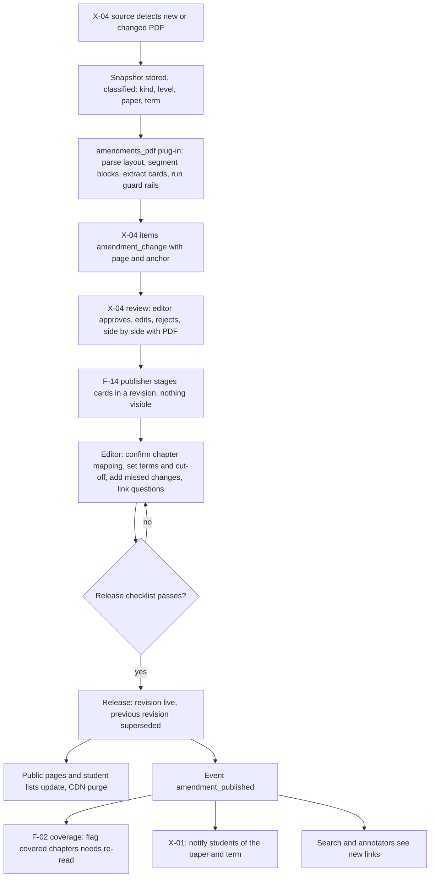
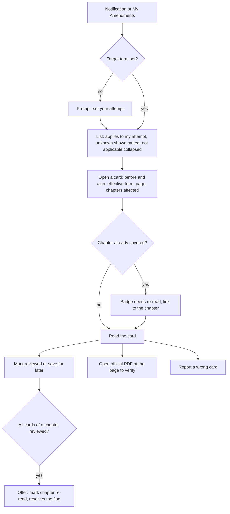
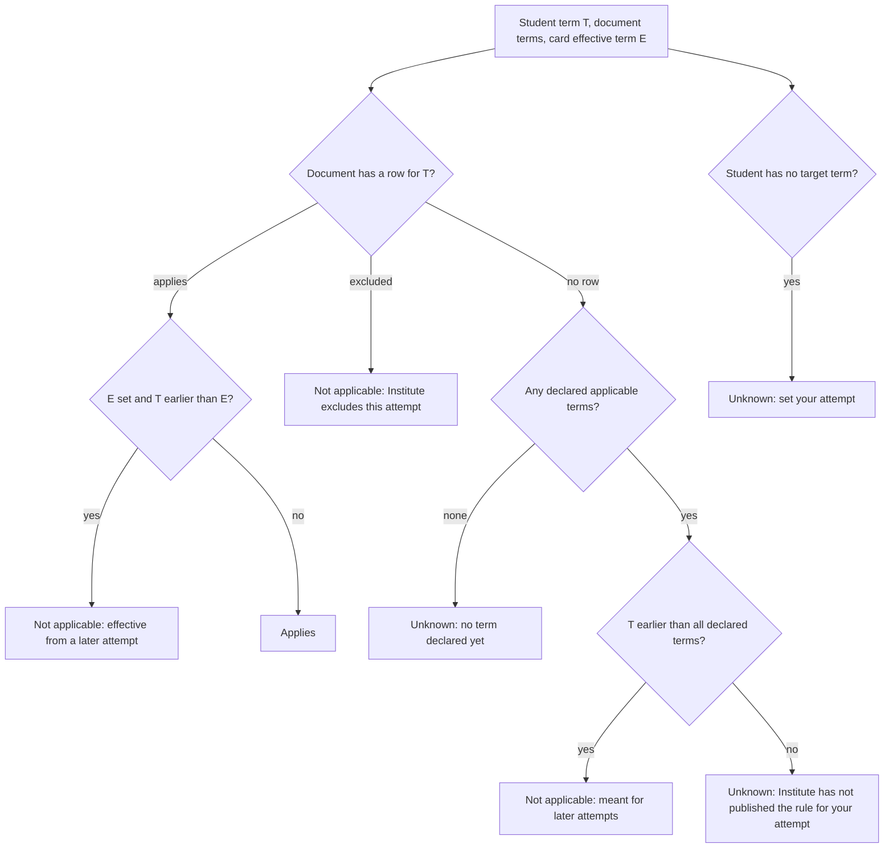

# PRD: F-14 Amendments (Institute amendments, term-wise and paper-wise, broken down into change cards)

| Field | Value |
| --- | --- |
| Status | Draft (for founder review) |
| Owner | Pawan (founder) |
| Last updated | 2026-10-05 |
| Source | `docs/product/FEATURE_MAP.md` section F-14 (item 13, page 6 "Amendments": from the Institute website scraper, term-wise, paper-wise PDFs, scrape the PDF and list down all changes in the exam, breakdown and view) and section 5 (X-01, X-04), section 7 risk 2 |
| Linked ERD | `docs/product/erd/F-14-amendments.md` |
| Role | **Publisher plug-in over X-04, plus the student-facing impact layer.** X-04 owns sources, fetching, raw files, extraction engine, review queue and publisher interface. F-14 owns what an amendment *is* for a student: the document, its term applicability, its change cards, their mapping to chapters, per-student impact, links to questions, public pages. F-14 never fetches or stores raw files |
| Modules | API `apps/api/modules/amendments` (one module, justified in section 8). Web `apps/web/src/modules/amendments`. Extraction plug-in `apps/api/modules/ingestion/extractors/plugins/amendments_pdf.py` ships in the F-14 slices (X-04 loads it by name) |
| Feature flag | `amendments` (PostHog, server checked, 403 `feature_disabled`). Public pages are not behind the flag, as with the F-02 syllabus pages; they exist only for released revisions |
| Depends on | X-04 (publisher registry, review queue, notices, snapshots), F-02 (taxonomy, enrolment term, coverage events), F-06 (core events and jobs, question links). Soft: X-01 (notifications), F-03, F-13, F-15 |

---

## 1. Problem and goal

Every attempt, the Institute changes what can be asked. The Finance Act moves, a section is amended, an accounting or auditing standard is revised, a topic is dropped. The Institute publishes this as PDFs: a "Statutory Update", a "Judicial Update", an "Academic Update", an applicability notice, a list of pronouncements. A student has to find the right PDF for her paper and attempt, read 20 to 80 pages, work out which of her chapters it touches, remember what she had already studied, and then discover in a mock test that the model answer still follows the old law. Coaching classes do this for their own students; self-studying students and students on older material do not.

**Goal, in four parts:**

1. **Turn each Institute amendment document into structured change cards** ("Section 17(5)(d) CGST, modification: from X to Y, applicable from term Z, page 12 of the official PDF"), published only after human review, with the official PDF always one tap away.
2. **Make applicability explicit.** Every document and card knows which terms (attempts) it applies to and which papers it covers. A student sees what applies to *her* attempt, what does not, and what is unknown because the Institute has not said yet. Nothing is assumed.
3. **Close the loop with the student's own progress.** Map every card to F-02 chapters and topics, flag chapters she already covered as "needs re-read", let her tick cards as reviewed, and warn her when a practice question is affected by an amendment.
4. **Be a trustworthy public reference.** Indexable, WhatsApp-shareable pages per term, paper and change, each carrying our source attribution and a prominent "always verify against the official PDF" notice.

This is a **publisher plug-in**, not a second scraper. It reuses X-04 for everything upstream and plugs into F-02, F-06 and X-01 through events and registries.

## 2. Users and scenarios

Examples below are illustrative; real document titles and dates come from the Institute sources.

**Aarav, CA Intermediate, May 2027 attempt, self-studying Taxation.**
He opens My Amendments from the app menu. A hero says "7 changes apply to your May 2027 papers. 3 are in chapters you already covered." He taps the first: a GST change card shows "Before" and "After" in plain words, the section, "Applies to May 2027", and "Official PDF, page 12". He marks it reviewed. Back on the list, a segmented filter keeps "Applies to my attempt" on and shows "Not applicable (4)" collapsed. On his syllabus map the GST chapter now shows a "Needs re-read" badge, and it is in his due-for-revision list.

**Neha, CS Executive, December 2026 attempt.**
ICSI publishes an applicability notice with a cut-off date for the Finance Act and says a new Act is not applicable for her session. The notice produces cards of type "clarification" (scope statements) for Tax Laws and Practice. She sees "Finance Act as on the cut-off date applies; the new Act does not" with the cut-off date and the source. She has no Taxation chapters covered, so she gets no flags, only the list.

**Rohan, CMA Final, a student on the older syllabus.**
ICMAI's clarification circular lists papers for both syllabi. Rohan is enrolled on one scheme; he only sees cards for his scheme's papers, matched by stable subject keys. The other syllabus's entries are visible in the term archive but never in his flags or notifications.

**Meera, editor.** A Statutory Update PDF is discovered by the X-04 source. The extraction plug-in proposes 14 cards, shows a page-coverage map (two paragraphs on page 9 are "unclaimed"), and flags 2 cards for "numbers do not match the source text". Meera reviews in the X-04 side-by-side view, adds the missed change manually, confirms chapter mappings, sets the applicable terms and cut-off date, and presses Release on the checklist screen. Students with the paper get a notification; flags appear in their coverage. Two days later the Institute re-issues the PDF with a corrected figure: the system detects it as a re-issue, shows exactly which cards changed, and re-notifies only the people who saw the changed card.

**A friend opens a WhatsApp link** to `/amendments/ca/intermediate/2027-05/taxation`. The preview shows "CA Intermediate Taxation: 7 amendments for May 2027". The page lists the changes in our own words, states clearly that the official PDF is the authority, and links to it. The page asks him to set his attempt to see what applies.

## 3. Success metrics

Starting hypotheses, to calibrate with the first 50 students and the first 3 terms. "Server" means emitted by the API, not the browser.

| Metric | Definition | Target | Event(s) |
| --- | --- | --- | --- |
| Freshness | Time from the Institute document first seen by X-04 to the revision going live (median, p90) | median under 24 h, p90 under 48 h | `amendment_published` (server, `lag_hours`) |
| Card recall | Real changes in a document found by extraction, measured on the golden set and by monthly human spot check | 95% or more | golden-set CI metric, `amendment_review_completed` |
| Field accuracy | Cards approved with no edit to provision, change type, effective term | 98% for provision, 95% for type, 90% for effective term | reviewer edits in `ingestion_review.edits` (X-04), `amendment_review_completed` |
| Review speed | Editor time per document (median), per card | under 30 min per document, under 90 s per card | `amendment_review_completed` (server, `seconds`) |
| Wrong-applicability incidents | Confirmed reports that a card was shown as applying (or not applying) incorrectly | under 1 per 1,000 card views, zero unfixed after 24 h | `amendment_reported` (kind `wrong_applicability`), `amendment_report_resolved` |
| Reach (activation) | Enrolled students with a target term who open My Amendments within 7 days of the first live amendment for their papers | 40% | `amendments_viewed` |
| Review completion | Students who open it and mark at least 3 cards reviewed in the first 14 days | 35% | `amendment_card_reviewed` |
| Re-read loop | "Needs re-read" flags resolved (re-read or dismissed with reason) within 14 days | 50% | `reread_flag_resolved` (F-02 side) |
| Trust | Card views followed by "Open official PDF" | 30% (a healthy verify habit is the goal, not a low number) | `amendment_source_opened` |
| Share rate | Public card or paper views followed by share | 2 per 100 views | `amendment_shared` |
| Question coverage | Questions whose reference keys match a live card that have a decided link (confirmed or rejected) within 7 days of release | 80% | `amendment_link_decided` (server) |
| Public reach | Organic sessions on `/amendments/*` | track from launch | PostHog pageview |
| Cost | AI cost per released document | under 5 rupees (calibrate; X-04 budget applies) | `ingestion_aicall` sums per revision |

## 4. Scope

### 4.1 In scope

**R1 (the shippable core, section 13)**

1. Amendment documents with revisions, term applicability (including cut-off dates) and paper scope across schemes.
2. Change cards: type (addition, deletion, modification, new standard, clarification), provision, from X to Y in our words, effective term, source page and anchor, confidence and extraction flags.
3. The `amendment_change` payload contract and the `amendments_pdf` extraction plug-in for X-04, with accuracy guard rails and a golden-set test gate.
4. The F-14 publisher (staged revision) and the editor release step with a checklist; manual card add and edit; retraction and re-issue.
5. Mapping of cards to F-02 subject, chapter and topic (suggested by X-04, confirmed by an editor).
6. Student screens: My Amendments, card detail, applicability filter, reviewed state, breakdown by paper, chapter and type.
7. Event `amendment_published` and the F-02 "needs re-read" flag (proposed minimal extension).
8. Public SEO pages (hub, level, term, paper, card, document) with OG images, JSON-LD, sitemap and the verification notice.
9. Django admin plus the X-04 review view for editors.

**R2**

10. Question links (question to change) and the F-06 banner through a small annotator registry.
11. Notifications through X-01 (event contract), re-issue "updated" handling polish, term archive polish.
12. Reports ("this card looks wrong"), `needs_attention`, React release checklist screen with PDF split view.
13. CS and CMA sources at full quality; chapter-page panel; F-03 chapter lookup.

**R3**

14. F-13 Today provider, F-15 recall cards from a card, "Quiz me on this change", printable pre-exam digest, term-over-term compare, semantic question matching.

### 4.2 Out of scope (and who owns it)

| Item | Owner or decision |
| --- | --- |
| Fetching, robots.txt, raw PDF storage, OCR, the review queue engine, take-down mechanics | X-04 (F-14 only adds a plug-in, a publisher and a payload schema) |
| Hosting or re-serving the Institute's PDF | Never (license tier `facts_and_summary`; students always go to the official URL) |
| Verbatim copies of statutory text or Institute prose on public pages | Not shown. Cards hold our own short summaries; the verbatim evidence quote is admin-only |
| Legal or tax advice, predicting whether a topic will be asked | Not provided; no "will be asked" claims |
| Coaching-compiled "amendment notes" and teacher summaries | Not an amendment source in v1 (they stay `link_only` resources in X-04) |
| Notification delivery, preferences | X-01 (F-14 emits events and names the template contract) |
| Syllabus changes (new scheme, removed topics as a syllabus edit) | F-02 via X-04 `syllabus_change` drafts. A card may *mention* a syllabus change but never edits the taxonomy |
| Hindi or other languages | Later (stable keys and strings in one place) |
| Mentor view of students' flags | Mentor mode, later |

## 5. User flows

### 5.1 From Institute PDF to student



### 5.2 Student: from notification to done



### 5.3 Applicability decision (what the filter means)



### 5.4 Edge cases

| Case | Behaviour |
| --- | --- |
| Document lists terms we do not have in the taxonomy yet | Stored by `term_code` (`YYYY-MM`); linked to `syllabus_examterm` when it appears. Applicability compares codes, so it works without the row |
| Student's target term is later than every declared term | Shown as **Unknown** ("The Institute has not published the amendments rule for May 2027 yet"), never assumed to carry forward |
| One PDF covers several papers (applicability notice) | One document, several paper scopes; cards map to the chapters of each paper; a student sees the cards of her papers only |
| One document covers two syllabus schemes (CMA) | Scope rows hold subjects of both schemes; matching is by `(level, subject_key)` so the student's scheme decides |
| Institute re-issues the same document | New revision of the same amendment; cards matched by stable `card_key`: unchanged keep their state and links, changed are marked "Updated", removed are withdrawn, new are added |
| Institute withdraws a document | Revision `retracted` with reason; public page keeps a tombstone; flags resolved as superseded; students who reviewed it see "Retracted" |
| We find our own extraction error after release | Correction revision (kind `our_correction`), public "Corrected on 12 Oct: section number fixed", no re-notification unless the correction is material |
| Document has no change (only an applicability statement) | Valid: produces `clarification` cards or only term rows; no flags |
| Chapter of the paper not seeded yet | Card maps at paper level; shown under the paper; no flag (a flag needs a chapter); the page says "Chapter mapping coming soon" |
| Student excluded the paper or did not choose that elective | Cards of that paper are hidden from My Amendments and never flag |
| Source is third party (`link_only`) | The publisher refuses (`license_tier_insufficient`); amendments come from official sources only in v1 |
| X-04 take-down for the source | All revisions from the source become `retracted` (reason `legal_request`), pages answer 410, flags are resolved, within 5 minutes |
| Two editors release the same document | A row lock on the amendment serialises releases; the second sees "Already released" |

## 6. Functional requirements

P0 must ship in R1, P1 in R2, P2 in R3 unless marked. IDs are `FR-F14-nn`.

### 6.1 Ingestion, extraction and guard rails (plug-in over X-04)

| ID | Requirement | Priority | Acceptance criteria |
| --- | --- | --- | --- |
| FR-F14-01 | Seed X-04 sources (draft) for ICAI BoS announcements and update pages, ICSI applicability notices, ICMAI student circulars, with `content_types = [amendment_change]`, `license_tier = facts_and_summary`, `auto_publish = false` | P0 | Given the seed migration, then three draft sources exist and none crawls until an admin sets it active. Given `auto_publish = true` on such a source, then the F-14 publisher still stages (amendments never auto-release). |
| FR-F14-02 | Classify each PDF: kind (statutory, judicial, academic update, legislative amendment, standards update, corrigendum, applicability notice), level, papers, terms, issue date, from the listing title and first page; rules first, AI only to fill gaps | P0 | Given a title "Statutory Update for May 2026 - Paper 3A Income Tax" (illustrative), then kind, level, paper and term are filled with `origin = rules`. A document that cannot be classified is queued with the flag `unclassified` and cannot be released. |
| FR-F14-03 | Extract change cards as X-04 `amendment_change` items (payload schema v1): provision label and keys, law, change type, our summary of before and after, effective term or date, page, anchor, confidence, flags | P0 | Given a golden PDF, then recall is at least 95% and every card has a page number and an anchor of precision `quote`, `block` or `page`. |
| FR-F14-04 | Guard rails: (a) the verbatim evidence quote must be found in the source block text after normalisation, else the card is `invalid`; (b) every number, section, date and percentage in the summaries must occur in the block text, else flag `numeric_mismatch`; (c) two independent passes must agree on provision, type and effective term, else flag `low_agreement` and raise review priority; (d) completeness: unclaimed text blocks and table rows without a card are listed; (e) text from the PDF is data, never instructions | P0 | Given an extraction that invents "Section 17(9)" absent from the block, then no card is queued. Given a table with 8 rows and 7 cards, then one unclaimed row is shown in the review view. |
| FR-F14-05 | Parse applicability notices into per-term rows (`applies`, `excluded`, cut-off date) and scope statements as `clarification` cards; an editor can enter these by hand | P0 | Given "issued up to 31 Oct 2025 are applicable for May 2026" (the pattern ICAI uses, see appendix), then a term row `2026-05`, cut-off `2025-10-31` is proposed with the source page. |
| FR-F14-06 | Suggest chapter and topic mapping for each card by provision keys, keyword rules and the X-04 mapper, with confidence and reasons; the editor confirms | P0 | Given a card on "Section 17(5) CGST", then suggestions include the ITC chapter of Taxation with confidence and reasons ("provision key cgst:17(5)"). |
| FR-F14-07 | Golden-set regression: a fixture set of real documents with expected cards runs in CI (no network); a change to the plug-in, prompt version or model that lowers recall or precision below threshold fails the build | P0 | Given a prompt change that drops recall to 90%, then CI fails with the per-document diff. |

### 6.2 Review, release, versioning and corrections

| ID | Requirement | Priority | Acceptance criteria |
| --- | --- | --- | --- |
| FR-F14-08 | The F-14 publisher stages approved items into a revision (`staged`); nothing is student-visible until release | P0 | Given an approved X-04 item, then a staged change version exists and no public endpoint returns it. |
| FR-F14-09 | Release checklist blocks release until: all items of the document decided; at least one term row; at least one paper scope; every non-clarification card has a confirmed mapping (paper level at least); unclaimed blocks resolved or acknowledged; official PDF URL reachable and hash equals the snapshot; no summary shares a run of 20 or more consecutive words with the source text (copyright guard, acknowledgeable); for a re-issue, the diff has been viewed | P0 | Given an unmapped card, then Release is disabled and the checklist names the card. |
| FR-F14-10 | Release is atomic and idempotent: previous live revision becomes `superseded`, cards carry over by `card_key`, one event is emitted, public caches are purged, X-04 publications are confirmed | P0 | Given a double click or two editors, then exactly one revision goes live and one event exists. |
| FR-F14-11 | Four-eyes release: when enabled, the releaser must differ from the reviewer for documents with any `high` materiality card | P1 | Given the setting on and the same user, then Release answers 403 `second_reviewer_required`. |
| FR-F14-12 | Editors can add, edit and remove cards in a staged revision (missed change, wording fix), with the evidence quote and page; every edit is audited | P0 | Given a manual card, then it has `origin = manual`, a page and an audit row, and it passes the same checklist. |
| FR-F14-13 | Re-issue: a new file for the same document creates a new revision; cards matched by `card_key` are classified unchanged, updated, new or removed; students see "Updated" on changed cards only | P0 | Given a re-issue with one changed figure, then 1 card is `updated`, the rest `unchanged` and keep reviewed state and links. |
| FR-F14-14 | Retraction: an editor or X-04 take-down retracts a revision with a reason (`institute_withdrew`, `extraction_error`, `legal_request`); public page shows a tombstone (410 for `legal_request`), flags resolve as superseded, event emitted | P0 | Given a retraction, then within 5 minutes no list shows the cards as live and students who reviewed see "Retracted". |
| FR-F14-15 | Corrections of our own errors publish as a new revision (`our_correction`) with a public change note | P1 | Given a corrected section number, then the page shows "Corrected on {date}: {note}" and the old value is not served. |
| FR-F14-16 | Corrigendum documents link to the card they correct; the original card shows "Corrected by a later notice" | P1 | Given a corrigendum card with `corrects`, then the original shows the pointer and an "Updated" tag. |

### 6.3 Student experience

| ID | Requirement | Priority | Acceptance criteria |
| --- | --- | --- | --- |
| FR-F14-17 | My Amendments scoped to the active enrolment: level, the student's scheme (matched by subject keys), non-excluded papers, chosen electives | P0 | Given an enrolment with Taxation excluded, then no Taxation card appears and no flag is created. |
| FR-F14-18 | Applicability per card (`applies`, `not_applicable`, `unknown`) with a reason in words; default filter "Applies to my attempt" shows `applies` and `unknown`; `not_applicable` is behind "Show not applicable (N)" | P0 | Given term May 2027 and a document for Nov 2026 only, then its cards show Unknown with "The Institute has not published the rule for May 2027". |
| FR-F14-19 | Card detail: type, provision, before and after, effective term, applicability reason, chapters affected with the student's own coverage status, page and link to the official PDF at that page, report link | P0 | Given a card on page 12, then "Open official PDF, page 12" opens the official URL at that page (browser PDF open parameter) in a new tab. |
| FR-F14-20 | Reviewed and saved state per card, with progress "4 of 14 reviewed", and bulk "Mark all in this paper as reviewed" with undo | P0 | Given three cards ticked offline, then they sync once, in order, without duplicates. |
| FR-F14-21 | Breakdown views: by paper, by chapter (affected chapters first, covered ones flagged), by type, and a flat list; every view is a URL state | P0 | Given `?group=chapter`, then cards appear under their chapters with the student's coverage status. |
| FR-F14-22 | Archive by term with the "not applicable to my attempt" filter, and a term switcher | P1 | Given `?term=2026-05`, then that term's documents are listed, with applicability evaluated against the student's own term. |
| FR-F14-23 | Search within amendments by provision, law or word | P1 | Given `q=17(5)`, then cards with provision key `cgst:17(5)` rank first. |
| FR-F14-24 | Report a wrong card (wrong change, wrong mapping, wrong applicability, missing change, broken link); three distinct reporters of `wrong_change` in 7 days set `needs_attention` and show a quiet "Under review" tag | P1 | Given 3 reports from 3 users, then the tag shows; 3 from one user do not. |
| FR-F14-25 | Offline: list and detail readable from cache; reviewed and saved changes queue in the persisted offline queue and replay idempotently | P1 | Given airplane mode, then ticking shows "Saved on this device" and syncs later. |
| FR-F14-26 | Export and delete a student's F-14 data (card states) | P1 | Given delete, then card states are removed and the response lists counts. |

### 6.4 Impact on coverage, notes and questions

| ID | Requirement | Priority | Acceptance criteria |
| --- | --- | --- | --- |
| FR-F14-27 | On release, emit `amendment_published` (v1) with per-chapter change counts; F-02 flags chapters that the student has started as "needs re-read" `[PROPOSED EXTENSION to F-02]`. Only `high` and `normal` materiality flags; `low` does not; a flag is kept once per (enrolment, chapter, document), so a re-issue updates it instead of adding another | P0 | Given a chapter at 60% coverage and a new GST card, then it shows "Needs re-read" within one minute; a chapter at 0% shows no flag. A replayed event creates no second flag. |
| FR-F14-28 | Flags resolve when the student marks the chapter re-read or dismisses it, or when the revision is retracted; resolution never changes the coverage percent | P0 | Given "I have re-read this", then the badge clears and coverage percent is unchanged. |
| FR-F14-29 | Chapter integration: the chapter screen shows the live cards for that chapter that apply to the student's attempt; F-03 can ask the same selector for the chapters of a note | P1 | Given a chapter with 2 live cards, then the panel shows 2 with applicability. |
| FR-F14-30 | Question links: an editor (or a suggestion the editor confirms) links a card to a question with a relation (`answer_changed`, `question_obsolete`, `explanation_outdated`, `partially_affected`); links survive re-issues because they point at the stable change identity | P1 | Given a re-issued document, then confirmed links still resolve to the card. |
| FR-F14-31 | F-06 shows the link: a neutral chip "Affected by an amendment" before and during an attempt (no hint at the answer), and the full note after Check or in review; hidden entirely in `exam` mode until review; never changes marks or keys `[PROPOSED EXTENSION to F-06]` | P1 | Given an `at_end` session, then the player shows only the chip; the review shows the note and "applies to your May 2027 attempt". |
| FR-F14-32 | Practice builders can skip affected questions: `amendments.selectors.affected_question_ids(viewer, ...)` feeds `exclude_ids` | P2 | Given "Skip questions affected by amendments", then none of the returned ids is in the session. |
| FR-F14-33 | When F-06 publishes a new live version of a linked question (`key_fix` or `edit`), the link goes to `recheck` for the editor | P1 | Given a key fix, then the link shows in the editor's recheck list and the banner stays until decided. |

### 6.5 Notifications, public pages, operations

| ID | Requirement | Priority | Acceptance criteria |
| --- | --- | --- | --- |
| FR-F14-34 | Notification contract: events `amendment_published`, `amendment_retracted`, `amendment_corrected` with audience spec; one notification per student per revision, digest when several arrive in 24 h `[PROPOSED: X-01]` | P1 | Given a release, then X-01 receives one event with scheme, papers, terms and chapter counts. |
| FR-F14-35 | Public pages: hub, level, term, paper, change card, document; server-rendered, `buildHead`, unique title and description, canonical, JSON-LD (`BreadcrumbList` and `Article` on cards and documents), OG image, sitemap entries with `lastmod` | P0 | Given a card URL shared on WhatsApp, then the preview shows course, level, paper, change type, short title and "Verify at the official source". |
| FR-F14-36 | Every public page carries the notice "Always verify against the official PDF", the source attribution (institute, document title, issue date, page) and a link to the official file; no public field contains a verbatim quote | P0 | Given any public card, then the notice and link are present and `evidence_quote` is absent from the response. |
| FR-F14-37 | Public pages show retracted and superseded states honestly: tombstone for retracted, "A newer version replaced this on {date}" for superseded | P0 | Given a superseded revision URL, then it links to the current revision. |
| FR-F14-38 | Feature flag `amendments` and permission scopes; student endpoints 403 `feature_disabled` when off; export and delete always allowed | P0 | Given the flag off, then every `me/*` endpoint except export and delete answers 403. |
| FR-F14-39 | Editor operations view: documents by state with age, SLA breach (over 24 h unreleased), extraction health per source, page-coverage map per document | P1 | Given a document unreleased for 30 h, then it is marked overdue. |
| FR-F14-40 | Take-down: X-04 withdrawal of a publication retracts the affected revision or card and purges caches | P0 | Given `withdraw(target_id)` from X-04, then the card is no longer served within 5 minutes. |
| FR-F14-41 | Today provider for F-13 ("Read 3 amendments for your May 2027 papers"), recall card creation from a card (F-15), printable pre-exam digest, "Quiz me on this change", term-over-term compare | P2 | Specified as interfaces in section 14; built after R2. |

## 7. Screens, URLs and design-system needs

### 7.1 Screens and URLs

Public pages follow the F-02 pattern: server rendered through route loaders calling the public API, `buildHead()`, unique title and description, canonical, JSON-LD, OG image `1200x630` under 300 KB, sitemap. Private pages use `noindex`. Every meaningful state is a URL.

| Screen | URL | Index | Notes |
| --- | --- | --- | --- |
| Amendments hub | `/amendments` | yes | Courses, latest live documents, the verification notice |
| Level hub | `/amendments/$course/$level` | yes | Terms with document counts, papers |
| Term archive | `/amendments/$course/$level/$term` | yes | `$term` is the term code, for example `2027-05`. Papers with change counts, documents, cut-off dates |
| Paper amendments | `/amendments/$course/$level/$term/$subject` | yes | Change cards in our words, grouped by chapter. Query: `?type=` |
| Change card | `/amendments/$course/$level/$term/$subject/$change` | yes | `$change` is `{kebab-title}-{public_id}`; a wrong slug 301s to the canonical one |
| Document | `/amendments/documents/$slug` | yes | One Institute document: terms, cut-off dates, all cards by paper, the official link, revision history |
| My Amendments | `/app/amendments` | no | Query: `?applies=mine\|all&subject=&group=paper\|chapter\|type&type=&state=unreviewed\|reviewed\|saved&term=&q=` |
| My card detail | `/app/amendments/$publicId` | no | Opens as a side panel on desktop and a full page on phones; same URL |
| My archive | `/app/amendments/archive` | no | Query: `?term=` |
| Chapter panel | embedded in `/app/syllabus/$subject/$chapter` | no | Component from the F-14 barrel, owned by the coverage screen |
| Needs re-read | badges on `/app/syllabus`, `/app/syllabus/$subject`, and entries in `/app/revision` | no | Owned by F-02 `[PROPOSED EXTENSION to F-02]` |
| Question notice | inside the F-06 list, player and review | no | Generic `QuestionNotice` rendered by F-06 from annotation data |
| Editor queue | Django admin first; later `/admin/amendments` | no | Documents by state, SLA, extraction health |
| Release checklist | Django admin first; later `/admin/amendments/revisions/$id` | no | Checklist, page-coverage map, PDF side by side, diff for re-issues |
| Reports inbox | Django admin first; later `/admin/amendments/reports` | no | Reports ranked by distinct reporters |

OG images follow the F-02 `/og/courses/...` pattern (satori and resvg, bundled Inter font, cached one day, any failure redirects to `/og/default.png`): `/og/amendments/$course/$level/$term` (term and paper pages share it) and `/og/amendments/c/$publicId` (card). The card image shows course and level, paper, a change-type label with its icon, the short title (clamped to 3 lines), "Applies to {terms}" and "Verify at the official source". No verbatim Institute text appears on images.

### 7.2 Wireframes

**My Amendments (phone, 320 to 480 px)**

```
┌──────────────────────────────────┐
│ Amendments · CA Inter · May 2027 │
│ 7 changes apply to your papers.  │
│ 3 are in chapters you covered.   │
│ Reviewed 2 of 7  ▰▰▱▱▱▱▱         │
│ [Applies to me ▾] [Taxation ▾]   │
│ Group: (Paper) Chapter  Type     │
├──────────────────────────────────┤
│ Taxation                  5 new  │
│ ┌──────────────────────────────┐ │
│ │ ✎ Modification · GST         │ │
│ │ Sec 17(5): ITC blocked for…  │ │
│ │ Applies May 2027             │ │
│ │ ⚠ Needs re-read · 60% done   │ │
│ │ [Review]        ☐ Reviewed   │ │
│ └──────────────────────────────┘ │
│ ┌──────────────────────────────┐ │
│ │ ？ Addition · Income tax     │ │
│ │ Unknown for May 2027: check  │ │
│ │ the Institute notice         │ │
│ └──────────────────────────────┘ │
│ Show not applicable (4)  ›       │
│ Official notices for your attempt│
└──────────────────────────────────┘
```

**Change card detail (same content on `/app/amendments/$publicId` and the public card page, minus the personal parts)**

```
┌───────────────────────────────────────────┐
│ ‹ Taxation   ✎ Modification   Applies May │
│ GST: ITC on motor vehicles                │
│ Section 17(5)(a) CGST Act                 │
│ ┌ Before ───────────┐ ┌ After ──────────┐ │
│ │ Short, our words  │ │ Short, our words│ │
│ └───────────────────┘ └─────────────────┘ │
│ Effective: term Nov 2026 · cut-off 30 Apr │
│ Why it applies to you: your attempt May   │
│ 2027 is in the declared terms.            │
│ Chapters: GST ITC (60% · needs re-read) › │
│ Source: ICAI Board of Studies, Statutory  │
│ Update, issued 12 Oct 2026, page 12       │
│ [Open official PDF, page 12 ↗]            │
│ Always verify against the official PDF.   │
│ [☐ Reviewed] [Save] [Report an error]     │
│ Questions affected: 3  [Practise them]    │
└───────────────────────────────────────────┘
```

**Release checklist (editor, desktop)**

```
┌ Doc: Statutory Update, Taxation (rev 1)  state: staged ─────────────────┐
│ Checklist            │ Page map (p1..p24)     │ Card 7 of 14             │
│ ✔ items decided 14/14│ ▇▇▇▇▇▇▇▇▇▇▇▇▇▇▁▇▇▇▇…   │ Provision, type, terms   │
│ ✔ terms 2027-05      │ ▁ = unclaimed text     │ Before / After (ours)    │
│ ✖ mapping 2 missing  │ click page → PDF       │ Evidence quote (admin)   │
│ ! unclaimed blocks 1 │                        │ Mapping chips, links     │
│ ✔ PDF hash matches   │ PDF view with the      │ Flags: numeric_mismatch  │
│ [Release] (disabled) │ highlighted anchor     │ [Approve][Edit][Reject]  │
└──────────────────────────────────────────────┴──────────────────────────┘
```

**Question notice in the F-06 review item**

```
┌────────────────────────────────────────────┐
│ ⚠ Affected by an amendment · applies to    │
│ your May 2027 attempt                      │
│ The key follows the earlier provision.     │
│ See the change ›   (official source ↗)     │
└────────────────────────────────────────────┘
```

### 7.3 UI states per screen

Every cell must be designed, built and covered by a component test or a design-showcase entry. "Skeleton" means layout-stable placeholders, never a spinner-only screen. Dates are `5 Oct 2026`; counts use `toLocaleString('en-IN')`.

**Public paper, term and level pages**

| State | Behaviour |
| --- | --- |
| First time | The "Always verify" callout is expanded once per visitor (collapsed afterwards, always reachable); a one-line "Set your attempt to see what applies" with a Select |
| Empty (no amendments published for this term and paper) | "No amendments published here yet. The Institute usually publishes updates before the attempt." with "Tell me when it is published" (X-01, signed in) or "Sign in to get notified"; the level page still lists other terms |
| Empty (paper does not exist in this term) | `notFound()` for an unknown term or paper key, so crawlers get a 404 |
| Loading | Server rendered, so there is no empty first paint; client navigation shows 6 card skeletons and a header skeleton |
| Partial | Cards render; the personal "applies to me" tags load afterwards for signed-in users and fade in; if that call fails the list stays and a quiet "Could not check your attempt. Retry" appears |
| Success | Cards grouped by chapter with type badge (icon and text), short title, effective term, "page N", a verify link; unreviewed-for-me dot for signed-in users |
| Error | Server error: the standard error page with Retry and the request id; a failed client refresh keeps the last good list dimmed with an inline Retry |
| Offline | Banner "Offline: showing the last version saved on this device" if cached; otherwise "You are offline" with Retry |
| Retracted document | Tombstone: "This amendment was withdrawn on {date}: {reason}" with a link to the official notice if any; `noindex`; `legal_request` returns 410 with a short gone page |
| Superseded revision URL | Callout "A newer version replaced this on {date}. See what changed" linking to the current revision; the diff view lists unchanged, updated, new and removed cards |
| Under review tag | Cards with `needs_attention` show "Under review" with an explanation tooltip (Popover for touch) |
| Long content | Titles clamp to 2 lines with the full title on the card page; chapter and law names wrap; before and after blocks clamp to 6 lines with Expand; tables inside summaries scroll in their own container; the card list paginates by cursor (20) with a "Load more" button, not infinite scroll |
| Flag off / permission | Public pages do not depend on the flag. The "applies to me" overlay silently disappears when `amendments` is off for the viewer |

**Public change card and document pages**

| State | Behaviour |
| --- | --- |
| Success | H1 is the short title; before and after side by side on wide screens, stacked on phones; source line, official link, verification notice, related cards of the same chapter, breadcrumb |
| Unknown applicability for the visitor | Anonymous visitors see "Applies to: May 2027, Nov 2027" from the document rows and no personal verdict |
| Broken official link | If the last link check failed (daily job), a callout "The official link may have moved. Search the Institute site for the document title" and a Report link |
| Revision history (document page) | Timeline of revisions with kind (initial, Institute re-issue, our correction) and the change note |
| Share | Native share sheet on phones, copy link on desktop; Toast "Link copied" |
| Print | A print stylesheet keeps the notice and source, hides navigation |

**My Amendments (`/app/amendments`)**

| State | Behaviour |
| --- | --- |
| First time, no enrolment | Empty state: "Set your course and attempt to see amendments for your papers" with the onboarding link; the public hub is offered |
| First time, enrolment without a target term | Banner "Choose your exam attempt" with a Select; the list shows everything as Unknown with the reason "set your attempt" |
| First time, no live amendments for the student's papers and term | "Nothing to review yet. We will tell you when the Institute publishes amendments for {term}." plus the date of the last check and "See last term's amendments" (archive) |
| Loading | Hero skeleton, filter bar stays, 6 card skeletons |
| Partial | Cards load first; coverage overlay ("60% done, needs re-read") loads after and fades in; if F-02 fails the cards show without it and a quiet "Your progress could not load. Retry" |
| Success | Hero sentence with counts, progress bar "Reviewed 2 of 7" with text, list grouped as chosen; "Show not applicable (N)" collapsed |
| All reviewed | Calm done state "All 7 reviewed" with a link to chapters flagged for re-read; reduced-motion safe, no confetti requirement |
| Filtered to nothing | "No changes match" with the strongest filter to remove as a chip ("Remove type: Deletion") |
| Error | Inline alert with Retry and request id; filters remain; last good list stays dimmed |
| Offline | Banner "Offline: showing amendments saved on this device"; reviewed and saved toggles work and show "Saved on this device (N waiting)"; official links disabled with a note |
| Reconnect | Banner "Back online, syncing 3 changes", then a Toast "All changes saved" |
| Flag off | Page "Amendments are not available yet" (403 `feature_disabled`); public pages still reachable |
| Rate limited | State changes are limited (120 per minute); the 429 shows a Toast "Slow down a little" and the control retries after `Retry-After` |
| Retracted card in my list | Greyed, "Retracted on {date}", excluded from counts, kept for 30 days so students understand what happened |
| Updated card | Tag "Updated {date}" and the reviewed tick is cleared with a note "Changed after you reviewed it" (only for materially changed cards) |
| Long content | Long paper names wrap; at 320 px the filter bar becomes a bottom Sheet with Apply and Clear; chips use icon and text, not colour alone; counts above 99 show "99+" with the exact number in the accessible name |

**My card detail (`/app/amendments/$publicId`)**

| State | Behaviour |
| --- | --- |
| Loading | Header and two block skeletons |
| Success | As the wireframe; chapters list with coverage status as text and icon |
| Not found or not in my scope | 404 "This change is not part of your papers" with a link to the public page if it exists |
| Applicability unknown | A Callout (info) explains the reason and links the official notice list for the attempt |
| Not applicable | Callout "Does not apply to your May 2027 attempt: effective from Nov 2027" and the card stays readable |
| Error saving reviewed | Row-level "Not saved. Retry"; never blocks reading |
| Official PDF unavailable | The link shows "Official link may have moved" after a failed check; Report is offered |
| Retracted | Whole card muted with the retraction reason; actions disabled except Report |
| Superseded revision | "Updated on {date}" with the diff of this card (before the update, after the update) |
| Affected questions | "3 questions affected" with a Practise button (disabled when `question_bank` is off or there are none) |

**Archive (`/app/amendments/archive`)**

| State | Behaviour |
| --- | --- |
| Empty | "No earlier terms yet" for new students; the first release creates the first term |
| Success | Term tabs (SegmentedControl, scrollable at 320 px), documents per term with counts and an applicability label for the student's own attempt; "Not applicable to my attempt" filter on by default for past terms |
| Loading, error, offline | As the list, scoped to the selected term |
| Long content | A term with more than 50 documents paginates by cursor |

**Chapter panel (coverage chapter screen)**

| State | Behaviour |
| --- | --- |
| None | Panel hidden (no empty box) when the chapter has no live card |
| Some | "2 amendments affect this chapter" with the cards, applicability and reviewed ticks; "Mark chapter re-read" when a flag is open |
| Loading, error | A 2-row skeleton; on error a one-line "Amendments could not load. Retry" that never blocks the chapter |
| Flag off | Panel hidden |

**Question notice (inside F-06 surfaces)**

| State | Behaviour |
| --- | --- |
| In a list | A small chip "Amendment" (icon and text) |
| In the player, before answering, `instant` or `at_end` | A neutral chip "Affected by an amendment" only, no body (the body could hint at the answer) |
| In the player, after Check or in review | Full notice with the note, applicability for the viewer and a link to the change |
| In `exam` mode | Nothing until the review screen |
| Anonymous viewer | Note without a personal verdict ("Applies to May 2027 and Nov 2027") and a public link |
| Applicability `not_applicable` | A muted info line "This amendment applies from Nov 2027; not your attempt" so the student is not alarmed |
| Annotator slow or failing | The question renders without it; no error shown to the student; a server metric counts the miss |

**Release checklist and review (editor)**

| State | Behaviour |
| --- | --- |
| Empty queue | "No documents waiting" with the last successful crawl time per source |
| Loading | Checklist, page map and card list skeletons |
| Partial | Checklist items stream in as checks finish; PDF page images load lazily |
| Extraction failed | Document shows `failed` with the stage and error sample, "Re-run extraction" and "Enter manually" |
| Success | All checks green; Release enabled with a confirmation sheet showing counts, terms, papers and the audience size estimate |
| Blocked | Release disabled with each failing check as a link to its cause |
| Conflict | "Another editor released this document" with a link to the live revision |
| Four-eyes required | Release disabled with "A second reviewer must release this" |
| Re-issue | A diff tab with unchanged, updated, new and removed cards and the students-to-renotify estimate |
| Error | Toast with Retry and the request id; the form keeps its edits |
| Offline | Read-only banner; decisions disabled |
| Permission | Editors see everything except Retract (admin and publishers only); students get 404 |
| Long content | Documents of 100 pages page-map by 25 pages with a scroll area; cards list virtualised beyond 200 rows |

## 8. Data and permissions

- **Module decision.** One API module `amendments` and one web module `amendments`. It is a domain of its own (documents, terms, cards, links, student state), not a sub-feature of `ingestion` (which stays generic) or `syllabus` (which stays reference data). The extraction plug-in lives under `ingestion/extractors/plugins/` because X-04 loads plug-ins by name; the plug-in contains only parsing, never F-14 tables.
- **Entities** (full definitions in the ERD): `amendments_amendment`, `amendments_revision`, `amendments_revisionsubject`, `amendments_revisionterm`, `amendments_change`, `amendments_changeversion`, `amendments_changemap`, `amendments_contentlink`, `amendments_cardstate`, `amendments_report`, `amendments_auditlog`. The flag table `coverage_chapterflag` belongs to F-02 `[PROPOSED EXTENSION to F-02]`.
- **Public data** (released revisions only): documents, terms, cards in our words, mappings, source attribution. Never the evidence quote, never the raw PDF, never drafts or staged revisions.
- **Private data:** `amendments_cardstate` (reviewed, saved) is the student's study behaviour: personal data, exported and deleted on request, never sent to analytics beyond counts and keys.
- **Reports** may contain free text: stored with the optional user id, scrubbed of e-mail-like strings, retained 12 months.

Permission matrix (`profiles.role` plus Django groups, as in F-02):

| Action | Anonymous | Student | Editor | Publisher (group) | Admin |
| --- | --- | --- | --- | --- | --- |
| Read public pages and API | yes | yes | yes | yes | yes |
| Read `me/*`, set own card state, report | no (report allowed with throttle) | yes | yes | yes | yes |
| Review items (X-04), edit staged cards, map, link questions | no | no | yes | yes | yes |
| Release a revision | no | no | no | yes | yes |
| Retract, take down | no | no | no | yes (retract) | yes (take-down override) |
| Change source or ingestion settings | no | no | no | no | yes (X-04) |
| Read evidence quotes, raw snapshots | no | no | yes | yes | yes |

Scopes: `amendments:read` (student), `amendments:review`, `amendments:release`, `amendments:retract`, `amendments:links`. A mentor role is reserved for mentor mode; it has no extra access here.

## 9. API surface

Base `/api/v1/amendments/`. Errors use `{"error": {code, message, details}}`. Lists use cursor pagination (`cursor`, `limit` default 20, max 50). Student routes require auth and the `amendments` flag (403 `feature_disabled`). Public GETs send `Cache-Control: public, s-maxage=120, stale-while-revalidate=600`; retraction purges the path.

### Public (no auth)

| Method and path | Purpose |
| --- | --- |
| GET `courses/{course}/levels/{level}/` | Terms with document and card counts, papers, latest releases |
| GET `courses/{course}/levels/{level}/terms/{term}/` | Term archive: papers with counts, documents with cut-off dates |
| GET `courses/{course}/levels/{level}/terms/{term}/subjects/{subject}/` | Paper page: cards grouped by chapter (`type`, `cursor`) |
| GET `changes/{public_id}/` | One card with its document, terms, chapters, source page, official URL, status |
| GET `documents/{slug}/` | Document with terms, cut-offs, cards by paper, revision history |
| GET `latest/` | Latest released documents (hub) |
| GET `sitemap/` | Public paths with `lastmod` for `sitemap.xml` |
| POST `reports/` | Report a card (auth optional, throttled per user and per IP) |

### Student (auth, flag, scoped to the user)

| Method and path | Purpose |
| --- | --- |
| GET `me/summary/` | Counts for the active enrolment: applies, unknown, not applicable, reviewed, flagged chapters, last release |
| GET `me/changes/` | List. Params: `applies=mine\|all`, `subject_id`, `chapter_id`, `type`, `state=unreviewed\|reviewed\|saved`, `term`, `group`, `q`, `cursor` |
| GET `me/changes/{public_id}/` | Card with applicability (state, reason code), my coverage per chapter, my state, affected question count |
| PUT `me/changes/{public_id}/state/` | `{reviewed: bool, saved: bool, client_id}`; idempotent, last write wins by `updated_at` |
| POST `me/changes/bulk-state/` | `{public_ids[<=100], reviewed, client_id}`; returns an undo token valid 10 s |
| GET `me/chapters/{chapter_id}/` | Live cards for a chapter with applicability (chapter panel, F-03) |
| GET `me/archive/` | Terms and documents with applicability labels |
| GET `me/export/` and DELETE `me/` | Export or delete the student's card states (always allowed) |

`GET` endpoints never write (the first-seen time is set by the PUT).

### Editor, publisher, admin (role gated; Django admin first, same services)

| Method and path | Purpose |
| --- | --- |
| GET `admin/revisions/` and `admin/revisions/{id}/` | Documents by state; detail with cards, checklist, page map, diff |
| PATCH `admin/revisions/{id}/` | Kind, title, issue date, scope papers, term rows and cut-offs |
| POST `admin/revisions/{id}/changes/` | Add a manual card |
| PATCH, DELETE `admin/changes/{version_id}/` | Edit or remove a card in a staged revision |
| PUT `admin/changes/{version_id}/mapping/` | Confirm or replace chapter and topic mapping |
| POST `admin/revisions/{id}/check/` | Run the release checklist and return results |
| POST `admin/revisions/{id}/release/` | Release (needs `amendments:release`), idempotent by `Idempotency-Key` |
| POST `admin/revisions/{id}/retract/` | `{reason, note}` (needs `amendments:retract`) |
| POST `admin/revisions/{id}/correct/` | Start a correction revision from the live one |
| GET, POST, PATCH `admin/changes/{change_id}/links/` | List, add, decide content links; POST `admin/revisions/{id}/suggest-links/` enqueues the suggestion job |
| GET `admin/reports/` and PATCH `admin/reports/{id}/` | Reports inbox and resolution |

Internal Python interfaces (not HTTP) are in the ERD section 3.2 and summarised in section 14.

## 10. Analytics events and notifications

Web events are PostHog (names `noun_verb`); server events carry no personal text. No amendment text, notes or report messages go to analytics.

| Event | Source | Properties |
| --- | --- | --- |
| `amendments_viewed` | web | view (list, paper, chapter, archive), applies_filter, count_bucket |
| `amendment_card_opened` | web | change_type, applicability, has_flag, surface (list, chapter, question, public) |
| `amendment_card_reviewed` | web | change_type, bulk (bool), queued (bool) |
| `amendment_card_saved` | web | change_type |
| `amendment_source_opened` | web | document_kind, page_bucket |
| `amendment_shared` | web | surface (card, paper, term), channel |
| `amendment_filter_changed` | web | applies, type, group |
| `amendment_term_set_prompted` | web | result (set, dismissed) |
| `amendment_reported` | web | kind |
| `amendment_write_queued` | web | kind (state, bulk) |
| `amendment_published` | server | kind, revision_kind, cards, high_cards, terms, papers, lag_hours |
| `amendment_retracted` | server | reason, hours_live |
| `amendment_review_completed` | server | seconds, cards, edited_cards, manual_cards, flags_total |
| `amendment_link_decided` | server | decision, relation, origin |
| `amendment_report_resolved` | server | kind, outcome, hours_to_resolve |
| `amendment_flags_created` | server | revision_id, enrolments_scanned, flagged, unmatched |

Notifications `[PROPOSED: X-01]`, sent by X-01 from F-14 events (no F-14 delivery code):

| Trigger | Audience | Copy (draft) |
| --- | --- | --- |
| `amendment_published` (initial) | Students enrolled in the scope papers whose term applies or is unknown | "New amendments for CA Inter Taxation: 7 changes for May 2027. 3 are in chapters you covered." |
| `amendment_published` (re-issue) | Students who reviewed or flagged a changed card | "ICAI re-issued the Taxation update. 1 change was updated since you reviewed it." |
| `amendment_retracted` | Students who saw or reviewed it | "An amendment you reviewed was withdrawn: {reason}." |
| `amendment_corrected` (material) | Same as re-issue | "We corrected a change in {paper}: {note}." |

Rules: one notification per student per revision, digest when more than one arrives within 24 hours, respect quiet hours, in-app first, e-mail optional (X-01 preferences). Silent for `low` materiality and `our_correction` without material change.

## 11. Non-functional requirements

| ID | Area | Requirement |
| --- | --- | --- |
| NFR-F14-01 | Accuracy and trust | No card reaches students without human review and a source page. Release is gated by the checklist. The verification notice and source link appear on every public and private card. We state facts about *what changed*, never legal conclusions |
| NFR-F14-02 | Performance | Public pages: server render under 500 ms uncached, CDN hit under 80 ms. `me/changes` p95 under 300 ms for a level (up to 300 cards). Annotator batch for up to 100 question ids adds under 30 ms p95 (one indexed query, section 5 of the ERD). `amendment_published` fan-out to coverage: 20,000 enrolments flagged within 5 minutes |
| NFR-F14-03 | Reliability and concurrency | Release, retract and re-issue serialise on a row lock on the amendment; exclusivity (one live revision, one open revision) is enforced by partial unique indexes, not by check-then-insert. Event consumers are idempotent on `event.id`; flags use an upsert on a unique key; no derived data is rebuilt with delete-then-insert. Worker and queue failures never affect student reads |
| NFR-F14-04 | Freshness SLO | Median under 24 h from first seen to live; take-down effective within 5 minutes |
| NFR-F14-05 | Accessibility | WCAG 2.2 AA. Before and After are labelled blocks (text and icon), not colour; change-type badges have text; the progress bar has a text equivalent ("Reviewed 2 of 7"); filters and the bottom Sheet are keyboard and screen-reader operable; targets at least 44 px |
| NFR-F14-06 | Themes and layout | Works in Reading, Light, Dark and System; 320 to 1280 px with no horizontal scroll; wide tables scroll inside their container |
| NFR-F14-07 | SEO | Unique title (under 60 chars) and description (110 to 160), canonical without query string, one H1, JSON-LD `BreadcrumbList` and `Article` (author and publisher are ArthaCommerce, `about` names the Institute), sitemap with `lastmod`, OG 1200x630 under 300 KB. Retracted and not-found pages never appear in the sitemap. Private pages `noindex` and disallowed in `robots.txt` |
| NFR-F14-08 | Security and privacy | Student routes scope every query by the JWT subject; detail routes return 404 for out-of-scope ids. RLS enabled with no policies on all tables. Evidence quotes and snapshots are admin-only. Public serializers are separate classes with an allow-list of fields and a test that asserts the quote never leaks. Reports throttled (user 10 per day, anonymous per IP, needs `NUM_PROXIES` and a shared cache) |
| NFR-F14-09 | Legal posture | License tier `facts_and_summary`: our own short summaries, facts, page references, deep links; no re-hosting, no verbatim passages; summary run-length copy check; "not affiliated with the Institute" statement in the footer of public pages `[VERIFY with a lawyer, Q-F14-1]` |
| NFR-F14-10 | AI use | Gemini only from the API worker through `integrations/gemini.py`; model, prompt version and temperature stored with the revision; X-04 daily budget applies; two passes per block; no tools; output must validate against the schema. See section 10 of the ERD for guard rails |
| NFR-F14-11 | Cost | Under 5 rupees per released document (assumption: 30 pages, about 25,000 input tokens per pass, two passes, Flash-class model `[VERIFY current pricing]`). No new infrastructure beyond X-04's worker |
| NFR-F14-12 | Testability | Pure functions (applicability, card key, revision diff, release checks, summary copy check) are unit tested with shared fixtures; extraction runs on saved snapshots only; CI never touches the network; golden set gate (FR-F14-07) |
| NFR-F14-13 | Observability | Structured logs with `revision_id`; Sentry for exceptions; counters for extraction flags, unclaimed blocks, review time, annotator misses, fan-out lag; dead event deliveries alert |
| NFR-F14-14 | Data protection (DPDP Act 2023) | Student card state is exportable and deletable; included in the central account-deletion hook `[PROPOSED]` (audit finding AUD-004: register `amendments.services.delete_all_for_user`); reports scrubbed and retained 12 months |
| NFR-F14-15 | i18n and formats | English first; strings in one place; dates `5 Oct 2026`, term labels "May 2027"; stable keys for later Hindi |

## 12. Risks and open questions

| # | Risk | Mitigation |
| --- | --- | --- |
| R1 | A wrong card or wrong applicability costs a student marks (high impact, X-04 R2) | Mandatory review, grounding and numeric checks, two-pass agreement, release checklist, four-eyes option, verification notice, reports and a 24 h fix target, "unknown" instead of guessing |
| R2 | Institute document formats vary and change between terms | Layout-aware parsing with fixtures per paper and per term, golden set, health checks and drift pause from X-04, manual entry fallback so a document is never blocked by the extractor |
| R3 | Legal exposure from summarising Institute documents | `facts_and_summary` only, our wording, no verbatim, no hosting, always link to the source, take-down in 5 minutes, lawyer review (Q-F14-1) |
| R4 | The extractor misses changes (low recall) | Page-coverage map and unclaimed blocks, table-row counts, recall measured on the golden set, editors can add cards, "Report a missing change" |
| R5 | Over-flagging fatigues students ("everything needs re-read") | Only `high` and `normal` cards flag, one flag per chapter per revision with a count, easy dismiss, `low` materiality for wording changes |
| R6 | Questions linked to the wrong change (false banners) | Suggestions only, human confirm, confidence and reasons, links decided in bulk with sampling, neutral chip until answered |
| R7 | Scheme changes break mappings | Mapping stores stable keys beside ids and re-points via `syllabus_chaptermap` (`propose_remap`) |
| R8 | Release bursts (Statutory Updates land together) overload editors | Review prioritisation by flags and paper popularity, SLA view, batch release per document, four-eyes only for `high` |

Open questions (numbered; each has a recommended default and a decider):

| # | Question | Recommended default | Decider |
| --- | --- | --- | --- |
| Q-F14-1 | Legal posture for summarising Institute amendment documents publicly | Our own short summaries, facts, page references and deep links, no verbatim, no hosting, plus a non-affiliation line; lawyer reviews before public launch; private (signed-in) pages may ship earlier | Founder with a lawyer |
| Q-F14-2 | Exact source URLs and which Institute pages to watch first | CA Inter and Final BoS update pages for Taxation, Audit and Law first, then ICSI and ICMAI applicability circulars; founder supplies the URLs | Founder |
| Q-F14-3 | Real sample PDFs for the golden set | Upload at least 6 real past documents across 3 papers and 3 terms (we could not inspect actual update PDFs during this research, so the extraction profile is unverified) | Founder |
| Q-F14-4 | Four-eyes release | Off in R1 (one editor, with a next-day audit of released cards); on from R2 when there are two editors, for documents with high-materiality cards | Founder |
| Q-F14-5 | Applicability when the Institute has not published the rule for the student's attempt | Show Unknown with a link to check; never assume carry-forward | Founder |
| Q-F14-6 | Re-flag policy on re-issues | Re-flag and re-notify only for materially changed cards | Founder |
| Q-F14-7 | Do "needs re-read" flags change the coverage percent | No: the percent stays factual; the flag is an alert | Founder |
| Q-F14-8 | Index individual card pages | Yes for cards with at least 60 words of our summary; otherwise `noindex,follow` until enriched; review after 3 terms | Founder |
| Q-F14-9 | CA first, CS and CMA later | CA Inter and Final in R1; CS and CMA in R2 (their notices are simpler: cut-off and applicability) | Founder |
| Q-F14-10 | Auto-confirm question links on exact reference-key match | Not in R1 or R2; suggestions plus bulk approve; reconsider with accuracy data | Founder |
| Q-F14-11 | Editorial "exam impact" notes ("often tested") | Optional field, empty by default; never allowed without a verifiable basis | Founder |
| Q-F14-12 | Retention of retracted pages | Tombstone 200 with `noindex` for 90 days, then 410; `legal_request` is 410 at once | Founder |

## 13. Rollout

### 13.1 Phases

1. **R1 (shippable core, flag `amendments` internal, public pages dark until Q-F14-1):** plug-in, payload, publisher, release, mapping, student My Amendments, coverage flags, public pages. Source: CA Inter and Final (3 to 5 papers) with real fixtures.
2. **R2:** question links and the F-06 notice, notifications (after X-01 in-app), re-issue and retraction polish, reports, React release screen, CS and CMA sources, chapter panel.
3. **R3:** F-13 Today provider, F-15 recall cards, "Quiz me", pre-exam digest, term compare, semantic matching.
4. **Beta:** the same 50 students as F-01 and F-02 for one term; watch the section 3 metrics; compare released cards with a human check on every document for the first term.
5. **Support notes:** FAQ "How do I know an amendment applies to me?", "Why does it say Unknown?", "How to report a wrong change", a runbook for retraction and take-down, a runbook for "source layout changed".
6. **Migration:** new tables only; no backfill; ships dark behind the flag; the F-02 extension adds one table and a subscriber (details in the ERD section 3.3).

### 13.2 Phasing into PR-sized issues (each independently shippable)

1. `amendments` skeleton: models, migrations with check constraints and partial unique indexes, RLS hook, audit table, Django admin read-only, tests of constraints
2. Pure domain package: applicability, card key and identity, revision diff, release checks, summary copy check, provision key adapter (fixtures shared with the web mirror of applicability)
3. X-04 side: `amendment_change` payload schema v1, `amendments_pdf` plug-in skeleton (layout parse, segmentation), guard-rail validators, golden harness with the first 3 fixtures (needs X-04 slice 9)
4. Publisher and staging: `AmendmentChangePublisher`, `[PROPOSED EXTENSION to X-04]` staged publication state and `confirm_publication`, tests
5. Syllabus read selectors needed (`resolve_chapter`, `terms_for_level`, `chapter_map_for`) and the mapping service with suggestions
6. Release, retract, correct and re-issue services with row lock, events and audit; Django admin actions and the checklist
7. Public selectors and endpoints, caching, sitemap, public serializers with the allow-list test
8. Web public pages with SEO, OG routes, verification notice, share
9. Student selectors and endpoints, card state, `me/*`
10. Web My Amendments, card detail, filters, offline queue integration, states
11. F-02 extension: `coverage_chapterflag`, subscriber, selectors (`enrollment_context`, `chapter_states`, `audience`), flag badge, revision-list entries
12. Reports, `needs_attention`, operations view, extraction health
13. Content links, suggestion job, `[PROPOSED EXTENSION to F-06]` annotator registry and notice component, recheck on question edits
14. Notification contract, Today provider, archive polish, analytics completeness, export and delete in the erasure hook
15. R3 items one by one (recall card, quiz me, digest, compare)

## 14. Dependencies and interfaces

Names are final for F-14; items marked `[PROPOSED ...]` are small additions the owning document should confirm.

### Provides

| Interface | Kind | Consumer |
| --- | --- | --- |
| `amendments.selectors.changes_for_chapters(viewer_ctx, chapter_ids)` | read | F-02 chapter panel, F-03 notes ("this chapter has amendments") |
| `amendments.selectors.affected_question_ids(viewer_ctx, *, chapter_ids=None, relation_in=None, limit=2000)` | read | F-05 and F-08 builders (`exclude_ids`), F-09 PYQ |
| `amendments.selectors.annotations_for_questions(question_ids, viewer)` | read, registered as an F-06 annotator | F-06 list, player, review |
| `amendments.selectors.summary_for_user(user_id)` | read | F-13 Today, X-01 copy |
| Events `amendment_published`, `amendment_corrected`, `amendment_retracted` (v1, schemas in `core/event_schemas`) | events | F-02 coverage (flags), X-01 (notifications), analytics |
| Publisher `AmendmentChangePublisher` registered for `amendment_change` | registry | X-04 |
| `amendments.services.delete_all_for_user`, `export_for_user` | service | central account-deletion hook |
| Web barrel `~/modules/amendments`: `ChapterAmendmentsPanel`, `AmendmentChip`, `useChapterAmendments` | UI | coverage chapter screen, F-03 |

### Consumes

| From | Interface | Use |
| --- | --- | --- |
| X-04 `ingestion` | `register_publisher`, review queue, snapshots (signed URLs), `ingestion_item(version)` ids by value, take-down hook, `[PROPOSED EXTENSION to X-04]` publication state `staged` and `ingestion.services.confirm_publication(publication_id)` | Source, review, provenance |
| F-02 `syllabus` | `selectors`: published scheme, chapters and topics by key and id, exam terms, `chaptermap`; `[PROPOSED]` read selectors `resolve_chapter(scheme_id, subject_key, chapter_key)`, `terms_for_level(level_id)`, `chapter_map_for(from_scheme_id, to_scheme_id)` | Mapping, applicability |
| F-02 `coverage` | `[PROPOSED EXTENSION to F-02]` selectors `enrollment_context(user_id)`, `chapter_states(user_id, chapter_ids)`, `audience(scheme_id, term_codes, subject_keys, cursor)`; table `coverage_chapterflag` and a subscriber to `amendment_published` | Student scope, impact |
| F-06 `questionbank` | `selectors.search_ids`, `taxonomy_of`, `can_view`; `[PROPOSED EXTENSION to F-06]` `register_annotator` and pure `parse_reference(label)`; events `question_version_live`, `question_taken_down` | Links, banners |
| `core.events`, `core.jobs` | `emit`, `register_subscriber`, `enqueue` | Events, suggestion job, link checks |
| X-01 `[PROPOSED: X-01]` | Subscribes to F-14 events; `notifications.services.notify(user_id, kind, payload, dedupe_key)` | Notifications |
| F-13 `[PROPOSED: F-13]` | `register_today_provider('amendments', fn)` | Today tasks |
| F-15 `[PROPOSED: F-15]` | `recall.services.create_card_from_source(user_id, source_ref, text)` | Recall from a card (R3) |
| F-03 `[PROPOSED: F-03]` | Calls `amendments.selectors.changes_for_chapters` | Notes banner |
| `profiles` | `role`, central erasure hook `[PROPOSED]` | Permissions, DPDP |

Related documents: [`F-02`](../prd/F-02-syllabus-structure-and-coverage.md), [`X-04`](../prd/X-04-ingestion-scraping-service.md), [`F-06`](../prd/F-06-question-bank-system.md), ERD [`F-14`](../erd/F-14-amendments.md).

## Appendix A. Research notes and references

How the Institutes actually publish (read on 5 Oct 2026; document structures were read through summaries of the official PDFs and pages; we did not inspect an actual Statutory Update PDF, so layout assumptions need fixtures, Q-F14-3).

1. ICAI BoS Knowledge Portal, "BOS Publication applicable for Foundation, Intermediate and Final Course, January 2026": https://boslive.icai.org/announcement_details.php?id=522. Each paper lists a base edition plus additive supplements ("+RTP for January 2026", "+Statutory Update for January 2026", "Judicial Updates"). **Changed the design:** an amendment is an additive document per paper and term, not a replacement; the unit is a revision of a document with its own cards.
2. ICAI "BOS Study Material applicable for May 2026 Examination" (PDF): https://boslive.icai.org/assets/BOS_Study_Material_applicable_for_May_2026_Examination.pdf. Pattern "July 2025 + RTP for May 2026 + Statutory Update for May 2026"; Judicial Update for tax laws, Academic Update for audit papers. **Changed:** document `kind` enumeration (statutory, judicial, academic, applicability notice).
3. ICAI "List of Pronouncements, May 2026 Exam" (PDF): https://boslive.icai.org/assets/List_of_Pronouncement_May2026_Exam.pdf. Organised by level and paper with inclusion and exclusion tables, and a cut-off rule ("issued up to 31 October 2025 are applicable for May 2026"). It does not enumerate every amendment. **Changed:** per-term `cutoff_date`, the `clarification` card type for scope statements, and acceptance of documents with no changes.
4. StudyCafe, ICAI Final November 2023 standards, guidance notes and legislative amendments: https://studycafe.in/icai-releases-standards-guidance-notes-legislative-amendments-applicable-for-final-examination-november-2023-237193.html. Reports a rule of legislative changes up to six months before the exam (30 April 2023 for November 2023). Secondary source `[VERIFY against the current official notice]`. **Changed:** applicability is data per term, never computed from a hard-coded six-month rule.
5. ICSI, "Applicability of Finance Act for June 2026 Exam" (PDF): https://www.icsi.edu/media/webmodules/DFAAL/Applicability_of_Finance_Act_for_June_2026_Exam.pdf. Names the papers, a cut-off of 30 November 2025 for rules and notifications, and states that a new Income-tax Act is not applicable for that session. **Changed:** exclusion statements are first-class (card type `clarification`, term row `excluded`).
6. ICMAI, student circular "Clarification Dec 2023" (PDF): https://icmai.in/upload/Students/Circulars/Clarification_Dec_2023.pdf. Cut-off of 31 May 2023 for amendments across laws and standards, mapped to papers of both the 2016 and 2022 syllabi, with links to supplementary material. **Changed:** a document's scope covers subjects of more than one scheme, matched by stable subject keys.
7. ICAI Final exam cadence (PW Live news): https://www.pw.live/news/ca-final-exams-2026-twice-a-year-icai-january-cycle-removed. Final moved to May and November from May 2026; Foundation and Intermediate remain thrice a year `[VERIFY]`; CS and CMA sit in June and December `[VERIFY]`. **Changed:** term codes are per level and applicability never assumes a shared calendar.
8. Google AI for Developers, Gemini document understanding and structured output: https://ai.google.dev/gemini-api/docs/document-processing and a worked example https://www.philschmid.de/gemini-pdf-to-data. PDFs as input, JSON-schema constrained output, File API for large files `[VERIFY current limits and pricing]`. **Changed:** schema-first extraction with per-field descriptions, token counting before large documents, and a block-sized prompt strategy to keep cost and context small.
9. PyMuPDF text search and highlighting (Artifex): https://artifex.com/blog/explore-text-searching-with-pymupdf. Word and block coordinates and quad search. **Changed:** every card stores a bounding anchor found by searching the evidence quote on its page, with a precision label when only the block is known.
10. Harvey, low-latency redline detection: https://www.harvey.ai/blog/low-latency-redline-detection. Text heuristics (colour, strike, underline) missed clear redlines; looking at the page image worked better. **Changed:** font and strike signals are hints only; table-heavy or redlined pages get an image-based verification pass.
11. Litera, benchmark of purpose-built redlining versus general LLMs: https://info.litera.com/compare-benchmark-report.html. Vendor material, figures not relied on `[VERIFY]`; the headline (general models miss and invent changes in legal comparison) supports mandatory recall checks and human review.
12. Internal: `docs/product/prd/X-04-ingestion-scraping-service.md` (legal tiers, review, publisher interface), `docs/product/erd/F-06-question-bank-system.md` (events, registries, `search_keys`), `docs/product/validation/F-02-F-01-implementation-audit-2026-10-05.md` (concurrency, layering and erasure findings applied here).

Findings that did **not** change the design: no Institute offers a machine-readable amendment feed that we found (documents are PDFs on a portal), so PDF extraction stays the only path; the Institutes' documents give cut-off dates, not per-card effective terms, so card-level effective terms are often absent and the document terms drive applicability.
