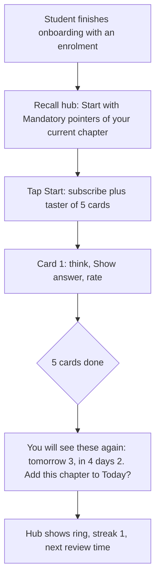
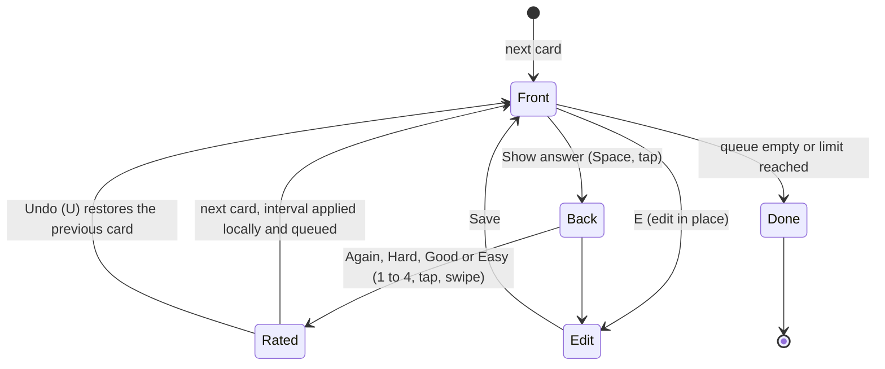
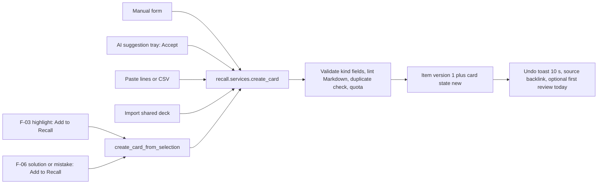
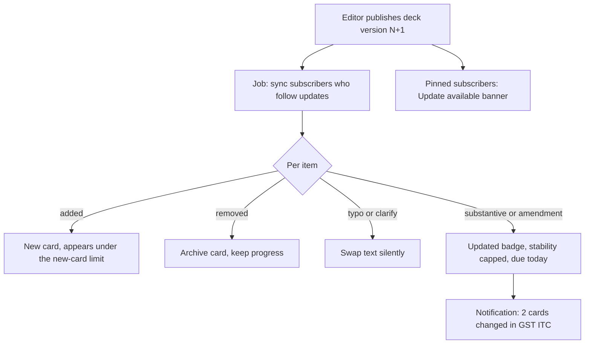
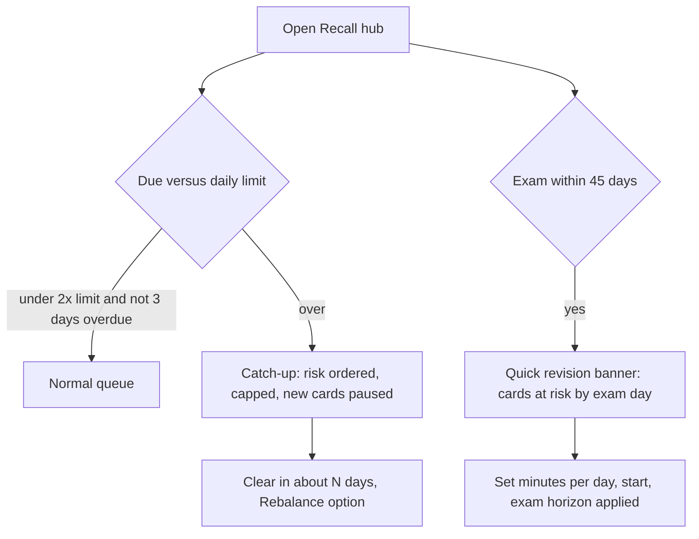

# PRD: F-15 Forgotten Pointers / Recall System

| Field | Value |
| --- | --- |
| Status | Draft (for founder review) |
| Owner | Pawan (founder) |
| Last updated | 2026-10-05 |
| Source | `docs/product/FEATURE_MAP.md` section F-15 (page 6, item 14 "Forgotten pointers / recalling system"), F-13 Today (item 12: "formulas, sections or rules"), F-03 `[ADD]` "highlight to recall pointer", F-02 `[ADD]` "due for revision" |
| Linked ERD | `docs/product/erd/F-15-recall-system.md` |
| Role | The spaced-repetition engine of the product. Owns cards, decks, the scheduler and the append-only review log. F-03 (notes), F-06 (solutions), F-14 (amendments) create or flag cards through the interfaces in section 14; F-13 (Today) pulls tasks from it |
| Modules | API `apps/api/modules/recall`; web `apps/web/src/modules/recall`. No new shared module; it consumes `core.events`, `core.jobs` and `media` from F-06 |
| Feature flags | `recall_system` (cards, review, platform decks), `recall_ai` (AI suggestions), `recall_sharing` (deck links). Server checked, 403 `feature_disabled` (as built for the other flags, see the F-02/F-01 audit) |
| Depends on | F-02 taxonomy and coverage (chapters, topics, exam date, revision signals), F-06 `core` events and jobs, `profiles.role`. Soft: F-03, F-13, F-14, X-01 (all marked `[PROPOSED]` where they do not exist yet) |

---

## 1. Problem and goal

A CA, CS or CMA student does not fail for lack of reading; she fails because on exam day she cannot recall Section 17(5), the formula for EVA, the exact words of AS 2, or the three exceptions to a rule she read in March. Law, tax and standards papers are recall-heavy: hundreds of small facts that must be held for 6 to 12 months. Today she keeps them in a notebook of "important pointers", a WhatsApp group, or an Anki deck she never tuned, and the revision before the exam is a panic read of everything. She cannot say which pointers she keeps forgetting, and nothing tells her what to revise today.

**Goal, in four parts:**

1. **Small cards for everything that must be recalled**: pointers, formulas, sections and provisions, definitions, mnemonics, case laws and cloze (fill the blank), written by the student or provided by the platform as curated, versioned decks ("mandatory pointers" per chapter).
2. **A proven scheduler that decides what to see today**: FSRS (the Free Spaced Repetition Scheduler, version 6) with a default 90% target retention, four buttons (Again, Hard, Good, Easy) showing the next interval, a daily limit with a catch-up mode so a missed week never becomes a wall of cards, and an exam-date-aware **quick revision** mode before the exam.
3. **A forgotten list that works**: the pointers she misses most are ranked and resurfaced in Today (F-13) and on the Recall hub, with a nudge to fix a card that keeps failing.
4. **Cards from where she studies**: one tap from a PDF highlight (F-03), from a solution she just read (F-06), from a chapter (AI-suggested, always reviewed by her), or typed by hand; and a deck can be shared by link, read-only.

Everything she does is stored as an **append-only review log**, so the scheduler can be upgraded and its parameters re-fitted to her later without losing history. The same log works offline and merges without conflicts.

## 2. Users and scenarios

**Aarav, CA Intermediate, 20 minutes on the train.**
He finished "GST: Input Tax Credit" a week ago. On the Recall hub the ring says "34 due, about 7 min". He taps Start; the first card (Section 17(5): blocked credits, list the items) shows in under a second. He thinks, taps Show answer, and sees four buttons with "10 min / 2 d / 5 d / 11 d" under them. He taps Good. In the tunnel the signal drops; the next 20 cards still work and sync at the station without a duplicate. He gets one wrong, taps Again, and it returns 10 minutes later in the same session.

**Neha, CS Executive, back from a 9-day fever.**
She opens the app and sees 212 cards due. Instead of "212" the hub says "Catch-up: 60 today, most important first. You will be clear in about 4 days" and pauses new cards on its own. She does 60. Her streak is not broken by the days she was ill (days are not counted as missed when she resumes through catch-up).

**Rohan, CMA Final, 5 weeks to the exam.**
His exam date is in his enrolment. He taps "Quick revision". The app estimates which of his 640 cards he is likely to have forgotten by exam day, keeps only mandatory and important ones (180), orders them by risk, and shows "180 cards, about 40 min a day for 5 days, every card seen at least once before 3 days to go". On exam week cards that would have come after the exam are pulled in front of it.

**Priya, CA Final, builds her own and shares.**
Reading a solution in the question bank she selects "ratio decidendi: purpose of the transaction" and taps Add to Recall; a card is created with the chapter pre-tagged and a link back to the solution. She groups 40 case-law cards into a deck and sends the link on WhatsApp. Her friend opens the link, sees a preview of five cards, signs in and imports a copy with fresh progress. Priya never sees the friend's reviews.

**Meera, editor.** She curates the "Mandatory pointers: GST ITC" deck: 14 cards marked mandatory, 22 important, 18 bullet. After an amendment she fixes two cards and publishes deck version 4. Subscribers who follow updates get the new cards; the two changed cards come back for a re-check with an "Updated for the May 2027 amendment" note; their progress on the other 52 cards is untouched.

## 3. Success metrics

Starting hypotheses to calibrate after the first 100 active students.

| Metric | Definition | Target | Event(s) |
| --- | --- | --- | --- |
| First-card activation | New students with an enrolment who review at least 5 cards within 24 h of first opening Recall | 45% | `recall_session_completed` (server) |
| Time to first card | Tap on "Start" (taster) to first card visible, p75 | under 1.5 s | `recall_card_viewed` (first=true) |
| Weekly retention habit | Students with 4 or more review days in a week, among students with at least 20 cards | 35% | `recall_session_completed` |
| True retention | Share of reviews of review-state cards rated Hard, Good or Easy, over 30 days | 88 to 92% at desired retention 0.90 (outside the band means mis-set retention or dishonest rating) | server rollup |
| Backlog health | Students with more than 2 days of overdue cards, week over week | falling; under 15% | `recall_catchup_started` |
| Catch-up recovery | Students entering catch-up who are back under 1 day overdue within 7 days | 70% | `recall_catchup_started`, `recall_catchup_cleared` |
| Card creation | Active students with at least 10 own cards | 30% | `recall_card_created` (origin) |
| Selection-to-card | Cards created from a highlight or solution per 100 highlights opened (F-03/F-06 surfaces) | track | `recall_card_created` (origin) |
| Forgotten list use | Students who open a card from the forgotten list and rewrite it or add a mnemonic | 20% of leech notices | `recall_leech_action` |
| Quick revision use | Students with an exam date within 45 days who start Quick revision | 50% | `recall_quick_started` |
| Platform deck adoption | Active students subscribed to at least one platform deck | 60% | `recall_deck_subscribed` |
| AI suggestion acceptance | Suggestions accepted (edited or not) of those shown | 40% (below 20% means the prompt is poor) | `recall_suggestion_decided` |
| Offline integrity | Offline reviews that sync without a manual action | 99.5% | `recall_sync_completed` |
| Review API speed | `POST reviews/` p95 | under 200 ms; queue `GET` p95 under 300 ms | server metrics |

## 4. Scope and key decisions

### 4.1 In scope

**R1: Recall (flag `recall_system`)**

1. Seven card kinds with one shared review engine: pointer, formula, section (provision), definition, mnemonic, case law, cloze.
2. Manual creation and edit, tagging to chapter and topic (F-02), importance (bullet, important, mandatory), bulk actions, duplicate warning.
3. Platform decks (curated, versioned): browse, subscribe with copy-on-subscribe semantics, follow updates.
4. FSRS-6 scheduler as a pure, versioned function in Python and TypeScript with shared golden test vectors; per-student desired retention; append-only review log; undo.
5. Review screen: show answer, four buttons with interval preview, keyboard, swipe, one-handed layout, undo, edit and suspend in place.
6. Daily new-card and review limits, catch-up mode, sibling burying, interleaving, vacation pause.
7. Forgotten list and leech notices; Today provider (`register_task_provider` (F-13 ERD 3.2)).
8. Offline review with a local event queue and conflict-free sync.
9. `create_card_from_selection` service for F-03 and F-06 (the UI buttons ship with those features).
10. Stats: streak, true retention, due forecast, per-chapter recall strength.
11. Export and delete (DPDP); analytics events (section 10).

**R2: Exam-aware, living decks, sharing (flags `recall_system`, `recall_ai`, `recall_sharing`)**

12. Quick revision mode, exam horizon, pacing assistant ("fit new cards to my exam date").
13. Platform deck updates and amendment re-checks (F-14 events `[PROPOSED]`), "Updated" badges.
14. Deck sharing by link (read-only import) with abuse controls.
15. AI-suggested cards from a chapter's source text, with quotas and a review tray.
16. Coverage integration: chapter recall pass counts as a revision (F-02), coverage-based unlocking of new cards.
17. Time tracker auto session for reviews (opt-in, as F-06 does).

**R3: Personalised memory model and reach**

18. Per-student parameter fit (offline optimiser), replay of states, optional pooled fit with consent.
19. Workload preview ("at 15 new cards a day you will do about N reviews"), type-in answers for short facts, fork-and-customise a platform card, public "key pointers" pages per chapter for SEO.

### 4.2 Out of scope (and who owns it)

| Item | Owner or plan |
| --- | --- |
| Pushing reminders, quiet hours, WhatsApp | X-01 Notification System. This feature only emits events and calls `notifications.services.notify` (`[PROPOSED: X-01]`) |
| Games, leaderboards, streak freeze, XP | X-03 Gamification (consumes `recall_session_completed`) |
| The "what to do today" screen itself, snooze, swap | F-13 Today (this feature is a provider) |
| PDF annotation and note editor | F-03. This feature supplies the service its "make a recall card" button calls |
| Question attempts and mistakes | F-06 `practice`. Re-asking wrong questions on a schedule is a question-level concern ("spaced re-ask", F-06 R3); recall cards are *facts*, questions stay in F-06 |
| Amendment extraction and publishing | X-04 and F-14. This feature consumes `[PROPOSED]` events |
| Image occlusion, audio cards, handwriting | Not planned (R3 candidates only after demand) |
| Importing Anki `.apkg` decks | Later; the card kinds are text-first and an importer can register through `register_importer`-style registry |
| Mentor-assigned decks | Mentor mode (later) |

### 4.3 Decision record: scheduler (SM-2 versus FSRS)

| Criterion | SM-2 (SuperMemo 2, 1987 to 1990; Anki legacy) | FSRS-6 (Free Spaced Repetition Scheduler) |
| --- | --- | --- |
| Memory model | One number per card (ease factor, floor 1.3) and the previous interval; fixed rules | Three-component DSR model: **Difficulty** (1 to 10), **Stability** (days for recall probability to fall to 90%) and **Retrievability** (current recall probability), updated by 21 trainable weights |
| Target | No retention target; the interval multiplier implies one unknowingly | You choose **desired retention** (default 0.90); interval is solved from the forgetting curve |
| Overdue cards | Interval grows with the delay, which over-rewards cards that happen to be late | Retrievability falls with delay and the stability gain is bounded by it, so catch-up is handled by the model |
| Failure handling | Ease drops on each lapse ("ease hell") | Post-lapse stability computed from difficulty, previous stability and R; mean-reverting difficulty |
| Personalisation | Hand-tuned constants | Weights re-fittable per student from the review log (optimiser) |
| Evidence | Folk wisdom, widely deployed | Public benchmark on about 727 million reviews from 10,000 Anki users (srs-benchmark): FSRS-6 log loss 0.3460 versus FSRS-4.5 0.3625, FSRS v4 0.3726, a constant-average baseline 0.3945 (without same-day reviews) |
| Cost | About 30 lines | About 120 lines of formulas (section 4.3.1) plus an optimiser (not needed to start) |
| Open source | Public algorithm | MIT licensed reference implementations: py-fsrs 6.3.2 (Python 3.10+), ts-fsrs 5.4.2 (Node 20+), fsrs-rs (Rust, used by Anki) |

**Decision: FSRS-6, our own thin pure implementation, versioned by `scheduler_version = "fsrs-6.0"`.**

1. **Why FSRS and not SM-2.** Exam students review in bursts, miss weeks and have a hard deadline. A model that predicts recall probability lets us do three things SM-2 cannot do honestly: order a backlog by risk (lowest retrievability first), estimate "which cards will I have forgotten by exam day", and re-fit to the student later.
2. **Why not FSRS-7 now.** The benchmark README lists FSRS-7 (34 parameters, fractional intervals) as the newest version and the most accurate, but the maintained libraries we can test against (`py-fsrs` 6.3.2, `ts-fsrs` 5.4.2 stable; the 6.x line of ts-fsrs is still a beta) implement FSRS-6, and FSRS-7 with default parameters (log loss 0.3620) is no better than FSRS-6 with fitted parameters (0.3460). The data model carries `scheduler_version` and `params_id` on every card and the log is facts-only, so moving to FSRS-7 later is a replay job, not a migration of history `[VERIFY the state of FSRS-7 libraries again at R3]`.
3. **Why our own implementation and not the libraries on the hot path.** The server (Django) and the browser (offline review) must produce identical intervals. py-fsrs and ts-fsrs differ in details (fuzz randomness, learning-step options, rounding), and library upgrades would silently change behaviour. We implement the formulas once per language (`recall/domain/fsrs6.py`, `modules/recall/lib/fsrs6.ts`), make fuzz deterministic (hash of card id and rep count), and test both against shared golden vectors (`fsrs6_cases.json`, the pattern coverage already uses for `formula_cases.json`) and, in CI only, against py-fsrs and ts-fsrs as oracles on 10,000 random histories (state equal within 1e-6, intervals equal). The libraries are dev dependencies, not runtime dependencies.
4. **Parameters.** The 21 default weights of FSRS-6 (`w0..w20`: initial stabilities for the four first ratings, initial difficulty and its slope, difficulty change and mean reversion, recall and forget stability terms, hard penalty, easy bonus, same-day terms, and the trainable decay `w20`, default 0.1542). Bounds per weight are validated on load (copied from py-fsrs). Default `desired_retention` 0.90; student range 0.80 to 0.97 (Anki warns that workload "increases very quickly" above 0.90 and can be overwhelming above 0.97).
5. **Per-card memory state** is `difficulty`, `stability`, and the due date; **retrievability is never stored**, it is computed from stability and elapsed time (`R = (1 + factor * t / S) ^ -w20`, `factor = 0.9 ^ (-1 / w20) - 1`).
6. **Optimiser.** Needs enough reviews to fit 21 numbers; Anki's own guidance is to start from defaults and optimise after a few hundred to about a thousand reviews `[VERIFY the exact threshold in the Anki manual for the version we pin]`. We fit in a worker outside Vercel (needs Python with torch, or the Rust binding), only for students with at least 1,000 effective reviews, monthly, accept a candidate only if its held-out log loss beats the current parameters by at least 1%. Until then everyone uses the defaults. At 50 reviews a day a student crosses 1,000 reviews in about three weeks.
7. **The review log is the source of truth.** Facts only (card, rating, time, duration, mode, device); the card row is a cache that can be rebuilt by replaying the log (`recall_replay` command and the late-event path). Details in the ERD.

#### 4.3.1 The scheduler in one page (the contract the pure function implements)

Ratings: 1 Again, 2 Hard, 3 Good, 4 Easy. States: `new`, `learning`, `review`, `relearning`. `t` is whole elapsed days between the previous review and now (as py-fsrs).

```
R(t, S)            = (1 + F * t / S) ^ -w20          F = 0.9 ^ (-1 / w20) - 1
interval(S, r)     = (S / F) * (r ^ (-1 / w20) - 1)  clamp to [1, max_interval_days], round to whole days
S0(G)              = w[G-1]                           first review of a new card
D0(G)              = w4 - e^(w5 * (G - 1)) + 1        clamp 1..10
D'(D, G)           = w7 * D0(4) + (1 - w7) * (D + (10 - D) * (-w6 * (G - 3)) / 9)   clamp 1..10
S_recall(D,S,R,G)  = S * (1 + e^w8 * (11 - D) * S^-w9 * (e^((1 - R) * w10) - 1) * (w15 if G=2) * (w16 if G=4))
S_forget(D,S,R)    = min( w11 * D^-w12 * ((S + 1)^w13 - 1) * e^((1 - R) * w14),  S / e^(w17 * w18) )
S_sameday(S, G)    = S * max(1 if G>=2, e^(w17 * (G - 3 + w18)) * S^-w19)       review less than 1 day after the previous one
learning steps     = 1 min, 10 min (relearning 10 min); Again resets the step, Good advances, last Good or any Easy graduates
fuzz               = intervals of 2.5 days or more get a deterministic +/- (15% of 2.5..7, 10% of 7..20, 5% beyond 20) spread, seeded by hash(card_id, reps)
```

Because this is the same math the open-source libraries implement, a card reviewed offline on a phone and replayed by the server lands on the same state.

### 4.4 Decision record: card model

| Question | Decision |
| --- | --- |
| Content versus progress | **Item** (content, platform or user, versioned) and **card** (one student's scheduled unit of an item). Progress lives on the card keyed by (student, item, ordinal), so a platform content fix never touches progress |
| Kinds | Seven, defined by a registry (`register_card_kind`): each kind is a typed field set plus a pure `render(fields, ordinal)` that yields front and back in Markdown with KaTeX (same rich-content rules as F-06 section 8.2). Adding a kind later is a registry entry, not a schema change |
| Cloze | One item with `{{c1::...}}` markers produces one card per cloze number (ordinal 1..n). Siblings of one item are buried for the day by default |
| Reverse cards | Optional per item for definition and mnemonic (ordinal 100 is the reverse). Off by default |
| Importance | `bullet`, `important`, `mandatory` (the founder's wording). Drives queue order under pressure, quick revision and the Today picks. Platform editors set it; students may star their own |
| Taxonomy | Each item has one primary chapter and optional topic (F-02 foreign keys plus stable `subject_key` and `chapter_key` copies, as F-06), plus `reference_keys` such as `cgst:17(5)` for amendment matching. A card without a chapter is allowed ("Unsorted") |
| Rich content | Markdown subset + KaTeX through the F-06 pipeline. Formulas render with accessible MathML; images are not supported in R1 (text-first keeps cards fast and offline-sized) |

### 4.5 Decision record: platform decks with copy-on-subscribe

A platform deck is edited by editors in versions. When a student subscribes, the system **copies the deck's membership into her own cards** (one `recall_card` row per item at the pinned deck version, state `new`), and keeps a `recall_subscription` row remembering which deck version she is on. After that:

| Event | What happens to her cards |
| --- | --- |
| Editor publishes a new version | Subscribers who **follow updates** (default) are synced by a job: added items become new cards, removed items are archived (progress kept, hidden), text-only fixes (`typo`, `clarify`) swap content silently, **substantive** or **amendment** changes mark the card "Updated, please re-check" and soften its memory (stability capped at 3 days, due today). Subscribers who chose **pin** see "Update available (3 changes)" and apply it when ready |
| She edits a platform card | Not allowed in place. "Edit a copy" (R3) forks it into her own item and moves her progress to the fork |
| She unsubscribes | Cards archived, not deleted; resubscribing restores progress. Cards also in another active subscription or owned by her stay active |
| Platform item is withdrawn or taken down | Card archived with a note "Removed by ArthaCommerce"; review history kept for her stats |
| Amendment flagged by F-14 | Platform item gets a visible "Under review after amendment" ribbon for everyone; her own cards with matching `reference_keys` get a per-card "Check against amendment" chip |

### 4.6 Decision record: limits and the backlog cliff

1. **Daily limits.** New cards per day (default 10, range 0 to 100) and maximum reviews per day (default 100, range 20 to 500). The limit is soft for learning-step cards (never hidden) and hard for the planned queue.
2. **Catch-up mode** engages automatically when due cards exceed 2 times the daily review limit or the oldest due card is more than 3 days overdue with more than one day of work. In catch-up: the queue is ordered by risk (importance weight times 1 minus current retrievability, mandatory first), capped at the daily limit; new cards pause; the hub shows "Today 60 of 212, clear in about 4 days" instead of a red 212; the rest is simply "not today". The student can lift the pause.
3. **Rebalance** (optional, one tap): spreads the lowest-risk overdue cards over the next days by moving due dates later, written as audit rows, never as reviews, so the memory model is not distorted.
4. **Vacation** pauses scheduling until a chosen date; nothing becomes overdue "against" the student and catch-up starts on return.
5. **Day boundary** is 04:00 in the student's time zone by default, because many students revise after midnight and should not see tomorrow's cards at 00:01 (Anki uses the same convention). Configurable 0 to 6.

### 4.7 Decision record: exam-aware quick revision

Given the exam date from the enrolment (`coverage` `exam_date`, else the term start from `syllabus_examterm`; never hard-coded):

1. **Risk at exam day**: `R_exam = R(days from last review to exam date, S)`. Cards with `R_exam` below 0.90 are the ones she is likely to have forgotten.
2. **Quick revision set** = mandatory and important cards in her enrolled chapters (optionally one subject) with `R_exam` below the target, ordered by `importance weight x (1 - R_exam)`, sized to a daily minute budget she sets (default 30 min, using her median seconds per card).
3. **Exam horizon** (applies from 90 days before the exam): any card whose next due date falls after `exam date - 2 days` is moved into the window `[exam - 7 days, exam - 2 days]`, spread by a hash of the card id, so every card is seen at least once in the final week. Mandatory cards get their desired retention raised to at most 0.95 in the last 30 days.
4. **Cram preview** (last 24 hours, no scheduling): a read-through of mandatory cards where taps do not change memory state (`mode = cram`, logged with `counts_for_scheduling = false`, excluded from fitting).

## 5. User flows

### 5.1 First value in 60 seconds (the aha flow)



### 5.2 The review loop



### 5.3 Creating cards (all paths end in the same service)



### 5.4 Platform deck updated



### 5.5 Backlog and quick revision



### 5.6 Edge cases (designed and tested)

| Case | Behaviour |
| --- | --- |
| Rated by mistake | Undo (U or button) for the last 10 reviews of the session within 30 minutes: a compensating `undo` event, the card is replayed to its previous state |
| "Hard" pressed when she actually forgot | First-run tip and a persistent hint under the buttons: "Again = I could not recall it. Hard = I recalled it with effort." FSRS treats Hard as a success; wrong use inflates intervals. Rating distribution is shown in stats with a nudge if Hard exceeds 40% and true retention is below 85% |
| Same card reviewed on phone and laptop offline | Both events are kept; state is rebuilt in time order; she sees "2 reviews of one card on two devices were merged" (information only) |
| Late offline events | Accepted up to 30 days old; older are stored as `late_unapplied` and shown once, not applied |
| Clock skew on the device | Event time is clamped to server receive time when more than 5 minutes in the future; the browser also keeps the server clock offset (as F-01.2) |
| Card edited on two devices | Optimistic `base_rev`; second save gets 409 `edit_conflict` with both versions, she chooses Keep mine, Keep theirs or Keep both (copy) |
| Card deleted on one device, reviewed offline on another | Review accepted into the log (history stays true) and reported "applied to a deleted card" once; no resurrection |
| Content changed substantively after the offline pack was downloaded | Event stored with the old `item_version_id`, `counts_for_scheduling = false`; the card returns for a re-check |
| Review before due (quick revision, early) | Allowed; FSRS handles early reviews (small stability gain at high retrievability). Logged with its mode |
| Cloze with no markers or duplicated numbers | Save blocked with the field highlighted; numbers must be 1..n without gaps, max 20 |
| Very long card | Front and back clamp to 12 lines with Expand; formulas and tables scroll inside their own box; max 4,000 characters per field |
| Student changes desired retention | Applies to future intervals only; no mass reschedule (option "Reschedule now" shows how many cards move first, capped to avoid a wall) |
| Time zone change | Due dates are instants; the day boundary uses the current tz setting; cards due "today" in the old zone stay due within 24 h |
| Account deleted | Cards, logs, subscriptions, shares and AI drafts erased (ERD section 7); shared decks she published stop resolving; imports others made stay (they are copies) |
| Share link for a deck with platform cards | Only her own cards are in the share; the page lists "12 platform cards not included" with a link to subscribe |
| Item source gone (note deleted, question taken down) | Card keeps working; the backlink shows "Source no longer available" |

## 6. Functional requirements

Priority: P0 must ship in its release, P1 should, P2 can follow. Release tags R1, R2, R3 as in section 4.1. `[NOTE]` = founder's words, `[ADD]` = our proposal from the feature map, `[NEW]` = added by this document.

### A. Cards, kinds and content

| ID | Requirement | Priority | Acceptance criteria |
| --- | --- | --- | --- |
| FR-F15-01 | `[NOTE]` A student creates her own cards: pointer, formula, section (provision), definition, mnemonic, case law, cloze | P0 R1 | Given the creator with kind Formula, when she fills name, expression (KaTeX) and variables and saves, then a card exists, renders its expression, and appears in the review queue as new |
| FR-F15-02 | Each kind has typed fields and a pure render to front and back (section: act, reference, gist, exceptions; case law: case name, citation, court, year, held; definition: term, definition, source; mnemonic: mnemonic, expands to; formula: name, expression, variables, when to use; pointer: prompt, answer; cloze: text with markers) | P0 R1 | Given a section card "Section 17(5), CGST", then the front shows the reference and the prompt, the back shows gist and exceptions, and the same fields render identically on web and in the offline pack |
| FR-F15-03 | Cloze: `{{c1::text}}` markers (optional hint `{{c1::text::hint}}`), one card per cloze number | P0 R1 | Given text with c1 and c2, then two cards exist; the c1 card shows `[...]` for c1 and the plain text for c2; saving with a gap (c1, c3) or no marker is blocked with a message |
| FR-F15-04 | Optional reverse card for definition and mnemonic items | P2 R3 | Given "reverse" on, then a second card (ordinal 100) swaps front and back |
| FR-F15-05 | Rich text in Markdown with KaTeX through the F-06 linter and renderer; no raw HTML; formulas expose MathML | P0 R1 | Given a field containing `<script>` or `\href`, then it is stored as text or rejected with the lint message and never executed |
| FR-F15-06 | Limits per field: 4,000 characters; 20 clozes per item; 12 tags; reference keys normalised (`cgst:17(5)`) | P0 R1 | Given a 4,001 character field, then save fails with the field named |
| FR-F15-07 | Importance per item: bullet (default), important, mandatory; students may star their own cards (important) | P0 R1 | Given a mandatory platform card and a bullet card both overdue in catch-up, then the mandatory one is served first |
| FR-F15-08 | Taxonomy: pick subject, chapter, topic from the student's enrolment; "Unsorted" allowed; chapter stored with its stable keys | P0 R1 | Given a card tagged to a chapter and a later scheme switch, then it follows the chapter map (FR-F15-50) or stays in "Needs a new chapter" |
| FR-F15-09 | Duplicate warning on create: exact (normalised text) duplicate among the student's cards, and a platform card with the same reference key ("Add the platform card instead?") | P1 R1 | Given she types the same pointer twice, then the second save asks "You already have this. Open it or save anyway" |
| FR-F15-10 | Edit own card in place with optimistic `base_rev`; edits to a card keep its memory state | P0 R1 | Given an edited typo, then the next interval is unchanged; given two devices editing, then the second gets 409 `edit_conflict` with both versions |
| FR-F15-11 | Delete (soft, 10 s undo), suspend, bury until tomorrow, reset progress ("Forget this card", returns to new) | P0 R1 | Given Delete then Undo within 10 s, then the card returns with its progress |
| FR-F15-12 | Bulk actions on up to 200 cards: move to chapter, set importance, add tag, suspend, delete, add to deck | P1 R1 | Given 150 selected, then one request applies all or none and reports the count |
| FR-F15-13 | `[NEW]` Paste lines or CSV (one pointer per line, or columns `kind,front,back,chapter`) with a row preview | P2 R2 | Given 40 pasted lines, then a preview with errors per row appears and Import creates only valid rows |

### B. Creation paths

| ID | Requirement | Priority | Acceptance criteria |
| --- | --- | --- | --- |
| FR-F15-14 | `[ADD]` `create_card_from_selection` service for F-03 highlights and F-06 solution text (plus `create_card(source=SourceRef)` for F-04, F-05, F-12 and F-14 callers): input is the selected text, a source reference (module, object id, locator) and an optional chapter; output is a card and an undo token | P0 R1 (service), UI with F-03/F-06 | Given a selection of 30 words from a solution of a question mapped to a chapter, then a card is created in under 1 s with that chapter, a backlink to the question, and `shareable = false` |
| FR-F15-15 | Kind suggestion for a selection by pure rules: contains `Section\|Sec.\|Rule\|Article` plus number gives section; contains `=` or LaTeX gives formula; "means", "is defined as" gives definition; `v.` or `vs` with a court name gives case law; selection inside a longer text with the Cloze toggle on wraps the span as cloze; otherwise pointer. She can change the kind before saving | P1 R1 | Given "Section 17(5) blocks ITC on motor vehicles", then kind Section is preselected |
| FR-F15-16 | `[ADD]` One-tap mode: with "Quick add" on, the selection creates a card without a form and shows a toast "Added to Recall: Taxation / GST ITC. Edit, Undo" | P1 R1 | Given Quick add, then no dialog appears; the toast offers Edit and Undo for 10 s |
| FR-F15-17 | From a mistake: `create_card_from_question(user_id, question_id, version_id)` builds a pointer from the question's explanation source and reference labels (F-06 data), never from model memory | P1 R2 | Given a wrong answer on a question citing Section 17(5), then the card front asks for the rule and the back quotes the explanation with its source |
| FR-F15-18 | `[ADD]` AI-suggested cards from a chapter, **only from supplied source text** (her notes and highlights for the chapter from F-03, text she pastes, F-06 explanations of questions she got wrong). Every suggestion carries an `evidence_quote` that must appear verbatim in the source or it is discarded server side | P1 R2 | Given a chapter with 3 highlights, then 3 to 10 suggestions appear in a tray, each with its quote; a suggestion whose quote is not found in the source is never shown |
| FR-F15-19 | AI suggestions are drafts: Accept, Edit then accept, Reject; nothing becomes a card without her action; rejected suggestions are remembered so they are not suggested again | P1 R2 | Given Accept, then a card exists with `origin = ai_suggestion`; given Reject, then the same text is not suggested again for 90 days |
| FR-F15-20 | AI quotas per plan (free: 30 suggestions a day and 3 batches a day; pro: 150 and 15), a per-call cost ledger, and a disclaimer "AI drafts can be wrong. Check against your source" | P1 R2 | Given the 4th batch on free, then 429 `quota_exceeded` with the reset time |
| FR-F15-21 | Cards created from selections of platform or third-party text are private (`shareable = false`) unless she attests "in my own words" (logged) | P1 R2 | Given a selection card, then Share excludes it; after the attestation it is included |
| FR-F15-22 | Backlink: every card created from a source shows "Open source" (note page, solution) and degrades to "Source no longer available" | P1 R1 | Given a deleted note, then the card keeps working and shows the degraded link |

### C. Scheduler and review

| ID | Requirement | Priority | Acceptance criteria |
| --- | --- | --- | --- |
| FR-F15-23 | `[NOTE]` Spaced repetition with FSRS-6 as a pure function `review(state, rating, now, params, cfg)` in Python and TypeScript, versioned (`fsrs-6.0`), with shared golden vectors | P0 R1 | Given the 40 golden cases, then both implementations return the same stability and difficulty within 1e-6 and the same interval; given the oracle test, then 10,000 random histories match py-fsrs |
| FR-F15-24 | `[ADD]` Four ratings (Again, Hard, Good, Easy) with the next interval shown on each button ("10 min", "2 d", "1 mo") | P0 R1 | Given a review-state card, then four previews appear and equal the interval each rating would apply |
| FR-F15-25 | Desired retention per student, default 0.90, presets Light 0.85, Standard 0.90, Strong 0.93, Exam crunch 0.95, free range 0.80 to 0.97 | P0 R1 | Given 0.93, then Good intervals are shorter than at 0.90 for the same card |
| FR-F15-26 | Learning and relearning steps (default 1 min and 10 min; relearning 10 min), maximum interval (default 365 days), deterministic fuzz | P0 R1 | Given Again on a review card, then it returns in 10 minutes in the same session and the lapse counter increments |
| FR-F15-27 | Every rating is an append-only review event with a client-generated id; the card state is a cache rebuilt from the log | P0 R1 | Given a duplicate event id, then nothing changes and the response says `duplicate`; given a late event, then the card is replayed in time order |
| FR-F15-28 | Undo of the last 10 reviews of the session within 30 minutes via a compensating event | P0 R1 | Given Undo, then the previous card and its prior state return; the voided event is excluded from stats and fitting |
| FR-F15-29 | Review order: learning cards due, then reviews by priority (importance weight times 1 minus retrievability), new cards interleaved (about 1 in 4); siblings of one item buried until tomorrow; subjects interleaved | P0 R1 | Given 3 cloze siblings due, then only one is served today (setting `bury_siblings`) |
| FR-F15-30 | Review screen supports keyboard (Space or Enter show answer, 1 to 4 rate, U undo, E edit, S suspend, B bury, ? help), tap, swipe (left Again, right Good) and one-handed bottom controls | P0 R1 | Given a phone at 360 px, then every rating button is at least 44 px tall and reachable in the bottom third; given only a keyboard, then the whole session can be done |
| FR-F15-31 | Edit, suspend, bury and "Open source" from inside the review without leaving the session | P1 R1 | Given Edit during review, then saving returns to the same card without a rating |
| FR-F15-32 | `[NEW]` Leech detection: a card with 8 lapses is flagged "Tricky" and the student is offered Rewrite, Add a mnemonic (mnemonic card linked), Split, or Suspend 7 days | P1 R1 | Given the 8th lapse, then the Tricky chip shows after the rating, never blocking the flow |
| FR-F15-33 | Session summary after the queue: cards, minutes, ratings split, next due ("tomorrow 12, in 3 days 9"), streak, and one suggestion | P0 R1 | Given a finished session, then the summary page has its own URL and is reproducible from the server |
| FR-F15-34 | Server emits `recall_session_completed` on close or auto-close (not the client), so counts are complete even when the app is killed | P0 R1 | Given a session abandoned after 12 reviews, then a cron closes it after 60 idle minutes and the event reports 12 reviews |

### D. Limits, catch-up, quick revision

| ID | Requirement | Priority | Acceptance criteria |
| --- | --- | --- | --- |
| FR-F15-35 | `[NEW]` Daily new-card limit (default 10) and maximum-reviews limit (default 100) | P0 R1 | Given 100 reviews done, then the queue shows "Daily limit reached" with "Do 20 more" |
| FR-F15-36 | `[NEW]` Catch-up mode (auto): when due exceeds 2 times the limit or the oldest due card is more than 3 days overdue, the queue is the top N by risk, new cards pause, and the hub shows today's share and days to clear | P0 R1 | Given 212 due and limit 100, then the queue is 100 cards by risk, new cards are paused, and the hub says "Today 100 of 212" |
| FR-F15-37 | `[NEW]` Rebalance: spread the lowest-risk overdue cards over the next 7 days (due date change only, logged as schedule events) | P1 R1 | Given Rebalance, then no card is moved earlier, none beyond 14 days from now, and no review event is created |
| FR-F15-38 | `[NEW]` Vacation: pause until a date; on return catch-up applies | P1 R1 | Given vacation until 12 Oct, then no cards count as due before 12 Oct and the streak is not broken |
| FR-F15-39 | `[ADD]` Quick revision mode before exams: estimates `R_exam`, selects mandatory and important cards at risk, sized to a daily minute budget | P0 R2 | Given an exam in 30 days and 640 cards, then the plan lists the count, minutes a day and the days until the exam; starting it opens a session with `mode = quick_revision` |
| FR-F15-40 | Exam horizon: within 90 days of the exam, cards due after exam minus 2 days are moved into the final window; mandatory retention up to 0.95 in the last 30 days | P1 R2 | Given a card due 10 days after the exam, then its due date is within the window; given the setting off, then nothing moves |
| FR-F15-41 | Cram preview in the last 24 hours: read-through of mandatory cards without changing memory state | P2 R2 | Given cram mode, then reviews are logged with `counts_for_scheduling = false` and the cards' due dates do not change |
| FR-F15-42 | `[NEW]` Pacing assistant: shows the new-cards-per-day needed to introduce all mandatory and important cards in scope by exam minus 14 days, and warns when infeasible | P1 R2 | Given 600 cards, exam in 60 days and limit 10, then it says "At 10 a day you will introduce 460. Raise to 13 or start with mandatory only" |
| FR-F15-43 | `[NEW]` Unlock by coverage: new platform cards are offered only for chapters she has started (F-02 status beyond not started), or chapters she unlocked, or all when she chooses | P1 R2 | Given a subscription with unlock mode "with coverage" and a chapter at not started, then its cards stay locked with "Unlocks when you start this chapter" |

### E. Platform decks

| ID | Requirement | Priority | Acceptance criteria |
| --- | --- | --- | --- |
| FR-F15-44 | `[NOTE]` Platform decks of bullet, important and mandatory pointers, formulas and sections, per chapter, curated by editors (Django admin first) | P0 R1 | Given an editor adds items and publishes version 1, then subscribers can see it; drafts are invisible |
| FR-F15-45 | Deck versions are immutable snapshots with a change log; only `live` is served; publishing is atomic | P0 R1 | Given a failed publish, then the previous live version is still served |
| FR-F15-46 | Subscribe copies the deck into her cards (new state) in one transaction (up to 500 cards), idempotent per (student, deck) | P0 R1 | Given a double tap on Subscribe, then exactly one subscription and one set of cards exist |
| FR-F15-47 | Follow-updates versus pin; sync job on publish; "Update available" with a diff preview for pinned subscriptions | P1 R2 | Given a version with 3 changes and a pinned student, then she sees the preview and Apply; given follow, then the job applies it within 15 minutes |
| FR-F15-48 | Change kinds on item versions: `typo`, `clarify` (silent), `substantive`, `amendment` (re-check: Updated badge, stability capped at 3 days, due today) | P1 R2 | Given a `substantive` change, then the card shows "Updated" and returns today; given `typo`, then the interval is unchanged |
| FR-F15-49 | `[NEW]` Amendment flags: on F-14 `amendment_published` / `amendment_corrected` / `amendment_retracted` (F-14 ERD 3.4; `provision_keys[]` is a `[PROPOSED EXTENSION to F-14]`), platform items with matching reference keys or chapter get a "Under review after amendment" ribbon; her own cards with matching reference keys get a "Check against amendment" chip she can dismiss ("Still correct") | P1 R2 | Given an amendment for `cgst:17(5)`, then matching cards show the chip and the Today list says "2 cards to re-check" |
| FR-F15-50 | Scheme switch: cards follow the chapter map (`syllabus_chaptermap`); unmappable cards go to "Needs a new chapter" | P1 R2 | Given a split chapter, then the card is offered both targets to choose |
| FR-F15-51 | Unsubscribe archives cards without deleting progress; resubscribe restores it | P1 R1 | Given unsubscribe then subscribe, then her intervals are as before |
| FR-F15-52 | Platform item report ("This pointer is wrong or outdated") reaches editors with the card version | P1 R1 | Given a report, then an editor sees it with the item version and the reporter count |
| FR-F15-53 | Rights: every platform item has `rights_status` and a source label; verbatim institute text needs `licensed`; others are written in our words | P0 R1 | Given an item with status `unknown`, then publish is blocked |

### F. Sharing

| ID | Requirement | Priority | Acceptance criteria |
| --- | --- | --- | --- |
| FR-F15-54 | `[NOTE]` Share a deck by link: read-only snapshot of her own shareable cards; the page previews up to 5 cards; importing creates copies with fresh progress | P1 R2 | Given a link opened by another student, then she sees title, count, chapters and 5 sample cards, and Import creates N new cards in her account |
| FR-F15-55 | Link settings: expiry (never, 7, 30 days), revoke, update snapshot (same link, new snapshot), optional display name of the author (off by default) | P1 R2 | Given Revoke, then the link returns 404 within 60 s and existing imports are unaffected |
| FR-F15-56 | Abuse controls: account at least 24 h old with at least 20 reviews, max 20 active links, max 500 cards per deck, create 10 a day, import 30 a day, anonymous preview rate limited, token 128-bit hashed at rest, content passes the F-06 sanitiser and a link allow-list (no external URLs in cards) | P1 R2 | Given a fresh account, then Share is disabled with the reason; given 3 distinct reports, then the link is disabled pending review |
| FR-F15-57 | Only her own shareable items are shared; platform cards are counted but excluded and linked ("subscribe to the platform deck") | P1 R2 | Given a deck with 12 platform and 40 own cards, then the snapshot has 40 |
| FR-F15-58 | Public page `/recall/shared/$token`: noindex, Open Graph preview for WhatsApp (title, count, chapters), sign in required to import | P1 R2 | Given a WhatsApp preview, then it shows the deck title and "40 cards, Taxation" without any card text |
| FR-F15-59 | Report a shared deck; editors can take it down; the author is told | P1 R2 | Given a takedown, then the link shows "This deck was removed" and imports remain |

### G. Forgotten list, Today, coverage

| ID | Requirement | Priority | Acceptance criteria |
| --- | --- | --- | --- |
| FR-F15-60 | `[ADD]` Forgotten list: cards ranked by a forgetting score = (lapses in the last 30 days times 2 + Again ratings in the last 14 days) times importance weight, shown with the chapter, last result and a "Review these now" action | P0 R1 | Given a card with 3 lapses in 30 days, then it ranks above a card with 1; the list opens at `/app/recall/forgotten` |
| FR-F15-61 | `[ADD]` Resurfaced in Today (F-13) through `register_task_provider`: tasks "Recall: N cards due", "Forgotten: top 5", "Re-check after amendment", "Quick revision" and per-paper tiles ("3 formulas, 1 section to recall") with estimated minutes | P0 R1 (provider), R2 for the last two tasks | Given 34 due and 5 forgotten, then Today lists two tasks with minutes from her median seconds per card |
| FR-F15-62 | Per-paper tiles: counts of due cards by subject and kind so Today can say "Taxation: 3 formulas, 1 section" | P1 R1 | Given due cards in two subjects, then the provider returns one tile per subject with kind counts |
| FR-F15-63 | `[ADD]` Coverage "due for revision" (F-02) boosts the chapter's cards in Today and quick revision; Recall deep-links from `/app/revision` rows | P1 R2 | Given a chapter due for revision, then its mandatory cards are offered first and the row links to `/app/recall/review?chapter=` |
| FR-F15-64 | A chapter recall pass (at least 80% of the chapter's mandatory and important cards, minimum 5, reviewed Hard or better within 7 days) emits `recall_chapter_pass_completed`; coverage may record `revision_done` when `recall_counts_as_revision` is on (default on) | P1 R2 | Given the pass, then coverage's revision count increases once per chapter per 7 days |
| FR-F15-65 | Chapter pages show "Recall strength" = mean predicted retrievability of the chapter's active cards, with the count of cards due | P1 R2 | Given 40 cards, then the strength is the mean of `R(now)` and updates after a review |

### H. Offline and sync

| ID | Requirement | Priority | Acceptance criteria |
| --- | --- | --- | --- |
| FR-F15-66 | `[NEW]` Offline pack: up to 300 cards (due, next-day learning, the new-card allowance) with rendered content, memory state, parameters and settings, refreshed on open and every 6 hours | P0 R1 | Given airplane mode after opening, then a session of 100 cards works and intervals match what the server would compute |
| FR-F15-67 | Reviews compute locally with the TypeScript scheduler and are stored as events in IndexedDB (up to 5,000), flushed in batches of 100 in time order | P0 R1 | Given 250 offline events, then three batch calls apply all, a retry after a dropped response creates no duplicate |
| FR-F15-68 | Conflict-free merge: the server unions event sets and rebuilds a card from its log in time order; the web shows a quiet summary of merges, deleted-card drops and stale-content drops | P0 R1 | Given the same card rated on two devices, then both are kept and the final state equals the replay of both in time order |
| FR-F15-69 | Edit conflicts use `base_rev` and the 3-way choice (FR-F15-10); deletions win over offline edits with a notice | P1 R1 | Given an edit of a deleted card, then 410 `card_deleted` and the draft is kept as a new card on request |
| FR-F15-70 | Offline banner, queued count and "Sync now"; a failed sync keeps the queue and shows the reason | P0 R1 | Given 12 queued events and no network, then the banner says "12 reviews will sync" |

### I. Analytics and platform

| ID | Requirement | Priority | Acceptance criteria |
| --- | --- | --- | --- |
| FR-F15-71 | Stats screen: streak (day with at least 5 reviews or the queue cleared), reviews per day, true retention, rating split, due forecast for 30 days, per-chapter recall strength, forgotten ranking | P1 R1 | Given a week of reviews, then each chart has a data table alternative and totals equal the log |
| FR-F15-72 | Streak and daily activity use the 04:00 study day and survive vacation | P1 R1 | Given a review at 00:30 IST, then it counts to the previous study day |
| FR-F15-73 | `[NEW]` Opt-in time tracking: a finished session forwards one auto study session (activity revision) to the tracker under the same rules F-06 uses | P2 R2 | Given auto capture on and no live timer, then one `source = auto` session exists |
| FR-F15-74 | Feature flags, throttles and quotas enforced server side; every endpoint answers 403 `feature_disabled` when its flag is off | P0 R1 | Given the flag off, then a parametrised test over all endpoints returns 403 |
| FR-F15-75 | Export (JSON for cards, decks, settings, reviews; CSV for cards and reviews, streamed without a silent cap) and delete-all | P0 R1 | Given 20,000 reviews, then the CSV contains all rows or the response explicitly pages with a cursor |
| FR-F15-76 | `[NEW]` Per-student parameter fit (worker), candidate only if held-out log loss improves at least 1%; replay of her cards; parameters visible in settings with "Reset to defaults" | P1 R3 | Given 1,200 effective reviews, then a candidate set is stored with its metrics and applied only when it beats the current |
| FR-F15-77 | `[NEW]` Workload preview in settings: simulated reviews per day for the next 60 days at the chosen new-card limit and retention | P2 R3 | Given 15 new cards a day at 0.90, then a chart and a text range ("about 90 to 120 reviews a day by week 6") show |
| FR-F15-78 | `[NEW]` Type-in answer for short exact facts (numbers, section numbers) with a compare step; always followed by an honest self-rating | P2 R3 | Given a card marked type-in, then the typed answer is shown beside the correct one and the student rates |

### J. Traceability to the feature map

| Feature map item | Where it lands |
| --- | --- |
| `[NOTE]` User can build on their own | FR-F15-01 to 13 |
| `[NOTE]` Platform can provide bullet, important, mandatory pointers, formulas, sections | FR-F15-07, 44 to 53 (importance tiers, kinds, curated versioned decks) |
| `[ADD]` Card types pointer, formula, section, definition, mnemonic, case law | Kept, plus cloze (FR-F15-01 to 04) |
| `[ADD]` Created from anywhere: highlight, select in a solution, manual, AI-suggested | FR-F15-14 to 22 |
| `[ADD]` Spaced repetition, due-today queue, forgot / hard / good / easy | Kept and strengthened: FSRS-6, FR-F15-23 to 34 |
| `[ADD]` Platform decks per chapter, curated and versioned | FR-F15-44 to 53 with copy-on-subscribe |
| `[ADD]` Forgotten list resurfaced in Today | FR-F15-60 to 62 |
| `[ADD]` Quick revision mode before exams | Kept, made exam-date aware: FR-F15-39 to 43 |
| `[ADD]` Share a deck by link | Kept with read-only import and abuse controls: FR-F15-54 to 59. Deferred to R2 because abuse handling must exist first |
| F-02 `[ADD]` revision counter feeds F-15 and F-13 | FR-F15-63 to 65 |
| F-03 `[ADD]` highlight to recall pointer | FR-F15-14 |

## 7. Screens, URLs and design-system needs

All filters, tabs, the selected card and the review source live in the URL (zod-validated search params). `/app/...` is private and `noindex`; public pages use `buildHead()`. The review player is full screen on phones.

### 7.1 Screens and URLs

| Screen | URL | Notes |
| --- | --- | --- |
| Recall hub | `/app/recall` | Today ring, Start, catch-up or all-caught-up state, forgotten strip, quick revision banner, my decks, streak |
| Review player | `/app/recall/review` | `?source=today\|chapter\|deck\|forgotten\|quick\|catchup\|cram&chapter=&deck=&kind=&tier=&n=` ; current card is local state, session id in `?s=` so a refresh resumes |
| Session summary | `/app/recall/review/summary/$sessionId` | Counts, ratings, next due, streak, one suggestion |
| Cards browser | `/app/recall/cards` | `?subject=&chapter=&kind=&tier=&state=new\|learning\|review\|suspended\|tricky\|recheck&deck=&q=&sort=&cursor=`; bulk select |
| Create card | `/app/recall/cards/new` | `?kind=&chapter=&topic=&deck=&from=selection&draft=` prefill; used by F-03 and F-06 deep links |
| Card detail and edit | `/app/recall/cards/$cardId` | Content, source backlink, memory stats (stability in days, difficulty, current recall %), review history, Reset, Suspend |
| Decks | `/app/recall/decks` | `?tab=mine\|library&course=&level=&subject=` |
| Deck detail | `/app/recall/decks/$deckId` | Cards, versions (platform), subscribe, follow or pin, share (mine) |
| Deck update review | `/app/recall/decks/$deckId/updates` | Diff of the pending version: added, changed (with kind), removed |
| Forgotten | `/app/recall/forgotten` | Ranked list, `?subject=&range=30d` |
| Quick revision | `/app/recall/quick` | Exam date, minutes a day, preview of the set, Start |
| AI suggestions | `/app/recall/suggestions`, `/app/recall/suggestions/$batchId` | Source picker, tray with accept, edit, reject |
| Stats | `/app/recall/stats` | `?range=30d\|90d\|all` |
| Settings | `/app/settings/recall` | Retention presets, limits, steps, day start, gestures, vacation, exam horizon, consent for pooled fitting, parameters (R3) |
| Public: shared deck | `/recall/shared/$token` | `noindex`, preview of 5 cards, OG card, sign in to import |
| Public: feature page | `/features/recall` | Catalog entry, status `soon` until the flag is fully on (as built for the tracker) |
| Public (R3): key pointers | `/courses/$course/$level/$subject/$chapter/pointers` | SSR, indexable, first 5 platform cards with `rights_status` original or licensed, Breadcrumb and Article JSON-LD, link to sign in |
| Staff: deck editor | Django admin `recall` section (R1), `/app/admin/recall/decks` (R2) | Items, versions, change kinds, publish, reports |

### 7.2 Wireframes (mobile first, 360 px; desktop widens the cards and shows the stats side column)

**Recall hub `/app/recall`**

```
┌────────────────────────────────────┐
│ Recall                    🔥 12     │
│ ┌────────────────────────────────┐ │
│ │      ◔ 34 due · about 7 min     │ │   ring = done today / planned today
│ │   [        Start review       ] │ │   one primary action
│ │  New 10 · Learning 3 · Due 21   │ │
│ └────────────────────────────────┘ │
│ Catch-up: today 60 of 212 · clear in ~4 days  [Rebalance] │   only when engaged
│ ── Forgotten this month ───────────  │
│  Sec 17(5) blocked credits     ×4   │
│  EVA formula                   ×3   │  [Review these 5]
│ ── Exam in 31 days ────────────────  │
│  Quick revision: 180 cards at risk  │  [Plan it]
│ ── Chapters ───────────────────────  │
│  GST: ITC          72%  9 due   ›   │   recall strength
│  Company law: AGM  58%  4 due   ›   │
│ [ + New card ]   [ Browse decks ]   │
└────────────────────────────────────┘
```

**Review player `/app/recall/review` (front, then back)**

```
┌────────────────────────────────────┐
│ ✕   12 / 40        Taxation · GST ITC   ⋯ │  top bar: progress, close, menu (undo, edit, suspend, bury)
│                                    │
│   SECTION                          │  kind chip (icon plus text)
│   Section 17(5) CGST               │
│   Which supplies are blocked?      │  front
│                                    │
│                                    │
│ ┌────────────────────────────────┐ │
│ │        Show answer  (Space)     │ │  full width, bottom thumb zone, 56 px
│ └────────────────────────────────┘ │
└────────────────────────────────────┘
        after Show answer
│   Motor vehicles (with exceptions), │
│   food and beverages, club fees ... │  back
│   Updated for May 2027 amendment ⓘ  │  badge when needs_recheck
│ ┌───────┬───────┬───────┬───────┐  │
│ │ Again │ Hard  │ Good  │ Easy  │  │  4 equal buttons, 56 px
│ │ 10 min│  2 d  │  5 d  │ 11 d  │  │  interval preview under each label
│ │  (1)  │  (2)  │  (3)  │  (4)  │  │  key hints on desktop only
│ └───────┴───────┴───────┴───────┘  │
│ Again = could not recall. Hard = recalled with effort.   │  hint, first sessions
```

**Create card `/app/recall/cards/new` (formula)**

```
┌────────────────────────────────────┐
│ New card              [Cancel] [Save]│
│ Kind  ( Pointer | Formula | Section | Definition | Mnemonic | Case law | Cloze ) │ segmented, scrolls
│ Name        [ Economic Value Added ]  │
│ Expression  [ EVA = NOPAT − (WACC × Capital) ]   live preview below rendered KaTeX │
│ Variables   [ NOPAT: net operating profit after tax ... ]                          │
│ Chapter     [ Cost accounting · Value analysis ▾ ]   Importance ( bullet | important | mandatory ) │
│ Source      Open in notes ↗ (when created from a highlight)                          │
│ ▸ More: topic, tags, reference keys, deck                                            │
│ [Save and add another]                                                               │
└────────────────────────────────────┘
```

Aha moments to instrument: first card created, first session of 5 cards (`first = true`), first Tricky card rewritten, first catch-up cleared, first quick revision completed.

### 7.3 UI states per screen

States named in the brief are mandatory: **zero cards**, **all caught up**, **huge backlog**, **offline**, **sync conflict**. "Skeleton" means layout-stable placeholders (no spinner-only screens).

**Recall hub**

| State | Behaviour |
| --- | --- |
| Zero cards, first time | Hero "Remember what the exam will ask. Start with the mandatory pointers of {first chapter in your plan}" with Start (taster) and secondary "Create my first card". No empty charts, no zero rings. If no enrolment: "Pick your course first" linking to onboarding |
| Zero cards, returning (all deleted or unsubscribed) | "No active cards. Browse decks or add one" with the last deck she used |
| Loading | Ring and three count placeholders, two list skeletons; the Start button is disabled with "Loading your queue" (no layout shift) |
| Partial | Counts and Start appear first from the cached plan; the forgotten strip, chapters and quick banner fade in; a failed strip shows "Could not load. Retry" in place |
| Success (normal) | Ring with due and minutes; New, Learning, Due counts as text plus numbers; streak |
| All caught up | "All caught up for today" with the next due time ("Next: 7 cards tomorrow") and two optional actions: "Review ahead 10 cards" (early reviews, flagged) and "Add a card". Celebration is one short motion, off under reduced motion |
| Huge backlog (catch-up) | Never a red giant number. Shows "Today 60 of 212", the days to clear, "Most important first", the new-cards-paused note with a switch to lift it, and Rebalance. If the oldest card is over 30 days overdue, a gentle line offers "Start fresh on the old ones" which suspends cards untouched for 30 days or more into a "Parked" list she can restore |
| Vacation | "Paused until 12 Oct" with Resume now |
| Error | Alert with Retry and request id; the last good plan stays visible dimmed |
| Offline | Banner "Offline: using the pack from 3 min ago. 12 reviews will sync." Start works if a pack exists; else "Open once online to download today's cards" |
| Sync conflict | A dismissible card "We merged 2 reviews made on two devices" with Details (list of cards and the resulting next due). A blocking dialog only for edit conflicts (3 choices) |
| Flag off | "Recall is not available yet" page; the Today provider returns nothing |
| Quota exceeded | Card limit: banner "You have 1,500 cards, the limit on your plan" with Manage and Upgrade; reviews are never blocked |
| Long content | Chapter names wrap to 2 lines; deck titles truncate with a title tooltip and full name in the detail page |

**Review player**

| State | Behaviour |
| --- | --- |
| First time | Intro sheet: how the buttons work, honest rating tip (Again versus Hard), keyboard keys on desktop, swipe on touch. Dismissed once, reopenable from `?` |
| Loading | First card is already in the queue response; next 5 prefetched; skeleton only on a cold session start |
| Front | Content, kind chip, chapter crumb, a tricky or updated badge when applicable; no timer pressure (time per card is recorded silently) |
| Back | Answer plus the four buttons with interval previews; Edit and Open source in the menu |
| Learning step due | Card returns after its step when the queue is otherwise empty it is waited for with "Next card in 8 min" and a Done option |
| Session complete | Summary page; if limit reached "Daily limit reached" with Do more |
| Empty queue (all caught up) | Redirects to the hub with the caught-up state |
| Huge backlog | Header shows "Catch-up: 40 of 212 today" so the student knows the queue is bounded |
| Offline | Full function from the pack; header shows a small offline dot with text "Offline"; Edit works (queued); Create queues; Share and AI are disabled with the reason |
| Sync pending or failed | Queue chip "12 to sync"; on failure "Could not sync. Will retry" with Retry; reviewing continues |
| Sync conflict | After sync, a toast "Merged with your other device" and Undo is disabled for events older than the sync |
| Error on rating | The rating is kept locally (it never blocks); a quiet "Saved on this device" chip |
| Card deleted elsewhere | Card removed from the queue with a toast "This card was deleted on another device" |
| Quota | Not applicable to reviewing |
| Long content | Front and back clamp at 12 lines with Expand; tables and KaTeX scroll within their box; buttons stay pinned |
| Reduced motion, themes | No flip animation (crossfade 0 ms); readable in Reading, Light, Dark, System; rating buttons are distinguished by text and position, not colour alone |
| Screen reader | Card announced as "Card 12 of 40, Section. Front: ..."; after Show answer focus moves to the answer, then to the first rating button; ratings announce the interval |

**Other screens**

| Screen | Empty or first time | Loading | Error, offline | Permission, quota | Long content and others |
| --- | --- | --- | --- | --- | --- |
| Cards browser | "No cards yet" with Create, Browse decks and Paste lines; filtered empty suggests removing the strongest filter | 8 row skeletons, filters usable | Retry alert; offline lists cards in the pack (read, edit queued) | Flag off page; at card limit the Create button shows the limit | Rows clamp 2 lines; bulk bar sticks above the nav; selection by checkbox and Shift-click |
| Card creator | Kind chips with one example per kind; prefilled chapter from the URL | Taxonomy pickers skeleton | Save offline queues with "Will save when online"; 409 duplicate and `edit_conflict` dialogs | Card limit reached blocks Save with reason | Field counters near 4,000; live preview scrolls |
| Decks (mine and library) | Library tab first for new students, grouped by the student's subjects; "You have no decks of your own" | Card grid skeleton | Retry; offline shows subscribed decks | Share and AI entries hidden when their flags are off | Deck names truncate; badges (mandatory count, updated) wrap |
| Deck detail | Empty deck: "Add cards from the browser" | Header and list skeleton | Retry | Subscribe disabled while `recall_system` off; share disabled with reason (account age, activity, link cap) | Version history collapsed; long change logs expand |
| Deck update review | "You are on the latest version" | Skeleton diff | Retry | Pinned versus follow switch | Diffs show before and after with kind badges |
| Forgotten | "Nothing forgotten yet. Cards you miss will appear here" | Skeleton rows | Retry | None | Rows show last 5 results as text and icons, not colour only |
| Quick revision | No exam date: "Add your exam date" with the enrolment form inline; fewer than 20 cards: "You need at least 20 cards for a plan" with a link to decks | Plan skeleton | Retry; offline can start with the pack | Flag off hides the entry | Plan text shows counts and minutes as text; exam passed: "Your exam date has passed. Update it" |
| AI suggestions | Source picker: "Pick a chapter with notes or paste text"; no sources: explains why | "Drafting... this takes about 20 seconds" with progress and a Cancel; async job | Failed job: reason and Retry; offline: disabled | Quota exceeded: reset time and Upgrade; flag off hidden | Tray paginates 10; each draft shows the evidence quote |
| Stats | Needs 3 review days: shows what will appear and a sample-free empty state | Chart skeletons | Retry | None | Every chart has a data table and a text summary |
| Shared deck (public) | Revoked or unknown token: neutral "This link is not available" (no distinction, to avoid probing) | Skeleton | Retry | Not signed in: preview plus Sign in to import; import cap reached: reason | Card previews clamp at 5 lines |
| Settings | Defaults shown with "Reset to defaults" | Skeleton form | Retry | Pooled-fit consent needs an explicit toggle | Warns when retention above 0.95 ("more reviews each day") |

### 7.4 Design-system components

Existing after F-01 and F-06: Button, Card, Badge, Dialog, Sheet, Toast with Undo, Tabs, SegmentedControl, Select, Combobox, TagInput, Checkbox, Switch, Slider, Progress (ring and bar), StatTile, EmptyState, Skeleton, Alert, Kbd, FilterChip, RichText (KaTeX), RichTextEditor, DataTable, BarChart and Heatmap (F-01.2), Pagination.

New in `packages/design-system` (showcase entries, all four themes, contrast checked, 44 px targets; these also fix the touch-target finding AUD-010 for the controls we use):

| Component | Used for |
| --- | --- |
| `RatingButtons` | Four equal-width buttons with label, interval preview and key hint; roving focus, `aria-keyshortcuts` |
| `FlipCard` | Front and back with reduced-motion fallback; swipe handlers with a button alternative; announces the change to screen readers |
| `ProgressCounter` | "12 / 40" with `aria-live="polite"`, used in the review top bar |
| `DatePicker` | Exam date and vacation end (with F-01.2's native-input approach as the base) |

App-specific (stay in `apps/web/src/modules/recall`): `CardFace`, `ClozeText`, `KindChip`, `ImportanceBadge`, `QueueSummary`, `CatchUpNotice`, `ForgottenRow`, `DeckCard`, `DeckDiff`, `SuggestionTray`, `ShareDialog`, `SyncStatus`, `ConflictDialog`.

## 8. Data and permissions

Entities, columns and indexes are in the ERD. Everything is reached only through the Django API; the Supabase Data API stays closed and RLS is deny-by-default on every table.

### 8.1 Entities at a glance

| Group | Tables (ERD section 2) |
| --- | --- |
| Content | `recall_item`, `recall_itemversion`, `recall_deck`, `recall_deckversion`, `recall_deckversionitem`, `recall_deckitem` |
| Student state | `recall_card`, `recall_subscription`, `recall_session`, `recall_settings`, `recall_scheduleevent` |
| Review facts (append-only, hash-partitioned) | `recall_reviewlog` |
| Model | `recall_params` |
| Derived | `recall_dailyrollup`, `recall_chapterrollup` |
| Sharing and quality | `recall_sharelink`, `recall_shareimport`, `recall_report` |
| AI | `recall_suggestionbatch`, `recall_suggestion`, `recall_aicall` |
| Plans and audit | `recall_quotaplan`, `recall_auditlog` |

### 8.2 Permission matrix

| Action | Anonymous | Student | Editor | Admin |
| --- | --- | --- | --- | --- |
| See a shared deck preview (token) | yes (rate limited) | yes | yes | yes |
| Create, edit, review own cards; subscribe; settings | no | yes | yes | yes |
| Create share links, import a shared deck | no | yes (activity rules) | yes | yes |
| Request AI suggestions | no | yes (quota) | yes | yes |
| Report a platform item or a shared deck | no | yes | yes | yes |
| Create and edit platform items and drafts, publish deck versions | no | no | yes | yes |
| Decide reports, take down shared decks | no | no | yes | yes |
| Quota plans, parameter sets, force replay, delete platform decks | no | no | no | yes |
| Read another student's cards or reviews | no | no | no | no (audited support access is out of scope) |

Scopes in code: `recall.use`, `recall.deck.author`, `recall.deck.publish`, `recall.moderate`, `recall.admin`. Roles come from `profiles.role`.

### 8.3 Quotas (defaults for plan `free`, editable in `recall_quotaplan`)

| Limit | Free | Pro |
| --- | --- | --- |
| Own cards (not counting platform subscriptions) | 1,500 | 20,000 |
| Cards per deck / decks | 500 / 100 | 2,000 / 500 |
| Active share links | 20 | 100 |
| AI suggestions per day / batches per day | 30 / 3 | 150 / 15 |
| Imports of shared decks per day | 30 | 100 |
| Offline pack size | 300 cards | 500 cards |

Reviewing is never limited. Plans and prices belong to the payments pointer; this table only needs `plan_code`.

### 8.4 Privacy, retention and DPDP Act 2023

- Personal data: card text (can contain personal notes), review times (study habits), device ids. Treated like F-01 tracking data: private, exported and deleted on request. Card text and notes are never sent to PostHog or Sentry; the `before_send` scrubbing promised in the F-01.2 ERD is built here for the `recall` endpoints (the audit found it missing elsewhere).
- Retention: review log and cards are kept until the student deletes them (they are her memory model). Rollups are rebuildable. Event deliveries 30 days. AI drafts not accepted 30 days. Share links and snapshots until revoked or expired plus 30 days.
- Account deletion: `recall.services.delete_all_for_user` is registered with the central erasure hook `[PROPOSED: profiles]` (the audit found no central hook, AUD-004). It deletes cards, user items, logs (partition-pruned by `user_id`), subscriptions, shares (links stop resolving), AI drafts; platform content is untouched; copies others imported stay with them.
- Export: JSON with cards, own items, decks, settings, reviews and parameters, plus streamed CSV of cards and reviews with a cursor and no silent truncation.
- Pooled fitting (R3) uses only students who opted in; logs are pseudonymised with a rotating salt and contain no card text.
- Children: students may be under 18; the age gate and consent live in the auth module (as stated in F-06 section 8.6).

### 8.5 Rights and content rules

- Platform items carry `source_kind`, `source_ref`, `rights_status` (`original`, `licensed`, `institute_material`, `third_party_claimed`, `unknown`) as in F-06. Facts, section numbers, formulas and short definitions are our own wording; verbatim institute text needs `licensed`. `unknown` blocks publishing.
- Selection-created cards are private to the student. Sharing carries only attested own-wording cards (FR-F15-21).
- Takedown: editors can withdraw an item or deck version; subscribers see "Removed by ArthaCommerce" and keep their history. Notices follow the F-06 copyright process (`/legal/copyright`).

## 9. API surface

All paths are under `/api/v1/recall/`, require a Supabase bearer token (except the public shared-deck reads), and return the standard error shape `{"error": {code, message, details}}` from `core/errors`. Lists use cursor pagination (`core.pagination`). Every endpoint checks the flag server side (403 `feature_disabled`). GET endpoints never write (the audit found GETs that settle state; the queue, pack and today endpoints are pure reads). Mutations take a client-generated `client_id` or event `id` (UUID v7) and are idempotent. Time-bearing responses include `server_time`.

### 9.1 Plan, queue and review

| Method and path | Purpose | Request (key fields) | Response / errors |
| --- | --- | --- | --- |
| GET `today/` | Plan for the study day: counts (new, learning, due), limits, `mode` (`normal`, `catchup`, `vacation`), `queue_size`, `deferred`, `days_to_clear`, `est_minutes`, next due time, per-subject kind tiles, forgotten top 5, exam context | `tz?` | plan + `server_time` |
| GET `queue/` | Next cards with rendered content and interval previews | `source` (`today`, `chapter`, `deck`, `forgotten`, `quick`, `catchup`, `cram`), `chapter_id`, `deck_id`, `kind`, `tier`, `limit` (max 50), `exclude` (ids already served) | cards[`id`, `rev`, `item_version_id`, `kind`, `front_md`, `back_md`, `badges`, `previews{again,hard,good,easy}`, `state`] |
| GET `pack/` | Offline pack: up to 300 cards with content, memory state, params, settings, `server_time` | `limit` | pack with `pack_id`, `expires_at` |
| POST `sessions/` | Start a session | `client_id`, `source`, `spec`, `tz` | 201 session (idempotent on `client_id`) |
| POST `sessions/{id}/close/` | End (also auto-closed after 60 idle minutes) | none | summary; emits `recall_session_completed` |
| POST `reviews/` | One review | `id` (event id), `card_id`, `rating` (1 to 4), `reviewed_at`, `duration_ms`, `session_id`, `mode`, `item_version_id`, `device_id`, `tz_offset_min` | `applied` or `duplicate`, new card state, `next_due_at`, `merged` flag; 404 for another student's card; 409 never (late events are replayed) |
| POST `reviews/batch/` | Up to 100 events in time order | `events[]` | per-event result (`applied`, `duplicate`, `applied_to_deleted`, `stale_content`, `late_unapplied`, `invalid`) and updated cards |
| POST `reviews/undo/` | Void one of the last 10 events of the session within 30 minutes | `id` (new undo event id), `voids` | restored card state; 409 `not_undoable` |
| POST `catchup/rebalance/` | Spread low-risk overdue cards | `days` (default 7) | count moved, new due range; writes schedule events |
| PUT `vacation/` | Pause until a date | `until` or null | settings |

### 9.2 Cards

| Method and path | Purpose | Request | Response / errors |
| --- | --- | --- | --- |
| GET `cards/` | Browse | `subject_key`, `chapter_id`, `kind`, `tier`, `state`, `deck_id`, `q`, `status`, `sort`, `cursor` | page of cards |
| POST `cards/` | Create | `client_id`, `kind`, `fields`, `chapter_id?`, `topic_id?`, `importance`, `tags`, `reference_keys`, `deck_ids` | 201 card(s) (cloze gives several). 409 `duplicate_card` (existing id, `force=true` to override). 403/429 `card_limit_reached` |
| POST `cards/from-selection/` | One-tap from a highlight or solution | `client_id`, `origin`, `selection_text`, `source{module,object_id,locator}`, `chapter_id?`, `kind?`, `quick` | 201 card + `undo_token` (10 s) |
| GET, PATCH, DELETE `cards/{id}/` | Read, edit, soft delete | PATCH needs `base_rev` | 409 `edit_conflict` with the server fields; 410 `card_deleted` |
| POST `cards/{id}/suspend/`, `unsuspend/`, `bury/`, `reset/`, `recheck-ok/` | State actions | optional `until` | card |
| POST `cards/undo-delete/` | Undo within 10 s | `undo_token` | card; 410 after expiry |
| POST `cards/bulk/` | Up to 200 cards | `ids`, `action`, args | all or none; count |
| POST `cards/import/` | Paste or CSV (R2) | `rows[]` or file id, `dry_run` | per-row result |
| GET `cards/export.csv`, GET `export/` | Streamed CSV (cards, reviews) and JSON export | `kind`, `cursor` | streamed with a cursor footer; never silently truncated |
| GET `forgotten/` | Ranked forgotten cards | `subject_key`, `range` (14d, 30d, 90d), `limit` | cards with `lapses_30d`, `again_14d`, score |

### 9.3 Decks, subscriptions, sharing

| Method and path | Purpose | Request | Response / errors |
| --- | --- | --- | --- |
| GET `decks/` | Mine plus subscribed | `kind` (`mine`, `platform`) | list |
| GET `decks/library/` | Browse platform decks | `course`, `level`, `subject_key`, `chapter_id`, `tier`, `cursor` | page with live version, counts per tier |
| POST, PATCH, DELETE `decks/` and `decks/{id}/` | Own deck CRUD | `title`, `chapter_id?` | deck |
| PUT `decks/{id}/cards/` | Set membership of own deck | `card_ids` or `item_ids` | deck |
| POST `decks/{id}/subscribe/` | Copy-on-subscribe | `follow_updates`, `unlock_mode`, `min_importance` | 201 subscription, cards created; idempotent |
| POST `subscriptions/{id}/unsubscribe/`, PATCH `subscriptions/{id}/` | Archive cards, change follow, unlock | | subscription |
| GET `subscriptions/{id}/updates/` | Diff to the live version | | added, changed (with kind), removed |
| POST `subscriptions/{id}/sync/` | Apply the live version now | | counts; idempotent per target version |
| POST `decks/{id}/share/` | Create or update a share link | `expires_at?`, `show_author` | 201 link (token returned once); 403 `share_not_allowed` with the reason; 429 limits |
| GET `shares/`, DELETE `shares/{id}/` | My links, revoke | | |
| GET `shared/{token}/` | Public preview (5 cards, counts, chapters) | | 404 for unknown, revoked, expired alike; rate limited per IP |
| POST `shared/{token}/import/` | Import a copy | `client_id` | cards created; 429 `import_cap` |
| POST `shared/{token}/report/` | Report | `reason`, `note` | 202 |

### 9.4 AI suggestions, stats, settings, staff

| Method and path | Purpose | Request | Response / errors |
| --- | --- | --- | --- |
| POST `suggestions/batches/` | Request drafts (async job) | `chapter_id`, `sources[]` (`notes`, `wrong_answers`, `pasted`), `pasted_text?`, `count`, `kinds[]` | 202 batch id; 429 `quota_exceeded` with reset time; 422 `no_source_text` |
| GET `suggestions/batches/{id}/` | Status and drafts | | drafts with `evidence_quote`, `status` |
| POST `suggestions/{id}/accept/`, `reject/`, PATCH | Decide, edit before accept | `fields` | card created |
| GET `stats/summary/`, `stats/retention/`, `stats/forecast/`, `stats/chapters/` | Read models (60 s `ETag`) | `range`, `tz` | series and tables |
| GET `quick-revision/plan/` | Preview the at-risk set | `exam_date?`, `minutes`, `subject_key?` | counts, minutes per day, sample cards; 422 `no_exam_date` |
| GET, PUT `settings/` | Settings | see ERD 2.16 | settings; PUT validates ranges |
| GET `params/` | Active parameters and metrics | | weights, version |
| Staff: `staff/items/`, `staff/decks/`, `staff/decks/{id}/versions/`, `.../publish/`, `staff/reports/` | Editor tools (Django admin first) | | permission `recall.deck.author` or `recall.deck.publish` |
| Internal (HMAC, cron or worker): `internal/tick/`, `internal/params/` | Jobs, optimiser result | | not public |

Throttles (named scopes, tested): `recall_review` 600/min per student (batch counts as one), `recall_write` 120/min, `recall_ai` 10/hour, `recall_share_create` 10/day, `recall_share_import` 30/day, `recall_shared_public` 120/min per IP, `recall_export` 6/hour. Throttles use the shared cache once AUD-008 is fixed; until then they are per instance, which is acceptable because quotas are enforced in the database.

## 10. Notifications and analytics events

Event names use `noun_verb`. Properties never include card text, notes or tokens.

### 10.1 Product events (PostHog)

| Event | Properties |
| --- | --- |
| `recall_card_created` | kind, origin (`manual`, `selection`, `solution`, `ai`, `import`, `mistake`), has_chapter, importance, quick |
| `recall_session_started` / `recall_session_completed` (server) | source, mode, planned, reviewed, minutes, again, hard, good, easy, offline_share, first |
| `recall_card_viewed` | first, kind, state |
| `recall_review_undone` | within_seconds |
| `recall_catchup_started` / `recall_catchup_cleared` | due_total, overdue_days_max, queue_size / days_taken |
| `recall_rebalance_used` | moved, days |
| `recall_quick_planned` / `recall_quick_started` / `recall_quick_completed` | days_to_exam, set_size, minutes_per_day |
| `recall_deck_subscribed` / `recall_deck_unsubscribed` / `recall_deck_update_applied` | deck_kind, follow_updates, changes_added, changes_major |
| `recall_leech_shown` / `recall_leech_action` | lapses, action (`rewrite`, `mnemonic`, `split`, `suspend`, `ignore`) |
| `recall_suggestion_batch_requested` / `recall_suggestion_decided` | source_kinds, count, result (`accepted`, `edited`, `rejected`), latency_ms |
| `recall_share_created` / `recall_share_opened` / `recall_share_imported` / `recall_share_reported` | card_count_bucket, anonymous |
| `recall_sync_completed` | events, merged, dropped_deleted, dropped_stale, duration_ms |
| `recall_settings_changed` | changed_keys, retention |
| `recall_pack_downloaded` | cards, bytes_bucket |

The audit found client-fired completion events undercount; here session completion, sync results and quota hits are emitted by the server.

### 10.2 Domain events (outbox from F-06 `core.events`)

Emitted: `recall_session_completed` (coverage, tracker, X-03, F-10), `recall_chapter_pass_completed` (coverage), `recall_leech_detected` (X-01), `recall_deck_published` (X-01 fan-out), `recall_share_reported` (editors), `recall_params_updated` (support). Consumed: `amendment_published`, `amendment_corrected`, `amendment_retracted` (F-14), `enrollment_scheme_switched` `[PROPOSED: F-02]`, `note_annotation_deleted` `[PROPOSED: F-03]`, `question_taken_down` (F-06, exists), `profile_deleted` `[PROPOSED: profiles]`. Schemas are in the ERD section 3.4.

### 10.3 Notifications (through X-01 `[PROPOSED: X-01]`; in-app toasts until it exists)

| Trigger | Copy | Rules |
| --- | --- | --- |
| Daily due digest | "34 cards due, about 7 minutes" | Only when due is at least 10 and she did not review today; at her preferred time; stops when done |
| Streak at risk | "Keep your 12-day streak: 5 reviews" | Evening, once, skipped in vacation |
| Deck updated | "2 cards changed in GST ITC" | On `recall_deck_published` for followers, batched daily |
| Amendment re-check | "Amendment may affect 2 of your cards" | Once per amendment |
| Exam countdown | "31 days to your exam. 180 cards are at risk" | At T minus 30, 14, 7, 3 days |
| Suggestions ready | "10 draft cards are ready to review" | After an async batch, in-app only |
| Shared deck imported | "3 people imported your deck" | Weekly digest, off by default |

## 11. Non-functional requirements

| Area | Requirement |
| --- | --- |
| Correctness | One scheduler contract, two implementations, golden vectors plus oracle tests (FR-F15-23). Card state equals the replay of its log (property test with random orders and duplicates). Rollups equal the sum of the log after any sequence of syncs, undos and replays (idempotent upsert increments, not delete and insert; this avoids the audit's AUD-001 and AUD-002 failure modes) |
| Concurrency | Review writes lock the card row (`select_for_update`) and the per-student day counters use `INSERT ... ON CONFLICT DO UPDATE`; subscribe and sync take a per-subscription advisory lock; the log insert is `ON CONFLICT DO NOTHING` and only a new insert increments counters. A Postgres concurrency test runs in CI (the audit found none) |
| Performance | `queue/` p95 under 300 ms and `today/` p95 under 300 ms for a student with 5,000 cards; `reviews/` p95 under 200 ms; `reviews/batch/` of 100 under 800 ms; `pack/` of 300 under 500 ms and under 400 KB gzip; subscribe of 500 cards under 1.5 s. Assert query counts with `assertNumQueries` |
| Scale | Assumptions in the ERD section 6: 20,000 active students, 40 reviews a day each is 800,000 log rows a day; hash partitioning by student, rollups for stats, no raw log scans in request paths except the per-card replay |
| Offline | Review works with no network from a pack; queue survives reload; 5,000 events cap; clear messaging when the pack is stale (older than 48 h, due times may be off) |
| Accessibility | WCAG 2.2 AA. Full keyboard path; rating buttons have text and interval, not colour alone; `aria-live` for progress; focus moves on reveal; KaTeX exposes MathML; swipe always has a button; 44 px targets; reduced motion removes flips; text can scale to 200% without clipping |
| Themes and layout | Reading, Light, Dark, System; 320 to 1280 px with no horizontal scroll; the review player uses the visual viewport so the mobile keyboard and browser bars do not hide the buttons |
| Security | Auth required except shared previews; all data scoped by student id; detail routes 404 for other students; shared tokens 128-bit, hashed; sanitiser on all text; the answer side of a card is not secret, so no key-leak concerns; SSRF-safe (no URL fetching in cards); AI input capped and logged without text |
| Privacy | As section 8.4. `before_send` scrubbing for Sentry on `recall` routes; PostHog properties allow-listed |
| AI cost | Gemini only from the API, async job, source text capped at 12,000 characters per batch, output capped at 10 suggestions, prompt id and version and token counts stored, free plan costs at most about 30 suggestions a day; cached by (source hash, prompt version) for 7 days |
| Observability | Sentry for API and web; metrics: queue latency, replay count, merge rate, sync failures, suggestion acceptance, share reports; alert when `dead` event deliveries or failed jobs exceed 5 in an hour |
| Cost | No AI on the review path; the pack and queue read from indexed card rows; log table growth monitored (about 120 bytes a row plus indexes) |
| i18n | English first; en-IN dates and numbers; card text may be any script; strings in one place for Hindi later |
| SEO | App pages `noindex`. `/features/recall` indexed. Shared pages `noindex` with OG tags. R3 `/pointers` pages indexed with JSON-LD |

## 12. Risks and open questions

| # | Question or risk | Recommended default | Decides |
| --- | --- | --- | --- |
| Q-F15-1 | FSRS-6 now, FSRS-7 later (section 4.3) | FSRS-6 with `scheduler_version`; re-evaluate FSRS-7 when py-fsrs and ts-fsrs ship it | Engineering, confirm by founder |
| Q-F15-2 | Where does the optimiser run (needs Python with torch or the Rust binding; not Vercel)? | A scheduled GitHub Actions or small container job outside Vercel, reading logs through a read-only role, posting results to `internal/params/` | Founder (cost and ops) |
| Q-F15-3 | Study day boundary 04:00 versus midnight, and one shared rule across tracker, Today and recall | 04:00 for recall; propose adding `day_start_hour` to tracker settings and using it everywhere later | Founder |
| Q-F15-4 | Who writes the first platform decks and how many? | 2 pilot subjects (about 12 chapters, 40 cards each, 5 to 10 mandatory) written by editors in our own wording, rights `original` | Founder and editors |
| Q-F15-5 | Free versus pro limits (cards, AI, shares) | Table in 8.3 as a starting point; payments pointer decides plans | Founder |
| Q-F15-6 | Should a chapter recall pass count as a coverage revision (FR-F15-64)? | Yes, default on, one per chapter per 7 days; revisit with F-02 data | Founder with F-02 owner |
| Q-F15-7 | AI sources: may AI draft from platform chapter text or only from the student's own material? | Student's material and F-06 explanations only until licensing of chapter text is settled | Founder and counsel |
| Q-F15-8 | Legal posture on student-shared decks that quote institute text | Share only own-wording cards (attestation) and a takedown path as in F-06; get counsel's review before R2 | Founder and counsel |
| Q-F15-9 | Streak rule (5 reviews or queue cleared) and relation to the tracker streak | Separate recall streak shown on the hub; X-03 decides any combined streak | Founder |
| Q-F15-10 | Default new-cards-per-day (10) and the unlock-by-coverage default | 10 and "with coverage"; measure first-week abandonment | Founder |
| Q-F15-11 | Should "early review" (review ahead) be offered when all caught up? | Yes, 10 cards at a time, lowest retrievability first | Product |
| Q-F15-12 | Pooled parameter fit from consenting students (R3) | Opt-in, pseudonymised; defer until 2,000 students | Founder and counsel |
| Q-F15-13 | Add `provision_keys[]` to F-14 amendment events | Yes, small additive extension; otherwise recall flags by chapter only | Founder (F-14 owner) |
| Q-F15-14 | One `create_card(source=SourceRef)` entry point vs per-caller names | One entry point; `create_card_from_selection` stays as a thin wrapper | Founder |
| R-1 | Dishonest or mis-rated cards make intervals wrong | First-run tip, Hard-versus-Again hint, rating split and true retention in stats, parameter fit (R3) | |
| R-2 | Card-quality drift (users write long, vague cards) | Field limits, kind templates, "Tricky" prompts, platform examples | |
| R-3 | A wall of new cards after bulk subscribe | New limit, unlock by coverage, pacing assistant, catch-up | |
| R-4 | AI hallucination of sections or amounts | Source-only generation, evidence quote check, human review, disclaimer | |
| R-5 | Replay cost or bugs corrupt state | Facts-only log, state is a cache, `recall_replay` command, property tests, per-card replay only | |
| R-6 | Library upgrades change intervals | Own implementation, pinned vectors, oracle only in CI | |
| R-7 | Cross-module drift (the audit's layering findings) | All foreign access through `recall/adapters` calling selectors and services only; lint rule on foreign model imports | |

## 13. Rollout

### 13.1 Flags and phases

| Release | Flags on | Content |
| --- | --- | --- |
| **R1: Recall** (about 8 to 10 weeks) | `recall_system` | Cards and kinds, scheduler, review log, review screen, limits and catch-up, platform decks (Django admin), forgotten list, Today provider, offline, stats, `create_card_from_selection` service, export and delete |
| **R2: Exam-aware and living** (about 6 weeks) | `recall_system`, `recall_ai`, `recall_sharing` | Quick revision, exam horizon, pacing, deck updates and amendment re-checks, sharing, AI suggestions, coverage and tracker integration |
| **R3: Personalised** | same plus later flags | Parameter fit and replay, workload preview, type-in, fork-and-customise, public pointers pages, pooled fit |

Closed beta with the same 50 students as F-01, F-02 and F-06 for R1; two weeks of metrics from section 3 before general availability and the `/features/recall` page. Support notes: FAQ "What do Again, Hard, Good and Easy mean?", "Why did a card come back so soon?", "I missed a week, what now?", "How do I fix a wrong card?", "How do I delete my data?".

### 13.2 Slicing into PR-sized issues

Each slice is independently shippable (tests green, behind a flag, nothing user-visible until its flag is on).

1. `recall` pure domain: `fsrs6.py` (review, preview, interval, retrievability, fuzz), parameter bounds, golden vectors `fsrs6_cases.json`, oracle test against py-fsrs (dev dependency), property tests.
2. `recall` pure domain: queue planning (priority, interleave, burying), catch-up, forgetting score, forecast, exam horizon and `R_exam`, folding events into state; tests.
3. TypeScript twin `modules/recall/lib/fsrs6.ts` and `queue.ts` with the same golden vectors and an oracle test against ts-fsrs.
4. Schema: `recall_item`, `recall_itemversion`, `recall_card`, `recall_settings`, `recall_params` (seed defaults), `recall_session`, migrations, RLS test, constraint tests.
5. Schema: hash-partitioned `recall_reviewlog` with the immutability trigger, `recall_scheduleevent`, rollups; partition test.
6. Card kinds registry and rendering (Markdown lint reuse `[PROPOSED EXTENSION to F-06]`), cloze parser; services `create_card`, `update_card`, `delete`, `bulk`; endpoints and tests.
7. Review services: `submit_review` (lock, apply, log, rollups), batch, undo, replay, session open and close; events; Postgres concurrency test.
8. Selectors and endpoints: `today`, `queue`, `pack`, `forgotten`, `stats`; query-count tests.
9. Design system: `RatingButtons`, `FlipCard`, `ProgressCounter`, `DatePicker` with showcase and contrast checks.
10. Web `recall` module: lib (render, cloze, offline store, sync), hub, review player, summary; offline pack and event queue.
11. Cards browser, creator, detail, bulk actions; duplicate warning.
12. `create_card_from_selection` and `create_card_from_question` services and the F-03 and F-06 adapters; deep link `new?from=selection`.
13. Platform decks: models for decks and versions, admin editor, publish service, subscribe and unsubscribe, library UI. **R1 core complete** with the Today provider (`register_task_provider`) and export and delete.
14. Quick revision, exam horizon, pacing assistant (R2).
15. Deck update sync job, diff UI, change kinds, amendment subscriber (R2).
16. Sharing: links, snapshots, public page with OG, import, reports, abuse controls (R2).
17. AI suggestions: job, prompts, evidence check, tray, quotas, cost ledger (R2).
18. Coverage and tracker subscribers, chapter recall pass (R2).
19. Optimiser worker, `internal/params/`, replay command, parameter UI (R3).
20. Workload preview, type-in, fork, public pointers pages, pooled fit (R3).

## 14. Dependencies and interfaces

| Document | Relationship |
| --- | --- |
| [F-02 PRD](./F-02-syllabus-structure-and-coverage.md) and [ERD](../erd/F-02-syllabus-structure-and-coverage.md) | Taxonomy tables by foreign key (reads through `syllabus.selectors`), enrolment and exam date and `due_for_revision` through `coverage.selectors`, `revision_done` through `coverage.services.record_event`; `[PROPOSED: F-02]` event `enrollment_scheme_switched` and a `recall` value for the event source |
| [F-06 PRD](./F-06-question-bank-system.md) and [ERD](../erd/F-06-question-bank-system.md) | Uses `core.events` and `core.jobs`; `question_taken_down` consumer; `questionbank.selectors.get_review_view` for cards from mistakes; `[PROPOSED EXTENSION to F-06]`: move the Markdown and KaTeX linter and text extractor to `core/richtext.py` (questionbank re-exports) so recall reuses it without importing questionbank internals |
| [F-01.2 PRD](./F-01.2-time-tracker-and-analytics.md) and [ERD](../erd/F-01.2-time-tracker-and-analytics.md) | Opt-in auto session (`record_session(source='auto', activity_type='revision')`), tz default; no live-timer provider (reviewing is not a timer) |
| [X-04 PRD](./X-04-ingestion-scraping-service.md) and [ERD](../erd/X-04-ingestion-scraping-service.md) | Amendment notices arrive through F-14; later a publisher for `recall_deck` content type may register |
| F-03 Notes (written, in `docs/product/`) | `[PROPOSED: F-03]` calls `recall.services.create_card_from_selection`, stores the returned `item_id` on the annotation, publishes `note_annotation_deleted`, exposes `notes.selectors.text_for_chapter(user_id, chapter_id)` for AI sources |
| F-13 Today | `register_task_provider(key, provide)` (F-13 ERD 3.2; `provide(TaskRequest) -> ProviderResult`); recall registers `recall` tasks; F-13 owns snooze and swap and calls `recall.services.defer_cards` |
| F-14 Amendments | events `amendment_published`, `amendment_corrected`, `amendment_retracted` (F-14 ERD 3.4) with chapter ids; `provision_keys[]` is a `[PROPOSED EXTENSION to F-14]`; editors fix platform cards afterwards |
| F-10 Analytics, X-01 Notifications, X-03 Gamification (written, in `docs/product/`) | Consume `recall_session_completed`; X-01 interface `notifications.services.notify(user_id, category, payload, dedupe_key)` `[PROPOSED: X-01]` |

**Provides**

| Interface | Used by |
| --- | --- |
| `recall.services.create_card_from_selection`, `create_card_from_question`, `create_card` | F-03, F-06 UI, F-13 quick add, X-02 command bar |
| `recall.selectors.provide_today(req: TaskRequest) -> ProviderResult` via `register_task_provider` | F-13 |
| `recall.selectors.due_counts(user_id, subject_key=None)`, `recall_strength(user_id, chapter_ids)`, `forgotten(user_id, limit)` | F-10, chapter pages, `/app/revision` |
| `recall.services.defer_cards(user_id, card_ids, days)` | F-13 snooze |
| `recall.services.delete_all_for_user`, `export_for_user` | profiles erasure hook |
| Events `recall_session_completed`, `recall_chapter_pass_completed`, `recall_leech_detected`, `recall_deck_published` | coverage, tracker, F-10, X-01, X-03 |

**Consumes**

| Interface | From |
| --- | --- |
| `syllabus.selectors` (chapters, topics, terms, chapter maps) | F-02 |
| `coverage.selectors.get_active_enrollment`, `due_for_revision`; `coverage.services.record_event` | F-02 |
| `core.events.emit/register_subscriber`, `core.jobs.enqueue` | F-06 core |
| `questionbank.selectors.get_review_view`, `can_view`; event `question_taken_down` | F-06 |
| `tracking.services.record_session` | F-01.2 |
| `integrations.gemini` client | architecture |
| Events `amendment_published`, `note_annotation_deleted`, `enrollment_scheme_switched`, `profile_deleted` | `[PROPOSED]` F-14, F-03, F-02, profiles |
| `notifications.services.notify` | `[PROPOSED: X-01]` |

## Appendix A. Research notes and references

Searched on 2026-10-05. Pages marked "listing only" could not be opened in this environment and are cited from search results; their claims are marked `[VERIFY]`.

| # | Source | Finding | Changed the design |
| --- | --- | --- | --- |
| 1 | [FSRS "The Algorithm" wiki](https://github.com/open-spaced-repetition/awesome-fsrs/wiki/The-Algorithm) | FSRS-6 has 21 parameters; default weights listed; forgetting curve `R = (1 + F t / S)^-w20` with trainable decay `w20`; same-day stability formula with `S^-w19`; version history from v3 to 6 | The scheduler contract in section 4.3.1 and the `params` table (21 reals) |
| 2 | [py-fsrs](https://github.com/open-spaced-repetition/py-fsrs) and [PyPI fsrs 6.3.2](https://pypi.org/project/fsrs/) | MIT, Python 3.10+, defaults: retention 0.9, learning steps 1 and 10 min, relearning 10 min, max interval 36,500, fuzz on; `ReviewLog` is card id, rating, datetime, duration; optional `fsrs[optimizer]`; UTC only | Review log fields; oracle for Python tests; defaults for steps; our max interval default is 365 for exam use |
| 3 | [ts-fsrs](https://github.com/open-spaced-repetition/ts-fsrs) (npm 5.4.2, Node 20+, 6.0.0 beta line) | Monorepo with the scheduler and a separate optimiser binding package, both FSRS-6; MIT | TypeScript oracle; optimiser kept out of the web bundle |
| 4 | [srs-benchmark](https://github.com/open-spaced-repetition/srs-benchmark) | About 727 million reviews of 10,000 Anki users; log loss without same-day reviews: FSRS-7 0.3401 (34 parameters, fractional intervals), FSRS-7 default 0.3620, FSRS-6 0.3460, FSRS-5 0.3561, FSRS-4.5 0.3625, FSRS v4 0.3726, constant average 0.3945 | Choice of FSRS-6 now; defaults are materially worse than fitted parameters, so the fit (R3) matters; `scheduler_version` for a later FSRS-7 move |
| 5 | [fsrs-rs](https://github.com/open-spaced-repetition/fsrs-rs) | Rust implementation used by Anki: next states, parameter fit, simulation | Candidate for the optimiser worker `[VERIFY packaging]` |
| 6 | [Anki manual, deck options](https://docs.ankiweb.net/deck-options.html) (raw source in `ankitects/anki-manual`) | Desired retention default 90%; workload rises quickly above 90% and can overwhelm above 97%; pressing Hard when you forgot inflates intervals; steps of a day or more not recommended with FSRS; Easy Days; do not reschedule everything when changing parameters; sort by ascending retrievability | Retention range 0.80 to 0.97; Hard-versus-Again hint; no mass reschedule; risk ordering in catch-up; day-of-week easing deferred |
| 7 | [Cepeda et al., Spacing effects in learning: a temporal ridgeline of optimal retention](https://digitalcommons.usf.edu/psy_facpub/1766/) (listing only) | The best gap between study sessions depends on how long the material must be retained; the ratio of gap to retention interval shrinks as the retention interval grows `[VERIFY the exact ratios]` | Exam horizon: spacing should be planned toward the exam date, not open-ended |
| 8 | [CATestSeries: How to use spaced repetition for CA exam revision](https://www.catestseries.org/blogs/how-to-use-spaced-repetition-for-ca-exam-revision.php) (listing only) | CA students are told to space revision by hand (fixed day schedules) `[VERIFY content]` | Market signal: manual schedules are the norm, an adaptive queue is a differentiator |
| 9 | [PW: Flashcards for quick revision in CA exams](https://www.pw.live/ca/exams/flashcards-for-quick-revision-in-ca-exams) (listing only) | An Indian CA prep brand publishes flashcards for quick revision `[VERIFY: static or adaptive]` | Platform decks must be per chapter and importance-tiered to compete; spacing is the gap |
| 10 | [UWorld CMA flashcards](https://accounting.uworld.com/cma-review/cma-courses/features/flashcards/) (listing only; US CMA, not ICMAI) | Customisable and premade flashcards for a professional accounting exam | Confirms premade plus own cards as the expected pattern |
| 11 | [Anki forum: FSRS settings for a high-stakes exam with an 11 month timeline](https://forums.ankiweb.net/t/optimizing-fsrs-settings-for-high-stakes-neet-ug-2027-exam-11-month-timeline/69981) (listing only) | Exam candidates tune retention and maximum interval by hand against a deadline | Built exam horizon and quick revision as product features instead of manual tuning |
| 12 | Market scan (observation from search results, not a full review) | Found flashcard products and generic Anki; nothing found that ties cards to a syllabus map, coverage, mistakes and an exam date for CA, CS and CMA | Position: cards inherit chapter, importance and exam date from the rest of the product |

Facts about ICAI, ICSI and ICMAI exam calendars are not hard-coded here: exam dates come from F-02 (`syllabus_examterm` and the student's enrolment).
