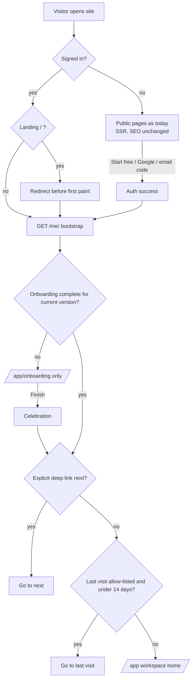
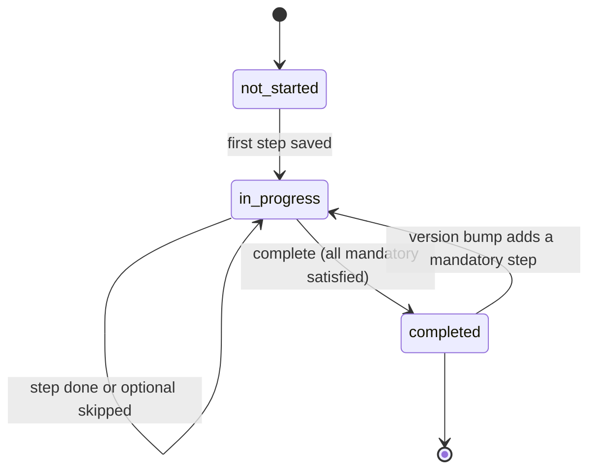
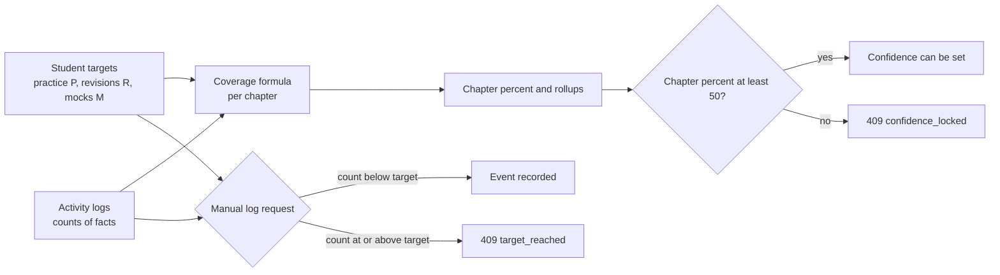
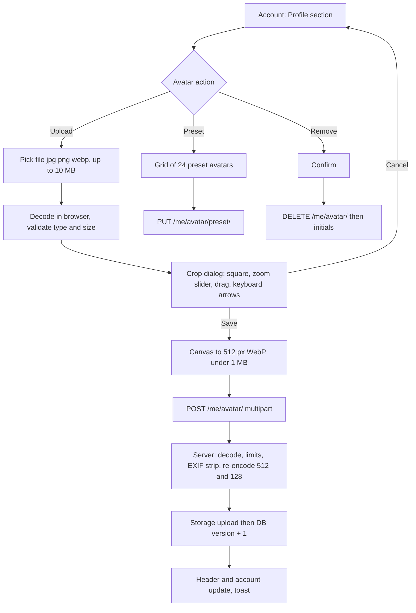

# PRD: F-16 Personalization, Onboarding, Profile and Workspace Home

| Field | Value |
| --- | --- |
| Status | Draft (for founder review) |
| Owner | Pawan (founder) |
| Last updated | 2026-10-06 |
| Source | `docs/product/FEATURE_MAP.md` section F-16 (founder notes 9, 13, 14, 15 of the 2026-10-05 UX review; FEATURE_MAP section 6 "Onboarding"; [F-02 audit](../validation/F-02-F-01-implementation-audit-2026-10-05.md) AUD-004) |
| Linked ERD | `docs/product/erd/F-16-personalization-onboarding-profile.md` |
| Order | **Seventeenth** PRD/ERD, but built **before the practice-engine wave** (README build wave 0b): every later pointer (Today, Analytics, MCQ, Recall) reads the student's course, level, attempt, daily hours and targets from here |
| Decision asked | "Come up with an ERD and then we will implement it" (founder). This pair is that ERD; slices S1 to S14 in section 13 are the implementation plan |

---

## 1. Problem and goal

A student who signs in today lands on a generic "Your workspace" page with the email address on it. The product does not know the student's name, shows a generic person icon in the header, shows the public marketing landing page to people who are already signed in, lists CA, CS and CMA on `/courses` although the student chose CMA, and measures every chapter against targets the student never chose (1 practice set, 2 revision rounds, 1 mock test, fixed in the syllabus table). Two real defects follow from the same gap: a chapter can show "Mock tests 2 of 1 tests, 100%" because nothing stops the second log, and "How confident do you feel?" can be answered for a chapter the student has not started.

**Goal, in four parts:**

1. **Onboard once, properly.** A new account (Google or email) lands directly on a short, resumable onboarding that collects name, course and level, attempt and exam date, daily study time, per-chapter activity targets, optional coaching and optional photo, then celebrates and opens a personalised workspace. Time to the first useful screen stays under 90 seconds (README "first plan in under a minute").
2. **Own the student's identity.** Name and profile picture (upload with crop, preset avatars, generated initials by default) with full create, read, update and delete states, shown in the header instead of a generic icon.
3. **Make targets personal and rules honest.** The student defines targets once (for example 2 practice sets, 3 revisions, 3 mock tests per chapter); the coverage percent is computed from them; logging stops at the target (clear API error code); confidence unlocks at 50% chapter coverage.
4. **Personalise every page after the course is known**, without touching what anonymous visitors and crawlers see: signed-in students skip the landing page, return to the page they last used, see their own course first on `/courses` and `/features`, and get a workspace home that answers "what do I do now".

F-16 is a **platform pointer**: it owns the student profile, onboarding state, last-visited route, study targets (as an extension of F-02 coverage settings), the shared UX contracts for toasts and duration inputs, and the central account export and deletion registry that F-06, F-10, F-12 and the audit all ask for.

## 2. Users and scenarios

**Aarav, CMA Final, signs up with Google on his phone.**
He taps "Continue with Google", returns to `/auth/callback` and is taken straight to onboarding (no landing page, no empty workspace). His name is already filled from Google ("Aarav Mehta"), he confirms it, picks CMA, Final, June 2027, types 2 h 30 min a day, taps the "Standard" targets chip, skips coaching and the photo, and lands on a workspace that says "Aarav, 238 days to CMA Final June 2027" with a goal ring and "Start your first focus round". Confetti fires once. He closes the tab; next morning he opens the site and goes directly to the chapter he was reading.

**Neha, CS Executive, signs up with email and password, Pro on a flaky 4G connection.**
She enters the 6 digit code from the confirmation email and lands on onboarding. Halfway (course done, hours not) her signal drops and she closes the tab. Two days later she signs in and the onboarding opens on "Daily study time" with her earlier answers kept. She chooses "Intense" targets, edits them to 4 mock tests, adds a photo (crops it with two fingers, sees a preview, saves), and finishes. Later she lowers mock tests to 2: chapters that had 3 logged keep their history and show "2 of 2, 3 logged", and the Log form says the target is reached.

**Rohan, CA Intermediate, existing user from before F-16.**
He has been using the tracker for a month. The next time he signs in he sees a one-screen "Two new things" onboarding (his name, and study targets prefilled with his current values 1, 2, 1) instead of the whole flow, taps "Keep my targets", and continues to the page he was on. His header now shows his initials in a coloured circle and his first name.

## 3. Success metrics

Targets are hypotheses to calibrate after the first 100 users. Events are defined in section 10.

| Metric | Definition | Target | Event(s) |
| --- | --- | --- | --- |
| Onboarding completion | New accounts that complete onboarding in the first session | 80% | `onboarding_started`, `onboarding_completed` |
| Time to first value | Median seconds from `onboarding_started` to `onboarding_completed` | under 90 s (p75 under 150 s) | `onboarding_completed.total_ms` |
| Resume rate | Students who leave mid-flow and finish within 3 days | 50% of leavers | `onboarding_step_completed.resumed` |
| Optional step uptake | Share who set coaching, who add a photo | track (expect coaching 30%, photo 25%) | `onboarding_step_completed`, `avatar_uploaded` |
| Targets chosen | Students who confirm targets (preset or custom) | 95% of completers | `study_targets_changed` |
| Return-to-where-you-were | Sign-ins that restore a last-visited page and the student stays over 10 s | 60% of returning sign-ins | `last_visit_restored`, `page_viewed` |
| Landing bypass | Signed-in visits to `/` that reach `/app` or restored page without rendering the hero | 99% | `landing_redirected` |
| Day-7 retention of onboarded students | Active on day 7 after completion vs students who skipped optional steps | track | PostHog cohort |
| Rule integrity | Chapters with logged count above target after S1 | 0 new; blocked attempts reported | `activity_log_blocked` |
| Avatar pipeline health | Upload success rate, p95 upload to visible | 98%, under 3 s | `avatar_uploaded`, server timing |
| Header paint | Header shows initials without layout shift (CLS 0) | 100% | web vitals |

## 4. Scope

**In scope (this release, R1 to R2)**

- **Profile:** name, avatar (upload, crop, preset, initials default, remove, replace), header menu with avatar and name, account settings "Profile" section with all states (section 5.2, 7).
- **Onboarding:** versioned, resumable state machine with mandatory and optional steps, completion event, celebration, gating of `/app/*`, post-auth routing for Google, email code, magic link, recovery and existing users.
- **Study targets:** per-student activity targets for every chapter, presets, formula wiring, lowering and raising rules, cap rule with API error codes, 50% confidence gate, and the explanation of the "25% with 0 chapters done" display (section 5.4, FR-F16-20 to 30).
- **Personalisation:** per-route behaviour table (section 7), landing bypass, last-visited route, `/courses` and `/features` scoping, workspace home widgets.
- **UX contracts:** toast catalogue (section 5.7) for the design-system toast system; hours plus minutes duration inputs everywhere (section 5.8).
- **Platform:** central account export and deletion registry (AUD-004), onboarding and profile events, three feature flags.

**Out of scope (later)**

- Public profiles, avatars visible to other students, mentor view (needs a moderation and consent design first, Q-F16-5).
- Importing the Google photo (P2, R3), image moderation, GIF or video avatars.
- Per-subject or per-chapter target overrides (P2, R3; the table has room, section 4.3 of the ERD).
- Full planner and "Today" task engine (F-13). The workspace home reserves its slot and shows a simpler version until F-13 ships.
- Notification preferences and channels (X-01), language and locale switching, payments and plans.
- Age verification and parental-consent flow (flagged in Q-F16-6; we collect no date of birth).

## 5. User flows

### 5.1 Entry and routing (the one decision function)



`resolvePostAuthDestination` is one pure function (web `personalization/lib/destination.ts`), called by `/auth/callback`, `/auth/confirm`, the login and signup containers, the `/` redirect and the `RequireOnboarded` guard. Order of precedence is fixed: **onboarding gate, then explicit deep link, then last visit, then `/app`**. A deep link survives onboarding: it is kept as `?next=` on `/app/onboarding` and used after completion.

Edge cases (each has a test):

| Case | Behaviour |
| --- | --- |
| Google or email signup, first session | Callback has a session, bootstrap says `onboarding.status = not_started`, student lands on `/app/onboarding` (replace, so Back does not return to the callback) |
| Email and password with confirmation (current Supabase config `enable_confirmations = true`) | Student enters the 6 digit code in `SignupContainer`; the session appears; the existing `user -> navigate('/app')` effect now goes through the guard to onboarding. Link route `/auth/confirm?type=signup` does the same through `postConfirmPath` |
| Magic link or OTP sign-in, existing student, onboarding complete | Straight to `next` or the last visit or `/app` |
| Recovery link | Reset password first (unchanged); after success the guard decides |
| Email change confirmation (`type=email_change`) | Goes to `/app/account`; if onboarding is incomplete the guard sends the student to onboarding first |
| Existing user with no profile row | `GET /me/` creates the profile lazily (existing behaviour), then the onboarding row; they get the full flow |
| Existing user with an enrolment, before F-16 | Backfilled as `completed_version = 1`; sees only the missing version 2 steps (name, hours, targets) as a one-screen prompt (FR-F16-15, FR-F16-16) |
| Two tabs finish onboarding | Completion is idempotent (200 with the same state); the other tab refreshes the bootstrap on focus |
| `/me/` fails (API down) | Skeleton for 3 s, then an error panel with Retry and Sign out. A completed student with a cached `onboarding.complete` flag in `localStorage` is let through (fail open for completed users, fail closed for incomplete ones) |
| Flag `personalization` off | No gate, no landing bypass, no restore; legacy `/app/onboarding` (coverage course step only) keeps working |

### 5.2 Onboarding steps and state machine

| # | Step key | Collects | Mandatory | Since version | Skip allowed | Writes to (owner) |
| --- | --- | --- | --- | --- | --- | --- |
| 1 | `profile` | Name (prefilled from Google or the email local part) | Yes | 2 | No | `profiles.full_name` (F-16) |
| 2 | `course` | Course, level, attempt (term), optional exact exam date, electives where the level has them | Yes | 1 | No | `coverage_enrollment` (F-02 `create_enrollment`) |
| 3 | `hours` | Daily study time, hours plus minutes (default 3 h, range 15 min to 16 h) with "Use as my daily goal" ticked | Yes | 2 | No (prefilled default, one tap) | `coverage_enrollment.daily_minutes` (F-02 extension) and `tracking_goal` daily (F-01.2 service) |
| 4 | `targets` | Per-chapter activity targets: practice sets, revision rounds, mock tests; presets Light, Standard, Intense, Custom | Yes | 2 | No (preset prefilled, one tap) | `coverage_settings.target_*` (F-02 extension) |
| 5 | `catchup` | "Tick chapters you already finished" (existing F-02 screen, the aha moment) | No | 1 | Yes | `coverage.services.catchup` |
| 6 | `coaching` | Coaching institutes followed (multi-select, "Other", none) | No | 2 | Yes | `material_userprovider` (F-12) `[PROPOSED: F-12]`; hidden until F-12 registers the step |
| 7 | `avatar` | Photo upload and crop, preset avatar, or keep initials | No | 2 | Yes | `profiles` avatar columns (F-16) |



Rules:

1. **Facts over flags.** Each step has an `is_satisfied(user)` check against the real data (name set, active enrolment exists, `daily_minutes` set, `targets_confirmed_at` set). Onboarding is complete when every mandatory step with `since <= required_version` is satisfied. A stored flag only records order, skipped optional steps and timestamps, so a student can never be "complete" with missing data and old users are classified correctly without guessing.
2. **Versioned.** `ONBOARDING_VERSION` (code constant, now 2) is the required version. When a later release adds a mandatory step with `since = 3`, students with `completed_version = 2` become incomplete again and see only the new step(s). Optional steps never re-prompt (a skipped optional step is offered once from the workspace "Finish your setup" card).
3. **Resumable.** Every step saves on "Continue" (server write, idempotent). Opening onboarding goes to the first unsatisfied mandatory step, or the first not-yet-seen optional step. The step is in the URL: `/app/onboarding?step=hours`.
4. **Gate.** A signed-in student whose onboarding is incomplete is routed **only** to `/app/onboarding` (plus Sign out and a legal footer). Public pages stay public. Everything under `/app/*` redirects.
5. **Completion** (`POST /me/onboarding/complete/`) verifies the mandatory steps server-side (409 `onboarding_incomplete` with the missing keys), sets `completed_version`, emits `onboarding_completed`, and returns the post-auth destination. The web then shows the celebration (5.3) and navigates.
6. **Back and edit.** Back works between steps; every answer is editable later in Account (name, avatar), Coverage settings (targets, exam date) and Tracker settings.

### 5.3 Celebration

On the first transition to `completed` for a given version the web shows a full-screen "You are all set" panel for up to 2.5 s (or until the student taps "Open my workspace"): check mark, personalised line ("Aarav, CMA Final June 2027 is set up. 238 days to go."), one confetti burst from `canvas-confetti`, loaded with a dynamic import so it never ships in the main bundle. With `prefers-reduced-motion: reduce` there is no confetti and no movement: the static panel and a polite live-region message only. Fired at most once per student and version (stored in `sessionStorage` and by the server `completed_at`), never on reload of the workspace.

### 5.4 Study targets, the cap and the confidence gate



Behaviour:

- **Counts are facts, targets are goals.** The ledger and `practice_count`, `mock_count`, `revision_count` keep everything that was logged. The percent uses `min(1, count / target)` (already true). What changes: screens show `min(count, target)` of `target` and, when more was logged, "3 logged" beside it; the Log form disables an activity at its target with the explanation "Mock tests: target reached (3 of 3). Raise it in Study targets."
- **Lowering** targets never deletes or edits history: chapters that had 3 mocks with the new target 2 show "2 of 2" and 100% for that part; coverage can go **up**, never down. **Raising** targets reopens logging and the percent can go **down** (the part is now 3 of 5); a one-time confirmation dialog states how many chapters will change ("12 chapters will drop below their current percent") with Undo for 10 s.
- **Cap applies to manual logs only** (`source = manual` through `POST /coverage/events/`). Events from the practice engine, mock tests and tracking (F-05, F-06, F-08) are always recorded, because they are facts that happened; they simply cannot push the percent past 100%. A target of 0 means "I do not track this": the activity is disabled in the Log form (409 `activity_not_tracked`) and its component is hidden from the formula (weight redistributed, existing rule FR-17).
- **Idempotency.** A retry with the same `client_id` returns the original event (200) even if the target is now reached; only a **new** request over the cap gets 409. The check and the insert run under the chapter row lock so two taps or two devices cannot both pass when one slot is left.
- **Offline queue.** A queued log that the server rejects with `target_reached` is dropped as a terminal (non-retryable) failure and the student sees an info toast "Skipped: mock tests are already at target for <chapter>".
- **Confidence gate (server side).** `PUT /coverage/chapters/{id}/confidence/` with a rating requires the chapter `coverage_pct >= 50`, else 409 `confidence_locked` (`details: {required: 50, current: 38}`); clearing (`null`) is always allowed. A rating set earlier stays when the percent later drops below 50 (for example after targets are raised), but cannot be changed until 50 is reached again. The UI disables the three options with the hint "Unlocks at 50% (you are at 38%)".
- **"25% with 0 of 119 chapters done" (investigated).** Not a calculation bug. The ring shows `pct_simple`, the average of every chapter's partial percent (`coverage_rollup.pct_simple`, `formula.rollup`), while "N of M chapters done" counts only chapters at 100% or `exam_ready` (`rollup.chapters_done`). Ticking all topics of a chapter is worth 40% (the reading weight), so a student who used Quick catch-up on about 60 chapters sees 25% overall and 0 chapters at 100%. The two numbers answer different questions with no label saying so. Fix (FR-F16-30, slice S1): add `chapters_started` (percent above 0) to the rollup, change the sentence to "31 chapters started, 0 completed, 88 not started", and label the ring "average progress across chapters". Verify against production with the query in ERD section 5.9. `[VERIFY]` on the founder's account: if the student has no read ticks at all and still shows 25%, the cause is something else (stale `coverage_rollup` rows); run `python manage.py rebuild_coverage`.

### 5.5 Profile and avatar



Avatar resolution order (`Avatar` component and the server's `avatar` object): uploaded image, else preset, else generated initials. If an image fails to load the component falls back to initials without a broken-image icon. Initials: first letter of the first and last word of the name (`Intl.Segmenter` so Devanagari and other scripts work), else the first letter of the email; the background is one of eight avatar tokens chosen by a stable hash of the user id, so the colour never changes when the name does.

| State | Behaviour |
| --- | --- |
| First time (no photo) | Initials avatar with a "Add a photo" button and "Choose an avatar" link |
| Loading profile | Avatar skeleton of fixed size (no layout shift); initials from the session metadata shown at once |
| File chosen, decoding | Inline spinner "Preparing your photo" |
| Unsupported or corrupt | Inline error "Use a JPG, PNG or WebP image" (HEIC is accepted only when the browser decodes it; Safari does) |
| Too large to read | Over 10 MB: "That photo is over 10 MB. Choose a smaller one" |
| Too small | Under 128 px on the short side: "Choose a photo at least 128 by 128 pixels" |
| Uploading | Progress bar in the dialog, Save disabled, focus kept in the dialog; Cancel aborts the request |
| Success | Dialog closes, header and account avatars update at once (new URL, no stale image), toast "Profile photo updated" |
| Error (network, 5xx) | Dialog stays open with the crop kept, "We could not save your photo. Try again" and Retry |
| Rate limited (10 uploads per hour) | "Too many changes. Try again in 12 minutes" |
| Offline | Upload disabled with hint; name edits are not queued (online only) |
| Remove | Confirm "Remove your photo? Your initials will show instead", then toast with no undo (the file is deleted) |
| Feature off (`profile_avatar`) | Only presets and initials; upload button hidden |

### 5.6 Last visited page

Decision: store the last visit in its own narrow table (`profiles_lastvisit`, one row per student), written **only** when the tab is hidden or closed (`visibilitychange` to `hidden`, and `pagehide`), never on navigation. Transport order: `navigator.sendBeacon` (no preflight, survives unload), then `fetch(..., {keepalive: true})` if `sendBeacon` returns false, plus a synchronous `localStorage` copy as the fallback (per user id). Restore happens at the next sign-in landing only (rule in 5.1): server value wins unless the local copy is newer. Restorable pages are an allow-list (section 7). Anything explicit wins: `?next=` deep links, `/auth/*`, onboarding. Rate limit 20 writes per minute per student, body at most 1 KB, path at most 300 characters; the server skips the write when the path is unchanged and the stored time is under 60 s old. Details and the token-in-body authentication detail are in ERD 5.4 and 7.

### 5.7 Toast catalogue (contract for the design-system toast system)

Variants: `success` (check icon, `role=status`, 4 s), `info` (info icon, status, 5 s), `warning` (triangle, `role=alert`, 7 s), `error` (octagon, `role=alert`, stays until dismissed or 10 s, with Retry when retryable), `undo` (success layout plus an Undo action, 10 s), `custom` (caller supplies icon and content; celebrations and milestones). Every toast has an icon and text, never colour alone; max 3 stacked, oldest drops; identical `key` replaces instead of stacking; hover and keyboard focus pause the timer; Escape dismisses; the region sits above the mini timer on mobile; motion is off under reduced motion. **Rules:** field validation errors stay inline (no toast); a toast announces an outcome the screen does not already show; optimistic taps with an in-place state change (ticking a topic, marking read) do not toast unless offline, failed or undoable. The provider moves to the app root (today it is mounted per shell, so Coverage, Account and Onboarding have none). Copy is plain, under 80 characters, no exclamation marks.

| Area | Action | Variant | Copy (exact) |
| --- | --- | --- | --- |
| Auth | Sign out | info | Signed out. |
| Auth | Password changed | success | Password updated. |
| Auth | Email change requested | info | Check your new email to confirm the change. |
| Auth | New code sent / resend failed | info / error | We sent a new code. / We could not send a code. Try again. |
| Auth | Session expired during use | warning | Your session ended. Sign in to continue. (action: Sign in) |
| Profile | Name saved | success | Name updated. |
| Profile | Photo uploaded / preset chosen | success | Profile photo updated. |
| Profile | Photo removed | success | Photo removed. |
| Profile | Photo rejected (type / size / small) | error | Use a JPG, PNG or WebP photo under 10 MB. |
| Profile | Upload failed (retryable) | error | We could not save your photo. (action: Try again) |
| Profile | Upload rate limited | warning | Too many photo changes. Try again in {n} minutes. |
| Profile | Data export ready | success | Your data export is ready. (action: Download) |
| Profile | Account deleted | info | Your account and data were deleted. |
| Onboarding | Step save failed | error | We could not save this step. (action: Try again) |
| Onboarding | Left mid-way, returns | info | Welcome back. We kept your answers. |
| Onboarding | Completed | custom | celebration panel plus confetti (no toast) |
| Onboarding | Finish-setup card dismissed | info | You can finish setup from your workspace any time. |
| Targets | Targets saved | success | Study targets updated. |
| Targets | Raised, chapters drop | undo | Targets raised. {n} chapters changed. (action: Undo) |
| Targets | Reset to a preset | success | Targets set to {preset}. |
| Coverage | Topic ticked offline | info | Saved on this device. It will sync when you are online. |
| Coverage | Activity logged | success | {Activity} logged: {count} of {target}. |
| Coverage | Log blocked at target | info | {Activity} is already at target ({n} of {n}). |
| Coverage | Queued log dropped at target | info | Skipped a {activity} for {chapter}: already at target. |
| Coverage | Confidence locked | info | Unlocks at 50% coverage. This chapter is at {n}%. |
| Coverage | Chapter or subject excluded | undo | Excluded {name}. (action: Undo) |
| Coverage | Quick catch-up applied | success | Marked {n} chapters as read. |
| Coverage | Settings saved / reset | success | Coverage settings saved. / Defaults restored. |
| Coverage | Scheme or enrolment switched | success | Switched to {scheme}. |
| Coverage | Offline queue flushed / failed | success / error | Synced {n} changes. / {n} changes did not sync. (action: Retry) |
| Tracker | Session added / edited | success | Session saved. / Session updated. |
| Tracker | Session deleted / merged / split | undo | Session deleted. (Undo) |
| Tracker | Goals saved / settings saved | success | Goals saved. / Settings saved. |
| Tracker | Overlap flagged | warning | This overlaps other tracked time. |
| Focus | Round saved partial / discarded | success / info | Saved as a partial round. / Round discarded. |
| Focus | Timer settings saved / deleted | success | Timer settings saved. / Timer settings deleted. |
| Last visit | Restored page missing | info | That page is no longer available. Opened your workspace. |
| Workspace | Course summary failed to load | error | We could not load your progress. (action: Retry) |
| Courses | Course filter toggled | none | state shown in place |
| System | Went offline / back online | warning / success | You are offline. Changes will sync later. / Back online. |
| System | Rate limited (429) | warning | Too many requests. Wait a moment and try again. |
| System | Server error (5xx) | error | Something went wrong on our side. (action: Try again) |
| System | Link copied / copy failed | success / error | Link copied. / Could not copy. Select and copy it. |
| Custom (later) | Streak milestone (X-03), new amendment (X-01) | custom | Supplied by those pointers through `toast.custom` |

### 5.8 Duration inputs: hours plus minutes in the UI, minutes (or seconds) in the API

Rule: **no screen asks the student to type a number of minutes.** One design-system field, `DurationField`, shows two labelled inputs, Hours and Minutes (44 px, numeric keypad, 0 to 59 in the minutes box, carry-over when the minutes box passes 59), inside a `role="group"` with the visible label of the whole duration and a helper line ("1 h 30 min"). It reads and writes a plain number of minutes (or `null`). **APIs keep their units and are not migrated**: goals `target_minutes`, focus `focus_minutes`, `short_break_minutes`, `long_break_minutes`, tracker `idle_minutes`, manual session `duration_seconds`. One exception is fixed (decision Q-F16-9): `coverage_enrollment.daily_hours` (decimal hours, cannot express 2 h 25 min) gets an additive `daily_minutes` column.

| # | Where (web file) | Today | After | API field and range |
| --- | --- | --- | --- | --- |
| 1 | Manual log and edit dialog, `tracker/components/SessionForm.tsx` | "Duration (minutes)" number | Duration (h, min); the Start and end mode keeps date-times and shows the computed duration read-only | `duration_seconds` 60 to 86,400 |
| 2 | Goals, `tracker/containers/GoalsContainer.tsx` | "Daily goal (minutes)" | Daily goal (h, min) | `target_minutes` 15 to 1,440 |
| 3 | Goals | "Weekly goal (minutes)" | Weekly goal (h, min) | `target_minutes` 30 to 10,080 |
| 4 | Goals, per-subject rows | unlabelled "Minutes" number | Visible label "Weekly time for {subject}" with h and min | `target_minutes` |
| 5 | Tracker settings, `tracker/containers/TrackerSettingsContainer.tsx` | "Idle time (minutes)" | Idle time (h, min) plus an "Off" switch | `idle_minutes` 0 or 5 to 60 |
| 6 | Focus presets, `focus/components/PresetPicker.tsx` (and `FocusSettingsForm.tsx`) | Focus, Short break, Long break (minutes) | Three duration fields (min only shown when hours is hidden, see rule below) | `focus_minutes` 5 to 120, `short_break_minutes` 1 to 30, `long_break_minutes` 5 to 60 |
| 7 | Onboarding hours step, `coverage/components/OnboardingSteps.tsx` ("Study hours per day") | decimal hours 0.5 to 24 | Duration (h, min), default 3 h | `daily_minutes` 15 to 960 (new) |
| 8 | Coverage settings (new Study time fields, if any) and Today (F-13) | n/a | same component | n/a |

Display-only strings use the same formatter (`formatDuration`, already in `tracker/lib/duration.ts`, moves to the design system): `ChapterContainer` "N minutes in total", `EndEarlyDialog` "Save N min", `GoalRings`, `FirstRunIntro`. Rule for short bounded fields (focus 5 to 120 min, breaks): the Hours box is hidden when the maximum is under 60 and shown from 60 up, so a 5 minute break is one field. Validation messages are expressed in h and min ("Choose between 5 min and 2 h").

## 6. Functional requirements

Priority: P0 must ship in R1, P1 in R1 or R2, P2 later. IDs are `FR-F16-nn`.

### Profile and avatar

| ID | Requirement | Priority | Acceptance criteria |
| --- | --- | --- | --- |
| FR-F16-1 | `GET /me/` returns name, avatar object, onboarding summary, course summary and last visit in one response | P0 | Given a signed-in student, when the app boots, then one request fills the header, the gate and the destination; it runs 5 queries or fewer |
| FR-F16-2 | Name: 1 to 60 characters after trimming, no control or bidi override characters, Unicode normalised (NFC); first name shown in the header | P0 | Given "  Aarav  Mehta ", when saved, then it is stored "Aarav Mehta"; given only spaces, then 400 `invalid` with a field message |
| FR-F16-3 | Generated initials avatar is the default, deterministic colour from 8 tokens, readable at 3:1 in all four themes | P0 | Given a student with no photo, when any page renders, then initials show with no network request and no layout shift |
| FR-F16-4 | Header replaces the generic icon with avatar plus first name (name hidden under 640 px); 44 px target; menu shows the full name and email | P0 | Given width 320, when the header renders, then avatar button is 44 by 44 and nothing scrolls horizontally |
| FR-F16-5 | Upload with client-side square crop (drag, pinch, zoom slider, keyboard arrows), output 512 by 512 WebP (JPEG fallback), under 1 MB | P0 (R2) | Given a 6 MB landscape JPEG, when cropped and saved, then the upload is under 300 KB and the preview matches the saved result |
| FR-F16-6 | Server validates and re-encodes: allowed JPEG, PNG, WebP; decoded pixel cap; reject animated; apply EXIF orientation then strip all metadata; store 512 and 128 renditions; random object key per upload | P0 (R2) | Given a JPEG with GPS EXIF, when uploaded, then the stored file has no EXIF; given a 40,000 by 40,000 PNG bomb, then 400 `image_too_large`, no worker crash |
| FR-F16-7 | Preset avatars: 24 shipped SVGs chosen by key; no storage or request needed | P1 (R2) | Given the preset picker, when a preset is chosen, then `PUT /me/avatar/preset/` stores only the key and the header updates |
| FR-F16-8 | Remove and replace: remove returns to initials and deletes both objects; replacing deletes the previous objects after the new ones are stored; failures leave no broken state | P0 (R2) | Given an upload that fails after storage, then the old avatar is still shown and the orphan is removed by the nightly sweep |
| FR-F16-9 | Cache-busting: every avatar URL is immutable (new random key per upload, `Cache-Control: public, max-age=31536000, immutable`); the `avatar.version` is part of the query key | P0 (R2) | Given a replaced photo, then all open tabs show the new image after the next profile refetch and never the old one from cache |
| FR-F16-10 | Account "Profile" section with every state in 5.5 (empty, loading, partial, success, error with retry, offline, feature off, rate limited, long name truncation with title) | P0 | Given a 60 character name, then it truncates in the header and wraps in the form without overflow at 320 px |

### Onboarding and gating

| ID | Requirement | Priority | Acceptance criteria |
| --- | --- | --- | --- |
| FR-F16-11 | Onboarding is a server-backed state machine of registered steps with `mandatory`, `since` version and `is_satisfied` (5.2) | P0 | Given a user with an enrolment but no targets, then `next_step = targets` and `status = in_progress` |
| FR-F16-12 | `GET/POST /me/onboarding/...` endpoints (section 9) save each step through the owning module's service and are idempotent | P0 | Given the same step posted twice, then the second returns 200 with the same state and one write |
| FR-F16-13 | Gate: incomplete onboarding routes every `/app/*` path to `/app/onboarding` (replace, deep link kept as `next`) | P0 | Given an incomplete student opens `/app/tracker`, then they land on onboarding and after finishing return to `/app/tracker` |
| FR-F16-14 | Signup via Google, email code, confirmation link or magic link all end on onboarding for a new account with no intermediate page | P0 | Given a new Google account, then `/auth/callback` leads to `/app/onboarding` in one navigation |
| FR-F16-15 | Version bump re-prompts only the new mandatory steps and only students whose `completed_version` is lower | P0 | Given `ONBOARDING_VERSION = 3` adds a mandatory step, then a v2 student sees one screen, a new student sees the whole flow |
| FR-F16-16 | Existing students are backfilled: with an enrolment, `completed_version = 1`; without, `0` (migration is reversible) | P0 | Given the migration on a dataset of 3 kinds of users, then counts per class match the expectation |
| FR-F16-17 | Optional steps (catch-up, coaching, avatar) can be skipped; skipped optional steps appear once as a "Finish your setup" card on the workspace | P1 | Given the avatar step skipped, then the card shows "Add a photo" until done or dismissed |
| FR-F16-18 | Completion celebration per 5.3, reduced-motion safe, fires once per version | P1 | Given `prefers-reduced-motion: reduce`, then no canvas is created and the panel has no animation |
| FR-F16-19 | Onboarding is keyboard and screen reader complete: one `h1` per step, progress as `aria-current="step"`, focus moves to the step heading on change, errors announced | P0 | Given only a keyboard, then all seven steps can be completed and focus never lands on a hidden element |

### Study targets, cap and confidence

| ID | Requirement | Priority | Acceptance criteria |
| --- | --- | --- | --- |
| FR-F16-20 | Per-student targets (`practice_sets`, `revisions`, `mocks`, each 0 to 10) stored once in coverage settings and applied to every chapter of every paper | P0 | Given targets 2, 3, 3, then every chapter's breakdown shows those denominators |
| FR-F16-21 | Presets Light (1, 1, 1), Standard (2, 2, 2), Intense (3, 3, 3), and Custom; served by the API with the settings so web and server share one table `[CALIBRATE]` | P0 | Given the preset list, then the web renders it from the response with no copy of the numbers in the bundle |
| FR-F16-22 | Percent uses the student's targets in the same pure formula (`compute_components`), the TypeScript mirror and the shared fixtures; a target of 0 hides the part and redistributes its weight | P0 | Given the fixture file `formula_cases.json` extended with a user-targets set, then Python and TypeScript agree |
| FR-F16-23 | Changing targets recomputes all chapters and rollups in one transaction; lowering never edits history; raising shows the impact dialog with Undo | P0 | Given 3 mocks logged on a chapter and the target lowered to 2, then the chapter shows "2 of 2, 3 logged", 100% for mocks |
| FR-F16-24 | Existing students keep 1, 2, 1 (`targets_confirmed_at` null) until they confirm in onboarding v2 or settings | P0 | Given a pre-F-16 student, then no percent changes on deploy |
| FR-F16-25 | Manual log over the cap returns 409 `target_reached` with `details {activity, target, count}`; target 0 returns 409 `activity_not_tracked` | P0 (S1) | Given target 1 and 1 mock logged, when a second is posted with a new `client_id`, then 409 and no event row |
| FR-F16-26 | A replayed `client_id` returns the original event with 200 even when the cap is now reached; concurrent requests for the last slot create exactly one event | P0 (S1) | Given two parallel posts at count 2 of 3, then one 201 and one 409; replaying the 201 returns 200 |
| FR-F16-27 | Log form disables an activity at target with the explanation and a link to Study targets; the score field is hidden for revision | P0 (S1) | Given a chapter with mocks at target, then the "Mock test" option is disabled with the hint |
| FR-F16-28 | Confidence is selectable only at 50% or more; server returns 409 `confidence_locked`; UI disabled with hint | P0 (S1) | Given a chapter at 38%, then the three options are disabled with "Unlocks at 50% (you are at 38%)" and the API refuses |
| FR-F16-29 | Components show `min(count, target)` of `target` plus "N logged" when above target | P0 (S1) | Given 2 mocks and target 1, then the card reads "1 of 1 tests, 100% (2 logged)" |
| FR-F16-30 | Overall ring labelling fixed: `chapters_started`, "N started, M completed, K not started", ring labelled "average progress" | P0 (S1) | Given 31 started chapters and none at 100%, then the sentence says so and no longer implies 0 progress |

### Personalisation, last visit, workspace

| ID | Requirement | Priority | Acceptance criteria |
| --- | --- | --- | --- |
| FR-F16-31 | Signed-in visits to `/` go to the destination in 5.1 before the hero paints; crawlers and signed-out visitors get the same SSR HTML as today | P0 | Given `localStorage` holds a Supabase session key, then `/` replaces to `/app` before first paint; given none, the HTML is byte-identical to before |
| FR-F16-32 | `/courses` for a signed-in student with a course shows their course, levels and progress only, with "Explore other courses" (`?all=1`) | P0 | Given a CMA student, then CA and CS cards are not rendered until the link is used |
| FR-F16-33 | `/features` and feature detail pages prioritise by the student's state (unused tools first, "Open" CTAs into `/app`), course wording where relevant | P1 | Given a student who used the tracker but not the timer, then the timer card is first |
| FR-F16-34 | Last visit saved on tab hide or close only, allow-listed, restored at the next sign-in landing within 14 days | P0 (R2) | Given the student leaves on `/app/syllabus/x/y`, then the next sign-in opens it; given the last page was `/app/account`, then it opens `/app` |
| FR-F16-35 | Workspace home widgets in the order of section 7.3, each with its own skeleton, empty and error state | P0 (R2) | Given a student with no sessions today, then Today shows 0 of goal and "Start your first round" |
| FR-F16-36 | "Continue where you left off" uses the most recent chapter activity (`last_studied_at`) and falls back to the last visit | P1 | Given a chapter studied 2 hours ago, then it is offered with its percent |

### Platform contracts

| ID | Requirement | Priority | Acceptance criteria |
| --- | --- | --- | --- |
| FR-F16-37 | Toast system follows the catalogue in 5.7; one provider at the root; variants, roles, durations, stacking and keys as specified | P0 | Given an error toast, then it has `role="alert"`, an icon, a dismiss button and Retry when retryable |
| FR-F16-38 | `DurationField` and the formatter are used for every field in 5.8 and no input labelled "minutes" remains | P0 | Given a repository search for `(minutes)` in labels, then there is no match outside the DurationField internals |
| FR-F16-39 | Central erasure and export registry: modules register `delete_all_for_user` and `export_for_user`; `DELETE /me/` and `GET /me/export/` call them all | P0 (R2) | Given an account with data in four modules, then after deletion no row remains, avatar objects are gone and the Supabase user is deleted |
| FR-F16-40 | Every F-16 endpoint requires auth, scopes by the JWT, never accepts `user_id`, and has throttles and tests | P0 | Given another student's id anywhere, then 404 |

## 7. Screens, URLs and design-system needs

### 7.1 Screens

| Screen | URL | Notes |
| --- | --- | --- |
| Onboarding | `/app/onboarding?step=<key>` (existing route, `course` and `level` search params kept) | Private, `noindex`. Seven steps, URL-driven, one `h1` each |
| Workspace home | `/app` | Replaces the "Your workspace" tile page; tools and settings stay as the last section |
| Account | `/app/account` | New "Profile" section on top: name, avatar; then Appearance, Email, Password, Data (export, delete), Session |
| Study targets | `/app/settings/coverage` (new section "Study targets") and the onboarding step | Same component `StudyTargetsForm` |
| Landing | `/` | Public SSR unchanged; client-side bypass for signed-in |
| Courses, features | `/courses`, `/features` and children | Public SSR unchanged; client-side scoping |

### 7.2 Personalisation rules per route

"No course" means signed in with onboarding incomplete, or coverage flag off, or no active enrolment. "Course" means an active enrolment. Signed-out behaviour is exactly today's for every public route.

| Route | Signed out | Signed in, no course | Signed in, with course |
| --- | --- | --- | --- |
| `/` | Landing (SSR, JSON-LD, FAQ) | Redirect to `/app/onboarding` | Redirect to destination (5.1); never renders the hero |
| `/courses` | All courses, banner "Tick a chapter you have finished" | All courses, banner "Finish setup" to onboarding | Only the student's course (levels, progress, active level highlighted); "Explore other courses" reveals the rest via `?all=1`; no CA/CS/CMA cards otherwise |
| `/courses/$course` | Course page | Course page with "Set up this course" CTA | Own course: banner with percent and "Continue"; other course: neutral banner "You are tracking {course}" and link back |
| `/courses/$course/$level[/$subject[/$chapter]]` | Public syllabus pages | Same, with "Track this" CTA | Same pages; chapter pages show the student's percent, a "Mark as read" control and a link to `/app/syllabus/...` |
| `/features`, `/features/$slug` | All features, "Start free" CTAs | Ready features first, CTAs "Finish setup" | Unused tools first, then used tools, then "coming soon" collapsed; CTA "Open" into `/app/...`; copy names the student's course where relevant |
| `/login`, `/signup`, `/auth/*` | Auth forms | Redirect to destination (existing behaviour, now through the guard) | Same |
| `/app` | Redirect to `/login?next=/app` | Redirect to onboarding | Workspace home (7.3) |
| `/app/onboarding` | Redirect to login | The flow | Redirect to `/app` unless a new mandatory step exists or `?step=` is used to edit |
| `/app/syllabus/*`, `/app/revision` | Login | Gate to onboarding | As today, plus targets in breakdowns |
| `/app/tracker/*`, `/app/focus/*` | Login | Gate to onboarding | As today; daily goal prefilled from onboarding hours |
| `/app/settings/coverage` | Login | Gate | Weights, revision gaps and Study targets |
| `/app/account` | Login | Gate (after onboarding the page is reachable) | Profile, appearance, email, password, data, sign out |
| `/design-system`, `/og/*`, `/sitemap.xml`, `/robots.txt` | Unchanged | Unchanged | Unchanged |

Restorable routes (last visit allow-list): `/app`, `/app/syllabus`, `/app/syllabus/$subject`, `/app/syllabus/$subject/$chapter`, `/app/revision`, `/app/tracker`, `/app/tracker/reports`, `/app/tracker/log`, `/app/tracker/goals`, `/app/focus`, `/app/focus/history`. Not restorable: onboarding, `/app/account`, `/app/settings/*`, `/app/tracker/day/$date` (a stale date is not useful), all `/auth/*`, `/login`, `/signup`, public pages.

### 7.3 Workspace home (`/app`), mobile first

Order of widgets (each independent, own skeleton and error):

1. **Header strip.** "Good evening, Aarav" and the exam countdown chip ("238 days to CMA Final, June 2027"; "Set your exam date" when missing).
2. **Today.** Goal ring (time today of the daily goal), streak chip, primary button "Start focus round" (or "Resume timer" when one is live), secondary "Log time". F-13 replaces this card with its task list when built.
3. **Continue where you left off.** Last studied chapter with its percent and "Continue" (falls back to last visit, then hidden).
4. **Next revision due.** Up to 3 chapters due today or overdue, each with "Open" (hidden when none, with "Nothing due. Nice." only when the student has revised before).
5. **Course progress.** Overall ring (average progress) with "N started, M completed", the three lowest subjects as bars, link to the map.
6. **Finish your setup** (only if optional steps were skipped): one card per skipped step.
7. **Study targets snapshot** (P2): mocks, revisions, practice logged versus planned across the course.
8. **Tools and settings** (the current tile grid, collapsed into a compact list).

```
 320 px                                   1024 px
+----------------------------+          +---------------------------------------------+
| Good evening, Aarav        |          | Good evening, Aarav     [238 days to CMA F] |
| [238 days to CMA Final]    |          +----------------------+----------------------+
+----------------------------+          | Today  (ring) 1h 10m | Continue: Ch 5 Cost  |
| Today        ( 58% ring )  |          | of 2h  Streak 6      | Sheet  42%  [Open]   |
| 1 h 10 m of 2 h  Streak 6  |          | [Start focus round]  +----------------------+
| [Start focus round]        |          |                      | Next revision due    |
+----------------------------+          +----------------------+ Ch 3 (2 days late)   |
| Continue                   |          | Course progress      | Ch 8 (today)         |
| Ch 5 Cost Sheet 42% [Open] |          | (ring) 31 started,   +----------------------+
+----------------------------+          | 0 completed          | Finish your setup    |
| Next revision due          |          | subjects bars        | Add a photo          |
| ...                        |          +----------------------+----------------------+
```

Loading: every card is a fixed-height skeleton (no layout shift). Empty (day one): Today shows 0 and "Start your first round"; Continue is replaced by "Open the syllabus map"; Revision hidden. Error: card-level message with Retry, other cards unaffected. Offline: cards show cached data with an "offline" badge.

Wireframe of onboarding (step 4, mobile):

```
+------------------------------+
| ArthaCommerce      Sign out  |
| Step 4 of 7  ####----        |
|                              |
| What do you want to finish   |
| in every chapter?            |
| [Light] [Standard*] [Intense]|
|                              |
| Practice sets      [-] 2 [+] |
| Revision rounds    [-] 2 [+] |
| Mock tests         [-] 2 [+] |
| Changeable any time in       |
| Settings.                    |
|                              |
| [Back]           [Continue]  |
+------------------------------+
```

### 7.4 Design-system components

Reused: `Button`, `Card`, `Dialog`, `Alert`, `Skeleton`, `Stepper`, `ProgressRing`, `ProgressBar`, `SelectField`, `TextField`, `SegmentedControl`, `Switch`, `DropdownMenu`, `EmptyState`, `Badge`, `ThemeRadioGroup`.
New (in `packages/design-system`, showcased on `/design-system`): `Avatar` (image, preset, initials, sizes 24, 32, 44, 96; skeleton), `AvatarPicker` (tabs Upload, Presets), `ImageCropDialog` (react-easy-crop, zoom slider, keyboard), `DurationField` (+ `toHm`, `fromHm`, `formatDuration`), `Toast` v2 (variants, root provider, `useToast().success/error/warning/info/undo/custom`), `Celebration` (confetti plus reduced-motion panel), `StepFlow` frame (progress, back, continue, resume), `NumberStepper` (targets), `PresetChips`, `WidgetCard` (title, action, skeleton, error). Tokens: `--avatar-1` to `--avatar-8` with foregrounds, validated by `check:contrast` in all four themes. Preset artwork: 24 SVGs using only these tokens.

## 8. Data and permissions

Entities (full columns in the ERD): extended `profiles` (avatar columns), `profiles_onboarding`, `profiles_lastvisit`, extended `coverage_settings` (targets), extended `coverage_enrollment` (`daily_minutes`), extended `coverage_rollup` (`chapters_started`), Supabase Storage bucket `avatars`.

| Action | Student | Mentor | Editor | Admin |
| --- | --- | --- | --- | --- |
| Read/update own profile, avatar, onboarding, targets, last visit | yes | no | yes (own) | yes (own) |
| Read another student's profile | no | no (Q-F16-5) | no | support view in Django admin (name, email, role; never photo) |
| Change `role` | no | no | no | superuser in admin only (unchanged) |

Privacy and retention: see ERD 7 and section 11. The profile photo is personal data; it is private to the student in this release.

## 9. API surface

Base `/api/v1`. All endpoints require the Supabase JWT unless noted. Errors use the existing envelope `{"error": {"code", "message", "details"}}`. Flags: `personalization` gates onboarding and last-visit writes, `profile_avatar` the upload, `study_targets` the target writes; off gives 403 `feature_disabled` (reads of `/me/` always work).

| Method and path | Purpose | Request | Response and errors |
| --- | --- | --- | --- |
| GET `/me/` | Bootstrap | none | 200 profile, `avatar`, `onboarding {status, required_version, completed_version, next_step, missing[]}`, `course {course, level, term, exam_date, days_remaining}` or null, `last_visit {path, at}` or null. ETag |
| PATCH `/me/` | Name | `{full_name}` | 200; 400 `invalid` (`course`, `level`, `exam_date` no longer writable: 400 `field_read_only`, removed after one release) |
| POST `/me/avatar/` | Upload | multipart `file` (the cropped 512 px image) | 201 `avatar`; 400 `invalid_image`, `image_too_large`, `image_too_small`; 413 `payload_too_large`; 429 |
| PUT `/me/avatar/preset/` | Preset | `{key}` | 200 `avatar`; 400 `unknown_preset` |
| DELETE `/me/avatar/` | Remove | none | 200 `avatar` (initials) |
| GET `/me/onboarding/` | State and step list | none | 200 steps with `state` (todo, done, skipped), `mandatory`, `available` |
| PUT `/me/onboarding/steps/{key}/` | Save a step | step data (typed per step) | 200 state; 400 field errors; 404 unknown step; 403 flag |
| POST `/me/onboarding/steps/{key}/skip/` | Skip optional | none | 200 state; 409 `step_mandatory` |
| POST `/me/onboarding/complete/` | Finish | none | 200 `{state, destination}`; 409 `onboarding_incomplete` with `missing[]` |
| PUT `/me/last-visit/` (also POST for beacons) | Last page | `{path}`; beacon form: text body `{"t": "<jwt>", "path": "..."}` | 204; 400 `path_not_restorable`; 413; 429 |
| GET `/me/export/` | DPDP export | none | 200 JSON (profile, onboarding, last visit, coverage, tracker, focus, avatar download URL valid 24 h) |
| DELETE `/me/` | DPDP deletion | `{confirm: "DELETE"}` plus a recent reauthentication code | 204; 400 `confirmation_required`; 401 `reauth_required` |
| GET/PUT `/coverage/settings/` (extended) | Weights, gaps and targets | `targets {practice_sets, revisions, mocks}`, `preset` | 200 with `target_presets[]`; 400 field errors; 403 flag |
| POST `/coverage/events/` (extended) | Log activity | unchanged | 201; 409 `target_reached`, `activity_not_tracked` |
| PUT `/coverage/chapters/{id}/confidence/` (extended) | Confidence | unchanged | 200; 409 `confidence_locked` |

Throttles (scopes): `profile_write` 30/min, `avatar_write` 10/hour, `lastvisit_write` 20/min, `onboarding_write` 60/min, `account_export` 3/hour, `account_delete` 3/day.

## 10. Notifications and analytics events

Event names use `noun_verb`; no name, email, free text or file content is ever sent. Properties in brackets.

| Event | Properties |
| --- | --- |
| `onboarding_started` | version, source (google, email, existing), has_deep_link |
| `onboarding_step_viewed` | step, resumed |
| `onboarding_step_completed` | step, ms_on_step, resumed, preset (targets), used_default |
| `onboarding_step_skipped` | step |
| `onboarding_completed` | version, total_ms, skipped_steps[], preset, daily_minutes_bucket |
| `onboarding_gate_redirected` | from_kind (app, landing, callback) |
| `avatar_uploaded` | bytes_bucket, ms, crop_zoom_bucket |
| `avatar_preset_selected` | preset_key |
| `avatar_removed` | none |
| `avatar_upload_failed` | reason (type, size, small, network, server, rate_limited) |
| `profile_name_changed` | length_bucket |
| `study_targets_changed` | preset, practice_sets, revisions, mocks, direction (raised, lowered, mixed), chapters_changed |
| `activity_log_blocked` | activity, reason (target_reached, not_tracked), surface (form, offline_replay) |
| `confidence_blocked` | coverage_bucket |
| `last_visit_restored` | path_kind, age_bucket, source (server, local) |
| `landing_redirected` | destination_kind |
| `workspace_viewed` | widgets_shown[], has_streak, has_due |
| `workspace_widget_clicked` | widget |
| `courses_scope_toggled` | all (bool) |
| `account_exported` / `account_deleted` | modules_count |
| `toast_shown` | key, variant (sampled 10%, errors 100%) |

Notifications: none in R1. Later X-01: "finish your setup" nudge after 24 h, "exam in 100 days, review targets".

## 11. Non-functional requirements

| ID | Area | Requirement |
| --- | --- | --- |
| NFR-F16-01 | Performance | `GET /me/` p95 under 150 ms (5 queries, no N+1); onboarding step save p95 under 300 ms; avatar upload (512 px WebP) end to end p95 under 3 s on 4G; workspace home first paint under 1.5 s on a mid phone with skeletons; `canvas-confetti` and `react-easy-crop` load only on demand (not in the main bundle) |
| NFR-F16-02 | Accessibility | WCAG 2.2 AA; four themes; 320 to 1280 px with no horizontal scroll; 44 px targets; crop dialog operable by keyboard and with a text alternative ("Move the photo with arrow keys, zoom with plus and minus"); toasts and live regions per 5.7; focus management on step change; reduced motion respected everywhere |
| NFR-F16-03 | SEO | Public routes keep SSR HTML, `buildHead`, JSON-LD, canonical and sitemap unchanged; personalisation is client-side only; no `Vary: Cookie`; private routes `noindex` |
| NFR-F16-04 | Security | Server-side image re-encode, pixel cap (Pillow decompression-bomb guard treated as an error), 1 MB upload cap, no SVG upload; random object keys; service-role key only on the API; beacon token accepted only on the last-visit endpoint; path allow-list; no open redirect (`safeNextPath` reused); throttles per scope; RLS deny-all on every new table |
| NFR-F16-05 | Privacy | DPDP: purpose limitation, minimal data (no date of birth, no phone), explicit export and deletion, photo deleted on remove, replace and account deletion, nightly orphan sweep, backups roll off within 35 days (documented) |
| NFR-F16-06 | Correctness | Cap and gate enforced server side under row lock; Python and TypeScript formulas share fixtures; migrations additive and reversible; `rebuild_coverage` reproduces every derived column with the new targets |
| NFR-F16-07 | Reliability | Onboarding survives refresh, tab close and device switch; completion and step saves are idempotent; flag outage fails open for completed students |
| NFR-F16-08 | Observability | Sentry on upload and onboarding failures (no PII); PostHog events above; log line per avatar upload with sizes and timings (no filenames) |
| NFR-F16-09 | Cost | One avatar per student, at most about 150 KB for both renditions; 100,000 students is about 15 GB; no reliance on paid Supabase image transformations |
| NFR-F16-10 | Testing | Section 13 and ERD 9: pure logic, every endpoint, concurrency test for the cap, contract fixtures, e2e happy paths, axe checks |

## 12. Risks and open questions

Each open question has a recommended default; the founder decides unless noted.

| # | Question or risk | Recommended default |
| --- | --- | --- |
| Q-F16-1 | Preset values for Light, Standard, Intense | Light 1 / 1 / 1, Standard 2 / 2 / 2, Intense 3 / 3 / 3 (practice sets, revision rounds, mock tests per chapter). `[CALIBRATE]` with tutors; founder's own example (2, 3, 3) is a Custom choice |
| Q-F16-2 | Do the editor-set per-chapter targets (`syllabus_chapter.target_*`) still matter? | No for coverage: the student's targets apply to every chapter. Columns stay, unused, and an editor "suggested" value can be shown later (R3). Per-subject overrides are P2 |
| Q-F16-3 | Should onboarding hours also set the tracker daily goal? | Yes, with a ticked "Use as my daily goal" box, only when no goal exists |
| Q-F16-4 | Avatar storage: public bucket with random keys, or private bucket with signed URLs | Public bucket, random 128 bit object key per upload, URLs given only to the owner now; switch to signed URLs (one server function) before any feature shows avatars to others or if minors' images raise legal concern |
| Q-F16-5 | Will avatars ever be visible to others (mentor, leaderboards)? | Not in this release. If yes, add moderation (report, takedown), consent text and the signed-URL switch first |
| Q-F16-6 | Minors and DPDP (children's data needs verifiable parental consent) | No date of birth collected; photo is optional and private; terms state "18 or older, or with a parent's consent"; legal review before any sharing feature. Decision owner: founder with counsel |
| Q-F16-7 | Import the Google profile photo | R3 only, as an explicit "Use my Google photo" button; server fetches from the Google image host once, re-encodes, stores. Never hotlink |
| Q-F16-8 | Last visit: one row per student or per device | One row per student (last write wins). Per device only if students ask |
| Q-F16-9 | `daily_hours` decimal versus minutes | Add `daily_minutes` (additive, backfill `round(daily_hours * 60)`), read both for one release, drop `daily_hours` in R3 |
| Q-F16-10 | Restore window for last visit | 14 days, then `/app` |
| Q-F16-11 | Gate scope: should `/app/account` and sign out stay reachable during onboarding | Sign out and a legal footer only; Account is reachable right after completion |
| Q-F16-12 | Backfill of existing students | Enrolment holders get `completed_version = 1` and only the version 2 steps; others get the full flow |
| Q-F16-13 | Coaching list (providers) | Owned by F-12 (`material_provider`); step appears when F-12 registers it. Until then the step is hidden, not stubbed |
| Q-F16-14 | Account deletion: immediate or 7 day grace | Immediate after reauthentication and an offered export (DPDP erasure); a grace period only if support asks |
| Q-F16-15 | Avatar for Indic names | Initials use grapheme clusters; if the first cluster is a combining sequence, show the first full cluster. Tested with Devanagari and Tamil samples |
| R1 | Landing redirect flash for signed-in users | Inline pre-paint script reads the Supabase session key; React effect as backup. A stale key costs one extra hop through login |
| R2 | `sendBeacon` cannot set an Authorization header | Token in the text body for this one endpoint, fetch keepalive fallback, localStorage copy; documented in ERD 7 |
| R3 | Raising targets lowers everyone's percentages | Impact dialog with Undo; deploy default keeps 1, 2, 1 until confirmed |
| R4 | Vercel request body limit (about 4.5 MB `[VERIFY]`) | Client crops to 512 px and the server cap is 1 MB, so uploads stay far below it |
| R5 | Backfill misclassifies a user | Gate uses facts (`is_satisfied`), not the stored version alone |

## 13. Rollout

**Flags (PostHog, server-checked, snake_case):** `personalization` (gate, landing bypass, restore, workspace home, scoping), `profile_avatar` (upload, crop; initials and presets are always on once S6 ships), `study_targets` (target writes and UI; the cap and gate fixes in S1 are **not** flagged because they correct bugs). Flags fail open as everywhere else (`core/feature_flags.py`).

**Order:** S1, S3 and S4 first (they fix visible defects and are prerequisites for the rest); then S5 to S8; then the flows. README places F-16 before the practice engine (wave 0b).

**Migration and support notes:** additive migrations only; `profiles.course/level/exam_date` stop being written in S5 and are dropped two releases later; existing students keep 1, 2, 1 targets; the backfill is idempotent; support FAQ "Why did my percent change after I changed targets" and "How do I remove my photo or delete my account". `docs/F-16-ROLLOUT.md` written with S14.

### Slicing into PR-sized issues (each independently shippable)

| Slice | Title (Conventional Commits scope) | Contents | Depends on |
| --- | --- | --- | --- |
| S1 | `fix(api,web): enforce activity targets, confidence gate and honest progress wording` | `target_reached`, `activity_not_tracked`, `confidence_locked` under row lock; `min(count, target)` display; `chapters_started` rollup column and ring wording; Log and Confidence UI states; tests incl. Postgres concurrency; offline queue drops terminal 409 | none |
| S2 | `feat(api,web): personal study targets` | Migration on `coverage_settings` and `coverage_enrollment.daily_minutes`; formula wiring (both languages, fixtures); presets in the settings response; `StudyTargetsForm`, impact dialog; recompute; flag `study_targets` | S1 |
| S3 | `feat(ds,web): DurationField and duration formatter` | Component, tests, showcase; migrate every field in 5.8 | none |
| S4 | `feat(ds,web): toast system v2 and catalogue` | Variants, root provider, `notify` helper with the copy table; migrate existing calls; a11y tests | none |
| S5 | `feat(api): profile bootstrap, onboarding and last-visit schema` | Migration `profiles.0003`, `/me/` extension, name rules, derived course, erasure and export registry, account deletion (AUD-004), RLS test | none |
| S6 | `feat(ds,web): Avatar, initials, presets and header identity` | `Avatar`, tokens, 24 presets, header menu with avatar and name, preset endpoint | S5 |
| S7 | `feat(api,web): avatar upload with crop` | Pillow pipeline, storage client, sweep command, `ImageCropDialog`, Profile section on Account, all states | S5, S6 |
| S8 | `feat(api): onboarding state machine` | Step registry, endpoints, backfill migration, version rules, tests | S5 |
| S9 | `feat(web): onboarding flow and celebration` | Seven steps, resume, `Celebration`, legacy flow kept behind the flag | S2, S3, S7, S8 |
| S10 | `feat(web): onboarding gate and post-auth routing` | `RequireOnboarded`, `resolvePostAuthDestination`, callback, confirm, login, signup, landing bypass script | S8, S9 |
| S11 | `feat(api,web): last visited page` | Endpoint, token-in-body auth, hook, restore, allow-list parity fixture | S5, S10 |
| S12 | `feat(web): workspace home` | Widgets in 7.3 with skeletons, empty and error states | S2, S10 |
| S13 | `feat(web): course-scoped courses and features` | `/courses` and `/features` personalisation, `?all=1`, tests that SSR output is unchanged | S10 |
| S14 | `chore(api,web,docs): events, rollout and cleanup` | PostHog events, `docs/F-16-ROLLOUT.md`, e2e, drop vestigial columns migration (two releases later), README and CLAUDE.md status | all |

## Appendix: research notes and references

| Source | Finding | Changed the design |
| --- | --- | --- |
| [Supabase Storage Image Transformations](https://supabase.com/docs/guides/storage/serving/image-transformations) | Transformations need the Pro plan, width and height 1 to 2,500 px, 25 MB, 50 MP, default quality 80, 100 included transformations per month | We re-encode and store two renditions ourselves and never depend on transformations (cost and plan coupling) |
| [Supabase Storage docs](https://supabase.com/docs/guides/storage) and [storage v3 blog](https://supabase.com/blog/storage-v3-resumable-uploads) | Public buckets serve through the CDN; the `cacheControl` upload option sets cache headers; signed URLs carry an expiry | Public bucket with random immutable keys (Q-F16-4); one-year immutable cache, no cache-busting query strings |
| [react-easy-crop](https://github.com/ValentinH/react-easy-crop) and [react-image-crop](https://github.com/DominicTobias/react-image-crop) | Both give a crop rectangle in pixels; react-easy-crop adds zoom, pinch and a round or square mask; the canvas `toBlob` pattern produces the cropped file | react-easy-crop with a zoom slider, canvas to WebP (`toBlob('image/webp', 0.85)`) with a JPEG fallback when the browser returns another type `[VERIFY keyboard support version]` |
| [Uploadcare: image cropping tools compared](https://uploadcare.com/blog/best-tools-for-image-cropping/) | Client-side crop reduces bytes before upload; server must still validate | Two-sided validation (client UX, server authority) |
| [Pillow security notes](https://hugovk-pillow.readthedocs.io/en/latest/handbook/security.html) | `MAX_IMAGE_PIXELS` warns at 1x and raises at 2x; never disable; treat warnings as errors; add per-worker memory limits and rate limits | Decompression guard as error, 10 uploads per hour, 1 MB cap, no SVG, re-encode to drop EXIF and any payload |
| [Beaconing in practice (NicJ)](https://nicj.net/beaconing-in-practice/) | `pagehide` plus `visibilitychange` is the most reliable pair (about 82% in the study), `unload` breaks the back-forward cache; `sendBeacon` is limited to CORS-safelisted types (no custom headers) and 64 KB in Chromium and Safari | Write only on `visibilitychange` hidden and `pagehide`; token in a `text/plain` body for the beacon; keepalive fetch fallback; 1 KB cap |
| [canvas-confetti](https://www.npmjs.com/package/canvas-confetti) | Small canvas library with `disableForReducedMotion`, `useWorker` and `zIndex` options `[VERIFY option names and size on install]` | Dynamic import, once per version, theme colours read from tokens, reduced motion gets a static panel |
| [Appcues: onboarding best practices](https://www.appcues.com/blog/user-onboarding-best-practices) and [Eleken: 12 tips](https://www.eleken.co/blog-posts/user-onboarding-best-practices) | Ask only what personalises the first session; show progress; prefill and allow skipping; progressive profiling for the rest; get to the first value fast | Four mandatory short steps (all prefilled, one tap), three optional; optional answers are re-offered as a "finish your setup" card, not as a blocker |
| FEATURE_MAP section 6 | "Onboarding: course, level, attempt, exam date, daily hours, optional coaching you follow; first plan in under a minute" | Section 5.2 step list and the 90 second target |
| Code audit (this repo, 2026-10-06) | Targets are chapter columns (1, 2, 1) read by `coverage/services.py _recompute_chapter`; the web never calls `/me/`; `profiles.course/level/exam_date` are unused; the ring uses `pct_simple` but the sentence uses `chapters_done` | Targets move to the student; `/me/` becomes the bootstrap; vestigial columns retired; wording fix |
