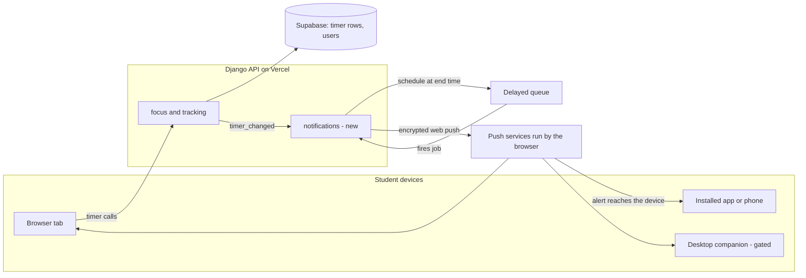

# X-01 Notifications, F-01.3 Floating Timer, F-01.4 Keep Awake: PRD

| | |
| --- | --- |
| Status | Approved 2026-10-06 (decisions D1 to D7, nudge default 10:00 local) |
| Owner | Pawan |
| Scope | Web Push foundation (first release of X-01), floating timer and desktop companion (F-01.3), keep screen awake (F-01.4) |
| Companion document | [ERD](../erd/X-01-notifications-floating-timer-stay-awake.md) |
| Builds on | F-01.1 Pomodoro, F-01.2 Time Tracker, F-16 Personalization and onboarding |


## Feasibility verdict

All three ideas can be built, but the browser alone cannot do all of them. Push alerts and a floating timer on desktop Chrome and Edge fit the current web stack. A timer that survives a closed browser, and a screen that stays awake while another app is in front, need a small desktop companion app.

| # | What you asked for | Verdict | What the platform allows | What it does not allow |
| --- | --- | --- | --- | --- |
| 1 | Push alert when a timer ends and I am in another app | Yes | Web Push works on Android Chrome, desktop Chrome, Edge, Firefox and Safari, and on iPhone once the app is added to the Home Screen. The server can schedule the alert at the exact end time, so no browser tab has to be alive. | iPhone needs the Home Screen install first. Some Android phones (battery savers) delay pushes. |
| 2 | Permission asked in onboarding, "non-negotiable" | Partly | We can make the step required to complete and ask at the best moment. | A site cannot grant itself access. The browser needs a tap on Allow, and a Block cannot be re-asked from code. A hard gate makes people Block or leave. |
| 3 | Push for every event, plus a daily motivational message | Yes | Pure product and backend work on top of the same pipeline. | Nothing blocking. Needs caps so it does not turn into spam. |
| 4 | Timer shown on the device outside the website | Yes on desktop, partly elsewhere | Document Picture-in-Picture gives a small always-on-top timer window on Chrome and Edge 116+ and Firefox 151+. An installed PWA gives its own window and icon badge. | Safari and phones have no equivalent. The window closes with the tab that opened it, so "browser closed" is not covered. |
| 5 | Timer keeps running with the app closed | Yes, with a desktop app | Timer truth is already server timestamps, so a Tauri companion can show it in the menu bar or tray. | Not possible from a web page alone. Phones would need a native app, which is out of scope. |
| 6 | Screen must not lock while a timer runs | Yes, inside Artha only | Screen Wake Lock works on Chrome and Edge 84+, Firefox 126+, Safari 16.4+ and in iPhone Home Screen apps. | The lock is released the moment the Artha tab is hidden. Reading a PDF in another app or tab will still let the screen sleep. Only the desktop companion can hold the screen awake system-wide. |

Recommended order: ship pushes and in-app stay-awake first (about 4 to 6 weeks, one full-stack engineer, estimate), add the floating timer next (about 2 weeks), then decide on the desktop companion from real usage (about 4 to 6 weeks, estimate). The reasoning is in the next sections.

## What we found in the platforms and in our codebase

The web platform covers push, a floating window and a screen lock. Each has one limit that shapes the design, listed below. Sources are at the end of the document.

| Capability | Where it works | Limit that matters to us |
| --- | --- | --- |
| [Push API](https://developer.mozilla.org/en-US/docs/Web/API/Push_API) with a service worker | Widely available since March 2023. Chrome sends no message quota. | Needs a service worker. Subscriptions can expire or be revoked, so the server must prune dead ones. |
| [Notifications permission](https://developer.mozilla.org/en-US/docs/Web/API/Notifications_API/Using_the_Notifications_API) | All major browsers. | Must be requested from a tap (Safari and Firefox enforce it). States are default, granted, denied. Once denied, only the user can undo it in browser settings. |
| [Web Push on iPhone and iPad](https://webkit.org/blog/13878/web-push-for-web-apps-on-ios-and-ipados/) | iOS and iPadOS 16.4 and later. | The web app must be added to the Home Screen first, and the permission prompt must follow a tap. Notifications reach the Lock Screen and respect Focus modes. |
| [Declarative Web Push](https://webkit.org/blog/16535/meet-declarative-web-push/) | iOS and iPadOS 18.4, macOS 15.5. | Optional upgrade: a standard JSON payload shows without JavaScript, so it is more reliable and uses less battery. Keep the service worker as the baseline. |
| [Badging API](https://developer.mozilla.org/en-US/docs/Web/API/Badging_API) | Installed apps (dock, taskbar, Home Screen icon). | Limited availability, not in every browser. Use as an extra, never as the only signal. |
| [Document Picture-in-Picture](https://developer.chrome.com/docs/web-platform/document-picture-in-picture) | Chrome and Edge 116+ on desktop, Firefox 151+. Not Safari. | Must open from a click. Floats above other windows, but "never outlives the opening window", cannot be navigated, and its position is chosen by the browser. |
| [Screen Wake Lock](https://developer.chrome.com/docs/capabilities/web-apis/wake-lock) | Chrome and Edge 84+, Firefox 126+, Safari 16.4+. | Released automatically when the tab or window is hidden, and when battery is critically low. We must re-request on return and handle refusal. |
| Wake Lock in iPhone Home Screen apps | Fixed after a bug in 16.4 (WebKit [bug 254545](https://bugs.webkit.org/show_bug.cgi?id=254545), resolved). | Test on a real iPhone before promising it. |
| [Installability in Chrome](https://web.dev/articles/install-criteria) | Needs 192 px and 512 px icons, a name, a start URL and a display mode. | Our manifest has only a 512 px icon, so Chrome will not offer "Install" today. |

What the codebase already gives us:

- **Timer truth is on the server.** `focus_activetimer` stores `started_at`, `planned_seconds`, `paused_total_seconds` and a `version`, so the exact end time of a round can be computed without any open page. This is what makes a reliable push possible.
- **Alerts today are page-only.** `useFocusAlerts` shows a `Notification` only when the tab is hidden and the page is still alive. The F-01.1 PRD already lists Web Push as v1.1.
- **There is no service worker and no push code.** `apps/web/public` holds only a manifest, one icon and the favicon. The API has no `pywebpush`, no scheduler and no VAPID keys.
- **There is a clean event bus.** `core/events.emit` lets the timer announce a change without importing a notifications module, which keeps our module rules intact.
- **Onboarding is a versioned state machine** (F-16). Adding a step with `since = 3` re-prompts existing students with one screen.
- **Hosting is serverless on Vercel.** A long-running worker is not available, so scheduled work needs an external trigger (section on architecture).

## Recommended architecture and delivery order

Build one notification pipeline on the server, and treat every screen (browser tab, floating window, desktop app) as a viewer of the same server timer. The server decides when a round ends and sends the push; the viewers only draw it.



A timer change on any screen reaches the API, which plans one queued job for the end time. When the queue fires it, the notifications module re-checks the timer and sends the push to every device, which shows it even if no page is open.

We compared four ways to put the timer outside the website:

| Option | Covers | Works with browser closed | Platforms | Effort (estimate) | Verdict |
| --- | --- | --- | --- | --- | --- |
| Web Push only | End-of-round and every other alert | Yes, alerts only | All, iPhone after install | 3 to 4 weeks | Ship first |
| Installed PWA plus pop-out window | Own window, icon badge, Android action buttons | No | Chrome, Edge, Safari desktop, Android | 1 week on top of push | Ship with push |
| Document Picture-in-Picture | Always-on-top live timer | No (dies with the tab) | Chrome and Edge 116+, Firefox 151+ | about 2 weeks | Ship second |
| Desktop companion (Tauri 2, tray and mini window) | Live timer, menu bar or tray, system-wide keep-awake | Yes | Windows, macOS, Linux | 4 to 6 weeks plus signing | Decide after Phase 2 data |

We chose [Tauri 2](https://v2.tauri.app/start/) over Electron for the companion because it uses the system web view, so installers are far smaller than ones that bundle a browser. The same React screens can be reused. A native phone app (live lock-screen countdown through Android notifications or iOS Live Activities) is possible later but contradicts the current "PWA, not native" decision in the F-01.1 PRD, so it stays out of scope.

### Rules the design follows

1. **One source of truth.** The timer's end time is computed from `focus_activetimer`. Clients never decide when to alert; they only mirror.
2. **A scheduled job is a hint, the database is the judge.** When a job fires, the server re-reads the timer and sends only if the timer is still running and unchanged. Pause, extend or end never needs a perfect cancel.
3. **Decoupled modules.** `focus` and `tracking` emit events (`focus.timer_changed`, `tracking.goal_reached`). A new `notifications` module subscribes. No module imports another's internals.
4. **Exact timing without a server loop.** Vercel functions cannot run a timer loop, and Vercel cron runs once per minute on Pro and only once per day on Hobby (see [cron limits](https://vercel.com/docs/cron-jobs/usage-and-pricing)). So each timer-end is queued at start time with an external delayed-message service such as [QStash](https://upstash.com/docs/qstash/features/delay), which accepts an exact "not before" time. A per-minute sweep (Vercel cron on Pro, or Supabase `pg_cron`) is the safety net for missed jobs and for daily jobs.
5. **Graceful loss.** If push is blocked or unsupported, the student still gets sound, tab title, in-app inbox and an email digest. Nothing in the app is locked behind the permission.
6. **Same alert never twice.** Local alerts and server pushes use one `tag` per phase, so the OS shows a single notification.

## PRD A: Push notifications and reach (X-01, first release)

**Problem.** A student starts a 25-minute round, switches to a PDF or a book app, and has no idea the round has ended until they come back to the site. The same gap hits revision reminders, goals and new content: today the product can only speak while the page is open.

**Goal.** Every time-critical moment reaches the student on the device they are holding, in under five seconds, whichever app is in front. Reminders stay useful, capped and easy to control.

**Out of scope for this release:** WhatsApp and SMS channels, native phone apps, rich push images, A/B testing of copy.

### Asking for permission: required step, honest outcome

The browser will only show its Allow prompt after a tap, and a Block cannot be re-asked from code. So "we must get access" is achieved by making the step unavoidable and by earning the tap, not by forcing it. We add a new mandatory onboarding step, `alerts` (F-16, `since = 3`), shown once to new students and as a single screen to existing ones.

The step counts as satisfied when the student has made a decision: allowed, chose "Not now" after seeing what they lose, or is on a device that cannot receive push. A hard gate that blocks `/app` until Allow is clicked is possible to build, but we advise against it: people tap Block to get past it (permanent) or leave, and under India's DPDP Act consent is meant to be freely given, so please confirm with counsel before gating (not legal advice). This is decision D1 in the last section.

| Situation detected | What the student sees | Result |
| --- | --- | --- |
| Chrome, Edge, Firefox, Safari on desktop or Android, permission not asked | A pre-prompt card: "Know the second your round ends, even in another app", a live preview of the alert, a "Turn on alerts" button. The browser prompt appears only after that tap. A "Send me a test" button fires a real push. | Granted: subscription saved, test sent. Declined: step done, reminder offered later. |
| iPhone or iPad in Safari, app not on the Home Screen | A three-picture install guide (Share, Add to Home Screen, open Artha). The step resumes inside the installed app. | Installed: normal flow. "Continue without": step done, install reminder offered later. |
| Opened inside WhatsApp, Instagram or another in-app browser | "Open in Chrome or Safari" with a copy-link button. These browsers cannot receive push. | Resumes in the real browser. |
| Permission already blocked | One screen that shows the two taps to unblock for the detected browser, and a "Check again" button that listens for the change. | Unblocked: continue as granted. Else skip. |
| Browser has no push support | A short note and an offer of the email digest instead. | Step done. |

After a "Not now", the app asks again at most twice, 14 days apart, and only at a moment of value: right after the student finishes their first round ("Want to know when the next one ends?"). A blocked state is never nagged; Settings shows how to fix it.

### What we notify about

One catalogue, one pipeline. A category is on or off per channel (push, email, in-app inbox). Timer ends are exempt from quiet hours and daily caps because the student asked for them by starting the timer.

| Category | Event | Trigger | Default | Limit |
| --- | --- | --- | --- | --- |
| Timer | Round or break ended | Server at the computed end time | Push on | Exact time, exempt |
| Timer | Break over, next round ready | Break ended and auto-start is off | Push on | Exact time, exempt |
| Tracker | Stopwatch still running | 3 hours after start (editable) | Push on | Once per session |
| Tracker | Daily goal reached | Goal crossed | Push on | Once a day |
| Tracker | Streak at risk | 90 minutes before the student's day ends with no study logged | Push on | Once a day, skipped if the goal is met |
| Revision | Revision due | Batched at the student's chosen time | Push on | One push a day, counts chapters |
| Plan | Today's plan ready (F-13, later) | Chosen morning time | Push on | Once a day |
| Content | New amendment, Super 50, MTP, PYQ list | Publish event matching the student's course and papers | Push on | Batched, one a day |
| Evaluation | Answer evaluation ready (F-07, later) | On completion | Push on | Immediate |
| Exam | Countdown milestone | 100, 60, 30, 14, 7 and 1 days to the exam date | Push on | Milestones only |
| Progress | Weekly summary | Sunday evening | Email on, push off | Weekly |
| Motivation | Daily nudge | See below | Push on | One a day |

**Guardrails.** Quiet hours default to 22:00 to 07:00 in the student's time zone. At most three non-timer pushes a day; when more are due, the highest priority wins and the rest go to the inbox. Same-topic pushes replace each other (one `tag` per topic). If five pushes in a row are ignored, the app offers "Too many? Switch to a daily digest".

### Daily motivation

The idea of sending a push on the first visit of the day does not work as written: a student who just opened the site does not need a push to be told. We split it in two.

1. **Today's thought, in the app.** On the first open of each local day, the home screen shows one short card with the day's message and the exam countdown. No push.
2. **A nudge when they have not come yet.** At the student's chosen time (default 10:00), if they have not opened the app today, one push carries the day's message. If they already visited, nothing is sent.

Messages come from a curated library edited in the Django admin, like syllabus content: original lines, tagged by course, level, tone (calm, driven, celebratory) and exam phase (far, near, final week, exam day). A student sees none repeated within 60 days and can pick a tone or turn it off. Tone is encouraging, never shaming. Quotes from real people are used only with attribution and permission. AI-written variants through Gemini are a later option and always pass editor review first.

### Requirements

| ID | Requirement | Priority | Acceptance check |
| --- | --- | --- | --- |
| FR-N1 | Service worker and web manifest (192 px and 512 px icons, maskable) make the app installable and able to receive push | P0 | Chrome offers Install; a push shows with the tab closed |
| FR-N2 | Onboarding step `alerts` with the five branches above, resumable and URL-driven | P0 | Each branch reachable by keyboard; step state saved on refresh |
| FR-N3 | Push subscription saved per device, idempotent on the endpoint, pruned on 404 or 410 | P0 | Subscribing twice leaves one row; a revoked device is removed after the next send |
| FR-N4 | Timer-end push at the computed end time, re-validated when the job fires | P0 | A round paused one second before the end sends nothing; a +5 minute extension moves the alert |
| FR-N5 | Local alert and push share one `tag` | P0 | With the tab visible and push on, the student sees one alert |
| FR-N6 | Notification click opens the deep link and focuses an existing tab if one is open | P0 | Click on a timer alert lands on `/app/focus` with the away dialog if needed |
| FR-N7 | Preferences by category and channel, quiet hours, time zone, daily caps | P0 | A disabled category never sends; quiet hours defer non-exempt pushes to the end of the window |
| FR-N8 | In-app inbox with unread count; every push also lands there | P1 | A push missed on the phone is readable in the inbox |
| FR-N9 | Daily thought card on first open of the local day, once | P1 | Reload does not show a second message that day |
| FR-N10 | Daily nudge push only when the student has not opened the app that day | P1 | A student who visited at 09:00 gets no 10:00 push |
| FR-N11 | "Send me a test" in onboarding and Settings, plus a device list with Remove | P1 | Test arrives in under five seconds on a healthy device |
| FR-N12 | Android notification buttons (Pause, +5 min) that call the API with a short-lived one-time token | P2 | Pause from the notification stops the timer; the token cannot be reused |
| FR-N13 | Email fallback for categories the student keeps when push is unavailable | P2 | Student with no device receives the weekly email |
| FR-N14 | Fail open: if notifications or the push service are down, timers and every other feature work unchanged | P0 | Disabling the flag leaves the app fully usable |

### Screens

| Screen | URL | Notes |
| --- | --- | --- |
| Alerts onboarding step | `/app/onboarding?step=alerts` | Private, `noindex`. One `h1`. Works in all four themes |
| Notification settings | `/app/settings/notifications` | Category by channel grid, quiet hours, daily nudge time and tone, device list, test button |
| Inbox | `/app/notifications` | Bell with count in the header; mark all read |

### Success measures

The targets below are starting hypotheses to calibrate after four weeks of data, not promises.

| Measure | Target | PostHog event |
| --- | --- | --- |
| Students who answered the alerts step | 95% of onboarding completions | `alerts_step_completed` (result) |
| Allow rate among those shown the browser prompt | track, hypothesis 60% | `push_permission_result` |
| Timer-end push delivered within 5 seconds of the end time | 95th percentile | server log, `push_sent` |
| Pushes accepted by the push service | 98% or better | `push_sent` (status) |
| Students who return to the app within 10 minutes of a timer-end push | track | `push_clicked` |
| Students who switch off a category in the first 14 days | below 20% | `notification_pref_changed` |

## PRD B: Floating timer companion (F-01.3)

**Problem.** The Pomodoro and stopwatch live inside the website. The moment the student reads a PDF or opens another app, the timer is out of sight, so they either keep switching back to check or lose track of time.

**Goal.** A student can keep the live timer visible while they study elsewhere, and, if they choose, keep it running with the browser closed. We deliver this in three steps so the first value ships fast and the heavy build is decided with real data.

### Three tiers

| Tier | What the student gets | Needs | Where it works | Phase |
| --- | --- | --- | --- | --- |
| 1. Pop-out timer | A small always-on-top window with the live timer, Pause, +5 and End | One click, the Artha tab stays open (it can be in the background) | Chrome and Edge 116+, Firefox 151+ on desktop. Other browsers get a small separate window that is not always on top | 2 |
| 2. Installed app | Artha in its own window, in the dock or taskbar, with an icon badge while a timer runs. On Android, a notification that shows the end time, with Pause and +5 buttons | "Install Artha" once | Chrome, Edge, Safari desktop and Android (iPhone with Home Screen install gets alerts and badge, no buttons) | 1 |
| 3. Desktop companion | Timer in the menu bar or tray, a mini window that floats over every app, native alerts, optional start at login, and a system-wide keep-awake. Runs with the browser closed | Download and sign in once | Windows, macOS, Linux | 3, if the gate is met |

We are honest about what is not possible: a live second-by-second countdown on a phone lock screen needs a native app, so on phones the student gets the exact end time and the end-of-round push instead.

### The experience

1. **Start.** On starting a round the student sees a quiet prompt, once: "Keep the timer on top while you study?" with Pop out and Not now. A setting, "Pop out when I start a round", makes it automatic, because the Start tap counts as the click the browser needs.
2. **Two sizes.** A pill (about 260 by 72 px): the time, a Pause button, the phase colour. A card (about 320 by 190 px): the progress ring, subject and chapter, Pause or Resume, +5 min, End. The student toggles size with one button and the choice is remembered.
3. **Live and in sync.** The window shows the same server timer as the main page, drawn from the server's end time, so it never drifts and a pause in the main tab appears in the pop-out within a second.
4. **Round end.** The window turns to the phase-end colour, plays the chime if allowed, and shows one large button: "Start break" or "Start next round". It stays until dismissed, so the student cannot miss it while reading.
5. **Themes and motion.** The window copies the app's tokens and the active theme (Reading, Light, Dark, System), respects reduced motion, and keeps text above WCAG 2.2 AA contrast at pill size.
6. **Close.** Closing the pop-out never stops the timer. Closing the Artha tab closes the pop-out (a browser rule), and the end-of-round push still arrives.

Fallback for browsers without Document Picture-in-Picture: a routed page, `/app/focus/mini`, opens in a small separate window. It is not always on top, and the app says so plainly. Whether Safari can float a timer through a video-based Picture-in-Picture trick is a spike (see open questions), not a promise.

### The desktop companion (tier 3)

Built with Tauri 2 around the same React timer screens. It is a viewer of the server timer, so it adds no new business logic.

- **Sign in:** the system browser opens the normal Supabase sign-in (PKCE) and returns to the app through an `artha://` link. The refresh token is kept in the OS keychain, never in a file.
- **Data:** it reads the timer from the API every 15 seconds and counts locally between reads using the server clock offset. Start, pause, extend and end call the same endpoints as the web.
- **On screen:** menu bar title on macOS ("24:12 Focus"), tray tooltip and icon state on Windows and Linux, a floating mini window, a global shortcut to pause or resume.
- **Alerts:** native notifications when the round ends, even with every browser closed. The server push still goes out, and both share a tag so only one shows.
- **Keep awake:** holds an operating-system wake lock while a timer runs (see PRD C).
- **Updates and trust:** signed installers, signed auto-update, Apple notarization on macOS and a code-signing certificate on Windows. These cost money and time and must be budgeted.

**Decision gate for tier 3.** Start building only if, four weeks after tier 1 and 2 ship, a meaningful share of desktop focus students use the pop-out or the installed app (hypothesis: 25% or more) and feedback asks for "works when my browser is closed" or for keep-awake across apps. Otherwise tiers 1 and 2 already solve the stated problem.

### Requirements

| ID | Requirement | Priority | Acceptance check |
| --- | --- | --- | --- |
| FR-C1 | Pop-out button on the mini timer and the focus page; opens Document Picture-in-Picture when supported | P0 | On Chrome 116+, a click opens a floating window with the live timer |
| FR-C2 | Pill and card sizes, remembered; Pause or Resume, +5, End work from the window | P0 | An action in the window updates the main tab within one second |
| FR-C3 | Window shows the server timer, drift-free, and the end state with one large next-step button | P0 | After 24 minutes 59 seconds the displayed time never differs from the server by more than one second |
| FR-C4 | The window copies tokens and the current theme and follows theme changes | P0 | All four themes pass the contrast check at pill size |
| FR-C5 | Setting "Pop out when I start a round" | P1 | With it on, pressing Start opens the window |
| FR-C6 | Fallback `/app/focus/mini` in a small separate window where Document Picture-in-Picture is missing | P0 | Works in Safari and Firefox below 151 |
| FR-C7 | Install prompt (`beforeinstallprompt`) and an iPhone install guide, shown after a student's second completed round | P1 | Prompt appears once per 30 days at most |
| FR-C8 | App badge flag while a timer runs, cleared when it ends | P2 | Icon shows a dot while running in browsers that support it |
| FR-C9 | Android notification with end time and Pause and +5 buttons (see FR-N12) | P2 | Button press changes the timer without opening the app |
| FR-C10 | Companion app: sign in, menu bar or tray timer, mini window, native alerts, start at login (off by default) | P1, gated | Timer shown and controllable with no browser running |
| FR-C11 | Companion registers itself as a device (platform, version, last seen) and appears in the device list with Remove | P1, gated | Removing it signs the app out within one minute |
| FR-C12 | Everything keyboard operable; the window has a visible focus ring and an accessible name; announcements are polite | P0 | Keyboard-only run of start, pause, end |

### Screens

| Screen | URL | Notes |
| --- | --- | --- |
| Pop-out window | opened from `/app/focus` | Same components as the mini timer, rendered into the Picture-in-Picture document |
| Mini window fallback | `/app/focus/mini` | Private, `noindex`, chrome-less layout, 320 px wide |
| Focus settings | `/app/settings/focus` | New: pop-out on start, default size |
| Companion download | `/app/settings/companion` | Detects the OS, shows download, status and last seen. A public page can follow later |

### Success measures

| Measure | Target | PostHog event |
| --- | --- | --- |
| Desktop focus students who open the pop-out at least once | track, gate at 25% | `popout_opened` (supported, size) |
| Rounds started with the pop-out open | track | `popout_session` |
| Install prompts accepted | track | `pwa_install_result` |
| Average gap between a round ending and the student's next action | lower than today | `phase_end_acknowledged` (seconds) |

## PRD C: Keep the screen awake during focus (F-01.4)

**Problem.** A student starts a 25-minute round with a 10-minute screen timeout. Halfway through, the screen locks. The app does nothing to prevent it, so they tap the screen every few minutes, which breaks focus.

**Goal.** While a focus round or stopwatch is running, the screen of the device that is showing Artha stays on, without the student touching it. The student can turn it off.

### What can and cannot be solved

The web lock is tied to what is on screen. The browser releases it the moment Artha is hidden, so the answer depends on where the student is reading.

| Where the student reads | Web screen lock | Result |
| --- | --- | --- |
| A printed book or notes, with Artha open in front | Works | Solved in phase 1 |
| Artha's own notes or PDF reader (F-03) | Works | Solved in phase 1. A good reason to read inside Artha |
| A PDF in another app or another browser tab, on a phone | Released when Artha is hidden | Not solvable on the web. The round-end push still arrives on the lock screen |
| A PDF in another app or window, on a computer | Released when Artha is hidden | Solved only by the desktop companion, which holds a system-wide lock |
| Artha's pop-out window open while reading elsewhere | Unknown: the pop-out is a separate document | Spike. Do not promise until tested on Chrome and Edge |

We do not recommend the older "play a hidden video" trick to fake a lock. It is unreliable when the page is hidden, drains battery, and breaks without notice between browser versions.

### Behaviour

1. **When it holds.** The lock is requested when a focus round starts or resumes, and when the stopwatch starts. Those are taps, so the browser accepts the request.
2. **When it lets go.** On pause, end, skip, and when the round ends. Breaks let the screen sleep by default, with a switch to keep it on.
3. **Coming back.** If the student leaves and returns, the app asks again the moment Artha is visible. It never loops or retries aggressively.
4. **Refusal is normal.** Low battery, battery saver or a managed device can say no. The app shows a calm status, "Screen may sleep (battery saver is on)", and keeps the timer running. The timer itself never depends on the lock.
5. **A safety cap.** A single hold ends after four hours or when the stopwatch's existing "Still studying?" check pauses the timer, so a forgotten timer cannot hold a screen on all night.
6. **Optional calm screen (P2).** After two idle minutes the screen can switch to a dark, minimal full-screen clock. It cuts glare and burn-in on OLED phones and keeps the lock without a bright page.

The lock is on by default during focus, because that is the behaviour the student asked for. The first time it activates, a one-line tip explains it and where to switch it off.

### Requirements

| ID | Requirement | Priority | Acceptance check |
| --- | --- | --- | --- |
| FR-K1 | Request a screen wake lock when a focus round or stopwatch is running and the setting is on | P0 | On Chrome, a 25-minute round on a 10-minute timeout phone never locks while Artha is visible |
| FR-K2 | Release on pause, end, skip and phase end; keep during breaks only if the break setting is on | P0 | After pausing, the screen timeout applies again |
| FR-K3 | Re-request on `visibilitychange` when visible again; handle refusal without an error toast | P0 | Switching tabs and back restores the lock; low battery shows the status chip only |
| FR-K4 | Status chip on the timer: "Screen stays on", "Screen may sleep", or hidden when unsupported | P0 | Chip is announced politely and meets contrast in all four themes |
| FR-K5 | Settings: Keep screen on during focus (default on), also during breaks (default off), saved to the account | P0 | Setting follows the student across devices |
| FR-K6 | Safety cap of four hours per hold and release when the timer ends or is claimed as away | P1 | A forgotten timer stops holding after the cap |
| FR-K7 | Do not send a `Permissions-Policy` header that disables `screen-wake-lock` on any app route | P0 | Header check in CI on `/app/*` |
| FR-K8 | Companion app holds an operating-system wake lock while a timer runs and releases it on end, on quit and on crash | P1, gated | With Artha in the background, the display stays on for the full round |
| FR-K9 | Calm screen mode | P2 | Dark clock after two idle minutes; any touch returns |
| FR-K10 | Support matrix tested on real devices before launch | P0 | Android Chrome, iPhone Safari tab, iPhone Home Screen app, Chrome, Edge, Firefox and Safari on desktop all pass the first scenario in the table above |

### Success measures

| Measure | Target | PostHog event |
| --- | --- | --- |
| Share of focus minutes with the lock active on supported devices | 90% or higher, as a quality check | `keep_awake_state` (acquired, released, refused) |
| Students who switch the setting off in the first 14 days | below 15% | `keep_awake_setting_changed` |
| Refusals by reason | track | `keep_awake_state` (refused, error name) |

## UX and UI direction

The look stays the calm, reading-first Artha style: soft surfaces, one accent, generous spacing, tabular numbers for time, and motion that is short and optional. Everything is built from `@artha/design-system` tokens and primitives (no raw colours, Lucide icons only, added to the design system if one is missing), and checked in all four themes at 320 to 1280 px.

**Principles**

1. **Show the benefit before asking.** The permission screen previews the exact alert the student will get, then asks.
2. **One decision per screen.** Permission, install and tone are separate moments, never a wall of toggles.
3. **Always a way out that costs little.** "Not now" is a real button, with the consequence stated in plain words.
4. **Status, not silence.** Whether alerts work, whether the screen is held, whether the pop-out is live: each shows a small, polite status.
5. **Respect attention.** Pushes are short, specific and never guilt-based.

### Onboarding step (mobile, 360 px)

```
+------------------------------+
| Step 5 of 8  #####---        |
|                              |
|   (bell icon, accent)        |
|   Know the second your       |
|   round ends                 |
|   Even when you are reading  |
|   in another app.            |
|                              |
|  +------------------------+  |
|  | Round 2 done. Nice     |  |   live preview of
|  | focus. Take 5.         |  |   the real alert
|  +------------------------+  |
|                              |
|  [ Turn on alerts ]          |   primary, 48 px
|  [ Send me a test ]  (after) |
|  Not now                     |   text button, states
|  You will miss round-end     |   the consequence
|  alerts outside the site.    |
+------------------------------+
```

After Allow, the card animates to a green tick and a real test push arrives within seconds, which is the first small win. On iPhone in Safari the same slot becomes the three-picture install guide.

### Notification style

Titles stay under about 40 characters and bodies under about 100 so lock screens do not truncate them. Voice: warm, specific, no shame, no emoji by default. Sample copy, to be finalised with the content editor:

| Event | Title | Body | Buttons (Android) |
| --- | --- | --- | --- |
| Round ended | Round 2 done | 25 minutes on GST. Take 5, you earned it. | Start break, +5 min |
| Break over | Break over | Ready for round 3? | Start round |
| Daily goal | Daily goal reached | 3 h 12 min studied today. | none |
| Streak at risk | Keep your 12-day streak | 10 minutes before midnight is enough. | Start timer |
| Revision due | 5 chapters due today | Taxation and Law lead the list. | Open revision |
| Daily nudge | 89 days to CA Inter | One chapter today keeps you on track. | none |

### Pop-out window

```
Pill (about 260 x 72)                Card (about 320 x 190)
+--------------------------+         +------------------------------+
| (o) 24:12 Focus   [ || ] |         |  Taxation . GST: ITC         |
+--------------------------+         |        ( ring )              |
                                     |         24:12                |
  Round end state                    |  Round 2 of 4                |
+--------------------------+         |  [ Pause ] [ +5 ] [ End ]    |
| Round done  [Start break]|         +------------------------------+
+--------------------------+
```

The ring and the phase colour change at round end and a single large button leads the next step. The pill keeps 40 px hit areas, above the 24 px minimum in WCAG 2.2 target size.

### Settings: `/app/settings/notifications`

Three grouped cards. **This device:** permission state, "Send me a test", install status. **What I hear about:** one row per category with channel switches (push, email, inbox). **Quiet hours and daily nudge:** time pickers, tone chips, a preview of tomorrow's message. A fourth card lists devices (browser, system, last seen) with Remove. When permission is blocked, the first card shows the unblock steps for the detected browser instead of a dead switch.

### States every screen handles

| State | Treatment |
| --- | --- |
| Loading | Skeleton card with the final height, no layout jump |
| Blocked or unsupported | Plain explanation, one action, never an error colour |
| Offline | "Saved on this device, will sync", reusing the tracker's offline banner |
| Push service failure | Student sees nothing; the in-app inbox still shows the item |
| Feature flag off | The step and settings disappear; the app works as today |

### Accessibility checklist

One `h1` per step, focus moves to it on change, status changes use a polite live region, the pre-prompt is a normal page and not a trapping modal, time is never conveyed by colour alone, reduced motion removes the tick animation, and text and icons meet WCAG 2.2 AA contrast in Reading, Light, Dark and System themes. The ring in the pop-out has a text equivalent ("24 minutes 12 seconds left").

## API, delivery pipeline and module layout

### How a timer-end push is sent

1. **Announce.** `focus` publishes `focus.timer_changed` with `user_id`, `client_id`, `version`, state and the computed `ends_at` whenever a timer starts, resumes, extends or advances. `tracking` does the same for the stopwatch and `tracking.goal_reached`.
2. **Plan.** `notifications` upserts a `timer_end` job with `expected_version` and queues one delayed message at `ends_at`. On pause or end it marks pending jobs cancelled and cancels the queued message as a courtesy.
3. **Fire.** The queue calls `POST internal/jobs/{id}/fire/`. The API checks the queue's signature, then loads the job.
4. **Judge.** The job asks `focus` (through its public selector) whether that timer still exists, is running and has the same version. If not, the job is marked skipped. This is why a missed cancel is harmless.
5. **Decide.** Policy code (`domain/policy.py`, pure and unit tested) applies the student's preferences, quiet hours, daily cap and dedupe key, and records a suppressed delivery with the reason when it declines.
6. **Send.** The Web Push channel encrypts and posts to each active device with `TTL = 300` seconds and `Urgency: high` for timer ends (a round-end alert older than five minutes is stale and is dropped), longer TTL and normal urgency for digests. A `404` or `410` revokes the device. A `429` or `5xx` retries up to three times inside the TTL.
7. **Show.** The service worker displays the notification with its `tag`. A click focuses an open Artha tab or opens the deep link; the page reads `?n=<id>` on load to mark the notification read and clicked (authenticated, so the service worker needs no token).
8. **Safety net.** A per-minute sweep, `GET internal/sweep/` (Vercel cron on Pro, or Supabase `pg_cron`, authenticated by a shared secret), fires any pending job that is overdue, sends due daily nudges and digests (selected by `next_nudge_at`), and prunes old rows.

### Endpoints

Paths are relative to the `notifications` module, like the other PRDs. Every endpoint needs a signed-in student except the two `internal/` calls, and each has a serializer and tests.

| Method and path | Purpose | Notes |
| --- | --- | --- |
| GET, PUT `settings/` | Read and change quiet hours, nudge time and tone, master switch | 400 on invalid times. Creates the row on first read |
| GET `categories/` | The catalogue merged with the student's overrides | Defaults live in code, not in the database |
| PUT `preferences/` | Bulk change category and channel switches | Idempotent |
| POST `permission-state/` | Record the result of the browser prompt or a decision to skip | `state`, `source` (onboarding, followup, settings). Updates `permission_decided_at` |
| POST `devices/` | Register or refresh a Web Push subscription or the companion app | Idempotent on `endpoint`. Returns `device_id` only |
| GET `devices/` | List the student's devices | No secrets |
| DELETE `devices/{id}/` | Remove a device | Companion app signs out on its next call |
| POST `devices/{id}/test/` | Send a real test push | Rate limited to 5 a minute |
| GET `inbox/` and POST `inbox/read/` | List and mark read | Cursor pagination, last 50 |
| POST `inbox/{id}/click/` | Mark read and clicked when a deep link opens | Called by the page after `?n=` |
| GET `thought/today/` | Today's message for the first open of the local day | Idempotent per local date through `messageshown` |
| POST `actions/` | Perform a notification button action | Body holds the one-time token. P2 |
| POST `internal/jobs/{id}/fire/` | Fire a scheduled job | Queue signature required. No student auth |
| GET `internal/sweep/` | Safety-net sweep | Shared-secret header required. No student auth |

### Idempotency keys

| Notification | `dedupe_key` |
| --- | --- |
| Timer end | `timer_end:{client_id}:{version}` |
| Stopwatch long | `stopwatch_long:{client_id}` |
| Goal reached | `goal:{local_date}` |
| Streak at risk | `streak:{local_date}` |
| Revision digest | `revision:{local_date}` |
| Daily nudge | `nudge:{local_date}` |
| Exam milestone | `exam:{days_left}` |
| Content published | `content:{item_id}` |

### Payload

```json
{
  "v": 1,
  "id": "<notification id>",
  "category": "timer",
  "title": "Round 2 done",
  "body": "25 minutes on GST. Take 5, you earned it.",
  "tag": "timer:<client_id>",
  "url": "/app/focus?n=<notification id>",
  "actions": [{"id": "break", "title": "Start break"}, {"id": "extend", "title": "+5 min"}]
}
```

The service worker is the baseline for every browser. For Safari 18.4 and later we also add the declarative fields (`web_push: 8030` with a `notification` object) so the system can show the alert even if the worker is slow. This is an upgrade to test in the spike, not a dependency.

### Where the code goes

| Area | New or changed | Notes |
| --- | --- | --- |
| `apps/api/modules/notifications` | `models.py`, `services.py` (writes), `selectors.py` (reads), `views.py`, `serializers.py`, `urls.py`, `domain/policy.py`, `channels/webpush.py`, `jobs.py`, `admin.py` (message library), `management/load_motivation_seed.py`, `tests/` | Follows the views, services, selectors, models layering. Registers an eraser and exporter. Depends on `focus` only through its public selector |
| `apps/api/modules/focus` and `tracking` | Emit `timer_changed` and `goal_reached`. Add the five settings columns | No import of `notifications` |
| `apps/web/public/sw.js` | Hand-written service worker: `push`, `notificationclick`, `pushsubscriptionchange`, no page caching in the first release | Served at the root with `Cache-Control: no-cache` so updates are picked up |
| `apps/web/public/manifest.webmanifest` | Add 192 px, 512 px and maskable icons, `id`, `scope`, `shortcuts` (Start focus) | Required for the Install prompt |
| `apps/web/src/modules/notifications` | `components`, `containers`, `hooks` (`usePushSubscription`, `useNotificationSettings`), `lib` (platform detection, quiet-hours display), barrel `index.ts` | Onboarding step and settings screens use design system components |
| `apps/web/src/modules/focus` | `PopOutTimer`, `useDocumentPip`, `useWakeLock`, `/app/focus/mini` route | Reuses `MiniTimerView` so there is one timer UI |
| `apps/desktop` | Tauri 2 app, built only if the gate is met | New package in the monorepo, reuses `@artha/design-system` |

### Configuration and flags

New environment values: `VITE_VAPID_PUBLIC_KEY` (public, web), and on the API only: `VAPID_PRIVATE_KEY`, `VAPID_SUBJECT` (a mailto address), `QSTASH_TOKEN`, `QSTASH_CURRENT_SIGNING_KEY`, `QSTASH_NEXT_SIGNING_KEY`, `CRON_SECRET`. New API dependency: a Web Push library such as `pywebpush`. Four PostHog flags, `push_notifications`, `floating_timer`, `keep_awake` and `desktop_companion`. Sending is fail-closed (a flag outage can never cause a flood), while the settings screens fail open, matching F-16.

### Tests required

Pure logic with unit tests: end-time computation, quiet-hours windows across midnight and time zones, daily cap and priority, dedupe keys, deep-link allow-list, nudge scheduling. Every endpoint has pytest cases including the stale-job skip, the 410 revoke and the one-time token. Web tests cover platform detection, the onboarding branches and the wake-lock hook with a mocked sentinel. Before launch, a manual device matrix covers real Android, iPhone, Chrome, Edge, Firefox and Safari.

## Rollout, risks, decisions and sources

We recommend five phases, each behind its own flag, with a one-week spike first so that the unknowns listed below are tested on real devices before they become promises. Durations are estimates for one full-stack engineer plus design support.

```mermaid
flowchart LR
  P1[Spikes - week 1] --> G1{{Gate: wake lock and push tested on devices}}
  G1 --> P2[Alerts core - weeks 2 to 6]
  P2 --> G2{{Gate: 95 percent of end alerts within 5 s}}
  G2 --> P3[More alerts - weeks 7 to 9]
  P3 --> G3{{Gate: opt-outs under 20 percent, caps working}}
  G3 --> P4[Floating timer - weeks 10 to 11]
  P4 --> G4{{Gate: 25 percent use pop-out and ask for more}}
  G4 -.-> P5[Companion - only if the gate passes]
```



Bands are equal in size and not to scale. A phase starts only when the gate before it is met; the companion is the only phase that may never start.

### Spikes to run first (week 1)

| Spike | Question | Done when |
| --- | --- | --- |
| Wake lock with the pop-out | Does a lock requested from the pop-out document keep the screen on while another app is in front? | Tested on Chrome and Edge, result written down |
| iPhone Home Screen app | Do Web Push, the Badging API and the wake lock all work on a current iPhone and iPad? | Tested on two real devices |
| Safari 18.4 declarative push | Does the declarative payload display correctly beside our service worker? | One device each on iOS and macOS |
| Android battery savers | Do pushes arrive on the phones students actually use when the browser is closed? | Tested on three popular brands, with and without battery saver |
| Queue and cron details (including Supabase Cron and Queues as the queue) | Can a queued message be cancelled, and does our Vercel plan allow a per-minute sweep? | Confirmed against the provider docs and our plan |
| Pop-out theming | Do copied tokens render all four themes inside the Picture-in-Picture document? | Screenshots in all four themes |
| Safari floating timer | Can a video-based Picture-in-Picture show a timer on Safari? | Go or no-go recorded |

### Risks

| Risk | Effect | Mitigation |
| --- | --- | --- |
| Students tap Block on the browser prompt | Permanent loss of push for that browser | Pre-prompt with preview, ask only after a tap, never nag, show unblock steps, keep in-app and email fallbacks |
| iPhone install friction | Many iPhone students never get push | Install guide with pictures, ask for permission only after install, measure the drop at each step |
| WhatsApp and other in-app browsers | Shared links open where push cannot work | Detect and offer "Open in browser" |
| Android battery savers delay or drop pushes | A round-end alert arrives late | Help page with per-brand steps, test button, local alert when the tab is alive, honest wording in the UI |
| One queue service is a single point of failure | Missed timer-end pushes | Per-minute sweep as safety net, jobs re-checked on fire |
| Notification fatigue | Opt-outs and uninstalls | Daily cap, quiet hours, batching, ignore detection, easy digest switch |
| Wake lock refused or released | Screen sleeps despite the setting | Status chip, no dependence of the timer on the lock, companion for system-wide holding |
| Pop-out dies with its tab | Student believes the timer stopped | Clear note, push still arrives, companion as the fix |
| Companion app costs | Signing, notarization, updates and support for three operating systems | Decision gate, Tauri for small installers, desktop only |
| Service worker caching bugs | Students stuck on an old version | No page caching in release one, `no-cache` on `sw.js`, version in payload and logs |
| Privacy and consent | Complaints, regulatory exposure | Clear purpose text, easy opt-out, export and erase through the registry, counsel review of the gating decision (not legal advice) |

### Decisions (approved 2026-10-06)

| # | Decision | Our recommendation |
| --- | --- | --- |
| D1 | Hard gate (no `/app` until Allow) or required step with a clear "Not now"? | Required step. The browser cannot be forced, and a gate raises Blocks and drop-off |
| D2 | Queue provider for exact timing: a delayed-message service or Supabase scheduled functions? Is the Vercel plan Pro? | Approved: delayed queue for timer ends plus a per-minute sweep. Confirm the Vercel plan, since Hobby allows cron once a day only. Open check: Supabase Cron with Queues (pgmq delayed messages) can do the same job and may replace the external queue, see the note in the spikes table |
| D3 | Build the desktop companion now or after the gate? | After the gate, with data from phase 3 |
| D4 | Keep-awake on by default during focus? | Yes, with a one-time tip and an easy switch |
| D5 | Default nudge time and who owns the motivation library? | 10:00 local, owned by a content editor with admin access |
| D6 | Email fallback in this release or later? | Weekly summary email now, other emails later |
| D7 | Android notification buttons (token-based actions) in release one? | Phase 3, after the core is stable |

### Sources

All pages were opened on 2026-10-06. Browser versions are as stated on those pages and should be re-checked in the spike.

- [MDN: Push API](https://developer.mozilla.org/en-US/docs/Web/API/Push_API) and [Push API best practices](https://developer.mozilla.org/en-US/docs/Web/API/Push_API/Best_Practices)
- [MDN: Using the Notifications API](https://developer.mozilla.org/en-US/docs/Web/API/Notifications_API/Using_the_Notifications_API)
- [MDN: Badging API](https://developer.mozilla.org/en-US/docs/Web/API/Badging_API)
- [MDN: Screen Wake Lock API](https://developer.mozilla.org/en-US/docs/Web/API/Screen_Wake_Lock_API) and [Chrome: Stay awake with the Screen Wake Lock API](https://developer.chrome.com/docs/capabilities/web-apis/wake-lock)
- [Chrome: Document Picture-in-Picture](https://developer.chrome.com/docs/web-platform/document-picture-in-picture)
- [WebKit: Web Push for Web Apps on iOS and iPadOS](https://webkit.org/blog/13878/web-push-for-web-apps-on-ios-and-ipados/), [Declarative Web Push](https://webkit.org/blog/16535/meet-declarative-web-push/) and [Wake Lock bug 254545](https://bugs.webkit.org/show_bug.cgi?id=254545)
- [web.dev: Installability criteria](https://web.dev/articles/install-criteria)
- [Tauri 2 overview](https://v2.tauri.app/start/)
- [Vercel: Cron job usage and pricing](https://vercel.com/docs/cron-jobs/usage-and-pricing) and [QStash: delayed messages](https://upstash.com/docs/qstash/features/delay)
- The ArthaCommerce repository: `CLAUDE.md`, `docs/product/FEATURE_MAP.md`, the F-01.1, F-01.2 and F-16 PRDs, `apps/api/modules/focus/models.py`, `apps/api/core/events.py`, `apps/web/src/modules/focus`, `apps/web/public/manifest.webmanifest`
