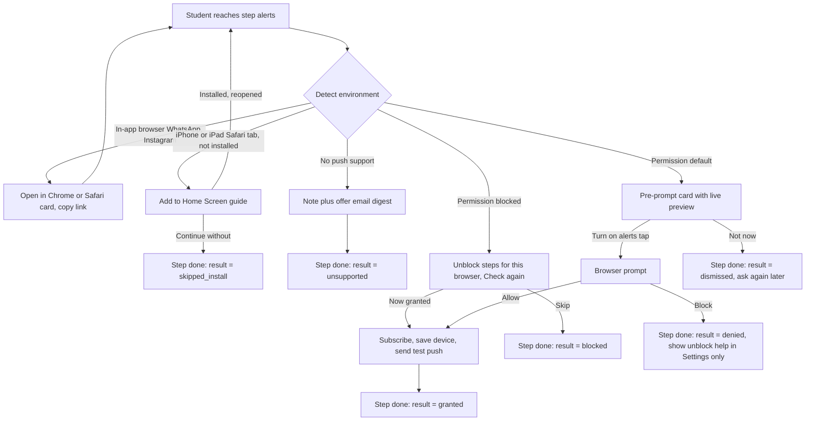
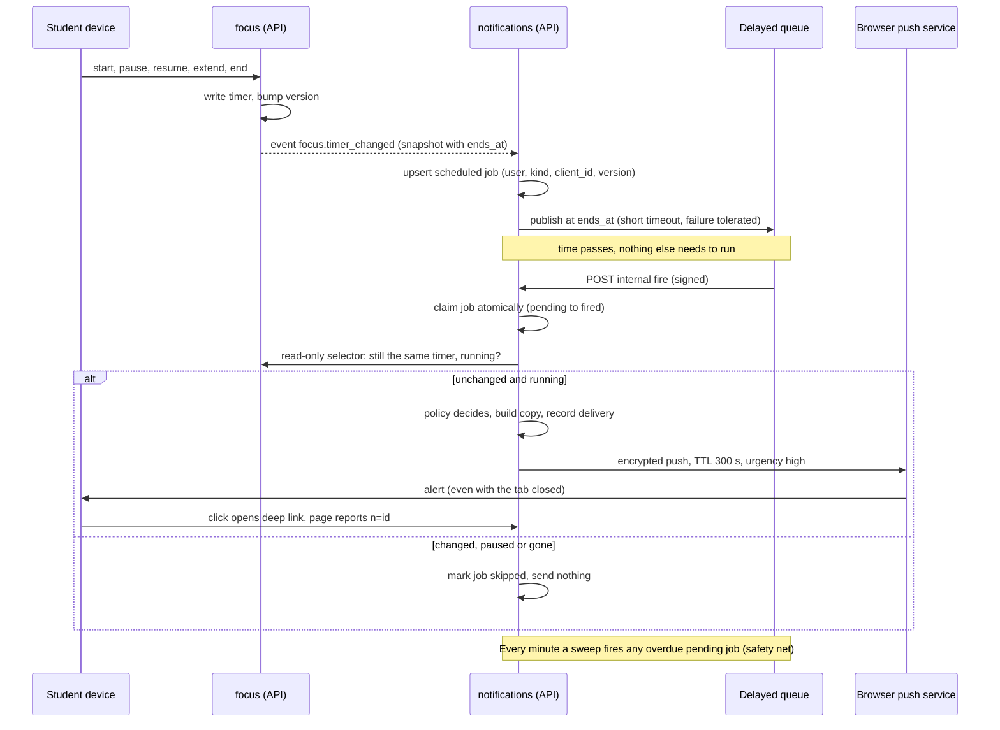
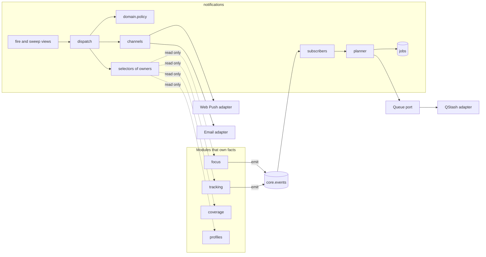

# PRD: X-01.1 Push Notifications (build-ready, phase-wise)

| Field | Value |
| --- | --- |
| Status | Draft for founder review (2026-10-06) |
| Owner | Pawan |
| Last updated | 2026-10-06 |
| Source | `docs/product/FEATURE_MAP.md` section X-01, and PRD A in `prd/X-01-notifications-floating-timer-stay-awake.md` (approved 2026-10-06) |
| Linked ERD | `docs/product/erd/X-01.1-push-notifications.md` |
| Runbook | `docs/X-01-ROLLOUT.md` (exact steps and commands, phase by phase) |
| Builds on | F-01.1 Pomodoro, F-01.2 Time Tracker, F-16 Personalization and onboarding, F-02 Coverage |

## 0. How this document relates to the approved X-01 document

The approved X-01 document stays the source for the **floating timer** (its PRD B, phase P4), **keep awake** (PRD C) and the **desktop companion** (P5). This document takes **PRD A (push and reach)** and makes it buildable: module boundaries, delivery pipeline, failure handling, waves that fit one pull request each, and the exact flags, secrets and commands.

Where the two documents differ, this one wins for push, and the combined documents carry a banner that points here. Everything decided on 2026-10-06 (D1 to D7) is kept.

**Phase numbering used everywhere (the diagram in the approved document):**

| Phase | Name | Weeks (estimate) | Flag |
| --- | --- | --- | --- |
| P1 | Spikes on real devices | 1 | none |
| P2 | Alerts core: timer-end push, permission step, settings, devices, keep awake (in-app) | 2 to 6 | `push_notifications`, `keep_awake` |
| P3 | More alerts: inbox, tracker alerts, daily thought and nudge, revision, exam, content, weekly email, Android buttons | 7 to 9 | `push_notifications` (per-event kill switch) |
| P4 | Floating timer (pop-out, installed app) | 10 to 11 | `floating_timer` |
| P5 | Desktop companion, only if the gate passes | 4 to 6 on its own | `desktop_companion` |

The tier table in the approved PRD B uses an older numbering in its "Phase" column (installed app = 1, pop-out = 2, companion = 3). It means P2, P4 and P5 above. Fix it when that document is next edited.

### 0.1 What the code review found (and what this document changes because of it)

Each row was checked against the repository on 2026-10-06. These are the reasons the design below is shaped the way it is.

| # | Finding in the code | Consequence for the design |
| --- | --- | --- |
| C1 | `focus` and `tracking` emit **no** events today (`core/events.emit` is used only by `coverage`). | A first wave must add one announcing function per module, so every timer mutation publishes exactly one `timer_changed`. Tested by a parametrised test over every public service action. |
| C2 | The timer settles **lazily**: after a round ends, the `focus_activetimer` row stays unchanged until some request reads it (`_settle`). | The job that fires at the end time must be a **read-only judge** computed from timestamps (`phase_end_at`). It must never call `sync` or `_settle`, which write. |
| C3 | `overtime_enabled` is on by default: a focus round that reaches its planned length **keeps running** until the student stops it. | The alert at the planned end says "Round target reached", not "Round done". Copy depends on the timer snapshot (`overtime_enabled`), not only on the phase. |
| C4 | A hidden tab stops the heartbeat. If the tab was not seen within two minutes of the end, the round becomes `away_pending` and the break does **not** start until the student answers "Did you study through that round?". | The push still fires (that is the whole point), links to `/app/focus`, and the dialog does the rest. A "break over" push is planned only when a break phase actually begins (an event), never chained ahead of time. |
| C5 | `core.feature_flags.flag_enabled` **fails open** (PostHog down means on). | Sending needs the opposite. Add a strict mode, and a second kill switch that does not depend on PostHog: the environment value `NOTIFICATIONS_ENABLED`. |
| C6 | `core/events.emit` is **synchronous** and swallows subscriber errors. | The subscriber only upserts a job row and makes one short queue call. A queue failure never fails the student's write; the per-minute sweep picks up the job. |
| C7 | The Supabase Data API is disabled for the whole project (`docs/SETUP.md` 2.4) and CI runs plain `postgres:16`, which has no `auth.uid()`. | The inbox bell **polls** through Django (every 60 seconds, on focus, and after a worker message) instead of using Realtime, so no student-facing policy is needed in this release. If Realtime is added later, its migration must be guarded on schema `auth` (ERD section 7). |
| C8 | The API has no outgoing email path. SMTP exists only inside Supabase Auth. | The weekly email (P3, decision D6) needs a small `channels/email.py` and SMTP settings for Django, using the provider already chosen in `docs/SETUP.md` 2.3.1. |
| C9 | The approved ERD has a unique key over a **nullable** `expected_version`, and a unique index on an **encrypted** `endpoint`. In Postgres, NULLs are distinct, and encrypted text with a random nonce never matches. | `expected_version` becomes `NOT NULL DEFAULT 0`; the device gets an `endpoint_hash` (SHA-256) for lookup. See the ERD. |
| C10 | Vercel cron on Hobby runs once a day with up to 59 minutes of drift; Pro allows once a minute (Vercel documentation, read 2026-10-06). The plan is unconfirmed. | The default sweeper becomes **Supabase pg_cron plus pg_net** (every minute, any Vercel plan). Vercel cron is the alternative if the plan is Pro. The endpoint accepts both. |
| C11 | `pywebpush` is synchronous (it uses `requests`); current release 2.5.0 (29 Aug 2026). The QStash Python SDK is 3.4.0 and verifies signatures with current and next signing keys. | Both libraries live behind one small adapter file each, so they can be replaced without touching business code. |

## 1. Problem and goal

A student starts a 25-minute round, switches to a PDF or a book app, and has no idea the round has ended until they come back to the site. The same gap hits revision reminders, goals and new content: today the product can only speak while a page is open.

**Goal.** Every time-critical moment reaches the student on the device they are holding, within five seconds of the moment, whichever app is in front. Everything else (reminders, nudges, content) stays useful, capped, quiet at night and easy to control. Nothing in the product depends on the permission being granted.

## 2. Users and scenarios

1. **Riya, CA Inter, Android phone, Chrome.** She starts a 25-minute round on the Artha tab, opens her ICAI PDF in another app and puts the phone down. At 25:00 her lock screen shows "Round 2 done. Take 5". She taps it, lands on `/app/focus` and starts the break. If she had ignored it, the inbox would still list it.
2. **Arjun, CMA Foundation, iPhone, opened Artha from a WhatsApp link.** The link opens inside WhatsApp's browser, where push cannot work. The alerts step says "Open in Safari", then shows the three-picture "Add to Home Screen" guide, and only after that asks for permission. He taps "Not now" once, and sees a calm line saying what he will miss. Two weeks later, right after his first finished round, he is asked once more.
3. **Meera, CS Executive, laptop, Edge.** She blocked notifications for every site last year. The step detects "blocked", shows the two taps to undo it for Edge and a "Check again" button, and lets her continue. At 22:30 a revision reminder is held until 07:00, but the timer-end alert at 23:10 is delivered because she started that timer herself.

## 3. Success metrics

Targets are starting hypotheses, recalibrated after four weeks of data. Every event is named `noun_verb` and sent through the existing PostHog setup (web) or logged with a structured line (API, see section 11).

| Measure | Target | Event or source |
| --- | --- | --- |
| Students who answered the alerts step | 95% of onboarding completions | `alerts_step_completed` (result) |
| Allow rate among students shown the browser prompt | track, hypothesis 60% | `push_permission_result` |
| Timer-end push delivered within 5 s of the end time | p95 at or under 5 s, p99 at or under 15 s | API log `push_sent` (`lateness_ms`) |
| Pushes accepted by the push service | 98% or better, per 15-minute window | `push_sent` (status) |
| Duplicate alerts for one timer end (local plus push) | 0 | `push_sent` with `tag`, tab-side `local_alert_shown` |
| Students who return within 10 minutes of a timer-end push | track | `push_clicked` |
| Students who switch off any category in the first 14 days | below 20% | `notification_pref_changed` |
| Pushes sent per student per day (non-timer) | at most 3, always | `push_sent` aggregate, `push_suppressed` (cap) |
| Dead devices still in the table after 7 days | under 2% | `push_device_revoked` (reason) |

## 4. Scope

**In scope**

- P1 spikes; P2 alerts core with keep awake in the app; P3 more alerts (inbox, tracker, daily thought and nudge, revision, exam countdown, content, weekly email, Android buttons).
- The notification pipeline as a reusable platform: catalogue, policy, channels (Web Push now, email in P3), scheduling port, jobs, deliveries, inbox.
- The service worker, manifest icons and the install prompt required for push on iPhone.
- Settings, device list, test push, onboarding step `alerts`, account export and erase.

**Out of scope (later)**

- Floating timer and pop-out (approved PRD B, P4), desktop companion (approved PRD C, P5). Their only touch points with this document are the device list (a companion registers as a device) and the shared `tag`.
- WhatsApp and SMS channels, native phone apps, rich images in pushes, A/B tests of copy, AI-written messages.
- Marketing or promotional pushes. This pipeline is for study-related, student-chosen alerts only.

## 5. User flows

### 5.1 Permission step (onboarding step `alerts`, `since = 3`)



Follow-up asks: after a "Not now", at most two more asks, 14 days apart, only right after a finished round. A blocked state is never nagged; Settings shows how to fix it.

### 5.2 Timer-end push



### 5.3 Edge cases every wave must handle

| Case | Behaviour |
| --- | --- |
| First time, no devices | Settings shows "No device yet" with the enable button; sends record `suppressed: no_device`; the inbox (P3) still lists the item |
| Permission revoked in browser settings | Next send returns 404 or 410 and the device is revoked; the next settings visit shows the state as blocked |
| Student on two devices | Both get the push; both show the same `tag`, so each device shows one alert; the first click marks it read for both |
| Timer paused one second before the end | Job is skipped (version changed or paused); nothing is sent |
| `+5 minutes` added | New version, new job at the new end, old job skipped when it fires |
| Round target reached with overtime on | Alert says the target is reached and the round is still running; link opens `/app/focus` |
| Student away (hidden tab, no heartbeat) | Alert is sent; opening the app shows the existing "Did you study through that round?" dialog |
| Queue provider down at timer start | Job row exists; the sweep sends it within 60 seconds; lateness is logged |
| Push service answers 429 or 5xx | Retry up to three times inside the TTL, then record `failed` and keep the device |
| Device endpoint changes (browser rotates it) | The service worker re-subscribes on `pushsubscriptionchange` and registers again; the old row is removed by hash |
| Offline when changing settings | Reuse the tracker offline banner and queue; settings are idempotent PUTs |
| Feature flag off or kill switch on | No sends, no scheduling; the step, bell and settings disappear; timers work as today |
| Student deletes the account | One registered eraser removes every table row; queued messages find no user and are skipped |

## 6. Functional requirements

Priorities: P0 must ship in its wave, P1 same phase if time allows, P2 may slip a phase. **Wave** is the pull-request slice defined in section 13. IDs FR-N1 to FR-N14 are the approved ones from the X-01 document; FR-N15 onwards are added by this document. Given, When, Then are shortened to a single acceptance check.

| ID | Requirement | Priority | Wave | Acceptance check |
| --- | --- | --- | --- | --- |
| FR-N1 | Service worker and web manifest (192 px, 512 px and maskable icons, `id`, `scope`) make the app installable and able to receive push | P0 | W2.4 | Chrome offers Install; a push shows with the tab closed |
| FR-N2 | Onboarding step `alerts` with the branches in 5.1, resumable, URL-driven (`?step=alerts`) | P0 | W2.5 | Each branch reachable by keyboard; refresh keeps the state |
| FR-N3 | Push subscription saved per device, idempotent on the endpoint hash, pruned on 404 or 410 | P0 | W2.2 | Subscribing twice leaves one row; a revoked device is removed after the next send |
| FR-N4 | Timer-end push at the computed end time, re-validated when the job fires | P0 | W2.3 | Paused one second before the end sends nothing; +5 minutes moves the alert |
| FR-N5 | Local alert and push share one `tag` per timer end | P0 | W2.5 | With the tab visible and push on, one alert is visible |
| FR-N6 | Notification click opens the deep link and focuses an existing tab if one is open | P0 | W2.4 | Click lands on `/app/focus` with the away dialog if needed |
| FR-N7 | Preferences by category and channel, quiet hours, time zone, daily cap | P0 | W2.1, W2.4 | A disabled category never sends; quiet hours defer non-exempt pushes |
| FR-N8 | In-app inbox with unread count; every notification also lands there | P1 | W3.1 | A push missed on the phone is readable in the inbox |
| FR-N9 | Daily thought card on the first open of the local day, once | P1 | W3.3 | Reload does not show a second message that day |
| FR-N10 | Daily nudge push only when the student has not opened the app that day | P1 | W3.3 | A student who visited at 09:00 gets no 10:00 push |
| FR-N11 | "Send me a test" in onboarding and Settings, plus a device list with Remove | P1 | W2.2, W2.4 | Test arrives in under 5 s on a healthy device |
| FR-N12 | Android notification buttons (Pause, +5 min) calling the API with a one-time token | P2 | W3.6 | Pause from the notification stops the timer; the token cannot be reused |
| FR-N13 | Email fallback for categories the student keeps when push is unavailable | P2 | W3.5 | A student with no device receives the weekly email |
| FR-N14 | Fail open for the product, fail closed for sending | P0 | W2.1 | Flag off leaves the app fully usable; PostHog down sends nothing new |
| FR-N15 | Two kill switches: environment `NOTIFICATIONS_ENABLED` (master, read at start-up, default off) and PostHog flag `push_notifications` in strict mode (unknown, error or missing means off for sending) | P0 | W2.1 | Flag to 0% stops scheduling and sending within about a minute; env false stops them from the next deployment. Both leave the rest of the app untouched |
| FR-N16 | Internal endpoints (`internal/jobs/{id}/fire/`, `internal/sweep/`) accept only a valid QStash signature or the cron secret, compared in constant time; they have no student auth and are excluded from CORS | P0 | W2.3 | Wrong or missing signature returns 401 and does nothing |
| FR-N17 | A job is claimed with one atomic update (`pending` to `fired`) so a queue retry racing the sweep cannot send twice | P0 | W2.3 | Two concurrent fires of one job produce one delivery |
| FR-N18 | The judge is read-only: `focus` exposes one selector that answers from timestamps without settling; copy depends on phase, overtime and away state | P0 | W2.3 | The timer row is byte-identical before and after a fire |
| FR-N19 | One announcing function per module (`focus` in W2.3, `tracking` in W3.2); every public mutation emits exactly one `timer_changed` (or `stopwatch_changed`, `goal_reached`) | P0 | W2.3 | A parametrised test covers every service action |
| FR-N20 | Push endpoint and keys are encrypted at rest (rotating keys), looked up by SHA-256 `endpoint_hash`, never returned by any API, excluded from export | P0 | W2.2 | Database dump shows no readable endpoint; rotating the key keeps old rows readable |
| FR-N21 | Exempt (timer) pushes older than 5 minutes at send time are dropped and recorded `suppressed: stale` | P0 | W2.3 | A job fired 6 minutes late sends nothing |
| FR-N22 | Device health: 404 or 410 revokes at once; five consecutive failures over at least 7 days revoke; success resets the count | P0 | W2.2 | Unit tests on the pure health rule |
| FR-N23 | Observability: structured `push_sent`, `push_suppressed`, `push_failed`, `job_fired`, `job_skipped` log lines, Sentry tag per event type. Each sweep run checks the last 15 minutes of deliveries against the 98% acceptance and 5 s lateness targets and logs an error `push_slo_breach` that a Sentry alert rule watches | P0 | W2.7 | Dashboard and alert rule exist before the first 5% rollout step |
| FR-N24 | Retention job prunes deliveries (90 days), notifications (180), jobs (30), revoked devices (30), action tokens (1), in batches of at most 1000 rows | P1 | W2.7 | Re-running the job is a no-op; it never holds a lock longer than a second |
| FR-N25 | Eraser and exporter registered in `core.registry`; account delete leaves no row in any `notifications_*` table | P0 | W2.1 | Test creates one row per table, erases, counts zero |
| FR-N26 | Consent and withdrawal: record the decision, source and time; purpose text on the step; withdrawal by master switch or device Remove takes effect on the next send | P0 | W2.1, W2.5 | Remove device then fire a job: no send |
| FR-N27 | Throttles: `notifications_write` 60/min, `notifications_test` 5/min, `notifications_read` 120/min per student | P0 | W2.2 | Sixth test push in a minute returns 429 |
| FR-N28 | Deep links are relative paths checked against an allow-list of route prefixes; `?n=<id>` marks read and clicked after sign-in | P0 | W2.2, W2.4 | `//evil.example` and `https://...` are rejected at creation |
| FR-N29 | Dedupe keys exactly as the table in section 9.3; the same key never creates a second notification | P0 | W2.1 | Replaying an event leaves one row |
| FR-N30 | Service worker is versioned (`SW_VERSION` in payload logs), served `no-cache`, updates itself on next load, and contains no page caching in this release | P0 | W2.4 | Deploying a new `sw.js` is picked up within one visit |
| FR-N31 | Test seams: `NullQueue` records calls, `FakeChannel` records sends, no test touches the network | P0 | W2.1 | `pytest` passes with networking disabled |
| FR-N32 | Per-event kill switch through `NOTIFICATIONS_DISABLED_EVENTS` (comma list) without a deploy of code | P1 | W2.1 | Listing `daily_nudge` stops that event only |
| FR-N33 | Deferred delivery: a push held by quiet hours is sent at the end of the window, or dropped if its `expires_at` has passed | P1 | W3.2 | A 23:00 goal alert arrives at 07:00 or never, per expiry |
| FR-N34 | Fatigue control: after five consecutive unclicked pushes over at least 3 days, offer "Switch to a daily digest" once per 30 days | P2 | W3.7 | Offer shown once; choosing it switches categories to inbox plus one digest |
| FR-N35 | If the Safari spike (S3) passes, add the declarative push fields beside the worker payload | P2 | W2.7 | Alert shows on iOS 18.4 with the worker disabled |

## 7. Screens and URLs

| Screen | URL | Notes |
| --- | --- | --- |
| Alerts onboarding step | `/app/onboarding?step=alerts` | Private, `noindex`, one `h1`, focus moves to it on change, works in all four themes |
| Notification settings | `/app/settings/notifications` | Three cards plus devices (layout in the approved UX section). Blocked state shows unblock steps, never a dead switch |
| Inbox (P3) | `/app/notifications` | Bell with count in the app header (polls); cursor-paginated list; mark all read |
| Notification landing | any allow-listed route with `?n=<id>` | The page marks the item read; the parameter is removed from the URL after it is handled |

Design: the mockups for the pre-prompt, the notification style table and the states table are in the approved X-01 document under "UX and UI direction" and are the design source here. Components come only from `@artha/design-system`. Before building, check what exists and add what is missing to the design system, never in the module: a switch, a card, a skeleton, the F-16 toast, a time field, a status chip and the bell icon (Lucide). Follow `.claude/skills/ui-quality-checklist` (four themes, WCAG 2.2 AA, 320 to 1280 px) and `.claude/skills/ux-aha-moments`.

## 8. Data and permissions

Entities (details, columns and indexes in the ERD): `notifications_settings`, `notifications_preference`, `notifications_device`, `notifications_notification`, `notifications_delivery`, `notifications_scheduledjob`, `notifications_message`, `notifications_messageshown`, and `notifications_actiontoken` (P3). Five new columns in `focus_focussettings` belong to keep awake and the pop-out (their own waves).

| Who | Can do |
| --- | --- |
| Student | Read and change only their own settings, preferences, devices and notifications, through Django. Nothing is read directly from the database by the browser; the Data API stays disabled |
| Queue and scheduler | Call the two `internal/` endpoints with a signature or secret. No student identity |
| Content editor (Django admin) | Create, edit, publish and retire motivation messages. Read-only views of everything else |
| Support | Read-only admin views; can see device label, platform and last seen, never endpoint or keys |

Privacy: the push endpoint and keys can send to a device, so they are secrets (encrypted, never exposed, never logged, never exported). Notification text can reveal study habits, so it is shown only on the student's own devices and inbox. Purpose text on the step says what we send and that it can be turned off at any time. Retention is in section 11. Under India's DPDP Act consent must be freely given and withdrawable: this design records the decision and makes withdrawal one tap (please have counsel confirm the wording; this is not legal advice).

## 9. API surface and module design

### 9.1 Layering and dependency direction

The rules from `CLAUDE.md` apply unchanged: views to services (writes) to selectors (reads) to models on the API; routes to containers to presentational components on the web; other modules only through their public barrel or public service and selector functions.



Owners never import `notifications`. `notifications` reads owners only through their public selectors. The two external services (push services, the delayed queue) are reached only through one adapter file each, so tests use fakes and a provider change touches one file.

**API module `apps/api/modules/notifications`**

| Path | Responsibility | Rule |
| --- | --- | --- |
| `models.py` | Tables only | No logic |
| `domain/` (`catalogue.py`, `policy.py`, `quiet_hours.py`, `dedupe.py`, `deeplinks.py`, `nudge.py`, `copy.py`, `device_health.py`) | Pure functions and frozen dataclasses | No Django, no I/O, 100% unit tested, time passed in as an argument |
| `services/` (`settings.py`, `preferences.py`, `devices.py`, `inbox.py`, `notify.py`; job writes live in `scheduling/jobs.py`) | All writes, each in a transaction | The only place that changes rows |
| `selectors/` | All reads and serialisation helpers | No writes |
| `channels/` (`base.py`, `webpush.py`, `email.py`) | One `Channel` protocol: `send(device_or_address, message) -> SendResult` | Only `webpush.py` imports `pywebpush`; only `email.py` sends mail |
| `scheduling/` (`queue.py`, `auth.py`, `jobs.py`, `sweep.py`) | `queue.py`: `DelayedQueue` protocol (`publish(job_id, fire_at)`, `cancel(external_id)`), `NullQueue`, `QStashQueue` and the QStash signature verifier. `auth.py`: queue signature and cron secret checks. `jobs.py`: plan, cancel and fire (atomic claim). `sweep.py`: the bounded sweep, a list of steps | Only `queue.py` imports `qstash` |
| `subscribers.py`, `handlers.py`, `logs.py` | Turn events into jobs (the planner is `scheduling/jobs.py`); map a job kind to a handler (event key and read-only judgement) through a registry; structured log helper | Subscribers are tiny: validate payload, call `scheduling.jobs` |
| `dispatch.py` | Load, judge, decide, send, record. The one pipeline every notification passes through | No business rules inline; asks `domain.policy` |
| `views/` (`settings.py`, `devices.py`, `inbox.py`, `thought.py`, `internal.py`) | Thin: serializer in, service or selector call, serializer out | No logic |
| `serializers.py`, `urls.py`, `admin.py`, `apps.py` | DRF validation, routes, message library admin, registration of subscribers, handlers, channels, eraser, exporter | `apps.py` is the only wiring file |
| `management/commands/` | `load_motivation_seed`, `prune_notifications`, `send_test_push` | Idempotent |
| `tests/` | One file per concern, plus an RLS test | No network |

**Web module `apps/web/src/modules/notifications`**

| Path | Responsibility |
| --- | --- |
| `components/` | Presentational only, props in, events out: `AlertsPreCard`, `InstallGuide`, `UnblockSteps`, `CategoryGrid`, `QuietHoursForm`, `DeviceList`, `NotificationPreview`, later `InboxList`, `BellButton` |
| `containers/` | State and data: `AlertsStepContainer`, `SettingsContainer`, later `InboxContainer`, `BellContainer` |
| `hooks/` | `usePushSubscription`, `useNotificationSettings`, `useDevices`, `usePermissionState`, later `useInbox` |
| `lib/` | `platform.ts` (environment detection, pure), `push.ts` (subscribe helpers), `api.ts` (typed client), `schemas.ts` (Zod), `analytics.ts` (event names), `quietHours.ts` |
| `index.ts` | The only public surface |
| `apps/web/src/sw/` | Service worker source in TypeScript (`sw.ts`, `handlers.ts`, `payload.ts`) with unit tests; compiled by `pnpm --filter @artha/web build:sw` into `public/sw.js` (generated, not committed) |

### 9.2 Endpoints

Base path `/api/v1/notifications/`. Student endpoints use the Supabase JWT and the project error shape; each has a serializer and tests. Mutations are idempotent.

| Method and path | Purpose | Notes | Wave |
| --- | --- | --- | --- |
| GET, PUT `settings/` | Master switch, time zone, quiet hours, nudge time and tone | 400 on invalid time or unknown IANA zone; defaults until the first write; reading never writes | W2.1 |
| GET `categories/` | Catalogue merged with the student's overrides | Defaults live in code | W2.1 |
| PUT `preferences/` | Bulk change of category and channel switches | Unknown category or channel is a 400 | W2.1 |
| POST `permission-state/` | Record the browser result or a decision to skip | `state`, `source`; sets `permission_decided_at`; counts asks | W2.1 |
| POST `devices/` | Register or refresh a subscription | Idempotent on `endpoint_hash`; endpoint host must be on the push-service allow-list; returns `device_id` only | W2.2 |
| GET `devices/` | List devices | Label, platform, browser, display mode, last seen. No secrets | W2.2 |
| DELETE `devices/{id}/` | Remove a device | Own devices only; 404 otherwise | W2.2 |
| POST `devices/{id}/test/` | Send a real test push | Throttle `notifications_test` | W2.2 |
| POST `inbox/{id}/click/` | Mark read and clicked after a deep link | Called by the page when `?n=` is present; own notification only (404 otherwise), idempotent, 204 | W2.3 |
| GET `inbox/`, POST `inbox/read/` | List (cursor, last 50) and mark read | Own rows only. List answers `{results, next_cursor, unread_count}` and leaves out expired items and categories switched off for the inbox; read takes `{ids}` (max 50) or `{all: true}` and answers `{unread_count}` | W3.1 |
| GET `thought/today/` | Today's message for the first open of the local day | Idempotent per local date | W3.3 |
| POST `actions/` | Perform a notification button action | One-time token in the body | W3.6 |
| POST `internal/jobs/{id}/fire/` | Fire one job | Valid QStash signature required; 200 for skipped jobs so the queue does not retry; 5xx only for transient errors | W2.3 |
| GET and POST `internal/sweep/` | Safety net: fire overdue jobs, send due nudges and digests, prune | Bearer cron secret required; GET exists for Vercel cron, POST for pg_cron; both idempotent; bounded run time | W2.3 |

Errors use the existing shape from `core/exceptions.py`. New codes: `notifications_disabled` (403, flag or kill switch), `device_limit` (409, more than 10 active devices), `invalid_endpoint` (400), `invalid_deep_link` (400).

### 9.3 Events, priorities and dedupe keys

Event keys are the machine names used in code, logs and `NOTIFICATIONS_DISABLED_EVENTS`. Priority 0 is exempt from quiet hours and the daily cap; 3 is lowest. Categories, triggers and defaults are the approved table in the X-01 document.

| Event key | Category | Priority | Dedupe key | Source | Wave |
| --- | --- | --- | --- | --- | --- |
| `timer_end` | timer | 0 | `timer_end:{client_id}:{version}` | `focus.timer_changed` | W2.3 |
| `break_over` | timer | 0 | `timer_end:{client_id}:{version}` | `focus.timer_changed` (break phase) | W2.3 |
| `stopwatch_long` | tracker | 1 | `stopwatch_long:{client_id}` | `tracking.stopwatch_changed` | W3.2 |
| `goal_reached` | tracker | 1 | `goal:{local_date}` | `tracking.goal_reached` | W3.2 |
| `streak_at_risk` | tracker | 1 | `streak:{local_date}` | sweep, `tracking.selectors.streak` | W3.2 |
| `daily_nudge` | motivation | 3 | `nudge:{local_date}` | sweep, `next_nudge_at` | W3.3 |
| `revision_due` | revision | 2 | `revision:{local_date}` | sweep, `coverage.selectors.due_for_revision` | W3.4 |
| `exam_milestone` | exam | 2 | `exam:{days_left}` | sweep, enrolment exam date | W3.4 |
| `content_published` | content | 3 | `content:{item_id}` | event from the publishing module (later) | W3.4 |
| `evaluation_ready` | evaluation | 1 | `evaluation:{attempt_id}` | `notify()` from F-07 (later) | later |
| `plan_ready` | plan | 2 | `plan:{local_date}` | `notify()` from F-13 (later) | later |
| `weekly_summary` | progress | 3 | `weekly:{iso_week}` | sweep, email channel | W3.5 |

**Public interface for modules that cannot emit an event** (for example an evaluation that finishes inside a background job): `notifications.services.notify(user_id, event_key, *, context, dedupe_ref)`. The event key must exist in `domain/catalogue.py`. This keeps caps, quiet hours and categories decided in one place; adding an event means one catalogue entry, one copy builder and tests, nothing else.

### 9.4 Payload (version 1)

```json
{
  "v": 1,
  "id": "<notification id>",
  "category": "timer",
  "title": "Round 2 done",
  "body": "25 minutes on GST. Take 5, you earned it.",
  "tag": "timer:<client_id>",
  "url": "/app/focus?n=<notification id>",
  "actions": [{"id": "break", "title": "Start break"}, {"id": "extend", "title": "+5 min"}]
}
```

The payload never contains the push keys or personal data beyond the student's own study text, stays under 3 KB (the limit of push services is about 4 KB), and is versioned so an old service worker ignores fields it does not know. The worker always shows a notification for every push (browsers require it) using `tag` so a second alert for the same moment replaces the first; `renotify` stays false.

## 10. Notifications and analytics events

Web events (PostHog, through `/ingest`) use `noun_verb`. Server facts are structured log lines (also shipped to Sentry breadcrumbs) because the student's browser cannot report what it never received.

| Where | Event | Properties |
| --- | --- | --- |
| Web | `alerts_step_viewed`, `alerts_step_completed` | `result` (granted, denied, dismissed, skipped_install, blocked, unsupported), `platform`, `display_mode` |
| Web | `push_permission_prompted`, `push_permission_result` | `result`, `source` (onboarding, followup, settings) |
| Web | `push_test_requested`, `push_device_removed` | `platform` |
| Web | `notification_pref_changed` | `category`, `channel`, `enabled` |
| Web | `push_clicked`, `inbox_opened` | `category`, `seconds_since_sent` |
| Web | `local_alert_shown` | `tag`, used to prove no duplicate with push |
| API log | `push_sent` | `event`, `category`, `device_kind`, `status`, `http_status`, `lateness_ms`, `attempt`, `sw_version` |
| API log | `push_suppressed` | `event`, `reason` (preference, quiet_hours, cap, no_device, stale, visited_today, flag_off) |
| API log | `push_failed`, `push_device_revoked` | `event`, `http_status`, `reason` |
| API log | `job_fired`, `job_skipped`, `sweep_run` | `kind`, `reason`, `overdue_ms`, `fired`, `skipped`, `duration_ms` |

No log line contains an endpoint, key, token or notification body.

## 11. Non-functional requirements

| Area | Requirement |
| --- | --- |
| Latency | Fire handler p95 under 800 ms excluding the push call; push call timeout 5 s per device; at most 10 active devices per student; push p95 5 s after the end time |
| Reliability | Queue delivery is at least once; every handler is idempotent (atomic claim, dedupe key, unique delivery per notification, channel and device). A claimed job whose work fails goes back to `pending` for up to 3 attempts (then `failed`) and the call answers 503 so the queue retries. The sweep bounds one run to 200 jobs and 20 s so a Vercel function (30 s limit in `apps/api/vercel.json`) never times out mid-batch; leftovers run next minute |
| Security | Signature or secret on `internal/`; constant-time comparison; endpoint host allow-list and `https` only, so a student cannot make the server call an arbitrary URL (SSRF); secrets encrypted with rotating keys; deep-link allow-list; no `Permissions-Policy` header may disable notifications or `screen-wake-lock` on `/app/*`; RLS on every table |
| Privacy | Section 8. Export lists device label, platform and dates only. Retention: deliveries 90 days, notifications 180, jobs 30, revoked devices 30, action tokens 1 |
| Accessibility | WCAG 2.2 AA: one `h1` per step, polite live region for status, pre-prompt is a page not a trapping modal, no meaning by colour alone, reduced motion removes the tick animation, all four themes pass `pnpm check:contrast` |
| Compatibility | Android Chrome, desktop Chrome, Edge, Firefox, Safari (macOS 13+), iPhone and iPad Home Screen apps (iOS 16.4+). Matrix tested on real devices before the 25% step. Browser versions are re-checked in P1 |
| Cost | Push services are free. The delayed queue is billed per message: about one message per timer start. Estimate for 10,000 daily students with 40% using the timer six times a day is about 24,000 messages a day; confirm against the provider's current plan before launch. Email is billed by the provider (weekly summary only) |
| Scale | Estimate at 10,000 daily students: about 60,000 notifications a day, about 5 million delivery rows at 90 days. Fine on Postgres with the indexes in the ERD; revisit monthly partitioning above about 50 million rows |
| Dependencies | `pywebpush` 2.5.x, `qstash` 3.4.x, `cryptography`; pinned with upper bounds in `requirements.txt` (see runbook). Each behind an adapter |
| i18n | All copy built in `domain/copy.py` from keys, English first, so Hindi or Hinglish can follow without touching logic |

## 12. Risks and open questions

Risks are the approved table in the X-01 document (Block taps, iPhone install friction, in-app browsers, Android battery savers, single queue, fatigue, privacy). Added by this document:

| Risk | Effect | Mitigation |
| --- | --- | --- |
| Lazy settle misunderstood during build | A judge that settles would change timers silently | FR-N18 read-only selector, plus a test that compares the row before and after |
| Double send from queue retry racing the sweep | Student gets two alerts | FR-N17 atomic claim, unique delivery key |
| Flag service outage floods or silences | Spam or silence | Strict mode and env kill switch (FR-N15) |
| Secret leak through logs or exports | Anyone can push to a device | FR-N20, no secrets in logs (section 10), export excludes them |
| Free-tier or plan limits of the queue | Alerts stop at scale | Cost line in section 11, sweep as net, adapter allows a swap |
| Hobby plan cron drift | Late nudges | pg_cron sweeper by default (C10) |

**Open questions, each with a recommended default (proceed with the default unless you say otherwise)**

| # | Question | Default |
| --- | --- | --- |
| Q1 | Is the Vercel plan Pro? | Not needed: sweeper is Supabase pg_cron. Vercel cron stays an option |
| Q2 | External delayed queue (QStash) or Supabase Queues (pgmq) for exact timing? | QStash behind the `DelayedQueue` port; re-decide after spike S5 |
| Q3 | Email sender for the weekly summary | The SMTP provider already chosen in `docs/SETUP.md` 2.3.1, configured in Django as well |
| Q4 | Cap exception: may priority 0 and 1 use a fourth slot a day? | Priority 0 exempt; priority 1 may use one extra slot; priorities 2 and 3 stop at three |
| Q5 | Author the service worker in TypeScript compiled by esbuild (testable) instead of a hand-written `public/sw.js` (the approved wording)? | Yes; output is still a single file served at `/sw.js` |
| Q6 | Field encryption with Fernet and rotating keys in an environment value, or database-level encryption? | Fernet (`MultiFernet`) in a shared `core/fields.py`, reusable by later modules |
| Q7 | Copy language | English first; Hindi or Hinglish later, no code change |
| Q8 | When the tab is visible, should the worker skip showing the push? | No: always show with the shared `tag`, since Safari requires it; confirm in spike S4 |
| Q9 | Hard cap of active devices | 10 per student |
| Q10 | Who edits notification copy for system events (not the motivation library)? | Code owners through pull requests; only the motivation library is editable in admin (approved D5) |
| Q11 | Use Supabase Realtime for an instant bell? | No for now: polling needs no policy and keeps the Data API disabled. Revisit if the 60 s delay is felt |

## 13. Rollout: phases, waves and gates

Every wave is one pull request (or two when the API and web halves are independent), behind its flag, with the definition of done in 13.3. Durations are estimates for one full-stack engineer with design support; the keep-awake wave W2.6 is independent and can run in parallel.

### 13.1 Waves

| Wave | Goal | API (module) | Web | Tests (must exist) | Commit scope | Days |
| --- | --- | --- | --- | --- | --- | --- |
| P1 | Spikes S1 to S7 (runbook phase 1) | none | throwaway page in a temp folder | written results in `docs/X-01-spike-results.md` | `docs` | 5 |
| W2.1 Foundation | Module, tables, pure domain, settings, categories, preferences, permission state, flags, kill switches, eraser, exporter | `notifications` skeleton, models, migrations 0001, `domain/*`, `services/settings`, `services/preferences`, strict flag helper in `core/feature_flags.py`, `core/fields.py` (encrypted field) | none | policy, quiet hours across midnight and DST, dedupe, deep links, device health, endpoint tests, erase and export, RLS enabled | `feat(api)` | 4 |
| W2.2 Delivery | Devices, Web Push channel, test push, secrets | `services/devices`, `channels/base.py`, `channels/webpush.py`, `dispatch.py` (without scheduling), device endpoints, throttles, push-host allow-list | none | adapter tested with a fake HTTP layer, 404 and 410 revoke, 429 retry, encryption round trip | `feat(api)` | 4 |
| W2.3 Timer pipeline | Events, queue, jobs, judge, fire, sweep | `focus/events.py` announcer and `focus.selectors.timer_end_judgement`, `scheduling/*`, `subscribers.py`, `handlers.py`, `internal` views, signatures, `POST inbox/{id}/click/` (moved here from W2.4); the `tracking` announcers move to W3.2 with the alerts that use them | none | one event per mutation, stale and paused skip, atomic claim, overdue sweep, signature, read-only judge | `feat(api)` | 6 |
| W2.4 Web foundation | Service worker, manifest, hooks, settings screen, devices, test button | none | `src/sw/*`, manifest and icons, `modules/notifications` (components, containers, hooks, lib), route `/app/settings/notifications`, `vercel.json` headers | platform detection, payload parsing, click routing, settings container, four themes, 320 to 1280 px | `feat(web)` | 5 |
| W2.5 Permission step | Onboarding step, follow-up asks, shared tag | `profiles` step registration (`since = 3`, `is_satisfied` reads settings) | `AlertsStepContainer`, install guide, unblock steps, tag in `useFocusAlerts`, follow-up ask after first round | every branch of 5.1, resumable, keyboard, no duplicate alert | `feat(web, api)` | 4 |
| W2.6 Keep awake | Screen wake lock in the app (approved PRD C, FR-K1 to K7, K10) | `focus` settings columns and serializer | `useWakeLock`, status chip, settings | hook with mocked sentinel, header check for `Permissions-Policy` | `feat(web, api)` | 2 |
| W2.7 Launch hardening | Metrics, logs, alerts, retention, device matrix, optional declarative push | `prune_notifications`, structured logs, optional payload fields | analytics events | prune idempotent, log lines have no secrets, matrix signed off | `feat(api, web)` | 3 |
| W3.1 Inbox | Inbox and bell that polls (no Realtime, no database policy) | inbox service and selector, list, unread count, mark read | `BellContainer` (60 s poll, refetch on focus, worker message), `InboxContainer`, `/app/notifications` | unread count, mark read, cursor paging, four themes | `feat(api, web)` | 3 |
| W3.2 Tracker alerts | Long stopwatch, goal, streak, deferred delivery | handlers, `tracking` announcers, deferred job | none | goal once a day, streak skipped when met, quiet-hour deferral and expiry | `feat(api)` | 3 |
| W3.3 Daily thought and nudge | Message library, thought card, nudge | `message` and `messageshown` models and admin, `load_motivation_seed`, thought endpoint, nudge handler and `next_nudge_at` | thought card on `/app` | no repeat within 60 days, nudge skipped when visited, time zone and DST | `feat(api, web)` | 4 |
| W3.4 Revision, exam, content | More providers | handlers using coverage and profiles selectors, `content_published` listener | none | one revision push a day, exam milestones only | `feat(api)` | 4 |
| W3.5 Weekly email | Email channel | `channels/email.py`, weekly handler, Django email settings, unsubscribe link | settings row | digest content, unsubscribe works, bounce handling note | `feat(api)` | 3 |
| W3.6 Android buttons | One-time token actions | `actiontoken` model, `actions/` endpoint, token service | worker `notificationclick` actions | token single use and expiry, action idempotent | `feat(api, web)` | 3 |
| W3.7 Fatigue controls | Ignore detection, digest switch, P3 hardening | ignore rule in `domain`, settings flag | the digest offer card | five-ignored rule, once per 30 days | `feat(api, web)` | 2 |

Estimate check: P2 is about 28 working days (5.5 weeks, 5 if W2.6 runs in parallel). P3 is about 22 working days (4.5 weeks), longer than the 3 weeks in the approved diagram; with one engineer, either move W3.5 and W3.6 (both P2 priority) to after the gate or accept 4 to 5 weeks.

### 13.2 Gates and staged rollout

| Gate | Before moving on, all true |
| --- | --- |
| G0 after P1 | Spike results written; wake lock, push on iPhone Home Screen and Android battery savers have a go or no-go; Q2 settled |
| G1 after W2.7 | Timer-end push p95 at or under 5 s on the team's real devices; acceptance at or above 98%; no duplicate alert; matrix signed off |
| G2 end of P2 | Staged ladder reached 100%: team only, then 5% (hold 3 days), 25% (hold 3 days), 100%. Hold if acceptance drops below 98% or opt-outs exceed 20%. Rollback is the flag to 0% (about a minute) or `NOTIFICATIONS_ENABLED=false` with a redeploy; no code deploy |
| G3 end of P3 | Opt-outs in the first 14 days under 20%, caps verified in logs (no student above three non-timer pushes in a day), nudge only to students who did not visit |
| G4 before P5 | Approved gate: 25% or more of desktop focus students use the pop-out and ask for more |

### 13.3 Definition of done for every wave

1. Follows `.claude/skills/new-feature-module`, `django-backend-layers`, `frontend-architecture`, and for screens `ui-quality-checklist` and `design-system-usage`.
2. Pure logic and every endpoint have tests; `pnpm check` and `cd apps/api && pytest && ruff check . && ruff format --check .` pass; no hook is bypassed.
3. Works in the four themes, 320 to 1280 px, keyboard only.
4. A flag or kill switch can turn the wave off without a deploy.
5. The matching section of `docs/X-01-ROLLOUT.md` is updated (what changed, what to configure, how to check, how to roll back).
6. `docs/product/README.md` state column updated when a phase ships.
