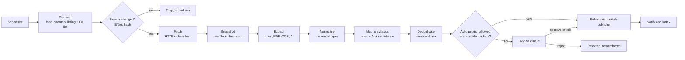

# PRD: X-04 Ingestion Service (configurable web scraping and structuring)

| Field | Value |
| --- | --- |
| Status | Draft for review |
| Owner | Pawan |
| Last updated | 4 Oct 2026 |
| Order | Third PRD/ERD (after F-02 Syllabus and F-01.1 Pomodoro), because it publishes into modules that must exist first |
| Source | `docs/product/FEATURE_MAP.md`, X-04 Content Ingestion Pipeline, and your note on a "world class scraping service for ICMAI or any teacher website" |
| Linked ERD | `docs/product/erd/X-04-ingestion-scraping-service.md` |
| Consumers | F-14 Amendments, F-08 Mock tests and MTP, F-04 Super 50, F-05 MCQ Bank, F-12 Study material, F-02 Syllabus (draft schemes), X-01 Notifications, exam calendar |

---

## 1. Problem and goal

The best preparation content and the most important news live on other websites: the institutes (ICAI, ICSI, ICMAI) publish amendments, MTPs, RTPs, exam notices and syllabus changes; teachers publish Super 50 lists and MCQs. Students miss updates, hunt across sites, and read PDFs to find "what changed". Doing this by hand does not scale.

**Goal:** build a reusable **Ingestion Service**: a configurable pipeline that watches chosen websites, fetches new or changed pages and PDFs politely, extracts structured information, maps it to our syllabus (subject, chapter, topic), puts it through a human review step, and publishes clean structured records that the rest of the platform shows to students (for example "Amendment cards", "New MTP released", "Latest Super 50 from {teacher}") with links back to the original source.

It must be a **platform capability, not a one-off script**: adding a new website is a configuration entry (plus a small parser profile when needed), not a new project. Settings, schedules, limits and review rules are changed from an admin console.

### Principles ("world class" defined)

1. **Polite and lawful.** Respect robots.txt, rate limits, terms of service and copyright. Identify ourselves. Never log in, bypass paywalls or captchas.
2. **Reliable.** Idempotent, retryable, observable. A broken site never breaks the platform.
3. **Self-aware.** Detects when a site's layout changed and stops publishing wrong data (health checks, schema validation, golden tests).
4. **Structured out.** Downstream features get typed records with confidence, source and version, not blobs.
5. **Human in the loop where it matters.** Low confidence or high impact content goes to review. Trusted, low risk content may auto-publish by explicit setting.
6. **Cheap by design.** Prefer feeds and rules; use AI only where rules fail, with a budget cap.

## 2. Users and scenarios

Primary users are **admins and editors** (you and your content team); students are indirect consumers.

**Editor Meera adds a new source.**
She opens Admin, Sources, "Add source", picks "ICMAI Announcements", pastes the listing URL, chooses crawl type "Listing page", sets "check every 6 hours", clicks "Test" and sees a preview table of the 12 items the parser found (title, date, link, type). She saves and enables it.

**An amendment PDF appears.**
ICAI publishes a new PDF of amendments for Intermediate Taxation. The service detects the new link, downloads the PDF, extracts text and tables, proposes 14 change cards ("Section 17(1) changed from X to Y, applies from term Z") each mapped to a chapter, and queues them for review. Meera approves 13, edits 1, and publishes. Students enrolled in Taxation get a notification and see affected chapters flagged "needs re-read".

**A teacher site changes its layout.**
The Super 50 page of a teacher site is redesigned. The next run extracts 0 items, the health check trips, the source is auto-paused, the admin gets an alert, and no wrong data is published. An editor updates the parser profile, tests it against saved snapshots, and resumes the source.

**A student asks for a take-down on behalf of a teacher.**
A teacher complains that their content is shown. An admin searches by source, unpublishes everything from that source in one action, and records the request.

## 3. Success metrics

| Metric | Definition | Target |
| --- | --- | --- |
| Freshness | Time from a new item appearing on a watched official source to being visible (after review) | under 24 h (official notices under 6 h) |
| Extraction precision | Reviewed items approved without edits | 85% after tuning |
| Coverage | Items found on a source versus items a human count finds (spot check monthly) | 95% |
| Mapping accuracy | Items whose suggested chapter was accepted by the reviewer | 80% |
| Reliability | Runs that finish without error per source per week | 98% |
| Politeness | robots.txt violations and 429 or block responses | 0 violations, under 1% blocked |
| Review throughput | Median review time per item | under 2 minutes |
| Cost | AI cost per published item | under 2 rupees (to calibrate) |

## 4. Scope

### In scope (v1)

1. **Source registry** with per source configuration, legal posture, schedule and limits.
2. **Crawl methods:** RSS or Atom feed, sitemap, listing page with selectors, direct URL list, PDF link harvesting.
3. **Fetchers:** plain HTTP (default), and a headless browser fetcher only for sources that need JavaScript rendering.
4. **Raw snapshot storage** with checksum and fetch metadata (private storage).
5. **Extractors:** rule based HTML extraction (CSS and XPath profiles), PDF text and table extraction, OCR fallback, and **AI structured extraction** (Gemini with a JSON schema) used when rules are missing or fail.
6. **Normalisation** into canonical content types (section 5.3).
7. **Mapping** to the syllabus (course, level, subject, chapter, topic) using keyword rules and AI, with a confidence score.
8. **Change detection and versioning:** conditional requests, content hash, near-duplicate detection, item version chain.
9. **Review queue** with approve, edit, reject, merge, and bulk actions; confidence thresholds and per source auto-publish setting.
10. **Publishers:** each downstream module registers a publisher for its content type (plugin interface). v1 ships publishers for Notices (generic), Amendments, and Resource links; others follow with their features.
11. **Scheduler and worker** running outside web requests, with a Postgres job queue.
12. **Admin console:** sources, test and preview, run history, failures, review queue, settings, kill switch, take-down.
13. **Observability:** run metrics, failure alerts (Sentry and email), per source health.
14. **Compliance tools:** per source license tier, take-down workflow, audit log.

### Out of scope (later)

| Item | Planned for |
| --- | --- |
| Scraping behind logins, paywalls, captchas | Never |
| Re-hosting teachers' paid or copyrighted material | Never, unless a written licence exists and the source is marked `host` |
| Social media and WhatsApp group ingestion | Not planned |
| Self-service source suggestions by students | Later; student-submitted links go through the same review queue |
| Auto-learning selectors from examples | v2 (assisted selector suggestion by AI, see section 8) |
| Public API for third parties | Not planned |

## 5. How it works

### 5.1 Pipeline

### 5.2 Where it runs

Web requests on Vercel are short lived, so crawling and PDF work must not run there.

| Part | Runs on | Why |
| --- | --- | --- |
| Admin API and console | Existing Django API on Vercel | CRUD, review, preview triggers |
| Scheduler tick | Vercel Cron (or Supabase `pg_cron`) calling an authenticated endpoint every 5 minutes, which enqueues due jobs | Reuses what we already have |
| Job queue | Postgres table claimed with `FOR UPDATE SKIP LOCKED` (no new infrastructure) | Durable, simple, transactional with our data |
| **Worker** | A small always-on container running `python manage.py run_ingest_worker` (Fly.io, Render or Railway; about 5 to 10 dollars a month) with Playwright and PDF libraries installed | Long jobs, headless browser, no serverless time limit |
| Storage | Supabase Storage private bucket `ingest-raw` | Snapshots with signed URLs for admins only |
| AI | Gemini through `integrations/gemini.py` with a daily budget | Existing integration |

This is the one place where the stack gains a non-Vercel runtime. It is deliberate and isolated: the worker only needs the database URL, the storage key and the Gemini key. If the worker is down, the app is unaffected; jobs wait in the queue.

### 5.3 Canonical content types (what comes out)

| Type | Fields (summary) | Used by |
| --- | --- | --- |
| `notice` | title, body summary, published date, institute, category, source URL, attachments | updates feed, exam calendar, notifications |
| `amendment_change` | course, level, subject, chapter, topic, change type (added, changed, removed), old text, new text, applies from term, source page | F-14 Amendments |
| `mock_paper` | title, kind (MTP, RTP, mock), series, date, subject, file link, solution link | F-08 Mock tests |
| `question_set` | set title, source, subject, list of questions with options, answers, explanation links | F-05 MCQ Bank, F-04 Super 50 |
| `study_material` | title, subject, chapter, kind (module, notes), file link | F-12 Study material |
| `syllabus_change` | proposed scheme edits (draft) | F-02 (creates a draft scheme only) |
| `resource_link` | title, teacher or channel, URL, subject, chapter, short description | Link-out cards |
| `exam_event` | event type (form, admit card, exam, result), dates, course, level | Calendar and reminders |

Every item stores: source, source URL, fetched at, version, checksum, confidence, mapping, review status and a link to its raw snapshot.

### 5.4 Legal posture per source (what we are allowed to show)

Each source carries a **license tier** chosen by an admin after a legal check. The pipeline enforces it in publishers.

| Tier | We store | We show students | Typical use |
| --- | --- | --- | --- |
| `link_only` (default for any third party) | Title, date, short factual excerpt, source link | Card with the title and a button that opens the original site | Teacher sites, anything without permission |
| `facts_and_summary` | Extracted facts (for example changed section numbers and effective terms) and our own short summary | Change cards and summaries, with a source link and page reference | Institute notices and amendments (public documents) |
| `host` | Full content | Content hosted by us | Only with a written licence or permission recorded in the source |

Raw snapshots are kept **private** for processing and audit and are never served to students unless the tier is `host`. This is a product and engineering design, not legal advice; get the tiers reviewed by a lawyer before launch (open question Q1).

## 6. Functional requirements

P0 must ship in v1, P1 should ship in v1, P2 can follow.

| ID | Requirement | Priority | Acceptance criteria |
| --- | --- | --- | --- |
| FR-1 | Source registry: name, institute or owner, kind (official, teacher, aggregator), base URL, allowed domains, license tier, default content type, owner contact, enabled flag | P0 | Given a new source, then it can be created, edited, paused and archived without code changes. |
| FR-2 | Crawl methods: feed, sitemap, listing page, URL list, PDF harvest, each with its own settings | P0 | Given a feed URL, then new entries are discovered on the next run. |
| FR-3 | Schedule per source (cron or interval) with jitter and a global pause switch | P0 | Given "every 6 hours", then runs start within 5 minutes of due time. |
| FR-4 | Politeness: robots.txt respected (cached, crawl-delay honoured), per domain rate limit (default 1 request per 2 s, concurrency 1), identifying User-Agent with a contact URL | P0 | Given a disallowed path, then it is never requested and the skip is logged. |
| FR-5 | Conditional requests (ETag, Last-Modified) and content hashing so unchanged pages cost nothing | P0 | Given an unchanged page, then no snapshot or item is created. |
| FR-6 | Retry with exponential backoff and jitter, honour `Retry-After`, per domain circuit breaker (pause after repeated 4xx and 5xx) | P0 | After 5 consecutive failures the source is paused and an alert is sent. |
| FR-7 | Snapshot storage with SHA-256, URL, status, headers, fetched time, size limit (default 50 MB per file) | P0 | Every extracted item links to its snapshot. |
| FR-8 | Rule-based HTML extraction with declarative parser profiles (CSS and XPath selectors, field mappings, pagination rules) and a Python parser plug-in for odd sites | P0 | A new simple site is added with a profile only. |
| FR-9 | PDF extraction: text with page numbers, table extraction, OCR fallback for scanned PDFs | P0 | Given a PDF, then text and page references are stored per item. |
| FR-10 | AI structured extraction with a JSON schema per content type, a daily budget cap, and automatic fallback when rules return nothing | P1 | Given a source without a profile, then AI extraction can produce draft items marked `method = ai`. |
| FR-11 | Normalisation to canonical types with validation; invalid items are stored as `invalid` with the reason | P0 | An item without a title is not queued for review. |
| FR-12 | Mapping to the syllabus with a score and reasons (matched keywords, AI rationale); admin-editable keyword rules per source | P0 | Given "Section 17(1) ... input tax credit", then suggestions include Taxation and chapter GST ITC with a confidence. |
| FR-13 | Deduplication: URL canonicalisation, exact hash, near duplicate detection (title and text fingerprint), and a version chain for updated items | P0 | A re-uploaded PDF with the same content creates no new item; a changed one creates version 2. |
| FR-14 | Review queue: filters, side-by-side view (extracted data next to the source page or PDF page), edit fields, change mapping, approve, reject with reason, bulk approve for high confidence | P0 | A reviewer can approve 20 items in under 5 minutes. |
| FR-15 | Auto-publish rule per source and content type: only when the source is trusted, the type is low risk and confidence is above the threshold. Defaults to off | P1 | With the rule off, nothing publishes without review. |
| FR-16 | Publisher plug-ins: modules register `publish(item)` and `unpublish(item)` handlers for a content type | P0 | Approving a `notice` creates one notice record via the Notices module's service. |
| FR-17 | Test and preview: dry run a source (or a single URL) and see extracted items without saving or publishing | P0 | Preview returns within 60 seconds and writes nothing except a temporary snapshot. |
| FR-18 | Health checks: expected minimum items, schema validation rate, parse error rate; auto-pause on a failing source and alert | P0 | A run extracting 0 items from a source that normally yields 10 or more pauses the source. |
| FR-19 | Golden tests: save a snapshot as a test fixture for a profile; the profile must reproduce the expected output before it is activated | P1 | Editing a profile re-runs its fixtures and shows pass or fail. |
| FR-20 | Run history per source: status, counts (discovered, fetched, changed, extracted, queued, published, failed), duration, cost, errors with samples | P0 | Admin sees the last 100 runs. |
| FR-21 | Admin console screens (sources, source detail, run detail, review queue, settings, take-down) | P0 | See section 7. |
| FR-22 | Global settings: kill switch, default rate limits, AI daily budget and model, default confidence thresholds, retention of snapshots, alert recipients | P0 | Kill switch stops all crawling within one minute. |
| FR-23 | Take-down workflow: search by source, domain or URL, unpublish everything with one action, record who, why and when; the source can be blocked | P0 | After a take-down, no item from that source is visible to students. |
| FR-24 | Audit log of every config change, publish and unpublish | P1 | Each entry shows user, time, before and after. |
| FR-25 | Notification hook: publishing emits an event (`content.published`) that Notifications can subscribe to | P1 | Publishing an amendment emits one event with the affected chapter keys. |
| FR-26 | Role-based access: `admin` (all), `editor` (review and edit sources, no global settings, no take-down override) | P0 | An editor cannot change the kill switch. |
| FR-27 | Snapshot retention policy (default 180 days for processed items, keep the latest snapshot per item forever if the item is published) | P2 | Old unreferenced snapshots are deleted by a scheduled job. |
| FR-28 | Feature flag `ingestion` for admin tools; student-facing outputs are flagged by their own features | P0 | Flag off hides the console and stops the scheduler. |

## 7. Screens, URLs and design-system needs

### Admin console (role gated, `noindex`)

| Screen | URL | Notes |
| --- | --- | --- |
| Overview | `/admin/ingestion` | health tiles per source, queue size, last failures, AI spend today |
| Sources list | `/admin/ingestion/sources` | filters: status, kind, health |
| Source detail and settings | `/admin/ingestion/sources/$id` | tabs: Overview, Crawl, Parser, Mapping, Publishing, Limits, Legal, Runs |
| Add source wizard | `/admin/ingestion/sources/new` | steps: basics, crawl method, test, parser, mapping, publish rules |
| Run detail | `/admin/ingestion/runs/$id` | funnel (discovered to published), errors, items |
| Review queue | `/admin/ingestion/review` | `?type=&source=&status=&confidence=` |
| Review item | `/admin/ingestion/review/$itemId` | side-by-side: extracted fields and source view |
| Settings | `/admin/ingestion/settings` | kill switch, limits, AI budget, thresholds |
| Take-down | `/admin/ingestion/takedown` | search and unpublish |

Phase 1 uses **Django admin** with custom actions (fastest, still role gated). The React console above is built in Phase 3, reusing the design system. Both use the same API and services.

### Settings available (the "settings, configurations" you asked for)

Per source: schedule, crawl method and URLs, allowed domains, pagination depth, render mode (HTTP or headless), request headers (non-secret), rate limit and concurrency, timeouts, retry policy, max file size, parser profile (selectors and field mapping), keyword mapping rules, content types produced, confidence thresholds, auto-publish on or off, license tier, notes, owner.

Global: kill switch, default limits, AI model and daily budget, default thresholds, snapshot retention, alert recipients, allowed and blocked domains.

### Student-facing outputs (owned by other PRDs, listed for clarity)

| Output | URL | Owner |
| --- | --- | --- |
| Updates feed (notices, new papers) | `/app/updates`, public `/updates` | Notifications and Updates PRD |
| Amendments by paper and term | `/app/amendments`, chapter page banner | F-14 PRD |
| Latest MTP/RTP | Tests PRD | F-08 PRD |
| Teacher resource cards | chapter page "Resources" | Super 50 / Resources PRD |

### Design-system components

Existing set plus: `DataTable` (sortable, filterable), `Badge` variants for status, `Tabs`, `Dialog`, `Sheet`, `Switch`, `Select`, `Textarea`, `CodeBlock` (read-only JSON and selectors), `SplitPane` (review view), `Stat` tiles, `Timeline` (run steps), `EmptyState`, `Toast`, `ConfirmDialog` (destructive actions), `Pagination`.

## 8. Technical approach (summary; details in the ERD)

**Language and libraries (all open source):** `httpx` (HTTP with HTTP/2, timeouts), `selectolax` or `lxml` (fast HTML parsing), `trafilatura` (main content extraction), `feedparser`, standard `urllib.robotparser` plus a cache, `tenacity` (retries), `pdfplumber` or `PyMuPDF` (PDF text and tables), Playwright (headless, worker only), `simhash` (near duplicates), `pydantic` (schemas), Gemini for structured extraction and mapping.

**Extraction strategy, cheapest first:**

1. Official feed or sitemap, if present.
2. Declarative parser profile (selectors) for listing and detail pages.
3. Generic main-content extraction (trafilatura) plus rules for fields like date.
4. AI structured extraction with a strict JSON schema, only for pages or PDFs that need understanding (for example amendment tables).
5. Always validate the output against the schema; anything invalid goes to `invalid`, never to students.

**Mapping strategy:** keyword and section-number rules first (high precision, cheap), then Gemini with the list of that level's subject and chapter keys as allowed outputs and a request for a confidence and rationale. Reviewer corrections are stored and become new keyword rules, so the system improves with use.

**Resilience against site changes:** parser profiles are versioned and tested on saved fixtures; health checks watch item counts and validation rates; on drift the source pauses and alerts; an editor fixes the profile and re-runs against fixtures. In v2, an assisted flow asks Gemini to propose selectors from a snapshot, and the editor approves them.

**Safety of the pipeline itself:** fetched content is untrusted. HTML is never rendered in the admin console without sanitising; PDFs are parsed in the worker only; text passed to the AI is wrapped as data and the model has no tools, so instructions embedded in a page cannot act. File type and size are checked before parsing. The worker uses an allow-list of domains per source (no following links to other domains unless allowed), and blocks private IP ranges (SSRF protection).

## 9. API surface (admin, auth plus role)

Under `/api/v1/ingestion/`. Errors use the standard shape.

| Method and path | Purpose |
| --- | --- |
| GET, POST `sources/` | List and create sources |
| GET, PATCH `sources/{id}/` | Read and update (config, schedule, limits, legal) |
| POST `sources/{id}/pause/`, `resume/`, `archive/` | State changes |
| POST `sources/{id}/run/` | Enqueue a run now |
| POST `sources/{id}/preview/` | Dry run, returns extracted items without saving |
| GET, PUT `sources/{id}/parser/` | Parser profile (versioned) |
| POST `sources/{id}/parser/test/` | Run profile against stored fixtures |
| GET `runs/` and `runs/{id}/` | Run history and detail |
| GET `items/` | Items with filters (status, type, source, confidence) |
| GET, PATCH `items/{id}/` | Read and edit fields and mapping |
| POST `items/{id}/approve/`, `reject/` | Review decisions |
| POST `items/bulk/` | Bulk approve, reject |
| POST `items/{id}/unpublish/` | Unpublish |
| GET, PUT `settings/` | Global settings (admin only) |
| POST `takedown/` | Unpublish by source, domain or URL (admin only) |
| POST `scheduler/tick/` | Called by cron, secured with a secret header, enqueues due jobs |
| GET `health/` | Per source health summary |

Internal Python interface for modules: `ingestion.registry.register_publisher(content_type, PublisherClass)`, and an event `content_published` that other modules can subscribe to.

## 10. Analytics, alerts and notifications

Product analytics (PostHog) is for students; for ingestion we use **operational metrics** stored in the database and **alerts**:

| Signal | Where |
| --- | --- |
| Run finished (counts, duration, cost) | `ingestion_run` row, shown in console |
| Source failing or paused | Email to alert recipients and Sentry event |
| Drift suspected (0 items, validation rate drops) | Alert plus auto-pause |
| AI budget at 80 percent and 100 percent | Email, AI extraction paused at 100 |
| Review queue older than 48 h | Daily digest email |
| Item published | Event `content.published` for Notifications (X-01) |

Student-facing events later: `update_viewed`, `amendment_viewed`, `source_link_opened` (so we learn which links students value).

## 11. Non-functional requirements

| Area | Requirement |
| --- | --- |
| Politeness | Default one request per 2 seconds per domain, concurrency 1, identified User-Agent `ArthaCommerceBot/1.0 (+https://<domain>/bot)` with a public page that explains the bot and how to contact us or opt out |
| Reliability | At-least-once job execution with idempotent steps; a crashed worker's jobs are re-claimed after a visibility timeout; no data loss on restart |
| Performance | A listing run for one source under 2 minutes; a 100 page PDF extracted under 3 minutes; preview under 60 seconds |
| Scalability | Worker concurrency configurable; sources are independent; horizontal scale by running more workers against the same queue |
| Observability | Structured logs with `run_id` and `source_id`; Sentry for exceptions; per run metrics; admin health overview |
| Security | Admin routes need role; scheduler endpoint secured with a secret; worker secrets in env only; SSRF guard; sanitise rendered content; never fetch with user cookies; no credentials stored for sources |
| Cost | Worker about 5 to 10 dollars a month; Gemini within a daily cap (default 200 rupees a day, adjustable); storage cleanup by retention |
| Accessibility | Admin console meets WCAG 2.2 AA like the rest of the app |
| Compliance | License tier enforced per source; audit log; take-down; robots.txt and ToS review recorded on the source; India DPDP: no personal data is scraped on purpose, and names of teachers are stored only as source attribution |
| Testability | Fetch layer is injectable; parsers run on saved snapshots in unit tests; CI never hits the live internet |

## 12. Risks and open questions

| # | Question or risk | Proposed default |
| --- | --- | --- |
| Q1 | **Legal posture** for institute and teacher content: copyright, database rights and website terms | Default every new source to `link_only`. Institute notices and amendments to `facts_and_summary` (facts and our own summary, no PDF re-hosting). Get a lawyer's review and ask institutes and teachers for written permission before using `host`. |
| Q2 | Where does the worker run | Fly.io, Render or Railway container (about 5 to 10 dollars a month). Alternative for very low volume: GitHub Actions scheduled workflows. Decide at implementation. |
| Q3 | Who reviews content | You and one or two editors; target under 30 minutes a day. Auto-publish stays off until precision is above 95 percent for a source and type. |
| Q4 | Which sources first | The three institutes' public notices and amendment pages (official, high value, lower legal risk), then one teacher source as a pilot with `link_only`. You name the exact pages. |
| Q5 | AI budget and model | Gemini Flash class model, cap 200 rupees a day, review monthly. |
| Q6 | Sites that block bots or require JavaScript | Try the feed, then the headless fetcher; if still blocked, do not circumvent. Mark the source `manual` (editor pastes the URL, the service processes it) instead. |
| R1 | Layout drift breaks extraction | Health checks, fixtures, auto-pause, alerts (FR-18, FR-19). |
| R2 | Wrong amendment shown to students is high impact | Amendments always require human review; show the source link and page reference on every card. |
| R3 | Bad actors or injection in scraped text | Treated as untrusted data, schema validated, AI has no tools. |
| R4 | Cost creep from AI | Budget caps and rules-first strategy. |
| R5 | Teachers object | Take-down workflow, `link_only` default, public bot page with opt-out. |

## 13. Rollout

1. **Phase A: Core engine.** Source registry, scheduler and queue, HTTP fetcher with politeness, snapshots, feed and listing crawlers, rule-based extraction, notices content type, review in Django admin, publish `notice`. Pilot with one institute notices page.
2. **Phase B: Documents.** PDF extraction and OCR, AI structured extraction with budget, amendment and mock paper types, mapping to the syllabus, health checks and alerts.
3. **Phase C: Admin console.** React console with preview, parser editor, fixtures, review queue UI, settings, take-down UI.
4. **Phase D: Scale and learn.** More sources, headless fetcher, assisted selector suggestions, auto-publish for trusted low-risk types, notification hooks.
5. **Support notes:** a public `/bot` page describing the crawler; internal runbook for "source failing" and "take-down request".

## 14. Slicing into PR-sized work (draft)

1. `ingestion` module skeleton: models, migrations, Django admin for sources and settings
2. Job queue, scheduler tick endpoint, worker command (`run_ingest_worker`) with graceful shutdown
3. Politeness layer: robots cache, per domain limiter, retries, circuit breaker (fully unit tested)
4. Fetcher interface and HTTP implementation; snapshot storage in Supabase Storage
5. Crawlers: feed, sitemap, listing, URL list
6. Parser profile engine (declarative selectors) with fixtures and golden tests
7. Normaliser and canonical content types with validation; dedupe and versioning
8. Review queue (Django admin actions) and `notice` publisher
9. PDF extractor, OCR fallback; AI extractor with schema and budget
10. Syllabus mapper (rules plus AI) and feedback loop
11. Health checks, alerts, run metrics
12. Headless fetcher (Playwright) in the worker image
13. React admin console (sources, preview, review, settings, take-down)
14. Amendment and mock paper publishers (with their feature PRDs)
