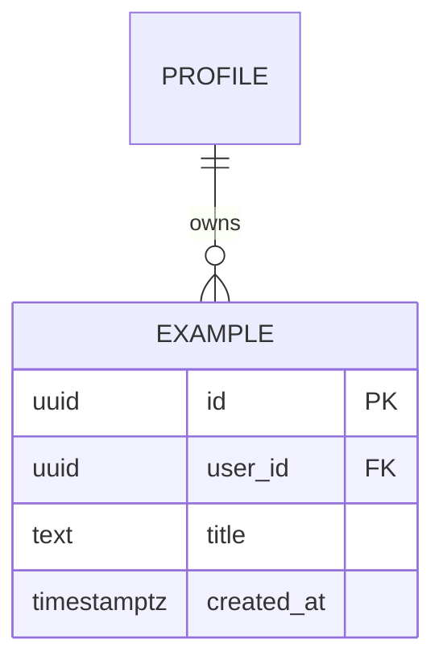

# ERD: F-xx <Feature name>

| Field | Value |
| --- | --- |
| Linked PRD | `docs/product/prd/F-xx-<name>.md` |
| Django app | `apps/api/modules/<name>` |
| Last updated | |

## 1. Diagram

## 2. Tables

For every table:

| Column | Type | Null | Default | Notes |
| --- | --- | --- | --- | --- |
| id | uuid | no | gen | PK |
| user_id | uuid | no | | references `auth.users.id` by value, scoped on every query |
| created_at | timestamptz | no | now() | |

Constraints and indexes: unique keys, check constraints, indexes for the main queries.

## 3. Relationships to existing modules

List foreign keys to `profiles`, taxonomy and other modules. Use the owning module's services, not its models, for writes.

## 4. Enumerations and reference data

Choices, seed data, who maintains them.

## 5. Query patterns

The 5 to 10 main reads and writes this design must make fast (these drive the indexes).

## 6. Storage

Files in Supabase Storage (bucket, path convention, size limit, retention, signed URL policy).

## 7. Security

Row level security stance (Django-only access by default), PII columns, retention and deletion.

## 8. Migration and rollout

Order of migrations, backfills, zero-downtime notes.
